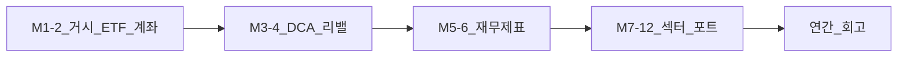
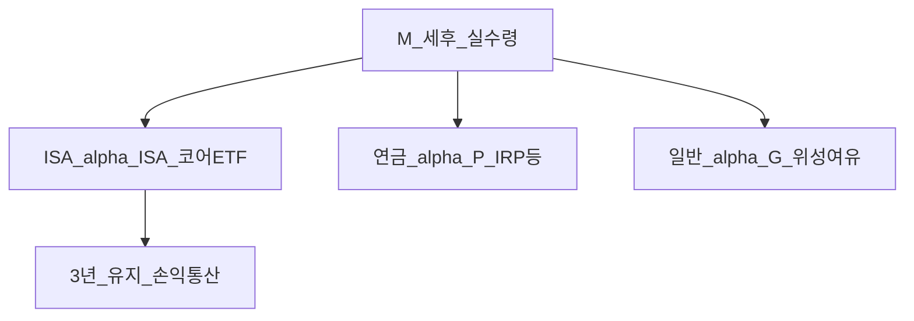

# AI 엔지니어 투자 플레이북 — 가상 1년 로드맵

> **면책**: 본 문서는 교육 목적이며, 특정 개인·법인에 대한 투자·세무·법률 자문이 아닙니다. 제도·세율·상품 조건은 변경될 수 있으므로 실행 전 금융위·국세청·취급 금융기관·공식 출처를 확인하세요. 본문의 **월별 배분·금액·인물·회사명**은 **가상의 AI 엔지니어 학습 시나리오**이며, 실제 연봉·잔고·계좌 정보를 넣지 마세요. **데이트레이딩·단기 매매를 권장하지 않습니다.**

## 메타

| 항목 | 내용 |
|------|------|
| 최종 검증일 | 2026-05-25 |
| 정책·법령 기준일 | 2025-12-31 확정, 2026 ISA·연금 개편안 별도 표기 |
| 난이도 | L3 (Deep) — [READER-GUIDE](../docs/READER-GUIDE.md) |
| 예상 읽기 시간 | 90~120분 (로드맵 설계·주간 루틴 포함) |
| 관련 bucket | Bucket 2a(DB) · 2b(IRP·ISA) · 3(코어 ETF) · 4(위성·섹터 상한) |
| 대상 독자 | **가상** AI/ML 엔지니어 — 산업 이해는 있으나 **개인 재무 데이터 없음** |

## 0. 이 편 읽기 전 (5분)

| 항목 | 내용 |
|------|------|
| **난이도** | L3 (Deep) — [READER-GUIDE §L등급](../docs/READER-GUIDE.md) |
| **선수** | [STUDY-START](STUDY-START.md), [DEPTH-STANDARD](../docs/DEPTH-STANDARD.md) |
| **이번 편에서 쓰는 기호** | 본문 §4·§4a 표 참고 |
| **복습 한 줄** | — |

## TL;DR

1. **1년 로드맵**: 1~2월 거시·ETF·계좌 → 3~4월 DCA·리밸런싱 → 5~6월 재무제표 → 7~12월 섹터·포트폴리오 통합.
2. **투자 철학**: **장기 지수·ETF 코어 OK**, **데이트레이딩·단타 NO** — [passive-vs-active](../04-portfolio/passive-vs-active.md) 정렬.
3. **세후 월 실수령 M** 배분: **ISA \(\alpha_\text{ISA}=0.50\)** · **연금 \(\alpha_\text{P}=0.30\)** · **일반 \(\alpha_\text{G}=0.20\)** — 계좌 우선순위·세제 방패.
4. **AI 엔지니어 엣지 섹터**: GPU·HBM·데이터센터(DC)·전력·클라우드 — [sectors](../03-markets/sectors/) 심화, **위성 상한** 준수.
5. **주간 거시 체크리스트** + 필독서(돈의 심리학, 부의 인문학, Little Book 시리즈) — 행동·역사 맥락.
6. 시작점: [STUDY-START.md](STUDY-START.md) · [master-roadmap.md](master-roadmap.md).

---

## 1. 한 줄 정의 + 왜 중요한가

**정의**: **AI 엔지니어 투자 플레이북**은 반도체·클라우드·전력 등 **기술 스택 이해**를 **장기 자산 형성 규칙**(패시브 코어, DCA, 계좌·세제, 섹터 위성 상한)에 **접목**하기 위한 **12개월 가상 커리큘럼**이다.

**왜 중요한가 (장기 자산 형성·bucket 연결)**:

| 함정 | 플레이북 대응 |
|------|----------------|
| “GPU 밸류체인을 안다” → **개별주 올인** | 코어 **지수 ETF** + 위성 **≤20%** — [core-satellite-framework](../04-portfolio/core-satellite-framework.md) |
| 뉴스·논문만 보고 **매매** | **주간 거시 체크** + **분기 리밸런싱**만 — 감정 배제 |
| DB 가입자인데 **ETF를 DB에서** 찾음 | DB는 **회사 운용** — [db-pension](../06-korea-policy/db-pension.md) · ISA/IRP 분리 |
| 해외 ETF **일반계좌**만 사용 | **ISA 3년·손익통산** — [isa](../06-korea-policy/isa.md) |

---

## 2. 선수 지식 / 이후 읽을 것

**선수**:
- [STUDY-START.md](STUDY-START.md)
- [DEPTH-STANDARD](../docs/DEPTH-STANDARD.md)
- [time-horizon-and-buckets](../04-portfolio/time-horizon-and-buckets.md)

**이후**:
- [financial-statements-study-roadmap](../01-foundations/financial-statements-study-roadmap.md) (5~6월)
- [isa-irp-practical-setup](../06-korea-policy/isa-irp-practical-setup.md)
- [rebalancing-and-dca](../04-portfolio/rebalancing-and-dca.md)
- [sectors/README.md](../03-markets/sectors/README.md)
- [quant-investing-intro](../08-advanced/quant-investing-intro.md) (선택·2년차)

---

## 3. 직관·비유

**코어 ETF** = 운영체제 커널 — 안정·업데이트(리밸런싱)로 **전체 시스템**이 돌아간다.

**섹터 위성** = 플러그인 모듈 — GPU 드라이버를 **직접 만든다**고 해서 커널 전체를 바꾸지 않는다. 모듈이 **20% 메모리**를 넘으면 OOM(과집중 리스크).

**DCA** = CI/CD 파이프라인의 **정기 배포** — “지금이 저점” 같은 **수동 배포(타이밍)** 는 장애(행동 편향)를 부른다.

**데이트레이딩** = 프로덕션 DB에 **무제한 쓰기 부하** — 이론상 이익보다 **다운타임(손실·세금·스트레스)** 비용이 크다.

---

## 4. 정식 개념·용어

| 용어 | English | 정의 |
|------|---------|------|
| 코어 | Core | 지수·글로벌 ETF 등 **분산·저비용** 중심 (Bucket 3) |
| 위성 | Satellite | 섹터·개별주 **제한 비중** (Bucket 4) |
| DCA | Dollar-Cost Averaging | **정기·정액** 적립 매수 |
| DB | Defined Benefit | 확정급여형 퇴직연금 — 재직 중 **개인 매매 불가** |
| ISA | Individual Savings Account | 개인종합자산관리계좌 — **3년·손익통산** |
| IRP | Individual Retirement Pension | 개인형퇴직연금 — **과세이연** |
| HBM | High Bandwidth Memory | AI 가속기 **고대역폭 메모리** |
| DC (섹터) | Data Center | **데이터센터** 인프라·전력·냉각 체인 |

### 4a. 핵심 용어 (본문 등장 순)

> 복습용. 정의는 §4 본표·[glossary](../00-roadmap/glossary.md)·본문 `!!! info` 박스.

| 용어 | 한 줄 | 관련 이론 | glossary |
|------|-------|-----------|----------|
| 코어 | 지수·글로벌 ETF 등 **분산·저비용** 중심 | §4 | [glossary](../00-roadmap/glossary.md#코어) |
| 위성 | 섹터·개별주 **제한 비중** | §4 | [glossary](../00-roadmap/glossary.md#위성) |
| DCA | **정기·정액** 적립 매수 | §4 | [glossary](../00-roadmap/glossary.md#dca) |
| DB | 확정급여형 퇴직연금 | §4 | [glossary](../00-roadmap/glossary.md#db) |
| ISA | 개인종합자산관리계좌 | §4 | [glossary](../00-roadmap/glossary.md#isa) |
| IRP | 개인형퇴직연금 | §4 | [glossary](../00-roadmap/glossary.md#irp) |
| HBM | AI 가속기 **고대역폭 메모리** | §4 | [glossary](../00-roadmap/glossary.md#hbm) |
| DC (섹터) | **데이터센터** 인프라·전력·냉각 체인 | §4 | [glossary](../00-roadmap/glossary.md#dc) |

---

## 5. 메커니즘 — 12개월 로드맵

### 5.1 월별 학습·실행 매트릭스

| 기간 | 학습 초점 | 실행(가상) | 산출물 |
|------|-----------|------------|--------|
| **1~2월** | [macroeconomics-basics](../02-economics/macroeconomics-basics.md) §0~§7, [macro-01](../02-economics/macro-01-gdp-accounts-growth.md) §6, [macro-04](../02-economics/macro-04-monetary-policy-qe.md) §8, [etf-index-funds](../03-markets/etf-index-funds.md) §5~§8, [isa](../06-korea-policy/isa.md) §7, [db-pension](../06-korea-policy/db-pension.md) §6 | 계좌 **지도** 작성(가상) | **주간 거시 체크리스트** v1 |
| **3~4월** | [rebalancing-and-dca](../04-portfolio/rebalancing-and-dca.md) §6~§8, [asset-allocation](../04-portfolio/asset-allocation.md) §8, [passive-vs-active](../04-portfolio/passive-vs-active.md) §10 | **M·α_ISA·α_P·α_G** 배분 시뮬 — 본 편 §6 | DCA·밴드 규칙 1페이지 |
| **5~6월** | [financial-statements-study-roadmap](../01-foundations/financial-statements-study-roadmap.md) + [intro](../01-foundations/financial-statements-intro.md) §6~§8 (한빛전자) | DART **1개 기업** 연습(가상) | 3표+주석 **1페이지 노트** |
| **7~8월** | [semiconductor](../03-markets/sectors/semiconductor.md), [ai-infrastructure](../03-markets/sectors/ai-infrastructure.md) | 위성 **테마 맵** | GPU·HBM **밸류체인** 다이어그램 |
| **9~10월** | [power-grid-electrification](../03-markets/sectors/power-grid-electrification.md), 클라우드·DC 전력 | 코어 vs 위성 **비중표** | 전력·DC **리스크 체크** |
| **11~12월** | [sector-investing-framework](../03-markets/sectors/sector-investing-framework.md), [portfolio-theory-mpt](../04-portfolio/portfolio-theory-mpt.md) 입문 | **연간 리밸런싱** 시뮬 | IPS 초안(가상) |

### 5.2 AI 엔지니어 엣지 섹터 (위성만)

| 테마 | 이해 포인트 | 문서 |
|------|-------------|------|
| **GPU** | CUDA 생태·대체 가속기·CapEx 사이클 | [semiconductor](../03-markets/sectors/semiconductor.md) |
| **HBM** | 패키징·수율·메모리 대역폭 병목 | 동일 + [ai-infrastructure](../03-markets/sectors/ai-infrastructure.md) |
| **DC** | 전력·PUE·지역 전력망·수주 | [ai-infrastructure](../03-markets/sectors/ai-infrastructure.md) |
| **전력** | 송배전·변압기·ESS | [power-grid-electrification](../03-markets/sectors/power-grid-electrification.md) |
| **클라우드** | Hyperscaler CapEx·마진·다중 테넌트 | [ai-infrastructure](../03-markets/sectors/ai-infrastructure.md) |

**규칙**: 산업 지식 = **공시·밸류에이션 검증** 도구. “안다” ≠ “몰빵한다”. [kosdaq-tier-system](../03-markets/kosdaq-tier-system.md) 유동성·공시 리스크 병행.

### 5.3 투자 스타일 경계

| 허용 | 금지 |
|------|------|
| 글로벌·국내 **지수 ETF** 장기 보유 | **데이트레이딩**, 레버리지 일상 도구화 |
| 분기·반기 **밴드 리밸런싱** | 뉴스 헤드라인 **당일 전량** 매매 |
| 위성 **≤20%** (가상 IPS) | QLD 등 **레버 ETF**를 코어 대체 — [leveraged-etf-qqq-qld](../04-portfolio/leveraged-etf-qqq-qld.md) |
| ISA·IRP **정책 한도** 내 적립 | 한도 초과 **무리한 일시 납입** |

---

## 6. 수식·모델 — 월 실수령 M 배분

> **가상 시나리오**: 세후 월 실수령 **M**(만 원). 독자는 **본인 M**으로 치환. DB 재직(개인 ETF는 DB 밖). 기호 정의: [DEPTH-STANDARD](../docs/DEPTH-STANDARD.md).

| 기호 | 이름 | 이 식에서 의미 |
|------|------|----------------|
|  \(alpha\)  |  alpha  | 본문 §4·위 식 맥락 참고 |
| \(ISA\) | Individual Savings Account | 개인종합자산관리계좌 |
|  \(P\)  |  P  | 가상 포트폴리오 규모(만 원) |
|  \(G\)  |  G  | 본문 §4·위 식 맥락 참고 |
|  \(월\)  |  월  | 본문 §4·위 식 맥락 참고 |
|  \(cdot\)  |  cdot  | 본문 §4·위 식 맥락 참고 |
|  \(M\)  |  M  | 가계 교육용 월 세후 소득 기호 |
|  \(연금\)  |  연금  | 본문 §4·위 식 맥락 참고 |
\[
\alpha_\text{ISA}+\alpha_\text{P}+\alpha_\text{G}=1,\quad
\text{ISA}_\text{월}=\alpha_\text{ISA}\cdot M,\quad
\text{연금}_\text{월}=\alpha_\text{P}\cdot M,\quad
\text{일반}_\text{월}=\alpha_\text{G}\cdot M
\]

**읽는 법**: 위 식의 기호는 바로 위 변수표와 같다. 숫자는 [DEPTH-STANDARD](../docs/DEPTH-STANDARD.md) 교육용 기호(M·P·PV 등)로 대입한다.
**교육용 비율(고정 아님)**: \(\alpha_\text{ISA}=0.50,\ \alpha_\text{P}=0.30,\ \alpha_\text{G}=0.20\).

| 슬롯 | 비율 | 가상 용도 | bucket |
|------|------|-----------|--------|
| ISA | \(\alpha_\text{ISA}\) | 해외·국내 **코어 ETF** DCA | 2b~3 |
| 연금(IRP/연금저축) | \(\alpha_\text{P}\) | 세액공제·**과세이연** | 2b |
| 일반 | \(\alpha_\text{G}\) | 한도 초과분·**위성**·환전 여유 | 3~4 |

**ISA 연 한도**: \(12\alpha_\text{ISA}M \stackrel{?}{\leq} L_\text{ISA}\) (2025 일반형 \(L_\text{ISA}=2{,}000\)만 — [isa](../06-korea-policy/isa.md)). 초과분은 **일반·연금**으로 우회 — [isa-irp-practical-setup](../06-korea-policy/isa-irp-practical-setup.md).

**DB 적립**은 회사·제도별 **별도**(M·α 슬롯에 미포함). DB 가입자 체크: [isa-irp-practical-setup](../06-korea-policy/isa-irp-practical-setup.md).

---

## 7. 한국 적용

### 7.1 2025년 기준 (확정·교육용 요약)

| 항목 | 일반형 ISA (교육용) | 비고 |
|------|---------------------|------|
| 연 납입 한도 | 2,000만원 | [isa](../06-korea-policy/isa.md) |
| 비과세(3년) | 200만원 (서민형 400만) | 초과 9.9% 분리과세 |
| DB 재직 | ETF **직접 매매 불가** | ISA·IRP에서 코어 |

### 7.2 2026년 개편·시행 예정 (해당 시)

| 항목 | 2025 | 2026 (시행 여부 **직접 확인**) |
|------|------|--------------------------------|
| ISA 비과세 | 200만/400만 | 500만/1,000만 (안) |
| 연 납입 | 2,000만 | 4,000만 (안) |

**법·정책 근거**: 소득세법·금융위 ISA 안내 — 실행 전 [국세청](https://www.nts.go.kr)·취급 증권사.

---

## 8. 숫자 예제 (가상)

> 인물 **가상의 AI 엔지니어 B**(29세, DB 가입, 개인정보 없음).

### 예제 1 — 1년 ISA 적립만

- 연 ISA 납입: \(12 \cdot \alpha_\text{ISA} M\). \(\alpha_\text{ISA}=0.50\)이면 \(6M\). **\(6M > L_\text{ISA}\)** 이면 초과 \(6M - L_\text{ISA}\)는 이월 불가·**일반·연금**으로 우회 설계.
- **교훈**: α 규칙은 **\(12\alpha_\text{ISA}M \leq L_\text{ISA}\)** 와 **월 현금흐름**을 동시에 체크. [isa-irp-practical-setup](../06-korea-policy/isa-irp-practical-setup.md).

### 예제 2 — 코어 80 / 위성 20

- 코어(ETF): 가상 포트 **P**의 80% = \(0.8P\)
- 위성(GPU 체인 ETF+개별주): \(0.2P\) 상한
- 반도체 급등으로 위성이 **28%**로 drift → **분기 리밸**로 위성 **매도** (세금: ISA vs 일반 차이)

### 예제 3 — “안다” 함정

- B가 HBM 뉴스 후 **일반계좌** 개별주 **40%** 매수 → [fomo-and-trading-hours](../05-behavioral/fomo-and-trading-hours.md) 패턴
- **교정**: 코어 유지, 위성 **20% 캡** 복귀, 공시 [reading-annual-reports-dart](../01-foundations/reading-annual-reports-dart.md)로 **FCF** 확인

---

## 9. 주간 거시 체크리스트 (30~45분)

매주 **같은 요일·같은 템플릿** (매매 아님, **관찰**).

| # | 항목 | 질문 | 문서 |
|---|------|------|------|
| 1 | 금리 | Fed·한국은행 기준금리·**금리 경로** 변화? | [macro-04](../02-economics/macro-04-monetary-policy-qe.md) |
| 2 | 인플레 | CPI·PCE **서프라이즈**? | [macro-02](../02-economics/macro-02-money-inflation.md) |
| 3 | 성장 | GDP·PMI·실업 **방향**? | [macro-01](../02-economics/macro-01-gdp-accounts-growth.md) |
| 4 | 환율 | 원/달러 **변동** → 해외 ETF 환노출 | [overseas-equities-intro](../03-markets/overseas-equities-intro.md) |
| 5 | 수익률 곡선 | 장단기 스프레드 **역전·완화**? | [yield-curve-strategies](../03-markets/yield-curve-strategies.md) |
| 6 | AI CapEx | Hyperscaler **CapEx 가이던스**? | [ai-infrastructure](../03-markets/sectors/ai-infrastructure.md) |
| 7 | 반도체 | 메모리·파운드리 **가동률·가격** 신호? | [semiconductor](../03-markets/sectors/semiconductor.md) |
| 8 | 전력 | 지역 **전력 수급·요금** 이슈? | [power-grid-electrification](../03-markets/sectors/power-grid-electrification.md) |
| 9 | 포트 drift | 코어/위성 **목표 대비**? | [rebalancing-and-dca](../04-portfolio/rebalancing-and-dca.md) |
| 10 | 행동 | FOMO·뉴스 **매매 충동** 0~5? | [investment-journal-psychology](../05-behavioral/investment-journal-psychology.md) |

**월 1회 추가**: ISA 납입 누적·3년 만기일·[account-product-tax-map](../06-korea-policy/tax/account-product-tax-map.md).

---

## 10. 필독서·심화 (행동·역사)

> **책 없이**: [required-reading-guide.md](required-reading-guide.md) — 챕터별 **읽을 부분·★ 우선순위·KB 링크** 압축.

| 도서 | 초점 | 플레이북 연결 |
|------|------|----------------|
| **돈의 심리학** (Morgan Housel) | 복리·행동·역사 | DCA·인내 — [behavioral-finance-complete](../05-behavioral/behavioral-finance-complete.md) |
| **부의 인문학** (인문·거시 계열) | 자본·불평등·제도 | 거시·정책 맥락 — [macroeconomics-basics](../02-economics/macroeconomics-basics.md) |
| **Little Book** 시리즈 (Greenblatt, Bogle 등) | 가치·인덱스·시장 | [passive-vs-active](../04-portfolio/passive-vs-active.md), [equity-valuation-fundamentals](../03-markets/equity-valuation-fundamentals.md) |

**읽기 순서 제안**: 1~2월 **돈의 심리학** → 3~4월 **Little Book (Bogle 편)** → 5~6월 공시 실습 병행 → 7월~ **부의 인문학** (주말). **요약만**: [required-reading-guide.md](required-reading-guide.md) §1-2 → §2-1 → §3-1.

---

## 11. FAQ

**Q1. AI 엔지니어라서 반도체 주식에 유리한가?**  
**A1.** **정보 우위는 과대평가**되기 쉽다. 기술 트렌드 ≠ **주가·밸류에이션·유동성**. 코어 ETF + 제한된 위성.

**Q2. α_ISA·α_P·α_G 비율을 바꿔도 되나?**  
**A2.** 본문 \(\alpha\)는 **교육용**. 실제는 **\(12\alpha_\text{ISA}M \leq L_\text{ISA}\)** ·연금 공제·비상금([emergency-fund](../01-foundations/emergency-fund.md)) 우선.

**Q3. DB인데 왜 ISA 50%?**  
**A3.** DB는 **운용권 없음**. 장기 코어·세제는 **ISA·IRP** — [db-pension](../06-korea-policy/db-pension.md).

**Q4. 데이트레이딩을 아예 하면 안 되나?**  
**A4.** 본 코퍼스는 **장기 자산 형성** 목표. 단기 매매는 **세금·심리·시간비용**이 구조적으로 불리 — 교육 문서 전반 정책.

**Q5. QQQ만 사도 되나?**  
**A5.** **코어 후보**일 수 있으나 **지역·채권·환율** 분산은 [geographic-diversification](../04-portfolio/geographic-diversification.md) 참고.

**Q6. HBM 테마 ETF vs 개별주?**  
**A6.** ETF = 분산·추적오차; 개별주 = **공시 리스크**. 위성 합산 **20%** 가상 캡.

**Q7. 주간 체크리스트가 길지 않나?**  
**A7.** **관찰만** 30분. 매매는 **분기 리밸** 규칙에만.

**Q8. 1년 끝나면?**  
**A8.** [quant-investing-intro](../08-advanced/quant-investing-intro.md)·[factor-investing-fama-french](../08-advanced/factor-investing-fama-french.md) 선택.

---

## 12. 함정·리스크·한계

- **확증 편향**: 본인 산업 뉴스만 소비 → 체크리스트 **10번 행동 점수** 필수.
- **레버리지 ETF**: [leveraged-etf-qqq-qld](../04-portfolio/leveraged-etf-qqq-qld.md) — 코어 대체 금지.
- **ISA 중도 해지**: 3년·비과세 상실 — [isa](../06-korea-policy/isa.md).
- **개인정보**: 플레이북·노트에 **실제 잔고·회사명** 기입 금지 — [DEPTH-STANDARD](../docs/DEPTH-STANDARD.md).
- **교육 한계**: M·α 비율은 **독자 치환용**이며 세무 확정 아님. 문서에 **구체 M 금액** 기입 금지.

---

## 13. 심화 읽기

- [STUDY-START.md](STUDY-START.md) — Day 1·1주차
- [sectors/README.md](../03-markets/sectors/README.md)
- [recommended-deep-study-roadmap](../03-markets/sectors/recommended-deep-study-roadmap.md)
- [references/sources.md](../references/sources.md)

---

## 14. 스스로 점검 퀴즈

1. DB 재직자가 **직접 ETF를 고를 수 있는** 계좌는?
2. \(\alpha_\text{ISA}=0.50\)일 때 ISA **월액**은? (M 대입)
3. 7~8월 학습 섹터 2개는?
4. 데이트레이딩이 본 플레이북에서 **NO**인 이유 1가지?
5. 주간 체크리스트 **10번** 항목은?

??? note "정답 힌트"

    1. ISA·IRP·일반( DB 아님 ) · 2. \(\alpha_\text{ISA} \cdot M\) (그리고 \(12\alpha_\text{ISA}M \leq L_\text{ISA}\) 검증) · 3. 반도체·AI 인프라 등 · 4. 세금·심리·시간비용 등 · 5. FOMO·뉴스 매매 충동

---

**L3 완료 기준**: [TEMPLATE](../docs/TEMPLATE.md) 12블록·FAQ 8+·mermaid 2+·가상 예제 3+ — 검증일 2026-05-25 — [DEPTH-STANDARD](../docs/DEPTH-STANDARD.md).