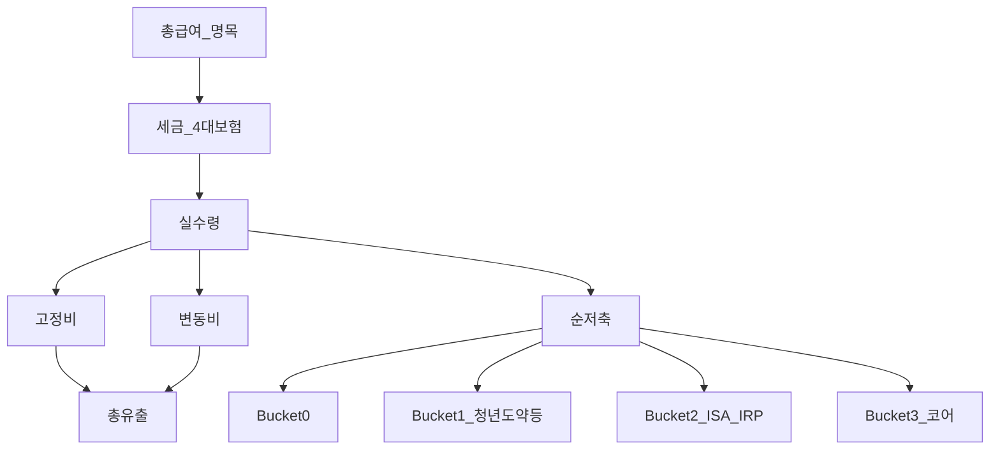
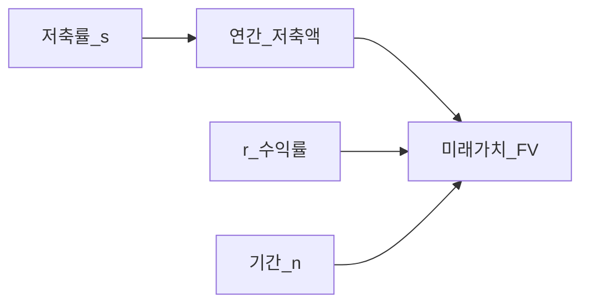
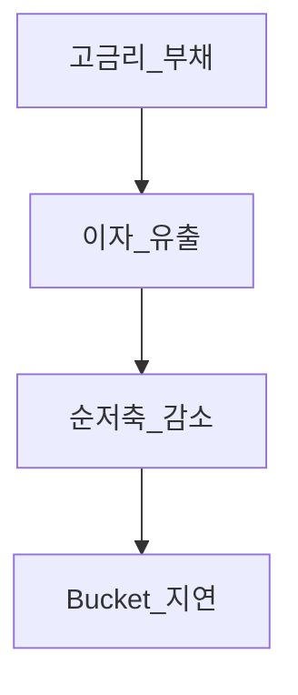

# 현금흐름 기초 — 가계·투자·Bucket 연결

> **면책**: 본 문서는 교육 목적이며, 특정 개인·법인에 대한 투자·세무·법률 자문이 아닙니다. 세율·공제·상품 조건은 변경될 수 있으므로 실행 전 공식 출처를 확인하세요.

## 메타

| 항목 | 내용 |
|------|------|
| 최종 검증일 | 2026-05-24 |
| 정책·법령 기준일 | 2025-12-31 확정, 2026 개편 별도 표기 |
| 난이도 | L3 (Deep) — [READER-GUIDE](../docs/READER-GUIDE.md) |
| 예상 읽기 시간 | 50~60분 |
| 관련 bucket | **Bucket 0~1** (남는 돈의 배분), 전 Phase |

## 0. 이 편 읽기 전 (5분)

| 항목 | 내용 |
|------|------|
| **난이도** | L3 (Deep) — [READER-GUIDE §L등급](../docs/READER-GUIDE.md) |
| **선수** | [compound-interest-and-time-value](compound-interest-and-time-value.md) |
| **이번 편에서 쓰는 기호** | M, FV, PMT, 저축률, Bucket |
| **복습 한 줄** | 저축률이 높을수록 복리 공식의 **PMT**(정기 납입)가 커져 **FV**가 커진다 |

## TL;DR

1. **현금흐름**은 일정 기간 **들어온 현금 − 나간 현금**이며, 장기 자산의 1순위 레버는 **저축률(소득 대비 남는 비율)** 이다.
2. 회사 **현금흐름표**와 가계 현금흐름은 **구조가 동형** — [financial-statements-intro](financial-statements-intro.md)와 연결해 읽는다.
3. Bucket은 “비중 %”보다 **채우는 순서**가 먼저: 0 비상금 → 1 정책 → 2 ISA/IRP → 3 코어 — [time-horizon-and-buckets](../04-portfolio/time-horizon-and-buckets.md).
4. **라이프스타일 크립**(소득↑ 지출도↑)은 저축률을 고정시키고 FV를 막는다 — [compound-interest-and-time-value](compound-interest-and-time-value.md).
5. 고금리 **부채 이자**는 현금흐름의 구멍 — [debt-and-interest](debt-and-interest.md)에서 먼저 막는다.

---

## 1. 한 줄 정의 + 왜 중요한가

**정의**: **현금흐름(Cash Flow)** 은 특정 기간(월·연) 동안 유입된 현금에서 유출된 현금을 뺀 **순현금 변화**이다. 개인 재무에서는 급여·부수입·이자·배당 등 **유입**과 생활비·세금·대출 상환·투자 납입 등 **유출**로 나눈다.

**왜 중요한가**:

!!! info "FV (Future Value, 미래가치)"
    [복리·시간가치](compound-interest-and-time-value.md)에서 말하는 **미래 시점의 목표 자산**. “10년 뒤 얼마”를 FV로 두고, 거꾸로 **지금 얼마를 넣을지(PMT·저축률)** 를 정한다.

!!! info "PMT (Payment, 정기 납입)"
    복리 공식에서 **매월·매년 같은 금액**으로 넣는 돈. 가계에서는 **비상금·ISA·ETF 자동이체 합**이 PMT에 해당한다. **실제로 통장에서 빠져나간 돈**이어야 한다.

!!! info "ETF (Exchange-Traded Fund)"
    지수·자산 **바구니**를 한 종목처럼 거래하는 상품. PMT로 넣는 대상 중 하나.

!!! info "Bucket (자금 슬롯)"
    시간·목적별 **자금 통**(0 비상금 → 3 코어 등). **채우는 순서**가 비중 %보다 먼저다.

| 이유 | 설명 |
|------|------|
| **미래가치(FV)에 들어가는 돈** | **PMT**가 [복리 공식](compound-interest-and-time-value.md#62-정기-납입기말-납입-연금-교육용)의 입력 — **수익률만큼** 중요 |
| **Bucket 실행** | 이론적 자산배분 없이 **매달 남는 돈**이 없으면 설계 불가 |
| **행동** | 카드·구독·고정비가 **저축률을 잠식** — [fomo-and-trading-hours](../05-behavioral/fomo-and-trading-hours.md) |

투자 앱의 수익률보다 **통장·카드 흐름**을 먼저 보면 장기 목표에 도달할 확률이 올라간다.

---

## 2. 선수 지식 / 이후 읽을 것

**선수**:
- [compound-interest-and-time-value.md](compound-interest-and-time-value.md)

**이후**:
- [emergency-fund.md](emergency-fund.md) — 순현금의 첫 목적지
- [debt-and-interest.md](debt-and-interest.md)
- [financial-statements-intro.md](financial-statements-intro.md)
- [asset-allocation.md](../04-portfolio/asset-allocation.md)
- [account-product-tax-map.md](../06-korea-policy/tax/account-product-tax-map.md)

---

## 3. 직관·비유

**수도꼭지와 배수구**: 소득이 꼭지, 지출이 배수구다. 배수구(고정비·구독·이자)가 크면 탱크(저축·투자)는 안 찬다.

**파이프라인**: 월급 → **세금·4대보험** → **생활비** → **부채 이자** → **남는 물**만 Bucket으로 간다. 앞 단계에 구멍이 있으면 뒤 Bucket은 **말뿐**이다.

**회사와 가계**: 회사도 “이익은 났는데 통장이 비었다”가 있다 — 현금흐름표가 그걸 설명한다([financial-statements-intro](financial-statements-intro.md)).

**저축률의 복리 효과**: 연봉 5,000만 원·저축률 20% vs 30%는 연 250만 원 차이처럼 보이지만, 20년·r=6%이면 FV 차이는 **수천만 원~억 원**대로 커질 수 있다([compound-interest-and-time-value](compound-interest-and-time-value.md)). “수익률 1%p 올리기”보다 **저축률 5%p 올리기**가 통제 가능한 경우가 많다.

**신용카드 = 다음 달 유출**: 결제일을 급여일 **다음 주**로 맞추면, 한 달치 지출이 **두 달에 겹쳐 보이는** 착시가 생긴다. 현금흐름표는 **발생**이 아니라 **현금 이동 시점** 기준으로 쓴다.

**15시간/주 학습**: 주 15시간을 시급 2만 원(가상)으로 환산하면 월 약 120만 원의 **기회비용**이다. 이 시간을 단타·NXT 장후 매매([korea-ats-nextrade](../03-markets/korea-ats-nextrade.md))에 쓰면 **코어 패시브**([passive-vs-active](../04-portfolio/passive-vs-active.md))와 궁합이 나쁠 수 있다. 현금흐름 관점에서 “시간 예산”도 배분 대상이다.

---

## 4. 정식 개념·용어

| 용어 | English | 정의 |
|------|---------|------|
| 총현금유입 | Cash inflow | 급여·부수입·이자 등 |
| 총현금유출 | Cash outflow | 생활·세금·상환·납입 |
| 순현금흐름 | Net cash flow | 유입 − 유출 |
| 저축률 | Savings rate | (소득−지출)/소득, 또는 순저축/소득 |
| 고정비 | Fixed expenses | 월세·보험·통신·대출 원리금 |
| 변동비 | Variable expenses | 식비·취미·의류 |
| 실수령 | Take-home pay | 세후·공제 후 급여 |
| 기회비용 | Opportunity cost | 시간·돈의 대체 용도 가치 |

## 4a. 핵심 용어 (본문 등장 순)

| 용어 | 한 줄 | 관련 이론 | glossary |
|------|-------|-----------|----------|
| 현금흐름 | 기간 유입−유출의 순변화 | 현금기준 | — |
| 저축률 | (소득−지출)/소득; FV의 1순위 레버 | 저축·복리 | — |
| Bucket | 비상금→정책→ISA→코어 채우는 순서 | 자금통 | [Bucket](../00-roadmap/glossary.md#bucket-자금-통) |
| 순현금흐름 | 총유입−총유출 | 가계재무 | — |
| 고정비·변동비 | 월세·대출 vs 식비·취미 | 예산 | — |
| 실수령 | 세후·공제 후 급여 | 소득 | — |
| 복리·FV | PMT(실제 납입)가 미래가치를 결정 | TVM | [복리](compound-interest-and-time-value.md) |
| 라이프스타일 크립 | 소득↑에 지출도↑; 저축률 정체 | 행동 | [행동금융](../05-behavioral/behavioral-finance-complete.md) |
| 부채 이자 | 현금흐름 구멍; 상환 우선 | 레버리지 | [debt-and-interest](debt-and-interest.md) |
| OCF(기업) | 회사 영업현금; 가계와 동형 비유 | 3표 | [financial-statements-intro](financial-statements-intro.md) |
| 기회비용 | 시간·돈의 대체 용도 가치 | 경제학 | — |

## 4b. 관련 이론 미니맵

- **[복리·시간가치](compound-interest-and-time-value.md)** — 저축률·PMT·FV 수식
- **[비상금](emergency-fund.md)** — Bucket 0 순현금 목적지
- **[재무제표 입문](financial-statements-intro.md)** — 기업 OCF와 가계 동형
- **[자산배분](../04-portfolio/asset-allocation.md)** — 남는 돈이 있어야 비중 설계
- **[행동금융](../05-behavioral/behavioral-finance-complete.md)** — FOMO·구독이 저축률 잠식

---

## 5. 메커니즘

### 5.1 개인 현금흐름 → Bucket

### 5.2 저축률과 FV (개념)

**핵심**: 동일 r·n에서 **저축률 10%p 차이**는 10년 후 자산 격차를 **수익률 몇 %p**와 맞먹을 수 있다.

### 5.3 부채가 현금흐름을 잠식

---

## 6. 수식·모델

**저축률**:

| 기호 | 이름 | 이 식에서 의미 |
|------|------|----------------|
|  \(s\)  |  s  | 소득 대비 남는 비율 |
|  \(Y\)  |  Y  | 기간 총 실수령·매출 등 |
|  \(C\)  |  C  | 기간 총 현금 유출 |
\[
s = \frac{Y - C}{Y} = 1 - \frac{C}{Y}
\]

**읽는 법**: 위 식의 기호는 바로 위 변수표와 같다. 숫자는 [DEPTH-STANDARD](../docs/DEPTH-STANDARD.md) 교육용 기호(M·P·PV 등)로 대입한다.
- \(Y\) = 기간 소득(실수령 권장)
- \(C\) = 기간 총지출

**연간 저축액**: \( S = s \times Y \)

**FV 연결** (정기 납입 근사):

| 기호 | 이름 | 이 식에서 의미 |
|------|------|----------------|
| \(FV\) | 미래가치 | 미래 시점의 목표·결과 금액 |
| \(S\) | S | 소득 대비 남는 비율 |

\[
FV \approx S \times \frac{(1+r)^n - 1}{r}
\]

**읽는 법**: 위 식의 기호는 바로 위 변수표와 같다. 숫자는 [DEPTH-STANDARD](../docs/DEPTH-STANDARD.md) 교육용 기호(M·P·PV 등)로 대입한다.
상세는 [compound-interest-and-time-value](compound-interest-and-time-value.md).

**50/30/20 규칙 (교육용, 미국 유래)**:

| 비율 | 용도 |
|------|------|
| 50% | 필요 |
| 30% | 원함 |
| 20% | 저축·투자 |

한국 가계·전세·학자금 환경에 맞게 **조정**한다.

---

## 7. 한국 적용

### 7.1 2025년 기준 (확정)

| 항목 | 현금흐름 설계 포인트 |
|------|---------------------|
| **4대보험·소득세** | **실수령** 기준 예산 — 명목 연봉 착각 금지 |
| **청년도약** | 월 납입 상한·가입 요건 — Bucket 1에 **우선 배정** — [youth-leap-account](../06-korea-policy/youth-leap-account.md) |
| **ISA·IRP** | 연 납입 한도·세액공제 — Bucket 2 — [isa](../06-korea-policy/isa.md), [isa-irp-pension-tax](../06-korea-policy/tax/isa-irp-pension-tax.md) |
| **신용카드** | **결제일·할부** = 다음 달 유출 — 유출 시점 착각 |
| **전세·주택** | 보증금·대출 원리금 — 별도 목표 — [real-estate-basics](../07-real-estate/real-estate-basics.md) |
| **DB/DC** | 회사 부담금은 **개인 현금흐름 유입이 아님** — [db-vs-dc-pension](../06-korea-policy/db-vs-dc-pension.md) |

### 7.2 2026년 개편·시행 예정 (해당 시)

| 항목 | 2025 | 2026 (공식 확인) |
|------|------|------------------|
| 최저임금·세법 | 연말정산·공제 | 실수령 \(Y\) 재추정 |
| ISA·연금 한도 | 운영 중 | 한도 변경 시 **PMT** 조정 |

**법·정책 근거**: 소득세법, 4대보험법, 각 상품 약관 — [references/sources.md](../references/sources.md).

### 7.3 연봉 협상·이직과 현금흐름

명목 연봉 10% 인상이어도 (1) **4대보험 상한**, (2) **퇴직금·복지 축소**, (3) **근무지 이동 비용**이 있으면 **실수령·순저축**이 덜 오를 수 있다. 이직 전에 **12개월 현금흐름**을 시뮬레이션하고, Bucket 0이 **6개월 미만**이면 이직 시점을 조정하거나 퇴직금·IRP 이전 일정을 [db-pension](../06-korea-policy/db-pension.md)과 함께 본다.

### 7.4 구독·고정비 감사 (분기 1회)

| 항목 | 질문 |
|------|------|
| OTT·클라우드 | 3개월 미사용 서비스 해지? |
| 통신·보험 | 요금제·특약 **재견적**? |
| 배달·카페 | 변동비 상한 **주간 캡**? |

절감액 100%를 Bucket 3에 넣기보다 **고금리 부채 → 0 → 2b** 순으로 흡수하면 FV 레버가 커진다.

### 7.5 회사 복지와 현금흐름

식대·복지포인트·경조사 지원은 **유출 감소**이지 유입이 아니다. DC **기여금**은 회사 비용이지만 가입자에게는 **장기 FV** 슬롯 — [dc-pension](../06-korea-policy/dc-pension.md). 개인 현금흐름 표에 “회사 적립” 행을 넣으면 **이중 계상**되므로 **주석**으로만 기록한다.

---

## 8. 숫자 예제 (가상)

> [DEPTH-STANDARD](../docs/DEPTH-STANDARD.md) 교육용 기호만 사용한다. **M**=월 세후 실수령(만 원), **R**=월 주거, **C**=생활·변동, **B**=비상금 이체, **T**=투자·ISA 이체.

### 예제 1: A vs B — 같은 M, 다른 저축률 \(s\)

| | 가상 A | 가상 B |
|--|--------|--------|
| 월 실수령 \(M\) | 동일 | 동일 |
| 월 지출 | \(0.7M\) | \(0.9M\) |
| **저축률 \(s\)** | **30%** | **10%** |
| 월 저축 \(sM\) | \(0.3M\) | \(0.1M\) |

10년·\(r=6\%\) 가정 시 FV는 A가 B의 **약 3배**에 가깝다(교육용) — **수익률을 맞춰도 저축률이 지배**.

### 예제 2: 가상 C — M 상승 + 라이프스타일 크립

| 시점 | \(M\) | 지출 | \(s\) |
|------|-------|------|-------|
| 1년차 | \(M_0\) | \(0.8M_0\) | 20% |
| 3년차 | \(1.25M_0\) | \(0.92M_0\) | **8%** |

승진했지만 PMT(실제 이체)는 **감소** — “번 것 같지 않다”.

### 예제 3: 월 현금흐름표 (가상 D)

| 유입·유출 | 기호·금액(만 원) |
|-----------|------------------|
| 실수령 | \(M\) |
| 월세·관리비 | \(R\) |
| 식비·생활 | \(C\) |
| ISA·ETF | \(T\) |
| 비상금 | \(B\) |
| **순현금** | \(M - R - C - T - B\) (버퍼) |

광의 저축률 \(= (B+T)/M\). 본인 \(M\)에 대입해 표를 채운다.

### 예제 4: 연 보너스 \(B_{bonus}\) (가상 E)

| 배분 | 비율(교육) | 이유 |
|------|------------|------|
| 비상금 보강 | \(0.25 B_{bonus}\) | Bucket 0 미달 |
| 카드 상환 | \(0.2 B_{bonus}\) | 고금리 — [debt-and-interest](debt-and-interest.md) |
| ISA 일시 | \(0.4 B_{bonus}\) | \(L_{ISA}\) 한도 내 |
| 여가 | \(0.15 B_{bonus}\) | 번아웃 방지 |

### 예제 5: 연말정산 환급 \(R_{tax}\) (가상 F)

| 배분 | 비율 |
|------|------|
| IRP 추가 | \(0.6 R_{tax}\) |
| 비상금 | \(0.25 R_{tax}\) |
| 학습·도서 | \(0.15 R_{tax}\) |

환급은 **보너스**와 동일하게 Bucket 순서 적용 — 일시 소비에 흡수되기 쉬움.

### 월간 현금흐름 템플릿 (기호)

| 구분 | 항목 | 금액 |
|------|------|------|
| 유입 | 실수령 | \(M\) |
| 유출 | 고정비 합 | \(R + \text{고정}\) |
| 유출 | 변동비 합 | \(C\) |
| 유출 | 부채 이자·원금 | \(D\) |
| **순현금** | | \(M - R - C - D - T - B\) |
| 배분 | Bucket 0 | \(B\) |
| 배분 | Bucket 1·2 | \(T\) |

**저축률** \(= (B+T)/M\). 본인 수치로 표를 채운다.

### 자동화 순서 (교육용)

급여일 **당일 오전**에 저축부터 빼면 lifestyle creep를 구조적으로 줄인다.

**현금흐름 vs P&L (가계)**: “이번 달 장보기 80만”은 **현금 유출**이고, “투자 평가손익 +50만”은 **미실현**이다. 가계 현금흐름표에는 **실제 이체된 금액**만 넣어 저축률을 과대 추정하지 않는다.

---

## 9. FAQ

**Q1. 가계부 앱을 꼭 써야 하나요?**  
**A1.** **아니다.** 카테고리 50개보다 **월 실수령·총지출·저축률 한 줄**이면 충분한 경우가 많다.

**Q2. 보너스는 어떻게 넣나요?**  
**A2.** Bucket 0 보강 → 고금리 부채 → 2b·3 — **일시 소비 전액**은 장기 FV에 불리.

**Q3. 부채 상환 vs ISA 납입?**  
**A3.** 카드·현금서비스 **15%p+** 는 상환 우선. 학자금 3% 등은 **병행** 가능(여유 있을 때) — [debt-and-interest](debt-and-interest.md).

**Q4. 연봉이 올랐는데 저축이 안 늘어요.**  
**A4.** **라이프스타일 크립** — 승진 시 **저축률 %를 먼저** 고정(예: 25% 자동이체).

**Q5. 주 15시간 공부는 현금흐름에 포함되나요?**  
**A5.** **기회비용** — 시간을 코어 패시브·[passive-vs-active](../04-portfolio/passive-vs-active.md)에 쓸지, 단타에 쓸지 선택.

**Q6. DB 회사 적립금은 저축률에 넣나요?**  
**A6.** **개인 PMT와 별도**로 “회사 제공 복리” 슬롯 — 본인 ISA·IRP는 추가 설계 — [db-pension](../06-korea-policy/db-pension.md).

**Q7. 배우자 소득은 합산하나요?**  
**A7.** 가계 단위면 **합산 현금흐름**으로 Bucket 설계. 문서는 **가상 단일 가구** 기준.

**Q8. 프리랜서·3.3% 원천징수는?**  
**A8.** **변동 소득** — 비상금 N 상향, 분기별 **세금 적립 통** 별도([emergency-fund](emergency-fund.md)).

**Q9. “저축률 50%” 챌린지가 좋나요?**  
**A9.** 지속 가능한 **s** 가 최적. 번아웃·사회적 지출 붕괴 시 **중도 포기** 위험.

**Q10. 투자 손실이 나면 저축률을 올려야 하나요?**  
**A10.** **PMT 유지**가 복리에 유리한 경우가 많다. 다만 **고금리 부채**·비상금 미달이면 우선순위를 [debt-and-interest](debt-and-interest.md)·[emergency-fund](emergency-fund.md)로 돌린다.

---

## 10. 함정·리스크·한계

- 수입만 늘리고 **지출 동반** — 저축률 정체
- 투자 **수익 기대**로 저축 축소 — PMT 감소가 FV에 치명적
- **신용카드** 결제일 착각 → 월 저축률 과대 추정
- **명목 연봉**으로 ISA 납입 계획 → 실수령 부족
- 가계부 완벽주의 → **포기** — 80% 데이터로 100% 실행이 낫다
- 회사 **스톡옵션·RSU**는 유동성·세금 시점 별도
- **명목 연봉**만 추적하고 **실수령·순저축**을 안 보면 승진·보너스 효과가 **제로**일 수 있음
- 배우자·파트너와 **지출 가시성**을 맞추지 않으면 가구 합산 s가 **과대 추정**될 수 있음

---

## 11. 심화 읽기

- [references/sources.md](../references/sources.md)
- [financial-statements-intro.md](financial-statements-intro.md) — 영업CF·투자CF·재무CF
- [rebalancing-and-dca.md](../04-portfolio/rebalancing-and-dca.md)
- 교재: 『부자 아빠 가난한 아빠』(현금흐름 사분면), 『돈의 심리학』
- [youth-leap-account](../06-korea-policy/youth-leap-account.md) — Bucket 1 월 PMT

### 연간 리뷰 (가상 일정)

| 월 | 행동 |
|----|------|
| 1월 | 전년 **실수령·지출·s** 확정 |
| 3·6·9·12월 | 구독·보험 감사 |
| 5월 | 연말정산 **환급/추납** 시뮬 |
| 12월 | 내년 ISA·IRP **한도** PMT 배정 |

연간 리뷰 때 **명목 연봉·실수령·순저축** 세 줄만 비교해도 lifestyle creep를 조기에 잡을 수 있다.

---

## 12. 스스로 점검 퀴즈

1. 저축률 25%의 의미는? (실수령 400만 원일 때 월 저축은?)
2. Bucket 순서를 현금흐름과 한 문장으로 연결하라.
3. 라이프스타일 크립이란?
4. 고금리 카드 잔액이 있을 때 ISA와 우선순위는?
5. DB 회사 적립금을 개인 월 저축액에 포함해야 하나?
6. 급여일 자동이체를 저축보다 지출 뒤에 두면 어떤 함정이 생기나?

??? note "정답 힌트"

    1. 소득의 25% 저축 · 월 100만 원 · 2. 남는 순저축부터 0→1→2→3 · 3. 소득↑에 지출도↑해 저축률 하락 · 4. 카드 상환 우선 · 5. 아니오(별도 슬롯) · 6. lifestyle creep·저축 잔여 부족