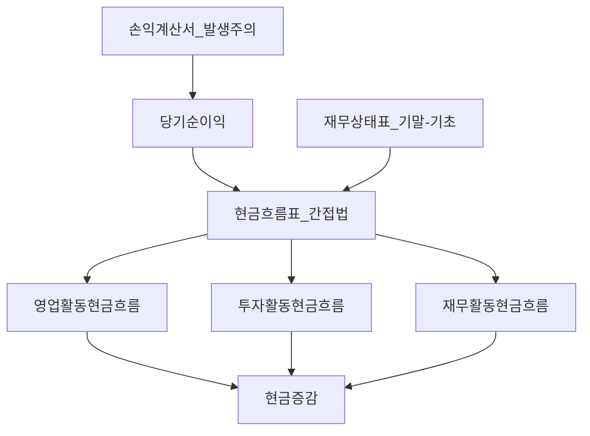
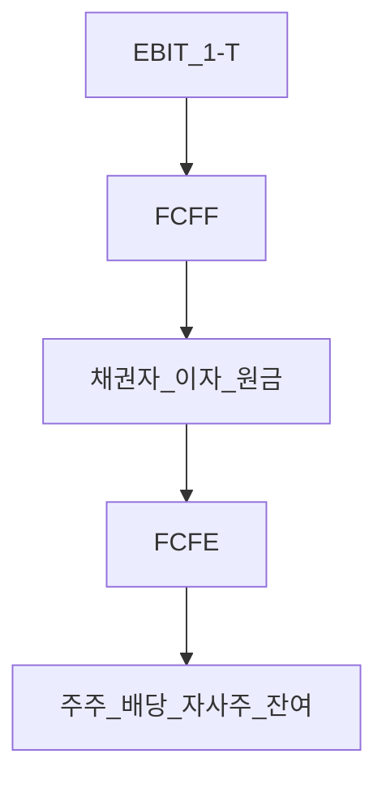

# 현금흐름표·영업현금흐름·잉여현금흐름 (OCF·CAPEX·FCF·FCFF·FCFE)

> **면책**: 본 문서는 교육 목적이며, 특정 개인·법인·종목에 대한 투자·세무·법률 자문이 아닙니다. K-IFRS·공시·세율·상품 조건은 변경될 수 있으므로 실행 전 [DART](https://dart.fss.or.kr) 등 공식 출처를 확인하세요.

## 메타

| 항목 | 내용 |
|------|------|
| 최종 검증일 | 2026-05-24 |
| 정책·법령 기준일 | 2025-12-31 확정 (K-IFRS), 2026 개편 별도 표기 |
| 난이도 | L4 (Graduate) — [READER-GUIDE](../docs/READER-GUIDE.md) |
| 예상 읽기 시간 | 140~170분 |
| 관련 bucket | Phase 1~2 — **Bucket 4 위성**·섹터·채권·밸류에이션 선수 |

## 0. 이 편 읽기 전 (5분)

| 항목 | 내용 |
|------|------|
| **난이도** | L4 (Graduate) — [READER-GUIDE §L등급](../docs/READER-GUIDE.md) |
| **선수** | [financial-statements-intro](financial-statements-intro.md), [cash-flow-basics](cash-flow-basics.md) |
| **이번 편에서 쓰는 기호** | M, FV, PMT, 저축률, Bucket |
| **복습 한 줄** | L3 선수 편을 먼저 읽으면 수식이 수월함 |

> **가상 사례 회사**: 본 Phase 재무제표 심화 편은 **「가상 주식회사 한빛전자」** (가상의 코스피 제조·전자 부품) 숫자로 3표·DART·FCF를 **같은 스레드**로 읽는다. 실제 종목·실적이 아니다.
## TL;DR

1. **현금흐름표(CFS)** 는 **현금 기준**으로 기업의 **영업·투자·재무** 활동을 분류하며, 손익계산서의 **발생주의**와 **시차**를 메운다.
2. **영업현금흐름(OCF)** 은 본업에서 **실제로 들어온 현금**의 핵심 지표 — **당기순이익 + 비현금비용 ± 운전자본**이 교육용 골격이다.
3. **CAPEX(자본적 지출)** 는 성장·유지를 위한 **설비·무형자산 투자** — OCF에서 빼면 **FCF(잉여현금흐름)** 에 가까워진다.
4. **FCFF**는 **전체 자본** 관점(기업 가치), **FCFE**는 **주주** 관점(주식 가치) — **부채·이자·차입** 처리가 다르다 ([time-value-npv-irr](time-value-npv-irr.md)와 연결).
5. **밸류에이션**은 궁극적으로 **미래 현금흐름의 현재가치** — 이익만 보면 **반도체 사이클**·**채권**·**주식** 리스크를 놓칠 수 있다 ([financial-statements-intro](financial-statements-intro.md), [semiconductor](../03-markets/sectors/semiconductor.md)).

---

## 1. 한 줄 정의 + 왜 중요한가

**정의**: **현금흐름표(Statement of Cash Flows)** 는 일정 기간 기업의 **현금 및 현금성자산**이 **어디서 들어오고 어디로 나갔는지**를 **영업·투자·재무** 활동으로 나누어 보고한다. **영업현금흐름(Operating Cash Flow, OCF)** 은 그중 **본업**에서 발생한 순현금이고, **잉여현금흐름(Free Cash Flow, FCF)** 은 (정의에 따라) OCF에서 **성장·유지 투자(CAPEX)** 등을 뺀, **투자자에게 “남는” 현금**의 근사치이다.

**왜 중요한가 (장기 자산 형성·밸류에이션)**:

| 이유 | 설명 |
|------|------|
| **이익의 한계** | 매출 인식·감가·충당·재고·외상이 **순이익**과 **통장**을 어긋나게 함 — [financial-statements-analysis](financial-statements-analysis.md) **이익 품질** |
| **주식·채권 공통** | 주주는 **FCFE·배당·자사주**, 채권자는 **이자·원금** — 근원은 **기업 현금창출** ([bonds-fixed-income](../03-markets/bonds-fixed-income.md)) |
| **DCF·NPV** | 기업가치 = **미래 FCFF** 할인 — [time-value-npv-irr](time-value-npv-irr.md) |
| **사이클 산업** | 반도체 **CAPEX 선행 → OCF 후행** — 정점 **영업이익**과 **FCF** 괴리 ([semiconductor](../03-markets/sectors/semiconductor.md)) |
| **가계와 동형** | [cash-flow-basics](cash-flow-basics.md)의 “남는 돈” = 기업의 **FCF**에 해당하는 개념 |

**핵심**: 시장은 장기적으로 **현금창출 능력**에 가격을 매긴다. 단기에는 **밸류에이션·금리·심리**가 앞서지만, **지속 불가능한 이익**은 결국 **주가·신용스프레드**에 반영된다.

---

## 2. 선수 지식 / 이후 읽을 것

**선수**:
- [financial-statements-intro](financial-statements-intro.md) — 3대 재무제표·K-IFRS·DART
- [cash-flow-basics](cash-flow-basics.md) — 가계 현금흐름·저축률
- [compound-interest-and-time-value](compound-interest-and-time-value.md) — 할인·복리
- [debt-and-interest](debt-and-interest.md) — 이자·부채

**이후**:
- [financial-statements-analysis](financial-statements-analysis.md) — 비율·ROIC·이익 품질
- [time-value-npv-irr](time-value-npv-irr.md) — DCF·NPV·IRR
- [stocks-equities-intro](../03-markets/stocks-equities-intro.md) — PER·EPS·주주환원
- [bonds-fixed-income](../03-markets/bonds-fixed-income.md) — 이표·만기·신용
- [semiconductor](../03-markets/sectors/semiconductor.md) — CAPEX·가동률·재고

---

## 3. 직관·비유

**손익계산서 = 성적표, 현금흐름표 = 통장 내역**: 시험(회계)에서 **만점(순이익)** 을 받았어도, **학원비(CAPEX)** 를 카드로 냈다면 통장은 비어 있다. **외상매출**은 “점수는 올랐는데 돈은 아직”이다.

**OCF = 본업 수도꼭지**: 제품을 팔아 **실제 입금**된 돈에서, **공급업체·직원·세금** 등 본업 관련 **출금**을 뺀 **순유입**. 꼭지가 막히면(운전자본 악화) 이익이 나도 **현금 고갈**이다.

**CAPEX = 공장·장비 확장 공사**: 반도체 **fab 증설**은 수년 **투자활동 유출** — 당기 **영업이익**은 좋아도 **FCF**는 깊은 마이너스일 수 있다. 투자자는 “이 CAPEX가 **미래 OCF**를 키우는가, **과잉 설비**인가”를 묻는다.

**FCFF vs FCFE = 회사 전체 vs 주주 몫**: **FCFF**는 **채권자·주주 모두**에게 갈 수 있는 **총 파이**에 가깝고, **FCFE**는 **이자·원금 상환 후 주주**에게 남는 **조각**이다. **레버리지**가 높으면 FCFF는 양호해도 **FCFE**는 위험할 수 있다.

**밸류에이션 = 미래 통장 입금의 할인합**: [stocks-equities-intro](../03-markets/stocks-equities-intro.md)의 PER은 **단기 이익** 근사, **DCF**는 **장기 FCF** 근사 — 금리([bonds-fixed-income](../03-markets/bonds-fixed-income.md))가 **할인율**을 올리면 **동일 FCF**도 **현재가치**는 내려간다.

---

## 4. 정식 개념·용어

| 용어 | English | 정의 |
|------|---------|------|
| 현금흐름표 | Statement of Cash Flows | 현금 유입·유출을 활동별로 분류한 표 |
| 영업활동 | Operating activities | 본업·운전자본·이자·배당(분류는 기준별 상이) |
| 투자활동 | Investing activities | CAPEX·M&A·금융자산 매매 등 |
| 재무활동 | Financing activities | 차입·상환·증자·배당·자사주 등 |
| OCF | Operating Cash Flow | 영업활동 순현금흐름 |
| CAPEX | Capital Expenditure | 유형·무형자산 취득 등 자본적 지출 |
| FCF | Free Cash Flow | (정의별) OCF − 유지·성장 투자 등 |
| FCFF | Free Cash Flow to Firm | 전체 자본에 귀속되는 잉여현금 |
| FCFE | Free Cash Flow to Equity | 주주에 귀속되는 잉여현금 |
| 운전자본 | Working Capital | 유동자산 − 유동부채 (운영 관련) |
| ΔNWC | Change in Net Working Capital | 운전자본 증감 |
| D&A | Depreciation & Amortization | 감가상각·무형상각 (비현금) |
| 직접법 | Direct method | 영업CF를 현금 수취·지급으로 표시 |
| 간접법 | Indirect method | 당기순이익에서 조정 |
| 유지 CAPEX | Maintenance Capex | 기존 생산능력 유지 투자 |
| 성장 CAPEX | Growth Capex | 신규 능력·신사업 투자 |

### 4a. 핵심 용어 (본문 등장 순)

> 복습용. 정의는 §4 본표·[glossary](../00-roadmap/glossary.md)·본문 `!!! info` 박스.

| 용어 | 한 줄 | 관련 이론 | glossary |
|------|-------|-----------|----------|
| 현금흐름표 | 현금 유입·유출을 활동별로 분류한 표 | §4 | [glossary](../00-roadmap/glossary.md#현금흐름표) |
| 영업활동 | 본업·운전자본·이자·배당 | §4 | [glossary](../00-roadmap/glossary.md#영업활동) |
| 투자활동 | CAPEX·M&A·금융자산 매매 등 | §4 | [glossary](../00-roadmap/glossary.md#투자활동) |
| 재무활동 | 차입·상환·증자·배당·자사주 등 | §4 | [glossary](../00-roadmap/glossary.md#재무활동) |
| OCF | 영업활동 순현금흐름 | §4 | [glossary](../00-roadmap/glossary.md#ocf) |
| CAPEX | 유형·무형자산 취득 등 자본적 지출 | §4 | [glossary](../00-roadmap/glossary.md#capex) |
| FCF |  | §4 | [glossary](../00-roadmap/glossary.md#fcf) |
| FCFF | 전체 자본에 귀속되는 잉여현금 | §4 | [glossary](../00-roadmap/glossary.md#fcff) |
| FCFE | 주주에 귀속되는 잉여현금 | §4 | [glossary](../00-roadmap/glossary.md#fcfe) |
| 운전자본 | 유동자산 − 유동부채 | §4 | [glossary](../00-roadmap/glossary.md#운전자본) |
| ΔNWC | 운전자본 증감 | §4 | [glossary](../00-roadmap/glossary.md#δnwc) |
| D&A | 감가상각·무형상각 | §4 | [glossary](../00-roadmap/glossary.md#d&a) |
| 직접법 | 영업CF를 현금 수취·지급으로 표시 | §4 | [glossary](../00-roadmap/glossary.md#직접법) |
| 간접법 | 당기순이익에서 조정 | §4 | [glossary](../00-roadmap/glossary.md#간접법) |
| 유지 CAPEX | 기존 생산능력 유지 투자 | §4 | [glossary](../00-roadmap/glossary.md#유지-capex) |

**K-IFRS 참고**: 한국 상장사 **현금흐름표**는 [financial-statements-intro](financial-statements-intro.md)와 같이 **K-IFRS**·**DART** 공시. **이자·배당**의 **영업 vs 재무** 분류는 **IFRS**와 **US GAAP**에서 **차이**가 있을 수 있어 **해외 종목** 비교 시 **주의**.

---

## 5. 메커니즘

### 5.1 삼표 연결 — “어디서 현금이 갔나”

**메시지**: **순이익**은 출발점일 뿐, **재고·매출채권·매입채무** 변동(운전자본)과 **CAPEX**가 **현금**을 흡수·방출한다.

### 5.2 간접법 — 당기순이익 → OCF

**운전자본**: **매출채권↑·재고↑** → 현금 **유출**(조정 시 차감), **매입채무↑** → 현금 **유입**(조정 시 가산).

### 5.3 FCFF vs FCFE — 자본 구조

**직관**: **FCFF**로 **기업 전체**를 평가한 뒤 **순부채**를 빼면 **주식 가치**에 가깝게 연결(교육용); 또는 **FCFE**를 직접 할인.

### 5.4 활동별 대표 항목

| 활동 | 대표 유입 | 대표 유출 |
|------|-----------|-----------|
| 영업 | 매출 수금, 이자·배당 수취(분류 주의) | 원가·인건비·세금, ΔNWC 효과 |
| 투자 | 자산·자회사 처분 | **CAPEX**, M&A, 금융자산 매입 |
| 재무 | 차입·유상증자 | 상환·배당·자사주 |

### 5.5 CAPEX와 감가상각

**감가상각**은 손익계산서 **비용**이지만 **현금 유출이 아님** → 간접법에서 **가산**. **CAPEX**는 **현금 유출**이지만 당기 손익에는 **한 번에** 안 잡히고 **자산**으로 **자본화** 후 **감가** — **이익↑ vs 현금↓** 괴리의 핵심.

**유지 vs 성장 CAPEX**: 공시에 **분리**되지 않으면 **감가상각**을 **유지 CAPEX** 프록시로 쓰기도 하나 **기술 변화** 시 **왜곡** — [semiconductor](../03-markets/sectors/semiconductor.md) **노드 전환**은 **성장 CAPEX** 비중이 큼.

### 5.6 밸류에이션에서 현금흐름이 지배하는 이유

| 관점 | 현금흐름 역할 |
|------|----------------|
| **주식** | 주주는 **배당·자사주·청산 잔여** — 궁극 **FCFE** |
| **채권** | **이자·원금**은 **OCF·FCF** 커버리지로 상환능력 판단 |
| **DCF** | **FCFF**를 **WACC**로 할인 — [time-value-npv-irr](time-value-npv-irr.md) |
| **다중** | PER·EV/EBITDA는 **근사** — **FCF 마진**으로 **검증** |

**이익만 볼 때의 함정**: **일회성 이익**, **회계정책 변경**, **재고 평가**, **관계사 거래** — [financial-statements-analysis](financial-statements-analysis.md). **영업이익 레코드** 분기에 **OCF**가 **마이너스**면 **지속 가능성** 질문.

---

## 6. 수식·모델

### 6.1 간접법 OCF (교육용 골격)

| 기호 | 이름 | 이 식에서 의미 |
|------|------|----------------|
| \(OCF\) | Operating Cash Flow | 영업활동 순현금흐름 |
|  \(NI\)  |  NI  | 본문 §4·위 식 맥락 참고 |
|  \(D\)  |  D  | 본문 §4·위 식 맥락 참고 |
|  \(A\)  |  A  | 본문 §4·위 식 맥락 참고 |
|  \(Delta\)  |  Delta  | 본문 §4·위 식 맥락 참고 |
|  \(NWC\)  |  NWC  | 본문 §4·위 식 맥락 참고 |
|  \(기타 비현금 조정\)  |  기타 비현금 조정  | 본문 §4·위 식 맥락 참고 |
\[
OCF \approx NI + D\&A - \Delta NWC + \text{기타 비현금 조정}
\]

**읽는 법**: 위 식의 기호는 바로 위 변수표와 같다. 숫자는 [DEPTH-STANDARD](../docs/DEPTH-STANDARD.md) 교육용 기호(M·P·PV 등)로 대입한다.
**NI**: 당기순이익, **D&A**: 감가·무형상각, **ΔNWC**: 운전자본 증가는 OCF **감소**.

### 6.2 FCF (일반 근사)

| 기호 | 이름 | 이 식에서 의미 |
|------|------|----------------|
| \(CAPEX_{\text{gross}}\) | CAPEX \textgross | 본문 §4·위 식 맥락 참고 |
| \(FCF\) | 잉여현금흐름 | 투자자에게 가용한 현금 |
| \(OCF\) | 영업현금흐름 | 영업활동에서 발생한 현금 |

\[
FCF \approx OCF - CAPEX_{\text{ gross}}
\]

**읽는 법**: 위 식의 기호는 바로 위 변수표와 같다. 숫자는 [DEPTH-STANDARD](../docs/DEPTH-STANDARD.md) 교육용 기호(M·P·PV 등)로 대입한다.
또는 **성장·유지** 분리 시:

| 기호 | 이름 | 이 식에서 의미 |
|------|------|----------------|
| \(FCF\) | 잉여현금흐름 | 투자자에게 가용한 현금 |
| \(OCF\) | 영업현금흐름 | 영업활동에서 발생한 현금 |

\[
FCF \approx OCF - CAPEX_{\text{ maintenance}} - CAPEX_{\text{ growth}}
\]

**읽는 법**: 위 식의 기호는 바로 위 변수표와 같다. 숫자는 [DEPTH-STANDARD](../docs/DEPTH-STANDARD.md) 교육용 기호(M·P·PV 등)로 대입한다.
**CAPEX**는 현금흐름표 **투자활동**의 **유형·무형자산 취득** (교육용; 실무는 **처분·M&A** 제외·순액| 기호 | 이름 | 이 식에서 의미 |
|------|------|----------------|
| \(PV\) | 현재가치 | 오늘 시점으로 환산한 금액 |
| \(OCF\) | 영업현금흐름 | 영업활동에서 발생한 현금 |

 정의 확인).

### 6.3 CAPEX 강도 (분석)

| 기호 | 이름 | 이 식에서 의미 |
|------|------|----------------|
| \(r\) | 할인율·수익률 | 기간당 이자·요구수익률 |
| \(n\) | 기간 | 연·월 등 복리·할인에 쓰는 횟수 |
| \(PV\) | 현재가치 | 오늘 시점으로 환산한 금액 |

\[
\text{CAPEX intensity} = \frac{CAPEX}{Sales},\quad \text{OCF margin} = \frac{OCF}{Sales}
\]

**읽는 법**: 위 식의 기호는 바로 위 변수표와 같다. 숫자는 [DEPTH-STANDARD](../docs/DEPTH-STANDARD.md) 교육용 기호(M·P·PV 등)로 대입한다.
**반도체 업황**: **Sales↑**와 **| 기호 | 이름 | 이 식에서 의미 |
|------|------|----------------|
| \(FCF\) | 잉여현금흐름 | 투자자에게 가용한 현금 |
| \(T\) | 기간 | 마지막 CF 시점 |
| \(D\) | D | 본문 §4·위 식 맥락 참고 |
| \(A\) | A | 본문 §4·위 식 맥락 참고 |

CAPEX/Sales** **동시 상승** — **FCF**는 **후행** 개선.

### 6.4 FCFF (기업 전체)

| 기호 | 이름 | 이 식에서 의미 |
|------|------|----------------|
| \(T\) | 기간 | 마지막 CF 시점 |
| \(D\) | D | 본문 §4·위 식 맥락 참고 |
| \(A\) | A | 본문 §4·위 식 맥락 참고 |

\[
FCFF = EBIT(1-T) + D\&A - CAPEX - \Delta NWC
\]

**읽는 법**: 위 식의 기호는 바로 위 변수표와 같다. 숫자는 [DEPTH-STANDARD](../docs/DEPTH-STANDARD.md) 교육용 기호(M·P·PV 등)로 대입한다.
**EBIT| 기호 | 이름 | 이 식에서 의미 |
|------|------|----------------|
| \(PV\) | 현재가치 | 오늘 시점으로 환산한 금액 |
| \(T\) | 기간 | 마지막 CF 시점 |

(1−T)**: 세후 영업이익 근사, **T**: 법인세율(유효세율 사용).

**NOPAT** 표기: \(NOPAT = EBIT(1-T)\) — **FCFF**의 출발점으로 자주 쓴다.

### 6.| 기호 | 이름 | 이 식에서 의미 |
|------|------|----------------|
| \(PV\) | 현재가치 | 오늘 시점으로 환산한 금액 |
| \(T\) | 기간 | 마지막 CF 시점 |

5 FCFE (주주) — 소개

\[
FC| 기호 | 이름 | 이 식에서 의미 |
|------|------|----------------|
| \(r\) | 할인율·수익률 | 기간당 이자·요구수익률 |
| \(n\) | 기간 | 연·월 등 복리·할인에 쓰는 횟수 |
| \(PV\) | 현재가치 | 오늘 시점으로 환산한 금액 |

FE = FCFF - Interest(1-T) + Net\ Borrowing
\]

**읽는 법**: 위 식의 기호는 바로 위 변수표와 같다. 숫자는 [DEPTH-STANDARD](../docs/DEPTH-STANDARD.md) 교육용 기호(M·P·PV 등)로 대입한다.
또는 **순이익** 기반:

| 기호 | 이름 | 이 식에서 의미 |
|------|------|----------------|
| \(PV\) | 현재가치 | 오늘 시점으로 환산한 금액 |
| \(D\) | D | 본문 §4·위 식 맥락 참고 |
| \(A\) | A | 본문 §4·위 식 맥락 참고 |

\[
FCFE \approx NI + D\&A - CAPEX -| 기호 | 이름 | 이 식에서 의미 |
|------|------|----------------|
| \(r\) | 할인율·수익률 | 기간당 이자·요구수익률 |
| \(n\) | 기간 | 연·월 등 복리·할인에 쓰는 횟수 |
| \(PV\) | 현재가치 | 오늘 시점으로 환산한 금액 |

 \Delta NWC + Net\ Borrowing
\]

**읽는 법**: 위 식의 기호는 바로 위 변수표와 같다. 숫자는 [DEPTH-STANDARD](../docs/DEPTH-STANDARD.md) 교육용 기호(M·P·PV 등)로 대입한다.
**Net Borr| 기호 | 이름 | 이 식에서 의미 |
|------|------|----------------|
| \(WACC\) | 가중평균자본비용 | 기업·프로젝트 할인율 근사 |
| \(PV\) | 현재가치 | 오늘 시점으로 환산한 금액 |
| \(\sum_{t}\) | \sum t | 본문 §4·위 식 맥락 참고 |
| \(CFF_t}\) | CFF t | 본문 §4·위 식 맥락 참고 |

owing**: **차입 − 상환** (재무활동). **레버리지** 확대 시 **FCFE**는 **단기** 늘 수 있으나 **| 기호 | 이름 | 이 식에서 의미 |
|------|------|----------------|
| \(WACC\) | 가중평균자본비용 | 기업·프로젝트 할인율 근사 |
| \(PV\) | 현재가치 | 오늘 시점으로 환산한 금액 |
| \(\sum_{t}\) | \sum t | 본문 §4·위 식 맥락 참고 |
| \(CFF_t}\) | CFF t | 본문 §4·위 식 맥락 참고 |

상환 리스크** 증가 — [debt-and-interest](debt-and-interest.md).

### 6.6 기업가치 연결 (교육)

| 기호 | 이름 | 이 식에서 의미 |
|------|------|----------------|
| \(WACC\) | 가중평균자본비용 | 기업·프로젝트 할인율 근사 |
| \(PV\) | 현재가치 | 오늘 시점으로 환산한 금액 |
| \(CFF_t}\) | CFF t | 본문 §4·위 식 맥락 참고 |

\[
Enterprise\ Value \approx \sum| 기호 | 이름 | 이 식에서 의미 |
|------|------|----------------|
| \(WACC\) | 가중평균자본비용 | 기업·프로젝트 할인율 근사 |
| \(PV\) | 현재가치 | 오늘 시점으로 환산한 금액 |
| \(CFF_t}\) | CFF t | 본문 §4·위 식 맥락 참고 |

_{t} \frac{FCFF_t}{(1+WACC)^t} + PV(Terminal)
\]

**읽는 법**: 위 식의 기호는 바로 위 변수표와 같다. 숫자는 [DEPTH-STANDARD](../docs/DEPTH-STANDARD.md) 교육용 기호(M·P·PV 등)로 대입한다.
| 기호 | 이름 | 이 식에서 의미 |
|------|------|----------------|
| \(r\) | 할인율·수익률 | 기간당 이자·요구수익률 |
| \(n\) | 기간 | 연·월 등 복리·할인에 쓰는 횟수 |
| \(PV\) | 현재가치 | 오늘 시점으로 환산한 금액 |

\[
Equity\ Value \approx Enter| 기호 | 이름 | 이 식에서 의미 |
|------|------|----------------|
| \(r\) | 할인율·수익률 | 기간당 이자·요구수익률 |
| \(n\) | 기간 | 연·월 등 복리·할인에 쓰는 횟수 |
| \(PV\) | 현재가치 | 오늘 시점으로 환산한 금액 |

prise\ Value - Net\ Debt
\]

**읽는 법**: 위 식의 기호는 바로 위 변수표와 같다. 숫자는 [DEPTH-STANDA| 기호 | 이름 | 이 식에서 의미 |
|------|------|----------------|
| \(PV\) | 현재가치 | 오늘 시점으로 환산한 금액 |
| \(WACC\) | 가중평균자본비용 | 기업·프로젝트 할인율 근사 |
| \(OCF\) | 영업현금흐름 | 영업활동에서 발생한 현금 |
| \(M\) | 월 실수령 | 가계 교육용 월 세후 소득 기호 |
| \(P\) | 포트 규모 | 가상 포트폴리오 규모(만 원) |
| \(D\) | D | 본문 §4·위 식 맥락 참고 |

RD](../docs/DEPTH-STANDARD.md) 교육용 기호(M·P·PV 등)로 대입한다.
**Terminal**: **영구 성장률 g** 가정 시 **g < WACC** 필요 — [time-value-npv-irr](time-value-npv-irr.md).

### 6.7 OCF vs EBITDA

| 기호 | 이름 | 이 식에서 의미 |
|------|------|----------------|
| \(D\) | D | 본문 §4·위 식 맥락 참고 |
| \(A\) | A | 본문 §4·위 식 맥락 참고 |

\[
EBITDA = EBIT + D\&A
\]

**읽는 법**: 위 식의 기호는 바로 위 변수표와 같다. 숫자는 [DEPTH-STANDARD](../docs/DEPTH-STANDARD.md) 교육용 기호(M·P·PV 등)로 대입한다.
**EBITDA**는 **이자·세·CAPEX·운전자본** 전 — **현금** 아님. **OCF**는 **운전자본·세금·이자(분류)** 반영 — **크레딧**·**주식** 모두 **OCF/부채**, **FCF/이자** 봄.

---

## 7. 한국 적용

### 7.1 2025년 기준 (맥락)

| 항목 | 한국·투자 맥락 |
|------|----------------|
| 공시 | **DART** 분기·반기·사업보고서 — **연결** vs **별도** |
| 표준 | **K-IFRS** — [financial-statements-intro](financial-statements-intro.md) |
| 제조·반도체 | **CAPEX** 대형, **운전자본** 사이클 민감 |
| 배당·자사주 | **FCFE** 정책 — [stocks-equities-intro](../03-markets/stocks-equities-intro.md) |
| 채권 | **회사채** — OCF/이자비율 — [bonds-fixed-income](../03-markets/bonds-fixed-income.md) |
| 코스피·코스닥 | **적자** 지속 시 **영업CF**·**현금성자산** **관리** 규정·시장 심리 |

### 7.2 2026년 개편·시행 예정

| 항목 | 2025 | 2026 |
|------|------|------|
| K-IFRS | 공시 기준 유지 | **개정** 시 **현금흐름 분류** 재확인 |
| 공시 | DART 전자공시 | **ESG·공급망** 주석과 **CAPEX** **그린** 투자 구분 읽기 |
| 세법 | 법인세·감가 | **세무** 감가 ≠ **회계** 감가 — **현금세** 조정 |

**법·출처**: 금융감독원·한국회계기준원 K-IFRS, [references/sources.md](../references/sources.md).

### 7.3 섹터 — 반도체 ([semiconductor](../03-markets/sectors/semiconductor.md))

| 단계 | 이익·CF 패턴 |
|------|----------------|
| **업황 확장** | 매출↑, **마진↑**, **재고·채권** 증가 → OCF **지연** |
| **CAPEX 랠리** | **투자CF** 대형 유출, **FCF** **마이너스** 가능 |
| **과잉** | 가동률↓, **감가** 고정, **OCF** 압박 |
| **회복** | 재고 소진, **CAPEX** 둔화 → **FCF** **급반등** |

**투자 질문**: “**이번 fab** CAPEX가 **2027 OCF**를 **몇 배** 올리는가?” — **ROIC**와 짝 ([financial-statements-analysis](financial-statements-analysis.md)).

### 7.4 채권·주식 동시 읽기

- **채권**: **이자보상배율** = EBIT/이자 또는 OCF/이자 — **현금** 커버리지
- **주식**: **FCF yield** = FCF/시가총액 — **PER**과 **교차 검증**
- **금리↑**: **할인율↑** → **동일 FCFF** **PV↓** — 성장주·장기 DCF **민감** ([bonds-fixed-income](../03-markets/bonds-fixed-income.md))

---

## 8. 숫자 예제 (가상)

> 모든 기업·금액은 가상입니다.

### 예제 1 — 간접법 OCF

**가상 A사** (억 원): NI=1,000, D&A=400, ΔNWC=+300(매출채권·재고 증가), 기타=0.

\[
OCF \approx 1{,}000 + 400 - 300 = 1{,}100
\]

**해석**: **순이익 1,000**인데 **운전자본**이 300 흡수 — OCF는 **1,100**으로 **이익보다 양호**. 반대로 **ΔNWC**가 **−200**이면 OCF **1,600**.

### 예제 2 — CAPEX와 FCF

동일 A사: **CAPEX** 투자활동 유출 **900** (유형자산 취득).

\[
FCF \approx 1{,}100 - 900 = 200
\]

**해석**: **본업**은 현금을 내지만 **설비**에 **900** 씀 — **주주·채권자**에게 **남는** 200. **배당 250**이면 **현금 부족** → **차입** 또는 **현금 보유액** 소진.

### 예제 3 — FCFF vs FCFE

**가상 B사**: EBIT=2,000, T=25%, D&A=500, CAPEX=800, ΔNWC=100, 이자비용=200, **순차입**=150.

\[
FCFF = 2{,}000(1-0.25) + 500 - 800 - 100 = 1{,}150
\]

\[
FCFE = 1{,}150 - 200(1-0.25) + 150 = 1{,}150 - 150 + 150 = 1{,}150
\]

(숫자 우연 일치 예시 — 일반적으로 **이자·차입**에 따라 FCFE ≠ FCFF)

**레버리지 확대** 가정: 순차입 **500**, 이자 **300** → FCFE **변동** **크게** — **주주 리스크**.

### 예제 4 — 반도체 사이클 (가상 C파운드리)

| 분기 | 영업이익 | OCF | CAPEX | FCF |
|------|----------|-----|-------|-----|
| Q1 호황 | 5,000 | 3,500 | 8,000 | **−4,500** |
| Q2 정점 | 6,000 | 4,000 | 7,500 | **−3,500** |
| Q3 둔화 | 2,000 | 3,000 | 6,000 | **−3,000** |
| Q4 회복 | 1,500 | 5,500 | 4,000 | **+1,500** |

**해석**: **영업이익 정점** Q2인데 **FCF**는 **전 구간 마이너스** — **PER**만 보면 **함정**. [semiconductor](../03-markets/sectors/semiconductor.md) **CAPEX** **사이클**과 **가동률** 확인.

---

## 9. FAQ

**Q1. OCF와 영업이익 차이는?**  
**A1.** **영업이익**은 발생주의·감가 반영, **OCF**는 **현금**·**운전자본**·**비현금** 조정 반영. **영업이익 > OCF** 지속은 **이익 품질** 경고.

**Q2. CAPEX는 손익계산서 어디에?**  
**A2.** 당기 **비용 전액** 아님 — **재무상태표** **유형자산** 증가, **투자활동** **유출**. **감가**만 **손익** 비용.

**Q3. FCF 정의가 여러 개인 이유?**  
**A3.** **학술·실무·벤더**(Bloomberg, FactSet)마다 **CAPEX** **순·총**, **금융자산**, **운전자본** 포함 범위 **상이**. **본인 정의 고정** 후 **시계열** 비교.

**Q4. FCFF와 FCFE 중 주식에는 뭘 쓰나?**  
**A4.** **이론**: **FCFE** 직접 할인 또는 **FCFF** → **기업가치** → **순부채** 차감. **실무**: **FCFF+WACC**가 **표준** 교재 경로 — [time-value-npv-irr](time-value-npv-irr.md).

**Q5. EBITDA가 높으면 현금도 풍부한가?**  
**A5.** **아님**. **CAPEX·이자·세·ΔNWC** 미포함. **CAPEX 집중** 산업은 **EBITDA↑ FCF↓** 흔함.

**Q6. 적자 기업도 OCF가 양수일 수 있나?**  
**A6.** 가능 — **감가** 크고 **운전자본** **해소**(매입채무↑·재고↓). **지속** 여부가 핵심.

**Q7. 배당은 FCF에서 빼나?**  
**A7.** **FCF/FCFF** 정의에는 보통 **미포함** — **배당**은 **FCFE** **사용**처. **FCF > 배당**이면 **자립** 배당, **반대**면 **차입·현금 소진**.

**Q8. 한국 공시에서 OCF 찾는 법?**  
**A8.** DART **현금흐름표** **영업활동** **순현금흐름** — **연결** 기준 **일관** 적용. **분기** **누적** vs **분기** 단독 **주의**.

---

## 10. 함정·리스크·한계

- **간접법**만 읽고 **직접법** **수취·지급** **미확인**  
- **CAPEX** **총액** vs **순액**(처분 포함) **혼동**  
- **운전자본** **일회성** **조정**을 **구조 개선**으로 **오인**  
- **연결** **내부거래**·**관계사** **자금** **순환**  
- **IFRS vs US GAAP** **이자·배당** **분류** **차이** — **해외** 비교  
- **DCF** **영구성장률 g** **과대** — **밸류에이션** **환상**  
- **가상 예제** — 실제는 **DART** **원표** **대조**

---

## 11. 심화 읽기

- Damodaran — *Investment Valuation* (FCFF·FCFE·DCF)  
- Penman — *Financial Statement Analysis* (현금흐름·이익 품질)  
- [financial-statements-intro](financial-statements-intro.md)  
- [financial-statements-analysis](financial-statements-analysis.md)  
- [time-value-npv-irr](time-value-npv-irr.md)  
- [stocks-equities-intro](../03-markets/stocks-equities-intro.md)  
- [bonds-fixed-income](../03-markets/bonds-fixed-income.md)  
- [semiconductor](../03-markets/sectors/semiconductor.md)  
- [references/sources.md](../references/sources.md)

---

## 12. 스스로 점검 퀴즈

1. 간접법 OCF에서 **감가상각**을 **가산**하는 이유.  
2. **ΔNWC > 0**이 OCF에 미치는 방향.  
3. \(FCF \approx OCF - CAPEX\)에서 **CAPEX**가 **투자활동**에 잡히는 이유.  
4. **FCFF**와 **FCFE** 차이를 **한 문장**으로.  
5. **영업이익 최고**인데 **FCF 마이너스** — 반도체에서 **가능한** 이유 2개.  
6. **EBITDA**가 OCF를 **대체**할 수 없는 이유 2개.  
7. **FCFF** 할인 후 **주식 가치**로 가는 **한 단계**.  
8. **배당**이 **FCFE**와 **FCF** 중 어디에 속하는지.

??? note "정답 힌트"

    1. 비현금 비용  
    2. OCF 감소  
    3. 자본화·투자 유출  
    4. 이자·순차입·주주 vs 전체 자본  
    5. fab CAPEX·재고·채권  
    6. 운전자본·CAPEX·세·이자  
    7. 순부채 차감  
    8. FCFE 사용(배당)

---

## 부록 A — 현금흐름표 세부 항목 (교육)

**영업**: **제품 판매 수취**, **공급자 지급**, **인건비**, **법인세 납부**, **이자·배당 수취**(K-IFRS는 **영업**에 둘 수 있음 — **미국**과 **비교** 주의).

**투자**: **유형자산 취득·처분**, **무형자산**, **종속·관계기업** **취득**, **금융자산** 매매.

**재무**: **차입·상환**, **유상증자**, **배당**, **리스** **원금**(분류 확인).

**현금의 정의**: **현금 및 현금성자산** — **단기 금융상품** 포함 여부 **주석**.

---

## 부록 B — 운전자본 분해

\[
NWC = \text{매출채권} + \text{재고} + \text{기타 유동} - \text{매입채무} - \text{기타 유동부채}
\]

**매출 20% 성장**, **회수기간** 동일 → **매출채권** **20%↑** → **현금** **흡수**. **재고 일수** 증가 → **추가** 흡수. **공급마다** **매입채무** 늘리면 **현금** **보전** — **협상력** 지표.

---

## 부록 C — FCF vs 배당·자사주·M&A

| 사용처 | 현금흐름 성격 |
|--------|----------------|
| **배당** | FCFE **배분** |
| **자사주** | FCFE **배분** |
| **M&A** | **투자활동** — **FCF** 정의에 따라 **이미** CAPEX·인수 **반영** |
| **부채 상환** | **재무** — **FCFE** **이전** **기업** **현금** |

**주주환원율** = (배당+자사주)/FCFE — **지속** 가능성 **판단**.

---

## 부록 D — 채권 투자자 체크리스트 ([bonds-fixed-income](../03-markets/bonds-fixed-income.md))

1. **OCF / 이자비용** > 3~5배? (산업·신용별 상이)  
2. **FCF / 총부채** 추이  
3. **만기** **벽** **분기**에 **재무활동** **유입** **의존**?  
4. **운전자본** **일회성** **개선**?  
5. **연결** **자회사** **배당** **상향** **여부**

---

## 부록 E — 주식 투자자 체크리스트 ([stocks-equities-intro](../03-markets/stocks-equities-intro.md))

1. **PER** vs **FCF yield** **괴리**  
2. **가이던스** **하향** 시 **선행** **OCF** **둔화**?  
3. **CAPEX/Sales** **피크** **통과**?  
4. **순차입** **급증**으로 **FCFE** **부양**?  
5. **감가** **정책** **변경** **순이익** **만** **개선**?

---

## 부록 F — DCF 입력 민감도 (교육)

| 변수 | EV 민감도 |
|------|-----------|
| **WACC** | 높음 |
| **영구 g** | 매우 높음 |
| **명시기간 FCFF** | 중·고 |
| **순부채** | 1:1 |

**금리** ↑ → **WACC** ↑ → **PV** ↓ — **성장주** **이중** 타격 ([macro-02](../02-economics/macro-02-money-inflation.md) **금리**).

---

## 부록 G — 반도체 fab CAPEX 서술 ([semiconductor](../03-markets/sectors/semiconductor.md))

**선단 노드** **전환**은 **단일** **fab** **수조** **원** **규모** **투자**. **건설** **2~3년**, **양산** ** ramp** 후 **OCF** **개선**. **중간** **기간** **FCF** **마이너스**는 **정상**일 수 있으나 **부채** **커버리지** **필수**. **경쟁사** **동시** **증설** → **가동률** **하락** → **ROIC** **훼손** — **GDP** **I** **증가**와 **주가** **괴리** ([macro-01](../02-economics/macro-01-gdp-accounts-growth.md)).

---

## 부록 H — 이익 조작과 현금 ([financial-statements-analysis](financial-statements-analysis.md))

| 신호 | 현금흐름 확인 |
|------|----------------|
| **매출 급증** | **수취** **지연**? |
| **이익↑** | **OCF** **정체**? |
| **충당금** **환입** | **비현금** **이익** |
| **채권** **매출** | **재무** **유입**? |

**베네쉬**·**M-Score** 등 **모형**은 **현금** **변수** **포함** — **입문** **이상** **필수**.

---

## 부록 I — 가계·기업 대응 ([cash-flow-basics](cash-flow-basics.md))

| 가계 | 기업 |
|------|------|
| **실수령** | **OCF** |
| **주택·교육 투자** | **CAPEX** |
| **대출 원리금** | **재무CF** |
| **남는 돈** | **FCF** |

**Bucket** **설계**는 **가계 FCF**, **종목** **선정**은 **기업 FCF** — **동일** **사고법**.

---

## 부록 J — 연습: DART 읽기 (8항)

1. **연결** vs **별도**  
2. **영업CF** **분기** **단독**  
3. **유형자산 취득** = **CAPEX** **근사**  
4. **감가** vs **CAPEX** **규모**  
5. **매출채권·재고** **주석**  
6. **이자** **영업** vs **재무**  
7. **현금성자산** **잔액** **충분성**  
8. **감사** **의견**·**계속기업** **가정**

---

## 부록 K — FCFF·FCFE 전개 (교육 유도)

**출발**: **투자자**는 **위험** **대가** **요구**. **전체** **자본** **비용** **WACC**로 **FCFF** **할인**, **주식**만이면 **Cost of Equity**로 **FCFE** **할인**.

\[
WACC = \frac{E}{V} r_e + \frac{D}{V} r_d (1-T)
\]

**순부채** \(Net\ Debt = Debt - Cash\) — **EV** **to** **Equity** **브릿지**.

---

## 부록 L — OCF 마진·FCF 마진 벤치 (가상 표)

| 산업 (가상) | OCF margin | FCF margin |
|-------------|------------|------------|
| **소프트웨어** | 25~35% | 20~30% |
| **반도체 (호황)** | 30~40% | 5~15% |
| **반도체 (CAPEX 피크)** | 25~35% | **−10~0%** |
| **유통** | 3~8% | 1~5% |

**단일** **숫자** **매수** **금지** — **자사** **시계열**·**경쟁사**.

---

## 부록 M — 리스·R&D·무형 (개념)

**리스** **ROU** **자산** — **감가** **비현금**, **리스** **원리금** **재무·영업** **분리** **K-IFRS 1116**.

**R&D** **비용화** vs **자본화** — **순이익** vs **OCF** **시차**.

**무형** **인수** — **CAPEX** **유사** **투자** **유출**.

---

## 부록 N — ESG·그린 CAPEX

**탄소** **감축** **설비**는 **CAPEX** **증가** **단기**, **에너지** **비용** **장기** **절감** **OCF** **개선** **가능**. **공시** **주석** **구분** **없으면** **총** **CAPEX** **추세**만 **관찰**.

---

## 부록 O — 통합 시나리오 (가상)

**시나리오**: **금리** **3%→4%**, **매출** **+5%**, **CAPEX** **+20%**, **ΔNWC** **+2%p**.

**질문**: (1) **OCF** **방향**? (2) **FCF**? (3) **PER** **유지** **가능**? (4) **채권** **스프레드**? — [bonds-fixed-income](../03-markets/bonds-fixed-income.md), [time-value-npv-irr](time-value-npv-irr.md).

**힌트**: (1) **마진·NWC** (2) **CAPEX** **압도** **시** **↓** (3) **할인율↑** **필요** (4) **악화** **가능**.

---

## 부록 P — 학습 로드맵

본 문서는 [01-foundations](../01-foundations/) **재무제표 심화** **트랙**이다. **주 12~15시간** 기준: 이론 5h, DART **2건** 4h, 예제·식 3h, 퀴즈 2h. **선행**: [financial-statements-intro](financial-statements-intro.md). **병행**: [semiconductor](../03-markets/sectors/semiconductor.md) **분기** **CF**. **다음**: [financial-statements-analysis](financial-statements-analysis.md) → [time-value-npv-irr](time-value-npv-irr.md).

**손으로** §6.1 OCF, §6.4 FCFF, §6.5 FCFE **한 번** **유도** 후 **가상** **예제 4** **재계산**.

---

## 부록 Q — 현금흐름과 밸류에이션 철학 (장문)

**주가**는 **미래** **기대**의 **함수**이다. **당기순이익**은 **과거** **회계** **결과**이고, **OCF**는 **그** **이익**이 **현금**으로 **변환**되는 **1차** **검증**이다. **FCF**는 **그** **현금** 중 **재투자** **필요**를 **뺀** **잔여**로, **주주**·**채권자** **모두**에게 **의미** 있는 **“여유”**에 **가깝다**. **장기** **투자자**는 **PER** **15배** **같은** **배수**를 **쓸** **때** **implicitly** “**영원히** **이** **이익**이 **현금**으로 **들어온다**”고 **가정**한다 — **그** **가정**을 **OCF·FCF**로 **검증**하지 **않으면** **배수**는 **말** **뿐**이다.

**채권** **투자자**는 **이익** **배수**보다 **이자** **커버리지**가 **직관**적이다 — **영업이익** **2배** **이자**도 **운전자본** **악화** **분기**면 **현금** **부족** **가능**. **주식** **투자자**는 **성장** **스토리**에 **매몰**되기 **쉬운데**, **성장** **CAPEX**가 **FCF**를 **잠식**하면 **성장** **주**가 **아니라** **옵션** **주**에 **가깝다** — [stocks-equities-intro](../03-markets/stocks-equities-intro.md).

**반도체**처럼 **국가** **GDP** **I**([macro-01](../02-economics/macro-01-gdp-accounts-growth.md))와 **연동**된 **산업**은 **거시** **뉴스**와 **미시** **CF**를 **동시**에 **본다**. **“GDP** **성장”** **헤드라인** **좋음** + **업종** **FCF** **마이너스** = **과잉** **투자** **경고**.

**할인** **모형**([time-value-npv-irr](time-value-npv-irr.md))은 **이** **문서**의 **식**을 **시간축**에 **펼친** **것**이다. **NPV>0** **프로젝트**는 **기업** **내부** **의사결정**; **주가** **<** **DCF** **내재가치**는 **시장** **오판** **가설** — **둘** **다** **현금** **중심**.

**한국** **개인** **투자자**는 **ISA·연금** **코어**([cash-flow-basics](cash-flow-basics.md)) **안**에서 **위성** **종목**을 **고를** **때** **최소** **3분기** **연속** **OCF**·**CAPEX** **추세**를 **DART**에서 **확인**하는 **습관**이 **L4** **완료** **기준**에 **해당**한다.

---

## 부록 R — 비교정태 표 (교육)

| 충격 | OCF (단기) | FCF (단기) | 주가 (방향만) |
|------|------------|------------|----------------|
| **매출↑** | ↑ (지연 가능) | ? | ↑? |
| **ΔNWC↑** | ↓ | ↓ | ↓? |
| **CAPEX↑** | — | ↓ | ? |
| **감가↑** | ↑ (간접법) | ↑? | ? |
| **금리↑** | — | — | ↓ (할인) |

**“?”**는 **마진·기대·밸류** **동시** **작용** — **단정** **금지**.

---

## 부록 S — 용어 영한 대조 (암기)

| 한글 | English |
|------|---------|
| 영업현금흐름 | Operating cash flow |
| 투자현금흐름 | Investing cash flow |
| 재무현금흐름 | Financing cash flow |
| 잉여현금흐름 | Free cash flow |
| 기업 잉여현금 | Free cash flow to firm |
| 주주 잉여현금 | Free cash flow to equity |
| 자본적 지출 | Capital expenditure |
| 운전자본 | Working capital |

---

## 부록 T — 추가 연습문제

1. NI=500, D&A=200, ΔNWC=−80, CAPEX=350 → **OCF**, **FCF**.  
2. EBIT=1,200, T=22%, D&A=300, CAPEX=400, ΔNWC=50 → **FCFF**.  
3. **영업이익** **+30%**, **OCF** **−5%** — **가능한** **원인** **3가지**.  
4. **FCFF** **할인** **후** **Equity** **구하는** **식** **쓰기**.

??? note "연습 힌트"

    1. OCF=780, FCF=430  
    2. FCFF=931  
    3. NWC·일회성·세금·이자 분류  
    4. EV − Net Debt

---

**L4 완료 기준**: [TEMPLATE](../docs/TEMPLATE.md) 12블록·FAQ 8·mermaid 3·수식 §6.1~6.7·예제 4·검증일 2026-05-24 — [DEPTH-STANDARD](../docs/DEPTH-STANDARD.md). **선행**: [financial-statements-intro](financial-statements-intro.md). **다음**: [financial-statements-analysis](financial-statements-analysis.md), [time-value-npv-irr](time-value-npv-irr.md).