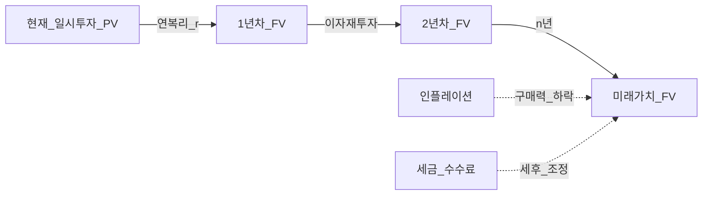
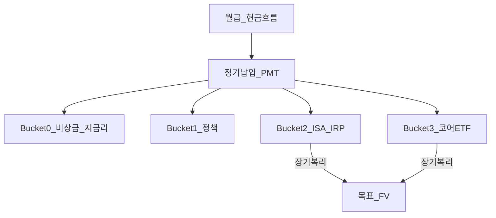

# 복리와 돈의 시간가치 (Time Value of Money & Compound Interest)

> **면책**: 본 문서는 교육 목적이며, 특정 개인·법인에 대한 투자·세무·법률 자문이 아닙니다. 제도·세율·상품 조건·시장 수익률은 변경될 수 있으므로 실행 전 공식 출처를 확인하세요.

## 메타

| 항목 | 내용 |
|------|------|
| 최종 검증일 | 2026-05-24 |
| 정책·법령 기준일 | 2025-12-31 확정, 2026 개편 별도 표기 |
| 난이도 | L3 |
| 예상 읽기 시간 | 50~65분 |
| 관련 bucket | 전 Phase 기초 (Bucket 0~3 설계의 수학적 엔진) |

## TL;DR

1. **시간가치**: 확실한 현금이라면 **오늘** 100만 원이 **1년 뒤** 100만 원보다 가치가 크다 — 미래 현금은 **할인**해야 비교한다.
2. **복리**는 이자가 원금에 다시 붙어 **기하급수**로 자라며, 장기 자산 형성의 핵심 입력은 **저축률 × 기간 × (세후) 실질수익률**이다.
3. **명목수익 − 인플레이션 ≈ 실질수익** — “7% 벌었다”도 물가 5%면 체감은 2%에 가깝다.
4. **72의 법칙**·연금공식으로 목표 FV를 역산하면 “몇 년·얼마를 넣어야 하는지”가 숫자로 보인다.
5. **부채 이자·레버리지 ETF**는 복리의 **반대편** — [debt-and-interest](debt-and-interest.md), [leveraged-etf-qqq-qld](../04-portfolio/leveraged-etf-qqq-qld.md)와 함께 읽을 것.

---

## 1. 한 줄 정의 + 왜 중요한가

**정의**: **돈의 시간가치(Time Value of Money, TVM)** 는 동일한 명목 금액이라도 **받는 시점**이 다르면 경제적 가치가 달라지며, 미래 현금흐름은 **할인율**로 현재가치(PV)로 환산해야 한다는 원리이다. **복리(Compound Interest)** 는 이전 기간에 발생한 이자·수익이 다음 기간의 **원금에 포함**되어 다시 이자·수익이 붙는 구조이다.

**왜 중요한가 (장기 자산 형성·bucket 연결)**:

| 연결 | 설명 |
|------|------|
| **Bucket 0~3** | 비상금·정책상품·ISA/IRP·코어 ETF 설계 시 “10년 뒤 얼마”를 **같은 척도(PV/FV)** 로 비교 |
| **저축 vs 타이밍** | 장기에서는 **얼마나·얼마나 오래** 넣느냐가 단기 **매수 타이밍**보다 통계적으로 지배적 |
| **함정 차단** | QLD·신용카드 등 **복리 착각**(2배 ETF × 10년 = 20배?)을 수학으로 걸러냄 |

본 저장소의 [time-horizon-and-buckets](../04-portfolio/time-horizon-and-buckets.md)는 “어디에 넣을지”를 정하고, 본 문서는 “시간이 지나면 얼마나 커지는지”를 정한다.

---

## 2. 선수 지식 / 이후 읽을 것

**선수**:
- 없음 (Phase 0 첫 권장 문서)

**이후**:
- [emergency-fund.md](emergency-fund.md) — 복리 전 **유동성** 확보
- [cash-flow-basics.md](cash-flow-basics.md) — FV의 입력값인 **저축률**
- [debt-and-interest.md](debt-and-interest.md) — 복리가 **불리**하는 쪽
- [asset-allocation.md](../04-portfolio/asset-allocation.md) — 기대수익·변동성
- [rebalancing-and-dca.md](../04-portfolio/rebalancing-and-dca.md) — 정기 납입과 복리
- [macroeconomics-basics.md](../02-economics/macroeconomics-basics.md) — 인플레이션

---

## 3. 직관·비유

**단리 vs 복리 — 눈덩이**: 산 꼭대기에서 눈덩이를 굴리면 처음엔 조금만 커지다가 아래로 갈수록 **빠르게** 커진다. 단리는 매년 “새로 내려온 눈”만 통에 담고, 복리는 **이미 쌓인 눈까지** 다음 바퀴의 출발점으로 삼는다.

**할인 — 안개 낀 미래**: 1년 뒤 받을 100만 원은 오늘 기준으로 **안개 속**에 있다. 확실히 받을 수 있다면 그 안개를 걷기 위해 **할인**한다(미래가치 FV → 현재가치 PV). 할인율이 높을수록(불확실·고금리) 미래 100만 원의 **오늘 가치**는 낮아진다.

**실질수익 — 명목 지폐의 두께**: 지갑 속 지폐 장수(명목 FV)는 늘었는데, 물가(인플레)가 같이 오르면 **살 수 있는 것**은 덜 늘어난 것처럼 느껴진다. 장기 목표는 **명목 자산**이 아니라 **구매력**에 가깝다.

---

## 4. 정식 개념·용어

| 용어 | 한글 | English | 정의 |
|------|------|---------|------|
| PV | 현재가치 | Present Value | 오늘 시점에서의 가치 |
| FV | 미래가치 | Future Value | 미래 시점에서의 가치 |
| r | 이자율·수익률 | Rate of return | 연간 비율(소수 또는 %) |
| n | 기간 | Number of periods | 보통 연 단위 |
| PMT | 정기 납입액 | Payment | 매기간 동일 납입(연금) |
| 명목수익 | — | Nominal return | 인플레 반영 전 수익률 |
| 실질수익 | — | Real return | 명목 − 인플레(근사) |
| DCA | 분할 매수 | Dollar-cost averaging | 기간에 걸친 분할 투자 |
| 할인율 | — | Discount rate | PV 산출에 쓰는 r |

---

## 5. 메커니즘

### 5.1 일시 투자 → 복리 성장

### 5.2 정기 납입(연금) + Bucket 배분

**읽는 법**: 같은 PMT라도 **r(세후 실질)** 과 **n(투자 가능 연수)** 가 FV를 좌우한다. Bucket 0은 r이 낮아도 **변동성 0**이 목적이고, Bucket 3은 r·변동성이 높지만 **n이 길 때** 복리 효과를 노린다.

### 5.3 손익 vs 복리 착각 (레버리지 ETF)

| 착각 | 실제 |
|------|------|
| “2배 ETF면 10년이면 20배” | **일일 리셋**·변동성 붕괴로 경로 의존 — [leveraged-etf-qqq-qld](../04-portfolio/leveraged-etf-qqq-qld.md) |
| “−50% 후 +50%면 본전” | −50% 후 +100% 필요 — **비대칭** |

---

## 6. 수식·모델

### 6.1 일시 투자의 미래가치

\[
FV = PV \times (1 + r)^n
\]

**역산(목표 자산 → 필요 PV)**:

\[
PV = \frac{FV}{(1 + r)^n}
\]

### 6.2 정기 납입(기말 납입 연금, 교육용)

\[
FV = PMT \times \frac{(1+r)^n - 1}{r}
\]

월 납입이면 **월 이자율** \(r_m \approx r_{연}/12\), 기간 \(n\) = 개월 수로 맞춘다(실무는 일할·수수료·세금 별도).

### 6.3 실질수익 (근사)

\[
r_{실질} \approx r_{명목} - \pi
\]

\(\pi\) = 인플레이션율. 정밀식: \( (1+r_{실질}) = (1+r_{명목})/(1+\pi) \).

### 6.4 72의 법칙

\[
\text{원금 2배 연수} \approx \frac{72}{r(\%)} 
\]

| r (연, %) | 대략 2배 연수 |
|-----------|----------------|
| 4 | 18년 |
| 6 | 12년 |
| 8 | 9년 |
| 10 | 7.2년 |
| 12 | 6년 |

교육용 근사이며, **납입·세금·변동성**은 별도.

---

## 7. 한국 적용

### 7.1 2025년 기준 (확정)

| 영역 | 복리·시간가치 관점 |
|------|-------------------|
| **예금·적금** | 상품별 **단리/복리**·이자 지급 주기(월복리·만기일시) 확인 |
| **CMA·MMF** | Bucket 0 — **낮은 r**, 높은 **유동성** |
| **ISA·IRP** | 장기 **세후 r** — [isa-irp-pension-tax](../06-korea-policy/tax/isa-irp-pension-tax.md) |
| **청년도약** | 정책 **r + 세제** — [youth-leap-account](../06-korea-policy/youth-leap-account.md) |
| **DB 퇴직연금** | 개인이 ETF를 고르지 않아도 적립금 풀 안에서 **복리** 작동 — [db-pension](../06-korea-policy/db-pension.md) |
| **투자소득세** | 해외주식·국내주식 **세율·분리과세**가 세후 r 변경 — [investment-tax-overview](../06-korea-policy/tax/investment-tax-overview.md) |

### 7.2 2026년 개편·시행 예정 (해당 시)

| 항목 | 2025 (확정) | 2026 (시행 여부·내용은 공식 확인) |
|------|-------------|-------------------------------------|
| 예금 보호·금리 | 시중은행·1금융 상품별 상이 | 금리 인하/인상 사이클에 따라 **명목 r** 변동 |
| ISA·연금 세제 | 비과세·공제 한도 운영 | 개편 시 **세후 r** 재계산 필요 |
| 물가 | 통계청 CPI 추이 | **실질 r** 추정치 갱신 |

**법·정책 근거**: 소득세법(금융소득·양도소득), ISA·연금 관련 시행령·국세청 안내, 금융위원회 투자자 보호 안내 — 상세 URL은 [references/sources.md](../references/sources.md).

### 7.3 장기 목표와 bucket 매핑 (교육용)

| 시간 지평 n | 대표 목표 | r 가정 (실질, 교육) | 주요 슬롯 |
|-------------|-----------|---------------------|-----------|
| 0~1년 | 비상·확정 지출 | 0~2% | Bucket 0 |
| 1~5년 | 전세·결혼 | 2~4% | 예금·단기채 |
| 10~30년 | 은퇴·자유 | 3~6% | Bucket 2b·3 |

**행동 원칙**: n이 길수록 **단기 변동**에 반응해 PMT를 끊지 않는다 — [rebalancing-and-dca](../04-portfolio/rebalancing-and-dca.md). 하락장은 “할인된 PMT”로 재프레이밍할 수 있으나, **레버리지·단타**로 대체하지 않는다.

### 7.4 변동성과 기대 FV

주식 r은 상수가 아니라 **분포**다. 교육용으로 연 7% 평균이라도 특정 해 −30%가 나오면 **경로**에 따라 FV가 달라진다. 그래서 (1) **비상금**으로 PMT 중단을 막고, (2) **분산·DCA**로 입력을 유지한다. 기대 FV는 “중앙값”이 아니라 **시나리오 밴드**로 본다.

---

## 8. 숫자 예제 (가상)

> 모든 인물·금액은 가상입니다.

### 예제 1: 가상 직장인 A — 일시 투자 vs 기간

| 항목 | A안 | B안 |
|------|-----|-----|
| PV | 2,000만 원 (가상) | 2,000만 원 |
| r (연, 세전 가정) | 7% | 7% |
| n | 10년 | 20년 |
| **FV (근사)** | 약 3,934만 원 | 약 7,739만 원 |

**교훈**: 같은 PV·r이어도 **n 2배**는 FV가 2배가 아니라 **약 2배 가까이 추가**된다(복리 곡선).

### 예제 2: 가상 직장인 B — 월 80만 원 × 25년

| 항목 | 값 |
|------|-----|
| PMT | 월 80만 원 (가상) |
| r (연) | 6% (가상, 세전) |
| n | 25년 (300개월) |
| **FV (교육용 근사)** | 약 **5.5억 원** 수준 |

**저축률 맥락**: 연봉(세후) 5,000만 원·지출 4,040만 원이면 저축률 약 19% — [cash-flow-basics](cash-flow-basics.md)와 연결.

### 예제 3: 명목 8% vs 인플레 3% — 실질

| | 명목 FV (1억 시작, 20년) | 실질 구매력 (π=3% 가정) |
|--|--------------------------|-------------------------|
| 계산 | \(1억 \times 1.08^{20} \approx 4.66억\) | \(1억 \times 1.05^{20} \approx 2.65억\) |

**체감**: 통장·앱에 찍히는 **명목**과 “물가 반영 후 살 수 있는 것”의 괴리를 인지.

### 예제 4: 고금리 부채 vs 투자 기대 — 가상 C

| 항목 | 값 |
|------|-----|
| 카드 잔액 | 400만 원 (가상) |
| 연 이자 | 18% |
| 1년 이자 부담 | **72만 원** (가상) |
| 주식 기대수익(불확실) | 10% on 400만 → **40만 원** 기대 |

**결론**: 확실한 **이자 절감**이 기대 수익보다 클 수 있음 → [debt-and-interest](debt-and-interest.md).

### 예제 5: 세금·수수료가 복리에 미치는 drag (가상)

| 슬롯 | 명목 r | 연간 drag (가상) | **세후·비용 후 r** |
|------|--------|------------------|-------------------|
| 일반 해외 ETF | 8% | 배당·양도 0.5%p | 7.5% |
| ISA (비과세 가정) | 8% | 0.2%p | 7.8% |
| 예금 | 3% | 이자소득세 15.4% → 약 2.5% | 2.5% |

20년 FV 차이: 같은 PV라도 **0.3%p** 차이가 수천만 원 규모로 벌어질 수 있다 — [account-product-tax-map](../06-korea-policy/tax/account-product-tax-map.md).

### 시나리오 표 — 가상 직장인 E, 목표 FV 3억 (25년)

| 시나리오 | s (저축률) | r (실질) | 필요 연 저축 (역산 근사) |
|----------|------------|----------|--------------------------|
| 보수 | 20% | 3% | 약 900만 원/년 |
| 기준 | 25% | 4% | 약 750만 원/년 |
| 낙관 | 30% | 5% | 약 600만 원/년 |

**실행**: [cash-flow-basics](cash-flow-basics.md)에서 월 62.5만 원(750만÷12) 자동이체 가능 여부를 먼저 확인한다.

### 월복리 vs 연복리 (교육용)

연 6%를 월복리로 쓰면 \( r_m = 6\%/12 \), \( n = 12 \times \text{연수} \). 동일 명목이라도 **월복리 > 연복리** FV가 약간 커진다. 예금 약관이 “월복리”인지 “만기 일시”인지 [emergency-fund](emergency-fund.md) Bucket 0에서도 확인한다.

---

## 9. FAQ

**Q1. 몇 % 수익률을 가정해야 하나요?**  
**A1.** 교육·계획용으로 **보수적 실질 3~5%**, 낙관 **6~7%**를 쓰고 **시나리오 3개**(낮·중·높)로 FV 범위를 본다. 과거 10년 S&P 수익을 **그대로** 30년에 투영하지 않는다.

**Q2. DCA는 복리를 깨뜨리나요?**  
**A2.** 아니다. **납입 시점을 분산**할 뿐, 적립된 원금에는 동일하게 복리가 적용된다. 변동성 완화가 목적 — [rebalancing-and-dca](../04-portfolio/rebalancing-and-dca.md).

**Q3. 비상금도 복리에 넣어야 하나요?**  
**A3.** Bucket 0은 **r이 낮아도** 역할이 다르다. 복리 극대화보다 **강제 매도 방지** — [emergency-fund](emergency-fund.md).

**Q4. DB 퇴직연금 수익률을 내가 못 정하면 복리 의미가 없나요?**  
**A4.** 운용 주체는 다르지만 **적립금 풀** 안에서 시간가치는 작동한다. **본인이 고를 수 있는** ISA·IRP에서 목표 FV를 설계 — [db-pension](../06-korea-policy/db-pension.md).

**Q5. QLD를 20년 들면 QQQ의 2배가 되나요?**  
**A5.** **아니다.** 레버리지 ETF는 복리 공식 \( (1+r)^n \)을 **그대로** 적용할 수 없다. 코어는 QQQ·글로벌 인덱스, QLD는 위성·실험 — [leveraged-etf-qqq-qld](../04-portfolio/leveraged-etf-qqq-qld.md).

**Q6. 인플레이션이 낮으면 주식 비중을 줄여야 하나요?**  
**A6.** 실질 r과 **자산배분**은 [asset-allocation](../04-portfolio/asset-allocation.md)에서 다룬다. 본 문서는 “명목만 보면 착각한다”는 점만 강조.

**Q7. 목표 10억이면 역산만 하면 되나요?**  
**A7.** \( PV = FV / (1+r)^n \) 또는 연금공식으로 **필요 저축액**을 구한 뒤, **현금흐름·세금·비상금**이 가능한지 [cash-flow-basics](cash-flow-basics.md)로 검증한다.

**Q8. 인플레이션 헤지로 금만 사면 되나요?**  
**A8.** 금은 **변동성·실질수익**이 주식·채권과 다르다. 본 문서의 \(r_{실질}\)은 **포트폴리오 전체** 설계에서 [asset-allocation](../04-portfolio/asset-allocation.md)로 다룬다.

**Q9. 40대에 시작하면 늦었나요?**  
**A9.** n이 짧아지므로 **s(저축률)** 과 **세후 r**이 더 중요해진다. “늦음”보다 **미시작**이 더 불리하다.

---

## 10. 함정·리스크·한계

- **단기 수익률**에 집착해 장기 n을 포기하거나, 하락장에서 **저축 중단**
- **QLD·레버리지**를 “복리 2배”로 착각
- **인플레·세금·수수료** 무시한 명목 FV만 목표로 설정
- **과거 최고 수익률**을 r로 고정 → 계획 과대
- 모델은 **확정 현금흐름**에 가깝고, 주식 r은 **분포** — 단일 숫자 한계 인지
- **환율** (해외 ETF) 미반영 시 원화 FV 왜곡

---

## 11. 심화 읽기

- [references/sources.md](../references/sources.md) — 통계청 CPI, 금융감독원, 국세청
- [time-horizon-and-buckets](../04-portfolio/time-horizon-and-buckets.md)
- [account-product-tax-map](../06-korea-policy/tax/account-product-tax-map.md)
- 교재: 『부의 대이동』(달러 복리 맥락), 『랜덤 워크 투자』(기대수익·분산), 『돈의 심리학』(행동)

---

## 12. 스스로 점검 퀴즈

1. PV 1,000만 원, r=8%, n=10년일 때 FV는 대략 얼마인가? (72의 법칙으로 검산)
2. 명목 수익 9%, 인플레 4%일 때 실질 수익은 대략 몇 %인가?
3. 월 정기 납입이 복리에 미치는 효과를 한 줄로 설명하라.
4. Bucket 0과 Bucket 3의 r·n 설계 목적 차이는?
5. 카드 연 20% 부채 100만 원 1년 이자는?

정답 힌트

1. 약 2,160만 원 (1,000×1.08^10) · 2. 약 5% (근사) · 3. 매월 원금이 늘어 복리 기반이 커짐 · 4. 0=유동성·낮은 r, 3=장기 n·변동 감수 · 5. 20만 원

