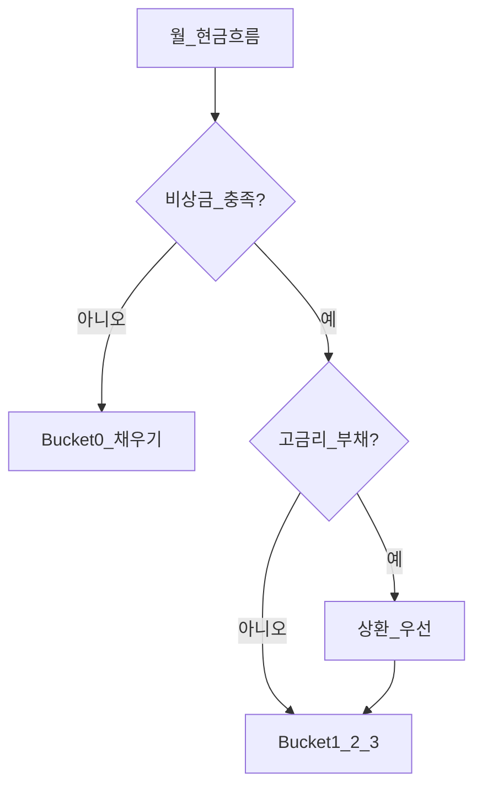
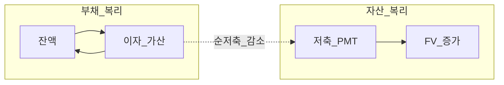
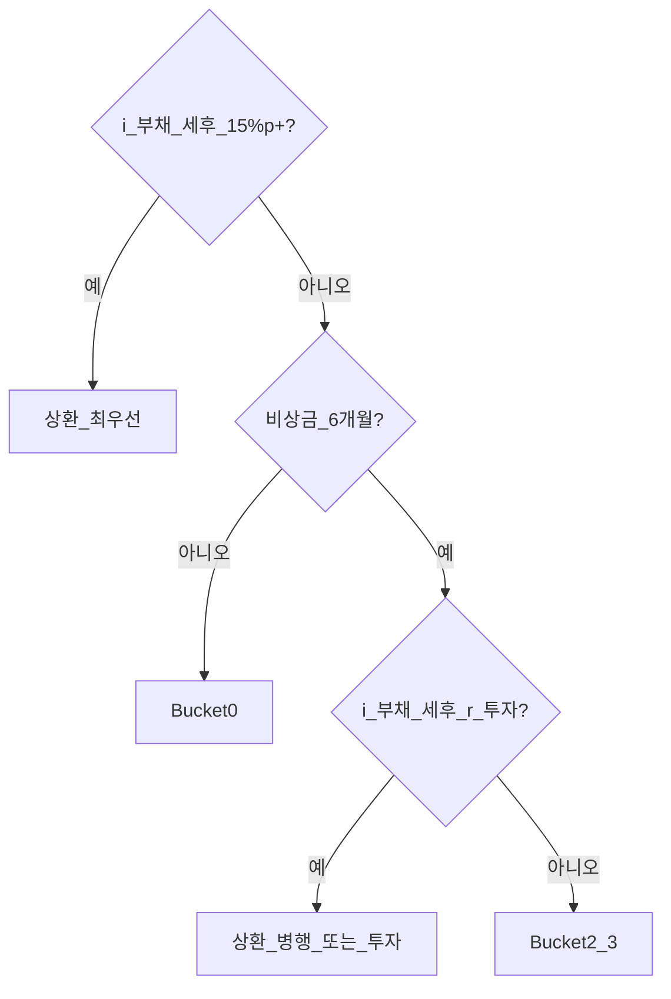

# 부채와 이자 — 투자 전 정리

> **면책**: 본 문서는 교육 목적이며, 특정 개인·법인에 대한 투자·세무·법률 자문이 아닙니다. 대출 금리·상환 조건·신용정보 규정은 변경될 수 있으므로 실행 전 금융기관·공식 안내를 확인하세요.

## 메타

| 항목 | 내용 |
|------|------|
| 최종 검증일 | 2026-05-24 |
| 정책·법령 기준일 | 2025-12-31 확정, 2026 개편 별도 표기 |
| 난이도 | L3 (Deep) — [READER-GUIDE](../docs/READER-GUIDE.md) |
| 예상 읽기 시간 | 50~60분 |
| 관련 bucket | **Bucket 0** (상환·유동성 우선), 투자 전제 |

## 0. 이 편 읽기 전 (5분)

| 항목 | 내용 |
|------|------|
| **난이도** | L3 (Deep) — [READER-GUIDE §L등급](../docs/READER-GUIDE.md) |
| **선수** | [compound-interest-and-time-value](compound-interest-and-time-value.md), [cash-flow-basics](cash-flow-basics.md) |
| **이번 편에서 쓰는 기호** | 본문 §4·§4a 표 참고 |
| **복습 한 줄** | — |

## TL;DR

1. **부채**는 미래에 갚을 의무이고, **이자**는 돈의 시간가치 + 신용 리스크에 대한 대가다 — [compound-interest-and-time-value](compound-interest-and-time-value.md)의 **반대 방향** 복리다.
2. **고금리 부채(카드·현금서비스·마이너스 통장)** 상환은 세후 기준 **확실한 수익**에 가깝다 — 기대 주식 수익보다 우선할 수 있다.
3. **실질금리** = 명목 − 인플레 — [macroeconomics-basics](../02-economics/macroeconomics-basics.md)와 함께 본다.
4. **레버리지 ETF·마진**은 은행 대출과 다르지만 **손실·변동성 확대** 메커니즘이 유사 — [leveraged-etf-qqq-qld](../04-portfolio/leveraged-etf-qqq-qld.md).
5. 부채·비상금 미정리 상태에서 Bucket 4 **위성**은 **이중 레버리지** 함정이다.

---

## 1. 한 줄 정의 + 왜 중요한가

**정의**: **부채(Debt)** 는 차입 원금과 **이자·수수료**를 약정 시점에 상환해야 하는 금융 의무이다. **이자(Interest)** 는 자금 사용 기간에 대해 채권자에게 지급하는 보상이다.

**왜 중요한가**:

| 관점 | 설명 |
|------|------|
| **현금흐름** | 이자는 매월 **순저축을 잠식** — [cash-flow-basics](cash-flow-basics.md) |
| **복리** | 이자 미납·롤오버 시 **이자에 이자** — 자산 복리와 경쟁 |
| **투자 순서** | [emergency-fund](emergency-fund.md) 후에도 **고금리 부채**가 Bucket 3보다 앞설 수 있음 |
| **행동** | 손실 포지션에서 **추가 차입 매수**는 심리·수학 모두 불리 |

---

## 2. 선수 지식 / 이후 읽을 것

**선수**:
- [compound-interest-and-time-value.md](compound-interest-and-time-value.md)
- [cash-flow-basics.md](cash-flow-basics.md)

**이후**:
- [emergency-fund.md](emergency-fund.md)
- [passive-vs-active.md](../04-portfolio/passive-vs-active.md)
- [real-estate-basics.md](../07-real-estate/real-estate-basics.md) — 주택·전세 대출
- [core-satellite-framework.md](../04-portfolio/core-satellite-framework.md)

---

## 3. 직관·비유

**배의 구멍**: 투자 엔진(주식 복리)을 키워도 **이자 구멍**이 크면 침몰한다.

**역복리**: 자산은 \( (1+r)^n \)으로 키우고, 부채는 **(1+i)^n**으로 키운다. i > r이면 **확실한 패**다.

**레버리지 ETF**: 은행에 돈 빌린 것은 아니지만, **일일 리셋**으로 손실이 빠르게 커지는 **합성 레버리지** — 부채와 **동시에** 쓰면 “이중” 위험.

**세후 비교**: 부채 이자 절감은 대부분 **세후 현금**과 동일한 효과다. 주식 수익은 양도세·배당세·ISA 비과세 등으로 **세후 r**이 달라진다([investment-tax-overview](../06-korea-policy/tax/investment-tax-overview.md)). “주식 10% vs 카드 18%”는 **세전 vs 세후**를 섞지 말고 같은 기준으로 비교한다.

**학자금·전세**: 저금리 학자금을 **투자 레버리지**로 쓰는 것은 교육 프레임에서 비권장. 전세 보증금·주택담보는 [real-estate-basics](../07-real-estate/real-estate-basics.md)처럼 **담보·만기·DSR**이 핵심이며, 카드 부채와 **동일 우선순위**로 묶지 않는다.

**가계 파산 리스크**: 극단적 연체는 신용뿐 아니라 **가처분 소득**·채무 조정 절차로 이어질 수 있다. 본 문서는 투자 전 **고금리 소액**을 막는 것이 목적이며, 이미 다중 채무가 있으면 **공식 상담**이 우선이다.

---

## 4. 정식 개념·용어

| 용어 | English | 정의 |
|------|------|----------------|
| 명목금리 | Nominal rate | 약정서 표시 이자율 |
| 실질금리 | Real rate | 명목 − 인플레(근사) |
| 원리금균등 | Equal payment | 매월 동일 상환액 |
| 원금균등 | Equal principal | 원금 균등, 이자 감소 |
| 만기일시 | Bullet | 이자만 납부, 만기 원금 |
| APR | Annual percentage rate | 연 환산 비용 |
| LTV | Loan-to-value | 담보 대비 대출 비율 |
| 신용점수 | Credit score | 연체·부채 이력 반영 지표 |

### 4a. 핵심 용어 (본문 등장 순)

> 복습용. 정의는 §4 본표·[glossary](../00-roadmap/glossary.md)·본문 `!!! info` 박스.

| 용어 | 한 줄 | 관련 이론 | glossary |
|------|------|----------------|
| 명목금리 | 약정서 표시 이자율 | §4 | [glossary](../00-roadmap/glossary.md#명목금리) |
| 실질금리 | 명목 − 인플레 | §4 | [glossary](../00-roadmap/glossary.md#실질금리) |
| 원리금균등 | 매월 동일 상환액 | §4 | [glossary](../00-roadmap/glossary.md#원리금균등) |
| 원금균등 | 원금 균등, 이자 감소 | §4 | [glossary](../00-roadmap/glossary.md#원금균등) |
| 만기일시 | 이자만 납부, 만기 원금 | §4 | [glossary](../00-roadmap/glossary.md#만기일시) |
| APR | 연 환산 비용 | §4 | [glossary](../00-roadmap/glossary.md#apr) |
| LTV | 담보 대비 대출 비율 | §4 | [glossary](../00-roadmap/glossary.md#ltv) |
| 신용점수 | 연체·부채 이력 반영 지표 | §4 | [glossary](../00-roadmap/glossary.md#신용점수) |

---

## 5. 메커니즘

### 5.1 우선순위 — 부채 vs 투자

### 5.2 이자 복리 vs 자산 복리

### 5.3 상환 방식과 현금흐름

| 방식 | 초기 부담 | 총 이자 | 적합 |
|------|------|----------------|
| 원리금균등 | 중간 | 중간 | 주택·신용 일반 |
| 원금균등 | 높음 | 낮음 | 소득 증가 예상 |
| 만기일시 | 낮음(이자만) | 높음 | **만기 리스크** 인지 필수 |

---

## 6. 수식·모델

**1년 이자 (단순, 교육용)**:

| 기호 | 이름 | 이 식에서 의미 |
|------|------|----------------|
| \(r\) | 할인율·수익률 | 기간당 이자·요구수익률 |
| \(n\) | 기간 | 연·월 등 복리·할인에 쓰는 횟수 |
| \(PV\) | 현재가치 | 오늘 시점으로 환산한 금액 |
| \(FV\) | 미래가치 | 미래 시점의 목표·결과 금액 |

\[
\text{이자} = P \times i
\]

**읽는 법**: **이자**와 **P**의 관계를 위 식으로 쓴다. 경제·재무 해석은 변수표 「이 식에서 의미」와 [DEPTH-STANDARD](../docs/DEPTH-STANDARD.md) 기호 예제를 맞춘다.
- \(P\) = 원금, \(i\) = 연 이자율(소수)

**복리 부채 (이자 미납·카드 롤오버)**:

| 기호 | 이름 | 이 식에서 의미 |
|------|------|----------------|
| \(r\) | 할인율·수익률 | 기간당 이자·요구수익률 |
| \(n\) | 기간 | 연·월 등 복리·할인에 쓰는 횟수 |
| \(PV\) | 현재가치 | 오늘 시점으로 환산한 금액 |

\[
\text{잔액}_{t+1} = \text{잔액}_t \times (1 + i) + \text{신규 사용}
\]

**읽는 법**: **r**와 **n**의 관계를 위 식으로 쓴다. 경제·재무 해석은 변수표 「이 식에서 의미」와 [DEPTH-STANDARD](../docs/DEPTH-STANDARD.md) 기호 예제를 맞춘다.**상환 vs 투자 비교 (세후, 교육용)**:

| 선택 | 확실성 | 적합 조건 |
|------|------|----------------|
| **상환** | 이자 절감 **확실** | \(i_{부채} > r_{투자,기대}\) (세후) |
| **투자** | 불확실 | \(i_{부채}\) 낮고, 비상금·장기 n 충분 |

예: 연 **18%** 카드 400만 원 → 연 이자 **72만 원**. 주식 **10% 기대** on 400만 = **40만 원** — **상환 우선** 논리.

**원리금균등 월 상환 (근사)**:

| 기호 | 이름 | 이 식에서 의미 |
|------|------|----------------|
| \(PMT\) | 월 상환액 | 매월 동일 상환액 |
| \(P\) | 원금 | 대출 잔액(초기) |
| \(i\) | 월 이자율 | 연 이자율 ÷ 12 (근사) |
| \(n\) | 상환 개월 | 잔여 만기 |

\[
PMT = P \times \frac{i(1+i)^n}{(1+i)^n - 1}
\]

**읽는 법**: **PMT**와 **P**의 관계를 위 식으로 쓴다. 경제·재무 해석은 변수표 「이 식에서 의미」와 [DEPTH-STANDARD](../docs/DEPTH-STANDARD.md) 기호 예제를 맞춘다.
(월 \(i\) = 연/12)

---

.
(월 \(i\) = 연/12)

---

## 7. 한국 적용

### 7.1 2025년 기준 (확정) — 부채 유형별

| 유형 | 특징 | 우선순위 (교육용) |
|------|------|----------------|
| **신용카드·현금서비스** | 연 15~20%p+ 가능 | **최우선** 상환 |
| **마이너스 통장** | 한도·금리 급등 | 상환·한도 축소 |
| **신용대출** | 금리 비교·**대환** | 중간 |
| **학자금** | 유예·이자 지원 가능 | 상대적 낮음 — 조건 확인 |
| **전세·주택** | LTV·DSR — [real-estate-basics](../07-real-estate/real-estate-basics.md) | 별도 프레임 |
| **카드론·대부** | 고금리 | 카드와 동급 주의 |

**신용정보**: 연체는 **신용점수**·이후 대출 금리에 영향 — [references/sources.md](../references/sources.md) (신용정보원 등).

### 7.2 2026년 개편·시행 예정 (해당 시)

| 항목 | 2025 | 2026 (공식 확인) |
|------|------|----------------|
| 기준금리·시중 금리 | 변동 | **변동금리** 대출 이자 재추정 |
| DSR·LTV 규제 | 금융위·한은 정책 | 주택 대출 **현금흐름** 재계산 |
| 카드 가맹·할부 | 규제 지속 | **최소 상환** 함정 지속 주의 |

**법·정책 근거**: 채무자 회생 및 파산에 관한 법률, 여신전문금융업법, 전자금융거래법, 주택도시기금 등 — 상품별 약관 우선.

### 7.3 연체·신용정보 (교육용)

연체가 발생하면 (1) **연체이자·가산금**, (2) **신용점수** 하락 → 이후 대출 **금리 상승** → 장기 **이자 복리** 악화. “일단 최소 상환”은 점수만 유지할 수 있어도 **총부채**는 줄지 않는다. 채무 조정·상환 계획은 금융권 **채무 상담** 공식 채널을 우선한다(교육 목적 안내).

### 7.4 투자 수익 vs 부채 상환 의사결정 트리

### 7.5 마진·신용거래 (개인)

주식 **미수·신용**은 부채다. [leveraged-etf-qqq-qld](../04-portfolio/leveraged-etf-qqq-qld.md)와 합치면 **3중 레버리지**에 가깝다. 코어는 **현금 결제·ISA** 중심 — [passive-vs-active](../04-portfolio/passive-vs-active.md).

---

## 8. 숫자 예제 (가상)

> 모든 인물·금액은 가상입니다.

### 예제 1: 가상 A — 카드 18%, 잔액 **M** (만 원 단위, 교육용)

| 항목 | 값 |
|------|-----|
| 연 이자(가정) | **M** (만 원 단위, 교육용) |
| 월 최소 상환만 | 잔액 **거의 유지** |
| **행동** | 투자 중단, 3개월 내 **전액** 상환 목표 |

### 예제 2: 가상 B — 학자금 2.5%, 잔액 1,**M** (만 원 단위, 교육용)

| 항목 | 값 |
|------|-----|
| 연 이자 | **M** (만 원 단위, 교육용) |
| 비상금 | 6개월 충족 |
| **행동** | ISA 월 40만 + 학자금 **최소 상환** 병행 가능(여유 시) |

### 예제 3: 가상 C — QLD 위성 + 카드론

|------|------|----------------|
| 카드론 | **M**, 연 17% |
| QLD | Bucket 4, −40% 시나리오 |
| **결과** | 이자 부담 + 투자 손실 **동시** — **이중 레버리지** |

### 예제 4: 대환 — 15% 신용대출 → 8% (가상 D)

| | Before | After |
|------|------|----------------|
| 잔액 | **M** | **M** |
| 연 이자 | **M** | **M** |
| **연 절감** | — | **M** (만 원 단위, 교육용)** (가상) |

수수료·중도상환 수수료 반영 후 순절감 계산 필수.

### 예제 5: 눈덩이(Snowball) vs avalanche (가상)

| 대출 | 잔액 | 금리 |
|------|------|----------------|
| 카드 A | **M** | 18% |
| 대출 B | **M** | 7% |
| 학자금 C | **M** | 2.5% |

| 방법 | 순서 | 총 이자(교육용 경향) |
|------|------|----------------|
| **Avalanche** | 금리 높은 순 | **최소** |
| **Snowball** | 잔액 작은 순 | 다소 큼, **심리적 성취** |

본 저장소는 **수학·현금흐름** 기준 **avalanche**를 기본 권장.

### DSR·LTV 맥락 (주택, 가상)

| 항목 | 값 |
|------|-----|
| 연 소득(가상) | **M** |
| 연 원리금 상환 | **M** |
| **DSR** | 30% |
| 금리 +1%p | 연 상환 +**M**(가정) → DSR **31%** |

[real-estate-basics](../07-real-estate/real-estate-basics.md)에서 전세·매매와 구분.

**카드 포인트·할인**: 포인트 적립을 위해 **추가 소비**하면 현금흐름이 악화된다. 부채 상환·비상금이 충족된 뒤에만 **의도적**으로 사용한다([cash-flow-basics](cash-flow-basics.md)).

---
## 9. FAQ

**Q1. 최소 상환만 하면 되나요?**  
**A1.** 고금리 카드는 **아니다.** 잔액이 줄지 않거나 느리게 줄면 이자 복리가 자산 복리를 이긴다.

**Q2. 투자 수익으로 이자를 내도 되나요?**  
**A2.** **변동성** 때문에 기대값 비교가 왜곡된다. 확실한 이자 절감이 우선인 경우가 많다.

**Q3. 대출 받아 주식·QLD?**  
**A3.** 교육 프레임: **비권장**. [leveraged-etf-qqq-qld](../04-portfolio/leveraged-etf-qqq-qld.md), [passive-vs-active](../04-portfolio/passive-vs-active.md).

**Q4. 청년도약 vs 카드 부채?**  
**A4.** **카드·고금리 먼저** — [youth-leap-account](../06-korea-policy/youth-leap-account.md)는 Bucket 1.

**Q5. 전세대출은 투자보다 상환?**  
**A5.** 금리·만기·전세 리스크 별도 — [real-estate-basics](../07-real-estate/real-estate-basics.md). 일반 주식과 **동일 공식** 적용 안 함.

**Q6. 신용점수만 좋으면 괜찮나요?**  
**A6.** 점수는 **조건** 중 하나. **실질 이자 부담·DSR**이 현금흐름을 지배한다.

**Q7. 부채가 없으면 ISA를 먼저?**  
**A7.** **비상금(Bucket 0)** 후 — [emergency-fund](emergency-fund.md), [account-product-tax-map](../06-korea-policy/tax/account-product-tax-map.md).

**Q8. 이자 상환을 연말정산에 넣을 수 있나요?**  
**A8.** **주택담보대출 이자** 등 일부만 해당. 카드 이자는 **공제 없음** — 상환 자체가 이득.

**Q9. 가족에게 빌린 돈은?**  
**A9.** 금리 0%라도 **관계·상환 일정** 명시. 심리적 부채도 현금흐름 계획에 반영.

**Q10. 중도상환 수수료가 있으면 상환을 미루나요?**  
**A10.** **잔여 이자 총액**과 수수료를 비교한다. 카드·고금리는 수수료가 있어도 **순이득**인 경우가 많다. 주택은 [real-estate-basics](../07-real-estate/real-estate-basics.md) 별도.

**Q11. 신용점수 올리려고 소액 대출을 받아도 되나요?**  
**A11.** 교육 프레임: **불필요 부채 창출**은 피한다. 점수는 **연체 없음·안정적 상환**이 핵심.

**Q12. 마이너스 통장 한도를 투자에 쓰면?**  
**A12.** **고금리·상환 촉구** 가능 — 투자 레버리지로 쓰지 않는다. 한도는 **비상 유동성** 검토 후 최소화.

---

## 10. 함정·리스크·한계

- **최소 상환**·**리볼빙** 중독
- **할부 0%** → 총지출 증가(심리적 무료 착각)
- **대환** 시 수수료·기간 연장으로 총이자 증가
- **보증·연대보증** 리스크
- **변동금리** 인상 시 DSR 압박
- 투자 **손실 확정** 후 카드로 **물타기** — 행동 재무
- 문서 금리·금액은 **가상** — 본인 약정서 확인
- **최소 상환**으로 신용만 유지하고 원금을 방치하면 **총 이자**가 투자 수익을 상회할 수 있음
- **금리 인하** 시에도 습관적 최소 상환만 하면 **상환 기간**이 늘어남 — 여유 현금으로 **원금 상환** 재검토

---

**Q. 실무에서는?**  
교과서 식·기호를 그대로 적용하기 전에 **수수료·세금·데이터 시점**을 분리한다. 숫자는 [DEPTH-STANDARD](../docs/DEPTH-STANDARD.md)처럼 기호만 먼저 맞추고, 법령·시장 수치는 §8 표·외부 출처로 갱신한다.

## 11. 심화 읽기

- [references/sources.md](../references/sources.md) — 금융감독원, 신용정보원
- [macroeconomics-basics.md](../02-economics/macroeconomics-basics.md) — 금리·인플레
- [investment-tax-overview.md](../06-korea-policy/tax/investment-tax-overview.md) — 세후 비교
- 교재: 『부의 추월차선』(부채 vs 자산), 『가장 어려운 돈 관리』
- [db-vs-dc-pension](../06-korea-policy/db-vs-dc-pension.md) — 퇴직금 vs 개인 부채 혼동 방지

### 부채 인벤토리 템플릿 (가상)

| 채권자 | 잔액 | 연 금리 | 최소 상환 | 만기 | 우선순위 |
|------|------|----------------|
| 카드 | | % | | 롤링 | 1 |
| 신용대출 | | % | | | 2 |
| 학자금 | | % | | | 3 |

분기마다 **잔액·금리** 갱신. 대환 시 **총 이자·수수료** 비교표 첨부.

고금리 부채를 정리한 뒤에는 해제된 **월 이자 부담**을 [emergency-fund](emergency-fund.md) 보강 또는 [isa](../06-korea-policy/isa.md) PMT로 **재배정**해 복리 슬롯으로 전환한다. “부채 제로”가 목표가 아니라 **비용 대비 통제 가능한 부채**가 목표인 경우(저금리 주택 등)는 별도 프레임을 쓴다. 매월 **이자만 내고 원금을 안 줄이는** 습관은 [compound-interest-and-time-value](compound-interest-and-time-value.md)에서 말한 **역복리**와 같다. — 상세 출처는 [references/sources.md](../references/sources.md)를 참고한다.

---

## 12. 스스로 점검 퀴즈

1. 연 20% 부채 100만 원, 1년 이자는?
2. 고금리 상환이 “무위험 수익”에 가까운 이유는?
3. 부채 있을 때 QLD 위성이 위험한 이유 두 가지는?
4. 원리금균등 vs 만기일시, 만기 리스크가 큰 쪽은?
5. Bucket 0·고금리 부채·ISA 순서를 나열하라.
6. Avalanche와 Snowball 중 총 이자 최소화에 유리한 쪽은?

??? note "정답 힌트"

    1. 20만 원 · 2. 이자 절감이 확실(세후) · 3. 이자 부담+투자 손실 동시, 변동성 · 4. 만기일시 · 5. 0 충족 → 고금리 상환 → ISA/2b/3 · 6. Avalanche(금리 높은 순)