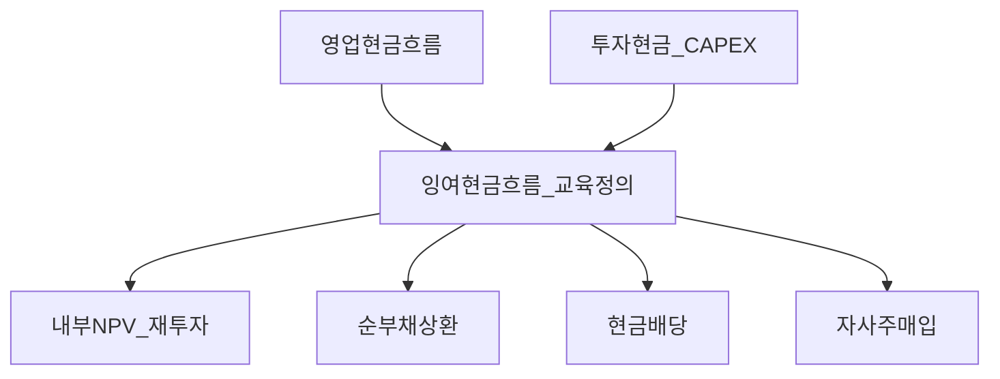
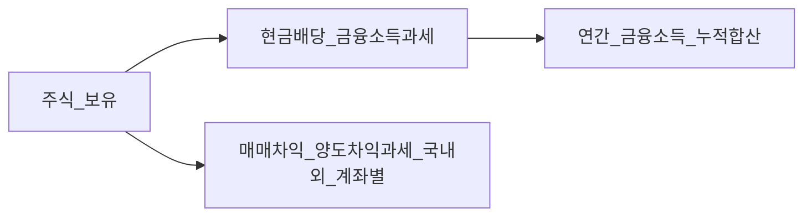

# 배당 정책과 자사주 매입 — 배당성향·자사 매입·한미 구조 차이·국내 개인 과세·Bucket 3

> **면책**: 본 문서는 교육 목적으로 작성되었으며 특정 기업·증권에 대한 매수·매도 권유나 세무 확정 자문이 아닙니다.

## 메타

| 항목 | 내용 |
|------|------|
| 최종 검증일 | 2026-05-25 |
| 정책·법령 기준일 | 2026-05-25 (교육용 개괄 · 실무는 법령·공시·국세청 최신 자료 우선) |
| 난이도 | L4 (Graduate) — [READER-GUIDE](../docs/READER-GUIDE.md) |
| 예상 읽기 시간 | 95~125분 |
| 관련 bucket | Bucket 3(코어)·Bucket 2b(ISA 등)·세무 절차 인지 레이어 전반 |

## 0. 이 편 읽기 전 (5분)

| 항목 | 내용 |
|------|------|
| **난이도** | L4 (Graduate) — [READER-GUIDE §L등급](../docs/READER-GUIDE.md) |
| **선수** | [financial-statements-intro](financial-statements-intro.md), [cash-flow-statement-fcf](cash-flow-statement-fcf.md) |
| **이번 편에서 쓰는 기호** | \(\mathrm{payout}\) 배당성향(배당÷순이익), \(y\) 배당수익률(DPS÷P), \(\tau\) 세율, \(g\) 배당 성장률 — 상세 §4a |
| **복습 한 줄** | L3 선수 편을 먼저 읽으면 수식이 수월함 |

> **가상 사례 회사**: 본 Phase 재무제표 심화 편은 **「가상 주식회사 한빛전자」** (가상의 코스피 제조·전자 부품) 숫자로 3표·DART·FCF를 **같은 스레드**로 읽는다. 실제 종목·실적이 아니다.

## TL;DR

1. **배당 정책**과 **페이아웃 비율**은 순이익 기준이냐 자유현금(FCF) 기준이냐에 따라 같은 "비율"도 의미가 달라진다. [cash-flow-statement-fcf.md](cash-flow-statement-fcf.md)
2. **배당수익률**은 주가 분모에 민감하며, 배당성향과 단순 동행하지 않을 수 있다. [equity-valuation-fundamentals.md](../03-markets/equity-valuation-fundamentals.md)
3. **자사주 매입**과 **현금 배당**은 현금 즉시 지급 여부·과세 시점·보상 프로그램 연동 방식이 달라 **같은 세금 축으로 놓으면 오류**다 — 개인 투자자는 양도차익 과세와 금융소득 과세를 먼저 분리해 이해해야 한다. [investment-tax-overview.md](../06-korea-policy/tax/investment-tax-overview.md)
4. **미국**과 **한국 지주·연결 구조**는 배당·매입 문화 이전에 공시·연결 주석·내부 거래 위험이 달라 **표면 규모 비교만으로는 위험**하다.
5. 한국 거주 개인에게 배당·이자는 원칙적으로 **금융소득 누적**(연 2,000만 원 기준)과 연결될 여지가 있고, 양도차익은 별도 세금 축이다. [financial-investment-income-tax.md](../06-korea-policy/tax/financial-investment-income-tax.md)
6. Bucket 3에서는 배당 입금이 소액 리밸런싱 재원이 될 수 있으나 과세 행정 부담도 함께 커진다. [time-horizon-and-buckets.md](../04-portfolio/time-horizon-and-buckets.md)·[isa-irp-pension-tax.md](../06-korea-policy/tax/isa-irp-pension-tax.md)

## 1. 한 줄 정의 + 왜 중요한가

**정의**: 배당 정책이란 이사회 결의와 주주총회 승인을 거쳐 회사가 주주에게 이익을 돌려주는 방법·시기·규모를 결정하는 체계다. 현금 배당·주식 배당·중간 배당·변동 배당과 함께 **자사주 매입·보유·소각**까지 하나의 주주 환원 설계 안에서 함께 다룬다. **페이아웃 비율**은 순이익 대비로 계산할 수도 있고, FCF 대비이거나, 자사주 매입까지 포함한 **통합 주주 환원 기준**일 수도 있다.

!!! info "PV (Present Value)"
    미래·과거 현금흐름을 오늘 가치로 환산한 금액.

!!! info "Bucket"
    시간·목적별 **자금 슬롯**(0 비상금 → 3 코어 등)

!!! info "ETF (Exchange Traded Fund)"
    거래소에 상장된 펀드. 지수나 자산 묶음을 주식처럼 사고팔 수 있다.

**왜 중요한가**: Bucket 3는 장기 코어 자금 슬롯이다. 같은 ETF라도 **배당 지급 일정**이 규칙적이면 현금 유입이 예측 가능해 리밸런싱 타이밍을 잡기 쉽다. 그러나 배당 현금이 늘어날수록 **금융소득 누적**(다른 이자·배당까지 합산하면)이 커져 연 2,000만 원 기준을 넘길 경우 5월 종합소득세 신고 대상이 될 수 있다. 자사주 매입 규모가 큰 회사는 배당이 작아 보여도 유통 주식 수 감소→주당순이익(EPS) 상승→주가 영향이라는 우회 경로가 존재하므로, "배당 없음 = 단순한 회사"라는 가정만으로는 장기 코어 학습 설계가 완결되지 않는다. [time-horizon-and-buckets.md](../04-portfolio/time-horizon-and-buckets.md)

## 2. 선수 지식 / 이후 읽을 것

**선수**:
- [financial-statements-intro.md](financial-statements-intro.md)
- [cash-flow-statement-fcf.md](cash-flow-statement-fcf.md)
- [compound-interest-and-time-value.md](compound-interest-and-time-value.md)
- [stocks-equities-intro.md](../03-markets/stocks-equities-intro.md)
- [etf-index-funds.md](../03-markets/etf-index-funds.md)

**이후**:
- [equity-valuation-fundamentals.md](../03-markets/equity-valuation-fundamentals.md)
- [investment-tax-overview.md](../06-korea-policy/tax/investment-tax-overview.md)·[financial-investment-income-tax.md](../06-korea-policy/tax/financial-investment-income-tax.md)
- [isa-irp-pension-tax.md](../06-korea-policy/tax/isa-irp-pension-tax.md)
- [domestic-stocks-tax.md](../06-korea-policy/tax/domestic-stocks-tax.md)·[overseas-stocks-tax-part2-dividend.md](../06-korea-policy/tax/overseas-stocks-tax-part2-dividend.md)
- [core-satellite-framework.md](../04-portfolio/core-satellite-framework.md)·[rebalancing-and-dca.md](../04-portfolio/rebalancing-and-dca.md)·[asset-allocation.md](../04-portfolio/asset-allocation.md)

## 3. 직관·비유

**우물과 배수 방법(비유)**: 회사가 1년 동안 영업으로 벌어들인 현금을 우물물이라고 하자. 이 현금을 주주에게 돌려주는 방법은 크게 두 가지다.

- **현금 배당**: 우물물을 주주 계좌로 직접 입금한다. 예를 들어, 직장인 A씨가 코스피 배당주를 100주 보유하면서 "주당 **D**원 배당"을 받았다고 하자. 입금 시 원천징수 15.4%가 자동으로 빠지므로 실제 수령액은 **D × 100 × 0.846**원이다. 증권사 앱에서 "배당금 입금" 알림이 오면 이미 세금이 차감된 금액이다. **핵심은:** 받는 즉시 **금융소득** 누적에 더해진다는 것이다.
- **자사주 매입**: 회사가 시장에서 자기 주식을 직접 사들인다. 주주 계좌에 현금이 바로 들어오지는 않는다. 대신 시장에 유통되는 주식 수가 줄어들면서 주당 지표(EPS, BPS 등)가 올라가는 수리적 효과가 생긴다. **직장인 B씨** 입장에서는 "오늘은 돈이 안 들어오지만, 내가 팔기 전까지 세금도 없다."

**왜 두 방법을 구분해야 하는가**: **쉽게 말하면:** 현금 배당은 받는 즉시 과세, 자사주 매입은 팔기 전까지 과세 없음. 세금이 발생하는 시점·방식이 완전히 다르기 때문에 "둘 다 주주 환원"이라고 같은 과세 논리로 묶으면 오류가 난다. [investment-tax-overview.md](../06-korea-policy/tax/investment-tax-overview.md)

**한국과 미국의 차이**: 미국 대형주는 기관투자자·행동주의 주주 압력 아래 자사주 매입이 활발하다. 한국은 지주사·연결 종속 구조에서 배당금이 실제로 소수주주 지갑까지 오는 경로를 따져봐야 한다. **예를 들어,** 지주사가 배당을 받아도 그것이 다시 내부 계열사 대여나 예치로 순환되는 경우 표면상 배당 규모와 실질 주주 현금 귀속 사이에 차이가 생길 수 있다. **주의할 점:** 배당 규모가 크다고 무조건 좋은 회사가 아니고, 작다고 무조건 나쁜 회사도 아니다.

**Bucket 3 운영 관점**: 코어 장기 자금에서 배당 입금이 분기마다 규칙적으로 들어오면 소액 리밸런싱 타이밍으로 활용할 수 있다. 그러나 배당이 많아질수록 금융소득 누적과 5월 신고 부담도 같이 커지며, 고배당주 집중 보유는 특정 섹터(리츠, 유틸리티 등)로 코어 비중이 쏠리는 위험도 있다. **핵심은:** 배당 수익은 공짜가 아니라, 세금·섹터 쏠림·리밸런싱 비용이 따라온다는 것이다.

## 4. 정식 개념·용어

| 용어 | English | 정의(교육) |
|------|------|----------------|
| 배당 정책 | Dividend policy | 주주 환원의 수단·속도·연속성을 결정하는 이사회 결의 체계 |
| 주당 현금 배당 | DPS (Dividend per Share) | 주식 1주당 지급하는 배당금 명목 금액 |
| 페이아웃 비율 | Payout ratio | 배당(또는 주주 환원 합계)÷순이익 또는 ÷FCF(정의에 따라 다름) |
| 배당수익률 | Dividend yield | 연간 배당금 ÷ 현재 주가 |
| 자유현금흐름 | FCF (Free Cash Flow) | 영업현금흐름에서 설비투자(CAPEX) 등을 차감한 잔여 현금 |
| 자사주 매입 | Share repurchase | 회사가 시장에서 자기 주식을 매입·보유·소각하는 행위 |
| Lintner 조정 | Dividend smoothing | 이익이 급변해도 배당을 서서히 조정하는 경영 패턴(학습 명제) |
| 클라이언텔 효과 | Clientele effect | 세제·연령 등에 따라 배당 선호 투자자 집단이 갈리는 현상 |
| 대리 문제 | Agency friction | 경영자와 주주 사이 이익 충돌(이익을 유보할지 환원할지 갈등) |
| EPS 기계 효과 | Mechanical EPS | 자사주 매입으로 주식 수가 줄어 동일 순이익에서 EPS가 오르는 수리적 효과 |
| 과세 축 분리 | Tax mapping | 배당·이자는 금융소득 과세, 양도차익은 별도 과세 체계로 구분 |

### 4a. 핵심 용어 (본문 등장 순)

> 복습용. 정의는 §4 본표·[glossary](../00-roadmap/glossary.md)·본문 `!!! info` 박스.

| 용어 | 한 줄 | 관련 이론 | glossary |
|------|------|------|----------------|
| 배당 정책 | 주주 환원의 수단·속도·연속성 결정 체계 | §4 | [glossary](../00-roadmap/glossary.md#배당-정책) |
| 주당 현금 배당 | 주식 1주당 배당 명목 금액 | §4 | [glossary](../00-roadmap/glossary.md#주당-현금-배당) |
| 페이아웃 비율 | 배당÷순이익 또는 ÷FCF | §4 | [glossary](../00-roadmap/glossary.md#페이아웃-비율) |
| 배당수익률 | 연간 배당금 ÷ 주가 | §4 | [glossary](../00-roadmap/glossary.md#배당수익률) |
| 자유현금흐름 | CAPEX 차감 후 잔여 현금 | §4 | [glossary](../00-roadmap/glossary.md#자유현금흐름) |
| 자사주 매입 | 회사가 자기 주식을 매입·보유·소각 | §4 | [glossary](../00-roadmap/glossary.md#자사주-매입) |
| Lintner 조정 | 이익 급변 속에서도 배당을 서서히 조정하는 패턴 | §4 | [glossary](../00-roadmap/glossary.md#lintner-조정) |
| 클라이언텔 효과 | 세제·연령 등으로 배당 선호 집단이 갈리는 현상 | §4 | [glossary](../00-roadmap/glossary.md#클라이언텔) |
| 대리 문제 | 경영자·주주 간 유보·환원 충돌 | §4 | [glossary](../00-roadmap/glossary.md#대리-문제) |
| EPS 기계 효과 | 주식 수 감소로 주당 이익이 오르는 수리적 효과 | §4 | [glossary](../00-roadmap/glossary.md#eps-기계-효과) |
| 과세 축 분리 | 배당=금융소득 과세, 양도차익=별도 과세 | §4 | [glossary](../00-roadmap/glossary.md#과세-축-분리) |

## 5. 메커니즘

### 5.1 순현금부터 주주 환원까지

### 5.2 한국 거주 개인 관점 과세 구분(교육)

## 6. 수식·모델

### 6.1 성장·유보·페이아웃 근사(교육)

| 기호 | 이름 | 이 식에서 의미 |
|------|------|----------------|
| **g** | 배당 성장률 | 배당금이 연간 증가하는 비율 |
| **ROE** | 자기자본이익률 | 순이익 ÷ 자기자본 |
| **payout** | 배당성향 | 순이익 중 배당으로 지급하는 비율 |

\[
g \approx ROE \times (1-\mathrm{payout})
\]

**식 (기호)**: **g** ≈ **ROE** ×(1-**payout**)

**읽는 법**: 배당성향이 높으면 이익의 더 많은 부분을 배당으로 지급하고 사내에 유보하는 금액이 줄어들어 성장률 **g**가 낮아지는 경향이 있다. 반대로 배당을 줄이고 재투자를 늘리면 **g**가 높아질 수 있다.

**유도 (L4)**:
1. **정의**: **g**, **ROE**, **payout**를 동일 회계연도·동일 통화로 맞춘다.
2. **식 변형**: 유보율 (1-payout)에 ROE를 곱하면 재투자 가능한 이익이 만들어내는 성장률을 근사할 수 있다.

여기서 \(\mathrm{payout}\) 은 배당÷순이익 기준의 교육용 정의다. FCF 기준으로 정의하면 분모가 달라져 결과도 바뀐다.

### 6.2 단순 배당 세후 수익(가정·교육)

연간 배당수익률 \(y\). 현금 배당에 대한 단순화된 유효세율 \(\tau\) 가정:

| 기호 | 이름 | 이 식에서 의미 |
|------|------|----------------|
| **y** | 배당수익률 | 연간 배당금 ÷ 주가 |
| **τ** | 유효세율 | 배당에 적용되는 세율(단순화) |
| **r_after** | 세후 배당수익률 | 세금 차감 후 실질 수익률 |

\[
r_{\text{after}} \approx y(1-\tau)
\]

**식 (기호)**: **r_after** ≈ **y**(1-**τ**)

**읽는 법**: 배당수익률 **y**에서 세율 **τ** 만큼을 빼면 실제로 손에 남는 세후 수익률이 된다. 금융소득 종합과세 구간에 진입하면 **τ** 가 단순히 15.4%가 아닌 더 높은 세율이 적용될 수 있어 선형 계산이 맞지 않을 수 있다.

**유도 (L4)**:
1. **정의**: **y**, **τ** 를 동일 과세연도·동일 통화 기준으로 맞춘다.
2. **식 변형**: 세후 순수익 = 배당금 × (1 - 유효세율).

종합과세 진입 시 **τ** 는 표면적으로 선형이 아님에 주의한다.

### 6.3 EPS 기계 효과(교육)

| 기호 | 이름 | 이 식에서 의미 |
|------|------|----------------|
| **S** | 발행주식수 | EPS 계산의 분모 |
| **Π** | 순이익 | EPS 계산의 분자 |
| **Δ** | 순감소 주식수 | 자사주 매입 등으로 줄어든 주식 수 |

주식수 **S**·순이익 **Π**·순감소 **Δ** 일 때:

\[
EPS \approx \frac{\Pi}{S-\Delta}
\]

**식 (기호)**: **EPS** ≈ **Π** / (**S**-**Δ**)

**읽는 법**: 자사주 매입으로 유통 주식수 **S**가 **Δ**만큼 줄어들면, 순이익 **Π**가 동일해도 분모가 작아져 EPS가 올라간다. 이것은 사업이 더 잘 된 것이 아니라 주식 수가 줄어든 **수리적(기계적) 효과**다. 실제 기업 가치 성장과 혼동하지 않아야 한다.

**유도 (L4)**:
1. **정의**: EPS = 순이익 ÷ 가중평균 주식수.
2. **자사주 매입 효과**: 주식수 S가 Δ만큼 줄면 분모가 (S-Δ)로 작아진다.

옵션 보상이나 신주 발행이 동시에 이루어지면 순 주식수 변화를 별도로 계산해야 한다.

### 6.4 비교정태 확장(교육)

내부 투자 수익률(IRR)이 하락하면 재투자보다 환원이 유리해져 배당성향을 높이는 경향이 생길 수 있다. 금리가 오르면 배당주의 상대적 매력이 약해질 수 있다. 환율은 해외 매출 비중이 큰 기업의 원화 기준 이익·배당 변동성을 키운다. 규제·정책 논의에 따라 섹터별로 주주 환원 제약이 달라질 수 있고, 지배주주 구조는 공시상 배당과 실제 소수주주에게 도달하는 현금 사이의 간극을 만드는 요인이 된다.

## 7. 한국 적용

### 7.1 2025년 기준 교육 요약

| 항목 | 한국 거주 개인 투자자 관점 |
|------|---------------------------|
| 국내 배당 | 금융소득 누적·원천징수·종합과세 검토 |
| 국내 양도차익(일반 개인) | 원칙적으로 비과세(예외 별도) |
| 해외 배당 | 금융소득 누적 + 증빙 수집 필요 |
| ISA | 계좌 내부 손익통산·만기·한도 규격 적용 |
| 연금·IRP | 과세 이연·수령 시점별 과세 적용 |

!!! info "ISA (Individual Savings Account)"
    개인종합자산관리계좌. 계좌 내 손익을 통산하고 일정 한도까지 세제 혜택을 받는 금융 계좌.

!!! info "IRP (Individual Retirement Pension)"
    개인형 퇴직연금. 퇴직금이나 추가 납입금을 운용하며 수령 시 연금 과세가 적용된다.

### 7.2 재벌·지주 vs 미국(정성 비교)

미국 대형주는 기관투자자·행동주의 주주 문화 속에서 자사주 매입이 자주 관찰된다. 한국은 지주사·연결 대상·종속 구조를 읽지 않고 **배당 규모 수치만** 놓고 미국과 같은 주주 환원 경로를 기대하면 위험하다. 같은 "배당" 표기라도 **실제 연결현금·특수관계자 주석** 내용이 현금의 최종 목적지와 타이밍을 바꿀 수 있다. [financial-statements-intro.md](financial-statements-intro.md)

### 7.3 2026 변화 추적 포인트

ISA 비과세·납입 한도 확대, DC 추가납입 논의, 금융투자소득세 관련 보도는 [investment-tax-overview.md](../06-korea-policy/tax/investment-tax-overview.md)에서 시계열로 추적한다. 본 문서는 **배당이라는 현금 흐름** 관점에서 Bucket 3 연결만 강조한다.

**법 출발점**(교육 링크 시작): 상법(배당)·자본시장법령 일부(자사주)·소득세법(금융소득)·국세청 안내.

### 7.4 Bucket 3 운영 체크리스트(실행 학습)

연초: 코어 목표 비중·리밸런싱 트리거를 [rebalancing-and-dca.md](../04-portfolio/rebalancing-and-dca.md)로 고정한다.

분기: 배당·이자 누적 금액을 스프레드시트에 분리 기록(국내외·ISA 여부·배당 재투자 여부).

연말 전: 금융소득 누적이 연 2,000만 원 기준에 근접하면 [financial-investment-income-tax.md](../06-korea-policy/tax/financial-investment-income-tax.md) 재검토.

## 8. 숫자 예제(가상)

> 모든 인물·금액·환율은 가상이다.

### 예제 1: 국내·해외 배당 누적

| 항목 | 금액(만 원 단위, 교육용 가상) |
|------|------------|
| 국내 이자 | **P₁** |
| 해외 ETF 배당 | **P₂** |
| 국내 고배당 | **P₃** |
| 합계 | **P₁+P₂+P₃** → 연 2,000만 원 한도 초과 사례 |

**해석**: 세 항목은 모두 금융소득 누적 제도 합산 대상이다. 합계가 연 2,000만 원 한도를 넘으면 5월 종합소득세 신고 검토가 필요하다.

### 예제 2: 해외 양도차익 병행(과세 축 분리)

| 항목 | 금액(만 원 단위, 교육용 가상) |
|------|------------|
| 금융소득 합(예제 1) | **P₁+P₂+P₃** |
| 해외 양도차익 | **Q** |
| 해석 | 양도차익과 금융소득은 **별도 과세 체계** — 단순 합산 금지(교육) |

**해석**: 해외 주식 매매차익 **Q**는 금융소득 합계에 더하는 것이 아니라 별도 양도소득세 신고 대상이다. 국내외 ISA·연금 계좌 여부와 무관하게 과세 체계가 다르다.

### 예제 3: ISA 내부 동일 ETF

ISA 계좌 안에서 발생한 배당금은 외부 금융소득 누적 합산에 직접 포함되지 않는다. ISA 계좌 자체의 세제 규정(손익통산, 한도, 만기 규정)이 우선 적용되므로 외부 배당과 단순 합산하면 설계 오류가 발생한다. [isa-irp-pension-tax.md](../06-korea-policy/tax/isa-irp-pension-tax.md)

### 예제 4: 고배당주만의 코어 편중(행동 위험)

배당이 많은 종목만 Bucket 3 코어에 채우면 단기적으로 현금 유입이 많아 편리하지만, 리츠·유틸리티·금융주 같은 특정 섹터로 코어 비중이 쏠려 해당 섹터가 부진할 때 포트폴리오 전체 변동성이 커진다. [sector-investing-framework.md](../03-markets/sectors/sector-investing-framework.md)

## 9. FAQ (12쌍 — L4)

**Q1.** 배당 규모만 보고 회사를 판단해도 되나요?
**A1.** 아니요. 배당은 결과 지표입니다. 순현금·차입 상태·내부 투자 기회까지 같이 확인해야 과대·과소 판단을 줄입니다. [cash-flow-statement-fcf.md](cash-flow-statement-fcf.md)

**Q2.** 자사주 매입이 배당보다 항상 유리한가요?
**A2.** 아닙니다. 매입 단가·주식 유동성·옵션 보상 프로그램 상쇄 여부에 따라 실질 효과가 달라집니다.

**Q3.** 한국 회사 배당이 낮다는 말의 의미는?
**A3.** 성장 기회·지배구조·재투자 선호·규제 환경이 복합된 결과입니다. 미국 기업과 같은 환원 패턴을 기대하면 위험합니다.

**Q4.** 국내 주식 배당은 세금 계산상 어디에 포함되나요?
**A4.** 일반적인 경우 금융소득 누적에 포함되며, 다른 이자·배당과 합산해 연 2,000만 원을 초과하면 종합과세 검토가 필요합니다. [financial-investment-income-tax.md](../06-korea-policy/tax/financial-investment-income-tax.md)

**Q5.** 해외 주식 배당은 왜 번거롭다고 하나요?
**A5.** 환율 환산, 원천지 증빙 수집, 이중과세 조정 등 행정 처리 비용이 커질 수 있습니다. [overseas-stocks-tax-part2-dividend.md](../06-korea-policy/tax/overseas-stocks-tax-part2-dividend.md)

**Q6.** ETF 배당금은 어떻게 기록해야 하나요?
**A6.** 편입 자산 구성·분배 정책에 따라 이자·배당·환차익 등 성격이 다를 수 있으므로 증권사 월간·연간 명세서를 기준으로 분류합니다.

**Q7.** Bucket 3에서 배당을 늘리면 좋은가요?
**A7.** 목표 변동성·섹터 편중·세후 수익률을 함께 봐야 합니다. 배당만 늘리면 특정 섹터로 코어 비중이 쏠릴 수 있습니다.

**Q8.** 배당 재투자(DRIP)는 세금이 어떻게 되나요?
**A8.** 증권사 처리 방식과 현금 지급 여부 판단에 따라 달라지므로 명세서로 확인해야 합니다.

**Q9.** ISA에 넣으면 배당이 면세인가요?
**A9.** ISA 계좌 세제(3년 유지·손익통산·한도) 규정이 적용될 뿐 "무조건 면세"라고 단정하면 안 됩니다. [isa-irp-pension-tax.md](../06-korea-policy/tax/isa-irp-pension-tax.md)

**Q10.** 국내 주식 양도차익과 배당을 같은 표에 합산해도 되나요?
**A10.** 안 됩니다. 배당·이자는 금융소득 누적에 포함되고, 국내 상장 주식 양도차익은 일반 개인의 경우 원칙적으로 비과세로 **별도 계산**해야 합니다. [investment-tax-overview.md](../06-korea-policy/tax/investment-tax-overview.md)·[domestic-stocks-tax.md](../06-korea-policy/tax/domestic-stocks-tax.md)

**Q11.** 금융투자소득세는 일반적인 배당·이자 과세와 같은가요?
**A11.** 별도 논점입니다. 적용 대상·시행 조건이 다르므로 [investment-tax-overview.md](../06-korea-policy/tax/investment-tax-overview.md)에서 별도로 확인하세요.

**Q12.** 배당 대신 성장주만 보유하면 되나요?
**A12.** 단일 규칙은 없습니다. 코어·위성 프레임을 먼저 설계한 뒤 결정하세요. [core-satellite-framework.md](../04-portfolio/core-satellite-framework.md)·[asset-allocation.md](../04-portfolio/asset-allocation.md)

**Q13.** 저는 ISA에 배당주 ETF를 담고 있는데, 배당이 금융소득에 합산되나요?
**A13.** ISA 계좌 내에서는 배당·이자가 비과세 한도(일반형 200만 원·서민형 400만 원) 내에서 운용된다. **핵심은:** ISA 만기 수령 시점에 한꺼번에 처리되므로, 계좌 내 발생 배당이 매년 종합소득에 합산되지 않는다는 점이 핵심 메리트다. [isa-irp-pension-tax.md](../06-korea-policy/tax/isa-irp-pension-tax.md)

**Q14.** 자사주 매입 공시가 나오면 무조건 좋은 신호인가요?
**A14.** 아닙니다. 회사가 자사 주식이 저평가됐다는 신호 효과가 있지만, **주의할 점:** 실제 소각 없이 자사주를 임원 보상으로 재사용하면 주주 환원 효과가 상쇄된다. 공시 후 실제 소각 여부를 DART에서 확인하는 것이 중요하다. [reading-annual-reports-dart.md](reading-annual-reports-dart.md)

## 10. 함정·리스크·한계

- 배당수익률이 높아 보였는데 주가 하락으로 분모가 작아진 착시였을 경우.
- 페이아웃 비율의 분모(순이익 기준인지 FCF 기준인지)·분자(배당만인지 자사주 포함 주주환원인지)를 업종 간에 섞어 비교표를 만드는 오류.
- ISA 안의 배당과 외부 일반 계좌 배당을 합산해 연간 금융소득 2,000만 원 기준을 잘못 계산하는 경우. [isa-irp-pension-tax.md](../06-korea-policy/tax/isa-irp-pension-tax.md)
- 해외 배당·이자 증빙을 연말에 몰아서 정리하다 처리 시간이 부족해지는 경우. [overseas-stocks-tax-part2-dividend.md](../06-korea-policy/tax/overseas-stocks-tax-part2-dividend.md)
- 국내 상장 주식 양도차익과 배당을 같은 열에 합산해 금융소득 기준 계산을 잘못하는 경우. [investment-tax-overview.md](../06-korea-policy/tax/investment-tax-overview.md)
- 자사주 매입이 주주에게 즉각적인 현금을 지급한 것처럼 착각하는 경우.
- 고배당주만 채워 섹터·금리 민감도가 집중돼 코어가 흔들리는 경우.
- 연결·특수관계자 주석 없이 표면 배당 수치만 추적해 그룹 내부 현금 순환 간극을 놓치는 경우. [financial-statements-intro.md](financial-statements-intro.md)
- Lintner 점진 조정 패턴을 "미래 배당 보장"으로 오해하는 경우.
- Modigliani–Miller 무관련 이론(과세·거래비용 없다는 가정)을 현실 시장에 그대로 적용하는 경우.
- 배당 재투자(DRIP)와 현금 배당 수령을 증빙 없이 같은 행에 합산하는 경우.
- 대주주 과세 적용 규정과 일반 직장인의 금융소득 2,000만 원 기준을 동일하게 적용하는 오류. [investment-tax-overview.md](../06-korea-policy/tax/investment-tax-overview.md)·[financial-investment-income-tax.md](../06-korea-policy/tax/financial-investment-income-tax.md)

---

**Q. 실무에서는?**  
교과서 식·기호를 그대로 적용하기 전에 **수수료·세금·데이터 시점**을 분리한다. 숫자는 [DEPTH-STANDARD](../docs/DEPTH-STANDARD.md)처럼 기호만 먼저 맞추고, 법령·시장 수치는 §8 표·외부 출처로 갱신한다.

## 11. 심화 읽기

- Brealey·Myers·Allen *Principles of Corporate Finance* 주주환원·자본비용 교차 구간. [wacc-capital-structure.md](../09-corporate-finance/wacc-capital-structure.md)·[equity-valuation-fundamentals.md](../03-markets/equity-valuation-fundamentals.md)
- [references/sources.md](../references/sources.md) — 법령·국세청·금융위 공식 링크
- 한국 과세 경로 확인: [investment-tax-overview.md](../06-korea-policy/tax/investment-tax-overview.md)·[financial-investment-income-tax.md](../06-korea-policy/tax/financial-investment-income-tax.md)·[isa-irp-pension-tax.md](../06-korea-policy/tax/isa-irp-pension-tax.md)

## 연습문제 (L4, 기호)

1. 위 §6 주요 식에서 변수 하나를 미지로 두고, 나머지를 기호로 둔 **관계식**을 쓰시오.
2. 가정이 깨질 때(유동성·세금·다중 IRR 등) 위 식의 **한계**를 기호·부등식으로 서술하시오.
3. §8 예제와 동일 기호(M·P·PV 등)로 **부호·단조성**만 검증하는 짧은 논증을 하시오.

### 해설 키

1. 직전 변수표의 「이 식에서 의미」를 이용해 동일 차원으로 정리한다.
2. 「가정이 깨지면」 절의 한계 사례와 연결한다.
3. 숫자 대입 없이 **부호**·**단위** 일치만 확인한다.

## 12. 스스로 점검 퀴즈

1. 페이아웃 비율 분모를 순이익과 자유현금흐름 두 가지로 제시하고, 같은 비율이라도 의미가 어떻게 달라지는지 설명하시오.
2. 배당수익률이 높은데도 회사의 실질 현금 환원 능력이 약해 보일 수 있는 재무적 이유 두 가지를 드시오.
3. Lintner 패턴으로 설명 가능한 현상 한 가지와, 그 패턴이 깨지는 외생 충격 예시 한 가지를 드시오.
4. 미국 대형주의 자사주 매입 문화를 한국 회사 표면 수치에 그대로 대응하면 생기는 지배구조 착시를 한 문단으로 적으시오.
5. ISA 내부 배당 과세 규정을 외부 일반 계좌의 금융소득 누적 계산과 직접 합산하면 왜 위험한가. [isa-irp-pension-tax.md](../06-korea-policy/tax/isa-irp-pension-tax.md)
6. 고든 성장모형 교육에서 할인율과 배당 성장률이 비슷해질 때 모형 해석이 흔들리는 이유를 서술하시오.
7. 자사주 매입 후 주식 보상이 상쇄될 때 "순 주식수 변화"를 어떻게 계산·기록해야 하는가.
8. Bucket 3에서 배당 입금이 많아질수록 세금 행정 부담이 커지는 경로를 시간 순서로 적으시오. [time-horizon-and-buckets.md](../04-portfolio/time-horizon-and-buckets.md)

??? note "정답 힌트(요지)"

    1. 순이익 분모에는 비현금 항목·재고·완충이 섞여 있고, FCF 분모는 투자·운전자금 변화가 반영되어 실제 환원 가능한 현금 기준과 다르다.
    2. 주가 하락으로 분모만 작아지는 착시, 일회성 이익을 기대어 배당 수치가 과대 계상되는 착시.
    3. 이익이 요동쳐도 배당이 완만하게 유지되는 패턴 vs 금리 급등·유동성 위기 등은 점진 패턴 외부 충격.
    4. 지주사 출자 순환과 연결 내부거래 때문에 외관상 동일한 매입 수치가 같은 주식군에 대한 현금 환원 보장처럼 읽히는 오류.
    5. ISA 내부 손익통산과 만기 규정, 비과세 한도가 일반 과세 계좌와 다르기 때문이다.
    6. 성장률이 할인율에 근접하면 가치 계산식의 분모가 0에 가까워져 결과가 발산하며 교육용 의미만 남는다.
    7. 자사주 매입·보유·소각과 옵션·RSU 지급을 별도 행으로 기록하고, 순 주식 수만 별도 열로 계산해야 한다.
    8. 배당 입금이 늘어날수록 금융소득 누적 증가 → 2,000만 원 기준 접근 → 명세 검증 필요 → 5월 이전 종합소득세 설계로 연결된다.

## L4 보충 — 비교정태·행위·증빙·버킷을 하나의 흐름으로 묶기

### A. Lintner 이론과 배당 신호

Lintner(1956) 연구에 따르면 경영진은 과거 배당 수준을 기준점(닻)으로 삼고 목표 배당성향 방향으로 서서히 조정하는 경향을 보인다. 즉 이익이 갑자기 크게 늘어도 배당을 동일 비율로 올리지 않고 천천히 따라가는 이유는, 한 번 올린 배당을 나중에 내리면 시장에 부정적 신호가 된다는 우려가 있기 때문이다. 교육 맥락에서는 신호 비용 절감, 차입 약정(covenant) 유지, 내부 승인 절차 같은 다층 이유를 하나로 설명할 수 있다. 실무에서는 연결 현금 흐름표와 교차해야 하며, 레버리지나 유동성 약정이 깨지면 과거 패턴도 함께 무효화될 수 있다.

### B. 클라이언텔 효과와 한국 과세 체계

과세 체계가 다른 투자자 집단마다 선호하는 배당 수준이 갈린다는 클라이언텔 효과는, 한국 거주 개인에게도 적용된다. 금융소득 누적 과세 때문에 배당이 많은 종목을 과세 계좌에 담으면 5월 신고 부담이 커진다. 이 경우 ISA·연금 계좌를 배당 많은 자산의 우선 수납 슬롯으로 검토하는 것은 과세 회피가 아니라 증빙·행정 처리의 시간 비용을 줄이려는 합리적 설계다. 실제 과세 결과는 개인 신고 상태에 따라 다르므로 법령과 국세청 안내를 출발점으로 삼아야 한다.

### C. 자사주 매입의 이중 효과

자사주 매입은 주주 계좌에 현금을 즉시 입금하지 않는다. 과세 측면에서 배당과 같은 금융소득 과세 대상이 아니다. 평가 측면에서는 유통 주식 수 감소가 주당 지표에 미치는 수리적 효과(EPS 상승 등)를 함께 읽어야 한다. 주식 보상으로 상쇄되면 순 주식 수 변화만으로 자사주 매입 성과나 EPS 개선 논리를 구성하면 오판이 된다. 학습표에서는 "배당" 열과 "자사주 매입·보상 상쇄" 열을 분리해 기록하는 것이 기본이다. [equity-valuation-fundamentals.md](../03-markets/equity-valuation-fundamentals.md)

### D. 지주·연결 구조 읽기

한국에서는 공시상 배당 수치가 연결 내부 현금 순환과 맞물려 소수주주에게 도달하기까지 간극이 생길 수 있다. 미국 대형 블루칩처럼 "배당 수치 = 즉각 주주 지갑"이라는 단선형 모형만 적용하면 위험하다. 특수관계자 채무·예치·약정 관련 주석을 함께 따라가야 외관상 배당과 실제 순현금의 거리가 드러난다.

### E. 교과서 MM 이론과 현실 과세의 차이

Modigliani–Miller 무관련 이론(MM)은 과세 차별과 거래비용이 없다는 전제 아래 유도된다. 현실에서는 현금 배당의 원천징수·금융소득 합산 과세 시점과, 자사주 매입 관련 양도차익 과세 시점·세율이 서로 달라 "어느 쪽 주주환원이 세후 유리한가"라는 질문이 단순하지 않다. 학습 노트 오른쪽에 "과세·거래비용 가정: 교과서 ≠ 현실 시장"이라는 주석을 남겨 두는 것이 L4 수준에서는 거의 필수다. [investment-tax-overview.md](../06-korea-policy/tax/investment-tax-overview.md)

### F. 높은 배당수익률의 행동 함정

배당수익률이 높다는 이유만으로 유사 업종 고배당주를 과도하게 보유하면 금리·유가·환율 민감도 패널티가 겹치는 스타일 집중 현상으로 이어지기 쉽다. Bucket 3처럼 코어 슬롯에서는 배당 현금 유입의 장점만큼 분산 규칙도 함께 적용해야 시간축 전체의 분산 논리가 흔들리지 않는다. [asset-allocation.md](../04-portfolio/asset-allocation.md)

### G. DRIP와 증빙 관리

배당금을 자동으로 같은 종목에 재투자하는 DRIP(Dividend Reinvestment Plan)는 증권사·종목별로 처리 방식이 다르다. "현금이 내 계좌를 한 번 거쳤는지"와 "바로 소수 주식으로 재매입됐는지"에 따라 같은 연도라도 금융소득 신고 방식이 달라질 수 있다. L4 학습 단계에서는 DRIP 존재 자체보다 **증권거래 내역 월별·연간 명세서를 고정 패턴으로 관리하는 습관**을 우선시한다. 배당 기록표에 DRIP 열을 별도로 만들면 나중에 금융소득 누적 합계와 교차 검증하기 쉬워진다.

### H. ETF·펀드 분배금과 과세 구성 차이

편입 채권·해외 종목 비중 때문에 분배금 구성 요소는 같은 "배당" 명목이라도 이자·외국 원천세·국내 과세 항목이 혼합된 영수증이 발행된다. 일반 과세 계좌든 ISA 내부든 세목 구성 해석 순서가 같아질 뿐, 계좌별 손익통산 방식은 다르다. 코어에 ETF가 많아지면 **명세서 항목 분해** 작업 분량이 늘어난다는 점을 Bucket 3 운영 설계에서 미리 감안해야 운영 시간을 과소평가하지 않는다. [etf-index-funds.md](../03-markets/etf-index-funds.md)

### I. 금리·유동성과 배당 상대 매력

금리 구조가 높아지면 예·적금이나 채권의 이자 수익이 명확하게 주어지므로 배당이라는 간접적 주주 환원의 상대적 매력이 교과서 패널에서는 흔들릴 수 있다. 기업 레버리지가 크면 높은 배당 수치가 채무 상환 순위와 긴장 관계에 놓인다는 점도 함께 학습해야 한다. Bucket 3는 장기 투자이지만, **금리 국면이 바뀔 때 재측정할 지표**(섹터 민감도·현금 흐름 지속성) 노트를 미리 작성해 두면 리밸런싱 판단 근거가 시간이 지나도 일관되게 남는다.

### J. 5월·연말 절차와 배당 기록 교차 검증

한국 거주 개인 투자자는 금융소득 누적이 연 2,000만 원 기준에 근접하면 5월 종합소득세 신고와 함께 납부 일정까지 설계해야 한다. [financial-investment-income-tax.md](../06-korea-policy/tax/financial-investment-income-tax.md) 배당 입금 기록만 따로 보관하면 해외 양도차익 또는 다른 이자 소득과 잘못 합산하는 오류가 생길 수 있다. 교육용 체크 순서: "먼저 과세 항목 이름을 라벨링한 뒤에만 같은 스프레드시트 같은 행에 금액을 입력한다."

### K. 국내 상장 주식 양도차익과 배당 분리 원칙 재강조

국내 일반 증권 계좌에서 상장 주식 양도차익은 원칙적으로 비과세(일반 개인)이고, 배당은 금융소득 과세 대상이다. 이 두 가지를 학습 기록표에서 같은 색깔로 한 열에 합쳐 넣으면 과세 판단이 뒤섞이는 오류가 발생한다. [domestic-stocks-tax.md](../06-korea-policy/tax/domestic-stocks-tax.md)

### L. 현금 환원 방식 비교표 (교육용)

아래 표는 개념 비교 목적으로만 사용하며 실제 종목 선택 기준이 아니다.

| 환원 방식 | 주주 현금 즉시 수령 여부 | 과세 항목 | 증빙·기록 유의사항 |
|------|------|------|----------------|
| 현금 배당 | 즉시 입금 (원천징수 후) | 금융소득 과세 대상 | 원천징수 명세서 교차 확인 용이 |
| 자사주 매입 | 즉시 수령 아님 (주가에 간접 영향) | 양도차익 과세 (매도 시점) | 순 주식 수·보상 상쇄 주석 교차 확인 필요 |
| 배당 재투자(DRIP) | 재투자 방식 (현금 미수령 가능) | 증권사 처리 방식에 따라 다름 | 연간 명세서 항목 분해 필수 |

### M. Bucket 3 배당·리밸런싱 연동 시나리오(가상)

코어 비중이 목표에서 벗어났는데 분기마다 배당 입금이 규칙적으로 들어온다고 가정하자. 이때 소액 리밸런싱을 배당 입금 직후 타이밍에 맞추면 별도 매도 없이 자산 비중을 조정할 수 있어 거래 비용이 줄어든다. 그러나 배당 입금이 많아질수록 금융소득 누적이 늘고 5월 신고 부담도 커진다. 세후 수익률과 운영 시간 비용을 같이 고려하지 않으면 "편의성만 좋은 설계"로 끝난다. [rebalancing-and-dca.md](../04-portfolio/rebalancing-and-dca.md)

### N. 한국 지주 그룹 시나리오 읽기 연습(가상)

지주사가 배당 수준을 안정적으로 유지하는 동시에 종속 회사에 대한 내부 대여·예치 규모가 커지는 공시 패턴이 있다고 가정하자. 소수주주 입장에서는 "주당 배당금(DPS) 수치는 안정적"으로 보여도, 연결 현금흐름표에서 운전자본 변동이나 계열사 대여금이 함께 늘어나면 실질 환원 능력과 표면 배당 사이에 간극이 생긴다. 이때 미국 대형주 자사주 매입 스토리를 그대로 겹쳐서 해석하면 안 된다.

### O. 연습 문장 — 스스로 번역·완성

다음 문장을 자신의 말로 재작성해 보자: "배당 정책은 단기 이익 변동을 즉각 따라가기 어려운 성격을 갖지만, 장기 흐름에서는 경영진의 자신감 표시로 읽히는 경우도 있다. 같은 단락에 자사주 매입을 두고, 이것이 즉각적인 현금 지급이 아닐 수 있다는 점을 대조해 보자."

### P. 문서 링크 클로저 — Bucket 3 이후 과제

코어 비중 조정 기준은 코어·위성 프레임을 다시 참고하면 배당 현금 유입이 위성 영역의 과도 확장을 유발하지 않도록 제동 역할을 한다. [core-satellite-framework.md](../04-portfolio/core-satellite-framework.md) 금융투자소득세·대주주 과세 같은 별도 규정은 과세 체계 개요 문서에서 교차 확인한다. [investment-tax-overview.md](../06-korea-policy/tax/investment-tax-overview.md)

### Q. 교육용 한계·면책 반복 블록(의도적 중복)

본 문서 설명은 과세 결과를 확정하거나 종목 선택을 조언하지 않는다. 과세 내용은 신고 상태·추가 특례 적용 여부·증빙 품질에 따라 달라진다. 연 2,000만 원 기준·ISA 내부 세제·해외 증빙 같은 실무 사항은 과세 체계 개요 문서와 금융소득 문서를 함께 읽어야 전체 그림이 완성된다. 여기서는 Bucket 3에서의 배당·자사주 매입 관계만 강조한다. 비상장 이슈·사모 지분 이슈는 본 문서 범위 밖이다.

### R. 교과서 개념 순서 재배열 미니 과제

다음 개념을 원하는 순서로 재정렬해서 "배당을 이해했다"는 학습 증표 문단을 새로 작성해 보자: 유통 주식 수, 연결 순현금, Lintner 점진 조정, 과세 항목 분류, 코어 비중 조정, 양도차익 별도 과세. 순서 변경 이유를 각 항목 아래에 한 문장으로 덧붙이면 같은 개념을 반복 학습하는 효과가 생긴다.

### S. 한 문단 요약(문서 회수)

페이아웃 비율은 순이익·자유현금·통합 주주 환원 기준마다 계산 결과가 달라져 업종 간 비교에 주석이 필수다. 자사주 매입은 배당과 과세 시점·세율이 다르므로 같은 "주주 환원"으로 묶어 과세 계산하면 Bucket 3 현금 흐름 예측이 틀어진다. 한국 지주 구조는 미국 블루칩 배당 비유만으로 이해를 닫으면 안 되며, 연결·특수관계 주석 확인이 실질 현금 귀속 판단에 필수다. 학습 기록표에는 배당 입금, 양도차익, 명세서 항목 분류, DRIP 여부를 별도 열로 유지하다가 연말에 한 번 교차 검증하는 절차를 명시하면 이후 과세·비중 판단 오류를 줄일 수 있다. 해외 주식 양도차익 과세와 금융소득 종합과세 축을 한 표에 혼합하는 학습 오류는 [investment-tax-overview.md](../06-korea-policy/tax/investment-tax-overview.md)의 과세 유형별 지도에서 먼저 차단하는 것이 교육 순서상 더 안전하다. 본 문서의 메타 블록 검증일과 정책 기준일은 2026-05-25이며, 제도 변경 시 링크 문서를 먼저 갱신한 뒤 본문을 후행 정리하는 순서를 권장한다.
