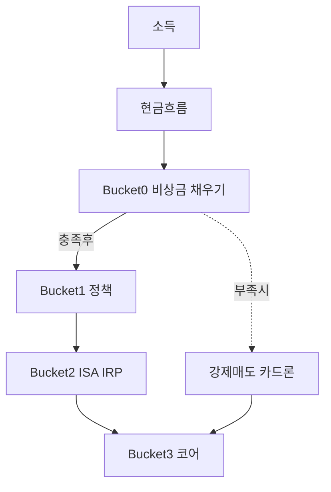
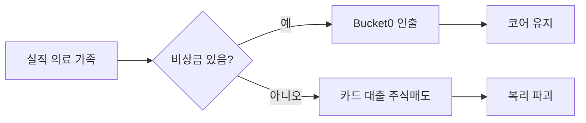

# 비상금 (Emergency Fund) — Bucket 0 완전 가이드

> **면책**: 본 문서는 교육 목적이며, 특정 개인·법인에 대한 투자·세무·법률 자문이 아닙니다. 금융상품 금리·한도·보호 한도는 변경될 수 있으므로 실행 전 금융기관·공식 안내를 확인하세요.

## 메타

| 항목 | 내용 |
|------|------|
| 최종 검증일 | 2026-05-24 |
| 정책·법령 기준일 | 2025-12-31 확정, 2026 개편 별도 표기 |
| 난이도 | L3 (Deep) — [READER-GUIDE](../docs/READER-GUIDE.md) |
| 예상 읽기 시간 | 45~55분 |
| 관련 bucket | **Bucket 0** (전 투자·정책상품 전제) |

## 0. 이 편 읽기 전 (5분)

| 항목 | 내용 |
|------|------|
| **난이도** | L3 (Deep) — [READER-GUIDE §L등급](../docs/READER-GUIDE.md) |
| **선수** | [compound-interest-and-time-value](compound-interest-and-time-value.md) |
| **이번 편에서 쓰는 기호** | M(월지출), Bucket 0, CMA·MMF |
| **복습 한 줄** | 복리 = 이자가 원금에 다시 붙는 구조 — 급매도 시 파괴 |

## TL;DR

1. **비상금**은 실직·의료·가족 돌발 등에 **며칠~몇 달 내** 쓸 수 있는 **현금성** 자산이다 — 목표는 수익이 아니라 **유동성·심리적 안전망**이다.
2. 일반 가이드는 **순유동 월 지출의 3~6개월**이며, 고정비·부양·변동소득에 따라 **3~12개월**로 조정한다.
3. **CMA·파킹통장·MMF** 등은 적합하고, **주식·QLD·코스닥 테마**는 비상금으로 **부적합**하다.
4. **청년도약·[ISA](../06-korea-policy/isa.md)·DB 적립금**은 역할이 다르다 — 비상금과 **계좌·마음**을 분리한다.
5. 비상금 없이 Bucket 3만 채우면 하락장+소득 중단 시 **저점 매도** → [compound-interest-and-time-value](compound-interest-and-time-value.md)의 복리가 파괴된다.

## 1. 한 줄 정의 + 왜 중요한가

!!! info "비상금 (Emergency Fund)"
    예상 못한 지출·**소득 중단**에 대비한 **현금성** 자금. 목표는 수익이 아니라 **며칠~수개월 내** 쓸 수 있는 것 — [time-horizon-and-buckets](../04-portfolio/time-horizon-and-buckets.md)의 **Bucket 0**.

!!! info "Bucket"
    시간·목적별 **자금 슬롯**(0 비상금 → 3 코어 등)

**정의**: **비상금(Emergency Fund)** 은 예상치 못한 지출이나 **소득 중단**에 대비해, 원금 변동 없이(또는 극소 변동으로) **즉시~수일 내** 인출 가능한 자금 슬롯이다.

!!! info "PV (Present Value)"
    미래·과거 현금흐름을 오늘 가치로 환산한 금액.

**왜 중요한가 (장기 자산 형성·bucket 연결)**:

| 없을 때 | 장기에 미치는 영향 |
|---------|-------------------|
| 주식 −30% + 실직 | 코어 ETF **저점 매도** |
| 카드·마이너스 통장 | **이자 복리**로 부채 확대 — [debt-and-interest](debt-and-interest.md) |
| “기회”라며 Bucket 0 전액 투입 | [time-horizon-and-buckets](../04-portfolio/time-horizon-and-buckets.md) 순서 붕괴 |

!!! info "FV (Future Value)"
    미래 시점 가치 — 저축·투자 **목표액** 설계에 씀

**이 개념을 모르면 생기는 실수:**
- 비상금 없이 전부 ETF에 투자하다가 갑작스러운 실직 시 코스피 최저점에서 팔아야 한다.
- "신용카드 한도가 있으니 비상금은 없어도 된다"는 착각 — 카드는 이자가 붙는 **부채**다.
- 청년도약계좌를 비상금으로 생각하다가 중도해지 패널티를 물게 된다.

비상금은 **수익률이 낮아도** 포트폴리오 전체의 **기대 FV를 올리는** 보험에 가깝다. [passive-vs-active](../04-portfolio/passive-vs-active.md)에서 말하는 “코어를 지키는 인프라”다.

## 2. 선수 지식 / 이후 읽을 것

**선수**:
- [compound-interest-and-time-value.md](compound-interest-and-time-value.md) — 왜 급하게 팔면 손해인지

**이후**:
- [cash-flow-basics.md](cash-flow-basics.md) — 비상금을 채울 **저축률**
- [debt-and-interest.md](debt-and-interest.md) — 고금리 부채 vs 비상금 우선순위
- [time-horizon-and-buckets.md](../04-portfolio/time-horizon-and-buckets.md)
- [youth-leap-account.md](../06-korea-policy/youth-leap-account.md) — Bucket 1과 구분

## 3. 직관·비유

**에어백**: 사고가 나야 펴지는 장치다. 매일 펴고 다니면(전액 주식) 운전이 불편하고, 사고 시 **늦게** 펴질 수 있다. 예를 들어, 직장인 A씨가 "어차피 비상금은 이자가 낮으니 전부 ETF로"라고 했다가 갑작스러운 실직 시 ETF가 -30%인 시점에 팔아야 했다. **비상금이 없으면 최악의 타이밍에 투자를 청산하게 된다.**

**소화기**: 화재(돌발 지출)에 **즉시** 쓴다. "불이 안 나면 이자 높은 곳에 넣자"는 **투자** 사고이고, 비상금은 **소화** 사고다. 소화기가 있어야 집이 전소되지 않듯, 비상금이 있어야 코어 포트폴리오가 살아남는다.

**운동선수의 휴식**: 장기 훈련(복리)을 위해 **부상 방지**·회복 슬롯이 있다. 비상금은 재무적 **오버트레이닝**을 막는다. 쉽게 말하면, 비상금은 **포트폴리오 전체의 기대 FV를 지키는 보험**이다.

**이중 계좌 심리**: "투자 통장"과 "비상 통장"을 물리적으로 나누면, 앱에서 주식 탭을 열 때 **비상금을 건드릴 마찰**이 생긴다. 예를 들어, 직장인 B씨가 비상금과 ISA 납입금을 같은 계좌에 두었다가 급등장에 "이번 한 번만"이라며 비상금까지 투입한 사례가 있다. **계좌 분리는 행동 설계의 핵심이다.**

**DB·퇴직금 착각**: "회사에 큰 돈이 있다"는 안심과 "내일 쓸 수 있다"는 유동성은 다르다. 재직 중 DB는 [db-pension](../06-korea-policy/db-pension.md)처럼 **해지·수령 조건**이 있어 비상금 대체가 되지 않는다. 퇴사 후 [IRP](../06-korea-policy/irp.md) 이전을 비상금으로 쓰려면 **과세·운용·인출 규칙**까지 이해해야 하며, 교육 프레임에서는 **별도 슬롯**으로 둔다.

## 4. 정식 개념·용어

| 용어 | English | 정의 |
|------|------|----------------|
| 순유동 지출 | Net monthly burn | 필수 생활비(월세·식비·보험·대출 이자 등) |
| 유동성 | Liquidity | 빠르게 현금화 가능한 정도 |
| CMA | Cash Management Account | 증권사 연계 수시입출금 |
| MMF | Money Market Fund | 단기 금융시장 펀드, T+1 등 |
| 파킹통장 | Parking account | 입출금 편의, 낮은 금리 |
| 예금자보호 | Deposit protection | 1인 1금융회사 **5천만 원** 한도(원리금 합, 제도 확인) |
| Bucket 0 | — | 본 저장소의 비상금·초단기 슬롯 |

### 4a. 핵심 용어 (본문 등장 순)

> 복습용. 정의는 §4 본표·[glossary](../00-roadmap/glossary.md)·본문 `!!! info` 박스.

| 용어 | 한 줄 | 관련 이론 | glossary |
|------|------|------|----------------|
| 순유동 지출 | 필수 생활비 | §4 | [glossary](../00-roadmap/glossary.md#순유동-지출) |
| 유동성 | 빠르게 현금화 가능한 정도 | §4 | [glossary](../00-roadmap/glossary.md#유동성) |
| CMA | 증권사 연계 수시입출금 | §4 | [glossary](../00-roadmap/glossary.md#cma) |
| MMF | 단기 금융시장 펀드, T+1 등 | §4 | [glossary](../00-roadmap/glossary.md#mmf) |
| 파킹통장 | 입출금 편의, 낮은 금리 | §4 | [glossary](../00-roadmap/glossary.md#파킹통장) |
| 예금자보호 | 1인 1금융회사 **5천만 원** 한도 | §4 | [glossary](../00-roadmap/glossary.md#예금자보호) |
| Bucket 0 | 본 저장소의 비상금·초단기 슬롯 | §4 | [glossary](../00-roadmap/glossary.md#bucket-0) |

## 5. 메커니즘

### 5.1 Bucket 우선순위에서의 위치

### 5.2 돌발 이벤트 → 자금 원천

### 5.3 적합·부적합 수단 (한국, 교육용)

| 수단 | 적합도 | 이유 |
|------|------|----------------|
| 파킹·CMA | ◎ | 즉시성, 원금 안정 |
| MMF | ○ | 약간 수익, T+1 |
| 정기예금(만기 전) | △ | 해지 시 불이익 |
| 주식·ETF·QLD | ✕ | 변동성 |
| DB 퇴직연금 | ✕ | 해지·수령 조건 — [db-pension](../06-korea-policy/db-pension.md) |
| 청년도약 | ✕ | 중도해지·목적 제한 — [youth-leap-account](../06-korea-policy/youth-leap-account.md) |

## 6. 수식·모델

**목표 비상금 (기본식)**:

| 기호 | 이름 | 이 식에서 의미 |
|------|------|----------------|
| **r** | 할인율·수익률 | 기간당 이자·요구수익률 |
| **n** | 기간 | 연·월 등 복리·할인에 쓰는 횟수 |
| **PV** | 현재가치 | 오늘 시점으로 환산한 금액 |
| **FV** | 미래가치 | 미래 시점의 목표·결과 금액 |

\[
\text{비상금 목표} = \text{월 순유동 지출} \times N
\]

**식 (기호)**: 비상금 목표 = 월 순유동 지출 ×**N**

**식 (기호)**: 비상금 목표 = 월 순유동 지출 ×**N**

**식 (기호)**: 비상금 목표 = 월 순유동 지출 ×**N**

**읽는 법**: **비상금 목표**와 **월 순유동 지출**의 관계를 위 식으로 쓴다. 경제·재무 해석은 변수표 「이 식에서 의미」와 [DEPTH-STANDARD](../docs/DEPTH-STANDARD.md) 기호 예제를 맞춘다.
- \(N\) = 3~6 (일반), 6~12 (불안정 소득·부양·자영업 등)

**충전 속도 (교육용)**:

| 기호 | 이름 | 이 식에서 의미 |
|------|------|----------------|
| **r** | 할인율·수익률 | 기간당 이자·요구수익률 |
| **n** | 기간 | 연·월 등 복리·할인에 쓰는 횟수 |
| **PV** | 현재가치 | 오늘 시점으로 환산한 금액 |

\[
\text{개월 수} = \frac{\text{목표} - \text{현재 비상금}}{\text{월 저축 가능액}}
\]

**식 (기호)**: 개월 수 = (목표 - 현재 비상금) / (월 저축 가능액)

**식 (기호)**: 개월 수 = (목표 - 현재 비상금) / (월 저축 가능액)

**식 (기호)**: 개월 수 = (목표 - 현재 비상금) / (월 저축 가능액)

**읽는 법**: **r**와 **n**의 관계를 위 식으로 쓴다. 경제·재무 해석은 변수표 「이 식에서 의미」와 [DEPTH-STANDARD](../docs/DEPTH-STANDARD.md) 기호 예제를 맞춘다.

**기회비용**: 비상금 r=2%, 주식 기대 r=7%라도 **비상금 부족 시 실현 손실**이 더 클 수 있다 — 확률적 사고 비용.

---

 주식 기대 r=7%라도 **비상금 부족 시 실현 손실**이 더 클 수 있다 — 확률적 사고 비용.

## 7. 한국 적용

### 7.1 2025년 기준 (확정)

| 항목 | 내용 |
|------|------|
| **예금자보호** | 예금·적금 등 원리금 합산 **5,000만 원** / 금융회사당 (제도 상세는 예금보험공사 안내) |
| **파킹·CMA** | 증권사·은행 앱 연동, 금리는 시중 금리에 연동 |
| **MMF** | 환매까지 **영업일 1일** 등 — “당일 100%” 필요 시 CMA 병행 |
| **신용카드** | 비상금 **대체 불가** — 이자율이 높으면 [debt-and-interest](debt-and-interest.md) 악화 |
| **4대보험·실업급여** | 일부 리스크 완화이나 **지급 지연·조건** 있음 — 비상금 대체 아님 |

### 7.2 2026년 개편·시행 예정 (해당 시)

| 항목 | 2025 | 2026 (공식 확인) |
|------|------|----------------|
| 시중 예금 금리 | 인하/인상 사이클 | 비상금 **r** 변동 — 목표액(원)은 유지, 수익 기대 X |
| 청년도약·ISA | 별도 한도·세제 | Bucket 1·2와 **혼합 보관** 금지 |

**법·정책 근거**: 예금자보호법, 금융소비자보호법, 각 금융상품 약관 — [references/sources.md](../references/sources.md).

### 7.3 수단별 비교 (2025 맥락, 교육용)

| 수단 | 예상 유동성 | 원금 변동 | 이자(대략) | 비고 |
|------|------|------|------|----------------|
| 입출금·파킹 | 당일 | 거의 없음 | 낮음 | 생활비와 **분리** 권장 |
| CMA | 당일~익일 | 거의 없음 | 낮음~중 | 증권사 앱 하나로 정리 |
| MMF | T+1 | 매우 작음 | 중 | 비상금 **일부** |
| 정기예금 | 만기 전 해지 시 불이익 | 없음 | 중 | **확정 지출**용과 구분 |
| 주식형 ETF | 수일·가격 변동 | **큼** | 불확실 | Bucket 3 |

금리는 **한은 기준금리·시중금리**에 연동되므로 “비상금 이자가 낮다”는 불만은 정상이며, **기회비용**으로 치환하지 않는다.

### 7.4 비상금과 투자 심리

비상금이 있으면 하락장에서 (1) **생계 불안**으로 인한 매도, (2) **FOMO**로 비상금 전액 투입 — 두 극단을 줄인다. [fomo-and-trading-hours](../05-behavioral/fomo-and-trading-hours.md)와 연결해, “공포 매도”의 재무적 원인이 **Bucket 0 부재**인지 점검한다.

### 7.5 이벤트별 인출 시뮬 (가상)

| 이벤트 | 예상 비용 | 비상금 커버 | 부족 시 |
|------|------|------|----------------|
| 실직 4개월 | 1,000만 | 1,680만 풀 | — |
| 응급 의료 | 300만 | 동일 풀 | — |
| 자동차 수리 | 150만 | 동일 풀 | — |
| **합산 돌발** | 1,450만 | 잔여 230만 | 다음 6개월 저축 가속 |

한 해에 여러 이벤트가 겹치면 **N개월**을 상향 재설정한다.

**보험과의 역할 분담**: 실손·암·상해보험은 **특정 리스크**를 이전하고, 비상금은 **공제·미보장 구간·생활비 공백**을 메운다. 보험이 있어도 **면책·지급 지연** 때문에 Bucket 0은 유지하는 것이 일반적이다.

## 8. 숫자 예제 (가상)

> 모든 인물·금액은 가상입니다.

### 예제 1: 가상 직장인 A — 6개월 규칙

| 항목 | 값 |
|------|-----|
| 월 순유동 지출 | **M** (만 원 단위, 교육용) (가상) |
| N | 6개월 |
| **목표 비상금** | **M** (만 원 단위, 교육용) |
| 현재 보유 | **M** (만 원 단위, 교육용) |
| 월 추가 저축 | **M** (만 원 단위, 교육용) |
| **충전 기간** | 약 **6.4개월** |

### 예제 2: 가상 직장인 B — 부모 지원 가능

| 항목 | 값 |
|------|-----|
| 월 지출 | **M** (만 원 단위, 교육용) |
| N | 3개월 (가족 지원 인지) |
| **목표** | **M** (만 원 단위, 교육용)** |
| 리스크 | 지원 중단 시 **즉시 6개월**으로 상향 검토 |

### 예제 3: 가상 C — 비상금 0 + 코스피 ETF 전액

| 시나리오 | 결과 (교육용) |
|----------|----------------|
| 포트폴리오 | 3,**M** (만 원 단위, 교육용) ETF, 비상금 0 |
| 실직 + 지출 6개월 | ETF −25% 시 매도 → **손실 확정** + 이후 상승분 상실 |
| 대안 | 비상금 **M** + ETF **P**이면 ETF **유지** 가능 |

### 예제 4: 보너스 **M** (만 원 단위, 교육용) 배분 (가상 D)

| 용도 | 금액 | bucket |
|------|------|----------------|
| 비상금 보강 | **M** | 0 |
| 고금리 카드 상환 | **M** | 0(부채) |
| ISA 추가 | **T** (교육용) | 2b |

### 예제 5: N 개월 결정 체크리스트 (가상)

| 질문 | 예 → N 조정 |
|------|-------------|
| 배우자 소득 있음? | 3~4개월 가능 |
| 자영업·수수료 소득? | **9~12개월** 검토 |
| 부모·자녀 부양? | +1~2개월 |
| 고정 대출 원리금 큼? | 지출에 포함 후 N 산정 |
| 실업급여 수급 가능? | N 소폭 하향 가능(조건 확인) |

### 유지·리밸런싱 규칙 (가상 가구)

1. **분기 1회**: 목표액 대비 ±20% 이탈 시만 보강·일부 Bucket 3 이전(초과분).  
2. **비상금 사용 후**: 다음 6개월 **저축률 +5%p** 임시 상향(가상 규칙).  
3. **계좌 분리**: 생활비 통장과 **라벨링** — “비상금 CMA”만 Bucket 0.

### 커플·가구 단위 (교육용)

| 모델 | 설명 |
|------|------|
| **합산** | 가구 지출 기준으로 N개월 × 1개 풀 |
| **분리** | 각자 3개월 + 공동 3개월 (이중 계상 주의) |

문서는 **단일 가구 합산**을 기본으로 한다. 법적·세무적 공동명의는 약관·상속 이슈 별도.

## 9. FAQ

**Q1. 정확히 6개월이 필수인가요?**  
**A1.** **아니다.** 고정비·가계부채·소득 안정성에 따라 3~12개월. 자영업·프리랜서는 **상단**을 검토한다.

**Q2. 청년도약계좌에 비상금을 넣어도 되나요?**  
**A2.** **권장하지 않는다.** 중도해지·가입 요건·목적이 **장기 정책 저축**이다 — [youth-leap-account](../06-korea-policy/youth-leap-account.md).

**Q3. ISA는요?**  
**A3.** Bucket 2b **투자 슬롯**. 비상금과 **별도 계좌**로 분리해 “건드리지 않기” 쉽게 한다 — [isa](../06-korea-policy/isa.md).

**Q4. 비상금에도 이자를 받아야 하나요?**  
**A4.** **있으면 좋지만 목표 아님.** 1~2%p와 **7%p 기대**를 혼동하지 않는다.

**Q5. DB 퇴직연금을 비상금으로 쓸 수 있나요?**  
**A5.** 재직 중 **일반적으로 불가**. 퇴사·이전 절차 필요 — [db-pension](../06-korea-policy/db-pension.md).

**Q6. 전세금·결혼 자금은 비상금인가요?**  
**A6.** **아니다.** 확정 지출은 **단기 목표 통**(1~3년)으로 별도 설계 — [time-horizon-and-buckets](../04-portfolio/time-horizon-and-buckets.md).

**Q7. 다 채웠으면 다음은?**  
**A7.** Bucket 1 → 2 → 3 순 — [cash-flow-basics](cash-flow-basics.md), [asset-allocation](../04-portfolio/asset-allocation.md).

**Q8. 달러 현금을 비상금에 넣나요?**  
**A8.** **원화 지출**이 주면 원화 유동성 우선. 해외 체류 계획이 있으면 **일부** 분리(교육용).

**Q9. 비상금을 채운 뒤 줄여도 되나요?**  
**A9.** 지출·부양·소득 안정성이 **개선**되면 N을 6→4로 **재검토**할 수 있다. 다만 “투자 기회”만으로 축소하지 않는다.

**Q10. MMF와 CMA를 동시에 쓰나요?**  
**A10.** **당일·익일** 인출 요구에 따라 병행. 전액 MMF만 두면 T+1 지연 리스크.

**Q11. 해외 주식만 보유해도 원화 비상금이 필요한가요?**  
**A11.** **생활비 통화가 원화**이면 원화 유동성이 우선. 해외 ETF 매도는 환전·T+2·변동성이 있다 — [overseas-equities-intro](../03-markets/overseas-equities-intro.md).

**Q12. 이미 ISA 납입을 시작했는데 비상금이 부족합니다. 순서를 바꿔야 할까요?**  
**A12.** **예스.** Bucket 0이 부족하면 ISA 납입을 일시 줄이고 비상금을 먼저 채우는 것이 장기적으로 유리하다. 비상금 없이 하락장에서 ISA 내 ETF를 팔면 복리 효과를 깨는 것과 같다.

**Q13. 부양가족이 생기면 비상금을 얼마나 늘려야 하나요?**  
**A13.** 부양 인원이 늘면 **N개월을 +1~2개월 상향** 검토한다. 자녀 의료비·교육비 등 예상치 못한 지출이 늘어나기 때문이다. 다만 비상금 과다(24개월+)는 장기 기회비용이므로, **9개월 수준에서 초과분은 Bucket 2b**로 이전하는 규칙을 미리 정해 둔다.

## 10. 함정·리스크·한계

- “금리가 낮다”며 **전액 주식·QLD** — [leveraged-etf-qqq-qld](../04-portfolio/leveraged-etf-qqq-qld.md) 위험
- **신용카드 한도**를 비상금으로 착각
- **보험 해지 환급금**을 유동성처럼 쓰기 — 해지 손실·보장 공백
- 비상금과 **생활비 통장** 혼용 → 무의식 소비
- 예금자보호 **5천만 원** 초과 분산 필요 시 **금융회사 분산**(제도 확인)
- 문서의 개월 수·금리는 **가정**이며 개인 상황마다 다름
- **과도한 비상금**(24개월+)은 장기 **기회비용** — 목표 달성 후 초과분만 Bucket 2b·3으로 **이전 규칙**을 미리 정해 둔다
- 지진·재난 등 **극단 리스크**는 보험·가족 지원과 **다층 방어** — 비상금만으로 모든 재난을 커버하지 못함

---

**Q. 실무에서는?**  
교과서 식·기호를 그대로 적용하기 전에 **수수료·세금·데이터 시점**을 분리한다. 숫자는 [DEPTH-STANDARD](../docs/DEPTH-STANDARD.md)처럼 기호만 먼저 맞추고, 법령·시장 수치는 §8 표·외부 출처로 갱신한다.

## 11. 심화 읽기

- [references/sources.md](../references/sources.md) — 예금보험공사, 금융감독원
- [cash-flow-basics.md](cash-flow-basics.md)
- [real-estate-basics.md](../07-real-estate/real-estate-basics.md) — 전세 리스크(별도 목표 통)
- 교재: 『파이어족 이후의 경제학』(유동성·심리), 『가장 어려운 돈 관리』
- [geographic-diversification](../04-portfolio/geographic-diversification.md) — 해외 체류 시 비상금 통화

### 실무 체크리스트 (분기 1회)

- [ ] 목표액 = 월 지출 × N 재계산 (지출 변동 반영)  
- [ ] CMA·MMF 잔액 합 = 목표의 90~110%  
- [ ] 생활비 통장과 **이체 규칙** 유지  
- [ ] 카드 **전월 결제액**이 예산 초과하지 않았는지  
- [ ] 비상금 인출 이력 있으면 **6개월 회복 계획** 기록  

**메모**: 인출 후에는 [cash-flow-basics](cash-flow-basics.md)에서 3~6개월간 **저축률 임시 상향**을 검토하고, 회복이 끝나면 Bucket 2b·3 자동이체를 재개한다. 비상금은 “쓰지 않는 것”이 성공이며, **인출 0건인 해**도 재무 건강의 지표가 될 수 있다. 목표액 달성 후에도 **분기 점검**만 유지하면 된다. (가상 가구 기준)

## 12. 스스로 점검 퀴즈

1. Bucket 0의 **1순위 목표**는 수익률인가, 유동성인가?
2. 월 지출 300만 원, N=5이면 목표 비상금은?
3. QLD를 비상금으로 쓰면 안 되는 이유 두 가지는?
4. 청년도약을 비상금으로 쓰기 어려운 이유는?
5. 비상금 충족 후 이동할 bucket 순서는?
6. 예금자보호 한도를 초과할 때 고려할 것은?

??? note "정답 힌트"

    1. 유동성(·심리적 안전) · 2. 1,500만 원 · 3. 변동성·즉시 인출 시 손실 확정 · 4. 중도해지·정책 목적 · 5. 1→2a/2b→3→4 · 6. 금융회사 분산·원리금 합산