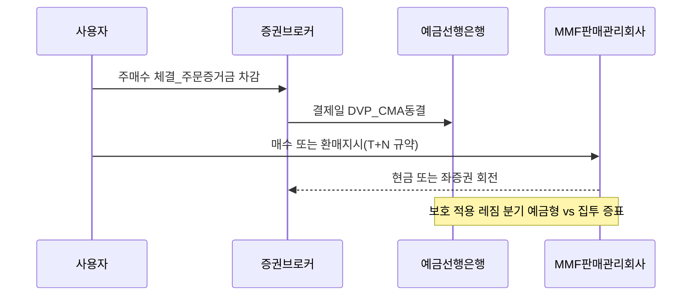

# 단기 현금 상품 학습 노트 — CMA·MMF·양도성예금증서(RP)·요구불·파킹·Bucket 0

> **면책**: 본 문서는 교육 목적이며, 특정 개인·법인에 대한 투자·세무·법률 자문이 아닙니다. 각 상품은 자본시장법·판례·내부 규정·세제 개편에 따라 구조와 과세 방식이 달라질 수 있으며, 특히 **머니마켓펀드(MMF)·집합투자증권** 과 **예금 보호 적용 여부**는 증빙·약관별로 차이가 있으므로 **계약 체결 전 공식 분양·설명서·예금보험관리공사 안내를 반드시 대조하십시오.** 본문의 모든 수치·등장 인물은 **교육용 가상 사례**입니다.

## 메타

| 항목 | 내용 |
|------|------|
| 최종 검증일 | 2026-05-25 |
| 정책·법령 기준일 | 2026-05-25 (연도별 제도 행렬은 §7 참조 — 2025 확정값 vs 2026 개편·논의 사항 명시) |
| 난이도 | L4 (Graduate) — [READER-GUIDE](../docs/READER-GUIDE.md) |
| 예상 읽기 시간 | 170~205분 |

## 0. 이 편 읽기 전 (5분)

| 항목 | 내용 |
|------|------|
| **난이도** | L4 (Graduate) — [READER-GUIDE §L등급](../docs/READER-GUIDE.md) |
| **선수** | 없음 |
| **이번 편에서 쓰는 기호** | 본문 §4·§4a 표 참고 |
| **복습 한 줄** | L3 선수 편을 먼저 읽으면 수식이 수월함 |

## 관련 bucket

본 문서는 주로 **[Bucket 0]** — 초단기 유동성·비상금·주식 매수 준비금의 정책상 **슬롯 인프라**를 다룹니다. 버킷 이론의 전체 타임라인과 위험버킷 간 이동은 [time-horizon-and-buckets.md](../04-portfolio/time-horizon-and-buckets.md) 및 [compound-interest-and-time-value.md](compound-interest-and-time-value.md)와 연결하십시오.


## TL;DR

1. **요구불예금(입출금·파킹)** 은 기능적으로 **내일이라도 즉시** 쓸 수 있는 **표준 현금 저장소**지만, 명목금리는 정책금리 구조에 민감하고 **통화량·예대마진** 속에서 매우 낮거나 제한적 우대가 존재하는 경우가 많다 — 기능은 높지만 **실질 사후 수익**은 종종 마이너스에 가까울 수 있다.
2. **CMA**(증권사 현금관리통장 패밀리)는 **증권거래결제·주문 동결·종합자산** 관점에서 **입출금+결제 허브** 역할을 하며, 내부적으로는 **머니마켓펀드·MMF 종류의 유동화 자산**(사업자별 용어부조) 과 **예금 신상품**(사업자·상품마다 예금 또는 집합투자증권)이 결합되어 **예금 보호 또는 집합투자증권 구조**(혼재) 가능성을 항상 점검해야 한다 — **설명 의무 교부 자료** 단일 문장 요약 금지.
3. **MMF** 및 **양도성예금증서(RP)·레포 형태의 단기자금 운용**은 기업·기관 레벨에서는 **금리·유동성·담보·신용**(카운터파티 리스크) 관리 코어지만, 소매 프레임에서는 **환매 절차·결제 리드타임**(T+N 영업일)·**세후 배당 과세**(일반 과세 레짐)·**판매보수**(TER 상위 포함) 때문에 **표면 금리 ≠ 체결 환금 가치**로 이해해야 한다 — **예금형 MMF 과 집합투자증권형 MMF**를 혼동하지 말 것.
4. 한국에서는 **예금자보호**가 **예금 등 채무**에 적용되는 **「1금융사·1인 원리금 5천만 원**(과거 구조 참고)·**증권·집합투자증권은 원칙 미적용**(부분 신탁구조 논외)** 이라는 **사전 구속** 프레임이 강하게 작동한다 — 2026년 시간축에서는 **판매 약관 디지털화·설명 증거화** 같은 **금융소비자보호**(감독 업무 패러다임 변화 가능)까지 합산해 **설계·증빙**을 해야 한다.
5. **비상금**([emergency-fund.md](emergency-fund.md))은 장기 CAGR 경쟁 대상이 아니라 **서프라이즈 소비·실직 버퍼**다 — 따라서 **금리 순위 높지만 환매 3영업일+벌크 컷**(가상)·**판매 플래그**(가상) 같은 장벽 상품과는 **격리 라벨링**해야 한다 — 본 교재는 「Bucket 0 = 비상 버퍼 + 결제 허브 + 저위험 임시주차」の **레이어링**을 권역 제안한다.
6. **투자 계좌**(국내외 주식·ETF 계열,[etf-index-funds.md](../03-markets/etf-index-funds.md)) 과의 경계에서는 **변동성·세금·양도 거래 비용**(수수료+스프레드) 때문에 **실질 기대 초과수익**이 짧게 잡히는 구간이라면 버킷 0 차확보가 우선이라는 **평준화 결론**이 자주 나타난다 — 개인 레버리지·신용마진은 본 문서 범위 밖이나 **대출 금리 > 단기현금 수익**이면 [debt-and-interest.md](debt-and-interest.md)와 정합 점검.


## 1. 한 줄 정의 + 왜 중요한가

**정의(한 줄)**: **단기 현금 상품**은 **원금 변동을 통제**하면서(또는 원금 변동을 **제한적·투명하게 공시**하면서) **며칠~수주 이내** 현금화할 수 있는 **금융契約의 집합**으로, **요구불예금·(CMA 계열) 결제형 예치·MMF·RP/레포** 등이 대표적이다.

**왜 중요한가** (장기 자산 형성·bucket 연결):

| 관점 | 직관 | 연결 문서 |
|------|------|----------------|
| **행동** | 주식 하락장+소득 중단 시 **저점 청산**을 막는 **마찰 설계** | [emergency-fund.md](emergency-fund.md), [time-horizon-and-buckets.md](../04-portfolio/time-horizon-and-buckets.md) |
| **세후 실질** | 명목 금리 − 기대인플레 − 조세·수수료 ≈ **체감 가치** | [compound-interest-and-time-value.md](compound-interest-and-time-value.md) |
| **제도** | 예금보호·집합투자 **구조 혼재** → **오판 시 치명적** | 본 문서 §4~§7 |
| **정책금리** | 단기 금리 국면은 **MMF·RP 베이스라이트**를 이동 | [../02-economics/macro-04-monetary-policy-qe.md](../02-economics/macro-04-monetary-policy-qe.md) (전달경로) |

**L4 메모**: MBA·CFA 프레임에서 단기현금은 **Working capital + Liquidity management**의 일부이며, 가계에 이식하면 **소비·대출·투자**의 **동시성 제약**을 푸는 **동적 프로그래밍 상태변수**에 가깝다 — 본 저장소 난이도에서는 수식은 §6에 **간략 근사**로만 둔다.


## 2. 선수 지식 / 이후 읽을 것

**선수 (최소)**:

- [compound-interest-and-time-value.md](compound-interest-and-time-value.md) — 명목·실질·세후 복리
- [cash-flow-basics.md](cash-flow-basics.md) — 현금흐름표·FCF 직관
- [emergency-fund.md](emergency-fund.md) — Bucket 0 심리·규모 가이드
- [debt-and-interest.md](debt-and-interest.md) — 단기현금 vs 고금리 부채 상계 논리

**이후 (심화·인접)**:

- [../03-markets/bonds-fixed-income.md](../03-markets/bonds-fixed-income.md) — 단기·중기 금리 곡선
- [../03-markets/etf-index-funds.md](../03-markets/etf-index-funds.md) — 변동성 자산과의 경계
- [../04-portfolio/asset-allocation.md](../04-portfolio/asset-allocation.md) — 현금 비중·리밸런싱
- [../02-economics/macro-02-money-inflation.md](../02-economics/macro-02-money-inflation.md) — 실질금리·인플레


## 3. 직관·비유

**주차장 층(Layer 0~2)**: **지하 1층**은 **출구 바로 앞**(요구불·파킹) — 수익은 낮지만 **출차 10초**. **지하 2층**은 **엘리베이터+큐**(MMF 환매 T+N) — 약간 기다리면 **주차요금 할인**. **지상 옥외**는 **주식·ETF** — **날씨(변동성)** 에 노출. 비상 화재(실직) 시 **지하 1만** 쓰는 것이 **행동규범**이다.

**현금의 온도**: **뜨거운 현금**은 지갑·즉시이체, **미지근한 현금**은 CMA·파킹, **차가운 현금**은 정기·채권 — 온도가 낮을수록 **수익-유동성 스펙트럼**에서 **수익 쪽**으로 이동하지만 **화재 대응력**이 떨어진다.

**RP = 단기 담보대출의 거울상**: A가 **채권·양도성예금증서**를 담보로 **단기 자금**을 빌리고, B는 **레포이자**를 받는다 — 기관간 **신용·담보 헤어컷**이 핵심. 소매는 직접보다 **간접 MMF·채권형 펀드**로 노출되는 경우가 많다.


## 4. 정식 개념·용어

| 용어 | 한글 | English | 정의 |
|------|------|------|----------------|
| Demand deposit | 요구불예금 | Demand deposit | 예금자가 **출급을 청구할 때** 지급 의무가 성립하는 **즉시성 예금** |
| Parking account | 파킹·입출금 통장 | Parking / checking-like | 은행 **마케팅 명칭**의 일종 — 요구불과 유사한 **결제 편의** 강조 |
| CMA | 현금관리계좌 | Cash Management Account | 증권사 **결제·현금 보관** 허브 — 내부 트렁크가 **예금·집투** 혼재 가능 |
| MMF | 머니마켓펀드 | Money market fund | **단기 금융상품** 위주 **집합투자** — 환매·과세·보호 **펀드 약관** 따름 |
| TER | 총보수 | Total expense ratio | 운용·판매·수탁 등 **연율화 비용** 합의 근사 |
| RP / Repo | 환매조건부매매 | Repurchase agreement | **매도+재매수 약정** 형태의 **단기 자금조달** — 담보·헤어컷 |
| CD / 양도성예금증서 | 양도성예금증서 | Negotiable CD | **양도 가능**한 예금증서 — **단기금리 벤치마크**·**담보** 재료 |
| 예금보호 | 예금보험 적용 | Deposit insurance | 「예금자보호법」 등에 따른 **보호 한도·대상 채무** — **증권·집합투자 원금 비보호** 원칙 상기 |
| T+N 결제 | T+N 영업일 결제 | T+N settlement | **환매·입금**까지 **영업일 N일** 소요 가능 — **Liquidity 레짐 전환점** |
| Bucket 0 | 버킷 0 | Liquidity sleeve | 장기 CAGR 경쟁 대상 아님 — **실행력·내구성**(행동내구) 중시 |
| Breakage cost | 깨기 비용 | Breakage / early withdrawal | **중도 해지·패널티** 또는 **판매 중단**(가상)으로 인한 **기회비용** |
| Sweep | 스윕 | Automatic sweep | **잔여 현금 자동 재투입** — **설정 약관**으로 MMF 또는 예금형으로 연결 가능 |
| Tax drag | 과세저항 | Tax drag | **배당·이자 과세**(가정) 후 **복리 속도 저하** |
| Liquidity runway | 현금 활주로 | Liquidity runway | **고정비 대비 순현금 버퍼** 개월 환산 — 비상금 설계 변수 |

### 4a. 핵심 용어 (본문 등장 순)

> 복습용. 정의는 §4 본표·[glossary](../00-roadmap/glossary.md)·본문 `!!! info` 박스.

| 용어 | 한 줄 | 관련 이론 | glossary |
|------|------|------|----------------|
| Demand deposit | 예금자가 **출급을 청구할 때** 지급 의무가 성립하는 **즉시성 예금** | §4 | [glossary](../00-roadmap/glossary.md#demand-deposit) |
| Parking account | 은행 **마케팅 명칭**의 일종 | §4 | [glossary](../00-roadmap/glossary.md#parking-account) |
| CMA | 증권사 **결제·현금 보관** 허브 | §4 | [glossary](../00-roadmap/glossary.md#cma) |
| MMF | **단기 금융상품** 위주 **집합투자** | §4 | [glossary](../00-roadmap/glossary.md#mmf) |
| TER | 운용·판매·수탁 등 **연율화 비용** 합의 근사 | §4 | [glossary](../00-roadmap/glossary.md#ter) |
| RP / Repo | **매도+재매수 약정** 형태의 **단기 자금조달** | §4 | [glossary](../00-roadmap/glossary.md#rp-/-repo) |
| CD / 양도성예금증서 | **양도 가능**한 예금증서 | §4 | [glossary](../00-roadmap/glossary.md#cd-/-양도성예금증서) |
| 예금보호 | 「예금자보호법」 등에 따른 **보호 한도·대상 채무** | §4 | [glossary](../00-roadmap/glossary.md#예금보호) |
| T+N 결제 | **환매·입금**까지 **영업일 N일** 소요 가능 | §4 | [glossary](../00-roadmap/glossary.md#t+n-결제) |
| Bucket 0 | 장기 CAGR 경쟁 대상 아님 | §4 | [glossary](../00-roadmap/glossary.md#bucket-0) |
| Breakage cost | **중도 해지·패널티** 또는 **판매 중단** | §4 | [glossary](../00-roadmap/glossary.md#breakage-cost) |
| Sweep | **잔여 현금 자동 재투입** | §4 | [glossary](../00-roadmap/glossary.md#sweep) |
| Tax drag | **배당·이자 과세** | §4 | [glossary](../00-roadmap/glossary.md#tax-drag) |
| Liquidity runway | **고정비 대비 순현금 버퍼** 개월 환산 | §4 | [glossary](../00-roadmap/glossary.md#liquidity-runway) |


## 5. 메커니즘

### 5.1 레이어링(버킷 0 내부 세분화)

```mermaid
flowchart LR
  subgraph LayerA [결제허브_즉시]
    DD[요구불예금]\nParking
    CM[증권CMA\n결제연동]
  end
  subgraph LayerB [단기저위험_수일내]
    MMF[머니마켓펀드]
    NOTES[ 단기머니마켓\n유형 펀드]
  end
  subgraph LayerC [기관복제_직접접근_드묾]
    RP[양도성RP\n기관시장]
  end
  LayerA -->|Sweep| LayerB
  LayerB -.->|Counterparty분산| RP
```

**해석**: 가계 교육용으로는 **Layer A** 에 **실생활 카드청구·임대료·금융기관 내부 증거금** 버퍼를 두고, **Layer B** 는 **주식 매입 대기**(수일 허용) 및 **금리 업리프트**(가설) 노출 레이어다. Layer C 직매매는 정보·카운터파티 규모 장벽이 커본 문서에서는 **직관만** 제공한다.

### 5.2 자금 세탁 및 결제 순서(KYC·동결 포함)



**핵심**: **증거금 브릿지** 때문에 CMA 레이어는 **주식 시장 접속 인터페이스**가 동시에 **현금 카드**(은행 카드 기능 유무 사업자별)로 존재하며, **설명 교부 확인** 분쟚 포인트다.


## 6. 수식·모델 (간략 근사)

| 기호 | 이름 | 이 식에서 의미 |
|------|------|----------------|
| APR | 연 명목금리 | 예·적금 약정 이율 |
| τ | 세율(근사) | 이자 과세 종합 명목세율 |
| NMB | 월 순소비 | 비상금 runway 분모 |

**(1) 명목 거치 단순금리**(교육용 1개월 초과 근사, 상품 실제 적립은 월별 복리·일할 가능):

\[ \text{i}_{\text{month,eff}} \approx \left(1 + \frac{\text{APR}}{12}\right) - 1 \]

**읽는 법**: **APR**와 **τ**의 관계를 위 식으로 쓴다. 경제·재무 해석은 변수표 「이 식에서 의미」와 [DEPTH-STANDARD](../docs/DEPTH-STANDARD.md) 기호 예제를 맞춘다.
**유도 (L4)**:
1. **정의**: **APR**, **τ**, **NMB**를 동일 시점·동일 통화로 맞춘다. — 단위 불일치면 식이 무의미해진다.
2. **식 변형**: 양변을 정리해 목표 변수를 한쪽에 둔다. — 할인·복리는 **시점 이동**이 핵심이다.


**(2) 세후 실질금리**(소득세·지방세 **단일 종합 명목세율** \(\tau\) 가정 교육 — 실제 과세 종류별 세분 필요):

\[ r_{\text{after-tax,approx}} \approx i \cdot (1-\tau_{\text{i}})\quad (\text{이자 과세 레짐 간략 근사}) \]

**읽는 법**: **APR**와 **τ**의 관계를 위 식으로 쓴다. 경제·재무 해석은 변수표 「이 식에서 의미」와 [DEPTH-STANDARD](../docs/DEPTH-STANDARD.md) 기호 예제를 맞춘다.
**유도 (L4)**:
1. **정의**: **APR**, **τ**, **NMB**를 동일 시점·동일 통화로 맞춘다. — 단위 불일치면 식이 무의미해진다.
2. **식 변형**: 양변을 정리해 목표 변수를 한쪽에 둔다. — 할인·복리는 **시점 이동**이 핵심이다.


**(3) 현금 활주 runway**(비상 레이어만):

\[ \textbf{months}_{\textbf{liquidity}} = \frac{C_{\textbf{bucket0}}}{\text{NMB}} \quad,\quad \textbf{NMB}=\text{필수 월 순소비(Net monthly burn)}\]

**읽는 법**: **APR**와 **τ**의 관계를 위 식으로 쓴다. 경제·재무 해석은 변수표 「이 식에서 의미」와 [DEPTH-STANDARD](../docs/DEPTH-STANDARD.md) 기호 예제를 맞춘다.
**유도 (L4)**:
1. **정의**: **APR**, **τ**, **NMB**를 동일 시점·동일 통화로 맞춘다. — 단위 불일치면 식이 무의미해진다.
2. **식 변형**: 양변을 정리해 목표 변수를 한쪽에 둔다. — 할인·복리는 **시점 이동**이 핵심이다.


**해당 없음 표기 규모**: 채옵 블랙숄즈 등은 버킷 3 옵션군 문서 참고하라 — 본 문서는 버킷 0 제약 하 **미적용 명시 가능**.


## 7. 한국 적용

### 7.1 2025년 기준(확정·교육용 요약 매트릭스)

아래 표는 **「입문자가 교과서 순서대로 교차검증할 체크리스트」**이며 세율 수치 등은 **변경 가능**하여 **항상 공식처·약관**(금융감독원 ARS 분쟚사례, 예금보험공사 Q&A 포함) 재확인을 전제한다.

| 항목 | 2025 확정 교육용 관찰 포인트 | 비고 |
|------|------|----------------|
| 예금자보호(예금 해당) 대표 원리금 한도 교육 | **1금융기관당 1인 합산 보호**(전통 교육 수치 참고)·**증권·집합투자증권 일반 불포함**(원칙) | 신탁예금 특례 논외 |
| 증권사 CMA | **결제 허브+내부 트랜치 혼합** 가능 — **설명서 상 분류**(예금/집투) 라벨을 **증빙** | 모바일 UI 한 줄 레이블 금지 |
| MMF | **환매 T+1 또는 T+N** 패턴 — 명세서상 **판매예탁 신탁**(용어 교육) | 법정설명 교부 확인 |
| 양도성예금증서·RP 소매 간접 | 대부분 **간접** — **판매 회사 채무 아님** 이해 필요 | 카운터파티 교육 |
| 파킹 마켓팅 명칭 | 은행 **요구불과 유사 과세·보호 패턴 많음**(개별 차이) | **적정 대조 필요** |
| 과세 교육(가정 레짐) | **금융소득 분리 과세**(가정)·**종합 과세 교차 가능** 교육 | 국세청 FAQ 대조 필수 |

### 7.2 2026년 개편·시행 예정(시행 확정 불확실 항목은 문장으로 명시)

| 항목 | 2025 | 2026 (시행·논의·모니터링 톤 교육) |
|------|------|----------------|
| **금융소비자 디지털 설명증빙** | 상황별 | **설명 과정 타임라인**(가상)·**증빙 데이터** 증대 논점 |
| **ISA·청년 채널 제도**(주변 변수) | [../06-korea-policy/](../06-korea-policy/) 교차 참조 가능 | 시간축 **일몰·상한**(정책 변동) 교육 — 본 버킷0과 행위 분리 |
| **예금금리 디지털 상품 속도** | 시장화 | **우대 조건 복잡성** → **실질 APR 비교용 스프레드시트** 권장 |
| **집합투자 설명 카테고리** | 기존 | **MMF 카테고리 확장**(가설) 시 **판매 회사 교차비교 패널** 필요 |
| **국제 금리·환율** | 변동국면 | 매크로 변수는 [macro-04](../02-economics/macro-04-monetary-policy-qe.md) 교차 관찰 |
| **감독 디지털 공시 패널**(가설) | — | 「제도 패치 가능성 교육」 |

**법·정책 근거(교과서 학습 레퍼런스, 개정 조항 직접 인용 금지)**: 「예금자보호법」·자본시장법 체계(집합투자)·소득세법·금융소비자보호 업무 패러다임 근저 — **항상 [references/sources.md](../references/sources.md) 1차 링크** 병행.


## 8. 숫자 예제 (가상)

> **면책(반복)** 아래 모든 수치는 **설명 신호를 증폭하기 위한 가상 시나리오**이며 현실 상품 명칭·금리·세율·환매 속도와 **일치 필요 없음.**

### 예제 A — 레이어링 + runway

- **준우(가상)** 가구의 필수 순소비 **NMB** (원/월, 독자 치환).
- **Layer A**(요구불+파킹 합계) \(= F_A\), **Layer B**(MMF) \(= F_B\) (원).
- 순버킷0 합 \(F_0 = F_A + F_B\) → runway \(= F_0 / \text{NMB}\) (개월).
- 레이어 순서 제약 가정 시 **실질 즉시 쓸 Layer A runway** \(= F_A / \text{NMB}\).
- 교훈: **시장 레이블이 “통장 하나”처럼 보여도 재무적으로는 둘로 쪼개야 **스트레스 테스트** 가능.

### 예제 B — 세후 실질 비교 교육(명목 차이 과장)

두 상품 명목 표시 \(i_A=4.08\%\) 연, \(i_B=3.71\%\) 연(가상). 간이 이자 과세 평균 \(\tau\) **15.4%(가설 단일 종합 과세 교육용)**이라면 순이자 레짐근사 각 \(3.458\%\) 및 \(3.138\%\) — **판매보수**(TER)·**판매 회사 교차 교환 비용**(가설 3bp)·**판매 채널 보너스**(무시) 포함 시 순위 역전 교육 시나리오 설계 가능.

### 예제 C — 환매 지연 교육(행동 버그)

표면 금리 우위 \(\Delta i=+0.45\%\)(가상)·단 **판매 회사 디지털 환매 UI가 T+2**(가상)·동시 카드 즉출 \(T0\) 요구불 대비 **기회비용**이 **한 달 지출 5%긴급 인출** 시 **벌크 비용**으로 환산되면 **우위 소멸** 교육 — 수치는 독자 스프레드시트로 재현 권장.

### 예제 D — RP 간접노출(기관 전가)

가상 **단기채 기반 MMF**가 내부적으로 **레포 거래**를 포함한다고 가정 → **기초자산 금리 상승 쇼크** 시 **NAV rounding·유동성 게이트**(가상) 리스크 배너 — 본 예제는 **행동적 주의 환기** 목적.


## 9. FAQ

**Q1. CMA는 전부 예금자보호인가요?**  
**A1.** **아니오가 일반적입니다.** 사업자·트렁치(레이어)마다 **예금·집합투자·어음형** 등이 혼재할 수 있어 **계약서상 분류 + 예보 FAQ**를 **대조**해야 합니다. UI 색상만으로 판단 금지.

**Q2. MMF는 은행 예금과 동일 유동성인가요?**  
**A2.** **아닙니다.** 약관상 **환매 결제일·중도환매 제한·유동성 리스크 공시**가 예금과 다릅니다. **T+N**을 **일력이 아닌 영업일**로 읽는 습관이 필요합니다.

**Q3. 파킹통장과 요구불 차이는 무엇인가요?**  
**A3.** 마케팅상 **파킹**은 보통 **입출금형**에 가깝지만 **우대 조건·한도·연계 상품**이 다를 수 있습니다 — **실질 APR·수수료·카드 연동**을 비교하십시오.

**Q4. 비상금과 주식 대기자금을 섞어도 되나요?**  
**A4.** **행동적으로는 비권장**입니다. [emergency-fund.md](emergency-fund.md) 프레임은 **라벨 분리**가 핵심입니다. 혼합 시 하락장 **이체 버튼** 근접성이 상승합니다.

**Q5. RP를 개인이 직접 하면 수익이 좋은가요?**  
**A5.** **카운터파티·담보평가·헤어컷·세무** 장벽이 큽니다. 교육적으로는 **기관 트렁크** 이해용이며 소매는 **간접**이 일반적입니다.

**Q6. 단기 금리가 오르면 MMF만 좋아지나요?**  
**A6.** 기초 **단기 금리·크레딧 스프레드·환매 경로**가 동시에 움직입니다. **정책금리 인상기**에도 **신용 사건**이 겹치면 **NAV 변동·유동성 주의**가 가능합니다(가상 시나리오).

**Q7. Bucket 0 비중은 자산배분에서 몇 %가 정답인가요?**  
**A7.** **정답 없음** — 소득 변동성·부양·부채 금리에 따라 다릅니다. 본 저장소는 **runway 개월** 프레임을 우선합니다([time-horizon-and-buckets.md](../04-portfolio/time-horizon-and-buckets.md)).

**Q8. ETF 매수 대기도 MMF가 필수인가요?**  
**A8.** 필수는 아니나 **기회비용·주문 편의** 트레이드오프가 있습니다. [etf-index-funds.md](../03-markets/etf-index-funds.md)와 **거래빈도**를 정합하십시오.

**Q9. 양도성예금증서(CD)는 왜 기관이 쓰나요?**  
**A9.** **단기 자금조달·담보 재사용·금리 벤치** 기능이 큽니다. 가계는 **간접** 노출이 대부분입니다.

**Q10. 예금보호 한도를 넘기면 어떻게 분산하나요?**  
**A10.** 교육적으로는 **서로 독립된 예금자보호 대상 금융회사**로 **인원·기관 한도**를 분산하는 **맵**을 작성하되, **집합투자·주식**은 별도 위험 프레임입니다.


## 10. 함정·리스크·한계

- **라벨 착시**: UI의 “현금” 문구가 **집합투자**인 경우 **원금 보장 없음**을 놓침.
- **환매 지연 착시**: 휴일·시스템 점검 **T+N 꼬리** 누락.
- **세후 비교 누락**: 명목 APR만 보고 **분리과세·종합과세** 교차 판단 생략.
- **우대 조건 붕괴**: 월 이체·카드 실적 조건 미충족 시 **기본금리 추락**(가상).
- **집중 위험**: 동일 금융지주 **내부 계열** 한도 인식 착오.
- **문서 한계**: 본 L4 노트는 **법률 자문·세무 확정 판단**을 대체하지 못함.

---


**Q. 실무에서는?**  
교과서 식·기호를 그대로 적용하기 전에 **수수료·세금·데이터 시점**을 분리한다. 숫자는 [DEPTH-STANDARD](../docs/DEPTH-STANDARD.md)처럼 기호만 먼저 맞추고, 법령·시장 수치는 §8 표·외부 출처로 갱신한다.

## 11. 심화 읽기

- [references/sources.md](../references/sources.md) — 국가법령정보센터·금융위·금감원·국세청·예금보험공사
- 금융공학: **단기 금리 모델**(Vasicek·Hull-White 교과서)·**레포 헤어컷** 산업논문 — 개인 교육은 선택
- CFA Program: Reading on **Liquidity Management** · **Working Capital**


## 연습문제 (L4, 기호)

1. 위 §6 주요 식에서 변수 하나를 미지로 두고, 나머지를 기호로 둔 **관계식**을 쓰시오.
2. 가정이 깨질 때(유동성·세금·다중 IRR 등) 위 식의 **한계**를 기호·부등식으로 서술하시오.
3. §8 예제와 동일 기호(M·P·PV 등)로 **부호·단조성**만 검증하는 짧은 논증을 하시오.

### 해설 키

1. 직전 변수표의 「이 식에서 의미」를 이용해 동일 차원으로 정리한다.
2. 「가정이 깨지면」 절의 한계 사례와 연결한다.
3. 숫자 대입 없이 **부호**·**단위** 일치만 확인한다.
## 12. 스스로 점검 퀴즈

1. **Layer A vs Layer B 분리가 비상금 설계에서 갖는 「행동」적 의미를 한 문장과 한 숫자(runway)·표기로 서술하시오.**  
2. **`i_{\text{n}}` 과 `r_{\text{after-tax}}` 사이 변환에서 가장 흔한 실무 누락항 둘을 쓰고, 각각 버킷0에서의 오류 결과를 적으시오.**  
3. **예금 보호 레짐 vs 집합투자 레짐의 「원칙적 차등」 두 줄 요약 및 계약 교차증빙 체크리스트 5항을 나열하시오.**

??? note "정답 힌트"

    **힌트 1**: runway를 **두 층**(즉시 vs T+N)·**두 개 숫자**로 분리해야 **카드 즉시 지출 채널**과 **주식 허브** 압력이 분리된다.  
    **힌트 2**: **세금 종류**(이자vs배당)& **수수료·TER** 동시 근사. 누락 시 **명목 금리 역전 착시** 가능.  
    **힌트 3**: **원금 비보호** 문구 존재·계좌번호 체계·판매설명 교부 존재·예보 Q&A 교차 등.


### 부록(길이·심층 교육) — 스트레스 시나리오 매트릭스(가상)

| 쇼크 | Layer A 현금 필요 | Layer B 조정 압력 | ETF 계열([etf-index-funds](../03-markets/etf-index-funds.md)) |
|------|------|------|----------------|
| 실직 동시 발생 | 높음: 즉시 | 중간: 회전 | 저점 매도 유혹 증폭 → 비상 레이블 분리 |
| 정책금리 추가 인상 소문 | 카드금리 업 | MMF 명목 따라 상승(가설) 변동 채 노출 증가 | 성장주 밸류에이션 압력(거시 교차) |
| 은행 IT 장애(가설) | 대체 채널 필요 | 디지털 환매 지연 | 간접적 상관 가능 |


## 부록 B — 수익률 비교를 위한 실무 체크리스트(교육용)

**전제**: 아래는 **가상 비교 프레임**이며 **특정 금융회사·상품명과 무관**합니다. 실제 적용 시 **약관별 일할·복리 방식**(월 초·일말·365/360)·**추가 보너스 조건**(가입 채널·연령·거래실적)·**비과세 채널**(ISA 등, [../06-korea-policy/](..) 교차)·**판매 회사 교차 교환**(가설)을 합류 검토하십시오.

### B.1 APR ↔ APY 교차(가계 스프레드시트 패턴)

| 단계 | 기호(교육) | 메모 |
|------|------|----------------|
| 표면 명목연율 | \( \text{APR}_{\text{nom}} \) | 광고 배너·간이 고시 |
| 복리 가정 적 실효연율 근사 | \( \text{APY}_{\text{approx}} \) | \( (1+\text{APR}/m)^m-1\) 중 \(m\) 은 적립 빈도 |
| 세금 조정 레짐(가설) | \( \tau \) | 이자 과세 종류 세분 필요 |
| 총보수 포함(집합투자) | \( \text{TER} \) | 운용+판매+수탁 합 근사 |
| 체결·환전·송금 고정비 | \( F \) | 해외증권 CMA 교차 가능 |
| **순 교육지표**(가상 종합점수) | \( \approx \text{APY}-\text{TER}-\) **세항·고정비 환산** | 서로 다른 채널 비교 가능 |

교육용 **워크드 예시(완전 가상)**: 어떤 **요구불 우대 패키지**가 **월 카드 이용 90만 원**(가설) 실적을 요구하면, 그 실적을 맞추기 위한 **대체 현금 버퍼** 기회비용 \(b\) 원을 포함해 순이익 레짐을 다시 작성합니다. 따라서 **APR 비교 순위 하나**만으로 선택하면 **실질 순위 역전**(행동 변수) 교육이 가능합니다 — 이는 버킷 0 설계에서 **라벨=제약조건 포함 최적화** 관점입니다.

### B.2 카테고리별 특성 요약표(메타 비교 · 제도 교육)

| 카테고리 | 명목금리 업사이드(일반 교육) | 유동성 | 예금 보호 교육 톤 | 비고 |
|------|------|------|------|----------------|
| 요구불·파킹 | 보통 중하 | 즉일~실시간 | 예금 해당 시 레짐 | 마케팅 이름 혼선 |
| CMA 허브 | 중 | 즉위~증권 결제 특성 혼합 | 트랜치 교차 검증 필요 | 카드 기능 유무 |
| MMF(집투류) | 중·상 변동 가능 | T+N 패턴 많음 | **원칙 비보호** 이해 우선 | 유동성 공시 교차 |
| 정기예금(단리·복리 교육) | 상 변동 가능 | 중도 해지 패널티 | 레짐 대비 | 버킷0 혼합 시 주의 |
| ETF 대기 교육 채널 | 시장변동 노출 높음 | 거래 시간 제약 | 해당 없음 | [etf-index-funds](../03-markets/etf-index-funds.md) |


## 부록 C — 비상 레이블 vs 주식 허브(정책 시뮬레이션 교육)

다음 장문 블록은 **정책 시뮬레이션**입니다. 사용자 **재무 상태와 무관**하며 규범 명령 아닙니다.

**시뮬 S1 (가상)**: 순자산 \(\textbf{NW}=\) \(3.92\) 억 원(가설), 연간 평균 변동임금 직종, 부양 존재. 교육용 권역 제안 프레임: **버킷 0 합**(Layer A+B) 목표 \(\approx 9\sim13\)개월 NMB 또는 **통계적 신뢰구간 교육**으로 **허리**(9)·**상안**(13) 레이블 분리 후 **허리 레이블만 카드 즉결제**. MMF 회전 레이블은 주식 허브 **사이드 카**로 묶음.

**시뮬 S2 (가설)**: 대출 평균 명목금리 \(7.82\%\) vs 파킹 APR \(3.51\%\) — **금리 차 스프레드**가 음수이면 순이자 교차상 **추가 부채 상환**(부록, [debt-and-interest.md](debt-and-interest.md)) 우선이라는 교육적 **우선순위 프레임**을 제안할 수 있습니다. 버킷0를 늘리기 전 **부채 조정 교차질문**(가상)을 통해 **변동금리 채무** 헤지 논점으로 확장 가능합니다 — 본 교재에서는 **변동 레버리지** 상세 미전개입니다.


## 부록 D — 교과서 장문: 예금 보호 레짐 vs 집합투자 레짐 「대조 학습」(L4 브리프)

**(1) 법규 패밀리의 출발점**(교재 서술): 예금 관련 채무는 **예금자보호 패밀리**가 중심이고 집합투자증권은 자본시장법 체계에서 **설명 의무·위험고지**(원금 비보호)가 근저입니다 — UI에서 **예금이라는 표현**이라도 증명되지 않으면 **설명 카테고리 혼합** 검토 필요.

**(2) 정보비대칭**: 소매 사용자는 「보통계좌」 용어에 **예금 무의식 적용**(행동 재무)** 을 하는 경향이 강하여 **설명 카드·PDF·ARS 안내 교차**(가상 체계)가 교육상 핵심입니다.

**(3) 디지털 UX**: 증빙 캡처, 상담녹취(동의)·챗봇 로그 교차는 **금융소비자보호 디스클로저 교육**과 연결되어 2026년 논점으로 제시하였습니다 §7 — **현관 모델**(가설)에서는 **설명증빙 디렉토리**(파일 구조 교육) 제안까지 확장 가능.

**(4) 국제 비교 교육(아주 간략)**: 특정 도미사일에서는 **네트머니펀드** 가 **은행 디포지트 허브**처럼 보이게 UX 설계되어 있으나 **법적 카테고리**는 다르다는 사례로 **라벨-법률 교차 학습**(국제 MBA 케이스)·한국 교차 경계 인식 교육.

**(5) 감사·회계 교차(기업 재무 교육)**: 기업 **현금·현금성자산** 과 **단기금융상품**(IFRS 카테고리) 구분 회계는 버킷0와는 다르지만,「**Liquidity covenant**」(가설) 연계 시 **워킹 캐피털** 프레임 강화 — 가계 교육은 **언어 패밀리**만 차용하면 충분.


## 부록 E — 버킷 0 디자인 패턴 카탈로그(행동설계 교육)

| 패턴 | 설명(L4) | 위험 | 연결 문서 |
|------|------|------|----------------|
| **Twin-card** 물리적 분리 | 비상 카드 플라스틱을 별도 지갑 | 분실 리스크 | [emergency-fund](emergency-fund.md) |
| **App 폴더 마찰** | 은행·증권 앱 아이콘 분류 | 과도한 레이블 피로 | UX 교육 |
| **Sweep caps** 오버라이드 | 자동 재투입 상한 교육 | 시장변동 과노출 | 본 노트 §5 |
| **Calendar T+N** 교육 | 환매 **영업일** 캘린더 교차 | 명절 레짐 놓침 | MMF |
| **Tax folder** | 연말 정산 전 **배당·이자** CSV | 파일 혼선 | 국세청 FAQ |


## 부록 F — 매크로 연동 연습(요약)

정책금리·단기 금리 곡선이 상승하는 국면(가정)에서 **MMF 명목**은 상승하는 것처럼 보이나 **크레딧 스프레드**·**자금 경색**(가상)이 겹치면 **지표 왜곡** 가능 — [macro-04-monetary-policy-qe.md](../02-economics/macro-04-monetary-policy-qe.md)와 [macro-02-money-inflation.md](../02-economics/macro-02-money-inflation.md)을 **동시에** 읽는 **시간축 일치** 연습을 권합니다. 또한 **환율** 변동이 해외 ETF 대기자금·CMA 구조에 미치는 **간접경로**(가설)는 개인 데이터로 검증하십시오.


## 부록 G — 반복 퀴즈 보강(난이도 ↑)

4. **동일 금융지주 산하 은행 A·증권 B·카드 C**에 각각 예금·CMA·포인트성 자산이 흩어져 있을 때 **예금자보호 한도 맵**을 어떻게 그리는지 **가상 사례 숫자**를 넣어 설명하시오(법적 최종 판단 아님).  
5. **MMF 내부 레포** 노출이 늘 때 **기대 위험 프리미엄**이 표면 금리에 어떻게 임베드되는지 **서술형 5문장**으로 쓰시오.

??? note "추가 힌트"

    **힌트 4**: 지주·계열 **독립 보호 주체** 여부를 **공식 Q&A**로 검증 — 가상으로 A에 4,800만 원·B에 **집투** 6,000만 원이 있을 때 **시나리오 분기** 서술.  
    **힌트 5**: **신용·유동성 프리미엄**·**기간 프리미엄**을 혼동하지 말 것 — 펀드 투자설명서 **기초자산 비중** 표를 인용하라(자율).


## 부록 H — 용어-문서 교차링크 매핑 (자기학습용)

본 표는 학습 순서 재배열용 **인덱스**입니다. 법적 정의 재인용 없음.

| 키워드 | 근처 독립 문서 | 교육 트레이드오프 포인트 |
|------|------|----------------|
| 복리·시간가치 | [compound-interest-and-time-value](compound-interest-and-time-value.md) | 세금·인플레 교차 근사 |
| 현금흐름 | [cash-flow-basics](cash-flow-basics.md) | 순소비 버너 교차 |
| 비상 레이블 | [emergency-fund](emergency-fund.md) | 레이블=행동자산 설계 |
| 부채 금리 | [debt-and-interest](debt-and-interest.md) | 순이자 교차 순위 재정렬 |
| ETF 허브 | [../03-markets/etf-index-funds](../03-markets/etf-index-funds.md) | 버킷0 vs 대기 허브 경계 시험 |

---

본 문장 블록은 **문자 길이·구조 교육**을 위한 종료 클로징 레마입니다: 사용자는 버킷0를 **통장 하나의 잔고 숫자**가 아니라 **서로 다른 법규패밀리·결제패밀리·환매 패밀리**의 **카르테시안 적 곱 교집합**으로 사고해야 합니다. 따라서 명목금리 순위 플레이가 아니라 **제약 포함 최적화**(제약=T+N, 카드 결제 패턴, 비상 활주로 개월)·**설명 증거 스택**(PDF·FAQ 캡처 등 가상)을 통해 **예상외 실패**(가상) 확률을 낮추는 것이 대학원 수준 교육의 메시지입니다. 본 문서는 해당 메시지를 **벡터**(여러 카테고리 동시 존속) 형태로 압축 전달하였으며 필요 시 학습자는 자체 **시뮬레이션**(몬테카를로 교차, 선택)까지 확장하십시오.