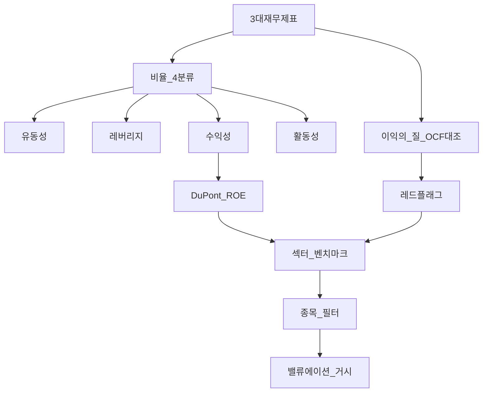
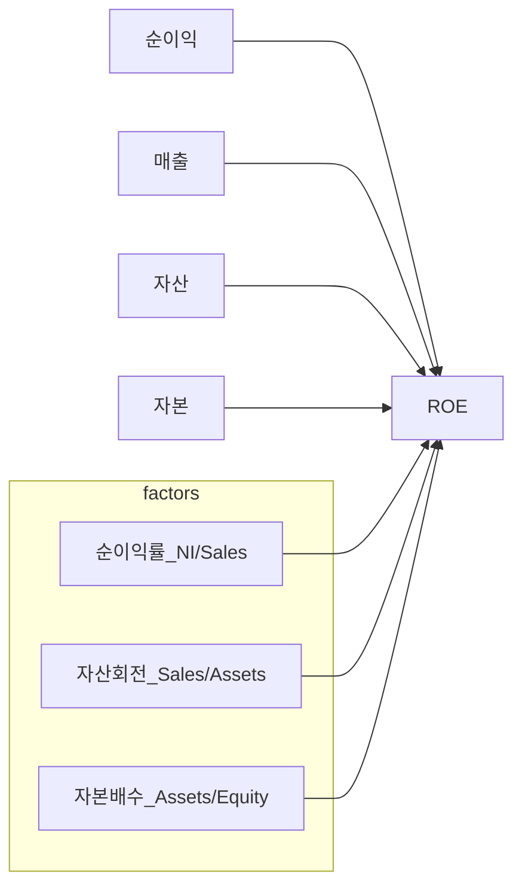
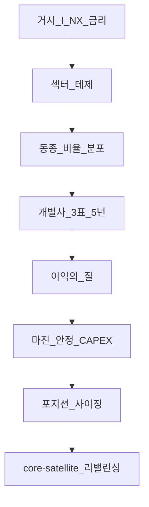

# 재무제표 분석 — 비율·이익의 질·섹터 연결 (L4)

> **면책**: 본 문서는 교육 목적이며, 특정 개인·법인·종목에 대한 투자·세무·법률·회계 자문이 아닙니다. 제도·회계기준·공시 규정은 변경될 수 있으므로 실행 전 [DART](https://dart.fss.or.kr) 등 공식 공시와 감사보고서를 확인하세요.

## 메타

| 항목 | 내용 |
|------|------|
| 최종 검증일 | 2026-05-24 |
| 정책·법령 기준일 | 2025-12-31 확정 (K-IFRS), 2026 개편은 본문 표기 |
| 난이도 | L4 (Graduate) — [READER-GUIDE](../docs/READER-GUIDE.md) |
| 예상 읽기 시간 | 120~150분 |
| 관련 bucket | Bucket 3 (코어 ETF), Bucket 4 (위성·섹터·개별주) |

## 0. 이 편 읽기 전 (5분)

| 항목 | 내용 |
|------|------|
| **난이도** | L4 (Graduate) — [READER-GUIDE §L등급](../docs/READER-GUIDE.md) |
| **선수** | [financial-statements-intro](financial-statements-intro.md), [cash-flow-basics](cash-flow-basics.md) |
| **이번 편에서 쓰는 기호** | 본문 §4·§4a 표 참고 |
| **복습 한 줄** | L3 선수 편을 먼저 읽으면 수식이 수월함 |

## TL;DR

1. **재무제표 분석**은 3표([financial-statements-intro](financial-statements-intro.md))를 **유동성·레버리지·수익성·활동** 비율과 **DuPont**로 분해해, **지속 가능한 현금 창출**과 **자본 배분**을 판단하는 과정이다.
2. **유동성**은 단기 지급 능력, **레버리지**는 부채 의존과 이자 부담, **수익성**은 마진·ROA·ROE — **섹터·사이클** 없이 단일 임계값 비교는 위험하다.
3. **이익의 질(Quality of Earnings)** 은 **영업현금흐름(OCF)** 과 **당기순이익**의 정합, **발생주의 vs 현금** 괴리, **일회성·회계추정**을 분리하는 관점이다.
4. **레드 플래그**: 매출만 성장·OCF 악화, 재고·매출채권 급증, 급격한 **비GAAP 조정**, 감사의견·계속기업 주석, **관계자·특수관계** 거래 — [sector-investing-framework](../03-markets/sectors/sector-investing-framework.md) 체크리스트와 병행.
5. **한국**은 **K-IFRS·DART 연결재무제표** 기준으로 읽고, **반도체·2차전지** 등 사이클 섹터는 [semiconductor](../03-markets/sectors/semiconductor.md)·[macro-01](../02-economics/macro-01-gdp-accounts-growth.md)와 함께 **런레이트·CAPEX**를 해석한다.

## 1. 한 줄 정의 + 왜 중요한가

**정의**: **재무제표 분석(Financial Statement Analysis)** 은 공시된 손익·재무상태·현금흐름을 **비교 가능한 지표**로 환산하고, 추세·동종·거시 맥락 속에서 **기업 가치·리스크·지속성**을 평가하는 체계적 읽기다.

**왜 중요한가 (장기 자산 형성·bucket 연결)**:

| 목적 | bucket·문서 연결 |
|------|------------------|
| **코어(Bucket 3)** | [etf-index-funds](../03-markets/etf-index-funds.md) Top 10 실적이 섹터 내러티브를 움직임 — 간접 분석 필수 |
| **위성(Bucket 4)** | [stocks-equities-intro](../03-markets/stocks-equities-intro.md), [core-satellite-framework](../04-portfolio/core-satellite-framework.md) — 개별주는 **자기 책임** 검증 |
| **거시·금리** | [macro-06](../02-economics/macro-06-asset-prices-macro.md) — 할인율·밸류에이션과 **이익 성장·레버리지** 연동 |
| **채권·대조** | [bonds-fixed-income](../03-markets/bonds-fixed-income.md) — 이자보상·부채 만기와 **신용** 리스크 |
| **가계 문법** | [cash-flow-basics](cash-flow-basics.md) — 개인 **현금흐름**과 기업 **OCF·FCF** 동형 |

**한계**: 분석은 **과거·공시 시점** 데이터다. 주가는 **기대·밸류에이션**을 반영한다 — “좋은 재무”와 “오를 주가”는 동치가 아니다.

## 2. 선수 지식 / 이후 읽을 것

**선수**:
- [financial-statements-intro](financial-statements-intro.md) — 3표·기본 용어
- [cash-flow-basics](cash-flow-basics.md) — OCF·운전자본·FCF 개념
- [cash-flow-statement-fcf](cash-flow-statement-fcf.md) — OCF·FCF·FCFF/FCFE
- [compound-interest-and-time-value](compound-interest-and-time-value.md)
- [debt-and-interest](debt-and-interest.md)
- [macroeconomics-basics](../02-economics/macroeconomics-basics.md)

**이후**:
- [stocks-equities-intro](../03-markets/stocks-equities-intro.md) — PER·EPS·밸류에이션
- [sector-investing-framework](../03-markets/sectors/sector-investing-framework.md)
- [semiconductor](../03-markets/sectors/semiconductor.md), [battery-lfp-ncm-ess](../03-markets/sectors/battery-lfp-ncm-ess.md)
- [passive-vs-active](../04-portfolio/passive-vs-active.md), [asset-allocation](../04-portfolio/asset-allocation.md), [rebalancing-and-dca](../04-portfolio/rebalancing-and-dca.md)
- [macro-02-money-inflation](../02-economics/macro-02-money-inflation.md), [macro-06-asset-prices-macro](../02-economics/macro-06-asset-prices-macro.md)

## 3. 직관·비유

**비율 분석 = 건강검진 혈액 수치**: 혈압(유동성), 체지방률(레버리지), 근육량(수익성)을 **한 번에** 보지 않는다. 마라톤 선수(성장주)와 역도 선수(자본집약 제조)의 **정상 범위**가 다르다 — [semiconductor](../03-markets/sectors/semiconductor.md)의 높은 CAPEX·높은 ROIC 구간은 유통업과 **비교 불가**에 가깝다.

**DuPont = “왜 ROE가 높은가?” 분해**: 순이익률이 좋은가, 자산을 잘 굴리는가(회전), 빚으로 자본을 키웠는가(레버리지) — **좋은 ROE**와 **위험한 ROE**를 구분한다.

**이익의 질 = 다이어트 체중계 vs 통장**: 체중(당기순이익)은 줄었는데 통장(OCF)이 비면 **수분 빼기(발생주의·운전자본)** 의심. 반대로 OCF가 이익을 **지속적으로 상회**하면 **현금 창출력**이 상대적으로 강하다 — 다만 **선수금·공급망** 구조도 본다.

**섹터 → 종목**: [sector-investing-framework](../03-markets/sectors/sector-investing-framework.md)에서 **TAM·사이클·밸류체인**을 정한 뒤, 후보 종목의 **마진·부채·OCF**로 **생존·지분 확대**를 걸러낸다. 거시는 [macro-01](../02-economics/macro-01-gdp-accounts-growth.md)의 **I·NX**가 해당 섹터 **매출**로 전이되는지 확인한다.

## 4. 정식 개념·용어

| 용어 | English | 정의 |
|------|------|----------------|
| 유동비율 | Current ratio | 유동자산 ÷ 유동부채 |
| 당좌비율 | Quick ratio | (유동자산 − 재고 등) ÷ 유동부채 |
| 부채비율 | Debt-to-equity | 부채 ÷ 자본 (한국 공시 관행) |
| 이자보상배율 | Interest coverage | EBIT(또는 영업이익) ÷ 이자비용 |
| 매출총이익률 | Gross margin | 매출총이익 ÷ 매출 |
| 영업이익률 | Operating margin | 영업이익 ÷ 매출 |
| ROA | Return on assets | 순이익 ÷ 평균자산 |
| ROE | Return on equity | 순이익 ÷ 평균자본 |
| 자산회전율 | Asset turnover | 매출 ÷ 평균자산 |
| 자본배수 | Equity multiplier | 평균자산 ÷ 평균자본 |
| OCF | Operating cash flow | 영업활동현금흐름 |
| FCF | Free cash flow | OCF − CAPEX(정의는 문맥별) |
| 발생주의 | Accrual accounting | 현금 유출입 시점과 인식 시점 분리 |
| 일회성 | Non-recurring | 구조조정·평가손익 등 |
| 비GAAP | Non-GAAP / Adjusted | 공시 이익에서 조정한 지표 |
| Accruals | 발생주의 이익 | 순이익 − OCF(근사) |
| 연결 | Consolidated | 종속회사 포함 |
| 계속기업 | Going concern | 감사인의 지속 가정 |

## 4a. 핵심 용어 (본문 등장 순)

| 용어 | 한 줄 | 관련 이론 | glossary |
|------|------|------|----------------|
| 재무제표 분석 | 3표를 비율·추세·동종으로 읽는 체계 | 재무분석 | [3표](financial-statements-intro.md) |
| 유동비율·당좌비율 | 단기 지급 능력 | 유동성 | — |
| 부채비율·이자보상 | 레버리지·이자 부담 | 신용·자본구조 | [부채](debt-and-interest.md) |
| 매출총이익률·영업이익률 | 마진·수익성 | 수익성 | — |
| ROA·ROE | 자산·자본 대비 수익 | DuPont | — |
| DuPont | ROE=마진×회전×배수 분해 | DuPont (1919) | — |
| 이익의 질 | OCF와 순이익·발생주의 괴리 점검 | accruals | — |
| OCF | 영업활동현금흐름 | 현금흐름표 | [FCF](cash-flow-statement-fcf.md) |
| FCF | OCF−CAPEX(정의는 문맥별) | 기업가치 | [FCF](cash-flow-statement-fcf.md) |
| 레드 플래그 | OCF 악화·재고 급증·비GAAP 등 | 회계이상 | — |
| K-IFRS·연결 | 한국 공시·종속 포함 기준 | 회계기준 | — |
| 섹터 맥락 | 사이클·CAPEX 없이 비율 비교 위험 | 산업분석 | [semiconductor](../03-markets/sectors/semiconductor.md) |

## 4b. 관련 이론 미니맵

- **[재무제표 입문](financial-statements-intro.md)** — 3표·계정과목 문법
- **[현금흐름·FCF](cash-flow-statement-fcf.md)** — OCF·FCFF/FCFE와 DCF 연결
- **[주식 밸류에이션](../03-markets/equity-valuation-fundamentals.md)** — 재무 예측→IV
- **[섹터 투자](../03-markets/sectors/sector-investing-framework.md)** — TAM·사이클 후 종목 필터
- **[자산가격 거시](../02-economics/macro-06-asset-prices-macro.md)** — 이익·레버리지와 할인율

## 5. 메커니즘

### 5.1 분석 파이프라인 (3표 → 비율 → 질 → 투자 질문)

### 5.2 DuPont 3요소 분해

**해석**: ROE 상승이 **EM(레버리지)** 만으로 설명되면 **금리·만기· covenant** 리스크를 [bonds-fixed-income](../03-markets/bonds-fixed-income.md) 관점에서 본다.

### 5.3 섹터 → 재무 검증 → 주식 선택

**활동성 비율**(재고회전율, 매출채권회전율, 매입채무회전율, **현금전환주기 CCC**)은 제조·유통에서 **운전자본** 압박을 읽는다. 사이클 정점에서 **재고회전 둔화**는 [semiconductor](../03-markets/sectors/semiconductor.md) **재고 조정** 신호와 맞물릴 수 있다.

## 6. 수식·모델

### 6.1 유동성 (Liquidity)

| 기호 | 이름 | 이 식에서 의미 |
|------|------|----------------|
| \(r\) | 할인율·수익률 | 기간당 이자·요구수익률 |
| \(n\) | 기간 | 연·월 등 복리·할인에 쓰는 횟수 |
| \(PV\) | 현재가치 | 오늘 시점으로 환산한 금액 |
| \(FV\) | 미래가치 | 미래 시점의 목표·결과 금액 |

\[
\text{유동비율} = \frac{\text{유동자산}}{\text{유동부채}}, \quad
\text{당좌비율} = \frac{\text{유동자산} - \text{재고} - \text{선급비용 등}}{\text{유동부채}}
\]

**읽는 법**: **유동비율**와 **유동자산**의 관계를 위 식으로 쓴다. 경제·재무 해석은 변수표 「이 식에서 의미」와 [DEPTH-STANDARD](../docs/DEPTH-STANDARD.md) 기호 예제를 맞춘다.
**유도 (L4)**:
1. **정의**: **유동비율**, **유동자산**, **유동부채**를 동일 시점·동일 통화로 맞춘다. — 단위 불일치면 식이 무의미해진다.
2. **식 변형**: 양변을 정리해 목표 변수를 한쪽에 둔다. — 할인·복리는 **시점 이동**이 핵심이다.
**현금비율** (교육용): \(\text{현금 및 현금성자산} / \text{유동부채}\). 유동비율이 높아도 **재고·장기회수 불확실 매출채권**이면 당좌비율이 낮을 수 있다.

### 6.2 레버리지 (Leverage)

| 기호 | 이름 | 이 식에서 의미 |
|------|------|----------------|
| \(r\) | 할인율·수익률 | 기간당 이자·요구수익률 |
| \(n\) | 기간 | 연·월 등 복리·할인에 쓰는 횟수 |
| \(PV\) | 현재가치 | 오늘 시점으로 환산한 금액 |

\[
\text{부채비율}(\%) = \frac{\text{부채}}{\text{자본}} \times 100, \quad
\text{부채비중} = \frac{\text{총부채}}{\text{총자산}}
\]

**읽는 법**: **부채비율**·**부채비중**으로 **레버리지** 수준을 본다.

| 기호 | 이름 | 이 식에서 의미 |
|------|------|----------------|

\[
\text{이자보상배율} = \frac{\text{EBIT}}{\text{이자비용}}

\]
**읽는 법**: **EBIT**이 **이자비용**을 몇 배 덮는지로 **이자 지급 능력**을 본다.

**Net debt / EBITDA** (실무 근사): \((\text{이자부부채} - \text{현금}) / \text{EBITDA}\) — 사이클 하강기에 EBITDA가 급락하면 **레버리지 지표 악화**가 비선형으로 나타난다.

### 6.3 수익성 (Profitability)

| 기호 | 이름 | 이 식에서 의미 |
|------|------|----------------|
| \(r\) | 할인율·수익률 | 기간당 이자·요구수익률 |
| \(n\) | 기간 | 연·월 등 복리·할인에 쓰는 횟수 |
| \(PV\) | 현재가치 | 오늘 시점으로 환산한 금액 |

\[
\text{매출총이익률} = \frac{\text{매출} - \text{매출원가}}{\text{매출}}, \quad
\text{영업이익률} = \frac{\text{영업이익}}{\text{매출}}
\]

**읽는 법**: **매출총이익률**·**영업이익률**로 **마진** 구조를 본다.

| 기호 | 이름 | 이 식에서 의미 |
|------|------|----------------|
| \(ROA\) | 총자산이익률 | 순이익 대 평균총자산 |
| \(ROE\) | 자기자본이익률 | 순이익 대 평균자본 |

\[
ROA = \frac{\text{당기순이익}}{\text{평균총자산}}, \quad
ROE = \frac{\text{당기순이익}}{\text{평균자본}}
\]

**읽는 법**: **ROA**·**ROE**로 **수익성**과 **자본 효율**을 본다.

**세후 ROIC** (심화, 교육용 근사):

| 기호 | 이름 | 이 식에서 의미 |
|------|------|----------------|
| \(ROIC\) | 투하자본이익률 | NOPAT 대 투하자본 |
| \(NOPAT\) | 세후영업이익 | 영업이익×(1−유효세율) 근사 |

\[
ROIC \approx \frac{\text{NOPAT}}{\text{투하자본}}, \quad
NOPAT \approx \text{영업이익} \times (1 - \text{유효세율})
\]

**읽는 법**: **NOPAT**를 **투하자본**으로 나누면 **ROIC** 근사가 된다.

**3단**:

| 기호 | 이름 | 이 식에서 의미 |

### 6.4 DuPont (ROE 분해)

| 기호 | 이름 | 이 식에서 의미 |
|------|------|----------------|
| \(ROE\) | 자기자본이익률 | 순이익 대 평균자본 |
| \(ROA\) | 총자산이익률 | 순이익 대 평균자산 |
| 자본배수 | 레버리지 | 평균자산 대 평균자본 |

\[
ROE = \underbrace{\frac{\text{순이익}}{\text{매출}}}_{\text{순이익률}} \times
\underbrace{\frac{\text{매출}}{\text{평균자산}}}_{\text{자산회전율}} \times
\underbrace{\frac{\text{평균자산}}{\text{평균자본}}}_{\text{자본배수}}
\]

**읽는 법**: **ROE**는 **마진×회전×배수**로 분해된다.

| 기호 | 이름 | 이 식에서 의미 |
|------|------|----------------|
| \(ROA\) | 총자산이익률 | 위 3요소 분해와 연결 |

\[
ROE = ROA \times \frac{\text{평균자산}}{\text{평균자본}} = ROA \times \text{자본배수}
\]

**읽는 법**: **ROA**에 **자본배수**를 곱하면 **ROE**로 연결된다.

### 6.5 이익의 질·FCF (근사)

| 기호 | 이름 | 이 식에서 의미 |
|------|------|----------------|
| \(OCF\) | 영업현금흐름 | 영업활동 현금 |
| \(CAPEX\) | 자본지출 | 투자활동 유출(교육) |

\[
\text{Cash Conversion} = \frac{OCF}{\text{당기순이익}}
\]

**읽는 법**: **OCF/순이익**이 1 미만이면 **이익의 질**을 의심한다.

| 기호 | 이름 | 이 식에서 의미 |
|------|------|----------------|
| \(FCF\) | 잉여현금흐름 | OCF−CAPEX 근사 |

\[
FCF \approx OCF - CAPEX
\]

**읽는 법**: **OCF**에서 **CAPEX**를 빼면 **FCF** 근사가 된다. 

배당·상환 여력은 [cash-flow-basics](cash-flow-basics.md)와 연계한다.

### 6.6 활동성·현금전환주기

| 기호 | 이름 | 이 식에서 의미 |
|------|------|----------------|
| \(CCC\) | 현금전환주기 | 재고+매출채권−매입채무 일수 |

\[
\text{재고회전율} = \frac{\text{매출원가}}{\text{평균재고}}, \quad
\text{매출채권회전율} = \frac{\text{매출}}{\text{평균매출채권}}
\]

| 기호 | 이름 | 이 식에서 의미 |
|------|------|----------------|
| \(r\) | 할인율·수익률 | 기간당 이자·요구수익률 |
| \(n\) | 기간 | 연·월 등 복리·할인에 쓰는 횟수 |
| \(PV\) | 현재가치 | 오늘 시점으로 환산한 금액 |

\[
CCC = \text{재고일수} + \text{매출채권일수} - \text{매입채무일수}
\]

**읽는 법**: **CCC**가 길어지면 운전자본이 **현금을 묶는다** — OCF 압박.

---
**유도 (L4)**:
1. **정의**: 기호를 동일 시점·동일 통화로 맞춘다. — 단위 불일치면 식이 무의미해진다.
2. **식 변형**: 양변을 정리해 목표 변수를 한쪽에 둔다. — 할인·복리는 **시점 이동**이 핵심이다.
**CCC 확대** = 운전자본 **현금 흡수** → OCF 압박.

## 7. 한국 적용

### 7.1 2025년 기준 (확정)

| 항목 | 내용 |
|------|------|
| **회계기준** | 상장사 **K-IFRS** — [financial-statements-intro](financial-statements-intro.md) |
| **공시** | [금융감독원 DART](https://dart.fss.or.kr) — 사업보고서·분기보고서·감사보고서 |
| **연결 우선** | 투자 분석은 통상 **연결** 기준 — 개별·연결 혼용 금지 |
| **단위** | 표 제목 **(단위: 백만 원, 천 원)** 반드시 확인 — 비율 계산 오류 방지 |
| **주석** | 금융부채 **만기 구조**, **충당부채**, **수익인식 정책**, **관계자 거래** |
| **코스닥** | 적자·소형 — [kosdaq-tier-system](../03-markets/kosdaq-tier-system.md), 감사의견·상장유지 |
| **IFRS 16** | 리스 — **사용권자산·리스부채**로 부채·EBITDA 정의 변화, 동종 비교 시 주의 |
| **세후 관점** | 배당·매매 — 국내 주식 세제는 별도 정책 문서 참고 |

**DART 실무 순서 (교육)**:
1. **감사보고서** — 감사의견, 핵심감사사항(KAM), 계속기업  
2. **연결 재무제표** 3개 — 3~5년 추세  
3. **주석** — 매출채권·재고·차입금·특수관계  
4. **사업보고서** — MD&A, 세그먼트, **리스크 요인**  
5. **IR·실적발표** — **가이던스**와 공시 숫자 대조  

### 7.2 2026년 개편·시행 예정 (해당 시)

| 항목 | 2025 | 2026 (공식 확인) |
|------|------|----------------|
| K-IFRS 개정 | 시행 중 기준 | **주석·공시** 항목 변경 가능 — DART·한국공인회계사회 공지 |
| 지속가능 공시 | ESG 확대 | **재무 비율**과 별도 — [micro-04](../02-economics/micro-04-welfare-externalities.md) 외부성 |
| 디지털 공시 | XBRL 태그 확대 | 표 복사·API 시 **태그명** 확인 |

**법·정책 근거**: 자본시장법 공시 규정, K-IFRS 제·개정, 금융위·회계기준원 해석 — **본 문서는 교육 요약**이며 최신 개정은 공식 출처 우선.

## 8. 숫자 예제 (가상)

> 모든 회사명·금액·연도는 가상입니다.

### 예제 1 — 유동성·레버리지 (제조 가상 “한빛전자”)

| 항목 | 금액(억 원) |
|------|-------------|
| 유동자산 | 12,000 |
| 재고 | 4,500 |
| 유동부채 | 8,000 |
| 부채 | 15,000 |
| 자본 | 10,000 |
| EBIT | 1,200 |
| 이자비용 | 300 |

- 유동비율 = \(12{,}000 / 8{,}000 = 1.50\)  
- 당좌비율 ≈ \((12{,}000 - 4{,}500) / 8{,}000 = 0.94\) — **1 미만**, 재고 의존  
- 부채비율 = \(15{,}000 / 10{,}000 = 150\%\)  
- 이자보상배율 = \(1{,}200 / 300 = 4.0\) — 금리 **+200bp** 시 이자 **+30%** 가정하면 여유 감소  

**교훈**: 유동비율만 보면 “안전”해 보이나 **당좌비율·이자**를 함께 본다. [debt-and-interest](debt-and-interest.md) 병행.

### 예제 2 — DuPont (가상 “청운소프트” vs “대산철강”)

| | 순이익률 | 자산회전 | 자본배수 | ROE |
|------|------|------|------|----------------|
| 청운소프트 | 18% | 0.8 | 1.5 | **21.6%** |
| 대산철강 | 5% | 1.2 | 2.5 | **15.0%** |

청운: **마진·낮은 레버리지** — 대산: **회전·높은 레버리지**. 금리 상승·가격 하락 시 대산의 **EM 리스크**가 크다. 섹터 벤치마크는 [sector-investing-framework](../03-markets/sectors/sector-investing-framework.md).

### 예제 3 — 이익의 질 (가상 “바다바이오” 2년)

| | Year1 | Year2 |
|------|------|----------------|
| 당기순이익 | 500 | 800 |
| OCF | 200 | 350 |
| Cash Conversion | 0.40 | 0.44 |
| 매출채권/매출 | 35% | 48% |

이익 **+60%**인데 OCF는 **절반 수준** — **매출채권 비중 확대**. “성장”이 **현금화**되지 않으면 [stocks-equities-intro](../03-markets/stocks-equities-intro.md) 밸류에이션 **할인** 가능.

### 예제 4 — 사이클 섹터 런레이트 (가상 “동방메모리”)

| | 정점 분기 | 다음 분기 |
|------|------|----------------|
| 영업이익 | 1,**F**| **F**|
| 순이익 | **F**| **F**|
| OCF | 1,**F**| **F**|
| CAPEX | **F**| **F**|

**정점 분기 ROE·마진**을 연율화해 “저평가” 판단 금지 — [semiconductor](../03-markets/sectors/semiconductor.md), [macro-01](../02-economics/macro-01-gdp-accounts-growth.md) **I·재고** 연계. FCF ≈ \(200 - 900 = -700\)억 — **투자 국면** 해석 필요.

## 9. FAQ

**Q1. ROE가 높으면 무조건 좋은 주식인가?**  
**A1.** 아니다. **일회성 이익**, **과도한 레버리지**, **자본금 축소**로 ROE가 일시적으로 높아질 수 있다. DuPont로 **원인 분해**하고 [financial-statements-intro](financial-statements-intro.md)의 일회성 분리를 한다.

**Q2. 유동비율 2.0이면 안전한가?**  
**A2.** 재고·장기화 매출채권이 많으면 **당좌비율·OCF**가 더 중요하다. 유통은 낮은 유동비율이 **정상**일 수 있다 — **동종 분포**를 본다.

**Q3. OCF > 순이익이면 항상 좋은가?**  
**A3.** 대체로 **질**이 좋다고 보나, **선수금 급증**, **매입채무 지연**, **일회성 세금 환급**도 OCF를 부풀릴 수 있다. **지속성**과 **주석**을 확인한다.

**Q4. 비GAAP(조정 EBITDA 등)를 써도 되나?**  
**A4.** **경영진 설명용**으로 읽되, **조정 항목**이 매년 바뀌면 신뢰도 하락. **K-IFRS 순이익·OCF**를 기준축으로 둔다.

**Q5. 연결과 개별 중 무엇을 보나?**  
**A5.** 투자 분석은 **연결**이 기본. **지주사**만 거래할 때는 **개별·종속** 구조를 [financial-statements-intro](financial-statements-intro.md) 주석으로 본다.

**Q6. PER이 낮은데 재무가 나쁘지 않으면 저평가인가?**  
**A6.** **저PER 트랩** — 이익이 **일시적 정점**이면 PER이 낮아 보인다. **정규화 이익·FCF**와 [macro-06](../02-economics/macro-06-asset-prices-macro.md) 금리 환경을 본다.

**Q7. 섹터 ETF만 사면 재무 분석이 필요 없나?**  
**A7.** Bucket 3도 **Top holdings** 실적·부채가 섹터 내러티브를 움직인다. [etf-index-funds](../03-markets/etf-index-funds.md), [core-satellite-framework](../04-portfolio/core-satellite-framework.md) — **간접** 분석은 필요.

**Q8. 한국과 미국 재무를 같은 비율로 비교해도 되나?**  
**A8.** **회계·세금·자사주·배당** 관행이 다르다. [overseas-equities-intro](../03-markets/overseas-equities-intro.md) — **동일 시장·동종** 우선, 국제 비교는 **정의 통일** 후.

## 10. 함정·리스크·한계

- **단일 비율 집착**: 업종·사이클·비즈니스 모델 없이 “유동비율 > 1.5” 같은 **룰 오브 썸** 금지.
- **정점 실적 연율화**: [semiconductor](../03-markets/sectors/semiconductor.md) 슈퍼사이클 — ROE·마진 **런레이트** 착각.
- **재고·채권만 보고 매출 미검증**: 매출 인식 정책 변경·**채널 스터핑** — 주석·감사 KAM.
- **조정 EBITDA 남용**: 주식보상·재구조화를 매번 “가산” — **조정 피로**.
- **레버리지 숨김**: **오프밸런스**, **SPV**, **리스** — K-IFRS 16 이후에도 **약정·보증** 주석 필요.
- **관계자 거래**: 이해상충·이전가격 — 소형주·지주 구조.
- **환율·원자재**: 수출 제조 — 손익과 OCF의 **환차** 타이밍 차이.
- **과거 vs 기대**: 재무는 **후행**; 주가는 **선행** — “좋은 실적” 발표 후 하락은 **가이던스·밸류에이션** 문제일 수 있음.
- **데이터 마이닝**: 50개 비율 중 “유의한” 것만 골라 **내러티브 맞추기** — **사전 가설** 없는 비교 금지.
- **ESG 점수 = 재무 품질 아님**: 탄소·지배구조는 **별도** 차원 — [micro-04](../02-economics/micro-04-welfare-externalities.md).

---

**Q. 실무에서는?**  
교과서 식·기호를 그대로 적용하기 전에 **수수료·세금·데이터 시점**을 분리한다. 숫자는 [DEPTH-STANDARD](../docs/DEPTH-STANDARD.md)처럼 기호만 먼저 맞추고, 법령·시장 수치는 §8 표·외부 출처로 갱신한다.

## 11. 심화 읽기

- [financial-statements-intro](financial-statements-intro.md) — 3표 입문  
- [cash-flow-basics](cash-flow-basics.md) — OCF·운전자본 (FCF 심화 문서 예정)  
- [stocks-equities-intro](../03-markets/stocks-equities-intro.md)  
- [bonds-fixed-income](../03-markets/bonds-fixed-income.md)  
- [sector-investing-framework](../03-markets/sectors/sector-investing-framework.md)  
- [semiconductor](../03-markets/sectors/semiconductor.md), [battery-lfp-ncm-ess](../03-markets/sectors/battery-lfp-ncm-ess.md)  
- [macro-01-gdp-accounts-growth](../02-economics/macro-01-gdp-accounts-growth.md), [macro-06-asset-prices-macro](../02-economics/macro-06-asset-prices-macro.md)  
- [passive-vs-active](../04-portfolio/passive-vs-active.md), [asset-allocation](../04-portfolio/asset-allocation.md), [time-horizon-and-buckets](../04-portfolio/time-horizon-and-buckets.md)  
- 교재·논문: Penman, *Financial Statement Analysis and Security Valuation*; Palepu & Healy, *Business Analysis and Valuation*; Sloan (1996), accruals anomaly  

## 연습문제 (L4, 기호)

1. 위 §6 주요 식에서 변수 하나를 미지로 두고, 나머지를 기호로 둔 **관계식**을 쓰시오.
2. 가정이 깨질 때(유동성·세금·다중 IRR 등) 위 식의 **한계**를 기호·부등식으로 서술하시오.
3. §8 예제와 동일 기호(M·P·PV 등)로 **부호·단조성**만 검증하는 짧은 논증을 하시오.

### 해설 키

1. 직전 변수표의 「이 식에서 의미」를 이용해 동일 차원으로 정리한다.
2. 「가정이 깨지면」 절의 한계 사례와 연결한다.
3. 숫자 대입 없이 **부호**·**단위** 일치만 확인한다.
## 12. 스스로 점검 퀴즈

1. DuPont 3단에서 ROE를 높이는 세 요인을 쓰고, **위험한** ROE 상승 사례를 하나 들어라.  
2. 유동비율과 당좌비율이 크게 벌어지는 **재무상태표** 원인을 두 가지 써라.  
3. Cash Conversion이 0.5 미만일 때 **의심할** 계정과목·주석을 나열하라.  
4. 이자보상배율 2.0의 기업에 금리가 100bp 오르면 **어떤 추가** 표·주석을 보나?  
5. 사이클 정점 분기 ROE 25%를 **연율화**해 밸류에이션하면 생기는 오류는?  
6. 연결 vs 개별을 혼용해 동종 비교할 때 생기는 **왜곡**은?  
7. CCC가 90일에서 120일로 늘 때 **OCF**에 대한 방향성을 설명하라.  
8. 비GAAP 조정 EBITDA와 K-IFRS 영업이익 차이를 **투자자**가 검증하는 절차 3단계.  
9. [semiconductor](../03-markets/sectors/semiconductor.md) 업종에서 **재고회전율** 하락이 의미할 **거시·산업** 연결을 쓰라.  
10. ROIC와 ROE가 크게 벌어지는 **자본구조** 상황을 설명하라.  
11. DART에서 **감사보고서**를 먼저 보는 이유 두 가지.  
12. Bucket 4 위성 종목 1개를 가정하고, **섹터 테제 → 재무 필터 → 포지션** 3줄 체크리스트를 작성하라.

??? note "정답 힌트"

    1. 순이익률·자산회전·자본배수; **부채 급증·자사주 소각**만으로 ROE↑ 등.  
    2. **재고·선급비용** 비중 큼; 유동자산 질 저하.  
    3. **매출채권·재고·수익인식**; 운전자본 흡수; 특수관계 매출.  
    4. **차입 만기표**, **고정/변동 금리**, **순차입**, ** covenant**; [bonds-fixed-income](../03-markets/bonds-fixed-income.md).  
    5. **이익 정점** 반영 PER·ROE — 다음 분기 **이익 급감**; [sector-investing-framework](../03-markets/sectors/sector-investing-framework.md).  
    6. **종속 포함 여부**·매출·부채 규모 불일치.  
    7. 운전자본 **증가** → 통상 OCF **압박**(매출·마진 동일 가정).  
    8. 조정 **표** 대조 → **반복성** → **OCF**로 교차검증.  
    9. [macro-01](../02-economics/macro-01-gdp-accounts-growth.md) **I·재고**, 수요 둔화; 가격·가동률.  
    10. **높은 레버리지** — ROE > ROIC; 금리·만기 리스크.  
    11. **감사의견·KAM·계속기업**; 재무제표 **신뢰** 전제.  
    12. 예: 반도체 테제 → **OCF/부채/재고** → [core-satellite-framework](../04-portfolio/core-satellite-framework.md) 비중 상한.

## 부록 A — 비율 표준 분류 (참고)

| 분류 | 대표 비율 | 질문 |
|------|------|----------------|
| 유동성 | 유동·당좌·현금 | 단기 지급? |
| 레버리지 | 부채비율·이자보상·Net debt/EBITDA | 부채 부담? |
| 수익성 | 마진·ROA·ROE·ROIC | 벌어들이나? |
| 활동성 | 회전율·CCC | 자산 효율? |
| 시장 | PER·PBR·EV/EBITDA | [stocks-equities-intro](../03-markets/stocks-equities-intro.md) |

**교차**: 시장 비율은 **주가** 포함 — 재무 **품질**과 **밸류에이션**을 분리한다.

## 부록 B — 레드 플래그 체크리스트 (15항)

1. 매출 ↑ **3분기 연속** OCF ↓  
2. **매출채권/매출** 비율 급등  
3. **재고/매출원가** 급등 (수요 둔화 신호)  
4. **매출총이익률** 하락인데 SG&A만 절감해 영업이익 유지  
5. **감사의견** 한정·부적정·의견거절  
6. **계속기업** 중요 불확실성 문단  
7. **감사인 변경**·KAM 급증  
8. **CFO·회계 담당** 잦은 교체  
9. **비GAAP** 조정 항목 매년 변경  
10. **관계자** 매출·대여·보증  
11. **오프밸런스** 약정·SPV  
12. **단기 차입**으로 **장기 투자** (만기 불일치)  
13. **자본화** 정책 변경(개발비·이자)  
14. **세그먼트** 실적과 **연결** 합계 불명확  
15. **지배구조** — 소수주주 이익 급변  

[sector-investing-framework](../03-markets/sectors/sector-investing-framework.md) **Stage-Gate**와 합치면 **위성** 진입 전 **필터**가 된다.

## 부록 C — 섹터별 비율 “정상” 착시 (교육)

| 섹터 | 흔한 패턴 | 분석 주의 |
|------|------|----------------|
| 반도체 | CAPEX·감가 큼, 사이클 마진 | [semiconductor](../03-markets/sectors/semiconductor.md), 정점 **재고** |
| 2차전지 | 성장기 FCF↓, 부채↑ | [battery-lfp-ncm-ess](../03-markets/sectors/battery-lfp-ncm-ess.md), **수주·가동** |
| 유통 | 낮은 마진·높은 회전 | **재고**·신용카드 **정산** |
| 바이오 | R&D·적자, 수익 인식 | **마일스톤** 계약 주석 |
| 지주사 | ROE·자산회전 왜곡 | **개별·종속** 분해 |
| 금융 | 레버리지·유동 비율 **다른 문법** | 은행·보험 **전용** 지표 — 본 문서 일반 제조 기준 |

## 부록 D — 이익의 질 심화: 발생주의 vs 현금

**손익계산서**는 **발생주의** — 매출 인식 시점, 감가, 충당, **금융자산 평가**가 **현금**과 어긋난다. **품질** 분석은 다음을 **동시**에 본다:

1. **OCF / 순이익** (다년)  
2. **총발생주의** 추세 (교육용 근사)  
3. **운전자본** 항목별 **Δ**  
4. **CAPEX / 감가** — 유지 vs 성장 투자 분리(주석·MD&A)  
5. **일회성** 제거 후 **조정 이익** (보수적으로)  

**주가 연결**: [macro-06](../02-economics/macro-06-asset-prices-macro.md) — **실질 금리** 상승 시 **고레버리지·장기 성장** 주식의 **할인율** 민감도↑; **OCF 확실**한 현금흐름은 상대적 **방어** 논의 가능(단정 금지).

## 부록 E — 동종 비교·시계열 절차 (8단)

1. **동일 K-IFRS·연결**  
2. **동일 회계연도·분기** (결산월)  
3. **단위·통화** 통일  
4. **5년** 추세 + **최근 4분기** TTM  
5. **섹터 중앙값·사분위** (데이터 출처 명시)  
6. **이상치** 제거 전 **사업 모델** 확인  
7. **거시 레짌** 분리 — [macro-02](../02-economics/macro-02-money-inflation.md)  
8. **내러티브**와 **숫자** 불일치 시 **공시 우선**  

## 부록 F — 주식 선택 연결 (Bucket 4)

**1단계 — 섹터**: [sector-investing-framework](../03-markets/sectors/sector-investing-framework.md) — TAM, 사이클 위치, 정책.  
**2단계 — 재무 필터**: ROIC·OCF·부채·CCC — **생존**과 **캐시** 확인.  
**3단계 — 밸류**: [stocks-equities-intro](../03-markets/stocks-equities-intro.md) — PER·EV/EBITDA, **정규화 이익**.  
**4단계 — 포트**: [core-satellite-framework](../04-portfolio/core-satellite-framework.md), [rebalancing-and-dca](../04-portfolio/rebalancing-and-dca.md) — **비중 상한**, 분산.  
**5단계 — 거시 점검**: [macro-01](../02-economics/macro-01-gdp-accounts-growth.md) **NX·I**, [macro-06](../02-economics/macro-06-asset-prices-macro.md) **금리·리스크 프리미엄**.

**코어 only** 투자자: [etf-index-funds](../03-markets/etf-index-funds.md) 보유 ETF **fact sheet** Top 10에 부록 B **일부** 적용.

## 부록 G — 가상 통합 사례 “한국 종합 전자 그룹” (교육)

**가정**: 연결 매출 100조, 영업이익 8조, 순이익 6조, OCF 7조, CAPEX 12조, 부채 40조, 자본 30조, 유동자산 25조, 재고 8조, 유동부채 18조.

- 영업이익률 = 8%  
- ROE ≈ \(6/30 = 20\%\) (평균자본 단순)  
- 유동비율 ≈ \(25/18 \approx 1.39\)  
- FCF ≈ \(7 - 12 = -5\)조 — **투자 국면**  
- Cash Conversion ≈ \(7/6 \approx 1.17\) — **이익 대비 OCF 양호**이나 CAPEX로 **잉여현금** 부족  

**해석**: “이익·OCF 좋다”와 “주주 **잉여 현금** 풍부”는 다르다 — [cash-flow-basics](cash-flow-basics.md). **반도체** CAPEX 사이클과 [macro-01](../02-economics/macro-01-gdp-accounts-growth.md) **I** 연동.

## 부록 H — 채권·신용 관점 교차 ([bonds-fixed-income](../03-markets/bonds-fixed-income.md))

**이자보상배율** 하락 → **스프레드** 확대·등급 **강등** 가능. **만기 벽(wall)** — 단기 차입 비중↑는 **리파이낸싱** 리스크. 주식 투자자도 **회사채·CP** 공시가 있으면 **교차 검증**.

## 부록 I — 5단 DuPont 확장 (교육)

\[
ROE = \underbrace{\frac{EBIT}{\text{매출}}}_{\text{영업이익률}} \times
\underbrace{\frac{\text{매출}}{\text{자산}}}_{\text{회전}} \times
\underbrace{\frac{EBT}{EBIT}}}_{\text{이자부담}} \times
\underbrace{\frac{\text{순이익}}{EBT}}}_{\text{세율}} \times
\underbrace{\frac{\text{자산}}{\text{자본}}}_{\text{레버리지}}
\]

금리 상승기: **EBT/EBIT** ↓ → ROE **직접** 압박 — 레버리지 **축소** 필요 여부를 **MD&A**에서 확인.

## 부록 J — 학습 로드맵

본 문서는 [01-foundations/README](README.md) **L4** — [financial-statements-intro](financial-statements-intro.md) 이후, [stocks-equities-intro](../03-markets/stocks-equities-intro.md) 이전·병행 권장. **주 10시간** 기준: 이론 4h, DART 표 1건 추출 2h, 예제·DuPont 2h, 퀴즈·부록 2h. **실습**: DART에서 관심 섹터 1사 **3년 OCF vs 순이익** 그래프(손으로). **다음**: [cash-flow-statement-fcf](cash-flow-statement-fcf.md) → [time-value-npv-irr](time-value-npv-irr.md) → [reading-annual-reports-dart](reading-annual-reports-dart.md).

---

**L4 완료 기준**: [TEMPLATE](../docs/TEMPLATE.md) 12블록·FAQ 8·퀴즈 12·mermaid 3·수식 5+·예제 4·검증일 2026-05-24 — [DEPTH-STANDARD](../docs/DEPTH-STANDARD.md).