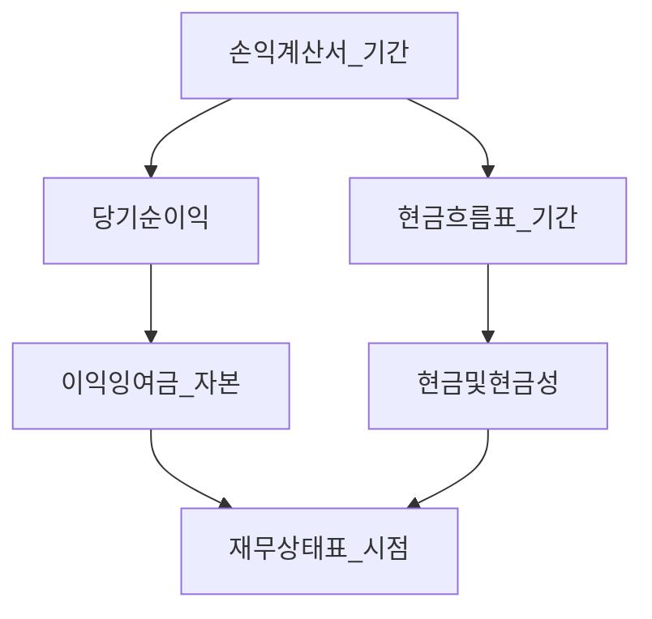

# 재무제표 입문 — 기업 읽기 전 단계

> **면책**: 본 문서는 교육 목적이며, 특정 종목·기업에 대한 매수·매도·투자 자문이 아닙니다. 공시·회계 기준은 개정될 수 있으므로 실행 전 [DART](https://dart.fss.or.kr) 등 공식 공시를 확인하세요.

## 메타

| 항목 | 내용 |
|------|------|
| 최종 검증일 | 2026-05-24 |
| 정책·법령 기준일 | 2025-12-31 확정 (K-IFRS), 2026 개편 별도 표기 |
| 난이도 | L3 (Deep) — [READER-GUIDE](../docs/READER-GUIDE.md) |
| 예상 읽기 시간 | 55~70분 |
| 관련 bucket | Phase 1 — **Bucket 4 위성**·섹터 공부 전 선수 |

## 0. 이 편 읽기 전 (5분)

| 항목 | 내용 |
|------|------|
| **난이도** | L3 (Deep) — [READER-GUIDE §L등급](../docs/READER-GUIDE.md) |
| **선수** | [compound-interest-and-time-value](compound-interest-and-time-value.md), [cash-flow-basics](cash-flow-basics.md) |
| **이번 편에서 쓰는 기호** | 본문 §4·§4a 표 참고 |
| **복습 한 줄** | — |

> **가상 사례 회사**: 본 Phase 재무제표 심화 편은 **「가상 주식회사 한빛전자」**(가상의 코스피 제조·전자 부품) 숫자로 3표·DART·FCF를 **같은 스레드**로 읽는다. 실제 종목·실적이 아니다.

## TL;DR

1. **3대 재무제표**: 손익계산서(벌었나) · 재무상태표(가진 것) · 현금흐름표(현금이 움직였나) — 질문이 다르다.
2. **주가 ≠ 당기순이익** — 일회성·회계추정·운전자본 때문에 **이익과 현금**이 어긋날 수 있다.
3. **코어 ETF만** 해도 필수는 아니지만, **개별주·섹터 위성**은 최소한 공시 숫자를 **검증**할 줄 알아야 한다.
4. 한국 상장사는 **K-IFRS**, **DART** 전자공시 — [semiconductor](../03-markets/sectors/semiconductor.md) 등 섹터 문서와 연계.
5. 다음 단계: [stocks-equities-intro](../03-markets/stocks-equities-intro.md), [kosdaq-tier-system](../03-markets/kosdaq-tier-system.md).

## 1. 한 줄 정의 + 왜 중요한가

**정의**: **재무제표(Financial Statements)** 는 기업이 일정 기간 **수익·비용·자산·부채·현금**을 규칙(K-IFRS 등)에 따라 정리한 보고서 묶음이다.

**왜 중요한가 (장기 자산 형성·bucket 연결)**:

| 목적 | bucket 연결 |
|------|-------------|
| **코어 vs 위성** | Bucket 3 인덱스 ETF는 분산·비용이 방어선; Bucket 4는 **기업·섹터 리스크** 직접 부담 |
| **IR·뉴스 검증** | “매출 대박” 헤드라인 vs **영업CF·마진** |
| **사이클 산업** | 반도체·2차전지 — 정점 실적을 **런레이트**로 착각 방지 — [sector-investing-framework](../03-markets/sectors/sector-investing-framework.md) |
| **가계와 연결** | [cash-flow-basics](cash-flow-basics.md)의 개인 현금흐름과 **동형** |

## 2. 선수 지식 / 이후 읽을 것

**선수**:
- [compound-interest-and-time-value.md](compound-interest-and-time-value.md)
- [cash-flow-basics.md](cash-flow-basics.md)
- [debt-and-interest.md](debt-and-interest.md) — 부채·이자 읽기

**이후**:
- [financial-statements-analysis.md](financial-statements-analysis.md) — **L4** 비율·DuPont·이익 품질
- [cash-flow-statement-fcf.md](cash-flow-statement-fcf.md) — **L4** OCF·FCF
- [time-value-npv-irr.md](time-value-npv-irr.md) — **L4** NPV·IRR
- [reading-annual-reports-dart.md](reading-annual-reports-dart.md) — **L4** DART·사업보고서
- [stocks-equities-intro.md](../03-markets/stocks-equities-intro.md)
- [etf-index-funds.md](../03-markets/etf-index-funds.md)
- [passive-vs-active.md](../04-portfolio/passive-vs-active.md)
- [core-satellite-framework.md](../04-portfolio/core-satellite-framework.md)
- [semiconductor.md](../03-markets/sectors/semiconductor.md)

## 3. 직관·비유

**손익계산서(IS)** = 한 해 **다이어트 일지** — 들어온 칼로리(매출) vs 쓴 칼로리(비용). “살이 빠졌다” = 당기순이익.

**재무상태표(BS)** = 그날 저울 — **체중(자산) = 근육(자본) + 지방(부채)**. 자산 = 부채 + 자본.

**현금흐름표(CF)** = 통장 **입출금 내역**. “살은 빠졌는데(이익) 통장은 왜 비었지?” — 외상매출·재고·CAPEX가 답.

**주가 선행**: 시장은 **다음 분기 이익**을 미리 반영할 수 있다. 실적 발표 당일 “서프라이즈”인데 주가가 하락하는 것은 **이미 반영**되었거나 **가이던스**가 악화되었기 때문일 수 있다. 재무제표는 **과거**이고, 투자는 **기대**에 가깝다 — 입문 단계에서는 “공시로 내러티브 검증”에 집중한다.

**ETF 투자자**: Bucket 3에서 [etf-index-funds](../03-markets/etf-index-funds.md)만 보유해도, 보유 ETF의 **Top 10 종목** 실적이 섹터 내러티브를 움직인다. 반도체 ETF라면 [semiconductor](../03-markets/sectors/semiconductor.md) 공시 습관이 **간접** 필수가 된다.

## 4. 정식 개념·용어

| 용어 | English | 정의 |
|------|------|----------------|
| 매출액 | Revenue / Sales | 재화·용역 판매 규모 |
| 매출총이익 | Gross profit | 매출 − 매출원가 |
| 영업이익 | Operating income (OP) | 본업 이익(영업외 제외 전) |
| 당기순이익 | Net income | 세후 최종 이익 |
| EBITDA | — | 영업이익 + 감가상각·무형상각(근사) |
| 자산 | Assets | 기업이 통제하는 경제적 자원 |
| 부채 | Liabilities | 갚을 의무 |
| 자본 | Equity | 자산 − 부채, 주주 몫 |
| 영업활동현금흐름 | OCF | 본업에서 유입−유출 현금 |
| 투자활동현금흐름 | ICF | 설비·M&A 등 |
| 재무활동현금흐름 | FCF_fin | 차입·상환·배당 등 |
| CAPEX | Capital expenditure | 유형·무형 자산 취득 지출 |
| 운전자본 | Working capital | 유동자산 − 유동부채(근사) |
| ROE | Return on equity | 순이익 ÷ 자본 |
| PER | Price-to-earnings | 주가 ÷ EPS |
| PBR | Price-to-book | 주가 ÷ BPS |

### 4a. 핵심 용어 (본문 등장 순)

> 복습용. 정의는 §4 본표·[glossary](../00-roadmap/glossary.md)·본문 `!!! info` 박스.

| 용어 | 한 줄 | 관련 이론 | glossary |
|------|------|------|----------------|
| 매출액 | 재화·용역 판매 규모 | §4 | [glossary](../00-roadmap/glossary.md#매출액) |
| 매출총이익 | 매출 − 매출원가 | §4 | [glossary](../00-roadmap/glossary.md#매출총이익) |
| 영업이익 | 본업 이익 | §4 | [glossary](../00-roadmap/glossary.md#영업이익) |
| 당기순이익 | 세후 최종 이익 | §4 | [glossary](../00-roadmap/glossary.md#당기순이익) |
| EBITDA | 영업이익 + 감가상각·무형상각 | §4 | [glossary](../00-roadmap/glossary.md#ebitda) |
| 자산 | 기업이 통제하는 경제적 자원 | §4 | [glossary](../00-roadmap/glossary.md#자산) |
| 부채 | 갚을 의무 | §4 | [glossary](../00-roadmap/glossary.md#부채) |
| 자본 | 자산 − 부채, 주주 몫 | §4 | [glossary](../00-roadmap/glossary.md#자본) |
| 영업활동현금흐름 | 본업에서 유입−유출 현금 | §4 | [glossary](../00-roadmap/glossary.md#영업활동현금흐름) |
| 투자활동현금흐름 | 설비·M&A 등 | §4 | [glossary](../00-roadmap/glossary.md#투자활동현금흐름) |
| 재무활동현금흐름 | 차입·상환·배당 등 | §4 | [glossary](../00-roadmap/glossary.md#재무활동현금흐름) |
| CAPEX | 유형·무형 자산 취득 지출 | §4 | [glossary](../00-roadmap/glossary.md#capex) |
| 운전자본 | 유동자산 − 유동부채 | §4 | [glossary](../00-roadmap/glossary.md#운전자본) |
| ROE | 순이익 ÷ 자본 | §4 | [glossary](../00-roadmap/glossary.md#roe) |
| PER | 주가 ÷ EPS | §4 | [glossary](../00-roadmap/glossary.md#per) |

## 5. 메커니즘

### 5.1 3표 연결

### 5.2 투자자가 보는 질문 흐름

### 5.3 3표별 핵심 질문

| 표 | 질문 | 위성 투자에서 |
|------|------|----------------|
| **손익** | 성장·마진? | 매출만 보지 말고 **영업이익률** |
| **재무상태** | 부채·유동성? | **부채비율**, 이자보상배율 |
| **현금흐름** | 현금 창출? | **영업CF ≥ 순이익** 지속 여부 |

## 6. 수식·모델

**기본 등식 (재무상태표)**:

| 기호 | 이름 | 이 식에서 의미 |
|------|------|----------------|
| **자산** | Assets | 기업이 통제하는 경제적 자원 |
| **부채** | Liabilities | 갚을 의무 |
| **자본** | Equity | 자산 − 부채, 주주 몫 |

\[
\text{자산} = \text{부채} + \text{자본}
\]

**식 (기호)**: 자산 = 부채 + 자본

**식 (기호)**: 자산 = 부채 + 자본

**읽는 법**: **자산**와 **부채**의 관계를 위 식으로 쓴다. 경제·재무 해석은 변수표 「이 식에서 의미」와 [DEPTH-STANDARD](../docs/DEPTH-STANDARD.md) 기호 예제를 맞춘다.
**ROE (Dupont 개요, 교육용)**:

| 기호 | 이름 | 이 식에서 의미 |
|------|------|----------------|
| **r** | 할인율·수익률 | 기간당 이자·요구수익률 |
| **n** | 기간 | 연·월 등 복리·할인에 쓰는 횟수 |
| **PV** | 현재가치 | 오늘 시점으로 환산한 금액 |

\[
ROE = \frac{\text{순이익}}{\text{매출}} \times \frac{\text{매출}}{\text{자산}} \times \frac{\text{자산}}{\text{자본}}
\]

**식 (기호)**: **ROE** = (순이익) / (매출) ×(매출) / (자산) ×(자산) / (자본)

**식 (기호)**: **ROE** = (순이익) / (매출) ×(매출) / (자산) ×(자산) / (자본)

**읽는 법**: **r**와 **n**의 관계를 위 식으로 쓴다. 경제·재무 해석은 변수표 「이 식에서 의미」와 [DEPTH-STANDARD](../docs/DEPTH-STANDARD.md) 기호 예제를 맞춘다.= 순이익률 × **자산회전율** × **레버리지(자본배수)**

**부채비율**:

| 기호 | 이름 | 이 식에서 의미 |
|------|------|----------------|
| **r** | 할인율·수익률 | 기간당 이자·요구수익률 |
| **n** | 기간 | 연·월 등 복리·할인에 쓰는 횟수 |
| **PV** | 현재가치 | 오늘 시점으로 환산한 금액 |

\[
\text{부채비율} = \frac{\text{부채}}{\text{자본}} \times 100\%
\]

**읽는 법**: **r**와 **n**의 관계를 위 식으로 쓴다. 경제·재무 해석은 변수표 「이 식에서 의미」와 [DEPTH-STANDARD](../docs/DEPTH-STANDARD.md) 기호 예제를 맞춘다.
**PER**:

| 기호 | 이름 | 이 식에서 의미 |
|------|------|----------------|
| **PER** | 주가수익비율 | 주가 ÷ EPS |
| **EPS** | 주당순이익 | 순이익 ÷ 발행주식수 |

\[
PER = \frac{\text{주가}}{\text{EPS}}, \quad EPS = \frac{\text{당기순이익}}{\text{발행주식수}}
\]

**식 (기호)**: **PER** = (주가) / (**EPS**), **EPS** = (당기순이익) / (발행주식수)

**식 (기호)**: **PER** = (주가) / (**EPS**), **EPS** = (당기순이익) / (발행주식수)

**읽는 법**: **PER**와 **EPS**의 관계를 위 식으로 쓴다. 경제·재무 해석은 변수표 「이 식에서 의미」와 [DEPTH-STANDARD](../docs/DEPTH-STANDARD.md) 기호 예제를 맞춘다.

**한계**: 일회성 이익·사이클 정점·비GAAP 조정 시 **EPS 왜곡** — PER만으로 “싸다” 판단 금지.

## 7. 한국 적용

### 7.1 2025년 기준 (확정)

| 항목 | 내용 |
|------|------|
| **회계기준** | 상장사 **K-IFRS** (한국채택국제회계기준) |
| **공시** | [금융감독원 DART](https://dart.fss.or.kr) — 사업·분기·반기·감사보고서 |
| **연결 vs 개별** | **연결** = 그룹 전체, **개별** = 모회사만 — 비교 시 **동일 기준** |
| **일회성** | 구조조정비·평가이익·자산매각 — **반복 이익**과 분리 |
| **코스닥** | 소형·적자 — 감사의견·계속기업 가정 주석 — [kosdaq-tier-system](../03-markets/kosdaq-tier-system.md) |
| **배당·세금** | 투자자 관점 세후 — [domestic-stocks-tax](../06-korea-policy/tax/domestic-stocks-tax.md) |

### 7.2 2026년 개편·시행 예정 (해당 시)

| 항목 | 2025 | 2026 (공식 확인) |
|------|------|----------------|
| K-IFRS 개정 | 시행 중인 기준 | **공시 주석** 변경 가능 — DART 공지 |
| 공시 속기성 | 분기 45일 등 규정 | IR 일정과 **공시 본문** 대조 |
| 디지털공시 | XBRL·태그 확대 | 표 복사 시 **단위(백만 원)** 확인 |

**법·정책 근거**: 주식회사 등의 외부감사에 관한 법률, 자본시장법 공시규정, 한국채택국제회계기준 — [references/sources.md](../references/sources.md).

### 7.3 IR·실적 발표 읽기 순서

1. **가이던스** 변경 여부 (매출·OP 마진)  
2. **일회성** 조정 항목  
3. **분기 CF** — 영업CF가 OP를 따라가는지  
4. **재고·수주** (제조·반도체) — [semiconductor](../03-markets/sectors/semiconductor.md)  
5. **주석** — 우발부채·소송  

헤드라인 “어닝 서프라이즈”만으로 Bucket 4 비중을 올리지 않는다 — [core-satellite-framework](../04-portfolio/core-satellite-framework.md).

### 7.4 섹터별 추가 지표 (입문+)

| 섹터 | IS 외에 볼 것 | 문서 |
|------|------|----------------|
| 반도체 | CAPEX, 감가, 재고 | [semiconductor](../03-markets/sectors/semiconductor.md) |
| 2차전지 | 원가, 공급 계약 | [battery-lfp-ncm-ess](../03-markets/sectors/battery-lfp-ncm-ess.md) |
| 전력·그리드 | 수주·규제 | [power-grid-electrification](../03-markets/sectors/power-grid-electrification.md) |

코어 ETF 투자자도 **섹터 비중** 이해에 도움이 되나, 개별주 매수는 **별도 리스크 예산**이 필요하다.

### 7.5 적자·적자 전환 기업

순이익 **−** → **+** 전환 시 PER이 무의미해지고 주가가 먼저 오를 수 있다. 이때는 **매출 성장·마진·현금잔고·희석**(전환사채·신주) 주석을 본다. 코스닥 **상장 유지** 조건은 [kosdaq-tier-system](../03-markets/kosdaq-tier-system.md).

## 8. 숫자 예제 (가상)

> 모든 인물·금액·회사는 가상입니다. 단위: 억 원(가상).

### 예제 1: 가상 기업 “한빛전자” — 매출↑ 이익↓

| 항목 | 전년 | 올해 |
|------|------|----------------|
| 매출 | 100 | 130 |
| 영업이익 | 10 | 8 |
| 당기순이익 | 9 | 6 |
| 영업CF | 12 | 3 |

**해석**: 매출 성장이 **가격 인하·원가 상승** 또는 **외상매출·재고** 증가일 수 있음. 위성 매수 전 **마진·CF** 확인.

### 예제 2: 가상 “네오바이오” — 적자 vs CF

| 항목 | 값 |
|------|-----|
| 당기순이익 | −20 |
| 영업CF | +5 |
| CAPEX | −30 |

**해석**: “투자 국면” 스토리 vs **현금 소진** — 둘 다 가능. **현금잔고·차입**과 함께 읽기.

### 예제 3: 부채비율·금리 민감도

| 항목 | 내용 |
|------|------|
| 부채 | 800 |
| 자본 | 200 |
| **부채비율** | **400%** |
| 연 이자비용(가상) | 40 |
| 영업이익 | 50 |

금리 +1%p → 이자 +8(가정) → **이익 16% 감소** — [debt-and-interest](debt-and-interest.md), [macroeconomics-basics](../02-economics/macroeconomics-basics.md).

### 예제 4: PER 함정 (가상)

| 항목 | 내용 |
|------|------|
| 주가 | 10,000원 |
| EPS | 500원 (일회성 자산매각 포함) |
| **PER** | 20배 |
| 조정 EPS (반복) | 200원 |
| **조정 PER** | 50배 |

헤드라인 “저 PER” 착각 방지.

### 예제 5: 현금흐름표 3분류 (가상 “그린에너지”)

| 구분 | 금액(억, 가상) | 해석 |
|------|------|----------------|
| 영업CF | +40 | 본업 현금 창출 양호 |
| 투자CF | −55 | 신규 공장 CAPEX |
| 재무CF | +20 | 차입 증가 |
| **현금 순증감** | +5 | 차입이 CAPEX 일부 충당 |

**투자자 질문**: 차입 증가가 **성장 투자**인지 **운전자본 메꾸기**인지 주석·사업보고서 확인.

### DART 읽기 체크리스트 (10분 버전)

1. **감사의견**: 적정 / 한정 / 부적정  
2. **연결 범위**: 자회사 포함 여부  
3. **IS**: 매출·영업이익 **YoY**  
4. **BS**: 부채비율·현금성자산  
5. **CF**: 영업CF vs 순이익 괴리  
6. **주석**: 특수관계·우발채무·계속기업  
7. **IR 대조**: 가이던스·비GAAP vs 공시 본문

[stocks-equities-intro](../03-markets/stocks-equities-intro.md)에서 주문·호가 전에 **공시 습관**을 고정한다.

### 가계 대응표 (복습)

| 기업 | 가계 |
|------|------|
| 손익 | 월급−지출 “장부 이익” |
| 재무상태 | 순자산 = 자산−부채 |
| 현금흐름 | 통장 입출금 — [cash-flow-basics](cash-flow-basics.md) |

## 9. FAQ

**Q1. ETF만 사면 재무제표 안 봐도 되나요?**  
**A1.** Bucket 3 **코어만**이면 필수는 **아님**. Bucket 4·섹터 ETF·개별주는 **최소 입문** 권장 — [core-satellite-framework](../04-portfolio/core-satellite-framework.md).

**Q2. PER이 낮으면 싼가요?**  
**A2.** **아닐 수 있음.** 일회성 이익·사이클 정점·적자→흑자 전환 구간 왜곡.

**Q3. 영업이익 vs EBITDA?**  
**A3.** EBITDA는 감가상각 전 — **CAPEX 큰 산업**(반도체 fab 등)에서 과대평가 주의.

**Q4. 분기 vs 연간?**  
**A4.** **계절성** 있으면 **YoY(전년 동기)** 비교 — [semiconductor](../03-markets/sectors/semiconductor.md).

**Q5. 한국 vs 미국 GAAP?**  
**A5.** 대형사는 IFRS·US GAAP **유사**하나 세부·주석 다름 — **동일 회사**도 연결 범위 확인.

**Q6. 비GAAP(조정 EBITDA 등)만 믿어도 되나요?**  
**A6.** IR 자료는 **참고**. **감사 받은 CF·IS**와 대조.

**Q7. 손익은 흑자인데 주가가 떨어져요.**  
**A7.** **가이던스 하향·CF 악화·밸류에이션** 등 — 단일 표만으로 설명 안 됨.

**Q8. 코스닥 티어와 재무제표?**  
**A8.** 유동성·공시 품질은 [kosdaq-tier-system](../03-markets/kosdaq-tier-system.md) — 재무 **건전성**은 별도.

**Q9. 사업보고서만 보면 되나요?**  
**A9.** **분기**가 더 최신. 중대 사건은 **주요사항보고서** 즉시.

**Q10. 해외 ADR은?**  
**A10.** 20-F·10-K (미국) 등 — 환율·회계 기준 차이. 코어는 [overseas-equities-intro](../03-markets/overseas-equities-intro.md).

## 10. 함정·리스크·한계

- **매출만** 보고 마진·CF 무시
- **비GAAP**·조정 지표만 IR에서 강조
- 사이클 **정점** 실적을 **런레이트** 적용
- **연결/개별** 혼동, **단위** 착각(천 원 vs 백만 원)
- **적자 기업** PER — 의미 없거나 왜곡
- **내부자·대규모 거래** 미확인
- 본 문서는 **입문** — 산업별 KPI는 섹터 문서에서 심화
- 공시 **시차** — 주가는 선행 반영될 수 있음(효율적 시장 가정의 한계)

---

**Q. 실무에서는?**  
교과서 식·기호를 그대로 적용하기 전에 **수수료·세금·데이터 시점**을 분리한다. 숫자는 [DEPTH-STANDARD](../docs/DEPTH-STANDARD.md)처럼 기호만 먼저 맞추고, 법령·시장 수치는 §8 표·외부 출처로 갱신한다.

## 11. 심화 읽기

- [references/sources.md](../references/sources.md) — DART, 금감원 회계질의
- [financial-statements-intro](financial-statements-intro.md) (본 문서) → [stocks-equities-intro](../03-markets/stocks-equities-intro.md)
- [sector-investing-framework.md](../03-markets/sectors/sector-investing-framework.md)
- [recommended-deep-study-roadmap.md](../03-markets/sectors/recommended-deep-study-roadmap.md)
- 교재: 『회계의 이해』(입문), 『기업분석의 정석』, 『재무제표 모르면 주식투자 절대로 하지마라』
- [ai-infrastructure](../03-markets/sectors/ai-infrastructure.md), [physical-ai](../03-markets/sectors/physical-ai.md) — 테마주 공시 연습

### 위성 종목 1개 분석 워크플로 (교육용, 30분)

1. DART에서 **최근 분기** IS·CF PDF 열기  
2. 매출·OP **YoY** 표에 적기  
3. 영업CF ÷ OP 비율 계산  
4. 부채비율·현금 **한 줄** 메모  
5. IR 슬라이드 **가이던스**와 대조  
6. [core-satellite-framework](../04-portfolio/core-satellite-framework.md)에서 **위성 % 상한** 안인지 확인  

## 12. 스스로 점검 퀴즈

1. 3대 재무제표가 각각 답하는 질문 한 줄씩은?
2. 영업이익 > 0인데 영업CF < 0일 수 있는 이유 두 가지는?
3. 부채비율 400%일 때 금리 상승이 왜 위험한가?
4. PER 15배가 “싸다”고 말하기 전에 확인할 것 두 가지는?
5. Bucket 3만 할 때 vs Bucket 4 위성할 때 재무제표 숙련도 요구 차이는?

??? note "정답 힌트"

    1. 벌었나 / 가진 것·부채 / 현금 움직임 · 2. 외상매출·재고 증가, 선급금 등 운전자본 · 3. 이자비용↑·재융자 부담 · 4. EPS 일회성·사이클·조정 PER · 5. 코어는 선택, 위성은 최소 검증 필요