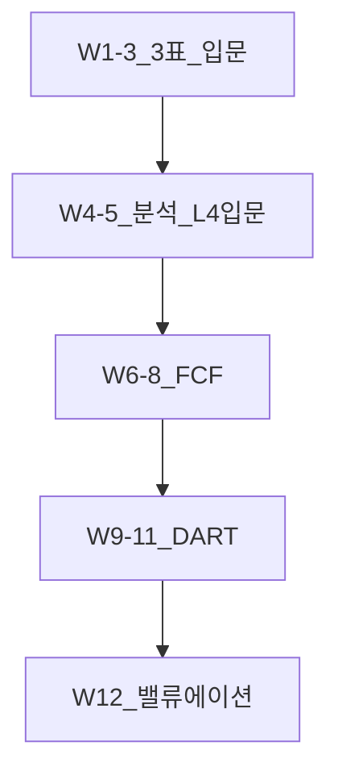
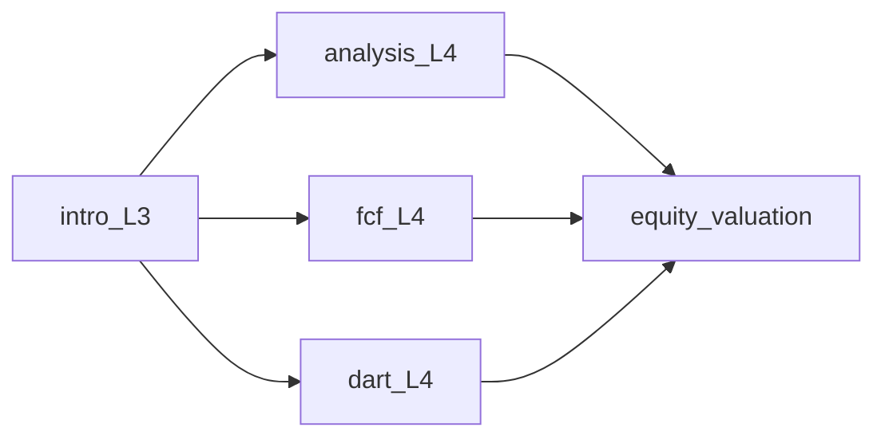

# 재무제표 학습 로드맵 — 12주 스케줄

> **면책**: 본 문서는 교육 목적이며, 특정 종목·기업에 대한 매수·매도·투자 자문이 아닙니다. K-IFRS·공시 규정은 개정될 수 있으므로 실행 전 [DART](https://dart.fss.or.kr) 및 [references/sources.md](../references/sources.md) 공식 출처를 확인하세요. 예제 기업·금액은 **가상**입니다.

## 메타

| 항목 | 내용 |
|------|------|
| 최종 검증일 | 2026-05-25 |
| 정책·법령 기준일 | 2025-12-31 (K-IFRS), 2026 개편 별도 |
| 난이도 | L3 (Deep) — [READER-GUIDE](../docs/READER-GUIDE.md) |
| 예상 읽기 시간 | 60분(로드맵) + **12주 × 3~4h/주 ≈ 36~48h** |
| 관련 bucket | Bucket 4 위성·섹터 전 **필수 선수** |

## 0. 이 편 읽기 전 (5분)

| 항목 | 내용 |
|------|------|
| **난이도** | L3 (Deep) — [READER-GUIDE §L등급](../docs/READER-GUIDE.md) |
| **선수** | [cash-flow-basics](cash-flow-basics.md), [compound-interest-and-time-value](compound-interest-and-time-value.md) |
| **이번 편에서 쓰는 기호** | 본문 §4·§4a 표 참고 |
| **복습 한 줄** | — |

> **가상 사례 회사**: 본 Phase 재무제표 심화 편은 **「가상 주식회사 한빛전자」** (가상의 코스피 제조·전자 부품) 숫자로 3표·DART·FCF를 **같은 스레드**로 읽는다. 실제 종목·실적이 아니다.
## TL;DR

1. **12주**로 [financial-statements-intro](financial-statements-intro.md) → [financial-statements-analysis](financial-statements-analysis.md) → [cash-flow-statement-fcf](cash-flow-statement-fcf.md) → [reading-annual-reports-dart](reading-annual-reports-dart.md) → [equity-valuation-fundamentals](../03-markets/equity-valuation-fundamentals.md) 연결.
2. 주당 **읽기 2~2.5h + 손계산·DART 1~1.5h** — [office-worker-investing-playbook](../00-roadmap/office-worker-investing-playbook.md) 5~6월 블록과 정렬.
3. **코어 ETF만** 투자해도 Week 9~12는 **간접** 유용(ETF 구성 종목·섹터).
4. 산출물: 주차별 **1페이지 노트** + Week 12 **가상 밸류에이션 메모**.
5. 코어 IPS와 분리: 재무제표 = **위성·섹터 검증** 도구.

## 1. 한 줄 정의 + 왜 중요한가

**정의**: **재무제표 12주 로드맵**은 3대 재무제표 문법부터 DART 공시·주석·FCF·기초 밸류에이션까지 **순서·분량·산출물**을 고정한 **학습 스케줄**이다.

!!! info "Bucket"
    시간·목적별 **자금 슬롯**(0 비상금 → 3 코어 등)

**왜 중요한가**: [semiconductor](../03-markets/sectors/semiconductor.md) 등 **AI 엔지니어 친숙 섹터**도 결국 **영업이익·OCF·순부채**로 귀결된다. 뉴스 “매출 대박”과 **현금흐름·일회성**을 구분하지 못하면 Bucket 4 **리스크 예산**을 초과한다.

## 2. 선수 지식 / 이후 읽을 것

**선수**:
- [cash-flow-basics](cash-flow-basics.md)
- [compound-interest-and-time-value](compound-interest-and-time-value.md)
- [debt-and-interest](debt-and-interest.md)

**이후**:
- [time-value-npv-irr](time-value-npv-irr.md) (L4)
- [wacc-capital-structure](../09-corporate-finance/wacc-capital-structure.md)
- [sectors/README.md](../03-markets/sectors/README.md)

## 3. 직관·비유

**손익계산서** = 영수증 합계 — “얼마 벌었나”  
**재무상태표** = 창고 사진 — “지금 뭘 갖고 있나”  
**현금흐름표** = 통장 입출금 — “돈이 실제로 움직였나”  

**주석** = 영수증 각주(“이번만 특별할인”) — **없이 보면 착각**.

## 4. 정식 개념·용어

| 용어 | English | 주차 |
|------|------|----------------|
| IS | Income Statement | 1~3 |
| BS | Balance Sheet | 2~4 |
| CF | Cash Flow Statement | 5~7 |
| OCF | Operating Cash Flow | 6~7 |
| FCF | Free Cash Flow | 7~8 |
| MD&A | Management Discussion | 9~10 |
| DART | Data Analysis Retrieval Transfer | 9~11 |
| P/E, P/B | Price multiples | 11~12 |

### 4a. 핵심 용어 (본문 등장 순)

> 복습용. 정의는 §4 본표·[glossary](../00-roadmap/glossary.md)·본문 `!!! info` 박스.

| 용어 | 한 줄 | 관련 이론 | glossary |
|------|------|------|----------------|
| IS | 1~3 | §4 | [glossary](../00-roadmap/glossary.md#is) |
| BS | 2~4 | §4 | [glossary](../00-roadmap/glossary.md#bs) |
| CF | 5~7 | §4 | [glossary](../00-roadmap/glossary.md#cf) |
| OCF | 6~7 | §4 | [glossary](../00-roadmap/glossary.md#ocf) |
| FCF | 7~8 | §4 | [glossary](../00-roadmap/glossary.md#fcf) |
| MD&A | 9~10 | §4 | [glossary](../00-roadmap/glossary.md#md&a) |
| DART | 9~11 | §4 | [glossary](../00-roadmap/glossary.md#dart) |
| P/E, P/B | 11~12 | §4 | [glossary](../00-roadmap/glossary.md#p/e,-p/b) |

## 5. 메커니즘 — 12주 전체 맵

### 5.1 주차별 상세 스케줄

| 주 | 주제 | 필수 문서 | 실습(가상) | 산출물 |
|------|------|------|------|----------------|
| **1** | 3표 역할·연결 | [financial-statements-intro](financial-statements-intro.md) §1~4 | 가상 **제조사 X** IS 한 줄 읽기 | 3표 질문 카드 |
| **2** | IS 심화·마진 | intro §5~7 | 매출·영업이익·당기순이익 **2년 비교** | 마진 표 |
| **3** | BS·유동성 | intro 나머지 | 유동비율·부채비율 **손계산** | BS 스냅샷 |
| **4** | 비율·DuPont 입문 | [financial-statements-analysis](financial-statements-analysis.md) §1~5 | ROE 분해 **1회** | DuPont 1페이지 |
| **5** | 이익 품질·일회성 | analysis §6~10 | 일회성 항목 **주석 찾기** 연습 | 조정 이익 메모 |
| **6** | CF 개념·OCF | [cash-flow-statement-fcf](cash-flow-statement-fcf.md) §1~4 | OCF vs 당기순이익 **괴리** | CF 3분류 표 |
| **7** | FCF·CapEx | fcf §5~8 | FCF = OCF − CapEx **가상** | FCF 계산식 |
| **8** | FCF 응용·배당 | fcf 나머지 + [dividends-buybacks](dividends-buybacks.md) | 배당성향·FCF **커버리지** | 배당 메모 |
| **9** | DART 구조 | [reading-annual-reports-dart](reading-annual-reports-dart.md) §1~4 | DART **검색·보고서 목록** | 공시 지도 |
| **10** | 주석·MD&A | dart §5~8 | **주석 2개** 발췌·요약 | 리스크 3줄 |
| **11** | 분기·IR 대조 | dart §9~12 | 분기보고서 vs **IR 슬라이드** | 불일치 체크 |
| **12** | 밸류에이션 기초 | [equity-valuation-fundamentals](../03-markets/equity-valuation-fundamentals.md) | P/E·P/B·**상대가치** 가상 | Week12 메모 |

### 5.2 주간 시간 예산

| 활동 | 시간/주 |
|------|---------|
| 본문 읽기(TL;DR→FAQ) | 120~150분 |
| 손계산·스프레드시트(가상) | 45~60분 |
| DART(9주~) | 45~90분 |
| 퀴즈·노트 | 30분 |
| **합계** | **약 4h** |

### 5.3 문서 간 의존 관계

## 6. 수식·모델

**DuPont (Week 4)**:

| 기호 | 이름 | 이 식에서 의미 |
|------|------|----------------|
| \(r\) | 할인율·수익률 | 기간당 이자·요구수익률 |
| \(n\) | 기간 | 연·월 등 복리·할인에 쓰는 횟수 |
| \(PV\) | 현재가치 | 오늘 시점으로 환산한 금액 |
| \(FV\) | 미래가치 | 미래 시점의 목표·결과 금액 |

\[
ROE = \frac{\text{Net Income}}{\text{Sales}} \times \frac{\text{Sales}}{\text{Assets}} \times \frac{\text{Assets}}{\text{Equity}}
\]

**읽는 법**: **ROE**와 **Net**의 관계를 위 식으로 쓴다. 경제·재무 해석은 변수표 「이 식에서 의미」와 [DEPTH-STANDARD](../docs/DEPTH-STANDARD.md) 기호 예제를 맞춘다.
**FCF (Week 7)**:

| 기호 | 이름 | 이 식에서 의미 |
|------|------|----------------|
| \(FCF\) | 잉여현금흐름 | 투자자에게 가용한 현금 |
| \(OCF\) | 영업현금흐름 | 영업활동에서 발생한 현금 |

\[
FCF = OCF - CapEx
\]

**읽는 법**: **FCF**와 **OCF**의 관계를 위 식으로 쓴다. 경제·재무 해석은 변수표 「이 식에서 의미」와 [DEPTH-STANDARD](../docs/DEPTH-STANDARD.md) 기호 예제를 맞춘다.

**상대밸류 (Week 12, 교육용)**:

| 기호 | 이름 | 이 식에서 의미 |
|------|------|----------------|
| \(r\) | 할인율·수익률 | 기간당 이자·요구수익률 |
| \(n\) | 기간 | 연·월 등 복리·할인에 쓰는 횟수 |
| \(PV\) | 현재가치 | 오늘 시점으로 환산한 금액 |
| \(FV\) | 미래가치 | 미래 시점의 목표·결과 금액 |

\[
P/E = \frac{\text{Price per share}}{EPS},\quad P/B = \frac{\text{Price}}{BVPS}
\]

**읽는 법**: **EPS**와 **P**의 관계를 위 식으로 쓴다. 경제·재무 해석은 변수표 「이 식에서 의미」와 [DEPTH-STANDARD](../docs/DEPTH-STANDARD.md) 기호 예제를 맞춘다.
해당 없음: 복잡 DCF는 [time-value-npv-irr](time-value-npv-irr.md) 이후.

## 7. 한국 적용

### 7.1 2025년 기준

- 상장사 **K-IFRS** — 연결·별도 표기 구분  
- **DART** 법정 공시 — [reading-annual-reports-dart](reading-annual-reports-dart.md)  
- 코스피·코스닥 **공시 규정** — [korea-equity-market-structure](../03-markets/korea-equity-market-structure.md)

### 7.2 2026년

- 회계기준·공시 규정 **개정** 시 Week 9~11 **체크리스트** 갱신

## 8. 숫자 예제 (가상)

### 예제 1 — Week 2 제조사 X

| | Y1 | Y2 |
|------|------|----------------|
| 매출 | 1,000 | 1,200 |
| 영업이익 | 100 | 90 |
| 당기순이익 | 80 | 70 |

매출 ↑인데 영업이익 ↓ → **마진 악화**·원가 점검(Week 5로).

### 예제 2 — Week 7 FCF

- OCF 150, CapEx 100 → FCF **50**  
- 당기순이익 120 → **이익 > FCF** → 운전자본·CapEx 의심

### 예제 3 — Week 12

- 주가 가상 50,000원, EPS 2,500 → P/E **20**  
- 섹터 평균 P/E 가상 15 → **프리미엄** — [sector-investing-framework](../03-markets/sectors/sector-investing-framework.md) 사이클 맥락

## 9. FAQ

**Q1. 코어 ETF만 하는데 12주 필요?**  
**A1.** Week 1~8은 **선택 축소**(4주 압축). Week 9~12는 ETF **Top10 종목** 공시에 유용.

**Q2. analysis·fcf가 L4인데 L3 로드맵?**  
**A2.** 로드맵은 **스케줄**; 본문 난이도는 문서 메타 따름. 어려운 주는 **2주 연장**.

**Q3. DART 영어?**  
**A3.** 국내 상장 **한국어** 중심. 해외는 10-K 별도(본 코퍼스 범위 외).

**Q4. AI 엔지니어 반도체 기업만 보면?**  
**A4.** Week 11에 **비교사 1개**(다른 섹터) 추가 — 편향 방지.

**Q5. 플레이북 5~6월과 병행?**  
**A5.** [office-worker-investing-playbook](../00-roadmap/office-worker-investing-playbook.md) **5~6월 = 본 로드맵**.

**Q6. 스프레드시트 필수?**  
**A6.** 권장. 없으면 **손계산 노트**로 대체.

**Q7. Week 12 후 다음?**  
**A7.** [quant-investing-intro](../08-advanced/quant-investing-intro.md) 또는 섹터 심화.

**Q8. 실제 종목 티커?**  
**A8.** 학습 노트에 **실제 매수 기록** 금지 — [DEPTH-STANDARD](../docs/DEPTH-STANDARD.md).

## 10. 함정·리스크·한계

- **주가 = EPS** 착각 — Week 12 전 **펀더멘털 vs 가격** 분리.  
- **분기 하나**로 사이클 판단 — 반도체는 **런레이트** 함정.  
- **IR만** 신뢰 — Week 10 **주석 대조** 필수.  
- **시간 부족** — 12주 → **16주** 연장 허용, 순서 유지.

---

**Q. 실무에서는?**  
교과서 식·기호를 그대로 적용하기 전에 **수수료·세금·데이터 시점**을 분리한다. 숫자는 [DEPTH-STANDARD](../docs/DEPTH-STANDARD.md)처럼 기호만 먼저 맞추고, 법령·시장 수치는 §8 표·외부 출처로 갱신한다.

## 11. 심화 읽기

- [STUDY-START.md](../00-roadmap/STUDY-START.md) Phase 1  
- [stocks-equities-intro](../03-markets/stocks-equities-intro.md)  
- [CURRICULUM-MAP.md](../00-roadmap/CURRICULUM-MAP.md)

## 12. 스스로 점검 퀴즈

1. Week 7 핵심 식은?  
2. DART 집중 주차는?  
3. FCF 문서 파일명은?  
4. DuPont ROE 3요인은?  
5. 12주 총 학습 시간(가이드)은?

??? note "정답 힌트"

    1. FCF=OCF−CapEx · 2. 9~11 · 3. cash-flow-statement-fcf.md · 4. 이익률·회전율·레버리지 · 5. 약 36~48h

## 부록 A. 주차별 체크박스

- [ ] Week 1 — intro  
- [ ] Week 2 — IS  
- [ ] Week 3 — BS  
- [ ] Week 4 — analysis DuPont  
- [ ] Week 5 — 이익 품질  
- [ ] Week 6 — OCF  
- [ ] Week 7 — FCF  
- [ ] Week 8 — 배당·FCF  
- [ ] Week 9 — DART  
- [ ] Week 10 — 주석  
- [ ] Week 11 — 분기·IR  
- [ ] Week 12 — valuation  

## 부록 B. 8주 압축 트랙 (코어 ETF 전용)

| 압축 주 | 통합 내용 | 필수 문서 |
|------|------|----------------|
| 1~2 | 3표 + IS·BS | [financial-statements-intro](financial-statements-intro.md) 전편 요약 |
| 3~4 | 비율 + OCF | intro + [financial-statements-analysis](financial-statements-analysis.md) 핵심 § |
| 5~6 | FCF + DART 입문 | [cash-flow-statement-fcf](cash-flow-statement-fcf.md) + [reading-annual-reports-dart](reading-annual-reports-dart.md) §1~5 |
| 7~8 | 주석 + 밸류에이션 | dart §6~10 + [equity-valuation-fundamentals](../03-markets/equity-valuation-fundamentals.md) TL;DR |

**산출물 축소**: 주차별 노트 → **최종 2페이지** “공시 읽기 치트시트”.

## 부록 C. 섹터·AI 엔지니어 연계 (Week 7~12 병행)

| 섹터 문서 | 재무제표 초점 | 주차 |
|------|------|----------------|
| [semiconductor](../03-markets/sectors/semiconductor.md) | CapEx·재고·감가 | 7~8 |
| [ai-infrastructure](../03-markets/sectors/ai-infrastructure.md) | 매출 인식·장기계약 | 9~10 |
| [power-grid-electrification](../03-markets/sectors/power-grid-electrification.md) | 부채·이자보상 | 10~11 |
| [battery-lfp-ncm-ess](../03-markets/sectors/battery-lfp-ncm-ess.md) | 마진·원가 | 11 |

**가상 실습**: “GPU 체인 **가상 기업 Y**” 사업보고서에서 **영업CF vs CapEx**만 추출 — 티커·매수 기록 **금지**.

## 부록 D. 주차별 DART 검색 키워드 (가상)

| 주 | DART 메뉴 | 검색·열람 |
|------|------|----------------|
| 9 | 공시검색 | 사업보고서 **목차** |
| 10 | 재무제표 | **주석 2·12·28** (산업·우발·특수관계) |
| 11 | 분기보고서 | **최근 분기** vs 전년 동기 |
| 12 | 주요사항 | **유상증자·CB** 이벤트 |

[reading-annual-reports-dart](reading-annual-reports-dart.md) 부록 표와 **교차**.

## 부록 E. 스프레드시트 템플릿 (가상 열)

| 열 | 설명 |
|----|------|
| A | 회계연도 |
| B | 매출 |
| C | 영업이익 |
| D | 당기순이익 |
| E | OCF |
| F | CapEx |
| G | FCF (=E−F) |
| H | 총부채 |
| I | 자기자본 |
| J | ROE |
| K | P/E (Week12) |

**검증**: Y2 FCF < Y1 FCF인데 주가 ↑ → **스토리 vs 현금** 불일치 메모.

## 부록 F. 문서별 예상 읽기 시간

| 문서 | 난이도 | 시간 |
|------|------|----------------|
| [financial-statements-intro](financial-statements-intro.md) | L3 | 55~70m |
| [financial-statements-analysis](financial-statements-analysis.md) | L4 | 150~180m |
| [cash-flow-statement-fcf](cash-flow-statement-fcf.md) | L4 | 150~180m |
| [reading-annual-reports-dart](reading-annual-reports-dart.md) | L4 | 150~180m |
| [equity-valuation-fundamentals](../03-markets/equity-valuation-fundamentals.md) | L3 | 60~75m |

**12주 합계**: 약 **40~55h** (압축 8주 **25~35h**).

## 부록 G. FAQ 추가

**Q9. 영어 재무제표만 보면?**  
**A9.** 해외 상장은 10-K — 본 로드맵은 **K-IFRS·DART** 중심. 해외는 별도 트랙.

**Q10. analysis L4를 4주에 못 읽으면?**  
**A10.** **5~6주로 연장**, 순서 유지. DuPont·이익 품질만 **필수**.

**Q11. equity-valuation을 Week 8로 당기면?**  
**A11.** FCF·주석 **선행** 권장 — P/E만 보면 **함정**.

**Q12. 퀴즈는 어디?**  
**A12.** 각 본문 §12 — 로드맵 주말에 **닫고** 풀기 [STUDY-START.md](../00-roadmap/STUDY-START.md).

## 부록 H. 12주 완료 후 인증 체크 (자가)

- [ ] 3표를 **30초** 안에 질문 3개 말하기  
- [ ] FCF **손계산** 1회  
- [ ] DART에서 **주석 1개** 요약  
- [ ] P/E·P/B **가상** 계산 1회  
- [ ] “뉴스 매출” vs **영업CF** 대조 1회  
- [ ] [quant-investing-intro](../08-advanced/quant-investing-intro.md) **읽을지** 결정  

---

**L3 완료 기준**: [TEMPLATE](../docs/TEMPLATE.md) 12블록·12주 표·FAQ 12+·mermaid 3+·부록 8 — 검증일 2026-05-25 — [DEPTH-STANDARD](../docs/DEPTH-STANDARD.md).