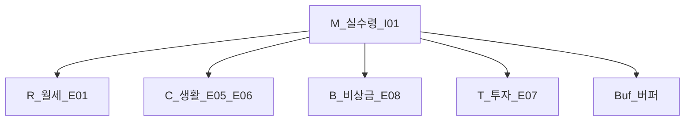

# 가계부 실전 — 분류·발생·현금·스프레드시트

> **면책**: 본 문서는 교육 목적이며, 특정 개인·법인에 대한 투자·세무·법률 자문이 아닙니다. 카드·공제·상품 조건은 변경될 수 있으므로 실행 전 금융기관·공식 출처를 확인하세요. **실제 개인 데이터는 포함하지 않습니다.**

## 메타

| 항목 | 내용 |
|------|------|
| 최종 검증일 | 2026-05-25 |
| 정책·법령 기준일 | 2025-12-31 확정, 2026 개편 별도 표기 |
| 난이도 | L3 (Deep) — [READER-GUIDE](../docs/READER-GUIDE.md) |
| 예상 읽기 시간 | 55~65분 |
| 관련 bucket | **Bucket 0~2** (비상금·정책·ISA/IRP 납입 추적) |

## 0. 이 편 읽기 전 (5분)

| 항목 | 내용 |
|------|------|
| **난이도** | L3 (Deep) — [READER-GUIDE §L등급](../docs/READER-GUIDE.md) |
| **선수** | [cash-flow-basics](cash-flow-basics.md) |
| **이번 편에서 쓰는 기호** | M(월 실수령), R·C·B·T(배분), 저축률 s |
| **복습 한 줄** | 현금흐름 = **돈이 통장에서 움직인 시점** 기준 |

## TL;DR

1. 가계 **현금흐름표**는 [cash-flow-basics.md](cash-flow-basics.md)처럼 **돈이 움직인 시점**이 기준이며, 신용카드는 **결제일(출금일)** 에 유출을 잡는다.
2. **발생주의(쓴 날)** 와 **현금주의(빠져나간 날)** 를 혼용하면 저축률·비상금 목표가 **과대·과소** 추정된다 — 한 가구에서 **하나만** 고른다.
3. 수입·지출 **카테고리 표**를 고정하면 앱·엑셀을 바꿔도 **연간 리뷰**가 가능하다.
4. 공과금·통신 등 **반고정비**는 **최근 3개월 평균**으로 예산을 잡고, 변동이 크면 **최댓값**을 버퍼로 쓴다.
5. 스프레드시트 **3탭**(원장·월집계·연간) + **80% 규칙**(대략 80%만 기록해도 실행)으로 완벽주의를 피한다.
6. 가상 프로필 **M(월 실수령)** — **R** 월세 · **C** 생활 · **B** 비상금 · **T** 투자 — 은 [emergency-fund.md](emergency-fund.md)·[isa.md](../06-korea-policy/isa.md)와 연결해 **자동이체 순서**를 설계한다. 기호: [DEPTH-STANDARD](../docs/DEPTH-STANDARD.md).

---

## 1. 한 줄 정의 + 왜 중요한가

!!! info "발생주의 vs 현금주의"
    **발생주의**: 카드 **사용일**·계약 기준. **현금주의**: 통장 **출금일** 기준. 한 가구에서 **하나만** 택해 12개월 동일하게 쓴다.

**정의**: **가계부 실전 가이드**는 월급·카드·이체 내역을 **일관된 분류**로 기록하고, 그 합계를 **순현금흐름·저축률·Bucket 배분**으로 바꾸는 **운영 규칙**이다. “무엇을 샀는가”(상품)보다 “왜 나갔는가”(목적: 생활·비상·투자)가 우선이다.

**왜 중요한가**:

| 이유 | 설명 |
|------|------|
| **저축률의 입력** | 분류가 흔들리면 \(s = (Y-C)/Y\) 자체가 매달 바뀌어 FV 시뮬이 무의미해진다 |
| **비상금 산정** | [emergency-fund.md](emergency-fund.md)의 “순유동 월 지출”은 **고정+필수 변동**만 넣어야 한다 |
| **ISA·IRP PMT** | [isa.md](../06-korea-policy/isa.md) 연 납입 한도는 **실제 이체액**으로만 추적한다 |
| **행동** | 할부·포인트·회사 식대는 **착시**를 만든다 — 규칙 없으면 “절약했다”고 착각한다 |

가계부는 회계 장부가 아니라 **의사결정용 대시보드**다. 정확도 100%보다 **같은 규칙으로 12개월 비교**가 더 가치 있다.

---

## 2. 선수 지식 / 이후 읽을 것

**선수**:
- [cash-flow-basics.md](cash-flow-basics.md) — 순현금·저축률·Bucket 파이프라인
- [compound-interest-and-time-value.md](compound-interest-and-time-value.md) — PMT·FV 연결

**이후**:
- [emergency-fund.md](emergency-fund.md) — Bucket 0 목표·보유 수단
- [debt-and-interest.md](debt-and-interest.md) — 카드·할부 이자 우선순위
- [isa.md](../06-korea-policy/isa.md) — Bucket 2b 납입·한도
- [time-horizon-and-buckets.md](../04-portfolio/time-horizon-and-buckets.md) — 배분 순서

---

## 3. 직관·비유

**영수증 상자 vs 통장**: 상자에 넣는 날은 **발생**(쇼핑한 날), 통장에서 빠지는 날은 **현금**(카드 결제일). 가계 **현금흐름**은 통장 기준이 자연스럽다.

**색깔 태그**: 수입·지출 항목마다 **고정 색**을 쓰면 “이번 달 왜 투자가 줄었지?”가 한눈에 보인다.

**주방 재고**: 냉장고에 넣은 날(발생)과 계산대에서 결제한 날(현금)이 다르면, “이번 주 식비”를 두 번 세게 된다.

**80% 채운 달력**: 운동 앱에서 하루 빠뜨려도 **한 달 24일**이면 습관은 유지된다. 가계도 **전 거래의 80%**만 분류해도 **총지출·저축 이체**는 잡힌다.

---

## 4. 정식 개념·용어

| 용어 | English | 정의 |
|------|---------|------|
| 발생주의 | Accrual basis | **지출·수입이 생긴 시점**(승인일·거래일)에 기록 |
| 현금주의 | Cash basis | **계좌에서 돈이 이동한 시점**(출금·입금)에 기록 |
| 결제일 | Payment date | 카드사가 **출금 이체**하는 날 — 가계 현금유출 시점 |
| 승인일 | Authorization date | 카드 **사용·승인**된 날 — 발생 시점 |
| 고정비 | Fixed expense | 월세·보험·구독·대출 원리금 등 **금액·시기 예측 가능** |
| 반고정비 | Semi-fixed | 공과금·통신·관리비 — **계절·요금제**로 변동 |
| 변동비 | Variable expense | 식비·교통·취미·의류 등 |
| 투자 유출 | Investment outflow | ISA·IRP·청년도약 등 **자산 형성 이체**(생활비 아님) |
| 비상금 이체 | Emergency fund transfer | Bucket 0 전용 계좌로의 **저축 이체** |
| 저축률 | Savings rate | (실수령 − 생활 유출) / 실수령, 또는 (비상+투자+정책) / 실수령 |
| 80% 규칙 | 80% tracking rule | 전 거래 대신 **핵심 유출·모든 이체**만 맞춰도 운영 가능 |

### 4a. 핵심 용어 (본문 등장 순)

> 복습용. 정의는 §4 본표·[glossary](../00-roadmap/glossary.md)·본문 `!!! info` 박스.

| 용어 | 한 줄 | 관련 이론 | glossary |
|------|-------|-----------|----------|
| 발생주의 | **지출·수입이 생긴 시점** | §4 | [glossary](../00-roadmap/glossary.md#발생주의) |
| 현금주의 | **계좌에서 돈이 이동한 시점** | §4 | [glossary](../00-roadmap/glossary.md#현금주의) |
| 결제일 | 카드사가 **출금 이체**하는 날 | §4 | [glossary](../00-roadmap/glossary.md#결제일) |
| 승인일 | 카드 **사용·승인**된 날 | §4 | [glossary](../00-roadmap/glossary.md#승인일) |
| 고정비 | 월세·보험·구독·대출 원리금 등 **금액·시기 예측 가능** | §4 | [glossary](../00-roadmap/glossary.md#고정비) |
| 반고정비 | 공과금·통신·관리비 | §4 | [glossary](../00-roadmap/glossary.md#반고정비) |
| 변동비 | 식비·교통·취미·의류 등 | §4 | [glossary](../00-roadmap/glossary.md#변동비) |
| 투자 유출 | ISA·IRP·청년도약 등 **자산 형성 이체** | §4 | [glossary](../00-roadmap/glossary.md#투자-유출) |
| 비상금 이체 | Bucket 0 전용 계좌로의 **저축 이체** | §4 | [glossary](../00-roadmap/glossary.md#비상금-이체) |
| 저축률 |  | §4 | [glossary](../00-roadmap/glossary.md#저축률) |
| 80% 규칙 | 전 거래 대신 **핵심 유출·모든 이체**만 맞춰도 운영 가능 | §4 | [glossary](../00-roadmap/glossary.md#80%-규칙) |

---

## 5. 메커니즘 — 발생 vs 현금(신용카드)

### 5.1 왜 카드에서 논쟁이 나는가

신용카드는 **승인(발생)** 과 **결제(현금)** 가 **1~2개월** 어긋날 수 있다. 급여는 매월 25일, 카드 결제는 매월 10일이면, “1월에 산 것”이 **2월 통장**에 찍힌다. 발생으로 월별 지출을 맞추면 **현금 잔고**와 안 맞고, 현금만 보면 **어느 달에 과소비했는지**가 흐려진다.

**교육용 권장(개인 현금흐름)**:

| 기록 대상 | 권장 기준 | 이유 |
| ----------- | ----------- | -----------이(가) 이 식에서 맡는 역할(§4·본문 참고) |
| 급여·이자·배당 입금 | **입금일(현금)** | 실수령과 일치 |
| 체크카드·계좌이체 | **출금일(현금)** | 통장과 1:1 |
| **신용카드 전체** | **결제일(현금)** | [cash-flow-basics.md](cash-flow-basics.md)의 “다음 달 유출” 착시 방지 |
| 할부 원금 | **매 결제일 분할 유출** | 총액을 승인월에 한 번 넣지 않음 |
| 포인트·할인 | **별도 행 없음** 또는 메모 | 실제 출금액만 유출 |

**발생주의를 쓸 때**: “이번 달 **소비 습관**” 리포트용 **보조 시트**에만 두고, **저축률·비상금·ISA PMT** 계산은 **현금 탭**에서 한다.

### 5.2 카드·현금 이중계상 방지

### 5.3 월말 마감 흐름

---

## 6. 분류 체계 — 수입·지출

### 6.1 수입 카테고리 (가상 코드)

| 코드 | 항목 | English | 기록 시점 | 비고 |
|------|------|---------|-----------|------|
| **I01** | 급여 | Salary | 입금일 | 명목 아닌 **실수령** |
| **I02** | 상여·성과급 | Bonus | 입금일 | Bucket 일시 배분 — [cash-flow-basics.md](cash-flow-basics.md) |
| **I03** | 연말정산 환급 | Tax refund | 환급 입금일 | “보너스”와 동일 규칙 |
| **I04** | 이자 | Interest | 입금일 | 예·적금·CMA |
| **I05** | 배당 | Dividend | 입금일 | **일반계좌** vs ISA는 계좌 태그 |
| **I06** | 기타 소득 | Other income | 입금일 | 프리랜스·용역 — 세금 적립 별도 |

**제외(유입 아님)**: 회사 **DC·DB 적립**, 복지포인트 **지급**(현금화 전), 카드 **캐시백 적립**(결제 시 차감만 반영).

### 6.2 지출 카테고리 (가상 코드)

| 코드 | 항목 | 유형 | Bucket 연결 |
|------|------|------|-------------|
| **E01** | 주거·월세 | 고정 | 생활 — 비상금 산정 **포함** |
| **E02** | 보험·구독 | 고정 | 생활 |
| **E03** | 대출 원리금 | 고정 | 이자는 [debt-and-interest.md](debt-and-interest.md) 우선 |
| **E04** | 공과금·통신·관리비 | **반고정** | 3개월 평균 — §7 |
| **E05** | 식비·교통·생활 | 변동 | 주간 캡 권장 |
| **E06** | 취미·의류·여가 | 변동 | “원함” 슬롯 |
| **E07** | ISA·IRP·청년도약 납입 | 투자 유출 | Bucket 2 — [isa.md](../06-korea-policy/isa.md) |
| **E08** | 비상금 이체 | 저축 유출 | Bucket 0 — [emergency-fund.md](emergency-fund.md) |
| **E09** | 비상 인출 | 비상금 → 생활 | **E08의 역거래**로 표시 |

**투자(E07) vs 생활(E05)**: 주식 **매수**는 ISA 계좌 **내부 이동**이면 가계 **생활 유출이 아님**. 가계부에는 **“증권계좌로 이체한 금액”**만 E07.

### 6.3 공과금 3개월 평균 (반고정비)

| 단계 | 행동 |
|------|------|
| 1 | 최근 **3개월** E04 실제 출금 합산 |
| 2 | **평균** \( \bar{U} = (U_{-1}+U_{-2}+U_{-3})/3 \) |
| 3 | 예산 = \( \max(\bar{U}, U_{max}) \) 또는 \( \bar{U} \times 1.05 \) (여름·겨울 냉난방) |
| 4 | 통신·관리비도 **동일 방식** — 요금제 변경 월은 **메모** |

**함정**: 카드로 공과금을 내면 **결제일**에 E04가 찍힌다. 발생(고지서 월)과 다르면 **보조 시트**에만 고지 월을 적는다.

---

## 7. 한국 적용 — 스프레드시트 3탭·80% 규칙

### 7.1 스프레드시트 3탭 템플릿

| 탭 | 이름 | 열 예시 | 용도 |
|----|------|---------|------|
| **1** | `RAW_원장` | 날짜, 금액, 적요, 계좌, **코드(I/E)**, 메모 | 은행·카드 CSV 붙여넣기 |
| **2** | `MONTH_월집계` | 월, I01~I06 합, E01~E09 합, **순현금**, **저축률** | 피벗·SUMIF |
| **3** | `YEAR_연간` | 연도, YTD 수입·지출, 3개월 공과금 평균, ISA 누적 | 연말 리뷰 |

**필수 수식(개념)**:

- 월 순현금 = \(\sum I - \sum E\) (E07·E08 포함 시 **총유출**; 생활만 보려면 E07·E08 제외한 **생활순현금** 별도 열)
- 저축률(광의) = \((E07+E08) / I01\) (보너스 제외 시 I01만 분모)

**자동화**: 급여일 **오전** E08 → E07 순 이체 — [cash-flow-basics.md](cash-flow-basics.md) 흐름도와 동일.

### 7.2 80% 규칙

| 반드시 100% | 80%면 충분 |
|-------------|------------|
| 급여·보너스·환급 입금 | 편의점·소액 현금 |
| 비상금·ISA·IRP **이체** | 카페·간식 (월 합만 맞추면 됨) |
| 월세·대출·보험 | 분류 미세 오류 |
| 카드 **결제 총액** | 적요 키워드 미매칭 소수 건 |

**원칙**: “분류 완벽”보다 **총지출·저축 이체** 두 숫자가 맞으면 **실행은 성공**이다. 3개월 연속 총지출만 **+10%** 넘으면 E05·E06 감사.

### 7.3 가상 프로필 — 기호 M·R·C·B·T (교육용)

> 인물·거주지·직장은 **가상**입니다. **구체 금액은 넣지 않고** 독자가 본인 **M**(만 원)으로 표를 채웁니다. 기호: [DEPTH-STANDARD](../docs/DEPTH-STANDARD.md).

| 구분 | 항목 | 기호 | 비고 |
|------|------|------|------|
| **유입** | 실수령 (I01) | **M** | 세후·4대보험 공제 후 |
| **유출** | 월세·관리 (E01) | **R** | 순유동 지출의 핵심 |
| **유출** | 생활·변동 (E05~E06) | **C** | 식비·교통·소액 여가 |
| **유출** | 반고정 (E04) | (C에 합산 또는 별도) | 가계마다 태그 분리 |
| **배분** | 비상금 이체 (E08) | **B** | Bucket 0 |
| **배분** | 투자 ISA·IRP (E07) | **T** | 한도·현금흐름에 따라 \(T_\min \sim T_\max\) |
| **잔여** | 버퍼·유연 | **Buf** | \(M - R - C - B - T\) |

**균형(근사)**: \(M \approx R + C + B + T + \text{Buf}\).

**저축률(광의)**: \((B + T) / M\). (독자 표에서 \(B,T\) 대입.)

**비상금 목표**: 순유동 \(U \approx R + C_\text{필수}\) → 6개월 목표 \(6U\). 월 이체 \(B\)면 누적 \(12k \cdot B\) (개월 \(k\)) — [emergency-fund.md](emergency-fund.md).

**ISA**: \(12 \cdot T_\text{ISA} \leq L_\text{ISA}\) (2025 일반형 \(L_\text{ISA}=2{,}000\)만 — [isa.md](../06-korea-policy/isa.md)). \(T\) 중 ISA 몫만 합산.

### 7.4 2025~2026 체크리스트 (한국)

| 항목 | 가계부에 반영할 것 |
|------|-------------------|
| 연말정산 | I03 환급·추납 **입출금일** |
| ISA·IRP 한도 | E07 **YTD** 열 — 2026 개편 시 [isa.md](../06-korea-policy/isa.md) 재확인 |
| 청년도약 | E07 하위 태그 |
| 카드 **포인트·할인** | 출금액만 — §9 FAQ |
| **예금자보호** | 비상금 계좌 분산 — [emergency-fund.md](emergency-fund.md) |

---

## 8. 숫자 예제 (가상)

### 예제 1: 같은 쇼핑, 다른 기준

| 사건 | 날짜 | 금액 |
|------|------|----------------|
| 카드 승인 | 1월 28일 | **M** |
| 카드 결제 | 2월 10일 | **M** |

- **발생**: 1월 E05 +**M** → 1월 지출 과대  
- **현금**: 2월 E05 +**M** → **2월 통장**과 일치 → **현금 마스터 채택**

### 예제 2: 할부 **M** × 3개월

| 월 | 기록 (현금) |
|----|-------------|
| 3월 결제일 | E05 +**M** |
| 4월 결제일 | E05 +**M** |
| 5월 결제일 | E05 +**M** |

승인월 3월에 **M** **한 번** 넣으면 **저축률 2·3월 왜곡**.

### 예제 3: 보너스 I02 **M** (가상)

| 배분 | 코드 | 금액 |
|------|------|----------------|
| 비상금 보강 | E08 | 60 |
| ISA | E07 | 120 |
| 생활·여가 | E05 | 40 |
| 고금리 카드 상환 | E03 | 80 |

### 예제 4: 공과금 3개월

| 월 | E04 출금 |
|----|----------|
| 3월 | 11 |
| 4월 | 9 |
| 5월 | 14 |

\(\bar{U} = 11.3\) → 6월 예산 **M** (×1.05 반올림) 또는 **M** (max 버퍼, 교육용).

### 예제 5: 80% 규칙 한 달

| 항목 | 기록률 |
|------|--------|
| 이체·급여·월세 | 100% |
| 카드 결제 **총액** | 100% |
| 건별 분류 | 78% |
| **월 총지출 오차** | **< 2%** → **합격** |

---
## 9. FAQ — 애매한 항목 (5+)

**Q1. 할부는 승인월에 넣나요, 결제월에 나누나요?**  
**A1.** 가계 **현금흐름**은 **결제일마다 원금 분할**(예제 2). “총 부채”는 별도 **부채 시트**에서만.

**Q2. 체크카드는 신용카드와 같나요?**  
**A2.** **출금일 = 사용일**에 가깝다 → **현금주의**로 즉시 E05~E06. 신용카드만 **결제일 규칙**이 필수.

**Q3. 룸메이트·부부 **공동 생활비**는?**  
**A3.** **본인 통장에서 나간 금액만** 기록. 상대방 분담금 **수령**은 I06 또는 E05 차감 메모. 합산 가구면 [cash-flow-basics.md](cash-flow-basics.md)처럼 **별도 시트**로 합친다.

**Q4. 선물·경조사는?**  
**A4.** **E06(여가·관계)** 또는 **E05** — 한 가구 **한 코드**로 고정. “투자” 아님.

**Q5. ATM **현금 인출**은?**  
**A5.** 인출일 **E05 ‘현금성’** 하위. 현금 사용은 **영수증 없으면 월말 추정**(80% 규칙) — 인출액 ≈ 그 달 현금 소비 상한.

**Q6. 포인트·마일리지·캐시백은 수입인가요?**  
**A6.** **실제 출금액**만 유출. 전액 포인트 결제면 **0원 거래** — 습관 분석용 발생 시트에만 금액 메모.

**Q7. 회사 **구내식당·식대**는?**  
**A7.** 급여에서 **공제된 식대**는 이미 I01에 반영. **복지 포인트**만 쓴 식사는 **유출 0** — 이중으로 E05 빼지 않음.

**Q8. 체크카드 + 신용카드 **중복** 결제는?**  
**A8.** 체크 **출금**과 카드 **결제**가 같은 건이면 **한 번만**. 원장에 `중복제외` 메모.

**Q9. 비상금에서 생활비로 옮기면?**  
**A9.** E09로 **비상 인출** 표시 — E08과 쌍으로 보면 Bucket 0 잔액 추적.

**Q10. 가계 앱 카테고리 50개 vs 엑셀?**  
**A10.** **코드 15개 내**로 매핑. 앱은 입력, 엑셀은 **탭2 월집계**가 진실.

---

## 10. 함정·리스크·한계

- **발생·현금 혼용** → 특정 월 저축률 **±15%p** 착시  
- 카드 **청구서 총액**만 보고 **할부 잔액** 무시 → 부채 과소  
- ISA **매수**를 생활비로 분류 → 생활비 과대·투자 과소  
- 포인트 **이중 차감** → 지출 과소  
- **완벽 분류** → 2개월 후 포기 — 80% 규칙 위반  
- **명목 연봉**으로 \(T\)만 크게 잡기 — **M** 대비 **현금 부족**  
- 배우자 지출 **미공유** → 가구 합산 s **과대**  
- 회사 **스톡옵션** — 유동성·세금 **별도 일정**, I01에 섞지 않음  

---

**Q. 실무에서는?**  
교과서 식·기호를 그대로 적용하기 전에 **수수료·세금·데이터 시점**을 분리한다. 숫자는 [DEPTH-STANDARD](../docs/DEPTH-STANDARD.md)처럼 기호만 먼저 맞추고, 법령·시장 수치는 §8 표·외부 출처로 갱신한다.

## 11. 심화 읽기

- [cash-flow-basics.md](cash-flow-basics.md) — Bucket·자동이체  
- [emergency-fund.md](emergency-fund.md) — E08 목표·보유 수단  
- [isa.md](../06-korea-policy/isa.md) — E07 한도·중개형  
- [debt-and-interest.md](debt-and-interest.md) — 할부·카드 이자  
- [rebalancing-and-dca.md](../04-portfolio/rebalancing-and-dca.md) — E07 내부 매수 리듬  

### 분기별 가계 감사 (가상)

| 분기 | 행동 |
|------|------|
| Q1 | E04 **3개월 평균** 재계산 |
| Q2 | 구독·보험 E02 갱신 |
| Q3 | I02·I03 **일시 소득** Bucket 규칙 점검 |
| Q4 | YTD E07 vs ISA 한도 — [isa.md](../06-korea-policy/isa.md) |

---

## 12. 스스로 점검 퀴즈

1. 신용카드를 **현금주의**로 쓸 때 유출은 **승인일**인가 **결제일**인가?  
2. E07과 E08은 [emergency-fund.md](emergency-fund.md)·[isa.md](../06-korea-policy/isa.md) 중 무엇과 연결되는가?  
3. 공과금 예산을 **3개월 평균**으로 잡는 이유는?  
4. 본인 **M, B, T**로 **저축률(광의)** \((B+T)/M\)을 계산하라.  
5. 회사 식대 포인트만 사용한 날, E05에 넣어야 하나?  
6. 80% 규칙에서 **반드시 100%**여야 하는 항목 두 가지는?

??? note "정답 힌트"

    1. **결제일(출금일)** · 2. E08=비상금 Bucket 0, E07=ISA/IRP Bucket 2 · 3. 계절 변동 완화·예산 현실화 · 4. **\((B+T)/M\)** (본인 B,T 대입) · 5. **아니오**(이중 계상) · 6. 예: **급여·저축 이체·월세·카드 결제 총액** 등