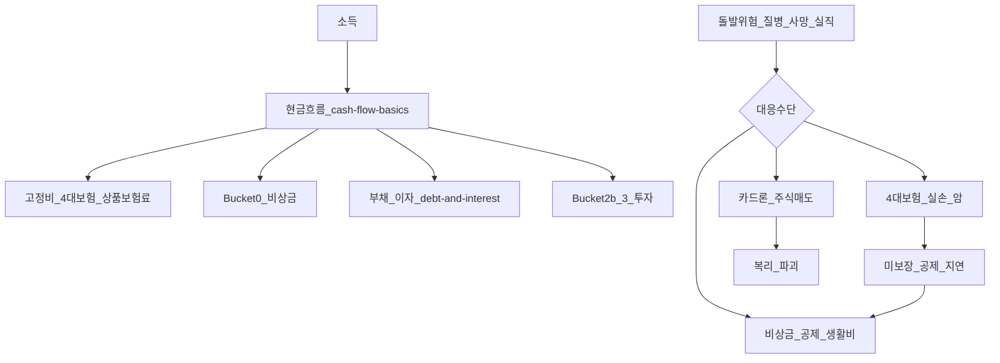
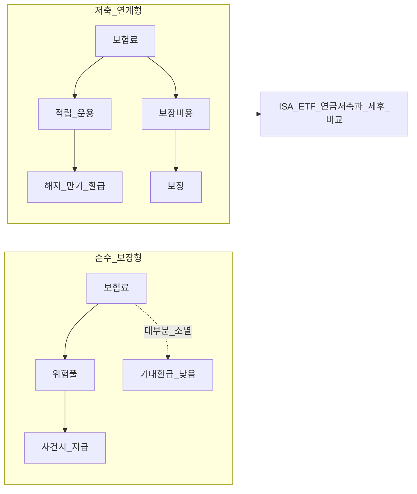
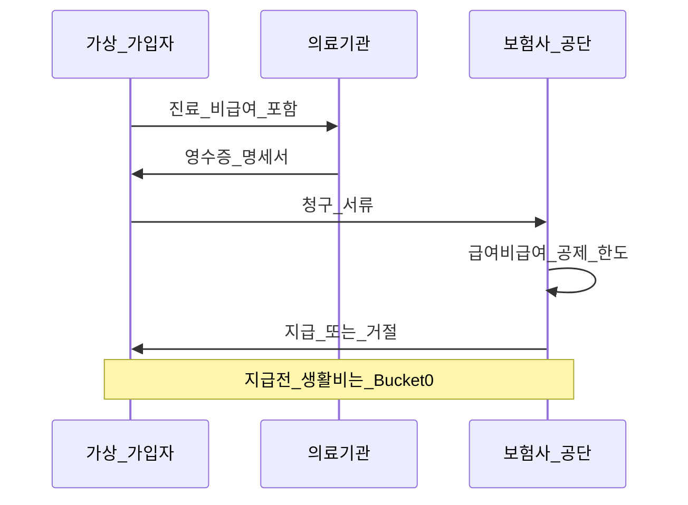

# 보험·리스크 전가 — Bucket 0과 투자의 경계

> **면책**: 본 문서는 교육 목적이며, 특정 개인·법인에 대한 투자·세무·법률·보험 설계 자문이 아닙니다. 보험 약관·보장 범위·세제·4대보험 요율·국민연금 수급 조건은 변경될 수 있으므로, 가입·해지·청구 전 금융감독원·금융소비자원·국민건강보험공단·국민연금공단·보험사 공식 안내를 확인하세요.

## 메타

| 항목 | 내용 |
|------|------|
| 최종 검증일 | 2026-05-25 |
| 정책·법령 기준일 | 2025-12-31 확정, 2026 개편·시행 예정 별도 표기 |
| 난이도 | L4 (Graduate) — [READER-GUIDE](../docs/READER-GUIDE.md) |
| 예상 읽기 시간 | 165~195분 |
| 관련 bucket | **Bucket 0** (현금흐름·비상금·고정비), Bucket 1~2 (세제·연금과 구분) |

## 0. 이 편 읽기 전 (5분)

| 항목 | 내용 |
|------|------|
| **난이도** | L4 (Graduate) — [READER-GUIDE §L등급](../docs/READER-GUIDE.md) |
| **선수** | [compound-interest-and-time-value](compound-interest-and-time-value.md), [emergency-fund](emergency-fund.md) |
| **이번 편에서 쓰는 기호** | 본문 §4·§4a 표 참고 |
| **복습 한 줄** | L3 선수 편을 먼저 읽으면 수식이 수월함 |

## TL;DR

1. **보험(Insurance)** 은 **개인이 감당하기 어려운 손실**을 **보험료(프리미엄)** 로 **보험사·공적 기금**에 **전가(risk transfer)** 하는 **계약**이며, 목표는 **기대 수익 극대화**가 아니라 **재무 붕괴 확률 축소**다.
2. **보장형(손해·실손·암·상해)** 과 **저축형(연금·변액·저축보험)** 은 **같은 “보험” 라벨** 아래 **완전히 다른 경제 구조** — 전자는 **손실 보전**, 후자는 **장기 저축+보장 혼합**으로 [compound-interest-and-time-value](compound-interest-and-time-value.md)와 직접 경쟁한다.
3. **4대보험·국민연금**은 **강제·준강제 공적 보험**으로 **기본 안전망**을 제공하지만, **면책·공제·지급 지연·소득 대체 한계** 때문에 [emergency-fund](emergency-fund.md)의 **Bucket 0**을 대체하지 못한다.
4. 보험료는 [cash-flow-basics](cash-flow-basics.md)의 **고정비** — **과보장·중복 가입**은 **매월 순저축을 잠식**하고, [debt-and-interest](debt-and-interest.md)의 **고금리 부채**와 **동시에** 존재하면 Bucket 3까지 도달하기 어렵다.
5. **저축보험·변액보험**을 **ISA·ETF·연금저축**과 비교할 때는 **세후·유동성·수수료·해지 손실**을 **동일 기준**으로 본다 — “보험 = 투자” 프레이밍은 **행동·현금흐름** 함정을 만든다.

---

## 1. 한 줄 정의 + 왜 중요한가

**정의**: **보험·리스크 전가(Risk Transfer)** 는 특정 **불확실 사건(위험)** 이 발생했을 때의 **경제적 손실**을, 사전에 합의한 **보험료·공적 부담금**과 **약관상 지급 규칙**으로 **본인 → 집단(풀링) → 지급자(보험사·공단)** 에 분산·이전하는 **재무·법적 장치**이다.

**왜 중요한가** (장기 자산 형성·bucket 연결):

| 관점 | 설명 |
|------|------|
| **Bucket 0** | [emergency-fund](emergency-fund.md)는 **단기 유동성**, 보험은 **특정 대형 손실** — **상호 보완**이지 **대체**가 아님 |
| **현금흐름** | 월 보험료는 **순저축률**을 깎는 **고정비** — [cash-flow-basics](cash-flow-basics.md) |
| **부채 우선** | 보험료 + 카드 이자가 동시에 크면 **투자 전** [debt-and-interest](debt-and-interest.md) |
| **투자 혼동** | 저축보험·변액을 **코어 ETF**와 같은 슬롯에 두면 **해지 손실·낮은 유동성**으로 [time-horizon-and-buckets](../04-portfolio/time-horizon-and-buckets.md) 붕괴 |
| **행동** | “이미 보험 있다”는 **안심 착각**이 비상금·부채 정리를 **지연** — [behavioral-finance-complete](../05-behavioral/behavioral-finance-complete.md) |

L4 학습자는 **보험 계약서·약관·지급 한도**를 “법률 문서”가 아니라 **현금흐름·확률·옵션**으로 읽을 수 있어야 한다. **보험 설계사·영업**과 **재무 목표(Bucket)** 를 **분리**하는 것이 본 문서의 실무 목표다.

---

## 2. 선수 지식 / 이후 읽을 것

**선수**:
- [compound-interest-and-time-value.md](compound-interest-and-time-value.md) — 보험료 적립·해지환급금의 **시간가치**
- [emergency-fund.md](emergency-fund.md) — Bucket 0, 보험과 **역할 분담**
- [cash-flow-basics.md](cash-flow-basics.md) — 고정비·저축률·4대보험 공제

**이후**:
- [debt-and-interest.md](debt-and-interest.md) — 보험료 vs 고금리 부채 **우선순위**
- [pension-savings-account.md](../06-korea-policy/pension-savings-account.md) — 연금저축·세액공제
- [db-pension.md](../06-korea-policy/db-pension.md) · [irp.md](../06-korea-policy/irp.md) — 퇴직·연금 슬롯
- [asset-allocation.md](../04-portfolio/asset-allocation.md) — 보험 **초과분**의 투자 배분
- [investment-tax-overview.md](../06-korea-policy/tax/investment-tax-overview.md) — 보험 vs ISA **세후 비교**

---

## 3. 직관·비유

**우산 vs 저축통**: **보장형 보험**은 비 올 때만 펴는 **우산**이다. 평소에는 **우산값(보험료)** 만 내고, 맑은 날 “우산값이 아깝다”며 **해지**하면 다음 폭우에 **맨몸**이다. **저축보험**은 우산 안에 **동전 넣는 통**이 달린 형태 — 비가 안 와도 통에 돈이 쌓이지만, **중도에 깨면(해지)** 수수료·보장 공백이 생긴다.

**4대보험 = 아파트 공용 소화설**: **국민연금·건강·고용·산재**는 **전 국민·근로자**가 **의무·준의무**로 납부하는 **공용 안전망**이다. 개인 **가스레인지 화재(특정 질병·사망)** 에 **일부** 대응하지만, **가구 생활비 6개월**이나 **자기부담금·비급여**까지 **전부** 덮지는 않는다 — 그래서 [emergency-fund](emergency-fund.md) **개인 소화기**가 필요하다.

**실손 = 영수증 정산**: 병원비 **영수증**을 **약관·급여·비급여·공제** 규칙에 맞춰 **정산**받는 **손해 보험**에 가깝다. “얼마 썼느냐”가 아니라 “**약관상 얼마까지**”가 핵심 — **진단비·수술비定額**은 **영수증 없이** 정해진 금액을 **지급**하는 **별도 계약**이다.

**보험 ≠ 투자**: 주식·ETF는 **기대 수익**과 **변동성**을 **스스로** 선택한다. **순수 보장형**은 **기대값(EV)** 이 **음(-)** 일 수 있어도 **꼬리 리스크(tail risk)** 를 **잘라** **파산·강제매도**를 막는 **옵션**이다. **저축형**은 **옵션 + 저축** 혼합 — **옵션 프리미엄(보장비용)** 과 **운용비**를 **분리해서** 봐야 [ISA](../06-korea-policy/isa.md)와 **공정 비교**가 된다.

**중복 가입 = 우산 여러 개**: 실손·암·상해를 **겹겹이** 사면 **월 고정비**만 커지고, **실제 추가 지급**은 **약관상 한도·비례 보상**으로 **제한**되는 경우가 많다. [cash-flow-basics](cash-flow-basics.md) 관점에서 **한 우산 + 비상금 + 공적 안전망**이 **효율적**인 경우가 많다.

---

## 4. 정식 개념·용어

| 용어 | 한글 | English | 정의 |
|------|------|---------|------|
| Risk transfer | 리스크 전가 | Risk transfer | 손실을 제3자(보험사·공단)로 이전 |
| Risk pooling | 위험 분산·풀링 | Risk pooling | 다수의 보험료로 소수의 대손실 상환 |
| Premium | 보험료 | Premium | 보장·운용·비용에 대한 **정기·일시** 납입 |
| Indemnity | 손해 보상 | Indemnity | **실제 손해** 범위 내 지급(초과 이익 불가 원칙) |
| Benefit limit | 보장 한도 | Coverage limit | 연·회·건당 **최대 지급** |
| Deductible | 자기부담금 | Deductible / copay | 본인이 먼저 부담하는 금액·비율 |
| Exclusion | 면책 | Exclusion | 보장 **제외** 사유·기간 |
| Moral hazard | 도덕적 해이 | Moral hazard | 보험 가입 후 **위험 행동** 증가 |
| Adverse selection | 역선택 | Adverse selection | 고위험자만 **가입**하려는 경향 |
| Pure protection | 순수 보장 | Pure protection | **저축·환급** 없이 보장만 |
| Savings-linked | 저축 연계 | Savings-linked insurance | **적립·환급**이 있는 상품 |
| Real loss medical | 실손의료 | Indemnity health | **실제 의료비** 손해 보전 |
| Fixed benefit | 정액급 | Fixed benefit | 진단·수술 등 **정해진 금액** 지급 |
| 4대보험 | 4 major social insurances | Social insurance (KR) | 국민연금·건강·고용·산재 |
| NPS | 국민연금 | National Pension | **노후 소득** 공적 연금 |
| NHIS | 건강보험 | National Health Insurance | **의료** 공적 보험 |
| Surrender value | 해지환급금 | Surrender value | 중도 해지 시 **적립분** 환급(손실 가능) |
| Maturity benefit | 만기환급금 | Maturity benefit | 만기 시 **약정** 환급 |
| Subrogation | 대위 | Subrogation | 보험사가 지급 후 **구상권** 행사 |
| Bucket 0 | — | Liquidity sleeve | [emergency-fund](emergency-fund.md) 슬롯 |

### 4a. 핵심 용어 (본문 등장 순)

> 복습용. 정의는 §4 본표·[glossary](../00-roadmap/glossary.md)·본문 `!!! info` 박스.

| 용어 | 한 줄 | 관련 이론 | glossary |
|------|-------|-----------|----------|
| Risk transfer | 손실을 제3자 | §4 | [glossary](../00-roadmap/glossary.md#risk-transfer) |
| Risk pooling | 다수의 보험료로 소수의 대손실 상환 | §4 | [glossary](../00-roadmap/glossary.md#risk-pooling) |
| Premium | 보장·운용·비용에 대한 **정기·일시** 납입 | §4 | [glossary](../00-roadmap/glossary.md#premium) |
| Indemnity | **실제 손해** 범위 내 지급 | §4 | [glossary](../00-roadmap/glossary.md#indemnity) |
| Benefit limit | 연·회·건당 **최대 지급** | §4 | [glossary](../00-roadmap/glossary.md#benefit-limit) |
| Deductible | 본인이 먼저 부담하는 금액·비율 | §4 | [glossary](../00-roadmap/glossary.md#deductible) |
| Exclusion | 보장 **제외** 사유·기간 | §4 | [glossary](../00-roadmap/glossary.md#exclusion) |
| Moral hazard | 보험 가입 후 **위험 행동** 증가 | §4 | [glossary](../00-roadmap/glossary.md#moral-hazard) |
| Adverse selection | 고위험자만 **가입**하려는 경향 | §4 | [glossary](../00-roadmap/glossary.md#adverse-selection) |
| Pure protection | **저축·환급** 없이 보장만 | §4 | [glossary](../00-roadmap/glossary.md#pure-protection) |
| Savings-linked | **적립·환급**이 있는 상품 | §4 | [glossary](../00-roadmap/glossary.md#savings-linked) |
| Real loss medical | **실제 의료비** 손해 보전 | §4 | [glossary](../00-roadmap/glossary.md#real-loss-medical) |
| Fixed benefit | 진단·수술 등 **정해진 금액** 지급 | §4 | [glossary](../00-roadmap/glossary.md#fixed-benefit) |
| 4대보험 | 국민연금·건강·고용·산재 | §4 | [glossary](../00-roadmap/glossary.md#4대보험) |
| NPS | **노후 소득** 공적 연금 | §4 | [glossary](../00-roadmap/glossary.md#nps) |

---

## 5. 메커니즘

### 5.1 리스크 전가 — 개인 재무에서의 위치

| 층 | 역할 | 한계 |
|----|------|------|
| **공적(4대·실손)** | **대형·사회화**된 리스크 | 급여·비급여·요양·실업 **조건·지연** |
| **상품 보장형** | **공적 공백** 메움(암·상해·정액) | **면책·갱신·보험료 인상** |
| **Bucket 0** | **공제·생활비·청구 전** | **수익 목적 아님** |
| **투자** | **장기 FV** | **단기 손실·유동성** — 비상 대체 **부적합** |

### 5.2 보장형 vs 저축형 — 경제 구조

| 구분 | 보장형(실손·순수 암·순수 종신) | 저축형(저축·변액·연금보험) |
|------|-------------------------------|---------------------------|
| **1차 목적** | **손실 보전** | **저축 + 보장** |
| **유동성** | 해지 시 **보장 소멸** | 해지환급금 **있으나 손실** |
| **비교 대상** | “**없을 때 tail risk**” | **연금저축·ISA·채권·ETF** |
| **Bucket** | **0 고정비** + 리스크 | **1~2b** (세제·장기) |

### 5.3 청구·지급 파이프라인 (실손·손해 보험)

**교육 포인트**: **청구 → 심사 → 지급** 사이 **수주~수개월** 공백이 있을 수 있다. [emergency-fund](emergency-fund.md)는 이 **타이밍 갭**과 **자기부담금**을 메운다.

### 5.4 4대보험·국민연금 — 개인에게 보이는 형태

| 제도 | 납부(근로자) | 개인에게 보이는 혜택 | 투자·Bucket 연결 |
|------|-------------|---------------------|------------------|
| **국민연금** | 급여 **4.5%** (사업주 4.5%) | **노후 연금** (가입기간·소득·연령) | Bucket **2b 장기** — [pension-savings-account](../06-korea-policy/pension-savings-account.md) |
| **건강보험** | 급여 **약 3.545%** (2025, 사업장) | **요양급여** — 실손과 **중복·보완** | 의료 **공적 1층** |
| **고용보험** | 급여 **0.9%** (2025) | **실업급여·육아휴직** 등 | [emergency-fund](emergency-fund.md) **일부 완화**, **조건·지연** |
| **산재보험** | **사업주 전액** (일반) | **업무상 재해** | 직장인 **개인 부담 없음** (일반) |

**국민연금(개요)**: **사회보험**으로 **강제 가입**(대부분), **부과·급여**는 **소득·가입기간**에 연동. **조기·연기 수령**, **유족·장애** 급여 등 **복잡한 규칙** — 개인 **현금흐름**에서는 **매월 공제**로 [cash-flow-basics](cash-flow-basics.md) **고정비**에 포함. **노후 총소득**의 **일부**를 **대체**하지만, **생활비 100%**나 **조기 은퇴** 자금은 **별도 Bucket 2b·3** 설계.

---

## 6. 수식·모델

### 6.1 보험의 기대값(교육용)

순수 보장형에 대해 **단순 1기간 모형**:

| 기호 | 이름 | 이 식에서 의미 |
|------|------|----------------|
|  \(EV\)  |  EV  | 본문 §4·위 식 맥락 참고 |
|  \(p\)  |  p  | 가상 포트폴리오 규모(만 원) |
|  \(cdot\)  |  cdot  | 본문 §4·위 식 맥락 참고 |
|  \(L\)  |  L  | 본문 §4·위 식 맥락 참고 |
|  \(pi\)  |  pi  | 물가 상승률 |
\[
EV = p \cdot L - \pi
\]

**읽는 법**: 위 식의 기호는 바로 위 변수표와 같다. 숫자는 [DEPTH-STANDARD](../docs/DEPTH-STANDARD.md) 교육용 기호(M·P·PV 등)로 대입한다.
- \(p\): 손실 발생 확률  
- \(L\): 손실액(보장 한도 내)  
- \(\pi\): 납부 보험료  

**개인**은 \(EV < 0\) (보험사 **로딩·비용**)이어도 **유틸리티** \(U(W)\) 관점에서 **최종 재산 \(W\)** 의 **꼬리 손실**을 피하기 위해 가입할 수 있다 — [behavioral-finance-complete](../05-behavioral/behavioral-finance-complete.md)의 **손실 회피**와 연결.

### 6.2 보험료 부담과 저축률

| 기호 | 이름 | 이 식에서 의미 |
|------|------|----------------|
| \(r\) | 할인율·수익률 | 기간당 이자·요구수익률 |
| \(n\) | 기간 | 연·월 등 복리·할인에 쓰는 횟수 |
| \(PV\) | 현재가치 | 오늘 시점으로 환산한 금액 |

\[
\text{순저축} = \text{소득} - \text{생활비} - \text{4대보험} - \text{상품보험료} - \text{부채 상환}
\]

**읽는 법**: 위 식의 기호는 바로 위 변수표와 같다. 숫자는 [DEPTH-STANDARD](../docs/DEPTH-STANDARD.md) 교육용 기호(M·P·PV 등)로 대입한다.
월 보험료 **Δ** 증가는 **순저축 Δ 감소** — [cash-flow-basics](cash-flow-basics.md). **저축보험**은 **Δ**를 **“투자”** 로 포장하지만 **유동성·수수료**가 [compound-interest-and-time-value](compound-interest-and-time-value.md)의 **실질 r** 을 깎는다.

### 6.3 저축보험 vs 대안 — 세후·유동성 비교 프레임

**교육용 의사결정**:

| 기호 | 이름 | 이 식에서 의미 |
|------|------|----------------|
| \(PV\) | 현재가치 | 오늘 시점으로 환산한 금액 |
| \(NPV\) | 순현재가치 | 할인 CF 합에서 초기 투자를 뺀 값 |

| 기호 | 이름 | 이 식에서 의미 |
|------|------|----------------|
| \(r\) | 할인율·수익률 | 기간당 이자·요구수익률 |
| \(n\) | 기간 | 연·월 등 복리·할인에 쓰는 횟수 |
| \(PV\) | 현재가치 | 오늘 시점으로 환산한 금액 |

\[
\text{채택} \Leftrightarrow \text{NPV}_{\text{보험}} > \text{NPV}_{\text{대안}} \quad \text{(동일 위험·세후·유동성 가정)}
\]

**읽는 법**: 위 식의 기호는 바로 위 변수표와 같다. 숫자는 [DEPTH-STANDARD](../docs/DEPTH-STANDARD.md) 교육용 기호(M·P·PV 등)로 대입한다.
실무에서는 **해지환급금 곡선**, **계약자 배당**, **변액 보험 펀드 수수료**, **ISA 비과세** — [investment-tax-overview](../06-korea-policy/tax/investment-tax-overview.md)를 **표로 병렬** 나열한다. L4에서는 **“만기 환급률 %”만** 보고 판단하지 **않는다**.

### 6.4 실손 — 공제와 한도 (개념)

실제 지급 ≈ \(\min(L,\ \text{한도}) - \text{공제} - \text{비급여 제외}\). **세대·유형**(1~4세대 등)마다 **공제·보장률·비급여** 규칙이 **다름** — 아래 §7.

---

## 7. 한국 적용

### 7.1 2025년 기준 (확정)

| 영역 | 2025 맥락 (교육·제도 요약) |
|------|---------------------------|
| **4대보험 요율** | 국민연금 **9%**(근로자·사업주 각 4.5%), 건강 **약 7.09%**(근로자·사업주 합, 소득월액보험료), 고용 **1.8%**(근로자 0.9%) — **연 1회** 조정 가능, 공단 공지 확인 |
| **실손의료보험** | **세대별** 약관(1~4세대 등) **병행** — **공제금액·급여/비급여 보장률·할증** 상이. **중복 가입** 시 **비례 보상** — 추가 실익 제한 |
| **암·진단비** | **정액** 지급 — **실손과 역할 분리**. **갱신형** 보험료 **연령·손해율**에 따라 **인상** |
| **종신·정기** | **사망·소득 대체** — **가계 생계비 N개월** 목표와 **연동** 설계(가상) |
| **금융소비자보호** | **적합성·적정성**·**설명의무** — **불완전판매** 구제 |
| **보험료 vs Bucket 0** | **실손+암+운전자+저축** 합산이 **월 50~100만 원+** (과보장 가구, 가상)이면 **순저축·비상금** 압박 |

**법·정책 근거**: 국민연금법, 국민건강보험법, 고용보험법, 산업재해보상보험법, 보험업법, 금융소비자보호법 — [references/sources.md](../references/sources.md).

### 7.2 2026년 개편·시행 예정 (해당 시)

| 항목 | 2025 | 2026 (시행 여부·공식 확인) |
|------|------|---------------------------|
| **4대보험 요율** | 위 표 기준 | **매년** 개편 가능 — **1월** 공단·고용부 **고시** 확인 |
| **실손** | 세대별 **혼재** | **신규·갱신** 시 **세대 전환**·**할증** 규칙 **변동** 가능 — 금융위·보험협회 **공지** |
| **건강보험** | **요양·비급여** 논의 지속 | **본인부담· "한·약한"** 등 **급여 범위** 조정 **검토** — **청구액** 변동 |
| **국민연금** | **재정·급여** 논의 | **보험료율·급여** **장기 개편** **논의** — **개인 현금흐름** **중장기** 가정 **업데이트** |
| **디지털 청구** | **모바일·간편** 확대 | **청구 지연** **단축** 기대 — **Bucket 0** **필요액** **소폭** 하향 가능(완전 대체 아님) |

> **주의**: 2026 항목은 **교육 프레임**의 **체크리스트**이며, **확정 세율·요율**은 **반드시** 해당 연도 **공식 고시**로 대체한다.

### 7.3 실손·건강·암·생명 — 역할 분담 (한국, 교육용)

| 유형 | 대표 리스크 | 공적(건강·4대) | 상품 보완 | Bucket 0 |
|------|------------|---------------|-----------|----------|
| **실손** | **입원·수술·통원** 의료비 | **급여** 일부 | **비급여·공제** 구간 | **공제·비급여 선지급** |
| **암·질병 정액** | **진단·치료·소득 공백** | **일부 요양** | **일시금·치료비** | **진단~지급·휴직** |
| **상해·운전자** | **사고·배상** | **산재·자동차** (해당 시) | **배상·후유** | **즉시 비용** |
| **종신·정기** | **사망·유족 생계** | **유족연금 일부** | **사망보험금** | **장례·즉시 지출** (단기) |
| **저축·연금보험** | **장기 저축** | **국민연금** | **(혼합)** | **비상금 부적합** |

### 7.4 보험 vs 투자 상품 — Bucket 매핑

| 수단 | 주 목적 | Bucket | 비고 |
|------|---------|--------|------|
| **비상금(CMA 등)** | 유동성 | **0** | [emergency-fund](emergency-fund.md) |
| **실손·암(순수)** | tail risk | **0 고정비** | **투자 아님** |
| **연금저축·IRP** | **세제+노후** | **2b** | [pension-savings-account](../06-korea-policy/pension-savings-account.md) |
| **ISA·ETF** | **장기 FV** | **2b·3** | **유동성·세후** |
| **저축·변액보험** | 저축+보장 | **1~2b?** | **분리 비교** 필수 |
| **주식·QLD** | 수익 | **3~4** | **보험 대체 X** |

**원칙**: “**보험료를 내고 있으니 투자했다**”가 아니라, **저축형 보험의 적립분**만 **투자 슬롯** 후보 — **보장비용**은 **소비·고정비**.

### 7.5 [debt-and-interest](debt-and-interest.md)와의 우선순위

| 순위 (교육 프레임) | 이유 |
|-------------------|------|
| 1 **고금리 카드·현금서비스** | **확실한** 이자 > 기대 보험 “혜택” |
| 2 **Bucket 0 최소 목표** | 보험 **청구 전** 생활 |
| 3 **필수 공적·실손(1건)** | **법·리스크** — 중복 **정리** |
| 4 **저축형 보험·ISA·ETF** | **세후 r** 비교 후 |

**저축보험**을 **카드론**으로 **유지**하는 패턴(가상): **해지 손실** 두려워 **고금리 부채** 방치 — **NPV 악화**.

---

## 8. 숫자 예제 (가상)

> 모든 인물·금액·회사명은 가상입니다.

### 예제 1: 가상 직장인 A — 보험료가 저축률을 잠식

| 항목 | 기호 |
|------|------|
| 세후 소득 | **M** |
| 생활비 | **C_L** |
| 4대보험(본인분) | **P_4** |
| **상품 보험료** | **P_ins** (실손·암·운전자·저축보험) |
| **순저축** | **S** = \(M - C_L - P_4 - P_ins\) |
| 비상금 목표 | **6·C_L** (6개월 생활비) |
| 현재 비상금 | **F_0** |

**분석**: \(P_\text{ins}\) 중 저축보험 몫 **P_save**를 **연금저축+실손 1건**으로 재구성하면 \(\Delta S = P_\text{save} - P_\text{new}\) 만큼 **순저축 개선** 가능(교육 시나리오). [cash-flow-basics](cash-flow-basics.md) **고정비 감사** 1순위.

### 예제 2: 가상 B — 실손 + Bucket 0 역할 분담

| 이벤트 | 금액 (가상) |
|--------|------------|
| 입원 수술 **총 의료비** | 1,200만 원 |
| 건강보험 **급여** | 900만 원 |
| **본인부담·비급여** | 300만 원 |
| 실손 **지급**(공제 후) | 180만 원 |
| **본인 최종 부담** | **120만 원** |
| **청구 기간** | 6주 |

B의 **비상금** 1,400만 원에서 **120만 원** 즉시 + **6주 생활비** — **실손 지급 후** 비상금 **회복 계획** ([emergency-fund](emergency-fund.md) 규칙).

### 예제 3: 가상 C — 암 진단비 vs 소득 공백

| 항목 | 값 (가상) |
|------|----------|
| 암 **진단 일시금** | 3,000만 원 |
| 휴직 **6개월** | 월 지출 280만 × 6 = **1,680만 원** |
| 추가 **비급여·간병** | 400만 원 |
| **총 필요** | **2,080만 원** (생활+의료, 진단비 제외) |
| 진단비 **잔여** | **920만 원** → **Bucket 2b·치료** |

**교육**: **진단비만** 크고 **생활비·비급여**가 작으면 **과보장**; 반대면 **부족**. **정기·소득보장**과 **연동** 검토(가상).

### 예제 4: 가상 D — 저축보험 vs ISA (10년, 교육용)

| | 저축보험 (가상) | ISA ETF (가상) |
|--|----------------|----------------|
| 월 납입 | 30만 원 × 10년 | 30만 원 × 10년 |
| **총 납입** | 3,600만 원 | 3,600만 원 |
| **만기/10년 후** | 4,100만 원 (환급률 **114%**) | 4,800만 원 (연 **6%** 가정) |
| **중도 해지(5년)** | 1,650만 원 (**손실**) | 2,400만 원 (변동) |
| **유동성** | **낮음** | **중~高** |
| **세금** | 상품별 | ISA **비과세 한도** |

**결론(교육)**: **만기만** 보면 ISA **우세** 가정 — **보장 필요**는 **별도 소액 순수 보장**으로. **영업 자료의 “114%”** 는 **할인율·기회비용** 미반영.

### 예제 5: 가상 E — 종신보험 vs 정기 (유족 10년 생활비)

| | 종신 (가상) | 정기 20년 (가상) |
|--|------------|-----------------|
| 사망보험금 | 2억 | 2억 |
| 월 보험료 (30세) | 28만 원 | 9만 원 |
| **20년 총 보험료** | **6,720만 원** | **2,160만 원** |

**유족 10년 생활비** 목표 **2억**이면 **정기**로 **충족** 가능(가상) — **종신**은 **상속·장수** 목적 **별도**. **차액 19만 원/월** → [emergency-fund](emergency-fund.md) + ISA.

### 예제 6: 가상 F — 4대보험만 믿고 Bucket 0 = 0

| 시나리오 | 결과 (교육) |
|----------|------------|
| **실직 4개월** | 실업급여 **조건·금액** — 월 280만 **전액 커버 안 됨** (가상) |
| **응급 비급여** | 건강보험 **비급여** — **즉시 카드** |
| **코스피 ETF** | 하락장 **강제 매도** — [debt-and-interest](debt-and-interest.md) 악화 |

**교훈**: 4대보험은 **층**이지 **전체 방패** 아님.

### 예제 7: 가상 G — 보험 해지환급금으로 비상금 대체 시도

| | 값 (가상) |
|--|----------|
| 저축보험 **해지환급금** | 800만 원 |
| **해지 손실** | 납입 1,100만 대비 **−300만** |
| **암·실손** | **동시 소멸** |
| **3개월 후** 입원 | **실손 없음** — **전액 본인** |

**함정**: [emergency-fund](emergency-fund.md) §10 — **해지환급금 ≠ 유동성**.

---

## 9. FAQ

**Q1. 보험은 투자인가요, 소비인가요?**  
**A1.** **순수 보장형**은 **tail risk 대비 소비(고정비)** 에 가깝다. **저축·변액**은 **저축(투자) + 보장** **혼합** — **적립분만** 투자 슬롯 후보. [cash-flow-basics](cash-flow-basics.md)에서 **분리** 기록.

**Q2. 실손만 있으면 Bucket 0이 필요?**  
**A2.** **아니다.** **공제·비급여·청구 지연·생활비**는 [emergency-fund](emergency-fund.md) 영역. 실손은 **의료 tail** **일부**만 전가.

**Q3. 암보험을 3개 가입하면 3배 받나요?**  
**A3.** **아니다.** **정액**은 **계약별** 지급되나 **월 보험료**만 **중복** — **갱신·해지** 관리 **부담**. **실익·비용** **표로** 정리 후 **1~2건**으로 **압축** 검토(교육).

**Q4. 저축보험 만기 120%면 ISA보다 낫지 않나요?**  
**A4.** **할인율·세금·유동성·해지 손실·보장비용** **미포함**이면 **비교 불가**. §8 예제 4 — **세후 NPV** 프레임.

**Q5. 4대보험을 많이 내면 노후 걱정 없나요?**  
**A5.** **국민연금**은 **대체율·가입공백** 이슈 — **Bucket 2b·3** **별도**. **건강**은 **의료** not **생활비 100%**.

**Q6. 보험료와 카드 빚 중 무엇을 먼저?**  
**A6.** **고금리 카드** — [debt-and-interest](debt-and-interest.md). **저축보험** **유지**하며 **카드론**은 **이중 손실**.

**Q7. 실손 1세대·4세대 차이는?**  
**A7.** **공제·보장률·비급여·갱신** **상이** — **본인 증권** **세대** 확인. **2025~2026** **전환·할증** **공지** 추적.

**Q8. 변액보험은 ETF와 같은가요?**  
**A8.** **펀드 선택·보험료·사업비·해지** **구조** **다름** — **유사**한 것은 **운용** **일부**. **코어**는 **저비용 ETF** + **별도 보장** **분리** **권장**(교육).

**Q9. 국민연금을 조기 수령하면?**  
**A9.** **월액 감액·세금** — **장수 리스크** **본인** **부담**. **조기 은퇴** **자금**은 **국민연금만** **의존** **비권장**.

**Q10. 보험 설계사 추천대로 가입해도 되나요?**  
**A10.** **적합성** 확인·**약관** **직접** **독** — **영업** **목표**(commission)와 **Bucket** **목표** **분리**. **금융소비자원** **분쟁** **사례** **참고**.

**Q11. 자영업자 4대보험은?**  
**A11.** **지역·직장** **가입** **차이**, **소득** **신고** **연동** — **건강·연금** **본인** **전액** **부담** **구간** **있음**. **현금흐름** **변동** → [emergency-fund](emergency-fund.md) **N=9~12** **검토**.

**Q12. 보험료를 줄이면 어디부터?**  
**A12.** (1) **중복** **정액·운전자**, (2) **저축형** **→** **ISA/연금**, (3) **과한** **사망보험금** **→** **정기** **전환** **검토**, (4) **실손** **1건** **유지** **원칙**.

---

## 10. 함정·리스크·한계

- **“보험 많을수록 안전”** — **순저축·비상금** **잠식**, **실익** **한계**
- **저축보험 = 저축** **착각** — **해지 손실·낮은 r** — **투자 슬롯** **오염**
- **실손·건강 100% 커버** **기대** — **비급여·공제·한도**
- **4대보험 = Bucket 0** **착각** — **지급 조건·지연**
- **해지환급금** **비상금** — **보장 공백** + **손실**
- **변액·펀드** **보험** **수수료** **누적** — **ETF** **대비** **불리** **가능**
- **갱신형** **보험료** **급등** **노령** — **은퇴** **현금흐름** **쇼크**
- **면책·고지 의무** **위반** — **지급 거절**
- **문서** **가상** **예제** — **개인** **건강·직업·가족력** **별도** **설계** **필요**
- **L4** **한계**: **보험계리·법률** **세부** **아님** — **실행** **전** **전문가·공식** **출처**

---

## 11. 심화 읽기

- [references/sources.md](../references/sources.md) — 금융감독원, 금융소비자원, 국민건강보험공단, 국민연금공단, 보험협회
- [emergency-fund.md](emergency-fund.md) — Bucket 0·보험 **역할 분담**
- [cash-flow-basics.md](cash-flow-basics.md) — 보험료 **고정비**
- [debt-and-interest.md](debt-and-interest.md) — **우선순위**
- [pension-savings-account.md](../06-korea-policy/pension-savings-account.md) — **연금** **슬롯**
- [behavioral-finance-complete.md](../05-behavioral/behavioral-finance-complete.md) — 확실성 효과·보험 심리
- [derivatives-options-intro.md](../08-advanced/derivatives-options-intro.md) — 풋=보험 비유 (투자 헤지)
- 교재: 『Risk Management and Insurance』(Harrington·Niehaus), 『생명보험론』류 **입문**, 금융감독원 **금융소비자** **보호** **가이드**

### 분기 1회 체크리스트 (가상 가구)

- [ ] **월 보험료 합** = 소득의 **?%** — **15%** **초과** 시 **감사**
- [ ] **실손** **세대·중복** **확인**
- [ ] **저축형** **해지환급금** vs **ISA** **세후** **비교**
- [ ] **비상금** **목표** **대비** **잔액** — [emergency-fund](emergency-fund.md)
- [ ] **고금리 부채** **0** **목표** — [debt-and-interest](debt-and-interest.md)
- [ ] **4대보험** **공단** **내역** **연 1회** **확인**

**메모**: 보험 **리밸런싱**은 **주식**처럼 **자주** **하지 않는다** — **라이프 이벤트**(결혼·출산·주택·퇴직) **시** **재설계**. **과보장** **해지** **전** **대체** **보장** **먼저**.

---

## 12. 스스로 점검 퀴즈

1. **리스크 전가**의 **1차 목적**은 **수익 극대화**인가, **tail risk 축소**인가?
2. **실손**과 **암 진단비** 중 **영수증 정산**에 가까운 것은?
3. **4대보험**이 **[emergency-fund](emergency-fund.md)** 를 **대체하지 못하는** 이유 **두 가지**?
4. **저축보험**과 **ISA**를 **비교**할 때 **필수** **네 가지** **요소**?
5. **고금리 카드** vs **저축보험 유지** — [debt-and-interest](debt-and-interest.md) **우선순위**?
6. **순수 보장형** EV<0인데도 가입하는 이론적 이유?
7. **실손 청구 6주** **공백**을 **메우는** **Bucket**?
8. **종신** vs **정기** — **동일** **사망보험금** **시** **보험료** **더** **큰** **쪽**?

??? note "정답 힌트"

    1. tail risk 축소 · 2. 실손 · 3. 지급 지연·조건·공제·생활비 전액 미커버 등 · 4. 세후·유동성·수수료·해지 손실(보장비용) · 5. 카드 상환 우선 · 6. 기대효용·파산 회피 · 7. Bucket 0 · 8. 종신