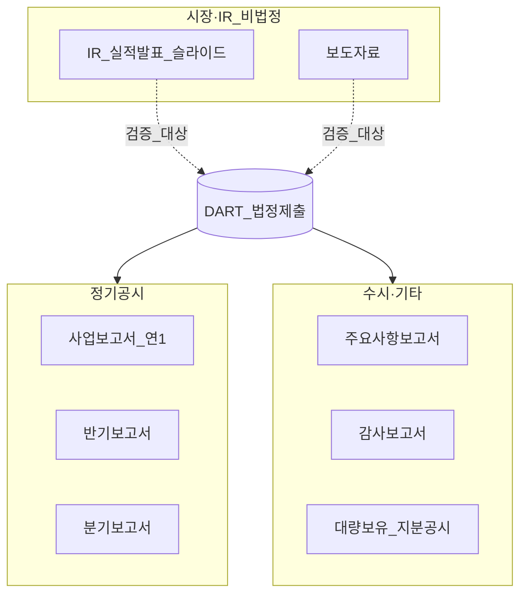

# 사업보고서·DART 읽기 — 공시·주석·MD&A·IR 실무

> **면책**: 본 문서는 교육 목적이며, 특정 종목·기업에 대한 매수·매도·투자·세무·법률 자문이 아닙니다. 공시·회계 기준·공시규정은 개정될 수 있으므로 실행 전 [금융감독원 전자공시시스템(DART)](https://dart.fss.or.kr) 및 [references/sources.md](../references/sources.md)의 공식 출처를 확인하세요.

## 메타

| 항목 | 내용 |
|------|------|
| 최종 검증일 | 2026-05-24 |
| 정책·법령 기준일 | 2025-12-31 확정 (자본시장법·공시규정·K-IFRS), 2026 개편 별도 표기 |
| 난이도 | L4 (Graduate) |
| 예상 읽기 시간 | 150~180분 |
| 관련 bucket | Phase 1 — **Bucket 4 위성**·섹터 ETF 심화 전 **필수**; Bucket 3는 Top 10 종목 공시 **간접** 검증 |

## TL;DR

1. **DART**는 한국 상장사 **법정 전자공시** 창구 — IR 슬라이드·언론보도보다 **감사·규정**에 묶인 본문이 우선이다.
2. **사업보고서**는 연 1회 “종합 패키지”이나, **분기·반기·주요사항보고서**가 더 최신 — [financial-statements-intro](financial-statements-intro.md) 3표를 **주석과 함께** 읽는다.
3. **재무제표 주석**이 숫자의 **정의·일회성·우발·특수관계·세그먼트**를 설명한다 — 표만 보면 **반복 이익**을 과대평가하기 쉽다.
4. **MD&A(경영진 논의·분석)** 는 한국 공시에서 **사업의 내용·재무·위험** 등 서술 블록 — **낙관 서술**과 **감사 CF**를 **대조**한다.
5. **IR 자료**는 **비GAAP·가이던스·전망** — 투자 판단의 **시작점**이 될 수 있으나, **공시 본문·주석**으로 **검증**하지 않으면 [fomo-and-trading-hours](../05-behavioral/fomo-and-trading-hours.md) 리스크가 커진다.

---

## 1. 한 줄 정의 + 왜 중요한가

**정의**: **한국 기업 공시 읽기**는 [DART](https://dart.fss.or.kr)에 제출된 **법정 보고서**(사업·분기·반기·감사·주요사항 등)와 그 안의 **K-IFRS 재무제표·주석**, **사업·경영·리스크 서술(MD&A에 해당하는 부분)**, 그리고 **IR(Investor Relations) 자료**를 **역할에 맞게 분리·교차 검증**하는 기술이다.

**왜 중요한가 (장기 자산 형성·bucket 연결)**:

| 목적 | bucket·포트폴리오 연결 |
|------|------------------------|
| **위성 종목 검증** | Bucket 4 개별주·테마주는 “스토리”가 아니라 **공시 숫자·주석**으로 리스크 예산을 맞춘다 — [core-satellite-framework](../04-portfolio/core-satellite-framework.md) |
| **섹터 ETF 간접** | [semiconductor](../03-markets/sectors/semiconductor.md)·[battery-lfp-ncm-ess](../03-markets/sectors/battery-lfp-ncm-ess.md) ETF는 **구성 종목 DART**가 섹터 내러티브를 움직인다 |
| **거시·정책 대조** | [macroeconomics-basics](../02-economics/macroeconomics-basics.md)·[macro-01-gdp-accounts-growth](../02-economics/macro-01-gdp-accounts-growth.md)의 “경기 둔화”와 **가이던스 하향**이 같은 방향인지 확인 |
| **세후·계좌 설계** | 배당·환차익·금융소득은 [domestic-stocks-tax](../06-korea-policy/tax/domestic-stocks-tax.md)·[investment-tax-overview](../06-korea-policy/tax/investment-tax-overview.md)와 별개 — **공시 이익 ≠ 세후 현금** |
| **행동 방어** | 실적 발표 당일 헤드라인만 보고 매수하는 패턴을 **공시 체크리스트**로 대체 — [passive-vs-active](../04-portfolio/passive-vs-active.md) |

[financial-statements-intro](financial-statements-intro.md)가 **3대 재무제표 문법**이라면, 본 문서는 **어디서·어떤 순서로·무엇을 의심하며** 읽는지 **운영 매뉴얼**이다. [CURRICULUM-MAP](../00-roadmap/CURRICULUM-MAP.md)의 **F1-4**에 해당한다.

---

## 2. 선수 지식 / 이후 읽을 것

**선수** (반드시 선행 권장):
- [financial-statements-intro.md](financial-statements-intro.md) — IS·BS·CF·ROE·PER
- [cash-flow-basics.md](cash-flow-basics.md) — 영업CF·운전자본 직관
- [debt-and-interest.md](debt-and-interest.md) — 부채·이자보상
- [compound-interest-and-time-value.md](compound-interest-and-time-value.md) — 성장·할인 직관
- [stocks-equities-intro.md](../03-markets/stocks-equities-intro.md) — KRX·소유권·비과세 범위

**이후** (공시 읽기 후 확장):
- [sector-investing-framework.md](../03-markets/sectors/sector-investing-framework.md) — 섹터 KPI·5단계
- [semiconductor.md](../03-markets/sectors/semiconductor.md), [ai-infrastructure.md](../03-markets/sectors/ai-infrastructure.md) — 산업별 주석 항목
- [kosdaq-tier-system.md](../03-markets/kosdaq-tier-system.md) — 유동성·상장유지 vs 재무
- [micro-05-sector-applications.md](../02-economics/micro-05-sector-applications.md) — IR·공시 질문 은행
- [capm-and-risk-return.md](../08-advanced/capm-and-risk-return.md) — 베타·리스크 프리미엄 (L4 심화)
- [factor-investing-primer.md](../08-advanced/factor-investing-primer.md) — 퀄리티·이익 지속성

**로드맵**: [STUDY-START](../00-roadmap/STUDY-START.md) — “공시 읽기” 시간은 본문 학습 **별도**로 잡는다.

---

## 3. 직관·비유

**DART = 법원 기록실, IR = 회사 홍보 브로슈어**: 법원 기록은 **형식·감사·지연 규칙**이 있다. 브로슈어는 **읽기 쉽고 전망이 밝다** — 둘 다 보되, **분쟁 시 기록실**이 기준이다.

**사업보고서 = 연간 백과사전**: 200~400페이지도 흔하다. 처음부터 끝까지 읽지 않는다. **목차·재무제표·주석·위험요인·감사의견**만 **정해진 루트**로 훑는다.

**주석 = 계약서 각주**: 본문 표의 “매출 1조”가 **어떤 인식 기준**으로 잡혔는지, **관계회사 매출**이 섞였는지, **소송**으로 얼마가 나갈 수 있는지는 **각주(주석)** 에 있다. [debt-and-interest](debt-and-interest.md)에서 카드 약관을 읽듯, **주석 2·3·5·28·30번**을 습관화한다(번호는 기업마다 다름 — **항목명**으로 찾기).

**MD&A = CEO의 “왜 그랬는지” 에세이**: 숫자 **원인·전략·리스크** 서술. 에세이는 **선택적 강조**가 가능하다 — “AI 수요 호조” 문단 옆에 **영업CF 감소**가 없는지 [cash-flow-basics](cash-flow-basics.md)로 대조.

**공시 타임라인 = 뉴스와의 경주**: 시장은 **분기 실적 발표 전** 이미 [macro-06-asset-prices-macro](../02-economics/macro-06-asset-prices-macro.md) 식으로 **기대**를 조정한다. **사업보고서(연간)** 는 **3~4개월 지연**될 수 있어, “작년 연간”만 보고 **오늘** 매수·매도하면 **시차 함정**에 빠진다.

**가계 대응**: [cash-flow-basics](cash-flow-basics.md)의 월 현금흐름표 ↔ 기업 **CF표**; 연말정산 서류 ↔ **법인세·이연법인세 주석**; 가족 간 돈 거래 ↔ **특수관계자 거래 주석**.

---

## 4. 정식 개념·용어

| 용어 | English | 정의 |
|------|---------|------|
| DART | Data Analysis, Retrieval and Transfer | 금융감독원 **전자공시** 시스템 |
| 사업보고서 | Annual business report | 사업연도 종료 후 **연간** 종합 공시(대형) |
| 분기·반기보고서 | Quarterly / Semi-annual report | **더 잦은** 재무·주요 사항 |
| 주요사항보고서 | Material event report | 합병·유상증자·CB·소송 등 **수시** |
| 재무제표 주석 | Notes to FS | 회계정책·세부 금액·우발·세그먼트 |
| MD&A | Management Discussion & Analysis | 경영진의 **재무·영업·위험** 논의·분석 |
| 사업의 내용 | Business description | 한국 사업보고서 내 **사업·시장·전략** (MD&A 성격) |
| 연결·개별 | Consolidated / Separate | 그룹 vs 모회사 단독 |
| 감사의견 | Audit opinion | 적정·한정·부적정·의견거절 |
| 계속기업 가정 | Going concern | 12개월 내 **지속 가능** 가정 |
| 비GAAP | Non-GAAP | 조정 EBITDA·조정 EPS 등 **공시 외** 지표 |
| 가이던스 | Guidance | 향후 매출·마진 **전망**(구속력 없음) |
| XBRL·전자공시 | Tagged disclosure | 표 **단위·태그** — 복사 시 오류 주의 |
| 특수관계자 | Related party | 계열·임원·지배주주 등 |
| 우발부채·약정 | Contingencies | 소송·보증·**미래** 지출 가능성 |
| 영업부문 | Operating segment | 사업부문별 매출·이익 |
| 공시 규정 | Disclosure regulation | 제출 기한·항목 — 자본시장법 시행령·규정 |

---

## 5. 메커니즘

### 5.1 한국 공시 계층 (DART 중심)



**핵심**: **투자 결정의 앵커**는 `DART → 정기·수시 → 재무제표·주석` 순이다. IR은 **속도·맥락**을 주고, DART는 **책임·감사**를 준다.

### 5.2 첫 방문 ~ 심화 읽기 워크플로

```mermaid
flowchart LR
  S1[회사코드_검색] --> S2[최신_분기보고서]
  S2 --> S3[감사의견_요약]
  S3 --> S4[연결_IS_BS_CF]
  S4 --> S5[주석_정책_특관_우발]
  S5 --> S6[사업의내용_MDA]
  S6 --> S7[IR_비GAAP_대조]
  S7 --> S8[섹터문서_KPI](../03-markets/sectors/sector-investing-framework.md)
  S8 --> S9[코어위성_한도](../04-portfolio/core-satellite-framework.md)
```

**시간 배분 (교육용, L4 1회 90분)**:
- 15분: 최신 **분기** IS·CF + YoY 표 작성
- 25분: **주석** (회계정책 변경·특수관계·우발·세그먼트·금융부채)
- 20분: **사업의 내용**·위험요인 (MD&A)
- 15분: **IR** 슬라이드 vs 공시 차이 메모
- 15분: [semiconductor](../03-markets/sectors/semiconductor.md) 등 **섹터 KPI** 3개 대조

### 5.3 IR ↔ DART 검증 루프

```mermaid
flowchart TD
  IRclaim[IR_조정_OP_마진] --> Q1{감사_CF_일치?}
  Q1 -->|예| Q2{주석_일회성_분리?}
  Q1 -->|아니오| Flag1[CF_괴리_조사]
  Q2 -->|예| Q3{가이던스_방향}
  Q2 -->|아니오| Flag2[조정과다_의심]
  Q3 --> Macro[거시_시나리오](../02-economics/macroeconomics-basics.md)
  Macro --> Decision[위성비중_유지_축소]
```

**원칙**: IR에서 **강조한 한 줄**마다 DART에 **대응 줄**을 찾는다. 없으면 **“홍보 전용”** 으로 분류한다.

### 5.4 공시 시차와 시장 선행 (개념)

| 이벤트 | 대략적 시차 (교육용) | 투자자 함정 |
|--------|---------------------|-------------|
| 사업연도 종료 | 12월 | “작년” 인식 고정 |
| **분기** 실적 공시 | 종료 후 **약 45일** 내 (규모·시장별 상이) | 분기가 **최신** 앵커 |
| **사업보고서** | 연간 종료 후 **수 개월** | 연간은 **종합**이나 **늦음** |
| IR 컨퍼런스 콜 | 실적 직후 **수일** | **전망**·Q&A — 규제·감사 약함 |
| **주요사항** | 사건 발생 **수일** 내 | M&A·유증 **즉시** 가격 반영 |

시차를 무시하면 “사업보고서에 아직 좋은데 주가는 빠진다” → **이미 분기·가이던스에 반영**되었을 수 있다 — [stocks-equities-intro](../03-markets/stocks-equities-intro.md).

### 5.5 사업보고서 목차 맵 (읽을 챕터만)

| 섹션 (일반적 명칭) | 역할 | MD&A? |
|-------------------|------|-------|
| **I. 회사의 개요** | 지배구조·종업원 | 부분 |
| **II. 사업의 내용** | 시장·경쟁·전략·R&D | **핵심 MD&A** |
| **III. 재무에 관한 사항** | 요약 재무·배당 | **재무 MD&A** |
| **IV. 이사의 경영진단** | 이사회·내부통제 | 거버넌스 |
| **V. 회계감사인의 감사의견** | 감사 | **필수 1페이지** |
| **VI. 이사회 등의 의견** | 배당·사채 등 | |
| **첨부: 연결 재무제표·주석** | **숫자 본체** | 수치 MD&A |

**분기보고서**는 II·III가 **축약**되나 **연결 재무제표·주석**은 핵심이다.

### 5.6 주석에서 우선 탐색할 항목 (체크리스트)

| 주석 주제 | 찾는 것 | 연결 문서 |
|-----------|---------|-----------|
| **회계정책·추정** | 수익 인식 시점·내용연수 변경 | [financial-statements-intro](financial-statements-intro.md) |
| **금융부채·차입** | 만기 구조·금리·covenant | [debt-and-interest](debt-and-interest.md) |
| **특수관계자** | 내부 거래·대여·담보 | 거버넌스 리스크 |
| **우발·약정** | 소송·보증·환율 | [micro-04-welfare-externalities](../02-economics/micro-04-welfare-externalities.md) |
| **영업부문** | 메모리 vs HBM 등 | [semiconductor](../03-markets/sectors/semiconductor.md) |
| **재고·매출채권** | 운전자본·채권 충당 | [cash-flow-basics](cash-flow-basics.md) |
| **종속·관계기업** | 연결 범위 | M&A 스토리 검증 |
| **주당이익·희석** | CB·BW·스톡옵션 | PER·지분 희석 |
| **법인세·이연** | 실효세율·NOL | [investment-tax-overview](../06-korea-policy/tax/investment-tax-overview.md) |
| **계속기업** | 적자·유동성 위기 문구 | [kosdaq-tier-system](../03-markets/kosdaq-tier-system.md) |

---

## 6. 수식·모델

본 문서는 **공시 표·주석에서 재계산**하는 비율·시차 모델에 초점을 둔다. 이론적 NPV·IRR·DCF는 [compound-interest-and-time-value](compound-interest-and-time-value.md) → [time-value-npv-irr](time-value-npv-irr.md) → [cash-flow-statement-fcf](cash-flow-statement-fcf.md) 순으로 연계한다.

### 6.1 재무상태표 등식 (복습)

\[
\text{자산} = \text{부채} + \text{자본}
\]

### 6.2 이익의 질: 영업CF 대 순이익

\[
\text{CF 품질 비율} = \frac{\text{영업활동현금흐름 (OCF)}}{\text{당기순이익}}
\]

- **지속적으로** \( \text{OCF} / \text{NI} < 1 \) 이면 이익이 **외상·재고·비현금**에 묶였을 가능성 — [cash-flow-basics](cash-flow-basics.md).
- **일회성** 순이익이 크면 분모만 부풀려 비율이 **왜곡** → 주석에서 **중단영업·처분이익** 제거 후 재계산.

### 6.3 부채·이자 (주석·BS)

\[
\text{부채비율} = \frac{\text{부채}}{\text{자본}} \times 100\%
\]

\[
\text{이자보상배율} = \frac{\text{영업이익 (또는 EBITDA)}}{\text{이자비용}}
\]

금리 \(\Delta r\) 상승 시 이자비용 근사 (교육용, 고정금리 비중 무시):

\[
\Delta \text{이자} \approx r_{\text{변동}} \times \Delta r \times \text{변동금리부채}
\]

\[
\frac{\Delta \text{순이익}}{\text{순이익}} \approx -\frac{\Delta \text{이자}}{\text{순이익}}
\]

— [debt-and-interest](debt-and-interest.md), [macro-02-money-inflation](../02-economics/macro-02-money-inflation.md).

### 6.4 운전자본: 매출채권·재고 (주석 수치)

**매출채권 회전 (근사)**:

\[
\text{DSO (일)} = \frac{\text{매출채권}}{\text{매출}} \times 365
\]

**재고 회전**:

\[
\text{재고회전율} = \frac{\text{매출원가 (또는 매출)}}{\text{평균재고}}
\]

DSO·재고일수 **급증** + 매출 성장 = **수익 인식·채널 stuffing** 의심 — [financial-statements-intro](financial-statements-intro.md) 예제 1과 동형.

### 6.5 ROE·Dupont (주석·IS·BS 연동)

\[
ROE = \frac{\text{순이익}}{\text{자본}} = \underbrace{\frac{\text{순이익}}{\text{매출}}}_{\text{순이익률}} \times \underbrace{\frac{\text{매출}}{\text{자산}}}_{\text{자산회전}} \times \underbrace{\frac{\text{자산}}{\text{자본}}}_{\text{레버리지}}
\]

**MD&A**에서 “ROE 개선”을 말할 때 **어느 항**이 움직였는지 분해하지 않으면 **레버리지 부채**만 올린 개선과 구분 못 한다.

### 6.6 조정 PER·EPS (IR vs 공시)

\[
PER = \frac{P}{\text{EPS}}, \quad \text{EPS}_{\text{조정}} = \frac{\text{순이익} - \text{일회성} + \text{IR조정항}}{\text{가중평균주식수}}
\]

\[
PER_{\text{조정}} = \frac{P}{\text{EPS}_{\text{조정}}}
\]

IR의 “조정 EPS”가 **주석에 없는 항목**을 빼면 \( PER_{\text{조정}} \ll PER_{\text{공시}} \) 착시 — [financial-statements-intro](financial-statements-intro.md) 예제 4.

### 6.7 공시 지연과 정보 가치 (교육용)

정보가 시장에 반영되는 시점 \( t_0 \), 공시 제출 \( t_1 \), 투자자 읽기 \( t_2 \):

\[
\Delta t_{\text{lag}} = t_1 - t_0, \quad \text{잔여 알파 기대} \propto e^{-\lambda (t_2 - t_0)}
\]

\(\lambda\) 는 유동성·애널리스트 커버리지에 따라 다름 — **코스닥 저유동**은 [kosdaq-tier-system](../03-markets/kosdaq-tier-system.md)에서 **잔여 반영**이 길 수 있으나, **유동성 리스크**도 커진다.

### 6.8 세그먼트 마진 (주석 영업부문)

부문 \( i \) 의 영업이익률:

\[
m_i = \frac{OP_i}{Rev_i}
\]

그룹 OP 성장이 **저마진 부문 비중 확대**면 \( m_{\text{group}} \) 하락 — MD&A “전사 마진 개선” 문구와 **모순** 검사.

---

## 7. 한국 적용

### 7.1 2025년 기준 (확정)

| 항목 | 내용 |
|------|------|
| **공시 창구** | [DART](https://dart.fss.or.kr) — 검색: 회사명·종목코드·공시유형 |
| **회계** | 상장사 **K-IFRS** — [financial-statements-intro](financial-statements-intro.md) |
| **연결 우선** | 투자 판단은 보통 **연결** 재무제표 — 개별은 모회사만 |
| **감사** | 외부감사법·공시규정 — **감사의견**·**강조사항**·**핵심감사사항(KAM)** |
| **국문** | 사업보고서 **한글** 본문 + XBRL 재무 — 영문 IR과 **용어** 대조 |
| **코스피·코스닥** | 공시 **품질·기한**은 규모·시장별 — [kosdaq-tier-system](../03-markets/kosdaq-tier-system.md) |
| **배당·주총** | 사업보고서·주요사항 — 세후는 [domestic-stocks-tax](../06-korea-policy/tax/domestic-stocks-tax.md) |
| **ETF 보유자** | [etf-index-funds](../03-markets/etf-index-funds.md) Top 10 → DART **분기** 습관 |

### 7.2 2026년 개편·시행 예정 (해당 시)

| 항목 | 2025 | 2026 (공식 확인 전 본문은 “확인 필요”) |
|------|------|----------------------------------------|
| K-IFRS 개정 | 시행 중 | **수익·금융상품·리스** 주석 문구 변경 가능 |
| 공시 속기성 | 분기·반기 기한 규정 | **디지털 공시**·태그 확대 — 표 복사 **단위** 재확인 |
| ESG·지속가능 | 선택·규제 강화 추세 | **사업보고서 ESG 섹션** — [micro-04](../02-economics/micro-04-welfare-externalities.md) Scope 연계 |
| **세제** | 2025 확정 | [account-product-tax-map](../06-korea-policy/tax/account-product-tax-map.md) — 공시 **이익**과 **세후** 분리 |

**법·정책 근거 (교육용 인용)**: 자본시장법, 자본시장법 시행령·**공시규정**, 주식회사 등의 외부감사에 관한 법률, 한국채택국제회계기준 — 상세 URL은 [references/sources.md](../references/sources.md).

### 7.3 DART 실무: 검색·다운로드·단위

1. **공시검색** → 회사 선택 → **공시유형** 필터: `사업보고서`, `분기보고서`, `주요사항보고서`
2. **최신 분기** PDF 또는 HTML — **연결 재무제표** 탭
3. 표 하단 **단위**: `천원`, `백만원`, `원` — [financial-statements-intro](financial-statements-intro.md) 함정 10배·1000배 오류
4. **주석**은 PDF 북마크 또는 목차 “주석” 점프
5. **엑셀**: DART 재무정보 다운로드(기능은 시점별 상이) — **직접 공시 PDF**와 **교차 검증**

### 7.4 MD&A를 한국 사업보고서에서 찾는 법

국제 보고서의 단일 **“MD&A”** 챕터와 달리, 한국 **사업보고서**는 다음에 **분산**된다.

| 블록 | MD&A 성격 질문 |
|------|----------------|
| **사업의 개요·개요** | 무엇을 파는가·TAM |
| **시장·경쟁** | 점유·가격·규제 — [micro-03-market-structures-io](../02-economics/micro-03-market-structures-io.md) |
| **원재료·생산·R&D** | CAPEX·기술 로드맵 — [semiconductor](../03-markets/sectors/semiconductor.md) |
| **재무에 관한 사항** | 마진·유동성·배당 정책 |
| **위험요인** | 거시·환율·소송·공급망 |
| **이사의 경영진단·감사의견** | 내부통제·KAM |

**IR 실적발표** 슬라이드의 “CEO 메시지”는 위 블록의 **요약본** — 숫자는 **첨부 재무제표**로 되돌린다.

### 7.5 IR 자료 유형과 신뢰도 계층

| 자료 | 제공 주체 | 강점 | 약점 |
|------|-----------|------|------|
| DART 정기·수시 | 법정 제출 | 감사·제재 가능 | **지연·형식** |
| IR deck·웹캐스트 | 회사 IR | **가이던스·Q&A** | 비GAAP·선택 지표 |
| 애널리스트 리포트 | 증권사 | **동종 비교** | 이해상충·낙관 |
| 언론 | 미디어 | 속도 | **헤드라인** 왜곡 — [fomo-and-trading-hours](../05-behavioral/fomo-and-trading-hours.md) |

**Bucket 4** 위성 비중을 올리기 전: IR 한 장 → DART **3표+주석 5개** → [sector-investing-framework](../03-markets/sectors/sector-investing-framework.md) **5단계** 통과.

### 7.6 섹터별 DART·MD&A 추가 질문

| 섹터 | 주석·MD&A 추가 | 문서 |
|------|----------------|------|
| 반도체 | HBM·DRAM 부문, CAPEX, 재고 | [semiconductor](../03-markets/sectors/semiconductor.md) |
| 2차전지 | 원가·장기공급계약 | [battery-lfp-ncm-ess](../03-markets/sectors/battery-lfp-ncm-ess.md) |
| AI 인프라 | DC·GPU 수요 연결 | [ai-infrastructure](../03-markets/sectors/ai-infrastructure.md) |
| 전력·그리드 | 수주·규제 | [power-grid-electrification](../03-markets/sectors/power-grid-electrification.md) |
| 해외 매출 | 환율·지역 | [macro-05-open-economy-fx](../02-economics/macro-05-open-economy-fx.md) |

### 7.7 코스닥·적자·계속기업

- **감사의견** “계속기업 가정에 중요한 불확실성” 문구 = [kosdaq-tier-system](../03-markets/kosdaq-tier-system.md) **상장유지** 리스크와 **별도** 검토
- **유상증자·CB** → 주요사항보고서 + **희석** 주석
- PER 무의미 구간 → **현금잔고·분기 매출 성장** — [financial-statements-intro](financial-statements-intro.md) §7.5

### 7.8 해외 상장·ADR (교차)

한국 투자자가 **미국 ADR** 을 보면 **10-K/20-F** — DART와 **동시** 비교 시 **연결 범위·환산** 차이. 코어는 [overseas-equities-intro](../03-markets/overseas-equities-intro.md), 세금은 [overseas-stocks-tax-part1-cgt](../06-korea-policy/tax/overseas-stocks-tax-part1-cgt.md).

### 7.9 포트폴리오·계좌와 공시 읽기

| 계좌·상품 | 공시 읽기 필요도 |
|-----------|------------------|
| Bucket 3 코어 ETF | Top 10 **분기** 요약 |
| ISA·IRP | [isa](../06-korea-policy/isa.md)·[isa-irp-pension-tax](../06-korea-policy/tax/isa-irp-pension-tax.md) — 종목 선정은 동일 |
| 청년도약 | [youth-leap-account](../06-korea-policy/youth-leap-account.md) — 개별주 비중 낮추는 설계와 궁합 |
| 레버리지 ETF | [leveraged-etf-qqq-qld](../04-portfolio/leveraged-etf-qqq-qld.md) — 기초지수 **구성 종목** 공시 |

---

## 8. 숫자 예제 (가상)

> 모든 회사·인물·금액은 가상입니다. 단위: 억 원(가상).

### 예제 1: 가상 “한빛전자” — 분기보고서 30분 루트

**상황**: Bucket 4 위성 후보. DART에서 **2025년 3분기 분기보고서**(가상)만 연다.

| 단계 | 행동 | 발견 (가상) |
|------|------|-------------|
| 1 | 감사의견 | **적정** |
| 2 | 연결 IS YoY | 매출 +22%, OP +5% |
| 3 | CF | OCF +8, NI +12 → **OCF/NI ≈ 0.67** |
| 4 | 주석 매출채권 | DSO 전년 62일 → **78일** |
| 5 | MD&A | “수요 강세” | 

**결론**: 헤드라인 “매출 20%↑”만으로 매수 보류 — **채권·CF 품질** 추가 확인. [cash-flow-basics](cash-flow-basics.md), [core-satellite-framework](../04-portfolio/core-satellite-framework.md).

### 예제 2: 가상 “네오바이오” — 주석이 스토리를 깨는 경우

| 항목 | IR 슬라이드 | DART 주석 |
|------|-------------|-----------|
| 조정 OP | +30억 (가상) | 일회성 **기술료 수익** +25억 |
| 반복 OP | “본업 흑자 전환” | **R&D 비용** +40억, 영업적자 지속 |
| 특수관계 | (언급 없음) | **대주주**에게 **담보** 제공 |

**교훈**: IR **조정 지표**는 [financial-statements-intro](financial-statements-intro.md) **비GAAP** 경고와 동일. 주석 **특수관계·우발** 없이 “거버넌스 OK” 판단 금지.

### 예제 3: 가상 “그린에너지” — 사업보고서 MD&A vs CF

**사업보고서(연간, 가상) “재무에 관한 사항”**:
- “영업이익률 **개선** 지속”
- “친환경 **수주** 파이프라인 확대”

**연결 CF (동일 연도)**:

| 구분 | 금액(억) |
|------|----------|
| OP | +50 |
| OCF | +12 |
| CAPEX | −80 |
| 차입 증가(재무CF) | +45 |

\[
\frac{OCF}{OP} = \frac{12}{50} = 0.24
\]

**해석**: 마진 문장은 **IS** 에서 맞을 수 있으나, **운전자본·CAPEX**가 현금을 잡아먹음 — [battery-lfp-ncm-ess](../03-markets/sectors/battery-lfp-ncm-ess.md) 식 **투자 국면** vs **현금 소진** 구분. 차입이 CAPEX를 **대신** 했는지 **운전자본** 인지 **주석 금융부채** 확인 — [debt-and-interest](debt-and-interest.md).

### 예제 4: 가상 “코스닥 장비주 Z” — 공시 시차·PER 함정

| 시점 | 이벤트 | 주가 반응 (가상) |
|------|--------|------------------|
| t0 | IR: “올해 매출 **30%** 가이던스” | +15% |
| t1 | **분기** 실적: 매출 +8% YoY | −10% (“가이던스 실망”) |
| t2 | **사업보고서** (전년): 매출 +25% | 무반응 (이미 t1 반영) |
| t3 | **유상증자** 주요사항 | −20% |

| | 공시 EPS | IR 조정 EPS |
|--|----------|-------------|
| 값 | 400원 | 900원 (일회성 제외 주장) |
| PER (주가 18,000원) | 45배 | 20배 |

**교훈**: (1) **최신은 분기·주요사항** (2) PER은 **주석 희석·일회성** 후 재계산 (3) [kosdaq-tier-system](../03-markets/kosdaq-tier-system.md) **유동성** — [korea-ats-nextrade](../03-markets/korea-ats-nextrade.md) 장후 매매와 병행 시 슬리피지.

---

## 9. FAQ

**Q1. 사업보고서만 읽으면 최신 정보인가요?**  
**A1.** **아닙니다.** 사업연도 종료 후 **수 개월** 지연될 수 있어, **분기·반기보고서**와 **주요사항보고서**가 더 최신이다. 연간은 **종합·주석 전체** 읽기에 유리하다.

**Q2. DART와 회사 IR 홈페이지 중 어디가 맞나요?**  
**A2.** **법적·감사 기준**은 DART. IR은 **속도·전망·Q&A**. 충돌 시 **DART·주석** 우선 — 본 문서 §5.3.

**Q3. 주석이 너무 많은데 어디부터 보나요?**  
**A3.** **회계정책 변경 → 특수관계 → 우발·약정 → 영업부문 → 금융부채 → 재고·매출채권** 순(§5.6). 섹터 문서의 **IR 질문 리스트**와 병행 — [micro-05-sector-applications](../02-economics/micro-05-sector-applications.md).

**Q4. MD&A만 읽고 숫자는 안 봐도 되나요?**  
**A4.** **안 됩니다.** MD&A는 **서술·선택**이고, **검증 가능한 숫자**는 재무제표·주석·CF에 있다. [financial-statements-intro](financial-statements-intro.md) 선수 필수.

**Q5. ETF만 보유하면 DART를 안 봐도 되나요?**  
**A5.** Bucket 3 **코어만**이면 **필수는 아님**. 다만 [etf-index-funds](../03-markets/etf-index-funds.md) **Top 10** 분기 요약은 **섹터 리스크** 이해에 도움. Bucket 4·섹터 위성은 **개별 DART** 필수 — [passive-vs-active](../04-portfolio/passive-vs-active.md).

**Q6. 영업이익과 IR의 “조정 EBITDA”가 다릅니다.**  
**A6.** **정상**이다. 조정 항목이 **주석·감사 CF**와 맞는지 **항목별** 대조. 맞지 않으면 **조정 과다**로 분류.

**Q7. 감사의견 ‘적정’이면 안전한가요?**  
**A7.** **아닙니다.** 적정은 **K-IFRS 준수** 수준의견이며, **주가·사업 리스크**를 보장하지 않는다. **한정·강조·계속기업** 문구가 더 중요할 수 있다.

**Q8. 공시를 읽었는데도 주가가 이해가 안 됩니다.**  
**A8.** (1) **이미 반영** (2) **거시·금리·밸류에이션** — [macroeconomics-basics](../02-economics/macroeconomics-basics.md) (3) **유동성·지수** 편입 (4) **가이던스**가 실적보다 중요한 시즌. 공시는 **과거·검증**, 주가는 **기대** — [macro-06-asset-prices-macro](../02-economics/macro-06-asset-prices-macro.md).

---

## 10. 함정·리스크·한계

- **IR·언론만** 보고 **DART 미확인** — [fomo-and-trading-hours](../05-behavioral/fomo-and-trading-hours.md)
- **사업보고서 연간**만 보고 **분기·수시** 무시 — **시차 함정** (§5.4, 예제 4)
- **연결/개별**·**단위(천 원/백만 원)** 혼동
- **매출·조정 EPS**만 보고 **OCF·DSO·재고** 무시
- **MD&A “성장”** 문구와 **CAPEX·차입** 불일치 무시
- **특수관계·우발** 주석 생략 → 거버넌스 리스크 과소평가
- **사이클 정점** 실적에 **런레이트** — [semiconductor](../03-markets/sectors/semiconductor.md)
- **비전공자 90분**에 모든 주석 완독 **비현실** — **체크리스트**로 반복
- 본 문서는 **교육** — 법률·회계 자문 아님; **내부자 정보**·미공개 정보 이용 금지
- **영문 IR**과 **한글 공시** 용어 불일치 — 같은 **계정과목** 코드로 매칭
- DART **기술 장애·지연** 시 **거래소 공시** 보조 — [references/sources.md](../references/sources.md)

---

## 11. 심화 읽기

**공식·출처**:
- [references/sources.md](../references/sources.md) — DART, 금감원, 법제처
- [금융감독원 DART](https://dart.fss.or.kr)
- [한국거래소 정보데이터시스템](http://data.krx.co.kr) — 시세·공시 링크

**저장소 문서 (경로)**:
- 입문: [financial-statements-intro](financial-statements-intro.md) → **본 문서** → [stocks-equities-intro](../03-markets/stocks-equities-intro.md)
- 섹터: [sector-investing-framework](../03-markets/sectors/sector-investing-framework.md), [recommended-deep-study-roadmap](../03-markets/sectors/recommended-deep-study-roadmap.md)
- 거시·IO: [macro-01](../02-economics/macro-01-gdp-accounts-growth.md), [micro-03](../02-economics/micro-03-market-structures-io.md), [micro-05](../02-economics/micro-05-sector-applications.md)
- 포트폴리오: [core-satellite-framework](../04-portfolio/core-satellite-framework.md), [rebalancing-and-dca](../04-portfolio/rebalancing-and-dca.md), [geographic-diversification](../04-portfolio/geographic-diversification.md)
- 정책: [06-korea-policy/README](../06-korea-policy/README.md), [tax/README](../06-korea-policy/tax/README.md)
- 로드맵: [CURRICULUM-MAP](../00-roadmap/CURRICULUM-MAP.md) F1-4, [master-roadmap](../00-roadmap/master-roadmap.md), [glossary](../00-roadmap/glossary.md)

**교재·자료 (일반)**:
- 『재무제표 모르면 주식투자 절대로 하지마라』 — 주석 사례
- 『회계의 이해』 — K-IFRS 입문
- 『기업분석의 정석』 — MD&A·현금흐름
- CFA Level I **Financial Reporting** — 국제 비교

### 실무 워크북: 위성 1종목 4주 (교육용)

| 주차 | 과제 | 산출물 |
|------|------|--------|
| 1 | DART **최근 분기** IS·CF YoY 표 | 1페이지 스프레드시트 |
| 2 | 주석 **5항목** 메모 (§5.6) | 리스크 bullet 5개 |
| 3 | **사업의 내용**·위험요인 vs 숫자 | 모순 1개 이상 찾기 |
| 4 | IR vs DART **조정 EPS** 대조 | [sector-investing-framework](../03-markets/sectors/sector-investing-framework.md) 5단계 통과 여부 |

### DART 10분·60분·반나절 버전

| 버전 | 범위 |
|------|------|
| **10분** | 감사의견 + IS 3줄 + OCF vs NI + 주요사항 유무 |
| **60분** | 분기 3표 + 주석 5항 + IR 가이던스 1줄 대조 |
| **반나절** | 사업보고서 **사업의 내용** + 연간 주석 + 섹터 KPI — [semiconductor](../03-markets/sectors/semiconductor.md) 등 |

### IR 컨퍼런스 콜 메모 템플릿 (5줄)

1. **가이던스** 변경 방향 (매출·OP margin)  
2. **일회성** 언급 항목 → DART 주석 번호  
3. **CAPEX·R&D** 전망  
4. **Q&A** 에서 회피한 질문  
5. [macroeconomics-basics](../02-economics/macroeconomics-basics.md) **한 줄** 연결 (금리·환율·수출)

---

## 12. 스스로 점검 퀴즈

1. DART에서 **가장 최신** 재무 숫자를 담은 정기 공시는 보통 무엇인가? (사업보고서만이 아닌 이유 포함)
2. **OCF/NI < 1** 이 지속될 때 의심할 **운전자본** 항목 두 가지는?
3. 한국 **사업보고서**에서 국제 MD&A에 해당하는 **대표 섹션** 두 곳은?
4. IR **조정 EPS**를 공시 EPS와 대조할 때 **주석**에서 확인할 항목 세 가지는?
5. **주요사항보고서**가 분기보고서보다 **먼저** 봐야 하는 상황 예 두 가지는?
6. [core-satellite-framework](../04-portfolio/core-satellite-framework.md)에서 Bucket 3 vs Bucket 4의 **DART 숙련도** 차이를 한 문장으로?
7. DSO가 **급증**했을 때 MD&A의 어떤 문장과 **모순**을 찾아야 하는가?
8. **감사의견 적정**인데 **계속기업 불확실성** 문단이 있으면 투자자가 해야 할 일은?

<details>
<summary>정답 힌트</summary>

1. **분기(·반기)보고서** — 사업보고서는 연간·지연 · 2. **매출채권·재고** (선급금 등) · 3. **사업의 내용**, **재무에 관한 사항**·위험요인 · 4. **일회성**, **중단영업**, **주당이익·희석** · 5. **유상증자·CB·합병·소송** 등 · 6. 코어는 Top10 요약 선택, 위성은 분기+주석 필수 · 7. “수금 개선·현금창출 강화” 등 · 8. **유동성·차입만기·자금조달** 주석 심독, 비중 축소 검토

</details>
