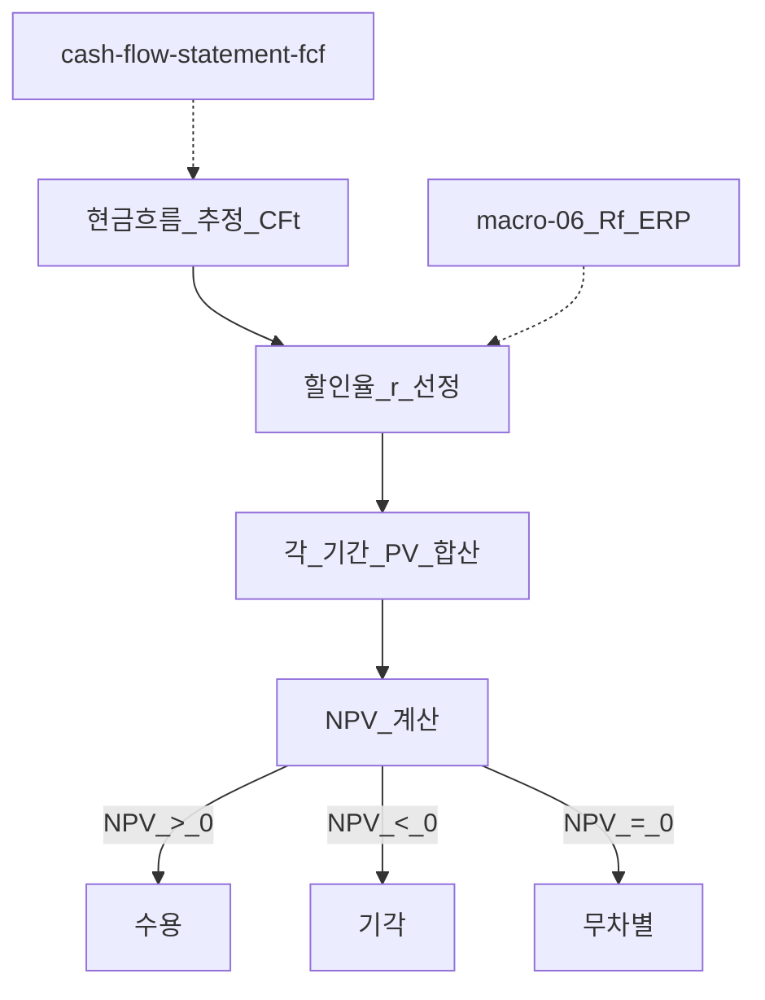
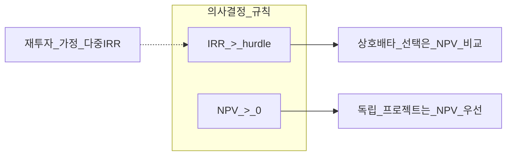
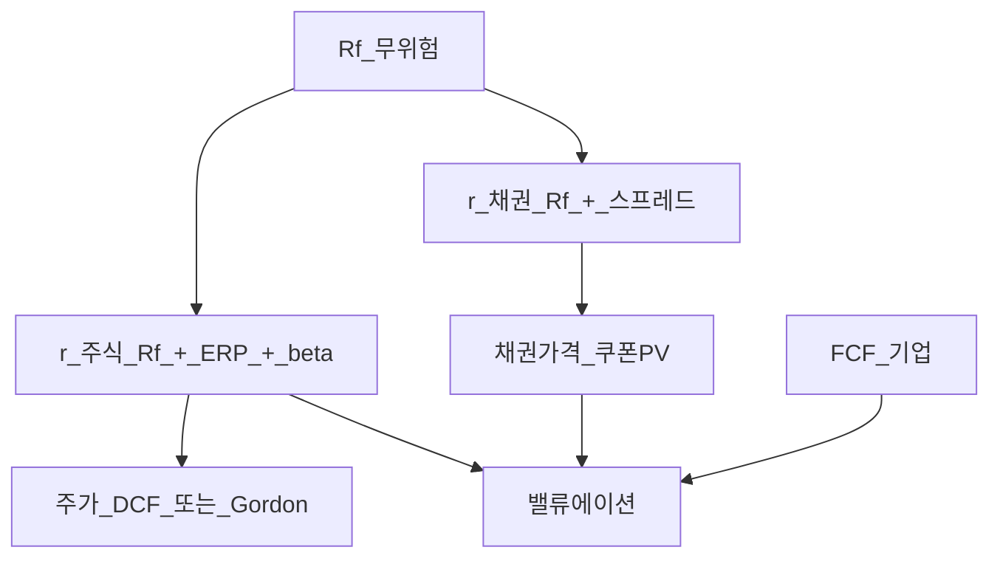

# NPV·IRR·할인율 — 현금흐름 평가와 밸류에이션 연결

> **면책**: 본 문서는 교육 목적이며, 특정 개인·법인에 대한 투자·세무·법률 자문이 아닙니다. 제도·세율·상품 조건·시장 수익률은 변경될 수 있으므로 실행 전 공식 출처를 확인하세요.

## 메타

| 항목 | 내용 |
|------|------|
| 최종 검증일 | 2026-05-24 |
| 정책·법령 기준일 | 2025-12-31 확정, 2026 개편 별도 표기 |
| 난이도 | L4 (Graduate) — [READER-GUIDE](../docs/READER-GUIDE.md) |
| 예상 읽기 시간 | 150~180분 |
| 관련 bucket | Bucket 0~3 (투자 의사결정·기업가치·채권·주식 평가 문법) |

## 0. 이 편 읽기 전 (5분)

| 항목 | 내용 |
|------|------|
| **난이도** | L4 (Graduate) — [READER-GUIDE §L등급](../docs/READER-GUIDE.md) |
| **선수** | [compound-interest-and-time-value](compound-interest-and-time-value.md), [cash-flow-basics](cash-flow-basics.md) — **L3 선수 필수** |
| **이번 편에서 쓰는 기호** | PV, FV, PMT, r, n, 복리 |
| **복습 한 줄** | L3 선수 편을 먼저 읽으면 수식이 수월함 |

## TL;DR

1. **NPV(순현재가치)** 는 미래 현금흐름을 **할인율 \(r\)** 로 오늘 가치로 환산한 합에서 **초기 투자**를 뺀 값이며, **NPV > 0** 이면 (모형 가정 하) 경제적으로 **수용**하는 프로젝트·투자다.
2. **IRR(내부수익률)** 는 NPV를 0으로 만드는 **할인율**이며, **IRR > 요구수익률(hurdle rate)** 이면 수용 규칙과 대응하지만 **재투자 가정·규모·다중 IRR** 함정이 있다.
3. **연금(annuity)**·**영구채(perpetuity)** 는 반복·무한 현금흐름의 **폐형식 PV**를 제공하며, **채권 쿠폰·배당·임대 CF** 평가의 기초 블록이다.
4. **할인율**은 무위험금리 \(R_f\) + **위험프리미엄** + (기업·프로젝트) **특유 위험**으로 구성되며, [macro-06](../02-economics/macro-06-asset-prices-macro.md)의 거시 금리·인플레 쇼크가 **\(r\)** 을 움직인다.
5. **주식 밸류에이션**·**채권 YTM**·**FCF 할인**은 동일한 **시간가치 문법** — [compound-interest-and-time-value](compound-interest-and-time-value.md)에서 PV/FV를 익힌 뒤 본 문서로 **의사결정 규칙**까지 올린다.

---

## 1. 한 줄 정의 + 왜 중요한가

!!! info "NPV (Net Present Value, 순현재가치)"
    미래 현금흐름을 **할인율 r**로 오늘 가치(PV)로 환산한 합에서 **초기 투자**를 뺀 값. **NPV > 0**이면 (모형 가정 하) 프로젝트·투자 **수용**.

!!! info "IRR (Internal Rate of Return, 내부수익률)"
    NPV를 **0**으로 만드는 할인율. **IRR > 요구수익률**이면 수용 규칙과 맞지만, **규모·재투자·다중 IRR** 함정이 있어 NPV와 병행한다.

**정의**: **순현재가치(Net Present Value, NPV)** 는 서로 다른 시점의 현금유입·유출을 **공통 할인율**로 **현재가치(PV)** 로 환산한 뒤 합산한 **순 가치**이다. **내부수익률(Internal Rate of Return, IRR)** 은 그 합이 0이 되도록 하는 **내재 수익률(할인율)** 이다. **할인율(discount rate)** 은 미래 1원의 **오늘 가치**를 정하는 **기회비용·위험 보상**의 요약 지표다.

**왜 중요한가** (장기 자산 형성·bucket 연결):

| 연결 | 설명 |
|------|------|
| **개인·가계** | 전세·ISA 납입·부채 상환 vs 투자 — **어느 쪽이 PV 기준 더 큰가** |
| **주식** | 기업 **FCF**·배당을 할인 → [stocks-equities-intro](../03-markets/stocks-equities-intro.md) PER·DCF 맥락 |
| **채권** | 쿠폰·만기 원금의 PV 합 = 가격, YTM ≈ IRR — [bonds-fixed-income](../03-markets/bonds-fixed-income.md) |
| **거시** | \(R_f\), ERP, 인플레가 **\(r\)** 을 바꿈 — [macro-06](../02-economics/macro-06-asset-prices-macro.md) |
| **재무제표** | OCF·CAPEX에서 **FCF** 추출 후 NPV — [cash-flow-statement-fcf](cash-flow-statement-fcf.md) |

본 저장소에서 [compound-interest-and-time-value](compound-interest-and-time-value.md)는 “돈이 시간에 따라 **어떻게 자라는가**”를, 본 문서는 “서로 다른 시점의 돈을 **어떻게 비교·선택하는가**”를 담당한다. L4 학습자는 **엑셀·계산기 없이** NPV 부호·IRR 함정·할인율 구성요소를 **말로 설명**할 수 있어야 한다.

---

## 2. 선수 지식 / 이후 읽을 것

**선수**:
- [compound-interest-and-time-value.md](compound-interest-and-time-value.md) — PV, FV, \((1+r)^n\), 연금 FV
- [cash-flow-basics.md](cash-flow-basics.md) — 저축률·현금흐름 타이밍
- [financial-statements-intro.md](financial-statements-intro.md) — 손익·대차·현금흐름 구조

**이후**:
- [cash-flow-statement-fcf.md](cash-flow-statement-fcf.md) — OCF·FCF·기업 NPV
- [bonds-fixed-income.md](../03-markets/bonds-fixed-income.md) — YTM·듀레이션·금리 역관계
- [stocks-equities-intro.md](../03-markets/stocks-equities-intro.md) — PER·배당·성장주
- [macro-06-asset-prices-macro.md](../02-economics/macro-06-asset-prices-macro.md) — 할인율·ERP·Fed·실질수익
- [debt-and-interest.md](debt-and-interest.md) — 부채 IRR(차입 비용)과 투자 IRR 비교
- [asset-allocation.md](../04-portfolio/asset-allocation.md) — 포트 전체 기대수익·할인율

---

## 3. 직관·비유

**NPV — 저울**: 왼쪽 접시에 “오늘 내는 돈(초기 투자)”, 오른쪽에 “미래에 받을 돈을 **오늘 무게로 환산**한 합”을 올린다. 오른쪽이 더 무거우면(NPV > 0) 저울은 **투자 쪽**으로 기운다.

**할인율 — 안개의 농도**: 같은 1년 뒤 100만 원이라도 **불확실**하면 안개가 짙어 **오늘 가치**는 낮다(할인율 ↑). [macro-06](../02-economics/macro-06-asset-prices-macro.md)에서 금리·프리미엄이 이 안개를 조절한다.

**IRR — 프로젝트의 “자체 수익률”**: 투자가 **스스로** 몇 %로 복리 성장해야 본전(NPV=0)인지 역산한 값. 다만 “IRR이 높다”만으로 **규모가 큰** 좋은 프로젝트를 놓칠 수 있다 — **NPV**가 최종 판사.

**연금 vs 영구채**: 연금은 **유한 기간**의 동일 쿠폰(월세 3년 계약), 영구채는 **끝없는** 쿠폰(영구 배당·콘솔 본드). 후자는 공식이 단순해 **\(r\)** 추정 오차가 가격에 **즉시** 반영된다.

**채권·주식과의 다리**: 채권은 **계약된 CF** → 할인율 = YTM. 주식은 **불확실 CF** → 할인율에 **ERP**가 붙는다. 둘 다 “미래 돈의 PV 합”이라는 **같은 문법**이다.

---

## 4. 정식 개념·용어

| 용어 | 한글 | English | 정의 |
|------|------|----------------|
| NPV | 순현재가치 | Net Present Value | 할인 CF 합 − 초기 투자 |
| IRR | 내부수익률 | Internal Rate of Return | NPV=0인 할인율 |
| PV | 현재가치 | Present Value | \(CF_t/(1+r)^t\) |
| FV | 미래가치 | Future Value | 미래 시점 가치 |
| \(r\) | 할인율 | Discount rate | PV 환산 비율 |
| Hurdle rate | 요구수익률 | Hurdle / required return | 수용 기준 \(r\) |
| \(R_f\) | 무위험금리 | Risk-free rate | 국채·예금 기준 |
| ERP | 주식위험프리미엄 | Equity risk premium | \(E[R_m]-R_f\) |
| WACC | 가중평균자본비용 | Weighted avg cost of capital | 기업 할인율 근사 |
| Annuity | 연금 | Annuity | 동일 기간 반복 CF |
| Perpetuity | 영구연금 | Perpetuity | 무한 반복 CF |
| YTM | 만기수익률 | Yield to maturity | 채권 IRR 근사 |
| FCF | 잉여현금흐름 | Free cash flow | 투자자에게 가용 CF |
| MIRR | 수정 IRR | Modified IRR | 재투자율 명시 IRR |
| Payback | 회수기간 | Payback period | NPV 없이 기간만 |

### 4a. 핵심 용어 (본문 등장 순)

> 복습용. 정의는 §4 본표·[glossary](../00-roadmap/glossary.md)·본문 `!!! info` 박스.

| 용어 | 한 줄 | 관련 이론 | glossary |
|------|------|----------------|
| NPV | 순현재가치 | §4 | [glossary](../00-roadmap/glossary.md#npv) |
| IRR | 내부수익률 | §4 | [glossary](../00-roadmap/glossary.md#irr) |
| PV | 현재가치 | §4 | [glossary](../00-roadmap/glossary.md#pv) |
| FV | 미래가치 | §4 | [glossary](../00-roadmap/glossary.md#fv) |
| \(r\) | 할인율 | §4 | [glossary](../00-roadmap/glossary.md#\) |
| Hurdle rate | 요구수익률 | §4 | [glossary](../00-roadmap/glossary.md#hurdle-rate) |
| \(R_f\) | 무위험금리 | §4 | [glossary](../00-roadmap/glossary.md#\) |
| ERP | 주식위험프리미엄 | §4 | [glossary](../00-roadmap/glossary.md#erp) |
| WACC | 가중평균자본비용 | §4 | [glossary](../00-roadmap/glossary.md#wacc) |
| Annuity | 연금 | §4 | [glossary](../00-roadmap/glossary.md#annuity) |
| Perpetuity | 영구연금 | §4 | [glossary](../00-roadmap/glossary.md#perpetuity) |
| YTM | 만기수익률 | §4 | [glossary](../00-roadmap/glossary.md#ytm) |
| FCF | 잉여현금흐름 | §4 | [glossary](../00-roadmap/glossary.md#fcf) |
| MIRR | 수정 IRR | §4 | [glossary](../00-roadmap/glossary.md#mirr) |
| Payback | 회수기간 | §4 | [glossary](../00-roadmap/glossary.md#payback) |

---

## 5. 메커니즘

### 5.1 NPV 의사결정 파이프라인

**읽는 법**: \(r\)이 1%p만 올라도 **장기 CF**가 큰 프로젝트(성장주·장기 채권)의 NPV는 **크게** 깎인다. CF 추정 오류와 \(r\) 오류는 **곱**으로 작용한다.

### 5.2 IRR vs NPV — 규모·재투자

**독립 프로젝트**(동시에 여러 개 가능): NPV > 0이면 모두 수용. **상호배타**(하나만): **NPV가 큰 쪽**. IRR만 보면 **작지만 IRR 높은** 프로젝트를 고를 수 있다.

### 5.3 할인율 → 자산군 연결

---

## 6. 수식·모델

### 6.1 일반 PV·FV (복습)

| 기호 | 이름 | 이 식에서 의미 |
|------|------|----------------|
| \(PV\) | 현재가치 | 오늘 시점으로 환산한 금액 |
| \(FV\) | 미래가치 | 미래 시점의 목표·결과 금액 |
| \(r\) | 할인율·수익률 | 기간당 이자·요구수익률 |
| \(n\) | 기간 | 연·월 등 복리·할인에 쓰는 횟수 |

\[
PV = \frac{FV}{(1+r)^n}, \qquad FV = PV \times (1+r)^n
\]

**읽는 법**: FV를 목표로 두면 PV는 “지금 한 번에 넣을 금액”, PMT·저축률은 “매기간 추가”로 연결한다.

### 6.2 NPV (일반형)

| 기호 | 이름 | 이 식에서 의미 |
|------|------|----------------|
| \(C_0\) | 초기 투자 | 시점 0 유출(투자금) |
| \(CF_t\) | t기 현금흐름 | 유입 +, 유출 − (관례 확인) |
| \(r\) | 할인율 | 요구수익률·WACC 등 |
| \(T\) | 기간 | 마지막 CF 시점 |

\[
NPV = -C_0 + \sum_{t=1}^{T} \frac{CF_t}{(1+r)^t}
\]

**읽는 법**: NPV > 0이면 (모형 가정 하) 수용. 규모가 큰 프로젝트는 IRR만 보지 말고 NPV를 병행한다.

### 6.3 IRR (정의)

| 기호 | 이름 | 이 식에서 의미 |
|------|------|----------------|
| \(IRR\) | 내부수익률 | NPV=0이 되는 할인율 |
| \(C_0\), \(CF_t\), \(T\) | §6.2와 동일 | 동일 현금흐름 구조 |

\[
0 = -C_0 + \sum_{t=1}^{T} \frac{CF_t}{(1+IRR)^t}
\]

**읽는 법**: IRR은 “자체 수익률”이지만 재투자 가정·규모·다중 IRR 함정이 있어 NPV와 함께 본다.

### 6.4 할인율 구성 (교육용 CAPM 연결)

| 기호 | 이름 | 이 식에서 의미 |
|------|------|----------------|
| \(R_f\) | 무위험금리 | 국채·예금 기준 |
| \(E[R_m]\) | 시장 기대수익 | 시장 포트 기대수익 |
| \(eta\) | 베타 | 시장 대비 민감도 |
| \(r\) | 요구수익률 | CAPM·WACC의 핵심 입력 |

\[
r = R_f + \beta \cdot (E[R_m] - R_f) + \text{(유동성·규모·특수 위험)}
\]

**읽는 법**: 시장 초과수익에 대한 민감도가 **β**다. **R_f**·**ERP**와 함께 요구수익 **r**을 구성한다. [DEPTH-STANDARD](../docs/DEPTH-STANDARD.md) 참고.
**유도 (L4)**:
1. **정의**: **R_f**, **E**, **eta**를 동일 시점·동일 통화로 맞춘다. — 단위 불일치면 식이 무의미해진다.
2. **식 변형**: 양변을 정리해 목표 변수를 한쪽에 둔다. — 할인·복리는 **시점 이동**이 핵심이다.
3. **해석**: 부호·크기가 경제 직관과 맞는지 확인한다. — 극단값에서 단조성·한계를 점검한다.
기업 **WACC** (간략):

| 기호 | 이름 | 이 식에서 의미 |
|------|------|----------------|
| \(WACC\) | 가중평균자본비용 | FCF 할인율 근사 |
| \(E, D\) | 자기·부채 | 시가총액·부채 가치 |
| \(V\) | 총가치 | \(E+D\) |
| \(r_e, r_d\) | 자본·부채 비용 | 세후 조정 전·후 구분 |
| \(T_c\) | 법인세율 | 부채 이자세 차감 |

\[
WACC = \frac{E}{V} r_e + \frac{D}{V} r_d (1 - T_c)
\]

**읽는 법**: [macro-06](../02-economics/macro-06-asset-prices-macro.md)에서 \(R_f\), ERP가 \(r_e\)·\(r\)을 움직인다.

### 6.5 보통연금(기말) 현재가치

| 기호 | 이름 | 이 식에서 의미 |
|------|------|----------------|
| \(PV_{annuity}\) | 연금 현재가치 | 동일 CF 반복의 PV |
| \(C\) | 정기 CF | 매기간 동일 금액 |
| \(r, n\) | 할인율·기간 | §6.1과 동일 |

\[
PV_{annuity} = C \times \frac{1 - (1+r)^{-n}}{r}
\]

**읽는 법**: 채권 쿠폰·연금·전세 월세 등 **유한 반복 CF**에 쓴다.

### 6.6 영구연금(퍼페튜이티) 현재가치

| 기호 | 이름 | 이 식에서 의미 |
|------|------|----------------|
| \(PV_{perp}\) | 영구연금 PV | 무한 쿠폰·배당 근사 |
| \(C\) | 정기 CF | 매기 동일 금액 |
| \(r\) | 할인율 | \(r>0\) 필수 |

\[
PV_{perp} = \frac{C}{r}
\]

**읽는 법**: **PV_**와 **C**의 관계를 위 식으로 쓴다. 경제·재무 해석은 변수표 「이 식에서 의미」와 [DEPTH-STANDARD](../docs/DEPTH-STANDARD.md) 기호 예제를 맞춘다.
**유도 (L4)**:
1. **정의**: **PV_**, **C**, **r**를 동일 시점·동일 통화로 맞춘다. — 단위 불일치면 식이 무의미해진다.
2. **식 변형**: 양변을 정리해 목표 변수를 한쪽에 둔다. — 할인·복리는 **시점 이동**이 핵심이다.
3. **해석**: 부호·크기가 경제 직관과 맞는지 확인한다. — 극단값에서 단조성·한계를 점검한다.
\(g\) 성장 영구(Gordon):

| 기호 | 이름 | 이 식에서 의미 |
|------|------|----------------|
| \(C_1\) | 다음 기 CF | 다음 배당·임대 등 |
| \(g\) | 성장률 | \(r>g\) 조건 |

\[
PV = \frac{C_1}{r - g}, \quad r > g
\]

**읽는 법**: 주식 [stocks-equities-intro](../03-markets/stocks-equities-intro.md)에서 \(C_1=D_1\). \(r\uparrow\) 또는 \(g\downarrow\) → PV↓.

### 6.7 채권 가격 (교육용)

| 기호 | 이름 | 이 식에서 의미 |
|------|------|----------------|
| \(P_{bond}\) | 채권 가격 | 쿠폰·원금의 PV 합 |
| \(C, F\) | 쿠폰·액면 | 현금흐름 |
| \(y\) | YTM | 시장 할인율(IRR 근사) |

\[
P_{bond} = \sum_{t=1}^{T} \frac{C}{(1+y)^t} + \frac{F}{(1+y)^T}
\]

**읽는 법**: \(y \uparrow \Rightarrow P_{bond} \downarrow\) — [bonds-fixed-income](../03-markets/bonds-fixed-income.md).

### 6.8 FCF 기업가치 스케치 (연결)

| 기호 | 이름 | 이 식에서 의미 |
|------|------|----------------|
| \(V_{firm}\) | 기업가치 | FCF 할인 합 + TV |
| \(FCF_t\) | 잉여현금흐름 | 투자자 가용 CF |
| \(WACC\) | 할인율 | §6.4 |
| \(TV\) | 종료가치 | Gordon 등 |

\[
V_{firm} \approx \sum_{t=1}^{T} \frac{FCF_t}{(1+WACC)^t} + \frac{TV}{(1+WACC)^T}
\]

**읽는 법**: 상세 FCF 추출은 [cash-flow-statement-fcf](cash-flow-statement-fcf.md).

### 6.9 NPV 프로필·민감도

할인율 \(r\)을 sweep하면 **NPV(r)** 곡선이 나온다. IRR은 곡선과 **횡축 교점**. \(r\)이 hurdle보다 **조금**만 높아도 NPV가 음수로 바뀌는 **민감** 프로젝트는 **실행 리스크**가 크다.

---

## 7. 한국 적용

### 7.1 2025년 기준 (확정)

| 영역 | NPV·IRR·할인율 관점 |
|------|---------------------|
| **예금·적금** | 확정 CF에 가깝다 → \(r \approx\) 상품 금리(세후) |
| **전세·부동산** | 임대·매각 CF, **금리·공실**이 \(r\)·CF 동시 충격 |
| **회사채·국채** | YTM = 시장 **할인율**, 한은 기준금리·국채 수익률 연동 |
| **주식 ISA** | 배당·성장 **불확실** → ERP·베타 반영 \(r\) |
| **부채 상환** | 카드·신용대출 **IRR(차입)** > 투자 IRR이면 NPV 관점 **상환 우선** — [debt-and-interest](debt-and-interest.md) |
| **퇴직·연금** | DB는 개인 IRR 선택 불가, DC·ISA는 **목표 FV**를 NPV 역산 |

### 7.2 2026년 개편·시행 예정 (해당 시)

| 항목 | 2025 (확정) | 2026 (공식 확인) |
|------|------|----------------|
| 기준금리·국채 3년 | 시장 금리 반영 | \(R_f\) 가정 **갱신** |
| ISA·연금 세제 | 비과세·공제 한도 | **세후 CF**·할인율 재산정 |
| 금융투자소득세 | 분리과세 구조 | 해외주식 **세후 IRR** 변동 |

**법·정책 근거**: 소득세법(금융소득), 자본시장법·금융투자업 규정, 국세청·금융위 안내 — [references/sources.md](../references/sources.md).

### 7.3 가계 hurdle rate (교육용)

| Bucket | 대표 hurdle (실질·교육) | 비고 |
|------|------|----------------|
| 0 비상금 | 0~2% | NPV보다 **유동성** |
| 1 정책 | 정책 금리 + 세제 | [youth-leap-account](../06-korea-policy/youth-leap-account.md) |
| 2 ISA·IRP | 4~6% (세후) | 장기 **FCF** 유사 |
| 3 코어 ETF | 5~7% (실질) | [macro-06](../02-economics/macro-06-asset-prices-macro.md) ERP |

**원칙**: 확실한 **부채 이자 절감**은 위험 자산의 **기대 IRR**과 비교할 때 **확실성 프리미엄**을 부여한다(예제 4).

### 7.4 거시·자산가격 연동

한은 금리 인상 → \(R_f \uparrow\) → 주식·채권 **할인율 상승** → [macro-06](../02-economics/macro-06-asset-prices-macro.md). **GDP 성장**([macro-01](../02-economics/macro-01-gdp-accounts-growth.md))은 **\(g\)** (기업 성장)에, **인플레**([macro-02](../02-economics/macro-02-money-inflation.md))는 **명목 vs 실질 \(r\)** 에 영향.

---

## 8. 숫자 예제 (가상)

> 모든 인물·금액은 가상입니다.

### 예제 1: 프로젝트 NPV — 가상 스타트업 장비

| 시점 | CF (만 원) |
|------|------------|
| 0 | −10,000 (투자) |
| 1 | +4,000 |
| 2 | +4,500 |
| 3 | +5,000 |

할인율 \(r = 10\%\) (연):

\[
PV_1 = \frac{4000}{1.1} \approx 3636,\quad PV_2 = \frac{4500}{1.1^2} \approx 3719,\quad PV_3 = \frac{5000}{1.1^3} \approx 3757
\]

\[
\sum PV \approx 11112,\quad NPV \approx 11112 - 10000 = +1112 \text{ (만 원)}
\]

**판단**: NPV > 0 → 수용. \(r=15\%\)로 올리면 NPV는 **급감** — 민감도 점검 필수.

### 예제 2: IRR vs NPV 규모 함정 — 가상 A·B

| 프로젝트 | \(C_0\) | 1년차 CF | IRR (근사) | NPV @ r=10% |
|------|------|----------------|
| A (소규모) | −100 | +130 | **30%** | +18.2 |
| B (대규모) | −10,000 | +12,000 | **20%** | +909 |

**교훈**: IRR은 A > B지만 **상호배타**면 B 선택(NPV 큼). **독립**이면 둘 다 NPV > 0이면 **둘 다** 수용.

### 예제 3: 연금·영구채 — 가상 채권·배당

**3년 만기 쿠폰 채권**(액면 100, 연 쿠폰 5%, \(r=6\%\)):

\[
PV_{coupon} = 5 \times \frac{1-1.06^{-3}}{0.06} \approx 13.47,\quad PV_{principal} = \frac{100}{1.06^3} \approx 83.96
\]

\[
P \approx 97.4 \ (< 100,\ \text{할인채})
\]

**영구 배당** \(D=5\) 원, \(r=8\%\), \(g=3\%\):

\[
P = \frac{5}{0.08-0.03} = 100
\]

[stocks-equities-intro](../03-markets/stocks-equities-intro.md): \(g\) 과대 추정 시 가격 **과대**.

### 예제 4: 부채 상환 vs 주식 투자 — 가상 직장인 D

| 항목 | 값 |
|------|-----|
| 카드 잔액 | **M** (만 원 단위, 교육용) |
| 연 이자(확실) | 18% → **1년 이자 **M** (만 원 단위, 교육용)** |
| 주식 기대수익(불확실) | 10% on **M** → **M** (만 원 단위, 교육용)** |

**NPV 관점**: 확실 **이자 절감** **M** > 기대 **M** → **상환**이 hurdle 대비 우월. [debt-and-interest](debt-and-interest.md), [cash-flow-basics](cash-flow-basics.md)와 연결.

---
## 9. FAQ

**Q1. NPV와 IRR 중 무엇을 먼저 보나요?**  
**A1.** **NPV**가 원칙적 기준. IRR은 **직관·비교**용. 상충 시 NPV 우선.

**Q2. 할인율은 어떻게 정하나요?**  
**A2.** **무위험 \(R_f\)** + **위험프리미엄**(베타·ERP) + 프로젝트 특수 위험. 거시는 [macro-06](../02-economics/macro-06-asset-prices-macro.md), 가계는 **세후 기회비용**.

**Q3. IRR이 25%면 무조건 좋은 투자인가요?**  
**A3.** **아니다.** 규모가 작거나, CF가 **나중에 큰 유출**(매각세·해지비)이 있으면 NPV < 0일 수 있다. **다중 IRR**도 가능.

**Q4. 채권 YTM과 IRR의 관계는?**  
**A4.** 채권 가격·쿠폰·만기 CF에 대해 **NPV=0**인 \(y\)가 **YTM** ≈ **IRR**. [bonds-fixed-income](../03-markets/bonds-fixed-income.md).

**Q5. 주식 PER과 NPV·할인율은?**  
**A5.** PER은 **단순화된 밸류에이션**. DCF·Gordon은 **명시적 NPV**. \(r \uparrow\) → PER **압축** ([stocks-equities-intro](../03-markets/stocks-equities-intro.md)).

**Q6. 인플레이션은 할인율에 어떻게 넣나요?**  
**A6.** **명목 CF**에는 **명목 \(r\)**, **실질 CF**에는 **실질 \(r\)** — 혼합 금지. Fisher: \( (1+r_{real}) \approx (1+r_{nom})/(1+\pi) \).

**Q7. FCF와 OCF 차이는 NPV에 어떻게 쓰이나요?**  
**A7.** **FCF** = OCF − CAPEX(± ΔNWC). 기업가치 NPV는 **FCF**를 WACC로 할인 — [cash-flow-statement-fcf](cash-flow-statement-fcf.md).

**Q8. MIRR은 왜 쓰나요?**  
**A8.** IRR의 **재투자율=IRR** 가정을 **hurdle**로 바꾼 **수정 IRR**. CF 부호가 복잡할 때 **단일 해**에 가깝다.

---

## 10. 함정·리스크·한계

- **IRR만** 보고 **NPV 규모** 무시 (예제 2)
- **재투자 가정**: IRR은 중간 CF를 **IRR로 재투자**한다고 암시 — 비현실적일 수 있음 → **MIRR**
- **다중 IRR·부호 변화** CF (초기 수익 후 대규모 투자)
- **할인율·성장률 \(g\)** 동시 오류 — Gordon에서 **작은 \(r-g\)** 가 분모 폭발
- **명목·실질 혼용**
- **유동성·옵션** 무시 — 실제 투자에는 **조기 상환·전환사채** 등
- **거시 쇼크** 시 과거 평균 \(R_f\), ERP **외삽** — [macro-06](../02-economics/macro-06-asset-prices-macro.md)
- 모델은 **점 추정**; 주식 CF는 **분포** — 시나리오 NPV 권장

---

**Q. 실무에서는?**  
교과서 식·기호를 그대로 적용하기 전에 **수수료·세금·데이터 시점**을 분리한다. 숫자는 [DEPTH-STANDARD](../docs/DEPTH-STANDARD.md)처럼 기호만 먼저 맞추고, 법령·시장 수치는 §8 표·외부 출처로 갱신한다.

## 11. 심화 읽기

- [references/sources.md](../references/sources.md) — 한은·금융감독원·국세청
- [compound-interest-and-time-value.md](compound-interest-and-time-value.md)
- [bonds-fixed-income.md](../03-markets/bonds-fixed-income.md)
- [macro-06-asset-prices-macro.md](../02-economics/macro-06-asset-prices-macro.md)
- [cash-flow-statement-fcf.md](cash-flow-statement-fcf.md) (예정)
- 교재: Brealey·Myers·Allen *Principles of Corporate Finance* (NPV·IRR), Damodaran *Investment Valuation* (DCF), Fabozzi *Fixed Income* (채권 가격)

---

## 연습문제 (L4, 기호)

1. 위 §6 주요 식에서 변수 하나를 미지로 두고, 나머지를 기호로 둔 **관계식**을 쓰시오.
2. 가정이 깨질 때(유동성·세금·다중 IRR 등) 위 식의 **한계**를 기호·부등식으로 서술하시오.
3. §8 예제와 동일 기호(M·P·PV 등)로 **부호·단조성**만 검증하는 짧은 논증을 하시오.

### 해설 키

1. 직전 변수표의 「이 식에서 의미」를 이용해 동일 차원으로 정리한다.
2. 「가정이 깨지면」 절의 한계 사례와 연결한다.
3. 숫자 대입 없이 **부호**·**단위** 일치만 확인한다.
## 12. 스스로 점검 퀴즈

1. \(C_0=-1000\), 1년 뒤 \(CF_1=1100\), \(r=8\%\)일 때 NPV는?
2. 위 문제의 IRR은?
3. 연 100만 원, 5년, \(r=10\%\) 연금의 PV는? (공식 사용)
4. 배당 200만 원, \(r=10\%\), \(g=4\%\) Gordon 가격은?
5. IRR > hurdle인데 NPV < 0인 경우가 가능한가? (상호배타·규모 맥락)
6. 금리 상승 시 **듀레이션 긴 채권** 가격과 **고PER 성장주** 중 어느 쪽이 할인율 민감도가 더 큰가? (직관)
7. 카드 연 20% 부채 1000만 원 1년 **확실 이자** vs 주식 **기대 12%** — 가계 NPV 관점 우선순위는?
8. OCF와 FCF 중 기업 DCF에 쓰는 것은?

??? note "정답 힌트"

    1. NPV ≈ 1100/1.08 − 1000 ≈ +19 (단위 일치 가정) · 2. IRR = 10% · 3. PV ≈ 100×3.7908 ≈ 379만 · 4. P = 200/(0.1−0.04) ≈ 3333만 · 5. 단일 프로젝트에서는 불가; **비교·규모·부호** 맥락에서 IRR·NPV 상충 이해 · 6. 둘 다 \(r\) 민감; 성장주는 **\(g\)·장기 CF**도 · 7. **부채 상환** · 8. **FCF**

---

## 부록 A — NPV 프로필 그리기 (교육)

| \(r\) (%) | 예제1 NPV (만 원, 근사) |
|-----------|-------------------------|
| 5 | +2,100 |
| 10 | +1,112 |
| 15 | +350 |
| 20 | −200 |

IRR은 NPV=0인 \(r\) — 표에서 **10~15%** 사이. **그래프**를 그리면 hurdle 변경 시 **민감도**가 보인다.

---

## 부록 B — 채권·주식·FCF 통합 표

| 자산 | CF | 할인율 | 핵심 공식 |
|------|------|----------------|
| 국채 3년 | 쿠폰+원금 | YTM | §6.7 |
| 성장주 | 배당 | \(r = R_f + \beta ERP\) | Gordon §6.6 |
| 기업 | FCF | WACC | §6.8 |
| 가계 부채 | 이자 절감 | 차입 IRR | 예제 4 |

---

## 부록 C — 엑셀·계산기 함수 (참고)

| 목적 | Excel |
|------|-------|
| NPV | `=NPV(r, CF1:CFn) + CF0` (부호 주의) |
| IRR | `=IRR(CF0:CFn)` |
| PV 연금 | `=PV(r, n, -C)` |
| 채권 가격 | `=PV(y, T, -C, -F)` |

**주의**: 엑셀 `NPV`는 **첫 CF가 1기 후** 가정. \(C_0\)는 **별도** 더한다.

---

## 부록 D — L4 2주 학습 로드맵

| 주차 | 내용 | 산출물 |
|------|------|----------------|
| 1 | §6 수식 유도·예제 1~2 손계산 | NPV·IRR 한 장 요약 |
| 2 | 채권 예제 3 + [bonds-fixed-income](../03-markets/bonds-fixed-income.md) | YTM·가격 민감도 |
| 병행 | [macro-06](../02-economics/macro-06-asset-prices-macro.md) §할인율 | \(R_f\), ERP 변화 시 주가 **비교정태** 3줄 |
| 병행 | [stocks-equities-intro](../03-markets/stocks-equities-intro.md) | Gordon과 PER **연결** 1페이지 |

**15시간/주** 가정: 이론 6h, 예제 5h, 퀴즈·연결 읽기 4h.

---

## 부록 E — 상호배타 프로젝트 의사결정 (장문)

두 프로젝트 **X, Y** 중 하나만 선택할 때, **IRR 순위**와 **NPV 순위**가 **뒤바뀌는** 전형적 이유는 (1) **규모** — 큰 NPV·낮은 IRR (2) **타이밍** — CF가 **늦게** 몰리면 IRR↑, NPV↓ (3) **초기 투자** 차이. **교육 규칙**: **NPV가 큰 프로젝트** 선택. **자본 제약**이 있으면 **NPV/투자액**(PI) 보조 지표 — 단, PI도 **재투자·규모** 한계 있음.

**포트폴리오** 맥락: [asset-allocation](../04-portfolio/asset-allocation.md)에서 **자산군** 선택은 **단일 hurdle**이 아니라 **상관·변동성** 포함. 본 문서의 NPV는 **단일 프로젝트·확정 CF**에 가깝고, 주식은 **시나리오·몬테카를로** 확장 — L4 다음 단계.

---

## 부록 F — 한국 금리·채권·주식 연동 시나리오 (가상)

**시나리오**: 한은 기준금리 **+50bp**, 국채 3년 **+40bp**, ERP **불변**, 성장주 \(g\) **하향**.

| 자산 | 메커니즘 | 교육적 방향 |
|------|------|----------------|
| 장기 국채 ETF | \(y \uparrow\) | 가격 ↓ |
| 고PER 성장주 | \(r \uparrow\), \(g \downarrow\) | PER·DCF **이중** 압력 |
| 단기 예금 | \(R_f \uparrow\) | Bucket 0 **명목 r** ↑ |
| 부채 변동금리 | 이자 CF ↑ | 가계 **NPV** 악화 |

[macro-06](../02-economics/macro-06-asset-prices-macro.md)와 **동일 표**를 채워 **비교정태** 연습.

---

## 부록 G — FCF·NPV·주주가치 (연결)

[financial-statements-intro](financial-statements-intro.md)에서 **영업현금흐름**을 읽고, [cash-flow-statement-fcf](cash-flow-statement-fcf.md)에서 **CAPEX·운전자본**을 빼 **FCF**를 만든다. **기업가치** = FCF의 NPV + **잉여현금**; **주주가치** = 기업가치 − **순부채**. **주가** = 주주가치 / 발행주식수. **PER**은 이 체인의 **압축 버전**. L4는 **체인 전체**를 말로 설명할 수 있으면 충분.

### G.1 2단계 DCF 스케치 (가상)

| 단계 | 입력 | 산출 |
|------|------|----------------|
| 1 | OCF, CAPEX, ΔNWC | **FCF** (연도별) |
| 2 | WACC, g, 명시기간 T | **NPV(FCF)** + **TV** |
| 3 | 순부채, 비영업자산 | **주주가치** |
| 4 | 발행주식수 | **내재가치/주** |

**민감도**: WACC **+1%p**만으로 내재가치가 **10~20%** 흔들릴 수 있다(성장·레버에 따라). **교육**: “정확한 한 가격”보다 **범위**와 **가정**을 적는 습관 — [financial-statements-analysis](financial-statements-analysis.md) 비율·[reading-annual-reports-dart](reading-annual-reports-dart.md) 주석이 **FCF 가정**의 재료.

### G.2 PER·Gordon·NPV 한 줄 대응

\[
\text{PER} \approx \frac{1}{r - g} \quad (\text{Gordon 근사, } g < r)
\]

**PER 25배**는 대략 \(r - g \approx 4\%\) — **\(r\)**(할인율·요구수익)과 **\(g\)**(성장) **동시** 가정. 금리↑ 시 **\(r\uparrow\)** → 동일 \(g\)면 PER **하락** 압력 — [macro-06-asset-prices-macro](../02-economics/macro-06-asset-prices-macro.md).

---

## 부록 H — 실질 vs 명목 NPV (교육)

| | 명목 | 실질 |
|------|------|----------------|
| CF | 명목 CF | 구매력 조정 CF |
| \(r\) | 명목 hurdle | 실질 hurdle |
| 인플레 | \(\pi\) in CF or \(r\) | 일관 분리 |

**가계 은퇴 목표**: 명목 FV 10억 vs 실질 구매력 — [compound-interest-and-time-value](compound-interest-and-time-value.md) §실질.

---

## 부록 I — 퀴즈 추가 (심화)

9. 2년 CF: \(t=1\) +500, \(t=2\) −600, \(C_0=0\) — IRR 개수는?  
10. WACC에서 부채 비중 ↑, \(r_d < r_e\) — WACC 방향은? (교육적)

---

## 부록 J — 연금·적립식·은퇴 NPV (가계 연결)

**연금 현재가치**는 “앞으로 \(n\)년 매년 \(C\)만 원을 받을 권리”의 오늘 가치다. **적립식**은 **PMT**를 매년 넣어 **FV**를 쌓는 반대 방향 — [compound-interest-and-time-value](compound-interest-and-time-value.md)와 **동일 엔진**, 기호만 **투자자·차입자** 관점이 바뀐다.

| 목표 | 미지수 | 사용 식 |
|------|------|----------------|
| 은퇴 후 매년 인출액 | \(C\) | \(PV = C \cdot \frac{1-(1+r)^{-n}}{r}\) |
| 매년 저축액 | PMT | \(FV = PMT \cdot \frac{(1+r)^n-1}{r}\) |
| 필요 은퇴자금 | FV | 위 FV 식 역산 |

**예시(가상)**: 65세부터 20년간 **연 3,600만 원** 실질 인출, 실질 \(r=4\%\) → \(PV \approx 3{,}600 \times 13.59 \approx 4.9\)억 원(오늘 필요한 **목표 FV의 PV**). **인플레**는 CF와 \(r\)에 **일관** 반영 — 명목·실질 혼합 금지.

**IRP·연금** 상품 선택은 **수수료·세제**가 \(r\)을 깎는다 — [isa-irp-pension-tax](../06-korea-policy/tax/isa-irp-pension-tax.md). NPV 프레임으로 “**세후·수수료 후** CF”만 넣어야 **가계 프로젝트** 비교가 성립한다.

---

## 부록 K — 채권 듀레이션·NPV 민감도 (입문 연결)

채권 가격 \(P\)는 YTM \(y\)에 대해 **비선형**이지만, **작은** \(\Delta y\) 에서는 **듀레이션 \(D\)** 로 근사한다:

\[
\frac{\Delta P}{P} \approx -D \cdot \Delta y
\]

**듀레이션 7년** 채권에 \(y\)가 **+1%p** → 가격 **약 −7%** (교육용 1차 근사). [bonds-fixed-income](../03-markets/bonds-fixed-income.md)에서 **쿠폰·만기**가 \(D\)를 결정함을 본다. **포트** 관점: [asset-allocation](../04-portfolio/asset-allocation.md)에서 채권 ETF는 **금리 리스크**를 NPV 언어로 “**할인율 shock**”과 연결해 이해할 수 있다.

**한국**: 2022~2023 유형의 **장기채 손실**은 \(y\uparrow\) → \(P\downarrow\)의 **대규모 \(\Delta y\)** 사례. 코어 Bucket 3에서 **채권 비중**은 “**항상 이익**”이 아니라 **상관·금리** 트레이드오프 — [macro-02-money-inflation](../02-economics/macro-02-money-inflation.md).

??? note "부록 I 힌트"

    9. 부호 2회 변화 → **복수 IRR 가능** · 10. **하락** 경향(세후 \(r_d\) 반영)

---

**L4 완료 기준**: [TEMPLATE](../docs/TEMPLATE.md) 12블록·FAQ 8·Mermaid 3·수식 5+·예제 4·검증일 2026-05-24 — [DEPTH-STANDARD](../docs/DEPTH-STANDARD.md).