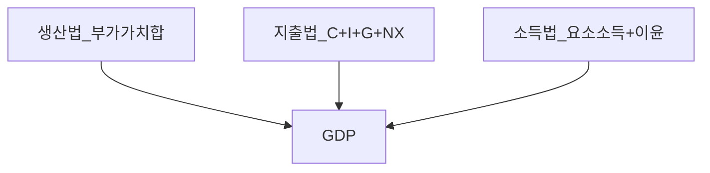
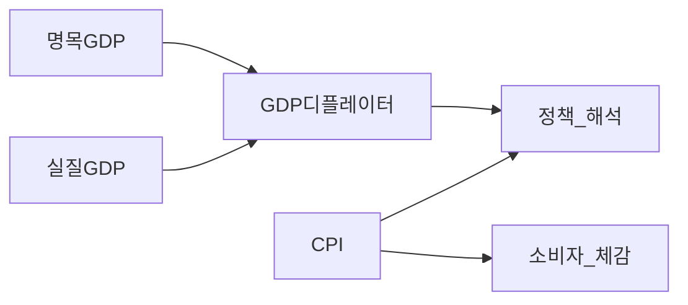

# 거시경제 01 — GDP·국민계정·성장·솔로우

> **면책**: 본 문서는 교육 목적이며, 특정 개인·법인에 대한 투자·세무·법률 자문이 아닙니다. 제도·세율·상품 조건은 변경될 수 있으므로 실행 전 공식 출처를 확인하세요.

## 메타

| 항목 | 내용 |
|------|------|
| 최종 검증일 | 2026-05-24 |
| 정책·법령 기준일 | 2025-12-31 확정, 2026 개편은 본문 표기 |
| 난이도 | L4 (Graduate) |
| 예상 읽기 시간 | 150~180분 |
| 관련 bucket | Bucket 0~1 (거시 문법), Bucket 3 (한국·수출 노출) |

## TL;DR

1. **GDP**는 일정 기간 한 경제 내에서 **최종**으로 생산된 재화·서비스의 **시장가치** 합(여러 정의가 일치해야 함).
2. **지출법** \(Y=C+I+G+NX\), **소득법** \(Y=wL+rK+\pi+\dots\) — 같은 개념의 **이중 기록**.
3. **명목 vs 실질**: 물가를 제거한 **실질 GDP**가 생산량, **GDP 디플레이터**는 GDP 물가, **CPI**는 소비자 바구니 — **혼동 금지**.
4. **생산성** \(Y/L\) 장기 성장의 핵심; **솔로우** \(y=f(k)\)에서 **저축·인구·기술**이 **정상상태**를 정한다.
5. **한국**은 **수출·제조·반도체** 비중이 커 GDP·주가·고용이 **글로벌 수요**에 민감 — GDP **한계**도 함께 본다.

---

## 1. 한 줄 정의 + 왜 중요한가

**정의**: **국민계정(National Accounts)** 은 거시경제의 **회계 틀**로, GDP·GNI·저축·투자·대외거래를 **일관된 정의**로 측정한다.

**왜 중요한가**: “경기 **둔화**” 뉴스는 GDP·실업·수출 통계로 나온다. **실질 GDP 성장률** 하락은 기업 **매출 성장** 기대·**금리** 경로([macro-02](macro-02-money-inflation.md))·**환율**([macro-05](macro-05-open-economy-fx.md) 예정)와 연결된다. 한국 투자자는 **수출 GDP**·**반도체 경기**가 [micro-05](micro-05-sector-applications.md) 섹터 이익과 **동행**하는지 추적하는 것이 **거시 문법**이다.

---

## 2. 선수 지식 / 이후 읽을 것

**선수**:
- [macroeconomics-basics](macroeconomics-basics.md)
- [microeconomics-basics](microeconomics-basics.md)
- [financial-statements-intro](../01-foundations/financial-statements-intro.md)
- [compound-interest-and-time-value](../01-foundations/compound-interest-and-time-value.md)

**이후**:
- [macro-02-money-inflation](macro-02-money-inflation.md)
- [macro-03-is-lm-ad-as](macro-03-is-lm-ad-as.md) (예정)
- [micro-05-sector-applications](micro-05-sector-applications.md)
- [stocks-equities-intro](../03-markets/stocks-equities-intro.md)

---

## 3. 직관·비유

**GDP = 연간 “최종 결제 영수증” 합**: 중간재(부품)는 **이중 계산** 피하려고 **최종**만. 자가소비·임대 **가상 임대**도 포함(정의상).

**명목 vs 실질**: 올해 **모두 10% 비싸졌는데** **수량**은 그대로면 **명목 GDP +10%**, **실질 GDP ≈ 0%**. “GDP 늘었다”가 **생활이 나아졌다**와 다를 수 있다.

**솔로우 정상상태**: **저축**으로 **설비(k)** 를 쌓으면 **인당 산출 y** 가 오르다가, **감가·인구**가 커지면 **한계수확 체감** — **y** 가 **일정 수준**에 수렴(기술 진보 없으면). **기술 A** 가 **전체 곡선을 위로** — 장기 성장의 **유일** 지속 원천(모형 안).

**한국 수출**: **작은 경제 개방** — 세계 **I(투자)·C** 가 한국 **NX** 를 통해 **Y** 에 직결. 미국·중국 **재고·금리**가 한국 **GDP 1/4** 충격처럼 느껴질 수 있다.

---

## 4. 정식 개념·용어

| 용어 | English | 정의 |
|------|---------|------|
| GDP | Gross Domestic Product | 국내 생산 최종재 가치 합 |
| GNI | Gross National Income | 국민 소득(해외 순소득 조정) |
| 최종재 | Final goods | 중간재 제외 |
| 명목 GDP | Nominal GDP | 현재가 |
| 실질 GDP | Real GDP | 불변가 |
| GDP 디플레이터 | GDP deflator | 명목/실질 ×100 |
| CPI | Consumer Price Index | 소비자 물가 |
| 생산성 | Productivity | Y/L 등 |
| ICOR | Incremental capital-output ratio | 증분 자본-산출 비 |
| 정상상태 | Steady state | 솔로우: Δk=0 |
| TFP | Total factor productivity | 잔차 생산성 |

---

## 5. 메커니즘

### 5.1 GDP 삼중 등가 (개념)

### 5.2 지출 구성 → 기업·섹터

| 항목 | 포함 예 | 한국·투자 |
|------|---------|-----------|
| C | 소비재·서비스 | 내수주, 유통 |
| I | 설비·건설·재고 | **반도체·배터리 CAPEX** |
| G | 정부 구매 | 방산·인프라 |
| NX | 수출-수입 | **수출 의존** |

### 5.3 명목·실질·물가지수

**차이**: 디플레이터는 **GDP 전체** 물가, CPI는 **가구 바구니** — **수출가·투자재** 비중이 다르면 **괴리**.

### 5.4 성장 분해 (교육용)

\[
\Delta Y \approx \Delta L + \Delta (Y/L) + \text{interaction}
\]

**(Y/L)** = **생산성** — 교육·기술·조직·자본심화.

---

## 6. 수식·모델

### 6.1 지출법

\[
Y = C + I + G + NX,\quad NX = X - M
\]

**I**에 **재고 투자** 포함 — **재고 축적**은 GDP↑이나 **지속 불가**.

### 6.2 소득법 (개념)

\[
Y = wL + rK + \text{이윤} + \text{간접세} - \text{보조금} + \text{감가상각 등}
\]

**지출=소득** — 한 사람 지출=다른 사람 소득.

### 6.3 명목·실질·디플레이터

\[
GDP^{nom}_t = P_t \cdot GDP^{real}_t,\quad \text{Deflator}_t = 100 \cdot \frac{GDP^{nom}_t}{GDP^{real}_t}
\]

**CPI**: 고정(또는 갱신) **소비 바구니** — **OER(임대)** 등 한국 논쟁([macro-02](macro-02-money-inflation.md)).

### 6.4 생산함수·솔로우 (기본)

\[
Y = A F(K,L),\quad y = Y/L,\quad k = K/L
\]

**Cobb-Douglas** \(y = A k^\alpha\):

**인당 투자** \(s y = s A k^\alpha\), **인구·감가** \( (n+\delta)k \).

**정상상태** \(s A k^{*\alpha} = (n+\delta) k^*\) → \(k^*, y^*\).

**골든룰** \(k_{gold}\): **소비 per capita** 최대 — **s** 가 **너무 크면** \(k\) 는 많으나 **현재 소비** 희생.

**기술 A↑**: \(y^*\) **영구** 상승 — **장기 성장**.

### 6.5 한계생산·요소몫 (직관)

\(\alpha\) = **자본 몫**, \(1-\alpha\) = **노동 몫** (Cobb-Douglas 하에서 **함수분배**).

---

## 7. 한국 적용

### 7.1 2025년 기준 (맥락)

| 지표 | 한국 특징 | 투자·학습 |
|------|-----------|-----------|
| 수출/GDP | 높음 | **반도체·자동차·조선** |
| 제조 비중 | 높음 | [micro-05](micro-05-sector-applications.md) |
| 고령화 | L 성장↓ | **생산성** 의존↑ |
| 가계부채 | C·주택 | 내수·금리 민감 |
| chaebol | I 집중 | **CAPEX 사이클** |

**수출 구조 (교육용, 가상 비중)**: 반도체·전자 **대형**, 자동차·배터리 **성장**, 조선·석화 **사이클**, 서비스 **내수**. **GDP 성장**이 **수출 -10%** 일 때 **음수**로 가기 쉬운 **개방 경제**.

### 7.2 2026년 개편·시행 예정

| 항목 | 2025 | 2026 |
|------|------|------|
| 국민계정 | 한국은행·통계청 발표 | **잠정치→확정치** 개정 추적 |
| 산업 정책 | K-반도체·배터리 | **I** 구성 변화 — **GDP vs ROIC** 분리 |

**법·출처**: 「국민계정통계」([e-stat](https://kosis.kr), 한국은행 ECOS) — [references/sources.md](../references/sources.md).

### 7.3 GDP의 한계 (투자자용)

| 한계 | 내용 | 대안 지표 |
|------|------|-----------|
| 비시장 | 가사·자원봉사 제외 | 웰빙·환경 |
| 분배 | 평균만 | **소득·자산 분포** |
| 질 | 양만 | **의료·교육 질** |
| 환경 | 오염 미차감 | **녹색 GDP** (논의) |
| 디지털 | 무료 서비스 | **디지털 경제** 통계 개선 |
| 재고·투자 | 단기 왜곡 | **순투자·생산성** |

**주가**: GDP↑ ≠ **주가↑** — **이익 점유·금리·밸류에이션** ([macro-06](macro-06-asset-prices-macro.md) 예정).

---

## 8. 숫자 예제 (가상)

### 예제 1 — 지출법 GDP

가상 경제(조 단위): C=600, I=250, G=150, X=400, M=350 → NX=50, **Y=1050**.

**I** 중 **재고 +30** → 일회성 GDP↑ — **지속 성장** 아님.

### 예제 2 — 명목·실질

명목 GDP 성장 8%, 디플레이터 5% → **실질** 약 \((1.08/1.05)-1 \approx 2.9\%\).

CPI 3%면 **체감**은 디플레이터·CPI **중간** — **수출가** 급등 시 디플레이터 **>CPI** 가능.

### 예제 3 — 솔로우

\(y=k^{0.3}\), \(s=0.2\), \(n+\delta=0.05\). \(k^*\): \(0.2 k^{0.3} = 0.05 k\) → \(k^* \approx 5.28\), \(y^* \approx 1.75\).

**s→0.25**: \(k^*, y^*\) ↑ — **단기 소비** 희생.

**A 10%↑**: \(y^*\) **비례** 상승 — **기술** 스토리.

### 예제 4 — 한국 수출 충격 (가상)

수출 -15% → NX↓ → **Y** -2.5%p (승수 단순). **반도체** 영업이익 -40% 가정 — **GDP** 뉴스보다 **이익** 변동 큼.

---

## 9. FAQ

**Q1. GDP와 GNI 차이?**  
**A1.** GDP는 **국내** 생산, GNI는 **국민** 소득(해외 소득 순유입). 한국 **해외 이익**에 따라 GNI>GDP 가능.

**Q2. 실질 GDP는 어떻게 계산?**  
**A2.** **불변가** 또는 **디플레이터로 나눔**. 기준연도 변경 시 **수준** 재조정 — **성장률** 비교 시 기준 확인.

**Q3. 디플레이터 vs CPI?**  
**A3.** 디플레이터=**GDP 물가**, CPI=**소비자 바구니**. 정책·생활비는 CPI, **전체 경제 물가**는 디플레이터.

**Q4. 솔로우에서 s↑면 항상 좋나?**  
**A4.** \(y^*\)↑ but **현재 C**↓. **골든룰** 초과 **과잉 저축** — [macro-02](macro-02-money-inflation.md) **유효수요**와 병행.

**Q5. 생산성이란?**  
**A5.** \(Y/L\) 또는 TFP. **교육·R&D·디지털** — 한국 **고령화** 대응 핵심.

**Q6. 재고가 GDP를 부풀리나?**  
**A6.** **재고투자**는 I에 포함 — **판매 안 된** 생산도 GDP. **후속 분기** 역조정 가능.

**Q7. 한국 GDP 성장 2%면 주식?**  
**A7.** **직결 아님** — **이익·금리·밸류**. **수출·섹터** 편중 시 **지수≠GDP**.

**Q8. GDP 한계를 왜 배우나?**  
**A8.** **정책·복지·환경** 논의와 **시장** 신호 **분리** — “성장” **질** 질문.

---

## 10. 함정·리스크·한계

- **분기 GDP 연율** vs **전년동기** 혼동  
- **잠정치** 개정 — **주가**는 **선행** 반응  
- **솔로우** = **장기** — **단기** [IS-LM](macro-03-is-lm-ad-as.md) 별도  
- **수출** = **글로벌** — **지정학** 누락  
- **가상 예제** — 실제는 통계청·한은

---

## 11. 심화 읽기

- Mankiw *Macroeconomics* — 국민계정·솔로우  
- Blanchard — 성장·물가  
- Solow (1956)  
- [references/sources.md](../references/sources.md), 한국은행·통계청  
- [micro-05-sector-applications](micro-05-sector-applications.md)

---

## 12. 스스로 점검 퀴즈

1. C,I,G,NX 정의와 **재고** 위치.  
2. 명목 10%, 디플레이터 6% → 실질?  
3. \(y=k^{0.5}\), \(s=0.1\), \(n+\delta=0.04\) → \(k^*\) 힌트.  
4. CPI↑ 디플레이터↓ 가능?  
5. 수출 -10%가 한국 **Y**에 큰 이유.  
6. GDP↑ 주가↑ **반례** 2개.  
7. GNI>GDP 조건.  
8. 생산성 vs **TFP**.

정답 힌트

1. I, 재고투자  
2. ≈3.8%  
3. \(0.1 k^{0.5}=0.04k\)  
4. 바구니·가중치  
5. 개방·수출 비중  
6. 금리↑·밸류↓ 등  
7. 해외 순소득+  
8. TFP=잔차·기술

---

### 6.6 성장회계 (교육용)

\[
rac{\dot{Y}}{Y} pprox rac{\dot{A}}{A} + lpha rac{\dot{K}}{K} + (1-lpha)rac{\dot{L}}{L}
\]

**TFP 성장** \(\dot{A}/A\) 가 **선진국** **장기** **성장**의 **핵심**. **한국**: **L** 성장 둔화 → **A·K/L** **의존** — **R&D·디지털·교육** 정책.

### 6.7 지출법 구성요소 심화

**C (민간소비)**: **가처분소득**, **부채**, **자산가격(주택)**. **한국** **가계부채** 높으면 **금리** **민감** — [macro-02](macro-02-money-inflation.md).

**I (총투자)**: **고정투자**(설비·건설) + **재고**. **반도체·배터리** **fab** = **I** **선행** — **GDP** **1~2년** **선행** **지표**로 **해석** ([micro-05](micro-05-sector-applications.md)).

**G (정부소비)**: **중간재 제외** **최종** **구매**. **방산·SOC** **수주** → **G,I** **동반**.

**NX**: **수출 X** − **수입 M**. **원화** **약세** → **X(원화)** ↑, **M(원입)** **원자재** **비용** — **순효과** **모호**.

### 6.8 한국 수출 구조 표 (교육용, 가상)

| 품목군 | GDP·고용 기여 | 경기 민감도 | 연계 섹터 |
|--------|---------------|-------------|-----------|
| 반도체 | 매우 높음 | 글로벌 IT | [semiconductor](../03-markets/sectors/semiconductor.md) |
| 자동차·EV | 높음 | 소비·보조금 | [battery](../03-markets/sectors/battery-lfp-ncm-ess.md) |
| 조선 | 중·사이클 | 금리·운임 | — |
| 석화 | 중·사이클 | 유가 | — |
| 서비스·내수 | 점진 확대 | 금리·부채 | 내수주 |

### 6.9 GDP 한계 확장 — 투자자 체크리스트

1. **분배**: 성장이 **상위 10%** **이익**에만? **임금·가처분**?  
2. **환경**: **탄소** **비용** **미반영** — [micro-04](micro-04-welfare-externalities.md) **MSC**  
3. **재고·투자**: **I** **일회성** vs **구조**  
4. **주가**: **GDP** vs **EPS** **괴리** — **매수·환원**  
5. **글로벌**: **한국 GDP** vs **글로벌** **GDP** **디커플링** 구간  
6. **품질**: **양** **성장** **vs** **의료·교육** **질**  
7. **디지털**: **무료** **서비스** **과소**  
8. **불평등**: **자산** **가격** **GDP** **밖** **부**

### 부록 — 국민계정 항등식 연습

**저축-투자**: \(S = I + (M-X)\) (개방경제). **가정·기업·정부** **저축** 합 = **국내투자** + **순수입**. **한국** **저축률** **높음** → **I** **금융** **여력** — **주식시장** **유동성** **논의**와 **연결** ([macro-02](macro-02-money-inflation.md)).

### 부록 — 솔로우 비교정태 표

| 파라미터 | k* | y* | c* (소비) |
|----------|----|----|-----------|
| s↑ | ↑ | ↑ | 단기↓ 장기? |
| n↑ | ↓ | ↓ | ↓ |
| δ↑ | ↓ | ↓ | ↓ |
| A↑ | — | ↑ | ↑ |

**IR 질문**: **CAPEX** **증가**가 **s↑**인가 **단기 I**인가? **감가** **δ** **반영** **시차**.

---

## 부록 G — GDP 지출법 항목별 한국 민감도 (교육용 서술)

**민간소비 C**는 가처분소득의 함수이며, **주택자산가격**이 부의 효과를 통해 C를 움직인다. 금리 인상 구간에서는 **이자비용**과 **자산가격**이 동시에 작용해 C 성장이 둔화될 수 있다. 한국 가계부채 비율이 높을 때 **변동금리 대출** 비중은 [macro-02](macro-02-money-inflation.md)의 **통화정책 전파**와 직결된다. 투자자는 “GDP 성장 둔화” 헤드라인이 **내수 소비주**에만 해당하는지, **수출주**와 분리해 읽어야 한다.

**총투자 I**는 경기 선행지표로 자주 인용된다. **설비투자**는 반도체·2차전지·석화 등 **CAPEX 사이클**과 맞물리며, [micro-05](micro-05-sector-applications.md)의 **가동률·재고** 질문으로 검증한다. **건설투자**는 부동산·SOC 정책에 민감하고, **재고투자**는 단기 GDP를 부풀릴 수 있어 **이익 지속성**과 괴리될 수 있다. **I가 강한 GDP 분기** 다음 분기 **마진 압박**이 오는 패턴은 사이클 산업에서 반복된다.

**정부지출 G**는 재정정책과 연결된다. **방산·디지털 인프라·그린** 지출은 특정 섹터 **수요곡선**을 이동시키지만, **재정 건전성** 논쟁과 **금리** 경로에 역으로 영향받는다. G만으로 “경기 부양 = 주가 상승”을 결론내지 말고, **민간 I**의 반응을 함께 본다.

**순수출 NX**는 한국처럼 **개방도가 큰** 경제에서 GDP 변동의 핵심이다. **글로벌 반도체 매출**·**중국 수요**·**미국 소비**는 NX를 통해 Y에 들어온다. **원화 환율**은 X와 M에 **반대 방향** 효과를 내며, **수입 원자재** 비중이 큰 산업은 **환율 약세**가 **비용견인 인플레**([macro-02](macro-02-money-inflation.md))로 되돌아올 수 있다.

## 부록 H — 실질 GDP vs 주가 (교육용 프레임)

| 구간 | GDP | 기업 이익 | 금리 | 주가(방향성만) |
|------|-----|-----------|------|----------------|
| A | ↑ | ↑ | 동결 | ↑ 가능 |
| B | ↑ | ↓(마진) | ↑ | ? |
| C | ↓ | ↓ | ↓ | ? |
| D | ↓ | ↑(비용↓) | ↓ | ? |

**핵심**: GDP는 **량**, 주가는 **미래 현금흐름의 할인**. **분배** — 노동·원자재·세금이 **이익**을 잠식하면 구간 B가 가능하다.

## 부록 I — 솔로우 모형 연습문제 (가상)

**문제**: \(y=k^{0.4}\), \(s=0.25\), \(n=0.02\), \(\delta=0.03\). (1) \(k^*\) (2) \(y^*\) (3) **s가 0.3**으로 오르면 **정상상태 c**는? (4) **A가 5%** 상승하면?

**힌트**: (1) \(sk^{*\alpha}=(n+\delta)k^*\) (2) \(y^*=(k^*)^{0.4}\) (3) **c=(1-s)y** 비교 (4) **A**는 **y**를 **비례** **상승**.

## 부록 J — GNI·NI·개인소득 (개념)

**GNI = GDP + (해외에서 받은 소득 − 해외로 지급한 소득)**. 한국 기업의 **해외 이익**이 크면 GNI가 GDP를 **상회**할 수 있다. **국민소득·가계소득**은 **분배** 층위 — **GDP 성장**이 **가계 체감**과 다를 수 있는 이유다.

## 부록 K — 생산성 정책과 섹터

**TFP·R&D**는 [semiconductor](../03-markets/sectors/semiconductor.md) **선단 공정**, [battery](../03-markets/sectors/battery-lfp-ncm-ess.md) **화학·공정** 혁신과 연결된다. **정부 R&D 보조**는 [micro-04](micro-04-welfare-externalities.md) **양의 외부성** 논리 — **과잉 생산 보조**와 구분.

---

## 부록 L — 지출법·소득법·생산법 대조 (상세)

**생산법(부가가치법)**은 각 산업 **총출액 − 중간투입**을 합산한다. **이중계산**을 막는 **회계 원칙**이 GDP 정의의 출발점이다. **지출법**은 “누가 최종적으로 샀는가”를 보며, **소득법**은 “누가 얼마를 벌었는가”를 본다. 삼법이 **일치하지 않으면** 통계청·한은은 **통계불일치**를 공표하고 **개정**한다 — **투자** 시 **잠정치** **개정**이 **주가**에 **미치는** **영향**은 **제한적**이나 **정책** **신뢰**에 **영향**.

**부가가치** 관점에서 **반도체 파운드리**는 **웨이퍼 가공** **부가가치**가 **높고**, **조립**은 **낮을** **수** 있다. **GDP** **산업** **연관표**는 **특정** **부문** **고용**·**부가가치** **비중**을 **보여** **준다** — [micro-05](micro-05-sector-applications.md) **밸류체인** **위치**와 **대응**.

## 부록 M — GDP 디플레이터 vs CPI 심화

**디플레이터** = \(rac{GDP^{nom}}{GDP^{real}} 	imes 100\) — **GDP** **바구니** **전체** **물가**. **CPI**는 **가구** **소비** **패턴**. **차이** 발생 **사례**: (1) **수출** **가격** **급등** — **디플레이터** **↑**, **CPI** **약** (2) **임대(OER)** — **CPI** **민감** (3) **정부** **구매** **가격** — **디플레이터** **만** (4) **투자재** **가격** — **I** **비중**.

**정책**: **BOK**는 **CPI** **목표** — **GDP** **디플레이터**는 **전체** **경제** **인플** **압력** **점검**. **투자자**는 **“CPI** **둔화”**와 **“디플레이터** **상승”** **동시** **가능** — **섹터** **마진** **다르게** **반응**.

## 부록 N — 노동·자본·TFP 성장 (한국)

**고령화**: **L** **성장** **둔화** → **잠재성장률** **하락** **추정**. **대응**: (1) **참여율** **여성·고령** (2) **이민** **논의** (3) **A** **R&D** (4) **K/L** **효율** **투자**. **주식**: **인구** **테마**만으로 **매수** **금지** — **생산성** **숫자** **필수**.

## 부록 O — 잠재 GDP·output gap (개념)

**잠재 GDP**: **인플** **가속** **없이** **가능한** **Y**. **실제** **Y** **<** **잠재** → **마이너스** **갭** → **완화** **정책** **여지** ([macro-03](macro-03-is-lm-ad-as.md)). **양** **GDP** **성장**이 **갭** **축소**인지 **잠재** **자체** **상승**인지 **분리**.

## 부록 P — 국제 비교 (교육용)

| 국가 유형 | GDP 특징 | 한국 투자 함의 |
|-----------|----------|----------------|
| 미국 | C 비중 큼 | 글로벌 **C** **수요** |
| 중국 | I·제조 | **공급** **과잉** |
| 한국 | NX·제조 | **수출** **민감** |
| 자원국 | 원자재 | **원가** **충격** |

## 부록 Q — 연습: 지출법·솔로우 통합 (가상)

**시나리오**: **I** **+15%** (반도체 **fab**), **C** **+2%**, **G** **+3%**, **NX** **0%**. **명목** **GDP** **+6%**, **디플레이터** **+4%** → **실질** **약** **+2%**. **질문**: (1) **I** **지속** **가능**? (2) **2년** **후** **공급** **과잉**? (3) **솔로우** **s** **해석**? — [micro-05](micro-05-sector-applications.md) **CAPEX** **체크리스트**.

## 부록 R — Well-being과 GDP (확장)

**HDI**, **행복지수**, **탄소** **집약도** — **GDP** **대체** **지표** **논의**. **투자** **목적**: **ESG** **자금**이 **GDP** **대신** **어떤** **KPI**를 **쓰는지** — **기업** **공시** **Scope** **연계** ([micro-04](micro-04-welfare-externalities.md)).

---

## 부록 S — 한국 수출·GDP·주가 전이 (교육용 장문)

한국 경제를 이해할 때 **수출**은 단순한 “해외 매출”이 아니라 **국민소득·고용·투자·환율**을 연결하는 **축**이다. 반도체 **슈퍼사이클** 구간에서는 **I(설비투자)** 가 선행하고, **NX** 가 GDP 성장을 **끌어올리며**, 관련 **기업 이익**이 **주가지수**를 **끌어올리는** **패턴**이 **자주** **관찰**된다. 그러나 **동일** **메커니즘**이 **역방향**으로도 작동한다: **글로벌** **재고** **조정** → **수출** **감소** → **NX** **감소** → **GDP** **성장** **둔화** → **기업** **이익** **전망** **하향** → **주가** **조정**. **투자자**는 **헤드라인** **GDP** **숫자** **하나**만 **보지** **말고**, **어느** **지출** **항목**이 **기여**했는지, **그** **항목**이 **이익**과 **지속가능한** **현금흐름**으로 **이어지는지** **추적**해야 한다.

**자동차·2차전지** **수출**은 **EV** **보조금**·**탄소** **규제**·**중국** **경쟁**에 **좌우**된다 ([micro-04](micro-04-welfare-externalities.md), [battery](../03-markets/sectors/battery-lfp-ncm-ess.md)). **GDP** **성장**이 **있어도** **마진**이 **없으면** **주가**는 **오르지** **않을** **수** 있다. **조선·석화**는 **글로벌** **금리**·**유가**와 **연동** — **거시** [macro-02](macro-02-money-inflation.md) **금리** **경로**와 **함께** **읽는다**.

**서비스업** **비중** **확대**는 **GDP** **구성** **변화** — **제조** **주** **집중** **포트폴리오**는 **지수** **편향** **리스크**. **실질** **GDP** **성장**이 **제조** **중심**이면 **코스피** **업종** **편중**과 **정합** **확인**.

## 부록 T — 솔로우·하버거·노동 (교육)

**하버거** **유사** **논의**: **인구** **감소** **국가**에서 **y*** **상승** **경로**는 **A**와 **k** **품질**. **단순** **s** **증가**만으로 **지속** **성장** **불가** — **기술** **없이** **y*** **정체**. **한국** **R&D** **GDP** **비중** — **TFP** **프록시** **학습**.

## 부록 U — 분기 GDP 읽기 체크리스트 (8항)

1. **전년동기** vs **전분기** **연율** **구분**  
2. **잠정** vs **확정**  
3. **기여도** — **C,I,G,NX**  
4. **실질** vs **명목**  
5. **디플레이터** vs **CPI**  
6. **I** **중** **재고** **비중**  
7. **수출** **품목** **구성**  
8. **주가** **선행** **반영** **여부**

## 부록 V — GDP와 정책 목표

**재정**: **G** **확대** **→** **단기** **Y** **↑** **잠재** **효과** **논쟁**. **통화**: [macro-02](macro-02-money-inflation.md) **AD**. **구조**: **생산성** **A** — **장기** **only**. **투자** **정책** **혼동** **금지**.

---

## 부록 W — 명목·실질·주택·주식 (교육)

**명목 GDP**가 오른 것이 **부동산**·**주식** **자산가격** **상승**과 **동반**될 때, **가계** **순자산**은 **늘어난** **것처럼** **보이나** **실질** **소비** **능력**은 **디플레이터**·**CPI**·**금리**에 **좌우**된다. **자산** **가격**은 **GDP**에 **포함** **방식**이 **제한적**(**거래** **주택** **등**) — **부** **효과**와 **GDP** **성장** **혼동** **금지**. **주식** **시가총액** **급등** **분기**에 **GDP** **성장**이 **약**하면 **금융** **조건** **완화**·**밸류에이션** **확장** **논의** — [macro-06](macro-06-asset-prices-macro.md) 예정.

**실질** **GDP** **목표** **2%** **성장** **가정** **하** **PER** **15** **유지** **논리**는 **이익** **성장** **가정** **필요** — **GDP≠EPS**.

## 부록 X — 산업연관·수출 (교육)

**반도체** **호황**은 **장비**·**소재**·**화학**·**운송** **등** **연관** **산업** **부가가치**를 **키운다**. **GDP** **생산법** **부문** **별** **성장률**을 **보면** **지수** **내** **비반도체** **종목** **실적**도 **개선**될 **수** 있다 — **단** **시차** **존재**. **역** **사이클**에서 **연관** **효과** **역방향**.

---

## 부록 Y — 학습 로드맵 연계

본 문서는 [02-economics/README](README.md) **거시 1주차**에 해당한다. **주 15시간** 기준: 이론 6h, 예제·그림 4h, 통계 읽기 2h, 퀴즈·복습 3h. **동료**와 **“이번 분기 GDP 기여도”** 표를 **가상**으로 **채워** **발표**하면 **12블록** **체화**에 **도움**된다. **추가 연습**: 통계청 **국민계정** 용어집에서 **총고정자본형성**, **재고자산**, **통계불일치** 정의를 **한 줄**로 **정리**하고, 최근 보도자료 **한 건**의 **헤드라인** **성장률**이 **실질**인지 **명목**인지 **반드시** **확인**한다. **손으로** §6.3 디플레이터 식, §6.4 \(k^*\) 한 번 유도한 뒤 [macro-02](macro-02-money-inflation.md)로 진행한다. **병행**: 통계청 **국민계정** 분기 보도자료 1건을 **C,I,G,NX** 기여도로 읽기 (교육 목적). **섹터**: [micro-05](micro-05-sector-applications.md) **I**·**NX** 질문을 **실적** 시즌에 대입.

---

### 부록 Z — GDP 한계와 ESG (교육)

**ESG** **펀드**가 **추적**하는 **탄소**·**노동** **지표**는 **GDP**에 **포함**되지 **않는** **외부성**·**분배** **정보**다. **기업** **공시**의 **Scope 1~3**은 [micro-04](micro-04-welfare-externalities.md) **MSC** **대화**와 **연결** — **GDP** **성장** **주** **매수** **전** **환경** **비용** **내부화** **시나리오**를 **검토**한다.

---

**L4 완료 기준**: [TEMPLATE](../docs/TEMPLATE.md) 12블록·FAQ 8·검증일 2026-05-24 — [DEPTH-STANDARD](../docs/DEPTH-STANDARD.md).
