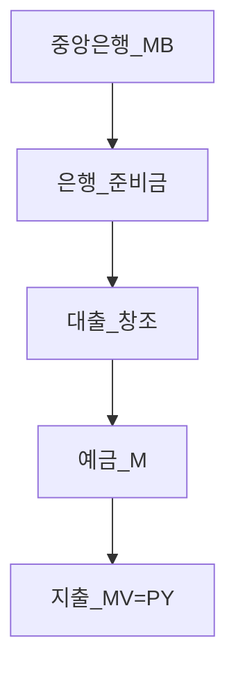
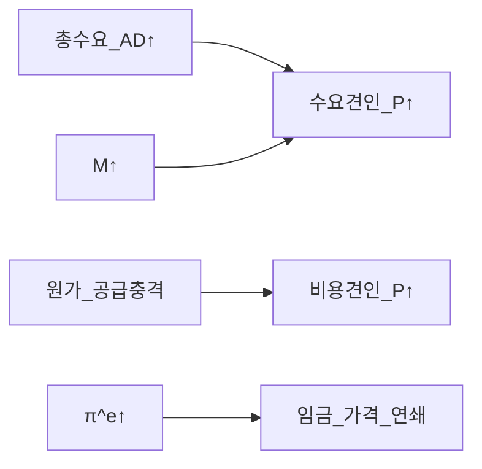
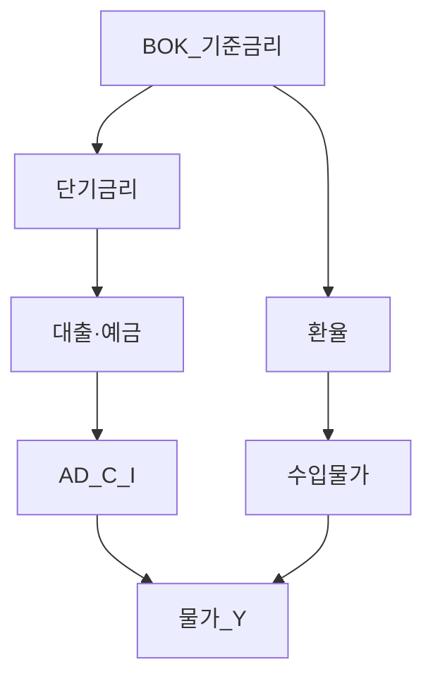

# 거시경제 02 — 화폐·인플레이션·기대·피셔

> **면책**: 본 문서는 교육 목적이며, 특정 개인·법인에 대한 투자·세무·법률 자문이 아닙니다. 제도·세율·상품 조건은 변경될 수 있으므로 실행 전 공식 출처를 확인하세요.

## 메타

| 항목 | 내용 |
|------|------|
| 최종 검증일 | 2026-05-24 |
| 정책·법령 기준일 | 2025-12-31 확정, 2026 개편은 본문 표기 |
| 난이도 | L4 (Graduate) — [READER-GUIDE](../docs/READER-GUIDE.md) |
| 예상 읽기 시간 | 160~190분 |
| 관련 bucket | Bucket 0~2 (현금·채권·금리), Bucket 3 (성장주 할인율) |

## 0. 이 편 읽기 전 (5분)

| 항목 | 내용 |
|------|------|
| **난이도** | L4 (Graduate) — [READER-GUIDE §L등급](../docs/READER-GUIDE.md) |
| **선수** | [macro-01-gdp-accounts-growth](macro-01-gdp-accounts-growth.md), [macroeconomics-basics](macroeconomics-basics.md) |
| **이번 편에서 쓰는 기호** | 본문 §4·§4a 표 참고 |
| **복습 한 줄** | L3 선수 편을 먼저 읽으면 수식이 수월함 |

## TL;DR

1. **화폐**는 교환·가치저장·가치척도 — **현대**는 중앙은행 **기축통화** + **은행예금**이 거래의 대부분.
2. **거래량 방정식** \(MV=PY\) — \(M\)·\(V\)·\(Y\)·\(P\) 중 **어느 것이 조정**하느냐가 **초인플레** vs **디플레** 논쟁의 핵심.
3. **통화승수** \(M=m \cdot MB\) — **준비금·규제**가 \(m\) 을 정함; **양적완화**는 **기초통화·대차대조표** 확대.
4. **인플레** = **수요견인** vs **비용견인**; **필립스**는 단기 **트레이드오프**, 장기 **수직**.
5. **기대증강 필립스** + **피셔 방정식** \(i \approx r + \pi^e\) — **명목금리**·**실질금리**·**채권·주식** 가격의 거시 기초.

---

## 1. 한 줄 정의 + 왜 중요한가

**정의**: **화폐·금융 거시(Money & Inflation)** 는 **통화 공급**, **물가 수준**, **명목·실질 금리**, **중앙은행 정책**이 **총수요·기대**와 맞물리는 과정을 다룬다.

!!! info "Bucket"
    시간·목적별 **자금 슬롯**(0 비상금 → 3 코어 등)

!!! info "ETF"
    지수·자산 **바구니**를 한 종목처럼 거래

**왜 중요한가**: **Bucket 2**(현금·채권)와 **Bucket 3**(주식·ETF)의 **할인율**은 **실질금리**·**인플레 기대**에 민감하다. 한국 **가계부채·변동금리**, **반도체·배터리 CAPEX**([micro-05](micro-05-sector-applications.md))는 **금리·신용** 경로로 **이익**이 바뀐다. [macro-01](macro-01-gdp-accounts-growth.md) **실질 GDP**와 함께 **물가**를 보면 “**스태그플레이션**” vs “**금리 인하 랠리**” 구분이 가능하다.

---

## 2. 선수 지식 / 이후 읽을 것

**선수**:
- [macro-01-gdp-accounts-growth](macro-01-gdp-accounts-growth.md)
- [macroeconomics-basics](macroeconomics-basics.md)
- [debt-and-interest](../01-foundations/debt-and-interest.md)

**이후**:
- [macro-03-is-lm-ad-as](macro-03-is-lm-ad-as.md) (예정)
- [macro-04-monetary-policy-qe](macro-04-monetary-policy-qe.md) (예정)
- [bonds-fixed-income](../03-markets/bonds-fixed-income.md) (예정)
- [macro-06-asset-prices-macro](macro-06-asset-prices-macro.md) (예정)

---

## 3. 직관·비유

**MV=PY = 같은 캐시레지스터**: 한 기간 **돈이 돌아가는 속도(V)** × **돈(M)** = **물가 P** × **실물거래 Y**. **M을 2배**만 찍고 **V,Y 고정**이면 **P 2배** — **양적이론** 극단. 현실은 **V,Y가 반응** — 단기 **Y**↑, 장기 **P**↑.

**통화승수 = 돈 거울**: 중앙은행 **기초통화(MB)** 가 **은행**을 통해 **예금**으로 **확대**. **준비금**·**규제**·**신용**이 깨지면 **승수 붕괴**.

**필립스 = 단기 “실업 줄이면 물가 오른다”**: 정책이 **수요를 밀면** **u↓, π↑**. 장기에는 **기대**가 **적응**해 **곡선 수직** — **인플레만** 남음.

**피셔 = 명목금리는 실질+기대인플레**: 예금 **10%**, 기대인플레 **8%** → **실질 약 2%**. **기대**가 틀리면 **실질** **깜짝** 변동 — **채권 손실**.

**초인플레 = 돈에 대한 믿음 붕괴**: **V 폭주**·**M 폭주** — **가격 매일** — **실물 경제** **달러화**.

---

**이 모형이 말하는 것**: 수식은 계산 절차이고, 경제 직관은 「누가 이득·손해를 보는가」「어떤 가정이 깨지면 결론이 뒤집히는가」다. 유도 각 단계마다 **가정**을 한 줄로 적어 본다.
## 4. 정식 개념·용어

| 용어 | English | 정의 |
|------|---------|------|
| 기축통화 | Base money | MB, 준비금+현금 |
| 광의통화 | Broad money | M2 등 |
| 거래량 방정식 | Quantity equation | MV=PY |
| 통화승수 | Money multiplier | M/MB |
| 중앙은행 대차대조표 | CB balance sheet | 자산=부채+자본 |
| 수요견인 인플레 | Demand-pull | AD>AS |
| 비용견인 인플레 | Cost-push | 비용↑ |
| 필립스 곡선 | Phillips curve | u와 π 관계 |
| 기대 | Expectations | π^e |
| 피셔 방정식 | Fisher equation | i≈r+π^e |
| 초인플레 | Hyperinflation | 극단적 π |
| 실질금리 | Real interest rate | i-π^e |

### 4a. 핵심 용어 (본문 등장 순)

> 복습용. 정의는 §4 본표·[glossary](../00-roadmap/glossary.md)·본문 `!!! info` 박스.

| 용어 | 한 줄 | 관련 이론 | glossary |
|------|-------|-----------|----------|
| 기축통화 | MB, 준비금+현금 | §4 | [glossary](../00-roadmap/glossary.md#기축통화) |
| 광의통화 | M2 등 | §4 | [glossary](../00-roadmap/glossary.md#광의통화) |
| 거래량 방정식 | MV=PY | §4 | [glossary](../00-roadmap/glossary.md#거래량-방정식) |
| 통화승수 | M/MB | §4 | [glossary](../00-roadmap/glossary.md#통화승수) |
| 중앙은행 대차대조표 | 자산=부채+자본 | §4 | [glossary](../00-roadmap/glossary.md#중앙은행-대차대조표) |
| 수요견인 인플레 | AD>AS | §4 | [glossary](../00-roadmap/glossary.md#수요견인-인플레) |
| 비용견인 인플레 | 비용↑ | §4 | [glossary](../00-roadmap/glossary.md#비용견인-인플레) |
| 필립스 곡선 | u와 π 관계 | §4 | [glossary](../00-roadmap/glossary.md#필립스-곡선) |
| 기대 | π^e | §4 | [glossary](../00-roadmap/glossary.md#기대) |
| 피셔 방정식 | i≈r+π^e | §4 | [glossary](../00-roadmap/glossary.md#피셔-방정식) |
| 초인플레 | 극단적 π | §4 | [glossary](../00-roadmap/glossary.md#초인플레) |
| 실질금리 | i-π^e | §4 | [glossary](../00-roadmap/glossary.md#실질금리) |

---

## 5. 메커니즘

### 5.1 화폐·신용 창조

### 5.2 인플레 원인

### 5.3 필립스 단기·장기

| | 단기 SRPC | 장기 LRPC |
|--|-----------|-----------|
| 정책 | u↓ tradeoff | u=자연실업 |
| 기대 | 주어진 π^e | π^e=π |
| 곡선 | 기울기<0 | 수직 |

---

## 6. 수식·모델

### 6.1 거래량 방정식

| 기호 | 이름 | 이 식에서 의미 |
|------|------|----------------|
|------|------|----------------|
|------|------|----------------|
| 기호 | 이름 | 이 식에서 의미 |
|------|------|----------------|
| \(r\) | 할인율·수익률 | 기간당 이자·요구수익률 |
| \(n\) | 기간 | 연·월 등 복리·할인에 쓰는 횟수 |
| \(PV\) | 현재가치 | 오늘 시점으로 환산한 금액 |
| \(FV\) | 미래가치 | 미래 시점의 목표·결과 금액 |

\[
MV = PY
\]

**읽는 법**: **MV**와 **PY**의 관계를 위 식으로 쓴다. 경제·재무 해석은 변수표 「이 식에서 의미」와 [DEPTH-STANDARD](../docs/DEPTH-STANDARD.md) 기호 예제를 맞춘다.
**유도 (L4)**:
1. **정의**: **MV**, **PY**, **dot**를 동일 시점·동일 통화로 맞춘다. — 단위 불일치면 식이 무의미해진다.
2. **식 변형**: 양변을 정리해 목표 변수를 한쪽에 둔다. — 할인·복리는 **시점 이동**이 핵심이다.
3. **해석**: 부호·크기가 경제 직관과 맞는지 확인한다. — 극단값에서 단조성·한계를 점검한다.

로그미분(근사): \(\dot{M} + \dot{V} = \dot{P} + \dot{Y}\).

**고인플레**: \(\dot{M}\) 크고 \(\dot{V}\) 가속 → \(\dot{P}\) 폭발.

### 6.2 통화승수 (교육용)

| 기호 | 이름 | 이 식에서 의미 |
|------|------|----------------|
| \(r\) | 할인율·수익률 | 기간당 이자·요구수익률 |
| \(n\) | 기간 | 연·월 등 복리·할인에 쓰는 횟수 |
| \(PV\) | 현재가치 | 오늘 시점으로 환산한 금액 |

\[
M = m \cdot MB,\quad m = \frac{1+c}{c+r}
\]

**읽는 법**: **r**와 **n**의 관계를 위 식으로 쓴다. 경제·재무 해석은 변수표 「이 식에서 의미」와 [DEPTH-STANDARD](../docs/DEPTH-STANDARD.md) 기호 예제를 맞춘다.
**유도 (L4)**:
1. **정의**: **r**, **n**, **PV**를 동일 시점·동일 통화로 맞춘다. — 단위 불일치면 식이 무의미해진다.
2. **식 변형**: 양변을 정리해 목표 변수를 한쪽에 둔다. — 할인·복리는 **시점 이동**이 핵심이다.
3. **해석**: 부호·크기가 경제 직관과 맞는지 확인한다. — 극단값에서 단조성·한계를 점검한다.
\(c\): **현금보유율**, \(r\): **준비금률**. **QE**: MB↑ — **m 불변**이면 M↑; **위기**에 **m↓** (신용 경색).

### 6.3 중앙은행 대차대조표 (개념)

**자산**: 국채, 대출, **외환**. **부채**: **현금·준비금**. **QE** = 자산↑ → 부채(준비금)↑.

### 6.4 기대증강 필립스 곡선

| 기호 | 이름 | 이 식에서 의미 |
|------|------|----------------|
| \(r\) | 할인율·수익률 | 기간당 이자·요구수익률 |
| \(n\) | 기간 | 연·월 등 복리·할인에 쓰는 횟수 |
| \(PV\) | 현재가치 | 오늘 시점으로 환산한 금액 |

| 기호 | 이름 | 이 식에서 의미 |
|------|------|----------------|
| \(r\) | 할인율·수익률 | 기간당 이자·요구수익률 |
| \(n\) | 기간 | 연·월 등 복리·할인에 쓰는 횟수 |
| \(PV\) | 현재가치 | 오늘 시점으로 환산한 금액 |

\[
\pi = \pi^e - \beta(u - u^n) + \varepsilon
\]

**읽는 법**: 시장 초과수익에 대한 민감도가 **β**다. **R_f**·**ERP**와 함께 요구수익 **r**을 구성한다. [DEPTH-STANDARD](../docs/DEPTH-STANDARD.md) 참고.
**유도 (L4)**:
1. **정의**: **r**, **n**, **PV**를 동일 시점·동일 통화로 맞춘다. — 단위 불일치면 식이 무의미해진다.
2. **식 변형**: 양변을 정리해 목표 변수를 한쪽에 둔다. — 할인·복리는 **시점 이동**이 핵심이다.
3. **해석**: 부호·크기가 경제 직관과 맞는지 확인한다. — 극단값에서 단조성·한계를 점검한다.

**적응기대| 기호 | 이름 | 이 식에서 의미 |
|------|------|----------------|
|------|------|----------------|
|------|------|----------------|
|------|------|----------------|
|------|------|----------------|
**: \(\pi^e_t = \pi_{t-1}\) → **지속적** 과열 시 **π^e** 상승 → **SRPC 위로** → **장기** **u^n** 복귀, **π**만 높음.

**합리적 기대**: \(\pi^e = E[\pi|\mathcal{I}]\) — **정책 신뢰**·**통화정책 규칙**.

### 6.5 피셔 방정식 유도

**목표**: 소비자가 **1기간** 소비·저축. **실질** 최적화에서 **실질금리** \(r\) 결정. **명목** 계약 시:

| 기호 | 이름 | 이 식에서 의미 |
|------|------|----------------|
| \(r\) | 할인율·수익률 | 기간당 이자·요구수익률 |
| \(n\) | 기간 | 연·월 등 복리·할인에 쓰는 횟수 |
| \(PV\) | 현재가치 | 오늘 시점으로 환산한 금액 |

\[
1+i = (1+r)(1+\pi^e) \approx 1 + r + \pi^e
\]

**읽는 법**: **명목** 수익에서 **인플레**를 반영하면 **실질** 체감 수익을 본다. 정밀식은 본문 또는 §4 표를 따른다.
**유도 (L4)**:
1. **정의**: **r**, **n**, **PV**를 동일 시점·동일 통화로 맞춘다. — 단위 불일치면 식이 무의미해진다.
2. **식 변형**: 양변을 정리해 목표 변수를 한쪽에 둔다. — 할인·복리는 **시점 이동**이 핵심이다.
3. **해석**: 부호·크기가 경제 직관과 맞는지 확인한다. — 극단값에서 단조성·한계를 점검한다.
따라서 **근사**:

| 기호 | 이름 | 이 식에서 의미 |
|------|------|----------------|
| \(r\) | 할인율·수익률 | 기간당 이자·요구수익률 |
| \(n\) | 기간 | 연·월 등 복리·할인에 쓰는 횟수 |
| \(PV\) | 현재가치 | 오늘 시점으로 환산한 금액 |

\[
i \approx r + \pi^e
\]

**읽는 법**: **명목** 수익에서 **인플레**를 반영하면 **실질** 체감 수익을 본다. 정밀식은 본문 또는 §4 표를 따른다.
**유도 (L4)**:
1. **정의**: **r**, **n**, **PV**를 동일 시점·동일 통화로 맞춘다. — 단위 불일치면 식이 무의미해진다.
2. **식 변형**: 양변을 정리해 목표 변수를 한쪽에 둔다. — 할인·복리는 **시점 이동**이 핵심이다.
3. **해석**: 부호·크기가 경제 직관과 맞는지 확인한다. — 극단값에서 단조성·한계를 점검한다.

**실질금리**: \(r \approx i - \pi^e\). **예상 밖** 인플레 \(\pi \neq \pi^e\) → **실질** **예상과 다름** — **채권·예금** **서프라이즈**.

**확장**: **세후·리스크프리미엄·유동성** — [bonds](../03-markets/bonds-fixed-income.md).

### 6.6 초인플레 함정 (Cagan 등, 개념)

**실질 화폐수요** \(M/P = f(i)\), \(i \approx \pi\) → **π↑** → **M/P↓** → **더 많은 M** 필요 — **피드백**. **재정적** **재정적자** **화폐화** — **신뢰** 상실.

---

예금** **서프라이즈**.

**확장**: **세후·리스크프리미엄·유동성** — [bonds](../03-markets/bonds-fixed-income.md).

### 6.6 초인플레 함정 (Cagan 등, 개념)

**실질 화폐수요** \(M/P = f(i)\), \(i \approx \pi\) → **π↑** → **M/P↓** → **더 많은 M** 필요 — **피드백**. **재정적** **재정적자** **화폐화** — **신뢰** 상실.

---

## 7. 한국 적용

### 7.1 2025년 기준

| 주제 | 한국 | 투자 |
|------|------|----------------|
| 기준금리 | 한국은행 BOK | **변동금리 부채** |
| CPI | 통계청, **OER** 논쟁 | **체감 vs 지표** |
| M2 | 광의통화 | **신용·부동산** |
| 환율 | 개방경제 | **수입 물가** |
| 가계부채 | C·주택 | **금리 민감** |

**수출 기업**: **원화 약세** → **수출가(원화)** ↑ vs **수입 원자재** — [macro-05](macro-05-open-economy-fx.md) 예정.

### 7.2 2026년 개편·시행 예정

| 항목 | 2025 | 2026 |
|------|------|----------------|
| 통화정책 | BOK 금리 경로 | **인플 목표**·**닷플롯** 추적 |
| CPI 통계 | 바구니 개정 주기 | **OER·디지털** 반영 논의 |

**법·출처**: 「한국은행법」, 통계청 CPI — [references/sources.md](../references/sources.md).

### 7.3 인플레·섹터 연결

| 인플레 유형 | 섹터 영향 |
|-------------|-----------|
| 수요견인 | **마진**↑ 가능, **금리**↑ 압력 |
| 비용견인 | **마진** 압박, **임금** |
| 금리↑ | **CAPEX**↓ — [micro-05](micro-05-sector-applications.md) |
| π^e 탈고 | **채권** 손실, **주식** **혼재** |

---

## 8. 숫자 예제 (가상)

### 예제 1 — MV=PY

\(M=1000\), \(V=2\), \(Y=500\) → \(P = MV/Y = 4\). **M 10%↑**, V,Y 고정 → **P 10%↑**.

### 예제 2 — 승수

\(MB=100\), \(c=0.2\), \(r=0.1\) → \(m \approx 3.43\), \(M \approx 343\).

### 예제 3 — 필립스

\(u^n=4\%\), \(\pi^e=3\%\), \(\beta=0.5\), \(u=3\%\) → \(\pi = 3 - 0.5(-1) = 3.5\%\).

**u=3%** 2년 지속, 적응 \(\pi^e\to 3.5\%\) → **SRPC** 상승, **장기** **π**만 3.5%.

### 예제 4 — 피셔

\(i=5\%\), \(\pi^e=3.5\%\) → \(r \approx 1.5\%\). **실제** \(\pi=5\%\) → \(r_{ex post} \approx 0\%\) — **예금자** 손해.

### 예제 5 — 초인플레 (가상)

월 \(\pi=50\%\) → **연 환산** 극대. **M** **주간** 인쇄 — **V** **현금 거부** — **실물** **달러화**.

---

## 9. FAQ

**Q1. M2↑면 주식↑?**  
**A1.** **단기** 유동성↑ 가능, **장기**는 **π·금리** 반응 — **직결 아님**.

**Q2. QE=인플레?**  
**A2.** **2008~** **π** 완만 — **V↓**, **유동성 함정**·**신용**. **재정+공급충격** 2021~ **π** 상승.

**Q3. CPI vs 생활비?**  
**A3.** **바구니·OER** — **식료·전기** **체감** 괴리. **정책**은 **CPI** 목표.

**Q4. 필립스 죽었나?**  
**A4.** **단기** 관계는 **변동** — **글로벌화·기대** — **장기 수직** 논리는 **유효**.

**Q5. i↑면 주식↓?**  
**A5.** **할인율**↑ — **성장주** **민감** — **이익** 동반↑면 **상쇄** 가능.

**Q6. 실질금리 음수?**  
**A6.** \(i < \pi^e\) — **부채자** 유리, **채권** 불리 — **2020~** 구간.

**Q7. 한국 **수입 인플레**?**  
**A7.** **원화·유가·식량** — **비용견인** — **BOK** **환율** 고려.

**Q8. 초인플레 투자?**  
**A8.** **실물·외화·지수화** — **현금 보유** **최악** — **교육** 시나리오만.

---

## 10. 함정·리스크·한계

- **MV=PY** **인과** 단순화 — **역인과**·**내생 M**  
- **필립스** **표본** **변화**  
- **π^e** **측정** 어려움 — **브레이크이븐** **프록시**  
- **피셔** **세금·프리미엄** 생략  
- **초인플레** **한국** **현실** **낮음** — **학습**용  
- **투자**: **금리 전망** **확신** **과다**

---

**Q. 실무에서는?**  
교과서 식·기호를 그대로 적용하기 전에 **수수료·세금·데이터 시점**을 분리한다. 숫자는 [DEPTH-STANDARD](../docs/DEPTH-STANDARD.md)처럼 기호만 먼저 맞추고, 법령·시장 수치는 §8 표·외부 출처로 갱신한다.

## 11. 심화 읽기

- Friedman, *Quantity Theory*  
- Phillips (1958); Friedman-Phelps (기대)  
- Fisher (명목·실질)  
- Mankiw, Blanchard  
- [macro-04-monetary-policy-qe](macro-04-monetary-policy-qe.md) (예정)  
- [references/sources.md](../references/sources.md)

---

## 연습문제 (L4, 기호)

1. 위 §6 주요 식에서 변수 하나를 미지로 두고, 나머지를 기호로 둔 **관계식**을 쓰시오.
2. 가정이 깨질 때(유동성·세금·다중 IRR 등) 위 식의 **한계**를 기호·부등식으로 서술하시오.
3. §8 예제와 동일 기호(M·P·PV 등)로 **부호·단조성**만 검증하는 짧은 논증을 하시오.

### 해설 키

1. 직전 변수표의 「이 식에서 의미」를 이용해 동일 차원으로 정리한다.
2. 「가정이 깨지면」 절의 한계 사례와 연결한다.
3. 숫자 대입 없이 **부호**·**단위** 일치만 확인한다.
## 12. 스스로 점검 퀴즈

1. MV=PY 각 변수 **1문장** 정의.  
2. **M 20%↑** V,Y 고정 → P?  
3. **i=4%, π^e=2%** → r?  
4. **u<u^n** 단기 π?  
5. **적응기대** 2년 과열 결과.  
6. **비용견인** vs **수요견인** 예 1개씩.  
7. **QE**가 **MB**에 미치는 효과.  
8. **초인플레** **V** 역할.

??? note "정답 힌트"

    1. M통화, V회전, P물가, Y실질  
    2. 20%  
    3. ≈2%  
    4. π↑  
    5. π^e↑, SRPC↑  
    6. 유가 vs 재정  
    7. MB↑  
    8. V 폭주·현금 기피

---

### 6.7 화폐의 기능 심화

| 기능 | 내용 | 붕괴 시 |
|------|------|----------------|
| 교환매개 | 거래 비용↓ | 물물교환·외화 |
| 가치저장 | 구매력 보존 | **π** 폭등 시 **거부** |
| 가치척도 | 가격 표시 | **재가격** **비용** |
| 지급결제 | 최종결제 | **시스템** **리스크** |

**법정통화** + **예금보험** + **BOK** **최종대출자** = **신뢰** **인프라**.

### 6.8 중앙은행 대차대조표 (교육용 표)

| 자산 | 부채·자본 |
|------|-----------|
| 국채 (OMO) | 현금·준비금 |
| 외환 | 발행통화 |
| 대출(은행) | 정부예금 등 |

**QE**: **국채 매입** → **준비금↑** → **금리** **하락** 압력 — **은행** **대출** **의지** **별개**.

### 6.9 수요견인 vs 비용견인 비교

| | 수요견인 | 비용견인 |
|--|----------|----------|
| 원인 | AD↑, M↑ | 원유·임금·환율 |
| 성장 | Y↑ 가능 | Y↓ **스태그** |
| 정책 | 긴축 **지연** | **공급** **정책** |
| 한국 예 | 재정·수출 호황 | **유가·원자재** |

### 6.10 기대형성 3형태

| 유형 | π^e | 정책 함의 |
|------|-----|-----------|
| 적응 | 과거 π | **지연** **인식** |
| 정적 | 고정 | **체계적** **오차** |
| 합리 | 모형·정보 | **신뢰** **중요** |

**한국**: **통화정책** **신뢰** → **π^e** **앵커** — **브레이크이븐** **인플레** **추적**.

### 6.11 피셔 확장·채권 가격

**1기간 제로쿠폰**: \(P = 
rac{1}{1+i}\). **i↑** → **P↓**. **i ≈ r + π^e** 에서 **π^e↑** → **i↑** (정책 **반응**) → **채권** **이중** **타격** 가능.

**주식**: **할인율** + **이익**. **금리↑** **단독** **해석** **금지** — [macro-06](macro-06-asset-prices-macro.md) 예정.

### 6.12 초인플레·하이퍼인플레 함정 (상세)

| 단계 | 메커니즘 | 자산 |
|------|----------|------|
| 재정적자 화폐화 | M↑ | 현금 **가치** ↓ |
| π^e 적응 | SRPC↑ | **명목** **i** **추격** |
| V 가속 | **현금** **기피** | **실물**·**외화** |
| 달러화 | **계약** **재편** | **수입** **중단** |

**투자 교육**: **현금** **장기** **보유** **위험** — **한국** **현실** **낮은** **π** — **시나리오** **분석**만.

### 부록 — 통화정책 전파 경로

**한국**: **가계부채** → **전파** **약화** 구간 — **금리** **인하** **해도** **C** **제한**.

### 부록 — 인플레 목표와 실업 (장기)

**장기**: LRPC at **u^n**. **인플 목표** **2%** (한국 **중기** **목표** **맥락**) — **π^e** **고정** **시** **단기** **정책** **공간**.

---

## 부록 G — 화폐공급 측정 M0·M1·M2 (교육용)

| 지표 | 포함 대략 | 경제 해석 |
|------|-----------|-----------|
| M0 | 통화발행·현금 | 유동성 최고 |
| M1 | M0+요구불 | 결제·단기 |
| M2 | M1+저축성 | 광의 유동성 |

**M2 성장률**이 **신용·자산시장**과 동행하나, **주가**와 **1:1** 아님. **속도 V** 변동이 **MV=PY**를 **왜곡**.

## 부록 H — 금리 기간구조 (개념)

**장기금리** ≈ **단기** + **기대 인플** + **텀프리미엄**. **BOK**가 **단기**를 올리면 **장기** 반응은 **π^e**·**성장 기대**에 달림. **채권** 투자는 [bonds](../03-markets/bonds-fixed-income.md) (예정) — **듀레이션** **리스크**.

## 부록 I — 스태그플레이션·디스인플레 (교육용)

**스태그**: **Y↓ 또는 저성장** + **π↑** — **비용충격** + **잘못된** **수요** **정책** **조합**. **디스인플**: **π<0** — **채무** **실질** **부담** ↑ — **탈** **디스인플레** **정책** **논쟁**.

**한국**: **유가·환율** **비용** + **성장** **둔화** **구간** — **BOK** **딜레마**.

## 부록 J — 피셔·IS-LM 연결 (예고)

**IS-LM**([macro-03](macro-03-is-lm-ad-as.md))에서 **LM** **기울기**·**π^e**가 **명목 i**를 정하고, **IS**가 **Y**를 정한다. **피셔**는 **LM** **측** **기대** **연결**. **통합** **프레임**: **정책금리** → **i** → **I, C** → **Y** → **π** → **π^e** **피드백**.

## 부록 K — 인플레 목표·실업 (한국 맥락)

**한국은행** **물가안정목표** **체계** — **중기** **인플** **목표**와 **성장** **전망** **공표**. **시장**은 **dot plot** **유사** **자료** **해석**. **투자**: **금리** **경로** **서프라이즈** = **채권** **변동성**.

## 부록 L — 하이퍼인플레 역사 교훈 (교육, 일반론)

**재정** **지속** **적자** **통화** **재원** → **M** **급증** → **π^e** **적응** **실패** → **V** **가속**. **자산**: **실물**·**외화**·**지수화** **계약**. **한국** **현재** **π** **안정** — **시나리오** **스트레스** **테스트**만.

## 부록 M — 수요·비용 인플레 사례 표 (가상)

| 사건 유형 | 메커니즘 | 정책 | 자산 |
|-----------|----------|------|------|
| 재정 확대 | AD↑ | 금리? | 주식·채권 혼재 |
| 유가 급등 | AS↓ | 보조? | 에너지·화학 |
| 환율 약세 | 수입 P↑ | 금리↑? | 수출주·인플 |
| 임금 급등 | 비용↑ | 생산성 | 마진 압박 |

## 부록 N — 기대증강 필립스 수치 연습

\(\pi_t = \pi_{t-1} - 0.4(u_t - 4) + \varepsilon_t\). **u=3%** 1년 → \(\pi\) **0.4%p** **상승** **압력**. **2년** **지속** → \(\pi^e\) **적응** → **추가** **인상** — **BOK** **인하** **공간** **축소**.

---

## 부록 O — 화폐창조 과정 단계별 (교육용)

**1단계**: **BOK** **OMO**·**대출** → **은행** **준비금** **↑**. **2단계**: **은행** **신용** **심사** → **대출** **창조** → **차주** **예금** **↑** (**M2**). **3단계**: **차주** **지출** → **수취인** **예금** **이동** (**총량** **유지**). **4단계**: **상환** 시 **M** **축소**. **위기**: **신용** **경색** → **m** **↓** → **QE** **필요** ([macro-04](macro-04-monetary-policy-qe.md) 예정).

## 부록 P — 유동성 함정 (개념)

**유동성** **함정**: **i** **하한** **근처**에서 **M** **↑**해도 **V** **↓**·**I** **정체** — **π** **낮음**. **일본** **경험** — **한국** **장기** **저금리** **구간** **논의**. **주식**: **유동성** **만**으로 **랠리** **설명** **시** **실질** **Y** **확인**.

## 부록 Q — 비뉴얼리즘 vs 통화주의 (교육)

**통화주의**: **장기** **M** **→** **P**. **비뉴얼리즘**: **V** **불안정**, **금본위** **이탈** **후** **관계** **약화**. **실무**: **단기** **수요** **중심** **분석** + **장기** **M2** **모니터**.

## 부록 R — 금리·부채·한국 가계 (교육)

**가계** **부채** **서비스** **비율** **↑** → **금리** **0.25%p** **인상**이 **가처분** **소득** **잠식**. **변동** **주담대** — **BOK** **인상** **속도** **제약**. **주식**: **내수** **소비** **주** vs **수출** **주** **분리** ([macro-01](macro-01-gdp-accounts-growth.md)).

## 부록 S — 인플레 스왑·브레이크이븐 (개념)

**시장** **기대** **추정**: **동일** **만기** **명목**·**실질** **국채** **수익률** **차** → **π^e** **프록시**. **한국** **국고채** **시장** **유동성** **고려**. **투자**: **π^e** **상승** → **장기** **i** **상승** **압력**.

## 부록 T — 코로나·공급망·인플 (일반론 교육)

**수요** **급감** **후** **재정**·**M** **확대** + **공급** **병목** → **2021~** **π** **급등** — **수요**·**비용** **동시**. **정책**: **긴축** **시차** — **성장주** **할인율** **변동** ([macro-06](macro-06-asset-prices-macro.md) 예정).

## 부록 U — 피셔 vs 타르플 (교육)

**타르플**: **i** **> ** **g** (명목성장) → **재정** **지속가능** **논쟁**. **피셔**: **i** **vs** **π^e**. **혼동** **금지** — **주식** **g**는 **이익** **성장**, **GDP** **g**와 **다름**.

## 부록 V — 통합 연습 (가상)

**주어**: **M2** **+8%**, **Y** **+2%**, **V** **-1%**, **π** **?**  
**근사**: **8 -1 ≈ 2 + π** → **π ≈ 5%**. **실제**: **V** **불확실**. **BOK** **대응**: **i** **+**? — **피셔** **i ≈ r + π^e** **검증**.

## 부록 W — 자산별 인플레 민감도 (교육)

| 자산 | π↑ | i↑ (정책 반응) |
|------|-----|----------------|
| 현금 | - | - |
| 채권 | - | -- |
| 주식 | 혼재 | - (할인) |
| 실물·원자재 | + | ? |
| 부동산 | 혼재 | - (대출) |

**한국**: **아파트**·**전세** — **금리** **민감** — **거시** **문법** **필수**.

---

## 부록 X — 인플레이션 목표제·신뢰 (교육용 장문)

현대 **중앙은행**은 **물가안정** **목표** **아래** **기대인플레** \(\pi^e\)를 **앵커링**하려 한다. **시장**이 **중앙은행**을 **신뢰**하면 **SRPC**가 **아래로** **이동**해 **같은** **실업**에서 **더** **낮은** **π**를 **얻거나**, **같은** **π**에서 **더** **낮은** **실업**을 **얻는** **여지**가 **생긴다** (**신뢰** **프리미엄**). **신뢰** **상실** 구간 — **π^e** **탈고** — **긴축** **정책** **비용** **급증** — **채권** **롱** **손실** **확대**.

**한국은행** **통화정책방향** **성명**·**경제전망**·**금통위** **의사록**은 **π^e** **형성** **재료**. **투자자**는 **“금리** **동결”** **헤드라인**만 **보지** **말고**, **“인플** **전망** **상향** **여부”** **문장**을 **찾는다** — **피셔** **관점**에서 **동결**이어도 **π^e** **↑**면 **장기** **i** **↑** **압력**.

## 부록 Y — 실질금리와 자산배분 (교육)

**실질** **r** **<** **0**: **차입** **투자** **유인** **↑** **단** **금융** **자산** **실질** **수익** **↓**. **실질** **r** **> ** **성장** **g** (이익): **밸류에이션** **압박** **논의**. **주식** **장기** **수익**은 **이익** **성장** + **배당** − **할인** **변화** — **피셔** **한** **줄**로 **끝나지** **않음**.

## 부록 Z — 글로벌 인플·한국 (교육)

**미국** **π**·**연준** **금리** → **환율**·**자본** **유출입** → **한국** **i** **하한** **제약** (**carry** **역전** **구간**). **수입** **인플** **전이** — **원자재** **달러** **가격** × **환율**. **수출** **기업** **원화** **매출** **vs** **달러** **원가** — **마진** **분해** ([micro-05](micro-05-sector-applications.md)).

## 부록 AA — 하이퍼인플레이션 투자 교육 시나리오 (가상, 극단)

**가정**: **월** **π** **20%**, **M** **주간** **20%** **증가**, **V** **가속**. **행동**: **현금** **최소화**, **실물** **재고** **리스크**, **외화** **계약** **가능** **범위** **내** **분산**. **한국** **현실** **적용** **아님** — **스트레스** **테스트** **문해력** **목적**.

## 부록 AB — 필립스·피셔·정책 순서 (교육)

1. **공급** **충격** → **π** **↑**  
2. **π^e** **적응** (지연)  
3. **BOK** **i** **↑**  
4. **r** **↑** (π^e **반영** **후**)  
5. **I, C** **↓** → **Y** **↓**  
6. **π** **완화** (시차)

**섹터**: **금리** **민감** **CAPEX** **주** **먼저** **조정**, **내수** **소비** **지연** **반응**.

---

## 부록 AC — 디지털 화폐·준비금 (개념, 교육)

**CBDC** **논의**는 **M0**·**결제** **인프라** — **π** **직접** **레버** **아님**. **준비금** **요건** **완화**는 **m** **↑** — **신용** **여건** **동반**. **금융** **규제** **변화**는 **통화승수** **붕괴**·**회복** — **M2** **성장**과 **GDP** **괴리** **모니터**.

## 부록 AD — 인플레 목표 2%와 한국 (교육)

**2%** **목표**는 **π^e** **앵커** — **0%** **목표** **비현실** (**측정** **편향**). **한국** **중기** **목표** **체계** — **성명**에서 **목표** **수준**·**허용** **밴드** **확인**. **투자**: **목표** **상향** **시사** → **장기** **i** **구조** **상향** **가능**.

## 부록 AE — 채권·예금·피셔 연습 (가상)

**예금** **연** **3%**, **π^e** **2.5%** → **실질** **약** **0.5%**. **채권** **10년** **4%**, **π^e** **2.5%** → **실질** **약** **1.5%**. **π** **실현** **4%** → **사후** **실질** **0%** — **재계약** **시** **명목** **i** **상향** **압력**.

---

## 부록 AF — 학습 로드맵 연계

본 문서는 [02-economics/README](README.md) **거시 2주차**다. **필수 유도**: §6.5 피셔 \(i pprox r + \pi^e\)를 **1기간** **소비저축** **그림**으로 손그림. **필립스** §6.4에 **u=3%** **2년** **시나리오** 표 작성. **다음**: [macro-03-is-lm-ad-as](macro-03-is-lm-ad-as.md) (예정). **한국**: BOK **통화정책방향** **최신** **1건** — **π** **전망** **문장** **밑줄** (교육). **자산**: [debt-and-interest](../01-foundations/debt-and-interest.md) **변동금리** **민감도** **복습**.

## 부록 AG — 용어 교차 (glossary)

Money multiplier, Quantity equation, Phillips curve, Fisher equation, Demand-pull inflation, Cost-push inflation, Hyperinflation, Real interest rate, Central bank balance sheet, Inflation expectations — [references/sources.md](../references/sources.md)와 동기화.

## 부록 AH — 인플레·금리·섹터 CAPEx (교육 요약)

**금리 인상 국면**: [micro-05](micro-05-sector-applications.md) **표 6.5** — 배터리·반도체 **I↓** 선행, **전력** **요금**·**투자** **규제** **지연**. **금리 인하 국면**: **할인율** **완화**는 **성장주**에 **우호**이나 **π^e** **재상승** **시** **채권** **변동성** **주의**. **통합**: **MV=PY**로 **M** **성장**만 **보고** **주식** **매수** **금지** — **Y**·**V**·**P** **분해** **습관화**. **추가 연습**: BOK **경제전망**에서 **물가**·**성장**·**금리** **전망** **표**를 **복사**해 **π^e**·**r**·**i** **관계**를 **피셔** **식**에 **대입**해 보고, **전망** **변경** **시** **채권**·**성장주** **중** **어느** **쪽**이 **더** **민감**한지 **가설**을 **세운다** (교육용, **매매** **아님**).

---

### 부록 AI — 초인플레이션·자산 보호 (교육, 일반)

역사적 **하이퍼인플레** **사례** **공통점**: **재정** **지속** **적자**, **중앙은행** **독립성** **훼손**, **외화** **부족**, **지수화** **계약** **붕괴**. **투자** **교육** **목적** **시나리오**: **현금** **비중** **최소화**, **분산**, **실물** **현금흐름** **자산** **검토** — **한국** **현재** **통화** **제도** **하** **극단** **시나리오**는 **문해력** **훈련**용. **정상** **인플** **환경**에서는 **현금**·**예금**·**채권**의 **역할** **재평가** ([emergency-fund](../01-foundations/emergency-fund.md)). **요약**: **화폐**는 **신뢰** **위에** **서** 있고, **인플**은 **그** **신뢰**가 **흔들릴** **때** **가장** **비싼** **세금**이다 — **π^e** **관리**가 **자산** **형성**의 **거시** **전제**다. 다음 장 [macro-03-is-lm-ad-as](macro-03-is-lm-ad-as.md)에서 **피셔**·**필립스**를 **IS-LM**·**AD-AS**와 **합친다**. [macro-01](macro-01-gdp-accounts-growth.md)의 **Y**와 **P**를 **동시**에 **결정**하는 **그림**으로 **올린다** (교육용, 필수 읽기).

---

**L4 완료 기준**: [TEMPLATE](../docs/TEMPLATE.md) 12블록·FAQ 8·검증일 2026-05-24 — [DEPTH-STANDARD](../docs/DEPTH-STANDARD.md).