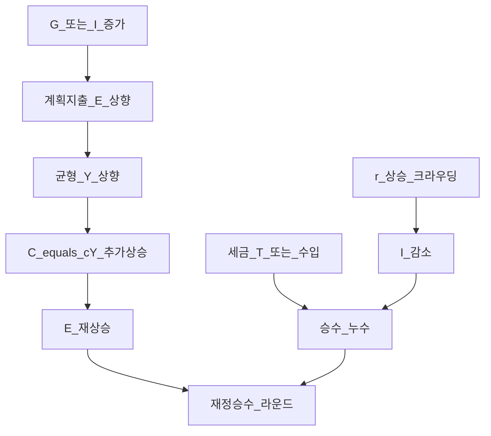
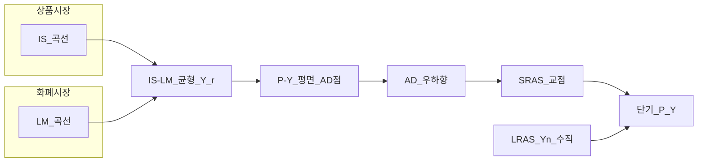
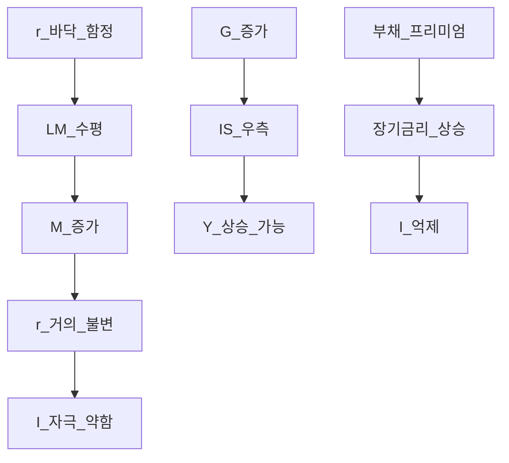

# IS-LM·AD-AS·재정정책 — 케인즈 교차부터 승수·크라우딩아웃까지

> **면책**: 본 문서는 교육 목적이며, 특정 개인·법인에 대한 투자·세무·법률 자문이 아닙니다. 제도·세율·상품 조건은 변경될 수 있으므로 실행 전 공식 출처를 확인하세요.

## 메타

| 항목 | 내용 |
|------|------|
| 최종 검증일 | 2026-05-24 |
| 정책·법령 기준일 | 2025-12-31 확정, 2026 재정·금리 전망은 본문 별도 표기 |
| 난이도 | L4 (Graduate) — [READER-GUIDE](../docs/READER-GUIDE.md) |
| 예상 읽기 시간 | 150~180분 |
| 관련 bucket | Bucket 2b~3 (코어 자산배분·거시 배경), Bucket 0~1 (경제 문법) |

## 0. 이 편 읽기 전 (5분)

| 항목 | 내용 |
|------|------|
| **난이도** | L4 (Graduate) — [READER-GUIDE §L등급](../docs/READER-GUIDE.md) |
| **선수** | [거시경제학 기초](macroeconomics-basics.md), [macro-01-gdp-accounts-growth](macro-01-gdp-accounts-growth.md) |
| **이번 편에서 쓰는 기호** | 본문 §4·§4a 표 참고 |
| **복습 한 줄** | L3 선수 편을 먼저 읽으면 수식이 수월함 |

## TL;DR

1. **케인즈 교차(Keynesian cross)** 는 계획지출 \(E = C + I + G\) 와 45°선(실제 산출 \(Y\))의 교점에서 단기 균형 \(Y^*\) 를 정한다 — **재정승수**는 \(1/(1-MPC)\) 로 시작하되, 금리·수입·세금에서 **축소**된다.
2. **IS 곡선**은 상품시장 균형 궤적: \(r \uparrow \Rightarrow I \downarrow \Rightarrow Y \downarrow\) (우하향). **LM 곡선**은 화폐시장 균형: \(Y \uparrow \Rightarrow L^d \uparrow \Rightarrow r \uparrow\) (우상향).
3. **유동성 함정(liquidity trap)** 에서 LM이 **수평**이면 통화증가가 \(r\) 을 못 내리고 **투자·승수 자극이 약해진다** — 2020년대 일본·유로존·팬데믹 초기 논의와 연결.
4. **IS-LM 교점**을 물가 \(P\) 축에 투영하면 **총수요(AD)** 우하향 곡선; **단기 SRAS**는 우상향, **장기 LRAS**는 잠재산출 \(Y_n\) 에서 **수직** — 정책이 **실물 vs 물가** 중 어디에 작용하는지 갈린다.
5. **재정확대**는 IS를 우로 밀지만 **크라우딩아웃(crowding out)** 으로 \(r \uparrow\), \(I \downarrow\) — 2020s **재정 vs 부채** 논쟁·**한국 재정구조**(추경·SOC·R&D·국채)를 이 프레임으로 읽으면 [자산배분](../04-portfolio/asset-allocation.md)의 **채권·성장주** 비중 해석에 도움이 된다.

---

## 1. 한 줄 정의 + 왜 중요한가

**정의**: **IS-LM 모형**은 **상품시장(IS)** 과 **화폐시장(LM)** 을 동시균형해 단기 균형 **실질산출 \(Y\)** 와 **명목금리 \(r\)** 을 결정하고, 이를 **총수요·총공급(AD-AS)** 프레임에 올려 **재정·통화정책**이 산출·물가·금리에 미치는 방향을 분석하는 **중급·대학원 입문 거시경제**의 핵심 도구이다.

**왜 중요한가** (장기 자산 형성·bucket 연결):

!!! info "M (월지출)"
    월 **세후 실수령**·지출 기준액(교육용 기호)

개별 기업 실적은 [미시경제](microeconomics-basics.md)의 문제지만, **정부 지출·세금·기준금리·국채 발행**은 **전체 경로**를 바꾼다. “추경 발표 → 건설·반도체 주가?” 같은 질문을 **IS 이동 + LM 반응 + AD-AS 물가** 순서로 분해하지 않으면 **단기 수요 호재**와 **금리·채권 역풍**을 동시에 놓치기 쉽다. [거시경제학 기초](macroeconomics-basics.md)에서 배운 \(Y = C+I+G+(X-M)\) 를 **정책이 움직이는 곡선**으로 올리는 것이 L4 목표이며, 결과는 [채권](../03-markets/bonds-fixed-income.md), [자산배분](../04-portfolio/asset-allocation.md), [macro-06-asset-prices-macro](macro-06-asset-prices-macro.md)로 이어진다.

---

## 2. 선수 지식 / 이후 읽을 것

**선수**:
- [거시경제학 기초](macroeconomics-basics.md) — GDP·금리·인플레·\(Y=C+I+G+(X-M)\)
- [macro-01-gdp-accounts-growth](macro-01-gdp-accounts-growth.md) — 국민계정·성장·잠재산출
- [macro-02-money-inflation](macro-02-money-inflation.md) — 화폐·인플레·기대·실질금리
- [복리와 시간가치](../01-foundations/compound-interest-and-time-value.md)
- [미시경제학 기초](microeconomics-basics.md) — 한계 개념·탄력성

**이후**:
- [macro-04-monetary-policy-qe](macro-04-monetary-policy-qe.md) — 통화정책·QE·금융시스템
- [macro-05-open-economy-fx](macro-05-open-economy-fx.md) — 개방경제·환율·삼중곤란
- [macro-06-asset-prices-macro](macro-06-asset-prices-macro.md) — 금리·주가·QQQ
- [채권·고정수익](../03-markets/bonds-fixed-income.md), [자산배분](../04-portfolio/asset-allocation.md)
- [리밸런싱·DCA](../04-portfolio/rebalancing-and-dca.md), [지역 분산](../04-portfolio/geographic-diversification.md)

---

## 3. 직관·비유

**수영장과 배수구 (케인즈 교차·승수)**: 경제를 수영장에 비유하면 **수위 = GDP \(Y\)**, **급수 = 계획지출 \(E\)** 이다. 정부가 **G(수도꼭지)** 를 틀면 처음 물이 들어오고, 가계가 소득 \(Y\) 의 일부를 소비 \(C=cY\) 하면 **물이 다시 순환**한다 — 이 **되돌아오는 물**이 재정승수다. 그러나 배수구(**금리 \(r\)**·**수입·세금·부채 불안**)가 열려 있으면 급수량의 **일부가 새어 나가** 수위 상승은 교과서 승수보다 작아진다. “추경 1조 = GDP 1조 추가” 같은 헤드라인은 **배수구를 무시한 1차 계산**일 때가 많다.

**두 장의 지도를 겹치기 (IS-LM)**: IS는 **“실물 세계”** 지도다 — 금리가 높으면 대출이 비싸져 **투자·주택·재고**가 줄고, 그만큼 **Y가 낮은 조합**만 상품시장이 허용한다. LM은 **“금융 세계”** 지도다 — 산출이 커지면 거래·급여·수입이 늘어 **화폐 수요**가 커지고, 화폐 공급 \(M/P\) 가 고정이면 **금리가 올라야** 화폐시장이 맞춰진다. **정책**은 지도 전체를 밀지 않고 **한 곡선만 이동**시킨다: 재정은 주로 **IS**, 통화는 **LM**. 두 지도의 **교점**이 오늘의 \((Y, r)\) 이다.

**엘리베이터와 천장 (AD-AS·시간축)**: 단기에는 **SRAS(단기 총공급)** 가 완만히 우상향 — 경기가 좋아지면 **임금·가격 협상**이 천천히 따라와 **물가도** 오른다. 장기에는 **LRAS** 가 잠재산출 \(Y_n\) 에서 **수직** — 엘리베이터(AD)를 계속 올려도 **천장(생산능력)** 을 넘어선 **영구적 실물 성장**은 불가능하고, **물가만** 더 오른다. “재정이 성장을 만든다” vs “재정이 인플레만 키운다” 논쟁은 **SRAS vs LRAS** 중 어디에 닿았는가로 정리할 수 있다.

**유동성 함정 = 막힌 배수구 레버 (liquidity trap)**: 금리가 이미 **바닥(영%)** 근처면, 중앙은행이 **통화(M)을 늘려도** 사람·기업·은행이 **채권·현금**만 원하고 대출·투자로 안 넘어간다. LM이 **수평**이면 “레버(통화)”를 당겨도 **배수구(금리)** 가 안 열린다. 이때 **재정(G↑)** 이 IS를 직접 밀어 **유일하게 강한 수요 정책**이 될 **수** 있으나, **부채·장기 금리**라는 다른 배수구가 열릴 수 있다 — 2020년대 선진국 논쟁의 핵심이다.

**한국 프레임 — 수출 엔진과 국내 수도꼭지**: 한국은 **순수출·제조 CAPEX** 비중이 커서, 교과서 **폐쇄경제 IS-LM** 만으로는 부족하다([macro-05](macro-05-open-economy-fx.md)). 그러도 **추경·R&D·SOC·지방 보조**는 **국내 IS** 를 움직이고, **국채 발행**은 **금리·LM** 과 맞물린다. “반도체 패키지 = 해당 섹터만?”이 아니라 **금리 경로 → 전체 I·부동산·가계** 로 번지는지가 [섹터](../03-markets/sectors/sector-investing-framework.md) 분석의 거시 배경이다.

---

**이 모형이 말하는 것**: 수식은 계산 절차이고, 경제 직관은 「누가 이득·손해를 보는가」「어떤 가정이 깨지면 결론이 뒤집히는가」다. 유도 각 단계마다 **가정**을 한 줄로 적어 본다.
## 4. 정식 개념·용어

| 용어 | 한글 | English | 정의 |
|------|------|------|----------------|
| 케인즈 교차 | 케인즈 교차 | Keynesian cross | \(E(Y)\) 와 45°선 \(Y=E\) 의 교점에서 균형 \(Y^*\) 결정 |
| 계획지출 | AE | Planned expenditure | \(C+I+G\) (개방경제는 \(+NX\)) |
| MPC | 한계소비성향 | Marginal propensity to consume | 가처분 소득 1단위 증가 시 **소비 증가분** \(0<c<1\) |
| MPS | 한계저축성향 | MPS | \(1-c\) |
| 재정승수 | Fiscal multiplier | Multiplier | \(\Delta G\) 1단위가 \(\Delta Y\) 에 미치는 **총효과** |
| IS | IS 곡선 | IS curve | 상품시장 균형 \((Y,r)\) 조합 — **우하향** |
| LM | LM 곡선 | LM curve | 화폐시장 균형 \((Y,r)\) 조합 — **우상향** |
| AD | 총수요 | Aggregate demand | \(P\)–\(Y\) 평면에서 IS-LM에서 유도된 **수요** |
| SRAS | 단기 총공급 | Short-run AS | **우상향** — 명목경직·기대 가격 |
| LRAS | 장기 총공급 | Long-run AS | \(Y=Y_n\) **수직** — 잠재산출 |
| \(Y_n\) | 잠재산출 | Potential output | **완전고용·정상 가동** 실물 산출 |
| 크라우딩아웃 | Crowding out | Crowding out | 재정 확대가 \(r\uparrow\) 로 **민간 I(·C) 감소** |
| 유동성 함정 | Liquidity trap | Liquidity trap | \(r\) 하한에서 LM **수평**, 통화정책 **약화** |
| 중립성 | Neutrality | Neutrality | 장기적으로 통화가 **실물**에 무관하다는 명제(논쟁) |
| 자동안정장치 | Automatic stabilizers | Automatic stabilizers | 세금·실업급여 등 **경기 역행** 재정 |

### 4a. 핵심 용어 (본문 등장 순)

> 복습용. 정의는 §4 본표·[glossary](../00-roadmap/glossary.md)·본문 `!!! info` 박스.

| 용어 | 한 줄 | 관련 이론 | glossary |
|------|------|------|----------------|
| 케인즈 교차 | 케인즈 교차 | §4 | [glossary](../00-roadmap/glossary.md#케인즈-교차) |
| 계획지출 | AE | §4 | [glossary](../00-roadmap/glossary.md#계획지출) |
| MPC | 한계소비성향 | §4 | [glossary](../00-roadmap/glossary.md#mpc) |
| MPS | 한계저축성향 | §4 | [glossary](../00-roadmap/glossary.md#mps) |
| 재정승수 | Fiscal multiplier | §4 | [glossary](../00-roadmap/glossary.md#재정승수) |
| IS | IS 곡선 | §4 | [glossary](../00-roadmap/glossary.md#is) |
| LM | LM 곡선 | §4 | [glossary](../00-roadmap/glossary.md#lm) |
| AD | 총수요 | §4 | [glossary](../00-roadmap/glossary.md#ad) |
| SRAS | 단기 총공급 | §4 | [glossary](../00-roadmap/glossary.md#sras) |
| LRAS | 장기 총공급 | §4 | [glossary](../00-roadmap/glossary.md#lras) |
| \(Y_n\) | 잠재산출 | §4 | [glossary](../00-roadmap/glossary.md#\) |
| 크라우딩아웃 | Crowding out | §4 | [glossary](../00-roadmap/glossary.md#크라우딩아웃) |
| 유동성 함정 | Liquidity trap | §4 | [glossary](../00-roadmap/glossary.md#유동성-함정) |
| 중립성 | Neutrality | §4 | [glossary](../00-roadmap/glossary.md#중립성) |
| 자동안정장치 | Automatic stabilizers | §4 | [glossary](../00-roadmap/glossary.md#자동안정장치) |

---

## 5. 메커니즘

### 5.1 케인즈 교차에서 승수까지

**메커니즘 요약**: \(G \uparrow\) → \(E \uparrow\) → \(Y \uparrow\) → \(C=cY \uparrow\) → \(E\) 재상승 … **기하급수적 라운드**가 **승수**다. 누수는 **저축(1−c)**, **세금**, **수입**, **금리 민감 I** 등이다.

### 5.2 IS-LM → AD-AS

### 5.3 정책 쇼크 비교 (폐쇄경제·단기·교육용)

| 정책 | 이동 곡선 | \(Y\) | \(r\) | \(AD\) | 민간 \(I\) |
|------|------|------|------|------|----------------|
| \(G \uparrow\) | IS → | ↑ | ↑ | → | ↓ (크라우딩) |
| \(T \downarrow\) | IS → | ↑ | ↑ | → | ↓ |
| \(M \uparrow\) | LM → (우하) | ↑ | ↓ | → | ↑ |
| \(M \downarrow\) | LM ← | ↓ | ↑ | ← | ↓ |
| 잠재산출 \(Y_n \uparrow\) | LRAS → | 장기 ↑ | — | — | — |
| 에너지·원자재 (공급) | SRAS ← | ↓ | ↑ | — | ↓ |

**투자 번역**: \(G \uparrow\) + \(r \uparrow\) 는 **경기민감·금리민감** 자산에 **상반된 압력** — [자산배분](../04-portfolio/asset-allocation.md)에서 “성장 vs 방어”를 동시에 점검.

### 5.4 유동성 함정에서의 정책

---

## 6. 수식·모델 — 유도

### 6.1 케인즈 교차: 균형과 재정승수

**소비 함수**: \(C = \bar{C} + c Y_d\), 가처분소득 \(Y_d = Y - T\). 교육용으로 **고정세 \(T\)** , **자율투자 \(\bar{I}\)** :

| 기호 | 이름 | 이 식에서 의미 |
|------|------|----------------|
| \(r\) | 할인율·수익률 | 기간당 이자·요구수익률 |
| \(n\) | 기간 | 연·월 등 복리·할인에 쓰는 횟수 |
| \(PV\) | 현재가치 | 오늘 시점으로 환산한 금액 |
| \(FV\) | 미래가치 | 미래 시점의 목표·결과 금액 |

\[
E = C + I + G = \bar{C} + c(Y-T) + \bar{I} + G
\]

**읽는 법**: **E**와 **C**의 관계를 위 식으로 쓴다. 경제·재무 해석은 변수표 「이 식에서 의미」와 [DEPTH-STANDARD](../docs/DEPTH-STANDARD.md) 기호 예제를 맞춘다.
**유도 (L4)**:
1. **정의**: **E**, **C**, **I**를 동일 시점·동일 통화로 맞춘다. — 단위 불일치면 식이 무의미해진다.
2. **식 변형**: 양변을 정리해 목표 변수를 한쪽에 둔다. — 할인·복리는 **시점 이동**이 핵심이다.

균형 조건 \(Y = E\):

| 기호 | 이름 | 이 식에서 의미 |
|------|------|----------------|
| \(r\) | 할인율·수익률 | 기간당 이자·요구수익률 |
| \(n\) | 기간 | 연·월 등 복리·할인에 쓰는 횟수 |
| \(PV\) | 현재가치 | 오늘 시점으로 환산한 금액 |
| \(FV\) | 미래가치 | 미래 시점의 목표·결과 금액 |

\[
Y = \bar{C} + c(Y-T) + \bar{I} + G
\]

**읽는 법**: **Y**와 **C**의 관계를 위 식으로 쓴다. 경제·재무 해석은 변수표 「이 식에서 의미」와 [DEPTH-STANDARD](../docs/DEPTH-STANDARD.md) 기호 예제를 맞춘다.
**유도 (L4)**:
1. **정의**: **Y**, **C**, **T**를 동일 시점·동일 통화로 맞춘다. — 단위 불일치면 식이 무의미해진다.
2. **식 변형**: 양변을 정리해 목표 변수를 한쪽에 둔다. — 할인·복리는 **시점 이동**이 핵심이다.
| 기호 | 이름 | 이 식에서 의미 |
|------|------|----------------|
| \(r\) | 할인율·수익률 | 기간당 이자·요구수익률 |
| \(n\) | 기간 | 연·월 등 복리·할인에 쓰는 횟수 |
| \(PV\) | 현재가치 | 오늘 시점으로 환산한 금액 |
| \(FV\) | 미래가치 | 미래 시점의 목표·결과 금액 |

\[
Y -
cY = \bar{C} - cT + \bar{I} + G
\]

**읽는 법**: **Y**와 **C**의 관계를 위 식으로 쓴다. 경제·재무 해석은 변수표 「이 식에서 의미」와 [DEPTH-STANDARD](../docs/DEPTH-STANDARD.md) 기호 예제를 맞춘다.
**유도 (L4)**:
1. **정의**: **Y**, **C**, **I**를 동일 시점·동일 통화로 맞춘다. — 단위 불일치면 식이 무의미해진다.
2. **식 변형**: 양변을 정리해 목표 변수를 한쪽에 둔다. — 할인·복리는 **시점 이동**이 핵심이다.
| 기호 | 이름 | 이 식에서 의미 |
|------|------|----------------|
| \(r\) | 할인율·수익률 | 기간당 이자·요구수익률 |
| \(r\) | 할인율·수익률 | 기간당 이자·요구수익률 |
| \(n\) | 기간 | 연·월 등 복리·할인에 쓰는 횟수 |
| \(PV\) | 현재가치 | 오늘 시점으로 환산한 금액 |
| \(FV\) | 미래가치 | 미래 시점의 목표·결과 금액 |

\[
P = P^e + \alpha (Y - Y_n), \quad \alpha > 0
\]

**읽는 법**: **P**는 **Y**가 **Y_n**에서 벗어날수록 **P^e**에서 이탈한다. 균형에서는 \(Y = Y_n\)이다. 경제·재무 해석은 변수표 「이 식에서 의미」와 [DEPTH-STANDARD](../docs/DEPTH-STANDARD.md) 기호 예제를 맞춘다.
**유도 (L4)**:
1. **정의**: **PV**, **Y_n**, **M**를 동일 시점·동일 통화로 맞춘다. — 단위 불일치면 식이 무의미해진다.
2. **식 변형**: 양변을 정리해 목표 변수를 한쪽에 둔다. — 할인·복리는 **시점 이동**이 핵심이다.

**잠재산출 \(Y_n\)**: 인구·자본·기술·제도에 의해 결정 — **수요 정책**만으로 장기 \(Y_n\) 을 **영구** 올리기 어렵다(공급 정책·R&D·인프라는 \(Y_n\) **이동**).

**\(G \uparrow\) → AD 우측**:
- **단기**: \(Y \uparrow, P \uparrow\)
- **장기**: \(Y \to Y_n\), **추가 실물 없음**, \(P\) **더** 오를 수 있음

### 6.7 크라우딩아웃: 승수 깎기

케인즈 교차 승수 \(\Delta Y / \Delta G = 1/(1-c)\) 는 **\(r\) 고정·\(\bar{I}\) 고정** 가정.

IS-LM에서 \(G \uparrow\):

1. IS → → \(Y \uparrow\) (1차)
2. \(Y \uparrow\) → LM → \(r \uparrow\)
3. \(r \uparrow\) → \(I = \bar{I} - br \downarrow\) → IS **일부 되돌림**

**극단**: LM **수직**(고전) → \(G \uparrow\) 가 **전부 \(

r\)** 로 흡수, \(Y\) **불변** — **완전 크라우딩아웃**.  
**극단**: LM **수평**(함정) → \(r\) 불변, **크라우딩 없음**, 승수 **최대**.

**실무**: 대부분 **부분 크라우딩** — 재정 효과 = **총수요↑ − 민간I↓**.

### 6.8 유동성 함정

\(r\) 이 **최소 \(r_{\min}\)** (영%
| 기호 | 이름 | 이 식에서 의미 |
|------|------|----------------|
| \(Y\) | 소득 | 기간 총 실수령·매출 등 |
| \(M\) | 월 실수령 | 가계 교육용 월 세후 소득 기호 |
| \(T\) | 기간 | 마지막 CF 시점 |

 근처)에서:

- **투기화폐 수요** 무한대 근사 → \(h \to \infty\)
| 기호 | 이름 | 이 식에서 의미 |
|------|------|----------------|
| \(M\) | 월 실수령 | 가계 교육용 월 세후 소득 기호 |
| \(T\) | 기간 | 마지막 CF 시점 |
| \(Y\) | 소득 | 기간 총 실수령·매출 등 |

 → LM **수평**: \(r = r_{\min}\)
- \(M \uparrow\) → **초과 유동성** 흡수, \(r\) **하락 없음**
- **통화정책** 실효성 ↓, **재정·QE·기대 관리** 논의 ↑ — [macro-04](macro-04-monetary-policy-qe.md)

**역사적 맥락**: 1990s~2010s 일본, 2010s 유로존, **2020 팬데믹 초** \(r \approx 0\) 구간.

### 6.9 세금·이전·자동안정장치

실업↑ → 소득↓ → **소득세↓**, 실업급여↑ → \(T\) **경기 역행** → \(Y_d\) **완충**.  
모형: \(T = \bar{T} + t Y\) (\(t\): **한계세율**):

| 기호 | 이름 | 이 식에서 의미 |
|------|------|----------------|
| \(r\) | 할인율·수익률 | 기간당 이자·요구수익률 |
| \(n\) | 기간 | 연·월 등 복리·할인에 쓰는 횟수 |
| \(PV\) | 현재가치 | 오늘 시점으로 환산한 금액 |

\[
Y^* = \frac{1}{1-c(1-t)}(\cdots)
\]

**읽는 법**: **r**와 **n**의 관계를 위 식으로 쓴다. 경제·재무 해석은 변수표 「이 식에서 의미」와 [DEPTH-STANDARD](../docs/DEPTH-STANDARD.md) 기호 예제를 맞춘다.
**유도 (L4)**:
1. **정의**: **r**, **n**, **PV**를 동일 시점·동일 통화로 맞춘다. — 단위 불일치면 식이 무의미해진다.
2. **식 변형**: 양변을 정리해 목표 변수를 한쪽에 둔다. — 할인·복리는 **시점 이동**이 핵심이다.
**세율 \(t \uparrow\)** → 승수 **분모 ↑** → **재정 자동 냉각**.

### 6.10 투자 가속기 (개념)

\(\Delta Y\) 가 **기대 수요**를 올려 \(\bar{I}\) ↑ — IS가 **G보다 더 크게** 움직일 수 있음.  
**버블·CAPEX 사이클**: [반도체](../03-markets/sectors/semiconductor.md) 업황에서 **설비투자 가속** → 이후 **과잉** — 승수 **양·음** 비대칭.

### 6.11 비교정태학 — 파라미터·쇼크 (교육용)

| 쇼크 / 파라미터 | \(Y\) (단기) | \(r\) | \(P\) (단기) | \(Y\) (장기) | IS/LM/AD-AS |
| \(G \uparrow\) | ↑ | ↑ | ↑ | → \(Y_n\) | IS→, AD→ |
| \(M \uparrow\) | ↑ | ↓ | ↑ | → \(Y_n\) | LM→, AD→ |
| \(c \uparrow\) | ↑ | ↑ | ↑ | — | IS 기울기 |
| \(b \uparrow\) (I 민감) | — | — | — | — | IS **가파름**, 크라우딩↑ |
| \(Y_n \uparrow\) | — | ↓? | ↓ | ↑ | LRAS→ |
| 공급쇼크 (유가) | ↓ | ↑ | ↑ | ↓ | SRAS← |
| 함정 + \(M \uparrow\) | 소폭 | ≈0 | ? | — | LM 수평 |

**IR·공시 연결 질문**: (1) 회사 **순차입금리**가 국채·회사채 중 어디를 따라가는가? (2) **정부 보조·SOC** 매출 비중? (3) 가이던스가 **수요(G)** vs **가격(P)** 중 어디?

### 6.12 모형 한계 (L4 필수)

- **개방경제** \(NX(Y, e)\) — [macro-05](macro-05-open-economy-fx.md)
- **합리적 기대** — \(P^e\) 적응 속도
- **금융 마찰·은행·신용** — LM 단순화
- **Ricardian equivalence** — 세대간 부채
- **분포·불평등** — MPC **가계별 이질**

### 6.3 LM 곡선 유도

**화폐 수요**: \(L = k Y - h r\) (거래·예방·투기), **화폈 공급** \(M\) 고정, **물가** \(P\):

| 기호 | 이름 | 이 식에서 의미 |
|------|------|----------------|
| \(M\) | 월 실수령 | 가계 교육용 월 세후 소득 기호 |
| \(P\) | 포트 규모 | 가상 포트폴리오 규모(만 원) |
| \(Y\) | 소득 | 기간 총 실수령·매출 등 |

\[
\frac{M}{P} = k Y - h r
\]

**읽는 법**: **M**와 **P**의 관계를 위 식으로 쓴다. 경제·재무 해석은 변수표 「이 식에서 의미」와 [DEPTH-STANDARD](../docs/DEPTH-STANDARD.md) 기호 예제를 맞춘다.
**유도 (L4)**:
1. **정의**: **M**, **P**, **Y**를 동일 시점·동일 통화로 맞춘다. — 단위 불일치면 식이 무의미해진다.
2. **식 변형**: 양변을 정리해 목표 변수를 한쪽에 둔다. — 할인·복리는 **시점 이동**이 핵심이다.
3. **해석**: 부호·크기가 경제 직관과 맞는지 확인한다. — 극단값에서 단조성·한계를 점검한다.

**LM의 성질**:
- \(Y \uparrow \Rightarrow r \uparrow\) — **우상향**
- \(M \uparrow\) 또는 \(P\downarrow\) → **절편 ↓** → LM **우하** 이동

| 기호 | 이름 | 이 식에서 의미 |
|------|------|----------------|
| \(Y^*\) | 균형 소득 | IS·LM 동시 균형 산출(교육) |
| \(c\) | 한계소비성향 | 추가 소득 중 소비 비율 |
| \(G\) | 정부지출 | IS 이동 요인 |

\[
Y^* = \frac{1}{1-c}\left(\bar{C} - cT + \bar{I} + G - br\right)
\]

**읽는 법**: **G**·**I**·**c**가 바뀌면 **Y***가 이동한다 — IS 곡선 이동의 대수형(교육).

**유도 (L4)**:
1. **정의**: **Y**, **C**, **I**, **G**를 동일 시점·동일 통화로 맞춘다.
2. **식 변형**: IS와 LM을 연립해 **Y***·**r***을 한쪽에 둔다.
3. **해석**: **재정 확대**(\(G \uparrow\))는 IS 우측, **통화 확대**(\(M \uparrow\))는 LM 우하 — **Y**·**r** 방향이 정책마다 다르다.

**재정 확대** (\(G \uparrow\)): IS → \(Y \uparrow, r \uparrow\).  
**통화 확대** (\(M \uparrow\)): LM → \(Y \uparrow, r \downarrow\).  
**물가 \(P \uparrow\)** → 실질화폐 \(M/P \downarrow\) → LM **좌측** 이동 → \(r \uparrow, Y \downarrow\).

\(P\)–\(Y\) 평면에 \((P, Y^*)\) 점들을 연결하면 **AD 우하향**:

| 기호 | 이름 | 이 식에서 의미 |
|------|------|----------------|
| \(P\) | 물가수준 | 명목 물가 |
| \(Y\) | 실질산출 | 총수요·총공급 균형(교육) |

\[
P \uparrow \Rightarrow \frac{M}{P} \downarrow \Rightarrow Y \downarrow
\]

**읽는 법**: **P**가 오르면 **M/P**가 줄어 **LM**이 좌측으로 — **AD**가 **우하향**인 이유(교육).

**유도 (L4)**:
1. **정의**: **Y**, **P**, **M**를 동일 시점·동일 통화로 맞춘다.
2. **식 변형**: LM을 **P**에 대해 풀어 **Y(P)** 관계를 본다.
3. **해석**: 물가 상승이 **실질 잔고**를 깎아 **수요**를 약화시키는 메커니즘(교육).

**직관**: 물가가 오르면 **실질 구매력·실질 잔고**가 줄어 **수요**가 약해진다(화폐 착시·잔고효과 포함 교육 서술).

### 6.6 AD-AS: 단기 우상향·장기
| 기호 | 이름 | 이 식에서 의미 |
|------|------|----------------|
| \(P\) | 포트 규모 | 가상 포트폴리오 규모(만 원) |
| \(Y\) | 소득 | 기간 총 실수령·매출 등 |

수직

**단기 SRAS** (선형 예):

\[
P = P^e + \alpha (Y - Y_n), \quad \alpha > 0
\]

**읽는 법**: **P**는 **Y**가 **Y_n**에서 벗어날수록 **P^e**에서 이탈한다. 균형에서는 \(Y = Y_n\)이다. 경제·재무 해석은 변수표 「이 식에서 의미」와 [DEPTH-STANDARD](../docs/DEPTH-STANDARD.md) 기호 예제를 맞춘다.
**유도 (L4)**:
1. **정의**: **PV**, **Y_n**, **M**를 동일 시점·동일 통화로 맞춘다. — 단위 불일치면 식이 무의미해진다.
2. **식 변형**: 양변을 정리해 목표 변수를 한쪽에 둔다. — 할인·복리는 **시점 이동**이 핵심이다.

**잠재산출 \(Y_n\)**: 인구·자본·기술·제도에 의해 결정 — **수요 정책**만으로 장기 \(Y_n\) 을 **영구** 올리기 어렵다(공급 정책·R&D·인프라는 \(Y_n\) **이동**).

**\(G \uparrow\) → AD 우측**:
- **단기**: \(Y \uparrow, P \uparrow\)
- **장기**: \(Y \to Y_n\), **추가 실물 없음**, \(P\) **더** 오를 수 있음

### 6.7 크라우딩아웃: 승수 깎기

케인즈 교차 승수 \(\Delta Y / \Delta G = 1/(1-c)\) 는 **\(r\) 고정·\(\bar{I}\) 고정** 가정.

IS-LM에서 \(G \uparrow\):

1. IS → → \(Y \uparrow\) (1차)
2. \(Y \uparrow\) → LM → \(r \uparrow\)
3. \(r \uparrow\) → \(I = \bar{I} - br \downarrow\) → IS **일부 되돌림**

**극단**: LM **수직**(고전) → \(G \uparrow\) 가 **전부 \(

r\)** 로 흡수, \(Y\) **불변** — **완전 크라우딩아웃**.  
**극단**: LM **수평**(함정) → \(r\) 불변, **크라우딩 없음**, 승수 **최대**.

**실무**: 대부분 **부분 크라우딩** — 재정 효과 = **총수요↑ − 민간I↓**.

### 6.8 유동성 함정

\(r\) 이 **최소 \(r_{\min}\)** (영%
| 기호 | 이름 | 이 식에서 의미 |
|------|------|----------------|
| \(Y\) | 소득 | 기간 총 실수령·매출 등 |
| \(M\) | 월 실수령 | 가계 교육용 월 세후 소득 기호 |
| \(T\) | 기간 | 마지막 CF 시점 |

 근처)에서:

- **투기화폐 수요** 무한대 근사 → \(h \to \infty\)
| 기호 | 이름 | 이 식에서 의미 |
|------|------|----------------|
| \(M\) | 월 실수령 | 가계 교육용 월 세후 소득 기호 |
| \(T\) | 기간 | 마지막 CF 시점 |
| \(Y\) | 소득 | 기간 총 실수령·매출 등 |

 → LM **수평**: \(r = r_{\min}\)
- \(M \uparrow\) → **초과 유동성** 흡수, \(r\) **하락 없음**
- **통화정책** 실효성 ↓, **재정·QE·기대 관리** 논의 ↑ — [macro-04](macro-04-monetary-policy-qe.md)

**역사적 맥락**: 1990s~2010s 일본, 2010s 유로존, **2020 팬데믹 초** \(r \approx 0\) 구간.

### 6.9 세금·이전·자동안정장치

실업↑ → 소득↓ → **소득세↓**, 실업급여↑ → \(T\) **경기 역행** → \(Y_d\) **완충**.  
모형: \(T = \bar{T} + t Y\) (\(t\): **한계세율**):

| 기호 | 이름 | 이 식에서 의미 |
|------|------|----------------|
| \(r\) | 할인율·수익률 | 기간당 이자·요구수익률 |
| \(n\) | 기간 | 연·월 등 복리·할인에 쓰는 횟수 |
| \(PV\) | 현재가치 | 오늘 시점으로 환산한 금액 |

\[
Y^* = \frac{1}{1-c(1-t)}(\cdots)
\]

**읽는 법**: **r**와 **n**의 관계를 위 식으로 쓴다. 경제·재무 해석은 변수표 「이 식에서 의미」와 [DEPTH-STANDARD](../docs/DEPTH-STANDARD.md) 기호 예제를 맞춘다.
**유도 (L4)**:
1. **정의**: **r**, **n**, **PV**를 동일 시점·동일 통화로 맞춘다. — 단위 불일치면 식이 무의미해진다.
2. **식 변형**: 양변을 정리해 목표 변수를 한쪽에 둔다. — 할인·복리는 **시점 이동**이 핵심이다.
**세율 \(t \uparrow\)** → 승수 **분모 ↑** → **재정 자동 냉각**.

### 6.10 투자 가속기 (개념)

\(\Delta Y\) 가 **기대 수요**를 올려 \(\bar{I}\) ↑ — IS가 **G보다 더 크게** 움직일 수 있음.  
**버블·CAPEX 사이클**: [반도체](../03-markets/sectors/semiconductor.md) 업황에서 **설비투자 가속** → 이후 **과잉** — 승수 **양·음** 비대칭.

### 6.11 비교정태학 — 파라미터·쇼크 (교육용)

| 쇼크 / 파라미터 | \(Y\) (단기) | \(r\) | \(P\) (단기) | \(Y\) (장기) | IS/LM/AD-AS |
| \(G \uparrow\) | ↑ | ↑ | ↑ | → \(Y_n\) | IS→, AD→ |
| \(M \uparrow\) | ↑ | ↓ | ↑ | → \(Y_n\) | LM→, AD→ |
| \(c \uparrow\) | ↑ | ↑ | ↑ | — | IS 기울기 |
| \(b \uparrow\) (I 민감) | — | — | — | — | IS **가파름**, 크라우딩↑ |
| \(Y_n \uparrow\) | — | ↓? | ↓ | ↑ | LRAS→ |
| 공급쇼크 (유가) | ↓ | ↑ | ↑ | ↓ | SRAS← |
| 함정 + \(M \uparrow\) | 소폭 | ≈0 | ? | — | LM 수평 |

**IR·공시 연결 질문**: (1) 회사 **순차입금리**가 국채·회사채 중 어디를 따라가는가? (2) **정부 보조·SOC** 매출 비중? (3) 가이던스가 **수요(G)** vs **가격(P)** 중 어디?

### 6.12 모형 한계 (L4 필수)

- **개방경제** \(NX(Y, e)\) — [macro-05](macro-05-open-economy-fx.md)
- **합리적 기대** — \(P^e\) 적응 속도
- **금융 마찰·은행·신용** — LM 단순화
- **Ricardian equivalence** — 세대간 부채
- **분포·불평등** — MPC **가계별 이질**

---## 7. 한국 적용

### 7.1 2025년 기준 (확정·제도 맥락)

| 영역 | 한국 맥락 | IS-LM·AD-AS 연결 |
|------|------|----------------|
| **추경·예산** | 경기 대응 **보조금·SOC·R&D** | \(G \uparrow\) 또는 \(T \downarrow\) → IS→ |
| **국가채무·국채** | **국가채무비율**, 장기금리 | 재정 → **term premium** → \(r \uparrow\), 크라우딩 |
| **한국은행 기준금리** | 통화정책 | LM 이동 — [macro-04](macro-04-monetary-policy-qe.md) |
| **가계부채** | 높은 **레버리지** | \(r \uparrow\) → **\(C, I\)** 민감 — 모형 MPC와 **실증 괴리** |
| **수출·환율** | 제조·반도체·조선 | 폐쇄 IS-LM **한계** — \(NX\) 채널 |
| **부동산·건설** | SOC·PF·주택 | \(I\) + **자산가격** — 금리 전파 |

**한국 재정 구조 (교육용)**:

| 구분 | 예시 | 거시 변수 | IS/LM 메모 |
|------|------|------|----------------|
| **중앙정부** | 국방, R&D, **추경** | \(G\) | IS 직접 |
| **지방정부** | 지역 인프라, **보조금** | \(G\) | 집행 **시차** |
| **세제** | R&D **세액공제**, 감면 | \(T \downarrow\), \(I \uparrow\) | IS + **공급** (\(Y_n\)) |
| **공기업·SOC** | 전력·철도 투자 | \(G, I\) 혼합 | CAPEX 사이클 |
| **이자비·채무** | 국채 상환·이자 | 미래 \(G\) **흡수** | LM **장기 \(r\)** |

**법·정책 근거**: 「국가재정법」, 기획재정부 **예산안·추경** 보도, 한국은행 **경제전망** — [sources.md](../references/sources.md), [law.go.kr](https://www.law.go.kr).

### 7.2 2020년대 재정 논쟁 (글로벌·한국)

| 관점 | 대표 주장 | IS-LM·AD-AS 해석 | 투자·bucket 질문 |
|------|------|------|----------------|
| **재정 확대** | 팬데믹·에너지·산업 **전환기** 수요 부족 | IS→, AD→, **함정** 시 승수↑ | **경기민감주·SOC** vs **채권 \(r\)** |
| **재정 건전** | **부채·이자**·세대간 부담 | 장기 **\(P\)**, term premium | **장기 국채** 듀레이션 |
| **선별·공급** | R&D·인프라는 **\(Y_n\)** | LRAS→, **비용 대비 TFP** | [반도체·AI](../03-markets/sectors/ai-infrastructure.md) **CAPEX 질** |
| **통화·재정 혼합** | QE + **대규모 지출** | LM→ + IS→, \(r\) **모호** | 2020~21 **자산 가격** — [macro-06](macro-06-asset-prices-macro.md) |

**한국 특유**: **수출 의존** + **고령화** + **가계부채** → “재정 1조 = GDP X조” **선형 환산** 위험. **패키지**가 **반도체·배터리·전력** 등 **특정 \(I\)** 를 겨냥하면 섹터 **비대칭** — [sector-investing-framework](../03-markets/sectors/sector-investing-framework.md).

**2020s 타임라인 (교육 프레임, 가상·비약정)**:

| 시기 | 정책 (일반화) | 모형 |
|------|------|----------------|
| 2020 | **대규모 지출** + \(r \approx 0\) | IS→, LM→, **함정 근접** |
| 2022~23 | **긴축**, \(r\) 급등 | LM←, AD←, **채권·성장주** 조정 |
| 2024~25 | **산업·SOC 패키지** | IS→ + **공급** \(Y_n\) |
| 2026 (전망) | 재정 속도·**금리 경로** | 크라우딩 **강도** 변수 |

### 7.3 2026년 개편·시행 예정 (해당 시)

| 항목 | 2025 (확정 맥락) | 2026 (시행 여부·전망, **비약정**) |
|------|------|----------------|
| **예산·추경 규모** | 입법·집행 중 | **속도·부문** 조정 가능 — 공시 추적 |
| **R&D·세액공제** | 연구개발 **세액공제** 운영 | **공급(LRAS)** vs **수요(IS)** 분리 분석 |
| **국채·적자** | **국가채무비율** 논의 | term premium → **크라우딩** |
| **한·미 금리차** | 환율·자본흐름 | LM **개방** — macro-05 |
| **전력·SOC** | RE100·데이터센터 | \(G, I\) → **\(Y_n\)** |

### 7.4 거시 뉴스 → bucket 번역 (재정·금리)

| 헤드라인 (예) | IS-LM 해석 | 검토 bucket·문서 |
|------|------|----------------|
| **추경 30조** | IS→, \(r\) ↑ 가능 | 건설·SOC, **국채 ETF** |
| **기준금리 동결** | LM 고정 | [채권](../03-markets/bonds-fixed-income.md) |
| **재정 규칙·채무 상한** | **기대** IS 제약 | 장기 금리 |
| **반도체 R&D 세액** | \(T \downarrow, Y_n \uparrow\) | [semiconductor](../03-markets/sectors/semiconductor.md) |
| **가계부채 경고** | \(r \uparrow\) → \(C \downarrow\) | **내수·금융주** |

### 7.5 월간 재정·금리 체크리스트 (교육, 매매 아님)

1. **예산안·추경** 헤드라인 — \(G\) vs **세제** vs **이전**  
2. **국채 3·10년** 금리 — 크라우딩·term premium  
3. **기업 설비·차입** — \(I\) **민간** 반응  
4. **한은·연준** — LM  
5. 포트 **채권 듀레이션·성장주 비중** — [asset-allocation](../04-portfolio/asset-allocation.md)

---

## 8. 숫자 예제 (가상)

> 모든 인물·금액·기업·정부 발표 수치는 **가상**이며, 교육용 단순화입니다.

### 예제 1 — 케인즈 교차·재정승수

가상 폐쇄경제: \(\bar{C}=50\), \(\bar{I}=150\), \(T=0\), \(c=0.75\), \(G=100\).

\[
Y^* = \frac{1}{1-0.75}(50+150+100) = 4 \times 300 = 1200
\]

\(G: 100 \to 120\) (+20):

\[
\Delta Y = \frac{1}{0.25} \times 20 = 80
\]

**승수 4** 확인. \(C = 0.75 \times 1200 = 900\) → \(G\) 증가 후 \(C = 0.75 \times 1280 = 960\) (+60).

**해석**: 1차 \(G\) +20, 2차 \(C\) +60 … **총 +80**. 헤드라인 “20조 추경”을 **80조 GDP** 로 쓰려면 **\(r\), 수입, 세금** 누수가 **없어야** 함 — 비현실적.

### 예제 2 — IS-LM·크라우딩아웃

가상: \(c=0.8\), \(b=5\), \(\bar{I}=200\), 초기 \(G=80\), \(M/P=1000\), \(k=0.5\), \(h=10\).

**초기** (교육용 근사): \(Y_0=1000\), \(r_0=2\%\), \(I_0=190\).

\(G: 80 \to 130\) (+50), IS 우측:

- \(Y: 1000 \to 1040\) (+40, **승수 0.8** — 5보다 작음)
- \(r: 2\% \to 2.8\%\)
- \(I: 190 \to 176\) (−14, **크라우딩**)

**해석**: \(G\) +50이 **민간 I −14** 를 **일부 상쇄**. 건설·SOC **직접 \(G\)** 는 오르지만 **민간 CAPEX** 는 **금리**로 깎일 수 있음 — [반도체](../03-markets/sectors/semiconductor.md) **이중 효과** 질문.

### 예제 3 — AD-AS: 단기 vs 장기

가상: \(Y_n=1000\), SRAS \(P = 100 + 0.5(Y-1000)\), 초기 AD와 SRAS 교점 \(Y=1000, P=100\).

**\(G \uparrow\)** → AD 우측 → 단기 \(Y=1030, P=115\) (+30, +15).

**장기**: \(Y \to 1000\), \(P=130\) (+30 물가만).

**해석**: **동일 재정**이 단기 **고용·매출** vs 장기 **물가·실질 임금** 에 다른 메시지. 주가 **단기 EPS** vs **할인율·인플레** — [macro-06](macro-06-asset-prices-macro.md).

### 예제 4 — 한국형 가상 산업 패키지

| 항목 | 금액 (가상, 조 원) | 채널 |
|------|------|----------------|
| 반도체 R&D | 15 | \(G\) + **\(Y_n\)** |
| 전력 SOC | 8 | \(G, I\) |
| EV **세액공제** | (매년 3) | \(T \downarrow\) |
| **합계 1차 재정 자극** | 23+ | IS→ |

\(c=0.7\) 단순 승수 \(1/0.3 \approx 3.33\) → **1차 Y 효과 ~77조** (가상 GDP 대비 **과대**).  
**보수 시나리오**: 수입 누수 20%, 크라우딩 30% → **실효 ~43조** (가상).  
**투자**: “77조” **한 줄**보다 **부문·금리·수출** 시나리오 3개.

### 예제 5 — 유동성 함정 판별 (가상)

가상국 A: \(r=0.25\%\), 인플레 0.2%, **M 25%↑** (QE), 1년 후 \(Y\) +0.3%, \(r\) +0.05%p.

**판별**: \(Y\) **거의** — **함정 의심**. **추가 재정**·**재정+QE**·**기대 관리** 논의. 채권: **단기 \(r\)** 고정, **장기 term premium** 은 **부채**로 ↑ 가능.

### 예제 6 — 공급쇌·스태그플레이션 딜레마

유가 **+40%** (가상) → SRAS **좌측** → \(Y: 1000 \to 970\), \(P: 100 \to 118\).

**정책 딜레마**:
- **\(G \uparrow\)** (수요) → \(P\) **추가** 상승
- **\(M \downarrow\)** (긴축) → \(Y\) **추가** 하락

**해석**: [macro-02](macro-02-money-inflation.md) **스태그플레이션** — **채권·주식** 동반 악화 가능(1970s 유형, **보장 아님**).

---

## 9. FAQ

**Q1. 케인즈 교차와 IS-LM은 같은 모형인가요?**  
**A1.** **케인즈 교차**는 \(r\) **없이** \(Y=E\) 만 보는 **1차 근사**다. **IS-LM**은 **금리·투자·화폐**를 넣어 **정책·크라우딩**을 분석한다. 순서: 교차 → IS → LM → AD.

**Q2. 재정은 IS만, 통화는 LM만 움직이나요?**  
**A2.** **교육용 1차 분류**는 그렇다. 실제로 **국채 발행**은 **금리·LM**, **세금**은 **\(C\)** 까지, **QE**는 **자산가격**까지 — [macro-04](macro-04-monetary-policy-qe.md).

**Q3. 승수 \(1/(1-c)\) 를 그대로 써도 되나요?**  
**A3.** **아니다.** **세금·수입·\(r\)·기대·개방경제**에서 **축소**된다. 정책 **방향**엔 유용, **점수**는 **시나리오**.

**Q4. 크라우딩아웃이면 재정 정책이 무의미한가요?**  
**A4.** **아니다.** \(Y\) 는 **오를 수** 있으나 **민간 \(I\)** · **주택** · **채권가격**에 **비용**. **구성** \(G\) vs \(I\) 가 중요.

**Q5. 유동성 함정이면 통화정책이 완전 무용한가요?**  
**A5.** **단기 \(r\)** 자극은 **약**하지만 **QE**, **신용**, **재정**, **환율** 채널은 **남** — 함정은 **LM 한 구간** 근사.

**Q6. 장기 재정 확대가 성장을 만드나요?**  
**A6.** **순수 수요**만 반복 → **\(Y_n\)** 초과 시 **\(P\)** ↑. **R&D·인프라·교육**은 **\(Y_n\)** **이동** — **질**이 핵심.

**Q7. 한국은 승수 논쟁이 적은 이유는?**  
**A7.** **수출·환율·가계부채**가 **폐쇄 모형** 밖. **추경 효과**는 **\(NX\)** · **\(e\)** 와 함께 — [macro-05](macro-05-open-economy-fx.md).

**Q8. AD 우측 이동 = 주식 무조건 호재?**  
**A8.** **아니다.** **\(r \uparrow\)** → 성장주 **할인율** ↑, **인플레** → **실질** 압력. **섹터·금리** 분리 — [asset-allocation](../04-portfolio/asset-allocation.md).

**Q9. IS-LM으로 단기 매매 타이밍?**  
**A9.** **부적합**. **방향·시나리오** 연습용. 실행은 **규칙·분산·DCA** — [rebalancing-and-dca](../04-portfolio/rebalancing-and-dca.md).

**Q10. SRAS 기울기 \(\alpha\) 는 무엇에 달려 있나요?**  
**A10.** **임금·계약 경직**, **기대 형성**, **원자재** — **에너지** 쇼크 시 **가파름** → **스태그플레이션** 위험.

**Q11. Ricardian equivalence란?**  
**A11.** 가계가 **미래 세금** 을 할인하면 **\(G\)** ↑가 **\(Y\)** 를 **못** 올릴 수 있다는 **이론**. **유동성 제약·단기 함정** 에서 **약화** — 2020s **실증** 논쟁.

**Q12. 자동안정장치는 승수를 키우나요?**  
**A12.** **역행 \(T\)** 는 **경기 진폭 축소** — **승수 크기**보다 **변동성 완화**. [비상금](../01-foundations/emergency-fund.md)과 **개인** 버퍼는 별개.

---

## 10. 함정·리스크·한계

- **승수 맹신** — 헤드라인 “GDP X조 창출” **선형 환산**  
- **폐쇄경제 착각** — 한국 **수출·환율** 무시  
- **단기 \(Y\)** 를 **영구 성장**으로 — **LRAS** 망각  
- **함정 상시 가정** — \(r>0\) 구간 **통화** 여전히 작용  
- **공급쇼크 무시** — **\(G \uparrow\)** 가 **인플레** 만 키움  
- **정치·집행 시차** — IS 이동 **분기~년** 지연  
- **투자**: “추경 = 해당 섹터 매수” **내러티브** — **금리·크라우딩** 역풍  
- 본문 수치·전망 **가상·비약정**

---

**Q. 실무에서는?**  
교과서 식·기호를 그대로 적용하기 전에 **수수료·세금·데이터 시점**을 분리한다. 숫자는 [DEPTH-STANDARD](../docs/DEPTH-STANDARD.md)처럼 기호만 먼저 맞추고, 법령·시장 수치는 §8 표·외부 출처로 갱신한다.

## 11. 심화 읽기

- [공식 출처·데이터](../references/sources.md) — 기재부, 한국은행, BOK ECOS, IMF WEO  
- 교재: Mankiw *Macroeconomics* Ch.10–12 (케인즈·IS-LM·AD-AS); Blanchard *Macroeconomics*; Mishkin *Economics of Money* (LM·함정)  
- 논문·역사: Hicks (1937) IS-LM; Keynes (1936) *General Theory*; Krugman (1998) liquidity trap  
- 연계: [macro-01-gdp-accounts-growth](macro-01-gdp-accounts-growth.md), [macro-02-money-inflation](macro-02-money-inflation.md), [macro-04-monetary-policy-qe](macro-04-monetary-policy-qe.md)  
- 투자: [채권](../03-markets/bonds-fixed-income.md), [자산배분](../04-portfolio/asset-allocation.md), [leveraged-etf-qqq-qld](../04-portfolio/leveraged-etf-qqq-qld.md) (금리 **변동성**)

### 11.1 bucket 연결

| Bucket | IS-LM·재정 연결 |
|--------|-----------------|
| Bucket 2b | ISA·IRP — **실질 \(r\)** · 인플레 후 수익 |
| Bucket 3 | 주식·채권 코어 — **\(G,r,P\)** 삼축 |
| Bucket 4 | 현금·단기 — **\(r \uparrow\)** 시 **상대 매력** |

---

## 연습문제 (L4, 기호)

1. 위 §6 주요 식에서 변수 하나를 미지로 두고, 나머지를 기호로 둔 **관계식**을 쓰시오.
2. 가정이 깨질 때(유동성·세금·다중 IRR 등) 위 식의 **한계**를 기호·부등식으로 서술하시오.
3. §8 예제와 동일 기호(M·P·PV 등)로 **부호·단조성**만 검증하는 짧은 논증을 하시오.

### 해설 키

1. 직전 변수표의 「이 식에서 의미」를 이용해 동일 차원으로 정리한다.
2. 「가정이 깨지면」 절의 한계 사례와 연결한다.
3. 숫자 대입 없이 **부호**·**단위** 일치만 확인한다.
## 12. 스스로 점검 퀴즈

1. \(c=0.9\) 일 때 **재정승수** \(1/(1-c)\) 는?  
2. **\(G \uparrow\)** 만 있을 때 IS 곡선은 어느 방향으로 **이동**하는가?  
3. **유동성 함정**에서 **\(M \uparrow\)** 하면 **\(r\)** 은?  
4. **SRAS** 가 우상향인 이유를 **한 줄**로?  
5. **크라우딩아웃**이 **민간 \(I\)** 에 미치는 방향은?  
6. **장기**에서 **\(G\)** 만 계속 ↑하면 **\(Y\)** 는? (LRAS 기준)  
7. **\(P \uparrow\)** (실질 \(M/P \downarrow\)) 가 AD를 **우하향**으로 만드는 **한 줄** 이유?  
8. \(\bar{C}=40, \bar{I}=100, G=60, c=0.8, T=0\) 일 때 **\(Y^*\)** 는?  
9. **공급쇼크**(유가↑) 시 **\(Y\)** 와 **\(P\)** 방향 (단기)?  
10. 한국 **추경** 뉴스를 IS-LM으로 **3단계**로 분해하시오.

??? note "정답 힌트"

    1. **10**  
    2. **우측(→)**  
    3. **거의 변하지 않음** (수평 LM)  
    4. \(Y>Y_n\) → **과열·원가·임금** 압력 → \(P \uparrow\)  
    5. **감소(↓)** — \(r \uparrow\)  
    6. **\(Y_n\) 으로 복귀** (추가 실물 ↑ 없음, \(P\) ↑ 가능)  
    7. 실질화폐↓ → **\(r \uparrow\)** 또는 **수요↓** → \(Y \downarrow\)  
    8. \(Y^* = 5 \times 200 = \mathbf{1000}\)  
    9. \(Y \downarrow\), \(P \uparrow\) (**스태그플레이션** 유형)  
    10. (1) **\(G\)** 규모·부문 (2) **국채→\(r\)** (3) **수출·환율** 보완 — macro-05

---

**L4 완료 기준**: [TEMPLATE](../docs/TEMPLATE.md) 12블록·모형 유도·비교정태·FAQ 12쌍·mermaid 3개·예제 6개·검증일 2026-05-24 — [DEPTH-STANDARD](../docs/DEPTH-STANDARD.md). 다음: [macro-04-monetary-policy-qe](macro-04-monetary-policy-qe.md), [macro-05-open-economy-fx](macro-05-open-economy-fx.md).

**한 페이지 요약**: (1) 케인즈 교차·승수 \(1/(1-c)\) (2) IS 우하향·LM 우상향·함정 (3) AD-AS 단기/장기 (4) 재정·크라우딩·2020s 논쟁 (5) 한국 추경·채무·수출 → [asset-allocation](../04-portfolio/asset-allocation.md).