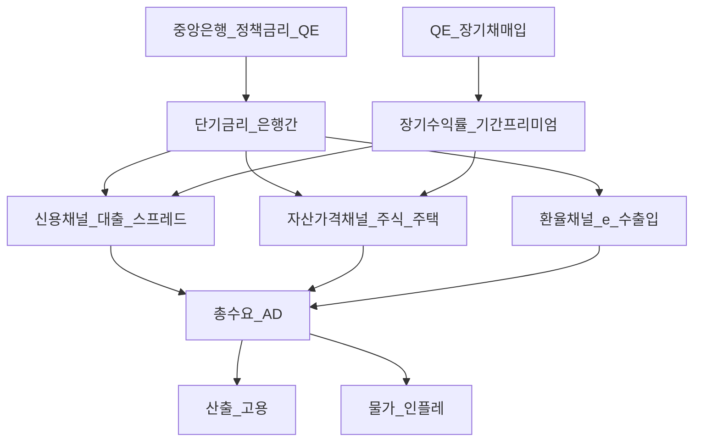
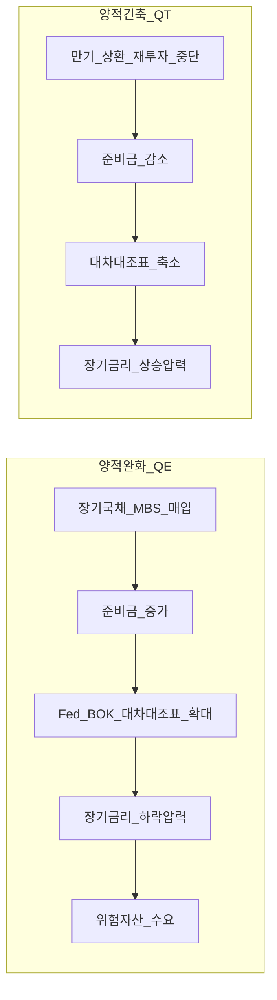

# 거시경제 04 — 통화정책·QE/QT·전달경로·실질정책금리

> **면책**: 본 문서는 교육 목적이며, 특정 개인·법인에 대한 투자·세무·법률 자문이 아닙니다. 제도·세율·상품 조건은 변경될 수 있으므로 실행 전 공식 출처를 확인하세요.

## 메타

| 항목 | 내용 |
|------|------|
| 최종 검증일 | 2026-05-24 |
| 정책·법령 기준일 | 2025-12-31 확정, 2026 통화정책·금융환경 별도 표기 |
| 난이도 | L4 (Graduate) — [READER-GUIDE](../docs/READER-GUIDE.md) |
| 예상 읽기 시간 | 180~210분 |
| 관련 bucket | Bucket 0~1 (거시 문법), Bucket 3~4 (채권·QQQ·자산배분) |

## 0. 이 편 읽기 전 (5분)

| 항목 | 내용 |
|------|------|
| **난이도** | L4 (Graduate) — [READER-GUIDE §L등급](../docs/READER-GUIDE.md) |
| **선수** | [거시경제학 기초](macroeconomics-basics.md), [macro-02-money-inflation](macro-02-money-inflation.md) |
| **이번 편에서 쓰는 기호** | 본문 §4·§4a 표 참고 |
| **복습 한 줄** | L3 선수 편을 먼저 읽으면 수식이 수월함 |

## TL;DR

1. **중앙은행의 이중 임무(dual mandate)** — 미국 연준(Fed)은 **최대 고용**과 **물가 안정**을 동시에 추구하며, 한국은행(BOK)은 **물가안정**을 최우선 목표로 두되 **금융·경제 안정**을 함께 고려한다.
2. **Taylor rule**은 정책금리 \(i\)를 **인플레 갭·산출 갭**의 함수로 근사하는 **반응함수**이며, “시장이 기대하는 금리 경로”와 **dot plot·선물**을 대조하는 데 쓴다.
3. **전달경로(transmission channels)**: (a) **신용·대출**, (b) **자산가격·부의 효과**, (c) **환율·수출입** — [macro-03-is-lm-ad-as](macro-03-is-lm-ad-as.md)의 LM·AD 이동을 **현실 금융시스템**으로 확장한다.
4. **QE(양적완화)** 는 단기금리가 **영점(ELB)** 에 가까울 때 **장기채·MBS 매입**으로 **장기수익률·신용 스프레드**를 누르는 **비전통 정책**; **QT(양적긴축)** 는 역방향으로 **유동성·준비금**을 흡수한다.
5. **실질정책금리** \(r = i - \pi^e\) 가 양(+)이면 긴축적, 음(−)이면 완화적 — [채권 듀레이션](../03-markets/bonds-fixed-income.md)과 [QQQ](../04-portfolio/leveraged-etf-qqq-qld.md) **할인율·성장 기대**를 한 프레임으로 읽는다.

---

## 1. 한 줄 정의 + 왜 중요한가

!!! info "QE (Quantitative Easing)"
    중앙은행의 양적완화.

**정의**: **통화정책(Monetary Policy)** 은 중앙은행이 **정책금리·준비금·대차대조표**를 조정해 **물가·고용·금융안정**에 영향을 주는 거시정책이다. **QE/QT**는 정책금리만으로는 부족할 때 **자산 매입·매각**으로 **수익률 곡선·유동성**을 직접 건드리는 **비전통 수단**이다.

**왜 중요한가** (장기 자산 형성·bucket 연결):

개인 투자자가 매일 보는 **국채 금리·환율·나스닥**은 대부분 “통화정책 기대 + 성장·인플레 서사”의 합성물이다. [macro-03-is-lm-ad-as](macro-03-is-lm-ad-as.md)에서 IS-LM으로 **금리↓ → 투자↑**를 배웠다면, 본 장은 **은행 대출·주택·주식·원달러**로 그 경로가 **실제로 어떻게 흐르는지**, Fed **dot plot**을 **어떻게 읽지 말아야 하는지**, **실질금리**가 [자산배분](../04-portfolio/asset-allocation.md)의 **채권 vs QQQ** 비중에 무엇을 시사하는지를 **전공자 수준**으로 정리한다. [macro-06-asset-prices-macro](macro-06-asset-prices-macro.md)로 이어지는 **자산가격 거시**의 중간 고리다.

---

## 2. 선수 지식 / 이후 읽을 것

**선수**:
- [거시경제학 기초](macroeconomics-basics.md) — GDP·금리·인플레 개념
- [macro-02-money-inflation](macro-02-money-inflation.md) — 화폐·인플레·기대인플레
- [macro-03-is-lm-ad-as](macro-03-is-lm-ad-as.md) — IS-LM·AD-AS·재정정책
- [복리와 시간가치](../01-foundations/compound-interest-and-time-value.md)
- [채권·고정수익 입문](../03-markets/bonds-fixed-income.md) — YTM·듀레이션

**이후**:
- [macro-05-open-economy-fx](macro-05-open-economy-fx.md) — 개방경제·환율·삼중곤란
- [macro-06-asset-prices-macro](macro-06-asset-prices-macro.md) — 금리·주가·QQQ·한국
- [자산배분](../04-portfolio/asset-allocation.md) — 금리 국면과 60/40
- [QQQ·QLD·TQQQ](../04-portfolio/leveraged-etf-qqq-qld.md) — 금리·성장과 나스닥
- [채권·듀레이션](../03-markets/bonds-fixed-income.md) — 금리 민감도 실무

---

## 3. 직관·비유

**브레이크와 액셀(정책금리)**: 중앙은행은 경제라는 자동차의 **브레이크·액셀**에 가깝다. **금리를 올리면** 대출·투자·주택 구매가 **둔화**되고, **내리면** 반대 방향이다. 다만 브레이크는 **지연(lag)** 이 길다 — 페달을 밟아도 **몇 분기~1년** 뒤에 속도계(GDP·물가)가 반응하는 경우가 많다.

**스피커 볼륨(QE)**: 단기금리를 **0% 근처까지** 내렸는데도 경기가 회복되지 않으면, “액셀을 끝까지 밟았는데도 느리다”는 상황이 온다. QE는 **앰프(증폭기)** 를 추가로 켜 **장기금리·신용 spreads**를 더 누르는 것에 가깝다. QT는 **앰프를 끄고** 스피커(대차대조표)를 줄이는 과정 — 시장은 “볼륨이 줄면 **자산가격**이 어떻게 되나?”를 pricing한다.

**실질금리 = 체감 금리**: 명목금리 4%인데 물가가 3% 오르면 **실질**로는 1%만 “비싼 돈”이다. 반대로 명목 1%·물가 4%면 **실질 −3%** — 차입자·채무자에게는 **완화**, 예금자에게는 **세금** 같은 효과. [QQQ](../04-portfolio/leveraged-etf-qqq-qld.md) 같은 **장기 성장주**는 **실질금리↓** 일 때 할인율이 낮아져 **밸류에이션 tailwind**가 붙기 **쉬운** 국면이 있다(항상 보장 아님).

**Dot plot = 팀 회의 메모**: Fed FOMC 위원 각자가 “올해·내년 적정 금리”를 점으로 찍는 **Summary of Economic Projections(SEP)**. 이는 **확정 일정**이 아니라 **조건부 전망** — “우리가 **이 성장·인플레**를 본다면 **이 정도** 적절”이라는 **분포**다. 시장은 dot **중앙값·범위**와 **연준 선물(OIS, Fed Funds Futures)** 을 비교해 **서프라이즈**를 거래한다.

---

**이 모형이 말하는 것**: 수식은 계산 절차이고, 경제 직관은 「누가 이득·손해를 보는가」「어떤 가정이 깨지면 결론이 뒤집히는가」다. 유도 각 단계마다 **가정**을 한 줄로 적어 본다.
## 4. 정식 개념·용어

| 용어 | 한글 | English | 정의 |
|------|------|---------|------|
| Dual mandate | 이중 임무 | Dual mandate | (Fed) 최대 고용 + 물가 안정 |
| Price stability | 물가안정 | Price stability | (BOK) 연 2% 목표(중기) |
| Policy rate | 정책금리 | Policy rate | 기준금리·Fed Funds target |
| Real policy rate | 실질정책금리 | Real policy rate | \(i - \pi^e\) |
| Taylor rule | Taylor rule | Taylor rule | 정책금리 반응함수(규칙) |
| Output gap | 산출 갭 | Output gap | 실제 GDP − 잠재 GDP |
| Inflation gap | 인플레 갭 | Inflation gap | 실제 π − 목표 π* |
| Transmission | 전달 | Monetary transmission | 정책 → 실물·가격 경로 |
| Credit channel | 신용 채널 | Credit channel | 대출·담보·은행 대차 |
| Asset price channel | 자산가격 채널 | Asset price channel | 주택·주식·부의 효과 |
| Exchange rate channel | 환율 채널 | Exchange rate channel | \(e\) → 수출·수입·인플레 |
| QE | 양적완화 | Quantitative easing | 장기자산 매입·대차대조표 확대 |
| QT | 양적긴축 | Quantitative tightening | 보유자산 축소·준비금 흡수 |
| ELB | 영점 하한 | Effective lower bound | 단기금리 0% 근처 한계 |
| Dot plot | 점도표 | Dot plot | FOMC 금리 전망 분포 |
| Term premium | 기간 프리미엄 | Term premium | 장기채 추가 수익(위험·인플) |
| Duration | 듀레이션 | Duration | 금리 1%p↑ 시 채권가격 % 변화 |
| Neutral rate | 중립금리 | \(r^*\) | 산출 갭=0·π=목표일 균형 실질금리 |

## 4a. 핵심 용어 (본문 등장 순)

| 용어 | 한 줄 | 관련 이론 | glossary |
|------|-------|-----------|----------|
| 통화정책 | 중앙은행이 금리·준비금·대차대조표로 물가·고용에 영향 | 통화정책 전달 | — |
| 이중 임무 | Fed는 최대 고용·물가 안정을 동시 추구 | Fed 반응함수 | — |
| Taylor rule | 정책금리를 인플레·산출 갭 함수로 근사 | Taylor (1993) | — |
| 전달경로 | 정책금리가 실물·자산가격·환율로 퍼지는 채널 | IS-LM 확장 | [IS-LM](../00-roadmap/glossary.md#is-lm-모형) |
| 신용 채널 | 대출·담보·은행 대차가 총수요를 움직임 | 금융가속기 | — |
| 자산가격 채널 | 주택·주식·부의 효과로 소비·투자 변화 | 부의 효과 | [macro-06](macro-06-asset-prices-macro.md) |
| QE | ELB 근처에서 장기자산 매입·대차대조표 확대 | 비전통 통화정책 | — |
| QT | 보유자산 축소로 유동성·준비금 흡수 | 대차대조표 정상화 | — |
| 실질정책금리 | \(i-\pi^e\); 양(+)이면 긴축·음이면 완화 | Fisher·실질금리 | — |
| Dot plot | FOMC 위원별 조건부 금리 전망 분포 | 기대 형성 | — |
| ELB | 단기금리 0% 근처에서 추가 인하 한계 | 유동성 함정 | — |
| 기간 프리미엄 | 장기채가 단기 대비 더 요구하는 추가 수익 | 기대이론·QE | — |
| 듀레이션 | 금리 1%p↑ 시 채권가격 % 변화 | 채권 가격민감도 | [채권](../03-markets/bonds-fixed-income.md) |
| 중립금리 \(r^*\) | 산출 갭=0·π=목표일 균형 실질금리 | Taylor·R\* | — |

## 4b. 관련 이론 미니맵

- **[IS-LM·AD-AS](macro-03-is-lm-ad-as.md)** — 단기 금리·총수요 프레임; 통화정책의 그래프 문법
- **[화폐·인플레](macro-02-money-inflation.md)** — MV=PY·기대인플레; 실질정책금리의 분모
- **[자산가격 거시](macro-06-asset-prices-macro.md)** — 자산가격 채널·할인율·QQQ 연결
- **[채권·듀레이션](../03-markets/bonds-fixed-income.md)** — 금리 전달의 채권 쪽 정량화
- **[자산배분](../04-portfolio/asset-allocation.md)** — 실질금리 국면과 주식·채권 비중

---

## 5. 메커니즘

### 5.1 통화정책 전달 — 세 채널 개요

| 채널 | 핵심 메커니즘 | 한국·투자 연결 |
|------|---------------|----------------|
| **신용** | 정책금리↓ → 은행 **funding cost**↓ → 대출↑; **금융가속기**(담보가치↑→LTV 여유) | 가계·기업 **대출 금리**, **회사채 스프레드** |
| **자산가격** | 할인율↓ → **주식·채권·부동산** re-rating; **부의 효과** → 소비 | **QQQ·코스피**, **아파트**, [asset-allocation](../04-portfolio/asset-allocation.md) |
| **환율** | 금리차·위험선호 → **원화 약·강** → 수출·수입물가 | [macro-05](macro-05-open-economy-fx.md), 수출주·해외 ETF |

### 5.2 QE vs QT — 대차대조표 관점

**QE 메커니즘(교육용)**:
1. 중앙은행이 **민간에게** 국채·MBS를 **현금(준비금)** 으로 매입.
2. 은행 **준비금↑** → (이론상) 대출 여력↑; **장기채 수요↑** → **가격↑·수익률↓**.
3. **포트폴리오 재균형 효과**: 투자자가 채권 대신 **위험자산**을 사 **스프레드·주가**에 압력.

**QT 메커니즘**: 만기 상환분을 **재투자하지 않거나** **능동 매도** → 시장에 **채권 공급↑**, **유동성 흡수** — 2022~ Fed QT, BOK는 **외환·유동성** 정책을 **별도** 운용(규모·도구 상이).

### 5.3 Fed dot plot 읽기 (교육 프레임)

| 요소 | 의미 | 흔한 오해 |
|    ------    | ------ | 위 식의 ------ |
| **Median dot** | 위원 전망 **중앙값** | “확정 인상 횟수” |
| **Longer run dot** | **중립금리** \(r^*\) 추정 | “영구 금리” |
| **Dispersion** | 위원 간 **분산** | 무시 가능 |
| vs **Futures** | 시장 **가격** | dot = 공식 전망 |

**실무 연결**: FOMC **성명·기자회견**과 dot **동시** 공개 시, **median shift** 25bp가 **2년물·10년물**에 이미 반영됐는지 확인 — **서프라이즈**만 단기 변동성을 키운다.

---

## 6. 수식·모델

### 6.1 Taylor rule (원형·교육용 변형)

John Taylor (1993) **원형**:

| 기호 | 이름 | 이 식에서 의미 |
|    ------    | ------ | 위 식의 ------ |
| \(r\) | 할인율·수익률 | 기간당 이자·요구수익률 |
| \(n\) | 기간 | 연·월 등 복리·할인에 쓰는 횟수 |
| \(PV\) | 현재가치 | 오늘 시점으로 환산한 금액 |
| \(FV\) | 미래가치 | 미래 시점의 목표·결과 금액 |

\[
i_t = \rho i_{t-1} + (1-\rho)\left[ r^* + \pi_t + \alpha_\pi (\pi_t - \pi^*) + \alpha_y (y_t - \bar{y}_t) \right]
\]

**읽는 법**: **명목** 수익에서 **인플레**를 반영하면 **실질** 체감 수익을 본다. 정밀식은 본문 또는 §4 표를 따른다.
**유도 (L4)**:
1. **정의**: **i**, **t**, **rho**를 동일 시점·동일 통화로 맞춘다. — 단위 불일치면 식이 무의미해진다.
2. **식 변형**: 양변을 정리해 목표 변수를 한쪽에 둔다. — 할인·복리는 **시점 이동**이 핵심이다.
3. **해석**: 부호·크기가 경제 직관과 맞는지 확인한다. — 극단값에서 단조성·한계를 점검한다.

- \(i_t\): **명목 정책금리**
- \(r^*\): **중립 실질금리**
- \(\pi_t, \pi^*\): 인플레·목표(2%)
- \(y_t - \bar{y}_t\): **산출 갭**
- \(\alpha_\pi > 1\) (**Taylor principle**): 인플레 1%p 초과 → 금리 **1%p 이상** 인상 → **실질금리↑** → 수요 억제
- \(\rho\): **금리 smoothing** (급격한 변동 완화)

**단순화(손 계산용)**:

| 기호 | 이름 | 이 식에서 의미 |
|    ------    | ------ | 위 식의 ------ |
| \(r\) | 할인율·수익률 | 기간당 이자·요구수익률 |
| \(n\) | 기간 | 연·월 등 복리·할인에 쓰는 횟수 |
| \(PV\) | 현재가치 | 오늘 시점으로 환산한 금액 |

\[
i = r^* + \pi + 0.5(\pi - \pi^*) + 0.5 \cdot \text{gap}
\]

**읽는 법**: **명목** 수익에서 **인플레**를 반영하면 **실질** 체감 수익을 본다. 정밀식은 본문 또는 §4 표를 따른다.
**유도 (L4)**:
1. **정의**: **r**, **n**, **PV**를 동일 시점·동일 통화로 맞춘다. — 단위 불일치면 식이 무의미해진다.
2. **식 변형**: 양변을 정리해 목표 변수를 한쪽에 둔다. — 할인·복리는 **시점 이동**이 핵심이다.
3. **해석**: 부호·크기가 경제 직관과 맞는지 확인한다. — 극단값에서 단조성·한계를 점검한다.
gap을 **% of potential GDP**로 두면, \(\pi=3\%, \pi^*=2\%, gap=+1\%, r^*=0.5\%\) → \(i = 0.5 + 3 + 0.5 + 0.5 = 4.5\%\).

### 6.2 Taylor rule 유도 직관 (비교정태)

**목표**: 인플레를 \(\pi^*\)로, 산출을 잠재수준으로 **되돌리는** \(i\)의 **피드백 규칙**.

1. **IS 곡선**(선형): \(y = a - b(i - \pi^e) + \cdots\) — **실질금리↑ → y↓**
2. **Phillips 곡선**(기대 강화): \(\pi = \pi^e + \kappa (y - \bar{y}) + \cdots\)
3. **정책 규칙** \(i = f(\pi, y)\) 대입 → **고정점**에서 \(\pi=\pi^*, y=\bar{y}\)가 **국소적으로 안정**하려면 \(\partial i / \partial \pi > 1\) (Taylor principle).

**투자 해석**: Taylor 원칙(\(\partial i / \partial \pi > 1\)) 하에서 인플레이션 기대가 정책금리에 반영되면 장기 균형이 국소적으로 안정된다.

| 기호 | 이름 | 이 식에서 의미 |
|    ------    | ------ | 위 식의 ------ |
| \(r\) | 할인율·수익률 | 기간당 이자·요구수익률 |
| \(n\) | 기간 | 연·월 등 복리·할인에 쓰는 횟수 |
| \(PV\) | 현재가치 | 오늘 시점으로 환산한 금액 |
| \(FV\) | 미래가치 | 미래 시점의 목표·결과 금액 |

\[
y_{10} = \underbrace{\mathbb{E}\sum \text{short rates}}_{\text{기대 단기금리 경로}} + \underbrace{\text{term premium}}_{\text{기간 프리미엄}}
\]

**읽는 법**: **y_**와 **D**의 관계를 위 식으로 쓴다. 경제·재무 해석은 변수표 「이 식에서 의미」와 [DEPTH-STANDARD](../docs/DEPTH-STANDARD.md) 기호 예제를 맞춘다.
**유도 (L4)**:
1. **정의**: **y_**, **D**, **E**를 동일 시점·동일 통화로 맞춘다. — 단위 불일치면 식이 무의미해진다.
2. **식 변형**: 양변을 정리해 목표 변수를 한쪽에 둔다. — 할인·복리는 **시점 이동**이 핵심이다.
3. **해석**: 부호·크기가 경제 직관과 맞는지 확인한다. — 극단값에서 단조성·한계를 점검한다.
**QE**는 주로 **term premium↓** (장기채 **희소성 프리미엄** 축소) + **기대 경로** 신호. **QT**는 역방향 **공급**.

### 6.5 QQQ·성장주와 할인율 (DCF 직관)

\[ \text{주가} \approx \sum_{t=1}^{T} \frac{CF_t}{(1+r)^{t}} + \frac{TV}{(1+r)^{T}} \]

**읽는 법**: **y_**와 **D**의 관계를 위 식으로 쓴다. 경제·재무 해석은 변수표 「이 식에서 의미」와 [DEPTH-STANDARD](../docs/DEPTH-STANDARD.md) 기호 예제를 맞춘다.
**유도 (L4)**:
1. **정의**: **y_**, **D**, **E**를 동일 시점·동일 통화로 맞춘다. — 단위 불일치면 식이 무의미해진다.
2. **식 변형**: 양변을 정리해 목표 변수를 한쪽에 둔다. — 할인·복리는 **시점 이동**이 핵심이다.
3. **해석**: 부호·크기가 경제 직관과 맞는지 확인한다. — 극단값에서 단조성·한계를 점검한다.

- **무위험률·실질금리↑** → \(r\uparrow\) → **PV↓** (특히 **먼 미래 CF** 비중 큰 **성장주**)
- **QQQ**(나스닥100)는 **장기 성장·기술** 비중 → **듀레이션 equity**에 가깝게 **금리 민감** ([macro-06](macro-06-asset-prices-macro.md))
- **QLD/TQQQ**는 **일일 2×·3×** — 금리 shock 시 **변동성·경로**가 [leveraged-etf](../04-portfolio/leveraged-etf-qqq-qld.md) **붕괴**와 중첩

**연결 표**:

| 충격 | 채권(D=7) | QQQ(1×) | QLD(2×) |
|------|-----------|---------|---------|
| \(i\uparrow 1\%p\) (인플레 sticky) | **−7%** 근사 | **−10~20%?** (β·섹터) | **더 큼** |
| \(r^{real}\downarrow\) (완화) | 가격↑ | **tailwind** | **레버리지 tailwind** |
| **스태그플레이션** | 실질 손실 | **이중 압박** | **고위험** |

(수치는 **교육용** — 실제는 **earnings·risk premium** 동시 변동)

### 6.6 비교정태학 — 파라미터 1%p·1% 변화 (교육용)

| 파라미터 ↑ | 단기 \(i\) | \(r^{real}\) | 신용 | 자산가격 | 환율(USD/KRW 예) | AD |
|------------|------------|--------------|------|----------|------------------|-----|
| \(\pi - \pi^*\) (+1%p) | Taylor **↑** | **↑** (if \(i\) 반응 > π) | 대출 **↓** | **↓** | USD **강**? | **↓** |
| 산출 갭 (+1%) | **↓**(완화) | **↓** | **↑** | **↑** | KRW **강**? | **↑** |
| QE 규모 ↑ | 고정 | — | 스프레드 **↓** | **↑** | EM **유입** | **↑** |
| QT 속도 ↑ | — | — | **긴장** | **↓** | **변동성↑** | **↓** |
| \(r^*\) ↑ (구조) | **↑** 중립 | **↑** | — | **압박** | — | **↓** |

**IR·매크로 질문**: (1) 이번 **금리 인하**가 **성장 둔화** vs **인플레 승리** 중 어느 서사인가? (2) **실질금리**가 여전히 **+**인가? (3) **듀레이션**을 줄였는가([asset-allocation](../04-portfolio/asset-allocation.md))?

### 6.7 IS-LM과의 연결 ([macro-03](macro-03-is-lm-ad-as.md))

**LM**: \(M/P = L(i, Y)\). **정책금리 고정**·**준비금 조절** → **LM 이동**.

- **금리↓** (완화): LM **우측** → **Y↑, i↓** (IS-LM 교점)
- **QE**: **장기** segment는 LM **밖** — **term premium** 채널로 **투자·주가**에 추가 효과

**한계**: **영점 하한**에서 \(i \not\downarrow\) → **IS만** 움직이기 어려움 → **QE** 도입.

---

 주로 **term premium↓** (장기채 **희소성 프리미엄** 축소) + **기대 경로** 신호. **QT**는 역방향 **공급**.

### 6.5 QQQ·성장주와 할인율 (DCF 직관)

\[ \text{주가} \approx \sum_{t=1}^{T} \frac{CF_t}{(1+r)^{t}} + \frac{TV}{(1+r)^{T}} \]

**읽는 법**: **y_**와 **D**의 관계를 위 식으로 쓴다. 경제·재무 해석은 변수표 「이 식에서 의미」와 [DEPTH-STANDARD](../docs/DEPTH-STANDARD.md) 기호 예제를 맞춘다.
**유도 (L4)**:
1. **정의**: **y_**, **D**, **E**를 동일 시점·동일 통화로 맞춘다. — 단위 불일치면 식이 무의미해진다.
2. **식 변형**: 양변을 정리해 목표 변수를 한쪽에 둔다. — 할인·복리는 **시점 이동**이 핵심이다.
3. **해석**: 부호·크기가 경제 직관과 맞는지 확인한다. — 극단값에서 단조성·한계를 점검한다.

- **무위험률·실질금리↑** → \(r\uparrow\) → **PV↓** (특히 **먼 미래 CF** 비중 큰 **성장주**)
- **QQQ**(나스닥100)는 **장기 성장·기술** 비중 → **듀레이션 equity**에 가깝게 **금리 민감** ([macro-06](macro-06-asset-prices-macro.md))
- **QLD/TQQQ**는 **일일 2×·3×** — 금리 shock 시 **변동성·경로**가 [leveraged-etf](../04-portfolio/leveraged-etf-qqq-qld.md) **붕괴**와 중첩

**연결 표**:

| 충격 | 채권(D=7) | QQQ(1×) | QLD(2×) |
|------|-----------|---------|---------|
| \(i\uparrow 1\%p\) (인플레 sticky) | **−7%** 근사 | **−10~20%?** (β·섹터) | **더 큼** |
| \(r^{real}\downarrow\) (완화) | 가격↑ | **tailwind** | **레버리지 tailwind** |
| **스태그플레이션** | 실질 손실 | **이중 압박** | **고위험** |

(수치는 **교육용** — 실제는 **earnings·risk premium** 동시 변동)

### 6.6 비교정태학 — 파라미터 1%p·1% 변화 (교육용)

| 파라미터 ↑ | 단기 \(i\) | \(r^{real}\) | 신용 | 자산가격 | 환율(USD/KRW 예) | AD |
|------------|------------|--------------|------|----------|------------------|-----|
| \(\pi - \pi^*\) (+1%p) | Taylor **↑** | **↑** (if \(i\) 반응 > π) | 대출 **↓** | **↓** | USD **강**? | **↓** |
| 산출 갭 (+1%) | **↓**(완화) | **↓** | **↑** | **↑** | KRW **강**? | **↑** |
| QE 규모 ↑ | 고정 | — | 스프레드 **↓** | **↑** | EM **유입** | **↑** |
| QT 속도 ↑ | — | — | **긴장** | **↓** | **변동성↑** | **↓** |
| \(r^*\) ↑ (구조) | **↑** 중립 | **↑** | — | **압박** | — | **↓** |

**IR·매크로 질문**: (1) 이번 **금리 인하**가 **성장 둔화** vs **인플레 승리** 중 어느 서사인가? (2) **실질금리**가 여전히 **+**인가? (3) **듀레이션**을 줄였는가([asset-allocation](../04-portfolio/asset-allocation.md))?

### 6.7 IS-LM과의 연결 ([macro-03](macro-03-is-lm-ad-as.md))

**LM**: \(M/P = L(i, Y)\). **정책금리 고정**·**준비금 조절** → **LM 이동**.

- **금리↓** (완화): LM **우측** → **Y↑, i↓** (IS-LM 교점)
- **QE**: **장기** segment는 LM **밖** — **term premium** 채널로 **투자·주가**에 추가 효과

**한계**: **영점 하한**에서 \(i \not\downarrow\) → **IS만** 움직이기 어려움 → **QE** 도입.

---

## 7. 한국 적용

### 7.1 2025년 기준 (확정·제도 맥락)

| 항목 | Fed | BOK (한국은행) |
|------|-----|----------------|
| **법적 목표** | 최대 고용 + **2%** 물가 | **「한국은행법」** 물가안정 **최우선** + 금융·경제 안정 |
| **정책금리** | Federal Funds **target range** | **한국은행 기준금리** |
| **비전통** | QE(2008, 2020), QT(2022~) | **대규모 QE는 제한적** — **유동성·외환** 위주 |
| **통화정책위원회** | FOMC (8회/년) | **MPB** (연 8회) |
| **전망** | SEP, **dot plot** | **경제전망보고서**, **금리 경로**는 **점도표 없음** |

**전달 — 한국 특수**:

1. **가계부채·주택**: **담보·LTV·DSR** 규제가 **신용 채널**과 **겹침** — 금리↓도 **규제**가 대출을 막을 수 있음.
2. **수출·환율**: **원·달러**가 **수입물가·기업 실적**에 직결 — BOK는 **FX 변동성**을 **공식적으로** 언급하는 경우가 많음([macro-05](macro-05-open-economy-fx.md)).
3. **채권 시장**: **국고채 3년·10년**이 **벤치마크**; **회사채·카드**는 **은행· shadow banking** 경로.

### 7.2 2026년 개편·시행 예정 (해당 시)

| 항목 | 2025 | 2026 (시행 여부 명시) |
|    ------    | ------ | 위 식의 ------ |
| BOK **물가 목표** | 연 2% (중기) | **유지** (법·MOU 기준) |
| **기준금리** | MPB **분기별** 결정 | **데이터 의존** — [BOK 경제전망](https://www.bok.or.kr) 추적 |
| **Fed QT** | 대차대조표 **축소** 지속·조정 | **유동성**·**RRP** 잔고 **시장 이벤트** |
| **가계대출 규제** | DSR·스트레스 DSR | **금융위** 개편안 **별도** — 신용 채널 **완화·강화** |

**법·정책 근거**: 「한국은행법」 §1·§6, 「외국환거래법」(외환), Fed **Federal Reserve Act** §2A — 실행 전 [law.go.kr](https://www.law.go.kr), [federalreserve.gov](https://www.federalreserve.gov) 확인.

### 7.3 BOK vs Fed — 투자자 체크리스트 (8항)

1. **MPB** 성명에서 **성장 vs 물가** 가중치 변화가 있는가?
2. **원달러** 언급 → **환율 채널** 개입 **시사**인가?
3. **Fed dot** median vs **Korea** 금리차 → **캐리·외국인 채권** 흐름
4. **실질금리**(국고채 − CPI)가 **+**로 **긴축**인가?
5. **회사채 스프레드** 확대 → **신용 채널** **막힘**?
6. **주택·가계부채** 규제가 **금리 전달**을 **상쇄**?
7. [채권 ETF](../03-markets/bonds-fixed-income.md) **듀레이션** — BOK **동결·인하** 시나리오
8. [QQQ](../04-portfolio/leveraged-etf-qqq-qld.md) — **미국** 금리·실질금리가 **한국 포트** USD 자산에 **직접**

---

## 8. 숫자 예제 (가상)

> 모든 인물·금액·기관 전망은 **가상·교육용**입니다.

### 예제 1 — Taylor rule 손계산

가상: \(r^* = 0.5\%\), \(\pi = 3.2\%\), \(\pi^* = 2\%\), 산출 갭 = **+0.8%** (잠재 GDP 대비).

\[
i = 0.5 + 3.2 + 0.5(3.2-2) + 0.5(0.8) = 0.5 + 3.2 + 0.6 + 0.4 = 4.7\%
\]

**해석**: 시장 정책금리 **4.25%**면 Taylor **4.7%** → “**아직 약간 느슨**” narrative. **10년물**이 4.5%면 **기대 인하** 포함.

### 예제 2 — 실질정책금리와 채권·QQQ

가상: 기준금리 \(i = 3.5\%\), 1년 기대 인플레 \(\pi^e = 2.8\%\).

\[
r^{real} = 3.5 - 2.8 = 0.7\%
\]

- **국고채 10년** \(y=3.8\%\), \(D=8\): Fed ** hawkish surprise** +50bp → \(\Delta P/P \approx -8 \times 0.5\% = -4\%\)
- **QQQ**: 실질금리 **0.7→1.2%** (+50bp) 가정 시, **할인율↑**로 **−8~12%** (가상, earnings flat)

**포트**: [asset-allocation](../04-portfolio/asset-allocation.md) **60/40**에서 채권 **−4%**, 주식 **−10%** → 전체 **−6.4%** (가중).

### 예제 3 — QE 규모와 term premium (개념)

가상 Fed: ****F**달러** 국채·MBS 매입(6개월). **이벤트 연구** stylized fact: **10년 term premium** **−30bp**.

- **10년 수익률** 4.0% → **3.7%** (다른 요인 고정)
- **30년 주택담보** 금리 **−25bp** → **신용 채널** **주택** 지원
- **주식**: **할인율·유동성** **+5%** (가상 일회성 re-rating)

**QT 역방향**: **월 **F**** 만기 **재투자 중단** → **term premium +15bp** (가상) — [bonds](../03-markets/bonds-fixed-income.md) **장기** 비중 리스크.

### 예제 4 — Dot plot vs 시장 (가상 SEP)

| | 2026E \(i\) | 2027E \(i\) | Longer run |
|---|-------------|-------------|------------|
| **Dot median** | 3.875% | 3.375% | 2.75% |
| **OIS 시장** | 3.65% | 3.10% | — |

**해석**: Median **> OIS** → “**시장은 더 많이 인하**” pricing — **bond rally** on **weak data**. FOMC ** hawkish**면 **서프라이즈** **sell-off**.

### 예제 5 — BOK 기준금리·원달러·수출 (가상)

MPB: **기준금리 3.25%** 유지, 성명 “**환율 변동성** 주시”. **가상** 원달러 **1380→1420** (원 **약세**).

- **수출 기업**(가상 A): **달러 매출** **+2.9%** (환율만)
- **수입 원자재** (가상 B): **원가 +2.9%** → **마진 압박**
- **해외 QQQ** 투자자: USD 자산 **+2.9%**(환) + **주가** 변동

**교훈**: **환율 채널**은 **섹터·헤지** ([macro-05](macro-05-open-economy-fx.md))로 **분해**해야 함.

---
## 9. FAQ

**Q1. Fed의 dual mandate와 BOK “물가안정 최우선”은 충돌하나요?**  
**A1.** **법적 문구**는 다르지만, **실무** 모두 **인플레 기대**를 **고용·성장**과 **trade-off**한다. BOK도 **성장 둔화** 시 **인하**를, **FX·가계부채**를 **금융안정** 축으로 **언급** — “**단일 vs 이중**”보다 **반응함수·가중치**가 투자에 중요.

**Q2. Taylor rule은 Fed가 **실제로** 따르는 공식인가요?**  
**A2.** **아니다.** **벤치마크·연구·시장** 도구. **r\***, gap **측정 오류**, **금융안정**·**QE**가 **규칙에서 이탈**. “Taylor 4.7% vs 실제 4.25%”는 **서사** not **법칙**.

**Q3. QE는 “돈을 찍어 주식을 산다”와 같나요?**  
**A3.** **부분적으로만** 맞다. **1차**는 **국채·MBS** 매입 → **준비금**·**수익률**. **2차** **포트폴리오 재균형**으로 **위험자산** 수요 — **직접 주식 매입**(일본 BOJ ETF 등)과 **다름**. **재정 monetization**과도 **구분**(Fed **독립성**).

**Q4. QT가 꼭 **주식 폭락**을 부르나요?**  
**A4.** **필연 아님**. **속도·준비금 잔여·재정·성장**에 따라 **term premium**만 **완만히** 오를 수 있음. 2022~ **동시** **급격 인상**과 **겹치면** **채권·주식** **동반** 약세 — **인과 분리** 어려움.

**Q5. 실질정책금리가 **음수**면 QQQ를 **무조건** 사야 하나요?**  
**A5.** **아니다.** **음수 실질**은 **완화**이나 **인플레·버블·밸류에이션** 리스크 동반. **earnings** 둔화·**스태그**면 **금리↓**도 **주가↓**. [leveraged-etf](../04-portfolio/leveraged-etf-qqq-qld.md) **레버리지**는 **변동성** **증폭**.

**Q6. Dot plot **median** 25bp 하향이 **즉시** 채권 rally인가요?**  
**A6.** **Often partially priced**. **기자회견 tone**, **SEP growth/inflation** **동반** 확인. **Higher for longer** **역사** — dot **하향** + **성명 hawkish** = **mixed**.

**Q7. 한국은 **QE를 안 했는데** 금리는 왜 미국을 **따라가나요?**  
**A7.** **금리 parity·캐리·외국인** **국채** 수요, **수출·환율** — **개방경제** ([macro-05](macro-05-open-economy-fx.md)). BOK **독자** **인하·동결** 가능하나 **스프레ad** **한계**.

**Q8. 채권 **듀레이션**을 줄이면 **통화정책** 리스크는 **없**나요?**  
**A8.** **명목 금리** **민감도↓** but **재투자** **수익↓**, **주식·환율** **리스크** **잔존**. **Ultra-short**도 **실질** **구매력**·**인플레** **노출**. [asset-allocation](../04-portfolio/asset-allocation.md) **3층** **유지**.

---

## 10. 함정·리스크·한계

- **전달 지연·불확실성**: **12~18개월** lag — “**금리 인하 = 즉시 경기 회복**” **함정**
- **영점 하한·QE**: **IS-LM** **표준**만으로 **2020** **설명 부족**
- **Taylor \(r^*\)** **추정**: **구조적 변화**(인구·생산성) → **중립금리** **논쟁**
- **금융안정 vs 물가**: **BOK·Fed** **부동산·은행** **스트레스** — **이중 임무** **실제** **trade-off**
- **투자**: “**Fed pivot** = **QQQ all-in**” — [core-satellite](../04-portfolio/core-satellite-framework.md), **채권·현금** **병행**
- **모델 한계**: **비교정태** **1%p** **표**는 **선형·ceteris paribus** — **대 shock** 시 **일반균형** **필요** ([macro-06](macro-06-asset-prices-macro.md))

---

**Q. 실무에서는?**  
교과서 식·기호를 그대로 적용하기 전에 **수수료·세금·데이터 시점**을 분리한다. 숫자는 [DEPTH-STANDARD](../docs/DEPTH-STANDARD.md)처럼 기호만 먼저 맞추고, 법령·시장 수치는 §8 표·외부 출처로 갱신한다.

## 11. 심화 읽기

- [공식 출처·데이터](../references/sources.md)
- **Fed**: [Monetary Policy](https://www.federalreserve.gov/monetarypolicy.htm), FOMC **SEP**, **dot plot**
- **BOK**: [통화정책](https://www.bok.or.kr/portal/main/contents.do?menuNo=200398), **경제전망보고서**, MPB **의사록**
- 교재: Mishkin *The Economics of Money, Banking, and Financial Markets*; Walsh *Monetary Theory and Policy*; Bernanke *The Courage to Act* (QE 역사)
- 논문: Taylor (1993); Gagnon et al. (2011) QE **event study**; Bernanke (2015) **term premium**
- 연계: [macro-03](macro-03-is-lm-ad-as.md), [macro-05](macro-05-open-economy-fx.md), [macro-06](macro-06-asset-prices-macro.md), [bonds](../03-markets/bonds-fixed-income.md), [asset-allocation](../04-portfolio/asset-allocation.md)

---

## 연습문제 (L4, 기호)

1. 위 §6 주요 식에서 변수 하나를 미지로 두고, 나머지를 기호로 둔 **관계식**을 쓰시오.
2. 가정이 깨질 때(유동성·세금·다중 IRR 등) 위 식의 **한계**를 기호·부등식으로 서술하시오.
3. §8 예제와 동일 기호(M·P·PV 등)로 **부호·단조성**만 검증하는 짧은 논증을 하시오.

### 해설 키

1. 직전 변수표의 「이 식에서 의미」를 이용해 동일 차원으로 정리한다.
2. 「가정이 깨지면」 절의 한계 사례와 연결한다.
3. 숫자 대입 없이 **부호**·**단위** 일치만 확인한다.
## 12. 스스로 점검 퀴즈

1. Taylor rule에서 \(\alpha_\pi > 1\) (**Taylor principle**)이 **왜** **인플레 안정**에 **중요**한지 **말**로 **설명**하시오.
2. \(\pi=4\%, \pi^*=2\%, r^*=1\%, gap=-1\%\) **단순 Taylor** \(i\)를 **구**하시오.
3. **Ex ante** 실질정책금리 **공식**과 **Ex post** **차이**?
4. QE가 **term premium**에 **미치는** **방향**과 **채널** **2개**?
5. **신용·자산·환율** **전달** **각** **1** **예**?
6. Dot plot **median** **3.875%** vs OIS **3.65%** — **시장** **해석**?
7. \(D=8\), \(\Delta y=+0.75\%p\) **채권** **가격** **변화** **근사**?
8. **실질금리↑** + **earnings↓** **동시** — **QQQ** **2** **요인** **분해**?

??? note "정답 힌트"

    1. 인플레↑ → \(i\) **더** ↑ → \(r^{real}\)↑ → **수요** **억제** **피드백**  
    2. \(i = 1 + 4 + 0.5(2) + 0.5(-1) = 1+4+1-0.5 = 5.5\%\)  
    3. Ex ante: \(i-\pi^e\); Ex post: \(i-\pi_{t+1}\) **실현**  
    4. **↓**; **포트폴리오 재균형**, **희소성/공급**  
    5. 예: **주담대**/**주식**/**원달러** **수출**  
    6. 시장 **더** **인하** **기대** — **약한** **데이터** **시** **채권** **우호**  
    7. \(\approx -8 \times 0.75\% = -6\%\)  
    8. **할인율↑** **(-)** + **CF↓** **(-)** — **부호** **같** **면** **큰** **하락**

---

**L4 완료 기준**: [TEMPLATE](../docs/TEMPLATE.md) 12블록·예제 5개·mermaid 2개·FAQ 8쌍·Taylor 유도·비교정태·검증일 2026-05-24 — [DEPTH-STANDARD](../docs/DEPTH-STANDARD.md). **이전**: [macro-03-is-lm-ad-as](macro-03-is-lm-ad-as.md). **다음**: [macro-05-open-economy-fx](macro-05-open-economy-fx.md).