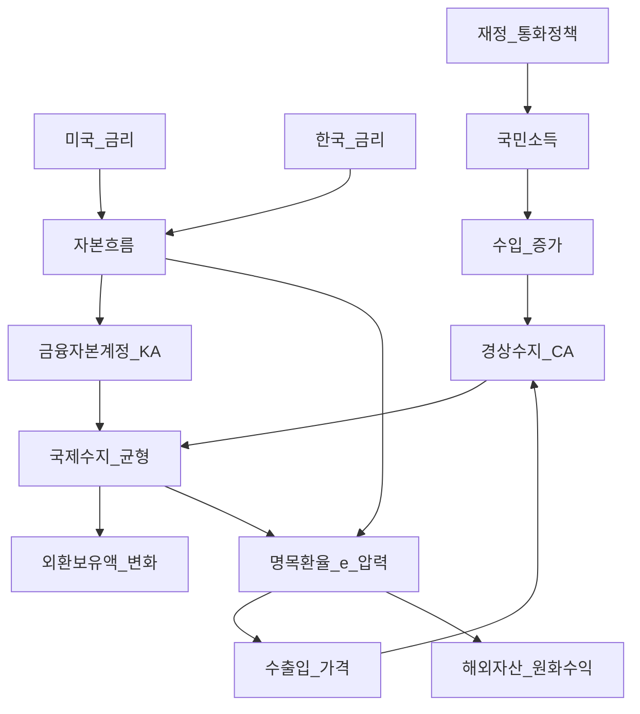
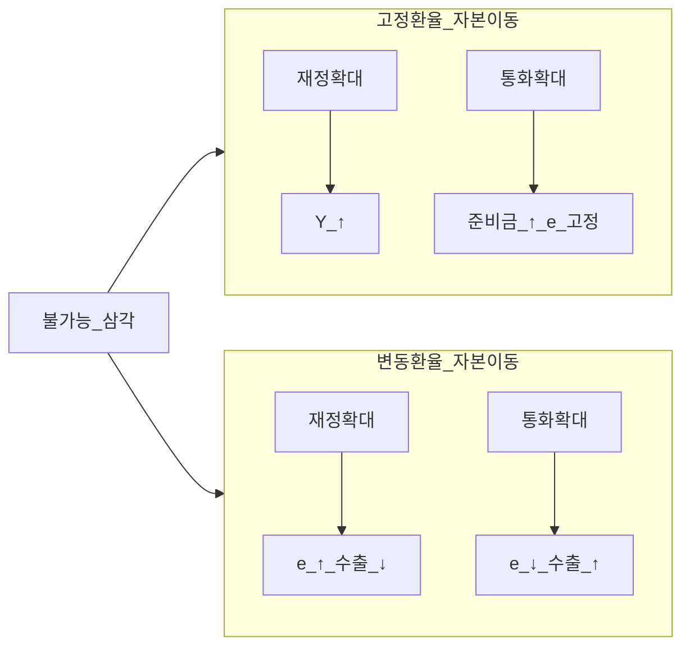
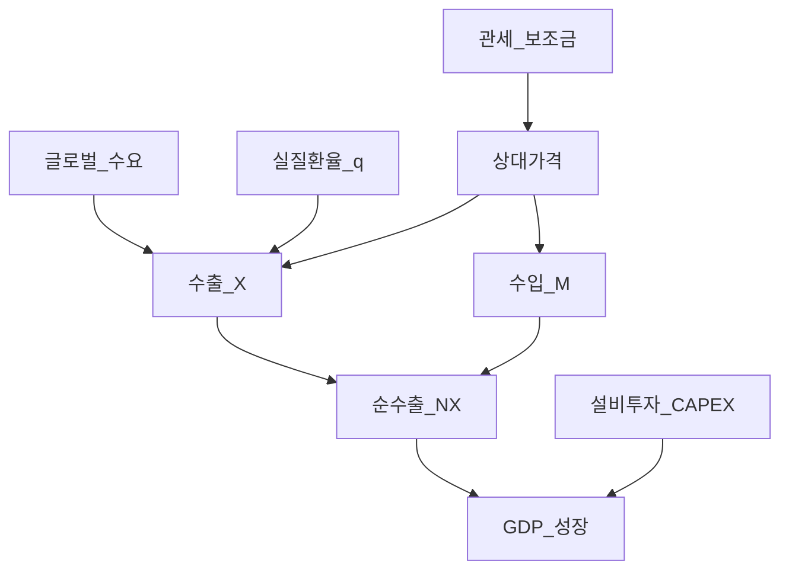

# 거시경제 05 — 개방경제·환율·국제수지·자본흐름

> **면책**: 본 문서는 교육 목적이며, 특정 개인·법인에 대한 투자·세무·법률 자문이 아닙니다. 제도·세율·상품 조건은 변경될 수 있으므로 실행 전 공식 출처를 확인하세요.

## 메타

| 항목 | 내용 |
|------|------|
| 최종 검증일 | 2026-05-24 |
| 정책·법령 기준일 | 2025-12-31 확정, 2026 환율·금리·무역 전망 별도 표기 |
| 난이도 | L4 (Graduate) — [READER-GUIDE](../docs/READER-GUIDE.md) |
| 예상 읽기 시간 | 160~200분 |
| 관련 bucket | Bucket 2b~3 (해외 자산·환율 노출), Bucket 3~4 (수출·금리·섹터) |

## 0. 이 편 읽기 전 (5분)

| 항목 | 내용 |
|------|------|
| **난이도** | L4 (Graduate) — [READER-GUIDE §L등급](../docs/READER-GUIDE.md) |
| **선수** | [거시경제학 기초](macroeconomics-basics.md), [macro-01-gdp-accounts-growth](macro-01-gdp-accounts-growth.md) |
| **이번 편에서 쓰는 기호** | 본문 §4·§4a 표 참고 |
| **복습 한 줄** | L3 선수 편을 먼저 읽으면 수식이 수월함 |

## TL;DR

1. **국제수지(BOP)** 는 경상·금융·자본 계정으로 나뉘며, **경상수지 + 금융·자본계정(순)** ≈ 0(통계 오차 제외) — “돈이 어디서 들어와 어디로 나갔는가”의 장부다.
2. **명목환율 e**(원/달러)와 **실질환율 q**는 다르다: \(q = e \cdot P^*/P\) — 구매력·경쟁력은 **q**로 읽는다.
3. **PPP**는 장기 **기준선**이지 단기 예측식이 아니다 — **거래비용·비교역재·자본흐름**이 단기 e를 지배한다.
4. **Mundell-Fleming(소규모 개방경제)** 에서 **환율제·자본이동**에 따라 재정·통화 효과가 갈린다 — 한국은 **변동환율 + 자본이동**에 가깝다.
5. **불가능 삼각(Impossible Trinity)**: 고정환율·독립 통화정책·자유 자본이동을 **동시에** 유지할 수 없다 — 한국은 **변동환율 + 독립 금리(상대적)** 를 택하고 환율 변동을 감수한다.
6. **미·한 금리차**는 KRW/USD에 **압력**을 주지만, **위험 프리미엄·무역·글로벌 위험**이 함께 작용 — “금리차만 보면 된다”는 함정을 피한다.
7. **수출주도 성장**은 **순수출·투자·환율·글로벌 수요**와 맞물린다; [해외 주식](../03-markets/overseas-equities-intro.md)·[지역 분산](../04-portfolio/geographic-diversification.md)과 **같은 환율**을 반대 방향으로 체감할 수 있다.

---

## 1. 한 줄 정의 + 왜 중요한가

**정의**: **개방경제(Open Economy) 거시**는 한 국가가 **상품·서비스·자본·금융**을 국경 넘어 거래할 때 **환율·국제수지·금리·정책**이 어떻게 동시에 결정되는지를 분석한다. 핵심 도구는 **국제수지 회계**, **명목·실질환율**, **PPP·UIP(무위험 이자율 평형)**, **Mundell-Fleming**, **불가능 삼각**이다.

**왜 중요한가** (장기 자산 형성·bucket 연결):

!!! info "ETF"
    지수·자산 **바구니**를 한 종목처럼 거래

[macro-03-is-lm-ad-as](macro-03-is-lm-ad-as.md)의 **폐쇄경제 IS-LM**은 “수출·환율”을 밖으로 두었다. 한국처럼 **수출·외채·해외투자**가 큰 경제에서 GDP·금리·주가·환율은 **한 장의 지도**로 읽어야 한다. 미국 ETF를 보유하면 수익은 **주가 + 환율** 두 축이고, 국내 대형 수출주는 **달러 매출 × 환율**로 원화 실적이 정리된다 — 같은 원/달러 약세가 **서로 다른 bucket**에 다른 부호로 작용할 수 있다. [macro-04-monetary-policy-qe](macro-04-monetary-policy-qe.md)에서 배운 **기준금리·양적정책**이 [macro-06-asset-prices-macro](macro-06-asset-prices-macro.md)의 **할인율·밸류에이션**으로 이어지기 **전에**, 그 금리가 **자본흐름·환율**을 통해 **무역·물가·Corporate earnings**에 먼저 닿는 경로를 이 문서가 담당한다.

---

## 2. 선수 지식 / 이후 읽을 것

**선수**:
- [거시경제학 기초](macroeconomics-basics.md) — GDP·금리·환율 직관
- [macro-01-gdp-accounts-growth](macro-01-gdp-accounts-growth.md) — 국민계정·순수출·저축-투자 항등
- [macro-02-money-inflation](macro-02-money-inflation.md) — 피셔·기대 인플레
- [macro-03-is-lm-ad-as](macro-03-is-lm-ad-as.md) — IS-LM·AD-AS·재정 (폐쇄경제 기준)
- [macro-04-monetary-policy-qe](macro-04-monetary-policy-qe.md) — 통화정책·금융시스템·금리 전파
- [복리와 시간가치](../01-foundations/compound-interest-and-time-value.md)

**이후**:
- [macro-06-asset-prices-macro](macro-06-asset-prices-macro.md) — 금리·주가·QQQ·한국 밸류에이션
- [해외 주식·ETF 입문](../03-markets/overseas-equities-intro.md) — 환율·세금·계좌
- [지역 분산](../04-portfolio/geographic-diversification.md) — 환율 노출·헷지
- [채권·고정수익](../03-markets/bonds-fixed-income.md)
- [자산배분](../04-portfolio/asset-allocation.md), [리밸런싱·DCA](../04-portfolio/rebalancing-and-dca.md)

---

## 3. 직관·비유

**국제수지 = 가계부 + 은행 통장**: 경상수지는 **매달 번 돈·쓴 돈**(수출입·소득·이전), 금융·자본계정은 **예금 인출·대출·주식 매매**. 한 달에 **경상 흑자**면 외화가 들어와 **순대외자산 증가** 또는 **환율 압력(원화 강세 쪽)** 으로 나타날 수 있다 — 반대로 **경상 적자**는 외화 **유입 필요**(자본 유입·준비금 감소·환율 약세 압력).

**환율은 두 나라 화폐의 “상대 가격”**: 원/달러가 1,300→1,400이면 **원화 약세** — 달러 자산을 원화로 환산하면 **더 많은 원**이 필요(이미 보유한 달러 자산의 원화 가치↑). 반면 **원화로 수입**하면 **더 비싸진다**. 수출 기업은 달러 매출을 원화로 바꿀 때 **더 많은 원**을 받는다 — 단, **달러 가격·물량**이 같을 때만.

**실질환율 = “물건 기준으로 본 환율”**: 명목환율만 보면 원화가 약해졌는데, 한국 물가가 미국보다 더 오르면 **실질환율**은 덜 약해진다. **경쟁력**은 “우리 제품이 세계에서 얼마나 싸졌는가” — **q**로 읽는다.

**PPP는 GPS, 단기 환율은 택시 요금**: 장기에는 “같은 바구니” 가격이 맞춰진다는 **방향**이 있지만, 단기에는 **투기·금리·위기**가 택시처럼 요금을 튄다. 투자에서 “PPP로 원화 저평가” 한 줄만으로 **환전 타이밍**을 정하면 안 된다.

**불가능 삼각 = 세 개의 스위치 중 두 개만 ON**: 고정환율을 고수하면서 **자유 자본**을 열면, 국내 금리를 마음대로 못 정하고 **외국 금리를 따라가야** 한다(1997 전 환율제·금리 연동 기억). 한국은 **변동환율**을 택해 **통화정책 독립**을 어느 정도 유지하고, 대신 **환율 변동성**을 [지역 분산](../04-portfolio/geographic-diversification.md)에서 **리스크 요인**으로 관리한다.

**Mundell-Fleming = “환율이 움직이느냐, 금리가 막히느냐”**: 재정 확대가 **국민소득**을 키우려면, 환율이 **유연**하고 **자본이동**이 크면 **환율**이 먼저 반응해 **수출**을 깎을 수 있다(크라우ding-out의 개방경제 버전). 통화 완화도 **금리** vs **환율** 중 어디로 새는지가 **제도**에 달렸다.

**수출주도 성장 = “세계 수요를 빌려 성장”**: 국내 소비만으로는 부족할 때 **순수출**과 **설비투자**가 GDP를 끌었다. 그 대가는 **글로벌 경기·환율·기술·무역장벽**에 **베타**가 커진다 — 반도체·자동차·조선 실적 가이던스는 **미·중·EU** 뉴스와 **KRW**를 동시에 본다.

---

**이 모형이 말하는 것**: 수식은 계산 절차이고, 경제 직관은 「누가 이득·손해를 보는가」「어떤 가정이 깨지면 결론이 뒤집히는가」다. 유도 각 단계마다 **가정**을 한 줄로 적어 본다.
## 4. 정식 개념·용어

| 용어 | 한글 | English | 정의 |
|------|------|---------|------|
| BOP | 국제수지 | Balance of payments | 국가 간 **모든 경제 거래** 기록 |
| 경상수지 | CA | Current account | 상품·서비스·1차소득·2차소득 **순액** |
| 금융·자본계정 | FA/KA | Financial/Capital account | **자본·금융** 흐름(투자·대출·준비금) |
| 기본균형 | BE | Basic balance | 경상 + 장기 **자본** (교육용 정의) |
| 명목환율 | e | Nominal exchange rate | 외화 1단위당 **본국 통화** (예: KRW/USD) |
| 실질환율 | q | Real exchange rate | \(q = e \cdot P^*/P\) — **상대 물가** 반영 |
| PPP | 구매력평가 | Purchasing power parity | **동일 바구니** 가격 등식 (장기) |
| UIP | 무위험 이자율 평형 | Uncovered interest parity | **금리차 ≈ 기대 환율변동** (근사) |
| MF | Mundell-Fleming | Mundell-Fleming model | **개방경제 IS-LM** + 환율·자본이동 |
| 삼중곤란 | Impossible trinity | Impossible trinity | 고정환율·독립 통화·자유 자본 **3택 2** |
| 자본흐름 | CF | Capital flows | **포트폴리오·FDI** 등 국경 횡단 자본 |
| 순대외자산 | NFA | Net foreign assets | 대외 **채권−부채** (민간+공공) |
| 무역정책 | Trade policy | Trade policy | **관세·쿼터·보조금·FTA** 등 |
| J-curve | J커브 | J-curve | 환율 변동 후 **무역수지** 시간 경로 |
| Marshall-Lerner | ML 조건 | Marshall-Lerner condition | **탄력성 합** > 1이면 실질 depreciate → CA 개선 |

### 4a. 핵심 용어 (본문 등장 순)

> 복습용. 정의는 §4 본표·[glossary](../00-roadmap/glossary.md)·본문 `!!! info` 박스.

| 용어 | 한 줄 | 관련 이론 | glossary |
|------|-------|-----------|----------|
| BOP | 국제수지 | §4 | [glossary](../00-roadmap/glossary.md#bop) |
| 경상수지 | CA | §4 | [glossary](../00-roadmap/glossary.md#경상수지) |
| 금융·자본계정 | FA/KA | §4 | [glossary](../00-roadmap/glossary.md#금융·자본계정) |
| 기본균형 | BE | §4 | [glossary](../00-roadmap/glossary.md#기본균형) |
| 명목환율 | e | §4 | [glossary](../00-roadmap/glossary.md#명목환율) |
| 실질환율 | q | §4 | [glossary](../00-roadmap/glossary.md#실질환율) |
| PPP | 구매력평가 | §4 | [glossary](../00-roadmap/glossary.md#ppp) |
| UIP | 무위험 이자율 평형 | §4 | [glossary](../00-roadmap/glossary.md#uip) |
| MF | Mundell-Fleming | §4 | [glossary](../00-roadmap/glossary.md#mf) |
| 삼중곤란 | Impossible trinity | §4 | [glossary](../00-roadmap/glossary.md#삼중곤란) |
| 자본흐름 | CF | §4 | [glossary](../00-roadmap/glossary.md#자본흐름) |
| 순대외자산 | NFA | §4 | [glossary](../00-roadmap/glossary.md#순대외자산) |
| 무역정책 | Trade policy | §4 | [glossary](../00-roadmap/glossary.md#무역정책) |
| J-curve | J커브 | §4 | [glossary](../00-roadmap/glossary.md#j-curve) |
| Marshall-Lerner | ML 조건 | §4 | [glossary](../00-roadmap/glossary.md#marshall-lerner) |

---

## 5. 메커니즘

### 5.1 국제수지·환율·금리 연결

### 5.2 Mundell-Fleming 체제 비교 (교육용)

| 체제 | 재정 확대 (G↑) | 통화 확대 (M↑) | 통화정책 독립 |
|------|----------------|----------------|---------------|
| 고정환율 + 자본이동 | Y↑ (유효) | **무효**(e 고정, 준비금) | **제한** |
| 변동환율 + 자본이동 | Y **제한적**(e↑, NX↓) | Y↑ (**e↓**, NX↑) | **상대적** |
| 고정환율 + 자본통제 | 재정·통화 효과 혼합 | 준비금·통제 필요 | 부분적 |

**한국 (2020s 교육 프레임)**: **사실상 변동환율** + **높은 자본이동** — [한국은행](https://www.bok.or.kr) 기준금리는 **국내 물가·금융안정**을 목표로 하되, **미 연준** 금리·**글로벌 리스크**가 **e·CF**를 통해 **역으로** 한국 금융조건을 조인다.

### 5.3 수출주도 성장·무역정책 (개념 흐름)

---

## 6. 수식·모델

### 6.1 국제수지 회계 (거시 항등)

**경상수지** (교육용 4항):

| 기호 | 이름 | 이 식에서 의미 |
|       ------       | ------ | ------이(가) 이 식에서 맡는 역할(§4·본문 참고) |
|             \(CA\)             | CA | CA이(가) 이 식에서 맡는 역할(§4·본문 참고) |
|             \(X\)             | X | X이(가) 이 식에서 맡는 역할(§4·본문 참고) |
|   \(M\)   | 월 실수령 | 가계 교육용 월 세후 소득 기호 |
|             \(NY\)             | NY | NY이(가) 이 식에서 맡는 역할(§4·본문 참고) |
|             \(NT\)             | NT | NT이(가) 이 식에서 맡는 역할(§4·본문 참고) |
\[
CA = (X - M) + NY + NT
\]

**읽는 법**: **CA**와 **X**의 관계를 위 식으로 쓴다. 경제·재무 해석은 변수표 「이 식에서 의미」와 [DEPTH-STANDARD](../docs/DEPTH-STANDARD.md) 기호 예제를 맞춘다.
**유도 (L4)**:
1. **정의**: **CA**, **X**, **M**를 동일 시점·동일 통화로 맞춘다. — 단위 불일치면 식이 무의미해진다.
2. **식 변형**: 양변을 정리해 목표 변수를 한쪽에 둔다. — 할인·복리는 **시점 이동**이 핵심이다.
3. **해석**: 부호·크기가 경제 직관과 맞는지 확인한다. — 극단값에서 단조성·한계를 점검한다.

\(X\): 수출, \(M\): 수입, \(NY\): 1차소득 순액, \(NT\): 2차소득(이전) 순액.

**금융·자본계정** 순액 \(KA\) (부호 규약: **유입 +**) 와 **준비자산** 변화 \(\Delta Res\):

| 기호 | 이름 | 이 식에서 의미 |
|       ------       | ------ | ------이(가) 이 식에서 맡는 역할(§4·본문 참고) |
| \(r\) | 할인율·수익률 | 기간당 이자·요구수익률 |
| \(n\) | 기간 | 연·월 등 복리·할인에 쓰는 횟수 |
| \(PV\) | 현재가치 | 오늘 시점으로 환산한 금액 |

\[
CA + KA + \Delta Res = 0 \quad (\text{통계 오차 } \varepsilon \text{ 제외})
\]

**읽는 법**: **r**와 **n**의 관계를 위 식으로 쓴다. 경제·재무 해석은 변수표 「이 식에서 의미」와 [DEPTH-STANDARD](../docs/DEPTH-STANDARD.md) 기호 예제를 맞춘다.
**유도 (L4)**:
1. **정의**: **r**, **n**, **PV**를 동일 시점·동일 통화로 맞춘다. — 단위 불일치면 식이 무의미해진다.
2. **식 변형**: 양변을 정리해 목표 변수를 한쪽에 둔다. — 할인·복리는 **시점 이동**이 핵심이다.
3. **해석**: 부호·크기가 경제 직관과 맞는지 확인한다. — 극단값에서 단조성·한계를 점검한다.
**경상 적자**(\(CA<0\))는 “해외에서 **순차입**” — \(KA>0\) (자본 유입) 또는 \(\Delta Res<0\) (준비금 감소)로 **상쇄**.

**저축-투자-순수출 항등** ([macro-01](macro-01-gdp-accounts-growth.md)):

| 기호 | 이름 | 이 식에서 의미 |
|       ------       | ------ | ------이(가) 이 식에서 맡는 역할(§4·본문 참고) |
|           \(S\)           | S | 소득 대비 남는 비율 |
|            \(I\)            | I | I이(가) 이 식에서 맡는 역할(§4·본문 참고) |
\[
S - I = NX = CA - (NY + NT)
\]

**읽는 법**: **S**와 **I**의 관계를 위 식으로 쓴다. 경제·재무 해석은 변수표 「이 식에서 의미」와 [DEPTH-STANDARD](../docs/DEPTH-STANDARD.md) 기호 예제를 맞춘다.
**유도 (L4)**:
1. **정의**: **S**, **I**를 동일 시점·동일 통화로 맞춘다. — 단위 불일치면 식이 무의미해진다.
2. **식 변형**: 양변을 정리해 목표 변수를 한쪽에 둔다. — 할인·복리는 **시점 이동**이 핵심이다.
3. **해석**: 부호·크기가 경제 직관과 맞는지 확인한다. — 극단값에서 단조성·한계를 점검한다.

국내 **저축이 투자를 초과**하면 그 차이가 **대외 순투자**(또는 CA 흑자 쪽)로 나간다 — **부호·정의**는 교재마다 \(NX\) vs \(CA\) 세부 항목에서 확인.

### 6.2 명목·실질환율

**직접 인용** (원/달러, \(e\) = 원화 per 1 USD):

| 기호 | 이름 | 이 식에서 의미 |
|       ------       | ------ | ------이(가) 이 식에서 맡는 역할(§4·본문 참고) |
| \(PV\) | 현재가치 | 오늘 시점으로 환산한 금액 |
| \(P\) | 포트 규모 | 가상 포트폴리오 규모(만 원) |

| 기호 | 이름 | 이 식에서 의미 |
|       ------       | ------ | ------이(가) 이 식에서 맡는 역할(§4·본문 참고) |
| \(r\) | 할인율·수익률 | 기간당 이자·요구수익률 |
| \(n\) | 기간 | 연·월 등 복리·할인에 쓰는 횟수 |
| \(PV\) | 현재가치 | 오늘 시점으로 환산한 금액 |

\[
q = e \cdot \frac{P^*}{P}
\]

**읽는 법**: **r**와 **n**의 관계를 위 식으로 쓴다. 경제·재무 해석은 변수표 「이 식에서 의미」와 [DEPTH-STANDARD](../docs/DEPTH-STANDARD.md) 기호 예제를 맞춘다.
**유도 (L4)**:
1. **정의**: **r**, **n**, **PV**를 동일 시점·동일 통화로 맞춘다. — 단위 불일치면 식이 무의미해진다.
2. **식 변형**: 양변을 정리해 목표 변수를 한쪽에 둔다. — 할인·복리는 **시점 이동**이 핵심이다.
3. **해석**: 부호·크기가 경제 직관과 맞는지 확인한다. — 극단값에서 단조성·한계를 점검한다.
\(P^*\): 외국 물가지수, \(P\): 국내. \(q \uparrow\) → **실질 원화 약세** | 기호 | 이름 | 이 식에서 의미 |
|       ------       | ------ | ------이(가) 이 식에서 맡는 역할(§4·본문 참고) |
| \(r\) | 할인율·수익률 | 기간당 이자·요구수익률 |
| \(n\) | 기간 | 연·월 등 복리·할인에 쓰는 횟수 |
| \(PV\) | 현재가치 | 오늘 시점으로 환산한 금액 |

→ (ceteris paribus) **수출 경쟁력↑**, **수입 부담↑**.

**로그 선형 근사** (비교정태):

\[
\hat{q} \approx \hat{e} + \hat{P}^* - \hat{P}
\]

**읽는 법**: **r**와 **n**의 관계를 위 식으로 쓴다. 경제·재무 해석은 변수표 「이 식에서 의미」와 [DEPTH-STANDARD](../docs/DEPTH-STANDARD.md) 기호 예제를 맞춘다.
**유도 (L4)**:
1. **정의**: **r**, **n**, **PV**를 동일 시점·동일 통화로 맞춘다. — 단위 불일치면 식이 무의미해진다.
2. **식 변형**: 양변을 정리해 목표 변수를 한쪽에 둔다. — 할인·복리는 **시점 이동**이 핵심이다.
3. **해석**: 부호·크기가 경제 직관과 맞는지 확인한다. — 극단값에서 단조성·한계를 점검한다.

명목 **5%** 약세, 국내 물가 **3%p** 더 오르면 실질 약세는 **약 2%** — “원| 기호 | 이름 | 이 식에서 의미 |
|       ------       | ------ | ------이(가) 이 식에서 맡는 역할(§4·본문 참고) |
| \(r\) | 할인율·수익률 | 기간당 이자·요구수익률 |
| \(n\) | 기간 | 연·월 등 복리·할인에 쓰는 횟수 |
| \(PV\) | 현재가치 | 오늘 시점으로 환산한 금액 |

화 약세” 헤드라인만으로 **경쟁력**을 과대평가할 수 있다.

### 6.3 PPP — 절대·상대, 한계

**절대 PPP**: \(e = P/P^*\) (동일 바구니).

**상대 PPP** (변화율):

| 기호 | 이름 | 이 식에서 의미 |
|       ------       | ------ | ------이(가) 이 식에서 맡는 역할(§4·본문 참고) |
| \(r\) | 할인율·수익률 | 기간당 이자·요구수익률 |
| \(n\) | 기간 | 연·월 등 복리·할인에 쓰는 횟수 |
| \(PV\) | 현재가치 | 오늘 시점으로 환산한 금액 |

\[
\frac{\Delta e}{e} \approx \pi - \pi^*
\]

**읽는 법**: **명목** 수익에서 **인플레**를 반영하면 **실질** 체감 수익을 본다. 정밀식은 본문 또는 §4 표를 따른다.
**유도 (L4)**:
1. **정의**: **r**, **n**, **PV**를 동일 시점·동일 통화로 맞춘다. — 단위 불일치면 식이 무의미해진다.
2. **식 변형**: 양변을 정리해 목표 변수를 한쪽에 둔다. — 할인·복리는 **시점 이동**이 핵심이다.
3. **해석**: 부호·크기가 경제 직관과 맞는지 확인한다. — 극단값에서 단조성·한계를 점검한다.
**한계 (L4에서 암기보다 이해)**:

1. **비교역재**(헤어컷·주택·서비스) — CPI 전체로 PPP 맞추기 어려움  
2. **Balassa-Samuelson**: 저소득국 **생산성 추격** → \(P/P^*\) 상승 → **명목 e| 기호 | 이름 | 이 식에서 의미 |
|       ------       | ------ | ------이(가) 이 식에서 맡는 역할(§4·본문 참고) |
|  \(P_d\)  |  P d  | P d이(가) 이 식에서 맡는 역할(§4·본문 참고) |
|  \(P_w\)  |  P w  | P w이(가) 이 식에서 맡는 역할(§4·본문 참고) |
| \(P\) | 포트 규모 | 가상 포트폴리오 규모(만 원) |
|            \(E\)            | E | E이(가) 이 식에서 맡는 역할(§4·본문 참고) |
**는 PPP보다 **저평가** 쪽에 오래 머물 수 있음  
3. **자본계정** 우세 시 **UIP·금리차**가 PPP보다 **단기 e**를 지배  
4. **거래비용·관세** — [micro-04](micro-04-welfare-e| 기호 | 이름 | 이 식에서 의미 |
|       ------       | ------ | ------이(가) 이 식에서 맡는 역할(§4·본문 참고) |
|  \(P_d\)  |  P d  | P d이(가) 이 식에서 맡는 역할(§4·본문 참고) |
|  \(P_w\)  |  P w  | P w이(가) 이 식에서 맡는 역할(§4·본문 참고) |
|            \(E\)            | E | E이(가) 이 식에서 맡는 역할(§4·본문 참고) |
xternalities.md) 관세가 **\(P_d = P_w + t\)** 로 **실질 q** 왜곡  
5. **기대·위험 프리미엄** — \(E[\Delta e]\) ≠ \(\pi - \pi^*\) alone

### 6.4 UIP와 금리차 (교육용)

**무커버 UIP** (근사):

| 기호 | 이름 | 이 식에서 의미 |
|       ------       | ------ | ------이(가) 이 식에서 맡는 역할(§4·본문 참고) |
| \(r\) | 할인율·수익률 | 기간당 이자·요구수익률 |
| \(n\) | 기간 | 연·월 등 복리·할인에 쓰는 횟수 |
| \(PV\) | 현재가치 | 오늘 시점으로 환산한 금액 |

\[
i - i^* \approx E[\Delta e / e]
\]

**읽는 법**: **r**와 **n**의 관계를 위 식으로 쓴다. 경제·재무 해석은 변수표 「이 식에서 의미」와 [DEPTH-STANDARD](../docs/DEPTH-STANDARD.md) 기호 예제를 맞춘다.
**유도 (L4)**:
1. **정의**: **r**, **n**, **PV**를 동일 시점·동일 통화로 맞춘다. — 단위 불일치면 식이 무의미해진다.
2. **식 변형**: 양변을 정리해 목표 변수를 한쪽에 둔다. — 할인·복리는 **시점 이동**이 핵심이다.
3. **해석**: 부호·크기가 경제 직관과 맞는지 확인한다. — 극단값에서 단조성·한계를 점검한다.

한국 금리 \(i\) > 미국 \(i^*\) 이면, **균형**에서는 **원화 예상 절상**(또는 달러 프리미엄) — | 기호 | 이름 | 이 식에서 의미 |
|       ------       | ------ | ------이(가) 이 식에서 맡는 역할(§4·본문 참고) |
| \(r\) | 할인율·수익률 | 기간당 이자·요구수익률 |
| \(n\) | 기간 | 연·월 등 복리·할인에 쓰는 횟수 |
| \(PV\) | 현재가치 | 오늘 시점으로 환산한 금액 |

그러나 **위험 프리미엄 \(rp\)**:

\[
i - i^* = E[\Delta e / e] + rp
\]

**읽는 법**: **r**와 **n**의 관계를 위 식으로 쓴다. 경제·재무 해석은 변수표 「이 식에서 의미」와 [DEPTH-STANDARD](../docs/DEPTH-STANDARD.md) 기호 예제를 맞춘다.
**유도 (L4)**:
1. **정의**: **r**, **n**, **PV**를 동일 시점·동일 통화로 맞춘다. — 단위 불일치면 식이 무의미해진다.
2. **식 변형**: 양변을 정리해 목표 변수를 한쪽에 둔다. — 할인·복리는 **시점 이동**이 핵심이다.
3. **해석**: 부호·크기가 경제 직관과 맞는지 확인한다. — 극단값에서 단조성·한계를 점검한다.
**2020s 한국**: 미국 금리 급등 구간에서 \(i-i^*\)가 **음수** 또는 **작은 | 기호 | 이름 | 이 식에서 의미 |
|       ------       | ------ | ------이(가) 이 식에서 맡는 역할(§4·본문 참고) |
| \(Y\) | 소득 | 기간 총 실수령·매출 등 |
| \(C\) | 지출 | 기간 총 현금 유출 |
| \(T\) | 기간 | 마지막 CF 시점 |
|            \(I\)            | I | I이(가) 이 식에서 맡는 역할(§4·본문 참고) |
|            \(G\)            | G | G이(가) 이 식에서 맡는 역할(§4·본문 참고) |
양수**여도 **원화 약세**가 지속될 수 있음 — **rp↑**(지정학·반도체·외채·글로벌 달러 수요). “금리차 = 환율” **단순 회귀**는 실패한다.

### 6.5 Mundell-Fleming — 개방경제 IS-LM (케인즈 교차 생략, IS-LM 직접)

**IS** (개방):

| 기호 | 이름 | 이 식에서 의미 |
|       ------       | ------ | ------이(가) 이 식에서 맡는 역할(§4·본문 참고) |
| \(Y\) | 소득 | 기간 총 실수령·매출 등 |
| \(C\) | 지출 | 기간 총 현금 유출 |
| \(T\) | 기간 | 마지막 CF 시점 |
|            \(I\)            | I | I이(가) 이 식에서 맡는 역할(§4·본문 참고) |
|            \(G\)            | G | G이(가) 이 식에서 맡는 역할(§4·본문 참고) |
\[
Y| 기호 | 이름 | 이 식에서 의미 |
|       ------       | ------ | ------이(가) 이 식에서 맡는 역할(§4·본문 참고) |
| \(C\) | 지출 | 기간 총 현금 유출 |
| \(Y\) | 소득 | 기간 총 실수령·매출 등 |
| \(T\) | 기간 | 마지막 CF 시점 |
|            \(I\)            | I | I이(가) 이 식에서 맡는 역할(§4·본문 참고) |
|            \(G\)            | G | G이(가) 이 식에서 맡는 역할(§4·본문 참고) |
 = C(Y-T) + I(r) + G + NX(e, Y, Y^*)
\]

**읽는 법**: **Y**와 **C**의 관계를 위 식으로 쓴다. 경제·재무 해석은 변수표 「이 식에서 의미」와 [DEPTH-STANDARD](../docs/DEPTH-STANDARD.md) 기호 예제를 맞춘다.
**유도 (L4)**:
1. **정의**: **Y**, **C**, **T**를 동일 시점·동일 통화로 맞춘다. — 단위 불일치면 식이 무의미해진다.
2. **식 변형**: 양변을 정리해 목표 변수를 한쪽에 둔다. — 할인·복리는 **시점 이동**이 핵심이다.
3. **해석**: 부호·크기가 경제 직관과 맞는지 확인한다. — 극단값에서 단조성·한계를 점검한다.

**LM** (화폐시장):

| 기호 | 이름 | 이 식에서 의미 |
|       ------       | ------ | ------이(가) 이 식에서 맡는 역할(§4·본문 참고) |
| \(M\) | 월 실수령 | 가계 교육용 월 세후 소득 기호 |
| \(P\) | 포트 규모 | 가상 포트폴리오 규모(만 원) |
|            \(L\)            | L | L이(가) 이 식에서 맡는 역할(§4·본문 참고) |
| \(Y\) | 소득 | 기간 총 실수령·매출 등 |

\[
M/P = L(r, Y)
\]

**읽는 법**: **M**와 **P**의 관계를 위 식으로 쓴다. 경제·재무 해석은 변수표 「이 식에서 의미」와 [DEPTH-STANDARD](../docs/DEPTH-STANDARD.md) 기호 예제를 맞춘다.
**유도 (L4)**:
1. **정의**: **M**, **P**, **L**를 동일 시점·동일 통화로 맞춘다. — 단위 불일치면 식이 무의미해진다.
2. **식 변형**: 양변을 정리해 목표 변수를 한쪽에 둔다. — 할인·복리는 **시점 이동**이 핵심이다.
3. **해석**: 부호·크기가 경제 직관과 맞는지 확인한다. — 극단값에서 단조성·한계를 점검한다.
**소규모 개방경제(SOE)**, **완벽 자본이동**, **변동환율**:

- **재정 G↑**: IS 우측 → \(Y\uparrow\) 압력 → **자본 유입** → **e↑**(본국통화 **절상** pressure — KRW/USD에서 e↓ = 원화 **강세**) → \(NX\downarrow\) → **Y 효과 부분 상쇄**  
- **통화 M↑**: LM 우측 → \(r\downarrow\) → **자본 유출** → **e↓| 기호 | 이름 | 이 식에서 의미 |
|       ------       | ------ | ------이(가) 이 식에서 맡는 역할(§4·본문 참고) |
|  \(lon_x\)  |  lon x  | lon x이(가) 이 식에서 맡는 역할(§4·본문 참고) |
|  \(lon_m\)  |  lon m  | lon m이(가) 이 식에서 맡는 역할(§4·본문 참고) |
| \(Y\) | 소득 | 기간 총 실수령·매출 등 |
| \(M\) | 월 실수령 | 가계 교육용 월 세후 소득 기호 |
|            \(G\)            | G | G이(가) 이 식에서 맡는 역할(§4·본문 참고) |
|            \(J\)            | J | J이(가) 이 식에서 맡는 역할(§4·본문 참고) |
**(원화 **약세**) → \(NX\uparrow\) → **Y↑**

**부호 주의**: 교재마다 \(| 기호 | 이름 | 이 식에서 의미 |
|       ------       | ------ | ------이(가) 이 식에서 맡는 역할(§4·본문 참고) |
|  \(lon_x\)  |  lon x  | lon x이(가) 이 식에서 맡는 역할(§4·본문 참고) |
|  \(lon_m\)  |  lon m  | lon m이(가) 이 식에서 맡는 역할(§4·본문 참고) |
| \(M\) | 월 실수령 | 가계 교육용 월 세후 소득 기호 |
|            \(G\)            | G | G이(가) 이 식에서 맡는 역할(§4·본문 참고) |
| \(Y\) | 소득 | 기간 총 실수령·매출 등 |
|            \(J\)            | J | J이(가) 이 식에서 맡는 역할(§4·본문 참고) |
e\)를 “외화 per 본국” vs “본국 per 외화”로 정의 — 본 문서는 **\(e\) = KRW/USD** (원화 per 1달러). \(e\uparrow\) = **원화 약세**.

**고정환율 + 자본이동**: M↑ → **준비금 축적**, \(r\)은 **세계 금리**에 **고정** — **통화정책 무효**. 재정 G↑ → \(Y\uparrow\) **유효** (LM이 **수평**에 가깝게).

### 6.6 Marshall-Lerner·| 기호 | 이름 | 이| 기호 | 이름 | 이 식에서 의미 |
|       ------       | ------ | ------이(가) 이 식에서 맡는 역할(§4·본문 참고) |
|  \(lon_x\)  |  lon x  | lon x이(가) 이 식에서 맡는 역할(§4·본문 참고) |
|  \(lon_m\)  |  lon m  | lon m이(가) 이 식에서 맡는 역할(§4·본문 참고) |
|            \(J\)            | J | J이(가) 이 식에서 맡는 역할(§4·본문 참고) |
 식에서 의미 |
|       ------       | ------ | ------이(가) 이 식에서 맡는 역할(§4·본문 참고) |
|  \(lon_x\)  |  lon x  | lon x이(가) 이 식에서 맡는 역할(§4·본문 참고) |
|  \(lon_m\)  |  lon m  | lon m이(가) 이 식에서 맡는 역할(§4·본문 참고) |
J-curve

수출·수입 **수량 탄력성** \(\varepsilon_x, \varepsilon_m\) (실질 q 기준):

\[
\varepsilon_x + \varepsilon_m > 1 \quad \Rightarrow \quad \text{실질 depreciate 후 (중기) } CA \text{ 개선}
\]

**읽는 법**: **명목** 수익에서 **인플레**를 반영하면 **실질** 체감 수익을 본다. 정밀식은 본문 또는 §4 표를 따른다.
**유도 (L4)**:
1. **정의**: **lon_x**, **lon_m**를 동일 시점·동일 통화로 맞춘다. — 단위 불일치면 식이 무의미해진다.
2. **식 변형**: 양변을 정리해 목표 변수를 한쪽에 둔다. — 할인·복리는 **시점 이동**이 핵심이다.
3. **해석**: 부호·크기가 경제 직관과 맞는지 확인한다. — 극단값에서 단조성·한계를 점검한다.

|       ------       | ------ | ------이(가) 이 식에서 맡는 역할(§4·본문 참고) |
| \(PV\) | 현재가치 | 오늘 시점으로 환산한 금액 |
|  \(P_w\)  |  P w  | P w이(가) 이 식에서 맡는 역할(§4·본문 참고) |
|  \(P_d\)  |  P d  | P d이(가) 이 식에서 맡는 역할(§4·본문 참고) |
|            \(J\)            | J | J이(가) 이 식에서 맡는 역할(§4·본문 참고) |
| \(M\) | 월 실수령 | 가계 교육용 월 세후 소득 기호 |
|            \(D\)            | D | D이(가) 이 식에서 맡는 역할(§4·본문 참고) |
·P·PV 등)로 대입한다.
**J-curve**: 명목 depreciate 직후 **계약통화** 가격 고정 → **원화 환산 수입액** 즉시↑ → CA **악화** → 시간 지나 **수량** 조정 → CA **개선** 가능.

### 6.7 무역정책 — 관세 (소규모 개방경제)

세계가격 \(P_w\), 관세 \(t\): 국내가격 \(P_d = P_w + t\).

| 기호 | 이름 | 이 식에서 의미 |
|       ------       | ------ | ------이(가) 이 식에서 맡는 역할(§4·본문 참고) |
|  \(P_d\)  |  P d  | P d이(가) 이 식에서 맡는 역할(§4·본문 참고) |
|  \(P_w\)  |  P w  | P w이(가) 이 식에서 맡는 역할(§4·본문 참고) |
| \(M\) | 월 실수령 | 가계 교육용 월 세후 소득 기호 |
|            \(D\)            | D | D이(가) 이 식에서 맡는 역할(§4·본문 참고) |
|           \(S\)           | S | 소득 대비 남는 비율 |
|            \(X\)            | X | X이(가) 이 식에서 맡는 역할(§4·본문 참고) |
\[
M = D(P_d) - S(P_d), \quad X \text{ (소국: } P_w \text{ given)}
\]

**읽는 법**: **P_d**와 **P_w**의 관계를 위 식으로 쓴다. 경제·재무 해석은 변수표 「이 식에서 의미」와 [DEPTH-STANDARD](../docs/DEPTH-STANDARD.md) 기호 예제를 맞춘다.
**유도 (L4)**:
1. **정의**: **P_d**, **P_w**, **M**를 동일 시점·동일 통화로 맞춘다. — 단위 불일치면 식이 무의미해진다.
2. **식 변형**: 양변을 정리해 목표 변수를 한쪽에 둔다. — 할인·복리는 **시점 이동**이 핵심이다.
3. **해석**: 부호·크기가 경제 직관과 맞는지 확인한다. — 극단값에서 단조성·한계를 점검한다.
관세↑ → \(P_d\uparrow\), \(M\downarrow\), **소비자·수출기업(중간재)** 비용↑ — [micro-04](micro-04-welfare-externalities.md) **DWL**. **보복 관세** → \(P_w\) 또는 **수출 접근** 변화 — 한국 **중간재 수출**은 **2차 효과**.

### 6.8 비교정태학 — 파라미터 1%↑ (교육용)

| 충격 | CA (단기) | e (변동환율) | Y | r | 투자·bucket |
|------|-----------|--------------|---|---|-------------|
| \(G\uparrow\) | ↓ (수입↑) | 본국 **강세** 압력 | ↑ (부분) | ↑ | 내수주 > 수출주 (단순) |
| \(M^{mon}\uparrow\) | ↑ (NX↑) | **약세** | ↑ | ↓ | 수출주 **단기** |
| \(i^*\uparrow\) (미국) | ↓? | **약세** 압력 | ↓ | ↑ 압력 | QQQ **할인율**↑ ([macro-06](macro-06-asset-prices-macro.md)) |
| 관세↑ | CA **불확실** | — | ↓ (비용) | — | 수입대체 vs **중간재** |
| 글로벌 \(Y^*\downarrow\) | ↓ | **약세** | ↓ | ↓ | 반도체·조선 **실적** |

**IR·공시 질문**: (1) 실적이 **환율·물량·ASP** 중 무엇인가? (2) **헷지** 비율? (3) **미 금리** vs **한국 금리** 중 **시장이 가격한 축**?

---

## 7. 한국 적용

### 7.1 2025년 기준 (확정·제도 맥락)

| 영역 | 한국 맥락 | 개방경제·투자 질문 |
|------|-----------|-------------------|
| 경상수지 | 반도체·자동차·조선 **순수출** 변동 | CA 흑자 축소 시 **KRW·외채** 스프레드 |
| 환율 | **변동환율** (당국 **완충** 개입 가능) | [overseas-equities](../03-markets/overseas-equities-intro.md) **환산 P/L** |
| 금리 | BOK 기준금리 vs **Fed funds** | **금리차만**으로 KRW 예측 금지 |
| 자본흐름 | **외국인** 주식·채권, **해외투자** | 순유입/유출 → **KOSPI·국채·e** |
| 무역 | **FTA·관세·공급망** | 미·EU **IRA·CBAM** → **실질 q·비용** |
| 성장 | **수출·CAPEX** 비중 | 글로벌 **재고·AI capex** 사이클 |

**미·한 금리차와 KRW (교육 프레임, 특정 시점 수치 아님)**:

- **양(+)의 금리차**(\(i > i^*\)): ceteris paribus **자본 유입·원화 강세** 압력 — UIP  
- **2022–2025** 구간: 미국 **급격한 금리 인상**, 한국은 **상대적 완만** → 이론과 **다른** 구간에서 **원화 약세** — **rp**(달러 **안전자산** 수요, **에너지·무역**, **지정학**)  
- **투자**: KRW 약세 + **미국 주식** 보유 → **환차익** 가능; **국내 달러 매출** 기업 → **환산 실적** tailwind — **동일 이벤트, 다른 bucket**

### 7.2 2026년 개편·시행 예정 (해당 시)

| 항목 | 2025 | 2026 (시행 여부 명시) |
|------|------|----------------|
| BOK·Fed 경로 | 2025 말 **기준금리** 수준 | **인하 속도·점도** 불확실 — UIP **기대 e** 변동 |
| 무역·관세 | **보호무역** 논의 | **중간재·전자** 관세 시나리오 → **실질 q** |
| 외환 정책 | **변동환율 + 시장 간섭** | **완충 빈도** 변화 가능 — **변동성** |
| 해외투자 세제 | 양도세·신고 | [overseas-stocks-tax](../06-korea-policy/tax/overseas-stocks-tax-part1-cgt.md) — **환율 신고** |

**법·정책 근거**: 「외국환거래법」, 한국은행·기재부 **국제수지** 공표, 관세법 — [references/sources.md](../references/sources.md), [law.go.kr](https://www.law.go.kr).

### 7.3 수출주도 성장 — 한국 (역사·구조, 교육)

**1960s–1990s**: **저임금·환율·산업정책** → **제조 수출** — **실질 q** 관리·**자본통제** 시절 **삼중곤란** 회피 방식이 **시기별** 다름.

**2000s–2020s**: **IT·자동차·조선·배터리** — **글로벌 capex·중국** 수요. 성장은 **NX + I**; **내수**는 **가계부채·고령화**와 병행.

**투자 함정**: “수출 호조 = KOSPI 전체” ❌ — **환율·원가·재고**에 따라 **섹터·종목** 분화. [geographic-diversification](../04-portfolio/geographic-diversification.md): **한국 코어 + 미국 코어**로 **동일 리스크** 분산 vs **중복**.

### 7.4 투자자용 “환율·수지” 체크리스트 (8항)

1. **CA**가 **구조적**인가 **에너지·반도체 가격**인가?  
2. 실적 **가이던스**에 **환율 가정**(원/달러) 명시?  
3. **헷지** — 선물·자연헷지(달러 부채·매출)?  
4. **미 금리** 경로 vs **BOK** — **시장이 반영한 기대**?  
5. **외국인** 순매수 vs **환율** — **인과** 단순화 금지  
6. **무역정책**이 **수출** vs **수입 중간재** 중 어디 타격?  
7. [overseas-equities](../03-markets/overseas-equities-intro.md) **헷지 ETF** vs **언헷지** — bucket **의도** 일치?  
8. [macro-06](macro-06-asset-prices-macro.md) **할인율**과 **동시** — 금리↑·환율↓ **복합** 시나리오?

---

## 8. 숫자 예제 (가상)

> 모든 인물·금액·기업명은 가상입니다.

### 예제 1 — 경상수지·금융계정 (가상 국가 “A”)

가상 2025년 A국 (단위: **F**달러):

| 항목 | 값 |
|------|-----|
| 상품·서비스 순수출 | +40 |
| 1차소득 순액 | −5 |
| 2차소득 | −2 |
| **경상수지 CA** | **+33** |
| FDI 유출(순) | −10 |
| 포트폴리오 유입(순) | +8 |
| **KA (유입 +)** | **−2** (순유출) |
| 준비자산 ΔRes | −31 |

검증: \(CA + KA + \Delta Res = 33 + (-2) + (-31) = 0\).

**해석**: CA **흑자** 33 — **대외 순투자·준비금 축적** 31. “흑자 = 원화 강세”가 **항상** 성립하지 않음 — **자본계정**이 **역방향**이면 e **다르게** 움직임.

### 예제 2 — 명목 vs 실질환율

2024→2025 (가상): \(e\): 1,200 → 1,320 KRW/USD (**10%** 원화 약세). \(P\): +3%, \(P^*\): +1%.

\[
\frac{q_{2025}}{q_{2024}} \approx \frac{1.10 \cdot 1.01}{1.03} \approx 1.078
\]

**실질 약세 약 7.8%** — 명목 10%보다 **작다**. 수출 가격 **경쟁력**은 명목 헤드라인보다 **완만** — **마진**은 **원자재·임금**에 좌우.

**투자**: 가상 수출주 “H전자” — 달러 ASP 동일, **물량 +5%**, e 10%↑ → 원화 매출 **약 +15.5%** (1.05×1.10−1). **비용** 원화↑면 **영업이익** < 15.5%.

### 예제 3 — 미·한 금리차와 포트폴리오 (가상 직장인 B)

가상: Fed **5.0%**, BOK **3.5%**, \(i-i^* = -1.5\%\). UIP만 보면 **원화 절상** 기대 — 그러나 **rp = 3%** 가정:

\[
E[\Delta e/e] \approx i - i^* - rp = -1.5\% - 3\% = -4.5\%
\]

(부호: **원화 추가 약세** 기대, KRW/USD **상승**)

B는 **VOO **F****(언헷지) + **국내 수출 ETF **F**** 보유.

- 1년 후 VOO **+8%**(USD), e **+4.5%** → 원화 수익 **약 12.9%** (1.08×1.045−1)  
- 수출 ETF **+6%**(원화, 환율 tailwind 반영) — **분산**은 **금리·환율·실적** **분리**

**교훈**: [geographic-diversification](../04-portfolio/geographic-diversification.md) — **상관**이 **+1**이 아님; **금리차**만으로 **헷지** 판단 금지.

### 예제 4 — 관세와 CA (가상 소규모 개방경제)

수요 \(Q=200-P\), 국내공급 \(Q=P-60\), \(P_w=50\) (달러), \(e=1\) (가상), 관세 \(t=10\).

- 무관세: \(P=50\), \(M=60\), \(X\) exogenous 80 → \(NX=20\)  
- 관세: \(P_d=60\), \(M=40\), \(NX=40\) (**단기**, \(X\) 고정)

**생산자 잉여↑**, **소비자·수출(중간재)↓** — [micro-04](micro-04-welfare-externalities.md). **보복**으로 \(X=70\) → \(NX=30\) — **무역정책** **일방** 평가 금지.

---
## 9. FAQ

**Q1. 경상수지 흑자면 원화가 무조건 강해지나요?**  
**A1.** 아니다. **KA**가 **대규모 유출**(해외 M&A·예방적 달러 매입)이면 e **약세** 가능. **준비금·민간** 흐름을 **함께** 본다 — BOP는 **장부**이지 **환율 공식**이 아니다.

**Q2. PPP로 “원화 20% 저평가”면 달러를 사야 하나요?**  
**A2.** PPP는 **장기·평균**과 **Balassa-Samuelson** 조정이 필요하다. **자본흐름·금리·위기**가 단기 e를 움직여 **저평가가 더 깊어지거나** 오래 지속될 수 있다. **장기 DCA** vs **단기 환전**을 구분 — [overseas-equities](../03-markets/overseas-equities-intro.md).

**Q3. Mundell-Fleming에서 한국은 어느 셀에 해당하나요?**  
**A3.** **변동환율 + 높은 자본이동**에 **가장 가깝다**. 다만 **외환당국 개입**·**거시건전성** 규제로 **이상 모형**과 괴리 — “재정=내수↑만” **단순화** 금지.

**Q4. 불가능 삼각에서 한국이 포기한 것은?**  
**A4.** **고정환율**(1997 이후 **사실상** 포기). **독립 통화정책**을 **상대적**으로 유지하고 **환율 변동**을 감수. **자본통제** 전면 부활은 **2020s** 기본 시나리오 아님 — **세부 규제**는 존재.

**Q5. 미 금리가 오르면 KRW는 항상 약해지나요?**  
**A5.** **자본 유출·달러 강세** 압력이 **흔**하나, **무역흑자·위험off·BOK** 대응, **글로벌** growth scare에 따라 **예외** 있다. [macro-04](macro-04-monetary-policy-qe.md) **QT**와 [macro-06](macro-06-asset-prices-macro.md) **밸류에이션** **동시** 분석.

**Q6. 수출주도 성장이 끝나면 한국 성장률은?**  
**A6.** **구조 전환** — **내수·서비스·생산성**이 관건. 투자: **과거 성장 공식**을 **미래 EPS**에 **기계적** 적용 금지. **중국·반도체** **사이클** — [macro-01](macro-01-gdp-accounts-growth.md).

**Q7. 관세가 국내 주식에 호재인가요?**  
**A7.** **수입대체** 업종 **PS↑** vs **수출·중간재** **비용↑**·**보복** — **순 효과** **섹터별**. [micro-04](micro-04-welfare-externalities.md) **DWL** + 개방경제 **2차 효과**.

**Q8. 해외 ETF 환헷지를 쓰면 개방경제 리스크가 사라지나요?**  
**A8.** **환율 노출**만 줄인다. **미국 금리·실적·정책** 리스크는 남는다. **헷지 비용**(금리차) — [overseas-equities](../03-markets/overseas-equities-intro.md), [geographic-diversification](../04-portfolio/geographic-diversification.md).

---

## 10. 함정·리스크·한계

- **BOP=환율** 단순화 — **기대·포지션·개입** 누락  
- **PPP·UIP** — **rp**·**비교역재** 무시 시 **백테스트** 실패  
- **Mundell-Fleming** — **완벽 자본이동·리카디안** 가정; **은행·외채** [macro-04](macro-04-monetary-policy-qe.md) **금융 마찰**  
- **J-curve** — **단기 CA 악화**를 **트렌드**로 오판  
- **수출=주가** — **환율·ASP·재고·CAPEX** 분리 실패  
- **투자**: **환율 타이밍** — [행동금융](../05-behavioral/fomo-and-trading-hours.md); **장기**는 **노출 설계**  
- **정치·지정학** — 모형 **밖** **fat tail**; **포지션 크기**·**분산**으로 **관리**

---

**Q. 실무에서는?**  
교과서 식·기호를 그대로 적용하기 전에 **수수료·세금·데이터 시점**을 분리한다. 숫자는 [DEPTH-STANDARD](../docs/DEPTH-STANDARD.md)처럼 기호만 먼저 맞추고, 법령·시장 수치는 §8 표·외부 출처로 갱신한다.

## 11. 심화 읽기

- [공식 출처·데이터](../references/sources.md) — 한국은행 ECOS, 기재부 BOP, Fed H.10
- 교재: Obstfeld & Rogoff *Foundations of International Macroeconomics*; Krugman & Obstfeld *International Economics*; Mankiw *Macro* (개방경제 장)
- 연계: [macro-03-is-lm-ad-as](macro-03-is-lm-ad-as.md), [macro-04-monetary-policy-qe](macro-04-monetary-policy-qe.md), [macro-06-asset-prices-macro](macro-06-asset-prices-macro.md)
- 투자: [overseas-equities-intro](../03-markets/overseas-equities-intro.md), [geographic-diversification](../04-portfolio/geographic-diversification.md)
- 논문·개념: Mundell (1963), Fleming (1962), Marshall-Lerner, Balassa-Samuelson

---

## 연습문제 (L4, 기호)

1. 위 §6 주요 식에서 변수 하나를 미지로 두고, 나머지를 기호로 둔 **관계식**을 쓰시오.
2. 가정이 깨질 때(유동성·세금·다중 IRR 등) 위 식의 **한계**를 기호·부등식으로 서술하시오.
3. §8 예제와 동일 기호(M·P·PV 등)로 **부호·단조성**만 검증하는 짧은 논증을 하시오.

### 해설 키

1. 직전 변수표의 「이 식에서 의미」를 이용해 동일 차원으로 정리한다.
2. 「가정이 깨지면」 절의 한계 사례와 연결한다.
3. 숫자 대입 없이 **부호**·**단위** 일치만 확인한다.
## 12. 스스로 점검 퀴즈

1. \(CA=+20\), \(KA=-15\), 통계오차 0일 때 \(\Delta Res\)는?
2. \(e\): 1,000→1,100, \(P\)+2%, \(P^*\)+4% — **실질환율** 변화 방향?
3. **변동환율·자본이동** 하에서 **통화완화**가 \(NX\)에 미치는 경로를 MF로 서술하시오.
4. **Marshall-Lerner** 미충족 시 **실질 depreciate** 후 CA?
5. **불가능 삼각** — 한국 2020s **선택** 2가지?
6. \(i-i^*=+2\%\), \(rp=4\%\) — UIP **기대 원화 방향**(KRW/USD)?
7. **관세**가 **수출 중간재**에 미치는 **2차** 효과?
8. 가상: VOO +10%(USD), e +5% — **원화** 수익률?

??? note "정답 힌트"

    1. \(\Delta Res = -5\)  
    2. \(q \uparrow\) — 명목 약세 **> ** 국내 물가 상대↑  
    3. M↑ → r↓ → e↓(원화 약세) → NX↑  
    4. **단기 악화** 가능(J-curve); 중기 개선 **불확실**  
    5. **변동환율** + **(상대) 독립 통화**; **고정환율** 포기  
    6. \(E[\Delta e/e] \approx -2\%\) — KRW/USD **하락**(원화 **절상** pressure) — **정의 확인**  
    7. 수출 **원가↑**·**보복** — CA·마진 **악화** 가능  
    8. **약 15.5%** (1.10×1.05−1)

---

**L4 완료 기준**: [TEMPLATE](../docs/TEMPLATE.md) 12블록·유도·비교정태·FAQ 8+·mermaid 3개·예제 4개·검증일 2026-05-24 — [DEPTH-STANDARD](../docs/DEPTH-STANDARD.md). 다음: [macro-06-asset-prices-macro](macro-06-asset-prices-macro.md).

**한 페이지 요약**: BOP로 **CA·KA**를 읽고, **q**로 경쟁력을, **MF·삼중곤란**으로 **정책 한계**를, **금리차+rp**로 **KRW**를, **무역정책·수출주도**를 **bucket(해외/국내/섹터)** 과 연결한다.