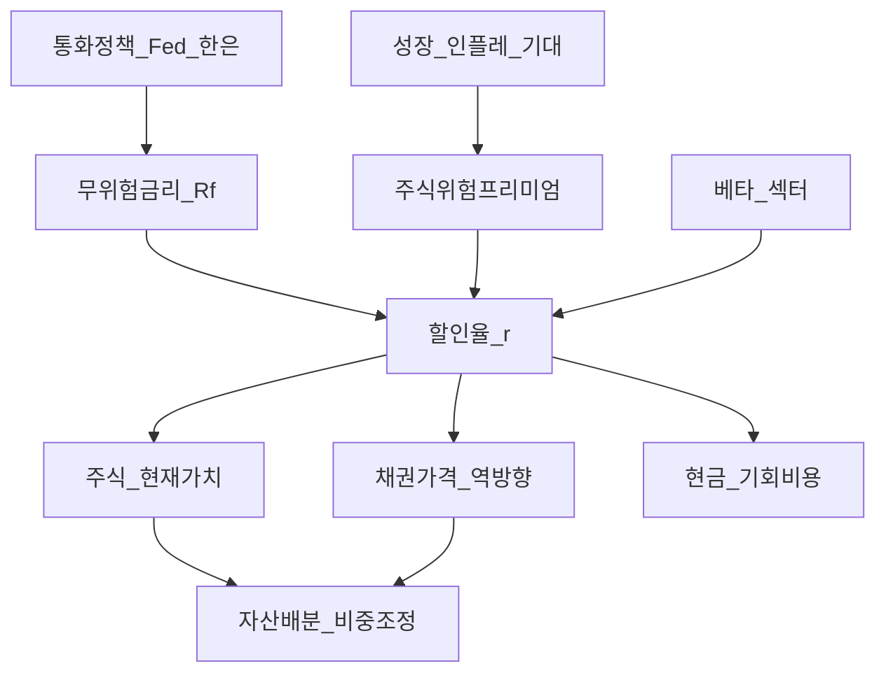
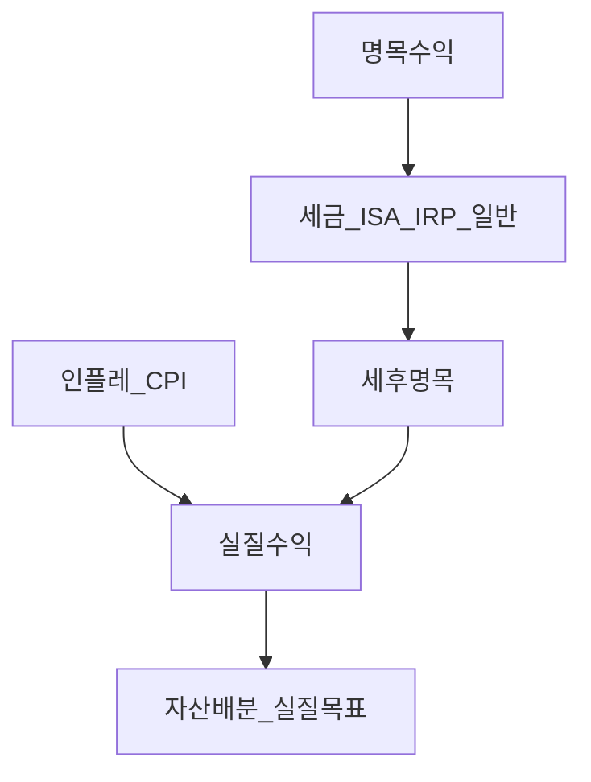

# 거시경제 06 — 자산가격·할인율·금리·실질수익·한국 ISA/IRP

> **면책**: 본 문서는 교육 목적이며, 특정 개인·법인에 대한 투자·세무·법률 자문이 아닙니다. 제도·세율·상품 조건은 변경될 수 있으므로 실행 전 공식 출처를 확인하세요.

## 메타

| 항목 | 내용 |
|------|------|
| 최종 검증일 | 2026-05-24 |
| 정책·법령 기준일 | 2025-12-31 확정, 2026 ISA·세제 개편은 본문 표기 |
| 난이도 | L4 (Graduate) — [READER-GUIDE](../docs/READER-GUIDE.md) |
| 예상 읽기 시간 | 180~210분 |
| 관련 bucket | Bucket 2~3 (코어 자산배분), Bucket 4 (위성·레버리지) |

## 0. 이 편 읽기 전 (5분)

| 항목 | 내용 |
|------|------|
| **난이도** | L4 (Graduate) — [READER-GUIDE §L등급](../docs/READER-GUIDE.md) |
| **선수** | [macroeconomics-basics](macroeconomics-basics.md), [macro-02-money-inflation](macro-02-money-inflation.md) |
| **이번 편에서 쓰는 기호** | 본문 §4·§4a 표 참고 |
| **복습 한 줄** | L3 선수 편을 먼저 읽으면 수식이 수월함 |

## TL;DR

1. **주가**는 미래 현금흐름을 **할인율(discount rate)** 로 현재가치화한 기대의 합이며, Gordon 성장모형 \(P = D_1/(r-g)\) 에서 **\(r\uparrow\)** 는 분모를 키워 **\(P\downarrow\)** — 특히 **\(g\)** 가 큰 성장주·장기 현금흐름에 민감하다.
2. **주식위험프리미엄(ERP)** \(E[R_m]-R_f\) 는 “채권 대신 주식을 들고 감수하는 추가 기대수익”이며, \(r = R_f + \beta \cdot ERP\) 로 읽으면 **무위험금리·프리미엄·베타**가 동시에 할인율을 움직인다.
3. **Fed funds(연방기금금리)** 상승은 **성장주·나스닥·QQQ** 의 밸류에이션에 직접 압력을 주고, **듀레이션 긴 현금흐름**일수록 **금리 민감도(듀레이션)** 가 커진다 — [leveraged-etf-qqq-qld.md](../04-portfolio/leveraged-etf-qqq-qld.md) 의 QLD·TQQQ는 여기에 **일일 레버리지**가 곱해져 경로 리스크가 폭발한다.
4. **수익률곡선(yield curve)** 은 **기간별 무위험금리**의 스냅샷이며, **역전(inversion)** 은 경기 둔화 **선행 신호**로 해석되지만 단독 매매 규칙은 아니다 — **스트랙·롤·플라트닝** 전략은 **매크로 시나리오**와 함께 [bonds-fixed-income.md](../03-markets/bonds-fixed-income.md) 에서 이해한다.
5. **인플레**는 **명목 수익 ≠ 실질 구매력** — Fisher 근사 \(r_{real} \approx r_{nom} - \pi^e\) 로 코어 포트의 **사후 실질수익**을 평가하고, **ISA·IRP 세후**까지 합치면 [asset-allocation.md](../04-portfolio/asset-allocation.md) 의 목표 비중이 달라질 수 있다.

---

## 1. 한 줄 정의 + 왜 중요한가
!!! info "ERP (Equity Risk Premium)"
    주식위험프리미엄 E[Rm]−Rf.

**정의**: **자산가격 거시경제(Asset Prices in Macro)** 는 **무위험금리·인플레·위험프리미엄·성장 기대·정책**이 **주식·채권·환율**의 **할인율과 현금흐름 기대**를 어떻게 바꾸는지, 그리고 그 변화가 **포트폴리오 수익·변동성·세후 실질수익**에 어떤 **비교정태(comparative statics)** 를 남기는지를 분석하는 거시금융의 핵심 연결고리이다.

**왜 중요한가** (장기 자산 형성·bucket 연결):

개별 종목의 **EPS·가이던스**는 미시이지만, “왜 금리 인상기에 **성장주 PER** 이 깎이는가”, “왜 **채권·주식이 동시에** 하락할 수 있는가(2022형)”, “**Fed funds 25bp** 가 QQQ에 얼마나 ‘가격으로’ 반영됐는가”는 **거시 할인율·프리미엄** 문제다. [macroeconomics-basics.md](macroeconomics-basics.md)에서 배운 금리·인플레를 **가격 방정식**으로 올리면, [asset-allocation.md](../04-portfolio/asset-allocation.md) 의 **주식·채권·현금 비중**, [bonds-fixed-income.md](../03-markets/bonds-fixed-income.md) 의 **듀레이션 선택**, [isa.md](../06-korea-policy/isa.md)·[isa-irp-pension-tax.md](../06-korea-policy/tax/isa-irp-pension-tax.md) 의 **세후 실질수익**을 **하나의 매크로 시나리오 표**로 통합할 수 있다. L4 학습자는 “뉴스 헤드라인”을 **파라미터 변화 → 할인율 → 자산군 상대성과**로 번역하는 것이 목표다.

---

## 2. 선수 지식 / 이후 읽을 것

**선수**:
- [macroeconomics-basics.md](macroeconomics-basics.md) — 금리·인플레·경기
- [macro-02-money-inflation.md](macro-02-money-inflation.md) — 기대인플레·명목·실질 (예정 시 basics로 대체)
- [macro-04-monetary-policy-qe.md](macro-04-monetary-policy-qe.md) — Fed·한은·QE (예정 시 basics로 대체)
- [복리와 시간가치](../01-foundations/compound-interest-and-time-value.md)
- [채권·고정수익](../03-markets/bonds-fixed-income.md) — 듀레이션·금리 역관계

**이후**:
- [자산배분](../04-portfolio/asset-allocation.md) — 60/40·코어 설계
- [leveraged-etf-qqq-qld.md](../04-portfolio/leveraged-etf-qqq-qld.md) — QQQ·QLD·금리 민감도
- [overseas-equities-intro.md](../03-markets/overseas-equities-intro.md) — 해외 ETF·환율
- [investment-tax-overview.md](../06-korea-policy/tax/investment-tax-overview.md) — 투자 소득 세제 지도
- [overseas-stocks-tax-part1-cgt.md](../06-korea-policy/tax/overseas-stocks-tax-part1-cgt.md) — 해외주식 양도세
- [03-markets/stocks-equities-intro.md](../03-markets/stocks-equities-intro.md)

---

## 3. 직관·비유

**할인율 = 미래 돈의 ‘오늘 가치’를 깎는 비율**: 1년 뒤 100만 원을 받을 때, 오늘 얼마면 되나? **10% 할인**이면 약 90.9만 원. **할인율이 10%→12%** 로 오르면 오늘 가치는 **더 낮아진다**. 주가는 **무한히 이어질 배당·이익**의 할인합이므로, 할인율 **1bp** 도 **전체 현금흐름**에 곱해진다 — 특히 **먼 미래** 현금이 큰 **성장주**는 “멀리 있는 보물”이라 **할인율 변화에 더 크게** 흔들린다.

**ERP = 위험에 대한 ‘추가 임금’**: 정부채(무위험에 가깝다고 가정) 4% vs 주식 기대 8%면, **4%p** 가 “주식 변동성·경기 리스크를 견디는 대가”다. ERP가 **넓어지면**(투자자가 더 겁먹음) 주식 **할인율 \(r\)** 이 올라가 **주가 하방** 압력. ERP가 **좁아지면** 밸류에이션 **확장(expansion)** — 2020~2021형 **저금리+높은 성장 기대** 국면.

**Fed funds = 단기 금리의 ‘앵커’**: 미국 연준의 **연방기금금리 목표**는 **초단기** 금리를 잡고, **국채 수익률곡선** 전체를 **끌어당긴다**. 성장주·기술주는 **장기 성장 스토리**에 **장기 금리·ERP** 가 할인율에 들어가므로, “Fed 25bp” 뉴스는 **QQQ·나스닥100** 에 **즉시·선행** 반영되기 쉽다 — 실물 경기·기업 이익은 **분기·연간**으로 늦게 따라온다.

**수익률곡선 = 경제의 ‘기간별 가격표’**: 2년물·10년물·30년물 **수익률**이 **역전**(단기 > 장기)하면, 시장이 “**단기는 긴축, 장기는 둔화**”를 가격에 넣은 것 — **경기침체 선행지표**로 자주 인용되지만 **오탐**도 많다. **플랫·스티프닝**은 [bonds-fixed-income.md](../03-markets/bonds-fixed-income.md) 의 **듀레이션·롤다운**과 연결.

**인플레 = 명목의 착시**: 예금 **5%** 인데 물가 **4%** 면 **실질 ~1%**. 주식 **10%** 올랐어도 물가 **8%** 면 **실질 ~2%**. **ISA 비과세 200만**도 **실질**로는 **물가 상승**에 깎인다 — [isa.md](../06-korea-policy/isa.md) 의 “세후” 위에 **실질** 층을 올려야 [asset-allocation.md](../04-portfolio/asset-allocation.md) 목표(예: 실질 4%)와 비교 가능.

**레버리지 ETF = 할인율 충격에 ‘증폭기’**: QQQ는 **1배** 나스닥100. QLD는 **일 2배 일일 리셋** — 금리 충격으로 **지수 -2%** 면 QLD는 그날 **약 -4%** (비용·추적오차 제외). **할인율↑ → 성장주↓ → QQQ↓ → QLD 더↓** — [leveraged-etf-qqq-qld.md](../04-portfolio/leveraged-etf-qqq-qld.md) 의 “코어 부적합” 논거에 **거시 할인율**이 들어간다.

---

**이 모형이 말하는 것**: 수식은 계산 절차이고, 경제 직관은 「누가 이득·손해를 보는가」「어떤 가정이 깨지면 결론이 뒤집히는가」다. 유도 각 단계마다 **가정**을 한 줄로 적어 본다.
## 4. 정식 개념·용어

| 용어 | 한글 | English | 정의 |
|------|------|----------------|
| 할인율 | 할인율 | Discount rate | 미래 CF를 현재가치로 환산하는 **요구수익률** \(r\) |
| Gordon 모형 | Gordon growth | Gordon growth model | \(P = D_1/(r-g)\), **일정 성장률 g** 가정 |
| ERP | 주식위험프리미엄 | Equity risk premium | \(E[R_m] - R_f\) |
| CAPM (교육) | 자본자산가격 | CAPM | \(E[R_i] = R_f + \beta_i (E[R_m]-R_f)\) |
| Fed funds | 연방기금금리 | Federal funds rate | 미 연준 **정책 금리** 목표 구간 |
| 수익률곡선 | 수익률곡선 | Yield curve | **만기별** 무위험(국채) 수익률 스냅샷 |
| 역전 | 역전 | Inversion | 단기 수익률 > 장기 (2s10s 등) |
| 실질금리 | 실질금리 | Real interest rate | 명목 − **기대 인플레** (Fisher) |
| 명목수익 | 명목수익 | Nominal return | **물가 미조정** 수익률 |
| 실질수익 | 실질수익 | Real return | **구매력 조정** 수익률 |
| 듀레이션 | 듀레이션 | Duration | 금리 1%↑ 시 채권가격 **% 변화** 근사 |
| 밸류에이션 | 밸류에이션 | Valuation | 가격 대 **이익·현금흐름** 배수 |
| 스트랙 | 스트랙 | Steepener | **장단기 스프레드** 확대 베팅 |
| 플래트너 | 플래트너 | Flattener | 스프레드 **축소** 베팅 |
| 세후수익 | 세후수익 | After-tax return | **양도·배당·이자세** 반영 후 |
| ISA/IRP | ISA/IRP | Tax-advantaged accounts | 한국 **비과세·이연·공제** 계좌 |

## 4a. 핵심 용어 (본문 등장 순)

| 용어 | 한 줄 | 관련 이론 | glossary |
|------|------|----------------|
| 할인율 | 미래 현금흐름을 오늘 가치로 환산하는 요구수익률 \(r\) | DCF·Gordon | — |
| Gordon 모형 | \(P=D_1/(r-g)\); 일정 성장 가정의 배당할인 | Gordon growth | — |
| ERP | 주식 기대수익 − 무위험; 위험 프리미엄 | CAPM·위험가격 | — |
| CAPM | \(E[R_i]=R_f+\beta_i(E[R_m]-R_f)\) | 자본자산가격 | [CAPM](../08-advanced/capm-and-risk-return.md) |
| Fed funds | 미 연준 정책 금리 목표; 단기 금리 앵커 | 통화정책 | — |
| 수익률곡선 | 만기별 국채 수익률 스냅샷 | 기간구조 | — |
| 역전 | 단기 수익률 > 장기; 둔화 선행 신호(확률적) | 경기 예측 | — |
| 실질금리 | 명목 − 기대 인플레 (Fisher 근사) | Fisher | — |
| 명목·실질수익 | 구매력 조정 전·후 포트 수익 | Fisher·세후 | — |
| 듀레이션 | 금리 1%p 변화 시 채권가격 % 민감도 | 채권 민감도 | [채권](../03-markets/bonds-fixed-income.md) |
| 밸류에이션 | 가격 대 이익·현금흐름 배수·IV | 절대·상대가치 | [밸류에이션](../03-markets/equity-valuation-fundamentals.md) |
| QQQ·레버리지 | 성장주 할인율 충격·일일 리셋 증폭 | 레버리지 ETF | [QQQ](../00-roadmap/glossary.md#qqq) |
| ISA·IRP | 세후·실질수익 평가에 필요한 계좌 레이어 | 세제·실질 | [ISA](../00-roadmap/glossary.md#isa-individual-savings-account-개인종합자산관리계좌) |

## 4b. 관련 이론 미니맵

- **[통화정책·QE](macro-04-monetary-policy-qe.md)** — Fed funds·실질금리·전달경로의 출발점
- **[CAPM](../08-advanced/capm-and-risk-return.md)** — β·ERP로 할인율 분해
- **[주식 밸류에이션](../03-markets/equity-valuation-fundamentals.md)** — DCF·멀티플·MoS 실무
- **[채권·고정수익](../03-markets/bonds-fixed-income.md)** — \(R_f\)·듀레이션·2022형 동반하락
- **[자산배분](../04-portfolio/asset-allocation.md)** — 할인율·세후 실질을 비중 설계로

---

## 5. 메커니즘

### 5.1 할인율 → 주식·채권·현금

| 충격 | \(R_f\) | ERP | 성장 기대 \(g\) | 주식(성장) | 주식(가치) | 장기채 | 단기채/현금 |
|------|------|----------------|
| 금리 인상 | ↑ | ? | ? | **↓** (할인↑) | ↓ (덜) | **↓** | ↑ (수익↑) |
| ERP 확대 | — | ↑ | — | **↓** | ↓ | ↓? | 상대 매력↑ |
| 성장 둔화 | ↓? | ↑ | **↓** | **↓↓** (g↓+ERP↑) | ↓ | ↑? | — |
| 인플레 서프라이즈 | ↑ | 혼재 | ↓? | 혼재 | 상대 강? | ↓ | 실질↓ |

**핵심**: 같은 “금리 인상”도 **인플레 대응型** vs **경기 과열 억제型** 에 따라 **ERP·g** 가 달라 **주식 방향이 갈린다** — 헤드라인만으로 매매하지 말 것.

### 5.2 Fed funds · 성장주 · QQQ · 레버리지

**성장주 민감도 직관**: PER 40·장기 \(g\) 8% 가정 vs PER 15·\(g\) 3% — **\(r\)** 1%p 상승 시 전자의 **분모·민감도**가 더 크다. **Fed dot plot·FOMC** 는 **\(r\)** 의 **기대 경로**를 바꾸므로 **멀티플 확장/수축**이 **실적 발표 전** 일어날 수 있다.

### 5.3 수익률곡선 전략 (교육용)

| 전략 | 베팅 | 매크로 해석 | 리스크 |
|------|------|----------------|
| **롤다운** | 중기채 보유 | 곡선 **정상** 시 만기 다가오며 수익률↓ 가정 | **스티프닝** 시 손실 |
| **2s10s 스티프너** | 장기↑·단기↓ 스프레드 | **완화·회복** 기대 | **역전 지속** 시 손실 |
| **2s10s 플래트너** | 스프레드 축소 | **긴축·침체** | **재flation** 시 손실 |
| **캐시·단기** | T-bill/MM | **불확실·역전** | **금리 인하** 시 기회비용 |
| **바벨** | 단기+장기 | **중기 변동성** 회피 | **커브 중간** 이동 |

[bonds-fixed-income.md](../03-markets/bonds-fixed-income.md) §듀레이션과 연결: **플래트너** 는 종종 **장기채 롱 + 단기채 숏**(레버리지·파생) — 개인 ETF 투자자는 **듀레이션 노출**로 근사.

### 5.4 인플레 · 실질수익 · 세후 (한국 계좌)

---

## 6. 수식·모델 (유도·비교정태)

### 6.1 일반 할인모형에서 주가

**가정**: 배당 \(D_t\), 요구수익률 \(r\) (상수), \(r > g\).

| 기호 | 이름 | 이 식에서 의미 |
|------|------|----------------|
| \(r\) | 할인율·수익률 | 기간당 이자·요구수익률 |
| \(n\) | 기간 | 연·월 등 복리·할인에 쓰는 횟수 |
| \(PV\) | 현재가치 | 오늘 시점으로 환산한 금액 |
| \(FV\) | 미래가치 | 미래 시점의 목표·결과 금액 |

\[
P_0 = \sum_{t=1}^{\infty} \frac{E[D_t]}{(1+r)^t}
\]

**읽는 법**: **P_0**와 **t**의 관계를 위 식으로 쓴다. 경제·재무 해석은 변수표 「이 식에서 의미」와 [DEPTH-STANDARD](../docs/DEPTH-STANDARD.md) 기호 예제를 맞춘다.
**유도 (L4)**:
1. **정의**: **P_0**, **t**, **infty**를 동일 시점·동일 통화로 맞춘다. — 단위 불일치면 식이 무의미해진다.
2. **식 변형**: 양변을 정리해 목표 변수를 한쪽에 둔다. — 할인·복리는 **시점 이동**이 핵심이다.
3. **해석**: 부호·크기가 경제 직관과 맞는지 확인한다. — 극단값에서 단조성·한계를 점검한다.

**유도 (Gordon으로 수렴)**: \(D_t = D_0(1+g)^{t-1}\), \(g\) 상수.

기하급수 \(\sum_{t=1}^{\infty} x^{t-1} = 1/(1-x)\), \(x = (1+g)/(1+r)\), \(r>g\) 이면:

| 기호 | 이름 | 이 식에서 의미 |
|------|------|----------------|
| \(r\) | 할인율·수익률 | 기간당 이자·요구수익률 |
| \(n\) | 기간 | 연·월 등 복리·할인에 쓰는 횟수 |
| \(PV\) | 현재가치 | 오늘 시점으로 환산한 금액 |
| \(FV\) | 미래가치 | 미래 시점의 목표·결과 금액 |

\[
P_0 = \frac{D_1}{r-g}, \quad D_1 = D_0(1+g)
\]

**읽는 법**: **P_0**와 **D_1**의 관계를 위 식으로 쓴다. 경제·재무 해석은 변수표 「이 식에서 의미」와 [DEPTH-STANDARD](../docs/DEPTH-STANDARD.md) 기호 예제를 맞춘다.
**유도 (L4)**:
1. **정의**: **P_0**, **D_1**, **D_1**를 동일 시점·동일 통화로 맞춘다. — 단위 불일치면 식이 무의미해진다.
2. **식 변형**: 양변을 정리해 목표 변수를 한쪽에 둔다. — 할인·복리는 **시점 이동**이 핵심이다.
3. **해석**: 부호·크기가 경제 직관과 맞는지 확인한다. — 극단값에서 단조성·한계를 점검한다.
**비교정태**: \(\partial P/\partial r = -D_1/(r-g)^2 < 0\), \(\partial P/\partial g = D_1/(r-g)^2 > 0\). **\(r\)** 와 **\(g\)** 가 **동시에** 움직이면 방향은 **net effect** — 금리 인상이 **경기 둔화→g↓** 를 동반하면 **주가 이중 타격**.

### 6.2 할인율 분해 — CAPM·ERP

| 기호 | 이름 | 이 식에서 의미 |
|------|------|----------------|
| \(r\) | 할인율·수익률 | 기간당 이자·요구수익률 |
| \(n\) | 기간 | 연·월 등 복리·할인에 쓰는 횟수 |
| \(PV\) | 현재가치 | 오늘 시점으로 환산한 금액 |
|| 기호 | 이름 | 이 식에서 의미 |
|------|------|----------------|
| \(r\) | 할인율·수익률 | 기간당 이자·요구수익률 |
| \(n\) | 기간 | 연·월 등 복리·할인에 쓰는 횟수 |
| \(PV\) | 현재가치 | 오늘 시점으로 환산한 금액 |
| \(FV\) | 미래가치 | 미래 시점의 목표·결과 금액 |

\[
R^{ISA}_{real} \approx \frac{1 + R_{nom}(1-\tau_{ISA})}{1+\pi} - 1
\]

**읽는 법**: **명목** 수익에서 **인플레**를 반영하면 **실질** 체감 수익을 본다. 정밀식은 본문 또는 §4 표를 따른다.
**유도 (L4)**:
1. **정의**: **R_**, **R_**, **tau_**를 동일 시점·동일 통화로 맞춘다. — 단위 불일치면 식이 무의미해진다.
2. **식 변형**: 양변을 정리해 목표 변수를 한쪽에 둔다. — 할인·복리는 **시점 이동**이 핵심이다.
3. **해석**: 부호·크기가 경제 직관과 맞는지 확인한다. — 극단값에서 단조성·한계를 점검한다.

**유도 의미**: **같은 \(R_{nom}\)** 이라도 **\(\tau\)** 차이 → **실질 목표 달성**에 필요한 **주식 비중**·**공격성**이 달라짐 — **계좌 래핑(wrapping)** 이 [asset-allocation.md](../04-portfolio/asset-allocation.md) 의 **실행 층**.

### 6.7 비교정태학 — 파라미터 1%p 변화 (교육용)

| 파라미터 | Gordon \(P\) | ERP 확장 | Fed↑→\(R_f\)↑ | 인플레↑ | 성장주 vs 가치 |
|------|------|----------------|
| \(r \uparrow 1\)pp | **↓** | ↓ | ↓ | (명목↑) | **성장 ↓↓** |
| \(g \uparrow 1\)pp | **↑** | — | — | — | 성장 ↑↑ |
| ERP ↑ 1pp | **↓** | — | — | — | 고베타 ↓↓ |
| \(\pi^e \uparrow\) | 혼재 | ERP? | \(R_f\)↑? | **실질↓** | 실질 ERP? |
| 곡선 역전 | — | **↑** (공포) | — | — | **사이클 후행주** 상대 |

**IR·매크로 질문**: (1) **실적 g** vs **밸류 g** — 어느 쪽이 깨졌는가? (2) **\(r\)** 상승이 **\(R_f\)** 인가 **ERP** 인가? (3) **세후·실질**로 목표 달성 가능한가?

### 6.8 수익률곡선·포트 — 시나리오 테이블 (핵심)

아래는 **교육용 가상** 매크로 시나리오와 **코어 포트** ([asset-allocation.md](../04-portfolio/asset-allocation.md) 60/40 예시) **상대적 함의**. “매수/매도” 신호가 **아님**.

| 시나리오 | Fed·한은 | 곡선 | 인플레 | ERP | 성장 \(g\) | QQQ/성장 | 장기채 | 단기/현금 | 60/40 코어 | ISA/IRP 포커스 |
|------|------|----------------|
| **A. 부드러운 연착륙** | 동결→인하 | 정상화 | ↓ | ↓ | 안정 | **↑↑** | ↑ | ↓ | **균형** | ISA 코어 유지 |
| **B. 금리 고점 장기** | 고점 유지 | **플랫** | sticky | 중립 | 둔화 | **↓** | ↓ | **↑** | 주식↓ 채권혼 | **채권 듀레이션↓** 검토 |
| **C. 역전+침체** | 급인하 | **역전** | ↓ | **↑** | **↓↓** | **↓↓** | **↑↑** | 중립 | **채권 상대** | IRP **납입 유지** |
| **D. 스태그플레이션** | 제한적 | **스티프** | **↑↑** | **↑** | ↓ | **↓↓** | **↓↓** | 실질↓ | **둘 다 약** | **실질**·인플레연동 |
| **E. 재flation 랠리** | 인하 | **스티프닝** | 중립 | **↓** | **↑** | **↑↑↑** | ↓ | ↓ | **주식** | ISA **비과세** 극대 |
| **F. 금융 스트레스** | 긴급인하 | **bull steep** | ↓ | **↑↑** | ↓ | **변동성↑** | ↑ | **↑** | **현금↑** | QLD **금지** |

**레버리지 주의**: 시나리오 **C·D·F** 에서 [leveraged-etf-qqq-qld.md](../04-portfolio/leveraged-etf-qqq-qld.md) 의 **QLD·TQQQ** 는 **코어·방어**가 아니라 **투기·단기** — **\(r\)** · **ERP** 이중 충격 + **변동성 붕괴**.

---

|------|------|----------------|
\[
r_{real} \approx r_{nom} - \pi^e
\]

**읽는 법**: **명목** 수익에서 **인플레**를 반영하면 **실질** 체감 수익을 본다. 정밀식은 본문 또는 §4 표를 따른다.
**유도 (L4)**:
1. **정의**: **r_**, **r_**를 동일 시점·동일 통화로 맞춘다. — 단위 불일치면 식이 무의미해진다.
2. **식 변형**: 양변을 정리해 목표 변수를 한쪽에 둔다. — 할인·복리는 **시점 이동**이 핵심이다.
3. **해석**: 부호·크기가 경제 직관과 맞는지 확인한다. — 극단값에서 단조성·한계를 점검한다.

**포트 실질수익** (1기간):

| 기호 | 이름 | 이 식에서 의미 |
|------|------|----------------|
\[
R_{real} \approx \frac{1+R_{after-tax}}{1+\pi} - 1
\]

**읽는 법**: **명목** 수익에서 **인플레**를 반영하면 **실질** 체감 수익을 본다. 정밀식은 본문 또는 §4 표를 따른다.
**유도 (L4)**:
1. **정의**: **R_**, **R_**를 동일 시점·동일 통화로 맞춘다. — 단위 불일치면 식이 무의미해진다.
2. **식 변형**: 양변을 정리해 목표 변수를 한쪽에 둔다. — 할인·복리는 **시점 이동**이 핵심이다.
3. **해석**: 부호·크기가 경제 직관과 맞는지 확인한다. — 극단값에서 단조성·한계를 점검한다.
**유도**: 구매력 = 세후 명목 / 물가지수. **인플레↑** 인데 **명목수익 고정**(예: 저금리 예금) → **실질↓**.

### 6.5 채권 가격·듀레이션 (매크로 연결)

**1기간 채권** (교육): \(P = \frac{C + F}{1+y}\). **\(y\uparrow \Rightarrow P\downarrow\)**.

**Macaulay/수정 듀레이션** \(D_mod\): \(\Delta P/P \approx -D_mod \cdot \Delta y\).

**유도 스케치**: \(P(y) = \sum \frac{CF_t}{(1+y)^t}\), \(\frac{dP}{dy} = -\sum t \frac{CF_t}{(1+y)^{t+1}} = -\frac{D_{mac}}{1+y} P\).

**매크로**: **금리 인상 국면** — 주식(할인↑) + **장기채(가격↓)** 동반 가능 → [asset-allocation.md](../04-portfolio/asset-allocation.md) **60/40** 도 **동시 하락** (2022 교훈).

### 6.6 ISA·IRP 세후 실질수익
|   이름   |   이 식에서 의미   | §4 용어·식 맥락에서 확인 |
| 기호 | 이름 | 이 식에서 의미 |
|------|------|----------------|
|            \(R\)            | R | 기간당 이자·요구수익률 |
(가상 프레임)

**일반 해외주식** (교육, 2025 기준 개요): 양도차익 **22%** (금융소득종합과세 문맥 — [part1](../06-korea-policy/tax/overseas-stocks-tax-part1-cgt.md)).

**ISA** (3년, 일반형): 비과세 한도 내 **0%**, 초과 **9.9%** ([isa.md](../06-korea-policy/isa.md), [isa-irp-pension-tax.md](../06-korea-policy/tax/isa-irp-pension-tax.md)).

**IRP**: 매매 **과세이연**, 수령 시 **연금소득세** — **한계세율**이 \(R_{after-tax}\) 를 결정.

**통합**:

\[
R^{ISA}_{real} \approx \frac{1 + R_{nom}(1-\tau_{ISA})}{1+\pi} - 1
\]

**읽는 법**: **명목** 수익에서 **인플레**를 반영하면 **실질** 체감 수익을 본다. 정밀식은 본문 또는 §4 표를 따른다.
**유도 (L4)**:
1. **정의**: **R_**, **R_**, **tau_**를 동일 시점·동일 통화로 맞춘다. — 단위 불일치면 식이 무의미해진다.
2. **식 변형**: 양변을 정리해 목표 변수를 한쪽에 둔다. — 할인·복리는 **시점 이동**이 핵심이다.
3. **해석**: 부호·크기가 경제 직관과 맞는지 확인한다. — 극단값에서 단조성·한계를 점검한다.

**유도 의미**: **같은 \(R_{nom}\)** 이라도 **\(\tau\)** 차이 → **실질 목표 달성**에 필요한 **주식 비중**·**공격성**이 달라짐 — **계좌 래핑(wrapping)** 이 [asset-allocation.md](../04-portfolio/asset-allocation.md) 의 **실행 층**.

### 6.7 비교정태학 — 파라미터 1%p 변화 (교육용)

| 파라미터 | Gordon \(P\) | ERP 확장 | Fed↑→\(R_f\)↑ | 인플레↑ | 성장주 vs 가치 |
|------|------|----------------|
| \(r \uparrow 1\)pp | **↓** | ↓ | ↓ | (명목↑) | **성장 ↓↓** |
| \(g \uparrow 1\)pp | **↑** | — | — | — | 성장 ↑↑ |
| ERP ↑ 1pp | **↓** | — | — | — | 고베타 ↓↓ |
| \(\pi^e \uparrow\) | 혼재 | ERP? | \(R_f\)↑? | **실질↓** | 실질 ERP? |
| 곡선 역전 | — | **↑** (공포) | — | — | **사이클 후행주** 상대 |

**IR·매크로 질문**: (1) **실적 g** vs **밸류 g** — 어느 쪽이 깨졌는가? (2) **\(r\)** 상승이 **\(R_f\)** 인가 **ERP** 인가? (3) **세후·실질**로 목표 달성 가능한가?

### 6.8 수익률곡선·포트 — 시나리오 테이블 (핵심)

아래는 **교육용 가상** 매크로 시나리오와 **코어 포트** ([asset-allocation.md](../04-portfolio/asset-allocation.md) 60/40 예시) **상대적 함의**. “매수/매도” 신호가 **아님**.

| 시나리오 | Fed·한은 | 곡선 | 인플레 | ERP | 성장 \(g\) | QQQ/성장 | 장기채 | 단기/현금 | 60/40 코어 | ISA/IRP 포커스 |
|------|------|----------------|
| **A. 부드러운 연착륙** | 동결→인하 | 정상화 | ↓ | ↓ | 안정 | **↑↑** | ↑ | ↓ | **균형** | ISA 코어 유지 |
| **B. 금리 고점 장기** | 고점 유지 | **플랫** | sticky | 중립 | 둔화 | **↓** | ↓ | **↑** | 주식↓ 채권혼 | **채권 듀레이션↓** 검토 |
| **C. 역전+침체** | 급인하 | **역전** | ↓ | **↑** | **↓↓** | **↓↓** | **↑↑** | 중립 | **채권 상대** | IRP **납입 유지** |
| **D. 스태그플레이션** | 제한적 | **스티프** | **↑↑** | **↑** | ↓ | **↓↓** | **↓↓** | 실질↓ | **둘 다 약** | **실질**·인플레연동 |
| **E. 재flation 랠리** | 인하 | **스티프닝** | 중립 | **↓** | **↑** | **↑↑↑** | ↓ | ↓ | **주식** | ISA **비과세** 극대 |
| **F. 금융 스트레스** | 긴급인하 | **bull steep** | ↓ | **↑↑** | ↓ | **변동성↑** | ↑ | **↑** | **현금↑** | QLD **금지** |

**레버리지 주의**: 시나리오 **C·D·F** 에서 [leveraged-etf-qqq-qld.md](../04-portfolio/leveraged-etf-qqq-qld.md) 의 **QLD·TQQQ** 는 **코어·방어**가 아니라 **투기·단기** — **\(r\)** · **ERP** 이중 충격 + **변동성 붕괴**.

---

## 7. 한국 적용

### 7.1 2025년 기준 (확정·제도 맥락)

| 영역 | 한국 맥락 | 자산가격·포트 질문 |
|------|------|----------------|
| **한은 기준금리** | 미 Fed·물가·환율 연동 | **원화 \(R_f\)** · **미국 할인율** 동시 추적 |
| **해외 ETF (QQQ)** | 달러 자산·양도세 | **ISA 3년** vs 일반 [part1](../06-korea-policy/tax/overseas-stocks-tax-part1-cgt.md) |
| **채권 ETF** | 국채·미국채 ETF | [bonds-fixed-income.md](../03-markets/bonds-fixed-income.md) **듀레이션** |
| **ISA** | 비과세 200만·9.9% | **세후 \(R\)** → **실질** 목표 |
| **IRP** | 납입 공제·이연 | **장기 \(r\)** 변동 시 **DCA** [irp.md](../06-korea-policy/irp.md) |
| **DB 재직** | ETF 불가 | **ISA·IRP** 에 [asset-allocation.md](../04-portfolio/asset-allocation.md) |

**환율 층**: QQQ 수익 = **주가(USD)** + **USD/KRW**. Fed 금리↑ → **달러 강세** 가능 → 원화 투자자 **환산 수익** 혼재 — [macro-05-open-economy-fx.md](macro-05-open-economy-fx.md) (예정 시 basics).

### 7.2 2026년 개편·시행 예정 (해당 시)

| 항목 | 2025 | 2026 (시행 여부 명시) |
|------|------|----------------|
| ISA 비과세 | 200만(서민 400만) | **500만/1,000만** 확대안 — **시행 확인** [isa.md](../06-korea-policy/isa.md) |
| ISA 납입·한도 | 연 2,000만·총 1억 | **4,000만·2억** 안 — **시행 확인** |
| IRP·DC 추가 | DC 추가납입 | **2026 +300만** (DC, DB 없음) [isa-irp-pension-tax.md](../06-korea-policy/tax/isa-irp-pension-tax.md) |
| 금융투자소득 | 분리과세 구조 | **개편 논의** — [investment-tax-overview.md](../06-korea-policy/tax/investment-tax-overview.md) 추적 |

**법·정책 근거**: 소득세법(금융소득), ISA 시행령, 연금세법 — [law.go.kr](https://www.law.go.kr), 국세청 — 실행 전 확인.

### 7.3 한국 투자자용 “매크로→계좌” 체크리스트 (8항)

1. **Fed·한은** 방향이 **\(R_f\)** 인가 **term premium** 인가?  
2. **ERP** 확대/축소 — VIX·credit spread **교차검증**  
3. **성장주(QQQ)** — **\(g\)** vs **\(r\)** 중 무엇이 바뀌었는가?  
4. **채권** — **듀레이션**이 시나리오 **B·D** 에 맞는가?  
5. **곡선 역전** — **선행지표**로만, **단독 매매 금지**  
6. **명목 vs 실질** — CPI·**세후** 반영했는가?  
7. **계좌** — QQQ는 **ISA/IRP** 우선? [account-product-tax-map.md](../06-korea-policy/tax/account-product-tax-map.md)  
8. **QLD** — **할인율 충격**에 코어로 버틸 수 있는가? → **아니오** [leveraged-etf-qqq-qld.md](../04-portfolio/leveraged-etf-qqq-qld.md)

---

## 8. 숫자 예제 (가상)

> 모든 인물·금액·기업명은 가상입니다.

### 예제 1 — Gordon 모형: Fed 금리↑와 성장주

가상 성장주 **G-Tech**: \(D_1 = 4\) (만 원/주), \(g = 8\%\), 초기 \(r = 12\%\).

\[
P = \frac{4}{0.12 - 0.08} = 100
\]

**Fed 긴축**으로 \(r \to 13\%\) (1%p), \(g\) **8% 유지** (낙관):

\[
P = \frac{4}{0.13 - 0.08} = 80 \quad (-20\%)
\]

**현실적**: \(g \to 6\%\) 동반:

\[
P = \frac{4}{0.13 - 0.06} \approx 57.1 \quad (-43\%)
\]

**해석**: **할인율**과 **성장 하향**이 **곱**으로 작용 — “금리만 1%” 뉴스로 **-20%** 를 기대하면 **위험**.

### 예제 2 — ERP·베타: QQQ vs 방어주

가상: \(R_f = 4\%\), \(ERP = 5\%\).

- **QQQ 대리** \(\beta = 1.2\): \(E[R] = 4 + 1.2 \times 5 = 10\%\) → Gordon \(r \approx 10\%\) (단순)
- **유틸리티** \(\beta = 0.6\): \(E[R] = 7\%\)

**ERP → 6%** (공포):

- QQQ: \(4 + 7.2 = 11.2\%\) → **\(P\downarrow\)**  
- 유틸: \(7.6\%\) → **상대적 방어**

**포트**: [asset-allocation.md](../04-portfolio/asset-allocation.md) **코어**는 QQQ만이 아니라 **글로벌·가치·채권**으로 **\(\beta\)** 분산.

### 예제 3 — 인플레·세후·실질 (ISA vs 일반)

가상 직장인 **A**: 1년 **명목 +12%**, CPI **+3%**, 해외 ETF.

| 계좌 | 세율(교육) | 세후 명목 | **실질** (근사) |
|------|------|----------------|
| 일반 | 22% on gain | \(12\% \times (1-0.22) = 9.36\%\) | **~6.2%** |
| ISA (한도 내) | 0% | 12% | **~8.7%** |
| IRP (이연, 수령 8% 가정) | 복잡 | **장기** | **장기 \(r\)** 민감 |

**10년 복리** (가상, 세후 실질 6% vs 8.7%): **PV** **M** → **FV** 약 **F₁** vs **F₂** — **계좌 선택**이 **매크로 수익**과 **동급** 중요 — [isa-irp-pension-tax.md](../06-korea-policy/tax/isa-irp-pension-tax.md).

### 예제 4 — 수익률곡선·채권 (듀레이션)

가상 **미 10년** \(y = 4\%\), **\(D_mod = 8\)**. Fed **hawkish** → \(\Delta y = +0.5\%\)p:

\[
\Delta P/P \approx -8 \times 0.005 = -4\%
\]

**2년** \(D_mod = 2\): **-1%**. **시나리오 B** (고금리 장기): [bonds-fixed-income.md](../03-markets/bonds-fixed-income.md) — **단기·현금** 비중↑, **장기채** 축소 검토(교육).

### 예제 5 — QLD vs QQQ (할인율 충격 + 변동성)

가상 3일: QQQ **-2%, +1%, -3%** (합 **-4.04%** 복리).

- **QQQ**: 약 **-4.04%**
- **QLD 2× 일일**: \((0.96)(1.02)(0.94) - 1 \approx -8.0\%\) (비용 제외)

**Fed 서프라이즈 hawkish** 주에 **성장주 할인↑** → QQQ **-5%** 면 QLD **~-10%** — **코어**로 **회복 불가** 경로 — [leveraged-etf-qqq-qld.md](../04-portfolio/leveraged-etf-qqq-qld.md).

---
## 9. FAQ

**Q1. Gordon \(P = D_1/(r-g)\) 는 “주가 공식”으로 써도 되나?**  
**A1.** **교육·직관**용이다. 실제 \(r, g\) 는 **시변·불확실**하고, **배당 vs 자사주·FCF** 선택, **단계별 성장**이 있다. **방향성**( \(r\uparrow \Rightarrow P\downarrow\) )과 **민감도** 학습에 쓰고, 실무 밸류에이션은 **DCF·멀티플**을 [stocks-equities-intro.md](../03-markets/stocks-equities-intro.md) 와 함께 본다.

**Q2. ERP는 어디서 구하나? 역사적 평균을 쓰면 되나?**  
**A2.** **역사적 ERP**(예: 100년 미국)는 **표본·측정** 논쟁이 크다. **전향(forward) ERP** 는 **애널리스트 이익 기대·implied cost of equity** 에서 추정하기도 한다. L4에서는 **“할인율의 한 조각”** 으로 이해하고, **절대값**보다 **확대/축소 방향**에 집중.

**Q3. Fed funds 올리면 QQQ만 떨어지나?**  
**A3.** **성장·장기 CF·고베타** 에 **상대적으로** 크다. **가치·금융·에너지** 는 **상대 강세**할 수 있다. **전체 시장**은 **ERP·실적**에 좌우 — “QQQ만 매도”가 **항상** 최적은 아님. [asset-allocation.md](../04-portfolio/asset-allocation.md) **코어**는 **분산**.

**Q4. 수익률곡선 역전이면 주식을 팔아야 하나?**  
**A4.** 역전은 **침체 확률↑** 의 **선행 통계**일 뿐 **타이밍 신호**가 아니다. **선행 6~18개월** 분산, **오탐** 다수. **시나리오 C** 로 **채권·현금·듀레이션**을 **검토**하되, **개인 목표·세금·ISA** 와 [rebalancing-and-dca.md](../04-portfolio/rebalancing-and-dca.md) 규칙 우선.

**Q5. 인플레 4%인데 예금 5%면 이득 아닌가?**  
**A5.** **명목 1%p** 실질 — **세금** 후 더 줄 수 있다. **주식 12%** 도 **실질 8%** — **변동성** 대가. **목표**가 **실질 4%** 면 **명목**만 보면 **착시**.

**Q6. ISA와 IRP 중 QQQ는 어디에?**  
**A6.** **ISA**: 3년 **비과세·손익통산** — **매매 단계** 유리. **IRP**: **납입 공제·이연** — **장기 적립**. **둘 다** 가능하면 [account-product-tax-map.md](../06-korea-policy/tax/account-product-tax-map.md) · [isa.md](../06-korea-policy/isa.md) · [irp.md](../06-korea-policy/irp.md) 로 **한도·기간** 최적화. **일반 계좌** QQQ는 [overseas-stocks-tax-part2-dividend.md](../06-korea-policy/tax/overseas-stocks-tax-part2-dividend.md) 배당·양도 포함.

**Q7. 2022처럼 주식·채권이 같이 떨어지면 60/40이 깨진 건가?**  
**A7.** **60/40** 은 **항상 양수 상관**을 보장하지 않는다. **인플레·급격한 \(R_f\)** 상승 시 **둘 다** 할인·가격 하락. **역할**은 **장기 분산·리밸런싱** — [bonds-fixed-income.md](../03-markets/bonds-fixed-income.md), **듀레이션·인플레연동** 검토.

**Q8. 매크로 시나리오 표로 매매하면 되나?**  
**A8.** **아니다.** 표는 **교육용 사고 프레임**. **확률·타이밍·세금·행동** 오류가 크다. **코어**는 [asset-allocation.md](../04-portfolio/asset-allocation.md) **전략적 비중**, **위성**만 **제한적** 전술. **QLD** 로 시나리오 **베팅**은 **금지에 가깝게** — [leveraged-etf-qqq-qld.md](../04-portfolio/leveraged-etf-qqq-qld.md).

---

## 10. 함정·리스크·한계

- **단일 변수 착각**: “금리↑=주식↓” — **인플레·실적·ERP** 동시 이동.
- **Gordon 과잉 적용**: **\(g \ge r\)** , **일시적 고성장** 구간 오용.
- **ERP 절대값 집착**: 모형 **민감도**가 큼 — **방향·spread** 위주.
- **곡선 역전 = 매도**: **선행**일 뿐, **정확한 바닥/천장** 아님.
- **명목 수익 자만**: **실질·세후** 무시 → **목표 착각**.
- **QLD/TQQQ 코어화**: **할인율·변동성** 이중 증폭 — **Bucket 4** 한정.
- **한국만 보기**: QQQ·미국채·Fed — **글로벌 할인율** 동기화.
- **모형 ≠ 예측**: L4는 **비교정태·메커니즘** — **알파** 약속 없음.
- **세법 변경**: 2026 ISA·금융투자소득 — **공식 출처** 재확인.
- **유동성·환율**: **스트레스(F)** 에서 **상관 ↑** — 분산 **일시 붕괴**.

---

**Q. 실무에서는?**  
교과서 식·기호를 그대로 적용하기 전에 **수수료·세금·데이터 시점**을 분리한다. 숫자는 [DEPTH-STANDARD](../docs/DEPTH-STANDARD.md)처럼 기호만 먼저 맞추고, 법령·시장 수치는 §8 표·외부 출처로 갱신한다.

## 11. 심화 읽기

- [공식 출처](../references/sources.md)
- 교재·논문 (영문): Cochrane *Asset Pricing* (할인율·ERP); Shiller *Irrational Exuberance* (밸류에이션·심리); Campbell, Lo & MacKinlay *The Econometrics of Financial Markets*
- 연계 문서:
  - [bonds-fixed-income.md](../03-markets/bonds-fixed-income.md) — 듀레이션·곡선
  - [asset-allocation.md](../04-portfolio/asset-allocation.md) — 60/40·코어
  - [leveraged-etf-qqq-qld.md](../04-portfolio/leveraged-etf-qqq-qld.md) — QQQ·QLD
  - [isa.md](../06-korea-policy/isa.md), [irp.md](../06-korea-policy/irp.md)
  - [isa-irp-pension-tax.md](../06-korea-policy/tax/isa-irp-pension-tax.md), [investment-tax-overview.md](../06-korea-policy/tax/investment-tax-overview.md)
  - [overseas-stocks-tax-part1-cgt.md](../06-korea-policy/tax/overseas-stocks-tax-part1-cgt.md), [part3-scenarios](../06-korea-policy/tax/overseas-stocks-tax-part3-scenarios.md)

---

## 연습문제 (L4, 기호)

1. 위 §6 주요 식에서 변수 하나를 미지로 두고, 나머지를 기호로 둔 **관계식**을 쓰시오.
2. 가정이 깨질 때(유동성·세금·다중 IRR 등) 위 식의 **한계**를 기호·부등식으로 서술하시오.
3. §8 예제와 동일 기호(M·P·PV 등)로 **부호·단조성**만 검증하는 짧은 논증을 하시오.

### 해설 키

1. 직전 변수표의 「이 식에서 의미」를 이용해 동일 차원으로 정리한다.
2. 「가정이 깨지면」 절의 한계 사례와 연결한다.
3. 숫자 대입 없이 **부호**·**단위** 일치만 확인한다.
## 12. 스스로 점검 퀴즈

1. Gordon 모형에서 \(r\) 12%→14%, \(g\) 6% 고정일 때 \(P = D_1/(r-g)\) 의 **방향**과 **\(g\) 1%p 하향** 시 **어느 쪽이 더 큰 % 하락**을 만드는지 직관을 설명하라.
2. **ERP** 가 4%→6%로 확대될 때 \(\beta=1.3\) 종목과 \(\beta=0.7\) 종목의 **요구수익률 변화**를 CAPM으로 계산하라 ( \(R_f\) 고정).
3. **Fed funds** 인상이 **성장주**에 **가치주**보다 큰 이유를 **할인율·CF 기간·베타** 로 설명하라.
4. **2s10s 역전**을 **선행지표**로 쓸 때 **함정** 두 가지를 쓰라.
5. 명목 10%, CPI 4%, **ISA 0% 세율** vs **일반 22%** 일 때 **세후 실질수익**을 근사하라.
6. **시나리오 D(스태그플레이션)** 에서 **장기채·성장주·현금** 의 **상대적** 함의를 §6.8 표에서 찾아 **한국 ISA 투자자** 관점으로 재서술하라.
7. **QLD** 가 QQQ 대비 **Fed hawkish 서프라이즈** 주에 **더 큰 손실**을 보는 **거시·구조** 이유 두 가지(할인율 외 1)를 쓰라.
8. [asset-allocation.md](../04-portfolio/asset-allocation.md) **60/40** 이 **2022형** (주식·채권 동반 하락)에서 **완전히 실패**했다고 말할 수 있는지 — **듀레이션·인플레** 관점에서 논하라.

??? note "정답 힌트"

    1. \(r↑\) → \(P↓\). \(r\) 2%p vs \(g\) 1%p: 분모 \((r-g)\) 민감도 — **\(r\) 2%p** 가 보통 **더 큼** (기준 \(P=4/0.06\) vs \(4/0.05\) 등 숫자 대입).
    2. \(\Delta E[R] = \beta \times 2\%\): 1.3→**+2.6%p**, 0.7→**+1.4%p**.
    3. **장기 CF** · **높은 g** · **고 \(\beta\)** → \(r\) 민감.
    4. **오탐·lag**, **다른 요인**(ERP 축소 랠리) 동시.
    5. ISA 실질 \(\approx (1.10/1.04)-1 \approx 5.8\%\); 일반 세후 7.8% → 실질 **~3.7%**.
    6. 장기채↓ 성장주↓↓ 현금 **실질↓** — **인플연동·단기·실질 목표** 재점검.
    7. **일 2× 일일 리셋** · **변동성 붕괴/경로의존**.
    8. **실패 아님** — **듀레이션·인플레** 조합; **단기채·TIPS·현금** 역할 재정의.

---

**L4 완료 기준**: [TEMPLATE](../docs/TEMPLATE.md) 12블록·유도 §6.1~6.8·예제 5개·mermaid 3개·FAQ 8쌍·매크로 시나리오 표·검증일 2026-05-24 — [DEPTH-STANDARD](../docs/DEPTH-STANDARD.md). 다음: [03-markets/stocks-equities-intro.md](../03-markets/stocks-equities-intro.md)·[asset-allocation.md](../04-portfolio/asset-allocation.md).