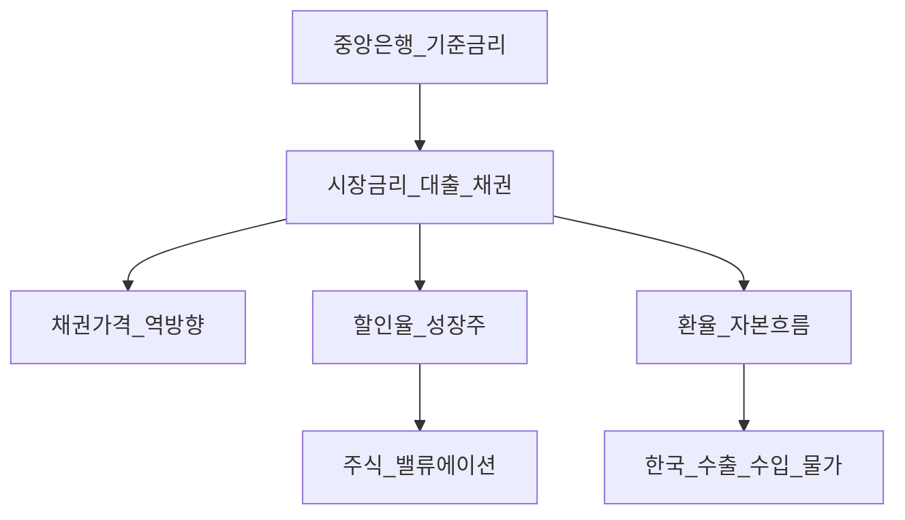
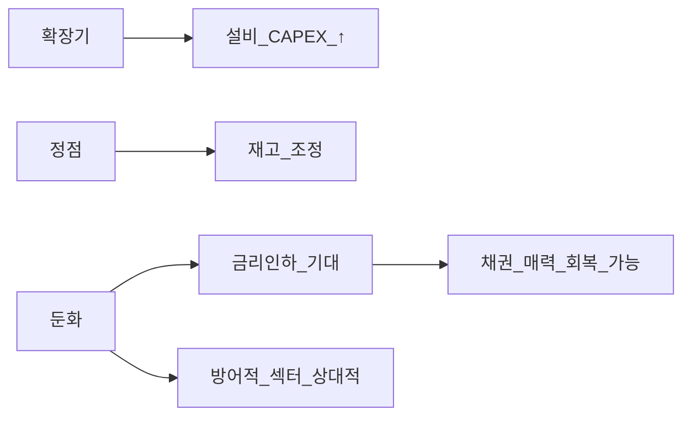

# 거시경제학 기초 — 금리·인플레·경기·환율

> **면책**: 본 문서는 교육 목적이며, 특정 개인·법인에 대한 투자·세무·법률 자문이 아닙니다. 제도·세율·상품 조건은 변경될 수 있으므로 실행 전 공식 출처를 확인하세요.

## 메타

| 항목 | 내용 |
|------|------|
| 최종 검증일 | 2026-05-24 |
| 정책·법령 기준일 | 2025-12-31 확정, 2026 전망은 별도 표기 |
| 난이도 | L4 (Graduate) — [READER-GUIDE](../docs/READER-GUIDE.md) |
| 예상 읽기 시간 | 50~65분 (개요) / L4 전체 **약 15~22h** |
| 관련 bucket | Bucket 2~3 (코어 자산배분·거시 배경) |

## 0. 이 편 읽기 전 (5분)

| 항목 | 내용 |
|------|------|
| **난이도** | L4 (Graduate) — [READER-GUIDE §L등급](../docs/READER-GUIDE.md) |
| **선수** | [미시경제학 기초](microeconomics-basics.md), [복리와 시간가치](../01-foundations/compound-interest-and-time-value.md) |
| **이번 편에서 쓰는 기호** | 본문 §4·§4a 표 참고 |
| **복습 한 줄** | L3 선수 편을 먼저 읽으면 수식이 수월함 |

## L4 전공자 심화 — 어디로 가나

| 순서 | 문서 | 분량 |
|------|------|----------------|
| 1 | [macro-01-gdp-accounts-growth](macro-01-gdp-accounts-growth.md) | 국민계정·솔로우 |
| 2 | [macro-02-money-inflation](macro-02-money-inflation.md) | 화폐·필립스·피셔 |
| 3 | [macro-03-is-lm-ad-as](macro-03-is-lm-ad-as.md) | IS-LM·AD-AS |
| 4 | [macro-04-monetary-policy-qe](macro-04-monetary-policy-qe.md) | 통화정책·QE·QQQ |
| 5 | [macro-05-open-economy-fx](macro-05-open-economy-fx.md) | 환율·개방경제 |
| 6 | [macro-06-asset-prices-macro](macro-06-asset-prices-macro.md) | 주가·포트폴리오 |

→ [02-economics/README](README.md)

## TL;DR

1. **금리 상승**은 일반적으로 채권 가격을 누르고, 성장주 **할인율·밸류에이션**에 압력을 준다.
2. **인플레**는 명목 수익과 **실질 구매력**을 갈라 — 예금만으로는 부족할 수 있다.
3. **경기 사이클**은 산업·원자재·반도체·로봇 등 **선행·동행·후행** 지표로 읽는다.
4. **한국**은 수출·환율·**미국 금리**와 강하게 연동 — 국내만 보면 안 된다.
5. 경제 뉴스를 **“어느 bucket·자산에 어떤 방향 압력인가”** 로 번역하는 것이 목표다.

## 1. 한 줄 정의 + 왜 중요한가

**정의**: **거시경제학(Macroeconomics)** 은 국가·글로벌 단위의 **총생산(GDP)·고용·물가·금리·환율·정책**이 어떻게 상호작용하는지를 다룬다.

**왜 중요한가**: 개별 기업 실적(미시)도 **경기·금리·환율**이라는 바다 위에 있다. [자산배분](../04-portfolio/asset-allocation.md), [채권 입문](../03-markets/bonds-fixed-income.md), [해외 주식](../03-markets/overseas-equities-intro.md)을 설계할 때 “왜 QQQ가 금리 민감한가”, “왜 원화 약세가 수출주에 단기 도움이 되는가”를 **bucket 언어**로 연결한다.

## 2. 선수 지식 / 이후 읽을 것

**선수**:
- [미시경제학 기초](microeconomics-basics.md)
- [복리와 시간가치](../01-foundations/compound-interest-and-time-value.md)

**이후**:
- [채권·고정수익](../03-markets/bonds-fixed-income.md)
- [ETF·인덱스](../03-markets/etf-index-funds.md)
- [자산배분](../04-portfolio/asset-allocation.md), [지역 분산](../04-portfolio/geographic-diversification.md)
- [리밸런싱·DCA](../04-portfolio/rebalancing-and-dca.md)
- [투자 세금 개요](../06-korea-policy/tax/investment-tax-overview.md)

## 3. 직관·비유

**바다와 보트**: 경기·금리는 **파도**, 개별 주식은 **보트**. 파도가 거세면 좋은 조종사(기업)도 흔들린다. “우리 회사만 문제”가 아닐 수 있다.

**에어컨과 실내온도**: 중앙은행 금리는 **설정 온도**, 시장 금리·주가는 **실제 체감**. 설정을 바꿔도 방 크기(경기·부채)에 따라 체감이 늦거나 다르다.

**환율은 외화 가격표**: 해외 ETF·미국 주식을 살 때 **원화로 환산한 비용**이 환율에 따라 달라진다. 수익도 **주가 + 환율** 두 축이다.

**정책과 시장의 시차**: 한국은행이 기준금리를 올려도 가계·기업이 체감하기까지는 **대출 만기·고정금리 비중** 때문에 시간이 걸린다. 그 사이 주식 시장은 **선행**으로 반응할 수도, **둔화 후** 반응할 수도 있다. “금리 인하 = 내일부터 상승” 같은 단순 공식은 [행동금융](../05-behavioral/fomo-and-trading-hours.md)과 맞물려 **과잉 거래**를 부른다.

**한국 수출국가 프레임**: GDP에서 **순수출**과 **설비투자**가 크면, 미국·중국·유럽 경기 뉴스는 국내 대형주 **실적 가이던스**로 이어진다. 동시에 원화가 약세면 달러 매출 기업의 **원화 환산 실적**은 일시적으로 좋아 보일 수 있다 — 환율 효과가 **영업 품질**과 분리되지 않으면 오판한다. [해외 주식](../03-markets/overseas-equities-intro.md) 보유자는 같은 환율을 **반대 방향**으로 체감한다.

**인플레와 자산의 역할 분담**: 인플레가 높을 때 예금은 **명목**은 오르지만 **실질**은 깎일 수 있다. 주식은 기업이 가격을 전가하면 **명목 이익**이 따라갈 **여지**가 있으나, 금리가 동시에 오르면 **밸류에이션**이 깎인다. 그래서 거시는 “주식 vs 채권 vs 현금” **삼자 중 누가 상대적으로 유리한가**의 배경을 제공하고, 최종 비중은 [자산배분](../04-portfolio/asset-allocation.md) 규칙이 정한다.

---

**이 모형이 말하는 것**: 수식은 계산 절차이고, 경제 직관은 「누가 이득·손해를 보는가」「어떤 가정이 깨지면 결론이 뒤집히는가」다. 유도 각 단계마다 **가정**을 한 줄로 적어 본다.
## 4. 정식 개념·용어

| 용어 | 한글 | English | 정의 |
|------|------|------|----------------|
| GDP | 국내총생산 | Gross Domestic Product | 일정 기간 국내에서 생산된 **최종 재화·서비스** 가치 |
| CPI | 소비자물가지수 | Consumer Price Index | 대표 소비 바구니 **물가 변화** |
| 기준금리 | 기준금리 | Policy rate | 중앙은행이 정하는 **정책 금리** |
| 실질금리 | 실질금리 | Real interest rate | 명목금리 − **기대 인플레** (근사) |
| 양적완화/긴축 | QE/QT | Quantitative easing/tightening | 중앙은행 **대차대조표** 확대·축소 |
| 경기선행지수 | 선행지수 | Leading indicators | GDP보다 **먼저** 움직이는 지표 |
| 스태그플레이션 | 스태그플레이션 | Stagflation | 성장 둔화 + **인플레** 지속 |
| 경상수지 | 경상수지 | Current account | 국가 간 **상품·서비스·이전** 거래 잔액 |

### 4a. 핵심 용어 (본문 등장 순)

> 복습용. 정의는 §4 본표·[glossary](../00-roadmap/glossary.md)·본문 `!!! info` 박스.

| 용어 | 한 줄 | 관련 이론 | glossary |
|------|------|------|----------------|
| GDP | 일정 기간 국내에서 생산된 **최종 재화·서비스** 가치 | §4 | [glossary](../00-roadmap/glossary.md#gdp) |
| CPI | 대표 소비 바구니 **물가 변화** | §4 | [glossary](../00-roadmap/glossary.md#cpi) |
| 기준금리 | 중앙은행이 정하는 **정책 금리** | §4 | [glossary](../00-roadmap/glossary.md#기준금리) |
| 실질금리 | 명목금리 − **기대 인플레** | §4 | [glossary](../00-roadmap/glossary.md#실질금리) |
| 양적완화/긴축 | 중앙은행 **대차대조표** 확대·축소 | §4 | [glossary](../00-roadmap/glossary.md#양적완화/긴축) |
| 경기선행지수 | GDP보다 **먼저** 움직이는 지표 | §4 | [glossary](../00-roadmap/glossary.md#경기선행지수) |
| 스태그플레이션 | 성장 둔화 + **인플레** 지속 | §4 | [glossary](../00-roadmap/glossary.md#스태그플레이션) |
| 경상수지 | 국가 간 **상품·서비스·이전** 거래 잔액 | §4 | [glossary](../00-roadmap/glossary.md#경상수지) |

## 5. 메커니즘

### 5.1 금리 전파

### 5.2 경기 국면과 자산 (교육용 단순화)

| 국면 | 대표 현상 | 투자 교육 프레임 (보장 아님) |
|------|------|----------------|
| 초기 회복 | 이익 개선, 금리 저 | **경기민감·주식** 상대 강세 가능 |
| 후기 확장 | 인플레·금리↑ | **밸류에이션** 압박, 변동성↑ |
| 둔화 | 실적 하향 | **채권·현금** 비중 의미 |
| 인플레 지속 | 실질자산·에너지 | **분산**·실질수익 검토 |

## 6. 수식·모델

**피셔 방정식** (근사):

| 기호 | 이름 | 이 식에서 의미 |
|------|------|----------------|
| **r** | 할인율·수익률 | 기간당 이자·요구수익률 |
| **n** | 기간 | 연·월 등 복리·할인에 쓰는 횟수 |
| **PV** | 현재가치 | 오늘 시점으로 환산한 금액 |
| **FV** | 미래가치 | 미래 시점의 목표·결과 금액 |

\[
i \approx r + \pi^e
\]

**읽는 법**: **명목** 수익에서 **인플레**를 반영하면 **실질** 체감 수익을 본다. 

정밀식은 본문 또는 §4 표를 따른다.
**유도 (L4)**:
1. **정의**: **i**, **r**, **pi**를 동일 시점·동일 통화로 맞춘다. — 단위 불일치면 식이 무의미해진다.
2. **식 변형**: 양변을 정리해 목표 변수를 한쪽에 둔다. — 할인·복리는 **시점 이동**이 핵심이다.

- \(i\): 명목금리, \(r\): 실질금리, \(\pi^e\): 기대 인플레  
- 예: 명목 4%, 기대 인플레 2% → 실질 약 2%

**실질 수익** (투자·예금):

| 기호 | 이름 | 이 식에서 의미 |
|------|------|----------------|
| **r** | 할인율·수익률 | 기간당 이자·요구수익률 |
| **n** | 기간 | 연·월 등 복리·할인에 쓰는 횟수 |
| **PV** | 현재가치 | 오늘 시점으로 환산한 금액 |

\[
\text{실질 수익} \approx \text{명목 수익} - \text{인플레}
\]

**읽는 법**: **명목** 수익에서 **인플레**를 반영하면 **실질** 체감 수익을 본다. 

정밀식은 본문 또는 §4 표를 따른다.
**유도 (L4)**:
1. **정의**: **r**, **n**, **PV**를 동일 시점·동일 통화로 맞춘다. — 단위 불일치면 식이 무의미해진다.
2. **식 변형**: 양변을 정리해 목표 변수를 한쪽에 둔다. — 할인·복리는 **시점 이동**이 핵심이다.
**GDP 구성** (지출법, 교육용):

| 기호 | 이름 | 이 식에서 의미 |
|------|------|----------------|
| **r** | 할인율·수익률 | 기간당 이자·요구수익률 |
| **n** | 기간 | 연·월 등 복리·할인에 쓰는 횟수 |
| **PV** | 현재가치 | 오늘 시점으로 환산한 금액 |
| **FV** | 미래가치 | 미래 시점의 목표·결과 금액 |

\[
Y = C + I + G + (X - M)
\]

**읽는 법**: **Y**와 **C**의 관계를 위 식으로 쓴다. 경제·재무 해석은 변수표 「이 식에서 의미」와 [DEPTH-STANDARD](../docs/DEPTH-STANDARD.md) 기호 예제를 맞춘다.
**유도 (L4)**:
1. **정의**: **Y**, **C**, **I**를 동일 시점·동일 통화로 맞춘다. — 단위 불일치면 식이 무의미해진다.
2. **식 변형**: 양변을 정리해 목표 변수를 한쪽에 둔다. — 할인·복리는 **시점 이동**이 핵심이다.

- \(C\) 소비, \(I\) 투자, \(G\) 정부, \(X-M\) 순수출 — 한국은 **수출·반도체·조선** 등이 \(X\)에 민감

**채권 가격·금리** (1차 근사): \(\Delta P/P \approx -D \times \Delta y\) — [채권 문서](../03-markets/bonds-fixed-income.md)의 듀레이션 \(D\)

### 6.1 수익률 곡선 (Yield curve)

| 형태 | 의미 (단순) | 교육적 연결 |
|------|------|----------------|
| **정상** (장기↑ ) | 성장·인플레 기대 | 경기 확장 초 |
| **평탄** | 불확실 | 전환 구간 |
| **역전** (단기>장기) | 둔화 **신호** 가능 | 이후 금리 인하 기대 — **확정 아님** |

역전만으로 매매하지 말고 [자산배분](../04-portfolio/asset-allocation.md) **규칙**과 병행.

### 6.2 통화정책 전파 시차

한국은행이 금리를 올려도 **가계대출·부동산·수출**에 체감까지 **분기~년** 걸릴 수 있다. “금리 한 번 올랐으니 끝”이 아니라 **연속 정책·점도표**를 본다.

---

이후 금리 인하 기대 — **확정 아님** |

역전만으로 매매하지 말고 [자산배분](../04-portfolio/asset-allocation.md) **규칙**과 병행.

### 6.2 통화정책 전파 시차

한국은행이 금리를 올려도 **가계대출·부동산·수출**에 체감까지 **분기~년** 걸릴 수 있다. “금리 한 번 올랐으니 끝”이 아니라 **연속 정책·점도표**를 본다.

## 7. 한국 적용

### 7.1 2025년 기준 (확정·일반적 맥락)

| 변수 | 투자 연결 | 관련 문서 |
|------|------|----------------|
| **미국 연준 금리** | QQQ·성장주, 달러자산, 글로벌 유동성 | [ETF](../03-markets/etf-index-funds.md), [QLD](../04-portfolio/leveraged-etf-qqq-qld.md) |
| **한국은행 기준금리** | 부동산·은행·단기채 | [부동산 기초](../07-real-estate/real-estate-basics.md) |
| **원/달러 환율** | 해외주식 **원화 수익**, 수출 기업 | [해외 주식](../03-markets/overseas-equities-intro.md) |
| **중국 경기** | 배터리·철강·반도체 **수요** | [배터리](../03-markets/sectors/battery-lfp-ncm-ess.md) |
| **CPI·임금** | 실질 소비·생활비 | [비상금](../01-foundations/emergency-fund.md) |

### 7.2 2026년 전망·시행 (교육용 프레임, 수치 비약정)

| 항목 | 2025 (확정) | 2026 (전망·확인 필요) |
|------|------|----------------|
| 미국 금리 경로 | 연준·시장 **점도표** 참고 | 인하 속도·인플레 재상승 시 **지연** 가능 |
| 한국 금리 | 한은 통화정책 방향 | 미국·가계부채·부동산과 **연동** |
| ISA·연금 세제 | [ISA](../06-korea-policy/isa.md), [IRP 세금](../06-korea-policy/tax/isa-irp-pension-tax.md) | 개정 시 **실질 after-tax 수익** 재계산 |
| AI·데이터센터 전력 | 구조적 수요 | [AI 인프라](../03-markets/sectors/ai-infrastructure.md) |

**법·정책 근거**: 한국은행·연준 보도자료, 국세청·기재부 세제 안내 — [sources.md](../references/sources.md)

### 7.3 거시 뉴스 → bucket 번역표 (교육용)

| 헤드라인 (예) | 가능한 영향 | 검토할 bucket·문서 |
|------|------|----------------|
| 연준 금리 동결 | 성장주 밸류에이션 **완화 기대** | QQQ 코어 — [ETF](../03-markets/etf-index-funds.md) |
| 원화 약세 | 수출주·달러자산 원화 수익 | [해외주](../03-markets/overseas-equities-intro.md) |
| 중국 PMI 하락 | 배터리·철강 수요 | [배터리](../03-markets/sectors/battery-lfp-ncm-ess.md) |
| 인플레 재상승 | 실질수익·채권 가격 | [채권](../03-markets/bonds-fixed-income.md) |
| AI 투자 확대 | CAPEX·전력 수요 | [AI 인프라](../03-markets/sectors/ai-infrastructure.md) |

## 8. 숫자 예제 (가상)

> 모든 인물·금액은 가상입니다.

### 예제 1: 금리 인상 국면의 포트 (가상)

| 자산 | 비중 | 1년 가정 수익률 (가상) |
|------|------|----------------|
| 글로벌 주식 ETF | 70% | −8% |
| 국채·채권 ETF | 30% | −4% |
| **합성** | 100% | 약 −6.8% |

**해석**: 주식·채권이 **동시 하락**할 수 있음(2022 유형). [자산배분](../04-portfolio/asset-allocation.md)에서 채권은 **완충** 목적이지 항상 플러스는 아님.

### 예제 2: 인플레 vs 예금 (가상)

| | 명목 | 인플레 (가상) | 실질 |
|------|------|------|----------------|
| 예금 이자 | 2.5% | 3.5% | **약 −1%** |
| ISA 장기 투자 목표 | 7% (가상, 세전) | 3.5% | **약 +3.5%** (비용·세금 전) |

**해석**: “원금 보장”도 **구매력**은 보장하지 않을 수 있다. → [ISA](../06-korea-policy/isa.md)

### 예제 3: 원화 약세 + 수출주 (가상)

| 항목 | 값 (가상) |
|------|-----------|
| 원/달러 | 1,250 → 1,380 (+10.4%) |
| 수출 비중 80% 기업 C 매출(원화) | +9% (가격·물량 단순화) |
| 해외 ETF 보유자 D (QQQ) | 주가 +5%, 환율 +10% → 원화 수익 **약 +15.5%** (단순) |

**해석**: 환율은 **수출주와 해외자산**에 반대 방향이 아닐 수 있음 — 포지션별로 분리.

## 9. FAQ

**Q1. 경제 뉴스만 보면 투자 실력이 늘나?**  
**A.** 뉴스는 **입력**이다. 출력은 [자산배분](../04-portfolio/asset-allocation.md), [bucket](../04-portfolio/time-horizon-and-buckets.md), **리밸런싱** 규칙.

**Q2. 인플레 때 주식이 무조건 오르나?**  
**A.** **아니다.** 역사적으로 혼재. 기업이 가격 전가·마진 유지하면 유리할 수 있으나 **금리·밸류에이션**이 동시에 작용.

**Q3. 한은과 연준, 누구를 더 봐야 하나?**  
**A.** **미국 금리·달러**는 글로벌 자산 가격에 직접. 한국은 **수출·환율·한국 금리**로 간접·직접 영향. 둘 다.

**Q4. 스태그플레이션이면 어떻게 하나?**  
**A.** 성장주·채권 모두 어려울 **수** 있음 — **분산·현금·실질자산** 논의, 레버리지 축소. → [행동금융](../05-behavioral/fomo-and-trading-hours.md)

**Q5. AI 붐은 거시인가 미시인가?**  
**A.** **둘 다.** 구조적 수요(미시·산업) + 금리·유동성(거시). [AI 인프라](../03-markets/sectors/ai-infrastructure.md)

**Q6. 금리 인하 기대만으로 주식을 올인?**  
**A.** 기대는 **이미 가격에 반영**될 수 있음. 타이밍보다 [DCA](../04-portfolio/rebalancing-and-dca.md).

**Q7. DB·DC 퇴직연금과 거시의 관계?**  
**A.** DB는 본인이 ETF를 고르지 않음 — 거시는 **IRP·ISA·일반계좌** 설계에 직접. → [DB](../06-korea-policy/db-pension.md), [DC](../06-korea-policy/dc-pension.md)

**Q8. 거시가 나쁘면 주식을 전부 팔아야 하나?**  
**A.** 교육 프레임: **비중 조절**·현금·채권·지역 분산. 장기 코어 목표와 **행동 규칙** 우선.

**Q9. VIX·변동성 지수는?**  
**A.** **심리·옵션** 시장의 불안 지표. 거시 **확정 지표**가 아니며 단기 매매 신호로 쓰기 어렵다.

**Q10. [청년도약](../06-korea-policy/youth-leap-account.md) 금리와 시장 금리?**  
**A.** 정책 적금 **우대금리**는 별도 제도 — 주식·채권 시장 금리와 **직접 연동되지 않음**.

## 10. 함정·리스크·한계

- 단기 헤드라인으로 **포트 전량** 변경  
- 한국 뉴스만 보고 **미국 금리·달러** 무시  
- “금리 인하 = 주식 무조건 상승” **단순화**  
- 인플레·디플레 **한 시점**만으로 10년 전략 결정  
- 거시 예측은 **오차 큼** — 시나리오·분산이 핵심  
- 본문 전망·수치는 **가상·비약정**

---

**Q. 실무에서는?**  
교과서 식·기호를 그대로 적용하기 전에 **수수료·세금·데이터 시점**을 분리한다. 숫자는 [DEPTH-STANDARD](../docs/DEPTH-STANDARD.md)처럼 기호만 먼저 맞추고, 법령·시장 수치는 §8 표·외부 출처로 갱신한다.

## 11. 심화 읽기

- [references/sources.md](../references/sources.md) — 한국은행, 연준, 국세청  
- [채권·고정수익](../03-markets/bonds-fixed-income.md)  
- [CAPM·위험·수익](../08-advanced/capm-and-risk-return.md)  
- [미시경제학](microeconomics-basics.md)  
- [지역 분산](../04-portfolio/geographic-diversification.md)

### 11.1 월간 거시 체크리스트 (교육)

매월 1회, 아래를 **한 줄 메모**로 남긴다: (1) 한·미 기준금리 변화 (2) 원/달러 방향 (3) 한국·미국 CPI 요지 (4) 반도체·중국 관련 1개 지표 (5) 내 포트에서 [time-horizon](../04-portfolio/time-horizon-and-buckets.md) **리밸런싱** 필요 여부. 매매가 아니라 **해석** 연습이 목적이다.

### 11.2 bucket 연결

| Bucket | 거시 연결 |
|--------|-----------|
| Bucket 2b | ISA·IRP — 금리·인플레 후 **실질** 수익 |
| Bucket 3 | QQQ·채권 코어 — 금리·환율 민감 |
| Bucket 4 | 비상·단기 — 금리 상승 시 **현금 매력** |

## 연습문제 (L4, 기호)

1. 위 §6 주요 식에서 변수 하나를 미지로 두고, 나머지를 기호로 둔 **관계식**을 쓰시오.
2. 가정이 깨질 때(유동성·세금·다중 IRR 등) 위 식의 **한계**를 기호·부등식으로 서술하시오.
3. §8 예제와 동일 기호(M·P·PV 등)로 **부호·단조성**만 검증하는 짧은 논증을 하시오.

### 해설 키

1. 직전 변수표의 「이 식에서 의미」를 이용해 동일 차원으로 정리한다.
2. 「가정이 깨지면」 절의 한계 사례와 연결한다.
3. 숫자 대입 없이 **부호**·**단위** 일치만 확인한다.
## 12. 스스로 점검 퀴즈

1. 기준금리가 올라면 **기존** 채권 가격은 일반적으로?  
2. 명목 5%, 기대 인플레 3%일 때 실질금리(근사)는?  
3. 원화 약세 시 **달러 표시 해외 ETF**의 원화 수익에 환율은 보통?  
4. GDP 지출법에서 한국이 민감한 항목 하나는?  
5. 거시 뉴스를 투자에 쓸 때 “번역”의 의미는?  
6. 수익률 곡선 **역전**이 의미할 수 있는 것(한 줄)?

??? note "정답 힌트"

    1. 하락 · 2. 약 2% · 3. 추가 상승 요인(주가와 곱연동, 단순) · 4. 순수출(X−M) 또는 투자(I) · 5. bucket·자산별 영향 방향 정리 · 6. 경기 둔화 **가능성**(확정 아님)

**L3 완료 기준**: 본 문서 12블록·예제 3개·mermaid 2개·FAQ 10쌍·검증일 2026-05-24 — [DEPTH-STANDARD](../docs/DEPTH-STANDARD.md). 다음: [채권](../03-markets/bonds-fixed-income.md)·[자산배분](../04-portfolio/asset-allocation.md)·[master-roadmap](../00-roadmap/master-roadmap.md).

**한 페이지 요약**: (1) 금리↑ → 채권↓·성장주 밸류에이션 압력 (2) 인플레 → 실질수익 (3) 환율 → 해외·수출 (4) 경기 → 사이클 섹터 (5) 뉴스 → bucket 번역.