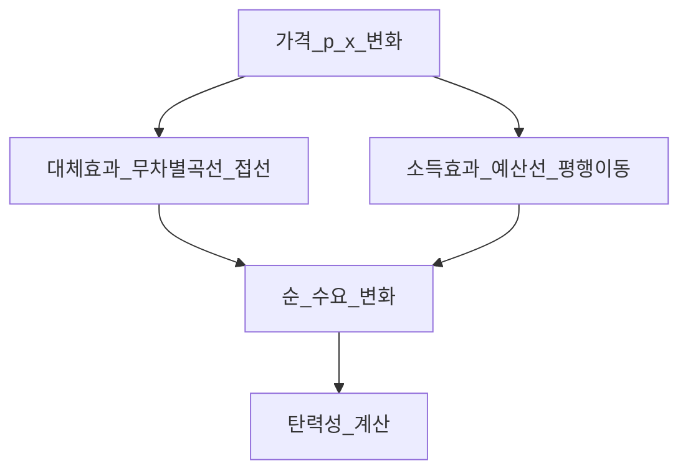
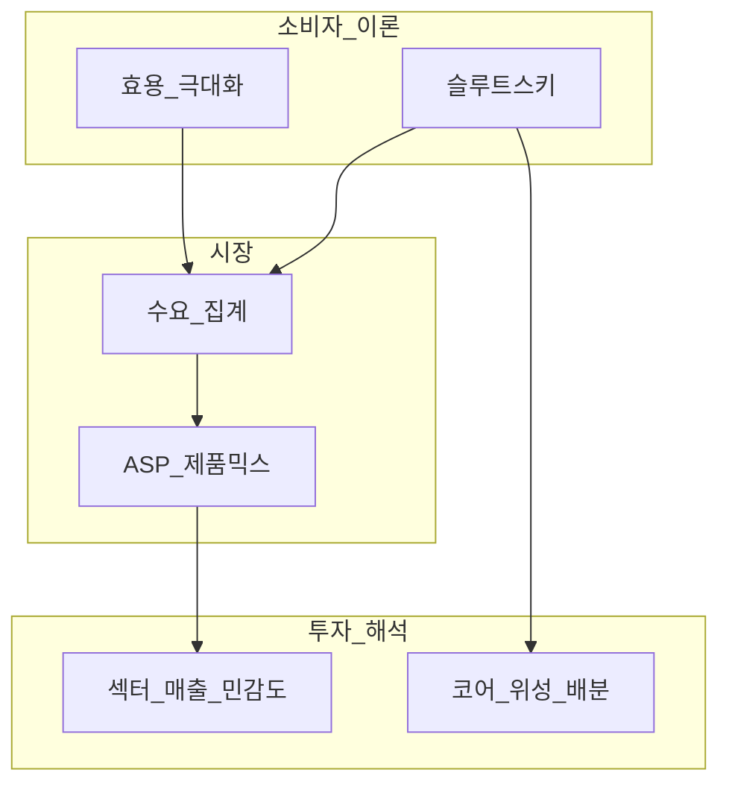
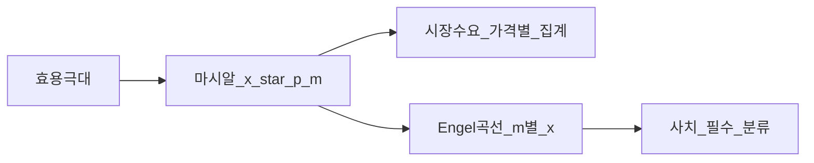

# 소비자 이론 — 선호·효용·수요·슬루트스키

> **면책**: 본 문서는 교육 목적이며, 특정 개인·법인에 대한 투자·세무·법률 자문이 아닙니다. 제도·세율·상품 조건은 변경될 수 있으므로 실행 전 공식 출처를 확인하세요.

## 메타

| 항목 | 내용 |
|------|------|
| 최종 검증일 | 2026-05-24 |
| 정책·법령 기준일 | 2025-12-31 확정, 2026 개편은 본문 표기 |
| 난이도 | L4 (Graduate) — [READER-GUIDE](../docs/READER-GUIDE.md) |
| 예상 읽기 시간 | **2.5~4시간** |
| 관련 bucket | Bucket 0~1 (경제 문법), Bucket 3 위성(섹터·소비재·테크) |

## 0. 이 편 읽기 전 (5분)

| 항목 | 내용 |
|------|------|
| **난이도** | L4 (Graduate) — [READER-GUIDE §L등급](../docs/READER-GUIDE.md) |
| **선수** | [미시경제학 기초](microeconomics-basics.md), [복리와 화폐의 시간가치](../01-foundations/compound-interest-and-time-value.md) |
| **이번 편에서 쓰는 기호** | 본문 §4·§4a 표 참고 |
| **복습 한 줄** | L3 선수 편을 먼저 읽으면 수식이 수월함 |

## TL;DR

1. **서열적 효용(ordinal utility)** 은 “얼마나 행복한가”의 절대값이 아니라 **선호 순위**만 필요하며, 무차별곡선·한계대체율(MRS)로 소비 패턴을 기하학적으로 읽는다.
2. **예산제약** \(p_x x + p_y y \le m\) 아래 **효용 극대화**는 MRS = \(p_x/p_y\) 접점에서 성립하며, 이로부터 **마시알 수요함수** \(x^*(p_x, p_y, m)\)가 유도된다.
3. **소득효과·대체효과**(슬루트스키 분해)는 가격 변화가 소비를 바꾸는 두 채널을 분리한다 — 테크 **필수재 vs 사치재** 포트폴리오 해석의 핵심이다.
4. **탄력성** \(\varepsilon = \frac{dx}{dp}\frac{p}{x}\)는 미분으로 정의되며, \(|\varepsilon|>1\)이면 **탄력적**, \(<1\)이면 **비탄력적** — 프리미엄 가전·HBM 대체재와 연결된다.
5. **코너해(corner solution)** 은 한 재화만 소비하는 극단적 최적 — 예산·가격·선호가 특정 축에 붙을 때 발생하며, “올인 테마주” 소비·투자 행태와 유사한 구조를 갖는다.
6. 투자 적용: **소득↑ → 사치재(프리미엄 GPU·고급 EV) 수요↑**, **가격↑ → 대체재(중저가 LFP·중국 DRAM)로 이동** — [섹터](../03-markets/sectors/sector-investing-framework.md) 리포트의 TAM을 **수요곡선**으로 검증한다.

---

## 1. 한 줄 정의 + 왜 중요한가

**정의**: **소비자 이론(Consumer Theory)** 은 합리적 소비자가 **선호(preferences)** · **예산(budget)** · **가격(prices)** 아래 어떤 **소비 묶음(basket)** 을 선택하는지, 그리고 그 선택이 **시장 수요(demand)** 로 어떻게 집계되는지를 공리적으로 모델링하는 미시경제학의 핵심 분과이다.

**왜 중요한가**: 주식 투자에서 “AI PC 수요 폭발”, “프리미엄 스마트폰 둔화” 같은 내러티브는 결국 **누가·무엇을·얼마나** 살지에 대한 질문이다. 소비자 이론은 그 질문을 **가격·소득·대체 가능성**으로 번역한다. [미시경제학 기초](microeconomics-basics.md)의 수요·탄력성 직관을 **L4 수준의 유도·분해**까지 끌어올리며, [반도체](../03-markets/sectors/semiconductor.md)·[배터리](../03-markets/sectors/battery-lfp-ncm-ess.md) 섹터의 **제품 믹스·ASP(평균판매단가)** 변화를 읽는 데 필요하다. [포트폴리오](../04-portfolio/core-satellite-framework.md)에서 **필수 소비(코어)** vs **경기민감·프리미엄(위성)** 을 나누는 것도 동일한 **소득·가격 탄력성** 논리와 맞닿아 있다.

---

## 2. 선수 지식 / 이후 읽을 것

**선수**:
- [미시경제학 기초](microeconomics-basics.md) — 수요·공급·탄력성 L3
- [복리와 화폐의 시간가치](../01-foundations/compound-interest-and-time-value.md)
- [현금흐름 기초](../01-foundations/cash-flow-basics.md)

**이후**:
- [생산·비용·공급](micro-02-production-cost-supply.md) — 기업 측 미러
- [시장구조·산업조직](micro-03-market-structures-io.md) — 수요와 공급의 만남
- [섹터 투자 프레임워크](../03-markets/sectors/sector-investing-framework.md)
- [자산배분](../04-portfolio/asset-allocation.md), [코어-위성](../04-portfolio/core-satellite-framework.md)

---

## 3. 직관·비유

**카페 메뉴판**: 커피( \(x\) )와 디저트( \(y\) ) 중 예산 \(m\)으로 고른다. “커피 1잔을 포기하면 디저트 0.5개를 더 살 수 있다”가 **MRS**. 메뉴 가격이 바뀌면 “아메리카노 대신 라떼”처럼 **대체**하고, 월급이 오르면 “디저트도 추가” — **대체효과 vs 소득효과**의 일상판이다.

**스마트폰 vs 태블릿**: 두 기기가 **유사한 기능**을 겹치면 가격이 오른 쪽 수요가 다른 쪽으로 **대체**된다. 애플 생태계 안에서 iPad Pro 가격 인상이 MacBook Air 수요를 밀어 올리는 패턴을 **교차탄력성**으로 읽을 수 있다(본문 §6.5).

**투자 포트폴리오의 소비자**: “한정된 자본(예산)”으로 “수익·변동성·유동성(선호)”을 극대화한다. **코너해**는 “현금 0, 특정 테마주 100%”처럼 한 축에만 몰빵하는 선택과 형태가 같다 — 최적이 아닐 수 있으나 **제약·선호** 하에서는 합리적일 수 있다.

**슬루트스키의 손전등**: 1930년대 슬루트스키는 “가격이 변하면 실질 구매력도 변한다”는 **소득효과**를 인위적으로 제거한 **보상적 변화(compensated variation)** 로 Hicks와 병행 발전시켰다. “금리 인하 → 주택 가격↑ → 실질 구매력 변화”를 **순수 가격효과**와 분리해 생각하는 습관은 거시·미시 모두에 유용하다.

---

**이 모형이 말하는 것**: 수식은 계산 절차이고, 경제 직관은 「누가 이득·손해를 보는가」「어떤 가정이 깨지면 결론이 뒤집히는가」다. 유도 각 단계마다 **가정**을 한 줄로 적어 본다.
## 4. 정식 개념·용어

| 용어 | 한글 | English | 정의 |
|------|------|---------|------|
| 선호 | 선호 | Preferences | 소비자가 묶음 \(A,B\) 중 어느 쪽을 더 좋아하는지의 **순위** |
| 서열적 효용 | 서열적 효용 | Ordinal utility | 효용 **크기**가 아니라 **순서**만 의미 |
| 무차별곡선 | 무차별곡선 | Indifference curve | 동일 효용을 주는 \((x,y)\) 조합의 곡선 |
| MRS | 한계대체율 | Marginal rate of substitution | \(x\) 1단위 포기 시 \(y\)로 **보상**받을 양; \(-dy/dx\) |
| 예산제약 | 예산제약 | Budget constraint | \(p_x x + p_y y \le m\) |
| 슬루트스키 방정식 | 슬루트스키 | Slutsky equation | 가격효과 = **대체효과 + 소득효과** |
| 마시알 수요 | 마시알 수요 | Marshallian demand | \(x^*(p,m)\) — 명목 소득·가격 하 최적 |
| 힉스 수요 | 힉스 수요 | Hicksian demand | \(x^h(p,u)\) — 효용 고정·실질소득 보상 |
| 탄력성 | 가격탄력성 | Price elasticity | \(\varepsilon_x = \frac{\partial x}{\partial p_x}\frac{p_x}{x}\) |
| 코너해 | 코너해 | Corner solution | 한 재화 소비 = 0인 경계 최적 |
| 사치재 | 사치재 | Luxury good | 소득↑ 시 수요 **비율**↑ (\(\eta > 1\)) |
| 필수재 | 필수재 | Necessity good | 소득↑ 시 수요 **비율**↓ (\(0<\eta<1\)) |

### 4a. 핵심 용어 (본문 등장 순)

> 복습용. 정의는 §4 본표·[glossary](../00-roadmap/glossary.md)·본문 `!!! info` 박스.

| 용어 | 한 줄 | 관련 이론 | glossary |
|------|-------|-----------|----------|
| 선호 | 선호 | §4 | [glossary](../00-roadmap/glossary.md#선호) |
| 서열적 효용 | 서열적 효용 | §4 | [glossary](../00-roadmap/glossary.md#서열적-효용) |
| 무차별곡선 | 무차별곡선 | §4 | [glossary](../00-roadmap/glossary.md#무차별곡선) |
| MRS | 한계대체율 | §4 | [glossary](../00-roadmap/glossary.md#mrs) |
| 예산제약 | 예산제약 | §4 | [glossary](../00-roadmap/glossary.md#예산제약) |
| 슬루트스키 방정식 | 슬루트스키 | §4 | [glossary](../00-roadmap/glossary.md#슬루트스키-방정식) |
| 마시알 수요 | 마시알 수요 | §4 | [glossary](../00-roadmap/glossary.md#마시알-수요) |
| 힉스 수요 | 힉스 수요 | §4 | [glossary](../00-roadmap/glossary.md#힉스-수요) |
| 탄력성 | 가격탄력성 | §4 | [glossary](../00-roadmap/glossary.md#탄력성) |
| 코너해 | 코너해 | §4 | [glossary](../00-roadmap/glossary.md#코너해) |
| 사치재 | 사치재 | §4 | [glossary](../00-roadmap/glossary.md#사치재) |
| 필수재 | 필수재 | §4 | [glossary](../00-roadmap/glossary.md#필수재) |

---

## 5. 메커니즘

### 5.1 선호 → 무차별곡선 → 최적

### 5.2 가격 변화의 분해

### 5.3 투자·섹터 연결

---

## 6. 수식·모델

### 6.1 선호 공리와 서열적 효용

**공리(요약)**: (1) **완비성** — \(A \succ B\), \(B \succ A\), \(A \sim B\) 중 하나 (2) **추이성** — \(A \succ B \succ C \Rightarrow A \succ C\) (3) **연속성** — 선호가 급격히 뒤집히지 않음.

**정리**: 연속·단조 선호는 **연속 효용함수** \(u(x,y)\)로 표현 가능. \(u\)와 \(f(u)\)(\(f'>0\))는 **동일 선호** — 효용은 **서열적**이다.

### 6.2 무차별곡선과 MRS

\(u(x,y)=\bar u\) 위의 점들이 무차별곡선.

| 기호 | 이름 | 이 식에서 의미 |
|------|------|----------------|
| \(r\) | 할인율·수익률 | 기간당 이자·요구수익률 |
| \(n\) | 기간 | 연·월 등 복리·할인에 쓰는 횟수 |
| \(PV\) | 현재가치 | 오늘 시점으로 환산한 금액 |
| \(FV\) | 미래가치 | 미래 시점의 목표·결과 금액 |

\[
MRS_{xy} = -\frac{dx}{dy}\Big|_{u=\bar u} = \frac{MU_x}{MU_y} = \frac{\partial u/\partial x}{\partial u/\partial y}
\]

**읽는 법**: **MRS_**와 **xy**의 관계를 위 식으로 쓴다. 경제·재무 해석은 변수표 「이 식에서 의미」와 [DEPTH-STANDARD](../docs/DEPTH-STANDARD.md) 기호 예제를 맞춘다.
**유도 (L4)**:
1. **정의**: **MRS_**, **xy**, **dx**를 동일 시점·동일 통화로 맞춘다. — 단위 불일치면 식이 무의미해진다.
2. **식 변형**: 양변을 정리해 목표 변수를 한쪽에 둔다. — 할인·복리는 **시점 이동**이 핵심이다.
3. **해석**: 부호·크기가 경제 직관과 맞는지 확인한다. — 극단값에서 단조성·한계를 점검한다.

**경제적 의미**: 소비자가 \(x\) 1단위 더 원하는 **주관적 가치(MU_x)** 가 \(y\)의 \(MU_y\)와 같아지는 **교환 비율**.

### 6.3 예산제약과 효용 극대화 (내부해)

| 기호 | 이름 | 이 식에서 의미 |
|------|------|----------------|
| \(r\) | 할인율·수익률 | 기간당 이자·요구수익률 |
| \(n\) | 기간 | 연·월 등 복리·할인에 쓰는 횟수 |
| \(PV\) | 현재가치 | 오늘 시점으로 환산한 금액 |
| \(FV\) | 미래가치 | 미래 시점의 목표·결과 금액 |

\[
\max_{x,y} u(x,y) \quad \text{s.t.} \quad p_x x + p_y y = m
\]

**읽는 법**: **max_**와 **p_x**의 관계를 위 식으로 쓴다. 경제·재무 해석은 변수표 「이 식에서 의미」와 [DEPTH-STANDARD](../docs/DEPTH-STANDARD.md) 기호 예제를 맞춘다.
**유도 (L4)**:
1. **정의**: **max_**, **p_x**, **p_y**를 동일 시점·동일 통화로 맞춘다. — 단위 불일치면 식이 무의미해진다.
2. **식 변형**: 양변을 정리해 목표 변수를 한쪽에 둔다. — 할인·복리는 **시점 이동**이 핵심이다.
3. **해석**: 부호·크기가 경제 직관과 맞는지 확인한다. — 극단값에서 단조성·한계를 점검한다.
**Lagrange**:

| 기호 | 이름 | 이 식에서 의미 |
|------|------|----------------|
| \(r\) | 할인율·수익률 | 기간당 이자·요구수익률 |
| \(n\) | 기간 | 연·월 등 복리·할인에 쓰는 횟수 |
| \(PV\) | 현재가치 | 오늘 시점으로 환산한 금액 |
| \(FV\) | 미래가치 | 미래 시점의 목표·결과 금액 |

\[
\min_{x,y} p_x x + p_y y \quad \text{s.t.} \quad u(x,y) \ge \bar u
\]

**읽는 법**: **min_**와 **p_x**의 관계를 위 식으로 쓴다. 경제·재무 해석은 변수표 「이 식에서 의미」와 [DEPTH-STANDARD](../docs/DEPTH-STANDARD.md) 기호 예제를 맞춘다.
**유도 (L4)**:
1. **정의**: **min_**, **p_x**, **p_y**를 동일 시점·동일 통화로 맞춘다. — 단위 불일치면 식이 무의미해진다.
2. **식 변형**: 양변을 정리해 목표 변수를 한쪽에 둔다. — 할인·복리는 **시점 이동**이 핵심이다.
3. **해석**: 부호·크기가 경제 직관과 맞는지 확인한다. — 극단값에서 단조성·한계를 점검한다.

|------|------|----------------|
FOC는 **효용 극대화**와 동일 → **\(x^h(p,\bar u)\)** (힉스 수요). 가격 \(p_x\) 변화 시 **효용 \(\bar u\)** 를 유지하도록 **소득을 보상**하면 관찰되는 변화가 **순수 대체효과**.

**Shephard 보조**:

\[
x^h = \frac{\partial e(p,\bar u)}{\partial p_x}
\]

**읽는 법**: **p_x**와 **p_x**의 관계를 위 식으로 쓴다. 경제·재무 해석은 변수표 「이 식에서 의미」와 [DEPTH-STANDARD](../docs/DEPTH-STANDARD.md) 기호 예제를 맞춘다.
**유도 (L4)**:
1. **정의**: **p_x**, **p_x**를 동일 시점·동일 통화로 맞춘다. — 단위 불일치면 식이 무의미해진다.
2. **식 변형**: 양변을 정리해 목표 변수를 한쪽에 둔다. — 할인·복리는 **시점 이동**이 핵심이다.
3. **해석**: 부호·크기가 경제 직관과 맞는지 확인한다. — 극단값에서 단조성·한계를 점검한다.
**슬루트스키 대체항** = **힉스 수요의 가격 편도수** — L4에서 “대체효과”를 **보상적 변화**로 정의하는 공식적 근거.

### 6.9 보상적 변화·등가변화 (투자 직관)

가격 \(p_x\) ↑ 시 소비자 **복지 손실**을 **두 가지 달러값**으로 측정:

- **보상적 변화(CV)**: **원래 효용** 유지에 필요한 **추가 소득**
- **등가변화(EV)**: **새 효용**을 **원래 수준**으로 되돌리는 **소득**

EV·CV는 **서열적 효용**만으로는 unique하지 않으나, **정책(보조금·관세)** 이 **실질 구매력**을 바꿀 때 “얼마나 **보상**해야 같은 생활수준?” 질문과 연결 — EV **보조금 축소** 시 **사치재** 타격이 큼.

### 6.10 완전대체·완전보완 (극단 선호)

**완전대체** \(u = a x + b y\): MRS **상수** → 코너 또는 **완전 특화**.

**완전보완(Leontief)** \(u = \min\{ax, by\}\): **고정 비율** — AI **GPU+전력+냉각** 번들처럼 **최소 투입**이 결정.

---

### 5.4 Engel·수요곡선 도출

---

### 7.4 IR·실적 시즌 체크리스트 (테크·투자)

| 질문 | 데이터 | 해석 |
|------|--------|------|
| ASP ↑인데 **수량↓**? | \(|\varepsilon|>1\) 가능 | **매출** 감소 — 프리미엄 **탄력** |
| **제품 믹스** 하향? | 보급형 비중↑ | **소득효과**·**예산제약** |
| 경쟁품 **프로모션**? | 교차탄력성 | 대체재 **가격전** |
| B2B **CapEx** 둔화? | \(m\) 아닌 **생산재** 수요 | 소비자 모델 **확장** 필요 |

[섹터 프레임](../03-markets/sectors/sector-investing-framework.md) §마진과 병행.

---

### 예제 6 — 힉스·슬루트스키 수치 (가상)

\(u=x^{0.5}y^{0.5}\), \(p_x=2, p_y=1, m=100\) → \(x^*=25\). \(p_x\) → 2.2 (+10%):

- **마시알**: \(x^*=22.73\) (−9.1%)
- **대체효과만**(Cobb-Douglas): 약 −10% — **소득효과**가 +0.9%p **완충** ( \(x\) 는 **보통재** \(\eta=1\) )

### 예제 7 — 완전대체 코너

\(u = 2x + y\), \(p_x=1, p_y=2, m=10\) → **\(x^*=10, y^*=0\)** ( \(x\) **완전 우위**). \(p_y\) 1.5로 하락해도 \(MRS=2 > p_x/p_y\) → **코너 유지** — “**최저가 대체재**만” 쓰는 소비·투자 패턴.

---

### 11.2 Varian 장별 매핑

| Varian (Intermediate) | 본 문서 |
|-----------------------|---------|
| Ch. 5 Choice | §6.1–6.4 |
| Ch. 6 Demand | §6.5–6.7, §8 |
| Ch. 8 Slutsky | §6.5, §6.8 |
| Ch. 15 Market Demand | §5.4, §7.4 |

### 11.3 저장소 bucket 연결

| Bucket | 소비자 이론 |
|--------|-------------|
| Bucket 0 | L4 미시 **수요 측** — [STUDY-START](../00-roadmap/STUDY-START.md) |
| Bucket 3 | [physical-ai](../03-markets/sectors/physical-ai.md) **프리미엄 vs 보급** |
| Bucket 4 | [time-horizon](../04-portfolio/time-horizon-and-buckets.md) — **내구재** vs **단기** |

---

**Q13. Quasilinear \(u = x + \log y\)?**  
**A13.** \(x\) **독립** — **소득효과 0** on \(x\); \(p_x\) 변화 = **순수 대체** — **슬루트스키** 단순화.

**Q14. CES vs Cobb-Douglas?**  
**A14.** CES \(u = [\alpha x^\rho + (1-\alpha)y^\rho]^{1/\rho}\) — **대체탄력성** \(\sigma = 1/(1-\rho)\) **조절**; Cobb-Douglas는 \(\sigma=1\).

**Q15. 집계 수요 \(X(p) = \sum x_i(p,m_i)\)?**  
**A15.** **분포·이질성** — “대표소비자” **오류**; **Engel** 곡선 **기울기**가 **섞임**에 따라 달라짐.

**Q16. Veblen재와 IO?**  
**A16.** \(p\uparrow \Rightarrow x\uparrow\) — **서열적 효용** 밖; **시그널링**·[과점 markup](micro-03-market-structures-io.md)과 **혼동** 금지.

---

### 3.1 추가 직관 — 버킷·섹터

**코어 ETF vs 위성 개별주**: [코어-위성](../04-portfolio/core-satellite-framework.md)에서 **코어**는 **필수재·분산** (\(\eta<1\), 낮은 \(|\varepsilon|\)), **위성**은 **사치·테마** (\(\eta>1\), 높은 변동). 소비자 이론은 “**왜** 위성은 **소득·금리**에 더 민감한가”를 **Engel·슬루트스키**로 설명한다.

**DRAM vs HBM**: 범용 DRAM은 PC·서버 **필수 투입**에 가깝고 (\(\eta<1\) 경향), HBM은 AI **프리미엄 번들** (\(\eta>1\) 경향) — **동일 반도체**라도 **세그먼트**별 **수요곡선**이 다르다 ([반도체](../03-markets/sectors/semiconductor.md)).

**EV LFP vs NCM**: LFP는 **가격민감** (\(|\varepsilon|\) 큼) **대체재** 군집; NCM·프리미엄 EV는 **사치·성능** — [배터리](../03-markets/sectors/battery-lfp-ncm-ess.md) **제품 믹스** = **무차별곡선** **형태** 차이.

---

### 10.1 L4 함정 추가

- **대표소비자**로 **한국·미국** **혼합**  
- **B2B** **수요**를 **가계** **\(\eta\)** 로  
- **구독** **\(p\)** **=** **마진** **무시** (**변경쟁** **전환** **비용**)  
- **슬루트스키** **분해** **없이** **“가격** **↑** **=** **수요** **↓”** **만**

---

|------|------|----------------|
 > 1\): 사치재, \
| 이름 | 이 식에서 의미 | |
| 기호 | 이름 | 이 식에서 의미 |
|------|------|----------------|
(\eta < 1\): 필수재.

### 6.7 교차탄력성

\[
\varepsilon_{xy} = \frac{\partial x^*}{\partial p_y}\frac{p_y
| 이름 | 이 식에서 의미 | |
| 기호 | 이름 | 이 식에서 의미 |
|------|------|----------------|
| \(r\) | 할인율·수익률 | 기간당 이자·요구수익률 |
| \(n\) | 기간 | 연·월 등 복리·할인에 쓰는 횟수 |
| \(PV\) | 현재가치 | 오늘 시점으로 환산한 금액 |

}{x^*}
\]

**읽는 법**: **lon_**와 **p_y**의 관계를 위 식으로 쓴다. 경제·재무 해석은 변수표 「이 식에서 의미」와 [DEPTH-STANDARD](../docs/DEPTH-STANDARD.md) 기호 예제를 맞춘다.
**유도 (L4)**:
1. **정의**: **lon_**, **p_y**를 동일 시점·동일 통화로 맞춘다. — 단위 불일치면 식이 무의미해진다.
2. **식 변형**: 양변을 정리해 목표 변수를 한쪽에 둔다. — 할인·복리는 **시점 이동**이 핵심이다.
3. **해석**: 부호·크기가 경제 직관과 맞는지 확인한다. — 극단값에서 단조성·한계를 점검한다.
\(\varepsilon_{xy} > 0\): **대체재** ( \(y\) 가격↑ → \
| 이름 | 이 식에서 의미 | |
| 기호 | 이름 | 이 식에서 의미 |
|------|------|----------------|
(x\) 수요↑). \(\varepsilon_{xy} < 0\): **보완재**.

---

### 6.8 힉스(보상) 수요와
| 이름 | 이 식에서 의미 | |
| 기호 | 이름 | 이 식에서 의미 |
|------|------|----------------|
지출 최소화 (유도 스케치)

**지출 최소화**:

\[
\min_{x,y} p_x x + p_y y \quad \text{s.t.} \quad u(x,y) \ge \bar u
\]

**읽는 법**: **min_**와 **p_x**의 관계를 위 식으로 쓴다. 경제·재무 해석은 변수표 「이 식에서 의미」와 [DEPTH-STANDARD](../docs/DEPTH-STANDARD.md) 기호 예제를 맞춘다.
**유도 (L4)**:
1. **정의**: **min_**, **p_x**, **p_y**를 동일 시점·동일 통화로 맞춘다. — 단위 불일치면 식이 무의미해진다.
2. **식 변형**: 양변을 정리해 목표 변수를 한쪽에 둔다. — 할인·복리는 **시점 이동**이 핵심이다.
3. **해석**: 부호·크기가 경제 직관과 맞는지 확인한다. — 극단값에서 단조성·한계를 점검한다.

|------|------|----------------|
FOC는 **효용 극대화**와 동일 → **\(x^h(p,\bar u)\)** (힉스 수요). 가격 \(p_x\) 변화 시 **효용 \(\bar u\)** 를 유지하도록 **소득을 보상**하면 관찰되는 변화가 **순수 대체효과**.

**Shephard 보조**:

\[
x^h = \frac{\partial e(p,\bar u)}{\partial p_x}
\]

**읽는 법**: **p_x**와 **p_x**의 관계를 위 식으로 쓴다. 경제·재무 해석은 변수표 「이 식에서 의미」와 [DEPTH-STANDARD](../docs/DEPTH-STANDARD.md) 기호 예제를 맞춘다.
**유도 (L4)**:
1. **정의**: **p_x**, **p_x**를 동일 시점·동일 통화로 맞춘다. — 단위 불일치면 식이 무의미해진다.
2. **식 변형**: 양변을 정리해 목표 변수를 한쪽에 둔다. — 할인·복리는 **시점 이동**이 핵심이다.
3. **해석**: 부호·크기가 경제 직관과 맞는지 확인한다. — 극단값에서 단조성·한계를 점검한다.
**슬루트스키 대체항** = **힉스 수요의 가격 편도수** — L4에서 “대체효과”를 **보상적 변화**로 정의하는 공식적 근거.

### 6.9 보상적 변화·등가변화 (투자 직관)

가격 \(p_x\) ↑ 시 소비자 **복지 손실**을 **두 가지 달러값**으로 측정:

- **보상적 변화(CV)**: **원래 효용** 유지에 필요한 **추가 소득**
- **등가변화(EV)**: **새 효용**을 **원래 수준**으로 되돌리는 **소득**

EV·CV는 **서열적 효용**만으로는 unique하지 않으나, **정책(보조금·관세)** 이 **실질 구매력**을 바꿀 때 “얼마나 **보상**해야 같은 생활수준?” 질문과 연결 — EV **보조금 축소** 시 **사치재** 타격이 큼.

### 6.10 완전대체·완전보완 (극단 선호)

**완전대체** \(u = a x + b y\): MRS **상수** → 코너 또는 **완전 특화**.

**완전보완(Leontief)** \(u = \min\{ax, by\}\): **고정 비율** — AI **GPU+전력+냉각** 번들처럼 **최소 투입**이 결정.

---

### 5.4 Engel·수요곡선 도출

---

### 7.4 IR·실적 시즌 체크리스트 (테크·투자)

| 질문 | 데이터 | 해석 |
|------|--------|------|
| ASP ↑인데 **수량↓**? | \(|\varepsilon|>1\) 가능 | **매출** 감소 — 프리미엄 **탄력** |
| **제품 믹스** 하향? | 보급형 비중↑ | **소득효과**·**예산제약** |
| 경쟁품 **프로모션**? | 교차탄력성 | 대체재 **가격전** |
| B2B **CapEx** 둔화? | \(m\) 아닌 **생산재** 수요 | 소비자 모델 **확장** 필요 |

[섹터 프레임](../03-markets/sectors/sector-investing-framework.md) §마진과 병행.

---

### 예제 6 — 힉스·슬루트스키 수치 (가상)

\(u=x^{0.5}y^{0.5}\), \(p_x=2, p_y=1, m=100\) → \(x^*=25\). \(p_x\) → 2.2 (+10%):

- **마시알**: \(x^*=22.73\) (−9.1%)
- **대체효과만**(Cobb-Douglas): 약 −10% — **소득효과**가 +0.9%p **완충** ( \(x\) 는 **보통재** \(\eta=1\) )

### 예제 7 — 완전대체 코너

\(u = 2x + y\), \(p_x=1, p_y=2, m=10\) → **\(x^*=10, y^*=0\)** ( \(x\) **완전 우위**). \(p_y\) 1.5로 하락해도 \(MRS=2 > p_x/p_y\) → **코너 유지** — “**최저가 대체재**만” 쓰는 소비·투자 패턴.

---

### 11.2 Varian 장별 매핑

| Varian (Intermediate) | 본 문서 |
|-----------------------|---------|
| Ch. 5 Choice | §6.1–6.4 |
| Ch. 6 Demand | §6.5–6.7, §8 |
| Ch. 8 Slutsky | §6.5, §6.8 |
| Ch. 15 Market Demand | §5.4, §7.4 |

### 11.3 저장소 bucket 연결

| Bucket | 소비자 이론 |
|--------|-------------|
| Bucket 0 | L4 미시 **수요 측** — [STUDY-START](../00-roadmap/STUDY-START.md) |
| Bucket 3 | [physical-ai](../03-markets/sectors/physical-ai.md) **프리미엄 vs 보급** |
| Bucket 4 | [time-horizon](../04-portfolio/time-horizon-and-buckets.md) — **내구재** vs **단기** |

---

**Q13. Quasilinear \(u = x + \log y\)?**  
**A13.** \(x\) **독립** — **소득효과 0** on \(x\); \(p_x\) 변화 = **순수 대체** — **슬루트스키** 단순화.

**Q14. CES vs Cobb-Douglas?**  
**A14.** CES \(u = [\alpha x^\rho + (1-\alpha)y^\rho]^{1/\rho}\) — **대체탄력성** \(\sigma = 1/(1-\rho)\) **조절**; Cobb-Douglas는 \(\sigma=1\).

**Q15. 집계 수요 \(X(p) = \sum x_i(p,m_i)\)?**  
**A15.** **분포·이질성** — “대표소비자” **오류**; **Engel** 곡선 **기울기**가 **섞임**에 따라 달라짐.

**Q16. Veblen재와 IO?**  
**A16.** \(p\uparrow \Rightarrow x\uparrow\) — **서열적 효용** 밖; **시그널링**·[과점 markup](micro-03-market-structures-io.md)과 **혼동** 금지.

---

### 3.1 추가 직관 — 버킷·섹터

**코어 ETF vs 위성 개별주**: [코어-위성](../04-portfolio/core-satellite-framework.md)에서 **코어**는 **필수재·분산** (\(\eta<1\), 낮은 \(|\varepsilon|\)), **위성**은 **사치·테마** (\(\eta>1\), 높은 변동). 소비자 이론은 “**왜** 위성은 **소득·금리**에 더 민감한가”를 **Engel·슬루트스키**로 설명한다.

**DRAM vs HBM**: 범용 DRAM은 PC·서버 **필수 투입**에 가깝고 (\(\eta<1\) 경향), HBM은 AI **프리미엄 번들** (\(\eta>1\) 경향) — **동일 반도체**라도 **세그먼트**별 **수요곡선**이 다르다 ([반도체](../03-markets/sectors/semiconductor.md)).

**EV LFP vs NCM**: LFP는 **가격민감** (\(|\varepsilon|\) 큼) **대체재** 군집; NCM·프리미엄 EV는 **사치·성능** — [배터리](../03-markets/sectors/battery-lfp-ncm-ess.md) **제품 믹스** = **무차별곡선** **형태** 차이.

---

### 10.1 L4 함정 추가

- **대표소비자**로 **한국·미국** **혼합**  
- **B2B** **수요**를 **가계** **\(\eta\)** 로  
- **구독** **\(p\)** **=** **마진** **무시** (**변경쟁** **전환** **비용**)  
- **슬루트스키** **분해** **없이** **“가격** **↑** **=** **수요** **↓”** **만**

---

## 7. 한국 적용

### 7.1 2025년 기준 (확정)

| 영역 | 소비자 이론 렌즈 | 투자 연결 |
|------|------------------|-----------|
| 스마트폰 | 프리미um vs 보급형 **제품 믹스** | 삼성·애플 ASP, 중국 OEM 가격전 |
| EV·배터리 | LFP(가격민감) vs NCM(주행·프리미엄) | [배터리 섹터](../03-markets/sectors/battery-lfp-ncm-ess.md) |
| 반도체(HBM) | AI 가속기 = **보완재** 군집 | [반도체](../03-markets/sectors/semiconductor.md) |
| 가계 부채 | **예산제약** \(m\) 축소 | 내수·선택적 소비 둔화 |
| 실질 임금 | \(m\) 변화 → 사치재 탄력 | 프리미엄 소비재 실적 |

### 7.2 2026년 개편·시행 예정 (해당 시)

| 항목 | 2025 | 2026 (시행 여부) |
|------|------|----------------|
| EV 보조금 | 차종·소득별 차등 | 지역·예산에 따라 **축소·재편** 논의 지속 — 유효 \(p_x\) ↑ |
| 소비쿠폰 등 | 단기 \(m\) bump | **일시적 소득효과** — 사치재·내구재에 탄력적 반응 |
| 금리 | BOK 기준금리 | \(m\)의 할인·대출 비용 — 내구재 수요 |

**법·정책 근거**: 소비자보호법, 공정거래법(가격·표시), 산업부·기재부 EV·디지털 정책 보도자료 — **유효 가격·소득** 이동으로 모델링.

### 7.3 테크·투자 적용 체크리스트

1. 해당 제품 **\(|\varepsilon|\)** — 프로모션 시 매출↑인가?  
2. **교차탄력성** — 경쟁 제품 가격 변화 시?  
3. **소득 탄력성 \(\eta\)** — 경기 둔화 시 **필수 vs 사치**?  
4. [코어-위성](../04-portfolio/core-satellite-framework.md): 필수 소비 연관 **코어**, 프리미엄 테크 **위성**  
5. [거시](macroeconomics-basics.md) 실질소득과 **동시** 검토

---

## 8. 숫자 예제 (가상)

> 모든 인물·금액·가격은 가상입니다.

### 예제 1 — Cobb-Douglas 내부해

가상 소비자 김민수: \(u = x^{0.4} y^{0.6}\), \(p_x=2\)만 원(외식), \(p_y=1\)만 원(OTT·구독), \(m=100\)만 원.

- \(x^* = 0.4 \times 100 / 2 = 20\) (외식 20단위)
- \(y^* = 0.6 \times 100 / 1 = 60\)
- \(p_x\) 10% 인하 → \(x^*\) 11.1% ↑ (탄력 −1)

### 예제 2 — 슬루트스키 분해 (직관)

프리미엄 GPU( \(x\) ) 가격 20% ↑, 구독형 클라우드( \(y\) ) 대체.

- **대체효과**: GPU 일부 → 클라우드 API ( \(x\downarrow, y\uparrow\) )
- **소득효과**: 실질 구매력↓ → GPU·클라우드 **모두** 축소 가능
- 순효과: 대체가 우세하면 \(y\) **순증** — [AI 인프라](../03-markets/sectors/ai-infrastructure.md) vs 하드웨어 믹스

### 예제 3 — 코너해

\(u = \min\{x, y\}\) (Leontief), \(p_x=1\), \(p_y=3\), \(m=100\).

- 내부해 불가 → \(x=0\) 또는 \(y=0\) 중 효용 큰 쪽
- \(x=100, y=0\): \(u=0\); \(x=0, y=33\): \(u=0\) — 예산 전액 **저가재 \(x\)** 코너

### 예제 4 — 사치재 vs 필수재 (투자)

| 재화 | 가상 \(\eta\) | 경기 확장 시 | 섹터 예 |
|------|---------------|--------------|---------|
| DRAM 범용 | 0.8 | 매출 ↑ < GDP | 필수적 IT |
| HBM 고대역 | 1.4 | 매출 ↑ > GDP | AI 사치/생산재 |
| 프리미엄 EV | 1.2 | 지출 비율 ↑ | [배터리](../03-markets/sectors/battery-lfp-ncm-ess.md) NCM |

포트폴리오: \(\eta > 1\) 종목은 [위성](../04-portfolio/core-satellite-framework.md), \(\eta < 1\) 은 **코어** 후보.

### 예제 5 — 교차탄력성

태블릿 \(y\) 가격↑ 15% → 노트북 \(x\) 수요 \(\varepsilon_{xy}=0.3\) → \(x\) **4.5%** ↑ (대체재).

---

## 9. FAQ

**Q1. 효용을 카드inally(서열+) 측정할 수 있나?**  
**A1.** 표준 소비자 이론은 **서열적**만 요구. 기대효용·행동경제는 확률·심리를 추가하지만 본 L4 코어는 **Varian/RMW 스타일 서열**이 기본.

**Q2. MRS가 가격비와 다르면?**  
**A2.** **무차별** — \(MRS > p_x/p_y\)면 \(x\) 1단위 더 사면 **순이득** → \(x\) ↑ until equality.

**Q3. 슬루트스키 vs 힉스?**  
**A3.** 슬루트스키: **원래 효용** 유지하며 소득 보상. 힉스: **새 효용** 수준. 대체효과 정의가 미세하게 다르나 **질적 결론**은 유사.

**Q4. Giffen재란?**  
**A4.** \(p_x\uparrow \Rightarrow x^*\uparrow\) — **강한 소득효과** + **필수재** + 예산에서 \(x\) 비중 큼. 실증은 논쟁적(예: 중국 쌀 일부 연구). 테크에서는 “**유일한 호환 DRAM**” 독점에 가까울 때 **가격↑·매출↑** 착시 가능 — 진짜 Giffen은 드묾.

**Q5. 탄력성 −1의 의미?**  
**A5.** 가격 1% ↑ → 수량 1% ↓ → **매출 \(p \times x\) 불변** (Cobb-Douglas 단일재).

**Q6. [microeconomics-basics](microeconomics-basics.md) 탄력성과 L4 차이?**  
**A6.** L3는 \(|\varepsilon|>1\) 직관; L4는 **유도·슬루트스키·힉스·교차탄력성**으로 **왜** 그런지 설명.

**Q7. 소비자 이론이 주가 DCF와 어떻게 연결되나?**  
**A7.** DCF의 **매출** = \(P \times Q\). \(Q\)는 **집계 수요**; \(P\)는 시장구조([micro-03](micro-03-market-structures-io.md))와 결합. 소비자 이론은 **Q 쪽** 기초.

**Q8. 코너해가 “나쁜 선택”인가?**  
**A8.** 모델 안에서는 **최적**. 다만 **분산**·**리스크** 관점([자산배분](../04-portfolio/asset-allocation.md))에서는 단일 종목 코너와 유사한 **집중 리스크**.

**Q9. Engel 곡선은?**  
**A9.** \(m\) ↑에 따른 \(x^*\) — **수평**( \(\eta=1\) ), **우상향 가팔름**(사치), **완만**(필수). 실적 시즌 **제품 믹스**와 대응.

**Q10. AI 구독 vs GPU 구매를 어떻게 모델링하나?**  
**A10.** \(x\)=CapEx GPU, \(y\)=OpEx API. \(p_x\) (칩 가격) ↑ → 슬루트스키 **대체**로 \(y\) ↑ — [AI 인프라](../03-markets/sectors/ai-infrastructure.md) Capex/Opex 믹스.

**Q11. 한국 가계부챈비율이 높으면?**  
**A11.** 유효 \(m\) · **차입 제약** → 사치재 **소득효과** 채널 약화 — 내수 프리미엄 둔화.

**Q12. revealed preference란?**  
**A12.** 관찰된 선택만으로 선호 **역추론**(Samuelson). 설문 TAM보다 **실제 판매·ASP**가 강한 증거.

---

## 10. 함정·리스크·한계

- **효용을 돈으로 환산** — 서열적 모델은 **보상적 변화의 달러값**을 추가 가정 없이는 unique하지 않음  
- **Giffen·Veblen**을 남용 — “가격 올렸더니 잘 팔림” = **시그널링·과점**일 수 있음  
- **단일 소비자 → 시장** — 집계 시 **대표소비자** 함정; 분포·이질성 무시  
- **정적 모델** — 내구재·습관·학습 **동학** 미포함  
- **TAM =author** — \(x^*\) 유도 없이 “시장 100조”  
- **정책 충격 1회** — EV 보조금 종료는 **소득·가격 동시** — 단순 시프트 주의  
- Cobb-Douglas **단위 탄력**을 모든 재화에 **과적용**  
- [micro-02](micro-02-production-cost-supply.md) **공급** 없이 수요만으로 균형 가격 예측 불가

---

**Q. 실무에서는?**  
교과서 식·기호를 그대로 적용하기 전에 **수수료·세금·데이터 시점**을 분리한다. 숫자는 [DEPTH-STANDARD](../docs/DEPTH-STANDARD.md)처럼 기호만 먼저 맞추고, 법령·시장 수치는 §8 표·외부 출처로 갱신한다.

## 11. 심화 읽기

- [references/sources.md](../references/sources.md)
- **교재**
  - Hal R. Varian, *Intermediate Microeconomics* (Modern Approach) — 소비자 이론 표준
  - Walter Nicholson & Christopher Snyder, *Microeconomic Theory* — L4 연습
  - Andreu Mas-Colell, Whinston & Green, *Microeconomic Theory* (MWG) — Ch. 1–3 공리적 기초
  - Robert S. Pindyck & Daniel Rubin, *Microeconomics* — IO 연결
- **논문·고전**: Slutsky (1915), Hicks (1939), Samuelson revealed preference
- **저장소 연결**
  - [미시 기초](microeconomics-basics.md)
  - [생산·공급](micro-02-production-cost-supply.md)
  - [시장구조](micro-03-market-structures-io.md)
  - [반도체](../03-markets/sectors/semiconductor.md), [배터리](../03-markets/sectors/battery-lfp-ncm-ess.md)
  - [코어-위성](../04-portfolio/core-satellite-framework.md), [자산배분](../04-portfolio/asset-allocation.md)

### 11.1 L4 학습 순서 (2주, 가상)

| 주차 | 목표 | 산출물 |
|------|------|----------------|
| 1 | §6 Lagrange 유도 손풀이 | Cobb-Douglas \(x^*, y^*\) |
| 2 | 슬루트스키 + 섹터 1개 | EV/LFP **대체·소득** 1페이지 메모 |

---

## 연습문제 (L4, 기호)

1. 위 §6 주요 식에서 변수 하나를 미지로 두고, 나머지를 기호로 둔 **관계식**을 쓰시오.
2. 가정이 깨질 때(유동성·세금·다중 IRR 등) 위 식의 **한계**를 기호·부등식으로 서술하시오.
3. §8 예제와 동일 기호(M·P·PV 등)로 **부호·단조성**만 검증하는 짧은 논증을 하시오.

### 해설 키

1. 직전 변수표의 「이 식에서 의미」를 이용해 동일 차원으로 정리한다.
2. 「가정이 깨지면」 절의 한계 사례와 연결한다.
3. 숫자 대입 없이 **부호**·**단위** 일치만 확인한다.
## 12. 스스로 점검 퀴즈

1. 서열적 효용에서 \(u\) 와 \(2u+5\)가 같은 선호를 나타내는 이유는?  
2. 내부해 FOC에서 \(MRS = p_x/p_y\)가 성립하는 경제적 해석은?  
3. Cobb-Douglas \(x^* = \alpha m / p_x\)의 가격탄력성은?  
4. 슬루트스키 식에서 대체효과 항의 부호는?  
5. \(\eta_x > 1\)이면 \(m\) 10% ↑ 시 \(x\) 지출 비율은?  
6. \(\varepsilon_{xy} > 0\)의 재화 관계는?  
7. 코너해가 나오는 Leontief 선호의 특징은?  
8. 프리미엄 스마트폰을 **사치재**로 분류할 때 주의할 점 1가지는?

??? note "정답"

    1. 단조증가 변환 \(f(u)\)는 **순위**를 보존 — 무차별곡선 동일  
    2. 주관적 한계대체율 = 시장 **상대가격** — 추가 교환 이득 0  
    3. **−1** (단위 탄력)  
    4. **음수(비증가)** — \(p_x\uparrow\) 시 \(x^h\) 감소  
    5. **증가** (사치재 — \(x\) 지출이 \(m\) 보다 빠르게 증가)  
    6. **대체재**  
    7. \(x,y\) **고정 비율** 소비 — 내부 접점 없음  
    8. **B2B·선물** 수요 포함 시 \(\eta\) **과대** — 순수 가계 소비와 분리

## 부록 — L4 연습 (선택)

### A.1 Lagrange 전개 (Cobb-Douglas, 풀 스케치)

**문제**: \(u(x,y)=x^\alpha y^{1-\alpha}\), \(p_x x + p_y y = m\).

**Step 1** — \(\mathcal{L} = x^\alpha y^{1-\alpha} + \lambda(m - p_x x - p_y y)\)

**Step 2** — FOC: \(\alpha x^{\alpha-1} y^{1-\alpha} = \lambda p_x\), \((1-\alpha) x^\alpha y^{-\alpha} = \lambda p_y\)

**Step 3** — \(p_y y = \frac{(1-\alpha)}{\alpha} p_x x\) → \(x^* = \frac{\alpha m}{p_x}\), \(y^* = \frac{(1-\alpha)m}{p_y}\)

### A.2 통합 사례 — 가상 테크 소비자

**이서연**, \(m=200\)만, \(u=x^{0.2}y^{0.8}\), \(p_x=120\)만, \(p_y=20\)만 → \(x^*\approx0.33\)대, \(y^*=8\). **\(p_x\)** 10%↑ → **\(x^*\)** −10%. **투자**: 하드웨어 ASP vs 구독 매출 **믹스** = **Engel·슬루트스키** **동시** **이동**.

### A.3 Slutsky 행렬 대칭 (개념)

**\(s_{ij}=s_{ji}\)** — GPU·전력·냉각 **3재화** **번들** **분석** **시** **교차** **대체** **대칭**.

### A.4 논문·고전

| 저자 | 기여 |
|------|------|
| Slutsky (1915) | 슬루트스키 방정식 |
| Hicks (1939) | 보상적 수요 |
| Deaton & Muellbauer | Almost Ideal Demand |
| Samuelson | Revealed preference |

### A.5 CES 수요 (개념)

CES **\(u=[\alpha x^\rho+(1-\alpha)y^\rho]^{1/\rho}\)** — **대체탄력성** **\(\sigma=1/(1-\rho)\)** **조절**. **\(\rho\to0\)** → Cobb-Douglas. **테크** **번들** **(폰+액세서리)** **\(\sigma\)** **추정** **=** **교차탄력성** **실무**.

### A.6 Quasilinear 복습

**\(u=x+\log y\)** — **\(x\)** **소득효과** **0**; **\(p_x\)** **변화** **=** **순수** **대체** — **클라우드** **\(y\)** **+** **일회성** **하드웨어** **\(x\)** **단순** **모델**.

### A.7 L4 2주 학습 플랜 (4h×2)

| 일차 | 활동 | 산출 |
|------|------|----------------|
| 1–2 | §6 Lagrange 손풀이 | Cobb-Douglas \(x^*,y^*\) |
| 3 | 슬루트스키 그림 | 가격↑ **대체·소득** 분리 |
| 4 | §7 + [배터리](../03-markets/sectors/battery-lfp-ncm-ess.md) | LFP/NCM **\(\varepsilon\)** 메모 |
| 5 | §8 예제 1–7 | 숫자 검증 |
| 6 | [micro-02](micro-02-production-cost-supply.md) 연결 | 수요+공급 질문 5개 |
| 7–8 | 퀴즈·FAQ | L4 체크리스트 |

[microeconomics-basics](microeconomics-basics.md) **L3** 완료 후 **본** **장** **→** **IO** **trilogy**.

**L4 완료 기준**: [TEMPLATE](../docs/TEMPLATE.md) 12블록 · 검증일 2026-05-24 · [microeconomics-basics](microeconomics-basics.md) L3 위 연속