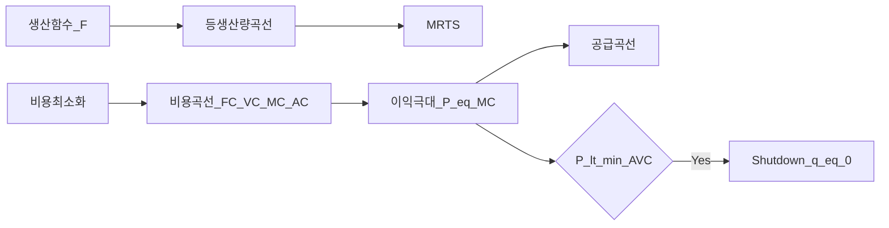
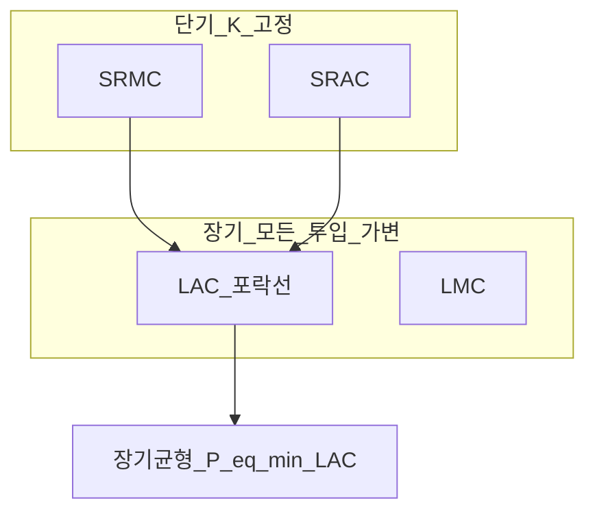
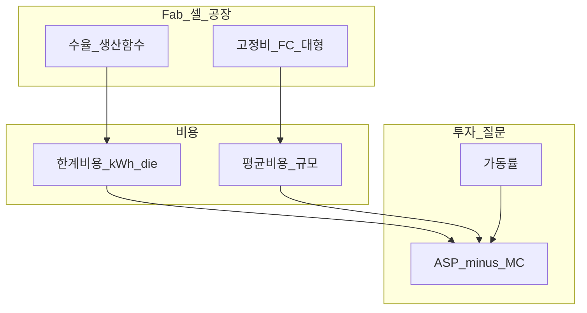
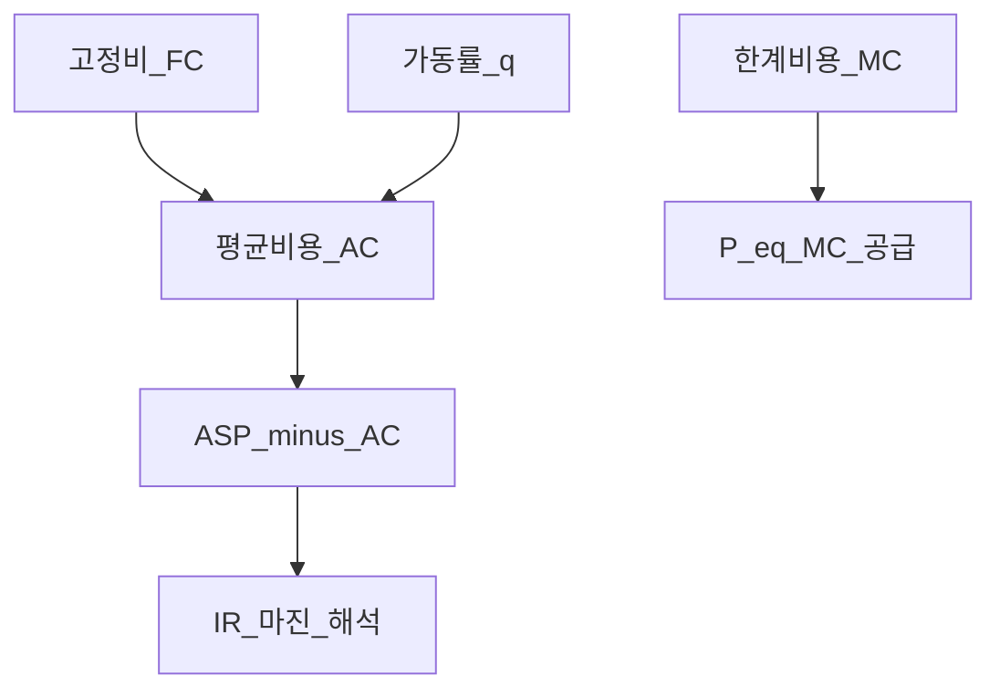

# 생산·비용·공급 — 생산함수부터 기업 공급곡선

> **면책**: 본 문서는 교육 목적이며, 특정 개인·법인에 대한 투자·세무·법률 자문이 아닙니다. 제도·세율·상품 조건은 변경될 수 있으므로 실행 전 공식 출처를 확인하세요.

## 메타

| 항목 | 내용 |
|------|------|
| 최종 검증일 | 2026-05-24 |
| 정책·법령 기준일 | 2025-12-31 확정, 2026 개편은 본문 표기 |
| 난이도 | L4 (Graduate) — [READER-GUIDE](../docs/READER-GUIDE.md) |
| 예상 읽기 시간 | **2.5~4시간** |
| 관련 bucket | Bucket 0~1, Bucket 3 위성(반도체·배터리·CAPEX 사이클) |

## 0. 이 편 읽기 전 (5분)

| 항목 | 내용 |
|------|------|
| **난이도** | L4 (Graduate) — [READER-GUIDE §L등급](../docs/READER-GUIDE.md) |
| **선수** | [미시경제학 기초](microeconomics-basics.md), [소비자 이론](micro-01-consumer-theory.md) |
| **이번 편에서 쓰는 기호** | 본문 §4·§4a 표 참고 |
| **복습 한 줄** | L3 선수 편을 먼저 읽으면 수식이 수월함 |

## TL;DR

1. **생산함수** \(q = F(K,L)\)는 투입(자본·노동)을 산출(물량)로 바꾸는 기술적 관계이며, **등생산량곡선(isoquant)** 과 **MRTS**로 대체 가능성을 기하학적으로 표현한다.
2. **Cobb-Douglas** \(q = A K^\alpha L^{1-\alpha}\)는 **규모의 수익** \(\alpha + (1-\alpha) = 1\)일 때 CRS(일정) — 파운드리·셀 공장의 **학습·복제** 직관과 연결된다.
3. **단기**에는 \(K\) 고정 → **\(MC\)** 가 U자형; **장기**에는 모든 투입 가변 → **\(LAC\)** 가 규모의 경제·불경제를 반영한다.
4. **비용 최소화** \(MRTS = w/r\) + **이익 극대화** \(P = MC\) → **공급곡선**; **\(P < \min AVC\)** 이면 **shutdown(휴업)** .
5. **반도체 fab**·**배터리 셀**은 **고정비·최소효율규모(MES)** 가 커서 신규 진입이 어렵고, [과점·IO](micro-03-market-structures-io.md)와 직결된다.
6. 투자: **가동률·ASP·\(MC\)** 를 [재무제표](../01-foundations/financial-statements-intro.md) 마진과 대조 — “매출↑인데 마진↓”는 **\(MC\) 곡선 위쪽** 또는 **가격↓** 신호.

---

## 1. 한 줄 정의 + 왜 중요한가

**정의**: **생산·비용·공급 이론**은 기업이 **기술(생산함수)** 과 **요소가격(임금·자본비용)** 아래 **최소비용**으로 생산하고, **시장가격**에 반응해 **공급량·투자·휴업**을 결정하는 과정을 모델링한다.

**왜 중요한가**: [소비자 이론](micro-01-consumer-theory.md)이 **수요**를 만든다면, 본 장은 **공급**을 만든다. [반도체 fab](../03-markets/sectors/semiconductor.md)의 **100억 달러 CAPEX**, [배터리 gigafactory](../03-markets/sectors/battery-lfp-ncm-ess.md)의 **단위 kWh 비용**은 모두 **생산함수·비용곡선**의 실물 사례다. “공급 과잉” 내러티브는 **\(LAC\) 하강 종료 + \(MC\) vs \(P\)** 질문으로 검증해야 한다. [포트폴리오](../04-portfolio/time-horizon-and-buckets.md)에서 **CAPEX 사이클** 종목은 **장기 비용곡선**과 **가동률**을 함께 본다.

---

## 2. 선수 지식 / 이후 읽을 것

**선수**:
- [미시경제학 기초](microeconomics-basics.md)
- [소비자 이론](micro-01-consumer-theory.md) — \(P=MC\)의 수요 측
- [재무제표 입문](../01-foundations/financial-statements-intro.md)

**이후**:
- [시장구조·산업조직](micro-03-market-structures-io.md)
- [반도체](../03-markets/sectors/semiconductor.md), [배터리](../03-markets/sectors/battery-lfp-ncm-ess.md)
- [섹터 투자 프레임워크](../03-markets/sectors/sector-investing-framework.md)
- [패시브 vs 액티브](../04-portfolio/passive-vs-active.md)

---

## 3. 직관·비유

**베이커리 주방**: 오븐( \(K\) )은 월세로 **고정**, 재료·알바( \(L\) )는 **변동**. 빵 1개 더 굽는 **한계비용(MC)** 은 처음엔 낮다가, 오븐 **용량**에 닿으면 급등 — **단기 \(MC\)** U자.

**공장 증설**: 2번째 fab를 짓면 **평균비용(AC)** 이 내려갈 수( **규모의 경제** ). 너무 크면 **관리·물류** 비용이 커져 **불경제** — **LAC** U자.

**배터리 셀 라인**: 동일 **GWh** 를 10개 소형 공장 vs 1개 메가 공장으로 — **MES**가 크면 소형은 **\(AC\)** 에서 불리 → 중국·한국 **대형 셀 메이저** 구조.

**휴업 vs 손실**: 가격이 **변동비(AVC)** 도 못 덮으면 “문 닫고 고정비만 태우는” 것보다 **shutdown** 이 낫다 — 메모리 **cut production** 뉴스의 경제학.

---

**이 모형이 말하는 것**: 수식은 계산 절차이고, 경제 직관은 「누가 이득·손해를 보는가」「어떤 가정이 깨지면 결론이 뒤집히는가」다. 유도 각 단계마다 **가정**을 한 줄로 적어 본다.
## 4. 정식 개념·용어

| 용어 | 한글 | English | 정의 |
|------|------|---------|------|
| 생산함수 | 생산함수 | Production function | \(q = F(K,L)\) |
| 등생산량곡선 | 등생산량곡선 | Isoquant | 동일 \(q\) 의 \((K,L)\) 조합 |
| MRTS | 한계기술대체율 | MRTS | \(K\) 1단위 ↓ 시 \(L\) 보상량 |
| 규모의 수익 | 규모의 수익 | Returns to scale | 모든 투입 \(t\)배 → \(q\) ?배 |
| FC / VC | 고정·변동비 | Fixed / Variable cost | \(q\) 무관 / \(q\)에 비례 |
| MC / AC | 한계·평균비용 | Marginal / Average cost | \(\Delta C/\Delta q\), \(C/q\) |
| 비용 최소화 | 비용 최소화 | Cost minimization | 주어진 \(q\) 최소 \(C\) |
| 공급곡선 | 공급곡선 | Supply curve | \(P=MC\) (이상적 경쟁) |
| Shutdown | 휴업 | Shutdown | \(P < \min AVC\) |
| MES | 최소효율규모 | Minimum efficient scale | \(LAC\) 최소 근처 규모 |
| CRS / IRS / DRS | 규모수익 | Constant / Increasing / Decreasing RS | \(F(tK,tL)\) vs \(tF\) |

### 4a. 핵심 용어 (본문 등장 순)

> 복습용. 정의는 §4 본표·[glossary](../00-roadmap/glossary.md)·본문 `!!! info` 박스.

| 용어 | 한 줄 | 관련 이론 | glossary |
|------|-------|-----------|----------|
| 생산함수 | 생산함수 | §4 | [glossary](../00-roadmap/glossary.md#생산함수) |
| 등생산량곡선 | 등생산량곡선 | §4 | [glossary](../00-roadmap/glossary.md#등생산량곡선) |
| MRTS | 한계기술대체율 | §4 | [glossary](../00-roadmap/glossary.md#mrts) |
| 규모의 수익 | 규모의 수익 | §4 | [glossary](../00-roadmap/glossary.md#규모의-수익) |
| FC / VC | 고정·변동비 | §4 | [glossary](../00-roadmap/glossary.md#fc-/-vc) |
| MC / AC | 한계·평균비용 | §4 | [glossary](../00-roadmap/glossary.md#mc-/-ac) |
| 비용 최소화 | 비용 최소화 | §4 | [glossary](../00-roadmap/glossary.md#비용-최소화) |
| 공급곡선 | 공급곡선 | §4 | [glossary](../00-roadmap/glossary.md#공급곡선) |
| Shutdown | 휴업 | §4 | [glossary](../00-roadmap/glossary.md#shutdown) |
| MES | 최소효율규모 | §4 | [glossary](../00-roadmap/glossary.md#mes) |
| CRS / IRS / DRS | 규모수익 | §4 | [glossary](../00-roadmap/glossary.md#crs-/-irs-/-drs) |

---

## 5. 메커니즘

### 5.1 생산 → 비용 → 공급

### 5.2 단기 vs 장기

### 5.3 반도체·배터리 투자 맵

---

## 6. 수식·모델

### 6.1 Cobb-Douglas 생산함수

| 기호 | 이름 | 이 식에서 의미 |
|       ------       | ------ | ------이(가) 이 식에서 맡는 역할(§4·본문 참고) |
|             \(q\)             | q | q이(가) 이 식에서 맡는 역할(§4·본문 참고) |
|             \(A\)             | A | A이(가) 이 식에서 맡는 역할(§4·본문 참고) |
|             \(K\)             | K | K이(가) 이 식에서 맡는 역할(§4·본문 참고) |
|             \(alpha\)             | alpha | alpha이(가) 이 식에서 맡는 역할(§4·본문 참고) |
|             \(L\)             | L | L이(가) 이 식에서 맡는 역할(§4·본문 참고) |
\[
q = A K^{\alpha} L^{1-\alpha}, \quad A>0,\; 0<\alpha<1
\]

**읽는 법**: **q**와 **A**의 관계를 위 식으로 쓴다. 경제·재무 해석은 변수표 「이 식에서 의미」와 [DEPTH-STANDARD](../docs/DEPTH-STANDARD.md) 기호 예제를 맞춘다.
**유도 (L4)**:
1. **정의**: **q**, **A**, **K**를 동일 시점·동일 통화로 맞춘다. — 단위 불일치면 식이 무의미해진다.
2. **식 변형**: 양변을 정리해 목표 변수를 한쪽에 둔다. — 할인·복리는 **시점 이동**이 핵심이다.
3. **해석**: 부호·크기가 경제 직관과 맞는지 확인한다. — 극단값에서 단조성·한계를 점검한다.

**MRTS** (유도 스케치):

| 기호 | 이름 | 이 식에서 의미 |
|       ------       | ------ | ------이(가) 이 식에서 맡는 역할(§4·본문 참고) |
|  \(MP_K\)  |  MP K  | MP K이(가) 이 식에서 맡는 역할(§4·본문 참고) |
|  \(MP_L\)  |  MP L  | MP L이(가) 이 식에서 맡는 역할(§4·본문 참고) |
|            \(A\)            | A | A이(가) 이 식에서 맡는 역할(§4·본문 참고) |
|            \(K\)            | K | K이(가) 이 식에서 맡는 역할(§4·본문 참고) |
|            \(L\)            | L | L이(가) 이 식에서 맡는 역할(§4·본문 참고) |
\[
MP_K = \alpha A K^{\alpha-1} L^{1-\alpha}, \quad MP_L = (1-\alpha) A K^{\alpha} L^{-\alpha}
\]

**읽는 법**: **MP_K**와 **MP_L**의 관계를 위 식으로 쓴다. 경제·재무 해석은 변수표 「이 식에서 의미」와 [DEPTH-STANDARD](../docs/DEPTH-STANDARD.md) 기호 예제를 맞춘다.
**유도 (L4)**:
1. **정의**: **MP_K**, **MP_L**, **A**를 동일 시점·동일 통화로 맞춘다. — 단위 불일치면 식이 무의미해진다.
2. **식 변형**: 양변을 정리해 목표 변수를 한쪽에 둔다. — 할인·복리는 **시점 이동**이 핵심이다.
3. **해석**: 부호·크기가 경제 직관과 맞는지 확인한다. — 극단값에서 단조성·한계를 점검한다.
| 기호 | 이름 | 이 식에서 의미 |
|       ------       | ------ | ------이(가) 이 식에서 맡는 역할(§4·본문 참고) |
|  \(RTS_{KL}\)  |  RTS KL  | \(RTS KL\)이(가) 이 식에서 맡는 역할(§4·본문 참고) |
|  \(MP_K}\)  |  MP K  | \(MP K\)이(가) 이 식에서 맡는 역할(§4·본문 참고) |
|  \(MP_L}\)  |  MP L  | \(MP L\)이(가) 이 식에서 맡는 역할(§4·본문 참고) |
|            \(L\)            | L | L이(가) 이 식에서 맡는 역할(§4·본문 참고) |
|            \(K\)            | K | K이(가) 이 식에서 맡는 역할(§4·본문 참고) |
\[
MRTS_{KL} = \frac{MP_K}{MP_L} = \frac{\alpha}{1-\alpha} \cdot \frac{L}{K}
\]

**읽는 법**: **RTS_**와 **MP_K**의 관계를 위 식으로 쓴다. 경제·재무 해석은 변수표 「이 식에서 의미」와 [DEPTH-STANDARD](../docs/DEPTH-STANDARD.md) 기호 예제를 맞춘다.
**유도 (L4)**:
1. **정의**: **RTS_**, **MP_K**, **MP_L**를 동일 시점·동일 통화로 맞춘다. — 단위 불일치면 식이 무의미해진다.
2. **식 변형**: 양변을 정리해 목표 변수를 한쪽에 둔다. — 할인·복리는 **시점 이동**이 핵심이다.
3. **해석**: 부호·크기가 경제 직관과 맞는지 확인한다. — 극단값에서 단조성·한계를 점검한다.
**규모의 수익**: \(F(tK,tL) = t^{\alpha + (1-\alpha)} F(K,L) = t F\) → **CRS**.

### 6.2 비용 최소화 (유도 스케치)

| 기호 | 이름 | 이 식에서 의미 |
|       ------       | ------ | ------이(가) 이 식에서 맡는 역할(§4·본문 참고) |
| \(PV\) | 현재가치 | 오늘 시점으로 환산한 금액 |
|  \(\min_{K\)  |  \min K  | \(\min K\)이(가) 이 식에서 맡는 역할(§4·본문 참고) |
|            \(K\)            | K | K이(가) 이 식에서 맡는 역할(§4·본문 참고) |
|            \(L\)            | L | L이(가) 이 식에서 맡는 역할(§4·본문 참고) |
|            \(F\)            | F | F이(가) 이 식에서 맡는 역할(§4·본문 참고) |
\[
\min_{K,L} \; rK + wL \quad \text{s.t.} \quad F(K,L) \ge \bar| 기호 | 이름 | 이 식에서 의미 |
|       ------       | ------ | ------이(가) 이 식에서 맡는 역할(§4·본문 참고) |
| \(r\) | 할인율·수익률 | 기간당 이자·요구수익률 |
| \(n\) | 기간 | 연·월 등 복리·할인에 쓰는 횟수 |
| \(PV\) | 현재가치 | 오늘 시점으로 환산한 금액 |

 q
\]

**읽는 법**: **PV**와 **min_**의 관계를 위 식으로 쓴다. 경제·재무 해석은 변수표 「이 식에서 의미」와 [DEPTH-STANDARD](../docs/DEPTH-STANDARD.md) 기호 예제를 맞춘다.
**유도 (L4)**:
1. **정의**: **PV**, **min_**, **K**를 동일 시점·동일 통화로 맞춘다. — 단위 불일치면 식이 무의미해진다.
2. **식 변형**: 양변을 정리해 목표 변수를 한쪽에 둔다. — 할인·복리는 **시점 이동**이 핵심이다.
3. **해석**: 부호·크기가 경제 직관과 맞는지 확인한다. — 극단값에서 단조성·한계를 점검한다.

Lagrange → **\(MRTS | 기호 | 이름 | 이 식에서 의미 |
|       ------       | ------ | ------이(가) 이 식에서 맡는 역할(§4·본문 참고) |
|            \(K\)            | K | K이(가) 이 식에서 맡는 역할(§4·본문 참고) |
|            \(L\)            | L | L이(가) 이 식에서 맡는 역할(§4·본문 참고) |
| \(C\) | 지출 | 기간 총 현금 유출 |

= w/r\)** (요소 상대가격 = 한계기술대체율).

Cobb-Douglas CRS에서:

| 기호 | 이름 | 이 식에서 의미 |
|       ------       | ------ | ------이(가) 이 식에서 맡는 역할(§4·본문 참고) |
|            \(K\)            | K | K이(가) 이 식에서 맡는 역할(§4·본문 참고) |
|            \(L\)            | L | L이(가) 이 식에서 맡는 역할(§4·본문 참고) |
| \(C\) | 지출 | 기간 총 현금 유출 |

\[
K^* = \frac{\alpha w}{ (1-\alpha) r} L^*, \quad C(w,r,\bar q) = \Phi(w,r) \cdot \bar q
\]

**읽는 법**: **K**와 **L**의 관계를 위 식으로 쓴다. 경제·재무 해석은 변수표 「이 식에서 의미」와 [DEPTH-STANDARD](../docs/DEPTH-STANDARD.md) 기호 예제를 맞춘다.
**유도 (L4)**:
1. **정의**: **K**, **L**, **C**를 동일 시점·동일 통화로 맞춘다. — 단위 불일치면 식이 무의미해진다.
2. **식 변형**: 양변을 정리해 목표 변수를 한쪽에 둔다. — 할인·복리는 **시점 이동**이 핵심이다.
3. **해석**: 부호·크기가 경제 직관과 맞는지 확인한다. — 극단값에서 단조성·한계를 점검한다.
**\(C\)** 가 \(\bar q\)에 **선형| 기호 | 이름 | 이 식에서 의미 |
|       ------       | ------ | ------이(가) 이 식에서 맡는 역할(§4·본문 참고) |
| \(PV\) | 현재가치 | 오늘 시점으로 환산한 금액 |
|            \(K\)            | K | K이(가) 이 식에서 맡는 역할(§4·본문 참고) |
** → **\(MC = AC\)| 기호 | 이름 | 이 식에서 의미 |
|       ------       | ------ | ------이(가) 이 식에서 맡는 역할(§4·본문 참고) |
| \(r\) | 할인율·수익률 | 기간당 이자·요구수익률 |
| \(n\) | 기간 | 연·월 등 복리·할인에 쓰는 횟수 |
| \(PV\) | 현재가치 | 오늘 시점으로 환산한 금액 |

** 상수(이상적 CRS).

### 6.3 단기 비용 (노동 가변, \(K\) 고정)

| 기호 | 이름 | 이 식에서 의미 |
|       ------       | ------ | ------이(가) 이 식에서 맡는 역할(§4·본문 참고) |
| \(r\) | 할인율·수익률 | 기간당 이자·요구수익률 |
| \(n\) | 기간 | 연·월 등 복리·할인에 쓰는 횟수 |
| \(PV\) | 현재가치 | 오늘 시점으로 환산한 금액 |

\[
STC(q) = FC + VC(q), \quad MC = \frac{dSTC}{dq}, \quad AVC = \frac{VC}{q}, \quad ATC = \frac{STC}{q}
\]

**읽는 법**: 위 식의 기호는 바로 위 변수표| 기호 | 이름 | 이 식에서 의미 |
|       ------       | ------ | ------이(가) 이 식에서 맡는 역할(§4·본문 참고) |
| \(PV\) | 현재가치 | 오늘 시점으로 환산한 금액 |
|  \(\max_q\)  |  max q  | max q이(가) 이 식에서 맡는 역할(§4·본문 참고) |
| \(M\) | 월 실수령 | 가계 교육용 월 세후 소득 기호 |
| \(P\) | 포트 규모 | 가상 포트폴리오 규모(만 원) |
|            \(Pq\)            | Pq | Pq이(가) 이 식에서 맡는 역할(§4·본문 참고) |
| \(C\) | 지출 | 기간 총 현금 유출 |

와 같다. 숫자는 [DEPTH-STANDARD](../docs/DEPTH-STANDARD.md) 교육용 기호(M·P·PV 등)로 대입한다.
**성질**: \(MC\) 와 \(AVC, ATC\) **교차**는 \(MC\) 최솟값·\(ATC\) 최솟값에서.

### 6.4 이익 극대화과 공급

| 기호 | 이름 | 이 식에서 의미 |
|       ------       | ------ | ------이(가) 이 식에서 맡는 역할(§4·본문 참고) |
|  \(\max_q\)  |  max q  | max q이(가) 이 식에서 맡는 역할(§4·본문 참고) |
|            \(Pq\)            | Pq | Pq이(가) 이 식에서 맡는 역할(§4·본문 참고) |
| \(C\) | 지출 | 기간 총 현금 유출 |

\[
\max_q \; \pi = Pq - C(q)
\]

**읽는 법**: **명목** 수익에서 **인플레**를 반영하면 **실질** 체감 수익을 본다. 정밀식은 본문 또는 §4 표를 따른다.
**유도 (L4)**:
1. **정의**: **max_q**, **Pq**, **C**를 동일 시점·동일 통화로 맞춘다. — 단위 불일치면 식이 무의미해진다.
2. **식 변형**: 양변을 정리해 목표 변수를 한쪽에 둔다. — 할인·복리는 **시점 이동**이 핵심이다.
3. **해석**: 부호·크기가 경제 직관과 맞는지 확인한다. — 극단값에서 단조성·한계를 점검한다.

**FOC**: \(P = MC(q^*)\) ( \(P < ATC\) 여도 \(P > AVC\) 면 **\(q^* > 0\)** ).

**공급곡선**: 경쟁 기업의 **\(MC\)** ( \(P \ge AVC\) 구간).

### 6.5 Shutdown 조건 (유도)

단기 손실: \(\pi = Pq - VC - FC\).

\(q=0\) → \(-FC\). \(q>0\) 최소 손실 조건: \(P \cdot q \ge VC(q)\) ⇔ **\(P \ge AVC\)** .

**Shutdown**: **\(P < \min AVC\)** → \(q^*=0\).

### 6.6 장기 균형 (완전경쟁 예고)

**\(P = \min LAC = MC\)** , **\(\pi = 0\)** — [micro-03](micro-03-market-structures-io.md)에서 확장.

---

### 6.7 학습곡선과 동적 MC (스케치)

누적 산출 \(Q\)에 따라 **\(MC(Q) = MC_0 \cdot Q^{-\beta}\)** (\(\beta>0\)). **fab·셀** **yield ramp** 초기 6~12개월 — **\(MC\)** 급락. 투자: **양산 초기** **적자** = **학습**; **성숙기** flatten — **사이클 정점** **과대평가** 주의.

### 6.8 장기 확장 경로 (등비용선)

**\(C(w,r,q) = q \cdot c(w,r)\)** (CRS) → **\(AC = MC = c\)**. **\(w/r\)** ↑ → **\(K/L\)** ↓ ( **\(MRTS = w/r\)** ). **금리↑**([macro](macroeconomics-basics.md)) → **자본 intensive** fab **\(LAC\)** ↑ — **\(q\)** ↓ or **\(P\)** ↑ 압력.

### 6.9 다품목·joint cost (fab)

**웨이퍼**에서 **DRAM+HBM** — **공동비용**. 한 제품 **\(P < MC_i\)** 여도 **joint MC** 커버하면 **생산** — **shutdown** **제품별** 아님 **fab** **단위**.

---

### 5.4 fab 가동률·마진 메커니즘

---

### 7.4 반도체·배터리 CAPEX 사이클 (투자)

| 단계 | 비용·공급 | 주가 민감도 |
|------|-----------|-------------|
| **발표** | **\(FC\uparrow\)** , 미래 **\(S\uparrow\)** | **CapEx** **부담** — 단기 **하락** 가능 |
| **건설** | **\(q=0\)** , **현금 소진** | **FCF** **악화** |
| **Ramp** | **\(MC\downarrow\)** , **yield** | **마진** **확대** |
| **과잉** | **\(P<ATC\)** , **shutdown** | **적자** **지속** |

[semiconductor](../03-markets/sectors/semiconductor.md), [battery](../03-markets/sectors/battery-lfp-ncm-ess.md), [rebalancing](../04-portfolio/rebalancing-and-dca.md).

---

### 예제 6 — Cobb-Douglas 비용 (가상)

\(q=K^{0.5}L^{0.5}\), \(r=4, w=1\) → **\(C = 2\sqrt{wr}\, q = 4q\)** , **\(MC=AC=4\)**. \(P=10\) → **이익** **\(6q\)** per unit.

### 예제 7 — 학습곡선 (가상 fab)

| 월 | yield | \(MC\) (정규) |
|----|-------|---------------|
| 1 | 40% | 100 |
| 6 | 70% | 55 |
| 12 | 90% | 42 |

**ASP 50** — 6개월까지 **\(P<MC\)** **적자**, 12개월 **흑字** — **투자** **horizon** [time-horizon](../04-portfolio/time-horizon-and-buckets.md).

### 예제 8 — 배터리 MES 비교

100GWh **\(AC=72\)** vs 20GWh **\(AC=92\)** — **가격 80** 시 대형 **마진 8**, 소형 **−12** → **shutdown** **소형** — **산업** **집중**.

---

### 11.2 Varian·Tirole 매핑

| 교재 | 본문 |
|------|------|
| Varian Ch. 18 Technology | §6.1–6.2 |
| Varian Ch. 20 Cost Min | §6.2 |
| Varian Ch. 21 Cost Curves | §6.3–6.5 |
| Varian Ch. 22 Firm Supply | §6.4–6.5 |
| Tirole Ch. 1 Overview | → [micro-03](micro-03-market-structures-io.md) |

---

**Q13. \(AC\) 최소 = \(MC\)?**  
**A13.** **\(MC\)** **\(AC\)** **관통** — **\(MC<AC\)** → **\(AC\)** **하강**; **\(MC>AC\)** → **\(AC\)** **상승**.

**Q14. sunk cost와 shutdown?**  
**A14.** **\(FC\)** **sunk** → **단기** **결정** **\(VC\)** **only** — **“이미 쓴 CAPEX”** **shutdown** **무관**.

**Q15. \(P=MC\)인데 \(\pi>0\)?**  
**A15.** **단기** **\(K\)** **고정** **quasi-rent** — **장기** **\(\pi=0\)** **진입**.

**Q16. 배터리 \(P<MC\) 지속?**  
**A16.** **\(P>AVC\)** **loss-minimizing** **\(q\)** — **시장점유** **목적** — **경쟁** **모델** **혼합**.

---

### 3.1 fab·셀 — 생산함수 실무 매핑

| 실무 지표 | 이론 객체 | IR 질문 |
|           -----------           | ----------- | -----------이(가) 이 식에서 맡는 역할(§4·본문 참고) |
| **수율(yield)** | \(A\) 또는 \(\theta\) in \(q=\theta F(K,L)\) | ramp **\(MC\)** **언제** **\(P\)** **아래**? |
| **가동률(utilization)** | \(q\) / installed **\(K\)** | **\(FC/q\)** **분摊** |
| **ASP** | 시장 **\(P\)** | **\(P-MC\)** **=** **economic** **margin** |
| **CapEx** | **\(K\uparrow\)** | **장기** **\(S\)** **↑** **→** **\(P\downarrow\)** |

**반도체 fab** ([semiconductor](../03-markets/sectors/semiconductor.md)): **先端** node **\(MES\)** **극대** — **2nm** **only** **few** **players**. **배터리 셀** ([battery](../03-markets/sectors/battery-lfp-ncm-ess.md)): **LFP** **\(MES\)** **중간** — **중국** **다수** **→** **\(P\to MC\)**.

---

### 10.1 L4 함정 추가

- **회계** **감가** = **economic** **\(MC\)** **착각**  
- **yield** **1%p** **=** **영구** **구조** **마진**  
- **shutdown** **뉴스** **없어도** **\(P<ATC\)** **적자** **가능**  
- **단기** **\(MC\)** **=** **장기** **공급** **곡선**

---

## 7. 한국 적용

### 7.1 2025년 기준 (확정)

| 산업 | 생산·비용 특징 | 투자 지표 |
|------|----------------|-----------|
| 메모리·파운드리 | **초대형 FC**, CRS+학습 | fab CAPEX, **가동률**, ASP |
| HBM·先端 | **수율** = 생산함수 | yield, **\(MC\)** vs ASP |
| 2차전지 셀 | **GWh 규모** = LAC | kWh **\(AC\)**, LFP vs NCM |
| 디스플레이 | 과잉 시 **shutdown** | fab 가동·손실 |

### 7.2 2026년 개편·시행 예정 (해당 시)

| 항목 | 2025 | 2026 |
|------|------|----------------|
| 반도체 설비 세액 | 국가별 R&D·CAPEX 인centive | **미국 CHIPS·EU**와 **중복·경쟁** — 유효 \(r\) ↓ |
| EV·배터리 IRA 연계 | 현지화 조건 | **공급곡선 이동** — 지역별 **\(AC\)** 분화 |
| 전력·요금 | 산업용 전력 | fab·셀 **\(VC\)** — [전력망](../03-markets/sectors/power-grid-electrification.md) |

**법·정책**: 산업통상자원부, KOTRA, 공정위 — **과점·시장분할**은 micro-03.

### 7.3 fab·셀 예시 (가상 파라미터)

**가상 HBM fab**: FC 20조 원, \(q=1\) (정규화)당 \(VC=0.4/die\), 수율↑ → **\(MC\downarrow\)**.

**가상 LFP 셀**: 100GWh 공장 **\(AC\)** = 80 USD/kWh, 30GWh **\(AC\)** = 95 — **MES** ≈ 80GWh+.

---

## 8. 숫자 예제 (가상)

> 모든 수치·회사는 가상입니다.

### 예제 1 — Cobb-Douglas MRTS

\(q = K^{0.5} L^{0.5}\), \(K=4, L=1\) → \(MRTS = \frac{0.5}{0.5}\cdot\frac{1}{4} = 0.25\).

**의미**: \(K\) 1단위 줄이려면 \(L\) 0.25단위 필요.

### 예제 2 — 단기 비용·이익

\(FC=100\), \(VC = q^2\), \(P=20\).

\(MC = 2q\), \(P=MC \Rightarrow q^*=10\), \(\pi = 200 - 100 - 100 = 0\).

\(P=15\) → \(q^*=7.5\), \(AVC=7.5\), \(P>AVC\) → **운영**, \(\pi<0\).

### 예제 3 — Shutdown

동일 \(VC=q^2\), \(FC=100\), \(P=3\).

\(AVC = q\), \(\min AVC = 0\) at \(q=0\) — 실무적: \(MC=2q\), 최적 \(q=1.5\), \(AVC=1.5\), **\(P=3>AVC\)** → 소량 생산. **\(P=1\)** → \(q^*=0.5\), \(AVC=0.5\), \(P=AVC\) 경계; **\(P=0.5\)** → shutdown.

### 예제 4 — 반도체 fab (가상)

| 가동률 | 유효 \(FC/q\) | \(MC\) (가상) | 마진 |
|--------|---------------|---------------|------|
| 100% | 낮음 | 40 | ASP 80 → **40** |
| 70% | ↑ | 55 | ASP 80 → **25** |
| 50% | ↑↑ | 70 | ASP 75 → **5** |

**교훈**: **가동률**이 \(MC\)·마진을 좌우 — [semiconductor](../03-markets/sectors/semiconductor.md).

### 예제 5 — 배터리 규모의 경제

| GWh | \(AC\) (USD/kWh) |
|-----|------------------|
| 20 | 92 |
| 50 | 78 |
| 100 | 72 |
| 200 | 71 |

**LAC** 하강 **완만** → 100GWh 이후 **경쟁=가격** — [battery](../03-markets/sectors/battery-lfp-ncm-ess.md).

---

## 9. FAQ

**Q1. \(MC\) 왜 U자인가?**  
**A1.** 단기 **수확체 diminishing MP** + **용량 제약** — 후반에 \(VC\) 가속.

**Q2. CRS fab에도 U자 \(AC\) ?**  
**A2.** **단기** \(K\) 고정이면 U자; **장기** CRS면 **\(LAC\)** 평탄 가능. **학습곡선**은 \(A\) ↑.

**Q3. \(P=MC\)와 “마진 50%” 공존?**  
**A3.** **완전경쟁** vs **과점** — micro-03. 회계 ** gross margin** ≠ 경제학 \(P-MC\).

**Q4. Shutdown vs 청산?**  
**A4.** Shutdown = **단기** \(q=0\); 청산 = **\(FC\) 회수** 포기 — 장기 **\(P < min LAC\)** .

**Q5. 수율이 생산함수에서?**  
**A5.** 유효 \(q = \theta F(K,L)\), \(\theta\)= yield — yield↑ = **동일 투입으로 \(q\uparrow\)** = **\(MC\downarrow\)**.

**Q6. [micro-01](micro-01-consumer-theory.md)과 접점?**  
**A6.** 시장 **균형** = 수요 + **본 장 공급**. 소비자 **\(MRS\)** ↔ 생산자 **\(MRTS\)** (일반균형).

**Q7. 배터리 LFP 가격전쟁?**  
**A7.** **\(LAC\)** 하강 + **\(P < rival MC\)** — 경쟁자 **shutdown** 압력 — [배터리](../03-markets/sectors/battery-lfp-ncm-ess.md).

**Q8. CAPEX 발표와 주가?**  
**A8.** **\(FC\uparrow\)** → 단기 **\(ATC\uparrow\)** , **공급 전망↑** → 장기 **\(P\downarrow\)** — [time-horizon](../04-portfolio/time-horizon-and-buckets.md).

**Q9. 노동·자동화?**  
**A9.** [physical-ai](../03-markets/sectors/physical-ai.md) — \(L/K\) 비 **대체**, **\(w/r\)** 변화 → **\(MRTS=w/r\)** 재조정.

**Q10. 재고와 \(MC\)?**  
**A10.** 재고 **투매**는 **\(P\)** ↓, **\(MC\)** 곡선 **이동 아님** — **수요·기대** 문제.

**Q11. 한국 fab 전력비?**  
**A11.** **\(VC\)** ↑ → **\(MC\uparrow\)** , **\(P=MC\)** 균형 **\(q\downarrow\)** (ceteris paribus).

**Q12. MES가 크면?**  
**A12.** **진입장벽** ↑, **과점** ↑ — micro-03 Cournot·HBM.

---

## 10. 함정·리스크·한계

- **회계원가 = 경제학 \(MC\)** — 감가·기회비용·R&D **capitalization** 차이  
- **학습곡선**을 **영구 \(MC\downarrow\)** 로 착각 — **성숙기** flatten  
- **가동률 1%p** 를 **\(MC\)** 없이 해석  
- **Shutdown** 무시 — “적자인데 가동” = **\(P>AVC\)** 가능  
- **단일 fab** → **글로벌 공급** — **Cournot** 필요  
- Cobb-Douglas **CRS** 를 모든 공정에 **과적용**  
- [macro](macroeconomics-basics.md) **금리** → \(r\), **\(K\)** 선택 — 본 장 **부분균형**

---

**Q. 실무에서는?**  
교과서 식·기호를 그대로 적용하기 전에 **수수료·세금·데이터 시점**을 분리한다. 숫자는 [DEPTH-STANDARD](../docs/DEPTH-STANDARD.md)처럼 기호만 먼저 맞추고, 법령·시장 수치는 §8 표·외부 출처로 갱신한다.

## 11. 심화 읽기

- [references/sources.md](../references/sources.md)
- **교재**
  - Hal R. Varian, *Intermediate Microeconomics* — Ch. Production, Cost, Supply
  - Nicholson & Snyder, *Microeconomic Theory*
  - Mas-Colell, Whinston & Green (MWG) — Ch. 5, 7
  - Paul Krugman & Maurice Obstfeld, *International Economics* — 규모·무역 (선택)
- **저장소**
  - [micro-01](micro-01-consumer-theory.md), [micro-03](micro-03-market-structures-io.md)
  - [microeconomics-basics](microeconomics-basics.md)
  - [semiconductor](../03-markets/sectors/semiconductor.md), [battery](../03-markets/sectors/battery-lfp-ncm-ess.md)
  - [passive-vs-active](../04-portfolio/passive-vs-active.md)

---

## 연습문제 (L4, 기호)

1. 위 §6 주요 식에서 변수 하나를 미지로 두고, 나머지를 기호로 둔 **관계식**을 쓰시오.
2. 가정이 깨질 때(유동성·세금·다중 IRR 등) 위 식의 **한계**를 기호·부등식으로 서술하시오.
3. §8 예제와 동일 기호(M·P·PV 등)로 **부호·단조성**만 검증하는 짧은 논증을 하시오.

### 해설 키

1. 직전 변수표의 「이 식에서 의미」를 이용해 동일 차원으로 정리한다.
2. 「가정이 깨지면」 절의 한계 사례와 연결한다.
3. 숫자 대입 없이 **부호**·**단위** 일치만 확인한다.
## 12. 스스로 점검 퀴즈

1. Cobb-Douglas \(q=K^{0.4}L^{0.6}\)의 규모의 수익은?  
2. 비용 최소화 FOC의 \(MRTS = w/r\) 의미는?  
3. \(P=MC\)에서 \(MC\) rising 구간이 공급인 이유는?  
4. Shutdown 조건은 \(P\) 와 어떤 비용 비교?  
5. fab **가동률↓**가 **\(MC\)** 에 미치는 방향은?  
6. **MES**가 크면 시장구조에?  
7. **수율↑**는 생산함수에서 어떤 효과?  
8. 장기 완전경쟁에서 **\(\pi\)** 는?

??? note "정답"

    1. **CRS** (지수합 1)  
    2. 마지막 \(K\)·\(L\) 교환율 = **요소 시장 가격비**  
    3. \(P\uparrow\) → **\(q\uparrow\)** along \(MC\) — 공급 **양(+)의 기울기**  
    4. **\(P < \min AVC\)**  
    5. **\(MC\uparrow\)** (고정비 분摊)  
    6. **과점·진입장벽** ↑ — [micro-03](micro-03-market-structures-io.md)  
    7. **\(q\uparrow\)** 동일 \((K,L)\) → **\(MC\downarrow\)**  
    8. **0** ( \(P=\min LAC\) )

## 부록 — L4 연습 (선택)

### A.1 단기·장기 비용 숫자

\(FC=1000\), \(VC=q^2\). **\(ATC\)** min at **\(q=31.6\)**, **\(ATC=63.2\)**. **\(P=80\)** → **\(q=40\)**, **\(\pi=660\)**.

### A.2 HBM fab (가상)

**FC 5조**, **capa 100**, **yield 85%**, **VC 30**, **ASP 80** → **\(P<ATC\)** **적자** **but** **\(P>AVC\)** **가동**. **yield 90%** → **흑字** — [semiconductor](../03-markets/sectors/semiconductor.md).

### A.3 dual — P=MC ⇔ 비용 최소

목표 **\(q\)** **고정** **비용** **최소** **⇔** **\(P=MC\)** **이익** **극대** — **MWG** **Ch.5**.

### A.4 IR 8문 (생산·비용)

yield? utilization? **\(P-MC\)**? CapEx→**\(S\)**? shutdown? MES? **\(w/r\)**? joint product?

### A.5 배터리 gigafactory (가상)

**20GWh** **AC=92** vs **100GWh** **AC=72** — **\(P=80\)** **소형** **shutdown** **압력** — [battery](../03-markets/sectors/battery-lfp-ncm-ess.md).

### A.6 학습곡선 12개월

yield 40%→90%: **\(MC\)** 100→42 — **ASP 50** **에서** **6개월** **\(P<MC\)** **,** **12개월** **흑字** — **투자** **horizon** [time-horizon](../04-portfolio/time-horizon-and-buckets.md).

### A.7 Cobb-Douglas 비용

**\(q=K^{0.5}L^{0.5}\)**, **\(r=4,w=1\)** → **\(MC=AC=4\)**. **\(P=10\)** → **단위당** **이익** **6**.

### A.8 semiconductor fab shutdown 판단 트리

1. **\(P\)** vs **\(AVC\)** — **shutdown** **여부**  
2. **\(P\)** vs **\(ATC\)** — **장기** **퇴출** **신호**  
3. **CapEx** **commitment** — **단기** **\(q=0\)** **vs** **장기** **\(K\)** **sunk**  
4. **Joint** **HBM+DRAM** — **제품** **별** **\(P\)** **≠** **fab** **결정**  
5. [micro-03](micro-03-market-structures-io.md) **Cournot** **\(N\)** — **\(P\)** **장기** **하향** **압력**

### A.9 Varian Ch.18–22 요약 (한국어)

**기술** → **등생산량** → **MRTS** → **비용최소** → **비용곡선** → **\(P=MC\)** **공급**. **L4** **시험** **대비** **손** **그림** **4개**: **isoquant+isocost**, **SRMC/SRAC**, **LAC envelope**, **shutdown**.

### A.10 배터리·반도체 CAPEX 4단계 (7.4 요약)

| 단계 | 비용 신호 | IR |
|------|-----------|-----|
| 발표 | **\(FC\uparrow\)**, 미래 **\(S\uparrow\)** | CapEx 부담 |
| 건설 | **\(q=0\)**, FCF 악화 | 현금 소진 |
| Ramp | **\(MC\downarrow\)**, yield↑ | 마진 확대 |
| 과잉 | **\(P<ATC\)**, shutdown 논의 | 적자 지속 |

[micro-01](micro-01-consumer-theory.md) **수요** + 본 장 **공급** = **균형** **\(P,Q\)** — [micro-03](micro-03-market-structures-io.md) **\(P\)** **markup**.

### A.11 L4 2주 학습 (생산·비용)

| 일차 | 활동 |
|------|------|
| 1 | Cobb-Douglas **MRTS** 손풀이 |
| 2 | **\(MC,AC\)** U자 **그림** |
| 3 | **shutdown** **숫자** (예제 3) |
| 4 | [semiconductor](../03-markets/sectors/semiconductor.md) **가동률** |
| 5 | [battery](../03-markets/sectors/battery-lfp-ncm-ess.md) **MES** |
| 6 | [micro-03](micro-03-market-structures-io.md) **Cournot** |

[microeconomics-basics](microeconomics-basics.md) **§한계비용** **→** **본** **장** **유도**.

### A.12 생산함수·비용 핵심 방정식 (복습)

| # | 방정식 | 의미 |
|---|--------|------|
| 1 | \(MRTS = w/r\) | 비용 최소화 |
| 2 | \(P = MC\) | 이익 극대 공급 |
| 3 | \(P < \min AVC \Rightarrow q=0\) | shutdown |
| 4 | \(F(tK,tL)=tF\) | CRS (Cobb-Douglas) |
| 5 | \(C = \phi(w,r)\, q\) | CRS → \(MC=AC\) |

**투자**: [재무제표](../01-foundations/financial-statements-intro.md) **매출원가** ≠ **\(MC\)** — **기회비용·수율·가동률** **조정** **필수**.

### A.13 fab·셀 IR 질문 10선

1. 분기 **가동률**? 2. **yield** **QoQ**? 3. **ASP** vs **\(MC\)**? 4. **CapEx** **guidance**? 5. **shutdown** **언급**? 6. **LFP/NCM** **\(AC\)** **gap**? 7. **\(w/r\)** **금리**? 8. **joint** **product** **mix**? 9. [micro-03](micro-03-market-structures-io.md) **\(N\)**? 10. [asset-allocation](../04-portfolio/asset-allocation.md) **사이클** **위치**?

**L4 완료 기준**: [TEMPLATE](../docs/TEMPLATE.md) · 2026-05-24