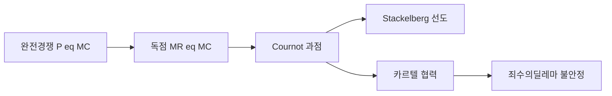
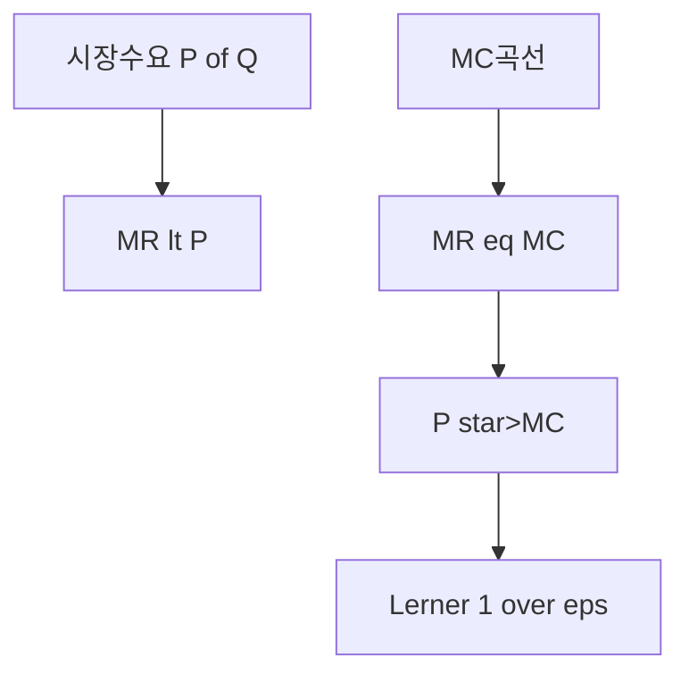
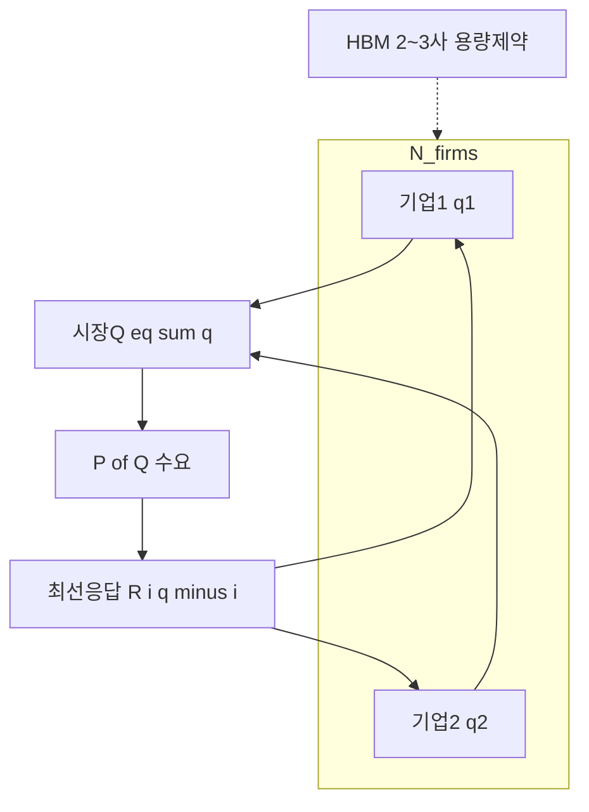
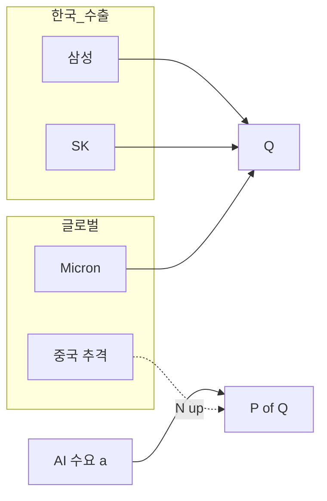
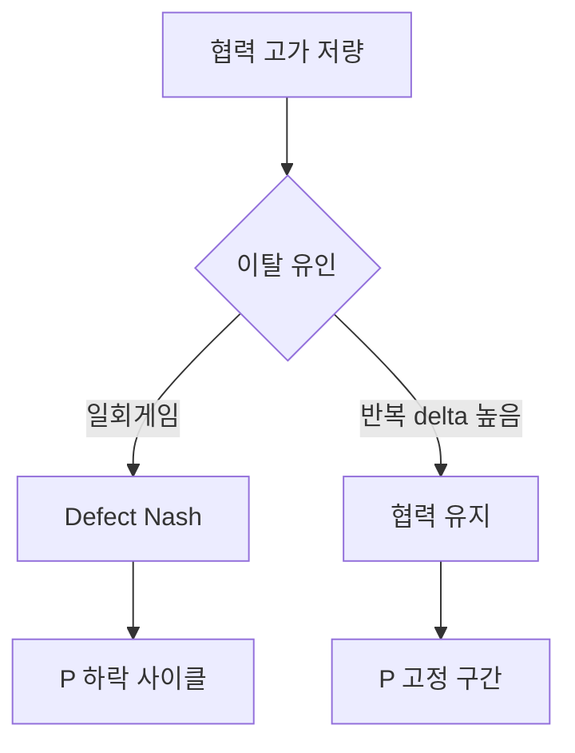

# 시장구조·산업조직 — 경쟁·과점·게임이론

> **면책**: 본 문서는 교육 목적이며, 특정 개인·법인에 대한 투자·세무·법률 자문이 아닙니다. 제도·세율·상품 조건은 변경될 수 있으므로 실행 전 공식 출처를 확인하세요.

## 메타

| 항목 | 내용 |
|------|------|
| 최종 검증일 | 2026-05-24 |
| 정책·법령 기준일 | 2025-12-31 확정, 2026 개편은 본문 표기 |
| 난이도 | L4 (Graduate) — [READER-GUIDE](../docs/READER-GUIDE.md) |
| 예상 읽기 시간 | **2.5~4시간** |
| 관련 bucket | Bucket 0~1, Bucket 3 위성(과점·수출·HBM·재벌) |

## 0. 이 편 읽기 전 (5분)

| 항목 | 내용 |
|------|------|
| **난이도** | L4 (Graduate) — [READER-GUIDE §L등급](../docs/READER-GUIDE.md) |
| **선수** | [미시경제학 기초](microeconomics-basics.md), [소비자 이론](micro-01-consumer-theory.md) |
| **이번 편에서 쓰는 기호** | 본문 §4·§4a 표 참고 |
| **복습 한 줄** | L3 선수 편을 먼저 읽으면 수식이 수월함 |

## TL;DR

1. **완전경쟁 장기균형**에서 **\(P = MC = \min LAC\)**, **\(\pi = 0\)** — [생산·비용](micro-02-production-cost-supply.md)의 \(P=MC\)가 **시장**까지 확장된다.
2. **독점**은 **\(MR = MC\)** 로 \(P > MC\); **Lerner markup** \(\frac{P-MC}{P} = -\frac{1}{\varepsilon_D}\) — **수요 탄력성**이 마진을 결정한다.
3. **1·2·3차 가격차별**은 **소비자 잉여**를 **착취** — HBM **고객별 ASP**, 항공 **동적 가격**과 연결.
4. **Cournot 과점**: 기업이 **수량**을 동시 선택 → **Nash 균형**; **Stackelberg**: **선도자(leader)** 가 **quantity commitment**.
5. **한국 재벌·수출 과점** — 메모리·디스플레이·조선 **소수 oligopoly**; **HBM**은 **2~3사** + **고정 CAPEX** → **Cournot + capacity**.
6. **죄수의 딜레마** — 카르텔 **불안정**: 각자 **이탈 유인** → **\(P\downarrow\)** ; DRAM **사이클**의 게임이론적 해석.

## 1. 한 줄 정의 + 왜 중요한가

**정의**: **산업조직(Industrial Organization, IO)** 은 **시장구조**(경쟁자 수·진입장벽·차별화)가 **가격·수량·마진·혁신·복지**에 미치는 영향을, **부분균형**과 **게임이론**으로 분석한다.

!!! info "GDP (Gross Domestic Product)"
    일정 기간 국내 총생산.

**왜 중요한가**: 투자자에게 시장구조 이론이 필요한 이유:

- **마진 지속성 판단**: 완전경쟁 시장(LFP 배터리 셀)에서는 수익성이 장기적으로 평균 수준으로 수렴합니다. 반면 과점(HBM, 파운드리 선단 공정)에서는 높은 마진이 지속될 수 있습니다.
- **진입 장벽 분석**: 신규 경쟁자가 쉽게 들어올 수 있는가(낮은 진입 장벽)를 파악하면 기업의 장기 수익 방어력을 알 수 있습니다.
- **가격 전쟁 위험**: 과점 기업들이 암묵적 협조를 유지할 수 있는가? 치킨게임(Bertrand 경쟁)으로 갈 수 있는가?

동일한 “AI 붐”도 **완전경쟁 LFP 셀**과 **HBM oligopoly**에서는 **마진·주가 민감도**가 다릅니다. [microeconomics-basics](microeconomics-basics.md) L3의 “과점=마진”을 **MR=MC, Cournot, Nash**로 **정량화**한다. 한국 투자자에게 **수출 재벌·반도체**는 **국가 포트폴리오** 핵심 — [코어-위성](../04-portfolio/core-satellite-framework.md) **위성**의 **집중·변동성**은 IO 리스크와 맞물린다. [반도체](../03-markets/sectors/semiconductor.md), [섹터 프레임](../03-markets/sectors/sector-investing-framework.md) 심화의 **이론 축**.

## 2. 선수 지식 / 이후 읽을 것

**선수**:
- [미시경제학 기초](microeconomics-basics.md)
- [소비자 이론](micro-01-consumer-theory.md) — \(\varepsilon_D\), 수요
- [생산·비용·공급](micro-02-production-cost-supply.md) — \(MC\), shutdown, LAC

**이후**:
- [거시경제학 기초](macroeconomics-basics.md) — 금리·환율·수출
- [반도체](../03-markets/sectors/semiconductor.md), [AI 인프라](../03-markets/sectors/ai-infrastructure.md)
- [지역 분산](../04-portfolio/geographic-diversification.md), [리밸런싱](../04-portfolio/rebalancing-and-dca.md)

## 3. 직관·비유

> **강의 시작 전 질문** — 이 질문에 바로 답하기 어렵다면, 이 섹션이 당신을 위한 것입니다.
> - "HBM(고대역폭메모리)이 왜 일반 D램보다 마진이 높은가?"
> - "네이버와 카카오가 광고를 올려도 기업들이 계속 돈을 내는 이유는?"
> - "중국 LFP 배터리 업체들이 난립하는데 한국 배터리 기업 마진은 왜 내려갔나?"

**핵심은:** 같은 "AI 붐"이라도 **경쟁 구조**에 따라 기업의 수익성이 전혀 다릅니다. 독점·과점 기업은 가격 결정력(pricing power)이 있어서 마진을 지킬 수 있지만, 완전경쟁 시장에서는 초과 이익이 경쟁으로 사라집니다. 섹터 분석의 핵심은 "이 기업은 어떤 시장 구조에 있는가?"입니다.

**동네 과일 시장 vs HBM**: 과일은 **진입 쉬움** → **\(P \approx MC\)**, 마진 얇음. HBM fab는 **수천억 CAPEX** → **소수 player** → **\(P \gg MC\)** 가능(수요·용량에 따라).

**재벌 그룹 경쟁**: 삼성·SK **메모리** — Cournot처럼 **“상대가 얼마나 낼지”** 맞추며 **capa** 결정. **선도 fab** 투자 = **Stackelberg commitment** — “내가 먼저 큰 capa 잡으면 너는 **follow**”.

**항공권 가격**: 같은 좌석, 다른 **\(p\)** — **3차 가격차별**(지불의사 분리). **HBM**도 **고객·계약**별 ASP 차 — **차별화=마진**.

**카르텔과 DRAM**: “감산 합의” = **협력**. 각사 **\(q\uparrow\)** 유혹 = **죄수의 딜레마** — 2018~2020 **메모리** 사이클의 **반복**.

**마진 vs 밸류에이션**: IO는 **\(P-MC\)** 구조; 주가는 **미래 \(MC\)** · **진입** · **대체기술** — **둘 다** 필요.

---

**이 모형이 말하는 것**: 수식은 계산 절차이고, 경제 직관은 「누가 이득·손해를 보는가」「어떤 가정이 깨지면 결론이 뒤집히는가」다. 유도 각 단계마다 **가정**을 한 줄로 적어 본다.
## 4. 정식 개념·용어

| 용어 | 한글 | English | 정의 |
|------|------|------|----------------|
| 완전경쟁 | 완전경쟁 | Perfect competition | 가격수용, 동질, 자유진입 |
| 독점 | 독점 | Monopoly | 단일 판매자 |
| 과점 | 과점 | Oligopoly | 소수 기업, **전략적 상호의존** |
| MR | 한계수익 | Marginal revenue | \(dR/dq\) |
| Markup | 가격마진 | Markup | \(P - MC\) 또는 \((P-MC)/P\) |
| 가격차별 | 가격차별 | Price discrimination | 동일 상품 **다른 \(p\)** |
| Cournot | 쿠르 노 | Cournot | **수량** 동시 선택 |
| Stackelberg | 스택켈베르크 | Stackelberg | **선도-후행** 수량 |
| Nash 균형 | 내시 균형 | Nash equilibrium | 타자 전략 **고정** 시 **최선응답** |
| 카르텔 | 카르텔 | Cartel | **공식·비공식** collusion |
| Lerner index | L 지수 | Lerner index | \((P-MC)/P\) |

### 4a. 핵심 용어 (본문 등장 순)

> 복습용. 정의는 §4 본표·[glossary](../00-roadmap/glossary.md)·본문 `!!! info` 박스.

| 용어 | 한 줄 | 관련 이론 | glossary |
|------|------|------|----------------|
| 완전경쟁 | 완전경쟁 | §4 | [glossary](../00-roadmap/glossary.md#완전경쟁) |
| 독점 | 독점 | §4 | [glossary](../00-roadmap/glossary.md#독점) |
| 과점 | 과점 | §4 | [glossary](../00-roadmap/glossary.md#과점) |
| MR | 한계수익 | §4 | [glossary](../00-roadmap/glossary.md#mr) |
| Markup | 가격마진 | §4 | [glossary](../00-roadmap/glossary.md#markup) |
| 가격차별 | 가격차별 | §4 | [glossary](../00-roadmap/glossary.md#가격차별) |
| Cournot | 쿠르 노 | §4 | [glossary](../00-roadmap/glossary.md#cournot) |
| Stackelberg | 스택켈베르크 | §4 | [glossary](../00-roadmap/glossary.md#stackelberg) |
| Nash 균형 | 내시 균형 | §4 | [glossary](../00-roadmap/glossary.md#nash-균형) |
| 카르텔 | 카르텔 | §4 | [glossary](../00-roadmap/glossary.md#카르텔) |
| Lerner index | L 지수 | §4 | [glossary](../00-roadmap/glossary.md#lerner-index) |

## 5. 메커니즘

### 5.1 시장구조 스펙트럼

### 5.2 독점 → markup

### 5.3 Cournot · Nash · HBM

## 6. 수식·모델

### 6.1 완전경쟁 장기 균형 (유도 스케치)

기업: \(P=MC(q)\). **\(\pi>0\)** → 진입 → **\(S\uparrow\)** → **\(P\downarrow\)**. **\(\pi<0\)** → 퇴출.

**장기**: **\(P = MC = \min LAC\)**, **\(\pi = 0\)**.

### 6.2 독점: MR = MC

역수요 \(P(Q)\), \(R = P(Q)\cdot Q\).

| 기호 | 이름 | 이 식에서 의미 |
|------|------|----------------|
| **r** | 할인율·수익률 | 기간당 이자·요구수익률 |
| **n** | 기간 | 연·월 등 복리·할인에 쓰는 횟수 |
| **PV** | 현재가치 | 오늘 시점으로 환산한 금액 |
| **FV** | 미래가치 | 미래 시점의 목표·결과 금액 |

\[
MR(Q) = P(Q) + Q \cdot P'(Q) < P
\]

**식 (기호)**: **MR**(**Q**) = **P**(**Q**) + **Q** ·P'(**Q**) < **P**

**식 (기호)**: **MR**(**Q**) = **P**(**Q**) + **Q** ·P'(**Q**) < **P**

**식 (기호)**: **MR**(**Q**) = **P**(**Q**) + **Q** ·P'(**Q**) < **P**

**읽는 법**: **MR**와 **Q**의 관계를 위 식으로 쓴다. 경제·재무 해석은 변수표 「이 식에서 의미」와 [DEPTH-STANDARD](../docs/DEPTH-STANDARD.md) 기호 예제를 맞춘다.
**유도 (L4)**:
1. **정의**: **MR**, **Q**, **P**를 동일 시점·동일 통화로 맞춘다. — 단위 불일치면 식이 무의미해진다.
2. **식 변형**: 양변을 정리해 목표 변수를 한쪽에 둔다. — 할인·복리는 **시점 이동**이 핵심이다.

**\(MR = MC\)** → **\(Q_m < Q_c\)**, **\(P_m > P_c\)** (c=경쟁, m=독점).

**선형 수요** \(P = a - bQ\): \(MR = a - 2bQ\), **\(Q_m = (a-MC)/(2b)\)**.

### 6.3 Lerner markup (유도)

독점 FOC: \(MR = P + Q P' = MC\).

| 기호 | 이름 | 이 식에서 의미 |
|------|------|----------------|
| **r** | 할인율·수익률 | 기간당 이자·요구수익률 |
| **n** | 기간 | 연·월 등 복리·할인에 쓰는 횟수 |
| **PV** | 현재가치 | 오늘 시점으로 환산한 금액 |
| **FV** | 미래가치 | 미래 시점의 목표·결과 금액 |

\[
\frac{P - MC}{P} = -\frac{1}{\varepsilon_D}
\]

**식 (기호)**: (**P** - **MC**) / (**P**) = -(1) / (**ε_D**)

**식 (기호)**: (**P** - **MC**) / (**P**) = -(1) / (**ε_D**)

**식 (기호)**: (**P** - **MC**) / (**P**) = -(1) / (**ε_D**)

**읽는 법**: **lon_D**와 **P**의 관계를 위 식으로 쓴다. 경제·재무 해석은 변수표 「이 식에서 의미」와 [DEPTH-STANDARD](../docs/DEPTH-STANDARD.md) 기호 예제를 맞춘다.
**유도 (L4)**:
1. **정의**: **lon_D**, **P**를 동일 시점·동일 통화로 맞춘다. — 단위 불일치면 식이 무의미해진다.
2. **식 변형**: 양변을 정리해 목표 변수를 한쪽에 둔다. — 할인·복리는 **시점 이동**이 핵심이다.
**\(|\varepsilon_D|\)** 클수록 **markup ↓** — [소비자 이론](micro-01-consumer-theory.md) 탄력성이 **마진**을 정한다.

### 6.4 1·2·3차 가격차별

| 차수 | 조건 | 효과 |
|------|------|----------------|
| 1차 | 완벽 정보 | **\(CS\)** 전부 → **\(P=MC\)** 수준 |
| 2차 | self-selection | **버전·묶음** |
| 3차 | 그룹별 \(\varepsilon\) | **학생·기업** 요금 |

**투자**: HBM **long-term agreement** vs **spot** — **차별화 ASP**.

### 6.5 Cournot duopoly (유도 스케치)

\(P = a - b(q_1 + q_2)\), **\(MC=c\)** constant.

기업 1: \(\max_{q_1} (a - b(q_1+q_2))q_1 - cq_1\)

**FOC**: \(a - 2b q_1 - b q_2 = c\) → **반응함수** \(q_1 = \frac{a-c}{2b} - \frac{q_2}{2}\).

**대칭 Nash**: \(q_1^* = q_2^* = \frac{a-c}{3b}\), **\(Q = 2(a-c)/(3b)\)**, **\(P = (a+2c)/3\)**.

**비교**: 독점 \(Q\) vs Cournot \(Q\) vs 경쟁 — **\(P\)** 순: monopoly > Cournot > competition.

### 6.6 Stackelberg (leader firm 1)

Leader **먼저** \(q_1\), follower **\(q_2^*(q_1)\)**.

Follower: \(q_2 = \frac{a-c-bq_1}{2b}\). Leader anticipates → **\(q_1^{Stack} = \frac{a-c}{2b} > q_1^{Cournot}\)** — **선도자 advantage**.

**fab 선투자**: capa **commitment** → **Stackelberg** 유사.

### 6.7 죄수의 딜레마 · 카르텔

일회성 게임에서 각 기업의 **지배전략(dominant strategy)** 이 **이탈(증산)** 이면:

| 기호 | 이름 | 이 식에서 의미 |
|------|------|----------------|
| **r** | 할인율·수익률 | 기간당 이자·요구수익률 |
| **n** | 기간 | 연·월 등 복리·할인에 쓰는 횟수 |
| **PV** | 현재가치 | 오늘 시점으로 환산한 금액 |

\[
\pi(\text{협력},\text{협력}) > \pi(\text{이탈},\text{협력}) > \pi(\text{협력},\text{이탈}) > \pi(\text{이탈},\text{이탈})
\]

**식 (기호)**: **π**_(협력,협력) > **π**_(이탈,협력) > **π**_(협력,이탈) > **π**_(이탈,이탈)

**식 (기호)**: **π**_(협력,협력) > **π**_(이탈,협력) > **π**_(협력,이탈) > **π**_(이탈,이탈)

**식 (기호)**: **π**_(협력,협력) > **π**_(이탈,협력) > **π**_(협력,이탈) > **π**_(이탈,이탈)

**읽는 법**: **명목** 수익에서 **인플레**를 반영하면 **실질** 체감 수익을 본다. 

정밀식은 본문 또는 §4 표를 따른다.
**유도 (L4)**:
1. **정의**: **r**, **n**, **PV**를 동일 시점·동일 통화로 맞춘다. — 단위 불일치면 식이 무의미해진다.
2. **식 변형**: 양변을 정리해 목표 변수를 한쪽에 둔다. — 할인·복리는 **시점 이동**이 핵심이다.

**Nash 균형** = **(이탈, 이탈)** — **카르텔 불안정**. DRAM **감산 합의**가 깨지는 구조와 동형.

**반복게임**: 할인인자 \(\delta\)가 충분히 크면 **trigger strategy**(한 번 이탈 시 영구 보복)로 **협력**이 subgame perfect 균형이 될 수 있다(folk theorem). **호황기**에 collusion이 **유지**되다가 **수요 둔화** 시 \(\delta\) 효과가 약해지면 **가격전쟁**으로 전환 — 사이클 **하강 국면** 해석.

### 6.8 Bertrand vs Cournot (선택)

**Bertrand**(가격 경쟁): 동질재·용량 무제한이면 **\(P=MC\)** (Bertrand paradox). **용량 제약·차별화**가 있으면 **\(P>MC\)** — HBM은 **fab capa** 때문에 **Cournot·capacity** 모델이 더 적합.

### 6.9 N-firm Cournot (스케치)

대칭 \(N\) 기업, 선형 수요: \(q^* = \frac{a-c}{b(N+1)}\), \(Q = \frac{N(a-c)}{b(N+1)}\). **\(N\to\infty\)** → 경쟁 균형. **중국 memory 진입** = **\(N\uparrow\)** → **\(P\downarrow\)** 장기 압력.

---

진입** = **\(N\uparrow\)** → **\(P\downarrow\)** 장기 압력.

## 7. 한국 적용

### 7.1 2025년 기준 (확정)

| 산업 | IO 구조 | 투자 함의 |
|------|------|----------------|
| DRAM/NAND | **2~3 global** + 중국 추격 | Cournot, **capa cycle** |
| HBM | **SK·Samsung** + Micron | **High markup** 가능, **yield** 리스크 |
| LFP 셀 | **다수** + 중국 | **\(P\to MC\)** 압력 |
| 조선 | **Korean oligopoly** | **backlog** = **\(Q\)** commitment |
| 디스플레이 | **감산·협력** 시도 | **카르텔** → **이탈** 반복 |

### 7.2 2026년 개편·시행 예정 (해당 시)

| 항목 | 2025 | 2026 (시행 여부 명시) |
|------|------|----------------|
| CHIPS·현지 fab | 미·유 **보조금** | **Cournot player +1** 가능 — 장기 \(P\downarrow\) |
| 중국 memory | YMTC 등 추격 | **\(N\uparrow\)** → markup 축소 |
| 공정위 담합 단속 | 과징금·형사 | **이탈 유인** ↑ — 카르텔 **지속성↓** |
| HBM capa | tight | **Stackelberg** 선행 투자 경쟁 |
| LFP 셀 | 공급 과잉 | **\(P\to MC\)** 압력 지속 |

**법·정책**: 공정거래법 §40(불공정거래), §45(담합), KFTC — **담합 제재**가 카르텔 **이탈 유인**을 바꾼다.

### 7.3 HBM oligopoly (가상 시나리오)

**수요**: \(P = 100 - Q\) (정규화), **\(MC=20\)**.

| 구조 | \(Q\) | \(P\) | industry \(\pi\) |
|------|------|------|----------------|
| 독점 | 40 | 60 | 1600 |
| Cournot (2) | 53.3 | 46.7 | 1422 |
| Cournot (3) | 64 | 36 | 1024 |
| 경쟁 | 80 | 20 | 0 |

**HBM 2~3사**: **Cournot(2~3)** 구간 — **\(P\gg MC\)** , **capa** 추가 시 **\(Q\uparrow\)** → **\(P\downarrow\)** 빠름(**탄력적 수요**).

### 7.4 재벌·수출 맥락

- **메모리·디스플레이**: **글로벌 oligopoly** + **Korea export** — **환율·금리**([macro](macroeconomics-basics.md)) + **Cournot capa**
- **조선**: **backlog** = **선행 \(q\)** — **Stackelberg** 유사 **선주 발注**
- **포트폴리오**:  [geographic-diversification](../04-portfolio/geographic-diversification.md) — **한국 IO 집중** **위성** 리스크

### 7.4 2025~2026 한국 시장구조 투자 체크포인트

**쉽게 말하면:** 시장 구조 변화가 기업 마진·주가에 미치는 영향입니다.

| 섹터 | 시장 구조 | 체크 포인트 |
|------|------|------|
| HBM 메모리 | 사실상 과점(삼성·SK·마이크론) | 가격 협력 지속 여부 |
| LFP 배터리 셀 | 중국 진입으로 경쟁 심화 | 마진 바닥 확인 타이밍 |
| 국내 플랫폼 | 네트워크 효과 독점 | 규제 리스크·글로벌 경쟁 |
| 파운드리 선단(2nm~3nm) | 2강 체제(TSMC·삼성) | 점유율 변화·수율 경쟁 |
| 조선 | 글로벌 과점 회귀 | 수주 단가 유지 능력 |

## 8. 숫자 예제 (가상)

> 가상 수치·회사입니다.

### 예제 1 — 독점 markup

\(P = 100 - Q\), \(MC=20\). \(MR=100-2Q=20\) → \(Q=40\), \(P=60\).

Lerner: \((60-20)/60 = 2/3\). \(\varepsilon_D = -1.5\) at \(Q=40\)? Check: \(Q=40\), \(P=60\), \(dQ/dP=-1\), \(\varepsilon = -40/60 \cdot ...\) — **linear** demand at \(Q_m\): \(|\varepsilon|=1.5\), \(1/1.5=2/3\) ✓

### 예제 2 — Cournot duopoly

§6.5: \(a=100,b=1,c=20\) → \(q^*=80/3\), \(Q=160/3\), \(P=140/3 \approx 46.7\).

**vs 독점** \(Q=40\), \(P=60\) — **과점**이 **\(P\)** 낮춤 but **> MC**.

### 예제 3 — Stackelberg

Leader \(q_1 = (a-c)/(2b) = 40\), follower \(q_2 = 20\), \(Q=60\), \(P=40\).

Leader **\(q\)** > Cournot **40 vs 26.7** — **first-mover**.

### 예제 4 — 가격차별 (HBM 가상)

| 세그먼트 | \(\varepsilon\) | \(P\) | \(MC\) |
|------|------|------|----------------|
| Hyperscaler LT | -2 | 55 | 20 |
| Enterprise | -1.2 | 70 | 20 |

**Lerner** 0.5 vs 0.17 — **계약 구조**가 **ASP**.

### 예제 5 — 죄수의 딜레mma (감산)

| | B: 협력 | B: 증산 |
|------|------|----------------|
| **A: 협력** | (10,10) | (2,12) |
| **A: 증산** | (12,2) | (4,4) |

**Nash**: (증산,증산) — **DRAM** **cut** 실패 **논리**.

### 예제 13 — 단계별: HBM 과점 시장의 쿠르노 경쟁

**상황**: HBM 시장에 기업 A, B 두 곳 (수요 P = 200 − Q, 각사 MC = 40)

**단계별 쿠르노 균형:**

1. **기업 A 이익 극대화**: MR_A = 200 − 2q_A − q_B = 40 → q_A = 80 − q_B/2
2. **기업 B도 동일**: q_B = 80 − q_A/2
3. **연립방정식 풀기**: q_A = q_B = 53.3, 총 Q ≈ 106.6
4. **시장 가격**: P = 200 − 106.6 ≈ **93.4**
5. **단위이익**: 93.4 − 40 = **53.4** (각사)

**완전경쟁 비교**: P = MC = 40, 이익 = 0. **독점 비교**: Q = 80, P = 120, 이익 = 80 × 80 = 6,400 합산.

**투자 시사점**: 과점 구조에서는 경쟁보다 훨씬 높은 가격·마진이 유지됩니다. 3위권 기업이 시장에 진입하면 이 균형이 깨집니다.

## 9. FAQ

**Q1. 완전경쟁 현실에 있나?**  
**A1.** **Benchmark**. **Commodity LFP**에 **근접**; HBM은 **far**.

**Q2. \(MR=MC\) vs 회계 영업이익률?**  
**A2.** **Economic** vs **accounting** — [micro-02](micro-02-production-cost-supply.md) **\(MC\)**.

**Q3. Cournot vs Bertrand?**  
**A3.** Bertrand **가격** 경쟁, **동질+용량** → **\(P=MC\)** . **Capa 제약** 있으면 **Cournot** 현실적 — **fab**.

**Q4. HBM “독과점”인가?**  
**A4.** **2~3 Cournot** — **완전 독점** 아님. **Micron** 포함 **\(N=3\)**.

**Q5. 카르텔과 **감산 MOU**?**  
**A5.** **담합** **리스크** — **공정위**; **경제학** = **불안정**.

**Q6. Stackelberg와 **first fab**?**  
**A6.** **선행 CAPEX** → rival **\(q_2\downarrow\)** — **commitment**.

**Q7. [micro-01](micro-01-consumer-theory.md) \(\varepsilon\) → markup?**  
**A7.** Lerner **직접** 연결.

**Q8. 재벌 **지주** discount?**  
**A8.** IO **\(P\)** + **지배구조** **별개** — 본 장 **산업** **\(P-MC\)**.

**Q9. AI **수요** shift?**  
**A9.** **\(a\)** in \(P=a-bQ\) **↑** — **동일 Cournot** **\(P,Q\)** **↑** — [ai-infrastructure](../03-markets/sectors/ai-infrastructure.md).

**Q10. **반복** DRAM game?**  
**A10.** **\(\delta\)** high → **collusion** **sustainable** — **boom** **cut** **유지**.

**Q11. **진입** threat?**  
**A11.** **Contestable** — **\(P\)** **cap** — **중국** **memory**.

**Q12. 포트폴리오 **과점** **overweight**?**  
**A12.** **Cycle** **peak** **\(P\)** — [rebalancing](../04-portfolio/rebalancing-and-dca.md).
**Q13. 한국 플랫폼 기업(네이버·카카오)의 시장 구조는?**  
**A13.** 쉽게 말하면: 플랫폼은 네트워크 효과로 인해 자연독점 성향이 강합니다. 사용자가 많을수록 광고주에게 더 가치 있는 플랫폼이 되고(양면시장), 후발 진입자는 이 네트워크를 따라가기 어렵습니다. 다만 글로벌 플랫폼(구글·유튜브)이 경쟁하면 국내 독점력이 희석될 수 있습니다. 규제 리스크(독점 규제)도 고려해야 합니다.

## 10. 함정·리스크·한계

- **과점 = 영구 해자** — **기술·진입**  
- **Cournot** **only** — **capacity** **timing** **복잡**  
- **Markup** **peak** = **매수** — **cycle** **top**  
- **담합** **뉴스** = **持續** **아님**  
- **Lerner** **\(|\varepsilon|\)** **추정** **어려움**  
- **Static** IO — **R&D** **dynamic** IO **별도**  
- **국가** **subsidy** → **\(MC\)** **shift** — **CHIPS**  
- [micro-02](micro-02-production-cost-supply.md) **shutdown** **무시** **과잉** **지속**

---

**Q. 실무에서는?**  
교과서 식·기호를 그대로 적용하기 전에 **수수료·세금·데이터 시점**을 분리한다. 숫자는 [DEPTH-STANDARD](../docs/DEPTH-STANDARD.md)처럼 기호만 먼저 맞추고, 법령·시장 수치는 §8 표·외부 출처로 갱신한다.

## 11. 심화 읽기

- [references/sources.md](../references/sources.md)
- **교재**
  - Hal R. Varian, *Intermediate Microeconomics* — Monopoly, Oligopoly
  - Jean Tirole, *The Theory of Industrial Organization* — **IO 표준 (L4)**
  - Nicholson & Snyder — Game theory intro
  - MWG — Ch. 12 Oligopoly
  - Pindyck & Rubinfeld — IO applied
- **저장소**
  - [microeconomics-basics](microeconomics-basics.md), [micro-01](micro-01-consumer-theory.md), [micro-02](micro-02-production-cost-supply.md)
  - [semiconductor](../03-markets/sectors/semiconductor.md), [battery](../03-markets/sectors/battery-lfp-ncm-ess.md)
  - [core-satellite](../04-portfolio/core-satellite-framework.md), [sector framework](../03-markets/sectors/sector-investing-framework.md)

## 연습문제 (L4, 기호)

1. 위 §6 주요 식에서 변수 하나를 미지로 두고, 나머지를 기호로 둔 **관계식**을 쓰시오.
2. 가정이 깨질 때(유동성·세금·다중 IRR 등) 위 식의 **한계**를 기호·부등식으로 서술하시오.
3. §8 예제와 동일 기호(M·P·PV 등)로 **부호·단조성**만 검증하는 짧은 논증을 하시오.

### 해설 키

1. 직전 변수표의 「이 식에서 의미」를 이용해 동일 차원으로 정리한다.
2. 「가정이 깨지면」 절의 한계 사례와 연결한다.
3. 숫자 대입 없이 **부호**·**단위** 일치만 확인한다.
## 12. 스스로 점검 퀴즈

1. 장기 완전경쟁 **\(P\)** 는?  
2. 독점 **\(MR\)** vs **\(P\)** ?  
3. Lerner **0.5** → **\(|\varepsilon|\)** ?  
4. Cournot **duopoly** **\(Q\)** vs monopoly?  
5. Stackelberg leader **\(q\)** vs Cournot?  
6. **1차** 가격차별 **\(CS\)** ?  
7. 죄수 **Nash** ?  
8. HBM **\(N=2\)** vs **\(N=3\)** **\(P\)** ?

??? note "정답"

    1. **\(MC = \min LAC\)**  
    2. **\(MR < P\)** ( \(Q>0\) )  
    3. **2**  
    4. **Cournot Q > monopoly Q** ( **\(P\)** lower )  
    5. **Leader q 더 큼**  
    6. **독점자가 전부** ( **\(P=MC\)** 효율적 allocation with perfect 1st)  
    7. **(증산, 증산)** / **(Defect, Defect)**  
    8. **N=2** **\(P\)** **> N=3** ( §7.3 표 )

## 부록 — L4 연습 (선택)

### A.1 DRAM Cournot 4분기 (가상)

**\(b=1,c=20\)** duopoly: **\(a\)** 100→90→80→85 → **\(P\)** 46.7→43.3→40→41.7. **AI+PC** **수요** **\(a\)** **shift**.

### A.2 IO·포트폴리오

High Lerner+cycle → [위성](../04-portfolio/core-satellite-framework.md) **실현**; **N** 증가 → underweight; cartel 붕괴 → [rebalancing](../04-portfolio/rebalancing-and-dca.md).

### A.3 1차 복지정리 (1문단)

완전경쟁 **⇔** Pareto; **\(P>MC\)** **⇒** DWL — [micro-04](micro-04-welfare-externalities.md).

### A.4 N=3 Cournot 수치

**\(a=100,b=1,c=20\)** → **\(q^*=20\)**, **\(Q=60\)**, **\(P=40\)**, **industry** **\(\pi=1200\)**.

### A.5 반복게임 감산

**\(\delta=0.8\)**, **협력** **\(\pi=10\)**, **일회** **이탈** **12** — **trigger** **가치** **50** vs **이탈** **+** **영구** **4**.

### A.6 재벌·수출 IO 요약

**메모리** **Cournot** **+** **환율**; **조선** **backlog** **Stackelberg**; **디스플레이** **카르텔** **PD** **불안정** — [geographic-diversification](../04-portfolio/geographic-diversification.md).

### A.7 한국 재벌·HBM oligopoly (7.5 요약)

**재벌** **지배구조** **≠** **산업** **IO** — **분리** **분석**. **HBM**: **\(N\approx2\text{–}3\)**, **capa** **binding**, **3차** **차별** **ASP**. **Micron** **포함** **Cournot(3)** — **§7.3** **표** **참조**. **AI** **수요** **\(a\uparrow\)** **와** **\(N\uparrow\)** **동시** **→** **\(P\)** **방향** **불확실** — **[semiconductor](../03-markets/sectors/semiconductor.md)**, **[ai-infrastructure](../03-markets/sectors/ai-infrastructure.md)**.

### A.8 가격차별·2차 버전 (예제 8)

**GPU** **Lite** **(인위** **성능** **제약)** vs **Full** — **self-selection** — **2차** **차별**. **HBM** **binning** **(yield** **grade)** **유사**.

### A.9 죄수의 딜레mma 표 (예제 5)

| | B: 협력 | B: 증산 |
|------|------|----------------|
| **A: 협력** | (10,10) | (2,12) |
| **A: 증산** | (12,2) | (4,4) |

**Nash** **(증산,증산)** — **DRAM** **감산** **MOU** **불안정** **설명**.

### A.10 FAQ 보충 (Q13–Q16)

**Q13. Contestable market?** — **sunk** **fab** **큼**, **HBM** **약**.  
**Q14. Vertical integration?** — **device+memory** **번들**, **이중** **marginalization** **완화**.  
**Q15. Patent vs monopoly?** — **만료** **후** **\(N\uparrow\)**.  
**Q16. OPEC vs DRAM?** — **동일** **PD**, **집행** **메커니즘** **다름**.

### A.11 카르텔 안정성 (mermaid)

### A.12 Tirole·Varian 매핑

| Tirole IO | 본문 |
|-----------|------|
| Ch. 5 Monopoly | §6.2–6.3 |
| Ch. 6 Oligopoly | §6.5–6.9 |
| Ch. 7 Collusion | §6.7 |
| Varian Ch. 24 Monopoly | §6.2 |
| Varian Ch. 27 Oligopoly | §6.5 |

### A.13 IO 투자 3문

1. **\(N\)** **몇** **사**? **진입** **장벽**?  
2. **Cournot** **(\(q\))** vs **Bertrand** **(\(p\))**?  
3. **Lerner** **=** **\(-1/\varepsilon\)** **일치**?

[core-satellite](../04-portfolio/core-satellite-framework.md): **high** **Lerner** **+** **cycle** **peak** → **위성** **비중** **상한**.

### A.14 Stackelberg vs Cournot (예제 3)

Leader **\(q_1=40\)**, follower **\(q_2=20\)**, **\(Q=60\)**, **\(P=40\)** — **선도** **\(q\)** **> Cournot** **26.7**. **first-mover** **fab** **=** **capacity** **commitment**.

### A.15 3차 가격차별 (예제 4)

| 세그먼트 | \(\varepsilon\) | \(P\) | \(MC\) |
|------|------|------|----------------|
| Hyperscaler LT | -2 | 55 | 20 |
| Enterprise | -1.2 | 70 | 20 |

**Lerner** **0.5** vs **0.17** — **HBM** **계약** **믹스** **=** **ASP** **분산**.

### A.16 조선·디스플레이·자동차 IO (3.1)

**조선**: **backlog** **=** **\(Q\)** **선행** — **\(P\)** **sticky**. **디스플레이**: **감산** **MOU** **+** **이탈**. **EV**: **Bertrand** **에** **가깝** **but** **battery** **Cournot** — **value** **chain** **layer** **별** **모델**.

### A.17 L4 함정 (10.1)

- **HBM** **=** **영구** **독점** (**N=3**)  
- **감산** **=** **주가** **floor**  
- **Lerner** **peak** **=** **매수**  
- **Stackelberg** **leader** **=** **항상** **win**

[microeconomics-basics](microeconomics-basics.md) **L3** **→** **본** **IO** **trilogy** **완료** **→** [micro-04](micro-04-welfare-externalities.md).

### A.18 L4 2주 학습 (IO)

| 일차 | 활동 |
|------|------|
| 1 | **\(MR=MC\)** **독점** **숫자** |
| 2 | **Cournot** **반응함수** |
| 3 | **Stackelberg** **leader** |
| 4 | **Lerner** **+** **탄력성** |
| 5 | **죄수** **딜레mma** **표** |
| 6 | §7 **HBM** **+** [semiconductor](../03-markets/sectors/semiconductor.md) |
| 7 | [sector-investing-framework](../03-markets/sectors/sector-investing-framework.md) |
| 8 | [passive-vs-active](../04-portfolio/passive-vs-active.md) **IO** **리스크** |

### A.19 IO 핵심 방정식 (복습)

| # | 방정식 | 구조 |
|------|------|----------------|
| 1 | \(P = MC = \min LAC\) | 완전경쟁 LR |
| 2 | \(MR = MC\) | 독점 |
| 3 | \((P-MC)/P = -1/\varepsilon\) | Lerner |
| 4 | \(q^* = (a-c)/[b(N+1)]\) | Cournot symmetric |
| 5 | Nash: (Defect, Defect) | 카르텔 불안정 |

**한국**: [반도체](../03-markets/sectors/semiconductor.md) **HBM** **=** **#4** **\(N=2,3\)**; **LFP** **=** **#1** **에** **근접** ([battery](../03-markets/sectors/battery-lfp-ncm-ess.md)).

### A.20 IO IR 질문 10선

1. **\(N\)** **몇** **사**? 2. **Lerner** **추정**? 3. **Cournot** vs **Bertrand**? 4. **Stackelberg** **leader**? 5. **카르텔** **리스크**? 6. **가격차별** **ASP** **spread**? 7. **진입** **threat**? 8. **CHIPS** **\(N+1\)**? 9. [geographic-diversification](../04-portfolio/geographic-diversification.md)? 10. **cycle** **peak** **[rebalancing](../04-portfolio/rebalancing-and-dca.md)**?

**trilogy** **순서**: [micro-01](micro-01-consumer-theory.md) **수요** → [micro-02](micro-02-production-cost-supply.md) **공급** → **본** **장** **\(P,Q\)** **·** **markup** → [micro-04](micro-04-welfare-externalities.md) **DWL**.

**L4 완료 기준**: [TEMPLATE](../docs/TEMPLATE.md) · 2026-05-24 · IO trilogy 완성