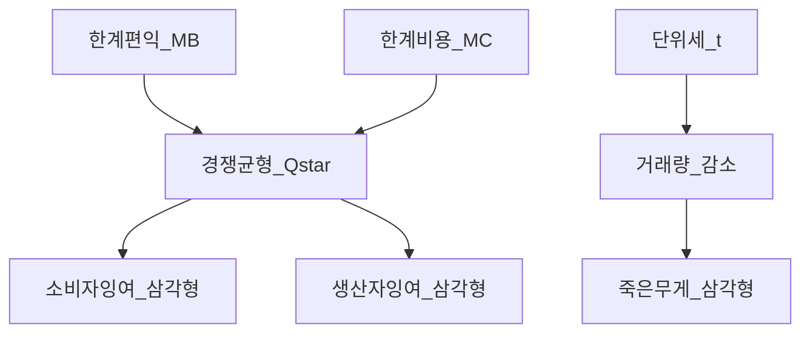
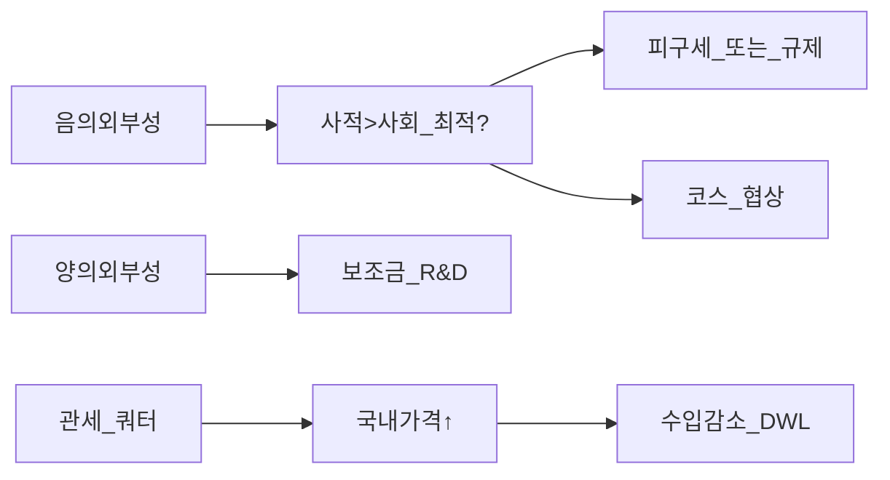
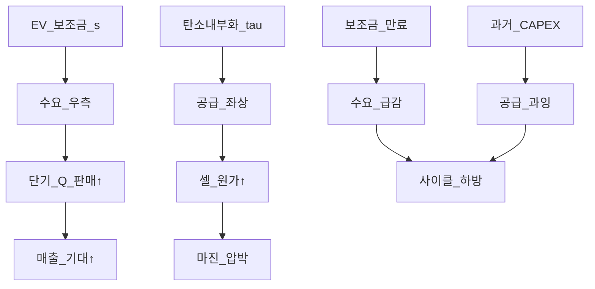

# 미시경제 04 — 후생경제·외부성·무역·정책

> **면책**: 본 문서는 교육 목적이며, 특정 개인·법인에 대한 투자·세무·법률 자문이 아닙니다. 제도·세율·상품 조건은 변경될 수 있으므로 실행 전 공식 출처를 확인하세요.

## 메타

| 항목 | 내용 |
|------|------|
| 최종 검증일 | 2026-05-24 |
| 정책·법령 기준일 | 2025-12-31 확정, 2026 개편은 본문 표기 |
| 난이도 | L4 (Graduate) — [READER-GUIDE](../docs/READER-GUIDE.md) |
| 예상 읽기 시간 | 150~180분 |
| 관련 bucket | Bucket 0~1 (경제 문법), Bucket 3~4 (정책·섹터 해석) |

## 0. 이 편 읽기 전 (5분)

| 항목 | 내용 |
|------|------|
| **난이도** | L4 (Graduate) — [READER-GUIDE §L등급](../docs/READER-GUIDE.md) |
| **선수** | [미시경제학 기초](microeconomics-basics.md), [micro-01-consumer-theory](micro-01-consumer-theory.md) |
| **이번 편에서 쓰는 기호** | 본문 §4·§4a 표 참고 |
| **복습 한 줄** | L3 선수 편을 먼저 읽으면 수식이 수월함 |

## TL;DR

1. **총잉여(Total Surplus)** 는 소비자·생산자 잉여의 합이며, 완전경쟁 균형에서 **편의론적 효율** 조건(한계편익=한계비용)과 연결된다.
2. **죽은무게손실(DWL)** 은 거래량이 효율 수준보다 줄거나 늘 때 잉여가 **삼각형**으로 사라지는 부분이며, 세금·관세·독점·외부성에서 동일한 기하학으로 읽는다.
3. **피구세(Pigouvian tax)** 는 한계외부비용에 맞춘 가격으로, **코스 정리**는 재산권·거래비용이 작을 때 민간 협상이 효율에 수렴할 수 있음을 말한다 — 둘 다 “정부 vs 시장” 이분법이 아니다.
4. **공공재**는 비배제·비경합성 때문에 시장이 과소공급하고, **관세·쿼터**는 국내 가격↑·수입↓·DWL을 남긴다.
5. **EV 보조금**과 **탄소 외부성**은 “수요 이동”과 “한계사회비용 내부화”로 분리해 분석해야 — TAM 성장만으로 매수 판단을 대체할 수 없다.

## 1. 한 줄 정의 + 왜 중요한가

**정의**: **후생경제(Welfare Economics)** 는 자원 배분이 **사회적으로 얼마나 효율적인지**, 정책(세·보조금·규제·무역장벽)이 **누구의 잉여를 옮기고 총량을 줄이는지**를 분석하는 미시경제의 정책 응용 분야이다.

**왜 중요한가** (장기 자산 형성·bucket 연결):

개별 기업의 **매출·마진**은 시장 균형의 결과이지만, 그 균형이 **정책 충격**에 의해 이동하면 주가 기대가 바뀐다. 전기차 **구매 보조금**, 반도체 **국가 보조**, **탄소국경조정**, **리튬 관세** 논의는 모두 “곡선 이동 + 잉여 재분배 + DWL”로 읽을 수 있다. [microeconomics-basics](microeconomics-basics.md)에서 배운 수요·공급을 **정량적 후생**으로 올리면, [배터리·ESS](../03-markets/sectors/battery-lfp-ncm-ess.md)나 [반도체](../03-markets/sectors/semiconductor.md) 섹터 리포트의 “정책 수혜” 문장을 **검증 가능한 질문**으로 바꿀 수 있다: 보조금이 **거래량만** 늘리는가, **죽은무게**를 키우는가, 만료 후 **역풍**이 있는가.

## 2. 선수 지식 / 이후 읽을 것

**선수**:
- [미시경제학 기초](microeconomics-basics.md) — 수요·공급·탄력성
- [micro-01-consumer-theory](micro-01-consumer-theory.md) — 한계효용·소비자 선택 (예정 시 basics로 대체)
- [micro-02-production-cost-supply](micro-02-production-cost-supply.md) — 한계비용·공급 (예정 시 basics로 대체)
- [micro-03-market-structures-io](micro-03-market-structures-io.md) — 독점·과점 (예정 시 basics로 대체)
- [복리와 시간가치](../01-foundations/compound-interest-and-time-value.md)

**이후**:
- [micro-05-sector-applications](micro-05-sector-applications.md) — 배터리·반도체·전력망·Physical AI
- [macro-01-gdp-accounts-growth](macro-01-gdp-accounts-growth.md) — GDP·성장과 정책 규모
- [macro-02-money-inflation](macro-02-money-inflation.md) — 보조금 재원·인플레
- [섹터 투자 프레임워크](../03-markets/sectors/sector-investing-framework.md)
- [거시경제학 기초](macroeconomics-basics.md)

## 3. 직관·비유

**경매 낙찰가와 “기쁨의 면적”**: 소비자는 최대 지불의사(예약가격)가 있고, 실제 지불가격이 더 낮으면 **싸게 샀다**는 이득(소비자 잉여)이 생긴다. 생산자는 한계비용보다 높은 가격에 팔면 **비용 이상**을 번다(생산자 잉여). 완전경쟁에서 거래가 늘수록 이 **면적**이 커지다가, 한계단위에서 **추가 이득 = 0**인 지점이 효율 균형이다. 적분은 “무한히 얇은 거래 조각의 이득을 더한다”는 뜻일 뿐, 일상 직관은 **삼각형·사다리꼴 넓이**로 충분하다.

**교통 체증과 외부성**: 내가 도로를 쓰면 다른 사람의 통행시간이 늘어난다 — 내 연료비·통행료에 **남의 손실**이 안 들어가면 **과다 이용**한다. 탄소 배출도 같다: 전기 생산·배터리 제조의 일부 비용이 **기후·건강**으로 밖으로 새면, 시장 가격만 보면 **너무 많이** 생산·소비한다.

**아파트 공용 복도 조명**: 혜택을 받아도 **문을 잠그기 어렵고**, 내가 켜도 네 밝기가 줄지 않는다(비경합). 그래서 “누가 돈 내나” 문제가 생기고, 시장만으로는 **부족**하기 쉽다 — **공공재**의 출발점이다.

**EV 보조금은 “쿠폰”**: 소비자에게 보이는 가격을 낮춰 **수요곡선을 오른쪽으로** 밀지만, 재원은 **세금·국채**에서 나온다. 쿠폰이 커질수록 **정부·납세자 잉여**는 줄고, 비효율적 소비(한계편익 < 한계사회비용)가 늘면 **DWL**이 생긴다. “판매 대수↑ = 주가↑”가 항상 성립하지 않는 이유 중 하나다.

**적분 vs 삼각형**: 연속 수요 \(P(Q)\)에서 \(CS = \int_0^{Q^*} [P(Q)-P^*]\,dQ\). 선형이면 \(\frac{1}{2}(P_{max}-P^*)Q^*\). **마르지널 단위**가 무한히 쪼개지면 “조금 더 사도 이득”이 **0**에 수렴하는 지점이 \(Q^*\) — 미적분은 그 **극한** 표기일 뿐, IR·뉴스 해석에는 **면적·삼각형**이 실무에 가깝다.

**피구 vs 코스 — 같은 그림, 다른 전제**: 피구는 “정부가 **MEC를 안다**”는 가격 규율; 코스는 “당사자가 **협상으로 MEC를 내부화**한다”는 계약. 한국 **수천 공장·전력망**에서는 정보·집행 비용이 커 **둘 다 부분적으로만** 작동 — 실무는 **ETS + 보조금 + 산업 정책** 혼합.

---

**이 모형이 말하는 것**: 수식은 계산 절차이고, 경제 직관은 「누가 이득·손해를 보는가」「어떤 가정이 깨지면 결론이 뒤집히는가」다. 유도 각 단계마다 **가정**을 한 줄로 적어 본다.
## 4. 정식 개념·용어

| 용어 | 한글 | English | 정의 |
|------|------|------|----------------|
| 소비자 잉여 | CS | Consumer surplus | 지불의사−실제 지불의 **총 이득** |
| 생산자 잉여 | PS | Producer surplus | 실제 수취−한계비용의 **총 이득** |
| 총잉여 | TS | Total surplus | CS+PS (교육용, 외부성 전 제외) |
| 편의 | 편의 | Welfare | 잉여·효용 등 사회 후생 지표(문맥별) |
| Pareto 효율 | 파레토 효율 | Pareto efficiency | 누군가 손해 없이 누군가 이득 불가 |
| DWL | 죽은무게손실 | Deadweight loss | 효율 대비 잃은 총잉여 |
| 외부성 | 외부성 | Externality | 시장 거래 밖 비용·편익 |
| MSC | 한계사회비용 | Marginal social cost | MC+한계외부비용 |
| MSB | 한계사회편익 | Marginal social benefit | MB+한계외부편익 |
| 피구세 | 피구세 | Pigouvian tax | 외부비용 내부화 세 |
| 코스 | 코스 | Coase | 재산권·협상으로 외부성 해결 가능성 |
| 공공재 | 공공재 | Public good | 비배제·비경합(순수) |
| 관세 | 관세 | Tariff | 수입품에 부과하는 세 |
| 쿼터 | 쿼터 | Quota | 수입·생산 **수량 상한** |
| TRQ | 관세할당량 | Tariff-rate quota | 일정량까지 낮은 관세 |

### 4a. 핵심 용어 (본문 등장 순)

> 복습용. 정의는 §4 본표·[glossary](../00-roadmap/glossary.md)·본문 `!!! info` 박스.

| 용어 | 한 줄 | 관련 이론 | glossary |
|------|------|------|----------------|
| 소비자 잉여 | 지불의사−실제 지불의 **총 이득** | §4 | [glossary](../00-roadmap/glossary.md#소비자-잉여) |
| 생산자 잉여 | 실제 수취−한계비용의 **총 이득** | §4 | [glossary](../00-roadmap/glossary.md#생산자-잉여) |
| 총잉여 | CS+PS | §4 | [glossary](../00-roadmap/glossary.md#총잉여) |
| 편의 | 잉여·효용 등 사회 후생 지표 | §4 | [glossary](../00-roadmap/glossary.md#편의) |
| Pareto 효율 | 누군가 손해 없이 누군가 이득 불가 | §4 | [glossary](../00-roadmap/glossary.md#pareto-효율) |
| DWL | 효율 대비 잃은 총잉여 | §4 | [glossary](../00-roadmap/glossary.md#dwl) |
| 외부성 | 시장 거래 밖 비용·편익 | §4 | [glossary](../00-roadmap/glossary.md#외부성) |
| MSC | MC+한계외부비용 | §4 | [glossary](../00-roadmap/glossary.md#msc) |
| MSB | MB+한계외부편익 | §4 | [glossary](../00-roadmap/glossary.md#msb) |
| 피구세 | 외부비용 내부화 세 | §4 | [glossary](../00-roadmap/glossary.md#피구세) |
| 코스 | 재산권·협상으로 외부성 해결 가능성 | §4 | [glossary](../00-roadmap/glossary.md#코스) |
| 공공재 | 비배제·비경합 | §4 | [glossary](../00-roadmap/glossary.md#공공재) |
| 관세 | 수입품에 부과하는 세 | §4 | [glossary](../00-roadmap/glossary.md#관세) |
| 쿼터 | 수입·생산 **수량 상한** | §4 | [glossary](../00-roadmap/glossary.md#쿼터) |
| TRQ | 일정량까지 낮은 관세 | §4 | [glossary](../00-roadmap/glossary.md#trq) |

## 5. 메커니즘

### 5.1 잉여에서 DWL까지

| 충격 | 거래량 vs Q* | CS | PS | 정부·기타 | TS |
|------|------|------|------|------|----------------|
| 경쟁 균형 | = Q* | 최대(해당 가정) | 최대 | — | 최대 |
| 단위세 | < Q* | ↓ | ↓ | 세수↑ | ↓ (DWL>0) |
| 독점 | < Q* | ↓ | ↑? | — | ↓ |
| 음의 외부성(규제 없음) | > Q* (사회 기준) | 과다 | 과다 | 외부 피해 | 사회 TS ↓ |
| 피구세(최적) | = Q* (이상) | 조정 | 조정 | 세수 | 사회 TS 최대화 |

### 5.2 독점·과점과 DWL (연계)

[micro-03-market-structures-io](micro-03-market-structures-io.md)에서 \(Q^m < Q^*\)이면 **가격↑·거래량↓**으로 CS↓, PS는 **모호**(독점 이익). **사회 TS**는 경쟁 대비 **DWL 삼각형**이 생긴다. **과점**에서는 **칼럼·가격리더십**에 따라 DWL 크기가 달라진다 — 반도체 **HBM oligopoly**는 **단기 PS↑** 가능하나 **진입·중국 공급**이 오면 **PS 급락**. 후생 프레임은 “독점 = 항상 악”이 아니라 **동태 진입·R&D**와 trade-off.

| 구조 | Q vs Q* | 가격 | DWL | 투자 메모 |
|------|------|------|------|----------------|
| 완전경쟁 | = | P* | 0 | 마진=MC 근처 |
| 독점 | < | >P* | >0 | 가격결정력 |
| 과점(칼럼) | < | >P* | >0 | 용량·재고 게임 |
| 규제 가격통제 | < 또는 > | ≠P* | >0 | 전력 요금 |

### 5.3 외부성·정책·무역

**음의 외부성(탄소)**: 사적 한계비용 MC < MSC → 시장 균형 수량 **Q_market > Q_social** → DWL 삼각형(사회 기준). **피구세 τ = MEC**(한계외부비용)이면 이론상 Q_social 복원.

**양의 외부성(R&D·백신)**: MSB > MB → 과소공급 → **보조금** 또는 공공 투자.

**코스**: 재산권이 명확하고 **거래비용≈0**이면, 피해자가 권리를 가지든 가해자가 가지든 **효율적 결과**에 도달(재분배는 다름). 거래비용이 크면 **정부 개입** 여지↑.

**관세 vs 쿼터**: 관세는 **재정 수입**을 남기고, 쿼터는 **할당권·임대**가 누구에게 가느냐에 따라 **잉여가 수입국 정부가 아닌 수출국·중개**로 갈 수 있다(교육용).

## 6. 수식·모모델

### 6.1 선형 수요·공급에서 잉여 (적분 직관)

수요 \(P = a - bQ\), 공급 \(P = c + dQ\), \(a>c\).

경쟁 균형: \(Q^* = \frac{a-c}{b+d},\; P^* = a - bQ^*\).

**소비자 잉여** (역수요 아래, 가격 위):

| 기호 | 이름 | 이 식에서 의미 |
|------|------|----------------|
| **r** | 할인율·수익률 | 기간당 이자·요구수익률 |
| **n** | 기간 | 연·월 등 복리·할인에 쓰는 횟수 |
| **PV** | 현재가치 | 오늘 시점으로 환산한 금액 |
| **FV** | 미래가치 | 미래 시점의 목표·결과 금액 |

\[
CS = \int_0^{Q^*} \bigl(a - bQ - P^*\bigr)\,dQ = \frac{1}{2}(a - P^*)Q^*
\]

**식 (기호)**: **CS** = _0^Q^* (**a** - **bQ** - P^*) **dQ** = (1) / (2)(**a** - P^*)Q^*

**식 (기호)**: **CS** = _0^Q^* (**a** - **bQ** - P^*) **dQ** = (1) / (2)(**a** - P^*)Q^*

**읽는 법**: **CS**와 **int**의 관계를 위 식으로 쓴다. 경제·재무 해석은 변수표 「이 식에서 의미」와 [DEPTH-STANDARD](../docs/DEPTH-STANDARD.md) 기호 예제를 맞춘다.
**유도 (L4)**:
1. **정의**: **CS**, **int**, **Q**를 동일 시점·동일 통화로 맞춘다. — 단위 불일치면 식이 무의미해진다.
2. **식 변형**: 양변을 정리해 목표 변수를 한쪽에 둔다. — 할인·복리는 **시점 이동**이 핵심이다.

**생산자 잉여** (가격 아래, 공급 위):

| 기호 | 이름 | 이 식에서 의미 |
|------|------|----------------|
| **r** | 할인율·수익률 | 기간당 이자·요구수익률 |
| **n** | 기간 | 연·월 등 복리·할인에 쓰는 횟수 |
| **PV** | 현재가치 | 오늘 시점으로 환산한 금액 |
| **FV** | 미래가치 | 미래 시점의 목표·결과 금액 |

\[
PS = \int_0^{Q^*} \bigl(P^* - c - dQ\bigr)\,dQ = \frac{1}{2}(P^* - c)Q^*
\]

**식 (기호)**: **PS** = _0^Q^* (P^* - **c** - **dQ**) **dQ** = (1) / (2)(P^* - **c**)Q^*

**식 (기호)**: **PS** = _0^Q^* (P^* - **c** - **dQ**) **dQ** = (1) / (2)(P^* - **c**)Q^*

**읽는 법**: **int_0**와 **Q**의 관계를 위 식으로 쓴다. 경제·재무 해석은 변수표 「이 식에서 의미」와 [DEPTH-STANDARD](../docs/DEPTH-STANDARD.md) 기호 예제를 맞춘다.
**유도 (L4)**:
1. **정의**: **int_0**, **Q**, **P**를 동일 시점·동일 통화로 맞춘다. — 단위 불일치면 식이 무의미해진다.
2. **식 변형**: 양변을 정리해 목표 변수를 한쪽에 둔다. — 할인·복리는 **시점 이동**이 핵심이다.
**총잉여** \(TS = CS + PS\). 이는 **편의론적 효율** 논의에서 “사회 총 이득”의 기하학적 표현이다(외부성·분배 공정성은 별도).

### 6.2 단위세와 DWL

소비자가격 \(P_d = P^* + t\), 생산자 수취 \(P_s = P^* - 0\) (귀착은 중립 예시), 새 거래량 \(Q_t < Q^*\).

세수\(T = t \cdot Q_t\). **DWL** (교육용 삼각형):
| **n** | 기간 | 연·월 등 복리·할인에 쓰는 횟수 |
|------|------|----------------|
| **PV** | 현재가치 | 오늘 시점으로 환산한 금액 |
| **FV** | 미래가치 | 미래 시점의 목표·결과 금액 |

\[
DWL \approx \frac{1}{2} t (Q^* - Q_t)
\]

**식 (기호)**: **DWL** ≈ (1) / (2) **t** (Q^* - **Q_t**)

**식 (기호)**: **DWL** ≈ (1) / (2) **t** (Q^* - **Q_t**)

**읽는 법**: **Q_t**와 **Q**의 관계를 위 식으로 쓴다. 경제·재무 해석은 변수표 「이 식에서 의미」와 [DEPTH-STANDARD](../docs/DEPTH-STANDARD.md) 기호 예제를 맞춘다.
**유도 (L4)**:
1. **정의**: **Q_t**, **Q**를 동일 시점·동일 통화로 맞춘다. — 단위 불일치면 식이 무의미해진다.
2. **식 변형**: 양변을 정리해 목표 변수를 한쪽에 둔다. — 할인·복리는 **시점 이동**이 핵심이다.

탄력성이 클수록 \(Q_t\) 감소가 커서 **같은 세율도 DWL이 커진다** — “세금이 무거운 품목” 설계의 직관.

### 6.3 외부성과 사회 최적

한계외부비용 \(MEC(Q)\), \(MSC = MC + MEC\). 사회 최적 \(Q^{soc}\): \(MB(Q^{soc}) = MSC(Q^{soc})\).

시장은 \(MB = MC\) → \(Q^{mkt}\). \(MEC>0\)이면 보통 \(Q^{mkt} > Q^{soc}\).

**피구세**: \(t^* = MEC(Q^{soc})\)이면 생산자가 보는 한계비용이 MSC가 되어 \(Q^{mkt}\)를 \(Q^{soc}\)로 끌어당긴다(완전 정보·동질 가정).

### 6.4 코스 정리 (문장·조건)

재산권 배분 + 제로 거래비용 → **효율적 외부성 수준** 달성. **재분배 효과**: 권리가 피해자에게 있으면 가해자가 **지불** 협상, 반대면 **보상** 협상 — **Q는 같고 잉여 분배만 다름**(이상 모형).

### 6.5 공공재와 Samuelson 조건 (개념)

순수 공공재 \(G\): \(U_i(x_i, G)\). **Samuelson 조건**: \(\sum_i MB_i(G) = MC(G)\). 개인별 \(MB\)를 시장 가격으로 드러내기 어려워 **과소공급**.

### 6.6 소규모 개방경제 관세 (교육용)

세계가격 \(P_w\). 관세 \(t\) → 국내가격 \(P_d = P_w + t\). 수입 \(M = D(P_d) - S(P_d)\). 관세↑ → \(P_d\)↑, \(M\)↓, **소비자 잉여↓**, **생산자 잉여↑**, **정부 세수↑**, **DWL** 두 삼각형(소비·생산 왜곡).

### 6.7 비교정태학 — 파라미터 1% 변화 (교육용)

| 파라미터 | 경쟁 P*, Q* | 단위세 DWL | 음의 외부성 Q^m vs Q^soc | 피구세 t* |
|------|------|------|------|----------------|
| 수요 절편 a↑ | ↑ | ↑ | Q^m↑ (과다↑) | t* 변동 |
| 공급 절편 c↓ | ↓ | ↓ | Q^m↑ | t* 변동 |
| MEC↑ | — | — | 격차↑ | t*↑ |
| 탄력성 \|ε\|↑ | 변동 | **DWL↑** (같은 t) | 규제 민감↑ | — |

**IR·공시 연결 질문**: (1) 보조금·세액이 **수요·공급 중 어느 곡선**을 움직였는가? (2) **만기·예산**이 있어 곡선이 **되돌아가는**가? (3) 경쟁사 **가격 인하**가 보조금 효과를 **상쇄**하는가?

### 6.8 공공재·준공공재·공유자원 (확장)

| 유형 | 비배제 | 비경합 | 시장 실패 | 정책 예 |
|------|------|------|------|----------------|
| 순수 공공재 | 예 | 예 | 과소공급 | 국방, 기초과학 |
| 준공공재 | 부분 | 부분 | 혼합 | 교육·도로 |
| 공유자원(commons) | 어려움 | 경합 | 과다 이용 | 어장·대기 |
| 사적재 | 아니오 | 아니오 | 상대적 효율 | EV, 메모리 |

**클럽재(club good)**: 배타적이나 한계비용≈0 — **반도체 IP 라이선스·표준**은 클럽에 가깝고, **셀 자체**는 사적재. 정책이 “R&D 보조”와 “생산 보조”를 구분하는 이유다.

### 6.9 무역정책 잉여 분해 (교육용 표)

소규모 개방경제, 관세 \(t\), 세계가격 \(P_w\) 고정:

| 구성요소 | 방향(관세 도입) | 누가 이득/손해 |
|------|------|----------------|
| 소비자 잉여 | ↓ | 국내 소비자·다운스트림 |
| 생산자 잉여 | ↑ | 수입대체 국내업 |
| 정부 세수 | ↑ (관세) | 재정 — 쿼터는 별도 |
| DWL | ↑ (손실) | 사회 총잉여 |
| 무역조건 | 소국: 변화 없음 | 대국: 추가 효과 |

**투자**: “국산화·리쇼어링”이 **생산자 PS**만 올리고 **소비자·수출** 비용을 키우면, 섹터 ETF 내 **수혜·피해 종목**이 갈린다 — [sector-investing-framework](../03-markets/sectors/sector-investing-framework.md) 3단계 경쟁 분석.

### 6.10 EV 보조금·탄소 — 통합 프레임 (가상 숫자 흐름)

1. **보조금 s** → 체감가격 \(P_c = P - s\) → 단기 \(Q\uparrow\).  
2. **MSC**에 **전력 탄소·리사이클 비용** 포함 시 일부 구간 \(MB < MSC\) → **DWL**.  
3. **피구형 탄소가격 τ** → 전기·소재 비용↑ → **공급곡선 좌상** + **수요 정책**과 중복 시 **과잉 조정** 위험.  
4. **만료** → 수요 복귀 + 이미 늘어난 **공급(공장)** → 가격·마진 **이중 압박** ([battery-lfp-ncm-ess](../03-markets/sectors/battery-lfp-ncm-ess.md) 사이클).

---

battery-lfp-ncm-ess](../03-markets/sectors/battery-lfp-ncm-ess.md) 사이클).

## 7. 한국 적용

### 7.1 2025년 기준 (확정·제도 맥락)

| 영역 | 한국 맥락 | 후생·투자 질문 |
|------|------|----------------|
| EV 보조금 | 완성차·전기버스 구매 보조, 지방 보조 중복 | 보조금 만료·예산 시 **수요 급감**? DWL vs 기술 학습효과 |
| RE100·탄소 | 배출권·Scope 3 압력, CBAM 대응 | **MSC** 내부화 → 전력·철강 **비용곡선** 상승 |
| 반도체·배터리 | K-배터리·반도체 특별법, 세액·R&D | **양의 외부성** 보조 vs **과잉 CAPEX** DWL |
| 전력 요금 | 산업용·주택 누진, 송배전 독점 | **자연독점** + 환경외부성 **이중 규제** |
| 무역 | 수출 의존, 관세·FTA | **수입 중간재** 관세가 **수출 경쟁력** 역습 |

**한국 수출 구조**: 반도체·자동차·배터리·조선·석화가 GDP·고용에 크게 기여([macro-01](macro-01-gdp-accounts-growth.md) 연계). **관세가 미국·EU에만** 걸리고 한국은 **중간재 수출국**이면, 2차 효과로 **국내 부품사 수요**가 변한다 — “관세 = 호재” 단순화 금지.

### 7.2 2026년 개편·시행 예정 (해당 시)

| 항목 | 2025 | 2026 (시행 여부 명시) |
|------|------|----------------|
| EV 보조금 | 차종·예산 한도 운영 | **예산·차종 조정** 가능 — 공시·입법안 추적 |
| 탄소·배출권 | K-ETS 단계 | 할당·범위 **강화** 논의 시 **MSC↑** 시나리오 |
| 전력망·신재생 | RE100·ESS 연계 | **피크·송전** 투자 — [power-grid](../03-markets/sectors/power-grid-electrification.md) |

**법·정책 근거**: 「온실가스 배출권의 할당 및 거래에 관한 법률」, 「전기사업법」, 「자동차관리법」 시행령(보조), 관세법 — 실행 전 [law.go.kr](https://www.law.go.kr) 확인.

### 7.3 산업별 외부성·정책 매핑 (학습용)

| 산업 | 외부성 유형 | 주요 정책 레버 | 후생·주가 질문 |
|------|------|------|----------------|
| 2차전지 | 탄소·폐배터리(음), R&D(양) | EV 보조, 배출권, 재활용 의무 | 보조금 **순편익 vs DWL** |
| 반도체 | 전력·용수(음), 기술 spillover(양) | 세액, 수출 통제 | **과잉 보조 → CAPEX DWL** |
| 전력망 | 안정·탄소(혼합) | 요금·투자 규제 | **자연독점 + 환경** |
| 석유화학 | 탄소(음) | ETS, CBAM | **MSC↑ → 마진** |
| 완성차 | 혼잡·보조(혼합) | EV 보조·규제 | **만료·중국 가격** |

### 7.4 투자자용 “정책 공시” 체크리스트 (8항)

1. 보조금·세액이 **수요·공급** 중 어디를 움직이는가?  
2. **예산·만기·이력제**가 있는가?  
3. **국내·해외** 동시 적용인가(수출 기업 역효과)?  
4. **MEC·MSC** 추정이 바뀌는 규제(ETS, CBAM)인가?  
5. **생산자 잉여**만 올리고 **소비자·수출**은 손해인가(관세형)?  
6. 경쟁사 **가격·공급**이 정책 효과를 **상쇄**하는가?  
7. **2~3년 후 공급**이 늘어 **DWL·가격 하락**이 오는가?  
8. [micro-05](micro-05-sector-applications.md) **사이클 지표**(재고·가동률)와 일치하는가?

## 8. 숫자 예제 (가상)

> 모든 인물·금액·기업명은 가상입니다.

### 예제 1 — 선형 시장에서 CS, PS, 단위세 DWL

가상 시장: \(P = 100 - Q\) (수요), \(P = 20 + Q\) (공급), 단위는 만 원·만 대.

- \(Q^* = 40,\; P^* = 60\)
- \(CS = \frac{1}{2}(100-60)\times 40 = 800\)
- \(PS = \frac{1}{2}(60-20)\times 40 = 800\)
- \(TS = 1600\)

단위세 \(t=20\) → \(Q_t=30,\; P_d=70,\; P_s=50\) (귀착 예시).

- 세수 \(= 20\times 30 = 600\)
- \(DWL = \frac{1}{2}\times 20\times 10 = 100\)

**해석**: 세금 600 중 **100**은 “거래가 사라져서” 잃은 총잉여. 정책 논쟁에서 **세수 vs DWL** trade-off.

### 예제 2 — 탄소 외부성과 피구세

가상 배터리 셀: 사적 \(MC=50+0.5Q\), \(MB=120-0.5Q\), \(MEC=30\) (만 원/만 kWh 단위).

- 시장: \(120-0.5Q = 50+0.5Q \Rightarrow Q^m=70\)
- 사회: \(120-0.5Q = 80+0.5Q \Rightarrow Q^{soc}=40\)
- **과다 생산** 30단위. 피구세 \(t^*=30\)이면 생산자가 보는 MC가 MSC와 일치(선형 예).

**투자**: 탄소 가격↑ → **고탄소 공정** 마진↓, **저탄소 전력·재활용** 수혜 — [battery-lfp-ncm-ess](../03-markets/sectors/battery-lfp-ncm-ess.md)의 **Scope 2·3** 질문.

### 예제 3 — EV 보조금의 DWL (가상)

보조금으로 소비자 체감가격이 20% 하락, 수요탄력성 \(|\varepsilon|=1.2\), 판매 **M** 대→**M** 대. 한계사회비용(혼잡·전력 피크·재활용 미반영) 때문에 **마지막 **M** 대**는 \(MB < MSC\).

가상 DWL 삼각형: 보조금 단위 **M** (만 원 단위, 교육용) × 비효율 수량 **M** 대 × \(\frac{1}{2}\) ≈ ****F**** 규모(교육용).

**해석**: **출하↑**는 [완성차·배터리] 매출에 긍정이나, 보조금 **축소·이력제 강화** 시 **수요 절벽** 리스크. PER은 “정상화된 수요”로 재평가.

### 예제 4 — 관세 vs 쿼터 (가상 수입 중간재)

국내 수요 \(Q=100-P\), 국내 공급 \(Q=P-20\), 세계가격 \(P_w=40\).

- 무관세: 수입량 60, \(P=40\)
- 관세 \(t=10\): \(P_d=50\), 수입 40, DWL 합산 가상 50단위
- **쿼터** 35: 가격은 **40~50 사이**에서 결정될 수 있고, 초과분 **할당 임대**가 누구에게 가는지가 PS 분배를 바꿈

**한국**: 반도체 **장비·소재** 수입 의존 — 미·중 관세가 **국내 파운드리 CAPEX**에 미치는 경로는 [semiconductor](../03-markets/sectors/semiconductor.md).

## 9. FAQ

**Q1. 소비자 잉여를 “돈으로 환산”해도 되나요?**  
**A1.** 교육·정책 비교에서는 **지불의사−가격**의 면적을 쓰지만, 실제 복지와 1:1은 아니다(소득·분배·측정 오류). **순위·방향** 비교에 강하고, 절대 원화 “행복 총액”으로 해석하면 안 된다.

**Q2. DWL은 항상 작은 삼각형인가요?**  
**A2.** 단위세·작은 왜곡에서는 **2차로 작은** 삼각형이 맞다. 그러나 **완전 금지·큰 쿼터·극단적 가격 통제**는 거래량이 크게 줄어 DWL이 **매우 클** 수 있다. 탄력성이 크은 시장(대체재 많음)일수록 같은 정책의 DWL↑.

**Q3. 피구세와 ETS(배출권)의 차이는?**  
**A3.** 이상적 피구세는 **알고 있는 MEC**에 맞춘 가격. ETS는 **수량 상한**으로 가격이 **시장에서 결정**. 불확실성이 **비용**에 있으면 가격형(세), **수량**에 있으면 할당형(쿼터)이 유리하다는 **Weitzman** 직관.

**Q4. 코스 정리가 “정부 개입 불필요”를 뜻하나요?**  
**A4.** 아니다. **많은 당사자·측정 어려움·소송 비용·전력망 독점**에서는 거래비용이 커서 협상 실패. 코스는 **언제 민간 계약이 작동할지** 조건을 주고, **탄소·전력**은 종종 규제·세가 병행된다.

**Q5. EV 보조금은 DWL만 있나요?**  
**A5.** **학습-by-doing**, 네트워크(충전), 기술 외부성이 있으면 **MSB > MB**일 수 있어 보조금이 **정당화**될 여지가 있다. 투자에서는 **순 DWL vs 순 편익**을 분리하고, **만료·예산·중국 가격 경쟁** 시나리오를 본다.

**Q6. 관세가 국내 기업에 무조건 이득인가요?**  
**A6.** **생산자 잉여**는 올라갈 수 있으나, **소비자·다운스트림(수출기업)** 비용↑, **보복 관세**로 수출 DWL. 한국은 **수출·수입 모두 큰** 개방경제 — [macro-05](macro-05-open-economy-fx.md) 예정.

**Q7. 공공재와 “정부 지원 산업”의 관계는?**  
**A7.** R&D·국방·기초과학은 **공공재 성격**이 강해 **과소투자** 시장 실패. 반면 **셀·메모리**는 사적 재화에 가까워 **과잉 보조**는 DWL·과잉 CAPEX를 낳는다 — [micro-05](micro-05-sector-applications.md).

**Q8. 후생경제가 주가 예측에 쓰이나요?**  
**A8.** 단기 타이밍 도구가 아니라 **정책 시나리오·마진 구조·경쟁 균형** 질문을 정제한다. “보조금 수혜” 공시 → **수요 이동 vs 공급 과잉 vs DWL** 중 무엇인지 분류하는 **체크리스트**로 쓴다.

## 10. 함정·리스크·한계

### 10.1 이론·측정 함정

- **편의 = CS+PS만**이면 **분배 공정성**이 빠진다 — 로빈스·라우즈 등 **사회후생함수** 논쟁 별도.
- **지불의사**는 소득에 따라 달라 — 동일 DWL도 **누구**에게 크게 가느냐가 다름.
- **2차 시장·일반균형**: 한 부문 세금이 **노동·자본** 가격을 바꿔 부분균형 DWL과 **괴리**.
- **정치경제**: 실제 관세·보조는 **로비·선거**에 의해 **최적에서 벗어남** — “왜 존재하는가”를 **후생만**으로 설명 못 함.

### 10.2 투자·학습 함정

- **TAM·보조금**만 보고 **탄력성·공급 과잉** 무시 → [micro-05](micro-05-sector-applications.md) 사이클 절 무시.
- **단기 출하↑**를 **구조적 마진↑**로 착각 — 보조금·채널 **재고** 확인.
- **탄소 규제**를 “모두 악재”로 단순화 — **저탄소 전력·재활용**은 **상대적 수혜**.
- **코스** 과신으로 “규제 불필요” 주장 — **전력·대기**는 거래비용 거대.

### 10.3 본 문서 한계

- 가격·수량 **선형·완전경쟁** 위주 — [micro-03](micro-03-market-structures-io.md) 독점·과점과 결합 필요.
- **동태·학습**은 성장 모형([macro-01](macro-01-gdp-accounts-growth.md))과 병행.
- 모든 수치는 **가상** — 실제 정책은 법령·예산안·공시로 검증.

- **편의 = CS+PS만** (반복 강조) — 분배 민감 정책은 **별도 윤리·정치** 논의.
- **외부성 크기 추정** 오류 → 피구세 **과소·과다** — 정치경제에서 실제 세율은 **최적와 괴리**.
- **보조금·관세**는 **재정·인플레**([macro-02](macro-02-money-inflation.md))와 연결 — 미시만으로 끝내지 말 것.
- **일반균형·무역**에서 **부분균형 DWL**은 **1차 근사** — 큰 충격은 보완효과.
- **투자**: “정책 수혜 = 매수” **내러티브 함정** — [sector-investing-framework](../03-markets/sectors/sector-investing-framework.md) 5단계와 병행.

---

**Q. 실무에서는?**  
교과서 식·기호를 그대로 적용하기 전에 **수수료·세금·데이터 시점**을 분리한다. 숫자는 [DEPTH-STANDARD](../docs/DEPTH-STANDARD.md)처럼 기호만 먼저 맞추고, 법령·시장 수치는 §8 표·외부 출처로 갱신한다.

## 11. 심화 읽기

- [공식 출처·데이터](../references/sources.md)
- 교재: Varian *Intermediate Microeconomics* (후생·외부성); Pindyck & Rubinfeld (환경·정책); Mankiw (무역·관세)
- 논문·보고: Pigou (1920); Coase (1960); Weitzman (1974) — 가격 vs 수량 규제
- 연계: [거시 기초](macroeconomics-basics.md), [전력망](../03-markets/sectors/power-grid-electrification.md), [배터리](../03-markets/sectors/battery-lfp-ncm-ess.md)

## 연습문제 (L4, 기호)

1. 위 §6 주요 식에서 변수 하나를 미지로 두고, 나머지를 기호로 둔 **관계식**을 쓰시오.
2. 가정이 깨질 때(유동성·세금·다중 IRR 등) 위 식의 **한계**를 기호·부등식으로 서술하시오.
3. §8 예제와 동일 기호(M·P·PV 등)로 **부호·단조성**만 검증하는 짧은 논증을 하시오.

### 해설 키

1. 직전 변수표의 「이 식에서 의미」를 이용해 동일 차원으로 정리한다.
2. 「가정이 깨지면」 절의 한계 사례와 연결한다.
3. 숫자 대입 없이 **부호**·**단위** 일치만 확인한다.
## 12. 스스로 점검 퀴즈

1. \(P=80-2Q,\; P=10+Q\)에서 \(Q^*, CS, PS, TS\)를 구하시오.
2. 단위세 \(t=15\) 도입 시 \(Q_t\)와 DWL(선형)을 구하시오.
3. \(MEC=20\)일 때 피구세와 사회최적 수량을 그리시오.
4. EV 보조금이 **수요 이동**인지 **공급 이동**인지, 만료 시 곡선은?
5. 관세와 쿼터 중 **정부 수입**이 생기는 쪽은?
6. 코스 정리가 실패하는 **한국 산업** 사례 2개를 들으시오.
7. 탄소 **CBAM**이 국내 **철강·배터리** MSC에 미치는 경로를 서술하시오.
8. “DWL=100”이 **연간 억 원**일 때, 보조금 예산 600억과 비교해 정책을 평가하시오.

??? note "정답 힌트"

    1. \(Q^*=23.33,\; P=33.33\) (단위 일치 확인)  
    2. 새 교점에서 \(Q_t<Q^*\), \(DWL=\frac{1}{2}t\Delta Q\)  
    3. \(t=20\), \(Q^{soc}: MB=MC+20\)  
    4. 수요(체감가) 이동; 만료 시 수요 **좌측** 복귀  
    5. 관세(쿼터는 임대·할당에 따라 다름)  
    6. 전력 송배전, 대기업 다수 오염원 등  
    7. 수출 제품 **내재 탄소** → 원가↑ → 수요·마진  
    8. DWL은 **총잉여 손실**, 예산은 **이전** — 함께 보되 동일 개념 아님

### 부록 A — 잉여·DWL 그리기 연습 (손글씨)

1. 수요·공급 교차 → \(Q^*, P^*\) 표시.  
2. CS: 수요 곡선 아래, \(P^*\) 위. PS: \(P^*\) 아래, 공급 위.  
3. 단위세: \(P_d\), \(P_s\) 분리, \(Q_t\) 표시, **DWL 삼각형** 음영.  
4. \(MEC>0\): \(MSC\) 곡선을 공급 **위**에 그려 \(Q^{soc} < Q^m\).  
5. 관세: \(P_w\) 수평선, \(P_d=P_w+t\), 수입 구간 음영.

### 부록 B — [glossary](../docs/glossary.md) 연계 키워드

Consumer surplus, Producer surplus, Deadweight loss, Pigouvian tax, Coase theorem, Public good, Tariff, Quota, Externality, Pareto efficiency — 본문 용어표와 동기화.

### 부록 C — EV·탄소 정책 타임라인 (학습용, 가상)

| 시점 | 정책 | 미시 효과 | 섹터 |
|------|------|------|----------------|
| T0 | 보조금 도입 | D 우측, DWL? | 완성차·셀 |
| T1 | 보조금 확대 | Q↑, CAPEX 기대 | 장비·소재 |
| T2 | 탄소가 τ | MC↑, MSC 내부화 | 전력·철강·셀 |
| T3 | 보조금 축소 | D 좌측 + S 과잉 | **이중 하방** |
| T4 | 재활용 의무 | MC↑(신규) | 폐배터리 체인 |

**투자**: T3에서 **PER·출하** 동시 하락 가능 — [micro-05](micro-05-sector-applications.md) 사이클 표와 대조.

### 부록 D — 무역정책 수치 연습 (가상, 확장)

세계가격 \(P_w=100\), 국내 \(D=200-P\), \(S=P-50\). 무관세 \(P=100\), \(Q_d=100\), \(Q_s=50\), **M=50**.

관세 \(t=20\) → \(P_d=120\), \(Q_d=80\), \(Q_s=70\), **M=10**. **소비자 잉여** 감소, **생산자** 증가, **세수** \(20	imes10=200\), **DWL** 두 삼각형 합 **(가상) 100+100**.

**쿼터 M=25**: \(P_d\) **120~100** **사이** **결정** — **할당** **임대** **누가** **가져가나**.

### 부록 E — 공공재 Samuelson 연습

2인, \(U_1=x_1+\ln G\), \(U_2=x_2+2\ln G\), \(MC(G)=1\). **Samuelson**: \(MB_1+MB_2=MC\) → \(
rac{1}{G}+
rac{2}{G}=1\) → **G=3** (교육용). **시장** **가격** **없음** → **과소** **공급**.

---

**L4 완료 기준**: [TEMPLATE](../docs/TEMPLATE.md) 12블록·예제 4개·mermaid 3개·FAQ 8쌍·검증일 2026-05-24 — [DEPTH-STANDARD](../docs/DEPTH-STANDARD.md). 다음: [micro-05-sector-applications](micro-05-sector-applications.md).