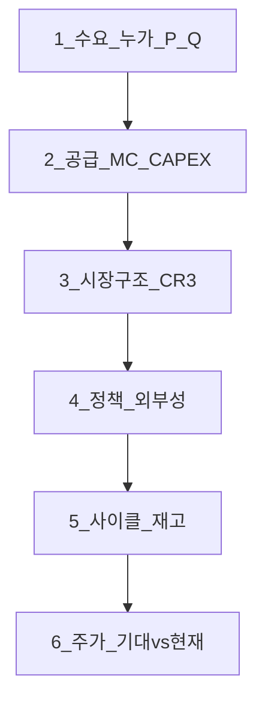
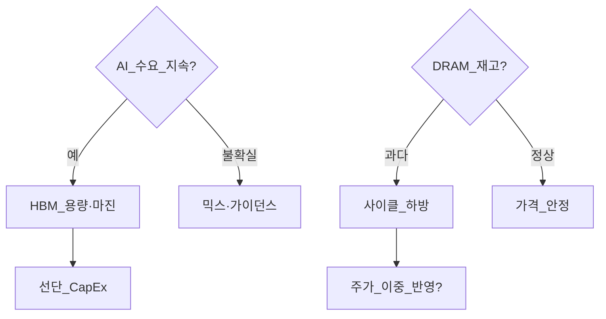

# 미시경제 05 — 섹터 응용: 배터리·반도체·전력·Physical AI

> **면책**: 본 문서는 교육 목적이며, 특정 개인·법인에 대한 투자·세무·법률 자문이 아닙니다. 제도·세율·상품 조건은 변경될 수 있으므로 실행 전 공식 출처를 확인하세요.

## 메타

| 항목 | 내용 |
|------|------|
| 최종 검증일 | 2026-05-24 |
| 정책·법령 기준일 | 2025-12-31 확정, 2026 개편은 본문 표기 |
| 난이도 | L4 (Graduate) — [READER-GUIDE](../docs/READER-GUIDE.md) |
| 예상 읽기 시간 | 160~200분 |
| 관련 bucket | Bucket 3 (섹터 ETF 코어), Bucket 4 (위성·개별) |

## 0. 이 편 읽기 전 (5분)

| 항목 | 내용 |
|------|------|
| **난이도** | L4 (Graduate) — [READER-GUIDE §L등급](../docs/READER-GUIDE.md) |
| **선수** | [microeconomics-basics](microeconomics-basics.md), [micro-04-welfare-externalities](micro-04-welfare-externalities.md) |
| **이번 편에서 쓰는 기호** | 본문 §4·§4a 표 참고 |
| **복습 한 줄** | L3 선수 편을 먼저 읽으면 수식이 수월함 |

## TL;DR

1. **미시경제는 섹터 리포트의 문법**이다 — 수요·공급·한계비용·과점·외부성·사이클을 [배터리](../03-markets/sectors/battery-lfp-ncm-ess.md)·[반도체](../03-markets/sectors/semiconductor.md)·[전력망](../03-markets/sectors/power-grid-electrification.md)·[Physical AI](../03-markets/sectors/physical-ai.md)에 **동일 템플릿**으로 대입한다.
2. **LFP vs NCM**은 대체재·차별화 시장 — TAM 성장만으로 **양쪽 동반 수혜**는 아니다; **가격·재고·CAPEX**가 사이클을 만든다.
3. **DRAM vs HBM**은 메모리 사이클과 **AI 구조적 수요**의 **겹침** — 마진·가동률·CapEx 질문이 다르다.
4. **송배전·유틸리티**는 **자연독점** + 규제 — ROE·요금·투자 승인이 **공급곡선**을 움직인다.
5. **Physical AI**는 **노동 대체·보완**의 한계비용·수요 탄력성 문제 — [sector-investing-framework](../03-markets/sectors/sector-investing-framework.md) 5단계 **엄격 적용** 후 Bucket 3/4 배치.

---

## 1. 한 줄 정의 + 왜 중요한가

**정의**: **섹터 미시경제 응용**은 소비자 이론·생산·비용·시장구조·후생([micro-04-welfare-externalities](micro-04-welfare-externalities.md))을 **특정 산업의 가격·마진·정책·사이클**에 맞춰 **합성(synthesize)** 하는 방법이다.

**왜 중요한가**:

!!! info "Bucket"
    시간·목적별 **자금 슬롯**(0 비상금 → 3 코어 등)

한국 투자자 포트폴리오는 **반도체·2차전지·전력 인프라·로봇/AI** 노출이 크다. 뉴스의 “TAM 2030 2배”는 **미시 검증** 없이는 [core-satellite](../04-portfolio/core-satellite-framework.md) **Bucket 4 상한**을 넘기는 **내러티브 매수**로 이어지기 쉽다. 본 장은 L4 미시 시리즈의 **종합**이며, [03-markets/sectors/](../03-markets/sectors/README.md) 심화 문서를 읽을 때 **공통 질문 리스트**를 제공한다.

---

## 2. 선수 지식 / 이후 읽을 것

**선수**:
- [microeconomics-basics](microeconomics-basics.md)
- [micro-04-welfare-externalities](micro-04-welfare-externalities.md)
- [sector-investing-framework](../03-markets/sectors/sector-investing-framework.md)
- [financial-statements-intro](../01-foundations/financial-statements-intro.md)

**이후**:
- [macro-01-gdp-accounts-growth](macro-01-gdp-accounts-growth.md) — 수출·성장
- [macro-02-money-inflation](macro-02-money-inflation.md) — 금리·CAPEX
- [stocks-equities-intro](../03-markets/stocks-equities-intro.md)
- 섹터 심화: [battery-lfp-ncm-ess](../03-markets/sectors/battery-lfp-ncm-ess.md), [semiconductor](../03-markets/sectors/semiconductor.md), [ai-infrastructure](../03-markets/sectors/ai-infrastructure.md), [power-grid-electrification](../03-markets/sectors/power-grid-electrification.md), [physical-ai](../03-markets/sectors/physical-ai.md), [recommended-deep-study-roadmap](../03-markets/sectors/recommended-deep-study-roadmap.md)

---

## 3. 직관·비유

**배터리 사이클 = 메모리 사이클의 cousin**: 고마진 → **CAPEX** → 2년 뒤 **공급 과잉** → 가격·마진 붕괴. “성장 산업”이어도 **주가 -50%** 가능. 미시 질문: **한계비용 곡선**이 아래로 이동 중인가, **균형 수량**만 늘어나 **가격**은 떨어지는가?

**HBM = 프리미엄석 유종**: 같은 “석유(메모리)” 시장이어도 **정제 프리미엄**이 붙은 **차별화** 구간. DRAM은 **원유 벤치**에 가깝게 **사이클**에 민감. **포트폴리오**에서 “반도체 ETF” 하나로 **둘 다** 커버되는지 **지수 구성**을 봐야 한다.

**전력망 = 아파트 단지 배관 독점**: 새 입주(데이터센터·EV)가 늘면 **관 넓히기(CAPEX)** 비용이 **전주민 요금**·**산업 요금**에 반영. **자연독점**이라 경쟁 가격이 없고 **규제가격**이 P* 역할.

**Physical AI = 식당 자동화**: 일부 업무 **한계비용↓**(로봇), 일부는 **대체 불가**(창의·책임). **노동 공급**이 줄면 **임금↑** 구간도 있어 **단순 “실업↑”** 모형은 부족.

---

**이 모형이 말하는 것**: 수식은 계산 절차이고, 경제 직관은 「누가 이득·손해를 보는가」「어떤 가정이 깨지면 결론이 뒤집히는가」다. 유도 각 단계마다 **가정**을 한 줄로 적어 본다.
## 4. 정식 개념·용어 (섹터 교차)

| 용어 | 섹터 | 미시 맥락 |
|    ------    | ------ | 위 식의 ------ |
| LFP/NCM | 배터리 | 차별화·대체, 수요 분할 |
| 셀 가격 $/kWh | 배터리 | P, 마진= P-MC |
| DRAM/HBM | 반도체 | 사이클 vs 구조적 겹침 |
| 가동률 | 반도체·배터리 | MC 곡선 위치 |
| CAPEX | 전부 | 공급 **미래** 이동 |
| CR3 | 과점 | 가격결정력 |
| ROIC | 투자 | P>MC 지속 가능? |
| 자연독점 | 전력 | P=규제, DWL from underinvest |
| 노동 대체 | Physical AI | MB, MC of labor vs robot |
| TAM | 리포트 | 수요 **상한** — P 미포함 |

### 4a. 핵심 용어 (본문 등장 순)

> 복습용. 정의는 §4 본표·[glossary](../00-roadmap/glossary.md)·본문 `!!! info` 박스.

| 용어 | 한 줄 | 관련 이론 | glossary |
|------|-------|-----------|----------|
| LFP/NCM | 차별화·대체, 수요 분할 | §4 | [glossary](../00-roadmap/glossary.md#lfp/ncm) |
| 셀 가격 $/kWh | P, 마진= P-MC | §4 | [glossary](../00-roadmap/glossary.md#셀-가격-$/kwh) |
| DRAM/HBM | 사이클 vs 구조적 겹침 | §4 | [glossary](../00-roadmap/glossary.md#dram/hbm) |
| 가동률 | MC 곡선 위치 | §4 | [glossary](../00-roadmap/glossary.md#가동률) |
| CAPEX | 공급 **미래** 이동 | §4 | [glossary](../00-roadmap/glossary.md#capex) |
| CR3 | 가격결정력 | §4 | [glossary](../00-roadmap/glossary.md#cr3) |
| ROIC | P>MC 지속 가능? | §4 | [glossary](../00-roadmap/glossary.md#roic) |
| 자연독점 | P=규제, DWL from underinvest | §4 | [glossary](../00-roadmap/glossary.md#자연독점) |
| 노동 대체 | MB, MC of labor vs robot | §4 | [glossary](../00-roadmap/glossary.md#노동-대체) |
| TAM | 수요 **상한** | §4 | [glossary](../00-roadmap/glossary.md#tam) |

---

## 5. 메커니즘 — 섹터 합성 프레임

### 5.1 공통 6단계 (미시 렌즈)

### 5.2 배터리 — LFP/NCM·ESS·사이클

**수요**: EV(가격·보조금·중국 경쟁), ESS(입찰·재생에너지·DC 백업) — **탄력성·대체** 다름 ([battery-lfp-ncm-ess](../03-markets/sectors/battery-lfp-ncm-ess.md)).

**공급**: 셀·양극재 **CAPEX** → 18~24개월 후 **Q↑**. 중국 **LFP** 확장은 **NCM** 일부 구간 **대체**.

**시장구조**: 상위 셀·소재 **과점** + 중국 **가격 리더**.

**정책**: EV 보조([micro-04](micro-04-welfare-externalities.md)), 탄소, **DWL·만료**.

**사이클 지표**: 셀 가격, **재고 주**, 가동률, **CapEx 가이던스**.

| 화학계 | 수요 강점 | MC·원료 | 사이클 민감도 |
|--------|-----------|---------|---------------|
| LFP | 저가 EV, ESS | 리튬·인산 | 중국 공급↑ |
| NCM | 프리미엄 EV | Ni, Co | 원료·안전 |

**투자 체크**: (1) **어느 곡선**이 움직였나 (2) **LFP가 NCM**을 잠식? (3) ESS는 **별도 수요**인가 (4) 보조금 **만료** (5) **ROIC>wacc** 지속?

### 5.3 반도체 — 메모리 vs HBM

**DRAM**: **상대적 표준화** → **사이클** — 가동률↑ → P↓.

**HBM**: **AI 가속** 바인딩, **용량·대역폭** 차별화 → **과점·장기계약** → 단기 **P↑·PS↑** 가능 ([semiconductor](../03-markets/sectors/semiconductor.md)).

| | DRAM | HBM |
|--|------|-----|
| 수요 | PC·모바일·서버 범용 | AI GPU 패키징 |
| 가격결정 | 사이클·재고 | 용량·기술·공급 제약 |
| CAPEX | 메모리 fab | 선단 패키징·TSV |
| 리스크 | 과잉 | **기술 전환·경쟁 진입** |

**미시 질문**: HBM **마진**이 DRAM **손실**을 상쇄하는 **믹스**인가? **파운드리 선단** CAPEX가 **2년 후** 범용 공급을 키우는가?

### 5.4 전력망 — 자연독점

**특징**: 중복 송전 **비효율** → **독점 허용** + **규제**. 가격은 **한계비용=가격**이 아니라 **공정원가·ROE** 승인.

**수요**: EV, **데이터센터**, 산업 전기화 → **피크**·**송전 제약**.

**공급**: 송배전 **투자 지연** = 공급곡선 **제약** → **요금·투자** 정책 ([power-grid-electrification](../03-markets/sectors/power-grid-electrification.md)).

**외부성**: 탄소·신뢰성 — **MSC** 반영이 **요금**에 들어감.

| 레버 | 효과 | 주가 민감 |
|    ------    | ------ | 위 식의 ------ |
| 송전 CAPEX 승인 | 공급↑(장기) | 전력기기·EPC |
| 요금 동결 | 투자↑ 지연 | 유틸 ROE |
| RE100·ESS | 수요·저장 | 2차전지 ESS |

### 5.5 Physical AI — 노동 대체·보완

**정의**: **엠보디드 AI·로봇**이 물리 작업의 **한계비용**을 바꿈 ([physical-ai](../03-markets/sectors/physical-ai.md)).

**수요**: 제조·물류·서비스 **인건비↑**·**숙련 노동 부족** → 로봇 **MB↑**.

**공급**: 센서·액추에이터·소프트웨어 — **학습곡선**으로 MC↓.

**대체 vs 보완**: 완전 대체 시 **노동 수요↓**; 보완 시 **생산성↑** → 산출↑ → **노동 수요↑** (역사적 패턴).

| 구간 | 미시 | 투자 |
|    ------    | ------ | 위 식의 ------ |
| 단기 | 설치·수주 | 장비·SI |
| 중기 | TCO < 임금 | 가동률 |
| 장기 | 규제·안전 | 표준·책임 |

**함정**: “로봇 TAM”만 보고 **교체 주기·통합 비용·책임** 무시.

### 5.6 섹터 투자 체크리스트 (엄격, 5단계 × 미시)

[sector-investing-framework](../03-markets/sectors/sector-investing-framework.md) 각 단계에 **미시 질문**을 강제:

| 단계 | 프레임 | 미시 필수 질문 |
|------|--------|----------------|
| 1 거시 수요 | TAM | P와 Q **분리** — TAM↑도 P↓ 가능 |
| 2 밸류체인 | 마진 위치 | 어느 단계 **MC** 최저/최고 |
| 3 경쟁 | CR3·진입 | **과점 임대** vs **가격전쟁** |
| 4 재무 | ROIC·재고 | 사이클 **고점/저점** |
| 5 한국 지도 | 코스피·닥 | **승강제**·유동성 |

**Bucket 규칙**: 코어(Bucket 3) = **분산 ETF**; 위성(Bucket 4) = **≤20%** — 미시가 “좋은 산업”을 확인해도 **집중 한도**는 별도.

---

## 6. 수식·모델

### 6.1 셀 가격·마진 (교육용)

| 기호 | 이름 | 이 식에서 의미 |
|    ------    | ------ | 위 식의 ------ |
| \(r\) | 할인율·수익률 | 기간당 이자·요구수익률 |
| \(n\) | 기간 | 연·월 등 복리·할인에 쓰는 횟수 |
| \(PV\) | 현재가치 | 오늘 시점으로 환산한 금액 |
| \(FV\) | 미래가치 | 미래 시점의 목표·결과 금액 |

\[
\pi = (P - MC) \cdot Q,\quad MC = f(\text{가동률}, \text{원료})
\]

**읽는 법**: **명목** 수익에서 **인플레**를 반영하면 **실질** 체감 수익을 본다. 정밀식은 본문 또는 §4 표를 따른다.
**유도 (L4)**:
1. **정의**: **pi**, **P**, **MC**를 동일 시점·동일 통화로 맞춘다. — 단위 불일치면 식이 무의미해진다.
2. **식 변형**: 양변을 정리해 목표 변수를 한쪽에 둔다. — 할인·복리는 **시점 이동**이 핵심이다.
3. **해석**: 부호·크기가 경제 직관과 맞는지 확인한다. — 극단값에서 단조성·한계를 점검한다.

가동률↑ → \(MC↓\) (고정비 분산). **사이클 하방**: \(P\) 하락 > \(MC\) 하락 → \(\pi↓\).

### 6.2 Cournot 과점 (2기업, 가상)

\(P = a - bQ\), \(C_i = c q_i\). 반응함수 → \(q_i^*\). **Q oligopoly < Q competitive** → **DWL** ([micro-04](micro-04-welfare-externalities.md)). HBM **소수 공급** 해석에 사용(단순화).

### 6.3 자연독점 평균비용

\(AC\)가 \(Q\)에서 U자 **최소** — **한 기업**이 전체 수요 시 **비용 최소**. 규제가격 \(P_r \approx AC + \text{allowed ROE}\).

### 6.4 노동·로봇 (교육용)

작업 \(L\)과 로봇 \(K\). 기업 비용 \(wL + rK\). **대체** 탄력 \(\sigma_{LK}\) 크면 임금↑ → **K↑**. **보완**이면 \(MP_L, MP_K\) 동반↑.

### 6.5 비교정태 — 정책 1줄

| 충격 | 배터리 | 반도체 | 전력 | Physical AI |
|------|--------|--------|------|-------------|
| EV 보조금↑ | D↑ | 간접 | D(피크)↑ | — |
| 중국 공급↑ | P↓ | 일부 장비 | — | 로봇 가격↓ |
| 금리↑ | Capex↓ | Capex↓ | 투자 지연 | 수주 지연 |
| 탄소↑ | MC↑ | MC↑ | MSC↑ | — |

### 6.6 섹터 투자 체크리스트 — 전체 32항 (엄격)

**A. 수요 (8)**: TAM vs SAM / P 탄력성 / 대체재(LFP·NCM, DRAM·HBM) / 보조금·규제 / 수출 vs 내수 / 고객 집중 / 계약 기간 / 재고·채널

**B. 공급 (8)**: MC 추세 / 가동률 / CAPEX·증설 / 중국·신흥 공급 / 원료(리튬·웨이퍼) / 기술 전환 / 수직계열 / 리드타임

**C. 구조·후생 (8)**: CR3 / 진입·퇴출 / 가격리더 / [micro-04](micro-04-welfare-externalities.md) 정책·DWL / 관세·규제 / 로비·지속성 / 글로벌 분공

**D. 재무·포트폴리오 (8)**: ROIC vs WACC / 재고·FCF / 사이클 위치 / PER·EV/EBITDA vs 역사 / [sector-investing-framework](../03-markets/sectors/sector-investing-framework.md) 5단계 완료 / Bucket 3·4 / DB·ISA 구조 / 코스닥 승강제

**사용법**: 섹터 리포트 1건 읽을 때마다 **32항 중 빈칸**을 메모 — 8개 이상 빈칸이면 **판단 보류**.

### 6.7 AI 인프라와 Physical AI 경계

[ai-infrastructure](../03-markets/sectors/ai-infrastructure.md): **GPU·데이터센터·전력** — **수요 D↑**·**CapEx**. [physical-ai](../03-markets/sectors/physical-ai.md): **로봇·엠보디드** — **노동 MC·대체**. 미시적으로 **GPU는 중간재·설비**에 가깝고, **로봇은 생산요소 대체**. 동일 “AI” 테마라도 **수요곡선·공급곡선**이 다르다 — ETF·개별주 **구성**을 분리.

### 6.8 ESS를 EV와 분리하는 미시 이유

ESS 수요는 **입찰·피크·재생 연계** — 가격 **P**가 **전력 spot·용량 시장**에 연동. EV는 **소비자·보조금·OEM** 가격. **동일 셀 기술**이라도 **D 곡선·탄력성**이 달라 **LFP ESS**는 LFP EV와 **상관≠1**. [battery-lfp-ncm-ess](../03-markets/sectors/battery-lfp-ncm-ess.md) §ESS 필수.

---

” 테마라도 **수요곡선·공급곡선**이 다르다 — ETF·개별주 **구성**을 분리.

### 6.8 ESS를 EV와 분리하는 미시 이유

ESS 수요는 **입찰·피크·재생 연계** — 가격 **P**가 **전력 spot·용량 시장**에 연동. EV는 **소비자·보조금·OEM** 가격. **동일 셀 기술**이라도 **D 곡선·탄력성**이 달라 **LFP ESS**는 LFP EV와 **상관≠1**. [battery-lfp-ncm-ess](../03-markets/sectors/battery-lfp-ncm-ess.md) §ESS 필수.

---

## 7. 한국 적용

### 7.1 2025년 기준

| 섹터 | 한국 위치 | 미시·정책 |
|------|-----------|-----------|
| 배터리 | 양극재·전해액·장비·일부 셀 | 중국 **가격**·보조금 **만료** |
| 반도체 | 메모리·파운드리·장비 | HBM **믹스**, 수출 **규제** |
| 전력 | 송배전·원전·재생 | **요금·투자** 규제 |
| Physical AI | 부품·SI·제조 | **인건비·자동화** |

**수출**: [macro-01](macro-01-gdp-accounts-growth.md) — 반도체·자동차·배터리 **GDP·고용** 민감.

### 7.2 2026년 개편·시행 예정

| 항목 | 2025 | 2026 |
|    ------    | ------ | 위 식의 ------ |
| EV 보조 | 운영 | **예산·차종** 조정 가능 |
| 전력 투자 | RE·DC 수요 | **송전** 병목 완화 여부 |
| 반도체 지원 | R&D·시설 | **국가전략** 지속 — **과잉 CAPEX** 리스크 |

**법·정책**: 전기사업법, 산업기술보호, K-배터리·반도체 관련 법령 — [law.go.kr](https://www.law.go.kr).

---

## 8. 숫자 예제 (가상)

### 예제 1 — LFP 가격전쟁

가상: LFP 셀 \(P\) 80→55 (만원/kWh), \(MC\) 50→42, \(Q\) 100→140 (GWh). **매출**↑, **마진**↓. **ROIC** 12%→6%. **해석**: TAM 성장 중 **PS** 붕괴 — 소재사 **선별**.

### 예제 2 — HBM vs DRAM 믹스

가상 메모리사: DRAM 영업이익 -2조, HBM +3조, **합산** +1조. 주가는 **DRAM forward**로도 거래 — **믹스·가이던스** 분리 필수.

### 예제 3 — 송전 CAPEX·요금

가상 유틸: 승인 CAPEX 5조, 허용 ROE 6.5%, **요금 동결** 2년 → **현금흐름** 압박 → [power-grid](../03-markets/sectors/power-grid-electrification.md) **정책 리스크**.

### 예제 4 — 로봇 TCO

가상 공장: 임금 4천만/년 vs 로봇 TCO 3천만/년, **설치 2년**. **MB>MC** → 도입; 금리↑ → **할인율**↑ → 도입 **지연**.

---

## 9. FAQ

**Q1. TAM이 크면 무조건 매수?**  
**A1.** 아니다. **P↓·과잉 CAPEX**면 매출↑·이익↓. [micro-04](micro-04-welfare-externalities.md) DWL·보조금 만료 포함.

**Q2. LFP와 NCM 동시 편입?**  
**A2.** **분산**은 가능하나 **동일 사이클** 상관 있음 — **화학계·고객** 분리 분석.

**Q3. HBM만 보고 반도체 올인?**  
**A3.** HBM **과점·마진**은 DRAM **사이클**과 **다른 축** — ETF **구성** 확인.

**Q4. 전력주=안전자산?**  
**A4.** **규제·요금·부채** 리스크. 자연독점은 **가격 안정**이지 **주가 변동성 0** 아님.

**Q5. Physical AI = 노동 실업?**  
**A5.** **단기·부문별** 다름. **보완·신규 업무** 가능 — **노동 수요 곡선** 이동 복합.

**Q6. 5단계 체크리스트 생략해도?**  
**A6.** **금지**. [sector-investing-framework](../03-markets/sectors/sector-investing-framework.md) + 본 장 **미시 열** 필수.

**Q7. 코스닥 소재주?**  
**A7.** [kosdaq-tier-system](../03-markets/kosdaq-tier-system.md) — **유동성·상장** 리스크 별도.

**Q8. DB 연금으로 섹터 ETF?**  
**A8.** 대부분 **불가** — [isa](../06-korea-policy/isa.md)·Bucket 3에서 **코어** 설계.

---

## 10. 함정·리스크·한계

### 10.1 섹터별 함정 (상세)

**배터리**: (1) **TAM=EV+ESS** 합산만 보고 **LFP 잠식** 무시 (2) **보조금·중국 가격**으로 **정상화 수요** 과대 (3) **재고 주** 악화 시 “저가 매수” — [battery-lfp-ncm-ess](../03-markets/sectors/battery-lfp-ncm-ess.md) §사이클 (4) **코스닥 소재** — 승강제·유동성 (5) **Scope 3** 미반영 **탄소 비용** surprise.

**반도체**: (1) **HBM 내러티브**로 **DRAM 사이클** 망각 (2) **파운드리 CAPEX**가 2년 뒤 **범용 공급** (3) **수출 통제**가 **장비·소재** 수요에 **2차 타격** (4) **PER**이 **사이클 정점** 이익에 산정 (5) **지수**가 메모리 비중 **과대**인지 확인.

**전력망**: (1) **유틸=배당만** — **부채·CAPEX 승인** (2) **요금 동결**이 **투자** 지연 (3) **DC·EV 피크**가 **송전 병목** — ESS는 [battery](../03-markets/sectors/battery-lfp-ncm-ess.md)와 **연계** (4) **재생 변동성** — **MC** 변동 (5) **정치**가 요금에 개입.

**Physical AI**: (1) **TAM만** — **통합·유지·책임** (2) **단기 수주**가 **마진** 보장 안 함 (3) **임금**·**규제**가 **대체 속도** 제한 (4) **AI GPU**와 **로봇** 혼동 — [ai-infrastructure](../03-markets/sectors/ai-infrastructure.md) vs [physical-ai](../03-markets/sectors/physical-ai.md) 분리 (5) **Bucket 4** 집중.

### 10.2 IR·공시 질문 은행 (섹터별 12개)

| # | 배터리 | 반도체 | 전력 | Physical AI |
|---|--------|--------|------|-------------|
| 1 | 셀 $/kWh QoQ? | DRAM spot? | 송전 CAPEX 승인? | 수주 백로그? |
| 2 | LFP/NCM 믹스? | HBM 매출 비중? | 요금 인상 여부? | TCO vs 임금? |
| 3 | 재고 주? | 가동률? | 피크 부하? | 설치 기간? |
| 4 | 보조금 정책? | CapEx 가이던스? | RE 비중? | 안전 규제? |
| 5 | 중국 가격? | 수출 규제? | ESS 연계? | 부품 국산화? |

### 10.3 섹터 문서 링크 맵 (학습 순서)

1. [sector-investing-framework](../03-markets/sectors/sector-investing-framework.md) — 5단계  
2. [battery-lfp-ncm-ess](../03-markets/sectors/battery-lfp-ncm-ess.md) — 화학계·ESS  
3. [semiconductor](../03-markets/sectors/semiconductor.md) — DRAM/HBM·파운드리  
4. [ai-infrastructure](../03-markets/sectors/ai-infrastructure.md) — GPU·DC  
5. [power-grid-electrification](../03-markets/sectors/power-grid-electrification.md) — 송전·EV  
6. [physical-ai](../03-markets/sectors/physical-ai.md) — 로봇·자동화  
7. [recommended-deep-study-roadmap](../03-markets/sectors/recommended-deep-study-roadmap.md) — 9주  
8. [micro-04-welfare-externalities](micro-04-welfare-externalities.md) — 정책·DWL  
9. [macro-01-gdp-accounts-growth](macro-01-gdp-accounts-growth.md) — 수출·성장  
10. [macro-02-money-inflation](macro-02-money-inflation.md) — 금리·CAPEX

### 10.4 합성 연습 — “한 장으로 읽기”

**시나리오 (가상)**: EV 보조금 축소 + 중국 LFP 가격 -20% + 한국 양극재 **가동률 70%**.

- **수요**: EV D 좌측, ESS는 **별도** — 입찰 달력 확인  
- **공급**: 국내 **MC**↑(가동률↓), 중국 **P**↓  
- **구조**: 양극재 **과점 약화** → 가격전쟁  
- **후생**: [micro-04](micro-04-welfare-externalities.md) 보조금 DWL 감소·**출하** 감소  
- **주가**: **매출 mix·마진 가이던스** — TAM 뉴스와 **반대** 가능

**시나리오 (가상)**: AI 투자 지속 + DRAM 재고 정상화 + HBM **allocation** tight.

- **DRAM**: P **완만** 회복  
- **HBM**: P **강세** — **믹스**가 총이익 주도  
- **장비**: 선단 CapEx — [semiconductor](../03-markets/sectors/semiconductor.md)  
- **금리**: [macro-02](macro-02-money-inflation.md) — 할인율·CapEx

- **내러티브(TAM·AI)** 만으로 **P, MC, CR3** 생략  
- **한국 = 글로벌 사이클** 동일 가정 — **중국·미국 정책** 비대칭  
- **L4 모형 단순화** — 실제 **계약·장기가·비축**  
- **투자**: 본 문서는 **교육** — 개별 종목 **추천 아님**

---

**Q. 실무에서는?**  
교과서 식·기호를 그대로 적용하기 전에 **수수료·세금·데이터 시점**을 분리한다. 숫자는 [DEPTH-STANDARD](../docs/DEPTH-STANDARD.md)처럼 기호만 먼저 맞추고, 법령·시장 수치는 §8 표·외부 출처로 갱신한다.

## 11. 심화 읽기

- [battery-lfp-ncm-ess](../03-markets/sectors/battery-lfp-ncm-ess.md)
- [semiconductor](../03-markets/sectors/semiconductor.md)
- [ai-infrastructure](../03-markets/sectors/ai-infrastructure.md)
- [power-grid-electrification](../03-markets/sectors/power-grid-electrification.md)
- [physical-ai](../03-markets/sectors/physical-ai.md)
- [recommended-deep-study-roadmap](../03-markets/sectors/recommended-deep-study-roadmap.md)
- [references/sources.md](../references/sources.md)

---

## 연습문제 (L4, 기호)

1. 위 §6 주요 식에서 변수 하나를 미지로 두고, 나머지를 기호로 둔 **관계식**을 쓰시오.
2. 가정이 깨질 때(유동성·세금·다중 IRR 등) 위 식의 **한계**를 기호·부등식으로 서술하시오.
3. §8 예제와 동일 기호(M·P·PV 등)로 **부호·단조성**만 검증하는 짧은 논증을 하시오.

### 해설 키

1. 직전 변수표의 「이 식에서 의미」를 이용해 동일 차원으로 정리한다.
2. 「가정이 깨지면」 절의 한계 사례와 연결한다.
3. 숫자 대입 없이 **부호**·**단위** 일치만 확인한다.
## 12. 스스로 점검 퀴즈

1. LFP 가격↓·출하↑일 때 **매출·마진·ROIC** 방향은?  
2. HBM 마진↑가 DRAM 적자를 **가릴 때** 주가는 무엇에 반응?  
3. 송전 **자연독점**에서 P*는 무엇으로 정해지나?  
4. EV 보조금 만료는 **수요·공급** 중 어디?  
5. Physical AI **대체·보완** 구분 예 2개.  
6. 5단계 중 **재고**는 몇 단계?  
7. [micro-04](micro-04-welfare-externalities.md) DWL을 배터리에 적용.  
8. Bucket 3 vs 4 **한도**는?

??? note "정답 힌트"

    1. 매출↑ 가능, 마진·ROIC↓  
    2. **믹스·가이던스·DRAM forward**  
    3. **규제 요금·ROE**  
    4. **수요** 좌측  
    5. 조립(보완) vs 단순 반복(대체) 등  
    6. **4 재무**  
    7. 보조금 만료·과잉 CAPEX  
    8. 위성 **≤20%** 등 포트폴리오 규칙

---

## 부록 A — 배터리 밸류체인 미시 맵 (교육용)

| 단계 | 가격결정 | MC 드라이버 | 정책·외부성 |
|------|----------|-------------|-------------|
| 원광·정제 | 세계 P | 채굴·환경 | ESG, 관세 |
| 양극재 | oligopoly+중국 | 리튬·가동률 | 보조·탄소 |
| 셀 | CR3·중국 | CAPEX·스케일 | EV 보조 |
| 팩/BMS | OEM 협상 | 전자·안전 | 규제 |
| ESS | 입찰 P | LFP·사이클 | RE100 |

**사이클**: **셀 P** 하락 → **양극재** **가동률** ↓ → **장비** **수주** **지연** — **3단계** **전파** ([battery-lfp-ncm-ess](../03-markets/sectors/battery-lfp-ncm-ess.md)).

## 부록 B — 반도체 메모리 vs HBM 의사결정 트리

**질문**: **HBM** **이익**이 **DRAM** **적자** **상쇄** **못하면** **합산** **적자** — **지수** **가중치** 확인.

## 부록 C — 전력망 자연독점·규제 가격

**평균비용** **하강** 구간 → **독점 1개** **효율**. **규제** \(P_r = AC + 	ext{allowed margin}\). **투자** **승인** **지연** = **공급** **제약** → **데이터센터** **전력** **병목** ([power-grid](../03-markets/sectors/power-grid-electrification.md), [ai-infrastructure](../03-markets/sectors/ai-infrastructure.md)).

**ESS**: **피크** **가격** **차익** — **배터리** **ESS** **수요** **곡선** **분리** ([micro-05](micro-05-sector-applications.md) §6.8).

## 부록 D — Physical AI 노동시장 (교육용)

**완전 대체**: \(w > w^*\) → **로봇** **도입**, **L_d** ↓. **보완**: **생산성** ↑ → **산출** ↑ → **L_d** **↑** 가능 (역사). **한국**: **제조** **인구** **감소** → **자동화** **MB** ↑ — [physical-ai](../03-markets/sectors/physical-ai.md).

| 직무 | 대체 가능성 | 미시 |
|------|-------------|------|
| 반복 조립 | 높음 | MC_robot↓ |
| 검사·유연 | 중간 | 품질·책임 |
| 설계·R&D | 낮음 | 보완 |

## 부록 E — 섹터 투자 32항 체크리스트 (전문)

**A 수요 (1~8)**: TAM/SAM 분리 / 가격탄력성 / 대체재 / 정책·보조금·만료 / 수출·내수 / 고객집중 / 계약·backlog / 재고·채널

**B 공급 (9~16)**: MC·가동률 / CAPEX·증설 / 중국·신흥 / 원자재 / 기술전환 / 수직계열 / 리드타임 / 품질·리콜

**C 구조 (17~24)**: CR3 / 진입·퇴출 / 가격리더 / [micro-04](micro-04-welfare-externalities.md) / 관세 / 지속가능·탄소 / 로비 / 글로벌 분공

**D 재무·포트 (25~32)**: ROIC·WACC / FCF·재고 / 사이클 위치 / 밸류 vs 역사 / 5단계 완료 / Bucket 3·4 / DB·ISA / 코스닥 tier

**규칙**: **8개 이상** **미충족** → **매수·증액** **보류** — [sector-investing-framework](../03-markets/sectors/sector-investing-framework.md).

## 부록 F — 9주 로드맵 연계

[recommended-deep-study-roadmap](../03-markets/sectors/recommended-deep-study-roadmap.md) **주차**별 **미시** **질문**:

| 주 | 문서 | 핵심 미시 |
|----|------|-----------|
| 1~2 | battery | LFP/NCM·사이클 |
| 3~4 | semiconductor | DRAM/HBM |
| 5 | ai-infra | CapEx·전력 D |
| 6 | power-grid | 독점·요금 |
| 7~8 | physical-ai | 노동·TCO |
| 9 | framework | 32항 **총괄** |

---

## 부록 G — 코어·위성·미시 (Bucket 연계)

[core-satellite-framework](../04-portfolio/core-satellite-framework.md): **코어**는 **β·분산** — **섹터** **사이클** **평균화**. **위성**은 **α** **베팅** — **32항** **미충족** **시** **금지**. **DB**는 **코어** **대체** **제한** — [isa](../06-korea-policy/isa.md).

## 부록 H — 섹터 ETF vs 개별 (미시)

**ETF**: **가중평균** **P·마진** — **HBM** **비중** **낮으면** **AI** **내러티브** **과소** **반영**. **개별**: **특정** **MC** **곡선** — **집중** **리스크**. **미시**: **지수** **구성** = **가상** **대기업** **합산** **수요·공급**.

## 부록 I — 금리·환율·섹터 (거시 연계)

[macro-02](macro-02-money-inflation.md) **i↑** → **I↓** → **장비** **수주** **지연**. **환율** → **수출** **P** **원화** **기준**. **통합** **질문**: **금리** **인하** **랠리**가 **DRAM** **사이클** **바닥**과 **동시**인가 **선행**인가?

---

**부록 J**: 본 장은 L4 미시 시리즈 **종합** — [02-economics/README](README.md) 주차 6과 [recommended-deep-study-roadmap](../03-markets/sectors/recommended-deep-study-roadmap.md) 9주를 **병행**하세요.

**L4 완료 기준**: [TEMPLATE](../docs/TEMPLATE.md) 12블록·FAQ 8·검증일 2026-05-24 — [DEPTH-STANDARD](../docs/DEPTH-STANDARD.md).