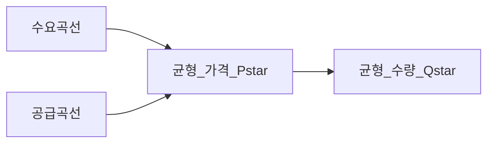
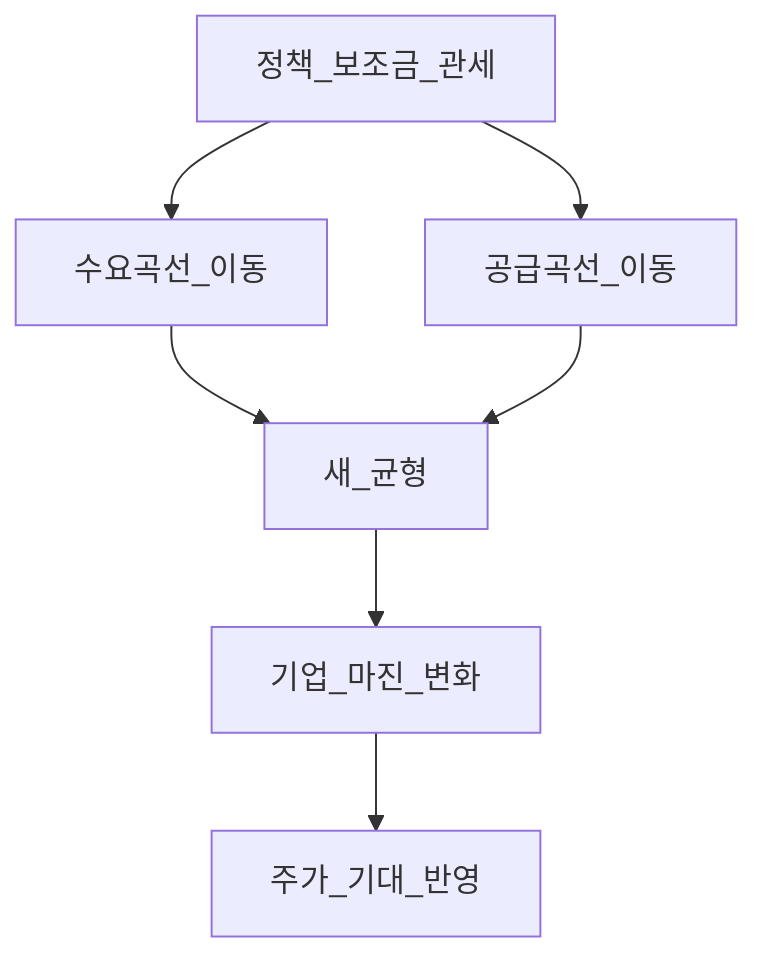

# 미시경제학 기초 — 수요·공급·시장 구조

> **면책**: 본 문서는 교육 목적이며, 특정 개인·법인에 대한 투자·세무·법률 자문이 아닙니다. 제도·세율·상품 조건은 변경될 수 있으므로 실행 전 공식 출처를 확인하세요.

## 메타

| 항목 | 내용 |
|------|------|
| 최종 검증일 | 2026-05-24 |
| 정책·법령 기준일 | 2025-12-31 확정, 2026 개편은 본문 표기 |
| 난이도 | L4 (Graduate) — [READER-GUIDE](../docs/READER-GUIDE.md) |
| 예상 읽기 시간 | 50~65분 (개요만) / L4 전체 **약 15~20h** |
| 관련 bucket | Bucket 0~1 (경제 문법), 섹터 위성(Bucket 3) 해석 |

## 0. 이 편 읽기 전 (5분)

| 항목 | 내용 |
|------|------|
| **난이도** | L4 (Graduate) — [READER-GUIDE §L등급](../docs/READER-GUIDE.md) |
| **선수** | [복리와 화폐의 시간가치](../01-foundations/compound-interest-and-time-value.md), [재무제표 입문](../01-foundations/financial-statements-intro.md) |
| **이번 편에서 쓰는 기호** | 본문 §4·§4a 표 참고 |
| **복습 한 줄** | L3 선수 편을 먼저 읽으면 수식이 수월함 |

## L4 전공자 심화 — 어디로 가나

| 순서 | 문서 | 분량 |
|    ------    | ------ | 위 식의 ------ |
| 1 | [micro-01-consumer-theory](micro-01-consumer-theory.md) | 효용·예산·수요 **유도** |
| 2 | [micro-02-production-cost-supply](micro-02-production-cost-supply.md) | 생산·비용·공급 |
| 3 | [micro-03-market-structures-io](micro-03-market-structures-io.md) | 독점·Cournot·게임이론 |
| 4 | [micro-04-welfare-externalities](micro-04-welfare-externalities.md) | 후생·DWL·정책 |
| 5 | [micro-05-sector-applications](micro-05-sector-applications.md) | 배터리·반도체·투자 |

→ [02-economics/README](README.md) 전체 일정

---

## TL;DR

1. **수요·공급**이 단기 가격·거래량을 결정하며, 배터리·반도체·전력망 등 **사이클 산업**을 읽는 기본 문법이다.
2. **한계비용·규모의 경제**가 왜 대형 파운드리·셀 메이저·유틸리티가 유리한지 설명한다.
3. **과점·독과점**은 마진·가격 결정력을 주지만, 규제·대체재·밸류에이션과 **별개**다.
4. **외부성·보조금·관세**는 곡선을 **이동**시킨다 — EV·ESS·반도체 정책을 숫자 없이도 해석 가능하게.
5. 섹터 리포트의 **TAM(총시장)** 만으로 매수하지 말고, **수요곡선의 가격 탄력성·공급 과잉 여부**를 질문한다.

---

## 1. 한 줄 정의 + 왜 중요한가

**정의**: **미시경제학(Microeconomics)** 은 개별 **소비자·기업·시장**이 한정된 자원 아래에서 선택하고, 그 결과로 **가격·수량·마진**이 어떻게 정해지는지를 다루는 학문이다.

**왜 중요한가**: 주가는 결국 **기대 현금흐름**이지만, 그 현금흐름은 **판매 가격 × 판매량 − 비용**에서 나온다. “AI 수요 폭발” 같은 내러티브도 결국 **수요가 얼마나 가격에 민감한지**, **공급이 얼마나 늘 수 있는지**로 검증해야 한다. 본 저장소의 [배터리·ESS](../03-markets/sectors/battery-lfp-ncm-ess.md), [반도체](../03-markets/sectors/semiconductor.md) 심화 문서를 읽기 전 **공통 언어**가 된다.

---

## 2. 선수 지식 / 이후 읽을 것

**선수**:
- [복리와 화폐의 시간가치](../01-foundations/compound-interest-and-time-value.md)
- [재무제표 입문](../01-foundations/financial-statements-intro.md) — 마진·매출을 숫자로 읽기
- [현금흐름 기초](../01-foundations/cash-flow-basics.md)

**이후**:
- [거시경제학 기초](macroeconomics-basics.md) — 금리·인플레·경기와 연결
- [주식 입문](../03-markets/stocks-equities-intro.md)
- [섹터 투자 프레임워크](../03-markets/sectors/sector-investing-framework.md)
- [배터리 LFP·NCM·ESS](../03-markets/sectors/battery-lfp-ncm-ess.md), [반도체](../03-markets/sectors/semiconductor.md)

---

## 3. 직관·비유

**경매장**: 참가자(수요)가 많고 물건(공급)이 적으면 낙찰가(가격)가 오른다. 2021~2022년 **리튬·운임** 구간, 2023~2024년 **HBM** 구간이 각각 “경매자가 몰리거나 물량이 막힌” 사례에 가깝다.

**레스토랑 주방**: 손님이 한 명 더 올 때 추가 비용(한계비용)이 낮은 가게는 **가격 인하·프로모션**에도 버틴다. 중국 일부 EV 업체의 **공격적 가격**을 이해할 때 “규모의 경제 + 낮은 한계비용” 프레임이 유용하다.

**아파트 단지 내 편의점**: 단지 밖보다 비싸도 산다 — **지역 독점**에 가깝다. 일부 **장비·소재**는 고객사 전환 비용이 커서 단기적으로 비슷한 힘을 가진다(영구 독점은 아님).

**사이클의 진자**: 배터리·메모리·디스플레이는 “한 번 올리면 영원히 오른다”가 아니라, **고마진에 자본이 몰리면** 공급이 늘고 가격이 내려간다. 미시경제는 그 **진자의 왼쪽(수요 붐)** 과 **오른쪽(공급 과잉)** 을 같은 그림으로 설명한다. 주가 차트만 보면 오른쪽이 왔을 때 “바닥”인지 “더 갈 길”인지 구분이 어렵다. 그래서 **재고·가동률·신규 CAPEX** 같은 **실물 지표**를 미시 질문에 붙인다.

**정책은 곡선을 움직인다**: 전기차 보조금은 소비자에게 “싸진 가격”을 주어 **수요를 밀어 올리고**, 반도체 설비 세액공제는 **공급을 미래에 늘리는** 쪽이다. 같은 “정부 지원”이라도 주가에 미치는 타이밍이 다르다 — 전자는 **매출·주문**에, 후자는 **2~3년 후 공급 과잉**에 반영될 수 있다. [거시](macroeconomics-basics.md)의 금리·환율과 겹치면 방향이 더 복잡해진다.

---

**이 모형이 말하는 것**: 수식은 계산 절차이고, 경제 직관은 「누가 이득·손해를 보는가」「어떤 가정이 깨지면 결론이 뒤집히는가」다. 유도 각 단계마다 **가정**을 한 줄로 적어 본다.
## 4. 정식 개념·용어

| 용어 | 한글 | English | 정의 |
|------|------|---------|------|
| 수요 | 수요 | Demand | 가격이 낮을수록 사고 싶은 **수량** 관계 |
| 공급 | 공급 | Supply | 가격이 높을수록 팔고 싶은 **수량** 관계 |
| 균형 | 균형 | Equilibrium | 수요=공급인 **가격·수량** |
| 탄력성 | 가격탄력성 | Price elasticity | 가격 1% 변화에 수량이 몇 % 반응하는지 |
| 한계비용 | 한계비용 | Marginal cost | 한 단위 **추가** 생산 비용 |
| 규모의 경제 | 규모의 경제 | Economies of scale | 규모↑ → 평균비용↓ |
| 소비자·생산자 잉여 | 잉여 | Surplus | 거래로 얻는 이득(교육용) |
| 외부성 | 외부성 | Externality | 시장 가격에 안 잡히는 비용·편익(탄소 등) |
| 과점 | 과점 | Oligopoly | 소수 기업이 가격·수량에 영향 |

### 4a. 핵심 용어 (본문 등장 순)

> 복습용. 정의는 §4 본표·[glossary](../00-roadmap/glossary.md)·본문 `!!! info` 박스.

| 용어 | 한 줄 | 관련 이론 | glossary |
|------|-------|-----------|----------|
| 수요 | 가격이 낮을수록 사고 싶은 **수량** 관계 | §4 | [glossary](../00-roadmap/glossary.md#수요) |
| 공급 | 가격이 높을수록 팔고 싶은 **수량** 관계 | §4 | [glossary](../00-roadmap/glossary.md#공급) |
| 균형 | 수요=공급인 **가격·수량** | §4 | [glossary](../00-roadmap/glossary.md#균형) |
| 탄력성 | 가격 1% 변화에 수량이 몇 % 반응하는지 | §4 | [glossary](../00-roadmap/glossary.md#탄력성) |
| 한계비용 | 한 단위 **추가** 생산 비용 | §4 | [glossary](../00-roadmap/glossary.md#한계비용) |
| 규모의 경제 | 규모↑ → 평균비용↓ | §4 | [glossary](../00-roadmap/glossary.md#규모의-경제) |
| 소비자·생산자 잉여 | 거래로 얻는 이득 | §4 | [glossary](../00-roadmap/glossary.md#소비자·생산자-잉여) |
| 외부성 | 시장 가격에 안 잡히는 비용·편익 | §4 | [glossary](../00-roadmap/glossary.md#외부성) |
| 과점 | 소수 기업이 가격·수량에 영향 | §4 | [glossary](../00-roadmap/glossary.md#과점) |

---

## 5. 메커니즘

### 5.1 균형과 이동

- **곡선 위 이동**: 같은 수요·공급에서 **가격만** 변하는 것이 아니라, **다른 가격에서 원하는 수량**이 바뀐다.
- **곡선 자체 이동**: 수요 증가(선호·소득·대체재), 공급 증가(기술·투자·규제 완화)는 **새 균형**으로 간다.

### 5.2 정책·보조금이 미치는 경로

| 충격 유형 | 수요·공급 | 가격·수량(방향성) | 투자 해석 예 |
|-----------|-----------|-------------------|--------------|
| EV 구매 보조금 | 수요↑ | 가격·판매량↑(단기) | 완성차·배터리 **출하** 민감 |
| 설비 투자 세액공제 | 공급↑(장기) | 가격 압력(과잉 시↓) | 장비주 **수주** 선행 |
| 원자재 풍부 | 공급↑ | 가격↓ | 소재사 **마진** 압박 |
| 진입장벽·특허 | 공급 제한 | 가격·마진 유지 가능 | HBM·일부 장비 |

---

## 6. 수식·모델

선형 수요·공급 (교육용):

| 기호 | 이름 | 이 식에서 의미 |
|    ------    | ------ | 위 식의 ------ |
| \(r\) | 할인율·수익률 | 기간당 이자·요구수익률 |
| \(n\) | 기간 | 연·월 등 복리·할인에 쓰는 횟수 |
| \(PV\) | 현재가치 | 오늘 시점으로 환산한 금액 |
| \(FV\) | 미래가치 | 미래 시점의 목표·결과 금액 |

\[
Q_d = a - bP,\quad Q_s = c + dP
\]

**읽는 법**: **Q_**와 **d**의 관계를 위 식으로 쓴다. 경제·재무 해석은 변수표 「이 식에서 의미」와 [DEPTH-STANDARD](../docs/DEPTH-STANDARD.md) 기호 예제를 맞춘다.
**유도 (L4)**:
1. **정의**: **Q_**, **d**, **a**를 동일 시점·동일 통화로 맞춘다. — 단위 불일치면 식이 무의미해진다.
2. **식 변형**: 양변을 정리해 목표 변수를 한쪽에 둔다. — 할인·복리는 **시점 이동**이 핵심이다.
3. **해석**: 부호·크기가 경제 직관과 맞는지 확인한다. — 극단값에서 단조성·한계를 점검한다.

균형 가격 \(P^* = \frac{a-c}{b+d}\), 균형 수량 \(Q^* = a - bP^*\).

**가격탄력성** (수요, 절댓값):

| 기호 | 이름 | 이 식에서 의미 |
|    ------    | ------ | 위 식의 ------ |
| \(r\) | 할인율·수익률 | 기간당 이자·요구수익률 |
| \(n\) | 기간 | 연·월 등 복리·할인에 쓰는 횟수 |
| \(PV\) | 현재가치 | 오늘 시점으로 환산한 금액 |
| \(FV\) | 미래가치 | 미래 시점의 목표·결과 금액 |

\[
\varepsilon = \left|\frac{\%\Delta Q}{\%\Delta P}\right|
\]

**읽는 법**: **Q**와 **P**의 관계를 위 식으로 쓴다. 경제·재무 해석은 변수표 「이 식에서 의미」와 [DEPTH-STANDARD](../docs/DEPTH-STANDARD.md) 기호 예제를 맞춘다.
**유도 (L4)**:
1. **정의**: **Q**, **P**를 동일 시점·동일 통화로 맞춘다. — 단위 불일치면 식이 무의미해진다.
2. **식 변형**: 양변을 정리해 목표 변수를 한쪽에 둔다. — 할인·복리는 **시점 이동**이 핵심이다.
3. **해석**: 부호·크기가 경제 직관과 맞는지 확인한다. — 극단값에서 단조성·한계를 점검한다.
- \(|\varepsilon| > 1\): **탄력적** — 가격 인하 시 매출↑ 가능(양적 성장주)  
- \(|\varepsilon| < 1\): **비탄력적** — 가격 올려도 수요 잘 안 줄음(필수 소비·전환비용 큰 B2B)

**한계비용과 가격**: 경쟁 시장에서는 장기적으로 **가격 ≈ 한계비용**에 수렴하는 경향(과점·차별화 제외).

**해당 없음 아님**: 섹터 예제·퀴즈에서 위 식을 사용한다.

### 6.1 소비자·생산자 잉여 (교육용)

균형 거래량 \(Q^*\)에서:

- **소비자 잉여**: 지불 의사 가격과 실제 가격 차이의 합 — “할인 받은 느낌”
- **생산자 잉여**: 실제 가격과 한계비용 차이의 합 — “마진”

독과점·규제가 잉여를 **이전**시키면 정치·규제 리스크로 이어질 수 있다(반독점, 보조금 축소 등).

### 6.2 시장 구조별 가격 결정 (요약)

| 구조 | 가격 결정 | 투자 예 |
|------|-----------|---------|
| 완전경쟁 | 한계비용 근처 | 원자재·표준화 부품 |
| 과점 | 상호 의존·가격 경직 | 메모리·일부 장비 |
| 독과점 | 공급자 설정력 | 희소 HBM·네트워크 효과 |

---

|
|------|-----------|---------|
| 완전경쟁 | 한계비용 근처 | 원자재·표준화 부품 |
| 과점 | 상호 의존·가격 경직 | 메모리·일부 장비 |
| 독과점 | 공급자 설정력 | 희소 HBM·네트워크 효과 |

---

## 7. 한국 적용

### 7.1 2025년 기준 (확정·일반적 맥락)

| 영역 | 미시경제 연결 | 저장소 링크 |
|------|---------------|-------------|
| 전기차·ESS 보조금 | 수요곡선 **우이동** | [배터리](../03-markets/sectors/battery-lfp-ncm-ess.md) |
| 반도체·전력망 투자 | 공급·수요 **동시** 확장 | [반도체](../03-markets/sectors/semiconductor.md), [전력망](../03-markets/sectors/power-grid-electrification.md) |
| IRA·관세·현지화 | **지역별** 공급곡선 분리 | [해외 주식 입문](../03-markets/overseas-equities-intro.md) |
| 최저임금·노동비 | 한계비용↑ → 가격·자동화 | [Physical AI](../03-markets/sectors/physical-ai.md) |
| 코스닥 승강제 | “시장” 규칙 변화 → **유동성·수요** | [KOSDAQ 승강제](../03-markets/kosdaq-tier-system.md) |

### 7.2 2026년 개편·시행 예정 (해당 시)

| 항목 | 2025 (확정) | 2026 (시행·논의 시 명시) |
|------|-------------|---------------------------|
| 친환경차 보조금 | 예산·차종별 상이 | 예산 축소·전환 시 **수요곡선 좌이동** 가능 — 공식 고시 확인 |
| 전력·RE100 수요 | 데이터센터·ESS 수요 확대 | [AI 인프라](../03-markets/sectors/ai-infrastructure.md)와 연동 |
| 수출 규제·통상 | 특정 품목 **공급 제약** | 공급곡선 **좌이동** → 가격·대체재 |

**법·정책 근거**: 개별 보조금·세액공제는 산업부·환경부·관세청 고시·보도자료. 투자 실행 전 [references/sources.md](../references/sources.md)의 공식 URL을 따른다.

### 7.3 투자 체크리스트 (섹터 리포트용)

리포트·IR 자료를 읽을 때 아래를 **표에 적어보는** 연습이 L3 학습의 마무리다.

| 질문 | 좋은 답의 방향 |
|------|----------------|
| 수요는 가격에 민감한가? | 탄력성·대체재(가솔린차·LFP 등) |
| 공급이 2년 내 늘 수 있는가? | CAPEX·인허가·인력 |
| 마진 정점인가 구조적인가? | 사이클 vs 해자 |
| 정책 의존도는? | 보조금·관세 **이동** 시나리오 |
| 한국 기업 매출의 고객은? | 국내 vs 수출 — [거시](macroeconomics-basics.md) |

---

## 8. 숫자 예제 (가상)

> 모든 인물·금액·회사명은 가상입니다.

### 예제 1: 리튬 가격 폭락과 소재사 마진 (가상)

| 항목 | 2022 (가상) | 2024 (가상) |
|------|-------------|-------------|
| 리튬 화합물 가격 지수 | 100 | 35 |
| LFP 셀 **한계비용** (가상) | kg당 85원 | kg당 52원 |
| 완성차 OEM 목표가 | 공격적 인하 | 유지·추가 인하 |
| **소재사 A** 영업이익률 | 18% | 4% |

**해석**: 공급 확대(광산·정제) → 원재료 가격↓ → **공급곡선 우이동** → 가격 경쟁. “TAM은 크다”와 별개로 **마진 사이클**이 하락할 수 있다.

### 예제 2: HBM — 과점에 가까운 공급 (가상)

| 항목 | 값 (가상) |
|------|-----------|
| 유효 공급자 수 | 3사 |
| 수요 성장 (AI 서버) | 연 +40% |
| 가격 협상력 | 공급자 우위 |
| **파운드리 B** HBM 매출 비중 | 22% → 31% (2년) |

**해석**: 수요↑ + 공급 제한 → **가격·마진 유지** 가능. 다만 [반도체](../03-markets/sectors/semiconductor.md) 문서처럼 **CAPEX·기술 전환** 리스크는 별도.

### 예제 3: 보조금 축소 시 EV 수요 (가상)

| | 보조금 100% (가상) | 보조금 50% (가상) |
|---|-------------------|-------------------|
| 4천만 원급 EV 유효 가격 | **M** | **M** |
| 연간 판매 대수 (시장) | **M** 대 | **M** 대 |
| 배터리 업체 **가동률** | 92% | 78% |

**해석**: 보조금은 **수요곡선 이동**. 주가는 “보조금 뉴스”보다 **가동률·재고·마진 가이던스**에 반응하는 경우가 많다.

---
## 9. FAQ

**Q1. 미시와 거시의 차이는?**  
**A.** 미시는 **개별 시장·기업**; 거시는 **금리·GDP·인플레** 등 전체. 투자에서는 거시가 **밸류에이션 배경**, 미시가 **섹터·종목 실적** 해석에 가깝다. → [macroeconomics-basics](macroeconomics-basics.md)

**Q2. TAM이 크면 무조건 좋은 주식인가?**  
**A.** **아니다.** TAM은 잠재 **수요 상한** 추정이고, 실현은 **가격·점유율·마진·경쟁**에 달린다. 공급 과잉 시 TAM↑와 주가↑가 동시에 오지 않는다.

**Q3. 독과점·과점 기업이면 안전한가?**  
**A.** **마진 방어**에는 유리할 수 있으나, **규제·기술 대체·밸류에이션·지정학** 리스크는 별도. “좋은 산업 ≠ 항상 좋은 진입 가격”.

**Q4. 보조금이 줄면 주식을 무조건 팔아야 하나?**  
**A.** 교육 프레임만: **수요곡선 좌이동** → 매출·가동률 하향 압력. 포트 전량 매매가 아니라 [자산배분](../04-portfolio/asset-allocation.md)·[코어-위성](../04-portfolio/core-satellite-framework.md)에서 **비중**을 검토한다.

**Q5. 공급 과잉 사이클은 언제 끝나나?**  
**A.** **가격이 한계비용 근처**까지 떨어져 고비용 생산자가 빠지고, CAPEX가 줄며 **공급 증가가 둔화**될 때. 배터리 2023~ 교훈: “바닥”은 재무·재고 데이터로 확인.

**Q6. 주식 차트만 보면 미시경제 안 배워도 되나?**  
**A.** 단기 차트는 **심리·유동성** 비중이 크다. 3년+ **위성·섹터** 포지션에는 미시가 **실적 서프라이즈**를 해석하는 데 필요하다.

**Q7. 한국 수출 기업은 미시만 보면 되나?**  
**A.** **해외 수요·환율**은 거시·국제 무역 변수. → [거시](macroeconomics-basics.md), [해외 주식](../03-markets/overseas-equities-intro.md)

**Q8. ESG·탄소 규제는 미시경제 어디에 넣나?**  
**A.** **외부성을 내재화**하는 정책 → 비용 곡선 **위이동** 또는 규제 준수 **고정비**. 전력·그리드 투자 수요로 이어질 수 있다.

**Q9. 재고가 쌓이면 미시적으로 무엇을 의미하나?**  
**A.** 수요 < 공급 → **가격 하락 압력**·가동률 하향. “실적 서프라이즈” 전에 **재고 주간**을 보는 습관.

**Q10. [physical-ai](../03-markets/sectors/physical-ai.md)와 미시의 연결은?**  
**A.** 로봇·자동화는 **한계비용(노동)** 을 낮춰 공급 곡선을 우로 — 단기 CAPEX는 고정비↑.

---

## 10. 함정·리스크·한계

- **TAM 슬라이드만 믿기** — 가격·경쟁·공급 계획 없음  
- **사이클 정점 마진**을 구조적 마진으로 착각  
- **보조금·관세**를 영구 수요로 가정  
- **과점 = 영원한 해자** — 기술 대체(예: LFP vs NCM 전환) 무시  
- 미시 모델은 **단기·부분균형** — 금리·환율 충격은 거시와 함께 봐야 함  
- 본문 수치·정책은 **시점별 개정** 가능

---

**Q. 실무에서는?**  
교과서 식·기호를 그대로 적용하기 전에 **수수료·세금·데이터 시점**을 분리한다. 숫자는 [DEPTH-STANDARD](../docs/DEPTH-STANDARD.md)처럼 기호만 먼저 맞추고, 법령·시장 수치는 §8 표·외부 출처로 갱신한다.

## 11. 심화 읽기

- [references/sources.md](../references/sources.md) — 산업부·통상·거래소 자료  
- [거시경제학 기초](macroeconomics-basics.md)  
- [섹터 투자 프레임워크](../03-markets/sectors/sector-investing-framework.md)  
- [배터리](../03-markets/sectors/battery-lfp-ncm-ess.md), [반도체](../03-markets/sectors/semiconductor.md)  
- [00-roadmap/glossary.md](../00-roadmap/glossary.md)

### 11.1 권장 학습 순서 (4주, 가상)

| 주차 | 읽을 문서 | 실습 |
|------|-----------|------|
| 1주 | 본 문서 §1~5 | 수요·공급 그림 손으로 그리기 |
| 2주 | [배터리](../03-markets/sectors/battery-lfp-ncm-ess.md) | 예제 1 표를 실제 뉴스에 대입 |
| 3주 | [반도체](../03-markets/sectors/semiconductor.md) | 예제 2 “과점 vs 경쟁” 판별 |
| 4주 | [macro](macroeconomics-basics.md) | §7.3 체크리스트로 IR 1편 검토 |

### 11.2 저장소 bucket 연결

| Bucket | 미시경제 연결 |
|--------|---------------|
| Bucket 0 | 경제 문법·용어 — [STUDY-START](../00-roadmap/STUDY-START.md) |
| Bucket 1 | 현금흐름·비상금 — 정책 충격 시 지출 |
| Bucket 3 위성 | 섹터·개별 — TAM·마진·공급 질문 |

---

## 연습문제 (L4, 기호)

1. 위 §6 주요 식에서 변수 하나를 미지로 두고, 나머지를 기호로 둔 **관계식**을 쓰시오.
2. 가정이 깨질 때(유동성·세금·다중 IRR 등) 위 식의 **한계**를 기호·부등식으로 서술하시오.
3. §8 예제와 동일 기호(M·P·PV 등)로 **부호·단조성**만 검증하는 짧은 논증을 하시오.

### 해설 키

1. 직전 변수표의 「이 식에서 의미」를 이용해 동일 차원으로 정리한다.
2. 「가정이 깨지면」 절의 한계 사례와 연결한다.
3. 숫자 대입 없이 **부호**·**단위** 일치만 확인한다.
## 12. 스스로 점검 퀴즈

1. 공급 곡선이 **우**로 이동하면 균형 **가격**은 일반적으로 어떻게 되는가?  
2. EV 구매 보조금 확대는 수요·공급 중 무엇을 주로 이동시키는가?  
3. \(|\varepsilon| > 1\)이면 가격 10% 인하 시 매출(가격×수량)은 대체로?  
4. HBM처럼 공급자가 적을 때 단기 **마진** 방향성은?  
5. TAM이 크다는 말만으로 매수하기 어려운 이유 한 가지는?  
6. 보조금 축소는 수요곡선을 어느 방향으로 이동시키는가?

??? note "정답 힌트"

    1. 하락(다른 조건 동일) · 2. 수요(유효 가격 하락 효과 포함) · 3. 증가 가능(탄력적) · 4. 공급자 우위로 유지·상승 **가능**(수요 겹칠 때) · 5. 가격·경쟁·마진·공급 과잉 미반영 · 6. 좌(또는 유효 수요 감소)

**L3 완료 기준**: [TEMPLATE](../docs/TEMPLATE.md) 12블록·검증일 2026-05-24 — [DEPTH-STANDARD](../docs/DEPTH-STANDARD.md)