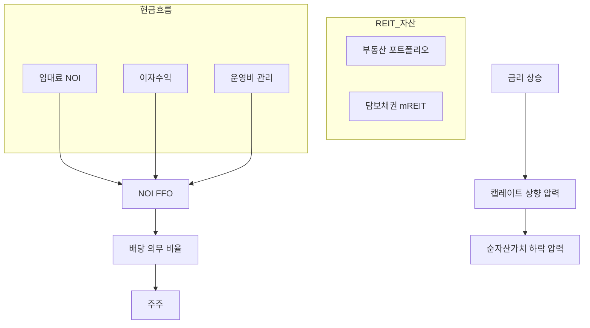
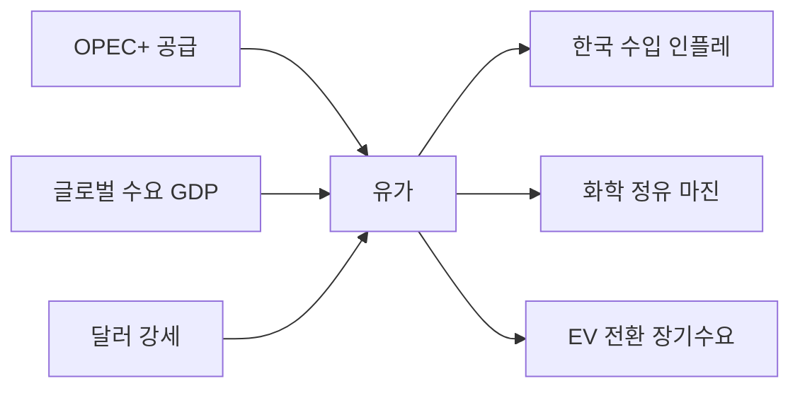
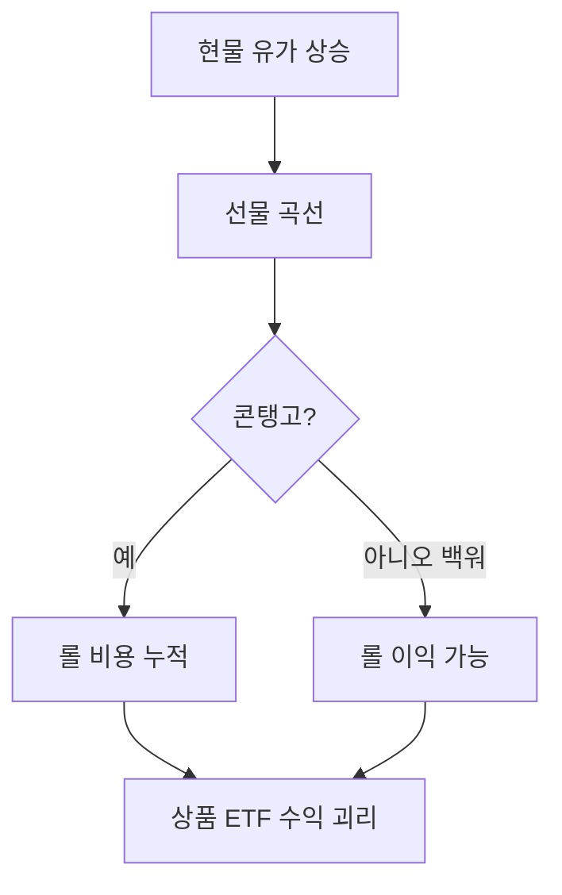
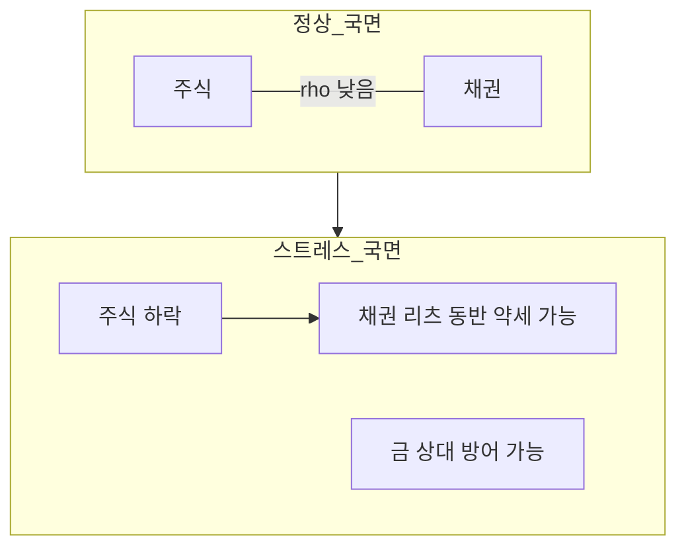
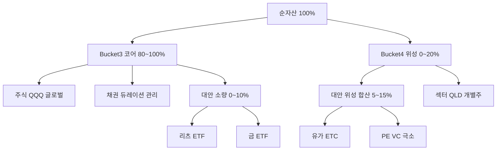

# 대안투자 — REIT·원자재·PE 개요·상관관계·Bucket 3–4 배치

> **면책**: 본 문서는 교육 목적이며, 특정 개인·법인에 대한 투자·세무·법률 자문이 아닙니다. 제도·세율·상품 조건·환헤지·레버리지 규정은 변경될 수 있으므로 실행 전 공식 출처·상품설명서를 확인하세요.

## 메타

| 항목 | 내용 |
|------|------|
| 최종 검증일 | 2026-05-25 |
| 정책·법령 기준일 | 2025-12-31 확정, 2026 ISA·금투세 별도 |
| 난이도 | L4 (Graduate) — [READER-GUIDE](../docs/READER-GUIDE.md) |
| 예상 읽기 시간 | 150~180분 |
| 관련 bucket | Bucket 3 (코어 내 대안 **소량**), Bucket 4 (리츠·원자재·PE **위성·상한**) |
| 커리큘럼 | M3-13 — [CURRICULUM-MAP](../00-roadmap/CURRICULUM-MAP.md) |

## 0. 이 편 읽기 전 (5분)

| 항목 | 내용 |
|------|------|
| **난이도** | L4 (Graduate) — [READER-GUIDE §L등급](../docs/READER-GUIDE.md) |
| **선수** | 없음 |
| **이번 편에서 쓰는 기호** | 본문 §4·§4a 표 참고 |
| **복습 한 줄** | L3 선수 편을 먼저 읽으면 수식이 수월함 |

## TL;DR

!!! info "REIT (Real Estate Investment Trust)"
    부동산 수익증권.

1. **대안투자(Alternatives)** 는 주식·채권·현금 **이외** 또는 **다른 수익·리스크 구조**를 가진 자산군 — 본 편은 **상장 REIT·원자재(금·유가)·PE 개요**에 집중한다.
2. **REIT**는 부동산 **현금흐름·배당**을 주식 형태로 거래하는 구조이나, **“채권 대체”가 아니라 주식 변동성**에 가깝다 — [부동산 기초](../07-real-estate/real-estate-basics.md), [채권 심화](bonds-fixed-income-deep.md)와 구분한다.
!!! info "ETF (Exchange-Traded Fund)"
    거래소 상장 지수·섹터 펀드.

3. **금·유가**는 **인플레·지정학·달러** 서사에 민감하며, **선물·ETF·ETC** 추적 방식(콘탱고·백워데이션)이 장기 수익을 좌우한다.
4. **PE(사모펀드)** 는 **비상장·장기·비유동·J-커브** — 개인은 **간접(상장 PE·벤처·크라우드)** 로만 접근하는 경우가 많고, **유동성 프리미엄·운용보수**를 이해해야 한다.
5. **상관관계**는 **국면(regime)** 에 따라 바뀐다 — 위기 시 주식·채권·리츠·금이 **동시 하락**할 수 있어, “분산 = 무조건 헤지”는 **아니다**.
6. **Bucket 3** 코어는 QQQ·글로벌·채권 중심; **대안 전체**는 코어 안 **0~10%** 또는 **위성(Bucket 4) 합산 5~15% 상한**이 교육 프레임과 맞다 — [자산배분](../04-portfolio/asset-allocation.md), [코어-위성](../04-portfolio/core-satellite-framework.md).

## 블록 1. 한 줄 정의 + 왜 중요한가

**정의**: **대안투자**란 전통적인 **주식·채권·현금** 포트폴리오에 **부동산(리츠)·원자재·사모·헤지·인프라** 등을 넣어 **수익원·인플레 헤지·상관 구조**를 바꾸려는 자산군 및 전략을 통칭한다. **상장 REIT·금 ETF·원유 ETC**는 개인이 **증권 계좌(ISA·IRP·중개)** 로 접근 가능한 **유동 대안**이다.

**왜 중요한가** (L4·장기 자산 형성):

[자산배분](../04-portfolio/asset-allocation.md)에서 “주식 60%·채권 40%”를 정한 뒤에도, **2022년형 스태그플레이션**처럼 **주식·채권이 동시에** 약한 구간이 온다. 이때 “**금을 조금**, **리츠로 임대 수익**, **유가로 에너지 인플레**” 같은 **내러티브**가 유혹적이지만, **실제 상관·비용·세금**을 모르면 **코어를 잠식**하거나 **위성이 40%**가 되는 실수가 난다. [채권 심화](bonds-fixed-income-deep.md) 부록 CH가 말하듯 **리츠 배당 ≠ 채권**; [부동산 기초](../07-real-estate/real-estate-basics.md)의 **레버리지·유동성**과 **상장 리츠**의 **일일 변동성**도 다르다. 본 장은 **전공자 수준**으로 구조를 읽고, **Bucket 3 코어 vs Bucket 4 위성**에 **얼마까지** 넣을지 **규칙**으로 정리한다.

## 블록 2. 선수 지식 / 이후 읽을 것

**선수**:
- [부동산 투자 기초](../07-real-estate/real-estate-basics.md) — NOI·캡레이트·REIT·전세 vs 투자
- [자산배분](../04-portfolio/asset-allocation.md) — 60/40·자산군·드리프트
- [채권·고정수익 심화](bonds-fixed-income-deep.md) — 듀레이션·스프레드·금리 국면
- [채권 입문](bonds-fixed-income.md) — YTM·듀레이션 직관
- [코어-위성](../04-portfolio/core-satellite-framework.md) — Bucket 3·4·80/20
- [MPT·평균분산](../04-portfolio/portfolio-theory-mpt.md) — μ·σ·상관·효율적 프론티어
- [거시 02 — 화폐·인플레](../02-economics/macro-02-money-inflation.md) — 실질금리·원자재
- [거시 04 — 통화정책·QE](../02-economics/macro-04-monetary-policy-qe.md) — 실질금리·자산가격

**이후**:
- [리스크 관리](../04-portfolio/risk-management-portfolio.md) — MDD·스트레스·위성 캡
- [성과 측정](../04-portfolio/performance-measurement.md) — 샤프·추적오차·위성 IR
- [ETF 심화](etf-index-funds-deep.md) — 추적오차·괴리
- [옵션·선물 입문](../08-advanced/derivatives-options-intro.md) — 선물 가격·콘탱고
- [금융투자소득세](../06-korea-policy/tax/financial-investment-income-tax.md) — 배당·이자 2천만
- R7-2 `real-estate-reits.md` (예정) — 리츠 심화

## 블록 3. 직관·비유 — "포트폴리오의 양념·비상식량·냉동고"

**양념(REIT·금 소량)**: 코어 요리(주식·채권)에 **금·리츠 ETF 5%**는 **맛·인플레 대비**용 양념이다. 양념만 **절반** 넣으면 요리가 망가진다 — **대안 합산 상한**이 필요하다.

쉽게 말하면: 삼겹살에 쌈장이 없으면 심심하지만, 쌈장만 먹으면 쓰다. 금·REIT는 포트폴리오에서 그런 역할이다. 5~10% 적당량은 분산 효과가 있지만, 20~30%를 넣으면 오히려 변동성이 커지고 코어 수익에서 멀어진다.

**비상식량(금·달러·단기채)**: 전쟁·금융위기 때 **주식·채권이 동시에** 떨어지면, “비상식량”이 **상대적으로** 덜 떨어질 **수는** 있으나 **항상 오르지는 않는다**(2022: 금도 구간별 혼조).

핵심은: 금은 “위기에 무조건 오른다”는 믿음이 있지만, 달러 강세·실질금리 상승 시 금 가격도 하락할 수 있다. 비상식량은 재난에 대비한 것이지 수익을 낸다는 보장이 없듯, 금은 “헤지”라기보다 “베팅 분산”으로 이해하는 것이 더 정확하다.

**냉동고(PE)**: 사모펀드 지분은 **3~10년 냉동** — 문 열기(환매)가 **제한**된다. 냉동고에 월급의 30%를 넣으면 **생활비 유동성**이 막힌다.

주의할 점: PE나 비상장 투자는 “높은 수익” 서사로 접근하기 쉽지만, 실제로는 비유동성 프리미엄(환매 불가의 대가)이 수익의 상당 부분을 차지한다. 개인이 접근 가능한 크라우드펀딩·벤처펀드는 **전액 손실** 가능성이 있으므로 포트의 극소 비중(1~3%)으로만 다뤄야 한다.

**주유소 간판(유가)**: WTI·브렌트는 **경기·OPEC·정유**의 **간판**이다. ETF로 사면 **실물 유가**가 아니라 **선물·롤** 구조를 산다 — “유가 오르면 ETF도 같은 비율”은 **성립하지 않을 수** 있다.

실제 투자에서는 이렇게 씁니다: USO(미국 유가 ETF)는 근월 선물을 롤(만기 교체)하면서 콘탱고 시장에서 롤 손실이 발생한다. 원유가 연간 +20% 올라도 USO가 +10%에 그치는 구간이 발생하는 이유다. 유가 ETF는 단기 투기 수단이지 코어 장기 투자 대상이 아니다.

## 블록 4. 정식 개념·용어

| 용어 | 한글 | English | 정의 |
|------|------|------|----------------|
| REIT | 리츠 | Real Estate Investment Trust | 부동산·임대 CF를 **신탁·법인** 구조로 모아 **배당·상장** |
| mREIT | 모기지 리츠 | Mortgage REIT | **저당채** 중심, 금리 민감도 ↑ |
| eREIT | 지분 리츠 | Equity REIT | **오피스·물류·주거** 등 **직접 소유** |
| FFO | 운영현금흐름 | Funds From Operations | GAAP 이익 조정, 리츠 **배당 지속력** 점검 |
| AFFO | 조정 FFO | Adjusted FFO | 유지보수·일회성 조정 |
| Cap rate | 캡레이트 | Capitalization rate | NOI / 가치 — [real-estate-basics](../07-real-estate/real-estate-basics.md) |
| Commodity | 원자재 | — | 금·은·에너지·농산 등 **실물·선물** |
| Contango | 콘탱고 | — | 선물 > 현물 — **롤 비용** |
| Backwardation | 백워데이션 | — | 선물 < 현물 — **롤 이익** |
| PE | 사모 | Private Equity | **비상장** 기업 지분·구조조정 |
| VC | 벤처 | Venture Capital | PE의 **초기** 단계 |
| J-curve | J커브 | — | 초기 **수수료·투자**로 NAV **하락** 후 회복 |
| Illiquidity premium | 비유동성 프리미엄 | — | 환매 제한 대가 **기대 초과수익** |
| Correlation | 상관계수 | ρ | −1~1, **국면별** 변동 |
| Regime | 국면 | — | 인플레·금리·위기 **구간** |
| Satellite cap | 위성 상한 | — | Bucket 4 **합산 한도** |

## 블록 5. REIT — 구조·수익·금리·한국 맥락

### 5.1 REIT가 “부동산 주식”인 이유

리츠는 **직접 아파트를 사지 않고** 상장 지분으로 **임대·개발·모기지** 현금흐름에 참여한다. [부동산 기초](../07-real-estate/real-estate-basics.md)의 **NOI·LTV** 논리는 **eREIT**에, **금리·스프레드** 논리는 **mREIT**에 더 가깝다.

| 구분 | eREIT (지분) | mREIT (모기지) |
|------|------|----------------|
| 수익원 | 임대·매각 | 이자·스프레드 |
| 금리 민감 | 중~높음 (할인율·대출) | **매우 높음** |
| 인플레 | 임대료 **일부 전가** | 복합 |
| 위기 | 공실·시세 | **신용·유동성** |

### 5.2 배당·세금·채권과의 차이

[채권 심화](bonds-fixed-income-deep.md): **리츠 배당은 이자가 아니다**. 원금 보장 없음, **주가 변동**이 크다. “채권 40% 대신 리츠 40%”는 **자산배분 오류**에 가깝다 — [자산배분](../04-portfolio/asset-allocation.md)에서 **채권군**은 **듀레이션·신용**으로, 리츠는 **주식군 또는 별도 ‘부동산 베타’ 슬롯**으로 **소량**만.

**한국 투자자(교육)**:
- **국내 상장 리츠·리츠 ETF** — ISA·중개 가능 여부는 **상품·증권사** 확인
- **미국 REIT ETF (VNQ, SCHH 등)** — **환헤지·원화·금투세** — [financial-investment-income-tax.md](../06-korea-policy/tax/financial-investment-income-tax.md)
- **직접 임대** vs **리츠**: 유동성·레버리지·관리 **트레이드오프** — [real-estate-basics](../07-real-estate/real-estate-basics.md)

### 5.3 금리·인플레 전달 (L4)

**금리 상승 국면** (교육 요지):
- **할인율 ↑** → 부동산·리츠 **밸류에이션** 압박
- **대출 비용 ↑** → 개발·매입 **마진** 축소
- **채권**은 가격 하락, **리츠**는 “채권+성장” 혼합이라 **채권만큼** 또는 **주식만큼** — **시기·섹터**에 따라 다름

**인플레 상승**:
- **임대료 인상** 기대 → eREIT **수익** tailwind 가능
- **실질금리**가 여전히 높으면 — [macro-04](../02-economics/macro-04-monetary-policy-qe.md) — **리츠·주식** 모두 **할인율** 부담

## 블록 6. 원자재 — 금·유가·상품 ETF/ETC

### 6.1 금(Gold) — 역할과 한계

| 서사 | 메커니즘 | 한계 |
|------|------|----------------|
| 인플레 헤지 | 실질구매력 **장기** 상관 | 단기 **실질금리↑** 시 약할 수 있음 |
| 위기 헤지 | 불확실성 **수요** | **달러 강세**·금리 시 **혼조** |
| 통화 불신 | 중앙은행 매수·ETF 수요 | **배당 없음**, 보관·보수 비용 |

**보유 형태 (교육)**:
- **금 현물 ETF** (예: GLD, IAU) — 신탁 **실물** 추적
- **금광주 ETF** (GDX 등) — **주식 베타**, 금 가격과 **다름**
- **국내 ETC·상장지수** — 추적·보수·유동성 **상품별** 확인

### 6.2 유가(WTI·Brent) — 거시·산업 연결

| 변수 | 유가에 미치는 방향 (단순화) |
|------|---------------------------|
| 글로벌 성장 ↑ | 수요 ↑ → 가격 **압력** |
| 공급 증가(셰일 등) | 가격 **하락** 압력 |
| 지정학 리스크 | **스파이크** (일시) |
| 달러 ↑ | 원유 **달러 표시** → 압력 |

**한국 포트**: 반도체·2차전지·화학 — [micro-05](../02-economics/micro-05-sector-applications.md) — **유가**는 **비용**이자 **인플레** 채널. “유가 ETF로 헤지”는 **섹터 ETF**와 **중복 베팅**일 수 있다.

### 6.3 선물·ETF·콘탱고 (L4 필수)

원자재 ETF는 종종 **근월 선물 롤**한다.

\[
F \approx S \times e^{(r - y + u)T}
\]

(교육용) — **보관비·편의수익** 등으로 **콘탱고** 시 **롤 손실** → **유가 상승해도 ETF는 덜 오름**.

→ [derivatives-options-intro.md](../08-advanced/derivatives-options-intro.md), [etf-index-funds-deep.md](etf-index-funds-deep.md)

## 블록 7. PE(사모) — 구조·J커브·개인 접근

### 7.1 PE 한 줄 구조

**GP(운용사)** 가 **LP(투자자)** 로부터 자금을 모아 **비상장 기업** 인수 → **가치 제고(운영·재무·매각)** → **Exit(IPO·M&A)** 로 환급.

| 단계 | 교육 포인트 |
|------|-------------|
| Commitment | 약정 — **콜**에 따라 **납입** |
| Investment | J커브 **하단** — 수수료·초기 투자 |
| Harvest | Exit 분배 — **DPI·TVPI** |
| Secondary | 지분 **중도 매각** 시장 — **할인** |

### 7.2 개인 투자자 현실

| 접근 | 유동성 | 비고 |
|------|------|----------------|
| 상장 PE/BDC ETF | 일일 | **주식 변동성**, 레버리지·신용 리스크 |
| 벤처·스타트업 직접 | 매우 낮음 | **전액 손실** 가능 — Bucket 4 **극소** |
| 크라우드·펀드 | 펀드별 | **규제·적합성** 확인 |
| 연기금·IRP 전용 | — | 개인 **일반 ISA**와 **상품 다름** |

**L4 시사**: PE는 **알파**보다 **비유동성·집중·운용자** 리스크가 크다. [passive-vs-active.md](../04-portfolio/passive-vs-active.md) — 개인 **코어**를 PE로 대체 **비권장**.

## 블록 8. 상관관계 — 주식·채권·리츠·금·유가

### 8.1 상관은 “상수”가 아니다

[portfolio-theory-mpt.md](../04-portfolio/portfolio-theory-mpt.md): \(\sigma_p^2 = \sum w_i^2 \sigma_i^2 + 2\sum\sum w_i w_j \rho_{ij} \sigma_i \sigma_j\) — **ρ가 국면마다 바뀌면** 과거 10년 평균 ρ로 **미래 헤지**를 보장하지 못한다.

[bonds-fixed-income-deep.md](bonds-fixed-income-deep.md) 부록 CI: **인플레 타겟 실패** 구간 **채권 헤지 약화** — **주식·채권 동반 약세** (2022 교육 사례).

### 8.2 국면별 직관표 (교육용, 보장 아님)

| 국면 | 주식 | 채권(국채) | 리츠 | 금 | 유가 |
|------|------|------|------|------|----------------|
| 금리 급등·인플레 | ↓ | ↓ | ↓~→ | 혼조 | ↑ 가능 |
| 경기 침체·금리 인하 기대 | ↑~→ | ↑ | ↑~→ | → | ↓ |
| 지정학 쇼크 | ↓ | ↑~→ | ↓ | ↑ 가능 | ↑ |
| 유동성 위기(2008형) | ↓↓ | ↑(초기) | ↓↓ | 초기 ↓ 후 ↑ | ↓ |

### 8.3 분산에 넣을 때의 실무 규칙 (교육)

1. **과거 5년 ρ**만으로 **10년 코어** 결정하지 않기  
2. **대안 합산**에 **스트레스**: 주식 −30%·채권 −10%·리츠 −25% **동시** 가정  
3. **금 + 주식 성장(QQQ)** — 둘 다 **리스크 자산** 성격 구간 존재 → **“헤지”라고 부르지 말고 “베팅 분산”**  
4. **리츠 + 국내 주택 직접 보유** — **부동산 베타 중복**  
5. **유가 ETF + 에너지·화학 주** — **에너지 팩터 중복**

## 블록 9. Bucket 3–4 — 코어 vs 위성·대안 한도

[time-horizon-and-buckets.md](../04-portfolio/time-horizon-and-buckets.md) · [core-satellite-framework.md](../04-portfolio/core-satellite-framework.md) · [asset-allocation.md](../04-portfolio/asset-allocation.md)와 정합:

### 9.1 배치 원칙

| 자산 | Bucket 3 코어 | Bucket 4 위성 |
|------|------|----------------|
| 글로벌·QQQ·채권 ETF | **주력** | — |
| **광역 리츠 ETF** (VNQ 등) | **0~5%** “부동산 슬롯” 가능 | 5~10% **테마** |
| **금 ETF** | **0~5%** 인플레·위기 **소량** | 금광주·은 **베팅** |
| **유가·원자재 ETF** | 코어 **비권장** (롤 리스크) | **≤5%** 위성 |
| **개별 리츠·PE·VC** | **금지** | **≤3%/종목** |
| **레버리지 상품 ETF** | **금지** | [leveraged-etf](../04-portfolio/leveraged-etf-qqq-qld.md) 규칙 |

### 9.2 교육용 **상한 규칙** (합의 예시)

| 규칙 ID | 내용 |
|---------|------|
| A1 | **대안 합산**(리츠+금+원자재+PE류) **≤ 15%** 전체 순자산 |
| A2 | Bucket 4 **위성 전체 ≤ 20%** ([core-satellite](../04-portfolio/core-satellite-framework.md)) |
| A3 | 대안 중 **단일 상품 ≤ 5%** (금 ETF만 8% 등 **예외** 문서화) |
| A4 | 코어(Bucket 3) 내 대안 **≤ 10%** — 나머지는 위성으로 **분리 mental account** |
| A5 | **리밸런싱**: 대안이 **밴드 +25%** 초과 시 **차익 실현** (욕심 방지) |
| A6 | **비상금(Bucket 0)** 은 금 ETF로 **대체 금지** |

### 9.3 [자산배분](../04-portfolio/asset-allocation.md) 60/40과 결합 예

**가상**: 순자산 1억, 전략 60/40, 코어-위성 85/15.

| 슬롯 | 비중 | 내용 |
|------|------|----------------|
| 주식 코어 | 51% | QQQ 25% + 글로벌 26% |
| 채권 코어 | 34% | [bonds-fixed-income-deep](bonds-fixed-income-deep.md) — 중기 국채 ETF |
| 위성 합 | 15% | 반도체 8% + **금 3%** + **리츠 ETF 4%** |
| **대안 합** | **7%** | A1 규칙 **15% 이하** ✓ |

**DB 재직**: 회사 DB는 **조작 불가** — 대안은 **ISA·IRP(Bucket 2b~3)** 에만. [db-pension.md](../06-korea-policy/db-pension.md)

## 블록 10. 가상 시나리오·숫자 예제

### 시나리오 A — 금리 급등 + 인플레 (2022형, 교육)

| 항목 | 가정 |
|------|------|
| 10년 국채 | 1.5% → 4.5% |
| QQQ | −33% |
| 중기 채권 ETF | −12% |
| VNQ(미국 리츠) | −25% |
| GLD | −1% ~ +5% (구간별) |
| USO(유가 ETF) | +10% (현물 ↑, **롤**로 괴리) |

**교훈**: “채권+리츠+금=안전” **아님**. [bonds-fixed-income-deep](bonds-fixed-income-deep.md) **듀레이션 단축** + **대안 상한** 점검.

### 시나리오 B — 지정학 + 유가 스파이크

| 항목 | 내용 |
|------|------|
| WTI | $70 → $95 (3개월) |
| 포트 | 유가 ETC 8% (위성 **A1 위반** 가정) |
| 동시 | QQQ −8%, 금 +6% |

**행동(교육)**: A1 위반 시 **유가 5%로 리밸런싱**; “더 오를 것”으로 **추가 매수 금지**(위성 규칙).

### 시나리오 C — PE J커브 (가상 1억 약정)

| 연도 | 납입 | NAV | DPI |
|------|------|------|----------------|
| Y0 | 0 | 0 | 0 |
| Y1 | 2천 | 1.8천 | 0 |
| Y3 | 5천 누적 | 4.5천 | 0 |
| Y7 | — | 9천 | 0.3 |
| Y10 | — | 1.4억 | 1.2 |

**교훈**: **7년간 유동성 0** 가정 — [cash-flow-basics](../01-foundations/cash-flow-basics.md) **비상금**과 **분리**.

### 시나리오 D — 한국 직장인 ISA (교육)

| 항목 | 내용 |
|------|------|
| 연 납입 | 2,000만 (한도 예시) |
| 배분 | 글로벌 50% + QQQ 30% + **국내 리츠 ETF 10%** + **금 ETC 10%** |
| 문제 | **대안 20%** + **미국 성장 집중** → A1·지역 분산 [geographic-diversification](../04-portfolio/geographic-diversification.md) 점검 |
| 개선 | 금·리츠 **각 5%**, 채권 **10%** 추가 |

### 시나리오 E — MPT 관점 (2자산 단순화)

주식 μ=8%, σ=16%; 금 μ=5%, σ=18%; ρ=0.1.  
**w_gold=10%** 시 σ_p ≈ 15.2% (교육 계산기 확인) — **μ 소폭↑·σ 소폭↓** 가능하나 **ρ→0.5** 위기 시 **효과 소멸**.

## 블록 11. FAQ (8개 이상)

**Q1. REIT는 채권을 대체해도 되나요?**  
**A.** **아니요.** [bonds-fixed-income-deep](bonds-fixed-income-deep.md) — 배당은 **변동 주식** 성격. 채권군은 **국채·금통** 유지.

**Q2. 금 ETF 20%는 인플레 헤지인가요?**  
**A.** **부분적** 서사일 뿐, **리스크 자산 비중**이 커진다. 교육 프레임 **A1·A3** (합산·단일 상한) 참고.

**Q3. 유가가 오르면 USO도 같은 비율로 오르나요?**  
**A.** **아닐 수 있음.** **콘탱고·롤·추적** — 블록 6.3, [derivatives-options-intro](../08-advanced/derivatives-options-intro.md).

**Q4. PE 펀드는 ISA에서 살 수 있나요?**  
**A.** **상품·적합성·집합투자 규정**에 따름. 대부분 **전문·소득 요건** — **상장 PE ETF**는 다름. **중개·설명서** 확인.

**Q5. 집(거주)이 있는데 리츠 ETF도 사도 되나요?**  
**A.** **가능**하나 **부동산 베타 중복**. 거주는 [real-estate-basics](../07-real-estate/real-estate-basics.md) **소비** 슬롯.

**Q6. Bucket 3에 금 5% vs Bucket 4에 금 10% 차이는?**  
**A.** **mental account·리밸런싱 규칙** 차이. 합산 **A1** 초과만 안 되면 됨. **위성**은 **손절·실험** 규칙 별도.

**Q7. 2022처럼 주식·채권이 같이 떨어지면 대안이 도움이 되나요?**  
**A.** **항상은 아님.** 금·유가는 **상대적** 방어 **가능**. **포트 전체 MDD**는 [risk-management-portfolio](../04-portfolio/risk-management-portfolio.md)로 측정.

**Q8. mREIT와 eREIT ETF를 같이 사면 분산되나요?**  
**A.** **부분적**. 둘 다 **금리·부동산 사이클**에 노출 — **단일 “리츠 슬롯”** 으로 **합쳐서** 상한.

**Q9. 대안을 늘리면 샤프가 항상 올라가나요?**  
**A.** **아니요.** [performance-measurement](../04-portfolio/performance-measurement.md) — **추적오차·비용·ρ 붕괴**. **소량**이 MPT **실무**와 맞음.

**Q10. 한국 리츠 배당과 금투세는?**  
**A.** [financial-investment-income-tax.md](../06-korea-policy/tax/financial-investment-income-tax.md) — **2천만 원** 이자·배당 **분리과세** 한도·ISA **비과세** 등 **계좌별** 다름. **세무 전문가** 확인.

**Q11. 코어 QQQ 100%에 금만 5% 추가하면 되나요?**  
**A.** **채권 없이** 성장+금은 **여전히 위험 자산 집중**. [asset-allocation](../04-portfolio/asset-allocation.md) **60/40** 또는 **채권 슬롯** 우선.

**Q12. 위성 20% 중 대안 15% + QLD 10% 가능?**  
**A.** **불가(교육)** — 합이 **25%**. **위성 전체 20%** 안에서 **대안·QLD·테마** 재배분.

## 블록 12. 함정·리스크·심화 읽기

### 12.1 함정

- **“리츠 = 월세 채권”** — 가격 변동 **무시**  
- **“금은 무조건 오른다”** — 실질금리·달러 **무시**  
- **유가 ETF = 유가 현물** — **롤·괴리** 무시  
- **PE TVPI만 보고** 유동성·**DPI=0** 연수 **무시**  
- **대안이 늘어도 분산** — **ρ 국면 붕괴**  
- **ISA 한도만 채우기** — **A1·A2** 초과  
- **채권 줄이고 리츠 늘리기** — [bonds-fixed-income-deep](bonds-fixed-income-deep.md) **듀레이션 헤지** 약화  

### 12.2 체크리스트 (분기 1회)

- [ ] 대안 **합산 %** 계산 (리츠+금+원자재+PE류)  
- [ ] **주식·채권·리츠·금** 12개월 **롤링 ρ** (참고용)  
- [ ] 상품 ETF **추적오차·보수** — [etf-index-funds-deep](etf-index-funds-deep.md)  
- [ ] **금리 국면** — [macro-04](../02-economics/macro-04-monetary-policy-qe.md) · [yield-curve-strategies](yield-curve-strategies.md)  
- [ ] **위성 규칙** 위반 시 **강제 리밸런싱**  

### 12.3 심화 읽기

- [부동산 기초](../07-real-estate/real-estate-basics.md)  
- [자산배분](../04-portfolio/asset-allocation.md)  
- [채권 심화](bonds-fixed-income-deep.md)  
- [코어-위성](../04-portfolio/core-satellite-framework.md)  
- [MPT](../04-portfolio/portfolio-theory-mpt.md)  
- [macro-06-asset-prices-macro](../02-economics/macro-06-asset-prices-macro.md) (예정·연계)  

### 12.4 스스로 점검 퀴즈

1. REIT 배당을 채권 이자로 보면 안 되는 이유 한 가지는?  
2. 콘탱고가 유가 ETF 장기 수익에 미치는 방향은?  
3. PE J커브 초반 NAV가 낮은 주된 이유는?  
4. 교육 프레임 A1의 숫자는?  
5. 2022형 스트레스에서 채권·리츠가 동반 약세할 수 있는 거시 이유는?

??? note "정답 힌트"

    1. 원금·가격 변동·주식 베타 · 2. 롤 비용·괴리 · 3. 수수료·초기 투자·미실현 · 4. 대안 합산 15% 이하 · 5. 인플레·금리 급등·ρ 붕괴

## 연습문제 (L4, 기호)

1. 위 §6 주요 식에서 변수 하나를 미지로 두고, 나머지를 기호로 둔 **관계식**을 쓰시오.
2. 가정이 깨질 때(유동성·세금·다중 IRR 등) 위 식의 **한계**를 기호·부등식으로 서술하시오.
3. §8 예제와 동일 기호(M·P·PV 등)로 **부호·단조성**만 검증하는 짧은 논증을 하시오.

### 해설 키

1. 직전 변수표의 「이 식에서 의미」를 이용해 동일 차원으로 정리한다.
2. 「가정이 깨지면」 절의 한계 사례와 연결한다.
3. 숫자 대입 없이 **부호**·**단위** 일치만 확인한다.
## 부록 A — 대안 vs 전통 자산군 (요약표)

| 자산군 | 주요 수익 | 유동성 | 인플레 | 금리↑ | Bucket |
|------|------|------|------|------|----------------|
| 주식 | 성장·배당 | 높음 | 혼합 | 압박 | 3·4 |
| 채권 | 이자 | 높음 | 일부 헤지 | 가격↓ | 3 |
| eREIT | 임대·시세 | 중 | 일부 | 압박 | 3 소량·4 |
| 금 | 시세 | 중 | 서사 | 혼조 | 3 소량·4 |
| 유가 ETF | 시세·롤 | 중 | 연동 | 복합 | 4 |
| PE | Exit | 낮음 | — | — | 4 극소 |

## 부록 B — 상관·공분산 실무 (L4)

**롤링 36개월 ρ**를 **월별**로 계산해 스프레드시트에 **한 줄**만 유지해도 된다. **ρ > 0.7** 쌍(예: QQQ–반도체 ETF)은 **“분산”이 아닌 같은 베팅** — [sector-investing-framework](sectors/sector-investing-framework.md).

**스트레스 ρ=1** 가정: 위성 **전부** 주식 베타로 환산해 **β_p** — [capm-and-risk-return](../08-advanced/capm-and-risk-return.md).

## 부록 C — 한국 상품 유형 (교육, 특정 상품 비추천)

| 유형 | 예시 성격 | 점검 항목 |
|------|------|----------------|
| 상장지수(ETF) | 리츠·금·원자재 | 추적지수·보수·괴리 |
| ETC | 금·은·유가 | 롤·담보·만기 |
| 뮤추얼 | 부동산·인프라 | 환매·수수료 |
| 해외 ETF | VNQ·GLD | 환헤지·W-8BEN·시차 |

## 부록 D — 리츠 밸류에이션 스케치 (FFO 배수)

\[
\text{가치} \approx \frac{\text{AFFO}}{\text{캡레이트 또는 FFO 배수}}
\]

**금리 ↑** → 요구수익률 ↑ → **배수 ↓** — 주식 DCF와 **동형**. [equity-valuation-fundamentals](equity-valuation-fundamentals.md)의 \(r_f\)는 [bonds-fixed-income-deep](bonds-fixed-income-deep.md) **10년 YTM**과 연동 갱신.

## 부록 E — 통합 복습 (장문)

**투자자 M**은 [자산배분](../04-portfolio/asset-allocation.md)으로 **60/40**을 정했고, **코어 85%**에 QQQ·글로벌·국채를 넣었다. **위성 15%**에 반도체 ETF 10%와 **금 5%**를 두었다. 1년 후 금이 **+15%**, 반도체 **−20%**라 위성 합이 **−8%** — 코어는 **−12%**(QQQ·채권). M은 “금이 잘했으니 **금을 15%**로 늘리자”고 한다. **A3·A5**에 따라 **금 5%로 리밸런싱**하고, 초과 이익은 **채권군** 또는 **Bucket 0**으로 이동하는 규칙이 [rebalancing-and-dca](../04-portfolio/rebalancing-and-dca.md)와 맞다.

동시에 M은 **VNQ 10%**를 ISA에 추가하려 한다. **직접 거주 아파트**가 있으므로 [real-estate-basics](../07-real-estate/real-estate-basics.md) **베타 중복**을 검토 — **리츠 5%**로 제한. **유가 ETC**는 **OPEC 뉴스** 후 **FOMO** — 블록 6.3 **롤**을 읽고 **위성 3%**만.

**금리 인하** 국면이 오면 [bonds-fixed-income-deep](bonds-fixed-income-deep.md)에 따라 **채권 듀레이션**을 늘리는 규칙을 **먼저** 실행하고, **mREIT** 비중은 **금리 민감**이므로 **늘리지 않음**.

**PE**는 지인 **벤처펀드**에 3,000만 — **10년 유동성 0** — **Bucket 4의 3%**를 넘으면 **거절**. 대신 **상장 PE ETF 2%**로 **유동성** 유지.

이 **문서화된 규칙**이 없으면 대안은 **“좋은 이야기 모음”**에 그치고, **10년 후** 코어가 **테마·금·리츠**로 **잠식**된다. L4 학습의 목표는 **수익률 예측**이 아니라 **구조·상관·한도·계좌**를 **한 장**에 고정하는 것이다.

---

*문서 ID: M3-13 · alternatives-reits-commodities · L4 Graduate*