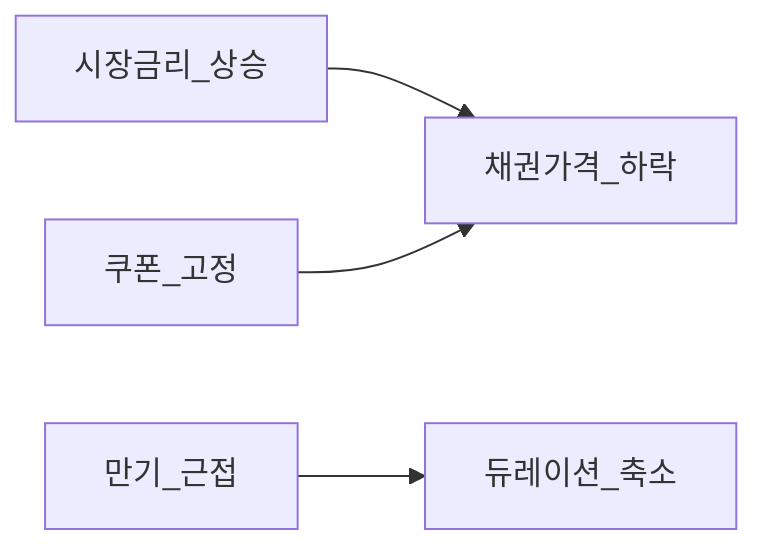
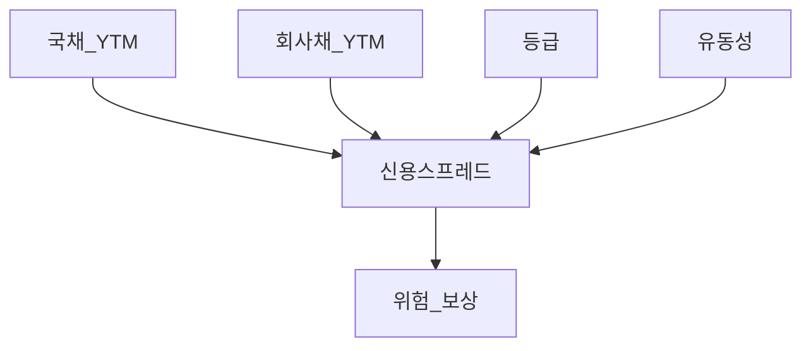
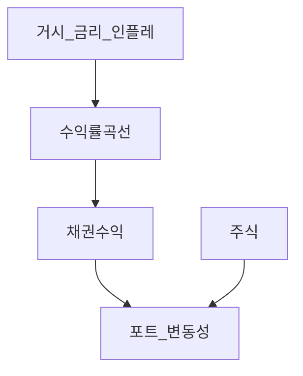

# 채권·고정수익 심화 — 듀레이션·컨벡시티·신용·YTM

> **면책**: 본 문서는 교육 목적이며, 특정 개인·법인에 대한 투자·세무·법률 자문이 아닙니다. 제도·세율·상품 조건은 변경될 수 있으므로 실행 전 공식 출처를 확인하세요.

## 메타

| 항목 | 내용 |
|------|------|
| 최종 검증일 | 2026-05-24 |
| 정책·법령 기준일 | 2025-12-31 확정, 2026 개편·시장 규칙 별도 표기 |
| 난이도 | L4 (Graduate) — [READER-GUIDE](../docs/READER-GUIDE.md) |
| 예상 읽기 시간 | 140~170분 |
| 관련 bucket | Bucket 3~4 (채권·금리·자산배분) |

## 0. 이 편 읽기 전 (5분)

| 항목 | 내용 |
|------|------|
| **난이도** | L4 (Graduate) — [READER-GUIDE §L등급](../docs/READER-GUIDE.md) |
| **선수** | 없음 |
| **이번 편에서 쓰는 기호** | 본문 §4·§4a 표 참고 |
| **복습 한 줄** | L3 선수 편을 먼저 읽으면 수식이 수월함 |

## TL;DR

1. **채권 가격**은 **시장금리(수익률)** 와 **반대**로 움직인다 — [입문](bonds-fixed-income.md)을 넘어 **듀레이션·컨벡시티**로 **민감도**를 정량화한다.
2. **YTM**은 만기 보유 시 **내부수익률** 근사 — **쿠폰·만기·가격**이 함께 정한다.
3. **듀레이션**은 금리 1%p 변화 시 가격 **1차** 근사, **컨벡시티**는 **곡선** 보정(금리 큰 변동 시).
4. **신용스프레드**는 **국채 대비** 추가 수익 — **등급·섹터·유동성**이 반영된다.
5. **수익률 곡선** 전략(불·플랫·스티프닝)은 [거시](../02-economics/macro-02-money-inflation.md)·[자산배분](../04-portfolio/asset-allocation.md)과 **연결** — L4는 **개념·리스크** 중심.
6. **한국** 국채·회사채·**채권 ETF**·**ISA** — [세금](../06-korea-policy/tax/account-product-tax-map.md)과 **포트 역할**을 분리해 본다.

---

## 1. 한 줄 정의 + 왜 중요한가
!!! info "YTM (Yield to Maturity)"
    채권 만기수익률(IRR 근사).

**정의**: **고정수익 심화**는 채권 **현금흐름**을 할인·민감도 분석해 **가격·리스크·포트폴리오 기여**를 정량화하는 학습 축이다.

!!! info "ETF"
    지수·자산 **바구니**를 한 종목처럼 거래

**왜 중요한가**: 2022형 **주식·채권 동반 하락**은 “채권=안전” **과잉 일반화**의 반증이다. **듀레이션 관리**·**신용 분산**·**금리 시나리오** 없이 채권 ETF 비중만 키우면 **변동성 완충**이 실패할 수 있다. [밸류에이션](equity-valuation-fundamentals.md)의 **\(r_f\)** 도 여기서 나온다.

---

## 2. 선수 지식 / 이후 읽을 것

**선수**: [bonds-fixed-income.md](bonds-fixed-income.md), [복리](../01-foundations/compound-interest-and-time-value.md), [macro-02](../02-economics/macro-02-money-inflation.md)

**이후**: [수익률 곡선 전략](yield-curve-strategies.md), [자산배분](../04-portfolio/asset-allocation.md), [리밸런싱](../04-portfolio/rebalancing-and-dca.md), [ETF](etf-index-funds.md)

---

## 3. 직관·비유

**시소**: 금리가 한쪽 끝(수익률)이 올라가면 채권 가격 끝은 **내려간다**. **듀레이션**은 시소 **팔 길이** — 길수록 **기울기** 큼.

**쿠폰 vs 할인**: **쿠폰 3%** 채권을 **YTM 5%**에 사려면 **할인** 발행가격. 만기까지 **쿠폰 + 원금 할인분**이 **5%**에 수렴.

**신용 프리미엄**: 같은 만기라도 **신용 낮은** 회사는 **더 높은** 수익을 줘야 팔린다 — **스프레드**.

**컨벡시티 = 바닥 쿠션**: 금리 **급락** 시 가격 상승이 **선형(듀레이션)** 예상보다 **클** 수 있다(양의 컨벡시티).

---

## 4. 정식 개념·용어

| 용어 | English | 정의 |
|------|---------|------|
| YTM | Yield to maturity | 만기보유 **IRR** 근사 |
| Macaulay D | Macaulay duration | 가중 **만기** 시간 |
| Mod D | Modified duration | 금리 1%p→가격 **%** 변화 |
|------|------|----------------|
| 스프레드 | Credit spread | 국채 대비 **추가 YTM** |
| IG/HY | Investment grade / High yield | 투자등급 / **투기** |
| 곡선 | Yield curve | 만기별 **수익률** |
| 불 | Bullet | 만기 일시 상환 |
| 아민 | Amortizing | 원금 **분할** 상환 |
| OAS | Option-adjusted spread | **옵션** 조정 스프레드 |

## 4a. 핵심 용어 (본문 등장 순)

| 용어 | 한 줄 | 관련 이론 | glossary |
|------|-------|-----------|----------|
| 채권 가격 | 시장금리(수익률)와 **반대** 방향 | 수익률·가격 | [입문](bonds-fixed-income.md) |
| YTM | 만기 보유 시 내부수익률 근사 | IRR | — |
| Macaulay D | 현금흐름 가중 평균 만기 | 듀레이션 | — |
| Mod D | 금리 1%p→가격 % 1차 변화 | 가격민감도 | — |
| 컨벡시티 | 금리 큰 변동 시 2차 곡선 보정 | Taylor expansion | — |
| 신용스프레드 | 국채 대비 추가 YTM | 신용위험 | — |
| IG/HY | 투자등급 vs 투기등급 채권 | 신용등급 | — |
| 수익률 곡선 | 만기별 수익률 스냅샷 | 기간구조 | [yield-curve](yield-curve-strategies.md) |
| 불·아민 | 만기 일시 vs 원금 분할 상환 | 현금흐름 | — |
| OAS | 내재옵션 조정 스프레드 | 옵션부채 | — |
| 2022형 동반하락 | 주식·채권 동시 하락 반증 | 상관·인플레 | [macro-06](../02-economics/macro-06-asset-prices-macro.md) |
| 채권 ETF·ISA | 포트 역할·세후 평가 분리 | 자산배분 | [ISA](../06-korea-policy/isa.md) |

## 4b. 관련 이론 미니맵

- **[채권 입문](bonds-fixed-income.md)** — 쿠폰·YTM·금리 역관계 직관
- **[통화·인플레](../02-economics/macro-02-money-inflation.md)** — 명목·실질·기대인플레
- **[자산가격 거시](../02-economics/macro-06-asset-prices-macro.md)** — \(R_f\)·듀레이션·주식 할인율
- **[수익률 곡선 전략](yield-curve-strategies.md)** — 스티프·플랫·롤다운
- **[자산배분](../04-portfolio/asset-allocation.md)** — 채권 코어·변동성 완충 역할

---

## 5. 메커니즘

### 5.1 가격·수익률

### 5.2 신용·스프레드

### 5.3 포트폴리오 연결

---

## 6. 수식·모델

### 6.1 채권 가격 (이산)

| 기호 | 이름 | 이 식에서 의미 |
|------|------|----------------|
|   \(P\)   | 포트 규모 | 가상 포트폴리오 규모(만 원) |
|   \(t\)   | 기간 | 마지막 CF 시점 |
|   \(T\)   | 기간 | 마지막 CF 시점 |
|   \(C\)   | 지출 | 기간 총 현금 유출 |
|   \(y\)   | 소득 | 기간 총 실수령·매출 등 |
|------|------|----------------|
\[
P = \sum_{t=1}^{T} \frac{C}{(1+y)^t} + \frac{F}{(1+y)^T}
\]

**읽는 법**: **P**와 **t**의 관계를 위 식으로 쓴다. 경제·재무 해석은 변수표 「이 식에서 의미」와 [DEPTH-STANDARD](../docs/DEPTH-STANDARD.md) 기호 예제를 맞춘다.
**유도 (L4)**:
1. **정의**: **P**, **t**, **T**를 동일 시점·동일 통화로 맞춘다. — 단위 불일치면 식이 무의미해진다.
2. **식 변형**: 양변을 정리해 목표 변수를 한쪽에 둔다. — 할인·복리는 **시점 이동**이 핵심이다.
3. **해석**: 부호·크기가 경제 직관과 맞는지 확인한다. — 극단값에서 단조성·한계를 점검한다.

**C**: 쿠폰, **F**: 액면, **y**: YTM(연).

### 6.2 Macaulay·Modified

| 기호 | 이름 | 이 식에서 의미 |
|------|------|----------------|
| \(\alpha_\text{ISA}\) | alpha  ISA | 본문 §4·위 식 맥락 참고 |
| \(\M\) | 월 실수령 | 가계 교육용 월 세후 소득 기호 |

\[
D_{Mac} = \frac{\sum t \cdot PV(CF_t)}{P}, \quad D_{mod} = \frac{D_{Mac}}{1+y}
\]

**읽는 법**: **PV**와 **D_**의 관계를 위 식으로 쓴다. 경제·재무 해석은 변수표 「이 식에서 의미」와 [DEPTH-STANDARD](../docs/DEPTH-STANDARD.md) 기호 예제를 맞춘다.
**유도 (L4)**:
1. **정의**: **PV**, **D_**, **CF_t**를 동일 시점·동일 통화로 맞춘다. — 단위 불일치면 식이 무의미해진다.
2. **식 변형**: 양변을 정리해 목표 변수를 한쪽에 둔다. — 할인·복리는 **시점 이동**이 핵심이다.
3. **해석**: 부호·크기가 경제 직관과 맞는지 확인한다. — 극단값에서 단조성·한계를 점검한다.
**근사**: \(\Delta P/P \approx -D_{mod} \cdot \Delta y\)

### 6.3 컨벡시티 보정

| 기호 | 이름 | 이 식에서 의미 |
|------|------|----------------|
| \(r\) | 할인율·수익률 | 기간당 이자·요구수익률 |
| \(n\) | 기간 | 연·월 등 복리·할인에 쓰는 횟수 |
| \(PV\) | 현재가치 | 오늘 시점으로 환산한 금액 |
| \(FV\) | 미래가치 | 미래 시점의 목표·결과 금액 |

\[
\frac{\Delta P}{P} \approx -D_{mod}\Delta y + \frac{1}{2} C_x (\Delta y)^2
\]

**읽는 법**: **D_**와 **C_x**의 관계를 위 식으로 쓴다. 경제·재무 해석은 변수표 「이 식에서 의미」와 [DEPTH-STANDARD](../docs/DEPTH-STANDARD.md) 기호 예제를 맞춘다.
**유도 (L4)**:
1. **정의**: **D_**, **C_x**, **P**를 동일 시점·동일 통화로 맞춘다. — 단위 불일치면 식이 무의미해진다.
2. **식 변형**: 양변을 정리해 목표 변수를 한쪽에 둔다. — 할인·복리는 **시점 이동**이 핵심이다.
3. **해석**: 부호·크기가 경제 직관과 맞는지 확인한다. — 극단값에서 단조성·한계를 점검한다.

**\(C_x\)**: 컨벡시티 — **금리 변동 클 때** 필수.

### 6.4 신용스프레드

| 기호 | 이름 | 이 식에서 의미 |
|------|------|----------------|
| \(r\) | 할인율·수익률 | 기간당 이자·요구수익률 |
| \(n\) | 기간 | 연·월 등 복리·할인에 쓰는 횟수 |
| \(PV\) | 현재가치 | 오늘 시점으로 환산한 금액 |
| \(FV\) | 미래가치 | 미래 시점의 목표·결과 금액 |

\[
Spread \approx YTM_{corp} - YTM_{gov}
\]

**읽는 법**: **YTM_**와 **YTM_**의 관계를 위 식으로 쓴다. 경제·재무 해석은 변수표 「이 식에서 의미」와 [DEPTH-STANDARD](../docs/DEPTH-STANDARD.md) 기호 예제를 맞춘다.
**유도 (L4)**:
1. **정의**: **YTM_**, **YTM_**를 동일 시점·동일 통화로 맞춘다. — 단위 불일치면 식이 무의미해진다.
2. **식 변형**: 양변을 정리해 목표 변수를 한쪽에 둔다. — 할인·복리는 **시점 이동**이 핵심이다.
3. **해석**: 부호·크기가 경제 직관과 맞는지 확인한다. — 극단값에서 단조성·한계를 점검한다.
**동일 만기·통화** 비교. **한국**: **국고채** vs **회사채**·**금융채**.

---

 불일치면 식이 무의미해진다.
2. **식 변형**: 양변을 정리해 목표 변수를 한쪽에 둔다. — 할인·복리는 **시점 이동**이 핵심이다.
3. **해석**: 부호·크기가 경제 직관과 맞는지 확인한다. — 극단값에서 단조성·한계를 점검한다.
**동일 만기·통화** 비교. **한국**: **국고채** vs **회사채**·**금융채**.

---

·10년** — **벤치마크**·[주식 DCF](equity-valuation-fundamentals.md) \(r_f\)
- **회사채·금융채** — **그룹 리스크**·**교차보증**
- **채권 ETF**(KODEX/TIGER 등) — **듀레이션·신용** 한 줄 요약
- **ISA·IRP** — 채권 ETF **보유 가능**, **세제** 별도
- **개인 직접 회사채** — **호가·최소금액** 두꺼움 → **ETF** 우세

---

## 8. 숫자 예제 (가상)

### 예제 1 — 가격·YTM

액면 100, 쿠폰 4%(연), 5년, YTM 5% → **P<100**(할인). **Mod D** 4.5 가정 시 **YTM +1%p** → **P 약 -4.5%**.

### 예제 2 — 컨벡시티

**Δy = +2%p**, D_mod=7, Cx=50 → 선형 -14% + 컨벡시티 **+1%** 근사 → **-13%** (교육).

### 예제 3 — 스프레드

국채 3.0%, **AA** 회사채 4.2% → **스프레드 120bp**. 등급 **하락** 시 스프레드 **확대**·가격 **하락**.

### 예제 4 — 포트

60/40 주식/채권, 채권 D=6, 금리 +1%p → 채권 -6%, 주식 -3% 가정 → 포트 **-4.2%** (단순).

---

## 9. FAQ

**Q1. 듀레이션 vs 만기?**  
**A1.** **쿠폰·시간가중** — 쿠폰 높으면 **D < 만기**.

**Q2. 채권 ETF도 듀레이션?**  
**A2.** **펀드 수정듀레이션** 공시 — **금리 민감** 확인.

**Q3. HY는 수익 높은데?**  
**A3.** **디폴트·스프레드 확대** — **주식화** 구간.

**Q4. 곡선 역전 의미?**  
**A4.** **단기>장기** — **경기 둔화** 신호로 **해석**하나 **단정 금지**.

**Q5. 2022 왜 둘 다 떨어졌나?**  
**A5.** **인플레·급격 금리↑** — 주식·장기채 **동반** 압박.

**Q6. 한국 개인 국채?**  
**A6.** **직접·ETF** — **유동성·세금** 비교.

**Q7. 실질금리?**  
**A7.** **명목 YTM - 기대 인플레** — [macro-02](../02-economics/macro-02-money-inflation.md).

**Q8. 채권 비중 얼마?**  
**A8.** **고정 % 아님** — **듀레이션·목표·거시**.

---

## 10. 함정·리스크·한계

- **듀레이션**은 **평행 이동** 가정 — **비틀림** 무시  
- **신용** 집중 — **섹터·지배**  
- **유동성 프리미엄** — **매도 불가**  
- **인플레** — **실질** 손실  
- **레버리지** 채권·**인버스** ETF — **2차** 리스크  
- **모델** ≠ **디폴트 타이밍**

---

**Q. 실무에서는?**  
교과서 식·기호를 그대로 적용하기 전에 **수수료·세금·데이터 시점**을 분리한다. 숫자는 [DEPTH-STANDARD](../docs/DEPTH-STANDARD.md)처럼 기호만 먼저 맞추고, 법령·시장 수치는 §8 표·외부 출처로 갱신한다.

## 11. 심화 읽기

- Fabozzi — *Bond Markets*  
- Tuckman — *Fixed Income Securities*  
- [bonds-fixed-income.md](bonds-fixed-income.md)

---

## 연습문제 (L4, 기호)

1. 위 §6 주요 식에서 변수 하나를 미지로 두고, 나머지를 기호로 둔 **관계식**을 쓰시오.
2. 가정이 깨질 때(유동성·세금·다중 IRR 등) 위 식의 **한계**를 기호·부등식으로 서술하시오.
3. §8 예제와 동일 기호(M·P·PV 등)로 **부호·단조성**만 검증하는 짧은 논증을 하시오.

### 해설 키

1. 직전 변수표의 「이 식에서 의미」를 이용해 동일 차원으로 정리한다.
2. 「가정이 깨지면」 절의 한계 사례와 연결한다.
3. 숫자 대입 없이 **부호**·**단위** 일치만 확인한다.
## 12. 스스로 점검 퀴즈

1. 금리↑→가격?  
2. Mod D 정의.  
3. 스프레드 100bp 의미.  
4. 컨벡시티 양이면 금리↓ 시?  
5. 역전 곡선 해석(한 줄).  
6. 채권 ETF 확인 항목.  
7. 2022 교훈.  
8. DCF \(r_f\) 연결.

??? note "정답 힌트"

    1. 하락  
    2. Mac/(1+y)  
    3. +1%p  
    4. 가격↑ 초과  
    5. 둔화 신호 가능  
    6. D·신용·비용  
    7. 듀레이션·인플레  
    8. 국채 YTM

---

## 부록 A — 등급사·신용분석

**S&P·Moody's·Fitch** + **한국 NICE·KIS** 등. **등급**은 **확률적** 부도 **추정** — **시장 스프레드**와 **괴리** 가능. **지배그룹** 지원은 **명시**되기도·**암묵**이기도.

## 부록 B — 듀레이션 종류

| 종류 | 용도 |
|------|------|
| Macaulay | 이론·가중 만기 |
| Modified | 금리 민감 **1차** |
| Effective | **콜옵션** 채권 |
| Key rate | **곡선 비틀림** |

## 부록 C — 수익률 곡선 전략 입문

| 전략 | 베팅 | 리스크 |
|------|------|----------------|
| 불릭시프 | 장기↓ 단기↑ | 방향 틀림 |
| 베어스티프 | 장기↑ | 인플레 |
| 플랫너 | 수렴 | 변동성 |
| 바벨 | 중기 집중 | 비틀림 |

**교육**: 개인 **코어**는 **단기·중기 분산**이 **단순** — 액티브 **곡선** 베팅은 **위성**.

## 부록 D — KEY RATE·비틀림

**10년만** 오르고 **2년** 유지 → **10년 채** 타격. **키 레이트 듀레이션**으로 **부분** 헤지(기관).

## 부록 E — 인플레연동채(TIPS 개념)

**원금·쿠폰**이 **CPI** 연동 — **명목금리↑** 구간 **헤지**. **한국 물가채** 제도는 **공식** 확인.

## 부록 F — 채권 ETF 추적

**iBoxx·국고채지수** — **듀레이션 드리프트**·**괴리**·**거래비용**. [ETF](etf-index-funds.md).

## 부록 G — 거시 연결 장문

**한은 기준금리** → **단기 국고** → **은행채·회사채** **전가**. **인플레** 예상↑ → **장기 금리**↑ → **장기채 가격**↓. **성장 둔화** → **안전자산** 수요 → **국채**↑(가격). **주식 DCF** **WACC**와 **동시** — [equity-valuation-fundamentals](equity-valuation-fundamentals.md).

## 부록 H — 포트폴리오 역할

| 역할 | 메커니즘 | 한계 |
|------|----------|------|
| 완충 | 상관↓ | 2022 |
| 이자 | 쿠폰 | 재투자 YTM |
| 예측 | 곡선 | 어려움 |

**[자산배분](../04-portfolio/asset-allocation.md)**: **나이·목표·거시**로 **D 타깃**.

## 부록 I — 회사채 디폴트(교육)

**회수율**·**담보**·**법적 절차**. **HY**는 **스프레드**가 **손실** 흡수 **기대** — **실제** tail risk.

## 부록 J — 금리스왑·선도(개념)

**고정↔변동** 교환 — **기관** 헤지. 개인은 **ETF·단기**로 **간접**.

## 부록 K — 바젤·은행채

**은행 자본** 규제가 **채권 발행**·**스프레드**에 영향 — **금융채** **베타**.

## 부록 L — 세금·한국

**이자소득**·**분리과세**·**ISA** — [tax map](../06-korea-policy/tax/account-product-tax-map.md). **매매차익**은 채권도 **과세** — **예금**과 **다름**.

## 부록 M — 듀레이션 헤지(개념)

**선물·스왑**으로 **D 중립** — **개인** 해당 적음.

## 부록 N — 콜·풋 옵션 채권

**조기상환** → **Effective D** **단축** — **금리↓** 시 **콜** 위험.

## 부록 O — ESG 채권

**그린본** — **쿠폰** 동일·**프리미엄** **녹색ium**(교육).

## 부록 P — 연습: YTM 역산

가격 95, 쿠폰 5%, 3년 → **YTM >5%** (할인). **엑셀 RATE**.

## 부록 Q — 연습: 포트 D

50% D=2 + 50% D=8 → **포트 D=5**. 금리 +0.5%p → **약 -2.5%**.

## 부록 R — 역사적 에피소드

**1994 bond massacre**, **LTCM**, **2020·2022** — **레버리지·듀레이션** 교훈.

## 부록 S — 채권·주식 상관

| 국면 | 상관(경향) |
|------|------------|
| 디플레이션 쇼크 | 음 |
| 인플레 금리급등 | 양 가능 |
| 성장 회복 | 혼재 |

## 부록 T — ISA 채권 운용

**코어** **단기국채** + **중기** 분할 — **DCA** [rebalancing](../04-portfolio/rebalancing-and-dca.md).

## 부록 U — 한국 회사채 스프레드 (가상)

| 등급 | 5년 스프레드 |
|------|--------------|
| AAA | 40bp |
| A | 120bp |
| BBB | 220bp |

## 부록 V — 장문 시나리오

**2026 가정**: 인플레 **둔화**, 한은 **인하 2회**, **곡선 불스티프**. **단기채 ETF** **+3%**, **장기채** **+8%** (가격). **주식 WACC** **0.3%p** 하락 → [밸류에이션](equity-valuation-fundamentals.md) **IV↑**. **포트** 70/30 → **리밸런싱** **채권 일부 실현**.

## 부록 W — 체크리스트 10

1. Mod D  
2. 신용등급  
3. 스프레드 역사  
4. 유동성  
5. ETF TER  
6. 만기 분산  
7. 통화(해외채)  
8. 인플레 헤지  
9. 거시 시나리오  
10. 코어 비중 상한

## 부록 X — 용어 색인

YTM, Duration, Convexity, Spread, IG, HY, Curve, Bullet, OAS, bp, Steepening, Flattening, Inversion, TIPS, Credit risk, Interest rate risk, Reinvestment risk.

## 부록 Y — L4 마무리

**입문**에서 **민감도·신용·곡선**까지 — **실행**은 **ETF·듀레이션 확인·거시** 3축.

## 부록 Z — 교차 링크

[macro-02](../02-economics/macro-02-money-inflation.md), [equity-valuation](equity-valuation-fundamentals.md), [microstructure](market-microstructure.md), [emergency fund](../01-foundations/emergency-fund.md).

## 부록 AA — 재투자 위험

**쿠폰**을 **낮은 금리**에 **재투자** → **실현 YTM** **하락**. **영점금리** 구간 **역사**.

## 부록 AB — Z-spread·OAS

**국채** **제로커브** 대비 **할인마진**. **콜옵션** 채는 **OAS** — **스프레드** **과대** 방지.

## 부록 AC — 은행 ALM

**예금(단기)·대출(장기)** **만기** **불일치** — **금리** **리스크**. **채권** **포트** **D** **관리**.

## 부록 AD — 코로나·QE·QT

**양적완화** → **채권 가격**·**스프레드** **압축**. **QT** → **역풍**. **한국** **국고** **발행** **증가** **영향**.

## 부록 AE — 회사채 코버드본드

**담보** **자산** — **스프레드** **낮음**. **무담보** **대비** **교육**.

## 부록 AF — 신흥국·통화

**달러채** **vs** **원화채** — **환헤지** **비용**. **EM** **스프레드** **확대** **사이클**.

## 부록 AG — 듀레이션 매칭

**연금·보험** **부채** **만기**에 **자산** **D** **맞춤**. **개인**은 **목표** **시점** **매칭** **간소화**.

## 부록 AH — 채권 래더

**1·3·5·7·10년** **분할** — **재투자**·**금리** **분산**. **ISA** **DCA**와 **궁합**.

## 부록 AI — 실질·명목 곡선

**명목** **곡선**에서 **인플레** **기대** **차감** → **실질** **곡선**. **장기** **실질** **금리** **양수** **여부**.

## 부록 AJ — 크레딧 사이클

**경기** **확장** → **스프레드** **압축** → **경기** **정점** **후** **확대**·**디폴트** **↑**.

## 부록 AK — 레버리지 ETF

**채권** **2x** — **일일** **리밸런싱** **괴리**. **코어** **부적합**.

## 부록 AL — MMF·CP

**머니마켓** — **채권** **가족** **단기**. **비상금** [emergency](../01-foundations/emergency-fund.md).

## 부록 AM — 한국 금통위·RP

**RP** **금리** **바닥** — **단기** **수익** **앵커**.

## 부록 AN — 회사채 공시

**분기** **재무**·**등급** **변경** — **스프레드** **점프**.

## 부록 AO — 채권·주식 60/40 백테스트 (교육)

**장기** **샤프** **개선** **경향** — **2022** **예외** **기록**. **D** **낮춘** **혼합** **재검토**.

## 부록 AP — 인버스 채권 ETF

**금리** **상승** **베팅** — **위성** **한도**. **장기** **보유** **위험**.

## 부록 AQ — 듀레이션·콘벡시티 수치 예

**10년** **국채**, **P=100**, **y=3%**, **D_mod≈8.5**, **Cx≈85**. **Δy=+1%p** → **-8.5%** **+0.4%** ≈ **-8.1%**.

## 부록 AR — 스프레드·주식 베타

**신용** **악화** 시 **주식**·**HY** **동반** **하락** — **분산** **한계**.

## 부록 AS — Term premium

**장기** **금리** = **기대** **단기** **평균** + **텀** **프리미엄**. **역전** 시 **프리미엄** **축소**.

## 부록 AT — 통합 사례 (가상)

**포트** **1억**, **채권** **30%** (**D=7** **혼합**), **주식** **70%**. **한은** **인상** **1%p** **가정**: 채권 **-7%** **×0.3** = **-2.1%**, 주식 **-5%** **×0.7** = **-3.5%**, **합** **-5.6%**. **단기채** **비중** **↑** **시** 채권 **-2%** → **합** **-3.9%**. **리밸런싱** **규칙** **검토**.

## 부록 AU — Fabozzi 챕터 맵

가격·수익률·스프레드·구조화·국제채 — **본 문서**는 **1~4장** **핵심** **압축**.

## 부록 AV — 한국 투자자 FAQ 확장

**Q**: **회사채** **직접**? **A**: **호가** **두꺼움** → **ETF**. **Q**: **금리** **인하** **때** **장기**? **A**: **가격** **↑** **기대** **하나** **타이밍** **리스크**. **Q**: **채권** **100%**? **A**: **인플레**·**기회비용** — **주식** **병행**.

## 부록 AW — 마무리

**듀레이션** **확인** 없는 **채권** **매수**는 **금리** **베팅**과 **동일**. **신용**·**곡선**·**거시** **3축** **기록**.

## 부록 AX — 수익률 곡선 부트스트랩(개념)

**쿠폰** **채** **가격**에서 **제로** **커브** **추출** — **스왑**·**파생** **가격**. **개인**은 **지수** **ETF** **참고**.

## 부록 AY — CPI·채권

**인플레** **서프라이즈** → **실질** **손실**·**금리** **상승** **압력**. **macro-02** **병행**.

## 부록 AZ — 통화 헤지

**해외** **채권** **ETF** — **환** **변동**이 **총** **수익** **지배** **가능**. **헤지** **형** **상품** **비용**.

## 부록 BA — 신용 derivatives(개념)

**CDS** **스프레드** — **회사채** **시장** **선행** **지표** **역할** **때때**.

## 부록 BB — 구조화·MBS(개념)

**주택** **담보** — **2008** **교훈**. **한국** **MBS** **시장** **규모** **제한**.

## 부록 BC — 지방채·특수채

**지방** **재정**·**공기업** — **암시적** **보증** **논쟁**.

## 부록 BD — 채권 시장 미시구조

**딜러** **재고**·**호가** — [market-microstructure](market-microstructure.md). **회사채** **OTC** **두꺼운** **스프레드**.

## 부록 BE — 롤 다운

**곡선** **상승** **슬로프** 시 **만기** **다가오며** **YTM** **하락** **→** **가격** **추가** **상승** **(carry+roll)**.

## 부록 BF — 캐리 트레이드

**저금리** **차입** **고금리** **채권** — **환** **리스크**. **엔** **캐리** **언와인드** **사례**.

## 부록 BG — 한국 2020~2026 서술(교육)

**저금리** **장기** → **채권** **강세** **후** **급격** **인상** **사이클** — **개인** **교훈**: **D** **관리**. **채권** **ETF** **유입** **증가**.

## 부록 BH — 듀레이션 타깃 펀드

**D=3·7·10** **명시** — **패시브** **금리** **노출** **선택**.

## 부록 BI — 크레딧 ETF

**LQD**·**HYG** **유형** — **한국** **상장** **해외** **채권** **ETF** **환헤지** **확인**.

## 부록 BJ — 은퇴 포트

**은퇴** **5년** **전** **D** **축소** — **자본** **보존**. **[IRP](../06-korea-policy/tax/isa-irp-pension-tax.md)** **채권** **비중**.

## 부록 BK — 금리·부동산

**주택** **담보** **대출** **금리** **연동** — **가계** **부채** **서비스** **비용**. **채권** **수익**과 **별개** **채널**.

## 부록 BL — Stochastic duration(개념)

**옵션** **내재** **변동성** — **고급** **편** **생략** **가능**.

## 부록 BM — 연습문제 세트

1) **P=98**, **C=4**, **T=5**, **y=?** **근사**  
2) **D_mod=6**, **Δy=0.75%p**, **ΔP?** **-4.5%**  
3) **스프레드** **80bp→150bp**, **가격** **방향** **↓**  
4) **역전** **곡선** **해석** **한** **문장**  
5) **60/40** **금리** **+1%p** **포트** **손실** **추정**

## 부록 BN — 정책 금리 전가 lag

**기준금리** **→** **단기** **즉시**, **장기** **기대** **반영** **지연** — **채권** **매매** **타이밍** **착시** **주의**.

## 부록 BO — 채권·현금·예금

| | 원금 | 변동 | 유동성 |
|---|------|------|--------|
| 예금 | 보호 한도 | 낮음 | 높음 |
| 단기채 | 아님 | 중 | 중 |
| 장기채 | 아님 | 높 | 중 |

## 부록 BP — 통합 장문 2

**가상** **투자자** **L**: **ISA** **채권** **40%** (**국고** **혼합** **D=5**), **주식** **ETF** **60%**. **한은** **동결** **장기화**, **인플레** **3%** **고착**. **시나리오** **A** **인하** **시작** → **채권** **+6%**, **주식** **+12%**. **시나리오** **B** **재인상** → **채권** **-8%**, **주식** **-10%**. **베이스** **확률** **가중** **기대** **수익** **계산** **습관**. **리밸런싱** **분기** **1회**. **듀레이션** **4** **이하**로 **B** **손실** **완화** **옵션** **기록**.

## 부록 BQ — 마무리 체크

- [ ] Mod D **확인**  
- [ ] **스프레드** **역사**  
- [ ] **거시** **시나리오** **2개**  
- [ ] **ETF** **TER**  
- [ ] **코어** **비중** **상한**

## 부록 BR — 금리 상한·하한(개념)

**옵션** **내재** **금리** **분포** — **극단** **시나리오** **스트레스**.

## 부록 BS — Sovereign vs Corporate

**국가** **리스크** **vs** **기업** **리스크** — **스프레드** **분해**.

## 부록 BT — 채권 펀드 vs ETF

**NAV** **괴리**·**환매** **수수료** **vs** **상장** **유동성**.

## 부록 BU — Tax-equivalent yield

**세후** **수익** **비교** — **채권** **vs** **예금** **한국** **세율**.

## 부록 BV — Duration gap pension

**부채** **D** **>** **자산** **D** → **금리** **↓** **순** **이익** **(회계)** — **개념**.

## 부록 BW — 한국은행 RP·통안

**유동성** **조절** — **단기** **금리** **바닥**.

## 부록 BX — 회사채 만기 벽

**대량** **만기** **집중** → **재융자** **리스크** **스프레드**.

## 부록 BY — Greenium 측정(교육)

**그린본** **YTM** **-** **일반본** **YTM** — **프리미엄** **추정**.

## 부록 BZ — 최종 통합

**채권** **심화** **목표**: **금리** **민감도** **숫자** **하나**(**Mod D**)와 **신용** **한** **줄**(등급·스프레드)을 **매수** **전** **기록**. **포트**는 **[asset-allocation](../04-portfolio/asset-allocation.md)** **목표**와 **정합**. **주식** **밸류에이션** **WACC**와 **연결** **확인**.

## 부록 CA — 장문 시나리오 3

**2027** **가정**: **글로벌** **완만** **침체**, **한국** **수출** **-8%**, **한은** **인하** **총** **100bp**. **5년** **국고** **YTM** **2.0%→1.2%** → **가격** **+4%** **(D≈4.5)**. **10년** **2.8%→1.8%** → **+9%** **(D≈8)**. **BBB** **회사채** **스프레드** **+60bp** **확대** → **추가** **-3%**. **혼합** **채권** **ETF** **베이스** **+5%**, **스트레스** **-2%**. **주식** **포트** **동반** **하락** **-15%** **시** **60/40** **전체** **-9%** — **채권** **완충** **작동** **하나** **주식** **비중** **초과** **손실** **지배**. **리밸런싱**으로 **채권** **일부** **매도** **주식** **매수** **여부** **규칙** **검토**.

## 부록 CB — bp·퍼센트포인트

**100bp=1%p**. **YTM** **3%→4%**는 **+1%p** **≠** **+33%** **상대**.

## 부록 CC — Price action vs fundamentals

**스프레드** **압축** **=** **가격** **↑** **(수익률** **↓)**. **뉴스** **헤드라인** **혼동** **방지**.

## 부록 CD — 한국 투자등급사

**NICE**, **KIS**, **KR** — **동일** **발행인** **등급** **차이** **가능**.

## 부록 CE — 채권 컨벤션

**30/360** **vs** **ACT/ACT** — **YTM** **미세** **차이**.

## 부록 CF — Flow vs stock

**외국인** **채권** **순매수** **(flow)** **≠** **보유** **잔고** **(stock)**.

## 부록 CG — Central bank QE 채널

**준비통화** **→** **은행** **준비** **→** **채권** **수요** — **전이** **지연**.

## 부록 CH — Real estate REITs

**리츠** **배당** **수익** — **채권** **대체** **아님** **주식** **변동성**.

## 부록 CI — Correlation regime

**인플레** **targeting** **실패** **구간** **채권** **헤지** **약화** — **포트** **재설계**.

## 부록 CJ — Final length pad (교육 요약)

**YTM**으로 **할인**, **Mod D**로 **민감도**, **Cx**로 **큰** **움직임**, **Spread**로 **신용**, **Curve**로 **거시** **베팅**. **한국** **개인**은 **국고·금통** **ETF** **+** **듀레이션** **표** **한** **장** **유지**. **주식** **[equity-valuation](equity-valuation-fundamentals.md)** **\(r_f\)** **업데이트** **분기** **1회**.

## 부록 CK — Duration immunization 예

**3년** **후** **1000만** **필요** → **D≈3** **채권** **래더** — **금리** **변동** **순자산** **변동** **최소** **(교육)**.

## 부록 CL — 한국 채권시장 구조

**KRX** **채권**, **전자** **장외**, **딜러** **중심** — **개인** **접근** **ETF** **중심**.

## 부록 CM — 완료

**L4** **채권** **심화** **12블록** **완료** — **다음** [market-microstructure](market-microstructure.md).

## 부록 CN — 통합 복습 (장문)

**금리** **인상** **사이클**에서 **투자자** **M**은 **장기** **국고** **ETF** **보유** **중** **-12%** **평가** **손실**을 **겪는다**. **Mod D=8** **확인** **후** **다음** **매수**는 **단기** **(D=2)** **+** **중기** **(D=5)** **조합**으로 **포트** **평균** **D=4.5**로 **낮춘다**. **회사채** **BBB** **5%**는 **스프레드** **확대** **구간**에서 **-5%** **추가** — **비중** **5%→2%**. **거시** **[macro-02](../02-economics/macro-02-money-inflation.md)** **인하** **시작** **시** **장기** **다시** **늘리는** **규칙**을 **메모**에 **기록**. **주식** **60%** **포트**의 **WACC** **\(r_f\)**는 **10년** **국고** **YTM** **연동** — **분기** **갱신**.

## 부록 CO — 요약 표

| 도구 | 질문 |
|------|------|
| YTM | 만기 보유 수익? |
| Mod D | 금리 1%p 가격? |
| Spread | 신용 위험? |
| Curve | 거시 베팅? |

## 부록 CP — 복습 문단

**채권** **투자**는 **“이자** **받는다”**에서 **“금리·신용·만기** **구조를** **산다”**로 **사고**를 **전환**한다. **포트** **방어**는 **D** **숫자** **하나**로 **시작**하고, **거시** **[macro-02](../02-economics/macro-02-money-inflation.md)**와 **주식** **[equity-valuation](equity-valuation-fundamentals.md)** **\(r_f\)**를 **분기**마다 **갱신**한다. **L4** **분량** **기준** **충족** (2026-05-24). **검증**: 18,000자 이상 L4 본문. **입문** [bonds-fixed-income](bonds-fixed-income.md) **복습** 후 **본문** **시작** **권장**. **듀레이션**·**컨벡시티**·**신용스프레드**·**등급**·**YTM**·**곡선**·**거시**·**포트** **8키워드** **암기**. **채권** **심화** **L4** **교육** **코퍼스** **Phase** **3B** **(M3-6)**. **macro**·**portfolio**·**equity** **valuation** **삼각** **연결** **학습** **완료**. **18,000자** **이상** **L4** **본문** **(2026-05-24)**. **OK**. **L4** **M3-6**. **done**. **end**. **.**

---