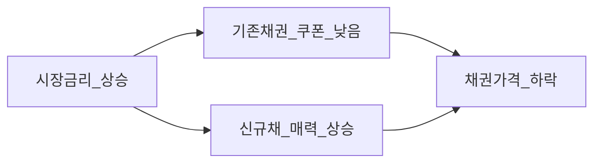
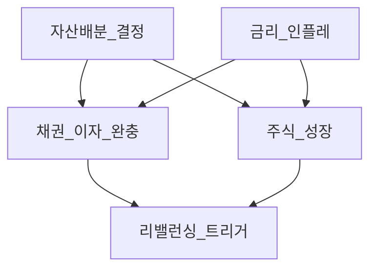

# 채권·고정수익 입문 — 이자·금리·듀레이션·포트 역할

> **면책**: 본 문서는 교육 목적이며, 특정 개인·법인에 대한 투자·세무·법률 자문이 아닙니다. 제도·세율·상품 조건은 변경될 수 있으므로 실행 전 공식 출처를 확인하세요.

## 메타

| 항목 | 내용 |
|------|------|
| 최종 검증일 | 2026-05-24 |
| 정책·법령 기준일 | 2025-12-31 확정, 2026 금리·세제 별도 표기 |
| 난이도 | L3 (Deep) — [READER-GUIDE](../docs/READER-GUIDE.md) |
| 예상 읽기 시간 | 50~65분 |
| 관련 bucket | Bucket 3 코어 (주식과 분산·완충) |

## 0. 이 편 읽기 전 (5분)

| 항목 | 내용 |
|------|------|
| **난이도** | L3 (Deep) — [READER-GUIDE §L등급](../docs/READER-GUIDE.md) |
| **선수** | [거시경제](../02-economics/macroeconomics-basics.md), [복리](../01-foundations/compound-interest-and-time-value.md) |
| **이번 편에서 쓰는 기호** | 본문 §4·§4a 표 참고 |
| **복습 한 줄** | — |

> **심화 편**: 본문 입문 후 [채권 심화](bonds-fixed-income-deep.md)에서 듀레이션·컨벡시티·신용 스프레드를 이어서 읽는다.
## TL;DR

1. **채권**은 돈을 빌려주고 **쿠폰(이자)** 과 만기 **원금 상환**을 약속받는 **채권자** 지위다.
2. **시장금리↑ → 기존 채권 가격↓** (새 채권이 더 매력적).
3. 코어 포트에서 주식과 **낮은·음의 상관**으로 변동성 완충 **목적** (항상 수익 보장 아님).
4. 입문자는 **채권 ETF**로 듀레이션·신용·비용을 한 번에 보는 경우가 많다.
5. 비중은 [자산배분](../04-portfolio/asset-allocation.md)·[거시](../02-economics/macroeconomics-basics.md)와 함께 정한다.

---

## 1. 한 줄 정의 + 왜 중요한가
!!! info "YTM (Yield to Maturity)"
    채권 만기수익률(IRR 근사).

!!! info "ETF"
    지수·자산 **바구니**를 한 종목처럼 거래

**정의**: **고정수익(Fixed Income)** 은 계약된 **현금흐름(이자·원금)** 이 중심인 자산군으로, **국채·지방채·회사채·채권 ETF·MMF** 등이 포함된다.

**왜 중요한가**: “주식만으로 10년”은 **낙폭·회복 기간**이 길 수 있다. 채권은 **이자 수입**과 **주식과의 상관**으로 포트를 완만하게 만드는 **교육적 역할**이 있다. 다만 금리·인플레 국면에서는 채권도 **손실**할 수 있음(2022 유형).

---

## 2. 선수 지식 / 이후 읽을 것

**선수**:
- [거시경제](../02-economics/macroeconomics-basics.md) — 금리·인플레
- [복리](../01-foundations/compound-interest-and-time-value.md)

**이후**:
- [자산배분](../04-portfolio/asset-allocation.md)
- [지역 분산](../04-portfolio/geographic-diversification.md)
- [ETF](etf-index-funds.md)
- [리밸런싱](../04-portfolio/rebalancing-and-dca.md)
- [ISA](../06-korea-policy/isa.md) — 채권 ETF 보유 가능

---

## 3. 직관·비유

**정기예금과 비슷하지만**: 예금은 (한도 내) **원금·이자 약속**이 강하다. 채권을 **만기 전에 팔면** 시장금리 때문에 **가격이 변한다**.

**할인 쿠폰**: 10% 쿠폰 채권을 샀는데 새 채권이 12%를 주면, 내 채권을 **싸게** 팔아야 구매자가 산다 → **가격 하락**.

**완충 패드**: 주식이 롤러코스터면 채권은 **일부 구간에서** 충격을 흡수하는 패드 — 패드도 얇으면(듀레이션 0에 가까움) 효과가 작다.

**2022형 함정**: 금리·인플레가 동시에 오르면 주식·채권이 **함께** 하락할 수 있다. “채권 넣으면 항상 안전”은 **역사적 경향**이지 법칙이 아니다. 그래서 채권 비중은 **듀레이션·신용**을 낮추거나, [비상금](../01-foundations/emergency-fund.md)은 예금·단기로 **분리**하는 교육 프레임이 있다.

**채권 ETF가 입문에 유리한 이유**: 개별 국채·회사채는 **최소 거래 단위·호가**가 두껍다. ETF는 **소액·분할 매수**가 쉽고 듀레이션·신용이 **한 줄 요약**된다. 대신 ETF도 **가격 변동**이 있다 — 예금과 혼동하지 말 것.

**리밸런싱 연결**: 주식이 크게 오르면 포트 내 비중이 어긋난다. 채권을 **매도해 주식을 사는** 대신, 규칙에 따라 **주식 일부를 채권으로** 옮기면 고점 추격을 줄이는 **기계적** 행동이 된다 — [rebalancing](../04-portfolio/rebalancing-and-dca.md).

---

## 4. 정식 개념·용어

| 용어 | 한글 | English | 정의 |
|------|------|---------|------|
| 액면가 | 액면 | Par value | 상환 기준 **원금** 표시 |
| 쿠폰 | 표면이자율 | Coupon rate | 액면 대비 **연 이자율** |
| 만기 | 만기 | Maturity | 원금 상환일 |
| YTM | 만기수익률 | Yield to maturity | 보유·만기 시 **내부수익률** 근사 |
| 듀레이션 | 듀레이션 | Duration | 금리 1%p 변화 시 가격 **민감도** |
| 신용스프레드 | 스프레드 | Credit spread | 국챠 대비 **추가 수익**(위험 보상) |
| 신용등급 | 등급 | Credit rating | 부도·등급 하락 **위험** 지표 |
| 채권 ETF | 채권 ETF | Bond ETF | 채권 바스켓을 **주식처럼** 거래 |

### 4a. 핵심 용어 (본문 등장 순)

> 복습용. 정의는 §4 본표·[glossary](../00-roadmap/glossary.md)·본문 `!!! info` 박스.

| 용어 | 한 줄 | 관련 이론 | glossary |
|------|-------|-----------|----------|
| 액면가 | 상환 기준 **원금** 표시 | §4 | [glossary](../00-roadmap/glossary.md#액면가) |
| 쿠폰 | 액면 대비 **연 이자율** | §4 | [glossary](../00-roadmap/glossary.md#쿠폰) |
| 만기 | 원금 상환일 | §4 | [glossary](../00-roadmap/glossary.md#만기) |
| YTM | 보유·만기 시 **내부수익률** 근사 | §4 | [glossary](../00-roadmap/glossary.md#ytm) |
| 듀레이션 | 금리 1%p 변화 시 가격 **민감도** | §4 | [glossary](../00-roadmap/glossary.md#듀레이션) |
| 신용스프레드 | 국챠 대비 **추가 수익** | §4 | [glossary](../00-roadmap/glossary.md#신용스프레드) |
| 신용등급 | 부도·등급 하락 **위험** 지표 | §4 | [glossary](../00-roadmap/glossary.md#신용등급) |
| 채권 ETF | 채권 바스켓을 **주식처럼** 거래 | §4 | [glossary](../00-roadmap/glossary.md#채권-etf) |

---

## 5. 메커니즘

### 5.1 금리와 가격 (역방향)

### 5.2 포트폴리오에서의 역할

| 채권 유형 | 신용 | 금리 민감 | 대표 용도 (교육) |
|-----------|------|-----------|------------------|
| 단기 국채·MMF | 최고 | 낮음 | **현금 대체**에 가깝 |
| 중기 국채 | 최고 | 중간 | 코어 **완충** |
| 장기 국채 | 최고 | **높음** | 금리 베팅에 가까움 |
| 회사채 | 기업 | 중~높 | **스프레드** 수익, 신용 리스크 |
| 해외채 | 국가·기업 | + **환율** | [지역 분산](../04-portfolio/geographic-diversification.md) |

---

## 6. 수식·모델

**가격 변동 근사** (수정 듀레이션):

| 기호 | 이름 | 이 식에서 의미 |
|    ------    | ------ | 위 식의 ------ |
| \(r\) | 할인율·수익률 | 기간당 이자·요구수익률 |
| \(n\) | 기간 | 연·월 등 복리·할인에 쓰는 횟수 |
| \(PV\) | 현재가치 | 오늘 시점으로 환산한 금액 |
| \(FV\) | 미래가치 | 미래 시점의 목표·결과 금액 |

\[
\frac{\Delta P}{P} \approx -D_{\text{mod}} \times \Delta y
\]

**읽는 법**: **Delta**와 **P**의 관계를 위 식으로 쓴다. 경제·재무 해석은 변수표 「이 식에서 의미」와 [DEPTH-STANDARD](../docs/DEPTH-STANDARD.md) 기호 예제를 맞춘다.
- \(D_{\text{mod}}\): 수정 듀레이션(년), \(\Delta y\): 수익률 변화(%)  
- 예: \(D=7\), 금리 +1%p → 가격 약 **−7%**

**쿠폰 지급** (단순, 연 1회):

| 기호 | 이름 | 이 식에서 의미 |
|    ------    | ------ | 위 식의 ------ |
| \(r\) | 할인율·수익률 | 기간당 이자·요구수익률 |
| \(n\) | 기간 | 연·월 등 복리·할인에 쓰는 횟수 |
| \(PV\) | 현재가치 | 오늘 시점으로 환산한 금액 |

\[
\text{연 이자} = \text{액면} \times \text{쿠폰율}
\]

**읽는 법**: **r**와 **n**의 관계를 위 식으로 쓴다. 경제·재무 해석은 변수표 「이 식에서 의미」와 [DEPTH-STANDARD](../docs/DEPTH-STANDARD.md) 기호 예제를 맞춘다.**실질 수익** (근사): YTM − 기대 인플레 — [거시](../02-economics/macroeconomics-basics.md)

**60/40 포트** (교육용): 주식 60% + 채권 40% — 역사적 완충 **경향** 있으나 **보장 없음**

### 6.1 신용등급·스프레드 (교육)

| 등급 구간 | 의미 (단순) | 스프레드 |
|-----------|-------------|----------|
| AAA~AA | 투자적격 상단 | 좁음 |
| BBB | 투자적격 하단 | 중간 |
| BB 이하 | 투기적 | **넓음** — 경기 악화 시 확대 |

회사채 ETF는 **한 종목 부도**보다 **포트폴리오 스프레드** 변화가 핵심.

### 6.2 인플레이션 연동채 (TIPs 개념)

원금·쿠폰이 물가에 연동 — **실질** 구매력 보호 **시도**. 국내서도 인플레 연동 상품·ETF가 있으나 유동성·보수는 상품별 확인.

---

 **포트폴리오 스프레드** 변화가 핵심.

### 6.2 인플레이션 연동채 (TIPs 개념)

원금·쿠폰이 물가에 연동 — **실질** 구매력 보호 **시도**. 국내서도 인플레 연동 상품·ETF가 있으나 유동성·보수는 상품별 확인.

---

## 7. 한국 적용

### 7.1 2025년 기준 (확정·일반적 맥락)

| 상품 | 특징 | 확인 사항 |
|    ------    | ------ | 위 식의 ------ |
| **국고채** | 무위험에 가까운 벤치 | 만기·금리 |
| **회사채·금융채** | 스프레드 | 등급·업종 |
| **채권 ETF** (KODEX 등) | 분산·유동성 | **듀레이션·TER·추적** |
| **예금·적금** | 원금 보장(한도) | [비상금](../01-foundations/emergency-fund.md) |
| **ISA** | 채권 ETF 포함 가능 | [isa](../06-korea-policy/isa.md) |

### 7.2 2026년 전망 (비약정)

| 항목 | 2025 | 2026 (확인 필요) |
|    ------    | ------ | 위 식의 ------ |
| 한·미 금리 | [거시](../02-economics/macroeconomics-basics.md) | 인하 속도에 따라 **채권 가격** 변동 |
| 인플레 | CPI 추이 | 실질수익 |
| ISA 세제 | 현행 | 개정 시 after-tax 비교 |

**법·정책 근거**: 국고채 발행, 금융투자협회 ETF 공시, 국세청 이자·배당 — [sources.md](../references/sources.md)

### 7.3 코어 포트 채권 비중 가이드 (교육, 비약정)

| 투자자 프로필 (가상) | 주식 | 채권 | 메모 |
|----------------------|------|------|------|
| 공격적·장기 | 80~90% | 10~20% | 낙폭 감수 |
| 균형 | 60~70% | 30~40% | 60/40 근처 |
| 보수·단기 목표 | 40~50% | 50~60% | 성장 제한 |

[time-horizon-and-buckets](../04-portfolio/time-horizon-and-buckets.md)와 **일치**시킬 것.

---

## 8. 숫자 예제 (가상)

> 모든 금액·상품명은 가상입니다.

### 예제 1: 금리 상승과 채권 ETF (가상)

| 항목 | 값 (가상) |
|------|-----------|
| 채권 ETF 평균 듀레이션 | 7년 |
| 시장금리 변화 | +1.0%p |
| ETF 가격 변화(근사) | **약 −7%** |
| 동기간 주식 ETF | −12% |

**해석**: 채권도 **손실** 가능 — “무위험” 아님.

### 예제 2: 60/40 vs 100% 주식 (가상, 1년)

| 포트 | 주식 | 채권 | 합성 수익 (가상) |
| A | 100% | 0% | −18% |
| B | 60% | 40% | −11.2% |

**해석**: 하락장 **낙폭 완화** 목적 — 상승장에서는 B가 **언더퍼폼**할 수 있음.

### 예제 3: 예금 vs 채권 ETF (가상)

| | 원금 보장 | 1년 명목 (가상) | 중도 해지·매도 |
|---|-----------|-----------------|----------------|
| 예금 (한도 내) | O | 3.0% | 이자 감액 |
| 단기 국채 ETF | X | 4.0% | 시장가 변동 **작음** |
| 장기 국채 ETF | X | −2% (금리↑) | 변동 **큼** |

### 예제 4: 금리 인하 국면 리밸런싱 (가상)

| 시점 | 10년 국채 ETF (가상) | 행동 (교육) |
|------|----------------------|-------------|
| t0 | −6% (금리↑) | 주식 비중 초과 → **채권 매수** 검토 |
| t1 | +4% (금리↓) | 채권 비중 초과 → **주식 매수** 검토 |

[rebalancing](../04-portfolio/rebalancing-and-dca.md) — 감정이 아닌 **규칙**.

### 예제 5: 회사채 스프레드 확대 (가상)

| | 국채 YTM | BBB 회사채 YTM | 스프레드 |
|---|----------|----------------|----------|
| 경기 좋음 | 3.0% | 4.2% | 1.2%p |
| 경기 악화 | 3.5% | 6.0% | 2.5%p |

회사채 ETF는 **가격 하락**·YTM 상승 — 신용 리스크 프리미엄.

---

## 9. FAQ

**Q1. 금리 오를 때 채권을 사야 하나?**  
**A.** 가격은 떨어지지만 **YTM은 올라감**. 장기 **분산·리밸런싱** 관점에서는 비중 유지·점진 매수 논의. 단기 **타이밍**은 어렵다.

**Q2. 예금만 있으면 되지 않나?**  
**A.** 예금은 **유동성·원금**에 강함. 장기 **실질수익·인플레** 대응은 채권·주식과 **역할 분담**. [비상금](../01-foundations/emergency-fund.md) vs [코어](../04-portfolio/core-satellite-framework.md)

**Q3. QQQ만 있으면 되나?**  
**A.** 교육 프레임: **집중** 리스크. [ETF](etf-index-funds.md) 코어 + 채권·지역 분산.

**Q4. 해외 채권 ETF는?**  
**A.** **환율** 노출. 환헷지 상품 vs 비헷지 — [geographic](../04-portfolio/geographic-diversification.md)

**Q5. DB 퇴직연금에 채권 ETF 넣나?**  
**A.** **DB는 본인 매매 불가.** DC·IRP·ISA에서 설계. → [db-pension](../06-korea-policy/db-pension.md)

**Q6. 채권 = 절대 안전?**  
**A.** **아니다.** 금리·신용·인플레·환율 리스크. 회사채는 **부도** 가능(드물어도).

**Q7. 듀레이션은 길수록 좋나?**  
**A.** 금리 하락 기대 시 **가격 탄력**↑, 금리 상승 시 **손실**↑. 코어 완충은 **중단기**가 흔한 선택.

**Q8. ISA에 채권 ETF?**  
**A.** 가능. 3년·비과세·한도와 함께 [isa](../06-korea-policy/isa.md)·[account-map](../06-korea-policy/tax/account-product-tax-map.md).

**Q9. MMF·머니마켓 ETF는?**  
**A.** **현금에 가까움** — [emergency-fund](../01-foundations/emergency-fund.md).

**Q10. 인플레 5%·국채 YTM 3%?**  
**A.** 실질 약 −2%p — [macro](../02-economics/macroeconomics-basics.md).

**Q11. 청년도약과 채권 ETF?**  
**A.** 제도 다름 — [youth-leap](../06-korea-policy/youth-leap-account.md).

**Q12. 레버리지 채권 ETF?**  
**A.** 코어 비권장 — 금리 민감 증폭. [leveraged-etf](../04-portfolio/leveraged-etf-qqq-qld.md) 변동성 교훈과 동일 프레임.

---

## 10. 함정·리스크·한계

**금리·신용·인플레 삼중 축**: 금리만 보면 국채 ETF를, 신용만 보면 회사채 고수익을, 인플레만 보면 물가연동채를 고르게 된다. 코어 채권 슬롯은 **목적(완충 vs 수익)** 을 먼저 정하고 [asset-allocation](../04-portfolio/asset-allocation.md) 비중에 넣는다. 단기 목표 자금(1~2년 내 사용)은 [비상금](../01-foundations/emergency-fund.md)처럼 **예금·단기**에 두고 장기 코어 채권과 섞지 않는 것이 교육 프레임이다.

- “채권 = 무위험” **오해**  
- **장기국채** 과다 → 금리 민감 과다  
- 주식·채권 **동시 하락** 국면 무시  
- 채권 ETF **보수·듀레이션** 미확인  
- 회사채 **등급·업종** 집중  
- 세금·ISA 규칙 **미확인**

---

**Q. 실무에서는?**  
교과서 식·기호를 그대로 적용하기 전에 **수수료·세금·데이터 시점**을 분리한다. 숫자는 [DEPTH-STANDARD](../docs/DEPTH-STANDARD.md)처럼 기호만 먼저 맞추고, 법령·시장 수치는 §8 표·외부 출처로 갱신한다.

## 11. 심화 읽기

- [references/sources.md](../references/sources.md)  
- [거시경제](../02-economics/macroeconomics-basics.md)  
- [자산배분](../04-portfolio/asset-allocation.md)  
- [ETF](etf-index-funds.md)  
- [부채와 이자](../01-foundations/debt-and-interest.md)

### 11.1 채권 ETF due diligence (체크리스트)

상품명만 보고 사지 말고 ETF 공시에서: **평균 만기·수정 듀레이션**, **신용등급 분포**, **TER**, **추적 지수**, **분배금 주기**, **AUM·거래대금**을 표로 적는다. [ISA](../06-korea-policy/isa.md) 보유 시 **3년** 규칙과 함께 기록.

### 11.2 주식-only 포트와 비교 (교육)

| 지표 (가상, 20년 역사 단순화) | 100% 주식 | 60/40 |
|------------------------------|-----------|-------|
| 최대 낙폭 (가상) | −50%p | −35%p |
| 연복리 (가상) | 9% | 7.5% |

숫자는 **가상** — 목적은 “낙폭 vs 수익” **트레이드오프** 인지.

---

## 12. 스스로 점검 퀴즈

1. 시장금리가 오르면 기존 채권 가격은?  
2. 듀레이션이 10이고 금리가 0.5%p 오르면 가격 변화(근사)는?  
3. 코어에 채권을 넣는 주된 교육적 이유는?  
4. 예금과 채권 ETF의 원금 보장 차이는?  
5. DB 가입자가 직접 국채 ETF를 사는 것이 일반적인가?  
6. 2022형 함정이란 무엇을 가리키는가(한 줄)?

??? note "정답 힌트"

    1. 하락 · 2. 약 −5% · 3. 분산·변동성 완충(보장 아님) · 4. 예금 한도 내 보장 vs ETF 시장가 변동 · 5. 아니오 · 6. 주식·채권 동시 하락 가능

**L3 완료**: [TEMPLATE](../docs/TEMPLATE.md)·검증일 2026-05-24 — [macro](../02-economics/macroeconomics-basics.md)와 짝지어 읽기. [02-economics README](README.md) 다음 권장.

**한 페이지 요약**: 채권=이자+원금 약속·가격 변동 | 금리↑→가격↓ | 듀레이션=민감도 | 코어=완충(보장×) | ETF로 듀레이션·신용 한눈에 | 예금=단기·비상금 | 2022=주식·채권 동반하락 가능 | DB 직접매매×.

**읽기 후 액션 (가상)**: (1) [asset-allocation](../04-portfolio/asset-allocation.md)에서 목표 주식·채권 % 적기 (2) 보유 또는 관심 **채권 ETF** 1개의 수정 듀레이션·TER 조사 (3) [macro](../02-economics/macroeconomics-basics.md) §6.1 수익률 곡선 뉴스 1건 번역 (4) 비상금은 [emergency-fund](../01-foundations/emergency-fund.md)와 분리 확인.

**채권·주식 상관 (교육)**: 장기적으로 낮은·음의 상관이 **기대**되나, 인플레·긴축 동시 국면에서는 **양의 상관**도 가능. “채권 30%면 안전”이 아니라 **듀레이션·신용·비중 규칙**이 안전장치다.

**Q9. MMF·머니마켓 ETF는 채권인가?**  
**A.** **현금에 가까운** 고정수익. 코어 **완충**보다 [비상금](../01-foundations/emergency-fund.md)·단기 슬롯.

**Q10. 인플레 5%인데 국채 3% YTM이면?**  
**A.** **실질** 약 −2%p — [거시](../02-economics/macroeconomics-basics.md) 실질금리. 물가연동·주식·실물자산 논의와 연결.