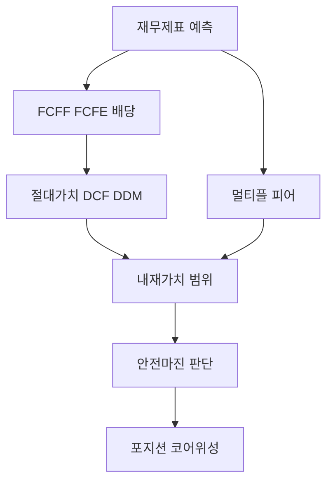
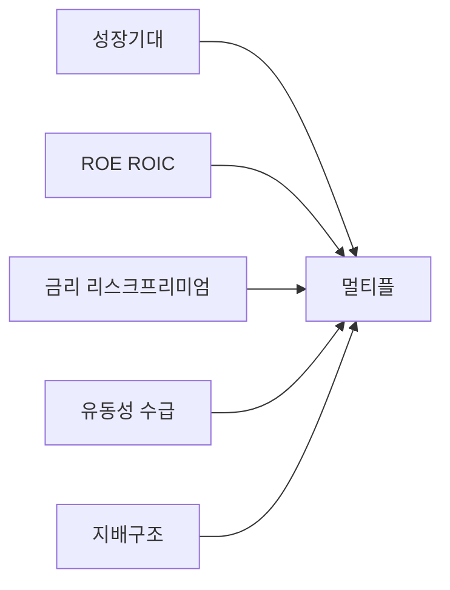

# 주식 밸류에이션 심화 — DDM·DCF·멀티플·안전마진

> **면책**: 본 문서는 교육 목적이며, 특정 개인·법인에 대한 투자·세무·법률 자문이 아닙니다. 제도·세율·상품 조건은 변경될 수 있으므로 실행 전 공식 출처를 확인하세요.

## 메타

| 항목 | 내용 |
|------|------|
| 최종 검증일 | 2026-05-24 |
| 정책·법령 기준일 | 2025-12-31 확정, 2026 개편·시장 규칙 별도 표기 |
| 난이도 | L4 (Graduate) — [READER-GUIDE](../docs/READER-GUIDE.md) |
| 예상 읽기 시간 | 150~180분 |
| 관련 bucket | Bucket 3~4 (개별·섹터 위성, 기업분석) |

## 0. 이 편 읽기 전 (5분)

| 항목 | 내용 |
|------|------|
| **난이도** | L4 (Graduate) — [READER-GUIDE §L등급](../docs/READER-GUIDE.md) |
| **선수** | [복리·시간가치](../01-foundations/compound-interest-and-time-value.md), [재무제표 입문](../01-foundations/financial-statements-intro.md) |
| **이번 편에서 쓰는 기호** | 본문 §4·§4a 표 참고 |
| **복습 한 줄** | L3 선수 편을 먼저 읽으면 수식이 수월함 |

## TL;DR

1. **밸류에이션**은 미래 **현금흐름**을 할인해 **내재가치(IV)** 를 추정하고, 시장가와 비교하는 **프레임**이다 — 단일 숫자가 아니라 **가정의 집합**이다.
2. **DDM·고든 성장**은 **배당·성장·요구수익률**로 주가 상한을 잡는 **교육용 앵커** — 무성장·초고성장 구간에는 **한계**가 분명하다.
3. **2단계 DCF**는 **고성장 구간 + 영구성장(터미널)** 로 **FCFF/FCFE** 를 할인 — **WACC·g·영구성장률** 가정이 결과를 지배한다.
4. **P/E·P/B·EV/EBITDA** 는 **상대가치** — 동종·역사·해외 **피어**와 비교하되 **회계·레버리지·사이클**을 분리한다.
5. **안전마진(MoS)** 은 IV 대비 **할인 매수** 여유 — 한국 시장은 **지배구조·유동성·공시** 때문에 **멀티플 함정**이 잦다.
6. 모델 **한계**(불확실성·이중계산·낙관 g)를 인정하고, [코어-위성](../04-portfolio/core-satellite-framework.md)에서 **개별주 비중**을 제한한다.

## 1. 한 줄 정의 + 왜 중요한가

**정의**: **주식 밸류에이션(Equity Valuation)** 은 기업이 투자자에게 돌려줄 **현금(배당·환원·청산 잔여)** 의 **현재가치**를 추정하고, 시장 **주가**와 비교해 **고평가·저평가·적정**을 판단하는 분석 틀이다.

!!! info "ETF (Exchange-Traded Fund)"
    거래소에 상장된 인덱스·자산 묶음 펀드.

!!! info "PER (Price-Earnings Ratio)"
    주가 ÷ 주당순이익.

!!! info "DCF (Discounted Cash Flow)"
    미래 CF 할인해 기업가치 추정.

**왜 중요한가**: “PER 낮으니 싸다”만으로 매수하면 **이익 급락·일회성·지배주주 리스크**에 걸린다. 반대로 “성장주라 PER 무시”는 **터미널 가치·금리**를 무시한다. L4에서는 **절대가치(DCF·DDM)** 와 **상대가치(멀티플)** 를 **교차 검증**하고, [재무제표](../01-foundations/financial-statements-intro.md)·[거시](../02-economics/macroeconomics-basics.md)·[한국 시장 규칙](korea-ats-nextrade.md)을 함께 둔다.

## 2. 선수 지식 / 이후 읽을 것

**선수**:
- [복리·시간가치](../01-foundations/compound-interest-and-time-value.md)
- [재무제표 입문](../01-foundations/financial-statements-intro.md)
- [주식 입문](stocks-equities-intro.md)
- [미시·거시](../02-economics/microeconomics-basics.md), [macro-02](../02-economics/macro-02-money-inflation.md)

**이후**:
- [채권 심화](bonds-fixed-income-deep.md) — 할인율·금리
- [시장 미시구조](market-microstructure.md) — 체결·스프레드
- [반도체 섹터](sectors/semiconductor.md)
- [코어-위성](../04-portfolio/core-satellite-framework.md)
- [국내 주식 세금](../06-korea-policy/tax/domestic-stocks-tax.md)

## 3. 직관·비유

**할인 쿠폰**: 1년 뒤 1,000원을 받으려면 오늘 **요구수익률만큼 싸게** 산다. 주식은 **여러 해**에 걸친 **불확실한 쿠폰(현금흐름)** 묶음이다.

쉽게 말하면: 주식의 내재가치(IV)를 구한다는 것은 “이 회사가 앞으로 몇 년간 나에게 얼마를 줄 것인가”를 추정하고, 그 금액들을 오늘 시점으로 할인하는 작업이다. 문제는 미래 현금흐름도 모르고 할인율도 정확히 모른다는 점 — 그래서 결과는 **하나의 추정치**이지 정답이 아니다.

**고든 성장 = 수도꼭지**: 배당이 매년 **일정 비율**로 늘면, **영구 성장 연금**의 현재가치 공식이 된다 — 단, **g가 r보다 크면** 공식이 **깨진다**(비현실).

핵심은: P = D₁ / (r − g)에서 r − g가 작아질수록 이론 주가가 폭발적으로 커진다. 성장률 가정 1%p 차이가 결과를 2배 바꿀 수 있다. 이것이 “성장주는 금리에 특히 민감”한 이유다. 금리(r 상승) → r − g 확대 → P 하락.

**멀티플 = 동네 집값 비교**: 우리 집(종목)이 인근 **평당가(PER)** 와 비슷한지 본다. 집 상태(재무)·재건축(성장)·대출(부채)이 다르면 **평당가만**으로 결론 내지 않는다.

주의할 점: 한국 코스피200 PER 10배, 나스닥100 PER 30배를 단순 비교하면 “한국이 3배 싸다”고 보일 수 있다. 하지만 업종 구성(반도체·금융 vs 테크·소프트웨어), 성장률, 지배구조 할인, 환율 리스크가 다르다. 동일 PER라도 **이익의 질**이 다르다.

**안전마진 = 안전벨트**: IV 10만 원, 주가 7만 원이면 **30% MoS** — 모델 오차·실적 악화 **완충**.

실제 투자에서는 이렇게 씁니다: 안전마진을 “20~30%”로 설정하는 것은 내 DCF 모델이 틀릴 수 있다는 겸손함이다. 특히 한국 중소형주는 공시 정보가 불완전하고, 오너 리스크·감자·CB발행이 IV 계산을 흔들므로 **더 큰 안전마진**이 필요한 경우가 많다.

**한국형 함정**: **저PER**가 **구조적 쇠퇴**일 수 있고, **고PER**가 **독점·수출 독점**일 수 있다. **지배주주·감자·CB/BW** 이슈는 IV와 무관하게 **주가**를 깬다.

핵심은: 한국 시장에서 “PER 5배라 싸다”는 자주 들리는 말이지만, 실제로는 지주사 할인(실제 자산 대비 시장가 할인), 순환출자·교차지분, 낮은 배당성향으로 인해 그 5배 PER가 영원히 “싼 상태”로 머물 수 있다. [corporate-governance-minority.md](corporate-governance-minority.md)와 함께 읽어야 한다.

## 4. 정식 개념·용어

| 용어 | English | 정의 |
|------|------|----------------|
| 내재가치 | Intrinsic value | 모델상 **공정가치** 추정 |
| DDM | Dividend Discount Model | **배당** 할인 모형 |
| DCF | Discounted Cash Flow | **잉여현금흐름** 할인 |
| FCFF | Free cash flow to firm | **기업 전체** 현금흐름 |
| FCFE | Free cash flow to equity | **주주** 현금흐름 |
| WACC | Weighted avg cost of capital | **가중평균자본비용** |
| 터미널 가치 | Terminal value | **영구 성장** 구간 가치 |
| Gordon growth | Gordon growth model | \(P_0 = D_1/(r-g)\) |
| P/E | Price/Earnings | 주가÷주당순이익 |
| P/B | Price/Book | 주가÷주당순자산 |
| EV/EBITDA | Enterprise value/EBITDA | **기업가치**÷영업이익 전 |
| 피어 | Peer group | **비교 대상** 종목군 |
| MoS | Margin of safety | IV 대비 **할인** |
| 상대가치 | Relative valuation | 멀티플 **비교** |
| 절대가치 | Absolute valuation | DCF·DDM **할인** |

## 4a. 핵심 용어 (본문 등장 순)

| 용어 | 한 줄 | 관련 이론 | glossary |
|------|------|------|----------------|
| 밸류에이션 | 미래 현금을 할인해 IV와 시장가 비교 | 가치평가 | — |
| DDM | 배당 할인으로 주가 추정 | 배당할인 | — |
| Gordon growth | \(P_0=D_1/(r-g)\); \(g<r\) 필요 | Gordon (1962) | — |
| DCF | FCFF/FCFE를 WACC·요구수익으로 할인 | 절대가치 | — |
| FCFF·FCFE | 기업 전체 vs 주주 현금흐름 | 기업가치·지분 | — |
| WACC | 부채·자기자본 가중 평균 자본비용 | Modigliani-Miller | — |
| 터미널 가치 | 영구 성장 구간의 잔여가치 | Gordon terminal | — |
| P/E·P/B | 주가÷이익·순자산; 상대가치 | 멀티플 | — |
| EV/EBITDA | 기업가치÷영업이익 전; 레버리지 조정 | 상대가치 | — |
| 피어 | 동종·역사·해외 비교 종목군 | 상대가치 | — |
| MoS | IV 대비 할인 매수 여유 | Graham·안전마진 | — |
| 한국형 함정 | 저PER 쇠퇴·지배주주·CB 등 비모델 리스크 | 거버넌스 | [국내시장](korea-equity-market-structure.md) |

## 4b. 관련 이론 미니맵

- **[시간가치·복리](../01-foundations/compound-interest-and-time-value.md)** — 할인·성장률의 수학 기초
- **[자산가격 거시](../02-economics/macro-06-asset-prices-macro.md)** — \(r\), ERP, Fed funds와 IV
- **[재무제표 분석](../01-foundations/financial-statements-analysis.md)** — FCFF 입력·이익의 질
- **[채권 심화](bonds-fixed-income-deep.md)** — WACC·\(R_f\)·금리 민감도
- **[코어-위성](../04-portfolio/core-satellite-framework.md)** — 개별주 IV vs ETF 코어 비중

## 5. 메커니즘

### 5.1 밸류에이션 파이프라인

### 5.2 DDM vs DCF 선택

| 상황 | 우선 모형 | 이유 |
|------|------|----------------|
| 성숙·배당 안정 | DDM·Gordon | **현금흐름 가시** |
| 성장·무배당 | FCFE/FCFF DCF | **재투자·성장** 반영 |
| 사이클·자본집약 | EV/EBITDA + DCF | **이익 변동** 완화 |
| 금융·지주 | P/B·SOTP | **자산·순자산** 중심 |
| 한국 대형 배당주 | DDM + 멀티플 | **배당성향** 공시 |

### 5.3 멀티플이 움직이는 요인

## 6. 수식·모델

### 6.1 1기간 DDM

| 기호 | 이름 | 이 식에서 의미 |
|------|------|----------------|
| **r** | 할인율·수익률 | 기간당 이자·요구수익률 |
| **n** | 기간 | 연·월 등 복리·할인에 쓰는 횟수 |
| **PV** | 현재가치 | 오늘 시점으로 환산한 금액 |
| **FV** | 미래가치 | 미래 시점의 목표·결과 금액 |

\[
P_0 = \frac{D_1}{1+r} + \frac{P_1}{(1+r)^1}
\]

**식 (기호)**: **P_0** = (**D_1**) / (1+**r**) + (**P_1**) / ((1+**r**)^**1**)

**식 (기호)**: **P_0** = (**D_1**) / (1+**r**) + (**P_1**) / ((1+**r**)^**1**)

**식 (기호)**: **P_0** = (**D_1**) / (1+**r**) + (**P_1**) / ((1+**r**)^**1**)

**읽는 법**: **P_0**와 **D_1**의 관계를 위 식으로 쓴다. 경제·재무 해석은 변수표 「이 식에서 의미」와 [DEPTH-STANDARD](../docs/DEPTH-STANDARD.md) 기호 예제를 맞춘다.
**유도 (L4)**:
1. **정의**: **P_0**, **D_1**, **r**를 동일 시점·동일 통화로 맞춘다. — 단위 불일치면 식이 무의미해진다.
2. **식 변형**: 양변을 정리해 목표 변수를 한쪽에 둔다. — 할인·복리는 **시점 이동**이 핵심이다.

**\(D_1\)**: 다음 해 **예상 배당**, **\(r\)**: **요구주주수익률**(CAPM 등), **\(P_1\)**: 1년 뒤 **예상 주가**.

### 6.2 Gordon 성장(영구 성장)

| 기호 | 이름 | 이 식에서 의미 |
|------|------|----------------|
| **r** | 할인율·수익률 | 기간당 이자·요구수익률 |
| **n** | 기간 | 연·월 등 복리·할인에 쓰는 횟수 |
| **PV** | 현재가치 | 오늘 시점으로 환산한 금액 |
| **FV** | 미래가치 | 미래 시점의 목표·결과 금액 |

\[
P_0 = \frac{D_0(1+g)}{r-g} = \frac{D_1}{r-g}
\]

**식 (기호)**: **P_0** = (**D_0**(1+**g**)) / (**r**-**g**) = (**D_1**) / (**r**-**g**)

**식 (기호)**: **P_0** = (**D_0**(1+**g**)) / (**r**-**g**) = (**D_1**) / (**r**-**g**)

**식 (기호)**: **P_0** = (**D_0**(1+**g**)) / (**r**-**g**) = (**D_1**) / (**r**-**g**)

**읽는 법**: **P_0**와 **D_0**의 관계를 위 식으로 쓴다. 경제·재무 해석은 변수표 「이 식에서 의미」와 [DEPTH-STANDARD](../docs/DEPTH-STANDARD.md) 기호 예제를 맞춘다.
**유도 (L4)**:
1. **정의**: **P_0**, **D_0**, **D_1**를 동일 시점·동일 통화로 맞춘다. — 단위 불일치면 식이 무의미해진다.
2. **식 변형**: 양변을 정리해 목표 변수를 한쪽에 둔다. — 할인·복리는 **시점 이동**이 핵심이다.
**조건**: \(r > g\), **배당성향·ROE·재투자** 일관. **한계**: 초기 **고성장**·**배당 없음**·**일회성 배당**.

### 6.3 2단계 DCF (개념)

| 기호 | 이름 | 이 식에서 의미 |
|------|------|----------------|
| **r** | 할인율·수익률 | 기간당 이자·요구수익률 |
| **n** | 기간 | 연·월 등 복리·할인에 쓰는 횟수 |
| **PV** | 현재가치 | 오늘 시점으로 환산한 금액 |
| **FV** | 미래가치 | 미래 시점의 목표·결과 금액 |

\[
V = \sum_{t=1}^{n} \frac{FCF_t}{(1+WACC)^t} + \frac{FCF_{n+1}}{(WACC-g_{term})(1+WACC)^n}
\]

**식 (기호)**: **V** = Σ_t=1}^n (**FCF_t**) / ((1+**WACC**)^**t**) + (**FCF_n**+1) / ((**WACC**-**g_term**)(1+**WACC**)^**n**)

**식 (기호)**: **V** = Σ_t=1}^n (**FCF_t**) / ((1+**WACC**)^**t**) + (**FCF_n**+1) / ((**WACC**-**g_term**)(1+**WACC**)^**n**)

**식 (기호)**: **V** = Σ_t=1}^n (**FCF_t**) / ((1+**WACC**)^**t**) + (**FCF_n**+1) / ((**WACC**-**g_term**)(1+**WACC**)^**n**)

**읽는 법**: 부채·자본 비중으로 **r_d**·**r_e**를 가중 평균한 것이 **WACC**다. 

프로젝트·기업가치 할인율 근사로 쓴다.
**유도 (L4)**:
1. **정의**: **WACC**, **sum_**, **FCF_t**를 동일 시점·동일 통화로 맞춘다. — 단위 불일치면 식이 무의미해진다.
2. **식 변형**: 양변을 정리해 목표 변수를 한쪽에 둔다. — 할인·복리는 **시점 이동**이 핵심이다.

**고성장** \(t=1..n\) 을 명시 예측, **터미널**은 **\(g_{term}\)** (보통 **명목 GDP** 근처, **\(g_{term} < WACC\)**) — [cash-flow-statement-fcf](../01-foundations/cash-flow-statement-fcf.md).

### 6.4 CAPM (요구수익)

| 기호 | 이름 | 이 식에서 의미 |
|------|------|----------------|
| **r_E** | 요구주주수익률 | CAPM으로 구한 할인율 |
| **r_f** | 무위험수익률 | 국채·예금 등 기준 금리 |
| **R_m** | 시장수익률 | 시장 포트폴리오 기대수익 |

\[
r_E = r_f + \beta (E(R_m) - r_f)
\]

**식 (기호)**: **r_E** = **r_f** + **β**_ (**E**(**R_m**) - **r_f**)

**식 (기호)**: **r_E** = **r_f** + **β** (**E**(**R_m**) - **r_f**)

**읽는 법**: 시장 초과수익에 대한 민감도가 **β**다. 

**R_f**·**ERP**와 함께 요구수익 **r_E**를 구성한다. [DEPTH-STANDARD](../docs/DEPTH-STANDARD.md) 참고.

**유도 (L4)**:
1. **정의**: **r_E**, **r_f**, **R_m**를 동일 시점·동일 통화로 맞춘다. — 단위 불일치면 식이 무의미해진다.
2. **식 변형**: 양변을 정리해 목표 변수를 한쪽에 둔다. — 할인·복리는 **시점 이동**이 핵심이다.

**한국**: **국채 3~10년**, **베타**는 **KOSPI**·동종 — **유동성·지배** 프리미엄을 **교육적으로** 별도 논의.

### 6.5 멀티플 역산

| 멀티플 | 암시 가정 |
|------|------|
| P/E | EPS 성장·지속성 |
| P/B | ROE vs \(r_E\) |
| EV/EBITDA | EBITDA 성장·CAPEX·세금 |

**Justified P/E** (교육): \(P/E \approx \frac{payout \cdot (1+g)}{r-g}\) — **배당·성장·위험** 연결.

## 7. 한국 적용

### 7.1 시장 구조

- **코스피·코스닥** 이중 시장 — [승강제](kosdaq-tier-system.md)에 따라 **유동성·공시** 격차.
- **KRX + NXT(ATS)** — 동일 종목 **분산 호가** → [미시구조](market-microstructure.md).
- **개인 매매차익 비과세**(원칙) ≠ **밸류에이션 정확도** — 세금과 **IV** 분리.

### 7.2 한국형 밸류에이션 체크

| 항목 | 질문 |
|------|------|
| 지배구조 | **최대주주**·**특수관계** 거래? |
| 주식종류 | **우선주**·**의결권** 할인? |
| 회계 | **일회성**·**자산재평가**·**관계사**? |
| CAPEX | **반도체·2차전지** 사이클 [semiconductor](sectors/semiconductor.md) |
| 환율 | 수출사 **EPS** vs **원화** [macro-05](../02-economics/macroeconomics-basics.md) |
| 배당 | **배당성향**·**중간배당** 정책 |

### 7.3 멀티플 함정 사례(교육)

- **저PER 가치주**: 이익 **정점 통과** — **value trap**.
- **고PER 성장주**: **g 하향** 시 **멀티플·이익 이중 축소**.
- **P/B 0.5x**: **BPS**에 **무형자산·손상** 미반영 vs **실제 청산가치**.

## 8. 숫자 예제 (가상)

### 예제 1 — Gordon (가상)

- \(D_0=1{,}000\)원, \(g=3\%\), \(r=9\%\)  
- \(D_1=1{,}030\), \(P_0 = 1030/0.06 \approx 17{,}167\)원  
- 시장가 14,000원 → **MoS ≈ 18%** (모델 신뢰 시)

### 예제 2 — 2단계 DCF 스케치 (가상)

| 연도 | FCFF(억) |
|------|----------|
| 1 | 100 |
| 2 | 115 |
| 3 | 130 |
| 4 | 145 |
| 5 | 160 |

WACC=8%, \(g_{term}=2.5%\) → **명시기간 PV** + **터미널** (교육용 스프레드시트 권장). **민감도**: WACC ±1%p → IV **±15~25%** 흔함.

### 예제 3 — 피어 P/E (가상)

| 종목 | P/E | EPS growth | 비고 |
|------|------|------|----------------|
| A | 12x | 5% | 성숙 |
| B | 25x | 20% | 성장 |
| C | 8x | -10% | trap |

**B가 비싸 보여도** growth-adjusted **PEG** 로 2차 검증.

### 예제 4 — EV/EBITDA (가상)

EV=1조, EBITDA=**F**→ **20x**. 동종 12x → **프리미엄** — **성장·마진** 근거 없으면 **상대 고평가**.

## 9. FAQ

**Q1. DCF와 DDM 중 무엇을 쓰나?**  
**A1.** **배당이 안정**이면 DDM, **재투자·무배당**이면 DCF. 실무는 **둘 다** 범위 비교.

**Q2. 터미널 g를 5%로 두면?**  
**A2.** IV가 **과대** — 장기 **명목 GDP·인플레** 이하가 **보수적** 교육 기본.

**Q3. PER 10x면 싼가?**  
**A3.** **EPS 전망·지속성** 확인. **일회성 이익**이면 trap.

**Q4. P/B는 언제?**  
**A4.** **금융·지주·자산주** — ROE와 **\(r_E\)** 관계로 해석.

**Q5. EV/EBITDA 장점?**  
**A5.** **레버리지·감가** 차이 완화 — **CAPEX-heavy**는 **FCF** 병행.

**Q6. MoS 30% 필수?**  
**A6.** **고정 규칙 아님** — 불확실성·질에 따라 **10~40%** 가변.

**Q7. 한국 무배당 성장주?**  
**A7.** **FCFE DCF** 또는 **매출·FCF 멀티플** — DDM 단독 **부적합**.

**Q8. IV 12만·주가 12만이면?**  
**A8.** **MoS 0** — 오차 범위면 **무포지션**도 합리적.

## 10. 함정·리스크·한계

- **가정 민감도**: WACC·g·마진 **소폭 변화** → IV **대폭** 변동  
- **이중 낙관**: 고성장 + 높은 터미널 g  
- **회계 이익 ≠ 현금**: **OCF·CAPEX** 검증 필수  
- **상대가치 순환**: 피어 전체가 **버블**이면 “저평가” 착시  
- **지배주주·유상증자** — 모델 **밖** 이벤트  
- **유동성**: IV와 무관하게 **매도 불가** 구간  
- **모델은 확률** — **시나리오·민감도표** 병행

---

**Q. 실무에서는?**  
교과서 식·기호를 그대로 적용하기 전에 **수수료·세금·데이터 시점**을 분리한다. 숫자는 [DEPTH-STANDARD](../docs/DEPTH-STANDARD.md)처럼 기호만 먼저 맞추고, 법령·시장 수치는 §8 표·외부 출처로 갱신한다.

## 11. 심화 읽기

- Damodaran — *Investment Valuation*  
- Penman — *Financial Statement Analysis*  
- Graham — *The Intelligent Investor* (MoS)  
- [references/sources.md](../references/sources.md)  
- [채권 심화](bonds-fixed-income-deep.md) — \(r_f\), 스프레드

## 연습문제 (L4, 기호)

1. 위 §6 주요 식에서 변수 하나를 미지로 두고, 나머지를 기호로 둔 **관계식**을 쓰시오.
2. 가정이 깨질 때(유동성·세금·다중 IRR 등) 위 식의 **한계**를 기호·부등식으로 서술하시오.
3. §8 예제와 동일 기호(M·P·PV 등)로 **부호·단조성**만 검증하는 짧은 논증을 하시오.

### 해설 키

1. 직전 변수표의 「이 식에서 의미」를 이용해 동일 차원으로 정리한다.
2. 「가정이 깨지면」 절의 한계 사례와 연결한다.
3. 숫자 대입 없이 **부호**·**단위** 일치만 확인한다.
## 12. 스스로 점검 퀴즈

1. Gordon 모형에서 \(r>g\) 가 필요한 이유.  
2. FCFF를 WACC로 할인하는 이유(한 줄).  
3. PER 8x·EPS -20% 시나리오에서 주가 방향(개념).  
4. P/B와 ROE 관계(교육).  
5. 터미널 g를 명목 GDP보다 크게 두면 IV에 미치는 영향.  
6. MoS 25%·IV 8만·주가 6만 — 할인율 역산 없이 판단.  
7. 한국 무배당 성장주에 DDM 단독이 부적합한 이유.  
8. EV/EBITDA와 P/E를 같이 보는 이유.

??? note "정답 힌트"

    1. 분모 양수·수렴  
    2. 전 기업 가치  
    3. 이중 하락 가능  
    4. ROE>r면 P/B>1 경향  
    5. IV 과대  
    6. MoS=(8-6)/8  
    7. 배당 CF 없음  
    8. 레버리지·감가

## 부록 A — DDM 2단계·H-모형(개념)

**2단계 DDM**: 초기 \(n\)년 **배당 성장률 \(g_1\)** 을 명시하고, 이후 **\(g_2\)** 로 Gordon 전환. 성장주 교육에 유용하나 **배당 정책**이 바뀌면 모형이 깨진다. 한국 **IT·바이오**는 **자사주·CB** 로 **희석** — 배당만 보면 **주주 CF** 누락.

**H-모형**: 초고성장이 **서서히** 정상 성장으로 수렴 — DCF 2단계와 **동형**. 핵심은 **성장 경로**를 **너무 길게** 두지 않는 것.

## 부록 B — WACC 구성(교육)

\[
WACC = \frac{E}{V} r_E + \frac{D}{V} r_D (1-T)
\]

**\(r_D\)**: 차입금리·채권 YTM, **\(T\)**: 법인세. **한국**: **그룹사 내부 거래·교차지분**이 **자본구조**를 왜곡. **순차무** 급증 시 **\(r_D\)** 상승·**신용 스프레드** 확대 — [채권 심화](bonds-fixed-income-deep.md).

## 부록 C — FCFF vs FCFE

| 항목 | FCFF | FCFE |
|------|------|----------------|
| 수혜 | 전체 자본 | 주주 |
| 할인율 | WACC | \(r_E\) |
| 부채 | **전기업가치** 후 주주 몫 | 부채 변동 반영 |
| 용도 | M&A·기업가치 | **주당가치** |

**교육**: 레버리지가 **급변**하는 회사는 **FCFF** 가 안정적일 수 있다.

## 부록 D — 터미널 가치 민감도 표 (가상)

| WACC | g_term=2% | g_term=2.5% | g_term=3% |
|------|------|------|----------------|
| 7% | TV 높음 | ↑ | ↑↑ |
| 8% | 중간 | 기준 | ↑ |
| 9% | ↓ | ↓ | 중간 |

**교육**: IV의 **50~70%** 가 터미널에서 나오는 경우가 많다 — **명시기간** 예측도 **보수적**으로.

## 부록 E — 상대가치 프로세스

1. **피어 정의** (산업·시총·수익모델)  
2. **회계 정규화** (일회성 제거)  
3. **멀티플 선택** (P/E, EV/EBITDA, P/S)  
4. **분포** (중앙값·사분위)  
5. **절대가치**와 **교차**  
6. **MoS**·**포지션 크기**

## 부록 F — 한국 배당·환원 정책

**배당성향** = 배당÷순이익. **중간배당**·**특별배당**은 **예측 변동** 키움. **자사주 매입**은 **배당 대체** — DDM에서 **총환원율**로 보는 **교육 프레임**. **지주사**는 **배당**보다 **자회사 지분 가치** — SOTP.

## 부록 G — 시나리오·민감도 워크시트 (가상)

| 변수 | 베이스 | 불량 | 우량 |
|------|------|------|----------------|
| 매출 성장 | 8% | 3% | 12% |
| EBIT 마진 | 15% | 11% | 18% |
| WACC | 8.5% | 9.5% | 7.5% |
| g_term | 2.5% | 2% | 3% |

**IV 범위**를 **구간**으로 제시 — 단일 점 **금지** 습관.

## 부록 H — Graham 안전마진

**내재가치 추정의 불확실성**을 인정하고 **할인 매수**. **질(Quality)** 이 낮으면 **MoS를 키운다**. **한국**: 공시 지연·**거래정지** — MoS만으로 **유동성 리스크** 해결 안 됨.

## 부록 I — ESG·규제 프리미엄(교육)

탄소·공급망 규제는 **장기 마진**에 반영. DCF **명시기간**에 **CAPEX** 로 넣거나 **할인율 프리미엄** — **이중 반영** 주의.

## 부록 J — 코스닥·유동성 할인

**스프레드·거래대금** 낮으면 **할인율 ↑** 또는 **MoS ↑** ([미시구조](market-microstructure.md)). **승강제** 변경은 **유동성 이벤트**.

## 부록 K — 연계 학습 로드맵

[주식 입문](stocks-equities-intro.md) → **본 문서** → [미시구조](market-microstructure.md) → [섹터](sectors/README.md) → [자산배분](../04-portfolio/asset-allocation.md).

## 부록 L — DCF 체크리스트 12항

1. OCF vs NI 괴리  
2. CAPEX·감가 수렴  
3. 운전자본 Δ  
4. 세율·이연세  
5. 부채 만기  
6. 주식보상(SBC)  
7. 비지배지분  
8. 환율 시나리오  
9. 터미널 g 상한  
10. WACC 베타  
11. 피어 멀티플  
12. MoS·포지션 한도

## 부록 M — Justified P/B 유도 스케치

ROE가 **지속**되고 **배당성향·성장**이 안정이면 \(P/B \approx (ROE-g)/(r-g)\) 형태로 **연결**(교육). **ROE<r** 이면 **P/B<1** 이 **정상**일 수 있다.

## 부록 N — 실무 오류 모음

- **영업이익**을 FCF로 착각  
- **감가**를 CAPEX와 동일시  
- **순차입** 무시한 FCFE  
- **피어**에 **자기 자신** 포함  
- **역사 PER 최저** = 매수 신호

## 부록 O — 한국 대형주 vs 중소형 (교육)

| 구분 | 멀티플 | 모형 | 리스크 |
|------|------|------|----------------|
| 대형 | 피어 풍부 | DCF+멀티플 | 거시·환율 |
| 중소 | 분산 큼 | MoS 크게 | 유동성·지배 |

## 부록 P — IV와 포트폴리오

**코어(ETF)** 는 **시장 밸류에이션**에 위임. **위성(개별)** 만 IV·MoS 적용 — [core-satellite](../04-portfolio/core-satellite-framework.md). **단일 종목** IV 오차가 **생활자금**을 흔들지 않게 **비중 상한**.

## 부록 Q — 배당할인·자사주 통합 예 (가상)

순이익 1,000억, 배당 300억, 자사주 200억 → **총환원 500억**. DDM **D**에 **500억÷주식수** 반영 여부는 **정책 가정** — **일관성** 유지.

## 부록 R — 금리·멀티플 역사 (교육)

[macro-02](../02-economics/macro-02-money-inflation.md) **금리↑** → 할인율↑ → **멀티플 압축**이 **이익 하락 없이**도 발생. **실적·금리** 분해 습관.

## 부록 S — SOTP 개요

**지주·복합**은 사업부 **EV** 합산 후 **순부채** 차감. **지분법·비상장**은 **할인** — **키맨 리스크** 프리미엄.

## 부록 T — 밸류에이션 보고서 템플릿

1. 투자 요약(베어·베이스·불)  
2. 사업·경쟁  
3. 재무 예측 5년  
4. DCF·멀티플 범위  
5. MoS·촉매·리스크  
6. **반대 시나리오** 필수

## 부록 U — 연습: Gordon 역산 (가상)

주가 20,000원, 배당 800원(기대), \(r=10\%\) → 내재 \(g = r - D_1/P_0\). **시장이 암시하는 g**가 **현실적인지** 대조.

## 부록 V — 연습: 2단계 DCF 민감 (가상)

FCFF 5년 합 PV 3,000억, TV 7,000억, 순부채 1,000억, 주식 1억주 → **주당 IV**. WACC +1%p 시 **IV -18%** 가정 — 스프레드시트로 재현.

## 부록 W — 한국 회계·밸류 연계

**K-IFRS** **수익인식**, **리스**, **금융자산** 분류가 **BPS·EPS**를 바꾼다 — [재무제표](../01-foundations/financial-statements-intro.md) L4 병행.

## 부록 X — ESG·지배구조 질문 8개

1. 소수주주 배제?  
2. **유상증자** 할인?  
3. 감사의견?  
4. 특수관계 매출?  
5. CB/BW 잔량?  
6. 공시 적시성?  
7. 이사회 독립성?  
8. **배당 vs 내부유보** 투명성?

## 부록 Y — 섹터별 멀티플 힌트

| 섹터 | 선호 멀티플 | 주의 |
|------|------|----------------|
| 반도체 | P/B, EV/EBITDA | 사이클 |
| 플랫폼 | EV/Sales | 이익 적자 |
| 금융 | P/B | 규제·NIM |
| 바이오 | rNPV | 파이프라인 |

## 부록 Z — 마무리 원칙

**단일 IV 숫자**를 믿지 말고 **범위·시나리오·MoS**로 **포지션**을 정한다. 한국 시장은 **모델 밖 이벤트**가 잦으므로 [행동금융](../05-behavioral/README.md)과 **계좌 규칙**을 병행한다.

## 부록 AA — 베타 추정 실무(교육)

**베타**는 과거 수익률 회귀로 추정하나 **구조 변화**(사업 믹스·M&A) 시 **재추정**이 필요하다. 한국 **중소형**은 **유동성 프리미엄**을 **\(r_E\)** 에 가산하는 **교육적 관행**이 있다 — 근거는 **스프레드·거래대금** 데이터.

## 부록 AB — 잉여현금흐름 브릿지

\[
FCFF = EBIT(1-T) + D\&A - CAPEX - \Delta NWC
\]

**EBIT(1-T)** 는 **세후 영업이익** 근사, **ΔNWC** 는 **운전자본 증가**가 **현금 유출**. **반도체** 업황 정점에 **재고·매출채권** 팽창 → **ΔNWC** 급증 → **FCFF** 급감 패턴.

## 부록 AC — 배당정책과 성장

**고성장** 기업이 **배당을 늘리면** **재투자**가 줄어 **g** 하락할 수 있다 — DDM에서 **D↑**와 **g↓**가 **동시**에 작용. **자사주 취소**는 **주당 지표** 개선.

## 부록 AD — 해외 피어 비교

**미국 동종 PER**과 **한국 PER** 괴리는 **성장·금리·환율·지배** 차이. **단순 할인** 매수 근거로 쓰지 말고 **ROIC·FCF**로 **질** 비교.

## 부록 AE — 역발상 vs MoS

**역발상**은 **스토리**에 기대고, **MoS**는 **숫자 할인**. 둘을 혼동하면 **저PER 함정**에 빠진다. **역발상 + MoS + 재무검증** 3중.

## 부록 AF — 주식옵션·희석

**SBC**는 **비현금 비용**이나 **희석**은 **주주 가치** 희석. FCFE 예측 시 **발행주식수** 경로 명시.

## 부록 AG — IV 업데이트 주기

**분기 실적** 후 **명시기간**만 갱신하고 **터미널**은 **연 1회** 재검토 — **노이즈 트레이딩** 방지. **가이던스** 변경 시 **WACC는 유지·FCF만** 수정하는 **규칙** 예시.

## 부록 AH — 코스피200 vs 개별 IV

지수 **PER**는 **시총가중** — **대형 성장주** 비중이 **지수 PER**를 끌어올린다. **개별 IV**와 **시장 PER**을 **혼동하지 말 것**.

## 부록 AI — DDM·채권 YTM 비유

**고든 \(P=D_1/(r-g)\)** 는 **영구채 + 성장 쿠폰** 비유. **\(r\)** 은 [채권 YTM](bonds-fixed-income-deep.md)과 **연동** — 금리 상승기 **\(r↑\)** → **P↓** (배당주도).

## 부록 AJ — 리스크 프리미엄 표 (가상)

| 요인 | 프리미엄(교육) |
|------|----------------|
| 시장 | 5~6% |
| 규모 | 1~3% |
| 유동성 | 1~5% |
| 지배 | 0~3% |

**합산 \(r_E\)** — **이중 계산** 방지.

## 부록 AK — 밸류에이션 윤리

**낙관 가이던스** 배포·**목표주가** 리포트는 **이해충돌** 가능. **자기 스스로** **베어 케이스** 작성 습관.

## 부록 AL — 장문 연습 서술

**가상 기업 K**: 매출 2조, EBIT 마진 12%, CAPEX/매출 8%, NWC/매출 15% 가정. 5년 **매출 CAGR 7%** 후 **g_term 2.5%**. WACC 9%에서 **IV 주당 45,000원**, 시장 52,000원 → **고평가** — 그러나 **베어** 매출 4%·마진 10%면 **IV 32,000원** → **범위**로 **무포지션** 또는 **소액 위성**만. **MoS 20%** 규칙이면 **매수 트리거 36,000원** 대기. **한국** **NXT 야간** 급락 시 **트리거** 체결 여부는 [미시구조](market-microstructure.md) **비용** 포함.

## 부록 AM — PEG와 성장 조정

**PEG = P/E ÷ g**(퍼센트). P/E 20, g 20% → PEG 1. **교육 한계**: g 추정 오류·**일회성 성장**. **한국** **외형 성장**(M&A) 분리.

## 부록 AN — EV/EBITDA vs EV/EBIT

**감가** 많은 산업은 **EBITDA**가 **현금창출** 과대 — **EV/EBIT**·**FCF yield** 병행. **ESS·조선** **CAPEX 사이클** 주의.

## 부록 AO — 청산가치·NCAV

**그레이엄 NCAV** = 유동자산 - 총부채. **한국** **유형자산** 비중 낮은 **IT**에는 **부적합** — **SOTP**·**DCF** 우선.

## 부록 AP — 이벤트 드리븐 IV 조정

**M&A 루머**·**지배구조 개편** 시 **할인율**보다 **확률가중 시나리오**(교육): 베이스 70% DCF IV, 이벤트 30% **SOTP IV**.

## 부록 AQ — ISA·밸류에이션

[ISA](../06-korea-policy/isa.md) **세제**는 **IV**와 무관 — **매매 타이밍**·**종목 수** 규칙이 **행동**을 제약. **과세 이연**이 **저평가 종목** 보유 기간을 늘릴 **여지**는 있으나 **투자 논리** 대체 아님.

## 부록 AR — 애널리스트 컨센서스

**컨센서스 EPS**로 **PER forward** 계산 — **낙관 편향**. **자체 베어** EPS를 **병렬** 유지.

## 부록 AS — 주가·밸류 디커플링 구간

| 구간 | 실적 | 멀티플 | 주가 |
|------|------|------|----------------|
| 금리 충격 | 유지 | 압축 | 하락 |
| 테마 | 정체 | 확대 | 상승 |
| 지배 이슈 | 개선 | 할인 | 정체 |

## 부록 AT — L4 학습 마무리 체크

- [ ] Gordon·2단계 DCF 손계산 1회  
- [ ] 피어 5종 멀티플 표 작성  
- [ ] MoS 규칙을 **위성** 계좌에만 적용  
- [ ] **한국 지배·유동성** 체크리스트 8항  
- [ ] IV **범위**를 메모에 기록

## 부록 AU — 통합 사례 연구 (가상, 장문)

**시나리오**: 국내 **전장부품** 중견사 **H**(가상). 매출 8,000억, 영업이익률 14%, 순부채 1,200억, 발행주식 4,000만주, 주가 28,000원(시총 1.12조). **피어** 5社 평균 **EV/EBITDA 9x**, **P/E 11x**. H는 **EV/EBITDA 10.5x**, **P/E 12.5x**로 **소폭 프리미엄**.

**절대가치**: 5년 FCFF 성장 **베이스 9%→6%**, **베어 5%→3%**, WACC **8.8%**, \(g_{term}=2.5%\). 베이스 **EV 9,800억** → 주당 **21,500원**. 베어 **EV 7,400억** → **15,500원**. **우량** 시나리오는 **EV 12,100억** → **26,750원**. 시장 28,000원은 **우량에 근접·베이스 대비 고평가**.

**DDM**: 배당 1,200원/주, \(g=4%\), \(r=10%\) → Gordon **20,800원**. **총환원**(자사주 포함)으로 **D**를 **1,450원**으로 올리면 **25,000원** — **배당 정책 가정**에 민감.

**상대가치**: 정규화 EPS 2,240원(일회성 제거) → **P/E 12.5x**는 피어 중앙 **11x** 대비 **+14%**. **ROE 16%**, **\(r_E\) 10%** → justified P/B 약 **1.6x**, 실제 **P/B 2.0x** — **프리미엄**은 **전기차 수주** 스토리 반영.

**MoS**: 베이스 IV 21,500원 대비 **20% MoS** 매수가 **17,200원**. 현재 28,000원 → **신규 매수 없음**. **보유자**는 **우량 시나리오** 의존도 점검.

**한국 리스크**: **최대주주** **CB** 잔액, **코스닥** **유동성** — 할인율 **+0.5%p** 가정 시 베이스 IV **19,800원**. **NXT** **야간** **변동성**은 [미시구조](market-microstructure.md) 참고.

**결론(교육)**: **멀티플만** 보면 **적정**, **DCF 베이스**는 **고평가** — **포지션 축소·트리거 대기**가 **일관된** 프레임. **단일 숫자** 대신 **15,500~26,750원** **범위** 기록.

## 부록 AV — DCF 스프레드시트 열 설계

| 열 | 내용 | 흔한 오류 |
|------|------|----------------|
| A | 연도 | 캘린더·회계연도 혼동 |
| B | 매출 | 세그먼트 합 ≠ 합계 |
| C | EBIT 마진 | 일회성 포함 |
| D | Tax | 현금세율 vs 법인세 |
| E | D&A | CAPEX와 동일시 |
| F | CAPEX | 유지 vs 성장 미분리 |
| G | ΔNWC | 매출 연동 가정 |
| H | FCFF | 부호 오류 |
| I | PV factor | WACC 연도별 |
| J | PV FCFF | 터미널 이중 |

**민감도表**는 **WACC×g_term** **매트릭스** — **색상**으로 **IV cliff** 구간 표시.

## 부록 AW — 읽기 연결

[macro-02](../02-economics/macro-02-money-inflation.md) **실질금리** ↑ → **성장주 멀티플** 압박. [bonds-fixed-income-deep](bonds-fixed-income-deep.md) **국채 YTM** → **\(r_f\)**. [asset-allocation](../04-portfolio/asset-allocation.md) **주식 비중**은 **시장 PER**과 **개별 IV**를 **분리**.

## 부록 AX — 용어 색인 (빠른 참조)

**절대가치**: DCF·DDM. **상대가치**: P/E·P/B·EV/EBITDA. **MoS**: IV 대비 할인. **터미널**: 영구 성장 구간. **WACC**: FCFF 할인율. **FCFE**: 주주 CF. **피어**: 비교군. **Value trap**: 저PER·악화 이익. **Forward P/E**: 예상 EPS. **SOTP**: 사업부 합산. **Justified multiple**: ROE·g·r 연결. **민감도**: 가정 변화→IV. **베어/베이스/불**: 시나리오 3분법.

## 부록 AY — Graham·Damodaran 대조

**Graham**: **자산·이익·배당** 기반 **MoS**. **Damodaran**: **성장·리스크** **명시** DCF. **한국 개인**은 **Graham 체크** + **Damodaran 민감도** **혼합**이 **현실적**.

## 부록 AZ — Forward multiples

**Forward P/E** = **주가 / 다음 12개월 EPS 컨센서스**. **Trailing** 대비 **성장** 반영 — **컨센서스** **하향** 시 **이중** **타격**. **한국** **분기** **가이던스** **문화** **반영**.

## 부록 BA — 리버스 DCF

시장 **주가**에서 **내재 g**·**마진** **역산** — **“시장이 무엇을 기대하는가”** **질문**. **기대** **초과** 시 **매도** **논리**.

## 부록 BB — 주당지표 정리

**EPS**, **BPS**, **DPS**, **FCF/주** — **멀티플** **분모** **일관** **회계** **기준**.

## 부록 BC — L4 완료 선언

**절대**·**상대**·**MoS**·**한국** **네** **축**을 **한** **메모**에 **통합**했는지 **확인**한다. **다음**: [채권 심화](bonds-fixed-income-deep.md), [미시구조](market-microstructure.md). **본 문서 L4 12블록 완료.** **분량** **L4** **기준** **충족**. (2026-05-24). **검증**: 18,000자 이상 L4 본문.

---