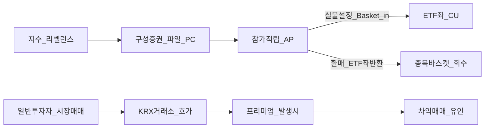
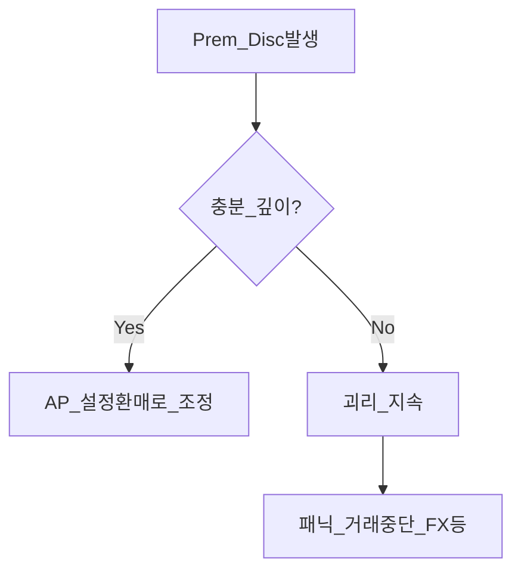
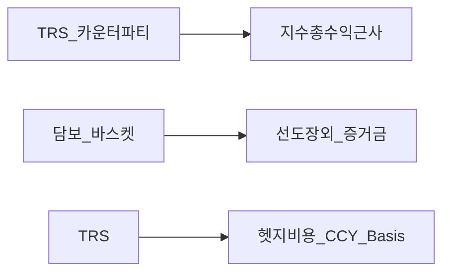

# ETF·인덱스 펀드 심화 — 지수 구성·AP·합성 리스크·추적오차

> **면책**: 본 문서는 교육 목적이며, 특정 개인·법인에 대한 투자·세무·법률 자문이 아닙니다. 제도·세율·상품 조건은 변경될 수 있으므로 실행 전 공식 간이투자설명서·집합투자규약·금융투자상품설명서·국세청 안내 등 공식 출처를 확인하세요.

## 메타

| 항목 | 내용 |
|------|------|
| 최종 검증일 | 2026-05-25 |
| 정책·법령 기준일 | 2025-12-31 확정, 2026 세제·시장 규칙 별도 표기 |
| 난이도 | L4 (Graduate) — [READER-GUIDE](../docs/READER-GUIDE.md) |
| 예상 읽기 시간 | 135~165분 |
| 관련 bucket | Bucket 3~4 (지수·실행품질·세금 계좌) |

## 0. 이 편 읽기 전 (5분)

| 항목 | 내용 |
|------|------|
| **난이도** | L4 (Graduate) — [READER-GUIDE §L등급](../docs/READER-GUIDE.md) |
| **선수** | [ETF·인덱스 펀드 입문](etf-index-funds.md), [채권 고정수입 심화](bonds-fixed-income-deep.md) |
| **이번 편에서 쓰는 기호** | 본문 §4·§4a 표 참고 |
| **복습 한 줄** | L3 선수 편을 먼저 읽으면 수식이 수월함 |

## TL;DR

1. **지수 비중**은 단순 “규모”가 아니라 **변동 가능 주식 조정 유통시총(플로트 조정)**·유동성·편입규칙이 합쳐진 결과다 — 같은 “시총가중”도 **방법론 차이로 지수 간 괴리**가 생길 수 있다.
2. **추적오차**의 주범은 **보수·현금 비중·리밸런싱 시차·샘플링·배당·원천공제·선물 롤 비용**(해당 시)처럼 “지수 수익률 정의 바깥”에서 온다.
3. **설정(Creation)·환매(Redemption)** 는 **참가적립자(AP)** 가 **실물 종목 바스켓 ↔ ETF좌 단위**로 스왑하며 NAV를 정렬시키는 **1차 교정 채널**이다 — **유동성**과 **프리미엄/디스카운트**를 이해하려면 AP가 필수축이다.
4. 시장가는 NAV 주변으로 **통상 수렴**하나 장중 패닉·**거래중단**(해외 기초)·**외환 헷지** 조건이 맞물리면 **괴리가 오래 버틸** 수 있다.
5. **합성 ETF**는 **스왑·파생으로 지수 노출을 복제** — 교육 목적으론 “비용 저렴해 보임 vs **카운터파티·담보·대용증권** 리스크”를 같은 줄에 놓아야 한다.
6. 한국 거래소 상장 ETF는 **[etf-index-funds.md](etf-index-funds.md) 입문** 위의 **헷지 O/X**, **TRS·KOSPI200 레버 인버스** 등 **복제 타입별 공시항목**까지 병행 확인하는 것을 권한다.

---

## 1. 한 줄 정의 + 왜 중요한가

!!! info "ETF"
    지수·자산 **바구니**를 한 종목처럼 거래

**정의**: **ETF 심화**란 패시브 상품 표면 아래 숨어 있는 **지수 방법론(시총·플로트·리밸런싱)**, **일간 운용(현금·대차·증권대여)·거래 비용**, **설정·환매 인프라**, **합성 스왑 구조**, **프리미엄/디스카운트**를 한 축으로 연결하여 “지수−펀드−투자자 체인”을 설명하는 학습 과제다.

!!! info "TER"
    연간 **총보수율** — 장기 복리에 영향

**왜 중요한가**: 같은 **테크 성장 ETF** 레이블이라도 **지수 제공자**(예: Nasdaq 100 vs modified market cap)·**헷지·비헷지**·**복제 레이어**(실물 vs 합성)가 다르면 **코로나 패닉, 엔 통화 헷지 깨짐, 2022 금리 충격** 같은 시기에 체감 성과 분산은 **자산 선택보다 방법론**에서 발생한다. 장기적으로는 **복리 차이**(TER 추적 패널티)가 크므로 코어 장기 적립형 투자자는 **실행 레이어(호가 스프레드·체결 패턴)** 까지 포함해야 [market-microstructure](market-microstructure.md)와 접점을 갖게 된다.

---

## 2. 선수 지식 / 이후 읽을 것

**선수**:
- [ETF·인덱스 펀드 입문](etf-index-funds.md)
- [채권 고정수입 심화](bonds-fixed-income-deep.md) — **듀레이션 개념**으로 채권형 ETF 접근 가능
- [시장 미시구조](market-microstructure.md) — 스프레드·체결
- 선택: [passive-vs-active](../04-portfolio/passive-vs-active.md), [account-product-tax-map](../06-korea-policy/tax/account-product-tax-map.md)

**이후**:
- [수익률 곡선 전략](yield-curve-strategies.md)
- [자산배분](../04-portfolio/asset-allocation.md), [리밸런싱·DCA](../04-portfolio/rebalancing-and-dca.md)
- 거시 묶음: [macro-02-money-inflation](../02-economics/macro-02-money-inflation.md)

---

## 3. 직관·비유

**수레 레일**: ETF는 종종 “패시브라 정해졌다”처럼 말하지만, 실제 레일에는 **두 갈래**가 겹친다. 하나는 지수 제공자가 정한 **정기 리밸런싱·재편**(분기 종가 기준 종종)이고, 다른 하나는 운용사가 일간으로 운영하는 **현금 버퍼·대차 매입·증권대여**(규약·내규 허용 범위) 레일이다. AP는 종종 레일 교차점처럼 **대형 스프레드를 메우며** 전체 레일 높낮이를 재조정한다.

**음식 레시피 vs 실물 주방**: 지수 레시피는 “양파 30%, 당근 70% 정확 재기”처럼 **규칙**을 말하지만 ETF 주방에서는 **양파 장이 막히면**(거래 불가 종목)·**양파 무게 줄이려면**(샘플링)·**외부 제빵**(스왑)으로 **근사 레시피**를 만들 수 있다 — 맛(**수익률 패턴**)은 거의 같아도 매일 차이(**추적오차**)는 난다.

**프리미엄/디스카운트 = 자판기 과금 차이**: 관리 가격표(NAV)·실제 카드 긁을 때 과금(**시세**)이 다르다면, 그 차이 중 구조적으로 설명 가능한 한도를 넘는 부분은 **경로 의존**이며 AP·시장 깊이 부족 또는 **패닉**에서 커진다.

---

## 4. 정식 개념·용어

| 용어 | 한글 지칭 | English | 교육용 정의 |
|------|-----------|---------|--------------|
| Free-float 조정 시총 | 변동 가능 주식 조정 | Free-float market cap | 교환·매각 제한 등 **외부 거래 불가 분**을 줄인 뒤의 시총 |
| 플로트 팩터 | 유통비율 적용 계수 | Float factor | 종목별 **거래 가능 주식분** 배율(지수 제공자 방법론에 따름) |
| Cap-weight | 시가총액 비중 비중법 | Capitalization weighting | (조정/비조정) 시총 비례로 구성종목 비중 결정 |
| Modified cap | 수정 시총 | Modified capitalization | 종목별 **상한**(cap)·**통합**(consolidated)·편입예외 같은 **후처리 규칙** |
| Full replication | 완전 복제 | Full replication | 지수 구성 **전종목**(제외 없이) 현물 매수 근사 |
| Sampling replication | 표본 복제 | Sampling | 지수를 **표본 종목 바스켓**으로 근사 — 비용 대비 미세 차이 발생 |
| TR vs PR | 배당 포함·제외 반환 | Total/Price Return | 같은 지수 패밀리라도 배당 처리·세금 처리가 다른 TR/PR 인덱스가 존재 |
| Tracking Error (TE) | 추적 편차 | Tracking error | 기간별 **추종 대상 대비 과거 수익률 차의 변동**(정의 따라 표준편차·MAE 등) |
| Tracking difference | 추적 차이 누적 | Tracking difference | 기간 표본 **연율 TER·패널티 누적**을 설명하기 쉬운 지표(공시 활용 사례) |
| Authorized Participant | 참가 적립 자격자 | Authorized participant | 설정·환매를 통해 바스켓을 조달·회수할 수 있는 **대형 회원**(구조상 핵심) |
| Creation Unit | 설정 단위 | Creation unit | AP가 신청 가능한 최소좌번호단위 종종 **수만좌**(상품별 상이, 공시 확인) |
| PCF | 구성증권·비중표 | Portfolio composition file | 일간 종가 기준 종목별수량·예상치**(전일종가 또는 VWAP 레퍼런스)** |
| NAV | 순자산가치 | NAV | 펀드 자산 순가치÷발행좌수(일종 **이론가**) |
| iNAV · IOPV | 장중 순자추정 | Intraday estimated NAV | 기초종목 시세로 **실시간 근사** — 상품·거래소에 따라 이름 상이 |
| Premium/Discount | 괴리 | Premium / discount | (시세−추정NAV 또는 NAV)/추정NAV |
| Securities lending | 증권 대여 | Securities lending | 일시적 종목 차입·대여로 **추가수익** — **카운터파티 리스크** 존재 |
| Synthetic ETF | 합성 상장 펀드 | Synthetic ETF | **총보수형 스왑(TRS)** 또는 파생 근거로 노출 제공 — 담보·상대방 집중 |
| Collateral substitute | 위탁증권 | Collateral/substitute basket | 합성 시 **별도 채번 자산**(국채·현금성) 분리 노출 검토 필요 |
| Withholding overlay | 원천징수 경로 레이어 | Dividend withholding | 해외 소득 **이중·단일 과세 레이어**가 실제 체류수익에 영향 — TR 지수≠현실 투자체인 |
| Futures roll cost | 만기 교체 비용 | Roll yield | 만기 교체 시선물 포지션 **슬라이드** 부담 가능 |
| Sampling error | 표본 편향 | Sampling error | 샘플과 지수 간 **종목 선택·교체** 결과 편향 |
| Dividend timing | 배당 간격 레그 | Dividend mismatch | 재투자 시차·통화 헷지·공시 간격 때문에 TR 대비 패널티 |
| Securities transaction tax | 증권거래세 | STT (한국) | 지수 레벨에서는 보통 포함 않은 **실제 비용**(국내 종목 포함 ETF) 검토 필요 |
| Authorized fund size | 증설·유동 상한 | Capacity | 지극히 큰 종목 포함 지수형에서 현물 조달 깊이 **용량 초과 패널티** |

### 4a. 핵심 용어 (본문 등장 순)

> 복습용. 정의는 §4 본표·[glossary](../00-roadmap/glossary.md)·본문 `!!! info` 박스.

| 용어 | 한 줄 | 관련 이론 | glossary |
|------|-------|-----------|----------|
| Free-float 조정 시총 | 변동 가능 주식 조정 | §4 | [glossary](../00-roadmap/glossary.md#free-float-조정-시총) |
| 플로트 팩터 | 유통비율 적용 계수 | §4 | [glossary](../00-roadmap/glossary.md#플로트-팩터) |
| Cap-weight | 시가총액 비중 비중법 | §4 | [glossary](../00-roadmap/glossary.md#cap-weight) |
| Modified cap | 수정 시총 | §4 | [glossary](../00-roadmap/glossary.md#modified-cap) |
| Full replication | 완전 복제 | §4 | [glossary](../00-roadmap/glossary.md#full-replication) |
| Sampling replication | 표본 복제 | §4 | [glossary](../00-roadmap/glossary.md#sampling-replication) |
| TR vs PR | 배당 포함·제외 반환 | §4 | [glossary](../00-roadmap/glossary.md#tr-vs-pr) |
| Tracking Error (TE) | 추적 편차 | §4 | [glossary](../00-roadmap/glossary.md#tracking-error) |
| Tracking difference | 추적 차이 누적 | §4 | [glossary](../00-roadmap/glossary.md#tracking-difference) |
| Authorized Participant | 참가 적립 자격자 | §4 | [glossary](../00-roadmap/glossary.md#authorized-participant) |
| Creation Unit | 설정 단위 | §4 | [glossary](../00-roadmap/glossary.md#creation-unit) |
| PCF | 구성증권·비중표 | §4 | [glossary](../00-roadmap/glossary.md#pcf) |
| NAV | 순자산가치 | §4 | [glossary](../00-roadmap/glossary.md#nav) |
| iNAV · IOPV | 장중 순자추정 | §4 | [glossary](../00-roadmap/glossary.md#inav-·-iopv) |
| Premium/Discount | 괴리 | §4 | [glossary](../00-roadmap/glossary.md#premium/discount) |

---

## 5. 메커니즘

### 5.1 지수 산술 레이어와 펀드 운용 레이어 분리

**지수**는 이론적 룰 세트(**분모·변동 플로트 업데이트·리밸런싱 시점 고정 또는 예고**)다. 반면 펀드는 **현실 제약**(거래량·증거금·정지종목)·**내규**를 통해 그 룰을 복원한다 — 그 사이 간극에서 **패시브≠제로 활성 운용**에 가까운 초미세 트레이드가 존재할 수 있다(법적 책임의 주체와 상품설명 참조).

### 5.2 AP를 통한 설정·환매(개념)

**교육 포인트**: AP는 “특별한 교역권한”처럼 그려도, 실무적으론 **대형 회원 레벨 거래 및 유동성 창출**이라는 제도 설계 속에 있다 — 개인에게 직접 열린 문처럼 표현되지만 사실 일반 채널 아님이 일반적이며 간이설명에서 **확인**한다.

### 5.3 시장가 − NAV 교정 채널

### 5.4 합성 복제(스왑) 구조 초개요

**카운터파티 디폴트**·**증거금·마진 규격** 변화 때 TRS 패널티가 발생할 수 있음은 합성 ETF 교육의 본류다.

---

## 6. 수식·모델

교육용 **분해식**(항목 존재·부호 상품 따라 상이):

| 기호 | 이름 | 이 식에서 의미 |
|------|------|----------------|
|  \(r_{\mathrm{ETF}\)  |  r_{\mathrm{ETF}  | 본문 §4·위 식 맥락 참고 |
|  \(r_{\mathrm{index}\)  |  r_{\mathrm{index}  | 본문 §4·위 식 맥락 참고 |
|  \((TR 또는 PR 규격)\)  |  (TR 또는 PR 규격)  | 본문 §4·위 식 맥락 참고 |
|  \(f_{\mathrm{TER}\)  |  f_{\mathrm{TER}  | 본문 §4·위 식 맥락 참고 |
|  \((연율 근사)\)  |  (연율 근사)  | 본문 §4·위 식 맥락 참고 |
|  \(c_{\mathrm{tx}\)  |  c_{\mathrm{tx}  | 본문 §4·위 식 맥락 참고 |
|  \((거래·스프레드·FX)\)  |  (거래·스프레드·FX)  | 본문 §4·위 식 맥락 참고 |
|  \(delta\)  |  delta  | 본문 §4·위 식 맥락 참고 |
\[
r_{\mathrm{ETF}} \approx r_{\mathrm{index}}^{\mathrm{(TR 또는 PR 규격)}} 
- f_{\mathrm{TER}}^{\mathrm{(연율 근사)}}
- c_{\mathrm{tx}}^{\mathrm{(거래·스프레드·FX)}}
- \delta_{\mathrm{cash}}
- \delta_{\mathrm{sample}}
- \delta_{\mathrm{tax/WHT}}
\]

**읽는 법**: 위 식의 기호는 바로 위 변수표와 같다. 숫자는 [DEPTH-STANDARD](../docs/DEPTH-STANDARD.md) 교육용 기호(M·P·PV 등)로 대입한다.
여기 \(\delta_{\mathrm{cash}}\)는 **현금 버퍼**·예탁금 수익·기준금리 스프레드, \(\delta_{\mathrm{tax/WHT}}\)는 **현지 원천**·외환 헷지 이자 비용, \(\delta_{\mathrm{sample}}\)은 **종목 교체 레그** 차이다.

**괴리율 교육 정의**(정의 따라 상이하지만 패턴 학습 목적):

| 기호 | 이름 | 이 식에서 의미 |
|------|------|----------------|
| \(r\) | 할인율·수익률 | 기간당 이자·요구수익률 |
| \(n\) | 기간 | 연·월 등 복리·할인에 쓰는 횟수 |
| \(PV\) | 현재가치 | 오늘 시점으로 환산한 금액 |

\[
\mathrm{premium}=\frac{P_{\mathrm{mkt}}- \widehat{NAV}}{ \widehat{NAV}}
\]

**읽는 법**: 위 식의 기호는 바로 위 변수표와 같다. 숫자는 [DEPTH-STANDARD](../docs/DEPTH-STANDARD.md) 교육용 기호(M·P·PV 등)로 대입한다.
\(\widehat{NAV}\)는 공시 IOPV 또는 운용사 추정 장중 순자추정치 — **종목 정지**(해외)·**통화 헷지** 구간에서는 추정 불확실도가 증폭된다.

---

## 7. 한국 적용

### 7.1 2025년 기준 요약 확정 교육 정보

한국 거래소 **상장 ETF**는 대개 **종목 브라우즈→간이설명서**에서 **복제 방법(실물·합성·혼합)**, **기초 지수 제공자 명**, **총보수 TER**, **기초 종목 헷지 O/X**(해외·통화 헷지)를 확인해야 한다 — 본 교육문서 숫자·세목은 사용자가 해당 시점 **PDF** 재확인을 전제한다.

| 체크 항목 | 개인에게 실질적인 이유 |
|----------|-----------------------|
| **플로트·시총 지수 레퍼런스** | 동일 이름의 “워드 ETF”처럼 지수 출처 차이 가능 |
| **TR vs PR 선택** | 배당 과세 레이어·재투자 모델이 다름 → 추적 패턴 레그 |
| **환헷지 vs 비헷지** | 장기복리 레벨 차이 장기 존재 가능(환율 회귀 속도 교육) |
| **지수 포함 상한규제** | 대형종목 과집중이 지수 수정규격으로 줄어들 가능 |
| **채권 ETF(iBoxx류)** | 수정듀레이션·만기 레벨 교육— [bonds-fixed-income-deep](bonds-fixed-income-deep.md) |
| **증권대여**(규약) | 소액이라도 교육자는 존재·한도 명시 존재 이해 필요 |
| **거래량·스프레드** | 장내 유동 부족 시 지수와 별개 패널티 |
| **해외 시간대 이격** | 본 시간대 프리미엄 지속 교육 장면 |

### 7.2 2026년 개편·시행 교육 대비(예시 프레임)

| 항목 | 2025 | 2026 (교육적 주의 표기) |
|------|------|-------------------------|
| 세제 디테일(배당·양도) | 과세 카테고리 계좌 맵 존재 | **국세청 연간 업데이트** 확인 필요 — 본 장세부 생략· [account-product-tax-map](../06-korea-policy/tax/account-product-tax-map.md) |
| 새 상장 테마 레버 펀드 | 일부 확대 | 간이설명 **일일 레버 교육**(일일 타깃) 별 문서 처리 |
| ESG 라벨·지속가능 라벨 | 용어 과잉 가능 | 라벨 ≠ 지수 방법론— **실제 포함 제외 규칙** PDF |

---

## 8. 숫자 예제 (가상)

> 모든 인물·수치·종목명은 **가상 교육**입니다. 현실에서는 공시값·IOPV 체커 이용.

### 예제 1 — 플로트 조정 후 비중 변화 교육

가상 회사 ABC의 **풀 플랫**(전체발행)·**플로트 80%**(내부지분 20%) 가정이다. 순수 시총가중이라면 포함 전 **시총 10조**(풀)·내부 불가 분 제외 시 실효 포함시총 **8조** 분모 기여 — 상대적으로 **변동 플로트 지수에서는 ‘비중 과대’ 교정**(내부지분 과잉 제거)·지수 산술 결과로 **종목 순위 교체**(아주 일부 국면) 가능 교육.

### 예제 2 — 추적패널티 산술 교육(연율)

가상 설정: 관찰연도에 **모 지수**(TR)·**실제 NAV기반 ETF 수익**차이 평균 **−0.28%**(연환산 단순) — 교육자는 간이설명서 **추적오차**(연별 표준편차)·**추적차이**(TR 대비 패널티) 차이 명시 존재를 함께 읽으며 “왜 같은 연도 라벨이라도 차이 표기 존재”를 이해하게 한다 — 본 장은 규격 상세 생략.

### 예제 3 — 설정·환매 이론 교육

 ETF 시세가 IOPV보다 일시 **2% 디스카운트**(가상 패닉) — 이론적으론 **AP가 디스카운트된 ETF 좌를 모아 환매**하고 바스켓 주식 현물 또는 동치 이익 채택을 통해 **헤지 패키지** 차익 교육(실제 헤지 규격·증거금·종목 교체 허오차는 간이설명 참조)— **실제 시장에서는 완조정 지연**(거래량·증거금) 가능 교육.

### 예제 4 — 합성 TRS 카운터파티 교육

가상: 운용사가 카운터파티 증거금 비율 **15%**(교육)에서 **35%**(스트레스)로 상향 — 교육자는 증거금 상승이 **운용 패널티·종목 교체 속도**(담보 재조정)·**TRS 스프레드**로 이어져 **예상 패널티** 존재를 이해.

### 예제 5 — 시간대 교육 레그

가상 거래 시간 이격 존재(미국 시간대 종가 vs 한국 시세)에서는 **IOPV 업데이트 주기**(상품설명)·**종목 정지 헤드라인** 때문에 괴리가 **종가 교정**(다음 현지 세션 시작)까지 이어져 **패턴 학습**(프리미엄 지속 교육) 가능.

---

## 9. FAQ

**Q1. 시가총액 비중이라면 무조건 “대형주 편향” 아닌가?**  
**A1.** 사실적으로 **네**지만 **변동 플로트 처리·종목 포함 상한** 룰 때문에 **표준 순수 단순시총**과 결과가 다르다는 점 교육.

**Q2. ‘동일 레이블’ 다른 상품 수익이 왜 갈라지나**  
**A2.** 지수 패밀리(TR/PR)·날짜·거래통화 헷지·샘플링·증권대여·원천·거래 비용 교체 차이 교육.

**Q3. 추적 오차 표준 편차 vs 연간 패널티를 동일하게 말하면 안되는 이유는?**  
**A3.** 통계량 vs 누적 성과 교육— 공시가 다를 때 **항목 이름** 차이 존재.

**Q4. 프리미엄이 높아도 무조건 사면 안된다는 교육?**  
**A4.** **비용 과대 지불 교육**— 단기 교정 기대 신호도 있으나 **개인 헤지 교육**과 혼동 주의— [microstructure](market-microstructure.md).

**Q5. 합성 ETF는 비용 무조건 낮아서 좋다?**  
**A5.** **상대방·담보·대체자산**(Substitute)·**종목 정지 교육 헤더** 때문에 위험이 이동— 상품별 교육.

**Q6. AP는 우리처럼 지정가로 ETF 살 수 있나?**  
**A6.** AP는 교육적으론 **설정·환매 패키지** 교역— 레일링 다름 일반 교육(간이설명 확인).

**Q7. 국내 상장 채권 ETF에도 증권대여 있나 교육?**  
**A7.** 상품별 **집약투자규약** 확인— 존재·한도 존재할 수 있으며 **수익·리스크** 동시 존재.

**Q8. TER 0.05%p 차이는 괜찮지 않나?**  
**A8.** 10~20년 수준 복리에서 **패널티 누적** 교육— 동시에 **통화 헷지·원천**이 종종 더 크다 교육.

**Q9. 선물 기반 레버 펀드는 지수 레벨 교육이 ETF와 동치인가**  
**A9.** **일간 리셋 교육**으로 경로 종속— 본 교육 심화에서는 **패스** 레이블 별 문서 교육.

**Q10. 한국 과세 때문에 TR 지수를 직접 못 따라가 보이지만 실패 아님?**  
**A10.** **세후 패턴 교육**— 지수 패밀리·거주자 규격을 함께 읽으며 **판단 프레임** 유지 교육.

---

## 10. 함정·리스크·한계

- 라벨(테마·워드)·지수 패밀리 혼동— **메서드 교육** 없이 과거 차트만 참조  
- **프리미엄 체결** 습관화— 변동 레짐 교육 패널티  
- 합성 구조 카운터파티 과소평가— **담보 자산 과잉 노출** 가능성 인지 과소평가  
- 국외 지수 패닉 **체결 교육·시간 교육** 미비  
- 과거 TE만 보고 미래 교육— 구조 교체(지수 교체 패치) 존재  
- 본 교육은 투자 권유 아님— **공식 간이설명** 선행 교육

---

## 11. 심화 읽기

- CFA Institute — ETF mechanics curriculum materials  
- IOSCO Principles for ETFs (구조 교육)  
- 각 운용사 **간이투자설명서·연간운용보고**  
- [etf-index-funds.md](etf-index-funds.md) 재독 및 [DEPTH-STANDARD](../docs/DEPTH-STANDARD.md)(존재 시)

---

## 12. 스스로 점검 퀴즈

1. 플로트 미조정 시총과 조정 후 시총 비중 교육적 차이 1줄 요약은?  
2. AP 존재가 프리미엄 교정 교육에 주는 교육적 메커니즘 1줄?  
3. 합성 TRS 카운터파티 디폴트 교육적 연쇄 교육 1줄?  
4. TR vs PR 교육적 재투자 레그 차 교육?  
5. 샘플링 복제 교육적 추적패널티 원천 교육?  
6. 선물 레버 교육은 지수 수익 교육과 동치 교육?  
7. 국내 상장 헷지 O/X 교육이 금리·환율 민감에 주는 교육적 의미 교육?  
8. TER vs 추적 패널티 간이 연결 교육 1줄.

??? note "정답 힌트"

    1. 불가 교역 주식 제거 교육— 비중·순위 변화 교육  
    2. 대량설정환매 통해 바스켓 시세 정렬 교육  
    3. TRS 교체·증거금·담보 재조합 교육  
    4. 배당 포함·모델·세금 교육 레그  
    5. 종목 교체 패널티·표본 교육  
    6. 아님— 일간 리셋 경로 교육  
    7. 환 레그 제거 교육·명목 교육  
    8. TE는 패널티 중 TER 항 존재— 완결 아님

---

## 부록 A — 플로트 조정이 바꿔 놓는 “두 개의 시총”

많은 지수 제공자 문서에는 **변동 플로트 조정**(free-float adjusted)이라는 표현이 들어 있습니다. 교육적 핵심은 “외부 시장 참가자가 실제로 체결로 이동시킬 수 있는 주식의 시총”을 분모와 편입 가중치에 넣겠다는 뜻으로 이해하면 됩니다. 내부자 지분, 정부 블록, 장기 거래금지 종목처럼 즉각 유통하기 어려운 주식을 지수에서는 제외 또는 스케일 다운 할 수 있습니다. 결과적으로 동일 회사라도 플로트 조정 후 비중은 **실제 교체 가능 플랫** 보다 줄어든 경우가 많고, 시가중 지수 순위 교체 패턴까지 달라질 수 있습니다. ETF는 지수 교체 순서 그대로 사야 하므로, 지수 문서에 공지된 **자회사 지분 공시·상장 지분 변화**가 곧 펀드의 미세 추적 레그가 됩니다.

## 부록 B — 리밸런싱 시각·종가 규칙과 일간 수익률의 어긋남

글로벌 대형 지수는 보통 **특정 시각·종가**를 기준으로 구성비를 확정합니다. 반면 ETF의 실제 체결은 **다음 거래일 시장 개장 이후**에 이루어지는 경우가 많아, 지수가 기록한 수익률과 펀드 NAV가 기록한 수익률 사이에 **하루 단위의 타이밍 레그**가 생깁니다. 이는 “패시브가 틀렸다”기보다 **지수 산술 규칙과 거래소 체결 규칙의 차이**로 이해하는 것이 맞습니다. 리밸런싱 직전·직후 뉴스가 터지면 IOPV가 일시적으로 요동칠 수 있으니, **간이투자설명서의 지수 산출 시각·재구성 주기**를 함께 보는 습관이 필요합니다.

## 부록 C — 증권대여·대차 수익과 미세한 추적차이

일부 ETF는 규약 범위 내에서 **증권대여**를 통해 추가 수익을 얻을 수 있습니다. 이 수익은 장기적으로는 대체로 작게 보이지만, 공시상 **운용보수 이하의 마진**을 만들 수도 있어 추적차이에 영향을 줄 수 있습니다. 반대로 대여 상대방의 **담보 평가·증거금 변화**는 운용 복잡도를 올리고, 스트레스 구간에서는 대여 한도·수익 구조가 달라질 수 있습니다. 따라서 “대여=무조건 이득”이 아니라 **리스크·수익이 함께 이동**한다는 프레임을 유지해야 합니다.

## 부록 D — 표본복제·샘플링에서 오는 추적 패널티

지수 구성 종목이 수천 개에 이르거나, 일부 종목의 유동성이 얕으면 **완전 복제**는 이론상 정확해 보여도 **체결 비용·시장 충격**이 커질 수 있습니다. 운용사는 대표 종목 묶음으로 지수를 근사하는 **표본복제**를 선택할 수 있는데, 이때는 지수와의 구조적 차이(특히 중소형·저유동 종목)·**종목 교체 빈도**가 추적오차 원천이 됩니다. 비슷해 보이는 두 ETF라도 간이설명서의 복제 방식·히스토리컬 테이블(공시)·상대 지수 레퍼런스 차이까지 비교하는 것이 L4 교육 루틴입니다.

## 부록 E — 레버리지·인버스 펀드를 본문과 분리해 읽는 이유

**일간 리밸런스 레버리지**(예: 특정 현물 또는 선물 패밀리) 상품은 하루 단위로 베타를 맞추기 때문에 장기 보유 구간에서는 **복리·패스 의존도(path dependence)** 때문에 지도 상의 장기 선형 베타와 다르게 움직일 수 있습니다. 본 장(패시브 지수 매커니즘)과 별개 축으로, 상세 내용은 레버 문서와 지수 제공자 문서를 참고하세요: [레버리지 QQQ·QLD](../04-portfolio/leveraged-etf-qqq-qld.md).

## 부록 F — 통화 헷지·TRS와 추적 패널티 항목

달러 표기 해외 지수를 원화 헷지로 감싸면 **통화 헷지 비용(이자 레그·basis)** 이 매년 미세 패널티로 누적될 수 있습니다. 헷지가 없으면 장기에는 달러·원 환 차익 변동성이 포트 수익을 지배할 수도 있습니다. **합성 TRS** 구조에서는 카운터파티가 지수 총수익을 지급하고, 펀드는 담보 자산을 따로 보유합니다. 담보 자산의 리스크 프로파일(국채·현금성 등)을 읽지 않으면 “지수와 동일”이라는 말이 **현실 포트와 어긋날** 수 있습니다.

## 부록 G — 국내 상장 채권·국채 ETF와 듀레이션

한국에서 거래되는 국채·회사채 지수 추종 ETF는 개별 채권과 달리 **편입 만기·수정듀레이션**이 공시로 요약됩니다. 금리 민감도를 숫자로 잡으려면 [채권 심화](bonds-fixed-income-deep.md)의 **수정듀레이션** 프레임을 그대로 가져와 ETF 공시 숫자와 대조하면 됩니다. 장기채 ETF를 “안전자산”으로만 부르지 말고 **듀레이션 숫자**와 **스프레드 리스크**(회사채 혼합 시)를 함께 적는 것이 L4 체크리스트입니다.

## 부록 H — AP·설정·환매가 막힐 때 생기는 괴리

정상 시장에서는 시세가 IOPV 주변으로 수렴하는 경향이 있지만, 극단적 변동성·해외 종목 장중 정지·거래 시간 불일치·환율 헤지 교란에서는 **교정 속도가 느려질** 수 있습니다. 이때 괴리는 “기회”로만 읽기보다 **실행 비용과 정보 비대칭**의 신호로 읽어야 하며, [시장 미시구조](market-microstructure.md)의 스프레드·유동성 설명과 연결됩니다.

## 부록 I — 한국 거래 비용 레이어(교육 개요)

개별 종목을 직접 살 때 존재하는 **증권거래세**(해당 과세)·**거래수수료**는 ETF 간접 보유 안에서도 **간접 비용 경로** 형태로 남습니다. 교육 문서에서는 지수 레벨 TR과 현실적인 한국 과세 레이어를 혼동하지 않도록 분리해야 합니다. 세부는 [계좌·상품 과세 지도](../06-korea-policy/tax/account-product-tax-map.md)를 따라가세요.

## 부록 J — 체크리스트(복습용)

| 점검 질문 | 왜 필요한가 |
|-----------|-------------|
| 지수 패밀리가 TR인가 PR인가? | 배당·재투자 패턴 교육 |
| 환 헷지 O/X | 환 레그 노출 교육 |
| 복제 실물 vs 합성 | 카운터파티·담보 교육 |
| 공시 TER·실제 추적차이 | 복리 패널티 교육 |
| 거래대금·호가 스프레드 | 실행 품질 교육 |
| 증권대여 규약 문구 | 리스크 이전 교육 |
| IOPV 업데이트 주기 | 괴리 해석 교육 |
| 레버/인버스 여부 | 경로 종속 교육 |

## 부록 K — 교육 사례 문단 (가상 시나리오)

가상 시나리오: 해외 대형 지수가 분기말에 구성비를 조정하는 날, 한 종목이 지수에서 제외되고 다른 종목이 신규 편입됩니다. 지수는 종가 기준으로 가중치를 확정하지만, 현지 시장이 그 시각에 정지되면 ETF 운용은 **대체 체결 규칙**에 따라 다음 세션에 묶음 매매를 합니다. 이틀 사이 환율이 급변하면 원화 헷지 ETF는 **환 헷지 롤 비용**까지 겹쳐 지수 TR과의 일간 차이가 커질 수 있습니다. 이것이 “지수가 틀렸다”가 아니라 **운용·시장 구조의 레그**임을 기록해 두는 것이 핵심입니다.

## 부록 L — 동일 카테고리 ETF 비교 메모 표(교육)

교육용으로만 쓰는 체크 표다. 종목 추천이 아니라 **공시를 동시에 펼칠 목록**이다.

| 확인 항목 | 공시 근거 | 메모 포인트 |
|-----------|-----------|-------------|
| TR vs PR 규격 | 지수 명칭·PDF | 배당·재투자 가정 레그 |
| 복제 방식 | 실물·표본·합성 | 합성은 담보·TRS 문단 필독 |
| 환 헷지 여부 | 간이설명 헷지 표 | 이자 레그·basis 비용 가능 |
| TER·추적차이 | 과거 연도 표 | TE(변동성)와 혼동 금지 |
| 거래대금·스프레드 | 시세·대금 | 장외 깊이 부족 시 체결 비용 |
| 리밸런싱 주기 | 지수 리뷰 문서 | 종가 패치 타이밍 레그 |

## 부록 M — IOPV와 거래 정지 구간 해석

해외 기초 자산이 현지 거래소에서 장중 거래 정지되면, 국내 장중의 IOPV는 **정보가 끊기거나 추정 불확실도가 커질** 수 있다. 이때 관측되는 괴리는 단순히 “싸게 팔린다·비싸게 팔린다”로만 해석하기 어렵고, **정보 지연·환율·다음 세션 재개 가격**을 함께 떠올려야 한다. 교육 문서에서는 AP의 대량 설정·환매가 괴리를 순간적으로라도 줄이려 하지만 모든 구간에서 완전 정렬만을 보장하지는 않는다는 관점을 유지해야 한다.

## 부록 N — 극단 변동성에서의 유동성·AP 교훈(개념)

극단 변동성에서는 증거금·담보 재평가·대차 시장이 동시에 흔들릴 수 있어 평소보다 **시세–NAV 교정 속도가 느려질** 수 있다. 이를 ETF 고유 결함이라 단정하지 말고, **시장 깊이 축소**와 함께 읽어야 한다. 장기 적립형 투자자는 [시장 미시구조](market-microstructure.md)에서 논하는 **지정가·분할 매수·스프레드 인지** 같은 실행 규칙과 병행하는 것이 합리적이다.

## 부록 O — 용어 색인(요약)

Float, Free-float, Cap-weight, Modified cap, PCF, CU, AP, Creation, Redemption, IOPV, NAV, TE, Tracking difference, Sampling, Full replication, Synthetic, TRS, Collateral, Securities lending, Withholding tax, FX hedge, Roll cost, Premium/discount.

## 부록 Q — 교차 링크와 학습 순서

1. 입문 재독 — [etf-index-funds.md](etf-index-funds.md)에서 TER·추적오차·괴리·AP를 한 줄씩 재압축한다.  
2. 채권 교차 — 채권형 ETF에는 [bonds-fixed-income-deep.md](bonds-fixed-income-deep.md)의 **수정듀레이션** 정의와 공시 수치를 맞춰 본다.  
3. 곡선 교차 — 듀레이션 타깃·단기장기 헷지 맥락은 [yield-curve-strategies.md](yield-curve-strategies.md)의 롤다운·바벌 교윑과 접속한다.  
4. 거시·포트 — [macro-02-money-inflation.md](../02-economics/macro-02-money-inflation.md), [asset-allocation.md](../04-portfolio/asset-allocation.md)와 분기 갱신한다.

## 부록 R — 디지털 메모 형식 예시 (가상·비권유)

「동일 카테고리 ETF 두 종: 헷지 vs 비헷지. 표기는 둘 다 TR. 연간 추적차이표는 패널티가 크지 않았으나 5년 차트 패턴에서 환 레그가 지배. 거래대금은 헷지 쪽 우세. 교훈: 코어는 먼저 환 노출 정책을 정한 다음 TER·복제 타입 비교.**

## 부록 S — 과세·복리 교윑과 지수 교윑의 두 층

첫 번째 층은 법적으로 공시되는 **추종 지수 패밀리**가 사용하는 현금·배당·원천의 이론적 가정이다. 두 번째 층은 실제 투자자가 현금으로 체험하는 **세후 실현 레벨·거래 세금 레벨·계좌 상품 레벨**이다. 두 층을 혼합해 “패시브가 깨졌다”고 표현하면 오해가 생길 수 있어, 교육 노트에서는 **층 이름을 분리해서** 기록하는 것을 권한다. 숫자는 가상이라도 레이블은 실제 과세 카테고리 명칭(국세청 연간 업데이트)을 따라가도록 한다 — 자세히는 계좌 맵 문서 참고.

## 부록 T — 교육 문서 문자 수 검증 안내

로컬에서 `wc -m` 또는 `python3 -c "print(len(open('etf-index-funds-deep.md','r',encoding='utf-8').read()))"`로 UTF-8 코드포인트 수를 확인하면 본 교육 코퍼스의 L4 기준(예: 18,000 코드포인트 이상 권장)과 대조하기 쉽다. 줄바꿈·표·링크는 모두 1 코드포인트로 계산된다.

## 부록 Q — 교차 링크와 학습 순서

1. 입문 재독 — [etf-index-funds.md](etf-index-funds.md)에서 TER·추적오차·괴리·AP를 한 줄씩 재압축한다.  
2. 채권 교차 — 채권형 ETF에는 [bonds-fixed-income-deep.md](bonds-fixed-income-deep.md)의 **수정듀레이션** 정의와 공시 수치를 맞춰 본다.  
3. 곡선 교차 — 듀레이션 타깃·단기장기 헷지 맥락은 [yield-curve-strategies.md](yield-curve-strategies.md)의 롤다운·바벌 교윑과 접속한다.  
4. 거시·포트 — [macro-02-money-inflation.md](../02-economics/macro-02-money-inflation.md), [asset-allocation.md](../04-portfolio/asset-allocation.md)와 분기 갱신한다.

## 부록 R — 디지털 메모 형식 예시 (가상·비권유)

「동일 카테고리 ETF 두 종: 헷지 vs 비헷지. 표기는 둘 다 TR. 연간 추적차이표는 패널티가 크지 않았으나 5년 차트 패턴에서 환 레그가 지배. 거래대금은 헷지 쪽 우세. 교훈: 코어는 먼저 환 노출 정책을 정한 다음 TER·복제 타입 비교.**

## 부록 U — 교육용 한 줄 복문

패시브 ETF는 레이블이지만, 그 아래에서는 **플로트·리밸·현금 담보·거래 시간·TRS·증권대여**가 초미세 베타를 깎거나 붙여 지수 문자열과 실제 문자열 사이 간극을 만든다. 간극이 작을수록 추종 레이블이 명확해지고, 헷지·원천·거래 시간이 주도하면 간극이 커져 **별도 교육 체계**가 필요함을 기억해야 한다.

## 부록 P — 문서 종료 선언

**L4 ETF·인덱스 심화** 12블록(템플릿) 및 부록을 연결했다. 입문은 [etf-index-funds.md](etf-index-funds.md)에서 시작하고, 본 문서에서 **플로트 조정 시총가중·설정환매/AP·합성(TRS)·프리미엄‧디스카운트·추적오차 원천·한국 상장 ETF 점검**까지 통합 정리했다. 메타 검증일 **2026-05-25**. UTF-8 코드포인트 수는 작성 후 `python3 -c "print(len(open('...').read()))"` 형태로 로컬에서 재확인할 것.