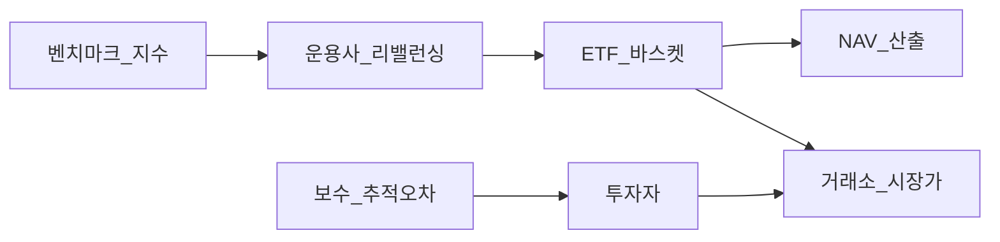
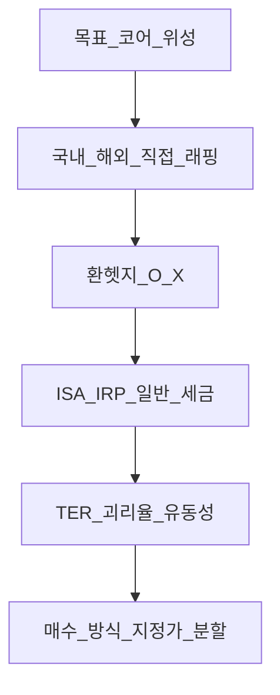

# ETF·인덱스 펀드 입문 — 추적·비용·한국 상장·코어 설계

> **면책**: 본 문서는 교육 목적이며, 특정 개인·법인에 대한 투자·세무·법률 자문이 아닙니다. 제도·세율·상품 조건은 변경될 수 있으므로 실행 전 공식 출처를 확인하세요.

## 메타

| 항목 | 내용 |
|------|------|
| 최종 검증일 | 2026-05-24 |
| 정책·법령 기준일 | 2025-12-31 확정, 2026 세제·상품 별도 표기 |
| 난이도 | L3 (Deep) — [READER-GUIDE](../docs/READER-GUIDE.md) |
| 예상 읽기 시간 | 55~70분 |
| 관련 bucket | Bucket 3 코어 (QQQ·글로벌 지수) |

## 0. 이 편 읽기 전 (5분)

| 항목 | 내용 |
|------|------|
| **난이도** | L3 (Deep) — [READER-GUIDE §L등급](../docs/READER-GUIDE.md) |
| **선수** | [주식 입문](stocks-equities-intro.md), [거시경제](../02-economics/macroeconomics-basics.md) |
| **이번 편에서 쓰는 기호** | 본문 §4·§4a 표 참고 |
| **복습 한 줄** | — |

> **심화 편**: [ETF 심화](etf-index-funds-deep.md)에서 추적오차·괴리·인덱스 구성을 본다.
## TL;DR

1. **ETF**는 지수·자산 묶음을 **주식처럼** 거래하는 **분산·저비용** 도구다.
2. **보수(TER)·추적오차·괴리율·유동성**을 반드시 확인한다.
3. **QQQ**(나스닥100)는 성장·테크 비중이 큰 **코어 후보** — [QLD](../04-portfolio/leveraged-etf-qqq-qld.md)와 구분.
4. **ISA·IRP**에서 코어 운용 시 [계좌 맵](../06-korea-policy/tax/account-product-tax-map.md)과 [ISA](../06-korea-policy/isa.md) 규칙을 함께 본다.
5. **레버리지·인버스**는 코어가 아니라 **위성·단기** 교육 프레임.

---

## 1. 한 줄 정의 + 왜 중요한가

**정의**: **인덱스 펀드/ETF**는 S&P 500, 나스닥 100, MSCI World 등 **벤치마크** 구성을 추종하고, **액티브** 펀드는 초과수익(알파)을 추구한다. **ETF**는 거래소에 상장되어 **장중 매매**가 가능하다.

**왜 중요한가**: 개별 종목 20개를 고르는 것보다 **한 바스켓**으로 분산·비용·세금 계좌를 설계하기 쉽다. 본 저장소의 장기 코어(QQQ 등)는 ETF 중심이며, [패시브 vs 액티브](../04-portfolio/passive-vs-active.md)와 [코어-위성](../04-portfolio/core-satellite-framework.md)의 **실행 도구**다.

---

## 2. 선수 지식 / 이후 읽을 것

**선수**:
- [주식 입문](stocks-equities-intro.md)
- [거시경제](../02-economics/macroeconomics-basics.md)

**이후**:
- [ETF·인덱스 심화](etf-index-funds-deep.md)
- [해외 주식·ETF](overseas-equities-intro.md)
- [자산배분](../04-portfolio/asset-allocation.md)
- [레버리지 QQQ·QLD](../04-portfolio/leveraged-etf-qqq-qld.md)
- [섹터](sectors/README.md)
- [ATS](korea-ats-nextrade.md)

---

## 3. 직관·비유

**바구니**: 슈퍼마켓에서 **과일 바구니**(ETF)를 통째로 산다. 사과 50개(종목)를 일일이 고르지 않는다.

**열차 vs 자가용**: 인덱스 ETF는 **정해진 선로(지수)** 를 따른다. 액티브는 기관이 **경로를 바꾸며** 초과속도를 노린다 — 비용·실패 확률이 따른다.

**괴리율**: 바구니 **정가(NAV)** 와 매장 **할인·할증 가격(시장가)** 차이 — 크면 시장가 매수가 **불리**할 수 있다.

**지수 집중 리스크**: 나스닥100·S&P500은 상위 종목 비중이 **크다**. “분산했다”고 해서 **테크·미국** 노출이 사라지지는 않는다. [지역 분산](../04-portfolio/geographic-diversification.md)과 [채권](../03-markets/bonds-fixed-income.md)으로 **2차 분산**을 설계한다.

**DCA와 ETF**: [rebalancing](../04-portfolio/rebalancing-and-dca.md)에서 말하는 **정기 매수**는 ETF와 궁합이 좋다. 단, 미국 장 **개장 직후·변동성** 구간에 시장가로 몰아넣기보다 **지정가·분할**이 교육 프레임이다 — [fomo](../05-behavioral/fomo-and-trading-hours.md).

**계좌 우선순위**: 동일 QQQ라도 **ISA 3년** vs **일반** vs **IRP**에 따라 **after-tax 수익**이 달라진다. TER 0.1%p 차이보다 **세금·기간**이 클 수 있다 — [account-product-tax-map](../06-korea-policy/tax/account-product-tax-map.md).

---

## 4. 정식 개념·용어

| 용어 | 한글 | English | 정의 |
|------|------|---------|------|
| ETF | 상장지수펀드 | Exchange-traded fund | 지수·자산 추종 **상장** 펀드 |
| 인덱스 | 지수 | Index | 규칙 기반 **종목·비중** |
| NAV | 순자산가치 | Net asset value | 펀드 **장부 가치** / 좌수 |
| TER/보수 | 총보수 | Total expense ratio | 연간 **운용·판매** 비용 |
| 추적오차 | 추적오차 | Tracking error | 지수 대비 **수익률 차이** |
| 괴리율 | 괴리율 | Premium/discount | (시장가−NAV)/NAV |
| 환헷지 | 환헷지 | FX hedge | 환율 노출 **제거**(국내상장) |
| AP | 참가회사 | Authorized participant | **설정·환매**로 유동성 공급 |

## 4a. 핵심 용어 (본문 등장 순)

| 용어 | 한 줄 | 관련 이론 | glossary |
|------|-------|-----------|----------|
| ETF | 지수·자산 묶음을 주식처럼 거래하는 상장펀드 | 인덱싱·분산 | — |
| 인덱스 | 규칙 기반 종목·비중 벤치마크 | 패시브 | — |
| NAV | 펀드 순자산가치(장부가/좌) | ETF 가격결정 | — |
| TER·보수 | 연간 운용·판매 총비용 | 비용·복리 | — |
| 추적오차 | 지수 대비 ETF 수익률 차이 | 추적·복제 | — |
| 괴리율 | (시장가−NAV)/NAV 프리미엄·디스카운트 | 시장미시구조 | — |
| QQQ | 나스닥100 1배; 성장·테크 코어 후보 | 지수·팩터 | [QQQ](../00-roadmap/glossary.md#qqq) |
| ISA·IRP | 코어 운용 시 세후·한도·3년 규칙 | 세제 | [ISA](../00-roadmap/glossary.md#isa-individual-savings-account-개인종합자산관리계좌) |
| 패시브·액티브 | 지수 추종 vs 초과수익 추구 | EMH·α | [passive-vs-active](../04-portfolio/passive-vs-active.md) |
| 환헷지 | 국내상장 해외 ETF의 환율 노출 조정 | 환율·수익분해 | — |
| AP | 설정·환매로 1차시장 유동성 공급 | ETF 메커니즘 | — |
| DCA | 정기 분할 매수로 변동성 평균 | 행동·실행 | [DCA](../00-roadmap/glossary.md#dca-dollar-cost-averaging) |
| 코어·위성 | broad ETF 코어 vs 레버리지·섹터 위성 | 포트 구조 | [core-satellite](../04-portfolio/core-satellite-framework.md) |

## 4b. 관련 이론 미니맵

- **[패시브 vs 액티브](../04-portfolio/passive-vs-active.md)** — TER·추적 vs 알파 비용
- **[코어-위성](../04-portfolio/core-satellite-framework.md)** — QQQ 코어·QLD 위성 구분
- **[해외 주식·ETF](overseas-equities-intro.md)** — 직접 vs 래핑·환율·세금
- **[자산배분](../04-portfolio/asset-allocation.md)** — 지수 집중·2차 분산
- **[시장 효율성](../08-advanced/market-efficiency-emh.md)** — 인덱싱이 전제하는 EMH

---

## 5. 메커니즘

### 5.1 지수 → ETF → 투자자

### 5.2 상품 선택 의사결정 (교육용)

| 선택지 | 장점 | 주의 |
|--------|------|------|
| 미국 QQQ·VOO | 지수 **직접**, 보수 낮음 | 달러·[해외 세금](../06-korea-policy/tax/overseas-stocks-tax-part1-cgt.md) |
| 국내 래핑 S&P·나스닥 | 원화 결제 | 환헷지·보수·추적오차 |
| 섹터 ETF | 테마 노출 | **상관·집중** — [섹터](sectors/README.md) |
| QLD 등 2x | 단기 레버리지 | **코어 비권장** — [QLD 문서](../04-portfolio/leveraged-etf-qqq-qld.md) |

---

## 6. 수식·모델

**장기 수익 분해** (교육용):

| 기호 | 이름 | 이 식에서 의미 |
|------|------|----------------|
| \(\TER\) | TER | 본문 §4·위 식 맥락 참고 |
| \(\R_\text{투자자}\) | R  투자자 | 본문 §4·위 식 맥락 참고 |
| \(\R_\text{지수}\) | R  지수 | 본문 §4·위 식 맥락 참고 |

\[
R_{\text{투자자}} \approx R_{\text{지수}} - TER - \text{추적오차} - \text{세금} - \text{괴리 비용}
\]

**읽는 법**: **R_**와 **투자자**의 관계를 위 식으로 쓴다. 경제·재무 해석은 변수표 「이 식에서 의미」와 [DEPTH-STANDARD](../docs/DEPTH-STANDARD.md) 기호 예제를 맞춘다.
**10년 복리 영향** (가상, TER 0.20% vs 0.80%):

| TER | 10년 누적 비용 영향(근사, 가상) |
|-----|----------------------------------|
| 0.20% | −2.0%p 수준 |
| 0.80% | −7.7%p 수준 |

(지수 수익 동일 가정 — **가상**)

**괴리율**:

| 기호 | 이름 | 이 식에서 의미 |
|------|------|----------------|
| \(r\) | 할인율·수익률 | 기간당 이자·요구수익률 |
| \(n\) | 기간 | 연·월 등 복리·할인에 쓰는 횟수 |
| \(PV\) | 현재가치 | 오늘 시점으로 환산한 금액 |

\[
\text{괴리율} = \frac{P_{\text{시장}} - NAV}{NAV} \times 100\%
\]

**읽는 법**: **r**와 **n**의 관계를 위 식으로 쓴다. 경제·재무 해석은 변수표 「이 식에서 의미」와 [DEPTH-STANDARD](../docs/DEPTH-STANDARD.md) 기호 예제를 맞춘다.### 6.1 복제 방식 (교육)

| 방식 | 설명 | 추적오차 |
|------|------|----------------|
| **실물(Physical)** | 지수 구성종목 **매수** | 낮은 편 |
| **합성(Synthetic)** | 스왑·파생 | 구조·상대방 리스크 |
| **샘플링** | 대표 종목만 | 지수와 **괴리** 가능 |

KODEX·TIGER 등 **간이투자설명서**에서 복제 방식 확인.

### 6.2 코어 ETF 선택 체크리스트

1. 지수 정의(시가총·동일가중 등)  
2. TER·거래비용  
3. AUM·거래대금(유동성)  
4. 괴리율·추적오차(연간)  
5. 분배금·과세·계좌(ISA 등)  
6. 환헷지(래핑 시)  
7. [geographic](../04-portfolio/geographic-diversification.md)와 **중복** 여부

---

조·상대방 리스크 |
| **샘플링** | 대표 종목만 | 지수와 **괴리** 가능 |

KODEX·TIGER 등 **간이투자설명서**에서 복제 방식 확인.

### 6.2 코어 ETF 선택 체크리스트

1. 지수 정의(시가총·동일가중 등)  
2. TER·거래비용  
3. AUM·거래대금(유동성)  
4. 괴리율·추적오차(연간)  
5. 분배금·과세·계좌(ISA 등)  
6. 환헷지(래핑 시)  
7. [geographic](../04-portfolio/geographic-diversification.md)와 **중복** 여부

---

7. 한국 적용

### 7.1 2025년 기준 (확정·일반적 맥락)

| 유형 | 예시 (교육, 특정 종목 추천 아님) | 확인 |
|------|----------------------------------|------|
| **미국 직접** | 나스닥100·S&P500 ETF | 달러·양도세 |
| **국내 상장** | KOSPI200·미국 지수 래핑 | 환헷지 여부 |
| **섹터** | 반도체·2차전지 | [semiconductor](sectors/semiconductor.md) |
| **채권 ETF** | 국채·회사채 | [bonds](bonds-fixed-income.md) |
| **ISA** | 코어 후보 | 3년·한도 — [isa](../06-korea-policy/isa.md) |

### 7.2 2026년 (확인 필요)

| 항목 | 2025 | 2026 |
|------|------|----------------|
| ISA 비과세·한도 | 현행 | 개정 시 **after-tax** 재계산 |
| ATS·거래 시간 | [NXT](korea-ats-nextrade.md) | 유동성·스프레드 변화 가능 |
| 해외 ETF 세무 | [part1](../06-korea-policy/tax/overseas-stocks-tax-part1-cgt.md) | 국세청 안내 |

**법·정책 근거**: 금융투자협회 ETF 공시, 거래소 상장요건 — [sources.md](../references/sources.md)

---

## 8. 숫자 예제 (가상)

> 모든 금액·수익률은 가상입니다.

### 예제 1: QQQ 코어 10년 (가상)

| 항목 | 값 (가상) |
|------|-----------|
| 월 적립 | **M** (만 원 단위, 교육용) |
| 기간 | 10년 |
| 지수 연수익 | 12% (가상) |
| TER | 0.20% |
| **적립원금** | **M** |
| **평가액(세전, 가상)** | 약 **F**|

**해석**: TER·세금·환율·낙폭 **미반영** 단순 시나리오.

### 예제 2: 환헷지 O vs X (가상, 1년)

| | 지수(달러) | 원/달러 | 원화 수익 (가상) |
|---|------------|---------|------------------|
| 비헷지 ETF | +10% | +8% | **약 +18.8%** |
| 환헷지 ETF | +10% | (헷지) | **약 +10%** |

**해석**: 원화 강세·약세에 따라 **어느 쪽이 유리한지 바뀜**.

### 예제 3: QLD 3년 — 2배가 아님 (가상)

| | 나스닥100 | QLD (2x, 가상) |
|---|-----------|----------------|
| 연1 | +20% | +38% (가상, 이상적 40% 아님) |
| 연2 | −15% | −32% (가상) |
| 연3 | +10% | +5% (가상) |
| **3년 누적** | 약 +12.7% | **약 +2%** (가상) |

**해석**: [leveraged-etf-qqq-qld](../04-portfolio/leveraged-etf-qqq-qld.md) — **변동성 붕괴**.

### 예제 4: ISA vs 일반 after-tax (가상)

| | ISA 3년+ | 일반 |
|---|----------|------|
| 차익 (가상) | **M** | **M** |
| 세금 (가상, 단순) | 0 (한도·규정 충족) | 160만 (가상 20%) |
| **순수익** | **M** | **M** |

→ [isa](../06-korea-policy/isa.md) — **기간·한도** 확인.

### 예제 5: 섹터 ETF + broad 중복 (가상)

| 보유 | 지수 중복 | 문제 |
|------|-----------|------|
| QQQ 70% + 반도체 ETF 20% | 테크·반도체 **이중** | 상승·하락 **증폭** |
| MSCI World 80% + 미국 S&P 20% | 미국 비중 **과다** 가능 | [geographic](../04-portfolio/geographic-diversification.md) |

---
## 9. FAQ

**Q1. ETF vs 일반 펀드?**  
**A.** ETF는 **장중 거래·가격 투명**, 펀드는 **기준가 1일 1회**. 코어는 ETF가 흔함.

**Q2. 분배금은?**  
**A.** 재투자·현금 — **과세·원천징수**는 상품·계좌별. [part2](../06-korea-policy/tax/overseas-stocks-tax-part2-dividend.md)

**Q3. ISA 3년 전에 팔면?**  
**A.** 혜택 **상실·세금** — [isa](../06-korea-policy/isa.md)

**Q4. 섹터 ETF를 코어로?**  
**A.** **가능**하나 상관·집중↑. 글로벌 broad + 섹터 **위성**이 흔한 교육 프레임.

**Q5. ATS(NXT)로 ETF 사면?**  
**A.** [korea-ats-nextrade](korea-ats-nextrade.md) — 호가·유동성·시간대 확인.

**Q6. KODEX 미국 S&P vs VOO?**  
**A.** 결제 통화·환헷지·보수·세금·분배 — 표로 비교 후 선택.

**Q7. DB에서 QQQ?**  
**A.** **일반적으로 불가.** IRP·ISA·일반. → [db-pension](../06-korea-policy/db-pension.md)

**Q8. 추적오차가 크면?**  
**A.** 지수 대비 **언더퍼폼** — 복제 방식·리밸런싱·비용 확인.

**Q9. ETN은 ETF와 같나?**  
**A.** 발행사 **신용** 구조 다름 — 입문은 ETF.

**Q10. 월배당 ETF만?**  
**A.** 빈도 ≠ 총수익 — TER·세후 비교.

**Q11. NXT에서 ETF?**  
**A.** [korea-ats-nextrade](korea-ats-nextrade.md) — 유동성 확인.

**Q12. DC에서 ETF?**  
**A.** 가입자 선택 가능 — [dc-pension](../06-korea-policy/dc-pension.md), [db-vs-dc](../06-korea-policy/db-vs-dc-pension.md). DB는 [db-pension](../06-korea-policy/db-pension.md) 참고.

---

## 10. 함정·리스크·한계

**상품명 함정**: “미국”, “나스닥”, “테크”가 들어간 ETF라도 추종 지수가 **동일하지 않을** 수 있다(동일가중 vs 시가총액). 매수 전 **KRX·금융투자협회** 상품 설명서에서 **벤치마크 정의** 한 줄을 복사해 두자. [passive-vs-active](../04-portfolio/passive-vs-active.md)에서 액티브 ETF·테마 ETF와 구분한다.

- **보수·괴리율** 무시  
- **QLD·TQQQ**를 코어에 배치  
- 괴리율 큰 ETF **시장가 추격**  
- 환헷지 **오해** (항상 유리하지 않음)  
- 지수 **집중** (나스닥=테크) 인지 없이 100%  
- 분배금·세금 **미반영** 수익률 비교

---

**Q. 실무에서는?**  
교과서 식·기호를 그대로 적용하기 전에 **수수료·세금·데이터 시점**을 분리한다. 숫자는 [DEPTH-STANDARD](../docs/DEPTH-STANDARD.md)처럼 기호만 먼저 맞추고, 법령·시장 수치는 §8 표·외부 출처로 갱신한다.

## 11. 심화 읽기

- [references/sources.md](../references/sources.md)  
- [passive-vs-active](../04-portfolio/passive-vs-active.md)  
- [해외 주식](overseas-equities-intro.md)  
- [팩터 입문](../08-advanced/factor-investing-primer.md)  
- [rebalancing](../04-portfolio/rebalancing-and-dca.md)

### 11.1 코어 ETF 비교표 템플릿 (직접 작성)

| 항목 | 상품 A | 상품 B |
|------|--------|--------|
|------|------|----------------|
|------|------|----------------|
|------|------|----------------|
|------|------|----------------|
|------|------|----------------|
|------|------|----------------|
[해외 입문](overseas-equities-intro.md)과 짝지어 **직접 vs 래핑** 한 쌍을 채운다.

### 11.2 레버리지·인버스 경계

[leveraged-etf-qqq-qld](../04-portfolio/leveraged-etf-qqq-qld.md)에 정리된 대로 **QLD·TQQQ·인버스**는 (1) 코어 금지 (2) 보유 기간 **단기** 가정 (3) 변동성 붕괴 이해 — 세 가지를 만족할 때만 위성으로 검토.

---

## 12. 스스로 점검 퀴즈

1. ETF의 대표적 장점 두 가지는?  
2. 추적오차란?  
3. 괴리율이 +1%일 때 시장가 매수는 NAV 대비?  
4. QLD를 코어에 넣지 않는 핵심 이유(한 줄)?  
5. DB 재직 중 QQQ 코어는 어디서 설계하는가?  
6. 실물 복제와 합성 복제의 차이(한 줄)?

??? note "정답 힌트"

    1. 분산·저비용·유동성 등 · 2. 지수 대비 수익률 차이 · 3. 비쌈(프리미엄) · 4. 일일 리셋·변동성 붕괴 · 5. ISA/IRP/일반 (DB 아님) · 6. 실물=종목 보유, 합성=스왑 등

**L3 완료**: [TEMPLATE](../docs/TEMPLATE.md) · 검증일 2026-05-24 — [overseas-equities-intro](overseas-equities-intro.md) 연계. [03-markets README](README.md)·[master-roadmap](../00-roadmap/master-roadmap.md) 참고.

**한 페이지 요약**: ETF=지수 바스켓·장중거래 | TER·추적오차·괴리율 | QQQ=코어 후보·QLD=위성 | ISA·IRP·일반 세금 다름 | 환헷지=래핑 선택 | 섹터·broad 중복 주의 | DB 직접매매 불가.

**읽기 후 액션 (가상)**: (1) §11.1 비교표에 코어 후보 2개 기입 (2) [account-product-tax-map](../06-korea-policy/tax/account-product-tax-map.md)으로 ISA 우선 여부 (3) [passive-vs-active](../04-portfolio/passive-vs-active.md) 1페이지 (4) QLD 보유 시 [leveraged-etf](../04-portfolio/leveraged-etf-qqq-qld.md) 재독.

**분배금·재투자**: ETF 분배금을 **재투자**하면 복리에 유리할 수 있으나, 과세·현금흐름은 계좌·상품별 다르다. 연말 **분배 내역**을 저장해 [investment-tax-overview](../06-korea-policy/tax/investment-tax-overview.md)와 대조한다. [stocks-equities-intro](stocks-equities-intro.md)에서 주식·ETF 역할을 먼저 정리한 뒤 본 문서로 오면 흐름이 자연스럽다.

**Q9. ETN은 ETF와 같은가?**  
**A.** **발행사 신용** 리스크 구조가 다름. 입문은 **ETF** 중심, ETN은 설명서 **별도**.

**Q10. 월배당 ETF만 고르면?**  
**A.** 배당 **빈도** ≠ 총수익. TER·총수익·세금 후 비교.