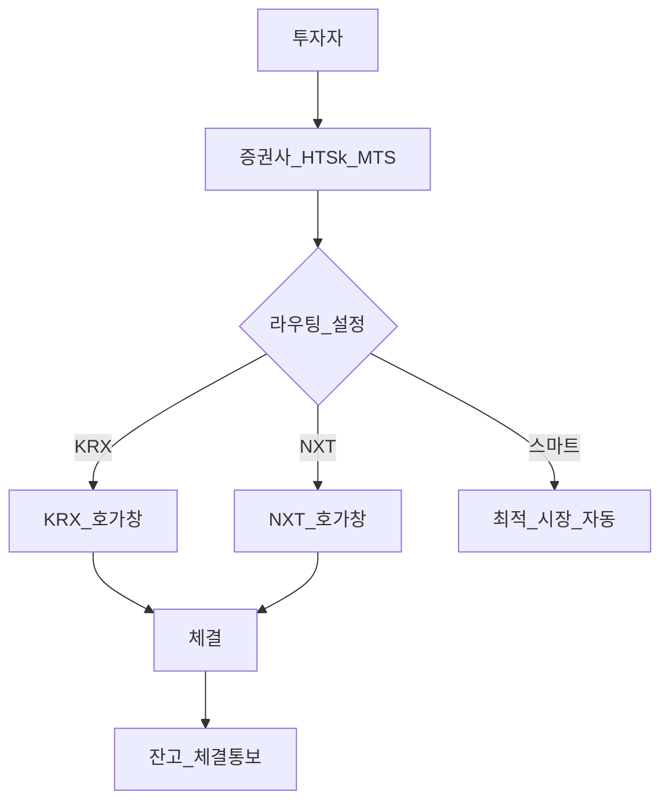
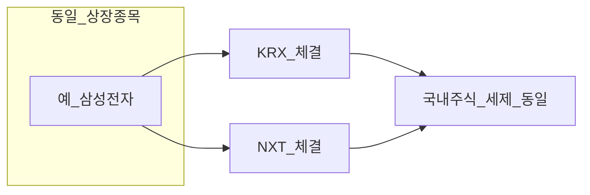

# 한국 대체거래소(ATS) — 넥스트레이드(NXT) 완전 가이드

> **면책**: 본 문서는 교육 목적이며, 특정 개인·법인에 대한 투자·세무·법률 자문이 아닙니다. 거래시간·수수료·상장 종목·규제 한도는 변경될 수 있으므로 실행 전 [넥스트레이드](https://www.nextrade.co.kr)·취급 증권사·금융당국 공식 안내를 확인하세요.

## 메타

| 항목 | 내용 |
|------|------|
| 최종 검증일 | 2026-05-24 |
| 정책·법령 기준일 | 2025-12-31 확정, 2026 개편·규제 별도 표기 |
| 난이도 | L3 (Deep) — [READER-GUIDE](../docs/READER-GUIDE.md) |
| 예상 읽기 시간 | 45~55분 |
| 관련 bucket | Bucket 3~4 (국내 주식·ETF·코스닥 위성), DB·연금과 **직접 무관** |

## 0. 이 편 읽기 전 (5분)

| 항목 | 내용 |
|------|------|
| **난이도** | L3 (Deep) — [READER-GUIDE §L등급](../docs/READER-GUIDE.md) |
| **선수** | [stocks-equities-intro](stocks-equities-intro.md), [time-horizon-and-buckets](../04-portfolio/time-horizon-and-buckets.md) |
| **이번 편에서 쓰는 기호** | 본문 §4·§4a 표 참고 |
| **복습 한 줄** | — |

## TL;DR

1. **ATS(Alternative Trading System)** 는 KRX 외 금융당국 인가 **대체 거래 장소**이며, 국내 1호 운영사가 **넥스트레이드(NXT)** 입니다(2025.3.4 출범).
2. **프리·정규·애프터**를 포함해 **약 12시간** 거래가 가능하나, “12시간 = 더 많이 매매해야 한다”는 **의미가 아닙니다**.
3. 별도 “NXT 전용 계좌”는 없고, **증권사 HTS·MTS·라우팅**으로 KRX와 NXT에 주문이 나갑니다.
4. **15%(ATS 전체) / 30%(종목별)** 거래량 한도 초과 시 해당 종목 **거래 중단**이 발생할 수 있습니다(2025~ 사례 다수).
5. 국내 상장주식 **세금 원칙은 KRX와 동일**(개인 매매차익 비과세, 배당은 금융소득) — DB 재직자는 **본인 NXT 주문 불가**.

---

## 1. 한 줄 정의 + 왜 중요한가

!!! info "ETF"
    지수·자산 **바구니**를 한 종목처럼 거래

**정의**: **넥스트레이드(NXT)** 는 자본시장법상 **대체거래소(ATS)** 로 인가받아, 한국거래소(KRX)와 **병행**하여 국내 **상장 주식·일부 ETF** 등을 매매·체결할 수 있게 하는 **대체 거래 시스템**입니다. 투자자는 동일 종목을 KRX 호가창 또는 NXT 호가창에서 거래할 수 있습니다.

!!! info "Bucket"
    시간·목적별 **자금 슬롯**(0 비상금 → 3 코어 등)

**왜 중요한가**: 거래시간·수수료·유동성 분산이 바뀌면 **체결 가격·스프레드·행동(FOMO)** 에 영향을 줍니다. “NXT라서 세금이 다르다” “DB 연금도 NXT로 단타한다” 같은 **오해**를 막고, **장기 코어(ISA·IRP·DCA)** 와 **단기 위성(Bucket 4)** 을 분리하는 데 필요합니다.

---

## 2. 선수 지식 / 이후 읽을 것

**선수**:
- [stocks-equities-intro.md](stocks-equities-intro.md)
- [time-horizon-and-buckets.md](../04-portfolio/time-horizon-and-buckets.md)

**이후**:
- [domestic-stocks-tax.md](../06-korea-policy/tax/domestic-stocks-tax.md) — KRX·NXT 동일 과세
- [fomo-and-trading-hours.md](../05-behavioral/fomo-and-trading-hours.md) — 장후·12시간과 행동
- [kosdaq-tier-system.md](kosdaq-tier-system.md) — 코스닥 유동성·변동성
- [db-pension.md](../06-korea-policy/db-pension.md) — DB와 NXT 무관

---

## 3. 직관·비유

NXT는 **같은 상품(종목)을 파는 두 번째 매장**입니다. 본점(KRX) 문을 닫아도 **지점(NXT)** 이 일찍 열리거나 늦게 닫힐 수 있습니다. 손님(투자자) 입장에서는 **어느 매장에서 샀는지**에 따라 줄 서는 시간·할인(수수료)이 다를 수 있지만, **물건 자체(상장주식)** 와 **영수증 규칙(국내주식 세법)** 은 같습니다.

**DB 퇴직연금**은 “회사가 맡긴 창고”라서 본인이 NXT 앱에서 주문하지 않습니다. **ISA·일반 계좌**가 “본인 지갑”입니다.

---

## 4. 정식 개념·용어

| 용어 | 한글 | English | 정의 |
|------|------|----------------|
| ATS | 대체거래소 | Alternative Trading System | KRX 외 인가 거래 장소 |
| NXT | 넥스트레이드 | NexTrade | 국내 대표 ATS 운영·시장 명칭 |
| 라우팅 | 주문 경로 | Order routing | 증권사가 KRX/NXT로 주문 전송 |
| 프리마켓 | 장전 | Pre-market | 정규장 전 거래(보도상 08:00~08:50 등) |
| 애프터마켓 | 장후 | After-hours | 정규장 후 거래(보도상 ~20:00 등) |
| 통합관리 | — | Consolidated oversight | KRX·NXT 감독·시장 안정 체계 |
| 거래중단 | — | Trading halt | 규제 한도·이상거래 시 매매 정지 |
| 스프레드 | 호가 스프레드 | Bid-ask spread | 매수·매도 호가 차이 |

### 4a. 핵심 용어 (본문 등장 순)

> 복습용. 정의는 §4 본표·[glossary](../00-roadmap/glossary.md)·본문 `!!! info` 박스.

| 용어 | 한 줄 | 관련 이론 | glossary |
|------|------|----------------|
| ATS | KRX 외 인가 거래 장소 | §4 | [glossary](../00-roadmap/glossary.md#ats) |
| NXT | 국내 대표 ATS 운영·시장 명칭 | §4 | [glossary](../00-roadmap/glossary.md#nxt) |
| 라우팅 | 증권사가 KRX/NXT로 주문 전송 | §4 | [glossary](../00-roadmap/glossary.md#라우팅) |
| 프리마켓 | 정규장 전 거래 | §4 | [glossary](../00-roadmap/glossary.md#프리마켓) |
| 애프터마켓 | 정규장 후 거래 | §4 | [glossary](../00-roadmap/glossary.md#애프터마켓) |
| 통합관리 | KRX·NXT 감독·시장 안정 체계 | §4 | [glossary](../00-roadmap/glossary.md#통합관리) |
| 거래중단 | 규제 한도·이상거래 시 매매 정지 | §4 | [glossary](../00-roadmap/glossary.md#거래중단) |
| 스프레드 | 매수·매도 호가 차이 | §4 | [glossary](../00-roadmap/glossary.md#스프레드) |

---

## 5. 메커니즘

### 5.1 주문·체결 흐름

### 5.2 KRX vs NXT 비교

| 항목 | KRX | NXT (ATS) |
|------|------|----------------|
| 역할 | 전통적 중앙 거래소 | 대체 거래소 |
| 거래시간 | 정규 + 기존 시간외 | **프리** + 정규 + **애프터** (개정 시 확인) |
| 수수료 | 증권사 표준 | **KRX 대비 낮은 구조** 보도(증권사별 상이) |
| 유동성 | 집중 | **분산** — 종목·시간대별 호가 차이 |
| 규제 한도 | — | ATS **15%** / 종목 **30%** (보도·시행령) |
| 투자자 계좌 | 기존 주식계좌 | **별도 NXT 계좌 없음** |

### 5.3 규제 한도와 거래 중단

자본시장법 시행령·당국 보도 요지(교육용, 수치는 시점별 확인):

| 한도 | 내용 | 초과 시 |
|------|------|----------------|
| ATS 전체 | 6개월 **일평균** 거래량 ≤ KRX 대비 **15%** | 시장 조치 가능 |
| 종목별 | 동 기간 ≤ KRX 대비 **30%** | 해당 종목 **거래 중단** |
| 투자자 영향 | 인기 대형주도 **NXT만** 거래 불가 기간 발생 | HTS 공지·대체 KRX |

---

## 6. 수식·모델

**유동성 분산 시 체결가**(교육용 단순):

| 기호 | 이름 | 이 식에서 의미 |
|------|------|----------------|
|  \(\P_\text{fill}\)  |  P  fill  | §4 용어·식 맥락에서 확인 |
|  \(\P_\text{NXT}\)  |  P  NXT  | §4 용어·식 맥락에서 확인 |
|  \(\P_\text{KRX}\)  |  P  KRX  | §4 용어·식 맥락에서 확인 |
\[
P_{\text{fill}} \approx \min(P_{\text{NXT}}, P_{\text{KRX}}) \quad \text{(매수 시, 호가에 따라)}
\]

**읽는 법**: **P_**와 **fill**의 관계를 위 식으로 쓴다. 경제·재무 해석은 변수표 「이 식에서 의미」와 [DEPTH-STANDARD](../docs/DEPTH-STANDARD.md) 기호 예제를 맞춘다.
**과매매 비용**(FOMO·장후 단타):

| 기호 | 이름 | 이 식에서 의미 |
|------|------|----------------|
|  \(\R_\text{net}\)  |  R  net  | §4 용어·식 맥락에서 확인 |
|  \(\R_\text{gross}\)  |  R  gross  | §4 용어·식 맥락에서 확인 |
\[
R_{\text{net}} \approx R_{\text{gross}} - (f + s) \times N
\]

**읽는 법**: **R_**와 **R_**의 관계를 위 식으로 쓴다. 경제·재무 해석은 변수표 「이 식에서 의미」와 [DEPTH-STANDARD](../docs/DEPTH-STANDARD.md) 기호 예제를 맞춘다.- \(f\): 수수료, \(s\): 스프레드·슬리피지, \(N\): **초과** 거래 횟수  
- 장기 코어는 \(N \to 0\) 에 가깝게 유지 — [rebalancing-and-dca.md](../04-portfolio/rebalancing-and-dca.md)

**해당 없음**: 복리·레버리지 일일 리셋 등은 본 문서 범위 밖.

---

법**: **R_**와 **R_**의 관계를 위 식으로 쓴다. 경제·재무 해석은 변수표 「이 식에서 의미」와 [DEPTH-STANDARD](../docs/DEPTH-STANDARD.md) 기호 예제를 맞춘다.- \(f\): 수수료, \(s\): 스프레드·슬리피지, \(N\): **초과** 거래 횟수  
- 장기 코어는 \(N \to 0\) 에 가깝게 유지 — [rebalancing-and-dca.md](../04-portfolio/rebalancing-and-dca.md)

**해당 없음**: 복리·레버리지 일일 리셋 등은 본 문서 범위 밖.

---

서 범위 밖.

---

## 7. 한국 적용

### 7.1 2025년 (확정·운영 초기)

| 항목 | 내용 |
|------|------|
| 출범 | 2025.3.4 NXT 본격 거래 |
| 거래시간 | **약 12시간** (프리·정규·애프터 — [nextrade.co.kr](https://www.nextrade.co.kr) 확인) |
| 종목 | 단계적 확대, 일부 **거래 중단** 이력 |
| 세금 | [domestic-stocks-tax.md](../06-korea-policy/tax/domestic-stocks-tax.md) — KRX와 **동일** |
| ISA·IRP | 중개형 ISA·퇴직연금 **상품목록** 내 국내주식 — 증권사별 |

### 7.2 2026년 (개편·시행 예정)

| 항목 | 2025 | 2026 (확인 필요) |
|------|------|----------------|
| ISA 비과세 한도 | 200만 원 | **500만 원** (보도) |
| ISA 연 납입 | 2,000만 원 | **4,000만 원** (보도) |
| NXT 종목·ETF | 단계 확대 | 공식 로드맵·공지 |
| 거래중단 빈도 | 일부 종목 | 규제·유동성에 따라 변동 |

### 7.3 계좌·제도별 NXT 이용

| 제도 | NXT 직접 주문 | 비고 |
|------|------|----------------|
| 일반 주식계좌 | **가능**(증권사·라우팅) | Bucket 3~4 |
| ISA 중개형 | **가능**(상품·규정) | 3년 유지·손익통산 |
| IRP·DC | 퇴직연금 **메뉴** 내 | 70% 규칙·상품목록 |
| **DB 재직** | **불가** | 자산관리기관 **기관 투자**만 |
| 청년도약 | **불가** | 적금 — [youth-leap-account.md](../06-korea-policy/youth-leap-account.md) |

### 7.4 실무 체크리스트

| # | 확인 항목 |
|---|-----------|
| 1 | 증권사 **NXT 참여**·수수료 표 |
| 2 | HTS **프리/애프터/스마트 라우팅** 설정 |
| 3 | 관심 종목 **거래중단** 공지 구독 |
| 4 | KRX vs NXT **호가·체결** 비교 습관 |
| 5 | 장후 매매가 **DCA·리밸런싱 일정**과 충돌하지 않는지 |
| 6 | 코스닥 **투자주의·관리** 종목 — 변동성·FOMO — [kosdaq-tier-system.md](kosdaq-tier-system.md) |

**법·정책 근거**: 자본시장법·시행령(ATS), 금융위·금감원 시장 안내, 넥스트레이드 공식.

---

## 8. 숫자 예제 (가상)

> 모든 인물·금액은 가상입니다.

### 예제 1: KRX vs NXT 체결가 차이 (가상)

| 항목 | 가상 직장인 P |
|------|----------------|
| 동일 종목 매수 100주 | |
| KRX 체결가(가상) | 50,000원 |
| NXT 체결가(가상) | 49,950원 |
| 수수료 차이(가상) | NXT −5,000원 |
| **교훈** | 소액 차이 ≠ **단타 정당화** — 연간 \(N\) 증가 시 비용 우위 소멸 |

### 예제 2: 거래 중단 (가상)

| 항목 | 가상 직장인 Q |
|------|----------------|
| NXT만 설정·인기 종목 | 매수 주문 **거절** |
| 대응 | KRX 라우팅 전환·공지 확인 |
| 손실(가상) | 기회비용 0 — **미체결** |

### 예제 3: DB vs ISA (가상)

| 슬롯 | 가상 직장인 R (DB 가입) |
|------|-------------------------|
| DB | 연금기금 운용 — **NXT 주문 없음** |
| ISA | 국내 대형주 ETF **월 1회** DCA (KRX·NXT 무관) |
| 행동 | 장후 급등 **알림 OFF** — [fomo-and-trading-hours.md](../05-behavioral/fomo-and-trading-hours.md) |

---

## 9. FAQ

**Q1. NXT 전용 계좌를 따로 만들어야 하나요?**  
**A1.** **아니오.** 기존 주식·ISA 계좌에서 증권사 **라우팅·시장 선택**으로 NXT 체결이 가능한 경우가 많습니다. 증권사별 UI·수수료를 확인하세요.

**Q2. NXT 수수료가 항상 더 싼가요?**  
**A2.** **보도·증권사별 상이**합니다. 이벤트·등급·KRX 병행 여부에 따라 달라지므로 표준 수수료표를 비교하세요.

**Q3. 삼성전자 등 대형주도 NXT에서 거래되나요?**  
**A3.** **단계적으로 확대**되었으나, 규제 한도로 **거래 중단**된 이력이 있습니다. 당일 공지를 확인하세요.

**Q4. ISA에서 NXT로 산 국내주식 세금이 다른가요?**  
**A4.** **아니오.** 국내 상장주식 매매차익 원칙은 KRX와 동일합니다. 다만 **ISA 계좌 세제**(3년·비과세 한도·손익통산)가 **우선** 적용됩니다.

**Q5. DB 퇴직연금에서 NXT로 단타할 수 있나요?**  
**A5.** 재직 중 **일반적으로 불가**합니다. DB는 자산관리기관이 운용하며, 본인 증권 앱 주문 구조가 아닙니다.

**Q6. ETF도 NXT에서 거래되나요?**  
**A6.** **시점·종목별**로 확대 중입니다. [nextrade.co.kr](https://www.nextrade.co.kr) 로드맵·증권사 상품목록을 확인하세요.

**Q7. 12시간 거래면 단타가 유리한가요?**  
**A7.** **아니오.** 거래 **가능 시간**이 늘었을 뿐, 장기 목표에 **과매매**는 수수료·행동 리스크만 키웁니다.

**Q8. KRX만 쓰면 불리한가요?**  
**A8.** **필수는 아닙니다.** 유동성·호가·수수료를 종합해 선택하면 됩니다. 코어 전략은 **시장 선택**보다 **납입·비중**이 중요합니다.

**Q9. 15%/30% 한도는 무엇인가요?**  
**A9.** ATS·종목별 **거래량 상한** 규제로, 초과 시 **거래 중단**이 가능합니다. “인기 종목 = 항상 NXT”가 아닙니다.

**Q10. 해외주식·QQQ도 NXT에서 사나요?**  
**A10.** **아니오.** NXT는 **국내 상장** 중심입니다. QQQ는 해외 — [overseas-stocks-tax-part1-cgt.md](../06-korea-policy/tax/overseas-stocks-tax-part1-cgt.md).

---

## 10. 함정·리스크·한계

- **NXT = 해외·세금 면제** 착각  
- **12시간 = 매매 의무** — FOMO·수면 부족·판단 저하  
- **거래 중단** 미확인 → 주문 실패·계획 차질  
- **KRX vs NXT 호가 괴리** — 슬리피지  
- **DB·DC 혼동** — 본인 주문 가능 여부  
- **코스닥 소형·관리종목** — NXT에서 변동성·스프레드 확대  
- 본 문서의 시간·한도·종목은 **개정·공지**에 따름

---

**Q. 실무에서는?**  
교과서 식·기호를 그대로 적용하기 전에 **수수료·세금·데이터 시점**을 분리한다. 숫자는 [DEPTH-STANDARD](../docs/DEPTH-STANDARD.md)처럼 기호만 먼저 맞추고, 법령·시장 수치는 §8 표·외부 출처로 갱신한다.

## 11. 심화 읽기

- [references/sources.md](../references/sources.md) — nextrade, KRX, 금융위  
- [korea-ats-primer.md](korea-ats-primer.md) — L1 요약  
- [domestic-stocks-tax.md](../06-korea-policy/tax/domestic-stocks-tax.md)  
- [fomo-and-trading-hours.md](../05-behavioral/fomo-and-trading-hours.md)

---

## 12. 스스로 점검 퀴즈

1. NXT는 별도 계좌 개설이 필수인가?  
2. DB 가입자가 재직 중 NXT에서 직접 주문하는 것이 일반적인가?  
3. 국내 상장주식 NXT 매매차익(일반 개인)의 세금 원칙은?  
4. ATS 전체 거래량 한도(보도)는 KRX 대비 약 몇 %인가?  
5. 12시간 거래의 올바른 해석은?

??? note "정답 힌트"

    1. 아니오(증권사 라우팅) · 2. 아니오 · 3. 비과세 원칙(국내주식) · 4. 15% · 5. 기회 증가이지 의무 아님