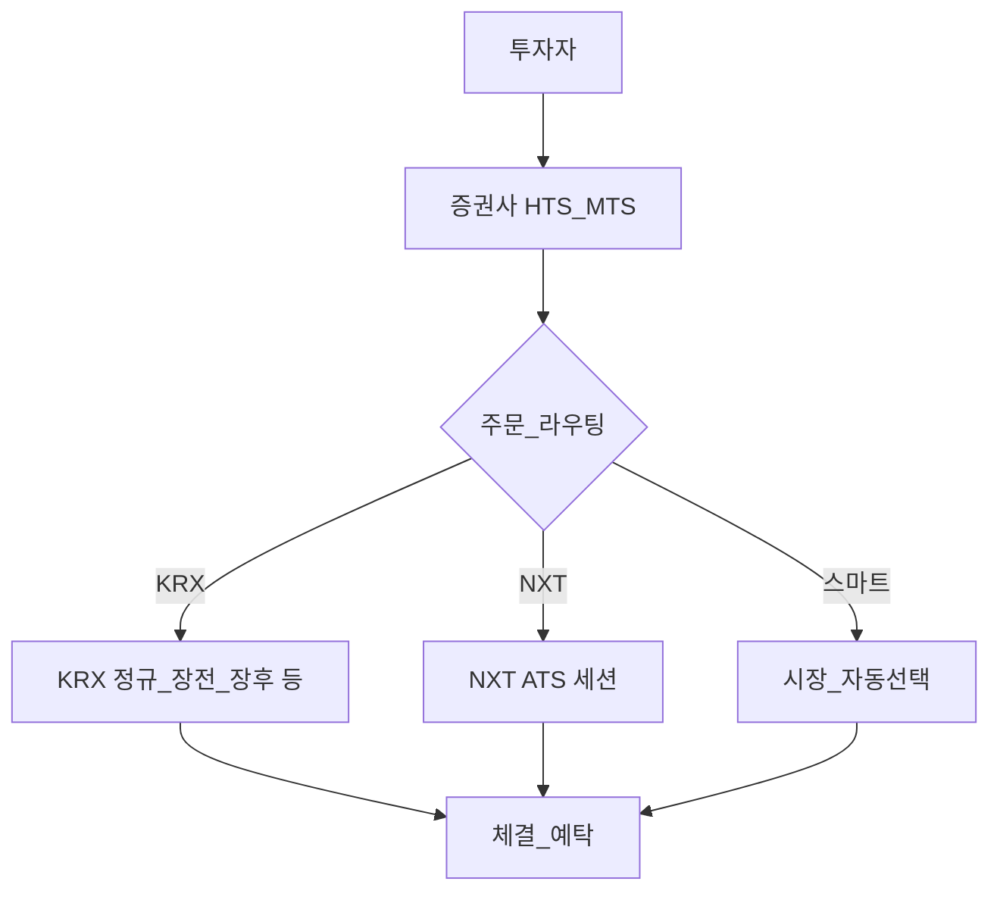
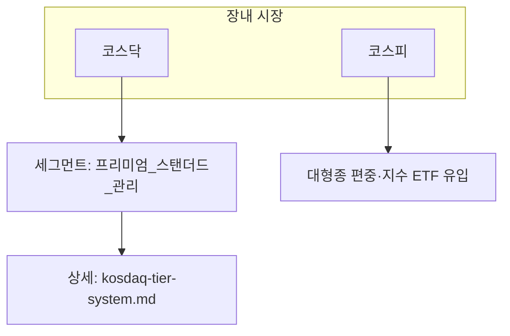

# 한국 주식시장 구조 — 코스피·코스닥, 거래 시간(KRX/NXT), 외국인 한도·공매도 입문

> **면책**: 본 문서는 교육 목적으로 시장 거래 구조와 규제 개념을 정리했으며 특정 종목 매수·매도를 권유하지 않습니다. 상장 종목별 **외국인 지분 한도**, 공매도 적격 여부·공시 규칙·거래 세션 시간은 변경될 수 있습니다. 거래 전 [한국거래소(KRX)](https://www.krx.co.kr)·증권사 HTS/M·금융위·예탁원 공지를 확인하세요.

## 메타

| 항목 | 내용 |
|------|------|
| 최종 검증일 | 2026-05-25 |
| 정책·법령 기준일 | 2025-12-31 기준 규제 위주, 이후 변경은 공식 재확인 |
| 난이도 | L4 (Graduate) — [READER-GUIDE](../docs/READER-GUIDE.md) |
| 예상 읽기 시간 | 75~95분 |
| 관련 bucket | Bucket 3(KOSPI·국내 코어 ETF), Bucket 4(코스닥 위성·이벤트), Bucket 5(파생 등은 교차 참조) |

## 0. 이 편 읽기 전 (5분)

| 항목 | 내용 |
|------|------|
| **난이도** | L4 (Graduate) — [READER-GUIDE §L등급](../docs/READER-GUIDE.md) |
| **선수** | [stocks-equities-intro](stocks-equities-intro.md), [korea-ats-nextrade](korea-ats-nextrade.md) |
| **이번 편에서 쓰는 기호** | 본문 §4·§4a 표 참고 |
| **복습 한 줄** | L3 선수 편을 먼저 읽으면 수식이 수월함 |

## TL;DR

1. **KOSPI**(유가증권)·**KOSDAQ**(코스닥) 두 축 위주입니다. 코스피는 대형종 편중·깊은 유동층 경향이 있고 코스닥은 성장주·테마 비중 때문에 **종목 간 변동성 격차**가 크게 나기 쉽습니다. 향후 코스닥 **세그먼트 제도와 퇴출 규정**까지 합하면 구조 변수가 많아집니다 → [kosdaq-tier-system.md](kosdaq-tier-system.md).
2. **거래 시간**은 장내 **KRX**와 대체거래소(ATS) **넥스트레이드(NXT)** 가 병행됩니다. 동일 종목이라도 시간대별로 호가통·체결특성이 다를 수 있습니다 → [korea-ats-nextrade.md](korea-ats-nextrade.md).
3. **외국인 투자**는 많은 종목에서 자유롭지만 업종에 따라 발행 주식 등에 대한 **외국인 투자 한도**가 존재해 “모든 사람이 무한 매수 가능”이라고 생각하면 곤란합니다. HTS 종목 상세 정보에서 종목별로 확인해야 합니다.
4. **공매도**는 증권 차입 후 매도 결제 과정까지 포함되는 **별도 레일**입니다. 과거 제도 변경·종목 차등 등으로 보도가 잦았으므로 책자보다 거래 가능 여부 확인이 우선입니다.
5. 급등락·호가 깊이 차이로 **변동성·호가 스프레드·체결 불확실성**이 커지는 순간은 시장 레이블 이해 없이 종목 분석만으로는 설명이 부족할 수 있습니다.
6. 코스피·코스닥 이름만으로 세우면 부족할 수 있으며, **시가중 지수·바스켓·외국인 한도·공매 레일·코스닥 세그먼트**처럼 자금 순환 줄을 만들 레이블을 함께 보면 시장 교란 때 설명 여지가 줄어듭니다. 코어·위성 버킷을 분리했다면 회고 줄에도 같은 태깅 규칙을 이식하세요.(회고 줄 샘플은 부록 참고.)

---

## 1. 한 줄 정의 + 왜 중요한가

**정의**: **한국 주식시장 구조**라 함은 종목 거래 자체 너머의 **플랫폼·시간축·투자자 군별 제약**(내국인 계좌, 외국인 한도)·**청산·증거금·숏 채널** 등 거래 결과를 좌우하는 **제도 레이어**를 말합니다.

**왜 중요한가**: 패시브 투자자도 **어느 시장의 어떤 시간대 호가통에 주문했는지**에 따라 실행가·심리·세금 처리(국내 증거금·예탁 과정 포함) 신호가 바뀝니다. 같은 체험이라도 레짐 교체·공매·공시 강화 등 **당국 제도 순간**에 체감 패턴이 달라질 수 있습니다. L4 학습에서는 **종목 선택**보다 한 단계 거슬러 올라 **시장 접속 방식 레이블**부터 정리해야 합니다.

---

## 2. 선수 지식 / 이후 읽을 것

**선수**:
- [stocks-equities-intro.md](stocks-equities-intro.md)
- [korea-ats-nextrade.md](korea-ats-nextrade.md)

**이후**:
- [kosdaq-tier-system.md](kosdaq-tier-system.md)
- [domestic-stocks-tax.md](../06-korea-policy/tax/domestic-stocks-tax.md)
- [passive-vs-active.md](../04-portfolio/passive-vs-active.md)
- [time-horizon-and-buckets.md](../04-portfolio/time-horizon-and-buckets.md)

---

## 3. 직관·비유

**KOSPI**는 호가 깊이·거래 규모 측면에서 **안정적으로 붐비는 본관**처럼 느끼는 경우가 많습니다. 다만 **시총 상위 종목**(대형 금융·IT·반도체 등)이 지수·ETF 속으로 집중되면 같은 “코스피”라도 **미시구조**(체결 패턴·호가 스프레드)는 종목 간 편차가 큽니다.

**KOSDAQ**은 성장 테마 종목 비중 때문에 **종목 간 변동폭과 유동성 격차**가 큰 편이라, 백화점 비유보다는 **복층 존**(층별로 관람 동선·좌석 깊이가 다른 공연장)처럼 이해하면 오해가 줄어듭니다. 2026년 전후부터는 **코스닥 세그먼트(프리미엄·스탠더드·관리)·퇴출 규정 강화**가 구조 변수로 들어오므로 [kosdaq-tier-system.md](kosdaq-tier-system.md)를 함께 읽습니다.

**거래 시간**: [korea-ats-nextrade.md](korea-ats-nextrade.md)에서 설명했듯, KRX 장외 시간대에는 **별도 라우팅**으로 접속 가능한 존(NXT 세션 예시 포함)이 있을 수 있습니다. 투자 결과는 종목 코드가 같아도 체결장이 분리되어 **실행 결과만으로는 같은 날이라도 패턴이 다를 수** 있습니다.

**외국인 투자 한도** 비유로는 특정 존에서는 “**입장 가능한 관객석 비율**”이 미리 고정된다고 생각할 수 있습니다. 좌석이 남았는지 확인하지 않으면 거래 프로그램이 **주문 차단 또는 일부 접수 불가** 상태를 보여줍니다.

---

## 4. 정식 개념·용어

| 용어 | 한글 | English | 정의 |
|------|------|---------|------|
| KOSPI | 코스피 | KOSPI | 유가증권시장과 대표 지수·시가총액 가중 구조 |
| KOSDAQ | 코스닥 | KOSDAQ | 벤처·성장주 비중이 큰 시장, 세그먼트·퇴출 이슈 |
| KONEX | 코넥스 | KONEX | 중소·신성장 기업 등 별도 상장 축(간접 체감) |
| 시가총액 | 시총 | Market cap | 보통주 기준 가격×수, 유통주식비율 표기 유의 |
| 유동성 | 유동 | Liquidity | 거래량·호가 깊이·체결 슬리피지 관점 |
| 호가 스프레드 | 스프레드 | Bid-ask spread | 최우선 매수·매도 호가 차 |
| 외국인 지분 한도 | 외국인 한도 | Foreign ownership limit | 법령·업종에 따른 보유 상한(종목별 상이) |
| 공매도 | 숏 | Short selling | 차입 후 매도·결제·상환까지 포함 |
| 대차거래 | 대차 | Stock lending | 공매도를 위한 증권 차입 시장 |
| 증거금 | 증거금 | Margin | 공매도·신용 등 담보 현금·증권 |
| 순매도 공시 | 공시 | Disclosure | 대량·공매도 관련 공시 체계(시행세부 변동) |
| ATS / NXT | 대체거래소 | Alternative venue | KRX와 병행 체결, 시간·호가통 분리 가능 |

### 4a. 핵심 용어 (본문 등장 순)

> 복습용. 정의는 §4 본표·[glossary](../00-roadmap/glossary.md)·본문 `!!! info` 박스.

| 용어 | 한 줄 | 관련 이론 | glossary |
|------|-------|-----------|----------|
| KOSPI | 유가증권시장과 대표 지수·시가총액 가중 구조 | §4 | [glossary](../00-roadmap/glossary.md#kospi) |
| KOSDAQ | 벤처·성장주 비중이 큰 시장, 세그먼트·퇴출 이슈 | §4 | [glossary](../00-roadmap/glossary.md#kosdaq) |
| KONEX | 중소·신성장 기업 등 별도 상장 축 | §4 | [glossary](../00-roadmap/glossary.md#konex) |
| 시가총액 | 보통주 기준 가격×수, 유통주식비율 표기 유의 | §4 | [glossary](../00-roadmap/glossary.md#시가총액) |
| 유동성 | 거래량·호가 깊이·체결 슬리피지 관점 | §4 | [glossary](../00-roadmap/glossary.md#유동성) |
| 호가 스프레드 | 최우선 매수·매도 호가 차 | §4 | [glossary](../00-roadmap/glossary.md#호가-스프레드) |
| 외국인 지분 한도 | 법령·업종에 따른 보유 상한 | §4 | [glossary](../00-roadmap/glossary.md#외국인-지분-한도) |
| 공매도 | 차입 후 매도·결제·상환까지 포함 | §4 | [glossary](../00-roadmap/glossary.md#공매도) |
| 대차거래 | 공매도를 위한 증권 차입 시장 | §4 | [glossary](../00-roadmap/glossary.md#대차거래) |
| 증거금 | 공매도·신용 등 담보 현금·증권 | §4 | [glossary](../00-roadmap/glossary.md#증거금) |
| 순매도 공시 | 대량·공매도 관련 공시 체계 | §4 | [glossary](../00-roadmap/glossary.md#순매도-공시) |
| ATS / NXT | KRX와 병행 체결, 시간·호가통 분리 가능 | §4 | [glossary](../00-roadmap/glossary.md#ats-/-nxt) |

---

## 5. 메커니즘

### 5.1 주문이 KRX vs NXT로 나뉘는 흐름(개념)

### 5.2 코스피·코스닥과 코스닥 세그먼트(승강제) 링크

### 5.3 공매도(극단적 단순화)

1. **차입**: 대차시장·기관 등에서 주식을 빌림(수수료·만기·담보).  
2. **매도**: 빌린 주식을 시장에 매도.  
3. **결제·상환**: 이후 저가 매수해 상환하거나 결제 실패 시 강제 청산·패널티 위험.  

실제로는 **적격 종목**, **공시·한도**, **시장 상황에 따른 제한**이 겹칩니다. 항상 HTS·거래소 공지로 당일 가능 여부를 확인합니다.

### 5.4 거래 시간 개략(확정은 KRX·NXT 공지)

| 구분 | 개념적 설명 | 세부 확인 |
|------|-------------|-----------|
| KRX 정규장 | 대부분 종목 현물 매매의 중심 세션 | KRX 시간표 공지 |
| 동시호가 등 | 장 개시 전후 단일가 매칭 세션 존재 | 증권사 안내 차이 가능 |
| NXT | 장 전·후 연장 등 **실질 장시간 확장**을 목표로 한 ATS 세션 | [korea-ats-nextrade.md](korea-ats-nextrade.md) |

---

## 6. 수식·모델

**유효 스프레드(개념용 근사)**: 최우선 호가만 볼 때 중간값 \(m=(a+b)/2\) 에 대해

| 기호 | 이름 | 이 식에서 의미 |
|       ------       | ------ | ------이(가) 이 식에서 맡는 역할(§4·본문 참고) |
|   \(S_\)   | S  | S 이(가) 이 식에서 맡는 역할(§4·본문 참고) |
|             \(eff\)             | eff | eff이(가) 이 식에서 맡는 역할(§4·본문 참고) |
|             \(a\)             | a | a이(가) 이 식에서 맡는 역할(§4·본문 참고) |
|             \(b\)             | b | b이(가) 이 식에서 맡는 역할(§4·본문 참고) |
|   \(m\)   | 월 실수령 | 가계 교육용 월 세후 소득 기호 |
\[
S_{\mathrm{eff}} \approx \frac{a-b}{m}
\]

**읽는 법**: **S_**와 **eff**의 관계를 위 식으로 쓴다. 경제·재무 해석은 변수표 「이 식에서 의미」와 [DEPTH-STANDARD](../docs/DEPTH-STANDARD.md) 기호 예제를 맞춘다.
**유도 (L4)**:
1. **정의**: **S_**, **eff**, **a**를 동일 시점·동일 통화로 맞춘다. — 단위 불일치면 식이 무의미해진다.
2. **식 변형**: 양변을 정리해 목표 변수를 한쪽에 둔다. — 할인·복리는 **시점 이동**이 핵심이다.
3. **해석**: 부호·크기가 경제 직관과 맞는지 확인한다. — 극단값에서 단조성·한계를 점검한다.

\(a\) 는 최우선 매도호가, \(b\) 는 최우선 매수호가입니다.

**회전율 근사(일간)**

| 기호 | 이름 | 이 식에서 의미 |
|       ------       | ------ | ------이(가) 이 식에서 맡는 역할(§4·본문 참고) |
| \(r\) | 할인율·수익률 | 기간당 이자·요구수익률 |
| \(n\) | 기간 | 연·월 등 복리·할인에 쓰는 횟수 |
| \(PV\) | 현재가치 | 오늘 시점으로 환산한 금액 |

\[
\mathrm{Turnover}_d \approx \frac{\mathrm{거래대금}_d}{\mathrm{시가총액}_d}
\]

**읽는 법**: **r**와 **n**의 관계를 위 식으로 쓴다. 경제·재무 해석은 변수표 「이 식에서 의미」와 [DEPTH-STANDARD](../docs/DEPTH-STANDARD.md) 기호 예제를 맞춘다.
**유도 (L4)**:
1. **정의**: **r**, **n**, **PV**를 동일 시점·동일 통화로 맞춘다. — 단위 불일치면 식이 무의미해진다.
2. **식 변형**: 양변을 정리해 목표 변수를 한쪽에 둔다. — 할인·복리는 **시점 이동**이 핵심이다.
3. **해석**: 부호·크기가 경제 직관과 맞는지 확인한다. — 극단값에서 단조성·한계를 점검한다.
종목별로 정의 차이가 있을 수 있어 **금융정보 제공사·거래소 정의**를 따릅니다.

---

## 7. 한국 적용

### 7.1 2025년 기준 요약

| 주제 | 핵심 정리 |
|------|-----------|
| 시장 분할 | 현물 코어는 코스피·코스닥이 중심, 코넥스 등 별 축 존재 |
| 시가총액 분위 | 공식 명칭이 미국처럼 “대·중·소 단일 라벨”이 아니어도, **코스피200·코스닥150** 등 지수와 거래대금으로 업무에서 중·대형을 구분 |
| 미시 유동성 | 같은 시장이라도 종목 간 스프레드·체결 안정성 격차가 큼 |
| KRX 시간 | 대부분 현물 거래가 **장내 시간표** 안에서 발생, 증권사 화면에 동시호가·장종 단일가 표기 |
| NXT 등 ATS | 시간 연장장의 호가통이 분리될 수 있음. 거래량 한도 초과 시 **중단·제한** 사례 → [korea-ats-nextrade.md](korea-ats-nextrade.md) 참고 |
| 외국인 한도 | 법상 **업종·종목별 상한**. 잔여 한도는 종목별로 HTS 또는 정보제공처에서 확인 |
| 공매도 | 차입·증거금·결제·공시가 결합된 구조로, 제도 변경 보도가 잦아 **항상 당일 조건 재확인** |

코스닥은 [kosdaq-tier-system.md](kosdaq-tier-system.md)에서처럼 **프리미엄·스탠더드·관리군**과 함께 **동전주·자본잠식·저PBR 명단 공개·상장폐지 속도**가 맞물리므로 단순 “소형 성장 플레이스홀더”로만 접근하면 레짐 변화 리스크를 과소평가하기 쉽습니다.

### 7.2 2026년 전후 교육 포인트(공시 중심)

| 항목 | 메모 |
|------|------|
| 코스닥 세그먼트·퇴출 | 승격·강등·연기금·패시브 연계 가능성 검토 금융위·거래소 공고 따라 변동 |
| 공매도 규제 | 위원회·법 개정 보도 시 **적격종·공시·금지 시간대** 변경 가능성 |
| NXT 규모 | ATS 전체·종목별 거래량 상한 초과 패턴 교훈 — 유동 분산≠무조건 이득 |

**법·정책 근거(교육용)**: 자본시장법·시행령 시행규칙, 외국인투자 관련 규정, 금융위·예탁결제원(KSD)·KRX·NXT 사용자 안내서.

---

## 8. 숫자 예제 (가상)

> 인물·가격은 가상입니다.

### 예제 1: 시간대별 체결 품질

종목 X에 대해 KRX 종가 부근 매수 예정이라 가정했을 때 정규장 마감 직후 NXT 에서 같은 지정가 주문을 냈다고 칩시다. 남은 매도 호가 깊이가 다르면 **체결량·평균단가가 달라질 수** 있습니다. 교훈: “종목 선택” 다음으로 **어디 시간대 라우팅인지**를 기록해야 사후 검증 가능합니다.

### 예제 2: 외국인 한도 임박

가상 회사 Y는 외국인 보유 가능 지분 근처까지 외국인 자금 몰림. 이 상태에서 신규 공매 물량·대차 공급·지수 포함 ETF 유입 교란이 겹치면 **일시 거래 교란**(주문 차단 표시)·**스프레드 확대**가 나타날 수 있습니다. 교훈: 대형 종목이라도 종목 카드 한 줄을 무시하면 안 됩니다.

### 예제 3: 코스닥 신규 규제 민감 테마

기술특례 논란·관리군 이슈가 있는 가상 테마 Z는 지수 낙인 효과로 **기관·연기금 체크리스트**에서 제외될 수 있습니다. 교훈: 벌점이 아니라 **자금군 구조변화**까지 같이 보는 레벨입니다.

### 예제 4: 시총 구간별 일간 등락이 체결에 주는 교훈(가상)

대형 종목에서는 호가 깊이가 두터워 **순식간 거래 규모**가 커도 스프레드가 상대적으로 좁게 유지되는 경향을 상정할 수 있습니다. 반면 같은 일간 등락률이라도 코스닥 소형종은 **중간 호가가 비거나** 프로그램·이벤트로 체결가가 튀면서 **설계했던 패시브 DCA 간격**(예: 시간가중 균등) 조차 실행 오차가 커지기 쉽습니다. 교훈: “오늘 몇 프로 올랐다” 한 줄보다 **거래량·유동 순위**(거래대금 대비 회전 등)부터 보는 순서가 현명합니다.

### 예제 5: 패시브 지수 교체·리밸런싱 예고가 미시 유동성에 준 교란 스켈치

가상의 지수 운영사가 코스피 또는 코스닥 지수에서 특정 업종 종목 교체안을 미리 안내했다고 가정합시다. 사전 교체 종목에서는 **패시브 자금 순매매가 집중**되어 일시 거래량·호가 스프레드가 출렁입니다. 교훈: 이런 일은 단순히 “종목 갈음”이라기보다 **체결·유동 환경**까지 한꺼번에 바뀔 수 있습니다.

---

## 9. FAQ

**Q1. 코스피와 코스닥을 “대형·소형”으로만 나눠도 충분한가요?**  
**A1.** 직관 잡기엔 편하지만 현실에서는 **종목 단위 차이가 시장 이름보다 큽니다**. 코스피에도 장외 유동 부족한 종목이 있고 코스닥에도 거래 깊은 종목이 있습니다. 따라서 패시브라도 바스켓을 볼 때 **코스피200·코스닥150** 등 공식 규격과 거래대금 분위수를 함께 참고해야 합니다. 코스닥은 앞으로 [kosdaq-tier-system.md](kosdaq-tier-system.md) 의 세그먼트 변수까지 합류합니다.

**Q2. KRX와 NXT를 실전에서 구분하는 가장 간단한 습관은?**  
**A2.** 주문 접수 즉시 증권사 앱 설정에서 **기본 라우팅**(KRX / NXT / 스마트)을 확인합니다. 체결 후에도 매매내역 표에 **거래 장소**(시장 이름) 행을 남길 수 있도록 스크린샷·메모 노트 필드를 만들어 두면 백테스트 착각이 줄어듭니다. 시간표·예외 규칙은 [korea-ats-nextrade.md](korea-ats-nextrade.md) 를 정기 업데이트합니다.

**Q3. 외국인 투자 한도는 무엇을 의미하고 왜 패시브에게도 문제인가요?**  
**A3.** 법령 및 종목 카드 상 **외국인이 보유할 수 있는 발행증권의 상한**(업종 따라 상이) 근처에 가면, 추가 매수는 시스템상 안 되거나 순간적으로만 되는 패턴을 보일 수 있습니다. 이 상태는 종목 간 **수급·스프레드·지수 ETF 유입 교란**(편출·교체 포함)까지 연결됩니다.

**Q4. 공매도를 구조적으로 이해하기 위한 순서표는 어떻게 그리나요?**  
**A4.** **차입 여부 확인 → 증거금 충족 매도 접수 가능 → 매도 후 결제·상환 회전 → 공시** 순으로 그리세요. 공시·뉴스 헤드라인만으로 호가 패턴까지 단번에 연역하려 들면 **우발적 과매매** 같은 행동 리스크도 함께 커질 수 있습니다.

**Q5. 공매 금지·허용 뉴스만 보고 전략을 바꿔야 할까요?**  
**A5.** 뉴스는 레짐 전환 **신호**에 가깝지만, 그 자체만으로 **종목 교체 근거**로 삼기엔 변수가 많습니다. 제도는 자주 조정되어 왔으며 **당일 종목 카드 상태** 확인이 신뢰도가 높습니다.

**Q6. “프로그램 매매 때문에 개인은 불리”라는 논법을 어떻게 평가하나요?**  
**A6.** 단타·단기 회전에서는 대량 알고 주문 속도 이슈가 남을 여지 있습니다. 그러나 **장기 패시브**에서는 종목 시간대·바스켓 교체·내 비용 회전 과다 같은 요인이 프로그램 이슈보다 큰 패널티가 되는 경우가 많습니다.

**Q7. 코스닥 제도 개편(세그먼트)은 ETF까지 영향을 줄까요?**  
**A7.** 간접 영향입니다. 구성종이 관리구간에 내려가거나 교체대상이 되면 순자산·괴리·거래 패턴까지 출렁일 수 있습니다. 상세는 [kosdaq-tier-system.md](kosdaq-tier-system.md) 참고입니다.

**Q8. 변동성 장면에서 패시브는 매매를 줄여야 하나요?**  
**A8.** 의무는 아니나, 장중 변동이 크면 원했던 간격**(시간 분할 매수 등)** 대비 실제 체결가 분산이 커질 수 있습니다. 줄이고 싶다면 “전략 휴먼 룰”을 미리 종이로 정해 두는 편이 낫습니다.

**Q9. 같은 날 KRX 종가와 NXT 참고 가격이 다르면?**  
**A9.** 호가통과 체결 집합이 다르기 때문에 생길 수 있습니다. 일지 작성 시 **어떤 열을 채택할지** 규칙부터 정해야 혼선이 줄어듭니다.

**Q10. 공매 관련 공시만 보고 단기 매매해도 되나요?**  
**A10.** 잔고·공시에는 헷지·패시브 리밸런스 등 **복수 동기**가 섞입니다. 단일 방향 신호로 단정하면 오판 위험이 큽니다.

**Q11. 한도 접근 순간 패시브 지수·ETF 순매매 변화는 어디서 추적할 수 있나요?**  
**A11.** 거래소 투자자별 매매 통계·지수 구성 변경 공지·관련 ETF의 순자산·거래대금 등을 함께 봐야 해석 노이즈가 줄어듭니다. 어떤 지표 하나만으로 매매 타이밍을 잡기는 어렵습니다.

**Q12. 이 문서를 실전 근거로 삼아도 되나요?**  
**A12.** 아니오. 교육용 개요입니다. 실제 거래·세금·공매 규격은 **증권사·금융당국·예탁원·거래소** 공식안이 우선입니다.

---

## 10. 함정·리스크·한계

- **종목만 분석 증후군**: 접속 시간·외국인 한도·바스켓 편중을 놓치면 결과를 설명하기 어렵습니다.
- **NXT 과매매 함정**: 시간 연장이 항상 이득이라는 착각, 중단 이벤트 간과 가능.
- **공매 과대 해석**: 공시 줄을 방향 신호처럼 쓰면 오판 빈발.
- **규제 뉴스마다 전략 뒤집기 비용**.
- **한도 접점 서프라이즈 패시브 포함**.
- **코스닥 레짐**: 세그먼트·관리종·퇴출 이슈 — [kosdaq-tier-system.md](kosdaq-tier-system.md) 교차 필독.
- **문서 한계**: 교육용 요약본이므로 규격·종목 조건 실행 전에는 공식 레퍼런스를 따라야 합니다.

---

**Q. 실무에서는?**  
교과서 식·기호를 그대로 적용하기 전에 **수수료·세금·데이터 시점**을 분리한다. 숫자는 [DEPTH-STANDARD](../docs/DEPTH-STANDARD.md)처럼 기호만 먼저 맞추고, 법령·시장 수치는 §8 표·외부 출처로 갱신한다.

## 11. 심화 읽기

- [한국거래소(KRX)](https://www.krx.co.kr) — 시장 시간표·거래통계·공시 페이지
- 금융위원회·증선위·예탁결제원 사용자 안내
- 이 저장소: [korea-ats-nextrade.md](korea-ats-nextrade.md)·[kosdaq-tier-system.md](kosdaq-tier-system.md)·[market-microstructure.md](market-microstructure.md)
- [domestic-stocks-tax.md](../06-korea-policy/tax/domestic-stocks-tax.md)

---

## 연습문제 (L4, 기호)

1. 위 §6 주요 식에서 변수 하나를 미지로 두고, 나머지를 기호로 둔 **관계식**을 쓰시오.
2. 가정이 깨질 때(유동성·세금·다중 IRR 등) 위 식의 **한계**를 기호·부등식으로 서술하시오.
3. §8 예제와 동일 기호(M·P·PV 등)로 **부호·단조성**만 검증하는 짧은 논증을 하시오.

### 해설 키

1. 직전 변수표의 「이 식에서 의미」를 이용해 동일 차원으로 정리한다.
2. 「가정이 깨지면」 절의 한계 사례와 연결한다.
3. 숫자 대입 없이 **부호**·**단위** 일치만 확인한다.
## 12. 스스로 점검 퀴즈

1. KRX 라우팅과 NXT 라우팅이 실행가에 줄 수 있는 차이를 두 문장 안에 설명하세요.
2. 외국인 보유 가능 지분 근처에서 발생할 수 있는 교란 두 가지.
3. 코스닥 세그먼트가 패시브 ETF 바스켓에 줄 수 있는 **간접** 작용 요약.
4. 공매 과정에서 차입 직후의 핵심 단계 두 가지 이름.
5. 패시브 투자자가 종목 카드에서 구조 변수로 챙길 세 가지(시간대·외국인·공매 외 포함하여 자유 작성).

??? note "정답 힌트"

    유동 깊이·스프레드·체결 시각 차이 가능 / 매수 차단 또는 스프레드 확대 또는 수급 몰림 / 교체 리스크 또는 괴리 변동 / 매도 접수 증거금 결제 / 한도 라우팅 순매도 상태 관리종 구간

## 부록 A. 시가총액·거래대금을 함께 읽는 체크리스트

먼저 **시총**은 종가 단독이 아니라 **발행 보통주식 수**와 증자·감자·전환 등 **자본변동 이벤트**까지 맞물려 바뀌므로 증권정보 제공처에서 한 번 더 대조합니다. 둘째 **거래대금** 순위에서는 **단일 거래대 급등**(하루짜리 이벤트)인지 **수일 상단 유지**(자금 순환 지속)**인지**를 분리해야 “과열” 레이블을 남발하지 않습니다. 셋째 **외국인 보유 가능 잔량** 근처라면 순매매·호가 스프레드·지수·ETF 유입 교란이 겹치는 순간이 있어 같은 날 같은 스프레드시트 행에 적어 두면 후행 분석 오류가 줄어듭니다.

## 부록 B. 주간 시장 접속 회고 형식(예시 필드)

| 열 이름 | 예시 적을 내용 |
|---------|----------------|
| 날짜 | 2026-05-25 |
| 시장 라우팅 | KRX / NXT / 스마트 |
| 종목 코드 | 종목 명 |
| 체결 시간대 | 정규·동시호가·연장 포함 |
| 스프레드 체감 | 좁음·중간·넓음(주관 노트) |
| 외국인 한도 여유 | HTS 종목 카드 참고 또는 공란 |
| 공매·공시 | 해당하면 한 줄 요약 |

## 부록 C. 공매 체인 복습(한 줄 앵커)

**차입 → 매도 주문 접수 및 체결 → 결제·증거금·상환 회전**. 줄을 종이에 그린 뒤 같은 날 해당 종목의 적격 상태·관련 공시까지 붙여 보면, 헤드라인만 따라 방향을 단정하지 않도록 거리 두기 좋습니다.

## 부록 D. 학습 과제 및 장문 회고 방법

아래 과제를 4주 연속 작성해 보세요. 같은 종목이라도 **이번 주는 KRX, 다음 주에는 NXT 포함 체결**이 섞였다면 해당 행에 표시하면 사후 검증 시 시간대 교란이 보입니다. 외국인 한도 카드가 경고 톤이면 해당 주 노란 표시 등으로 시각 단서를 두고, 그 주의 **스프레드·체결 패턴**(일시 확대 포함)을 한 줄 노트합니다. 공매 보도가 있던 날은 기사 URL 대신 **증권사 안내 페이지의 종목 적격 상태** 스크린샷 한 장을 붙입니다.

패시브에서 흔한 고충은 “분할 매수 시계(time-weighted)는 지켰는데 체결가 분포가 기대와 다르다”는 것입니다. 어떤 시간대에서는 호가가 얇거나 중간 호가 공백이 잦아 **실행 차이만으로** 손익 패턴이 틀어질 수 있습니다. 회고 장부에서 **설계 열**(횟수·금액)과 **실행 열**(체결 장소 라벨)**을 분리하면** 원인 분해가 빨라집니다.

코어는 코스피 바스켓, 위성은 코스닥을 쓰는 학습자는 관리군 등 보도가 나온 날에 [kosdaq-tier-system.md](kosdaq-tier-system.md) 링크를 메모하면 이후 교정 작업 속도가 나아집니다.

## 부록 E. KRX 동시호가·장종 세션과 회고 구분

정규 **연속 장중 매매**와 달리, 동시호가·종가 형성**(증권사마다 이름이 비슷하나 미묘하게 다름)** 시간대에서는 호가 접수·매칭 규칙이 바뀝니다. 그래서 “종가 차트 한 점 근처”라는 감각과 실제 내 체결 체험이 어긋날 여지가 있습니다. 회고 줄에는 **내 체결 시각**(앱에 찍히는 문자열 포함)과 **세션 유형**(연속/단일가 추정)·**시장 이름**(KRX·NXT)을 같은 행에 둡니다. 분할 매수 주기는 지켰는데 시간대 때문에 스프레드가 튀거나 중간 호가가 비었다면 실행 손익 줄이 종목 줄과 분리돼 보이도록 열 이름을 분리해야 합니다. 프로그램성 매매가 몰린 구간에서는 시간대 미시 교란이 커져 **체결 분포**(평균단가 포함)**만 종목 줄 탓으로 보려는 착각**이 생길 수 있습니다. 같은 행에 **거래대금 순위**(대략)·**외국인 한도 잔량** 단서까지 적어 두면 미시 줄과 종목 줄을 나누기 수월합니다.

## 부록 F. 시가가중 지수·패시브의 대형 노출 보조

시가가중 지수를 추종하는 상품은 시총이 큰 종목의 가격 변동이 지수·순자산에 미치는 비중이 상대적으로 큽니다. 그래서 대형주가 상대적으로 덜 움직여도 **지수 자체의 방향**은 상단 시총 군집의 국면에 민감해질 수 있습니다. 개별 종목을 덜 사도, 지수·ETF를 사면 **대형 노출 줄**을 같이 사는 셈이 됩니다. 회고에서는 “오늘 내가 산 ETF가 어떤 시총 분위의 노출을 담는지” 한 줄을 남기면 코어·위성 비중 설계와 일치하는지 점검하기 쉽습니다. 동일한 맥락에서 시총 상위 종목에 사건성 이슈가 생기면 지수 전체의 체감 변동이 커질 수 있으니, 이벤트 날짜마다 **지수 구성 비중 변화 공지**가 있었는지 함께 적어 두면 장기 기록 품질이 좋아집니다.

## 부록 G. 외국인 한도 민감 구간의 수급 읽기 습관

외국인 보유 가능 잔량이 줄어드는 구간에서는 **동일 뉴스라도 국내·외국인 자금의 체감**이 달라질 수 있습니다. 개인은 주문이 막히지 않아도, 외국인 매수 여력이 줄면 **수급 곡선**이 바뀌어 스프레드·체결 안정성이 달라질 수 있습니다. 따라서 한도 카드는 “외국인 전용 이슈”가 아니라 **전체 유동·미시 구조** 이슈로 보는 편이 낫습니다. 회고 예시로는 (1) 잔량이 전일 대비 얼마나 줄었는지 (2) 같은 날 외국인 순매매 추정치 (3) 프로그램·기관 순매매 추정치를 한 행에 두는 방식이 있습니다. 한도에 닿지 않는 종목이라도, **지수 편입·편출** 이벤트가 겹치면 외국인 ETF 유입 패턴이 변해 비슷한 미시 교란이 나타날 수 있습니다.

## 부록 H. 공매도 체인을 장기 기록에 남기는 형식

공매는 **차입 시장 조건·증거금·결제·상환**이 한 묶음입니다. 짧은 메모라도 “차입 가능 여부 확인 → 매도 접수 → 결제·증거금 회전” 화살표를 그려 두면 이후 뉴스를 읽을 때 헤드라인만 따라가는 오류를 줄입니다. 공시가 붙는 날에는 공시 제목만 적지 말고, **당일 적격 여부 화면 캡처 한 장**을 함께 두어 제도 조건을 기록으로 남깁니다. 패시브 투자자라도 공매 이슈가 큰 테마에 노출돼 있다면, 그날의 체결 품질·스프레드 변화를 미시 열에 넣어 “정책 이벤트일 실행 손실”을 나중에 분리해 볼 수 있습니다.

## 부록 I. NXT·ATS와 KRX를 동시에 쓰는 사람의 주간 체크

[korea-ats-nextrade.md](korea-ats-nextrade.md)에서 설명하듯 ATS는 별도 호가통을 가질 수 있습니다. 주간 체크는 (1) 이번 주 기본 라우팅 설정 (2) 중단·한도 관련 공지 스크랩 (3) 체결 내역의 시장 표기 샘플 3건입니다. 동일 종목이라도 주간으로 **KRX 체결 비중 vs NXT 체결 비중**이 바뀌었다면, 그 주의 변동성·스프레드 체감이 달라진 이유 후보로 바로 올라옵니다. 시간 연장이 “기회”인지 “비용”인지는 전략에 따라 다르지만, 기록을 남기지 않으면 판단이 불가능합니다.

## 부록 J. 코스닥 세그먼트·지수·ETF의 연쇄를 한 문단에 묶기

[kosdaq-tier-system.md](kosdaq-tier-system.md)의 세그먼트 논의는 개별 종목 낙인을 넘어 **지수·ETF·기관 체크리스트**까지 연쇄될 수 있습니다. 회고 한 줄에 “관리군 보도 있음 / 프리미엄 논의 있음 / 지수 논의 링크” 같은 태그를 달면, 몇 달 뒤 다시 읽을 때 맥락 복원이 빨라집니다. 코어는 코스피, 위성은 코스닥인 경우 위성 비중이 작아도 **규제 이벤트 주간**에는 체결 품질 열을 굵게 표시해 두는 습관이 장기적으로 유용합니다.

## 부록 K. 용어·레이블 정리(문서 내부 일관)

본 문서에서 **미시 구조**는 호가·스프레드·체결·시간대·시장 분리까지 포함한 넓은 뜻으로 씁니다. **구조 변수**는 외국인 한도·공매 제도·세그먼트·ATS 규모 같은 제도 층을 가리킵니다. **실행 손익**은 종목 방향만이 아니라 접속·시간대 때문에 생기는 차이까지 포함해 기록용으로 씁니다. 이렇게 레이블을 고정해 두면 팀·가족 내 공유 시에도 대화가 줄지 않습니다.

## 부록 L. 스스로 확장할 읽기 목록(장문 메모)

시장 구조를 더 깊게 보려면 KRX 시장 구조 안내, 예탁결제원 결제 흐름 개요, 금융위 보도자료의 시장 안정·공매 관련 공지를 같은 폴더 북마크에 묶어 두세요. 또한 국내 ETF 상품 설명서에서 **추종 지수·구성 종목 공시 주기**를 확인하면 지수 리밸런스 주간의 체결 패턴을 미리 상상하는 데 도움이 됩니다. 마지막으로 행동경제 측면에서는 장시간 확장이 체결 기회를 늘리는 동시에 과매매 충동을 키울 수 있으므로, 본 문서의 회고 열 설계를 자신의 휴먼 룰과 맞추는 작업이 별도로 필요합니다.

## 부록 M. 유동성 프록시를 스스로 정의해 쓰는 법

거래대금·회전율·스프레드·체결 슬리피지는 서로 다른 ‘유동성’ 측면을 가리킵니다. 본 문서에서는 정답을 하나로 고정하지 않고, 학습자가 주간 노트에 **자기 프록시 세트**를 고정하길 권합니다. 예를 들어 (1) 일간 거래대금 상위 몇 % 안에 드는지 (2) 최우선 스프레드가 몇 틱 수준인지 (3) 내 주문 규모 대비 체결 잔량이 어떻게 남았는지를 같은 테이블에 적습니다. 몇 주만 지나도 “대형이라 유동이 좋다”는 추상 레이블과 실제 체감이 어긋나는 날이 드러납니다. 코스닥 위성을 키우는 경우라면 이 프록시 세트가 [kosdaq-tier-system.md](kosdaq-tier-system.md) 이슈 주간에 더 민감해질 수 있으니 이벤트 태그를 같이 답니다.

## 부록 N. 공매·현물·지수가 겹칠 때의 해석 분기

공매 잔고가 늘었다고 해서 곧바로 하락 신호로 읽기 어려운 이유는, **헷지 수요**가 같은 체인 위에 있기 때문입니다. 지수 선물·옵션·스왑 등 파생과 연계된 헷지가 현물 공매 체인과 겹치면 공시 한 줄만으로 방향을 단정하기 어렵습니다. 따라서 기록할 때는 공시 제목뿐 아니라 **내가 드러낸 노출이 어떤 자산군인지**(현물 ETF인지, 테마 ETF인지, 개별인지)를 적어 해석 공간을 좁힙니다. 장기적으로는 “공시일 주간의 실행 손익” 열을 따로 두면 제도 이벤트 비용을 분리해 볼 수 있습니다.

## 부록 O. 외국인 한도와 환율·매크로 이벤트의 연관(개념)

외국인 자금 흐름은 환율·금리·위험자산 선호와 맞물리는 경우가 많습니다. 다만 본 문서는 매크로 모델링을 하지 않고, **종목 카드의 한도 잔량**과 **당일 환율 변동**을 같은 행에 적어 상관을 “기록”하는 수준만 권합니다. 인과를 단정하지 말고, 몇 달 후 스프레드 변화와 대조해 보는 용도로 쓰세요. 지수 추종 자금이 유입되면 스프레드가 좁아지는 날도 있고, 오히려 이벤트성 매매로 넓어지는 날도 있어 단일 법칙은 없습니다.

## 부록 P. 시장 구조 글을 읽을 때의 ‘확인 질문’ 열두 가지

(1) 오늘 체결 장소 이름은 무엇인가 (2) 동시호가·연속 장 중 어디인가 (3) 거래대금 분위는 상위 몇 점인가 (4) 스프레드는 좁은가 (5) 외국인 한도 카드에는 무엇이 적혔는가 (6) 프로그램·기관 순매매 추정은 어디까지 봤는가 (7) 공매 적격 상태는 무엇이었는가 (8) 뉴스 헤드라인과 종목 카드 상태가 같은가 (9) 지수 변경 공지가 있었는가 (10) ATS 중단 공지가 있었는가 (11) 세그먼트·관리종 보도가 있었는가 (12) 내 전략 휴먼 룰을 지켰는가. 매주 금요일 이 열두 문항을 빠르게 체크하는 습관이 L4 학습 마감 과제 역할을 합니다.

## 부록 Q. 문서 교차 읽기 로드맵(한 줄)

먼저 [korea-ats-nextrade.md](korea-ats-nextrade.md)로 시간대를, 이어 [kosdaq-tier-system.md](kosdaq-tier-system.md)로 코스닥 구조 변수를, 마지막으로 [domestic-stocks-tax.md](../06-korea-policy/tax/domestic-stocks-tax.md)로 과세 줄기를 연결하면 “구조→실행→세금” 순서로 사고가 정리됩니다.

## 부록 R. 마무리 면책·버전 태그

본 문서는 2026-05-25 기준으로 작성·정리되었으며 이후 규제·시장 운영 변경에 따라 내용이 곧바로 틀어질 수 있습니다. 실행 전 항상 공식 출처를 확인하고, 본 문서는 회고 열 설계와 구조 개념 정리 정도의 용도로만 사용하길 권합니다.

## 부록 S. 레짐 교체 기록을 ‘한 페이지 캘린더’로 만들기

금융당국·거래소 공지는 날짜가 흩어지면 기억 속에서 뒤섞입니다. 학습자에게 권하는 방식은 분기마다 **한 페이지 캘린더**에 다음을 색칠하는 것입니다: (1) 공매 제도 관련 보도·시행일 표기 (2) 코스닥 세그먼트·퇴출·동전주 관련 표기 (3) ATS 거래중단·한도 관련 표기 (4) 지수 리밸런스 공지일 표기. 색은 많을수록 좋지 않고, ‘구조 변수가 겹친 날’만 강조색을 쓰세요. 그날 실행 손익 열이 튀었다면 나중에 회고할 때 **우연인지 구조인지**를 가늠하기 쉬워집니다. 이 캘린더는 투자 성과를 보장하지 않으며, 학습자 자신의 기록 관행을 만드는 도구입니다.

## 부록 T. 패시브 vs 개별 선택을 시장 레이블로 분리해서 기록하기

패시브는 종목 줄을 줄이지만 시장 줄은 줄이지 않습니다. 회고에서는 “패시브 매수” 줄과 “실험 매수” 줄을 나누고, 같은 날이라도 시간대 라우팅 줄을 각각 두면 서로 교란이 섞이지 않습니다. 위성 종목 코스닥은 [kosdaq-tier-system.md](kosdaq-tier-system.md) 레이블을 태깅하면 단순히 “주가 줄”만 보고 **제도 줄이 더 컸던 주**를 지나치기 어렵습니다. 코어 코스피 ETF는 바스켓 공시 줄을 따라가며 대형 노출 줄에 대한 마음가짐을 다시 확인합니다. 시간이 지나면 패시브 줄의 실행 차이 패턴과 실험 줄의 패턴 분포 차이가 눈에 들어오기 시작합니다. 이 패턴 차이 관찰이 L4 과제 결과물 형태입니다.

## 부록 U. 연도별 시간표·UI 변경 기록 방법

거래 시간은 보도나 시험 적용 때문에 조금씩 달라질 수 있습니다. 학습용 실습으로는 매년 초 **거래소 시간표 캡처**를 폴더에 보관하면 장기 회고 신뢰도가 높아집니다. NXT 포함 ATS 규모·중단 안내도 [korea-ats-nextrade.md](korea-ats-nextrade.md) 를 정기 확인하고 캘린더 표시를 남기면 해당 주 체결 이상 징후 복구가 수월합니다.

증권사 앱 업데이트로 외국인 한도 줄 위치가 바뀌면 습관이 깨지기 쉽습니다. 회고에서는 **항목 이름**(한도 잔량·순매매 라벨 등)**을 종이에 고정**하고 스크린샷만 보조로 두는 패턴을 권합니다. 패시브 휴먼 룰**(월별 분할 횟수)** 과 실제 **지정가 수정·취소 횟수**를 주별로 세면 행동·구조 줄을 분리하는 연습 데이터가 쌓입니다.

토론 시에는 회사별 용어 차이 때문에 말이 엇갈리므로 종목 코드·체결 시간·라우팅만 공통 분모로 두는 편이 낫습니다. 이 부록까지 읽었다면 장내·장외·제도 줄을 학습 장부 한곳에 묶어 보는 첫 회차를 마무리한 상태라고 보아도 무방합니다. 같은 날 [korea-ats-nextrade.md](korea-ats-nextrade.md)·[kosdaq-tier-system.md](kosdaq-tier-system.md)·[domestic-stocks-tax.md](../06-korea-policy/tax/domestic-stocks-tax.md) 를 함께 열어두고 표 한 칸이라도 교차 업데이트하면 구조 줄과 실행 줄 정합성이 오래 유지됩니다. 분기 말에는 새로 추가된 레이블**(세그먼트명·중단 안내 등)** 을 회고 헤더에 반영했는지 여부만 점검해도 기록 깨짐을 줄일 수 있습니다.

연도마다 증권사 약관·메뉴 문자열은 바뀌어도, 회고 장부에서는 학습자가 정한 **열 순서**(날짜·라우팅·종목·한도·공매 상태 등)**만 고정**되면 교차 연도 회고가 수월합니다. 마지막으로 본 문서는 교육용 참고물이며 **특정 종목 매매를 권하지 않는다**는 점을 다시 명시합니다.

---