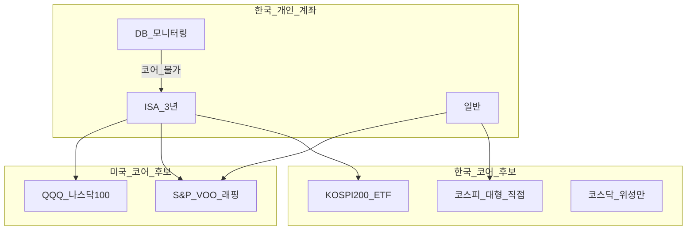

# 한국 vs 미국 주식 — 시장 구조·밸류에이션·세금·계좌·섹터·DB→ISA 코어

> **면책**: 본 문서는 교육 목적이며, 특정 개인·법인에 대한 투자·세무·법률 자문이 아닙니다. 모든 인물·금액·비율은 **가상 예시**입니다. 제도·세율·지수 구성은 변경될 수 있으므로 실행 전 KRX·금융위·국세청·증권사 공지를 확인하세요.

## 메타

| 항목 | 내용 |
|------|------|
| 최종 검증일 | 2026-05-25 |
| 정책·법령 기준일 | 2025-12-31 확정, 2026 ISA·코스닥 세그먼트 별도 표기 |
| 난이도 | L3 |
| 예상 읽기 시간 | 65~80분 |
| 관련 bucket | Bucket 3 (코어: KOSPI·S&P·나스닥 중 선택), Bucket 4 (국내 테마·미국 위성) |

## TL;DR

1. **한국**은 코스피·코스닥 **이중 시장**, KRX·NXT **이중 거래 시간**, **국내주 비과세(원칙)**·ISA·DB/DC **계좌 레이어**가 특징이다 — [korea-equity-market-structure.md](korea-equity-market-structure.md).
2. **미국**은 S&P·나스닥 **broad/성장 지수**, **해외주 양도세·5월 신고**, 달러·**래핑 ETF 환헷지** 선택이 특징이다 — [us-equity-indices-etf.md](us-equity-indices-etf.md).
3. **밸류에이션 문화**: 한국은 **저PBR·배당·지주사 할인** 논의, 미국은 **성장·FCF·Mag7 프리미엄** 논의가 두드러진다(시기별 변동).
4. **코어 설계**: “한국+미국 **둘 다**”도 가능하나, **KOSPI200 + S&P + QQQ** 동시는 **대형주·테크 중복** — [core-satellite-framework.md](../04-portfolio/core-satellite-framework.md).
5. **DB 재직자**는 퇴직연금에서 ETF 직접 선택이 **불가**한 경우가 많아, **ISA**에 국내·미국 코어를 두는 **가상 경로**가 교육 프레임의 핵심 — [isa.md](../06-korea-policy/isa.md).

---

## 1. 한 줄 정의 + 왜 중요한가

**정의**: **한국 vs 미국 주식 비교**란, 두 시장의 **구조(시장·거래·섹터)**, **투자자 문화(밸류에이션·지배구조)**, **세금·계좌**, **개인 코어 포트 경로**를 나란히 놓고 **장기 자산배분**에 필요한 차이를 정리하는 것이다.

**왜 중요한가**: “국내주는 안전, 미국은 수익” 같은 **이분법**은 둘 다 틀릴 수 있다. 코스닥 **관리군·퇴출**과 미국 **Mag7 집중**은 **서로 다른 리스크**다. 한국 DB 가입자는 **회사 연금만**으로는 QQQ·KOSPI ETF 코어를 **못 만드는** 경우가 많아, **ISA 슬롯** 설계가 실무의 시작점이다. 두 시장을 **표로 비교**하지 않으면 [korea-equity-market-structure.md](korea-equity-market-structure.md)와 [us-equity-indices-etf.md](us-equity-indices-etf.md)를 **한 포트폴리오**에 연결하기 어렵다.

---

## 2. 선수 지식 / 이후 읽을 것

**선수**:
- [stocks-equities-intro.md](stocks-equities-intro.md)
- [korea-equity-market-structure.md](korea-equity-market-structure.md) — 코스피·코스닥·KRX/NXT
- [etf-index-funds.md](etf-index-funds.md) — 지수 ETF 기본

**이후**:
- [us-equity-indices-etf.md](us-equity-indices-etf.md) — S&P·QQQ·래핑
- [overseas-equities-intro.md](overseas-equities-intro.md) — 해외 직접·세금
- [isa.md](../06-korea-policy/isa.md) — DB 가입자 코어 계좌
- [db-vs-dc-pension.md](../06-korea-policy/db-vs-dc-pension.md) — DB vs DC
- [geographic-diversification.md](../04-portfolio/geographic-diversification.md) — 한·미 비중
- [domestic-stocks-tax.md](../06-korea-policy/tax/domestic-stocks-tax.md) — 국내주 세금

---

## 3. 직관·비유

**두 도시 부동산**: **한국 시장**은 **아파트(코스피)** + **재개발 단지(코스닥)** + **동네 상가(코넥스)** 가 한 **광역시** 안에 있고, **KRX 본관·NXT 별관**으로 출입구가 둘이다. **미국 시장**은 **뉴욕 맨해튼(S&P broad)** + **실리콘밸리 단지(나스닥100)** 가 **다른 도시**에 있지만, **Mag7 고층빌딩**이 두 도시 **스카이라인**에 동시에 보인다 — **포트폴리오에서 중복**.

**밸류에이션 문화**: 한국 투자자 대화는 “**PBR 0.5배·지주사 할인·배당 5%**”가 자주 나온다. 미국 코어(QQQ·S&P) 대화는 “**PER·매출성장·buyback**”이 중심이다. **같은 PER 숫자**도 **회계·지배구조·성장 기대**가 달라 **직접 비교 위험**.

**세금 = 입국 심사**: **국내 상장주식**(일반 계좌)은 **양도세 면제(원칙)** 로 **심사가 가벼운** 편. **미국 직접 주식**은 **5월 종합소득세 신고**라 **서류 심사**가 붙는다. **ISA**는 “**3년 VIP 라운지**” — 조건 맞으면 **비과세 한도** — [isa.md](../06-korea-policy/isa.md).

**DB→ISA 경로**: 회사 **구내식당(DB)** 은 메뉴를 **정해 주고**, **집 냉장고(ISA)** 에 **본인이 고른 코어 ETF**를 넣는 그림 — [db-vs-dc-pension.md](../06-korea-policy/db-vs-dc-pension.md).

---

## 4. 정식 개념·용어

| 용어 | 한국 | 미국 |
|------|------|------|
| 대표 시장 | KOSPI·KOSDAQ | NYSE·Nasdaq |
| 대표 지수 | KOSPI, KOSPI 200, KOSDAQ150 | S&P 500, Nasdaq-100, Dow 30 |
| 시장 구조 | 유가·코스닥 **이중**, 세그먼트(코스닥) 추진 | **단일 국가** broad·섹터 지수 다층 |
| 거래 시간 | KRX + **NXT(ATS)** | 미 동부 **정규·프리·애프터** |
| 대표 코어 ETF(교육) | KODEX200, TIGER200 등 | VOO, QQQ 등 |
| 국내주 양도세 | **비과세(원칙)** | 해당 없음 |
| 해외주 양도세 | **과세·신고** | 해당 없음(미국 거주자 기준 별도) |
| ISA | **3년·비과세 한도** | 해당 없음 |
| DB | **ETF 직접 선택 불가** 다수 | — |
| 환율 | 원화 **본국 통화** | **달러** 노출(직접 투자 시) |
| 지배구조 이슈 | **지주사·채용** | **ESG·buyback·dual class** |

---

## 5. 메커니즘

### 5.1 종합 비교표 (교육용)

| 축 | 한국 주식 | 미국 주식 |
|----|-----------|-----------|
| **시장 구조** | 코스피(대형)·코스닥(성장), 코넥스, **외국인 한도**·공매도 규제 — [korea-equity-market-structure.md](korea-equity-market-structure.md) | S&P500(500)·Nasdaq100(100)·Dow(30), **Mag7** 지수 비중 — [us-equity-indices-etf.md](us-equity-indices-etf.md) |
| **거래·유동성** | **KRX/NXT** 시간대, 코스닥 **종목 간 격차** 큼, 2026 **코스닥 세그먼트** | 미국 **장중 유동성** 최대급, ETF **SPY·QQQ** 거래대금 |
| **밸류에이션 문화** | **저PBR**, 배당·**지주사 할인**, 재벌·지배구조 | **성장·혁신 프리미엄**, Mag7·**buyback** |
| **섹터** | **반도체·2차전지·바이오·금융·지주** | **빅테크·헬스케어·금융·소비** |
| **세금(개인, 교육)** | 국내주 **양도 비과세(원칙)** — [domestic-stocks-tax.md](../06-korea-policy/tax/domestic-stocks-tax.md) | 해외주 **양도 과세·5월 신고** — [part1](../06-korea-policy/tax/overseas-stocks-tax-part1-cgt.md) |
| **계좌** | ISA·IRP·DC·**DB(운용 불가)** | ISA·일반(해외)·IRP; **DB는 개인 코어 불가** |
| **코어 ETF 경로** | KODEX/TIGER **200·KOSPI** | VOO·**래핑 S&P** / QQQ·**래핑 나스닥** |
| **환율** | 원화 자산 | 직접=**달러**, 래핑=**헷지 O/X** |
| **대표 리스크** | 코스닥 **퇴출·동전주**, **지배구조** | **밸류에이션·금리**, **단일국가·테크 집중** |

### 5.2 시장 구조 — 자금·규제 레이어

**한국** ([korea-equity-market-structure.md](korea-equity-market-structure.md)):
- **이중 시장**: 코스피 vs 코스닥 — 유동성·변동성 **격차**.
- **이중 거래소 시간**: KRX vs NXT — 동일 종목, **다른 호가통**.
- **코스닥 2026~**: 프리미엄·스탠더드·**관리군** — [kosdaq-tier-system.md](kosdaq-tier-system.md).
- **외국인 한도**: 일부 종목 **매수 상한**.

**미국** ([us-equity-indices-etf.md](us-equity-indices-etf.md)):
- **지수 레이어**: broad(S&P) vs **성장(Nasdaq100)** vs **레거시(Dow)**.
- **ETF 레이어**: SPY/VOO/IVV, QQQ, DIA + **국내 래핑**.
- **Mag7**: S&P·나스닥 **동시 포함** → 한·미 코어 **동시 보유** 시 **글로벌 대형·테크** 노출 중첩.

### 5.3 밸류에이션·투자 문화

| 주제 | 한국에서 자주 나오는 프레임 | 미국에서 자주 나오는 프레임 |
|------|------------------------------|------------------------------|
| 저평가 | **PBR 1 미만**, 순자산 대비 | **성장 대비 PER**, Rule of 40(일부 섹터) |
| 주주환원 | **배당**, 자사주(규제·세제 변동) | **Buyback**, 배당 |
| 구조 | **지주사 할인**, 순환출자 | **Dual-class**, 빅테크 **집중** |
| 테마 | 2차전지·바이오·**K-반도체** | AI·클라우드·**Mag7** |
| 패시브 | KOSPI200 ETF, **연금·ISA** | S&P·QQQ, **401k·ISA(한국)** |

**교육적 주의**: 한국 **저PBR** 정책·**밸류업** 이슈와 미국 **성장주** 밸류에이션은 **같은 사이클**에 움직이지 않을 수 있다 — **지역 분산**의 목적.

### 5.4 세금·계좌 — 한국 거주자 lens

| 보유 형태 | 양도차익 (교육) | 배당 (교육) | 코어 적합 |
|-----------|-----------------|-------------|-----------|
| **국내주식·국내 ETF** (일반) | **비과세(원칙)** | 분리과세 등 | ○ |
| **국내주식·ETF** (ISA 3년+) | **비과세 한도** | 계좌 내 규칙 | ◎ |
| **미국 직접** (일반) | **신고·과세** | 원천징수·금융소득 | △ (세무 부담) |
| **미국 직접** (ISA) | 한도·규칙 내 **우대** | — | ◎ |
| **DB** | 퇴직급여 **산출** | — | **코어 불가** (운용) |

**DB 재직자 → ISA 코어 경로(메커니즘)**:
1. DB 유형 확인 — [db-vs-dc-pension.md](../06-korea-policy/db-vs-dc-pension.md).
2. **ISA 개설**(중개형), **3년** 유지 계획 — [isa.md](../06-korea-policy/isa.md).
3. 코어: **한국 broad(KOSPI200)** + **미국 broad(S&P)** 또는 **QQQ 하나** — **둘 다 50%**는 중복 검토.
4. 코스닥·Mag7·섹터는 **위성** — [core-satellite-framework.md](../04-portfolio/core-satellite-framework.md).

### 5.5 섹터 — 겹치는 부분과 다른 부분

| 섹터 | 한국 노출 예(교육) | 미국 노출 예 | 포트폴리오 함의 |
|------|-------------------|--------------|-----------------|
| 반도체 | **HBM·파운드리·장비** | NVIDIA·AMD·**장비** | KOSPI200 + QQQ = **반도체 이중** 가능 |
| 2차전지 | **셀·소재·장비** | Tesla·**일부 소재** | 미국 코어에 **한국 2차전지 ETF** 위성 시 **테마 중복** 주의 |
| 금융 | **은행·증권·지주** | JPM·**빅테크와 별개** | 한국 **지주 할인** vs 미국 **금융 밸류** — **다른 드라이버** |
| 바이오 | **코스닥** 집중 | **Nasdaq** 일부 | 코스닥 개별 = **퇴출 리스크** — 코어 아님 |
| AI·클라우드 | **국내 IT·반도체** | **Mag7** | **가장 흔한 중복** 구간 |

---

## 6. 수식·모델

**지역 분산 기대수익(교육, 2자산)**:

\[
R_p \approx w_K R_K + w_U R_U + w_B R_B
\]

\(w_K\): 한국 코어, \(w_U\): 미국 코어, \(w_B\): 채권·현금. **\(w_K + w_U \approx 1\)** 이면 “글로벌”이 아니라 **한·미 주식 이중**.

**상관계수(직관)**:

| 조합 (교육) | 상관(개념) | 분산 효과 |
|-------------|------------|-----------|
| KOSPI200 + S&P500 | **중~높음** (글로벌 리스크 공유) | **제한적** |
| KOSPI200 + QQQ | **높음** (테크·수출 연동) | **더 제한적** |
| KOSPI200 + **국내 채권** | **낮~중** | **보완** |

**after-tax 비교(가상)** — 동일 500만 원 차익:

| 경로 | 세금(가상) | 순수익(가상) |
|------|------------|--------------|
| 국내 ETF 일반 | 0 (원칙) | 500만 |
| 국내 ETF ISA | 0 (한도·3년) | 500만 |
| 미국 QQQ 일반 | 100만 (가상 20%) | 400만 |
| 미국 QQQ ISA | 0 (한도·3년) | 500만 |

→ **같은 시장**이라도 **계좌**가 after-tax를 바꾼다 — [account-product-tax-map.md](../06-korea-policy/tax/account-product-tax-map.md).

**코어 비중 합(교육)**:

\[
w_{\text{주식 코어}} = w_{\text{KOSPI ETF}} + w_{\text{S&P}} + w_{\text{QQQ}} \leq 100\%
\]

**80% 이상**이 모두 **대형·성장**이면 [core-satellite-framework.md](../04-portfolio/core-satellite-framework.md)에서 **채권·현금** 또는 **비미국** 보완 검토.

---

## 7. 한국 적용

### 7.1 DB 재직자 — ISA 코어 설계 (교육 프레임)

| 단계 | 행동 | 문서 |
|------|------|------|
| 1 | DB/DC **판별** | [db-vs-dc-pension.md](../06-korea-policy/db-vs-dc-pension.md) |
| 2 | DB면 **IRP** 납입·세액공제 검토 | [irp.md](../06-korea-policy/irp.md) |
| 3 | **ISA** 개설, 3년 **해지 금지** 계획 | [isa.md](../06-korea-policy/isa.md) |
| 4 | 코어: **KOSPI200 40% + S&P 40% + 채권 20%**(가상) 또는 **QQQ 단일** | [us-equity-indices-etf.md](us-equity-indices-etf.md) |
| 5 | 코스닥·2차전지·Mag7 = **위성 ≤20%** | [core-satellite-framework.md](../04-portfolio/core-satellite-framework.md) |

### 7.2 DC 재직자 — 경로 분기

| | DB | DC |
|--|-----|-----|
| 회사 계좌 ETF | **불가** | **가능**(상품 목록) |
| ISA 코어 | **필수에 가깝** | **보완** |
| 미국 코어 | ISA·일반 | **DC + ISA** 분할 가능 |

### 7.3 2026 확인

| 항목 | 한국 | 미국(한국 투자자) |
|------|------|-------------------|
| 코스닥 세그먼트 | KRX·금융위 공지 | — |
| ISA 한도 | [isa.md](../06-korea-policy/isa.md) | — |
| 해외주 세무 | 국세청 | 5월 신고 |

---

## 8. 숫자 예제 (가상)

> 모든 인물·금액은 **가상**입니다.

### 예제 1: DB 가상 직장인 C — ISA 한·미 코어 (3년)

| 항목 | 값 (가상) |
|------|-----------|
| 프로필 | 38세, **DB**, 2자녀 |
| ISA 연 납입 | 2,000만 × 3년 = 6,000만 원 |
| 배분 | **KODEX200 35%** + **TIGER S&P500(비헷지) 35%** + **국내 채권 ETF 30%** |
| 3년 평가(세전, 가상) | **7,200만 원** |
| 매도 차익(가상) | 1,200만 원 |
| **세금(가상)** | ISA 3년·비과세 한도 충족 시 **0** |

**해석**: DB는 **운용 불가** → ISA가 **한·미 코어**의 주무대. S&P **래핑 비헷지**는 **달러+주가** 노출.

### 예제 2: 국내주 vs 미국 직접 — 세금만 (가상)

| | 코스피 ETF (일반) | QQQ (일반) |
|---|-------------------|------------|
| 매도 차익 | 600만 | 600만 |
| **양도세(가상)** | **0** (원칙) | **신고·과세** |
| 5월 신고 | 불필요(양도) | **필요** |

### 예제 3: KOSPI200 + QQQ — 테크 중복 (가상)

| | KOSPI200 내 반도체·IT(가상) | QQQ 내 테크(가상) |
|---|---------------------------|-------------------|
| 비중 | 35% | 50% |
| 동시 보유 50:50 포트 | **반도체·IT 유효 ~17.5%p** | **테크 ~25%p** |

**합산** “글로벌 테크·반도체” 노출 **40%p+** — 채권·비미국 없으면 **집중**.

### 예제 4: 환헷지 래핑 vs 미국 직접 — 원화 강세 (가상)

| | TIGER S&P **환헷지 O** | VOO 직접 |
|---|------------------------|----------|
| S&P(달러) | +10% | +10% |
| 원/달러 | −7% | −7% |
| **원화(가상)** | **~+9%** | **~+2.3%** |

**해석**: **환율 뷰**와 **헷지 비용**을 함께 본다 — [overseas-equities-intro.md](overseas-equities-intro.md).

### 예제 5: DC vs DB 동년배 (가상)

| | DB 가입 C | DC 가입 D |
|---|-----------|-----------|
| 회사 계좌 코어 | **없음** | **글로벌 ETF 70%** (DC) |
| ISA | **한·미 70%** | **보완 30%** |
| 총 미국 노출(가상) | **35%** (ISA S&P) | **49%** (DC+ISA) |

**해석**: DC는 **회사 계좌**에서 이미 미국 → ISA는 **한국·채권** 보완이 나을 수 있다.

### 예제 6: 코스닥 위성 vs 미국 코어 (가상)

| | ISA 코어 QQQ 60% | 코스닥 바이오 **위성 15%** |
|---|------------------|---------------------------|
| 1년 (가상) | +18% | **−40%** (퇴출 우려) |
| **포트** | +8.4% | 위성 **−6%p** drag |

**해석**: 한국 **코스닥 위성** 리스크는 미국 코어와 **다른 축** — [kosdaq-tier-system.md](kosdaq-tier-system.md).

---

## 9. FAQ

**Q1. 한국 주식만 사면 분산 끝?**  
**A.** **아님**. 코스피도 **반도체·대형 편중**. 미국·채권·현금 **2차 분산** — [geographic-diversification.md](../04-portfolio/geographic-diversification.md).

**Q2. 미국만 사면?**  
**A.** **달러·Mag7·양도세(일반)** 리스크. ISA·**한국 코어 일부** 검토.

**Q3. DB인데 ISA 없이 국내주만?**  
**A.** 가능하나 **미국 성장·달러** 노출 **0**. 목표에 따라 **ISA 미국 코어** 검토.

**Q4. KOSPI200 + S&P + QQQ 33%씩?**  
**A.** **대형·테크 삼중**. 교육 프레임에서는 **broad 1~2개** + 채권.

**Q5. 국내주 ISA vs 미국 ISA?**  
**A.** 둘 다 **3년·한도** 동일 축. **신고·환율**은 미국 쪽 **부담↑**(일반 계좌 비교 시).

**Q6. 저PBR 한국 vs 고PER 미국?**  
**A.** **다른 밸류에이션 레짐**. “싸다/비싸다” **한 줄 비교 위험**.

**Q7. 코스닥은 한국 대표?**  
**A.** **성장·테마** 시장. 코어는 **KOSPI200** 등 broad, 코스닥은 **위성** — [korea-equity-market-structure.md](korea-equity-market-structure.md).

**Q8. 래핑 vs 직접 — 어느 시장?**  
**A.** **미국** 경로 선택. 한국 주식은 **국내 ETF**가 기본.

**Q9. 2026 ISA 늘리면 한·미 더?**  
**A.** **납입 여력** 있을 때. **중복** 없이 [isa.md](../06-korea-policy/isa.md) 확인.

**Q10. DC 가입자도 ISA 필요?**  
**A.** **필수는 아님**. DC **미국 비중** 높으면 ISA는 **한국·세제** 보완.

---

## 10. 함정·리스크·한계

- **“국내=안전, 미국=위험”** 이분법 — 양쪽 모두 **구조적 리스크** 보유.
- **KOSPI200 + QQQ** = **반도체·테크 이중**.
- **국내주 비과세**만 보고 **코스닥 올인** — **퇴출·변동성**.
- **미국 일반 계좌** — **5월 신고** 누락.
- **DB에 ETF 넣으려 함** — **제도 불가** 다수.
- **PBR·PER 숫자만** 한·미 **직접 비교**.
- **환헷지 과거 1년**만 보고 **영구 선택**.

---

## 11. 심화 읽기

- [korea-equity-market-structure.md](korea-equity-market-structure.md)
- [us-equity-indices-etf.md](us-equity-indices-etf.md)
- [isa.md](../06-korea-policy/isa.md)
- [overseas-equities-intro.md](overseas-equities-intro.md)
- [core-satellite-framework.md](../04-portfolio/core-satellite-framework.md)
- [references/sources.md](../references/sources.md)

---

## 12. 스스로 점검 퀴즈

1. 한국 **코스피 vs 코스닥** 한 줄 차이는?  
2. DB 재직자가 **미국 코어 ETF**를 넣기 쉬운 **개인 계좌**는?  
3. 국내주 **양도세(원칙)** vs 미국 직접 **양도세** 차이는?  
4. KOSPI200 + QQQ 동시 보유의 **중복 축**은?  
5. **밸류에이션**에서 한국 **저PBR** vs 미국 **성장 PER** — 왜 직접 비교가 위험한가?

정답 힌트

1. 코스피 **대형·유가** / 코스닥 **성장·변동성** · 2. **ISA**(중개형) · 3. 국내 **비과세** / 해외 **과세·신고** · 4. **반도체·대형·테크** · 5. **회계·성장·지배구조** 다름

