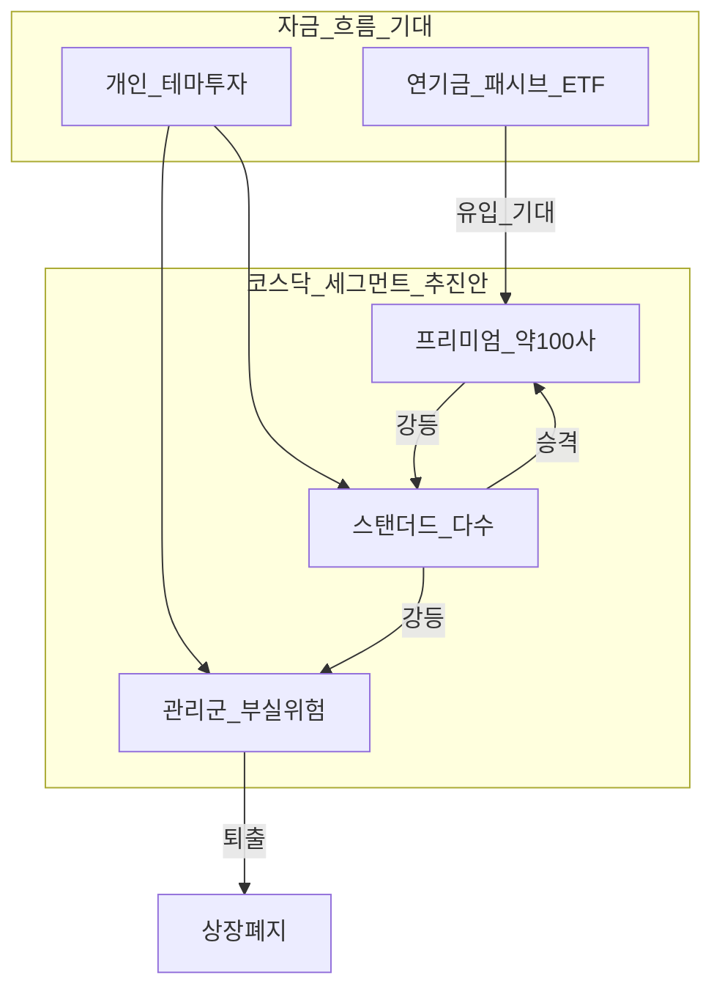
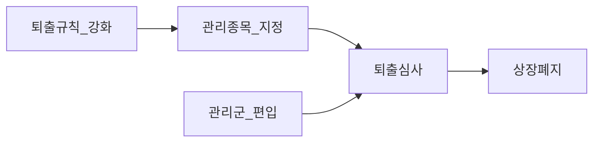
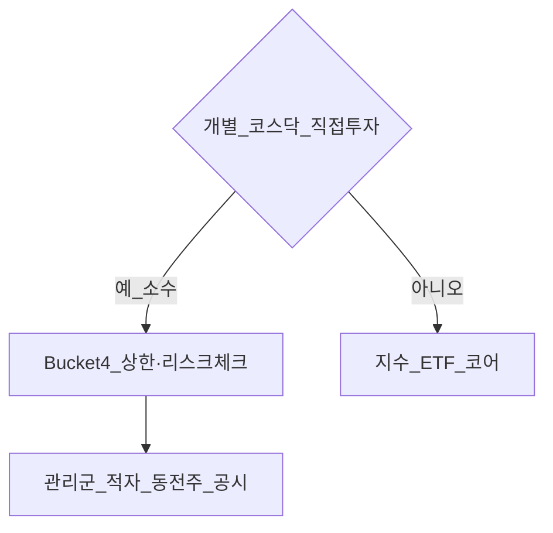

# 코스닥 승강제(세그먼트 제도) — 프리미엄·스탠더드·관리군

> **면책**: 교육 목적이며, 특정 종목 매수·매도 권유가 아닙니다. 제도는 **2026년 하반기 시행 예정**이며 세부 기준·일정은 **금융위·한국거래소 공식 공고**로 반드시 재확인하세요.

## 메타

| 항목 | 내용 |
|------|------|
| 최종 검증일 | 2026-05-24 |
| 정책 기준일 | 금융위·KRX 보도 (2026.3~5), FSC 영문 보도 (2026.4) |
| 난이도 | L3 (Deep) — [READER-GUIDE](../docs/READER-GUIDE.md) |
| 예상 읽기 시간 | 40~50분 |
| 관련 bucket | Bucket 3(코어는 지수·ETF), Bucket 4(개별 코스닥·테마) |

## 0. 이 편 읽기 전 (5분)

| 항목 | 내용 |
|------|------|
| **난이도** | L3 (Deep) — [READER-GUIDE §L등급](../docs/READER-GUIDE.md) |
| **선수** | [korea-ats-nextrade](korea-ats-nextrade.md), [domestic-stocks-tax](../06-korea-policy/tax/domestic-stocks-tax.md) |
| **이번 편에서 쓰는 기호** | 본문 §4·§4a 표 참고 |
| **복습 한 줄** | — |

## TL;DR

1. **승강제** = 코스닥을 **프리미엄(1부)·스탠더드(2부)·관리군(3부)** 으로 나누고, 기준에 따라 **승격·강등**하는 **세그먼트(리그) 제도** (도입 추진 중).
2. **프리미엄**은 우량 **약 100개 이내**(초안 80~170 → **압축** 검토) — 연기금·패시브 ETF·지수 상품 연계 기대.
3. **관리군**은 부실·퇴출 위험 종목 — **상장폐지 리스크** 집중, “좀비기업” 대거 편입 우려(보도).
4. **병행**: 2026년 7월~ **동전주·시총·자본잠식·공시** 강화로 **퇴출 속도↑** (FSC).
5. 개인 투자자: **개별 코스닥 소형·적자 테마**는 Bucket 4·분산·지수 우선 검토; **프리미엄 지수/ETF**는 제도 확정 후 상품 출시 확인.

---

## 1. 한 줄 정의 + 왜 중요한가

**정의**: 코스닥 **승강제**(공식 명칭은 **세그먼트 제도·프로모션·레게이션** 등으로 보도)는 상장사를 **재무·성장·지배구조·규모** 등으로 **상·중·하** 구간에 나누고, 일정 기준을 충족하면 **상위 구간으로 승격**, 미달 시 **하위 구간으로 강등**하는 시장 구조 개편입니다.

**왜 중요한가**:
- 코스닥은 개인·성장주 투자 비중이 커서, **“어느 리그에 있느냐”** 가 유동성·기관 수요·상장폐지 기대에 영향을 줄 수 있습니다.

!!! info "ETF"
    지수·자산 **바구니**를 한 종목처럼 거래

- **패시브 자금**(연기금, 성장펀드, 코스닥 ETF)이 **프리미엄 100**에 몰리면, **스탠더드·관리군** 은 상대적 **왕따·낙인** 논쟁이 있습니다 ([전자신문 보도](https://www.etnews.com/20260513000309)).
- 기존 [korea-ats-nextrade.md](korea-ats-nextrade.md)(거래 시간·거래소)와 합쳐 보면, **“어디서·어떤 종목을·얼마나 안전하게”** 사는지가 2026년부터 더 복잡해집니다.

---

## 2. 선수 지식 / 이후 읽을 것

**선수**:
- [korea-ats-nextrade.md](korea-ats-nextrade.md) — KRX·NXT 이중 시장  
- [domestic-stocks-tax.md](../06-korea-policy/tax/domestic-stocks-tax.md) — 국내주식 세금  

**이후**:
- [passive-vs-active.md](../04-portfolio/passive-vs-active.md)  
- [core-satellite-framework.md](../04-portfolio/core-satellite-framework.md)  
- [time-horizon-and-buckets.md](../04-portfolio/time-horizon-and-buckets.md)

---

## 3. 직관·비유 — “코스닥 K리그 승강제”

축구 **K리그 1·2·3부**와 비슷하게 이해할 수 있습니다.

| 비유 | 제도 (보도상 명칭) |
|------|-------------------|
| 1부 | **프리미엄(Premium)** — 상위 약 100사 |
| 2부 | **스탠더드(Standard)** — 일반 성장·중견 상장사 |
| 3부·관리 | **관리군(Management / Watchlist)** — 퇴출·거래 주의 |

**차이점**: 축구와 달리 **관리군**은 단순 “실력 하락”이 아니라 **상장폐지 절차로 가는 통로**에 가깝다는 점이 핵심 리스크입니다.

---

## 4. 정식 개념·용어

| 용어 | English | 설명 |
|------|------|----------------|
| 승강제 | Promotion & Relegation | 세그먼트 간 이동 |
| 세그먼트 | Segment / Tier | 프리미엄·스탠더드·관리군 |
| 프리미엄 | Premium segment | 우량·기관 투자 대상 후보 |
| 관리군 | Management segment | 부실·퇴출 관리 대상 |
| 상장폐지 | Delisting | 시장에서 제외 |
| 동전주 | Penny stock | 종가 1,000원 미만 지속 등 (퇴출 규정 강화) |
| 기술특례 상장 | Tech-special listing | 적자·매출 부진 시 관리군·퇴출 이슈 (보도) |
| 저PBR 명단 | Low PBR disclosure | 동종업종 대비 PBR 하위 20% 등 공개 (정책) |

### 4a. 핵심 용어 (본문 등장 순)

> 복습용. 정의는 §4 본표·[glossary](../00-roadmap/glossary.md)·본문 `!!! info` 박스.

| 용어 | 한 줄 | 관련 이론 | glossary |
|------|------|----------------|
| 승강제 | 세그먼트 간 이동 | §4 | [glossary](../00-roadmap/glossary.md#승강제) |
| 세그먼트 | 프리미엄·스탠더드·관리군 | §4 | [glossary](../00-roadmap/glossary.md#세그먼트) |
| 프리미엄 | 우량·기관 투자 대상 후보 | §4 | [glossary](../00-roadmap/glossary.md#프리미엄) |
| 관리군 | 부실·퇴출 관리 대상 | §4 | [glossary](../00-roadmap/glossary.md#관리군) |
| 상장폐지 | 시장에서 제외 | §4 | [glossary](../00-roadmap/glossary.md#상장폐지) |
| 동전주 | 종가 1,000원 미만 지속 등 | §4 | [glossary](../00-roadmap/glossary.md#동전주) |
| 기술특례 상장 | 적자·매출 부진 시 관리군·퇴출 이슈 | §4 | [glossary](../00-roadmap/glossary.md#기술특례-상장) |
| 저PBR 명단 | 동종업종 대비 PBR 하위 20% 등 공개 | §4 | [glossary](../00-roadmap/glossary.md#저pbr-명단) |

---

## 5. 메커니즘 — 3단 리그와 자금 흐름

### 프리미엄(1부) — 보도 요지

| 항목 | 내용 |
|------|------|
| 규모 | **100개 이내** (당초 80~170·최대 170안 → **압축** 검토) |
| 선정 | 재무 건전성·성장성·지배구조 등 |
| 정책 기대 | **연기금·국민성장펀드**·패시브, **프리미엄 연계 지수·ETF** |
| 부가 | 영문 공시 등 **강화 요건** (보도) |

### 스탠더드(2부)

- 현재 코스닥 **다수** 상장사가 위치할 **일반 구간**  
- 중견·성장사도 **프리미엄 진입·유지 기준** 충족 시 승격 가능 (보도)

### 관리군(3부)

- **상장폐지 우려·거래 리스크** 큰 기업  
- **장기 적자·기술특례 후 실적 부진·동전주** 등 **다수 편입** 가능성 (언론·업계 우려)  
- **집중 퇴출 관리기간** (~2027년 6월까지 보도)과 연계

---

## 6. 승강제와 **별도로** 강화되는 상장폐지(퇴출)

승강제와 **동시에** “빠르고 엄격한 퇴출” 개편이 진행됩니다 ([FSC 영문 보도](https://www.fsc.go.kr/eng/pr010101/85903)).

| 조치 | 요지 | 시기(보도) |
|------|------|----------------|
| **동전주** | 종가 1,000원 미만 30거래일 → 관리; 90일 내 45일 미회복 시 퇴출 | **2026.7.1~** |
| **시가총액** | 코스닥 기준 단계적 상향 (예: 20억→30억 등) | 2026~2029 |
| **자본잠식** | 반기 기준 전액 잠식 추가 | 2026~ |
| **공시 벌점** | 퇴출 심사 기준 강화 (15점→10점 등) | 2026~ |
| **기술특례** | 상장 5년 내 핵심 사업 변경 시 퇴출 심사 | 시행 |
| **시뮬레이션** | 2026년 14社, 2029년 **165社(약 9.5%)** 퇴출 심사 대상 (FSC) | — |

**투자 함의**: 승강제 **관리군** + **퇴출 규칙 강화**가 겹치면, **개별 코스닥 소형·적자주** 의 **테일 리스크(꼬리 위험)** 가 커질 수 있습니다.

---

## 7. 한국 적용 — 일정(보도 기준, 변동 가능)

| 시점 | 내용 |
|------|------|
| 2026.3~5 | 금융위·KRX **1·2부·관리군** 구조 발표·보도 |
| 2026.5~6 | 시장 설명회·의견 수렴 |
| **2026.7** | 코스닥 30주년 등에서 **개편 방향 확정** 예정 (보도) |
| **2026.10** | 승강제 **이르면 시행** (보도) |
| 2026.7.1~ | **동전주·시총** 등 퇴출 규칙 강화 시행 |
| ~2027.6 | **집중 퇴출 관리기간** (보도) |

> **170개 vs 100개**: 초기안은 프리미엄 **80~170** → 최근 보도는 **100개 이내 압축**이 유력. **최종 숫자는 공식 확정 전까지 “가변”** 으로 두세요.

---

## 8. 저PBR 명단 공개 (정책 맥락)

금융위 방침(보도): **동종업종 대비 PBR 하위 20%** 가 **2반기 연속**이면 **명단 공개** → 기업가치 제고 계획 공시 시 **일정 기간 면제**.

| 투자자 관점 |
|-------------|
| “저평가” 자동 매수 신호 **아님** — **거버넌스·실적** 악화와 겹칠 수 있음 |
| **가치함정(value trap)** 과 구분 필요 |
| 코스피·코스닥 **개별 종목** Bucket 4에서만 소액·심화 리서치 |

---

## 9. 찬반·업계 이슈 (균형 잡힌 정리)

### 정책 취지 (찬성 논리)

- 코스닥 **질적 승격**, 기관·연기금 **장기 자금** 유입  
- **패시브·ETF** 상품화 → [passive-vs-active.md](../04-portfolio/passive-vs-active.md)  
- **부실기업 조기 퇴출** → 시장 신뢰  
- 우량사 **코스피 이전** 완화·체류 유인 (보도)

### 우려 (벤처·일부 업계, 보도)

- **시총 줄세우기** — 혁신 초기 기업 **낙인**  
- 프리미엄 **100** vs 나머지 **1,700+** — **양극화**  
- **바이오·기술특례** 장기 적자도 시총 크면 관리군 논란  
- 개인 투자자의 **테마·소형주** 전략 축소 압력

---

## 10. 포트폴리오·bucket 연결 (교육용)

| 투자 형태 | 승강제·퇴출 강화 시사점 |
|-----------|-------------------------|
| **코스닥 지수·ETF** | 프리미엄 지수·ETF 출시 후 **추적 범위** 확인 |
| **코스피 대형·글로벌** | 코어 분산 — Bucket 3 |
| **개별 코스닥** | Bucket **4** 상한, 관리군·적자·동전주 **회피 규칙** |
| **ISA 서민형** | 국내주식 비과세는 유지, **종목 리스크**는 본인 |
| **단타·NXT 장후** | 관리군·동전주 = **변동성·갭 하락** 주의 |

**10억+ 장기 경로**(교육 프레임): 연봉·저축 + **글로벌·코어 인덱스** + 세제(ISA) > 개별 코스닥 **테마 베팅**.

---

**Q. 실무에서는?**  
교과서 식·기호를 그대로 적용하기 전에 **수수료·세금·데이터 시점**을 분리한다. 숫자는 [DEPTH-STANDARD](../docs/DEPTH-STANDARD.md)처럼 기호만 먼저 맞추고, 법령·시장 수치는 §8 표·외부 출처로 갱신한다.

## 11. 숫자·가상 시나리오 (교육)

### 시나리오 A: 프리미엄 편입

| 가상 | 내용 |
|------|------|
| 기업 X | 코스닥 중견, 흑자·시총 상위 |
| 이벤트 | 프리미엄 편입 |
| 기대 | 거래대금·기관 관심 ↑ (보장 아님) |
| 리스크 | 유지 기준 미달 시 **강등** |

### 시나리오 B: 관리군 편입

| 가상 | 내용 |
|------|------|
| 기업 Y | 3년 연속 적자, 종가 900원 장기화 |
| 이벤트 | 관리군 + 동전주 규정 |
| 결과 | 주가·유동성 급변, **퇴출 가능성** ↑ |

### 시나리오 C: 개인 포트폴리오

| | 비중(가상) |
|--|------------|
| 글로벌·코스피 ETF | 70% |
| 코스닥 프리미엄 ETF (출시 후) | 20% |
| 개별 코스닥 | **10% 상한** |

---

## 12. FAQ

**Q1. 승강제 시행 확정인가요?**  
**A.** **추진·보도** 단계. 7월 확정·10월 시행 **예정** — 공식 공고 확인.

**Q2. 프리미엄 100개면 나머지는 못 사나요?**  
**A.** **거래 가능**. 다만 유동성·기관 관심 **차이** 가능.

**Q3. 관리군 = 바로 상폐?**  
**A.** **아님**. 퇴출 **위험 높음** + 규정 강화와 **겹침**.

**Q4. KRX·NXT와 관계?**  
**A.** **상장 구간**(승강제) vs **거래 장소**(KRX/NXT). [korea-ats-nextrade.md](korea-ats-nextrade.md).

**Q5. ISA에서 코스닥 개별주?**  
**A.** 가능(중개형). **세금**과 별개로 **퇴출·갭** 리스크.

**Q6. 바이오·2차전지 테마주?**  
**A.** 적자·시총·기술특례 이력으로 **관리군** 논의 대상 가능 (보도).

**Q7. 코스닥 전체 ETF는?**  
**A.** 지수 구성 변경·프리미엄 ETF **신설** 여부 **추적**.

**Q8. 승강제 vs 퇴출 개편?**  
**A.** **병행**. 리그 이동 + **동전주·시총** 퇴출.

**Q9. 해외주식(QQQ)과 관련?**  
**A.** **직접 무관**. 국내 주식 비중·심리 간접 영향만.

**Q10. 지금 뭘 해야 하나?**  
**A.** 7~10월 **KRX·금융위 공지** 구독, 개별 코스닥 비중·**퇴출 필터** 규칙 초안 작성.

---

## 13. 함정·리스크

- **확정 전 과도한 매매**  
- “프리미엄 = 무조건 오른다”  
- **관리군 = 일시 조정** 착각  
- **동전주·저PBR** 을 저평가만 보고 매수  
- 승강제와 **ATS 장후 단타** 리스크 **중첩**

---

## 14. 심화 읽기

- [FSC — KOSDAQ Market Reform](https://www.fsc.go.kr/eng/pr010101/85903)  
- [references/sources.md](../references/sources.md)  
- [kosdaq-tier-system-primer.md](kosdaq-tier-system-primer.md) (5분 요약)

---

## 15. 스스로 점검 퀴즈

1. 승강제의 3개 구간 이름은?  
2. 프리미엄에 몰리기를 기대하는 자금 유형은?  
3. 2026년 7월부터 강화된 퇴출 규칙 예시 하나는?  
4. 개별 코스닥은 bucket 몇에 두는 것이 교육 프레임과 맞나?  
5. 승강제와 NXT의 차이 한 줄은?

??? note "정답 힌트"

    1. 프리미엄·스탠더드·관리군 · 2. 연기금·패시브·ETF · 3. 동전주(1000원 미만) 등 · 4. Bucket 4(상한) · 5. 상장 tier vs 거래소