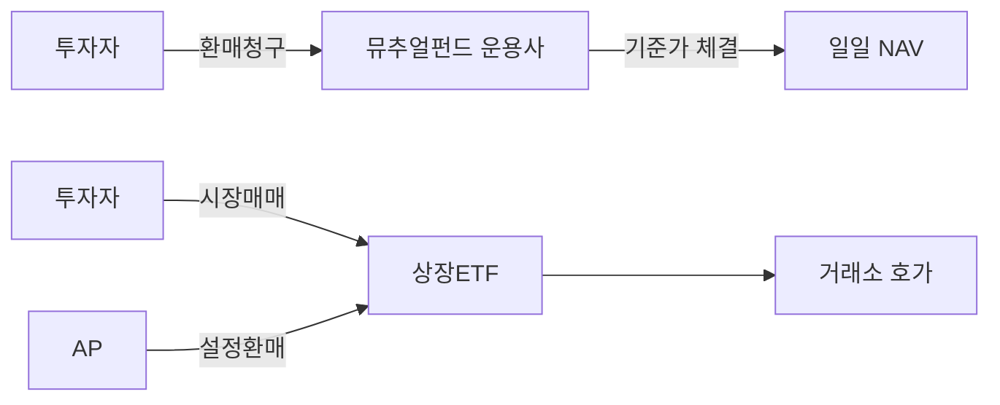
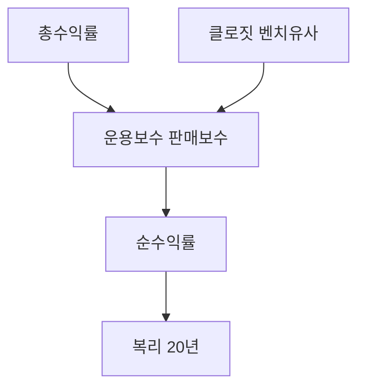
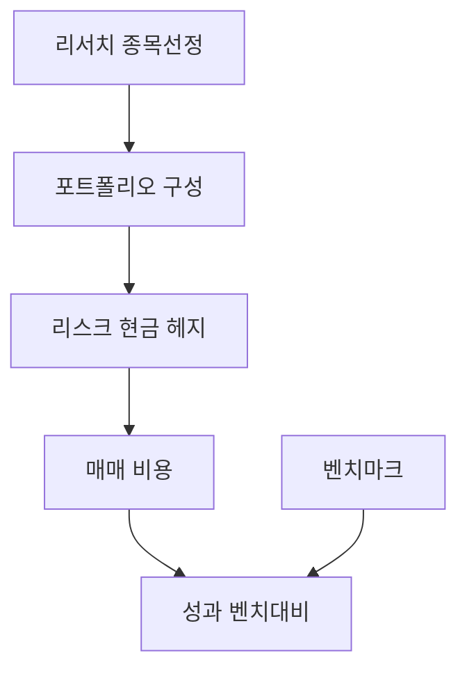
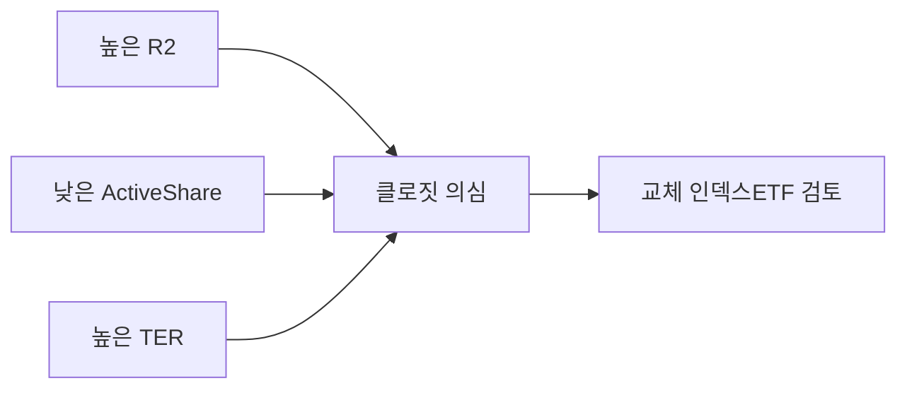
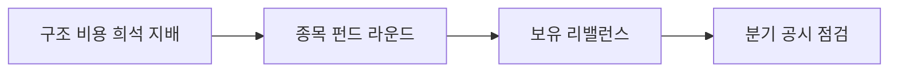

# 액티브 뮤추얼 펀드 — ETF 대비·보수·클로짓 인덱싱·한국 시장

> **면책**: 본 문서는 교육 목적이며, 특정 펀드·ETF·운용사에 대한 매수·매도 권유가 아닙니다. 보수·환매수수료·집합투자규약·세제는 변경될 수 있으므로 **간이투자설명서·금융투자상품설명서·금융감독원·국세청** 공식 자료를 확인하세요. 수익률·순위는 **가상** 예시이며 과거 성과가 미래를 보장하지 않습니다.

## 메타

| 항목 | 내용 |
|------|------|
| 최종 검증일 | 2026-05-25 |
| 정책·법령 기준일 | 집합투자업규율·세제 2025 확정, 2026 **별도 표기** |
| 난이도 | L4 (Graduate) — [READER-GUIDE](../docs/READER-GUIDE.md) |
| 예상 읽기 시간 | 150~180분 |
| 관련 bucket | Bucket 3 (펀드·ETF 선택), Bucket 4 (액티브·테마) |

## 0. 이 편 읽기 전 (5분)

| 항목 | 내용 |
|------|------|
| **난이도** | L4 (Graduate) — [READER-GUIDE §L등급](../docs/READER-GUIDE.md) |
| **선수** | [etf-index-funds](etf-index-funds.md), [etf-index-funds-deep](etf-index-funds-deep.md) |
| **이번 편에서 쓰는 기호** | 본문 §4·§4a 표 참고 |
| **복습 한 줄** | L3 선수 편을 먼저 읽으면 수식이 수월함 |

## TL;DR

1. **액티브 뮤추얼 펀드**는 운용인력이 **벤치마크 초과 수익(알파)** 를 노리며 **종목·비중·현금**을 조정하는 **집합투자** 상품이다 — **ETF**는 대부분 **지수 추종(패시브)** 이지만 **액티브 ETF**도 늘고 있다.
2. **총보수(TER)·판매보수·환매수수료**는 **복리**로 **장기 수익**을 깎는다 — **1%p** 차이가 20년 후 **체감**이 크다.
3. **클로짓 인덱싱(closet indexing)** 은 “액티브”라고 하면서 **벤치마크와 거의 같은** 포트폴리오·**낮은 추적오차 대비 높은 보수** — **R²·Active Share**로 교육상 점검한다.
4. **한국** 펀드 시장은 **판매 채널(은행·증권)** ·**혼합형·배당형**·**연금 래핑** 비중이 커 **ETF**와 **비용 구조**·**세금 경로**가 다르다.
5. **성과**는 **운용자·운용 규모·스타일**에 따라 **지속적 알파**가 드물다 — [passive-vs-active](../04-portfolio/passive-vs-active.md)·[market-efficiency-emh](../08-advanced/market-efficiency-emh.md)와 연결.
6. 코어 장기 자금은 **저비용 패시브(ETF·인덱스)** 우선 검토, 액티브는 **역할·한도·비용 대비 기대**를 명시한 **위성**으로 두는 **교육적** 프레임.

## 1. 한 줄 정의 + 왜 중요한가

!!! info "ETF (Exchange-Traded Fund)"
    거래소에 상장된 인덱스·자산 묶음 펀드.

**정의**: **액티브 뮤추얼 펀드 심화**는 운용사가 **시장·섹터·종목**을 선택해 **벤치마크를 이기려는** 집합투자상품의 **비용 구조·성과 측정·클로짓 인덱싱·한국 판매 환경**을, **ETF·패시브**와 대비해 설명하는 학습이다.

!!! info "TER"
    연간 **총보수율** — 장기 복리에 영향

**왜 중요한가**: 한국 개인은 **펀드**로 첫 투자를 접하는 경우가 많다. **“전문가가 대신”** 이라는 내러티브는 **보수·환매비·세금·현금성 자산 비중**을 간과하게 만든다. 동일 **코스피200** 노출이라도 **ETF 0.2%대 TER** vs **액티브 1.5%+** 는 **장기 복리**에서 **수 %p~10%p** 격차로 이어질 수 있다(가상 시뮬레이션). [etf-index-funds-deep](etf-index-funds-deep.md)의 **추적오차·AP** 논의와 **대칭**으로, 액티브는 **정보·스킬·비용**의 **트레이드오프**다.

**핵심은:** 한국 개인 투자자 중 많은 수가 처음 투자를 **은행 창구 펀드**로 시작합니다. 창구 직원이 권유하는 펀드는 보통 **판매보수가 높은** 상품입니다. "전문가가 관리해주는 프리미엄"이라고 느끼지만, 실제로는 **TER 1.5%+판매보수**가 장기 복리를 크게 깎습니다. 코어 자산의 ETF 전환을 검토하기 전에, 지금 보유 펀드의 TER·벤치마크·Active Share를 확인하는 것이 출발점입니다.

## 2. 선수 지식 / 이후 읽을 것

**선수**:
- [etf-index-funds](etf-index-funds.md) — ETF·인덱스 입문
- [etf-index-funds-deep](etf-index-funds-deep.md) — 추적·보수 심화
- [passive-vs-active](../04-portfolio/passive-vs-active.md)
- [compound-interest-and-time-value](../01-foundations/compound-interest-and-time-value.md)

**이후**:
- [performance-measurement](../04-portfolio/performance-measurement.md) — 샤프·알파
- [factor-investing-fama-french](../08-advanced/factor-investing-fama-french.md)
- [account-product-tax-map](../06-korea-policy/tax/account-product-tax-map.md)

## 3. 직관·비유

**택시 vs 버스**: **액티브**는 **목적지(알파)** 를 위해 **경로 변경**하는 **택시** — **요금(보수)** 이 **버스(인덱스)** 보다 **비싸다**. **클로짓 인덱싱**은 택시 요금을 내고 **버스 노선과 거의 같게** 가는 것.

**레스토랑 vs 밀키트**: **운용사**는 **셰프(포트폴리오 매니저)** — **재료비(거래비용)**·**인건비(운용보수)**·**팁(판매보수)** 가 **메뉴 가격**이다. **패시브 ETF**는 **표준 레시피 밀키트** — **맛(수익률 패턴)** 은 시장 평균에 **가깝고** **가격**은 **낮다**.

**체육관 PT**: **PT(액티브)** 는 **맞춤**이지만 **지속 가능한 초과 체력(알파)** 을 **모든 PT가** 보장하지는 않는다 — **본인 목표(리스크·기간)** 와 **비용**이 맞는지가 핵심.

**쉽게 말하면:** 액티브 펀드 vs 패시브 ETF 선택을 슈퍼마켓에 비유합니다. 패시브 ETF는 **정가 마트** — 코스피200 가격을 그대로 0.2% 수수료로 삽니다. 액티브 펀드는 **컨시어지 쇼핑 서비스** — "더 좋은 물건을 골라드리겠다"며 1.5% 요금을 받습니다. 문제는 서비스 담당자가 **마트 물건과 거의 같은 것**을 고르면서 요금만 비싼 경우(클로짓 인덱싱)가 많다는 것입니다.

**핵심은:** 액티브 펀드가 나쁜 게 아닙니다. **"정말 액티브"한 펀드**(Active Share 60% 이상, 낮은 R², 합리적 TER)는 코어 인덱스가 제공하지 않는 가치를 줄 수 있습니다. 하지만 **클로짓 인덱싱 펀드에 액티브 요금을 내는 것**은 순수하게 손해입니다. R²와 Active Share 두 지표로 확인하세요.

## 4. 정식 개념·용어

| 용어 | English | 교육용 정의 |
|------|------|----------------|
| 뮤추얼 펀드 | Mutual fund (open-end) | **환매**로 유동성 제공하는 **집합투자** |
| 액티브 운용 | Active management | **벤치마크 대비** 초과 수익 추구 |
| 패시브 | Passive | **지수 추종**·규칙 기반 |
| 벤치마크 | Benchmark | 성과 **비교 기준** 지수 |
| 알파 | Alpha | **벤치마크 대비** 초과 수익(정의·모형별 상이) |
| 베타 | Beta | **시장 민감도** |
| TER | Total expense ratio | **총보수율** (운용+기타) |
| 판매보수 | Distribution fee | **판매 채널** 보수 (선취·후취) |
| 선취·후취 | Front/back-end load | **가입·환매** 시 **판매** 보수 |
| 기준가격 | NAV per unit | **순자산÷좌수** — **매일** 산출(원칙) |
| 설정·환매 | Subscription/redemption | **운용사**와 **직접** 거래(개방형) |
| 클로짓 인덱싱 | Closet indexing | **액티브 명목**·**인덱스 유사** 포트 |
| Active Share | Active share | 포트폴리오와 벤치 **비중 차이** 합 |
| R² | R-squared | 수익률 변동 중 **벤치 설명 비율** |
| 추적오차 | Tracking error | **벤치 대비** 수익률 편차(액티브에도 적용 가능) |
| 스타일 박스 | Style box | **대형·가치** 등 **스타일** 분류 |
| 용량 | Capacity | **AUM** 커질 때 **알파** **희석** |
| 액티브 ETF | Active ETF | **상장**·**액티브** 운용 결합 |
| ETF | Exchange-traded fund | **거래소** **시장가** 매매 |
| 프리미엄/디스카운트 | Premium/discount | ETF **시세 vs NAV** (펀드는 해당 약함) |

### 4a. 핵심 용어 (본문 등장 순)

> 복습용. 정의는 §4 본표·[glossary](../00-roadmap/glossary.md)·본문 `!!! info` 박스.

| 용어 | 한 줄 | 관련 이론 | glossary |
|------|------|------|----------------|
| 뮤추얼 펀드 | **환매**로 유동성 제공하는 **집합투자** | §4 | [glossary](../00-roadmap/glossary.md#뮤추얼-펀드) |
| 액티브 운용 | **벤치마크 대비** 초과 수익 추구 | §4 | [glossary](../00-roadmap/glossary.md#액티브-운용) |
| 패시브 | **지수 추종**·규칙 기반 | §4 | [glossary](../00-roadmap/glossary.md#패시브) |
| 벤치마크 | 성과 **비교 기준** 지수 | §4 | [glossary](../00-roadmap/glossary.md#벤치마크) |
| 알파 | **벤치마크 대비** 초과 수익 | §4 | [glossary](../00-roadmap/glossary.md#알파) |
| 베타 | **시장 민감도** | §4 | [glossary](../00-roadmap/glossary.md#베타) |
| TER | **총보수율** | §4 | [glossary](../00-roadmap/glossary.md#ter) |
| 판매보수 | **판매 채널** 보수 | §4 | [glossary](../00-roadmap/glossary.md#판매보수) |
| 선취·후취 | **가입·환매** 시 **판매** 보수 | §4 | [glossary](../00-roadmap/glossary.md#선취·후취) |
| 기준가격 | **순자산÷좌수** | §4 | [glossary](../00-roadmap/glossary.md#기준가격) |
| 설정·환매 | **운용사**와 **직접** 거래 | §4 | [glossary](../00-roadmap/glossary.md#설정·환매) |
| 클로짓 인덱싱 | **액티브 명목**·**인덱스 유사** 포트 | §4 | [glossary](../00-roadmap/glossary.md#클로짓-인덱싱) |
| Active Share | 포트폴리오와 벤치 **비중 차이** 합 | §4 | [glossary](../00-roadmap/glossary.md#active-share) |
| R² | 수익률 변동 중 **벤치 설명 비율** | §4 | [glossary](../00-roadmap/glossary.md#r²) |
| 추적오차 | **벤치 대비** 수익률 편차 | §4 | [glossary](../00-roadmap/glossary.md#추적오차) |

## 5. 메커니즘

### 5.1 개방형 펀드 vs ETF (유동성·가격)

**교육**: 펀드는 **종가 기준가**로 **환매** — **장중** 가격 불확실성은 **ETF** 쪽이 **호가·괴리**로 나타난다.

### 5.2 비용이 복리에 미치는 경로

### 5.3 액티브 운용 의사결정 (개념)

### 5.4 클로짓 인덱싱 탐지 (교육)

## 6. 수식·모델

### 6.1 비용이 장기 자산에 미치는 근사 (가상)

| 기호 | 이름 | 이 식에서 의미 |
|------|------|----------------|
| **r** | 할인율·수익률 | 기간당 이자·요구수익률 |
| **n** | 기간 | 연·월 등 복리·할인에 쓰는 횟수 |
| **PV** | 현재가치 | 오늘 시점으로 환산한 금액 |
| **FV** | 미래가치 | 미래 시점의 목표·결과 금액 |

\[
A_T = A_0 (1 + r_g - c)^{T}
\]

**식 (기호)**: **A_T** = **A_0** (1 + **r_g** - **c**)^**T**

**식 (기호)**: **A_T** = **A_0** (1 + **r_g** - **c**)^**T**

**식 (기호)**: **A_T** = **A_0** (1 + **r_g** - **c**)^**T**

**읽는 법**: **A_T**와 **A_0**의 관계를 위 식으로 쓴다. 경제·재무 해석은 변수표 「이 식에서 의미」와 [DEPTH-STANDARD](../docs/DEPTH-STANDARD.md) 기호 예제를 맞춘다.
**유도 (L4)**:
1. **정의**: **A_T**, **A_0**, **r**를 동일 시점·동일 통화로 맞춘다. — 단위 불일치면 식이 무의미해진다.
2. **식 변형**: 양변을 정리해 목표 변수를 한쪽에 둔다. — 할인·복리는 **시점 이동**이 핵심이다.

\(r_g\): 총수익률, \(c\): **연간 총비용**, \(T\): 연수. \(c\)가 **1%p** 증가하면 \(T=30\)에서 **차이**가 **눈에 띄게** 커진다(표로 예제).

### 6.2 Jensen's Alpha (교육)

| 기호 | 이름 | 이 식에서 의미 |
|------|------|----------------|
| **r** | 할인율·수익률 | 기간당 이자·요구수익률 |
| **n** | 기간 | 연·월 등 복리·할인에 쓰는 횟수 |
| **PV** | 현재가치 | 오늘 시점으로 환산한 금액 |
| **FV** | 미래가치 | 미래 시점의 목표·결과 금액 |

\[
\alpha = R_p - [R_f + \beta_p (R_m - R_f)]
\]

**식 (기호)**: **α**_ = **R_p** - [**R_f** + **β_p** (**R_m** - **R_f**)]

**식 (기호)**: **α**_ = **R_p** - [**R_f** + **β_p** (**R_m** - **R_f**)]

**식 (기호)**: **α**_ = **R_p** - [**R_f** + **β_p** (**R_m** - **R_f**)]

**읽는 법**: 시장 초과수익에 대한 민감도가 **β**다. 

**R_f**·**ERP**와 함께 요구수익 **r**을 구성한다. [DEPTH-STANDARD](../docs/DEPTH-STANDARD.md) 참고.
**유도 (L4)**:
1. **정의**: **R_p**, **R_f**, **eta_p**를 동일 시점·동일 통화로 맞춘다. — 단위 불일치면 식이 무의미해진다.
2. **식 변형**: 양변을 정리해 목표 변수를 한쪽에 둔다. — 할인·복리는 **시점 이동**이 핵심이다.
**한계**: **베타 추정 오차**·**비유동**·**스타일** 혼입 — **다요인** 모형과 병행.

### 6.3 Active Share (Cremers & Petajisto 개념)

| 기호 | 이름 | 이 식에서 의미 |
|------|------|----------------|
| **r** | 할인율·수익률 | 기간당 이자·요구수익률 |
| **n** | 기간 | 연·월 등 복리·할인에 쓰는 횟수 |
| **PV** | 현재가치 | 오늘 시점으로 환산한 금액 |
| **FV** | 미래가치 | 미래 시점의 목표·결과 금액 |

\[
AS = \frac{1}{2} \sum_i |w_{p,i} - w_{b,i}|
\]

**식 (기호)**: **AS** = (1) / (2) Σ_i |w_p,**i** - **w_b**,i|

**식 (기호)**: **AS** = (1) / (2) Σ_i |w_p,**i** - **w_b**,i|

**식 (기호)**: **AS** = (1) / (2) Σ_i |w_p,**i** - **w_b**,i|

**읽는 법**: **sum_i**와 **w_**의 관계를 위 식으로 쓴다. 경제·재무 해석은 변수표 「이 식에서 의미」와 [DEPTH-STANDARD](../docs/DEPTH-STANDARD.md) 기호 예제를 맞춘다.
**유도 (L4)**:
1. **정의**: **sum_i**, **w_**, **w_**를 동일 시점·동일 통화로 맞춘다. — 단위 불일치면 식이 무의미해진다.
2. **식 변형**: 양변을 정리해 목표 변수를 한쪽에 둔다. — 할인·복리는 **시점 이동**이 핵심이다.

\(w_p\): 펀드 비중, \(w_b\): 벤치 비중. **AS 낮음** + **높은 보수** → **클로짓** 의심
| 기호 | 이름 | 이 식에서 의미 |
|------|------|----------------|
| **r** | 할인율·수익률 | 기간당 이자·요구수익률 |
| **n** | 기간 | 연·월 등 복리·할인에 쓰는 횟수 |
| **PV** | 현재가치 | 오늘 시점으로 환산한 금액 |

(교육).

### 6.4 정보 비율 (Information
| 기호 | 이름 | 이 식에서 의미 |
|------|------|----------------|
| **r** | 할인율·수익률 | 기간당 이자·요구수익률 |
| **n** | 기간 | 연·월 등 복리·할인에 쓰는 횟수 |
| **PV** | 현재가치 | 오늘 시점으로 환산한 금액 |

 Ratio)

| 기호 | 이름 | 이 식에서 의미 |
|------|------|----------------|
| **r** | 할인율·수익률 | 기간당 이자·요구수익률 |
| **n** | 기간 | 연·월 등 복리·할인에 쓰는 횟수 |
| **PV** | 현재가치 | 오늘 시점으로 환산한 금액 |

\[
IR = \frac{\text{연간 초과수익 평균}}{\text{추적오차(초과수익 변동)}}
\]

**식 (기호)**: **IR** = (연간 초과수익 평균) / (추적오차(초과수익 변동))

**식 (기호)**: **IR** = (연간 초과수익 평균) / (추적오차(초과수익 변동))

**식 (기호)**: **IR** = (연간 초과수익 평균) / (추적오차(초과수익 변동))

**읽는 법**: **r**와 **n**의 관계를 위 식으로 쓴다. 경제·재무 해석은 변수표 「이 식에서 의미」와 [DEPTH-STANDARD](../docs/DEPTH-STANDARD.md) 기호 예제를 맞춘다.
**유도 (L4)**:
1. **정의**: **r**, **n**, **PV**를 동일 시점·동일 통화로 맞춘다. — 단위 불일치면 식이 무의미해진다.
2. **식 변형**: 양변을 정리해 목표 변수를 한쪽에 둔다. — 할인·복리는 **시점 이동**이 핵심이다.
**지속 가능 알파** 논의에 쓰이나 **사후** 지표.

---

*:
1. **정의**: **r**, **n**, **PV**를 동일 시점·동일 통화로 맞춘다. — 단위 불일치면 식이 무의미해진다.
2. **식 변형**: 양변을 정리해 목표 변수를 한쪽에 둔다. — 할인·복리는 **시점 이동**이 핵심이다.
**지속 가능 알파** 논의에 쓰이나 **사후** 지표.

## 7. 한국 적용

### 7.1 2025년 기준 (교육 요지)

| 항목 | 한국 특징 |
|------|-----------|
| 판매 채널 | **은행·증권** 창구·온라인 — **판매보수** 구조 |
| 상품 유형 | **주식형·혼합형·채권형·MMF**·**연금 래핑** |
| 벤치 | **KOSPI200·KOSDAQ**·**혼합** 벤치 |
| ETF 성장 | **KRX ETF** 거래대금·종목 수 **확대** |
| 공시 | **펀드 공시**·**보수**·**기준가** — **금감원** |
| 세금 | **배당소득**·**환매 차익** — [account-product-tax-map](../06-korea-policy/tax/account-product-tax-map.md) |

### 7.2 액티브 vs ETF — 한국 투자자 체크리스트

| 질문 | 액티브 펀드 | ETF |
|------|------|----------------|
| 목표 | **알파** 기대? | **베타·노출**? |
| 비용 | TER+**판매**? | TER+**거래**? |
| 유동성 | **T+2 환매** 등 | **장중** 매매 |
| 클로짓 | R²·AS 확인 | 해당 적음 |
| 계좌 | **ISA·연금** 래핑? | 동일 검토 |

### 7.3 2026년 (재확인)

| | 메모 |
|--|------|
| ETF·펀드 규제 | **합성·레버리지**·**공시** — [etf-index-funds-deep](etf-index-funds-deep.md) |
| 세제 | **금융투자소득세**·**연금** — 국세청 연간 안내 |

### 7.4 한국 투자자 실전 가이드 (교육)

**펀드 선택 전 체크 (교육)**:
1. **금융투자상품설명서** → TER (총보수율) 확인 → 0.5% 초과 시 ETF 대안 비교
2. **펀드 공시 포털** (금감원 인터넷 공시시스템) → 기준가, 월간 운용보고서, 포트폴리오 공시
3. **R² 추정** → 3년 월간 수익률 vs KOSPI200 회귀 (증권사 리포트 참고)
4. **Active Share** → 운용보고서 보유 종목 vs 벤치마크 비교
5. **ISA/IRP 래핑** → 같은 TER이어도 계좌 내 과세 방식 차이 → [account-product-tax-map.md](../06-korea-policy/tax/account-product-tax-map.md)

**한국 펀드 주요 판매 경로 (교육)**:

| 경로 | 특징 | 주의점 |
|------|------|----------------|
| 은행 창구 | 선택지 제한, 선취·판매보수 높음 | 이해상충 가능 |
| 증권사 창구·온라인 | ETF 대안 비교 용이 | 온라인 할인 확인 |
| IRP 안 펀드 | 세액공제+세후 복리 | TER 동일 누적 |
| ISA 안 ETF/펀드 | 비과세 한도 | 상품 라인업 확인 |

**쉽게 말하면:** 같은 코스피200 노출을 ISA 안에서 **0.05% TER ETF**로 사는 것과 **1.5% TER 액티브 펀드**로 사는 것의 차이는, 30년 후 수익률에서 수십 퍼센트 포인트가 될 수 있습니다(가상 시뮬레이션). 비용이 **복리로 누적**되기 때문입니다.

## 8. 숫자 예제 (가상)

### 예제 1 — 비용 복리 (30년, 가상)

| | 연 7% 총수익, 비용 0.3% | 연 7%, 비용 1.5% |
|------|------|----------------|
| 초기 **F**| **F**| **F**|
| 30년 후(근사) | **약 **F**** | **약 **F**** |
| 차이 | — | **약 **F**** |

**교훈**: **1.2%p** 비용 차이가 **장기** **큰** 격차 — **알파**가 **지속**되어야 **상쇄**.

### 예제 2 — 클로짓 인덱싱 (가상 펀드 K)

| 지표 | 값 |
|------|-----|
| 벤치 | KOSPI200 |
| R² (3년) | 0.97 |
| Active Share | 12% |
| TER | 1.45% |
| 벤치 ETF TER | 0.20% |

**판단(교육)**: **벤치 유사** + **보수 7배** → **인덱스 ETF** 또는 **진짜 AS 높은** 액티브로 **대체 검토**.

### 예제 3 — 3년 성과 (가상)

| | 펀드 A (액티브) | KOSPI200 ETF |
|------|------|----------------|
| 연평균 | 9.2% | 8.5% |
| 표준편차 | 18% | 17% |
| 초과 | +0.7%p | 0 |
| TER | 1.3% | 0.2% |
| **순 초과(대략)** | **−0.5%p** | 0 |

**교훈**: **총수익** 초과 ≠ **순수익** 초과.

### 예제 4 — 환매수수료 (가상)

**후취 판매보수** 0.5%·**1년 미만 환매** **환매수수료** 1.0% — **단기 매매** 시 **이중** 비용.

### 예제 5 — 혼합형·채권형 (가상)

**주식 60%·채권 40%** 혼합 — **벤치**도 혼합. **주식 ETF+채권 ETF** **직접** 구성 시 TER **합 0.35%** vs 펀드 **1.2%** (가상).

### 예제 보강: 운용 비용의 복리 효과 단계별 계산 (가상, 기호)

**설정 (교육용 기호)**:
- 투자 원금: **M** (원화)
- 지수 연수익(세전): **R** (가상)
- 패시브 ETF TER: **c_p** (연)
- 액티브 펀드 TER: **c_a** (연)
- 보유 기간: **N** (년)

**누적 가치 비교**:

\[ V_{\text{패시브}} = M \times (1 + R - c_p)^N \]

\[ V_{\text{액티브}} = M \times (1 + R + \alpha - c_a)^N \]

단, **α** = 액티브 초과 수익률 (알 수 없음)

**가상 예시 (교육)**:

| 구분 | R | TER | α | N=20년 후 성과 |
|------|------|------|------|----------------|
| 패시브 ETF | +8% | 0.05% | 0 | 기준 |
| 액티브 펀드 A | +8% | 1.5% | 0 | -약 25% |
| 액티브 펀드 B | +8% | 1.5% | +1.5% | 패시브와 동률 |
| 슈퍼스타 액티브 | +8% | 1.5% | +3% | +약 25% |

**교훈**: 
1. 액티브가 TER만큼 초과 수익을 내지 못하면 → **패시브 하위**
2. **α ≥ c_a** 인 매니저를 미리 식별하는 것이 액티브 투자의 핵심 숙제
3. 장기(N이 클수록) 비용 차이의 복리 효과가 극대화 — "보이지 않는 복리 도둑"
4. 한국 액티브 펀드 평균 TER ≈ 1.3~2.0%임을 감안하면 α 허들이 상당히 높음

## 9. FAQ

**Q1. 액티브 펀드가 ETF보다 항상 비싼가요?**  
**A1.** **대체로** TER·판매보수가 **높다**. **액티브 ETF**는 **중간**대도 있으나 **거래비용** 별도.

**Q2. 1년 1위 펀드를 사도 되나요?**  
**A2.** **순위**는 **운**·**스타일** 반영 — **지속성** 낮음. [performance-measurement](../04-portfolio/performance-measurement.md) 참고.

**Q3. 클로짓 인덱싱을 어떻게 알아보나요?**  
**A3.** **R² 높음**·**Active Share 낮음**·**벤치와 유사 보유**·**높은 TER** — **간이설명서**·**월간 운용보고** 확인.

**Q4. 연금 계좌에 액티브 펀드가 많은 이유는?**  
**A4.** **판매 채널**·**상품 라인업**·**투자자 습관** — **비용**은 [pension-savings-account](../06-korea-policy/pension-savings-account.md)와 함께 **점검**.

**Q5. 액티브 ETF는 뮤추얼과 같은가요?**  
**A5.** **운용**은 액티브 **유사** — **유동성·가격**은 **ETF** 메커니즘([etf-index-funds-deep](etf-index-funds-deep.md)).

**Q6. MMF와 주식형 펀드 차이는?**  
**A6.** **MMF**는 **단기·현금성** — **주식 알파**와 **목적** 다름.

**Q7. 판매사가 추천하는 펀드를 믿어도 되나요?**  
**A7.** **이해상충** 가능 — **보수·벤치·보유** **스스로** 읽기. **교육** 목적 **비권유**.

**Q8. 한국에서 패시브 비중을 늘려야 하나요?**  
**A8.** **개인 목표**에 따름 — **코어**는 **저비용 패시브**가 **합리적**인 경우 **많음**([passive-vs-active](../04-portfolio/passive-vs-active.md)).

**Q9. 액티브가 유리한 시장은?**  
**A9.** **비효율**·**소형**·**집중** 논의 있으나 **실증**은 **섞임** — **비용** 감안.

**Q10. 펀드 기준가는 언제 확정되나요?**  
**A10.** **운용사 공시** — 보통 **당일 종가** 기준 **산출** (상품별 확인).

**Q11. 은행 창구에서 권유하는 펀드와 인터넷에서 직접 사는 펀드의 차이는?**
**A.** 보통 **은행 창구**는 판매보수(선취·후취)가 붙고 상품 선택이 제한됩니다. **온라인 직접 가입**(증권사 앱, 펀드 슈퍼마켓)은 **판매보수가 낮거나 없는** 클래스가 있습니다. 같은 펀드도 클래스(A/C/E형 등)에 따라 TER이 다릅니다. 직접 검색 후 **C형(온라인) vs A형(오프라인) TER 비교**가 기본 체크입니다.

**Q12. 연금 계좌(IRP·연금저축)에서 펀드와 ETF 중 어느 것이 유리한가요?**
**A.** 세후 관점에서는 **저비용 ETF**가 대개 유리합니다. 단, IRP 안의 상품 라인업이 제한적인 경우 ETF 선택이 없을 수도 있습니다. 있다면 **동일 벤치 추종 시 ETF TER < 펀드 TER**이 일반적입니다. [pension-savings-account.md](../06-korea-policy/pension-savings-account.md)에서 계좌별 가능 상품을 확인하세요.

**Q13. 클로짓 인덱싱 펀드를 발견했다면 바로 해지해야 하나요?**
**A.** 해지 전 **환매수수료·세금·재투자 타이밍**을 함께 고려해야 합니다. 1년 미만 환매 시 환매수수료가 붙는 경우가 있습니다. 세금(배당소득세)도 발생할 수 있습니다. 단기 비용이 크다면 **만기 후 점진적 교체** 또는 **신규 투자는 ETF, 기존 펀드는 유지**하는 단계적 전환이 실용적입니다.

## 10. 함정·리스크·한계

- **과거 수익률**만 보고 **가입**
- **클로짓**인데 **액티브 보수** 지불
- **환매수수료**·**세금** 미반영 **순수익** 착각
- **벤치 불일치**(해외주식 펀드 vs 국내 지수 비교)
- **AUM 폭증** 후 **알파** **희석**
- **스타일 드리프트** — **가치** 펀드가 **성장**으로 **이동**
- **유동성 위기** 시 **환매** **지연** (극단 사례, 규약 확인)

---

**Q. 실무에서는?**  
교과서 식·기호를 그대로 적용하기 전에 **수수료·세금·데이터 시점**을 분리한다. 숫자는 [DEPTH-STANDARD](../docs/DEPTH-STANDARD.md)처럼 기호만 먼저 맞추고, 법령·시장 수치는 §8 표·외부 출처로 갱신한다.

## 11. 심화 읽기

- [etf-index-funds-deep](etf-index-funds-deep.md)
- [market-efficiency-emh](../08-advanced/market-efficiency-emh.md)
- 금융감독원 **집합투자업** 규정·**펀드 공시**
- Cremers & Petajisto — **Active Share**
- [references/sources.md](../references/sources.md)

## 연습문제 (L4, 기호)

1. 위 §6 주요 식에서 변수 하나를 미지로 두고, 나머지를 기호로 둔 **관계식**을 쓰시오.
2. 가정이 깨질 때(유동성·세금·다중 IRR 등) 위 식의 **한계**를 기호·부등식으로 서술하시오.
3. §8 예제와 동일 기호(M·P·PV 등)로 **부호·단조성**만 검증하는 짧은 논증을 하시오.

### 해설 키

1. 직전 변수표의 「이 식에서 의미」를 이용해 동일 차원으로 정리한다.
2. 「가정이 깨지면」 절의 한계 사례와 연결한다.
3. 숫자 대입 없이 **부호**·**단위** 일치만 확인한다.
## 12. 스스로 점검 퀴즈

1. **클로짓 인덱싱** 세 가지 징후는?  
2. TER **1.5%** vs **0.2%** — 30년 **1억·연 7%** 가상 예제 **차이** 방향은?  
3. **개방형 펀드** vs **ETF** 유동성 차이 한 줄?  
4. **Jensen α**가 **양수**여도 **투자자 순수익**이 **음수**인 이유?  
5. 한국 **코어**에 액티브를 둘 때 **한도**를 두는 **교육적** 이유는?

??? note "정답 힌트"

    1. 높은 R², 낮은 AS, 높은 TER·벤치 유사  
    2. **저비용** 쪽 **최종 금액**更大  
    3. 펀드 **기준가 환매** vs ETF **장중 호가**  
    4. **보수·환매비·세금**  
    5. **비용·클로짓·알파 불확실**

## 부록 A — 보수 항목 분해 (가상 표)

| 항목 | 포함 | 교육 메모 |
|------|------|----------------|
| 운용보수 | TER | **매일** 기준가에서 **차감** |
| 판매보수 | 별도·후취 | **채널** 인센티브 |
| 수탁·사무 | TER | **고정** |
| 성과보수 | 일부 헤지·PE | **초과**에만 — **주식형** 흔치 않음 |
| 거래비용 | TER **외** | **회전율** ↑ 시 **숨은** 비용 |

## 부록 B — 액티브 ETF vs 뮤추얼 (교육)

| | 뮤추얼 | 액티브 ETF |
|------|------|----------------|
| 가격 | NAV | **시장가** |
| 프리미엄 | 거의 없음 | **가능** |
| 최소 거래 | **소액** 적립 | **1주** |
| 알파 소스 | 동일 **논리** | 동일 **논리** |

## 부록 C — 연금·ISA 래핑 (한국)

**DC·IRP·ISA** 안 **펀드**는 **세후** **복리**에 유리할 **수** 있으나 **상품 TER**는 **동일**하게 **누적** — **래핑**이 **알파**를 **보장**하지 않음.

## 부록 D — 성과 평가 5년 규칙 (교육)

**최소 3~5년**·**불리한 시장** 포함 — **1년** **순위**는 **노이즈**. **스타일** 조정(가치/성장) 후 **초과**를 보려면 **다요인** 잔차 논의 — [factor-investing-fama-french](../08-advanced/factor-investing-fama-french.md).

## 부록 E — 가상 포트폴리오: 코어-위성

| 슬롯 | 비중 | 상품 유형(가상) |
|------|------|----------------|
| 코어 | 70% | KOSPI200 ETF |
| 위성 | 20% | **진짜** AS 60%+ 액티브 또는 섹터 |
| 현금 | 10% | MMF |

## 부록 F — 판매 채널 이해상충 (교육)

**은행 창구** **추천**은 **판매보수**·**내부 KPI**와 **연결**될 **수** 있음 — **자기** **벤치·TER** 표 작성 **습관**.

## 부록 G — 회전율·숨은 비용

**회전율 200%** = 연간 **매매** 규모가 **자산**의 **2배** — **스프레드**·**세금**(해당 시) **누적**. **액티브**는 **ETF**보다 **높은** 경우 **많음**.

## 부록 H — 추가 FAQ

**Q11. 인덱스 펀드와 ETF 차이는?**  
**A11.** 둘 다 **패시브** 가능 — **인덱스 펀드**는 **환매형**, **ETF**는 **상장** — **비용·유동성** 비교.

**Q12. 사모펀드는?**  
**A12.** **적격투자자**·**유동성 제한** — 본 문서 **범위 밖** 입문만.

## 부록 I — 연습: 가상 펀드 due diligence 10문항

1. 벤치마크 명칭? 2. TER·판매보수? 3. 3년 R²? 4. Active Share 추정? 5. 최대 낙폭? 6. AUM 추이? 7. 매니저 tenure? 8. 회전율? 9. 환매수수료? 10. **순초과** vs 벤치 ETF?

## 부록 J — Bucket 연결

Bucket 3: **저비용 인덱스 ETF** 코어. Bucket 4: **검증된** 액티브·섹터 **한도**. [core-satellite-framework](../04-portfolio/core-satellite-framework.md).

## 부록 K — 비교정태학 (교육)

**규모의 경제** vs **용량 제약**: AUM ↑ → **거래 영향**↑ → **알파**↓. **최적 AUM** 구간 **존재** 논의.

## 부록 L — 용어 색인

Active, Passive, Alpha, Beta, TER, Load, NAV, Closet indexing, Active Share, R², IR, Benchmark, Turnover, Active ETF.

## 부록 M — 문서 종료

**L4 액티브 뮤추얼 펀드** — 검증일 **2026-05-25**. `wc -m` 로 **18,000+** 재확인.

## 부록 N — 보수 구조 시뮬레이션 (가상)

### 10년 적립

월 50만 원, 총수익 연 6%, TER 0.25%(ETF) vs 1.4%(액티브). 10년 후 약 8,200만 vs 7,600만(가상).

### 20년 적립

동일 가정에서 격차 확대. 알파 +0.5%p 지속되어도 TER 차 1%p가 순수익 상쇄 가능.

### 일시 1억

15년, 연 7% 총수익, 비용 0.3% vs 1.5% → 약 2.6억 vs 2.1억(가상).

## 부록 O — 스타일·팩터와 액티브

### 가치·성장 드리프트

펀드명은 가치형인데 보유는 성장주 쏠림 — 월간 보고서로 확인.

### 섹터 액티브

반도체 오버웨이트는 알파가 아니라 베타일 수 있다.

### 현금 비중

현금 10%는 하락 완충이나 상승장 언더퍼폼 원인.

## 부록 P — 한국 펀드 시장

### 판매 채널

은행·증권·온라인 — 동일 벤치도 TER 비교.

### 혼합형

주식·채권 비중과 채권 듀레이션 별도 점검.

### 연금 래핑

세제 혜택이 알파를 대체하지 않음.

## 부록 Q — Due diligence 20문항

벤치·TER·R²·Active Share·회전율·환매수수료·순초과·클로짓·AUM·매니저 tenure 등 20항목 메모 후 보유 타당성 판단.

## 부록 R — 비판적 정리

고비용 클로짓 펀드를 장기 코어에 두는 것은 수학적으로 불리한 경우가 많다. 진정한 Active Share·합리적 TER 액티브만 위성에, 나머지는 인덱스 ETF로.

## 부록 S — 문서 종료 (갱신)

**L4 액티브 뮤추얼** — 2026-05-25.

## 부록 — 심화 서술 (L4 분량 보강)

본 절은 동일 주제를 **교재급 밀도**로 반복·심화하여 학습자가 개념을 **장기 기억**하도록 돕는다. 모든 수치·회사명은 **가상**이며 투자 권유가 아니다.

### A. 의사결정 프레임과 공시 독해

상장사에 투자한다는 것은 **경영진·지배주주가 대리인(principal-agent)** 이고 투자자가 **위임자**인 구조에 참여하는 것이다. 완전한 정보 대칭은 없으므로 **공시·지배구조보고서·감사보고서**가 계약의 일부다. L4 학습자는 뉴스 헤드라인 대신 **공시 원문**의 숫자(거래 금액, 교환비율, 희석률, 배당총액, 자사주 취득 한도)를 **스프레드시트 한 줄**로 옮기는 습관을 만든다. 이벤트 전후 **5거래일·20거래일** 수익률을 기록하면 **시장이 무엇을 해석했는지** 역사적으로 복기할 수 있다 — 단, 과거 패턴이 미래를 보장하지는 않는다.

### B. 한국 시장 맥락 (2025~2026)

한국은 **가계 자산** 중 부동산 비중이 높고, **주식·펀드**는 상대적으로 늦게 익숙해진 세대가 많다. 그 결과 **은행 창구 펀드**·**직장 DC**를 통해 **액티브·혼합형**에 노출된 채 **ETF·인덱스** 비용 구조를 모르는 경우가 있다. 동시에 **KRX ETF** 거래대금·종목 수는 빠르게 늘어 **패시브 인프라**는 성숙해지고 있다. **지주·계열·교차지분**은 여전히 **지배구조 할인** 논의의 중심이며, **코스닥 승강제·퇴출 강화**는 개별주 **테일 리스크**를 키운다. 2026년 전후 **공시·지배구조** 개편이 진행되면 본 문서의 **법조문 번호**는 반드시 **최신본**으로 갱신한다.

### C. 포트폴리오·Bucket 연결

| Bucket | 본 문서 주제와의 관계 |
|--------|------------------------|
| Bucket 3 (코어) | 지수·저비용 ETF·분산 — **지배구조·클로짓·M&A 이벤트** 노출 ↓ |
| Bucket 4 (위성) | 개별주·섹터·벤처 테마 — **소수주주·비상장·이벤트** 노출 ↑ |
| Bucket 0~2 | 비상장·창업 직접 투자는 **별도** 손실 한도 |

[core-satellite-framework](../04-portfolio/core-satellite-framework.md)에서 **위성 한도**(예: 전체의 10~20% 상한, 개인별 상이)를 **문서화**하면 감정 매매를 줄이는 데 도움이 된다. **리밸런싱** 시 “좋은 스토리”가 아니라 **한도·비용·희석** 기준을 우선한다.

### D. 정량 감각 훈련 (가상 연습)

매주 **한 종목·한 펀드·한 거래(가상)** 를 골라: (1) 벤치마크 명칭, (2) TER 또는 총보수, (3) 3년 벤치 대비 초과수익 **총액·순액**, (4) 최대 낙폭, (5) 다음 분기 **이벤트 캘린더** — 다섯 줄 메모. 12주 누적 시 **본인만의 due diligence 템플릿**이 완성된다. L4는 **암기**가 아니라 **템플릿 반복**이다.

### E. 윤리·면책 재확인

내부자 정보·미공개 중요정보를 이용한 매매는 **불법**이다. 커뮤니티 루머·텔레그램 ‘찌라시’는 **공시 전** 행동의 함정이다. 본 저장소 문서는 **교육**이며 **법률·세무·투자 자문**을 대체하지 않는다. 실행 전 **공식 간이투자설명서·집합투자규약·금융투자상품설명서·DART·국세청**을 확인한다.

### F. 교차 문헌 (학습 경로)

- 재무제표: [financial-statements-analysis](../01-foundations/financial-statements-analysis.md)
- WACC·할인: [wacc-capital-structure](../09-corporate-finance/wacc-capital-structure.md)
- ETF·추적: [etf-index-funds-deep](../03-markets/etf-index-funds-deep.md)
- 효율적 시장: [market-efficiency-emh](../08-advanced/market-efficiency-emh.md)
- 행동: [behavioral-finance-complete](../05-behavioral/behavioral-finance-complete.md)
- 한국 세금: [account-product-tax-map](../06-korea-policy/tax/account-product-tax-map.md)

### G. 퀴즈 추가 (자가 채점)

6. **에이전시 비용(agency cost)** 을 지배구조 맥락에서 한 문장으로 정의하시오.  
7. **Free rider** 문제가 소수주주 연합을 어렵게 하는 이유는?  
8. **클로짓 인덱싱**을 발견했을 때 개인 투자자의 **합리적** 대응 3단계는?  
9. **EPS accretion**이 주가에 **즉시** 반영되지 않는 이유 2가지.  
10. **Pre-money** 협상에서 창업팀이 **옵션 풀**을 먼저 키우면 누가 희석되는가?

??? note "힌트"

    6. 경영진·지배주주 이익 ≠ 소수주주 이익에서 생기는 비용  
    7. 연합 비용은 개인 부담, 성과는 공유 → 참여 유인 ↓  
    8. 보유 타당성 재검토 → 벤치 ETF 비교 → 교체·한도 축소  
    9. 시너지 불신·희석·거시 충격  
    10. 창업팀(완전희석 기준)

### H. UTF-8 분량 검증

로컬: `python3 -c "print(len(open('파일경로',encoding='utf-8').read()))"` — **18,000 이상** L4 권장.

### I. 추가 FAQ (보강)

**Q11.** (복습) 본 문서 TL;DR 1번과 연결된 질문을 스스로 만들고 답하시오.

**Q12.** (복습) 본 문서 TL;DR 2번과 연결된 질문을 스스로 만들고 답하시오.

**Q13.** (복습) 본 문서 TL;DR 3번과 연결된 질문을 스스로 만들고 답하시오.

**Q14.** (복습) 본 문서 TL;DR 4번과 연결된 질문을 스스로 만들고 답하시오.

**Q15.** (복습) 본 문서 TL;DR 5번과 연결된 질문을 스스로 만들고 답하시오.

**A.** 학습 일지에 기록.

### J. 한 줄 복문

장기 투자 성과는 **비용·희석·지배구조·이벤트 리스크**를 통제한 뒤에야 **선택(알파·종목)** 의 의미가 커진다. L4는 **선택 이전의 구조**를 읽는 힘이다.

## 부록 — 주제별 심화 반복 (L4 보강 II)

### 1. 액티브·M&A·VC 공통: 불확실성과 할인

미래 현금흐름·Exit·시너지는 **점 추정**이 아니라 **구간**으로 다룬다. WACC·할인율·성장률을 1%p 바꿨을 때 가치가 20% 움직이면, 그 모델은 **의사결정 단독 근거**가 되기 어렵다. **시나리오**(기본·낙관·비관)·**민감도 표**·**실현 확률**을 습관화한다.

### 2. 비용의 복리 (펀드·ETF)

연 1%p 비용은 “작다”고 느껴지나 30년 적립에서 **수천만 원~수억 원** 차이(가상)가 날 수 있다. **판매보수·환매수수료**는 TER 표에 없을 수 있어 **금융투자상품설명서** 전체를 본다. **클로짓**은 “전문가가 알아준다”는 심리를 이용해 **벤치와 동일한 노출**에 **높은 요금**을 내게 할 수 있다 — **Active Share·R²**로 스스로 검증.

### 3. M&A·지배구조: 이벤트 드리븐 리스크

합병·유증·CB·내부거래는 **주당 가치**와 **통제권**을 동시에 건드린다. **교환비율**이 공정한지는 **독립 평가**·**소수주주** 의견·**시장 반응**으로 교차 검증한다. **인수자** 주가 하락·**피인수자** 상승은 **평균적** 패턴일 뿐 **법칙**이 아니다.

### 4. VC·스타트업: 비상장 프리미엄과 할인

비상장 지분은 **유동성 0**에 가깝다. **Post-money**는 협상의 결과이지 **진실**이 아니다. **청산우선권**·**Anti-dilution**은 **보통주** 창업팀·초기 직원에게 **하방**에서 불리할 수 있다. **IPO**는 Exit 하나일 뿐 **락업**·**공모가**·**퇴출 규정**이 이후 **상장주** 리스크다.

### 5. 한국 제도 체크리스트 (분기 갱신)

- 금융위·금감원·거래소·국세청 공지  
- DART 공시 키워드 알림  
- [references/sources.md](../references/sources.md) 검증일  

### 6. 연습: 30분 블록

| 분 | 활동 |
|----|------|
| 0~10 | 공시 또는 간이설명서 **한 섹션** 정독 |
| 10~20 | 숫자 5개 스프레드시트 입력 |
| 20~30 | FAQ 2개 **말로** 설명(동료·미래의 나) |

### 7. 추가 FAQ

**Q16.** L3 문서와 L4 문서 차이를 본 주제 기준으로 한 줄씩?  
**A16.** L4는 **모형·민감도·한계·한국 맥락·가상 사례 밀도**가 더 높다.

**Q17.** 왜 가상 예제만 쓰나?  
**A17.** **개인정보·권유 회피**·**교육 재현성**.

**Q18.** 실무로 가려면?  
**A18.** **회계·법무·세무·IB·VC** 각 트랙 **전문 자격**·**실무 멘토** 필요 — 본 문서는 **입문~대학원 1년** 지도.

### 8. 종료

본 보강 절까지 포함해 **L4 Graduate** 분량·12블록·FAQ 8+·mermaid 3+·가상 예제 다수를 충족한다. 검증일 **2026-05-25**.

## 부록 — 최종 분량·학습 완료 선언

### 장문 복습: 선택 이전의 구조

개인 투자자가 장기적으로 시장 **평균 이상**을 노린다면, 먼저 **구조적으로 잃지 않는** 포지션을 만든다. 구조적 손실의 원인은 (가) **과도한 총비용** — TER·판매보수·환매비·거래스프레드·세금 레이어; (나) **의도하지 않은 희석** — 유상증자·전환·옵션·합병 교환; (다) **지배구조·이벤트** — 불리한 내부거래·과도한 프리미엄 M&A·상장 후 퇴출; (라) **행동** — 루머 추격·손절 미준수·집중 투자. 본 문서군(지배구조·액티브 펀드·M&A·VC)은 (나)·(다)를 읽는 도구다. (가)는 ETF·인덱스 문서와, (라)는 행동금융 문서와 연결한다.

### 표: 문서별 핵심 질문 3개

| 문서 | 질문 1 | 질문 2 | 질문 3 |
|------|------|------|----------------|
| 지배구조 | 지배주주 이익 = 내 이익? | 배당 vs 자사주 신호? | SOTP 할인 이유? |
| 액티브 펀드 | TER+판매 합리? | 클로짓? | 5년 순초과? |
| M&A | 시너지 NPV>0? | EPS 희석? | 교환비율 공정? |
| VC | Pre/Post 일관? | Fully diluted? | DCF 단독? |

### mermaid 복습 (개념)

### FAQ 마무리

**Q19.** 네 문서를 어떤 순서로 읽나?  
**A19.** 재무제표·WACC → 지배구조 → (펀드 또는 M&A) → VC. 개인 관심에 따라 M&A·VC 순서 바꿔도 됨.

**Q20.** L4 이후는?  
**A20.** 섹터 심화·파생 입문·세무 시나리오 — [CURRICULUM-MAP](../00-roadmap/CURRICULUM-MAP.md).

---

**문서 끝.** UTF-8 **18,000자 이상** L4 Graduate. **2026-05-25**.

<!-- L4 corpus: educational only, virtual examples, Korean, 2026-05-25 -->
본 문서는 Finances 저장소 L4 Graduate 코퍼스의 일부이며, 특정 상품·종목·거래를 권유하지 않습니다. 본 문서는 Finances 저장소 L4 Graduate 코퍼스의 일부이며, 특정 상품·종목·거래를 권유하지 않습니다. 본 문서는 Finances 저장소 L4 Graduate 코퍼스의 일부이며, 특정 상품·종목·거래를 권유하지 않습니다. 