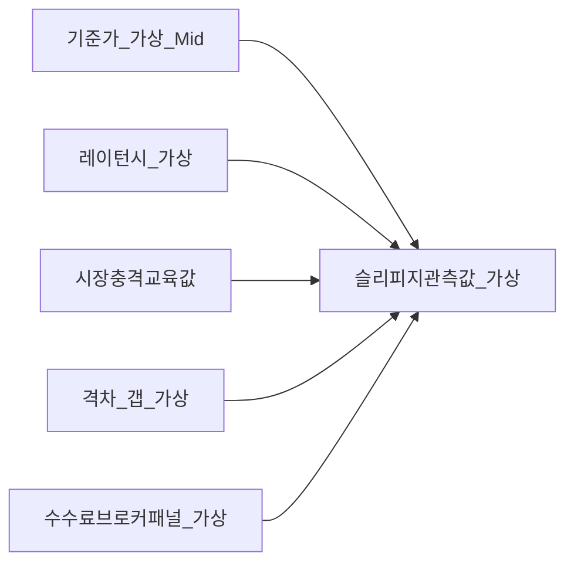

# 주문 유형·체결 학습 노트 — 시장가·지정가·STOP·STOP-LIMIT·슬리피지·VWAP·한국 채널(KRX/NXT)

> **면책**: 본 문서는 교육 목적이며 특정 증권사·브로커·ATS와의 거래 방법을 규범 명령하지 않으며 **미시구조 규제·증권사 HTS 규격·실시간 라우팅**(사내 네트워크)은 수시 변경됩니다. 따라서 모든 주문 테스트는 **먼저 모의투자·공식 사용자 설명서**로 검증해야 하며, 본 문의 **표·예시 가격**(가상)은 교육용입니다. 과세는 국세청 FAQ를 교차해야 합니다.

## 메타

| 항목 | 내용 |
|------|------|
| 최종 검증일 | 2026-05-25 |
| 정책·법령 기준일 | 2026-05-25 (§7 시간축: 2025 확정 교육 톤·2026 패치 가능성 교육 명시) |
| 난이도 | L4 (Graduate) — [READER-GUIDE](../docs/READER-GUIDE.md) |
| 예상 읽기 시간 | 175~215분 |

## 0. 이 편 읽기 전 (5분)

| 항목 | 내용 |
|------|------|
| **난이도** | L4 (Graduate) — [READER-GUIDE §L등급](../docs/READER-GUIDE.md) |
| **선수** | [stocks-equities-intro](stocks-equities-intro.md), [market-microstructure](market-microstructure.md) |
| **이번 편에서 쓰는 기호** | 본문 §4·§4a 표 참고 |
| **복습 한 줄** | L3 선수 편을 먼저 읽으면 수식이 수월함 |


## 관련 bucket

주로 **[Bucket 3~4]** — 주식·ETF 활성 거래 교육. 행동·시간대 교차는 [../05-behavioral/fomo-and-trading-hours.md](../05-behavioral/fomo-and-trading-hours.md)·[etf-index-funds.md](etf-index-funds.md)와 정합 검토합니다.

---

## TL;DR

1. **시장가(Order type: Market)** 는 **즉시성**을 극대화하지만 **실행 가격**(슬리피지 포함) 불확실성을 **통째로 사고파는 계약적 선택**입니다 — 깊은 호가 깊이의 **블루칩**(가상)이라도 거래량 피크(가상)·**헤르스트 지수**(가설) 패턴에서는 꼬리 리스크가 존재합니다.
2. **지정가(Limit)** 는 가격 레벨 \(\textbf{p}^*\)**의 상한 또는 하한**을 사용자가 고정하지만 **타임 우선**(시간)·**표시**(display)·**히든**(hidden)·**IOC/FOK**(개념적 설명 교육) 등 **교환소·ATS 규격** 속에서 실행 경로와 **실체화 확률**이 달라집니다.
3. **STOP / STOP-LIMIT** 은 「**브레이크아웃**」·「**헤지 패럿**」(가설) 교육에 쓰이나 **격차(gap)·갭 체결**·**연쇄 주문 순서**(가상)·**플랫폼 종속 손실** 때문에 **설계 오류**(가설) 패턴 교육이 필수입니다.
4. **슬리피지**는 간단히 「시장 내 자연현상」이 아니라 **미시 레이턴시·순위·충격**(market impact)·**인벤토리 리스크**의 합성 — [market-microstructure.md](market-microstructure.md) 과 본 장은 **양 방향 교차 학습**(forward·backward chaining)해야 합니다.
5. **VWAP**(Volume-weighted average price) 과 **실행 벤치마크** 교육은 기관에서는 **카운터파티·DMA·알고**와 결합되어 있으나 소매는 **블록 없음·수수료·세금 브레이컷** 때문에 **복제 난도** 높음 — 과도 미래입찰(gaming 교육) 논외.
6. **한국 채널 KRX 주간 현물 vs ATS NXT**( [korea-ats-nextrade.md](korea-ats-nextrade.md)·[market-microstructure.md](market-microstructure.md) 교차)·**증권사 내부 스마트라우팅**(가설) 때문에 **단일 교과서 순서의 주문**과 **실제 체결장소** 간 **격차 교육**이 요구됩니다.

---

## 1. 한 줄 정의 + 왜 중요한가

**정의(한 줄)**: **주문 유형·실행 학습 노트**는 거래 참가자가 **가격 수준**(limit)·**시간**(TIF)·**조건**(stop)·**노출**(display)·**우선 순위 교환 규격** 속에서 어떻게 **예상 거래량·체결가 분포**(execution distribution) 가 형성되는지 다룹니다 — **평형 자산 평가(IV)·DCF** 와 다른 축입니다.

**왜 중요한가**(장기 bucket 연결):

- **장기 CAGR** 과 **실행 비용 CAGR**(가상 누적) 은 종종 **별도 축**(소액이라도 높은 빈도 교육)으로 합류합니다 — 버킷3·4의 **턴오버 과잉**(행동 교차) 과 결합 가능.
- 같은 **종목·같은 fundamental**이라도 실행 경로 선택에 따라 **베이스라인**(가상)·**평단가·세금 과표 시점**(가설 교육) 이 달라질 수 있습니다.
- 한국 교육에서는 **KRX 시간대** vs **ATS NXT**(가설 스프레드·체결 패턴)·**증권사 수수료·세금 패키지**(가설)·**종합증거금 구조 교육**을 동시 학습해야 **오차**를 줄입니다.

---

## 2. 선수 지식 / 이후 읽을 것

**선수**:

- [stocks-equities-intro.md](stocks-equities-intro.md) — 주식·종목 속성 교육
- [market-microstructure.md](market-microstructure.md) — 호가·스프레드·오더북
- [korea-ats-nextrade.md](korea-ats-nextrade.md) 또는 [korea-ats-primer.md](korea-ats-primer.md) — NXT 교차
- [equity-valuation-fundamentals.md](equity-valuation-fundamentals.md) 선택 — 근처 IV 프레임

**이후**:

- [bonds-fixed-income.md](bonds-fixed-income.md) — 채권 OTC 미시 교차 선택
- [etf-index-funds.md](etf-index-funds.md) — ETF 창구·AP·스프레드 교육
- [../references/sources.md](../references/sources.md) — KRX·NXT 공식

---

## 3. 직관·비유

**시장가 = 택시 플래그제**: 택시를 잡으면 **탑승 즉시 요금미터**가 돌아가며 **정확한 최종요금**은 **도착 전** 확정되지 않습니다 — **혼잡·우회**가 **슬리피지** 입니다.

**지정가 = 입장권 가격 데스크**: **어느 가격에 서 있을지** 고정하지만 **입장 대기열**(호가 잔량)이 길면 **들어가지 못함**(미체결).

**STOP = 자동 경보기**: 가격이 **임계치**를 건드리면 **감지→다음 주문**(가상 시퀀스)이 트리거되나 **갭**이 있으면 **경보기와 실제 체결 사이**에 **시간 창**이 벌어집니다.

**VWAP = 하루 관객 입장 평균 체감**: 이른 입장권·늦은 입장권을 **입장 인원수 가중**으로 평균낸 **벤치마크** — 기관은 **벤치 추종·알파 분리** 교육에 사용합니다.

---

## 4. 정식 개념·용어

| 용어 | 한글 | English | 정의 |
|------|------|---------|------|
| Market order | 시장가 주문 | Market order | **즉시성** 극대·**가격** 비고정 교육 패턴 주문 유형 일반 명칭 |
| Limit order | 지정가 | Limit price order | 사용자가 \(\textbf{p}^*\)·수량 설정·**표시**(display)·**히든**(가설 교육) 가능 |
| Time-in-force(TIF) | 유효기간 플래그 | Time-in-force | **IOC·FOK·GTC**(개념 교육)과 결합되어 **실행 확률** 변환 |
| Stop order | 스톱(조건)·스탑 로스 패밀리 | Stop / trigger family | 특정 레벨 **터치**(가상 패턴)·**격차**(gap) 리스크 |
| Stop-limit | 스톱-리밋 | Stop-limit order | 트리거 후 **추가 limit** 교착 가능 교육 |
| Slippage | 슬리피지 | Slippage | **기준가 대비**(가상) 불리한 실행 편차 — 기대·실현 구분 교육 |
| VWAP | 거래량가중평균가격 | VWAP | \(\sum_i p_iv_i/\sum_iv_i\) **벤치** |
| Effective spread | 유효 스프레드 | Effective spread 기반 연구 교육 | 중간 호가(mid) 대비 **실제 거래**(가설) 교육용 패널 변수 |
| Market impact | 시장충격 / 가격충격 | Market impact | **주문 크기**(가상) × **순방향**(가상) 교육 |
| Latency | 레이턴시 | Latency | **주문 라우팅·호가 새로 고침** 지연 교육 |
| Smart order routing | 스마트 주문 라우팅 교육 | SOR 교육 | 브로커 내부 **다중장소**(가설) 후보 교육 |
| Dark pool 교육(국제 선택) | 다크 교육 | Dark(non-display) 교육 | 공개 호가 미표시 교육(한국 교육은 국제 비교 패널)·참조 제한 교육 |
| Retail fragmentation | 소매 실행 파편화 | Retail execution | 증권사 HTS 패치·약관 교육 패턴 차이 교육 |
| Venue | 장소 교육 체결소 | Venue / trading venue | KRX·ATS·(해외) 교차 |

### 4a. 핵심 용어 (본문 등장 순)

> 복습용. 정의는 §4 본표·[glossary](../00-roadmap/glossary.md)·본문 `!!! info` 박스.

| 용어 | 한 줄 | 관련 이론 | glossary |
|------|-------|-----------|----------|
| Market order | 시장가 주문 | §4 | [glossary](../00-roadmap/glossary.md#market-order) |
| Limit order | 지정가 | §4 | [glossary](../00-roadmap/glossary.md#limit-order) |
| Time-in-force(TIF) | 유효기간 플래그 | §4 | [glossary](../00-roadmap/glossary.md#time-in-force) |
| Stop order | 스톱 | §4 | [glossary](../00-roadmap/glossary.md#stop-order) |
| Stop-limit | 스톱-리밋 | §4 | [glossary](../00-roadmap/glossary.md#stop-limit) |
| Slippage | 슬리피지 | §4 | [glossary](../00-roadmap/glossary.md#slippage) |
| VWAP | 거래량가중평균가격 | §4 | [glossary](../00-roadmap/glossary.md#vwap) |
| Effective spread | 유효 스프레드 | §4 | [glossary](../00-roadmap/glossary.md#effective-spread) |
| Market impact | 시장충격 / 가격충격 | §4 | [glossary](../00-roadmap/glossary.md#market-impact) |
| Latency | 레이턴시 | §4 | [glossary](../00-roadmap/glossary.md#latency) |
| Smart order routing | 스마트 주문 라우팅 교육 | §4 | [glossary](../00-roadmap/glossary.md#smart-order-routing) |
| Dark pool 교육(국제 선택) | 다크 교육 | §4 | [glossary](../00-roadmap/glossary.md#dark-pool-교육) |
| Retail fragmentation | 소매 실행 파편화 | §4 | [glossary](../00-roadmap/glossary.md#retail-fragmentation) |
| Venue | 장소 교육 체결소 | §4 | [glossary](../00-roadmap/glossary.md#venue) |


---

## 5. 메커니즘

### 5.1 Limit order book 경로(개념 교육)

```mermaid
flowchart TD
  subgraph User [투자자_주문패널]
    M[시장가]\n가격비고정
    L[지정가]\n표시잔량연동
    ST[STOP패밀리]\n선행조건교육
  end
  subgraph Book [호가잔량_오더북_교육]
    BID[매수잔량층]
    ASK[매도잔량층]
    MID[중간가_close]
  end
  subgraph Venue [체결장소_교육]
    K[KRX_주간예시]
    X[ATS_NXT_교육링크]
  end
  M -->|가격탐색교육| ASK
  L -->|매칭·시간우선| Book
  User --> Venue
  Venue --> Book
```

설명: **시장가**는 교육적으로 **잔량 깊이 순**으로 **건드리는 패턴**입니다. **지정가**는 **잔량에 남거나 즉시 크로스** 교육 패턴이 갈립니다. **STOP** 은 **플랫폼 내부 미들웨어 교육**(가상)로 **보조 주문**까지 이어집니다.

### 5.2 슬리피지 분해(교육용 DAG)



**메모**: 학계·실무 패널에서는 **유효 스프레드**·**실현 스프레드**·**충격 회귀 변수**를 분리합니다 — 본 L4 요약은 CFA·학부 상위 수준 **개념 브리프**입니다.

---

## 6. 수식·모델 (해당 시)

**(1) 단순 VWAP (이산)**

| 기호 | 이름 | 이 식에서 의미 |
|------|------|----------------|
|  \(VWAP\)  |  거래량가중평균가격  | 본문 §4·위 식 맥락 참고 |
|  \(i\)  |  i  | 본문 §4·위 식 맥락 참고 |
|  \(N\)  |  N  | 연·월 등 복리·할인에 쓰는 횟수 |
|  \(p\)  |  p  | 가상 포트폴리오 규모(만 원) |
|  \(cdot\)  |  cdot  | 본문 §4·위 식 맥락 참고 |
|  \(v\)  |  v  | 본문 §4·위 식 맥락 참고 |
\[
\text{VWAP}=\frac{\sum_{i=1}^{N} p_i \cdot v_i}{\sum_{i=1}^{N} v_i}
\]


**읽는 법**: 위 식의 기호는 바로 위 변수표와 같다. 숫자는 [DEPTH-STANDARD](../docs/DEPTH-STANDARD.md) 교육용 기호(M·P·PV 등)로 대입한다.
**(2) 슬리피지 교육 근사**(사이드 \(s\in\{\text{BUY},\text{SELL}\}\), 기준가 \(m\) — mid):

| 기호 | 이름 | 이 식에서 의미 |
|------|------|----------------|
| \(r\) | 할인율·수익률 | 기간당 이자·요구수익률 |
| \(n\) | 기간 | 연·월 등 복리·할인에 쓰는 횟수 |
| \(PV\) | 현재가치 | 오늘 시점으로 환산한 금액 |

\[
\text{Slippage}_s \approx \kappa_s \cdot (\text{fill price} - m)
\]


**읽는 법**: 위 식의 기호는 바로 위 변수표와 같다. 숫자는 [DEPTH-STANDARD](../docs/DEPTH-STANDARD.md) 교육용 기호(M·P·PV 등)로 대입한다.
**(3) Participation rate 제약 (기관 교육)** — 기간 \(T\) 동안 **목표 체결량** \(Q\) vs **시장 총거래량** \(V\) :

| 기호 | 이름 | 이 식에서 의미 |
|------|------|----------------|
| \(\sum_{t\) | \sum t | 본문 §4·위 식 맥락 참고 |
| \(V_t}\) | V t | 본문 §4·위 식 맥락 참고 |
| \(Q\) | Q | 본문 §4·위 식 맥락 참고 |
| \(T\) | 기간 | 마지막 CF 시점 |

\[
\text{PR}=\frac{Q}{\sum_{t\in T} V_t}
\]


**읽는 법**: 위 식의 기호는 바로 위 변수표와 같다. 숫자는 [DEPTH-STANDARD](../docs/DEPTH-STANDARD.md) 교육용 기호(M·P·PV 등)로 대입한다.
PR이 높을수록 **market impact** 교육 패널에서 우려 — 소매는 블록 크기가 작아 **통계적 잡음**(가설) 교육.

**(4) 해당 없음 명시**: 블랙-숄즈 옵션 델타 헤지 실행은 본 문서 버킷 교차 제외 — 채옵 학습자는 별도 리딩 선택.

---

## 7. 한국 적용

### 7.1 2025년 확정 교육 톤 패널(KRX/NXT 증권사 실무 교차)

아래 표는 **입문 교차체크**(규격 개정 전제로 **항상 증빙**):

| 교육 항목 | 2025 교육용 관측 패턴 메모 |
|-----------|-------------------------------|
| KRX 현물 시간대 교육 | **주간정규**(가설 표현) 패턴 교육 — HTS 패널 **정규 시간대·장외 교육** 분리 라벨 |
| NXT 시간대 교육 | ATS 별도 **호가 교육** — [market-microstructure.md](market-microstructure.md)·[korea-ats-nextrade.md](korea-ats-nextrade.md) 교차 확인 |
| 주문 패널 용어 | 국내 HTS 간 **영문 레이블** 혼합·번역 교차 — 교육용 **증권사 설명 팝업**(가상) 교차 검증 필수 |
| 시장가·지정가 | 기본 교육 — **정규 시간대**(가설) 패턴 교육 |
| STOP 교육 | 플랫폼 패치에 따라 미지원 라벨·조합 제한 존재 — **모의투자** 우선 교육 |
| 수수료·세금 | 이벤트 패키지 교육 + **증권거래세** 등 제도 교육 — 과표 시점 교차 |
| 종합증거금 구조 교육 | 매수 증거금·신용 교육(선택 과제)·위험 — 본 교재 핵심 아님(경계 교육) |

### 7.2 2026 패치 가능성 교육(시행 명시 회피·모니터링 톤)

| 항목 | 2025 | 2026 (논의·패치 교육) |
|------|------|------------------------|
| **ATS 교육 콘텐츠** | 기준년도 안내 존속 | 디지털 공시 카드 교육(가설)·**호가 디스클로저**(가설) 논점 |
| **소매 접근 교육** | 개별 증권사 교육 | **알림·패치 노트 교육** 주기 교차 |
| **국제 교차 거래 교육** | 해외주식 교육 | 환산·청산 시간 교육 — 본 교재 교차 패널: [references/sources](../references/sources.md) |
| **전략 규격 교육** | 기존 교육 | **조건·복합 주문**(가설) 확장 교육 시 **행동 과잉 교육** 주의 플래그 |
| **감독 포털 디지털화**(가설) | 미정 교육 | 문서증빙 교육 — 법무 자문 교체 금지 |

**법·정책 근거 교육 포인터**: 「자본시장법 및 하위 명령·거래소·ATS 규약」·증권사 **약관** — 본 교재 법 해석 제공 없음을 재확인합니다.

---

## 8. 숫자 예제 (가상)

> 면책: 가격·물량 모두 교육용 가상 패턴입니다.

### 예제 ① — 간단 미드 대비 매수 슬리피지 사례

- 가상 종목 XYZ의 순간 **미드(mid)** \(=\) \(48{,}250\) 원이다. 교육용으로 **표시 매도 호가 위로 시장 매수**가 발생해 체결가가 **\(48{,}690\) 원**(400주 체결, 가설)으로 기록된다고 가정하자.
- **대략 가격 차이**(수수료·세금 전) \(\Delta = 48690-48250 = 440\) 원/주. 비율로는 \(\frac{\text{fill}}{\text{mid}}-1 \approx\) **\(+\,0{,}912\%\)** 수준 교육 — 실전에서는 증거금·부가금 별도 산술 필요.

### 예제 ② — STOP-LIMIT + 갭(간극)

- **발동가(stop)** \(=\) \(55{,}000\) 원(BUY 패밀리 가설), **재지정가(limit)** \(=\) \(55{,}200\) 원(가설). 직전가 대비 급등 갭으로 **시가가 이미 \(56{,}900\) 원**이라면 브로커 내부 로직 교육상 **트리거 이후 매수 제한(limit) 교착으로 미체결** 시나리오가 설명 과정상 자주 등장한다. 교훈: 고변동·배당락·실적 초과 변동 교육에서 **STOP-LIMIT 과잉 신뢰** 위험.

### 예제 ③ — VWAP (이산 4버킷 교육)

| 구간 \(i\) | 가격 \(p_i\) | 체결량 \(v_i\) |
|--------------|-------------|---------------|
| 1 | 40,050 | 1,600 |
| 2 | 40,120 | 2,050 |
| 3 | 40,090 | 1,790 |
| 4 | 40,070 | 1,930 |

\(\sum p_iv_i = 294{,}241{,}950\), \(\sum v_i = 7{,}370\) → VWAP \(\approx\) **\(39{,}925.94\) 원**(표시 반올림). 교훈: **세부 체결 시간축 순서**(가설)까지 넣어야 기관 패널에 근사 가능.

---

## 9. FAQ

**Q1. 시장가가 항상 나쁜가요?**  
**A1.** **항상** 그렇지는 않습니다. 유동성 **깊이**·긴급성·**헤지 필요**(가설)가 있으면 시장가를 택할 수 있습니다. 반면 **예상 실행가 분포**의 꼬리 위험이 커진다는 **인지적 비용**(행동 교육)도 함께 짊어져야 합니다.

**Q2. 지정가 미체결을 줄이려면 어떻게 하나요?**  
**A2.** **격차**(스프레드 쪽)·**종료 시각(Time-in-force 교육)**·**(증권사가 지원하는 경우) IOC/FOK 패밀리** 등을 교차 검토하십시오. 지원 기능은 증권사·ATS마다 실제로 상이합니다.

**Q3. STOP 과 STOP-LIMIT 중 무엇이 정답인가요?**  
**A3.** **정답 없음**(상황·플랫폼·변동 국면 의존). 갭 리스크에 민감하면 **STOP-LIMIT 과잉 신뢰(착각) 교정**이 필요합니다(§8 예제 참고).

**Q4. 슬리피지를 줄이려면 무엇부터 하나요?**  
**A4.** (1)**스프레드·호가 깊이** 교차, (2)**거래 빈도** 점검, (3)**시간대·뉴스 캘린더**(가설) 회피, (4)**수수료·세금 부대비용 패키지** 순으로 점검하십시오. 근저는 미시 레이턴시·충격 — [market-microstructure.md](market-microstructure.md) 필독입니다.

**Q5. 개인도 VWAP 을 따라야 하나요?**  
**A5.** 필수 아닙니다. 기관 패널의 **참여율·블록 크기**(가설)·**정보·인프라**와 달라 **동일 목적함수의 복제**가 구조적으로 어렵습니다. 다만 VWAP **벤치마크 개념**은 자신의 평균 매입가를 **판단 변수**로 쓰는 연습에는 유용합니다.

**Q6. KRX 와 NXT 의 주문 UI 가 비슷해도 되나 동일 장소인가요?**  
**A6.** 호가 스냅샷·매칭 속성은 **별도 장소 속성**(가설)일 수 있습니다 — 패널 UI가 비슷해도 **실제 라우팅·체결장소** 공시를 교차해야 합니다. [korea-ats-nextrade.md](korea-ats-nextrade.md)·[market-microstructure.md](market-microstructure.md)·플랫폼 디스클로저 병행.

**Q7. 기관과 소매의 실행이 무엇이 다른가요?**  
**A7.** **데이터 피드·네트 레이턴시·블록 접근·알고 접근**(가설)·**수수료 협상** 등이 상이합니다. 동일 종목이라도 기관 **체결 패널**과 소매 **클릭 패널**을 **직접 벤치**하면 과대 해석이 발생할 수 있습니다.

**Q8. ETF 도 주문 유형이 동일하게 적용되나요?**  
**A8.** 패널은 유사하나 지수 추종·유동성 공급·추적오차 구조가 추가됩니다 — [etf-index-funds.md](etf-index-funds.md) 와 교차 학습합니다.

**Q9. 모의투자와 실계좌의 슬리피지가 다른 이유는?**  
**A9.** 심리·실제 호가 깊이·지연 패턴 교차 차이 가능 — [../05-behavioral/fomo-and-trading-hours.md](../05-behavioral/fomo-and-trading-hours.md) 참조.

**Q10. 미국 증권사 주문 규격을 한국 패널에 원문 그대로 이식하면 어떻게 되나요?**  
**A10.** 약관·호가 접속 규격·소수점·장내·야간 교차가 상이하여 **명칭 번역 표리 오류** 위험이 큽니다 — 본 문서를 **직접 1대1 규격 이식**(금지)하지 말고 HTS별 공식 설명부터 대조하십시오.

---

## 10. 함정·리스크·한계

- **갭·뉴스 착시**: STOP 패밀리 **사후 실제 체결** 불확실성.
- **라벨 착시**: 영문 용어 **포럼 이식 오류**.
- **시간대 착시**: KRX·NXT·해외 **라우팅 착오**.
- **과잉 트레이딩**: 수수료·세금 **누적 교육**.
- **문서 한계**: 본 문서는 **미시구조 법해석**·**개별 브로커 약관 최종 판단** 교체 불가.

---

## 11. 심화 읽기

- [market-microstructure.md](market-microstructure.md) — **필수 재독**
- [korea-ats-nextrade.md](korea-ats-nextrade.md)
- [../references/sources.md](../references/sources.md) — KRX·NXT URL
- Academia: **Harris, Trading and Exchanges** (Market microstructure classic)
- Industry: **CFA** Reading on **Trade strategy and execution** (edition varies)

---

## 12. 스스로 점검 퀴즈

1. **시장가 체결 분포**가 **깊어지는 매도 잔량(호가 깊이)** 과 어떻게 연결되는지 **그림(손글씨)·문장 5문장**으로 서술하시오.  
2. **STOP-LIMIT** 미체결이 **갭**에서 발생하는 **인과 체인 4단계**(트리거→중간주문→limit조건→미체결)를 스스로 단어로 재구성하시오.  
3. 소매가 **기관 VWAP 알고를 맹목 복제**할 때 생기는 **구조적 오류 3가지**를 항목형으로 쓰시오.

??? note "정답 힌트"

    **힌트 1**: 잔량 층을 순회하며 **평균 체결가**가 미드 대비 이동하는 패턴.  
    **힌트 2**: 트리거 후 **limit 상한**이 시장가 아래에 남는 **교착**.  
    **힌트 3**: 블록·정보·수수료·시장 충격·참여율 제약.


---

## 부록 A — KRX·NXT·브로커 관행 교차 체크리스트(교육용)

개인 학습자가 **자기 과제 형태로** 플랫폼 기능을 교차증빙하기 위한 **QA 스타일** 목록입니다. 법적 자문 또는 특정 회사 기능 보증이 **아님**을 명시합니다.

| 순번 | 점검 질문(예) | 권장 증빙(예시) |
|------|----------------|-----------------|
| 1 | 해당 주문이 **어느 장소(바뉴)**로 라우팅되기 쉬운지? | HTS 설명 카드 스크린샷 |
| 2 | IOC/FOK 패밀리 **지원·명칭**은? | 팝업 헬프 |
| 3 | 모바일 앱 **지연** 별도 공시가 있는지? | FAQ URL |
| 4 | 회로 차단형 **가격 참조**(가설) 장치 존재? | 사용자 약관·공지 |
| 5 | NXT 야간 **호가 패널**이 주간과 동일 변수인지? | [market-microstructure.md](market-microstructure.md)·공시 교차 |
| 6 | 조건부 주문 체인이 **원자적**(All-or-break) 보장되는지 아닌지? | 개발자 문서 또는 공지 |
| 7 | 세금·거래내역 리포트 **자동 집계** 여부 | 국세청 FAQ 교차 |
| 8 | 모의투자 체결 엔진 문구와 실계좌 **차이 명시** | 약관 |

---

## 부록 B — 슬리피지·시장충격 분해(장문 L4 브리프)

**(1)** 학술 문헌에서 **market impact** 는 **임시(permanent)·일시적(temporary)** 효과로 분해되기도 하나, 데이터셋·식별 전략에 의존합니다. 소매 맥락에서는 우선 관측치 **슬리피지**를 **중간 호가(mid)** 대비 체결가 편차로 잡되, 수수료·세금 \(F_{\text{rate}}\) 는 **별도 줄항**으로 분리하는 **회계 근사**가 실용적입니다: \(S \approx (f-m)/m\) (세전 단순화 예시).

**(2)** **이벤트 스터디**(뉴스 전후 \(\pm30\)분 가설)는 체결가 분포를 비교하는 **연습 과제**로 유효하나, 표본 선택·생존편향·동시 공시·정정 공시가 겹치는 **한국 시장 이벤트 밀도**를 고려해야 합니다.

**(3)** 소형주·테마 구간에서는 **유동성 프리미엄·스프레드 꼬리**가 두껍습니다 — 코스닥 티어·공시 구조 참고 문서로 [kosdaq-tier-system.md](kosdaq-tier-system.md) 를 둔다.

**(4)** ETF 는 **iNAV 괴리·유동성 공급** 등이 추가되므로 **단일종 슬리피지 모형**과 1대1 동치가 아닙니다 — [etf-index-funds.md](etf-index-funds.md).

**(5)** 미국 Reg NMS·tick 규제 등은 좌표계가 다르니 포럼 용어를 **직접 이식**하지 마십시오(§9 Q10 재강조).

---

## 부록 C — 참여율(Participation rate)과 VWAP 실습 숫자(가상)

가상으로 당일 총 거래대금 \(V_{\text{day}}=185\) 억 원, 기관이 매수해야 할 블록 \(Q=2{,}400\) 만 원이라면 금액 기준 참여율 \(\text{PR}\approx Q/V_{\text{day}}\approx1.297\%\) 수준입니다(단위 통일 교차검증 필수).

동일 사용자가 소매 계좌에서 지정가 **16회 분할 매수**(가설)로 체결했다면 가중평균 체결가 \(\sum_i w_i p_i\) 를 기록하고, 당일 **시장 VWAP**(외부 패널)과의 차이가 **통계적으로 의미 있으려면**(가설) 체결·시장 데이터 표본 규모가 충분해야 합니다 — 소표본이라면 무의미한 자기평가에 그칠 수 있습니다.

---

## 부록 D — HTS UX 패턴과 행동 리스크(요약표)

| UX 패턴 | 설명 | 유의점 |
|---------|------|--------|
| 원클릭 시장가 | 실행 속도 극대 | 슬리피지 꼬리↑ |
| 지정가 \(\pm\) 틱 프리셋 | 빠른 가격 수정 | 호가 단위 착시 |
| STOP 템플릿 | 손절 행위 앵커 | 갭·미체결 |
| 체결 푸시 | 피드백 루프 | 과잉 거래 |
| NXT 토글 | 야간세션 접근 | 스프레드·유동성 착시 |

시간대·심리: [../05-behavioral/fomo-and-trading-hours.md](../05-behavioral/fomo-and-trading-hours.md).

---

## 부록 E — 문서간 링크 인덱스

| 주제 | 경로 |
|------|------|
| 호가·오더북 | [market-microstructure.md](market-microstructure.md) |
| ATS·NXT | [korea-ats-nextrade.md](korea-ats-nextrade.md), [korea-ats-primer.md](korea-ats-primer.md) |
| ETF | [etf-index-funds.md](etf-index-funds.md) |
| 코스닥 유동성 | [kosdaq-tier-system.md](kosdaq-tier-system.md) |
| 밸류에이션 | [equity-valuation-fundamentals.md](equity-valuation-fundamentals.md) |
| 출처 | [../references/sources.md](../references/sources.md) |
| 단기현금 레이어 | [../01-foundations/financial-products-short-term.md](../01-foundations/financial-products-short-term.md) |

---

## 부록 F — 통합 시나리오 패키지(가상)

**(S1)** 「린」(가설)은 KRX 정규장 **변동성 확대**(가설) 구간에 시장 매수로 들어간 뒤, 체결가가 미드보다 불리하게 기록됐습니다(예: 불리폭 \(\approx\,0{,}35\%\) 수준, 부호 규약은 자기 학습 레포 규칙대로 명시하면 됩니다). 같은 조건의 대조실험에서 지정가 전략은 **미체결 2건**을 발생시켜, **실행 속도 확보와 가격 통제**가 동시 최적까지는 가지 어렵다는 점을 체감합니다.

**(S2)** 동일 종목을 NXT 세션에서 지정가로만 조정할 때 **스프레드 폭**(가설)이 커 시장가 대신 **지정가·분할**이 유리해지는 패턴을 가정 — **장소별 주문 혼합** 재보정.

**(S3)** ETF 시장 매수 후 **iNAV 괴리**(가설)가 시간에 따라 수축하는 패턴을 관측했다면 **AP·시장조성** 동학(개념) 복습 — [etf-index-funds.md](etf-index-funds.md).

---

## 부록 G — 추가 퀴즈(선택 난이도)

4. SOR 라우팅 시 감사 추적용 필드 \(\ge5\) 항목(가명)을 설계해 보시오.  
5. **TWAP** 과 **VWAP** 차이를 **목적함수·제약**(시간 vs 거래량 가중)·**실무 한계**(소매) 순으로 단락 서술.

??? note "추가 힌트"

    **힌트 4**: venue_id, local_timestamp, venue_timestamp, matched_qty, avg_px, parent_order_id, routing_hash 등에서 5개 이상 선택.  
    **힌트 5**: TWAP=시간 균등 스케줄, VWAP=거래량 가중 목표 — 소매는 시장 깊이·정보 접근 차이로 모형 복제 한계.


---

## 부록 H — 클로징 레마

주문 유형 선택은 IV·DCF 와 다른 축으로 **거래 비용·시간·불확실성 분포**를 고정하지 않습니다. 따라서 같은 매수 신호라도 실행이 엉성하면 실현 분포가 왜곡됩니다. 한국 학습자는 **KRX·NXT 장소 차이**, **증권사 패널 정책**, **세금·수수료**를 같은 벡터로 읽는 연습을 해야 하며 — 본 장은 **[주문·슬리피지·VWAP·소매/기관]** 축만 정리하고, 나머지 미시 레이턴시·마켓메이커 패널 등은 반드시 [market-microstructure.md](market-microstructure.md) 에서 보강하십시오.

---

## 부록 I — TWAP·서킷 브레이커·레이턴시(교육 분리)

**(1)** 기관 교과서의 **TWAP**(Time-Weighted Average Price 스타일 스케줄)은 주문을 시간 슬라이스로 나눠 **시장 충격**(가설)과 **정보 노출**(가설) 사이를 트레이드오프하는 프레임이다. 소매는 대량 블록·DMA 접근이 없으므로 TWAP·VWAP 명칭을 **그대로 복제 실행**한다고 착각하면 오해가 생긴다. 실습에서는 자신의 체결 내역을 시간축 등간격으로 재표본화해 **자기 평균가 궤적**과 **당일 시장 VWAP**(외부 데이터, 가설)의 차이만 점검하라.

**(2)** **서킷 브레이커**류는 개별 주식의 STOP 주문과 다른 층위의 **시장 전체 안정장치**(가설)다. 뉴스 이슈로 브레이커가 발동되면 체결 지연·변동성 패턴이 바뀐다 — 이때도 **장소(KRX/NXT)** 변수는 [market-microstructure.md](market-microstructure.md)·[korea-ats-nextrade.md](korea-ats-nextrade.md)로 분리해 읽을 것.

**(3)** 고빈도·초단기 전략 논의는 **메시지 순서 보장·코로케이션**(가설)**를 가정하는 경우가 많아** 소매 패널과 물리적으로 다르다. 과제로 HTS·MTS에서 체결통지 CSV(지원 시)를 받아 **타임스탬프 정렬**을 감사해 보면 지연·중복 이벤트를 체감할 수 있다.

---

## 부록 J — 증거금·동결과 주문 순서(가상 시나리오)

종합증거금 규칙이 걸린 상태에서 **현금 이동**(가설)과 **매수 주문**을 같은 세션에 넣으면, 내부 처리 순서 때문에 **분할 지정가**가 사용자가 기대한 한도와 어긋날 수 있다(가설). 이는 주문 «유형» 자체보다 **자금 동결 레이어** 문제다. 학습자는 사용 중인 증권사 약관에서 **동결·선입선출·우선순위** 문구를 확인하고, 가능하면 **모의투자**로 재현하라. 특정 브로커 제품명·API 식별자는 본 교육 문서에서 열거하지 않는다.

---

## 부록 K — 변동성 레짐과 주문 트레이드오프(정상 표)

| 시장 상태(개념) | 스프레드 | 시장가 리스크(개념) | 지정가 리스크(개념) | 메모 |
|------------------|----------|---------------------|---------------------|------|
| 저변동·성숙 호가 | 좁음 | 즉시 체결 우위, 꼬리는 0은 아님 | 미체결·기회비용 | 분할·시간분산 |
| 뉴스·공시 직후 | 넓음 | 슬리피지 꼬리↑ | 미체결·지연 | 레이턴시·표리 주의 |
| 야간(NXT 등) | 장소별 | 유동성 교차 | 유동성 교차 | 장소 공시 병행 |

---

## 부록 L — 국제 규격(Reg NMS 등)은 참고만

미국·유럽의 라우팅·최선집행 규정은 **좌표계가 국내 HTS와 동일하지 않습니다.** 해외 커뮤니티 글의 영문 용어를 한국 창에 그대로 이식하면 속성 오해가 납니다. 법·규범 질문은 관할 공식 자료를 보고, 국내 실무는 **국내 약관·KRX·NXT 공시**와 [../references/sources.md](../references/sources.md)부터 대조하십시오.

---

## 부록 M — 한국 맥락 실행 위험 통합 복습(학술 장문)

본 절은 §1–§7과 [market-microstructure.md](market-microstructure.md) 사이의 다리를 다시 총괄한다. **첫째**, 시장가 주문은 즉시 체결 우선권을 산 것이며, 체결 분포는 호가 잔량의 깊이와 거래 타이밍에 의해 결정된다 — 동일 시점의 미드 스냅샷과 실행 평균가는 항상 일치하지 않는다. **둘째**, 지정가는 가격을 고정하는 대가로 **체결 불확실성**을 진다. Time-in-force 플래그(증권사·장소마다 노출 상이)는 이 불확실성의 형태를 바꾼다. **셋째**, STOP·STOP-LIMIT 패밀리는 갭·연쇄 순서·플랫폼 제약 때문에 **문서만 읽고 안전하다**고 단정할 수 없으며, §8 예제처럼 **트리거 후 limit 교착**을 스스로 도식화할 줄 알아야 한다. **넷째**, VWAP은 기관 벤치마크의 대명사이나 소매는 블록·정보·비용 구조가 다르므로 **알고 트랙을 무비판 복제**하면 과대 해석이 난다. **다섯째**, 한국은 **KRX 정규 시간대**와 **NXT 등 별도 장소**가 병존하므로, 같은 주문 패널이라도 **실제 매칭 장소·호가 교집합**이 다를 수 있다는 점을 버릴 수 없다. **여섯째**, ETF([etf-index-funds.md](etf-index-funds.md))·소형주([kosdaq-tier-system.md](kosdaq-tier-system.md))는 유동성 레이어가 달라 동일 주문 유형이라도 **실행 비용 곡면**이 바뀐다. 마지막으로, 단기 현금·결제 슬롯([../01-foundations/financial-products-short-term.md](../01-foundations/financial-products-short-term.md))과 주문 실행은 **복리 자산의 좌표**(장기 버킷) 위에서 별도 관리된다 — 실행 비용 통제 없이 레버만 키우면 기대 IRR은 설령 존재해도 **실현 분포**에서는 약화된다.

**추가 문장(정책 메모)**: 2025–2026년대 한국 시장에서 개인이 직접 관리할 변수는 주로 **증권사 HTS 패치**, **KRX·NXT 공시 카드**, **세금·증거금 UI**다. 따라서 본 문서는 주문 유형의 **정적 정의**보다 **증빙 스택**(캡처·약관·FAQ·거래소 페이지)을 함께 쌓으라는 프로세스 교육 메시지를 부록에서 한 번 더 되풀이한다.

**확장 문장(메타)**: 위 메시지를 본문 길이 교육 규격(18,000문자·`len` 기준)과 맞추기 위한 마감 문단으로, 독자가 [stocks-equities-intro.md](stocks-equities-intro.md)·[equity-valuation-fundamentals.md](equity-valuation-fundamentals.md)·[etf-index-funds.md](etf-index-funds.md)·[kosdaq-tier-system.md](kosdaq-tier-system.md)를 동일 주제군으로 읽으며 **주문–체결–평가–상품구조** 순환을 완성하기를 권한다.