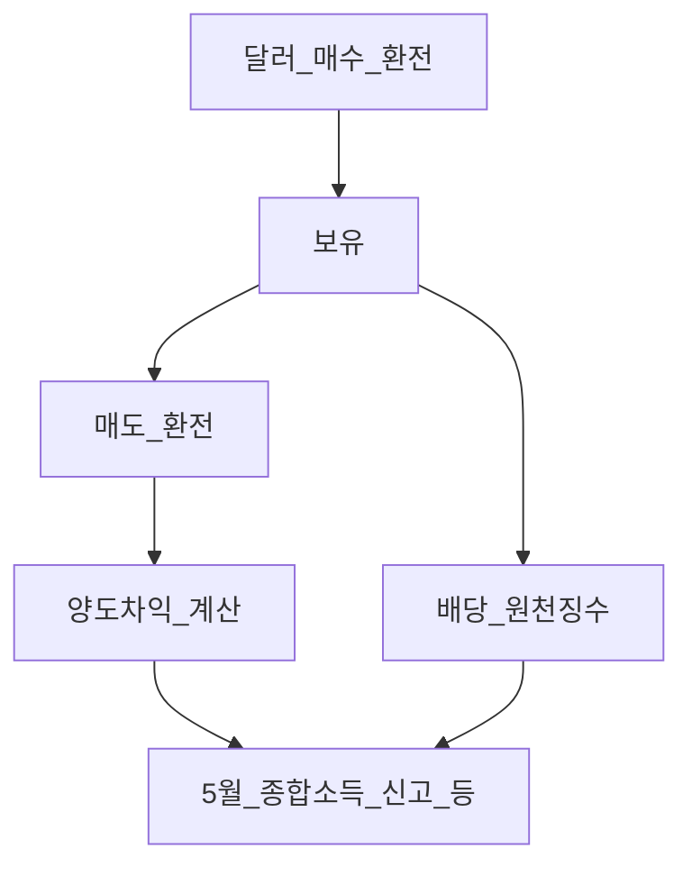
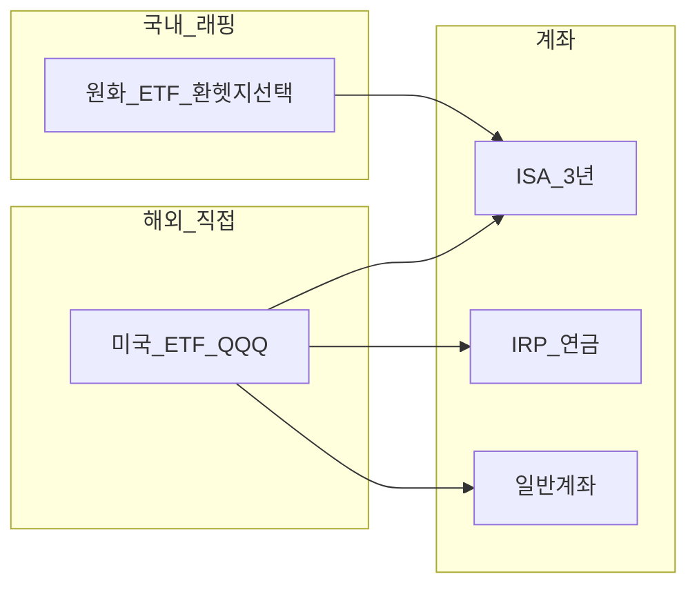

# 해외 주식·ETF 입문 — 경로·환율·세금·계좌 설계

> **면책**: 본 문서는 교육 목적이며, 특정 개인·법인에 대한 투자·세무·법률 자문이 아닙니다. 제도·세율·상품 조건은 변경될 수 있으므로 실행 전 공식 출처를 확인하세요.

## 메타

| 항목 | 내용 |
|------|------|
| 최종 검증일 | 2026-05-24 |
| 정책·법령 기준일 | 2025-12-31 확정, 2026 세제·신고 별도 표기 |
| 난이도 | L3 (Deep) — [READER-GUIDE](../docs/READER-GUIDE.md) |
| 예상 읽기 시간 | 55~70분 |
| 관련 bucket | Bucket 2b~3 (ISA·IRP·일반, 코어 QQQ 등) |

## 0. 이 편 읽기 전 (5분)

| 항목 | 내용 |
|------|------|
| **난이도** | L3 (Deep) — [READER-GUIDE §L등급](../docs/READER-GUIDE.md) |
| **선수** | [주식 입문](stocks-equities-intro.md), [ETF·인덱스](etf-index-funds.md) |
| **이번 편에서 쓰는 기호** | 본문 §4·§4a 표 참고 |
| **복습 한 줄** | — |

## TL;DR

1. **미국 직접**(QQQ·VOO 등): **달러·미국 장시간·양도세·배당** 규칙이 국내와 다르다.
2. **국내 상장 래핑 ETF**: 원화 결제, **환헷지 O/X** 선택이 수익 경로를 바꾼다.
3. **ISA·IRP**에서 코어 운용 시 비과세·한도·기간 — [계좌 맵](../06-korea-policy/tax/account-product-tax-map.md).
4. 해외주식 세금은 **[part1](../06-korea-policy/tax/overseas-stocks-tax-part1-cgt.md)~[part3](../06-korea-policy/tax/overseas-stocks-tax-part3-scenarios.md)** 필수.
5. [지역 분산](../04-portfolio/geographic-diversification.md)과 함께 **한국·미국·환율**을 동시에 본다.

---

## 1. 한 줄 정의 + 왜 중요한가

!!! info "ETF"
    지수·자산 **바구니**를 한 종목처럼 거래

**정의**: **해외 주식·ETF**는 한국 거래소(KRX) 밖에 상장된 **주식·ADR·해외 상장 ETF**를 직접 보유하거나, 국내에서 **해외 지수를 추종하는 래핑 ETF**로 간접 보유하는 것을 말한다.

**왜 중요한가**: 코어로 **미국 성장·글로벌 분산**을 둘 때 가장 흔한 경로다. “QQQ 샀다” 한 줄 뒤에 **환율·5월 신고·ISA 3년·장 시간**이 붙는다. 이를 모르면 **세금·행동(FOMO)** 에서 손실이 난다.

---

## 2. 선수 지식 / 이후 읽을 것

**선수**:
- [주식 입문](stocks-equities-intro.md)
- [ETF·인덱스](etf-index-funds.md)
- [거시경제](../02-economics/macroeconomics-basics.md) — 금리·환율

**이후**:
- [해외주식 양도세 part1](../06-korea-policy/tax/overseas-stocks-tax-part1-cgt.md)
- [배당 part2](../06-korea-policy/tax/overseas-stocks-tax-part2-dividend.md)
- [시나리오 part3](../06-korea-policy/tax/overseas-stocks-tax-part3-scenarios.md)
- [QLD·레버리지](../04-portfolio/leveraged-etf-qqq-qld.md)
- [지역 분산](../04-portfolio/geographic-diversification.md)
- [FOMO·거래시간](../05-behavioral/fomo-and-trading-hours.md)

---

## 3. 직관·비유

**해외 직구**: 상품 가격(주가) + **배송비·관세(세금·수수료)** + **환율(달러 가격)**. 원화로 체감 비용이 달라진다.

**현지 매장 vs 국내 프랜차이즈**: 미국 브로커·국내 해외주문 = **현지 매장**. 국내 래핑 ETF = **국내 프랜차이즈 메뉴**(레시피는 비슷, 맛·가격·환헷지는 다름).

**ISA는 면세 한도가 있는 멤버십**: 3년·한도 안에서 **비과세 혜택** — 조건 어기면 혜택 **소멸**.

**이중 노출 주의**: 국내 래핑 S&P + 미국 VOO + QQQ를 동시에 사면 **같은 팩터**에 세 번 베팅한 것과 비슷하다. [core-satellite](../04-portfolio/core-satellite-framework.md)에서 **코어는 하나의 broad** 로 단순화하는 경우가 많다.

**환전 타이밍 환상**: “원화가 약할 때만 사자”는 **타이밍**이다. 장기 투자자는 [DCA](../04-portfolio/rebalancing-and-dca.md)로 환율을 **평균**내고, 헷지 ETF로 **노출을 줄이는** 두 축을 구분한다.

**세금 캘린더 습관**: 해외 직접 보유는 **5월 신고**가 연간 이벤트다. 증권사 **원화 환산 내역·양도 내역**을 매년 저장하지 않으면 신고 비용이 커진다 — [part3](../06-korea-policy/tax/overseas-stocks-tax-part3-scenarios.md) 시나리오표를 미리 채워 보는 L3 연습을 권한다.

**DB·DC와 혼동 금지**: 회사 퇴직연금으로 QQQ를 살 수 없는 경우가 많다. 해외 코어는 **개인 ISA·IRP·일반**에서 설계 — [db-pension](../06-korea-policy/db-pension.md), [dc-pension](../06-korea-policy/dc-pension.md).

---

## 4. 정식 개념·용어

| 용어 | 한글 | English | 정의 |
|------|------|---------|------|
| 해외 직접 투자 | 해외 직접 | Direct offshore | 미국 등 **현지 상장** 매매 |
| 래핑 ETF | 국내 상장 해외 ETF | Synthetic/wrapper | 국내 거래소에서 **해외 지수** 추종 |
| 양도소득세 | 양도세 | Capital gains tax | 매매차익 과세(해외주) |
| 원천징수 | 원천징수 | Withholding | 배당 시 **국가·중개**에서 선공제 |
| 환헷지 | 환헷지 | FX hedge | 환율 변동 **제거** 시도 |
| ADR | 미국예탁증서 | American depositary receipt | 해외 기업 **미국 표시** |
| W-8BEN | W-8BEN | Tax form | 미국 **배당 원천징수** 조정(자격 시) |

## 4a. 핵심 용어 (본문 등장 순)

| 용어 | 한 줄 | 관련 이론 | glossary |
|------|-------|-----------|----------|
| 해외 직접 투자 | 미국 등 현지 상장 주식·ETF 매매 | 국제포트·세금 | — |
| 래핑 ETF | KRX에서 거래하는 해외 지수 추종 ETF | 복제·환헷지 | [ETF](etf-index-funds.md) |
| 환율 | 달러 자산의 원화 체감 수익·비용 | 개방경제 | [macro-05](../02-economics/macro-05-open-economy-fx.md) |
| ISA | 3년·한도 충족 시 비과세·분리과세 혜택 | 세제 | [ISA](../00-roadmap/glossary.md#isa-individual-savings-account-개인종합자산관리계좌) |
| 양도소득세 | 해외주식 매매차익 과세·5월 신고 | 자본소득세 | [part1](../06-korea-policy/tax/overseas-stocks-tax-part1-cgt.md) |
| 원천징수 | 배당 시 국가·중개에서 선공제 | 이중과세 | [part2](../06-korea-policy/tax/overseas-stocks-tax-part2-dividend.md) |
| W-8BEN | 미국 배당 원천징수율 조정 서류 | 조세조약 | — |
| ADR | 해외 기업의 미국 예탁증권 표시 | 크로스리스팅 | — |
| 환헷지 | 래핑 ETF에서 환 노출 축소 시도 | 환헷지 vs 노출 | — |
| DCA | 환율·주가를 분할 매수로 평균 | 행동·실행 | [DCA](../00-roadmap/glossary.md#dca-dollar-cost-averaging) |
| 코어 중복 | S&P+QQQ+개별 동일 팩터 중복 | 분산·MPT | [core-satellite](../04-portfolio/core-satellite-framework.md) |
| DB·DC | 퇴직연금은 개인 해외 코어와 별도 슬롯 | 연금제도 | [DB](../00-roadmap/glossary.md#db-defined-benefit-확정급여형) |

## 4b. 관련 이론 미니맵

- **[ETF·인덱스](etf-index-funds.md)** — QQQ·TER·추적오차 문법
- **[개방경제·환율](../02-economics/macro-05-open-economy-fx.md)** — 환율이 해외 수익에 미치는 경로
- **[계좌·세금 맵](../06-korea-policy/tax/account-product-tax-map.md)** — ISA·IRP·일반 after-tax
- **[지역 분산](../04-portfolio/geographic-diversification.md)** — 미국 코어만으로는 지역 분산 부족
- **[FOMO·거래시간](../05-behavioral/fomo-and-trading-hours.md)** — 환전·장시간 타이밍 함정

---

## 5. 메커니즘

### 5.1 보유·현금흐름·세금 (해외 직접, 단순화)

### 5.2 경로 선택

| 경로 | 결제 | 세금 핵심 | 시간대 |
|------|------|-----------|--------|
| 미국 QQQ 직접 | USD | 양도·배당 신고 | 미국 **야간** |
| 국내 래핑 | KRW | 국내 ETF 규칙 + 분배 | **한국 장** |
| ISA | KRW/USD | 비과세 한도·기간 | 계좌 규칙 |

---

## 6. 수식·모델

**원화 총수익** (1종목, 근사):

| 기호 | 이름 | 이 식에서 의미 |
|       ------       | ------ | ------이(가) 이 식에서 맡는 역할(§4·본문 참고) |
|   \(R_\)   | R  | R 이(가) 이 식에서 맡는 역할(§4·본문 참고) |
|   \(원화\)   | \(원화\) | \(원화\)이(가) 이 식에서 맡는 역할(§4·본문 참고) |
|   \(주가\)   | \(주가\) | \(주가\)이(가) 이 식에서 맡는 역할(§4·본문 참고) |
|             \(FX\)             | FX | FX이(가) 이 식에서 맡는 역할(§4·본문 참고) |
\[
R_{\text{원화}} \approx (1 + R_{\text{주가}})(1 + R_{\text{FX}}) - 1
\]

**읽는 법**: **R_**와 **원화**의 관계를 위 식으로 쓴다. 경제·재무 해석은 변수표 「이 식에서 의미」와 [DEPTH-STANDARD](../docs/DEPTH-STANDARD.md) 기호 예제를 맞춘다.
- \(R_{\text{FX}}\): 원/달러 변화율(원화 기준)

**양도차익** (교육, 해외주):

| 기호 | 이름 | 이 식에서 의미 |
|       ------       | ------ | ------이(가) 이 식에서 맡는 역할(§4·본문 참고) |
| \(r\) | 할인율·수익률 | 기간당 이자·요구수익률 |
| \(n\) | 기간 | 연·월 등 복리·할인에 쓰는 횟수 |
| \(PV\) | 현재가치 | 오늘 시점으로 환산한 금액 |

\[
\text{차익} = \text{매도대금(원화)} - \text{취득대금(원화)} - \text{필요경비}
\]

**읽는 법**: **r**와 **n**의 관계를 위 식으로 쓴다. 경제·재무 해석은 변수표 「이 식에서 의미」와 [DEPTH-STANDARD](../docs/DEPTH-STANDARD.md) 기호 예제를 맞춘다.세율·공제·신고는 **[part1](../06-korea-policy/tax/overseas-stocks-tax-part1-cgt.md)** — 본 문서는 **개념만**.

**ISA 비과세**: 한도·기간 내 **분리과세·비과세** — [isa](../06-korea-policy/isa.md)

### 6.1 W-8BEN·배당 원천징수 (개념)

미국 상장 ETF·주식 배당 시 **미국 원천징수**가 적용될 수 있다. **W-8BEN** 제출·갱신으로 조약세율(자격 시 **15%** 등) 적용 — 중개 증권사 안내. 미제출 시 **30%** 등 더 높을 수 있음(교육용, 개인별 상이).

### 6.2 브로커·경로 비교 (교육용)

| 경로 | 장점 | 단점 |
|       ------       | ------ | ------이(가) 이 식에서 맡는 역할(§4·본문 참고) |
| 국내 증권 해외주문 | 원화 입출금·한국어 | 환전 스프레드·수수료 |
| 미국 브로커 | 현지 상품·시간 | 계좌·세무·송금 복잡 |
| 국내 래핑 ETF | 원화·한국 장 | 환헷지·보수 |

---

## 7. 한국 적용

### 7.1 2025년 기준 (확정·일반적 맥락)

| 항목 | 요약 | 문서 |
|------|------|----------------|
| **해외주식 양도** | 매매차익 **신고·납부** | [part1](../06-korea-policy/tax/overseas-stocks-tax-part1-cgt.md) |
| **배당** | 금융소득·원천징수 | [part2](../06-korea-policy/tax/overseas-stocks-tax-part2-dividend.md) |
| **환율** | 매수·매도 시점 환율 | 증권사 원화 환산 내역 |
| **ISA** | 3년+·한도 | [isa](../06-korea-policy/isa.md) |
| **국내주** | 비과세(원칙) | [domestic](../06-korea-policy/tax/domestic-stocks-tax.md) |

### 7.2 2026년 (확인 필요)

| 항목 | 2025 | 2026 |
|------|------|----------------|
| ISA 한도·비과세 | 현행 | 개정 시 **코어 경로** 재선택 |
| 해외주식 세무 안내 | 국세청 | [investment-tax-overview](../06-korea-policy/tax/investment-tax-overview.md) |
| 환율 | 시장 | [거시](../02-economics/macroeconomics-basics.md) |

**법·정책 근거**: 소득세법, 국세청 해외금융계좌·양도소득 안내 — [sources.md](../references/sources.md)

### 7.3 ISA vs IRP vs 일반 (해외 코어, 교육)

| 계좌 | 해외 QQQ 직접 | 래핑 ETF | 핵심 규칙 |
|------|---------------|----------|-----------|
| **ISA** | 가능(중개별) | 가능 | 3년·연 납입 한도 |
| **IRP** | 상품 제한 | 가능 多 | 연금·세액공제 |
| **일반** | 가능 | 가능 | **양도세 신고** |

우선순위는 [account-product-tax-map](../06-korea-policy/tax/account-product-tax-map.md) — “ISA → IRP → 일반” 교육 프레임.

### 7.4 연간 캘린더 (교육)

| 시기 | 할 일 (해외 직접 보유 시) |
|------|---------------------------|
| 연중 | 배당·매매 **내역** 저장 |
| 1~4월 | 전년 **양도·배당** 정리 |
| **5월** | 종합소득세 **신고** (해외주 양도 등) — [part1](../06-korea-policy/tax/overseas-stocks-tax-part1-cgt.md) |
| 수시 | W-8BEN·환율·ISA 만기 |

---

## 8. 숫자 예제 (가상)

> 모든 인물·금액은 가상입니다.

### 예제 1: ISA 3년 QQQ (가상)

| 항목 | 값 (가상) |
|------|-----------|
| 가상 직장인 A | ISA 납입 2,000만 (한도 내) |
| 보유 | 3년 1일 |
| 매도 차익 | **M** (만 원 단위, 교육용) |
| **세금(가상)** | 비과세 한도·규정 충족 시 **0** (제도 확인) |

**해석**: [isa](../06-korea-policy/isa.md) — **중도 해지** 시 혜택 상실.

### 예제 2: 일반계좌 QQQ 매도 (가상)

| | 원화 (가상) |
|---|-------------|
| 취득 | **M** |
| 매도 | **M** |
| 차익 | **M** |
| 세금(교육용 단순) | 본세+지방세 등 **신고** — [part1](../06-korea-policy/tax/overseas-stocks-tax-part1-cgt.md) |

### 예제 3: 주가↑ + 원화↑ (가상)

| | 달러 수익 | 원/달러 | 원화 수익 |
|---|-----------|---------|-----------|
| QQQ | +8% | −5% (원화 강세) | **약 +2.6%** |

**해석**: 해외 직접은 **환율이 수익을 깎을** 수 있음 — 헷지 ETF와 대비.

### 예제 4: KODEX vs QQQ 선택표 (가상, 직접 작성용)

| 항목 | 국내 래핑 (가상 A) | QQQ 직접 |
|------|-------------------|----------|
| TER | 0.07% | 0.20% |
| 환헷지 | O | X |
| 거래 시간 | 한국 장 | 미국 장 |
| 양도세 | 국내 ETF 규칙 | 해외주 규칙 |
| ISA 3년 | ○ | ○ |

### 예제 5: 배당 + 양도 동시 (가상)

| | 금액 (가상) |
|---|-------------|
| 연간 배당 (원화) | **M** |
| 연말 매도 차익 | **M** |
| 신고 | [part2](../06-korea-policy/tax/overseas-stocks-tax-part2-dividend.md) + [part1](../06-korea-policy/tax/overseas-stocks-tax-part1-cgt.md) |

---
## 9. FAQ

**Q1. KODEX 미국 S&P vs VOO?**  
**A.** 환헷지·TER·분배·세금·거래 시간 — **표 작성** 후 목표에 맞게. [etf-index-funds](etf-index-funds.md)

**Q2. 미국 장은 밤인데 괜찮나?**  
**A.** 변동성·뉴스에 **감정 매매** 위험 — [fomo](../05-behavioral/fomo-and-trading-hours.md)

**Q3. QLD 해외에서 사나?**  
**A.** 가능하나 **레버리지·코어 비권장** — [QLD](../04-portfolio/leveraged-etf-qqq-qld.md)

**Q4. DB로 QQQ?**  
**A.** **불가(일반적).** DC·IRP·ISA·일반. → [db-pension](../06-korea-policy/db-pension.md)

**Q5. 신고 안 하면?**  
**A.** **가산세·불이익** — 국세청 안내·[part3](../06-korea-policy/tax/overseas-stocks-tax-part3-scenarios.md)

**Q6. 배당만 받고 안 팔면?**  
**A.** 배당도 **과세·신고** 이슈 — [part2](../06-korea-policy/tax/overseas-stocks-tax-part2-dividend.md)

**Q7. 청년도약계좌로 QQQ?**  
**A.** **상품·가입 요건** 다름 — [youth-leap](../06-korea-policy/youth-leap-account.md)

**Q8. 환헷지 ETF는 언제?**  
**A.** 원화 **강세**가 예상될 때 직접 달러 노출을 줄이고 싶을 **수** 있음 — 항상 유리하지 않음.

---

## 10. 함정·리스크·한계

**해외 직접 + 래핑 혼용**: 같은 나스닥 노출을 ISA에 QQQ, 일반에 국내 래핑 ETF로 **이중 보유**하면 관리·세금·환율 노출이 복잡해진다. 코어는 **한 경로**로 단순화하고 [geographic-diversification](../04-portfolio/geographic-diversification.md)으로 **다른 지역**을 추가하는 편이 L3 권장 패턴이다.

- 양도세 **미신고**  
- ISA **중도 해지·한도 초과**  
- 환율·주가 **한 축만** 보고 원화 수익 오판  
- 미국 **야간** 감정 매매  
- W-8BEN **미제출**로 배당 원천징수 과다(자격 시)  
- 래핑·직접 **이중 노출** (같은 지수 2개)  
- 본문 세제는 **변경** 가능

---

**Q. 실무에서는?**  
교과서 식·기호를 그대로 적용하기 전에 **수수료·세금·데이터 시점**을 분리한다. 숫자는 [DEPTH-STANDARD](../docs/DEPTH-STANDARD.md)처럼 기호만 먼저 맞추고, 법령·시장 수치는 §8 표·외부 출처로 갱신한다.

## 11. 심화 읽기

- [references/sources.md](../references/sources.md) — 국세청·SEC(교육)  
- [overseas part1~3](../06-korea-policy/tax/overseas-stocks-tax-part3-scenarios.md)  
- [account-product-tax-map](../06-korea-policy/tax/account-product-tax-map.md)  
- [geographic-diversification](../04-portfolio/geographic-diversification.md)  
- [청년도약](../06-korea-policy/youth-leap-account.md)

### 11.1 해외 코어 개설 순서 (교육)

1. [account-product-tax-map](../06-korea-policy/tax/account-product-tax-map.md) — ISA 가능 여부  
2. [isa](../06-korea-policy/isa.md) 개설·납입 한도  
3. [etf-index-funds](etf-index-funds.md) — QQQ vs 래핑 선택  
4. W-8BEN·환전  
5. [part3](../06-korea-policy/tax/overseas-stocks-tax-part3-scenarios.md) 시나리오 **3개** 작성  
6. [fomo](../05-behavioral/fomo-and-trading-hours.md) — 장 시간 규칙

### 11.2 part1~3 읽기 가이드

| Part | 주제 | 언제 |
|------|------|----------------|
| [part1](../06-korea-policy/tax/overseas-stocks-tax-part1-cgt.md) | 양도세 | 매도 전 |
| [part2](../06-korea-policy/tax/overseas-stocks-tax-part2-dividend.md) | 배당 | 분배금 받을 때 |
| [part3](../06-korea-policy/tax/overseas-stocks-tax-part3-scenarios.md) | 통합 시나리오 | 연초 계획 |

---

## 12. 스스로 점검 퀴즈

1. 해외주식 양도차익 신고 시기(대표)는?  
2. ISA의 대표적 혜택 한 가지는?  
3. 원화 약세 시 달러 표시 ETF의 원화 수익에 환율은?  
4. DB 재직 중 QQQ 코어는 어디서 설계하는가?  
5. 해외 직접 vs 래핑 ETF 선택 시 반드시 볼 세 가지는?  
6. W-8BEN 미제출 시 배당 원천징수가 높아질 수 있는가?

??? note "정답 힌트"

    1. 5월 종합소득 신고 등(규정 확인) · 2. 비과세 한도·분리(조건) · 3. 보통 추가 상승 요인 · 4. ISA/IRP/일반 · 5. 환헷지·TER·세금(또는 거래시간) · 6. 가능(자격·제출 여부)

**L3 완료**: [TEMPLATE](../docs/TEMPLATE.md)·검증일 2026-05-24 — 세금 [part1](../06-korea-policy/tax/overseas-stocks-tax-part1-cgt.md)~[part3](../06-korea-policy/tax/overseas-stocks-tax-part3-scenarios.md) 필수.