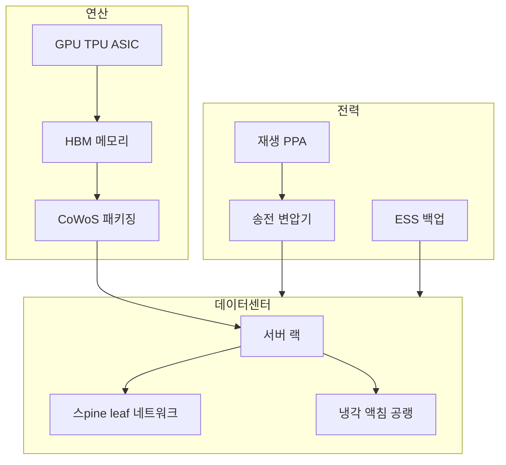
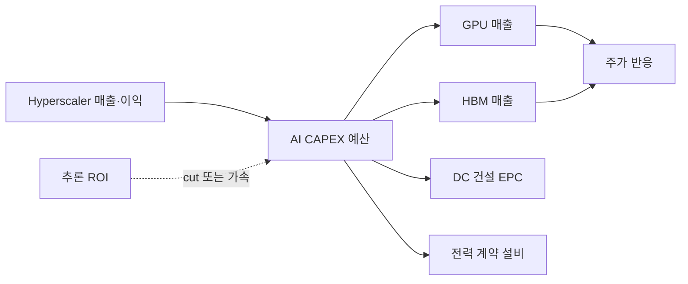
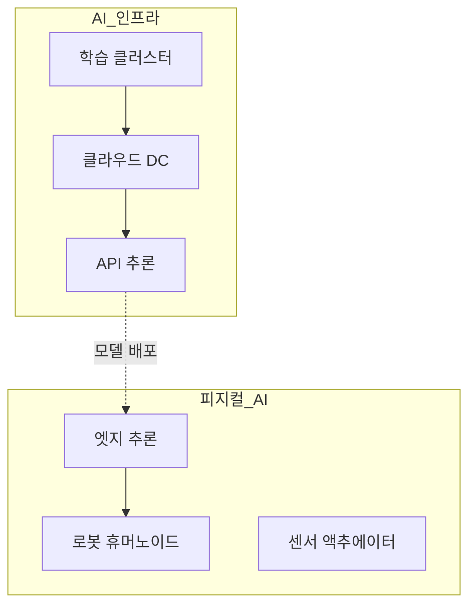

# AI 인프라 — GPU·HBM·데이터센터·전력·CAPEX

> **면책**: 본 문서는 교육 목적이며, 특정 개인·법인에 대한 투자·세무·법률 자문이 아닙니다. 제도·세율·상품 조건은 변경될 수 있으므로 실행 전 공식 출처를 확인하세요.

## 메타

| 항목 | 내용 |
|------|------|
| 최종 검증일 | 2026-05-24 |
| 정책·법령 기준일 | 2025-12-31 확정, 2026 개편 별도 표기 |
| 난이도 | L3 (Deep) — [READER-GUIDE](../../docs/READER-GUIDE.md) |
| 예상 읽기 시간 | 55~65분 |
| 관련 bucket | Bucket 3 (QQQ·반도체·클라우드 ETF), Bucket 4 (GPU·DC·전력 개별) |

## 0. 이 편 읽기 전 (5분)

| 항목 | 내용 |
|------|------|
| **난이도** | L3 (Deep) — [READER-GUIDE §L등급](../../docs/READER-GUIDE.md) |
| **선수** | [semiconductor](semiconductor.md), [sector-investing-framework](sector-investing-framework.md) |
| **이번 편에서 쓰는 기호** | 본문 §4·§4a 표 참고 |
| **복습 한 줄** | — |

## TL;DR

1. **AI 인프라**는 모델(소프트웨어)이 아니라 **GPU·HBM·네트워킹·데이터센터·전력·냉각** 등 **물리적 CAPEX** 스택입니다 — 수익화는 **hyperscaler·클라우드** 매출과 **ROI**에 달려 있습니다.
2. **밸류체인**: **GPU(설계) → HBM·CoWoS → 서버·NIC → DC 건설 → 송전·변압기·ESS** — 병목이 **단계마다 이동**합니다.
3. **2023~2025**는 **GPU·HBM·전력** tight; **2026+** 시나리오는 **CAPEX 성장 둔화·cut·전력 제약** — [semiconductor.md](semiconductor.md) HBM 서브사이클과 연동.
4. **한국**: HBM·메모리·일부 DC·전력망 — **코어 = QQQ·반도체 ETF**, **위성 = HBM·전력·DC 관련 개별**.
5. **피지컬 AI**([physical-ai.md](physical-ai.md))와 구분: AI 인프라는 **“뇌를 돌릴 데이터센터”**, 피지컬 AI는 **“몸(로봇)”** — CAPEX 주체·수익화 **타임라인**이 다릅니다.

## 1. 한 줄 정의 + 왜 중요한가

!!! info "GPU (Graphics Processing Unit)"
    AI 학습·추론 가속 칩.

!!! info "HBM (High Bandwidth Memory)"
    GPU 옆 고대역폭 메모리.

**정의**: **AI 인프라(AI Infrastructure)** 는 대규모 언어·멀티모달 모델 **학습·추론**에 필요한 **하드웨어·시설·전력** 투자 전체를 말합니다. 핵심 레이어는 **가속기(GPU/TPU/ASIC)**, **고대역폭 메모리(HBM)**, **데이터센터(DC)**, **전력·그리드**, **네트워킹**입니다.

!!! info "ETF (Exchange-Traded Fund)"
    거래소에 상장된 인덱스·자산 묶음 펀드.

**왜 중요한가** (장기 자산 형성·bucket 연결):

!!! info "CAPEX (Capital Expenditure)"
    설비·데이터센터 등 자본 지출.

AI 내러티브만 보면 “모든 AI 주”가 같이 오를 것 같지만, **실제 현금 흐름**은 **Microsoft·Amazon·Google·Meta** 등 **CAPEX**와 **NVIDIA·TSMC·전력 유틸**로 **분배**됩니다. CAPEX **cut** 한 분기에 GPU·HBM·장비가 **동반 조정**할 수 있습니다. 한국 투자자는 **HBM·반도체·전력**에 **이중 노출** — [sector-investing-framework.md](sector-investing-framework.md) 5단계로 **“모델 hype vs DC brick”** 을 구분하고, [core-satellite-framework.md](../../04-portfolio/core-satellite-framework.md)에서 **QQQ(매그7 포함)** vs **위성(HBM·전력)** 을 나눠야 합니다.

**핵심은:** "AI 주식"이라는 말이 소프트웨어(모델 기업)와 하드웨어(GPU·HBM·DC·전력)를 뭉뚱그려 표현합니다. 실제 현금흐름은 **하드웨어 스택**에 먼저 집중됩니다. CAPEX를 집행하는 주체(Microsoft, Google, Meta, Amazon)가 GPU를 사고, GPU를 만드는 회사가 돈을 법니다. 한국 투자자는 HBM·전력설비 쪽으로 연결됩니다. "AI 시대가 온다"는 내러티브와 "이 CAPEX가 언제 줄어드는가"는 전혀 다른 질문입니다.

## 2. 선수 지식 / 이후 읽을 것

**선수**:
- [semiconductor.md](semiconductor.md) — HBM·메모리
- [sector-investing-framework.md](sector-investing-framework.md)
- [macroeconomics-basics.md](../../02-economics/macroeconomics-basics.md)

**이후**:
- [physical-ai.md](physical-ai.md) — 엠보디드·로봇 (대비)
- [power-grid-electrification.md](power-grid-electrification.md) — DC 전력·송전
- [leveraged-etf-qqq-qld.md](../../04-portfolio/leveraged-etf-qqq-qld.md)
- [overseas-stocks-tax-part1-cgt.md](../../06-korea-policy/tax/overseas-stocks-tax-part1-cgt.md)
- [recommended-deep-study-roadmap.md](recommended-deep-study-roadmap.md)

## 3. 직관·비유

AI 인프라를 **“발전소 + 송전 + 공장”**으로 봅니다. ChatGPT 같은 **앱**은 **전기를 쓰는 공장**이고, **GPU 클러스터**는 **터빈**, **HBM**은 **고급 연료**, **데이터센터**는 **부지·건물**, **송전·변압기**는 **고압선**입니다. 공장(앱)이 유명해도 **투자 수익**은 **터빈 독점(NVDA)** · **연료(HBM)** · **전력사**에 **나뉩니다**.

**병목 이동**: 2023은 **GPU 부족**, 2024~ **HBM·CoWoS**, 2025~ **전력·변압기·DC 부지** ([power-grid-electrification.md](power-grid-electrification.md)). “AI = NVDA만”이 아니라 **병목이 옮겨갈 때** 수혜주가 **로테이션**합니다.

**vs 피지컬 AI**: AI 인프라는 **클라우드 방**에서 **수백 MW**를 쓰는 **집중형**; 피지컬 AI는 **공장·물류·휴머노이드**에 **분산형** 센서·액추에이터. **CAPEX 주체**(hyperscaler vs 제조사)와 **수익화 속도**가 다릅니다.

**쉽게 말하면:** ChatGPT에게 "오늘 점심 뭐 먹을까?"를 물어보는 순간, 어딘가의 데이터센터에서 **수백 와트의 전기**가 소비됩니다. 그 전기를 공급하는 발전소, 전선을 만드는 변압기 회사, GPU를 냉각하는 시스템, HBM 메모리를 납품하는 반도체사 — 이들이 AI 인프라 밸류체인입니다. 앱이 화려할수록 **인프라 부담**은 올라갑니다.

**핵심은:** AI 인프라 투자 논리는 "이 AI 모델이 얼마나 똑똑한가"가 아니라, **"이 AI 모델을 돌리기 위해 누가 얼마를 투자하는가"**입니다. 2024~2025 hyperscaler CAPEX 수치가 이 논리의 핵심 지표입니다.

## 4. 정식 개념·용어

| 용어 | 한글 | English | 정의 |
|------|------|------|----------------|
| GPU | — | Graphics Processing Unit | AI **학습·추론** 가속기 |
| HBM | 고대역폭메모리 | High Bandwidth Memory | GPU **옆** 메모리 |
| Hyperscaler | — | — | MSFT·AMZN·GOOG·META 등 **대규모 DC** |
| CAPEX | 설비투자 | Capital expenditure | DC·GPU **투자** |
| Training | 학습 | — | 대규모 **사전학습** |
| Inference | 추론 | — | **서비스** 단계 — ROI 핵심 |
| CoWoS | — | Advanced packaging | GPU+HBM **패키징** |
| NIC | — | Network interface | DC **고속 네트워크** |
| PUE | 전력사용효율 | Power usage effectiveness | DC **에너지 효율** |
| MW/GW | — | Megawatt/Gigawatt | DC **전력** 단위 |
| ASIC | — | Application-specific IC | TPU 등 **전용** 칩 |

## 4a. 핵심 용어 (본문 등장 순)

| 용어 | 한 줄 | 관련 이론 | glossary |
|------|------|------|----------------|
| AI 인프라 | 학습·추론용 GPU·HBM·DC·전력 물리 스택 | CAPEX·밸류체인 | — |
| GPU | AI 학습·추론 가속기 | 컴퓨팅 수요 | — |
| HBM | GPU 옆 고대역폭 메모리 | 병목·가격 | [HBM](../../00-roadmap/glossary.md#hbm-high-bandwidth-memory) |
| Hyperscaler | MSFT·AMZN 등 대규모 DC·CAPEX 주체 | 플랫폼 | — |
| CAPEX | DC·GPU 설비투자; cut 시 체인 조정 | 투자사이클 | — |
| Training | 대규모 사전학습; CAPEX 집중 | 규모의 경제 | — |
| Inference | 서비스 단계; ROI·매출화 핵심 | 수익화 | — |
| CoWoS | GPU+HBM 선단 패키징 병목 | 공급망 | — |
| NIC·PUE | DC 고속 네트워크·전력 효율 | DC 운영 | — |
| MW/GW | 데이터센터 전력 단위 | 전력망 | [power-grid](power-grid-electrification.md) |
| 병목 이동 | GPU→HBM→전력→부지 로테이션 | 산업동태 | — |
| 피지컬 AI | 로봇·엠보디드; DC와 CAPEX·타임라인 상이 | 대비 | [Physical AI](../../00-roadmap/glossary.md#physical-ai-피지컬-ai) |

## 4b. 관련 이론 미니맵

- **[반도체](semiconductor.md)** — HBM·메모리·파운드리 밸류체인
- **[전력·그리드](power-grid-electrification.md)** — DC 송전·변압기·ESS
- **[섹터 투자](sector-investing-framework.md)** — hype vs brick·5단계
- **[자산가격 거시](../../02-economics/macro-06-asset-prices-macro.md)** — Mag7·할인율·금리
- **[QQQ·레버리지](../../04-portfolio/leveraged-etf-qqq-qld.md)** — 코어 QQQ vs 위성 집중

## 5. 메커니즘

### 5.1 AI 인프라 스택

### 5.2 CAPEX → 밸류체인 수익

**Inference ROI**: 클라우드 AI **매출 > GPU 감가** — **둔화** 시 CAPEX **cut** → GPU·HBM **멀티플** 조정.

### 5.3 AI 인프라 vs 피지컬 AI (교육)

| | AI 인프라 | 피지컬 AI |
|------|------|----------------|
| **CAPEX** | Hyperscaler **수백억$** | 제조·물류 **점진** |
| **수익화** | 클라우드·API | **로봇 단가·ROI** 불확실 |
| **한국** | HBM·DC·전력 | 감속기·로봇 — [physical-ai.md](physical-ai.md) |
| **bucket** | QQQ·반도체 **3** | 로봇 ETF·개별 **4** |

## 6. 수식·모델

**DC 전력 (교육)**:

| 기호 | 이름 | 이 식에서 의미 |
|------|------|----------------|
| **r** | 할인율·수익률 | 기간당 이자·요구수익률 |
| **n** | 기간 | 연·월 등 복리·할인에 쓰는 횟수 |
| **PV** | 현재가치 | 오늘 시점으로 환산한 금액 |
| **FV** | 미래가치 | 미래 시점의 목표·결과 금액 |

\[
\text{DC 전력(MW)} \approx \frac{\text{GPU 수} \times \text{GPU TDP(W)}}{\text{PUE} \times 10^6}
\]

**식 (기호)**: **DC** 전력(**MW**) ≈ (**GPU** 수 ×**GPU** **TDP**(**W**)) / (**PUE** ×10^6)

**식 (기호)**: **DC** 전력(**MW**) ≈ (**GPU** 수 ×**GPU** **TDP**(**W**)) / (**PUE** ×10^6)

**식 (기호)**: **DC** 전력(**MW**) ≈ (**GPU** 수 ×**GPU** **TDP**(**W**)) / (**PUE** ×10^6)

**읽는 법**: **DC**와 **GPU**의 관계를 위 식으로 쓴다. 경제·재무 해석은 변수표 「이 식에서 의미」와 [DEPTH-STANDARD](../docs/DEPTH-STANDARD.md) 기호 예제를 맞춘다.
- PUE 1.2~1.5 — **냉각**이 전력의 **상당 부분**

**Hyperscaler AI ROI (개념)**:

| 기호 | 이름 | 이 식에서 의미 |
|------|------|----------------|
| **r** | 할인율·수익률 | 기간당 이자·요구수익률 |
| **n** | 기간 | 연·월 등 복리·할인에 쓰는 횟수 |
| **PV** | 현재가치 | 오늘 시점으로 환산한 금액 |

\[
\text{AI ROI} \approx \frac{\text{추론·구독 매출} - \text{GPU·전력·감가}}{\text{AI CAPEX}}
\]

**식 (기호)**: **AI** **ROI** ≈ (추론·구독 매출 - **GPU**·전력·감가) / (**AI** **CAPEX**)

**식 (기호)**: **AI** **ROI** ≈ (추론·구독 매출 - **GPU**·전력·감가) / (**AI** **CAPEX**)

**식 (기호)**: **AI** **ROI** ≈ (추론·구독 매출 - **GPU**·전력·감가) / (**AI** **CAPEX**)

**읽는 법**: **r**와 **n**의 관계를 위 식으로 쓴다. 경제·재무 해석은 변수표 「이 식에서 의미」와 [DEPTH-STANDARD](../docs/DEPTH-STANDARD.md) 기호 예제를 맞춘다.- ROI **불확실** → CAPEX **변동성**

**GPU CAPEX 민감도 (가상)**:

| CAPEX 성장 | GPU 매출 | HBM | DC EPC |
|------|------|------|----------------|
| +50% YoY | **++** | **++** | + |
| +10% | + | + | flat |
| **cut 10%** | **--** | **--** | -- |

**코어 노출**: QQQ **매그7 가중** ≈ **간접 AI CAPEX** 베팅 — [leveraged-etf-qqq-qld.md](../../04-portfolio/leveraged-etf-qqq-qld.md)는 **위성**.

---

 QQQ **매그7 가중** ≈ **간접 AI CAPEX** 베팅 — [leveraged-etf-qqq-qld.md](../../04-portfolio/leveraged-etf-qqq-qld.md)는 **위성**.

## 7. 한국 적용

### 7.1 2025년 기준 (확정)

| 레이어 | 한국 | bucket |
|------|------|----------------|
| **HBM·메모리** | 글로벌 top | ETF·코스피 **3** |
| **DC** | 일부 **국내 DC** 투자 | **3~4** |
| **전력·송전** | AI DC **전력 수요** | [power-grid-electrification.md](power-grid-electrification.md) |
| **해외 GPU** | NVDA 등 | ISA·일반 — **해외주 세금** |
| **DB** | 직접 **불가** | [db-pension.md](../../06-korea-policy/db-pension.md) |

**설계 예**: ISA → **QQQ + KRX 반도체 ETF** (HBM 간접); 위성 **전력·DC** 개별 ≤20%.

### 7.2 2026년 개편·시행 예정 (해당 시)

| 항목 | 2025 | 2026 |
|------|------|----------------|
| ISA 비과세 | 200만 | **500만** |
| 국내 AI DC | 증설 보도 | **전력 허가·송전** 병목 |
| GPU CAPEX | 고성장 | **ROI 검증·선별** 보도 |
| 전력 요금 | 산업용 | **DC 부하** 논의 |

**법·정책**: 전기사업법, RE100, [references/sources.md](../../references/sources.md)

### 7.3 Hyperscaler CAPEX 읽는 법 (교육)

AI 인프라 투자자(교육)는 **분기 실적 발표**에서 아래 **4줄**을 **추출**하는 연습을 합니다. 숫자는 **가상 예시** 형식입니다.

| 항목 | 어디서 | 왜 중요 |
|------|------|----------------|
| **Total CAPEX** | CF표·IR | **전체** **설비** **규모** |
| **Cloud / AI capex** | MD&A | **GPU·DC** **비중** |
| **Depreciation** | IS | **감가** vs **매출** |
| **Capex guide next FY** | 컨콜 | **cut·accelerate** **신호** |

**매출 대비 CAPEX**가 **50%+** 지속되면 **시장**은 **“ROI 증명”** 을 **요구**합니다. **Inference**(API·Copilot·광고) **매출** **성장**이 **GPU CAPEX** **성장**을 **못 따라가면** **2026 cut** **시나리오** — [semiconductor.md](semiconductor.md) **HBM** **동반**.

**한국 DC**: **부지·전력 접속·PUE** **3종** **세트** **확인**. **EPC** **주**는 **GPU** **주**와 **다른** **실적** **lag** — [power-grid-electrification.md](power-grid-electrification.md).

**계좌**: **NVDA·MSFT** **해외** → [overseas-stocks-tax-part2-dividend.md](../../06-korea-policy/tax/overseas-stocks-tax-part2-dividend.md); **국내 전력·DC** → [domestic-stocks-tax.md](../../06-korea-policy/tax/domestic-stocks-tax.md).

### 7.4 한국 투자자 실전 가이드 (교육)

**AI 인프라 투자 경로 (가상 예시)**:
1. **QQQ·SPY** (ISA) → Mag7 포함 — AI 인프라 간접 노출
2. **TIGER 미국AI반도체나스닥** 또는 **KODEX AI반도체핵심장비** 등 AI 특화 ETF → TER·구성 확인
3. 미국 직접: **SMH·SOXX** (반도체), **NVDA 개별** (Bucket 4 위성)

**한국 연결고리 (교육 — 가상 예시)**:

| AI 인프라 레이어 | 한국 노출 유형 | 특이사항 |
|------|------|----------------|
| HBM 메모리 | 대형 메모리 IDM | AI CAPEX와 직결 서브사이클 |
| 전력·ESS | 전력설비·변압기사 | [power-grid-electrification.md](power-grid-electrification.md) |
| DC 건설·냉각 | 건설·설비 계열 | 수주 사이클 |
| 장비 | 반도체 장비 | [semiconductor.md](semiconductor.md) |

쉽게 말하면: 한국에는 "AI 인프라 ETF"라는 이름 그대로의 상품이 없더라도, **반도체 ETF + 전력 ETF**로 한국 AI 인프라 노출을 나눌 수 있습니다.

## 8. 숫자 예제 (가상)

> 모든 인물·금액·회사명은 가상입니다.

### 예제 1: 가상 DC 100MW (교육)

| 항목 | 값 (가상) |
|------|-----------|
| GPU rack | 12,000장 |
| TDP 평균 | 700W |
| PUE | 1.35 |
| **전력** | ~100MW |
| 변압기·송전 CAPEX | **2,**F**** (가상) |

→ [power-grid-electrification.md](power-grid-electrification.md) **병목** 연결.

### 예제 2: CAPEX cut 시나리오 (가상)

| | 2024 | 2025 (cut) |
|------|------|----------------|
| Hyperscaler AI CAPEX | +45% | **+5%** |
| NVDA 매출 growth | +80% | **+15%** |
| HBM ASP | +40% | **+5%** |

→ **위성 HBM·GPU** -30% (가상) vs **QQQ** -8%.

### 예제 3: ISA 배분 (가상 F)

| | 금액 | bucket |
|------|------|----------------|
| QQQ | **M** | 3 |
| 반도체 ETF | **M** | 3 |
| 가상 전력주 | **M** | 4 |

**10년**: 코어 **복리**, 위성 **CAPEX cut** 대비 **분산**.

### 예제 보강: AI 인프라 CAPEX 사이클 기호 계산 (가상)

**설정 (교육용 기호)**:
- 빅테크 CAPEX 총액: **C** (분기, 달러)
- GPU 비중: **w_GPU** (0~1)
- GPU 가격: **P_GPU**
- 데이터센터 수주 규모: **D = C × (1 - w_GPU)**

**단계별 투자 신호 계산**:

\[ \text{GPU 수요} = C \times w_{GPU} / P_{GPU} \]

**가상 시나리오 비교 (교육)**:

| 시나리오 | C 변화 | 수혜 섹터 | 투자 포인트 |
|------|------|------|----------------|
| CAPEX 확대 | C × 1.2 | GPU, HBM, 전력 | 공급 부족 |
| CAPEX 보합 | C × 1.0 | 운영 효율화 소프트웨어 | 소프트 전환 |
| CAPEX 감소 | C × 0.8 | 방어 ETF | 반도체 하락 |

**교훈**: AI 인프라 투자의 핵심 선행 지표 = **빅테크 4사 CAPEX 가이던스** (실적 시즌 분기별 모니터링)

## 9. FAQ

**Q1. AI 인프라 = NVDA만?**  
**A.** **GPU + HBM + DC + 전력 + 네트워크**. 병목 **로테이션**.

**Q2. QQQ면 AI 인프라 충분?**  
**A.** **코어**로 **매그7·간접 CAPEX** 노출. **HBM·전력**은 **반도체 ETF·위성** 보완.

**Q3. CAPEX cut 신호는?**  
**A.** Hyperscaler **가이던스**, **GPU 재고**, **추론 ROI** 언론 — **교차 검증**.

**Q4. HBM은 AI 인프라 vs [semiconductor.md](semiconductor.md)?**  
**A.** **둘 다**. 본 문서 = **DC 스택**, 반도체 = **제품·사이클**.

**Q5. 피지컬 AI와 동시에 올인?**  
**A.** **비권장**. 인프라 **수익화 앞**, 피지컬 **실험** — bucket **3 vs 4**.

**Q6. DB로 NVDA?**  
**A.** **불가**(일반). ISA·일반 — [overseas-stocks-tax-part1-cgt.md](../../06-korea-policy/tax/overseas-stocks-tax-part1-cgt.md).

**Q7. 전력주는 AI 인프라?**  
**A.** **DC 전력 수요** — [power-grid-electrification.md](power-grid-electrification.md).

**Q8. QLD로 AI 레버?**  
**A.** **Bucket 4** — [leveraged-etf-qqq-qld.md](../../04-portfolio/leveraged-etf-qqq-qld.md).

**Q9. 국내 DC 투자 리스크?**  
**A.** **전력·부지·PUE·수주** — EPC **마진** 변동.

**Q10. Training vs Inference 투자 차?**  
**A.** Training = **CAPEX peak**; Inference = **지속 ROI** — **cut**은 주로 **training capex**.

**Q11. AI 인프라만 공부하고 전력은 나중에?**  
**A.** **비권장**. **2025~** **병목**이 **전력** — [power-grid-electrification.md](power-grid-electrification.md) **Week 6** **로드맵**.

**Q12. 소형 AI 스타트업 IPO는 AI 인프ra?**  
**A.** **대부분 아니오** — **앱·모델**; **인프ra** = **DC·GPU·HBM·전력** **CAPEX** **체인**.

**Q11. AI 인프라 ETF와 반도체 ETF는 어떻게 다른가요?**
**A.** AI 인프라 ETF는 GPU 설계(팹리스)·클라우드·DC REIT·전력까지 넓게 담습니다. 반도체 ETF는 메모리·파운드리·장비·팹리스를 담습니다. 겹치는 종목이 있어도 **비중이 다릅니다**. 반도체 ETF엔 메모리 비중이 높고, AI 인프라 ETF엔 NVDA·클라우드 비중이 높을 수 있습니다. 두 ETF를 동시에 갖고 있다면 **중복 종목 확인**이 필요합니다.

**Q12. CAPEX가 줄면 AI 인프라 주는 어떻게 되나요?**
**A.** 단기적으로 GPU 출하·HBM 주문·장비 발주가 일제히 약화됩니다. 단, 이는 **투자 사이클 조정**이지 AI 수요 자체의 소멸은 아닙니다. 추론(inference) 수요는 학습(training) CAPEX가 줄어도 지속됩니다 — 하지만 추론용 칩은 고성능 GPU보다 저전력 칩이 경쟁합니다. **CAPEX 사이클 + 추론 수요 증가**를 동시에 읽어야 합니다.

**Q13. 한국에서 AI 인프라에 투자하는 가장 단순한 방법은?**
**A.** 교육적 프레임: **ISA에 QQQ** (Mag7·AI 간접노출) + **HBM 관련 반도체 ETF** (국내 노출). 단, 이 두 자산이 **상당히 상관관계가 높다는 점**을 인지해야 합니다. [geographic-diversification.md](../../04-portfolio/geographic-diversification.md)에서 지역·섹터 상관관계를 함께 보세요.

## 10. 함정·리스크·한계

- **모델 hype = 모든 AI 주** — **CAPEX cut** 분리
- **NVDA PER** — **성장 둔화** 민감
- **HBM만** — **증설·경쟁**
- **전력 병목** 무시
- **QLD 코어화**
- **DB 착각**
- **해외주 환율·세금**
- **피지컬 AI와 혼동**
- **OpenAI·Anthropic **비상장** **내러티브** **= **상장** **인프ra** **수익** **착각**
- **전력 **허가** **무시** **DC** **주** **고평가**
- **rebalancing-and-dca.md](../../04-portfolio/rebalancing-and-dca.md) **없이** **CAPEX** **뉴스** **추가** **매수**

### 10.1 CAPEX cut 대응 playbook (교육, 가상)

| 단계 | 행동 | bucket |
|------|------|----------------|
| 1 | Hyperscaler **guide** **하향** **확인** | — |
| 2 | **위성** HBM·장비 **비중** **≤10%?** | 4 **축소** |
| 3 | **코어** QQQ·반도체 ETF **유지·DCA** | 3 |
| 4 | **전력** **병목** **지속** **여부** | [power-grid-electrification.md](power-grid-electrification.md) |
| 5 | **5단계** **재실행** — **PER** **아닌** **CAPEX** **·** **재고** | framework |

---

**Q. 실무에서는?**  
교과서 식·기호를 그대로 적용하기 전에 **수수료·세금·데이터 시점**을 분리한다. 숫자는 [DEPTH-STANDARD](../docs/DEPTH-STANDARD.md)처럼 기호만 먼저 맞추고, 법령·시장 수치는 §8 표·외부 출처로 갱신한다.

## 11. 심화 읽기

- [references/sources.md](../../references/sources.md)
- [semiconductor.md](semiconductor.md)
- [physical-ai.md](physical-ai.md)
- [power-grid-electrification.md](power-grid-electrification.md)
- Hyperscaler **10-K CAPEX** (원문)

## 12. 스스로 점검 퀴즈

1. AI 인프라 스택 **4층**?
2. CAPEX cut이 **HBM**에 미치는 경로?
3. QQQ는 bucket 몇?
4. AI 인프ra vs 피지컬 AI **CAPEX 주체** 차?
5. PUE 정의?
6. 한국 **직접** AI 인프라 강점 1?
7. Inference ROI가 CAPEX에?
8. DB NVDA 직접?

??? note "정답 힌트"

    1. **GPU/HBM → DC → 네트워크 → 전력** (변형 가능)  
    2. Hyperscaler **예산↓** → **HBM 주문↓** → ASP·멀티플  
    3. **Bucket 3**  
    4. 인프ra **hyperscaler** / 피지컬 **제조·물류**  
    5. DC **총전력/IT전력** — 효율 지표  
    6. **HBM·메모리**  
    7. ROI **낮으면 cut** 압력  
    8. **아니오**