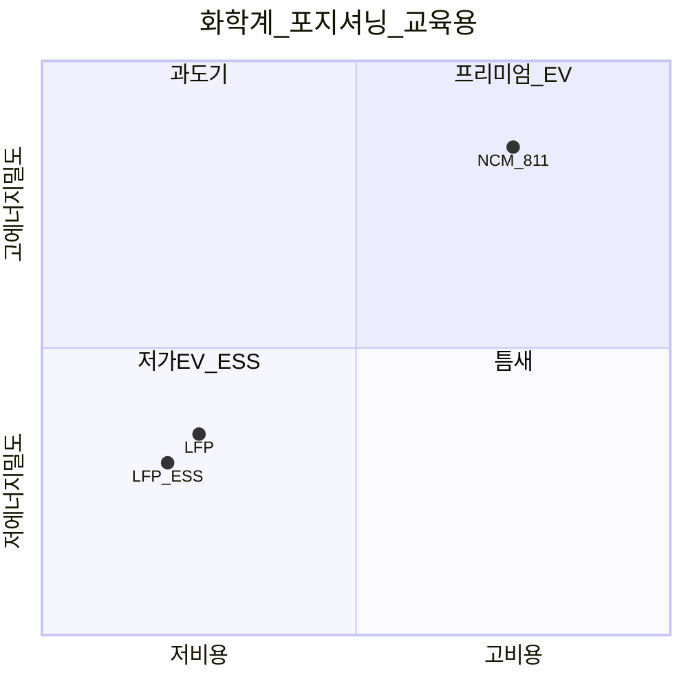
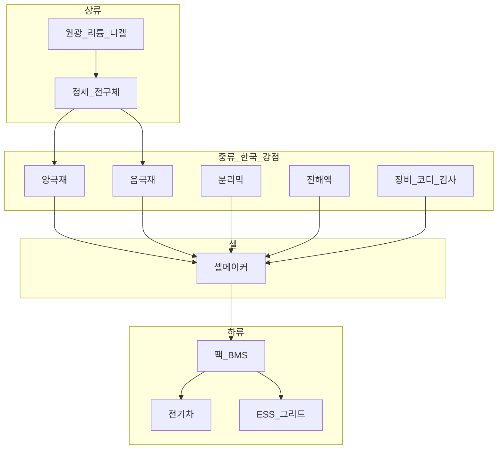
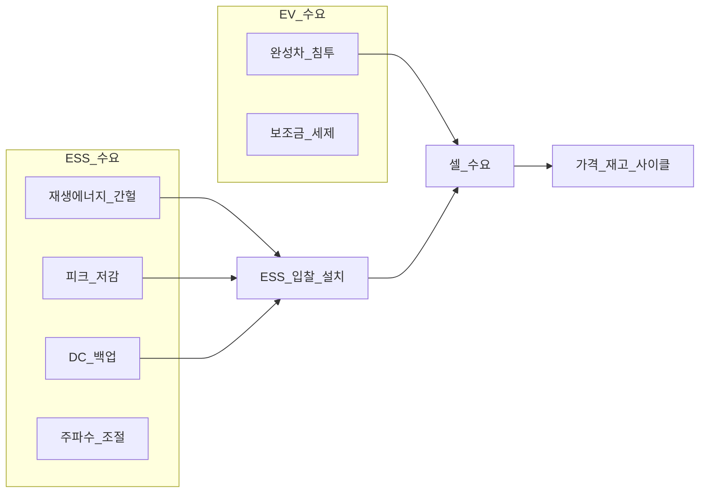

# 2차전지 — LFP vs NCM, ESS 밸류체인·사이클

> **면책**: 본 문서는 교육 목적이며, 특정 개인·법인에 대한 투자·세무·법률 자문이 아닙니다. 제도·세율·상품 조건은 변경될 수 있으므로 실행 전 공식 출처를 확인하세요.

## 메타

| 항목 | 내용 |
|------|------|
| 최종 검증일 | 2026-05-24 |
| 정책·법령 기준일 | 2025-12-31 확정, 2026 개편 별도 표기 |
| 난이도 | L3 (Deep) — [READER-GUIDE](../../docs/READER-GUIDE.md) |
| 예상 읽기 시간 | 55~65분 |
| 관련 bucket | Bucket 3 (2차전지·클린 ETF), Bucket 4 (소재·장비 개별) |

## 0. 이 편 읽기 전 (5분)

| 항목 | 내용 |
|------|------|
| **난이도** | L3 (Deep) — [READER-GUIDE §L등급](../../docs/READER-GUIDE.md) |
| **선수** | [sector-investing-framework](sector-investing-framework.md), [stocks-equities-intro](../stocks-equities-intro.md) |
| **이번 편에서 쓰는 기호** | 본문 §4·§4a 표 참고 |
| **복습 한 줄** | — |

## TL;DR

1. **LFP(리튬인산철)** 는 저가·안전·수명 — **저가 EV·ESS·에너지 저장**에 강하고, **NCM(삼원계)** 은 에너지 밀도·고성능 EV에 강합니다 — **대체 관계**이지 “둘 다 무조건 수혜”가 아닙니다.
2. **ESS(에너지저장장치)** 는 EV와 **다른 수요·입찰·규제·사이클** — 재생에너지·피크 저감·데이터센터 백업 등 **별도 밸류체인**입니다.
3. 밸류체인: **원광·정제 → 양극재·음극재·분리막·전해액 → 셀 → 팩/BMS → ESS/EV** — **마진은 단계·시점마다 이동**합니다.
4. **한국**은 양극재·전해액·장비·일부 셀에 강점; **중국 LFP·저가 셀** 공급 확대로 **마진·점유율 압박** 구간이 반복됩니다.
5. 투자: **코어 = 2차전지·클린 ETF**(Bucket 3), **위성 = 소재·장비 개별**(Bucket 4, 상한) — [sector-investing-framework.md](sector-investing-framework.md) 5단계 필수.

---

## 1. 한 줄 정의 + 왜 중요한가
!!! info "GPU (Graphics Processing Unit)"
    AI 학습·추론 가속 칩.

**정의**: **2차전지 섹터**는 전기화(Electrification)의 핵심 에너지 저장 기술로, **화학계(LFP vs NCM vs NCA 등)**, **부품 밸류체인**, **완성 응용(EV·ESS)** 으로 나뉩니다. **ESS**는 그중 **고정형·그리드 연계** 저장에 특화된 시장입니다.

**왜 중요한가** (장기 자산 형성·bucket 연결):

!!! info "Bucket"
    시간·목적별 **자금 슬롯**(0 비상금 → 3 코어 등)

!!! info "ETF"
    지수·자산 **바구니**를 한 종목처럼 거래

!!! info "CAPEX (Capital Expenditure)"
    설비·데이터센터 등 자본 지출.

전기차·재생에너지·AI 데이터센터 **백업 전력**까지 2차전지 TAM은 10년 스케일에서 **구조적 성장** 후보입니다. 그러나 **CAPEX 폭증·중국 공급·원자재(리튬·니켈·코발트) 가격**으로 **2018~2023급 사이클**이 반복될 수 있습니다. 한국 투자자는 **코스피·코스닥 2차전지·소재 비중**이 커서 지수·ETF·개별 선택이 [core-satellite-framework.md](../../04-portfolio/core-satellite-framework.md)와 직결됩니다. “유망 = 매수”가 아니라 **화학계 대체·ESS 분리·재무 사이클**을 이해해야 Bucket 3(분산) vs 4(집중)를 나눌 수 있습니다.

---

## 2. 선수 지식 / 이후 읽을 것

**선수**:
- [sector-investing-framework.md](sector-investing-framework.md) — 5단계 템플릿
- [stocks-equities-intro.md](../stocks-equities-intro.md)
- [financial-statements-intro.md](../../01-foundations/financial-statements-intro.md) — ROIC·재고

**이후**:
- [power-grid-electrification.md](power-grid-electrification.md) — ESS·송전·EV 충전
- [semiconductor.md](semiconductor.md) — BMS·전력반도체
- [kosdaq-tier-system.md](../kosdaq-tier-system.md) — 소재 코스닥
- [recommended-deep-study-roadmap.md](recommended-deep-study-roadmap.md)

---

## 3. 직관·비유

**LFP vs NCM**을 **연료 종류**에 비유합니다. **LFP**는 **디젤 연료 — 값싸고 안전하고 튼튼**(수명·열 안정)하지만 **에너지 밀도(연비)** 가 NCM보다 낮습니다. **NCM**은 **고옥탄 — 가볍고 멀리 가지만** 원료(니켈·코발트)가 비싸고 **열·안전 관리**가 까다롭습니다. 같은 “전기차 시장”이라도 **저가 EV는 LFP**, **프리미엄·장거리는 NCM**처럼 **고객이 갈라지면** 한쪽 화학계 소재사 PER이 **반대로** 움직일 수 있습니다.

**ESS**는 **가정용 대형 얼음고**입니다. EV용 **휴대용 아이스박스**(고출력·경량)와 달리, ESS는 **크고 무겁지만 오래·저렴하게** 전기를 저장합니다. **태양광 낮 전기 → 밤 사용**, **데이터센터 UPS**, **송전망 피크 shaving** — 수요 주체가 **자동차 OEM**과 다르고, **입찰·규제·유틸리티**가 끼어듭니다.

**사이클**은 **반도체 메모리**와 닮았습니다. 공장을 **과잉 증설**하면 2년 뒤 **셀 가격 폭락·재고** — “성장 산업”이어도 **주가 -50%** 구간이 옵니다. [semiconductor.md](semiconductor.md)의 DRAM 사이클 직관을 **2차전지 CAPEX**에 적용하세요.

---

## 4. 정식 개념·용어

| 용어 | 한글 | English | 정의 |
|------|------|---------|------|
| LFP | 리튬인산철 | LiFePO₄ | 저비용·안전·장수명 양극 화학계 |
| NCM/NCA | 삼원계·NCMA | Nickel-rich cathode | 고에너지 밀도 양극 |
| ESS | 에너지저장장치 | Energy Storage System | 고정형 그리드·산업용 저장 |
| BMS | 배터리관리시스템 | Battery Management System | 충방전·열·안전 제어 |
| GWh | 기가와트시 | Gigawatt-hour | 생산·수요 용량 단위 |
| $/kWh | 킬로와트시당 가격 | Cell/pack price | 경쟁력·마진 핵심 지표 |
| 양극재 | — | Cathode active material | 리튬·니켈·인 등 — **마진 변동 큼** |
| 전해액 | — | Electrolyte | 이온 전도 — 한국 강점 |
| 분리막 | — | Separator | 안전·성능 — 기술 장벽 |
| C-rate | 충방전율 | Charge/discharge rate | ESS vs EV 요구 차이 |
| SOH | 잔존수명 | State of Health | ESS 2차 이용·재활용 |

### 4a. 핵심 용어 (본문 등장 순)

> 복습용. 정의는 §4 본표·[glossary](../../00-roadmap/glossary.md)·본문 `!!! info` 박스.

| 용어 | 한 줄 | 관련 이론 | glossary |
|------|-------|-----------|----------|
| LFP | 저비용·안전·장수명 양극 화학계 | §4 | [glossary](../../00-roadmap/glossary.md#lfp) |
| NCM/NCA | 고에너지 밀도 양극 | §4 | [glossary](../../00-roadmap/glossary.md#ncm/nca) |
| ESS | 고정형 그리드·산업용 저장 | §4 | [glossary](../../00-roadmap/glossary.md#ess) |
| BMS | 충방전·열·안전 제어 | §4 | [glossary](../../00-roadmap/glossary.md#bms) |
| GWh | 생산·수요 용량 단위 | §4 | [glossary](../../00-roadmap/glossary.md#gwh) |
| $/kWh | 경쟁력·마진 핵심 지표 | §4 | [glossary](../../00-roadmap/glossary.md#$/kwh) |
| 양극재 | 리튬·니켈·인 등 | §4 | [glossary](../../00-roadmap/glossary.md#양극재) |
| 전해액 | 이온 전도 | §4 | [glossary](../../00-roadmap/glossary.md#전해액) |
| 분리막 | 안전·성능 | §4 | [glossary](../../00-roadmap/glossary.md#분리막) |
| C-rate | ESS vs EV 요구 차이 | §4 | [glossary](../../00-roadmap/glossary.md#c-rate) |
| SOH | ESS 2차 이용·재활용 | §4 | [glossary](../../00-roadmap/glossary.md#soh) |

---

## 5. 메커니즘

### 5.1 LFP vs NCM 포지셔닝

| 비교 | LFP | NCM (Ni-rich) |
|------|-----|---------------|
| **에너지 밀도** | 낮~중 | **높음** |
| **원가 $/kWh** | **낮음** | 높음 |
| **안전·수명** | **우수** | 관리 필요 |
| **주요 수요** | 저가 EV, **ESS**, 버스 | 프리미엄 EV |
| **공급 집중** | **중국** 강함 | 한·중·일 |

### 5.2 밸류체인 (EV + ESS)

**마진 이동**: 호황기 **셀**이, 증설 과잉기 **소재·장비**가, 침체기 **생존 셀**이 **통합**하며 마진을 가져갑니다. 5단계 **2. 밸류체인**에서 **현재 bottleneck**을 매번 다시 그리세요.

### 5.3 ESS vs EV 수요 메커니즘

ESS는 **전력망·유틸·RE100** ([power-grid-electrification.md](power-grid-electrification.md))과 연결; EV는 **소비자·OEM** 사이클. **2022~2023 EV 둔화 + ESS 급성장**처럼 **디커플링**될 수 있습니다.

---

## 6. 수식·모델

**셀·팩 원가 (교육용)**:

| 기호 | 이름 | 이 식에서 의미 |
|------|------|----------------|
| \(r\) | 할인율·수익률 | 기간당 이자·요구수익률 |
| \(n\) | 기간 | 연·월 등 복리·할인에 쓰는 횟수 |
| \(PV\) | 현재가치 | 오늘 시점으로 환산한 금액 |
| \(FV\) | 미래가치 | 미래 시점의 목표·결과 금액 |

\[
\text{Pack cost} \approx \text{Cell cost} + \text{BMS} + \text{구조·열관리} + \text{마진}
\]

**읽는 법**: **Pack**와 **Cell**의 관계를 위 식으로 쓴다. 경제·재무 해석은 변수표 「이 식에서 의미」와 [DEPTH-STANDARD](../docs/DEPTH-STANDARD.md) 기호 예제를 맞춘다.
- LFP 셀 **$/kWh** 하락 → ESS **경제성** ↑ → LFP 수요 ↑ → **NCM 점유율** 압박

**공장 가동률·손익**:

| 기호 | 이름 | 이 식에서 의미 |
|------|------|----------------|
| \(r\) | 할인율·수익률 | 기간당 이자·요구수익률 |
| \(n\) | 기간 | 연·월 등 복리·할인에 쓰는 횟수 |
| \(PV\) | 현재가치 | 오늘 시점으로 환산한 금액 |

\[
\text{영업이익} \propto (\text{출하 GWh}) \times (\text{ASP} - \text{단위원가}) - \text{고정비}
\]

**읽는 법**: **r**와 **n**의 관계를 위 식으로 쓴다. 경제·재무 해석은 변수표 「이 식에서 의미」와 [DEPTH-STANDARD](../docs/DEPTH-STANDARD.md) 기호 예제를 맞춘다.- 가동률 **<70%** 구간에서 **영업적자** 전환 빈번 (가상 CAPEX 과잉 시)

**재고·사이클 신호 (체크리스트)**:

| 지표 | 호황 | 침체 신호 |
|------|------|----------------|
| 셀 ASP | ↑ | **↓ 2분기 연속** |
| 재고일수 | 낮음 | **↑** |
| CAPEX 가이던스 | ↑↑ | **cut** |
| 중국 LFP 가격 | 안정 | **급락** |

**ROIC**: 증설 후 **ROIC < WACC** 구간이 2~3년 지속되면 “성장”이 아닌 **과잉** 가능성 — [sector-investing-framework.md](sector-investing-framework.md) 4단계.

---

↑ | **cut** |
| 중국 LFP 가격 | 안정 | **급락** |

**ROIC**: 증설 후 **ROIC < WACC** 구간이 2~3년 지속되면 “성장”이 아닌 **과잉** 가능성 — [sector-investing-framework.md](sector-investing-framework.md) 4단계.

---

## 7. 한국 적용

### 7.1 2025년 기준 (확정)

| 영역 | 한국 포지션 | 투자 연결 |
|------|-------------|-----------|
| **양극재·전구체** | 글로벌 top tier 다수 | 코스피·코스닥 소재 — **위성** |
| **전해액** | 세계 점유율 상위 | 코스피 |
| **분리막** | 강·약 혼재 | 개별·ETF |
| **장비** | 코터·검사 | **CAPEX 사이클** 민감 |
| **셀** | EV·ESS 일부 | OEM 계약·가동률 |
| **ETF** | 2차전지·친환경 테마 | **Bucket 3** |
| **코스닥 소재** | 변동성·승강제 | [kosdaq-tier-system.md](../kosdaq-tier-system.md) |

**계좌**: ISA·IRP에서 2차전지 ETF ([isa.md](../../06-korea-policy/isa.md)); DB는 직접 운용 불가 ([db-pension.md](../../06-korea-policy/db-pension.md)).

### 7.2 2026년 개편·시행 예정 (해당 시)

| 항목 | 2025 | 2026 (시행 여부 명시) |
|------|------|----------------|
| ISA 비과세 한도 | 200만 원 | **500만 원** (확인 필요) |
| IRA·EU 배터리 규정 | 현행 | **현지화·탄소발자국** 강화 보도 — 한국 **수출 조건** 변동 |
| ESS 국내 입찰 | RE100·RPS | **AI DC 백업 ESS** 수요 보도 |
| 코스닥 승강제 | 도입 | 소재 **위성** 필수 점검 |

**법·정책 근거**: 전기사업법·신에너지·재생에너지, 미 IRA §45X, EU Battery Regulation, [references/sources.md](../../references/sources.md)

---

## 8. 숫자 예제 (가상)

> 모든 인물·금액·회사명은 가상입니다.

### 예제 1: LFP vs NCM — 가상 OEM 선택

| OEM (가상) | 2024 모델 | 화학계 | 이유 |
|------------|-----------|--------|------|
| **저가 EV Z** | 3,**M** (만 원 단위, 교육용)급 | **LFP** | 원가·수명 |
| **프리미엄 P** | 6,**M** (만 원 단위, 교육용)급 | **NCM 811** | 주행거리 |
| **ESS 유틸 U** | 100MWh | **LFP** | 안전·$/kWh |

→ 가상 **NCM 양극재 A** PER 50 → ESS 비중 ↑ 시 **성장률 하향** 재평가.

### 예제 2: 사이클 — 가상 셀메이커 B (GWh)

| 연도 | CAPEX | 가동률 | ASP | 영업이익률 |
|------|-------|--------|-----|------------|
| 2021 | 2조 | 95% | 100 | 12% |
| 2023 | 5조 | 65% | 70 | **-5%** |
| 2025 | 3조 | 80% | 78 | 4% |

→ **2021 PER 40 매수** = 5단계 4. 재무 무시. **2023** 바닥은 **재고·중국 LFP** 확인 후.

### 예제 3: ISA 코어 vs 위성 (가상 직장인 D)

| 포지션 | 금액 | 비중 | bucket |
|--------|------|------|--------|
| 2차전지 ETF | 4,000만 원 | 80% | 3 (ISA) |
| 가상 전해액 코스피 | **M** (만 원 단위, 교육용) | 10% | 4 |
| 가상 코스닥 장비 | **M** (만 원 단위, 교육용) | 10% | 4 |

| 시나리오 (가상 1년) | ETF | 개별 |
|---------------------|-----|------|
| ESS 호황 | +15% | +30% / **-20%** (장비) |

→ **위성 20%** = 학습·변동; 코어 ETF가 **포트 안정**.

---

## 9. FAQ

**Q1. LFP와 NCM 중 뭐가 “더 좋은” 투자인가요?**  
**A.** **용도·시점**에 따라 다릅니다. 저가 EV·ESS 성장기 **LFP 밸류체인**, 프리미엄 EV **NCM** — **동시에 올인 금지**, 5단계 경쟁 분석.

**Q2. ESS는 2차전지 ETF에 포함되나요?**  
**A.** **운용사·지수마다 다름**. ETF **보유종목·섹터 비중** 확인. ESS는 [power-grid-electrification.md](power-grid-electrification.md)와 함께 보세요.

**Q3. 한국 소재주는 코어에 넣어도 되나요?**  
**A.** **분산 ETF(Bucket 3)** 가 우선. 소재 개별 **집중**은 Bucket 4 — 사이클·중국 가격 **민감**.

**Q4. 리튬 가격이 떨어지면 2차전지 주가도 오르나요?**  
**A.** **단기** 수혜(원가↓) vs **장기** 공급 과잉 신호. **재고·ASP** 함께 보세요.

**Q5. EV 판매 둔화면 ESS만 사면 되나요?**  
**A.** ESS도 **입찰·규제·셀 공급** 의존. **디커플링** 가능하지만 **같은 셀 공장** 쓰면 **연동**도 있음.

**Q6. 코스닥 2차전지 테마주 주의점은?**  
**A.** [kosdaq-tier-system.md](../kosdaq-tier-system.md) **투자주의·관리**. 실매출·감사 **확인**.

**Q7. DB로 2차전지 ETF 살 수 있나요?**  
**A.** **일반적으로 불가**. ISA·IRP — [db-pension.md](../../06-korea-policy/db-pension.md).

**Q8. NCM → LFP 전환 발표가 나오면?**  
**A.** **NCM 소재** 압박, **LFP·ESS** 상대 수혜 — **CR3·계약** 재점검.

**Q9. 2차전지와 [semiconductor.md](semiconductor.md) BMS 반도체 관계는?**  
**A.** BMS·전력반도체는 **반도체 서브**. 2차전지 **밸류체인 5단계**와 **반도체 세그먼트** 교차 학습.

**Q10. 사이클 바닥 신호 3가지는?**  
**A.** (교육) **CAPEX cut**, **재고 정상화**, **ASP 2분기 stabilizing** — 단독 지표 금지.

---

## 10. 함정·리스크·한계

- **“EV 100% 성장”** 내러티브만 — **공급 2배**면 ASP 폭락
- **LFP·NCM 둘 다 매수** — **대체·마진 재분배** 무시
- **ESS = EV** 동일 사이클 착각
- **코스닥 소재 몰빵** — 승강제·유동성
- **PER만** — **재고·가동률·ROIC** 미확인
- **중국 LFP 저가** — 한국 NCM·장비 **수주** 타격
- **IRA·EU 규정** — 현지화 비용
- **원자재(리튬) 단기** vs **구조(공급)** 혼동
- 문서 **TAM·가격** — 시점별 갱신 필요

---

**Q. 실무에서는?**  
교과서 식·기호를 그대로 적용하기 전에 **수수료·세금·데이터 시점**을 분리한다. 숫자는 [DEPTH-STANDARD](../docs/DEPTH-STANDARD.md)처럼 기호만 먼저 맞추고, 법령·시장 수치는 §8 표·외부 출처로 갱신한다.

## 11. 심화 읽기

- [references/sources.md](../../references/sources.md)
- [sector-investing-framework.md](sector-investing-framework.md)
- [power-grid-electrification.md](power-grid-electrification.md)
- [semiconductor.md](semiconductor.md) — BMS·전력
- IEA Global EV Outlook, BloombergNEF (교차 검증)
- SNE Research — 셀·ESS 출하 (2차)

---

## 12. 스스로 점검 퀴즈

1. LFP가 상대적으로 유리한 **두 가지** 응용은?
2. ESS와 EV 수요의 **수요 주체** 차이 한 줄은?
3. 밸류체인에서 한국 **전통적 강점** 2단계는?
4. 사이클 침체 시 ASP·가동률·CAPEX 중 **cut** 신호는?
5. 2차전지 ETF는 주로 bucket 몇? 코스닥 소재 개별은?
6. NCM → LFP OEM 전환 시 **압박** 받는 밸류체인은?
7. DB에서 2차전지 ETF 직접 선택이 일반적인가?
8. ESS 디커플링 예시 (가상 시나리오) 한 가지는?

??? note "정답 힌트"

    1. **저가 EV**, **ESS(고정형 저장)**  
    2. EV = **OEM·소비자** / ESS = **유틸·그리드·입찰·RE100**  
    3. **양극재·전해액** (장비·셀 포함 가능 — 문맥)  
    4. **CAPEX cut** (+ ASP 하락·가동률 <70% 등)  
    5. ETF **Bucket 3**, 코스닥 **Bucket 4**  
    6. **NCM 양극재·고니켈** 밸류체인  
    7. **아니오** — ISA·IRP  
    8. **EV 둔화 + ESS 입찰 급증** (2022~23 유형)