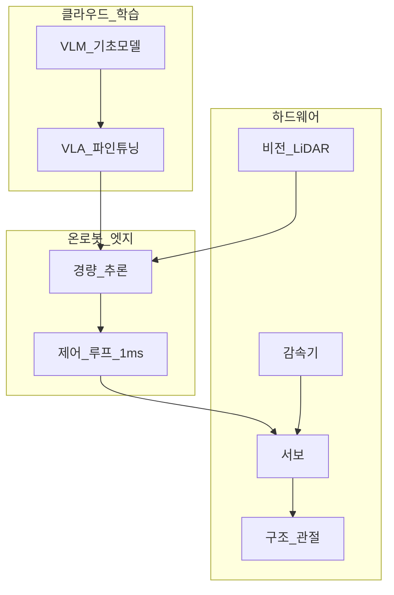
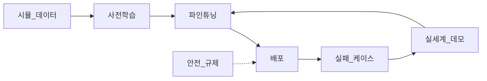
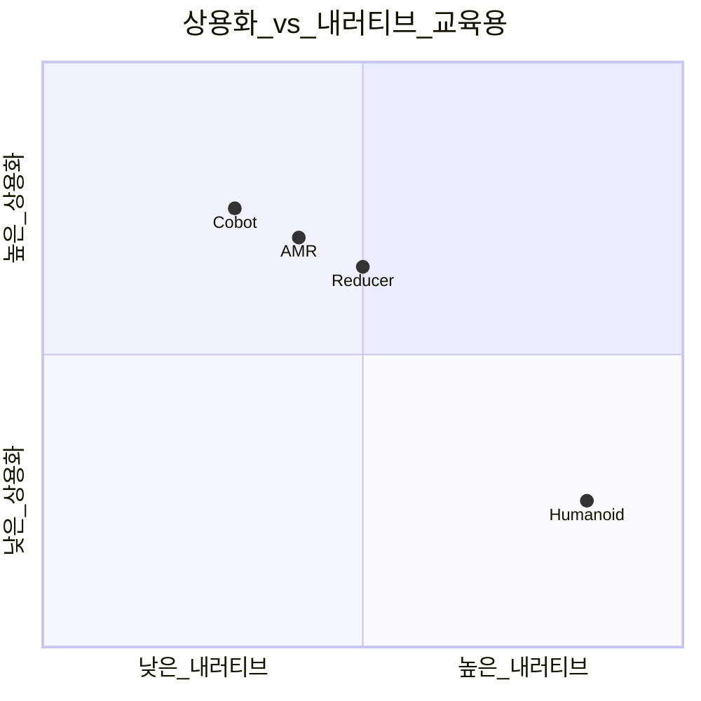

# 피지컬 AI — 엠보디드·VLA·감속기·휴머노이드

> **면책**: 본 문서는 교육 목적이며, 특정 개인·법인에 대한 투자·세무·법률 자문이 아닙니다. 제도·세율·상품 조건은 변경될 수 있으므로 실행 전 공식 출처를 확인하세요.

## 메타

| 항목 | 내용 |
|------|------|
| 최종 검증일 | 2026-05-24 |
| 정책·법령 기준일 | 2025-12-31 확정, 2026 개편 별도 표기 |
| 난이도 | L3 (Deep) — [READER-GUIDE](../../docs/READER-GUIDE.md) |
| 예상 읽기 시간 | 55~65분 |
| 관련 bucket | Bucket 3 (로봇·산업 ETF), Bucket 4 (감속기·휴머노이드·코스닥) |

## 0. 이 편 읽기 전 (5분)

| 항목 | 내용 |
|------|------|
| **난이도** | L3 (Deep) — [READER-GUIDE §L등급](../../docs/READER-GUIDE.md) |
| **선수** | [ai-infrastructure](ai-infrastructure.md), [sector-investing-framework](sector-investing-framework.md) |
| **이번 편에서 쓰는 기호** | 본문 §4·§4a 표 참고 |
| **복습 한 줄** | — |

## TL;DR

1. **피지컬 AI(Physical AI / Embodied AI)** 는 클라우드 모델이 **센서·액추에이터·로봇**을 통해 **물리 세계**에서 행동하는 것 — **데이터·안전·비용** 장벽이 큽니다.
2. **VLA(Vision-Language-Action)** 는 **보기·말하기·행동**을 하나의 정책으로 — **시뮬→실세계 gap**·**데이터 scarcity**가 핵심 리스크.
3. **밸류체인**: **AI 모델(클라우드) → 엣지 추론 → 감속기(reducer)·서보·센서 → 로봇 OEM** — [ai-infrastructure.md](ai-infrastructure.md)와 **수익화 시점**이 다릅니다.
4. **휴머노이드**는 **내러티브·CAPEX 실험** 비중이 크고, **산업·협동로봇**이 **단기 commercialization**에 가깝습니다.
5. 투자: **코어 = 로봇·산업 ETF**(Bucket 3), **위성 = 감속기·휴머노이드·코스닥**(Bucket 4, **0~20%**) — [kosdaq-tier-system.md](../kosdaq-tier-system.md) 필수.

---

## 1. 한 줄 정의 + 왜 중요한가
!!! info "GPU (Graphics Processing Unit)"
    AI 학습·추론 가속 칩.

**정의**: **피지컬 AI**는 **엠보디드 AI(Embodied AI)** — 카메라·LiDAR·힘 센서로 **환경을 인지**하고, **모터·관절**로 **조작·이동**하는 시스템입니다. **VLA**는 비전·언어·행동을 **통합**한 모델 아키텍처를 가리킵니다.

**왜 중요한가** (장기 자산 형성·bucket 연결):

!!! info "Bucket"
    시간·목적별 **자금 슬롯**(0 비상금 → 3 코어 등)

2024~ **휴머노이드·Figure·Tesla Optimus** 등 **내러티브**가 폭발했지만, **단위 경제성·안전·규제·데이터**는 **클라우드 AI**보다 **느립니다**. “AI = 전부 오른다”에 **피지컬 AI 테마주**를 **코어급**으로 넣으면 **Bucket 4 상한·코스닥 승강제** 리스크에 노출됩니다. 반대로 **장기 10년+** 관점에서 **노동·물류·제조** TAM은 크므로, [sector-investing-framework.md](sector-investing-framework.md) 5단계로 **산업로봇 vs 휴머노이드**를 **분리**하고 **학습·실험** 슬롯(Bucket 4)에 두는 것이 [core-satellite-framework.md](../../04-portfolio/core-satellite-framework.md)와 맞습니다.

---

## 2. 선수 지식 / 이후 읽을 것

**선수**:
- [ai-infrastructure.md](ai-infrastructure.md) — 클라우드·GPU (대비)
- [sector-investing-framework.md](sector-investing-framework.md)
- [semiconductor.md](semiconductor.md) — 엣지·센서 SoC

**이후**:
- [power-grid-electrification.md](power-grid-electrification.md) — 공장 전력
- [battery-lfp-ncm-ess.md](battery-lfp-ncm-ess.md) — 모바일 로봇 전원
- [recommended-deep-study-roadmap.md](recommended-deep-study-roadmap.md)
- [kosdaq-tier-system.md](../kosdaq-tier-system.md)

---

## 3. 직관·비유

**피지컬 AI**를 **“ChatGPT에 팔·다리 달기”**로 비유합니다. **클라우드 AI**는 **도서관에서 답변** — 전기만 있으면 됩니다. **피지컬 AI**는 **창고에서 박스를 들어** — **미끄러운 바닥·무게·사람**이 변수입니다. **sim2real gap** = **게임 속 운전** vs **빗길 운전** 차이.

**감속기(reducer)** 는 **관절의 기어 박스** — 토크·정밀도·소음. **휴머노이드**는 **관절 30+개 × 감속기** — **BOM 비용**의 핵심. 한국 **감속기·로봇 부품** = **피지컬 AI 위성** 후보.

**휴머노이드 vs 협동로봇**: **휴머노이드** = **범용 실험실** — 멋지지만 **비쌈**; **협동로봇(cobot)** = **공장 한 셀** — **ROI** 계산 가능. 투자도 **내러티브(4)** vs **실적(3 ETF)** 분리.

---

## 4. 정식 개념·용어

| 용어 | 한글 | English | 정의 |
|------|------|------|----------------|
| Embodied AI | 엠보디드 AI | — | **몸**을 가진 AI |
| VLA | 비전-언어-행동 | Vision-Language-Action | 멀티모달 **행동** 정책 |
| Reducer | 감속기 | Harmonic/RV reducer | **토크·정밀** 전달 |
| Servo | 서보 | — | **모터+제어** |
| Cobot | 협동로봇 | Collaborative robot | **인간 근접** 작업 |
| Humanoid | 휴머노이드 | — | **이족보행** 범용 형태 |
| Sim2Real | — | Simulation to reality | **시뮬→현실** 이전 gap |
| Edge AI | 엣지 AI | — | **온디바이스** 추론 |
| BOM | 자재비 | Bill of materials | **단위 원가** |
| DoF | 자유도 | Degrees of freedom | 관절 **수** |

### 4a. 핵심 용어 (본문 등장 순)

> 복습용. 정의는 §4 본표·[glossary](../../00-roadmap/glossary.md)·본문 `!!! info` 박스.

| 용어 | 한 줄 | 관련 이론 | glossary |
|------|------|------|----------------|
| Embodied AI | **몸**을 가진 AI | §4 | [glossary](../../00-roadmap/glossary.md#embodied-ai) |
| VLA | 멀티모달 **행동** 정책 | §4 | [glossary](../../00-roadmap/glossary.md#vla) |
| Reducer | **토크·정밀** 전달 | §4 | [glossary](../../00-roadmap/glossary.md#reducer) |
| Servo | **모터+제어** | §4 | [glossary](../../00-roadmap/glossary.md#servo) |
| Cobot | **인간 근접** 작업 | §4 | [glossary](../../00-roadmap/glossary.md#cobot) |
| Humanoid | **이족보행** 범용 형태 | §4 | [glossary](../../00-roadmap/glossary.md#humanoid) |
| Sim2Real | **시뮬→현실** 이전 gap | §4 | [glossary](../../00-roadmap/glossary.md#sim2real) |
| Edge AI | **온디바이스** 추론 | §4 | [glossary](../../00-roadmap/glossary.md#edge-ai) |
| BOM | **단위 원가** | §4 | [glossary](../../00-roadmap/glossary.md#bom) |
| DoF | 관절 **수** | §4 | [glossary](../../00-roadmap/glossary.md#dof) |

---

## 5. 메커니즘

### 5.1 피지컬 AI 스택

### 5.2 VLA 데이터·배포 루프

**데이터 scarcity**: **실세계 manipulation** 데이터는 **텍스트**보다 **비싸고 느림**.

### 5.3 휴머노이드 vs 산업로봇 (투자 렌즈)

| | 산업·협동 | 휴머노이드 |
|------|------|----------------|
| **TAM 확실성** | **높음** | **불확실** |
| **BOM** | 중 | **매우 높음** |
| **bucket** | ETF **3** | 개별 **4** |
| **한국** | 로봇·감속기 | **테마 코스닥** 주의 |

---

## 6. 수식·모델

**로봇 셀 ROI (교육)**:

| 기호 | 이름 | 이 식에서 의미 |
|------|------|----------------|
| \(r\) | 할인율·수익률 | 기간당 이자·요구수익률 |
| \(n\) | 기간 | 연·월 등 복리·할인에 쓰는 횟수 |
| \(PV\) | 현재가치 | 오늘 시점으로 환산한 금액 |
| \(FV\) | 미래가치 | 미래 시점의 목표·결과 금액 |

\[
\text{ROI} \approx \frac{\text{절감 인건비} + \text{품질·가동 이득} - \text{유지·전력}}{\text{로봇·설치 CAPEX}}
\]

**읽는 법**: **ROI**와 **절감 인건비**의 관계를 위 식으로 쓴다. 경제·재무 해석은 변수표 「이 식에서 의미」와 [DEPTH-STANDARD](../docs/DEPTH-STANDARD.md) 기호 예제를 맞춘다.
- **회수 기간** 2~4년 = **commercial**; **10년+** = **실험**

**휴머노이드 BOM (가상)**:

| 기호 | 이름 | 이 식에서 의미 |
|------|------|----------------|
| \(r\) | 할인율·수익률 | 기간당 이자·요구수익률 |
| \(n\) | 기간 | 연·월 등 복리·할인에 쓰는 횟수 |
| \(PV\) | 현재가치 | 오늘 시점으로 환산한 금액 |

\[
\text{BOM} \approx N_{\text{DoF}} \times (\text{감속기} + \text{서보}) + \text{센서} + \text{컴pute}
\]

**읽는 법**: **r**와 **n**의 관계를 위 식으로 쓴다. 경제·재무 해석은 변수표 「이 식에서 의미」와 [DEPTH-STANDARD](../docs/DEPTH-STANDARD.md) 기호 예제를 맞춘다.- DoF **30**, 감속기 **200만 원×30** = **6,000만 원** (가상) — **양산** 전 **단가** 불확실

**위성 상한**:

| 기호 | 이름 | 이 식에서 의미 |
|------|------|----------------|
| \(r\) | 할인율·수익률 | 기간당 이자·요구수익률 |
| \(n\) | 기간 | 연·월 등 복리·할인에 쓰는 횟수 |
| \(PV\) | 현재가치 | 오늘 시점으로 환산한 금액 |

\[
\text{피지컬 AI 위성} \leq 20\% \times \text{포트}
\]

**읽는 법**: **r**와 **n**의 관계를 위 식으로 쓴다. 경제·재무 해석은 변수표 「이 식에서 의미」와 [DEPTH-STANDARD](../docs/DEPTH-STANDARD.md) 기호 예제를 맞춘다.
- **휴머노이드 pure-play** = **내러티브 β** 극대

---

 시점으로 환산한 금액 |

\[
\text{피지컬 AI 위성} \leq 20\% \times \text{포트}
\]

**읽는 법**: **r**와 **n**의 관계를 위 식으로 쓴다. 경제·재무 해석은 변수표 「이 식에서 의미」와 [DEPTH-STANDARD](../docs/DEPTH-STANDARD.md) 기호 예제를 맞춘다.
- **휴머노이드 pure-play** = **내러티브 β** 극대

---

## 7. 한국 적용

### 7.1 2025년 기준 (확정)

| 영역 | 한국 | bucket |
|------|------|----------------|
| **감속기·로봇 부품** | 글로벌 supply | **4** |
| **로봇 OEM** | 산업·협동 | **3~4** |
| **로봇 ETF** | KRX·해외 | **3** |
| **코스닥 휴머노이드 테마** | **승강제** | **4** — [kosdaq-tier-system.md](../kosdaq-tier-system.md) |
| **AI 모델** | 클라우드 import | [ai-infrastructure.md](ai-infrastructure.md) |

**DB·ISA**: 로봇 ETF는 **ISA Bucket 2b~3**; 테마 코스닥 **위성**.

### 7.2 2026년 개편·시행 예정 (해당 시)

| 항목 | 2025 | 2026 |
|------|------|----------------|
| ISA 비과세 | 200만 | **500만** |
| 산업안전·로봇 규제 | 현행 | **협동로봇** 기준 강화 보도 |
| 휴머노이드 | 데모 | **파일럿** — **매출** 제한적 |
| 코스닥 승강제 | — | **테마주** 필수 확인 |

**법·정책**: 산업안전보건법, KOSDAQ 승강제, [references/sources.md](../../references/sources.md)

### 7.3 산업로봇 vs 휴머노이드 — 한국 투자 맵 (교육)

| 세그먼트 | 상용화 | 한국 노출 | bucket | 확인 문서 |
|------|------|------|------|----------------|
| **협동로봇(cobot)** | **높음** | 로봇 OEM·SI | **3** ETF | IFR 통계 |
| **AMR/물류** | **중~높** | 소프트·HW | **3~4** | |
| **감속기·서보** | **높음** | 부품 | **4** | CAPEX cyclical |
| **휴머노이드** | **낮음** | **코스닥 테마** | **4** | [kosdaq-tier-system.md](../kosdaq-tier-system.md) |
| **VLA 스타트업** | **실험** | 비상장·간접 | — | |

**커리어 시너지**: AI **엔지니어**는 [ai-infrastructure.md](ai-infrastructure.md) **+** 본 문서 **VLA·sim2real**을 **함께** 보면 **“모델 배포 → 로봇”** **갭**을 **직업** **관점**에서 **이해**합니다. **투자**는 **커리어** **인사이트** **≠** **매수** **신호**.

**전력·공장**: 로봇 **밀집** **공장**은 [power-grid-electrification.md](power-grid-electrification.md) **산업** **부하** — **피크** **관리**.

**배터리**: **AMR·휴머노이드** **소형** **팩**은 [battery-lfp-ncm-ess.md](battery-lfp-ncm-ess.md) **LFP** **비중** **↑** **가능**.

---

## 8. 숫자 예제 (가상)

> 모든 인물·금액·회사명은 가상입니다.

### 예제 1: 협동로봇 셀 ROI (가상 공장 G)

| | 값 |
|--|-----|
| 로봇+설치 | 8,**M** (만 원 단위, 교육용) |
| 연 인건비 절감 | 4,**M** (만 원 단위, 교육용) |
| **회수** | **~2년** |

→ **산업로봇** = **commercial** — ETF·OEM **3**.

### 예제 2: 휴머노이드 (가상 스타트업 H)

| | 값 |
|--|-----|
| BOM (프로토) | **F**/대 |
| 양산 목표 | 5,**M** (만 원 단위, 교육용) |
| 2025 출하 | **12대** (데모) |
| 매출 | ****F**** vs **R&D **F**** |

→ **PER·PS** **무의미** — **Bucket 4 실험**.

### 예제 3: 포트 (가상 I)

| | 비중 | bucket |
|------|------|----------------|
| 로봇 ETF | 8% | 3 |
| QQQ | 25% | 3 |
| 가상 감속기 | 3% | 4 |
| 가상 휴머노이드 코스닥 | 2% | 4 |

→ **위성 5%** < 20%; 코스닥 **투자주의** 시 **0%**.

### 예제 4: 감속기 vs 휴머노이드 (가상, 3년)

| | 감속기 (가상 R) | 휴머노이드 OEM (가상 S) |
|------|------|----------------|
| 매출 CAGR | **12%** | **80%** (기저 **작음**) |
| OPM | **18%** | **-40%** |
| ROIC | **>WACC** | **<<WACC** |
| bucket | **4** | **4** (실험) |

→ **성장률** **만** **보면** **S** **선호** — **4. 재무** **역전**.

---
## 9. FAQ

**Q1. 피지컬 AI = 휴머노이드?**  
**A.** **아니오**. **AMR·cobot·비전** 포함. 휴머노이드는 **부분집합**.

**Q2. [ai-infrastructure.md](ai-infrastructure.md)와 차이?**  
**A.** 인프라 = **DC·GPU**; 피지컬 = **현장·로봇**. **수익화 속도** 다름.

**Q3. VLA가 뭔가요?**  
**A.** **Vision-Language-Action** — “컵 집어” **행동** 출력.

**Q4. 감속기(reducer) 왜 중요?**  
**A.** **토크·정밀** — 관절 **BOM·마진** 핵심.

**Q5. 한국 감속기주는 코어?**  
**A.** **위성 4** — **로봇 CAPEX** 사이클.

**Q6. 휴머노이드 ETF 있나?**  
**A.** **로봇·산업 ETF**가 **근사** — **pure humanoid** 희소.

**Q7. sim2real gap?**  
**A.** **시뮬**에서 배운 게 **현실**에서 **실패** — 데이터·비용.

**Q8. 코스닥 휴머노이드 테마?**  
**A.** [kosdaq-tier-system.md](../kosdaq-tier-system.md) — **실매출** 확인.

**Q9. DB로 로봇 ETF?**  
**A.** **불가**(일반). ISA.

**Q10. 피지컬 AI 코어 비중?**  
**A.** **로봇 ETF 소량 3**; **휴머노이드 올인 금지**.

**Q11. NVIDIA Isaac·VLA 발표 = 로봇주 매수?**  
**A.** **플랫폼** **≠** **한국** **부품** **수주**. **5단계** **2·4** — **밸류체인** **·** **재무**.

**Q12. [recommended-deep-study-roadmap.md](recommended-deep-study-roadmap.md) Week 7 **건너뛰기**?**  
**A.** **가능** — **A티어** **만** **해도** **됨**. **휴머노이드** **FOMO** **만** **줄어듦**.

---

## 10. 함정·리스크·한계

- **휴머노이드 내러티브** — **매출·BOM**
- **VLA 데모 = 상용** 착각
- **코스닥 테마 몰빵**
- **클라우드 AI와 동일 PER** — **타임라인** 다름
- **안전·규제** — 산업현장 **지연**
- **중국 저가 로봇**
- **감속기** — **로봇 수주** cyclical
- **Bucket 4 초과**
- **데모 영상** **=** **양산** **착각**
- **관세·수출** **로봇** **역풍** **미반영**
- **감속기** **중국** **대체** **가격** **압박**

### 10.1 휴머노이드 red flag 체크 (교육)

| red flag | 의미 |
|----------|------|
| **매출 << R&D** 3년+ | **실험** **단계** |
| **BOM > 목표가** 2배+ | **양산** **불확실** |
| **코스닥 투자주의** | **위성** **0%** |
| **단일 OEM** **의존** | **수주** **취소** **리스크** |
| **VLA** **데모** **only** | **sim2real** **미검증** |

---

**Q. 실무에서는?**  
교과서 식·기호를 그대로 적용하기 전에 **수수료·세금·데이터 시점**을 분리한다. 숫자는 [DEPTH-STANDARD](../docs/DEPTH-STANDARD.md)처럼 기호만 먼저 맞추고, 법령·시장 수치는 §8 표·외부 출처로 갱신한다.

## 11. 심화 읽기

- [references/sources.md](../../references/sources.md)
- [ai-infrastructure.md](ai-infrastructure.md)
- IFR World Robotics (교차)
- [sector-investing-framework.md](sector-investing-framework.md)
- [recommended-deep-study-roadmap.md](recommended-deep-study-roadmap.md) — Week 7

### 11.1 VLA·엣지·로봇 3층 학습 경로 (교육)

| 층 | 내용 | 투자 연결 |
|------|------|----------------|
| **L1 클라우드** | VLM·VLA **학습** | QQQ·GPU **간접** |
| **L2 엣지** | 온로봇 **추론·제어** | [semiconductor.md](semiconductor.md) **SoC** |
| **L3 바디** | 감속기·센서·액추에이터 | **위성 4** |

**데이터 flywheel (개념)**: 배포 → 실패 케이스 수집 → 파인튜닝 → 성능 ↑ — **해자** **가설** **≠** **주가** **보장**. **5단계 3. 경쟁**에서 **검증**.

**규제**: 협동로봇 **안전** **인증** **지연** = **매출** **lag** — **데모** **≠** **인증** **완료**.

**rebalancing**: 로봇 ETF **코어** **비중**은 [rebalancing-and-dca.md](../../04-portfolio/rebalancing-and-dca.md) — **위성** **휴머노이드** **급등** **시** **20%** **초과** **방지**.

---

## 12. 스스로 점검 퀴즈

1. Embodied AI 한 줄?
2. VLA 세 글자 의미?
3. reducer 역할?
4. 휴머노이드 vs cobot **상용화**?
5. sim2real gap?
6. 피지컬 AI **위성** bucket?
7. AI 인프ra와 **수익화 속도**?
8. 코스닥 테마 전 **확인** 문서?

??? note "정답 힌트"

    1. **센서·액추에이터로 물리 세계 행동하는 AI**  
    2. **Vision-Language-Action**  
    3. **토크·정밀 전달 (기어)**  
    4. **cobot 더 가까움** (교육)  
    5. **시뮬→현실 이전 실패**  
    6. **Bucket 4** (ETF는 3)  
    7. 피지컬 **더 느림·불확실**  
    8. [kosdaq-tier-system.md](../kosdaq-tier-system.md)