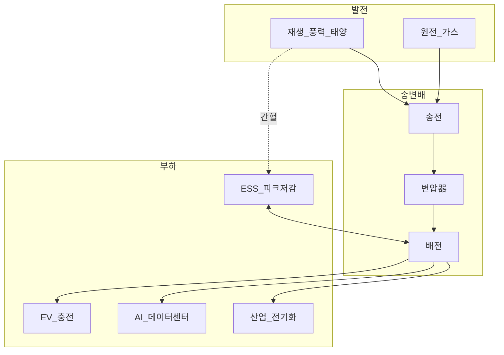
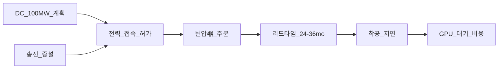
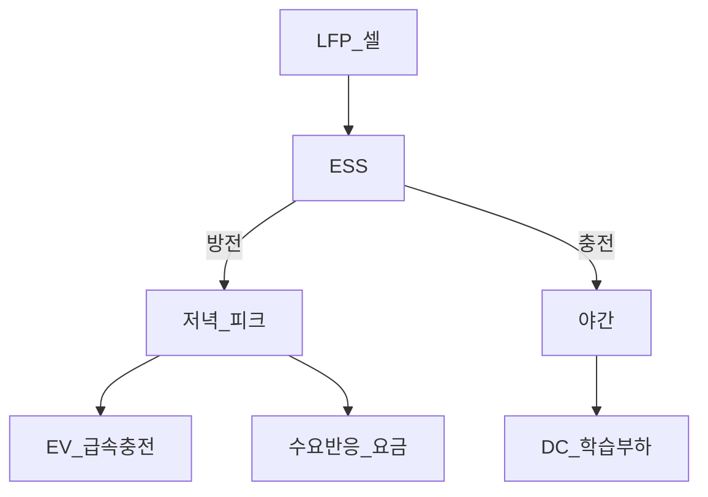

# 전력망·전기화 — 송전·변압기·ESS·EV·AI DC

> **면책**: 본 문서는 교육 목적이며, 특정 개인·법인에 대한 투자·세무·법률 자문이 아닙니다. 제도·세율·상품 조건은 변경될 수 있으므로 실행 전 공식 출처를 확인하세요.

## 메타

| 항목 | 내용 |
|------|------|
| 최종 검증일 | 2026-05-24 |
| 정책·법령 기준일 | 2025-12-31 확정, 2026 개편 별도 표기 |
| 난이도 | L3 (Deep) — [READER-GUIDE](../../docs/READER-GUIDE.md) |
| 예상 읽기 시간 | 55~65분 |
| 관련 bucket | Bucket 3 (유틸·인프라·클린 ETF), Bucket 4 (변압기·ESS·송전 개별) |

## 0. 이 편 읽기 전 (5분)

| 항목 | 내용 |
|------|------|
| **난이도** | L3 (Deep) — [READER-GUIDE §L등급](../../docs/READER-GUIDE.md) |
| **선수** | [macroeconomics-basics](../../02-economics/macroeconomics-basics.md), [battery-lfp-ncm-ess](battery-lfp-ncm-ess.md) |
| **이번 편에서 쓰는 기호** | 본문 §4·§4a 표 참고 |
| **복습 한 줄** | — |

## TL;DR

1. **전기화(Electrification)** 는 EV·히트펌프·산업 전기화와 **AI 데이터센터(MW~GW)** 가 **동시에** 전력 수요·송전·변압기·ESS를 당깁니다 — **2025~ 병목**이 **연산(HBM) → 전력(그리드)** 으로 이동 중입니다.
2. **밸류체인**: **발전(재생·가스·원전) → 송전·변전·변압器 → 배전 → ESS·EV 충전 → DC 부하** — **규제·입찰·허가**가 **마진**을 좌우합니다.
3. **ESS**는 [battery-lfp-ncm-ess.md](battery-lfp-ncm-ess.md)와 연결 — **LFP·그리드 scale**; **EV**는 **배전·충전** 인프라.
4. **AI DC**는 **24/7 고부하** — [ai-infrastructure.md](ai-infrastructure.md) **전력 레이어**; **변압기·케이블·UPS·ESS** tight.
5. **한국**: 송전·변압기·ESS·전력 IT — **코어 = 인프라·클린 ETF**, **위성 = 전력설비·ESS 개별**; **유틸**은 **규제·요금** 민감.

---

## 1. 한 줄 정의 + 왜 중요한가

**정의**: **전력망·전기화 섹터**는 전기 **생성·송전·변전·배전·저장·소비(EV·DC·공업)** 및 이를 뒷받침하는 **설비(변압器·개폐기·케이블·ESS·충전)** 를 포괄합니다.

**왜 중요한가** (장기 자산 형성·bucket 연결):

!!! info "ETF"
    지수·자산 **바구니**를 한 종목처럼 거래

!!! info "GPU (Graphics Processing Unit)"
    AI 학습·추론 가속 칩.

!!! info "CAPEX (Capital Expenditure)"
    설비·데이터센터 등 자본 지출.

AI·EV·재생에너지가 **같은 그리드**를 씁니다. **변압器 lead time 2~3년**, **송전 허가 지연**은 **AI DC 증설**을 **물리적으로** 막습니다 — “GPU만 사면 된다”는 [ai-infrastructure.md](ai-infrastructure.md) 내러티브의 **반대편**입니다. 한국은 **수출(변압기·ESS)** · **국내 RE100·RPS** · **AI DC 전력** **삼중** 노출. [sector-investing-framework.md](sector-investing-framework.md) 5단계로 **유틸(규제)** vs **설비(CAPEX)** vs **ESS(배터리 사이클)** 를 **분리**하지 않으면 **“전기화 ETF”** 하나로 **올인**하는 함정에 빠집니다.

---

## 2. 선수 지식 / 이후 읽을 것

**선수**:
- [macroeconomics-basics.md](../../02-economics/macroeconomics-basics.md)
- [battery-lfp-ncm-ess.md](battery-lfp-ncm-ess.md) — ESS·LFP
- [sector-investing-framework.md](sector-investing-framework.md)

**이후**:
- [ai-infrastructure.md](ai-infrastructure.md)
- [semiconductor.md](semiconductor.md) — 전력반도体
- [recommended-deep-study-roadmap.md](recommended-deep-study-roadmap.md)

---

## 3. 직관·비유

전력망을 **“고속도로 + 휴게소 + 주유소”**로 봅니다. **발전** = **정유**, **송전(고압)** = **고속도로**, **변압器** = **IC(나들목)**, **배전** = **시내 도로**, **ESS** = **휴게소 배터리**(피크 때 방출), **EV 충전** = **전기 주유소**, **AI DC** = **24시간 돌아가는 대형 공장** — **도로 확장 없이** 공장만 늘리면 **정체(병목)**.

**AI DC + EV 동시**: **저녁** EV 충전 + **야간** DC 학습 = **부하 peak** 겹침 — **ESS·수요반응** 가치 ↑.

**규제**: **고속도로 건설**은 **정부 허가** — **설비주**는 **수주** 좋아도 **마진·대금** **지연**; **유틸**은 **요금** **상한**.

---

## 4. 정식 개념·용어

| 용어 | 한글 | English | 정의 |
|------|------|---------|------|
| Grid | 전력망 | — | 송·변·배 **통합** |
| 송전 | — | Transmission | **고압** 장거리 |
| 배전 | — | Distribution | **저압** 지역 |
| 변압器 | — | Transformer | **전압** 변환 — **병목** |
| ESS | 에너지저장 | Energy storage | **LFP** 그리드 — [battery-lfp-ncm-ess.md](battery-lfp-ncm-ess.md) |
| RE100 | — | Renewable 100% | 기업 **재생** 전력 |
| RPS | 신재생 의무 | Renewable portfolio std | **의무 비율** |
| PPA | 전력구매계약 | Power purchase agreement | **장기** 재생 |
| MW/GW | — | — | **전력** 단위 |
| Demand response | 수요반응 | — | **부하** 조절 |
| HVDC | 고압직류 | — | **장거리** 송전 |

### 4a. 핵심 용어 (본문 등장 순)

> 복습용. 정의는 §4 본표·[glossary](../../00-roadmap/glossary.md)·본문 `!!! info` 박스.

| 용어 | 한 줄 | 관련 이론 | glossary |
|------|-------|-----------|----------|
| Grid | 송·변·배 **통합** | §4 | [glossary](../../00-roadmap/glossary.md#grid) |
| 송전 | **고압** 장거리 | §4 | [glossary](../../00-roadmap/glossary.md#송전) |
| 배전 | **저압** 지역 | §4 | [glossary](../../00-roadmap/glossary.md#배전) |
| 변압器 | **전압** 변환 | §4 | [glossary](../../00-roadmap/glossary.md#변압器) |
| ESS | **LFP** 그리드 | §4 | [glossary](../../00-roadmap/glossary.md#ess) |
| RE100 | 기업 **재생** 전력 | §4 | [glossary](../../00-roadmap/glossary.md#re100) |
| RPS | **의무 비율** | §4 | [glossary](../../00-roadmap/glossary.md#rps) |
| PPA | **장기** 재생 | §4 | [glossary](../../00-roadmap/glossary.md#ppa) |
| MW/GW | **전력** 단위 | §4 | [glossary](../../00-roadmap/glossary.md#mw/gw) |
| Demand response | **부하** 조절 | §4 | [glossary](../../00-roadmap/glossary.md#demand-response) |
| HVDC | **장거리** 송전 | §4 | [glossary](../../00-roadmap/glossary.md#hvdc) |

---

## 5. 메커니즘

### 5.1 전기화 수요 통합

### 5.2 AI DC 전력 병목

→ [ai-infrastructure.md](ai-infrastructure.md) **GPU**와 **동기** — **전력**이 **선행**.

### 5.3 EV · ESS · DC 상호작용

**LFP ESS**: [battery-lfp-ncm-ess.md](battery-lfp-ncm-ess.md) — **$/kWh** 하락 → **경제성**.

---

## 6. 수식·모델

**DC 전력 (재확인)**:

| 기호 | 이름 | 이 식에서 의미 |
|------|------|----------------|
|  \(P_\)  |  P_  | 본문 §4·위 식 맥락 참고 |
|  \(DC\)  |  DC  | 본문 §4·위 식 맥락 참고 |
|  \(N_\)  |  N_  | 본문 §4·위 식 맥락 참고 |
|  \(GPU\)  |  GPU  | 본문 §4·위 식 맥락 참고 |
|  \(PUE\)  |  PUE  | 본문 §4·위 식 맥락 참고 |
\[
P_{\text{DC}} \approx \frac{N_{\text{GPU}} \times P_{\text{GPU}}}{\text{PUE}}
\]

**읽는 법**: 위 식의 기호는 바로 위 변수표와 같다. 숫자는 [DEPTH-STANDARD](../docs/DEPTH-STANDARD.md) 교육용 기호(M·P·PV 등)로 대입한다.
**변압器 수요 (교육)**:

| 기호 | 이름 | 이 식에서 의미 |
|------|------|----------------|
| \(r\) | 할인율·수익률 | 기간당 이자·요구수익률 |
| \(n\) | 기간 | 연·월 등 복리·할인에 쓰는 횟수 |
| \(PV\) | 현재가치 | 오늘 시점으로 환산한 금액 |

\[
\text{변압기 수요} \propto (\text{DC MW}) + (\text{EV 충전 MW}) + (\text{재생 접속 MW})
\]

**읽는 법**: 위 식의 기호는 바로 위 변수표와 같다. 숫자는 [DEPTH-STANDARD](../docs/DEPTH-STANDARD.md) 교육용 기호(M·P·PV 등)로 대입한다.
**ESS 경제성 (단순)**:

| 기호 | 이름 | 이 식에서 의미 |
|------|------|----------------|
| \(r\) | 할인율·수익률 | 기간당 이자·요구수익률 |
| \(n\) | 기간 | 연·월 등 복리·할인에 쓰는 횟수 |
| \(PV\) | 현재가치 | 오늘 시점으로 환산한 금액 |

\[
\text{ESS profit} \approx (\text{peak price} - \text{off-peak price}) \times \text{efficiency} \times \text{cycles} - \text{capex}
\]

**읽는 법**: 위 식의 기호는 바로 위 변수표와 같다. 숫자는 [DEPTH-STANDARD](../docs/DEPTH-STANDARD.md) 교육용 기호(M·P·PV 등)로 대입한다.
**유틸 ROE (규제)**:

- **요금** **상한** — **매출** **안정**, **성장** **제한**

---

## 7. 한국 적용

### 7.1 2025년 기준 (확정)

| 영역 | 내용 | bucket |
|------|------|--------|
| **변압器·송전설비** | 수출·국내 | **3~4** |
| **ESS** | LFP·프로젝트 | **3~4** |
| **유틸·발전** | **규제** | ETF **3** |
| **EV 충전** | 인프라 | **4** |
| **AI DC** | 국내 **증설** | [ai-infrastructure.md](ai-infrastructure.md) |
| **ISA** | 인프라 ETF | [isa.md](../../06-korea-policy/isa.md) |

### 7.2 2026년 개편·시행 예정 (해당 시)

| 항목 | 2025 | 2026 |
|------|------|------|
| ISA 비과세 | 200만 | **500만** |
| RE100·RPS | 현행 | **기업 DC** **PPA** ↑ |
| 송전·변압器 | tight | **수주** **백로그** 보도 |
| 전력 요금 | 산업 | **DC** **부하** 논의 |

**법·정책**: 전기사업법, 신재생에너지, [references/sources.md](../../references/sources.md)

### 7.3 전기화 4대 메가트렌드 통합표 (교육)

| 트렌드 | 전력 영향 | 연결 섹터 | bucket |
|--------|-----------|-----------|--------|
| **EV** | 배전·충전 피크 | battery | 3~4 |
| **AI DC** | 24/7 MW | ai-infrastructure | 3~4 |
| **재생** | 간헐·ESS | battery ESS | 3 |
| **산업 전기화** | 공장 부하 | physical-ai | 3~4 |

**한국 수출**: 변압器·ESS·전력IT 중 해외 DC·RE 프로젝트 수주 — **환율** [macroeconomics-basics.md](../../02-economics/macroeconomics-basics.md).

### 7.4 유틸·설비·ESS — 투자 성격 비교 (교육)

| 유형 | 수익 드라이ver | 변동성 | bucket | 대표 리스크 |
|------|----------------|--------|--------|-------------|
| **유틸·발전** | **요금·ROE** | **낮~중** | **3** ETF | **규제·정치** |
| **송전·변압 설비** | **수주·백로그** | **중** | **3~4** | **리드·대금** |
| **ESS integrator** | **입찰·LFP 가격** | **중~高** | **4** | **배터리 사이클** |
| **EV 충전** | **이용률·경쟁** | **高** | **4** | **마진·점포** |

**AI DC 전력 계약**: **산업용** **전력** **요금** **할인** **보도** **≠** **유틸** **주가** **자동** **상승** — **ROE** **cap** **확인**.

---

## 8. 숫자 예제 (가상)

> 모든 인물·금액·회사명은 가상입니다.

### 예제 1: AI DC 50MW + 변압器 (가상)

| | 값 |
|--|-----|
| DC | 50MW |
| 변압器 | 765kV급 **3대** (가상) |
| 리드타임 | **30개월** |
| 지연 비용 | GPU **유휴** **월 50억** (가상) |

### 예제 2: ESS 피크 shaving (가상 유틸 J)

| | 값 |
|--|-----|
| ESS | 200MWh LFP |
| peak spread | **80원/kWh** (가상) |
| 연 arbitrage | **40억** (가상) |
| CAPEX | **800억** → **회수 20년** |

→ **정책·입찰** 없으면 **경제성** **약함**.

### 예제 3: 포트 (가상 K)

| | % | bucket |
|--|---|--------|
| 클린·인프라 ETF | 10% | 3 |
| 가상 변압器 | 4% | 4 |
| 가상 ESS | 3% | 4 |
| QQQ | 25% | 3 |

→ **전기화** **분산** + **AI** **간접**.

### 예제 4: RE100 + DC PPA (가상 기업 N)

| | 값 (가상) |
|--|-----------|
| DC 전력 | 80MW |
| PPA | **태양광 50MW** + **나머지 망** |
| 연간 전력비 | **450억 원** |
| RE100 목표 | 2030 **100%** |

→ **전력망** **투자**는 **PPA** **·** **ESS** **수요** — **유틸** **직접** **주** **아님**.

### 예제 5: EV 급속 + DC 야간 (가상 지역)

| 시간 | 부하 | 완화 |
|------|------|------|
| 18~21 | EV **+30%** | ESS **방전** |
| 02~06 | DC **학습** | **저가** **전력** |
| 연간 | **피크** **↑** | **변압器** **증설** |

→ [battery-lfp-ncm-ess.md](battery-lfp-ncm-ess.md) **ESS** **+** 본 문서 **배전**.

---

## 9. FAQ

**Q1. AI DC와 전력망 관계?**  
**A.** DC **MW** = **그리드 부하** — [ai-infrastructure.md](ai-infrastructure.md) **전력 레이어**.

**Q2. ESS는 배터리 문서와?**  
**A.** **LFP·그리드** — [battery-lfp-ncm-ess.md](battery-lfp-ncm-ess.md).

**Q3. 변압器 병목?**  
**A.** **리드타임·수주** — AI·EV **동시**.

**Q4. 유틸 vs 설비주?**  
**A.** 유틸 **규제·ROE**; 설비 **CAPEX 사이클**.

**Q5. EV 충전주?**  
**A.** **위성 4** — **경쟁·마진**.

**Q6. 전기화 ETF 코어?**  
**A.** **Bucket 3** — **구성** 확인.

**Q7. RE100?**  
**A.** 기업 **재생** — **PPA·ESS** 수요.

**Q8. DB 전력 ETF?**  
**A.** **불가**(일반). ISA.

**Q9. 원전 vs 재생?**  
**A.** **정책·지역** — **5단계 거시**.

**Q10. DC·EV 피크 겹침?**  
**A.** **ESS·DR** — **부하 관리**.

**Q11. 전기화 = 태양광 ETF만?**  
**A.** **아니오**. **송전·변압·ESS·DC·충전** **분산** — §5.1.

**Q12. [ai-infrastructure.md](ai-infrastructure.md) **먼저** **vs** **본 문서**?**  
**A.** **로드맵**: **AI 인프ra Week 4** → **전력 Week 6** — **GPU** **→** **MW** **순**.

---

## 10. 함정·리스크·한계

- **“전기화 = 무조건”** — **규제·요금**
- **변압器 수주 = 즉시 매출** — **리드·대금**
- **ESS = 배터리 사이클** — **LFP 가격**
- **유틸 PER** — **성장 한계**
- **AI DC 지연** — **설비주** **과열**
- **정책 변경**
- **Bucket 4** **집중**
- **기후** **이슈** **없는** **가스** **발전** **ignore** **(정책)**
- **송전** **공사** **지연** **=** **주가** **즉시** **반영** **아님** — **백로그** **분기** **추적**

---

## 11. 심화 읽기

- [references/sources.md](../../references/sources.md)
- [battery-lfp-ncm-ess.md](battery-lfp-ncm-ess.md)
- [ai-infrastructure.md](ai-infrastructure.md)
- [recommended-deep-study-roadmap.md](recommended-deep-study-roadmap.md)
- IEA Electricity, Grid (교차)

### 11.1 송전·변압·ESS·충전 — 투자자 질문 10선 (교육)

| # | 질문 | 5단계 |
|---|------|-------|
| 1 | 국내 AI DC **MW** **파이프라인**? | 1 거시 |
| 2 | **765kV** **변압器** **리드**? | 2 밸류체인 |
| 3 | **ESS** **입찰** **주체**? | 3 경쟁 |
| 4 | **유틸** **ROE** **상한**? | 4 재무 |
| 5 | **코스피** **전력설비** **ETF** **있나**? | 5 한국 |
| 6 | **EV** **V2G** **수익** **모델**? | 1~3 |
| 7 | **DC** **+** **EV** **동시** **피크**? | §5.3 |
| 8 | **LFP** **ESS** **$/kWh**? | [battery-lfp-ncm-ess.md](battery-lfp-ncm-ess.md) |
| 9 | **PPA** **vs** **REC**? | 7 한국 |
| 10 | **위성** **상한**? | **20%** |

**분기 갱신**: CAPEX·**전력** **허가** **뉴스** **나올** **때** **위** **10선** **재실행** — [sector-investing-framework.md](sector-investing-framework.md).

**DC·EV·재생 동시 확대** 시나리오에서는 **같은 ESS 풀**을 **세 수요**가 **공유**합니다. LFP **$/kWh** 하락은 ESS **경제성**을 **높이지만**, **셀** **공급** **과잉**이면 **ESS integrator** **마진**도 **압박** — [battery-lfp-ncm-ess.md](battery-lfp-ncm-ess.md) **4. 재무**와 **교차** **확인**.

---

## 12. 스스로 점검 퀴즈

1. 전기화 **3대 부하** (교육)?
2. 변압器 병목 **원인**?
3. ESS **LFP** 연결 문서?
4. AI DC 100MW **전력** 의미?
5. 유틬 vs 설비 **차**?
6. EV+DC **피크** **완화**?
7. 전기화 ETF bucket?
8. RE100 한 줄?
9. 전기화 **4대** **트렌드** **4**?
10. **PPA** **한** **줄**?

??? note "정답 힌트"

    1. **EV, AI DC, 산업 전기화** (+ 재생)  
    2. **리드타임 2~3년·허가·수주 backlog**  
    3. [battery-lfp-ncm-ess.md](battery-lfp-ncm-ess.md)  
    4. **그리드 24/7 고부하** — 송전·변압 필요  
    5. 유틸 **규제** / 설비 **CAPEX·수주**  
    6. **ESS·수요반응**  
    7. **Bucket 3**  
    8. 기업 **재생에너지 100%** 목표  
    9. **EV, AI DC, 재생, 산업 전기화**  
    10. **장기 재생 전력 구매 계약**