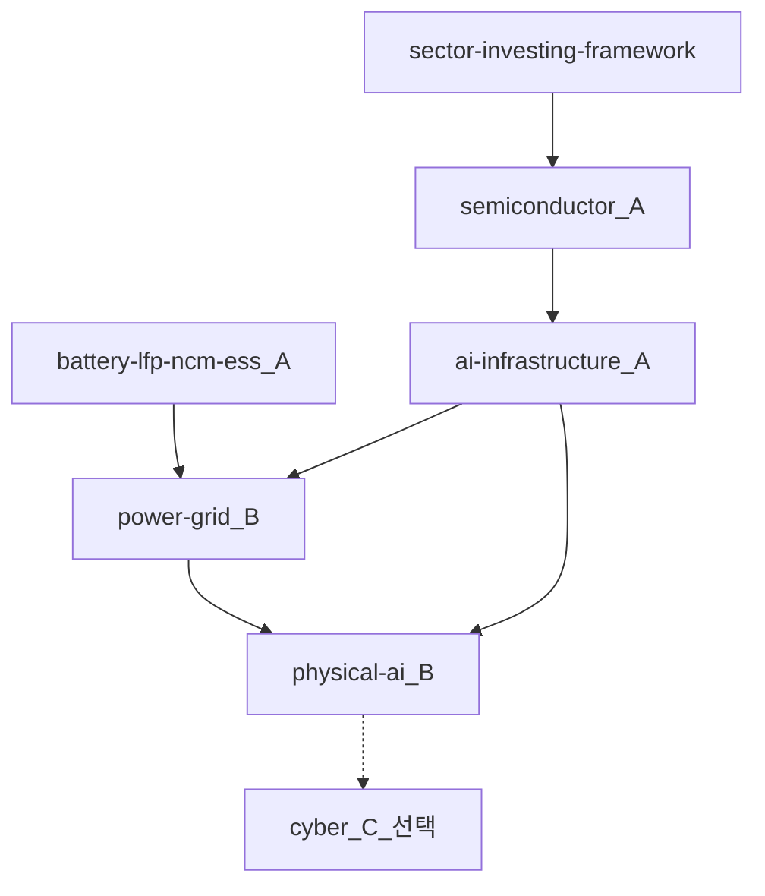
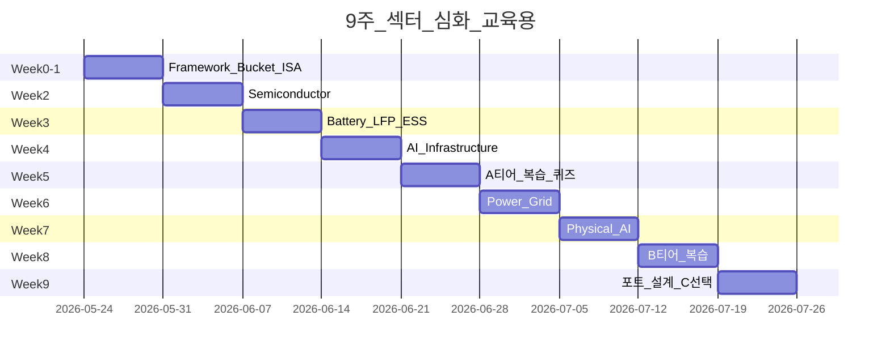
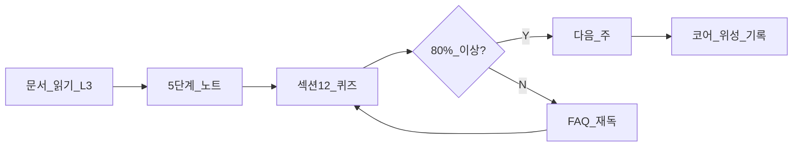
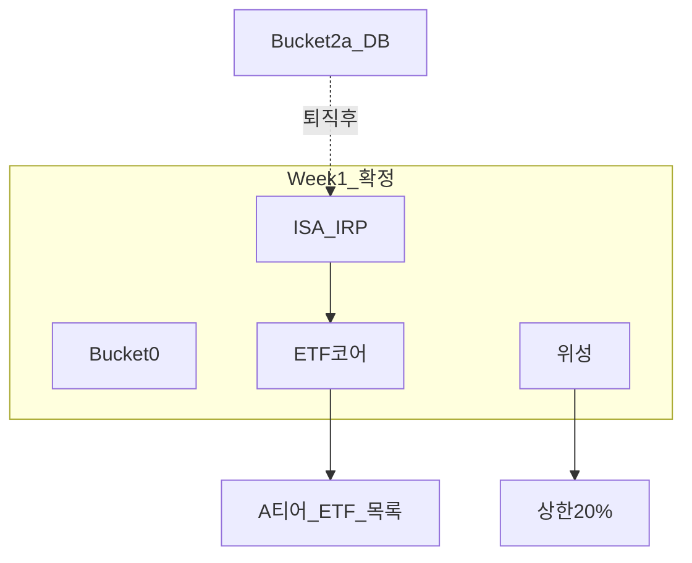

# 섹터 심화 학습 로드맵 — A/B/C 티어·9주 스케줄

> **면책**: 본 문서는 교육 목적이며, 특정 개인·법인에 대한 투자·세무·법률 자문이 아닙니다. 제도·세율·상품 조건은 변경될 수 있으므로 실행 전 공식 출처를 확인하세요.

## 메타

| 항목 | 내용 |
|------|------|
| 최종 검증일 | 2026-05-24 |
| 정책·법령 기준일 | 2025-12-31 확정, 2026 개편 별도 표기 |
| 난이도 | L3 |
| 예상 읽기 시간 | 60~75분 |
| 관련 bucket | Bucket 3 (코어·섹터 ETF), Bucket 4 (위성·개별) |

## TL;DR

1. 본 로드맵은 **9주(주 5~8시간)** 로 섹터 L3를 **A(필수) → B(권장) → C(선택)** 순으로 밟는 **학습·포트 설계** 가이드입니다 — **매매 신호가 아닙니다**.
2. **Week 0~1**: [sector-investing-framework.md](sector-investing-framework.md) + [core-satellite-framework.md](../../04-portfolio/core-satellite-framework.md) + **Bucket·ISA·DB** — **운용 슬롯** 먼저.
3. **Week 2~5 (A티어)**: [semiconductor.md](semiconductor.md) → [battery-lfp-ncm-ess.md](battery-lfp-ncm-ess.md) → [ai-infrastructure.md](ai-infrastructure.md) — **한국 수출·AI CAPEX** 축.
4. **Week 6~8 (B티어)**: [power-grid-electrification.md](power-grid-electrification.md) → [physical-ai.md](physical-ai.md) — **전력 병목·로봇 실험**.
5. **C티어(선택)**: 사이버·바이오·원자력 등 — **위성 4 한도** 내; 매주 **5단계 체크리스트** + **퀴즈**로 [DEPTH-STANDARD.md](../../docs/DEPTH-STANDARD.md) 게이트 통과.

---

## 1. 한 줄 정의 + 왜 중요한가

**정의**: **recommended-deep-study-roadmap** 은 Finances 저장소 **03-markets/sectors** L3 문서를 **우선순위(A/B/C)·9주 캘린더·주간 산출물**로 묶은 **학습 운영 체계**입니다.

**왜 중요한가** (장기 자산 형성·bucket 연결):

섹터 문서가 6개+로 늘면 **“다 읽어야 하나?”** · **“어디서부터?”** · **“다 사야 하나?”** 혼란이 생깁니다. 로드맵은 **읽기 순서 = 의존성 순서**(반도체 → AI 인프라 → 전력)이며, **읽기 ≠ 매수**를 반복 강조합니다. **10억+ 장기** 경로에서는 **A티어만 ETF 코어(Bucket 3)** 로도 충분하고, **B·C는 위성·커리어 시너지**용입니다. **DB 가입자**는 Week 0에서 **ISA·IRP 슬롯**을 확정하지 않으면 **Week 5 “반도체 ETF 매수”** 가 **실행 불가**입니다.

---

## 2. 선수 지식 / 이후 읽을 것

**선수**:
- [STUDY-START.md](../../00-roadmap/STUDY-START.md)
- [time-horizon-and-buckets.md](../../04-portfolio/time-horizon-and-buckets.md)
- [cash-flow-basics.md](../../01-foundations/cash-flow-basics.md)

**이후**:
- [asset-allocation.md](../../04-portfolio/asset-allocation.md)
- [passive-vs-active.md](../../04-portfolio/passive-vs-active.md)
- [factor-investing-primer.md](../../08-advanced/factor-investing-primer.md)
- [master-roadmap.md](../../00-roadmap/master-roadmap.md)

---

## 3. 직관·비유

로드맵을 **“대학 선택과목 + 실습 순서”**에 비유합니다. **A티어** = **전공 필수**(반도체·배터리·AI 인프라) — **졸업(포트 코어)** 에 **직결**. **B티어** = **전공 선택**(전력·피지컬 AI) — **트렌드·병목** 확장. **C티어** = **교양**(사이버 등) — **관심** 있을 때만.

**9주** = **한 학기**. 주 5~8시간 = **1과목 3학점**. **매주 퀴즈** = **중간고사** — [DEPTH-STANDARD.md](../../docs/DEPTH-STANDARD.md) **12블록** 통과.

**Bucket**: **필수 과목(A)** 은 **교재(ETF)** 로 **Pass/Fail**; **선택 과목(C)** 은 **레포트(개별주)** — **실패(손실)** 해도 **학점(포트)** **20%** 넘기면 **재수강 제한**.

---

## 4. 정식 개념·용어

| 용어 | 한글 | English | 정의 |
|------|------|---------|------|
| A-tier | A티어 | — | **필수** 심화 — 한국·AI·전기화 **축** |
| B-tier | B티어 | — | **권장** — 전력·피지컬 AI |
| C-tier | C티어 | — | **선택** — 사이버·바이오 등 |
| 5-step | 5단계 | — | [sector-investing-framework.md](sector-investing-framework.md) |
| Core | 코어 | — | Bucket **3** ETF |
| Satellite | 위성 | — | Bucket **4** ≤20% |
| Week gate | 주간 게이트 | — | **퀴즈·산출물** 통과 |
| TAM | 전체시장 | — | 거시 1단계 |
| CAPEX cycle | 설비 사이클 | — | AI·배터리·전력 |

---

## 5. 메커니즘

### 5.1 A/B/C 티어 의존성

| 티어 | 문서 | 이유 | bucket |
|------|------|------|--------|
| **A** | framework, semi, battery, ai-infra | **한국 수출·AI·EV** | **3** |
| **B** | power-grid, physical-ai | **병목·실험** | **3~4** |
| **C** | 사이버·바이오·원전 | **관심·커리어** | **4** |

### 5.2 9주 캘린더 (메커니즘)

### 5.3 주간 운영 루프

**산출물**: 매주 **1장 밸류체인 mermaid** + **가상 예제 1개** + **bucket 기록**.

---

## 6. 수식·모델

**주간 시간 예산**:

\[
T_{\text{week}} = T_{\text{read}} + T_{\text{note}} + T_{\text{quiz}} \approx 5\text{~}8\ \text{시간}
\]

**9주 총**:

\[
T_{\text{total}} \approx 45\text{~}72\ \text{시간} \approx \ \text{L3 섹터 1학기}
\]

**포트 배분 (교육, Week 9 산출)**:

| | 최소 | 최대 |
|--|------|------|
| Bucket 3 (A티어 ETF) | **60%** | **95%** |
| Bucket 4 (B·C 위성) | **0%** | **20%** |

**학습 ROI (개념)**:

\[
\text{학습 ROI} \approx \frac{\text{리스크 인지·의사결정 품질}}{\text{45~72h}} + \text{인적자본 시너지}
\]

— **알파 보장 아님**.

---

## 7. 한국 적용

### 7.1 2025년 기준 (확정)

| Week | 한국 실행 체크 | 문서 |
|------|----------------|------|
| 0~1 | **DB vs ISA** — 섹터 ETF **슬롯** | [db-pension.md](../../06-korea-policy/db-pension.md), [isa.md](../../06-korea-policy/isa.md) |
| 2 | KRX **반도체 ETF** 보수·구성 | [semiconductor.md](semiconductor.md) |
| 3 | 2차전지 ETF vs **코스닥 소재** | [kosdaq-tier-system.md](../kosdaq-tier-system.md) |
| 4 | QQQ·해외 GPU **세금** | [overseas-stocks-tax-part1-cgt.md](../../06-korea-policy/tax/overseas-stocks-tax-part1-cgt.md) |
| 6 | **전력·ESS** 국내 프로젝트 | [power-grid-electrification.md](power-grid-electrification.md) |
| 7 | **감속기·코스닥** | [physical-ai.md](physical-ai.md) |

### 7.2 2026년 개편·시행 예정 (해당 시)

| 항목 | 2025 | 2026 |
|------|------|------|
| ISA 비과세 | 200만 | **500만** — Week 1 **갱신** |
| ISA 납입 | 2,000만 | **4,000만** |
| 코스닥 승강제 | 도입 | Week 3·7 **필수** |
| 금융투자소득세 | 유예 | **유지** 보도 |

**법·정책 근거**: [references/sources.md](../../references/sources.md), [account-product-tax-map.md](../../06-korea-policy/tax/account-product-tax-map.md)

---

## 8. 숫자 예제 (가상)

> 모든 인물·금액·회사명은 가상입니다.

### 예제 1: 9주 일정 — 가상 학습자 L (AI 엔지니어)

| Week | 시간 | 산출 | bucket 결정 |
|------|------|------|-------------|
| 1 | 6h | Bucket·ISA 확정 | 2b ISA 개설 |
| 2 | 7h | 반도체 5단계 노트 | KRX 반도체 ETF → **3** |
| 4 | 8h | AI CAPEX 다이어그램 | QQQ **3** 유지 |
| 7 | 6h | 휴머노이드 **제외** | 코스닥 **투자주의** |
| 9 | 5h | **위성 12%** | 4 한도 내 |

→ **총 52h** — **C티어(사이버) 스킵** (시간 부족).

### 예제 2: DB만 있는 가상 M

| 문제 | 해결 |
|------|------|
| DB **ETF 불가** | Week 1 **IRP** 개설 |
| 월 80만 IRP | 반도체+QQQ ETF |
| 위성 | **0%** (Year 1) |

→ [db-vs-dc-pension.md](../../06-korea-policy/db-vs-dc-pension.md) — **2b 먼저**.

### 예제 3: A티어 후 포트 (가상, 1억)

| | 금액 | % | bucket |
|--|------|---|--------|
| QQQ | 4,000만 | 40% | 3 |
| KRX 반도체 ETF | 2,000만 | 20% | 3 |
| 2차전지 ETF | 1,500만 | 15% | 3 |
| 채권 ETF | 1,500만 | 15% | 3 |
| 가상 전력 | 500만 | 5% | 4 |
| 가상 HBM | 500만 | 5% | 4 |
| 현금 | 500만 | 5% | 0 |

→ **위성 10%** — A티어 **학습 반영**, **올인 아님**.

---

## 9. FAQ

**Q1. 9주 꼭 지켜야 하나요?**  
**A.** **아니오**. **의존성(A→B)** 만 지키면 **압축·연장** 가능.

**Q2. A만 읽고 B 스킵?**  
**A.** **가능**. **전력·로봇** 병목 **인지**는 **약함** — AI·EV **heavy**면 B **권장**.

**Q3. 읽으면 바로 매수?**  
**A.** **아니오**. **5단계 4. 재무** + **bucket** — **학습 ≠ 매매**.

**Q4. C티어 사이버는?**  
**A.** **선택** — **위성 4**; 본 저장소 **미작성** 시 **외부 5단계** 적용.

**Q5. Week 5 A티어 복습 **무엇**?**  
**A.** 4문서 **퀴즈 80%** + **밸류체인 4장** 합본.

**Q6. DB 가입자 Week 1 필수?**  
**A.** **ISA·IRP** — [db-pension.md](../../06-korea-policy/db-pension.md).

**Q7. kosdaq-tier **언제**?**  
**A.** Week 3·7 — **배터리·피지컬** **위성** 전.

**Q8. QLD는 로드맵 **어디**?**  
**A.** **Week 9 선택** — [leveraged-etf-qqq-qld.md](../../04-portfolio/leveraged-etf-qqq-qld.md) **Bucket 4**.

**Q9. 해외주 Week 4 **만**?**  
**A.** **집중** 학습; **세금**은 [investment-tax-overview.md](../../06-korea-policy/tax/investment-tax-overview.md) **상시**.

**Q10. 9주 후 **재학습**?**  
**A.** **분기 1회** TL;DR **스캔** + **CAPEX·승강제** **갱신**.

**Q11. 가족·친구 **공유**?**  
**A.** **교육** 가능 — **개인 잔고·회사명** **금지** ([DEPTH-STANDARD.md](../../docs/DEPTH-STANDARD.md)).

**Q12. L1 primer **있나**?**  
**A.** [kosdaq-tier-system-primer.md](../kosdaq-tier-system-primer.md) 등 — **L3 전** **L2** [etf-index-funds.md](../etf-index-funds.md).

---

## 10. 함정·리스크·한계

- **로드맵 = 매수 목록** — **오해**
- **C티어 **올인**** — **분산** **파괴**
- **9주 **미완** **포기** — **A 2개**만 **해도** **가치**
- **퀴즈 **암기** — **5단계 **적용** **능력** **목표**
- **2026 ISA** **미갱신**
- **DB **무시** **ISA**
- **피지컬 AI **Week 7** **= **휴머노이드** **매수** **아님**
- **문서 **영구** **정답** **아님** — **분기** **갱신**

---

## 11. 심화 읽기

- [references/sources.md](../../references/sources.md)
- [docs/TEMPLATE.md](../../docs/TEMPLATE.md)
- [docs/DEPTH-STANDARD.md](../../docs/DEPTH-STANDARD.md)
- [sectors/README.md](README.md)
- [glossary.md](../../00-roadmap/glossary.md)

---

## 12. 스스로 점검 퀴즈

1. A티어 **4문서** 이름?
2. B티어 **2문서**?
3. Week 0~1 **필수** **한국** **제도** **2**?
4. 9주 **주당** **시간**?
5. 위성 **상한** **%**?
6. semi → ai-infra **의존** **이유** **1줄**?
7. DB **섹터 ETF**?
8. Week 5 **게이트**?
9. C티어 **예** **1**?
10. 학습 ROI = **알파** **보장**?

정답 힌트

1. **framework, semiconductor, battery-lfp-ncm-ess, ai-infrastructure** (framework는 Week0)  
2. **power-grid-electrification, physical-ai**  
3. **DB(운용한계) + ISA/IRP(본인운용)**  
4. **5~8시간**  
5. **20%** (0~20%)  
6. **HBM·GPU·CAPEX** **이해** **선행**  
7. **직접 불가**(일반) — **ISA·IRP**  
8. **A티어 퀴즈 80% + 밸류체인 4장**  
9. **사이버·바이오·원전** (선택)  
10. **아니오** — **리스크 인지·의사결정**

---

## 부록: 주차별 상세 체크리스트

### Week 0~1 — 프레임·Bucket·계좌

| 일 | 작업 | 링크 |
|----|------|------|
| 1 | [sector-investing-framework.md](sector-investing-framework.md) §1~5 | 5단계 |
| 2 | [time-horizon-and-buckets.md](../../04-portfolio/time-horizon-and-buckets.md) | Bucket |
| 3 | DB/ISA — [db-pension.md](../../06-korea-policy/db-pension.md), [isa.md](../../06-korea-policy/isa.md) | 2a/2b |
| 4 | [core-satellite-framework.md](../../04-portfolio/core-satellite-framework.md) | 3/4 |
| 5 | **산출**: 본인 bucket 표 1장 | |

### Week 2 — 반도체

| 체크 | 내용 |
|------|------|
| □ | DRAM vs HBM **사이클** 그림 |
| □ | KRX 반도체 ETF **TOP10** |
| □ | 퀴즈 §12 **80%** |

### Week 3 — 배터리·ESS

| 체크 | 내용 |
|------|------|
| □ | LFP vs NCM **표** |
| □ | ESS vs EV **수요 주체** |
| □ | [kosdaq-tier-system.md](../kosdaq-tier-system.md) **스캔** |

### Week 4 — AI 인프ra

| 체크 | 내용 |
|------|------|
| □ | GPU→HBM→DC→**전력** **스택** |
| □ | vs [physical-ai.md](physical-ai.md) **표** |
| □ | QQQ **해외주 세금** |

### Week 5 — A티어 통합

| 체크 | 내용 |
|------|------|
| □ | 4밸류체인 **합본** |
| □ | **가상 포트** v0.1 |
| □ | **위성 0~20%** **규칙** **서명**(본인) |

### Week 6 — 전력·그리드

| 체크 | 내용 |
|------|------|
| □ | 변압器 **병목** |
| □ | ESS **LFP** **연결** |
| □ | AI DC **MW** **예제** |

### Week 7 — 피지컬 AI

| 체크 | 내용 |
|------|------|
| □ | VLA **정의** |
| □ | 휴머노이드 vs cobot |
| □ | **코스닥** **테마** **회피** **규칙** |

### Week 8 — B티어 통합

| 체크 | 내용 |
|------|------|
| □ | **전력+AI** **병목** **1장** |
| □ | B티어 **퀴즈** |

### Week 9 — 포트·C선택

| 체크 | 내용 |
|------|------|
| □ | **가상 포트** v1.0 |
| □ | C티어 **GO/NO-GO** |
| □ | [master-roadmap.md](../../00-roadmap/master-roadmap.md) **다음** **Phase** |

---

## 부록: A/B/C 티어 전체 표

| 티어 | 문서 | 주차 | 시간 | bucket | 필수 퀴즈 |
|------|------|------|------|--------|-----------|
| **Prep** | sector-investing-framework | W0~1 | 6h | 3/4 | §12 |
| **A** | semiconductor | W2 | 7h | 3 | §12 |
| **A** | battery-lfp-ncm-ess | W3 | 7h | 3/4 | §12 |
| **A** | ai-infrastructure | W4 | 8h | 3/4 | §12 |
| **B** | power-grid-electrification | W6 | 7h | 3/4 | §12 |
| **B** | physical-ai | W7 | 6h | 3/4 | §12 |
| **C** | (외부) 사이버·바이오 | W9 | 4h+ | 4 | 자체 |

**총 A+B 필수**: 약 **48~52시간** (Week 5·8 복습 포함).

---

## 부록: bucket·계좌 Quick Reference

| 계좌 | 섹터 코어 | 섹터 위성 |
|------|-----------|-----------|
| **ISA** | **우선** ETF | 가능, **분리 권장** |
| **IRP** | ETF | 가능 |
| **DB** | **불가** | **불가** |
| **일반** | 가능, **세금** | NXT **Bucket 4** |

이 로드맵을 **분기 1회** **검증일**과 함께 **갱신**하세요.
