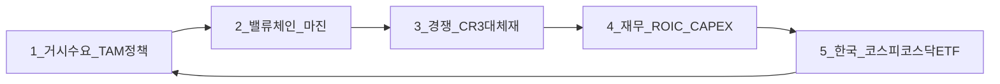
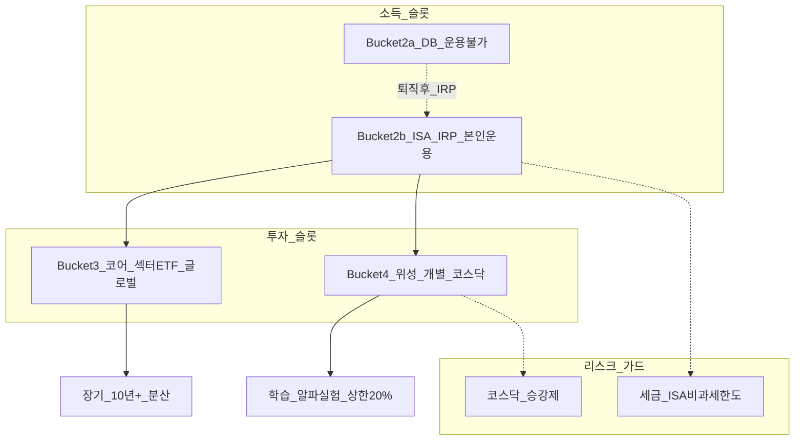
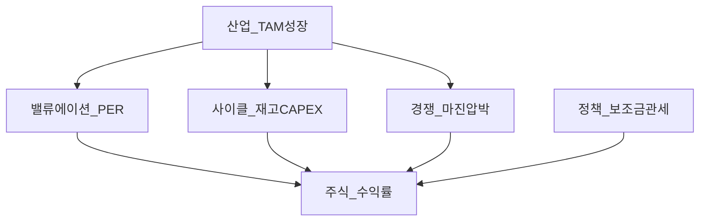

# 섹터(테마) 투자 — 5단계 공부 프레임워크

> **면책**: 본 문서는 교육 목적이며, 특정 개인·법인에 대한 투자·세무·법률 자문이 아닙니다. 제도·세율·상품 조건은 변경될 수 있으므로 실행 전 공식 출처를 확인하세요.

## 메타

| 항목 | 내용 |
|------|------|
| 최종 검증일 | 2026-05-24 |
| 정책·법령 기준일 | 2025-12-31 확정, 2026 개편 별도 표기 |
| 난이도 | L3 (Deep) — [READER-GUIDE](../../docs/READER-GUIDE.md) |
| 예상 읽기 시간 | 50~60분 |
| 관련 bucket | Bucket 3 (코어·섹터 ETF), Bucket 4 (위성·개별 테마) |

## 0. 이 편 읽기 전 (5분)

| 항목 | 내용 |
|------|------|
| **난이도** | L3 (Deep) — [READER-GUIDE §L등급](../../docs/READER-GUIDE.md) |
| **선수** | [stocks-equities-intro](../stocks-equities-intro.md), [etf-index-funds](../etf-index-funds.md) |
| **이번 편에서 쓰는 기호** | 본문 §4·§4a 표 참고 |
| **복습 한 줄** | — |

## TL;DR

1. **좋은 산업 ≠ 좋은 주식** — TAM이 커도 밸류에이션·사이클·경쟁구조·정책이 수익률을 좌우합니다.
2. 섹터 공부는 **5단계**(거시 수요 → 밸류체인 → 경쟁 → 재무 → 한국 상장 지도)를 **반복 템플릿**으로 쓰면 내러티브 편향을 줄입니다.
3. **Bucket 3**은 반도체·배터리 등 **분산된 섹터 ETF·지수**에, **Bucket 4**는 개별 코스닥·레버리지 테마에 — **0~20% 상한** 규칙과 짝을 이룹니다.
4. **DB 가입자**는 회사 퇴직연금에서 ETF를 직접 고르지 못하므로, 섹터 코어는 **ISA·IRP**(Bucket 2b)와 **일반 코어**(Bucket 3)에서 설계합니다.
5. 코스닥 **투자주의·관리·정리** 구간과 [kosdaq-tier-system.md](../kosdaq-tier-system.md)를 모르면 “유망 테마” 위성 베팅이 **유동성·상장폐지** 리스크로 돌아옵니다.

---

## 1. 한 줄 정의 + 왜 중요한가
!!! info "GPU (Graphics Processing Unit)"
    AI 학습·추론 가속 칩.

**정의**: **섹터(테마) 투자 프레임워크**는 특정 산업(반도체, 2차전지, AI 인프라 등)의 **거시 수요·밸류체인·경쟁·재무·한국 상장 지도**를 체계적으로 분석해, **코어(분산 ETF) vs 위성(집중 개별)** 배치와 **학습 목적**을 분리하는 방법론입니다.

!!! info "ETF"
    지수·자산 **바구니**를 한 종목처럼 거래

**왜 중요한가** (장기 자산 형성·bucket 연결):

!!! info "Bucket"
    시간·목적별 **자금 슬롯**(0 비상금 → 3 코어 등)

!!! info "CAPEX (Capital Expenditure)"
    설비·데이터센터 등 자본 지출.

10년 이상 장기 경로에서는 “유망 산업” 뉴스만 보고 **개별주 올인**하기 쉽습니다. 그러나 섹터는 **CAPEX 사이클·중국 공급 과잉·PER 급등** 구간이 반복됩니다. 프레임워크 없이 테마에 몰입하면 **Bucket 4 상한 초과**, **DB 착각**(회사 연금으로 ETF 매수 불가), **코스닥 승강제 무시** 같은 실수가 겹칩니다. 반대로 프레임워크를 쓰면 **인적자본(연봉) + 코어 분산 + 소수 위성**이라는 [time-horizon-and-buckets.md](../../04-portfolio/time-horizon-and-buckets.md) 설계와 맞춰 **학습·실험·장기 목표**를 분리할 수 있습니다.

---

## 2. 선수 지식 / 이후 읽을 것

**선수**:
- [stocks-equities-intro.md](../stocks-equities-intro.md) — 주식·시장 기본
- [etf-index-funds.md](../etf-index-funds.md) — ETF·지수 이해
- [core-satellite-framework.md](../../04-portfolio/core-satellite-framework.md) — 코어·위성 구조
- [time-horizon-and-buckets.md](../../04-portfolio/time-horizon-and-buckets.md) — Bucket 0~4

**이후**:
- [semiconductor.md](semiconductor.md) — 성숙·대형 파이 섹터
- [battery-lfp-ncm-ess.md](battery-lfp-ncm-ess.md) — LFP/NCM·ESS
- [ai-infrastructure.md](ai-infrastructure.md) — GPU·DC·CAPEX
- [physical-ai.md](physical-ai.md) — 엠보디드·로봇
- [power-grid-electrification.md](power-grid-electrification.md) — 전력·송전
- [recommended-deep-study-roadmap.md](recommended-deep-study-roadmap.md) — 9주 심화 로드맵
- [kosdaq-tier-system.md](../kosdaq-tier-system.md) — 코스닥 승강제

---

## 3. 직관·비유

섹터 투자를 **“맛있는 파이 시장”**에 비유해 봅니다. AI·전기차·반도체는 **파이가 커지는 시장**(TAM 확대)입니다. 그러나 투자자에게 중요한 것은 “파이 크기”만이 아니라 **누가 조각을 가져가는지**, **조각 가격(PER)이 이미 비싼지**, **내일 더 싼 조각이 쏟아지는지**(공급 과잉)입니다. 파이가 커진다고 **모든 가게 주인(상장사)** 이 부자가 되는 것은 아닙니다.

두 번째 비유는 **코어·위성 위성 TV 안테나**입니다. **코어(Bucket 3)** 는 기본 방송(글로벌·반도체 ETF 등)을 안정적으로 받는 **메인 안테나**이고, **위성(Bucket 4)** 은 특정 채널(개별 2차전지 소재, HBM 관련주)만 따로 거는 **보조 접시**입니다. 보조 접시만 키우면 날씨(사이클)에 신호가 끊깁니다. [core-satellite-framework.md](../../04-portfolio/core-satellite-framework.md)의 **0~20% 상한**은 “보조 접시 비율”을 제한하는 안전장치입니다.

세 번째로 **DB vs ISA**를 **회사 구내식당 vs 집 냉장고**로 나눕니다. DB([db-pension.md](../../06-korea-policy/db-pension.md))는 회사가 정해 준 메뉴(자산관리기관 운용)만 먹습니다. **ISA·IRP**([isa.md](../../06-korea-policy/isa.md), [isa-irp-pension-tax.md](../../06-korea-policy/tax/isa-irp-pension-tax.md))는 본인이 ETF·섹터 코어를 담는 **냉장고**입니다. “우리 회사 퇴직연금으로 반도체 ETF 사자”는 **구조적으로 불가능**한 경우가 많습니다.

---

## 4. 정식 개념·용어

| 용어 | 한글 | English | 정의 |
|------|------|----------------|
| TAM | 전체 시장 규모 | Total Addressable Market | 이론상 전체 수요·매출 상한 |
| SAM | 유효 시장 | Serviceable Addressable Market | 실제 공략 가능 시장 |
| 밸류체인 | — | Value chain | 원료→부품→완제→유통 단계별 부가·마진 |
| CR3 | 3사 집중도 | Concentration ratio | 상위 3사 시장 점유율 |
| ROIC | 투하자본수익률 | Return on Invested Capital | 투자 대비 수익 효율 |
| CAPEX | 설비투자 | Capital expenditure | 공장·장비 등 장기 투자 지출 |
| 사이클 | — | Cycle | 수요·재고·가격의 호황·침체 반복 |
| 코어 | — | Core | 저비용 분산 ETF 중심 포트폴리오 |
| 위성 | — | Satellite | 테마·개별·실험 포지션 |
| HBM | 고대역폭메모리 | High Bandwidth Memory | AI 가속용 고성능 메모리 |
| LFP/NCM | 리튬인산철·삼원계 | Lithium chemistries | 2차전지 양극재 화학계 |
| 승강제 | — | KOSDAQ tier system | 코스닥 투자주의·관리·정리 단계 |

### 4a. 핵심 용어 (본문 등장 순)

> 복습용. 정의는 §4 본표·[glossary](../../00-roadmap/glossary.md)·본문 `!!! info` 박스.

| 용어 | 한 줄 | 관련 이론 | glossary |
|------|------|----------------|
| TAM | 이론상 전체 수요·매출 상한 | §4 | [glossary](../../00-roadmap/glossary.md#tam) |
| SAM | 실제 공략 가능 시장 | §4 | [glossary](../../00-roadmap/glossary.md#sam) |
| 밸류체인 | 원료→부품→완제→유통 단계별 부가·마진 | §4 | [glossary](../../00-roadmap/glossary.md#밸류체인) |
| CR3 | 상위 3사 시장 점유율 | §4 | [glossary](../../00-roadmap/glossary.md#cr3) |
| ROIC | 투자 대비 수익 효율 | §4 | [glossary](../../00-roadmap/glossary.md#roic) |
| CAPEX | 공장·장비 등 장기 투자 지출 | §4 | [glossary](../../00-roadmap/glossary.md#capex) |
| 사이클 | 수요·재고·가격의 호황·침체 반복 | §4 | [glossary](../../00-roadmap/glossary.md#사이클) |
| 코어 | 저비용 분산 ETF 중심 포트폴리오 | §4 | [glossary](../../00-roadmap/glossary.md#코어) |
| 위성 | 테마·개별·실험 포지션 | §4 | [glossary](../../00-roadmap/glossary.md#위성) |
| HBM | AI 가속용 고성능 메모리 | §4 | [glossary](../../00-roadmap/glossary.md#hbm) |
| LFP/NCM | 2차전지 양극재 화학계 | §4 | [glossary](../../00-roadmap/glossary.md#lfp/ncm) |
| 승강제 | 코스닥 투자주의·관리·정리 단계 | §4 | [glossary](../../00-roadmap/glossary.md#승강제) |

---

## 5. 메커니즘

### 5.1 섹터 공부 5단계 (반복 템플릿)

| 단계 | 핵심 질문 | 산출물 (1장면) | 흔한 실수 |
|------|------|----------------|
| **1. 거시** | 10년 수요? 보조금·관세? | TAM/SAM 스케치 | 뉴스 헤드라인 = TAM |
| **2. 밸류체인** | 누가 마진? bottlenecks? | mermaid 1장 | “완성차 = 전부” 착각 |
| **3. 경쟁** | CR3, 중국 vs 한·미, 대체 | 포지셔닝 맵 | “국산 = 프리미엄” 고정관념 |
| **4. 재무** | ROIC, FCF, 재고, CAPEX | 체크리스트 | PER만 보고 매수 |
| **5. 한국** | 코스피·코스닥·ETF 노출 | 지도 + bucket | 코스닥 테마 = 위성 상한 무시 |

각 섹터 md([semiconductor.md](semiconductor.md) 등)는 위 5단계를 **채운 사례**입니다. 새 테마(예: 전력망)를 공부할 때도 동일 순서를 반복합니다.

### 5.2 Bucket·계좌·섹터 배치

| 배치 | Bucket | 수단 예 | 비중 가이드 (교육) |
|------|------|----------------|
| **코어 섹터** | 3 | 반도체·2차전지·클린 ETF, QQQ | 포트 **대부분** |
| **위성 테마** | 4 | 개별 소재·HBM·코스닥 | **0~20%** |
| **세금 효율 코어** | 2b | ISA·IRP 내 ETF | 연 납입 한도 내 |
| **DB** | 2a | 모니터링만 | 본인 매매 **불가**(일반적) |

### 5.3 “좋은 산업 ≠ 좋은 주식” 메커니즘

TAM이 30% 성장해도 **이미 PER 50배**에 **공급 40% 증설**이 겹치면 주가는 **-30%**일 수 있습니다. 5단계 프레임워크는 **Industry → StockReturn** 사이의 **중간 변수**를 빠뜨리지 않게 합니다.

---

## 6. 수식·모델

섹터 분석에 자주 쓰는 교육용 모델입니다.

**성장 대비 밸류에이션 (PEG 개념, 단순화)**:

| 기호 | 이름 | 이 식에서 의미 |
|------|------|----------------|
| \(r\) | 할인율·수익률 | 기간당 이자·요구수익률 |
| \(n\) | 기간 | 연·월 등 복리·할인에 쓰는 횟수 |
| \(PV\) | 현재가치 | 오늘 시점으로 환산한 금액 |
| \(FV\) | 미래가치 | 미래 시점의 목표·결과 금액 |

\[
\text{PEG} \approx \frac{\text{PER}}{\text{EPS 성장률(\%)}}
\]

**읽는 법**: **PEG**와 **PER**의 관계를 위 식으로 쓴다. 경제·재무 해석은 변수표 「이 식에서 의미」와 [DEPTH-STANDARD](../docs/DEPTH-STANDARD.md) 기호 예제를 맞춘다.
- PEG ≈ 1 근처는 “성장 대비 가격” 중립적이라는 **휴리스틱**(절대 법칙 아님)
- 사이클 정점에서 EPS가 **일시적 고점**이면 PEG가 **과소평가처럼** 보이는 함정

**ROIC vs WACC (가치 창출 여부)**:

| 기호 | 이름 | 이 식에서 의미 |
|------|------|----------------|
| \(r\) | 할인율·수익률 | 기간당 이자·요구수익률 |
| \(n\) | 기간 | 연·월 등 복리·할인에 쓰는 횟수 |
| \(PV\) | 현재가치 | 오늘 시점으로 환산한 금액 |

\[
\text{경제적 이익} \propto \text{ROIC} - \text{WACC}
\]

**읽는 법**: 부채·자본 비중으로 **r_d**·**r_e**를 가중 평균한 것이 **WACC**다. 프로젝트·기업가치 할인율 근사로 쓴다.- ROIC가 WACC보다 크면 **진짜 성장 투자** 가능성
- CAPEX 폭증 구간은 ROIC **일시 하락** — 사이클 vs 구조적 악화 구분 필요

**위성 비중 상한 (교육용)**:

| 기호 | 이름 | 이 식에서 의미 |
|------|------|----------------|
| \(r\) | 할인율·수익률 | 기간당 이자·요구수익률 |
| \(n\) | 기간 | 연·월 등 복리·할인에 쓰는 횟수 |
| \(PV\) | 현재가치 | 오늘 시점으로 환산한 금액 |

\[
\text{위성 비중} \leq \min(20\%,\ \text{본인이 잃어도 수면 가능한 비율})
\]

**읽는 법**: **r**와 **n**의 관계를 위 식으로 쓴다. 경제·재무 해석은 변수표 「이 식에서 의미」와 [DEPTH-STANDARD](../docs/DEPTH-STANDARD.md) 기호 예제를 맞춘다.
- [core-satellite-framework.md](../../04-portfolio/core-satellite-framework.md)와 동일 철학

**해당 없음**: 복리·레버리지 ETF 일일 리셋은 [leveraged-etf-qqq-qld.md](../../04-portfolio/leveraged-etf-qqq-qld.md) 참조.

---

/../04-portfolio/leveraged-etf-qqq-qld.md) 참조.

---

## 7. 한국 적용

### 7.1 2025년 기준 (확정)

| 항목 | 섹터 투자 연결 | 참고 |
|------|------|----------------|
| **ISA** | 섹터 ETF·개별주 보유 가능, 비과세 한도 내 | [isa.md](../../06-korea-policy/isa.md) |
| **IRP·DC** | 본인 운용, 섹터 ETF 코어 적합 | [dc-pension.md](../../06-korea-policy/dc-pension.md) |
| **DB** | 재직 중 **직접 ETF 선택 불가**(일반적) | [db-pension.md](../../06-korea-policy/db-pension.md) |
|------|------|----------------|
| **코스피·코스닥** | 반도체·2차전지 **이중 상장·시총 집중** | KRX 공시 |
| **코스닥 승강제** | 위성 개별주 **유동성·상장 유지** 확인 | [kosdaq-tier-system.md](../kosdaq-tier-system.md) |
| **NXT(ATS)** | 장후 단타 유혹 — Bucket 4와 분리 | [korea-ats-nextrade.md](../korea-ats-nextrade.md) |

**DB 가입자 섹터 코어 설계 순서 (교육)**:
1. Bucket 0 비상금 → 2. ISA·IRP(Bucket 2b) 납입 한도 활용 → 3. Bucket 3 코어(글로벌 + 섹터 ETF) → 4. Bucket 4 위성(선택, 상한)

### 7.2 2026년 개편·시행 예정 (해당 시)

| 항목 | 2025 | 2026 (시행 여부 명시) |
|------|------|----------------|
| ISA 비과세 한도(일반) | 200만 원 | **500만 원** (세법 개정·시행 확인 필요) |
| ISA 연 납입 한도 | 2,000만 원 | **4,000만 원** (보도·개정안) |
| 금융투자소득세 | 유예 | **유예 지속** (보도, 확정 시 문서 갱신) |
| 코스닥 승강제 | 2026년 본격 시행 보도 | [kosdaq-tier-system.md](../kosdaq-tier-system.md) — **위성 코스닥 필수 확인** |

**법·정책 근거**: 조세특례제한법(ISA), 근로자퇴직급여보장법(DB·DC), 자본시장법·금융위 코스닥 승강제 보도자료, [references/sources.md](../../references/sources.md)

---

## 8. 숫자 예제 (가상)

> 모든 인물·금액·회사명은 가상입니다.

### 예제 1: 5단계로 배터리 테마 점검 (가상)

| 단계 | 가상 분석 메모 | 결론 |
|------|------|----------------|
| 1 거시 | EV 침투율 ↑, ESS 별도 사이클 | TAM ↑, **但** 공급 증설 |
| 2 밸류체인 | 셀·소재·장비 — **양극재 마진** 변동 큼 | 소재 = 위성 후보 |
| 3 경쟁 | LFP 중국 CR3 ↑ | NCM 프리미엄 **축소** 압력 |
| 4 재무 | 가상 A소재 PER 45, 재고 ↑ | **매수 보류** |
| 5 한국 | 코스닥 소재 B사 — **투자주의** | Bucket 4 **제외** |

→ [battery-lfp-ncm-ess.md](battery-lfp-ncm-ess.md) 심화 학습 후 ISA에서 **2차전지 ETF**(Bucket 3)만 우선.

### 예제 2: DB + ISA + 코어·위성 (가상 직장인 C)

| 슬롯 | 월 투입 | 섹터 노출 | bucket |
|------|------|----------------|
| DB | 회사 부담 (본인 조작 없음) | 간접(운용기관) | 2a |
| ISA | 100만 원 | 반도체 ETF 70% + 2차전지 ETF 30% | 2b→3 |
| 일반 | **M** (만 원 단위, 교육용) | 가상 HBM 관련 코스닥 1종 | 4 |

| 10년 가정 (가상, 연 6% 코어, 위성 ±30% 변동) | 금액 |
|-----------------------------------------------|------|
| ISA 코어 적립 | 약 1.65억 원 (세전, 가상) |
| 위성 (20% 한도) | 변동 극대 — **학습 비용** 감수 |

→ QQQ·글로벌은 [account-product-tax-map.md](../../06-korea-policy/tax/account-product-tax-map.md) 순서로 ISA 우선.

### 예제 3: 사이클 정점 vs 장기 성장 착각 (가상)

| 시점 | 내러티브 | PER | 재고 | 판단 (교육) |
|------|------|----------------|
| 2021 (가상) | “EV 100% 성장” | 60 | 낮음 | **낙관 과열** |
| 2023 (가상) | “공급 과잉” | 15 | 높음 | **바닥 후보** (확인 필요) |
| 2025 (가상) | “AI 배터리” | 40 | 중간 | **5단계 재실행** |

→ “장기 성장”만으로 **2021 고PER 매수**는 5단계 **4. 재무**를 건너뛴 함정.

---

## 9. FAQ

**Q1. 유망 산업이면 개별주를 많이 사도 되나요?**  
**A.** 아닙니다. TAM과 주가 수익은 다릅니다. **Bucket 4 상한(0~20%)** 과 [core-satellite-framework.md](../../04-portfolio/core-satellite-framework.md)를 지키고, 코어는 **섹터 ETF**(Bucket 3)로 분산하세요.

**Q2. 섹터 공부 5단계 중 어디서 시간을 가장 많이 써야 하나요?**  
**A.** **2. 밸류체인**과 **4. 재무**입니다. 거시 뉴스는 많지만, 마진·재고·CAPEX를 읽어야 “좋은 산업 ≠ 좋은 주식”을 체감합니다.

**Q3. DB인데 회사 퇴직연금으로 반도체 ETF를 살 수 있나요?**  
**A.** 재직 중 **일반적으로 불가**합니다. [db-pension.md](../../06-korea-policy/db-pension.md) — ISA·IRP(Bucket 2b)에서 섹터 코어를 설계하세요.

**Q4. 코스닥 2차전지 테마주는 코어에 넣어도 되나요?**  
**A.** **비권장**입니다. 유동성·승강제·퇴출 리스크가 큽니다. [kosdaq-tier-system.md](../kosdaq-tier-system.md) 확인 후 **위성** 한도 내에서만 검토하세요.

**Q5. LFP와 NCM 둘 다 좋다고 하는데 어떻게 나누나요?**  
**A.** **용도·가격·공급망**이 다릅니다. 저가 EV·ESS는 LFP, 고에너지 밀도는 NCM — **대체·가격 경쟁** 관계. [battery-lfp-ncm-ess.md](battery-lfp-ncm-ess.md) 5단계 적용.

**Q6. 반도체는 성숙 산업인데 왜 코어 후보인가요?**  
**A.** **TAM·한국 수출·ETF 도구**가 성숙합니다. “변동성 0”이 아니라 **분산·장기** 코어로 적합. [semiconductor.md](semiconductor.md).

**Q7. AI 인프라와 피지컬 AI 중 어디부터 공부하나요?**  
**A.** **AI 인프라**(GPU·DC·전력)가 **수익화·CAPEX**가 앞서고, 피지컬 AI는 **내러티브·실험** 비중이 큽니다. [recommended-deep-study-roadmap.md](recommended-deep-study-roadmap.md) A티어 참고.

**Q8. ISA 비과세 한도가 늘면 위성도 ISA에 넣나요?**  
**A.** 세금 효율은 좋지만 **위성은 변동성·집중**이 목적이 아닙니다. 코어 ETF를 ISA에, 위성은 **정신적·계좌 분리** 권장. 2026 한도는 [isa.md](../../06-korea-policy/isa.md) 확인.

**Q9. 섹터 ETF도 사이클을 탈까요?**  
**A.** **탑니다.** 다만 개별주보다 **분산**됩니다. 5단계 **4. 재무**에서 ETF **보수·구성·집중도**도 확인하세요.

**Q10. NXT 장후 매매와 섹터 위성의 관계는?**  
**A.** NXT 단타는 **Bucket 4** 유혹입니다. 코스피 본장 코어와 **분리** — [korea-ats-nextrade.md](../korea-ats-nextrade.md), [fomo-and-trading-hours.md](../../05-behavioral/fomo-and-trading-hours.md).

---

## 10. 함정·리스크·한계

- **내러티브만** 보고 PER·재고·CAPEX 무시 — 5단계 **4. 재무** 생략
- **사이클 정점**에서 “10년 성장”으로 **Bucket 4 초과** 매수
- **DB = ETF 매수 가능** 착각 → ISA·IRP 미설계
- **코스닥 테마 몰빵** — 승강제·상장폐지 ([kosdaq-tier-system.md](../kosdaq-tier-system.md))
- **LFP/NCM “둘 다 수혜”** — 실제로 **가격·점유율 재분배**·마진 압박
- **반도체 = 항상 안전** — 메모리 **재고 사이클** 역사 ([semiconductor.md](semiconductor.md))
- **중국 공급·수출통제** — 한국 밸류체인 **비대칭** 충격
- **문서의 TAM·정책** — 시점별 개정; 실행 전 **공식 출처** 재확인
- **교육용 PEG·ROIC** — 실무 밸류에이션과 다를 수 있음

---

**Q. 실무에서는?**  
교과서 식·기호를 그대로 적용하기 전에 **수수료·세금·데이터 시점**을 분리한다. 숫자는 [DEPTH-STANDARD](../docs/DEPTH-STANDARD.md)처럼 기호만 먼저 맞추고, 법령·시장 수치는 §8 표·외부 출처로 갱신한다.

## 11. 심화 읽기

- [references/sources.md](../../references/sources.md) — KRX, 금감원, 국세청
- [recommended-deep-study-roadmap.md](recommended-deep-study-roadmap.md) — 9주 A/B/C 로드맵
- [passive-vs-active.md](../../04-portfolio/passive-vs-active.md) — 섹터 ETF vs 개별
- [asset-allocation.md](../../04-portfolio/asset-allocation.md) — 자산 배분
- [overseas-equities-intro.md](../overseas-equities-intro.md) — 해외 섹터 노출
- 교재·리포트: McKinsey·IEA 전력·EV Outlook, SEMI 장비 통계 (교차 검증)

---

## 12. 스스로 점검 퀴즈

1. “좋은 산업 = 좋은 주식”이 항상 성립하는가? 그렇지 않다면 중간 변수 3가지는?
2. 섹터 공부 5단계의 첫 번째와 마지막 단계는?
3. 반도체 섹터 ETF는 주로 어느 bucket인가? 코스닥 소재 개별주는?
4. DB 재직 중 본인이 ETF를 고르는 것이 일반적인가?
5. ISA 2026 비과세 한도 보도액은? (2025 대비)
6. 위성 비중 교육용 상한은?
7. LFP와 NCM을 “둘 다 무조건 매수”하면 안 되는 이유 한 가지는?
8. 코스닥 승강제를 위성 투자 전에 확인해야 하는 이유는?

??? note "정답 힌트"

    1. **아니오** — 밸류에이션(PER), 사이클(재고·CAPEX), 경쟁(마진·CR3) 등  
    2. **1. 거시 수요** → … → **5. 한국 상장 지도** (순환)  
    3. ETF **Bucket 3** (코어), 코스닥 개별 **Bucket 4** (위성, 상한)  
    4. **아니오**(일반적) — [db-pension.md](../../06-korea-policy/db-pension.md)  
    5. **500만 원** (2025 200만 원, 시행 확인 필요)  
    6. **0~20%** (또는 본인 수면 가능 손실 한도)  
    7. **대체·가격 경쟁** — 한쪽 성장이 다른 쪽 마진을 깎을 수 있음  
    8. **유동성·투자주의·상장폐지** 리스크 — [kosdaq-tier-system.md](../kosdaq-tier-system.md)