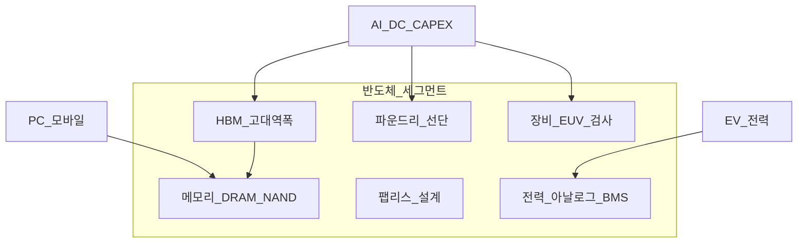
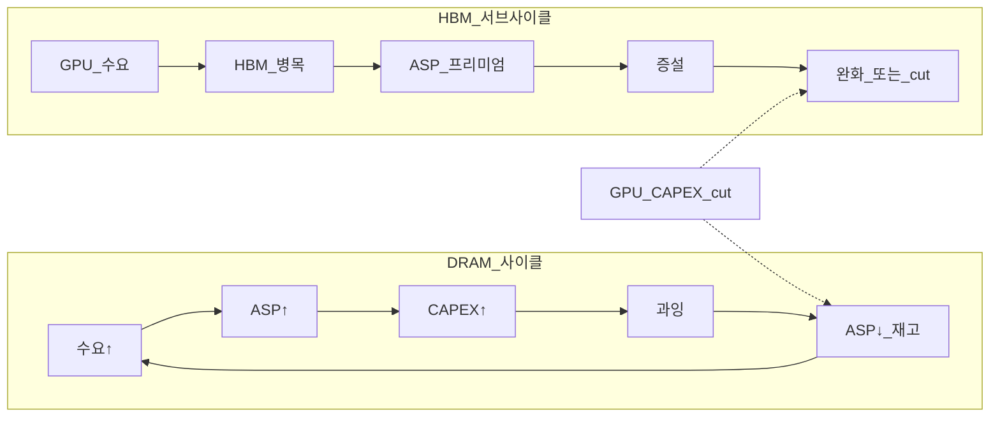
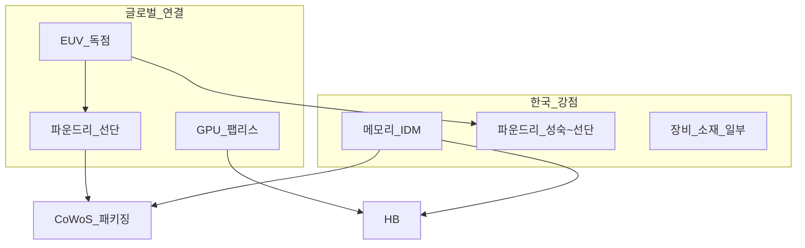

# 반도체 — 메모리·HBM·파운드리·장비 (한국·코어·위성)

> **면책**: 본 문서는 교육 목적이며, 특정 개인·법인에 대한 투자·세무·법률 자문이 아닙니다. 제도·세율·상품 조건은 변경될 수 있으므로 실행 전 공식 출처를 확인하세요.

## 메타

| 항목 | 내용 |
|------|------|
| 최종 검증일 | 2026-05-24 |
| 정책·법령 기준일 | 2025-12-31 확정, 2026 개편 별도 표기 |
| 난이도 | L3 (Deep) — [READER-GUIDE](../../docs/READER-GUIDE.md) |
| 예상 읽기 시간 | 55~65분 |
| 관련 bucket | Bucket 3 (반도체 ETF·지수 코어), Bucket 4 (HBM·장비 개별) |

## 0. 이 편 읽기 전 (5분)

| 항목 | 내용 |
|------|------|
| **난이도** | L3 (Deep) — [READER-GUIDE §L등급](../../docs/READER-GUIDE.md) |
| **선수** | [sector-investing-framework](sector-investing-framework.md), [stocks-equities-intro](../stocks-equities-intro.md) |
| **이번 편에서 쓰는 기호** | 본문 §4·§4a 표 참고 |
| **복습 한 줄** | — |

## TL;DR

1. 반도체는 **전자·AI·자동차·산업 전반 TAM** — “성숙”해도 **사이클·기술 전환**은 지속; **한국 수출·시총**과 직결됩니다.
2. 세그먼트: **메모리(DRAM·NAND)**, **HBM**, **파운드리**, **팹리스**, **장비·검사**, **전력·아날로그** — **AI는 HBM·先進 패키징·CoWoS** 등 **별도 서브사이클**을 만듭니다.
3. **메모리 사이클**(재고·ASP·CAPEX)과 **AI CAPEX 사이클**(GPU·HBM)이 **동시에·역으로** 움직일 수 있습니다.
4. **한국**: 메모리·파운드리·장비·소재 — **코스피 비중** 큼 → **반도체 ETF = Bucket 3 코어** 후보; HBM·소형 장비 = **Bucket 4 위성**.
5. “안정적 코어” = **변동성 0**이 아니라 **분산·장기·ETF** 의미 — [core-satellite-framework.md](../../04-portfolio/core-satellite-framework.md).

---

## 1. 한 줄 정의 + 왜 중요한가
!!! info "GPU (Graphics Processing Unit)"
    AI 학습·추론 가속 칩.

**정의**: **반도체 섹터**는 집적회로(IC) 설계·제조·패키징·장비·소재로 구성되며, **메모리·로직·파운드리·장비** 등 **서브세그먼트**마다 **경쟁구조·마진·사이클**이 다릅니다.

**왜 중요한가** (장기 자산 형성·bucket 연결):

!!! info "Bucket"
    시간·목적별 **자금 슬롯**(0 비상금 → 3 코어 등)

!!! info "ETF"
    지수·자산 **바구니**를 한 종목처럼 거래

!!! info "HBM (High Bandwidth Memory)"
    GPU 옆 고대역폭 메모리.

!!! info "CAPEX (Capital Expenditure)"
    설비·데이터센터 등 자본 지출.

반도체 없는 산업이 거의 없고, **2023~ AI 데이터센터 CAPEX**가 **HBM·先進 공정** 수요를 재구성했습니다. 한국은 **메모리·파운드리** 글로벌 top tier — KOSPI·수출·고용과 연결. **반도체 ETF**는 [etf-index-funds.md](../etf-index-funds.md) · [core-satellite-framework.md](../../04-portfolio/core-satellite-framework.md)에서 **Bucket 3 코어**로 넣기 **쉬운** 섹터입니다. 반면 **HBM 1종·코스닥 장비**는 **위성** — 메모리 **재고 폭탄**·**미·중 수출통제**·**CAPEX cut** 리스크를 [sector-investing-framework.md](sector-investing-framework.md) 5단계로 읽어야 합니다.

---

## 2. 선수 지식 / 이후 읽을 것

**선수**:
- [sector-investing-framework.md](sector-investing-framework.md)
- [stocks-equities-intro.md](../stocks-equities-intro.md)
- [macroeconomics-basics.md](../../02-economics/macroeconomics-basics.md) — 수출·환율

**이후**:
- [ai-infrastructure.md](ai-infrastructure.md) — GPU·HBM·DC
- [battery-lfp-ncm-ess.md](battery-lfp-ncm-ess.md) — BMS·전력반도체
- [power-grid-electrification.md](power-grid-electrification.md)
- [overseas-equities-intro.md](../overseas-equities-intro.md) — NVDA·TSMC 노출
- [recommended-deep-study-roadmap.md](recommended-deep-study-roadmap.md)

---

## 3. 직관·비유

반도체를 **“디지털 경제의 원유 + 정유 + 배관”**으로 봅니다. **메모리(DRAM)** 는 **원유** — 표준화·대량·**가격 사이클**이 큽니다. **파운드리**는 **정유 공장** — 누가 **先進 공정(3nm)** 을 갖느냐가 **마진**을 가릅니다. **HBM**은 **고급 항공유** — AI GPU에만 붙는 **프리미엄 연료**, 원유(DRAM)와 **다른 가격표**입니다.

**AI 사이클**은 **고속도로 확장**입니다. GPU 차량이 늘면 **HBM·CoWoS(패키징)·전력** 도로가 **병목**이 됩니다. 한국 메모리사는 **HBM lane**에 올라타고, **일반 DRAM lane**은 **재고**가 쌓일 수 있습니다 — **같은 회사·다른 제품** 사이클.

**코어 vs 위성**: **KOSPI 반도체 ETF** = **전체 고속도로 지분**; **HBM 순수 플레이** = **특정 톨게이트** 베팅. 톨게이트는 **통행료(HBM ASP)** 가 오르면 폭등, **GPU CAPEX cut**이면 **급락**합니다.

---

## 4. 정식 개념·용어

| 용어 | 한글 | English | 정의 |
|------|------|----------------|
| DRAM | — | Dynamic RAM | 범용 메모리 — **사이클** |
| NAND | — | Flash storage | SSD·모바일 저장 |
| HBM | 고대역폭메모리 | High Bandwidth Memory | GPU 옆 **3D 적층** 고속 메모리 |
| 파운드리 | — | Foundry | 타사 설계를 **위탁 생산** |
| 팹리스 | — | Fabless | 설계만 — NVDA, 퀄컴 |
| IDM | — | Integrated Device Mfg | 설계+생산 — 메모리 3사 |
| CoWoS | — | Chip on Wafer on Substrate | **先進 패키징** — AI 병목 |
| EUV | — | Extreme ultraviolet litho | 극자외선 **노광** |
| CapEx | 설비투자 | — | 팹·장비 **증설** |
| ASP | 평균판매단가 | Average selling price | 메모리 **수익성** |
| OSAT | — | Outsourced assembly/test | 후공정·패키징 |

## 4a. 핵심 용어 (본문 등장 순)

| 용어 | 한 줄 | 관련 이론 | glossary |
|------|------|----------------|
| 반도체·TAM | 전자·AI·자동차 전반 수요; 한국 수출·시총 | 산업경제 | — |
| DRAM | 범용 메모리; ASP·재고 사이클 큼 | 메모리 사이클 | — |
| NAND | 플래시·SSD; 가격·용량 경쟁 | 저장장치 | — |
| HBM | GPU 옆 3D 고대역폭 메모리; AI 서브사이클 | AI CAPEX | [HBM](../../00-roadmap/glossary.md#hbm-high-bandwidth-memory) |
| 파운드리 | 타사 설계 위탁 생산; 선단 공정 마진 | 수직분업 | — |
| 팹리스·IDM | 설계만 vs 설계+생산(메모리) | 산업구조 | — |
| 메모리 사이클 | 재고·ASP·CAPEX의 순환 | 사이클 | — |
| AI CAPEX 사이클 | GPU·HBM 투자; 메모리와 비동기 가능 | 수요충격 | [ai-infrastructure](ai-infrastructure.md) |
| CoWoS | 선단 패키징; AI 병목 구간 | 공급망 | — |
| EUV | 극자외선 노광; 선단 투자 | 기술장벽 | — |
| CapEx·ASP | 설비투자·평균판매단가; 수익성 지표 | 재무분석 | — |
| 코어 vs 위성 | 반도체 ETF 코어 vs HBM·장비 개별 | 포트 | [core-satellite](../../04-portfolio/core-satellite-framework.md) |

## 4b. 관련 이론 미니맵

- **[섹터 투자 프레임](sector-investing-framework.md)** — TAM·사이클·5단계 체크
- **[AI 인프라](ai-infrastructure.md)** — GPU·HBM·DC CAPEX 연동
- **[재무제표 분석](../../01-foundations/financial-statements-analysis.md)** — CAPEX·OCF·마진
- **[미시·시장구조](../../02-economics/micro-03-market-structures-io.md)** — 독점·수출통제
- **[ETF·코어](../../03-markets/etf-index-funds.md)** — 반도체 ETF Bucket 3

---

## 5. 메커니즘

### 5.1 세그먼트 맵

### 5.2 메모리 vs HBM 사이클 (교육)

**2024~2025 (개념)**: HBM **tight**, DRAM **mixed** — **한국 메모리사 실적**은 **제품 mix**에 따라 **극단 분화**.

### 5.3 한국·글로벌 밸류체인

**수출통제**: 장비·先進 공정 **미·중** — 한국 **중간** 위치, **허가·고객 mix** 리스크.

---

## 6. 수식·모델

**메모리 영업이익 (단순)**:

| 기호 | 이름 | 이 식에서 의미 |
|------|------|----------------|
| \(r\) | 할인율·수익률 | 기간당 이자·요구수익률 |
| \(n\) | 기간 | 연·월 등 복리·할인에 쓰는 횟수 |
| \(PV\) | 현재가치 | 오늘 시점으로 환산한 금액 |
| \(FV\) | 미래가치 | 미래 시점의 목표·결과 금액 |

\[
\pi \approx (\text{bit growth}) \times (\text{ASP}) - (\text{fixed cost}) - (\text{variable cost})
\]

**읽는 법**: **명목** 수익에서 **인플레**를 반영하면 **실질** 체감 수익을 본다. 정밀식은 본문 또는 §4 표를 따른다.
- **bit growth** ↑ + **ASP** ↓ = **허위 성장** — [financial-statements-intro.md](../../01-foundations/financial-statements-intro.md)

**HBM attach rate (교육)**:

| 기호 | 이름 | 이 식에서 의미 |
|------|------|----------------|
| \(r\) | 할인율·수익률 | 기간당 이자·요구수익률 |
| \(n\) | 기간 | 연·월 등 복리·할인에 쓰는 횟수 |
| \(PV\) | 현재가치 | 오늘 시점으로 환산한 금액 |

\[
\text{HBM 수요} \propto (\text{GPU 출하}) \times (\text{HBM capacity per GPU}) \times (\text{attach rate})
\]

**읽는 법**: **r**와 **n**의 관계를 위 식으로 쓴다. 경제·재무 해석은 변수표 「이 식에서 의미」와 [DEPTH-STANDARD](../docs/DEPTH-STANDARD.md) 기호 예제를 맞춘다.- GPU 1장당 HBM **용량·층수** ↑ = **구조적 tailwind**

**장비 주문 vs CAPEX lag**:

- 팹 **CAPEX 발표** → **6~18개월 후** 장비 매출 — **선행 지표**

**코어·위성 배분 (교육)**:

| | Bucket 3 | Bucket 4 |
|------|------|----------------|
| **도구** | KRX 반도체 ETF, SOXX, SMH | HBM·장비 개별 |
| **비중** | 10~40% of equity (개인) | **≤20%** total port |

---

*코어·위성 배분 (교육)**:

| | Bucket 3 | Bucket 4 |
|------|------|----------------|
| **도구** | KRX 반도체 ETF, SOXX, SMH | HBM·장비 개별 |
| **비중** | 10~40% of equity (개인) | **≤20%** total port |

---

## 7. 한국 적용

### 7.1 2025년 기준 (확정)

| 영역 | 내용 | bucket |
|------|------|----------------|
| **KOSPI 메모리·파운드리** | 시총·수출 핵심 | ETF 코어 **3** |
| **반도체 ETF** | KRX, 해외 SMH/SOXX | **3** (ISA 우선) |
| **장비·소재** | CAPEX 민감 | **4** |
| **코스닥 반도체** | 소형·변동 | **4** + [kosdaq-tier-system.md](../kosdaq-tier-system.md) |
| **DB** | 직접 ETF **불가** | [db-pension.md](../../06-korea-policy/db-pension.md) |
| **해외 NVDA** | AI GPU | [overseas-stocks-tax-part1-cgt.md](../../06-korea-policy/tax/overseas-stocks-tax-part1-cgt.md) |

**코어 설계**: ISA·IRP → **반도체 ETF + QQQ/글로벌** ([account-product-tax-map.md](../../06-korea-policy/tax/account-product-tax-map.md)).

### 7.2 2026년 개편·시행 예정 (해당 시)

| 항목 | 2025 | 2026 |
|------|------|----------------|
| ISA 비과세 | 200만 | **500만** (확인) |
| CHIPS·K-Chips 보조금 | 진행 | **선단 증설** 지속 |
| HBM 경쟁 | SK·Samsung·Micron | **HBM4·용량** 경쟁 |
| GPU CAPEX | hyperscaler ↑ | **ROI 검증** 보도 — **cut** 시나리오 |

**법·정책**: 대외무역법·수출통제, K-Chips Act, [references/sources.md](../../references/sources.md)

### 7.3 한국 투자자 실무 체크리스트 (교육)

반도체는 **코스피·수출·ETF** 세 축으로 Bucket 설계와 연결됩니다. 아래는 **매수 전**이 아니라 **학습 완료 후** 스스로 채우는 체크리스트입니다.

| # | 질문 | 통과 기준 (교육) |
|------|------|----------------|
| 1 | DRAM ASP·재고 분기 추세를 설명할 수 있는가? | 최근 2분기 **방향** (공시·리포트) |
| 2 | 보유(또는 검토) ETF top 5 종목·비중? | KRX·운용사 **월간 PDF** |
| 3 | HBM 매출 mix 변화가 EPS에 미치는 경로? | §5.2 **서브사이클** |
| 4 | GPU CAPEX cut 1분기 시나리오? | HBM·장비 **민감도** |
| 5 | DB·ISA 중 어디에 ETF를 둘 것인가? | [db-pension.md](../../06-korea-policy/db-pension.md) **2b** |
| 6 | 위성 개별 1종의 코스닥 **티어**? | [kosdaq-tier-system.md](../kosdaq-tier-system.md) |

**코스피 vs 해외 SMH/SOXX**: KRX ETF는 **한국 메모리·장비 비중**이 높고, SMH는 **미국 설계·장비·파운드리** 혼합입니다. “반도체 코어”를 **한국 편중** vs **글로벌**로 나눌지 [geographic-diversification.md](../../04-portfolio/geographic-diversification.md)와 함께 결정하세요. **ISA**([isa.md](../../06-korea-policy/isa.md)) 안에서 **국내+해외** ETF를 나누면 2026 비과세 한도(보도 **500만 원**) 활용과 **분산**을 동시에 검토할 수 있습니다(시행 확인 필요).

**NXT·장후 매매**: 반도체 **테마 급등일** KRX 본장 마감 후 NXT에서 추격 매수는 **Bucket 4** 행동입니다. 코어 ETF와 **계좌·규칙**을 분리하지 않으면 [fomo-and-trading-hours.md](../../05-behavioral/fomo-and-trading-hours.md)에 기술된 **FOMO** 패턴과 겹칩니다.

---

## 8. 숫자 예제 (가상)

> 모든 인물·금액·회사명은 가상입니다.

### 예제 1: 메모리 사이클 — 가상 DRAM (가상)

| 분기 | bit shipment | ASP index | 재고주 | 주가 반응 (가상) |
|------|------|----------------|
| Q1 | +15% | 110 | 낮음 | +20% |
| Q3 | +20% | 85 | **높음** | -25% |

→ **출하 ↑ + ASP ↓** = 마진 압박 — PER **저평가 착시**.

### 예제 2: HBM mix — 가상 메모리사 K

| | 2023 | 2025 (가상) |
|------|------|----------------|
| HBM 매출 비중 | 5% | **35%** |
| DRAM ASP | -30% | -10% |
| 영업이익 | -40% | **+50%** |

→ **같은 “메모리”** — **mix**가 실적 분기. 위성 **HBM only** vs 코어 **ETF** 비교.

### 예제 3: ISA 코어·위성 (가상 E)

| 자산 | 금액 | bucket |
|------|------|----------------|
| KRX 반도체 ETF | **M** | 3 |
| QQQ | **M** | 3 |
| 가상 장비주 | **M** | 4 |

**GPU CAPEX cut** (가상): ETF -12%, 장비 -35% → **위성 상한** 의미.

---
## 9. FAQ

**Q1. 반도체는 성숙 산업인데 왜 변동성이 큰가요?**  
**A.** **CAPEX·재고·ASP 사이클** + **기술 전환(HBM)**. 성숙 ≠ 저변동.

**Q2. HBM과 DRAM ETF exposure는 같나요?**  
**A.** **다름**. ETF **top holding·비중** 확인 — 메모리사 **HBM mix**.

**Q3. 반도체 ETF는 코어인가 위성인가?**  
**A.** **Bucket 3 코어** (분산). 개별 HBM·장비 = **4**.

**Q4. NVDA는 반도체 문서 vs AI 인프라?**  
**A.** **둘 다**. 팹리스·GPU는 [ai-infrastructure.md](ai-infrastructure.md), 밸류체인은 본 문서.

**Q5. 파운드리 vs 메모리 투자 차이?**  
**A.** 파운드리 = **선단 공정·고객 mix**; 메모리 = **ASP 사이클**. 한국 **둘 다** 노출.

**Q6. GPU CAPEX cut이면?**  
**A.** **HBM·장비·CoWoS** 압박 — **메모리 일반 DRAM**은 **부분 디커플** 가능.

**Q7. DB로 반도체 ETF?**  
**A.** **불가**(일반적). ISA·IRP.

**Q8. 코스닥 반도체 장비?**  
**A.** **위성** + [kosdaq-tier-system.md](../kosdaq-tier-system.md).

**Q9. 환율과 한국 반도체?**  
**A.** 수출 **달러 매출** — 원화 약세 **단기** 수혜, **장기**는 CAPEX·수요.

**Q10. CoWoS가 뭔가요?**  
**A.** **先進 패키징** — AI chip **병목** 중 하나. TSMC·메모리 **후공정** 연결.

**Q11. 반도체 코어에 채권 ETF를 같이 넣어야 하나요?**  
**A.** [asset-allocation.md](../../04-portfolio/asset-allocation.md) — **주식 코어(반도체·QQQ)** 와 **채권**은 **별도 슬롯**. 반도체 ETF만으로 **분산**이라고 **채권 생략**은 **위험**.

**Q12. 메모리 3사만 알면 반도체 공부 끝인가요?**  
**A.** **아니오**. **장비(EUV)** · **팹리스(NVDA)** · **파운드리(TSMC)** · **전력 PMIC**가 **AI·EV**와 **연결** — §5.1 **세그먼트 맵** **전체**.

---

## 10. 함정·리스크·한계

- **“반도체 = 항상”** — DRAM **재고** 역사
- **HBM 내러티브** — **증설·경쟁** 후 ASP **정상화**
- **PER만** — **ASP·bit·CAPEX**
- **위성 HBM 올인** — GPU **cut** 민감
- **미·중 통제** — 장비·공정
- **ETF** — **해외 SMH vs KRX** 구성 차이
- **DB 착각**
- 문서 **시점** — CAPEX·HBM **급변**
- **한국 편중 ETF** — **미·중·대만** **정책** **쇼크** **완화** **실패**
- **실적 발표 **전** **레버** — QLD·개별 **Bucket 4** **혼동**
- **K-Chips** **과장** — **실제 **증설** **완공** **지연**
- **환헤지** **미적용** **해외 ETF** — **원달러** **±20%** **가정** **필요**

### 10.1 시나리오 매트릭스 (교육, 가상)

| 시나리오 | DRAM | HBM | 장비 | 코어 ETF | 위성 |
|------|------|----------------|
| AI CAPEX ↑↑ | mixed | **++** | + | + | ++ |
| AI CAPEX cut | ↓ | **↓↓** | ↓↓ | ↓ | ↓↓↓ |
| EV 둔화 | ↓ | ± | ↓ | ↓ | ± |
| 중국 memory 공격 | ↓↓ | ± | ↓ | ↓↓ | ↓ |

→ **“한 시나리오만”** **베팅** **금지** — **5단계** **매 분기** **갱신**.

---

**Q. 실무에서는?**  
교과서 식·기호를 그대로 적용하기 전에 **수수료·세금·데이터 시점**을 분리한다. 숫자는 [DEPTH-STANDARD](../docs/DEPTH-STANDARD.md)처럼 기호만 먼저 맞추고, 법령·시장 수치는 §8 표·외부 출처로 갱신한다.

## 11. 심화 읽기

- [references/sources.md](../../references/sources.md)
- [ai-infrastructure.md](ai-infrastructure.md)
- SEMI World Forecast, TrendForce (교차)
- [core-satellite-framework.md](../../04-portfolio/core-satellite-framework.md)

---

## 12. 스스로 점검 퀴즈

1. DRAM 사이클에서 **과잉** 신호 2개는?
2. HBM이 일반 DRAM과 **다른** 이유 1줄?
3. 한국 **코어** 노출 도구 1개, **위성** 1개?
4. CoWoS는 **어느** 공정 단계?
5. GPU CAPEX cut 시 **가장** 민감한 서브세그먼트?
6. DB에서 반도체 ETF 직접 선택?
7. bit growth ↑ + ASP ↓ 의미?
8. ISA 2026 비과세 보도 한도?

??? note "정답 힌트"

    1. **CAPEX↑→과잉**, **재고↑·ASP↓**  
    2. **AI GPU 전용·3D·고대역폭·별도 ASP**  
    3. 코어 **반도체 ETF** / 위성 **HBM·장비 개별**  
    4. **先進 패키징**(후공정)  
    5. **HBM·장비·CoWoS** (교육)  
    6. **아니오**  
    7. **출하는 늘지만 가격·마진 악화**  
    8. **500만 원**