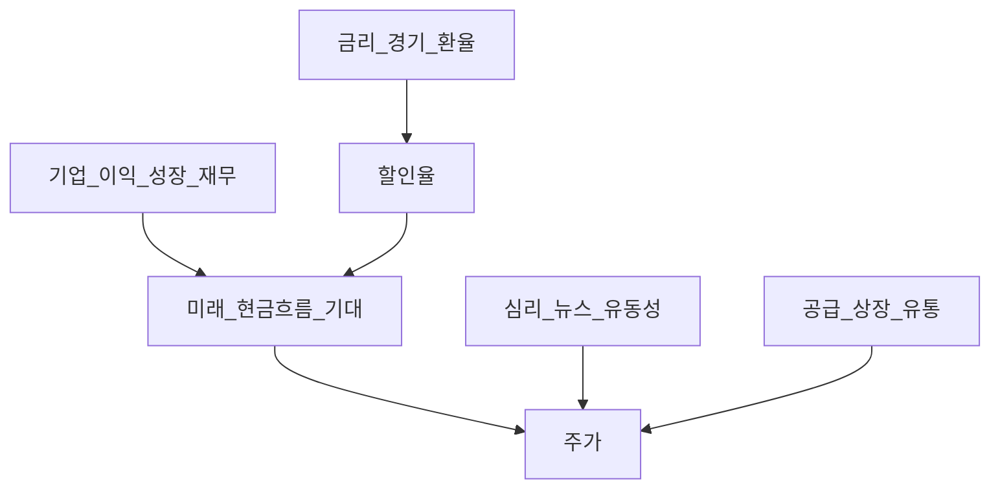
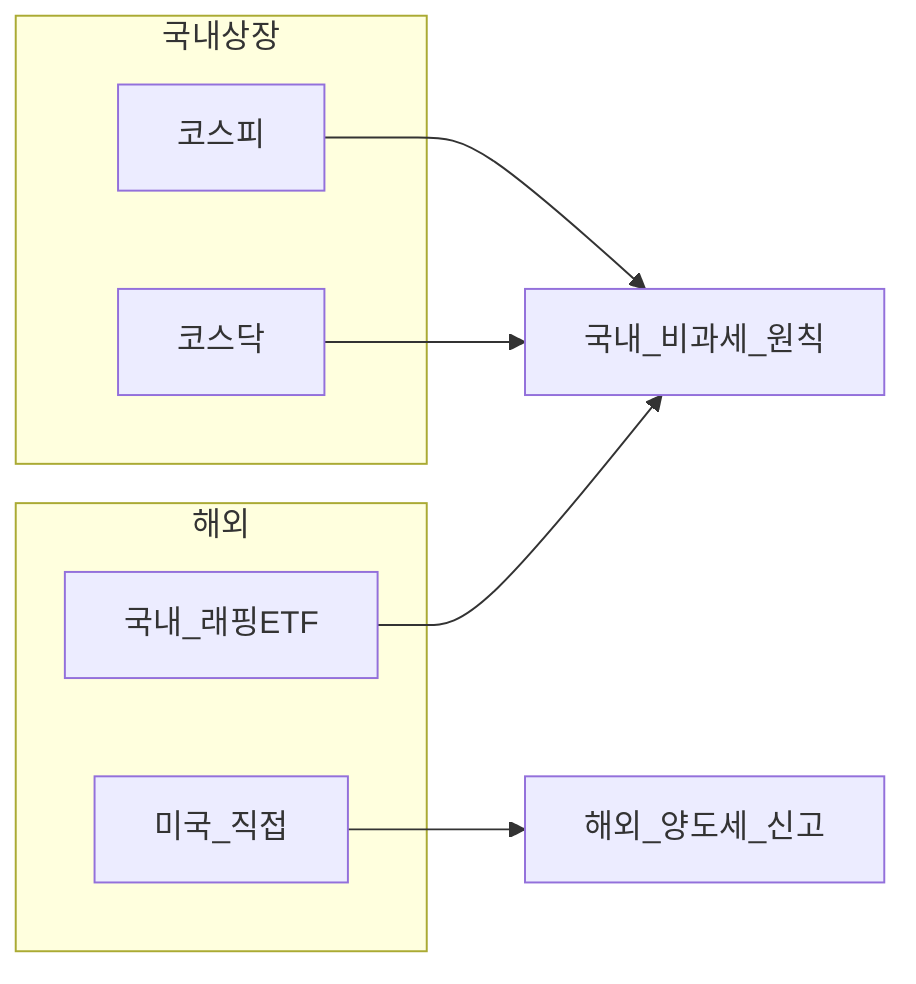

# 주식(Equities) 입문 — 소유권·시장·밸류에이션·한국 규칙

> **면책**: 본 문서는 교육 목적이며, 특정 개인·법인에 대한 투자·세무·법률 자문이 아닙니다. 제도·세율·상품 조건은 변경될 수 있으므로 실행 전 공식 출처를 확인하세요.

## 메타

| 항목 | 내용 |
|------|------|
| 최종 검증일 | 2026-05-24 |
| 정책·법령 기준일 | 2025-12-31 확정, 2026 세제·시장 개편 별도 표기 |
| 난이도 | L3 (Deep) — [READER-GUIDE](../docs/READER-GUIDE.md) |
| 예상 읽기 시간 | 55~70분 |
| 관련 bucket | Bucket 3 코어(ETF), 위성(개별·섹터) |

## 0. 이 편 읽기 전 (5분)

| 항목 | 내용 |
|------|------|
| **난이도** | L3 (Deep) — [READER-GUIDE §L등급](../docs/READER-GUIDE.md) |
| **선수** | [재무제표 입문](../01-foundations/financial-statements-intro.md), [미시경제](../02-economics/microeconomics-basics.md) |
| **이번 편에서 쓰는 기호** | 본문 §4·§4a 표 참고 |
| **복습 한 줄** | — |

> **심화 편**: [주식 밸류에이션](equity-valuation-fundamentals.md)에서 DCF·멀티플·DDM을 연결한다.
## TL;DR

1. **주식**은 회사 **소유권 일부** — 잔여이익·성장에 참여하며, 원금이 보장되지 않는다.
2. 수익은 **가격 상승(자본이득)** 과 **배당** — 배당은 회사·정책·이익에 따라 없을 수 있다.
3. **KRX** 코스피·코스닥 — [승강제](../03-markets/kosdaq-tier-system.md)·[ATS](../03-markets/korea-ats-nextrade.md) 이해 필수.
4. **국내** 개인 매매차익은 원칙 **비과세**, **해외**는 별도 — 세금 시리즈 필수.
5. 장기 **코어**는 [ETF](../03-markets/etf-index-funds.md) 분산, **위성**만 개별·섹터 — [코어-위성](../04-portfolio/core-satellite-framework.md).

---

## 1. 한 줄 정의 + 왜 중요한가

**정의**: **주식(Equity)** 은 주식회사의 **소유권을 나타내는 증권**으로, 보통주는 의결권·배당(선택)·청산 시 **잔여재산** 분배 권리를 가진다.

**왜 중요한가**: “주식 = 도박”과 “주식 = 예금 대체”는 둘 다 **왜곡**이다. 소유권·변동성·세금·유동성을 이해하면 [ISA](../06-korea-policy/isa.md)·[IRP](../06-korea-policy/tax/isa-irp-pension-tax.md)에서 **무엇을 코어로 둘지** 결정할 수 있다. 개별 코스닥 테마주만으로 은퇴 자금을 채우는 구조의 **리스크**도 여기서 걸러진다.

---

## 2. 선수 지식 / 이후 읽을 것

**선수**:
- [재무제표 입문](../01-foundations/financial-statements-intro.md)
- [미시경제](../02-economics/microeconomics-basics.md), [거시경제](../02-economics/macroeconomics-basics.md)
- [복리](../01-foundations/compound-interest-and-time-value.md)

**이후**:
- [ETF·인덱스](etf-index-funds.md)
- [해외 주식](overseas-equities-intro.md)
- [섹터 README](sectors/README.md), [반도체](sectors/semiconductor.md)
- [국내 주식 세금](../06-korea-policy/tax/domestic-stocks-tax.md)
- [계좌·상품 세금 맵](../06-korea-policy/tax/account-product-tax-map.md)

---

## 3. 직관·비유

**가게 지분**: 100만 원짜리 가게 지분 10%를 샀다면, 가게 이익의 일부(배당)와 가게 전체 가치 상승(주가)에 참여한다. 가게가 망하면 지분 가치도 **0에 가까워질** 수 있다.

**경기·금리 파도**: [거시](../02-economics/macroeconomics-basics.md)처럼 같은 회사도 금리·심리에 따라 주가가 흔들린다. “실적은 좋은데 주가만 빠진다”는 **밸류에이션·유동성** 문제일 수 있다.

**코어 vs 위성**: 항공기 **본체(ETF 코어)** + **탑승객용 특수 화물(위성 종목)**. 본체만으로도 목적지에 갈 수 있게 설계하는 것이 [코어-위성](../04-portfolio/core-satellite-framework.md)이다.

**주가 ≠ 회사 품질만**: 같은 분기 실적이라도 금리·섹터 로테이션·공매도·지수 편입에 따라 주가는 다르게 움직인다. 입문 단계에서는 “좋은 회사 = 오르는 주식”을 **분리**하는 연습이 필요하다. [거시](../02-economics/macroeconomics-basics.md)와 [미시](../02-economics/microeconomics-basics.md)가 그 분리를 돕는다.

**국내 비과세의 범위**: 코스피·코스닥 **매매차익**이 원칙 비과세라고 해서 **모든 주식 관련 소득**이 세금 없는 것은 아니다. 배당·해외주·ISA 규칙·금융소득 종합은 별도다 — [domestic-stocks-tax](../06-korea-policy/tax/domestic-stocks-tax.md), [investment-tax-overview](../06-korea-policy/tax/investment-tax-overview.md).

**승강제·유동성**: 코스닥은 투자주의·관리종목·상장폐지 등 **규칙 리스크**가 코스피보다 크다. 테마로 몰린 소형주는 호가가 얇아 **시장가 매도** 시 체결가가 기대보다 낮을 수 있다 — [kosdaq-tier-system](kosdaq-tier-system.md), [korea-ats-nextrade](korea-ats-nextrade.md).

---

## 4. 정식 개념·용어

| 용어 | 한글 | English | 정의 |
|------|------|----------------|
| 보통주 | 보통주 | Common stock | 의결권·잔여재산 **후순위** |
| 우선주 | 우선주 | Preferred stock | 배당·잔여재산 **우선**, 성장 제한적 경우 多 |
| 시가총액 | 시가총액 | Market cap | 주가 × **유통·발행** 주식수 |
| PER | 주가수익비율 | P/E | 주가 ÷ 주당순이익(EPS) |
| PBR | 주가순자산비율 | P/B | 주가 ÷ 주당순자산(BPS) |
| EPS | 주당순이익 | Earnings per share | 순이익 ÷ 주식수 |
| 배당수익률 | 배당수익률 | Dividend yield | 연 배당 ÷ 주가 |
| 유동성 | 유동성 | Liquidity | 매매·호가 **깊이** |

### 4a. 핵심 용어 (본문 등장 순)

> 복습용. 정의는 §4 본표·[glossary](../00-roadmap/glossary.md)·본문 `!!! info` 박스.

| 용어 | 한 줄 | 관련 이론 | glossary |
|------|------|----------------|
| 보통주 | 의결권·잔여재산 **후순위** | §4 | [glossary](../00-roadmap/glossary.md#보통주) |
| 우선주 | 배당·잔여재산 **우선**, 성장 제한적 경우 多 | §4 | [glossary](../00-roadmap/glossary.md#우선주) |
| 시가총액 | 주가 × **유통·발행** 주식수 | §4 | [glossary](../00-roadmap/glossary.md#시가총액) |
| PER | 주가 ÷ 주당순이익 | §4 | [glossary](../00-roadmap/glossary.md#per) |
| PBR | 주가 ÷ 주당순자산 | §4 | [glossary](../00-roadmap/glossary.md#pbr) |
| EPS | 순이익 ÷ 주식수 | §4 | [glossary](../00-roadmap/glossary.md#eps) |
| 배당수익률 | 연 배당 ÷ 주가 | §4 | [glossary](../00-roadmap/glossary.md#배당수익률) |
| 유동성 | 매매·호가 **깊이** | §4 | [glossary](../00-roadmap/glossary.md#유동성) |

---

## 5. 메커니즘

### 5.1 주가 형성 (단순화)

### 5.2 국내 vs 해외 보유 경로

| 경로 | 결제 | 대표 세금 이슈 | 문서 |
|------|------|----------------|
| 코스피·코스닥 | 원화 | 개인 매매차익 비과세(원칙) | [domestic-stocks-tax](../06-korea-policy/tax/domestic-stocks-tax.md) |
| 미국 QQQ 등 | 달러 | 양도·배당 | [part1](../06-korea-policy/tax/overseas-stocks-tax-part1-cgt.md) |
| ISA | 원화/해외 | 비과세 한도·기간 | [isa](../06-korea-policy/isa.md) |

---

## 6. 수식·모델

**PER**:

| 기호 | 이름 | 이 식에서 의미 |
|------|------|----------------|
| \(r\) | 할인율·수익률 | 기간당 이자·요구수익률 |
| \(n\) | 기간 | 연·월 등 복리·할인에 쓰는 횟수 |
| \(PV\) | 현재가치 | 오늘 시점으로 환산한 금액 |
| \(FV\) | 미래가치 | 미래 시점의 목표·결과 금액 |

\[
PER = \frac{\text{주가}}{EPS}
\]

**읽는 법**: **PER**와 **주가**의 관계를 위 식으로 쓴다. 경제·재무 해석은 변수표 「이 식에서 의미」와 [DEPTH-STANDARD](../docs/DEPTH-STANDARD.md) 기호 예제를 맞춘다.
**PBR**:

| 기호 | 이름 | 이 식에서 의미 |
|------|------|----------------|
| \(r\) | 할인율·수익률 | 기간당 이자·요구수익률 |
| \(n\) | 기간 | 연·월 등 복리·할인에 쓰는 횟수 |
| \(PV\) | 현재가치 | 오늘 시점으로 환산한 금액 |

\[
PBR = \frac{\text{주가}}{BPS}
\]

**읽는 법**: **r**와 **n**의 관계를 위 식으로 쓴다. 경제·재무 해석은 변수표 「이 식에서 의미」와 [DEPTH-STANDARD](../docs/DEPTH-STANDARD.md) 기호 예제를 맞춘다.**PEG** (성장 조정, 참고):

| 기호 | 이름 | 이 식에서 의미 |
|------|------|----------------|
| \(r\) | 할인율·수익률 | 기간당 이자·요구수익률 |
| \(n\) | 기간 | 연·월 등 복리·할인에 쓰는 횟수 |
| \(PV\) | 현재가치 | 오늘 시점으로 환산한 금액 |

\[
PEG = \frac{PER}{\text{이익 성장률(\%)}}
\]

**읽는 법**: **r**와 **n**의 관계를 위 식으로 쓴다. 경제·재무 해석은 변수표 「이 식에서 의미」와 [DEPTH-STANDARD](../docs/DEPTH-STANDARD.md) 기호 예제를 맞춘다.
**배당수익률**:

| 기호 | 이름 | 이 식에서 의미 |
|------|------|----------------|
| \(r\) | 할인율·수익률 | 기간당 이자·요구수익률 |
| \(n\) | 기간 | 연·월 등 복리·할인에 쓰는 횟수 |
| \(PV\) | 현재가치 | 오늘 시점으로 환산한 금액 |

\[
\text{배당수익률} = \frac{\text{연 배당금}}{\text{주가}}
\]

**읽는 법**: **r**와 **n**의 관계를 위 식으로 쓴다. 경제·재무 해석은 변수표 「이 식에서 의미」와 [DEPTH-STANDARD](../docs/DEPTH-STANDARD.md) 기호 예제를 맞춘다.**총주주수익** (1년, 근사): \(\text{주가 변동률} + \text{배당수익률}\) (재투자·세금 제외)

입문 이후: [CAPM](../08-advanced/capm-and-risk-return.md), [팩터](../08-advanced/factor-investing-primer.md)

### 6.1 주문·유동성 (입문)

| 주문 | 설명 | 함정 |
|------|------|----------------|
| **지정가** | 원하는 가격에만 체결 | 미체결 |
| **시장가** | 즉시 체결 | 호가 스프레드·급락 시 **불리** |
| **종가** | 종가 근처 체결 | 변동성 큰 날 주의 |

코스닥 소형·테마주는 **시장가 대량**이 불리할 수 있다 — [KOSDAQ 승강제](kosdaq-tier-system.md).

### 6.2 배당 정책

| 유형 | 특징 |
|------|------|
| 성장주 | **재투자** → 배당 낮음 |
| 가치·성숙 | **배당** 비중 |
| 특별배당 | **일회성** — 수익률 착시 |

배당만 보고 “안전”이라고 단정하지 않는다 — [예제 3](#예제-3-배당만-보면-안-되는-이유-가상).

---

7.1 2025년 기준 (확정·일반적 맥락)

| 시장 | 특징 | 투자 교육 포인트 |
|------|------|----------------|
| **코스피** | 대형·금융·수출 多 | 외국인·기관 수급 |
| **코스닥** | 성장·바이오·테마 | [승강제](kosdaq-tier-system.md), 퇴출 리스크 |
| **대체거래소 ATS** | NXT 등 | [korea-ats-nextrade](korea-ats-nextrade.md) |
| **개인 국내주** | 매매차익 비과세(원칙) | 법 개정 시 재확인 |
| **해외주** | 5월 신고 등 | [part1~3](../06-korea-policy/tax/overseas-stocks-tax-part3-scenarios.md) |

### 7.2 2026년 개편·시행 (해당 시)

| 항목 | 2025 | 2026 (확인 필요) |
|------|------|----------------|
| ISA 한도·비과세 | [isa](../06-korea-policy/isa.md) | 개정 시 **코어 설계** 재검토 |
| 코스닥 규제 | 승강제·공시 | [tier-system](kosdaq-tier-system.md) 개정 여부 |
| 해외주식 세무 | 국세청 안내 | [investment-tax-overview](../06-korea-policy/tax/investment-tax-overview.md) |

**법·정책 근거**: 소득세법(양도·배당), 금융투자소득세 논의 시 **공식 고시** — [sources.md](../references/sources.md)

### 7.3 계좌별 주식 보유 (교육용)

| 계좌 | 국내주 | 해외주·QQQ | 비고 |
|------|------|----------------|
| 일반 | ○ | ○ | 해외 **양도세** |
| ISA | ○ | ○(상품별) | 3년·한도 |
| IRP/연금 | ○ | ○(상품별) | [IRP 세금](../06-korea-policy/tax/isa-irp-pension-tax.md) |
| DB | **본인 매매×** | × | [db-pension](../06-korea-policy/db-pension.md) |
| DC | ○(가입자 선택) | ○(제한) | [dc-pension](../06-korea-policy/dc-pension.md) |

---

## 8. 숫자 예제 (가상)

> 모든 인물·금액·종목명은 가상입니다.

### 예제 1: PER 함정 (가상)

| 항목 | 값 (가상) |
|------|-----------|
| 주가 | 50,000원 |
| EPS (일회성 자산매각 포함) | 5,000원 |
| PER | 10배 → “저평가?” |
| **조정 EPS** (영업만) | 2,500원 |
| **조정 PER** | 20배 |

**해석**: [재무제표](../01-foundations/financial-statements-intro.md) 없이 PER만 보면 오판.

### 예제 2: 코어 vs 위성 (가상)

| 슬롯 | 금액 | 비중 | 상품 (가상) |
| 코어 | **M** | 80% | 글로벌·나스닥 **ETF** |
| 위성 | **M** | 10% | 2차전지 소재 1종 |
| 현금·채권 | **M** | 10% | MMF·단기채 |

**해석**: 위성 손실이 전체의 **10% 이내** — [core-satellite](../04-portfolio/core-satellite-framework.md)

### 예제 3: 배당만 보면 안 되는 이유 (가상)

| | 배당수익률 | 주가 변동 | 1년 총수익 |
|------|------|----------------|
| 종목 X | 4% | −15% | **약 −11%** |
| ETF Y | 0.5% | +12% | **약 +12.5%** |

### 예제 4: 코스닥 승강제 리스크 (가상)

| 단계 | 가상 종목 Z | 포트 영향 |
|------|------|----------------|
| 투자주의 | 유동성↓ | 매도 스프레드↑ |
| 관리종목 | 기관 매수 제한 | 주가 −25% (가상) |
|------|------|----------------|
→ [kosdaq-tier-system](kosdaq-tier-system.md) 선행 학습.

---
## 9. FAQ

**Q1. 주식은 도박과 같은가?**  
**A.** **구조가 다르다.** 분산·기간·비용·세금·규칙을 설계하면 **교육 프레임**은 장기 자산 형성. 단기 레버리지·집중은 도박에 **가까워질** 수 있다.

**Q2. 국내 vs 해외 어디서 시작?**  
**A.** 목표·세금·환율·시간대. 코어는 [ETF](etf-index-funds.md) + [해외 입문](overseas-equities-intro.md) + [계좌 맵](../06-korea-policy/tax/account-product-tax-map.md).

**Q3. 코스닥은 위험한가?**  
**A.** 변동성·유동성·**퇴출** 리스크가 상대적으로 크다. → [kosdaq-tier-system](kosdaq-tier-system.md)

**Q4. 공매도·신용거래는?**  
**A.** 입문 이후. 리스크 **확대** — 본 문서 범위 밖.

**Q5. ISA에 개별주 넣어도 되나?**  
**A.** 제도상 가능하나, **3년·한도·비과세** 규칙과 집중 리스크를 함께 본다. → [isa](../06-korea-policy/isa.md)

**Q6. DB 퇴직연금으로 삼성전자·QQQ 살 수 있나?**  
**A.** **DB는 일반적으로 불가.** DC·IRP·ISA·일반계좌에서 설계. → [db-pension](../06-korea-policy/db-pension.md)

**Q7. PER이 낮으면 무조건 싼가?**  
**A.** **아니다.** 이익 하락·구조적 쇠퇴·일회성 이익·부채 리스크를 본다.

**Q8. 주식 vs [레버리지 ETF](../04-portfolio/leveraged-etf-qqq-qld.md)?**  
**A.** QLD 등은 **일일 리셋**·변동성 붕괴 — 코어 비권장, 위성·단기만 교육.

---

## 10. 함정·리스크·한계

- PER·테마·밈만 보고 **재무·현금흐름** 생략  
- 코어를 **코스닥 단일 섹터**로 대체  
- 국내 비과세를 “**세금 없는 투자**”로 오해 (배당·해외·ISA 규칙 별도)  
- **레버리지 ETF**를 “주식 대체”  
- 유동성 없는 종목 **시장가** 대량 매매  
- 본문 세제·시장 규칙은 **변경** 가능

---

**Q. 실무에서는?**  
교과서 식·기호를 그대로 적용하기 전에 **수수료·세금·데이터 시점**을 분리한다. 숫자는 [DEPTH-STANDARD](../docs/DEPTH-STANDARD.md)처럼 기호만 먼저 맞추고, 법령·시장 수치는 §8 표·외부 출처로 갱신한다.

## 11. 심화 읽기

- [references/sources.md](../references/sources.md) — KRX, 국세청  
- [ETF](etf-index-funds.md), [채권](../03-markets/bonds-fixed-income.md)  
- [패시브 vs 액티브](../04-portfolio/passive-vs-active.md)  
- [섹터 로드맵](sectors/recommended-deep-study-roadmap.md)

### 11.1 입문 후 다음 단계

1. [etf-index-funds](etf-index-funds.md) — 코어 도구  
2. [overseas-equities-intro](overseas-equities-intro.md) — QQQ·세금  
3. [domestic-stocks-tax](../06-korea-policy/tax/domestic-stocks-tax.md) + [part1](../06-korea-policy/tax/overseas-stocks-tax-part1-cgt.md)  
4. [core-satellite](../04-portfolio/core-satellite-framework.md) — 비중  
5. 위성만 갈 경우 [sector-investing-framework](sectors/sector-investing-framework.md)

### 11.2 가상 포트 점검표

| 항목 | 예/아니오 |
|------|-----------|
| 코어가 ETF·지수인가 | |
| 코스닥 단일 종목 < 전체 10%인가 | |
| PER 볼 때 EPS 품질 확인했는가 | |
| 해외 보유 시 5월 신고 인지했는가 | |
| DB에 개별주 기대하지 않는가 | |

---

## 12. 스스로 점검 퀴즈

1. 주식 투자자의 대표적 수익 두 가지는?  
2. 국내 상장주 개인 **매매차익** 세금(2025 원칙)은?  
3. 코어에 코스닥 소형 1종목만 넣을 때 핵심 리스크는?  
4. PER 8배가 항상 저평가인지 판단하려면 무엇을 봐야 하는가?  
5. QQQ 코어 포지션은 DB가 아닌 어느 bucket에서 설계하는가?  
6. PER 8배를 볼 때 반드시 확인할 EPS 관련 항목은?

??? note "정답 힌트"

    1. 자본이득·배당 · 2. 비과세(원칙, 법 개정 확인) · 3. 퇴출·집중·유동성 · 4. EPS 품질·성장·부채 · 5. Bucket 2b~3 (ISA/IRP/일반) · 6. 일회성 제거·영업이익 추세

**L3 완료**: [TEMPLATE](../docs/TEMPLATE.md)·검증일 2026-05-24 — 다음 [etf-index-funds](etf-index-funds.md).

**한 페이지 요약**: 주식=소유권·변동성 | 수익=가격+배당 | 국내 비과세(원칙)·해외 별도 | 코어=ETF·위성=개별 | DB 직접매매× | PER=EPS 품질 필수 | 코스닥=승강제 리스크.

**읽기 후 액션 (가상)**: (1) 보유 계좌 표 작성 — 일반/ISA/IRP/DB·DC (2) 코어·위성 비중 % (3) 해외 보유 시 part1 링크 북마크 (4) [financial-statements](../01-foundations/financial-statements-intro.md)로 관심 종목 1개 손익계산서 열기.

**Q9. 우선주는 입문에서 어디까지 보나?**  
**A.** 배당·잔여재산 **우선** vs 보통주 **성장** 트레이드오프만 이해. 상세는 개별 종목 공시.