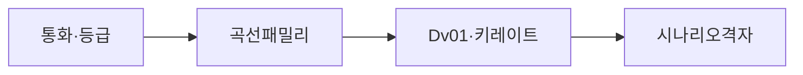
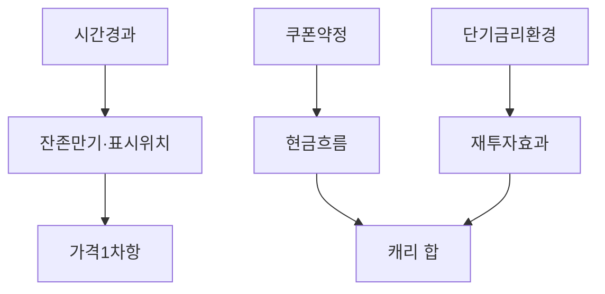
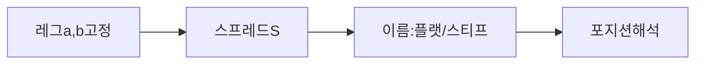

# 수익률 곡선 전략 심화 — 롤다운·바벌·불렛·플랫닝·스티프닝·듀레이션

> **면책**: 본 문서는 교육 목적입니다. 채권·금리 선물·스왑 계열 상품에는 원금 손실·유동성·신용·레버리지 리스크가 따릅니다. 과세와 예탁 규격은 [계좌·상품 세제 맵](../06-korea-policy/tax/account-product-tax-map.md), 증권사 약관·금융위·국세청 안내를 따르세요.

## 메타

| 항목 | 내용 |
|------|------|
| 최종 검증일 | 2026-05-25 |
| 정책·법령 기준일 | 2025-12-31 확정, 이후 개편 시 재확인 |
| 난이도 | L4 (Graduate) |
| 예상 읽기 시간 | 155~190분 |
| 관련 bucket | Bucket 3~4 (금리 구조·채권·포트 방어 설계) |

## TL;DR

1. 수익률 곡선 전략의 핵은 **금리 레벨** 하나가 아니라 **만기 축**(시간 경과)·**두 금리 차**(경사)·**중간 레그 튀어오름**(커브처)을 동시에 읽는 순서다.
2. **롤 다운**(ride the curve)은 곡선 형태가 교과서적으로 유지된다고 잠시 가정할 때, 채권의 잔존만기가 짧아지면서 **표시금리 축 상에서 위치가 바뀐다**는 지오메트리 하나만으로도 설명되는 손익 통로다 — 실제 장세에서는 신용·변동성이 이 가정을 깨기 쉽다.
3. **바벌**(단기·장기)과 **불렛**(중만기)은 표면적 수정듀레이션이 비슷해도 **단기 금리 폭등·비틀림**에 다른 반응을 낼 수 있다.
4. **플랫닝·스티프닝**은 **미리 고른 두 레그** 사이 스프레드 \(S\)가 줄거나 늘 때 쓰는 **이름 규약**이다. 만기 쌍을 적지 않은 대화는 헷갈리기 쉽다.
5. 개인에게는 목표 수정듀레이션·분산·계좌 규격을 먼저 고정하고 곡선 베팅을 얹는 것이 자연스러운 서술 순서다. 수식·듀레이션은 [채권·고정수익 심화](bonds-fixed-income-deep.md)가 전제다.

---

## 1. 한 줄 정의 + 왜 중요한가

**정의**: 만기 \(T\)에 대한 표시금리 \(y(T)\) 집합(국채·스왑·제로 패밀리 등)을 같은 축에 놓고 채권·금리 파생 포지션 손익을 **레벨·경사·비틀림·시간·키 레이트**로 나눠 읽으려는 방법론 패밀리다.

**왜 중요한가**: 근사 \(\Delta P/P \approx -D_{\mathrm{mod}}\Delta y\)는 「\(\Delta y\)가 레그마다 같은가」를 묻지 않으면 위험해진다. 단기 금리 레그가 과도하게 급등하면 표면적 헤지드 듀레이션만 맞춘 포트도 결과가 어긋날 수 있다. 장기 코어만 안정시키려는 경우에는 교과서적 곡선 전략을 과도하게 믿기보다 목적(코어·세제·유동성)부터 고르는 순서가 합리적이다.

---

## 2. 선수 지식 / 이후 읽을 것

**선수**:
- [채권·고정수익 심화](bonds-fixed-income-deep.md)

**이후**:
- [자산배분](../04-portfolio/asset-allocation.md)
- [코어–위성](../04-portfolio/core-satellite-framework.md)
- [ETF·인덱스 심화](etf-index-funds-deep.md)
- [거시 — 화폐와 인플레](../02-economics/macro-02-money-inflation.md)

---

## 3. 직관·비유

**등고선 지도**: 곡선 레벨은 **산의 평균 고도**, 경사·커브처는 **경사면 방향·골짜기**다. 단기 금리 레그만 튀면 전체 평균 수치는 크게 안 바뀌어도 등고선 모양이 들쭉날쭉해지는 것처럼 손익이 나온다.

**썰매·교과서 가정**: 정상형·정적 곡선을 잠시 받아들이면 시간이 지나 잔존만기가 짧아질수록 **더 짧은 레그 쪽**으로 이동하는 기하 효과만으로도 교과서적 설명이 가능하고, 수정듀레이션 프레임에서는 이를 롤 다운이라 부른다 — 그러나 장이 급변하면 곡선 형태 전제가 깨지므로 롤이 언제나 이익 방향이라고 말해서는 안 된다.

---

## 4. 정식 개념·용어

| 용어 | English | 메모 |
|------|---------|------|
| 곡선 벤치 | Curve family | Par / zero / swap 선택을 먼저 고정 |
| 정상·역전·평평 | Normal, inverted, flat | 해석은 경제 상황과 섞어 쓰되 레그 정의를 분리 |
| 경사 | Slope | 두 만기 \(a,b\) 에 대해 \(S=y_a-y_b\) 등 |
| 버터플라이·커브처 | Butterfly, curvature | 세 레그 무게·중간 과대·과소 |
| 바벌·불렛 | Barbell, bullet | 만기 분포 양상 |
| 롤·캐리 | Roll-down, carry | 시간·쿠폰·재투자 |
| 키 레이트 | Key-rate DV01 | 레그별 금리 변동 민감도 |

---

## 5. 메커니즘

### 5.1 표준 읽기 순서

1. 통화·등급·국내외(원·달러·국고 대 회사채)를 고정한다.
2. 사용할 곡선 패밀리(국채 현물 등)를 정한다.
3. 포트폴리오의 Dv01과 키 레이트 민감도를 행렬로 정렬한다.
4. 시나리오(병행 이동·경사 회전·커브처)로 격자를 만든다.

### 5.2 롤과 캐리 분해

### 5.3 플랫닝·스티프닝은 스프레드 언어

---

## 6. 수식·모델

**1차·2차 근사**(단일 채권에서 단일 금리 레그 근처):

$$
\frac{\Delta P}{P}\approx -D_{\mathrm{mod}}\,\Delta y,\qquad
\frac{\Delta P}{P}\approx -D_{\mathrm{mod}}\,\Delta y+\frac{1}{2} C_{\mathrm{x}} (\Delta y)^2.
$$

**경사 변수**를 \(S=y_a-y_b\)로 정의하면 근처에서 \(\Delta S\approx \Delta y_a-\Delta y_b\)로 읽으면 된다. 평행 이동(모든 만기에서 \(\Delta y=\delta\))이면 채 각각 \(\Delta P/P\approx -D_{\mathrm{mod}}\delta\)이 우선 채널이고, \(\delta\)가 만기별로 어긋나는 순간 곡선 회전 또는 비틀림 해석 영역이다.

실무 시스템은 키 레이트별 DV01로 \(\Delta y\)를 벡터화해 선형 근사를 맞추지만, 교육용으로 여기까지면 충분하다. **컨벡시티**는 금리 변동폭이 클 때 2차 항으로 손실·이익의 비대칭을 더 정확히 보려는 도구다. 임베디드 옵션·변동 채처럼 선형 근사가 자주 깨지는 상품에서는 곡선 이론보다 종목 간이설명서의 스트레스 수치 자체가 더 솔직할 때가 많다.

---

## 7. 한국 적용

### 7.1 2025년 기준 접근 채널(개인)

국내에서는 **실물 장기 미국국채**를 직접 보유하며 무게중심을 자주 재조정하는 패턴보다 간접상품 비중이 높아, 인기 있는 경로는 **장내 ETF·펀드·간접 상품**(달러 헤지/비헤지), **예금·머니마켓** 등 단기 레그 접점이다. 교재의 깨끗한 스팟 커브와 레포 패턴까지 그대로 맞추기보다 「이 상품 지표 금리는 무슨 채 준위인가」「추종 지수 방법론」「보수와 추적 편차」를 먼저 정리하는 순서가 합리적이다.

달러 채 트래킹 상품이라면 통화 헤지 비율·스왑·롤링 비용이 수익률 곡선 프레임 밖 변수로 들어오므로, 국내 원화만으로 곡선을 볼 때와 **같은 말이라도 다른 사실**이 될 수 있다. ISA·연금 등 계좌는 한도와 과표 규격이 카탈로그마다 바뀌므로 본 챕터에서는 숫자를 고정 적지 않되, 과표 요동이 단기 금리 민감도만으로 설명되는 변동보다 크면 과세 구조부터 다시 놓치지 말라고 경고만 둔다.

### 7.2 2026 및 이후 변경 — 공식 재확인 체크리스트

| 확인 대상 | 이유 |
|----------|------|
| 금융위·증권사 공지 상품 교체일 | 간이설명 변경·종목 교체 빈번 |
| 국세청 ISA·연금 안내판 | 과세·한도 교체 가능 |
| 기초지수 제공처 Methodology 문서 | 지속기간 타깃·롤링 규격 |

표는 교육용 메모이며 법률 근거 증명이 아니다.

### 7.3 국내·해외 금리 패턴 차이 인식하기

외국 교과서 플랫닝 예시가 흔히 **미 장기 레그**(10년 물 등)·**단기 정책 레그**(2년·SOFR 패밀리) 조합이라도, 대한민국에서는 정책 경로와 시장 심리·외환 수급 변수가 교차해서 **형태 카테고리 이름만 들고 패턴을 과대 적용하면 위험**하다는 점만 기억한다. 교과서 패턴 카탈로그는 통화 구역마다 교체 순서부터 다르다는 점만 염두에 둔다.

## 8. 숫자 예제 (가상)

> 인물·금리 수치는 가설입니다.

### 예제 1 — 경사 스프레드를 숫자로 읽기

어떤 날 시작 시점에 표시금리가 10년물 3.90%, 2년물 3.55%라고 한다. 레그 순서 규약을 \(S = y_{2\text{년}} - y_{10\text{년}}\)으로 두면 \(S=-0.35\)퍼 포인트(−35 bp)이다. 다음 날 \(\Delta y_{10}=-4\) bp, \(\Delta y_{2}=+15\) bp라면 새 \(y_2'=3.70\%\),\(y_{10}'=3.86\%\) 근처이고 \(\Delta S \approx \Delta y_2 - \Delta y_{10} \approx +19\) bp — 스프레드가 넓히는 패턴 이름으로 흔히 스티프닝이라 부른 예시다. 손익 분석은 여기서 끝이 아니라 각 포지션 수정듀레이션 행렬로 가격·현금변화 근사를 재계산해야 한다.

### 예제 2 — 바벌과 불렛의 동등 듀레이션, 비등등 충격 반응

두 포트가 동일 과세 적용과 유사 레이팅을 가정했을 때 수정듀레이션 타깃이 둘 다 약 5년 근방이라 하자. A는 단기 레그 하나와 초장기 레그로 바벌을 짠다. B는 7년 전후 레그 불렛에만 집중한다. **단기물만 과도하게 오르고 장기 레그 변화는 적은 비대칭** 시나리오에서는 바벌의 단축 레그가 손실을 과대 반응시키지만, 장기 레그 교체 순간만 급등하는 시나리오에서는 불렛이 더 깊게 움직일 여지도 있다는 대비용 개념 정리 예시다 — 숫자 없이 방향만 강조한 예이다.

### 예제 3 — 롤 다운의 교과적 전제 명시하기

표준 교과 과제로 무이표채를 사용하고 순정형 수익률 곡선이 시간 \(t\)부터 \(t+1\) 동안 형태 거의 불변이면, 잔존만기가 줄어 들면 더 짧은 만기 축 쪽 표시금리 위치가 이동한다는 기하 이야기 하나만으로 교과 패턴을 그릴 수 있다. 실증 장에서는 레그 일부 폭등·신용 교체 때문에 곡선 가정 무력화가 빈번하므로 과제 접두어라고 항상 읽도록 한다.

### 예제 4 — 간접상품 ETF와 실물 채권 패턴 간극

달러 헤지 국채 트래킹 ETF 한 종목만 보면, 기초지수 교체 규격·보수와 선물·스왑 잔존 때문에 **스팟 곡선 하나의 선형 근사**만으로 만기 교체 과정까지 설명이 닫히지 않는 순간이 올 수 있다고 가정한 예이다. 곡선 이론을 공부했다고 해서 간이설명서에 적힌 추적 편차·괴리·보수로 생기는 손실이 같이 사라진다고 말해서는 안 되며, 교과서적인 곡선 프레임과 상품 레벨 표시 수치를 **항상 따로 놓고** 읽도록 한다.
---

## 9. FAQ

**Q1. 플랫닝이면 채권이 무조건 싸져서 이득인가요?**  
아닙니다. 플랫닝은 보통 「정해 둔 두 만기의 표시금리 차」가 줄어드는 패턴을 부르는 이름입니다. 포지션의 손익은 수정듀레이션 분포 전체와 만기별로 얼마나 움직였는지(Δy의 벡터)를 봐야 하며, 이름만 들고 패턴을 단정하면 위험합니다.

**Q2. 스티프닝이면 장기물을 사야 하나요?**  
반드시 그렇지도 않습니다. 스티프닝 역시 선택한 레그 순서 위에서 스프레드가 넓어지는 용어일 뿐이며, 레그 간 상대 크기 외에도 신용 스프레드·유동성·통화 헤지 여부 같은 변수가 섞입니다. 교재에서 고른 레그 규약과 포트 구성을 같은 문단에 적어 헷갈리지 않도록 합니다.

**Q3. 롤 다운을 믿고 장기 채만 사면 된다고 들었습니다.**  
교과 과제에서는 순정형·정적인 곡선을 잠깐 받아들이면 시간 경과만으로 「표시금리 위치가 짧아진 만기 쪽으로 미끄러진다」는 기하를 그릴 수 있습니다. 현실에서는 금리 격등·형태 교체 때문에 전제가 자주 깨지므로, 롤과 캐리를 설명하는 문장은 과제 접두어라고 항상 읽도록 합니다.

**Q4. 바벌과 불렛 차이가 실전에서 중요할까요?**  
표면 수정듀레이션 패리티를 맞춰도 극단과 중간 무게 차이 때문에 단기 충격·비틀림 이벤트에 다른 반응이 나올 수 있습니다. 키 레이트 민감도까지 비교해야 비슷한 듯 다른 포트 차이가 드러납니다.

**Q5. 수정듀레이션 같은데 왜 가격 반응이 다를까요?**  
선형 근사식은 채 각각 레그별 델타가 같을 때 패리티를 맞춥니다. 실제 포트폴리오를 합칠 때는 만기별 델타가 같지 않거나 컨벡시티·내재 신용 요인까지 겹치면 반응이 달라집니다.

**Q6. 레버·변동 금리가 섞인 상품은 순수 금리 곡선만으로 표현 가능한가요?**  
대개 어렵습니다. 임베디드 옵션과 선물·스왑 결이 있어 스팟 곡선 가정 하나로 손익을 완결하기 힘든 경우가 많습니다. 간이설명서의 추종 지표 정의와 위험고지 순서부터 읽는 편이 합리적입니다.

**Q7. 국채 곡선 논법만 회사채에 적용하면 빠지는 것은 무엇인가요?**  
등급·업종별 **신용 스프레드**와 **유동성 프리미엄**, 그리고 **전환·콜 같은 임베디드 특약** 레이어입니다.

**Q8. 달러 표시 간접상품을 원화 국채 곡선 설명만으로 읽어도 될까요?**  
매우 조심해야 합니다. 통화 헤지 비율과 스왑·롤 비용이 별도 변수로 들어와 같은 문장으로 닫기 어렵습니다.

**Q9. 키 레이트 민감도는 언제 쓰나요?**  
만기 축을 나눠 금리 충격을 상정할 때 유용합니다. 평행 이동만으로 부족한 포트를 구간별로 나눠 볼 때 쓰입니다.

**Q10. 곡선 전략 공부 전 무엇부터 고정할까요?**  
목표 수정듀레이션·분산·계좌 세제 맵부터 정리하고 간접상품 추종 방식을 읽은 뒤 곡선 프레임을 얹는 순서가 자연스럽습니다.

---

## 10. 함정·리스크·한계

- **레그 미기재**: 스프레드 이름만 말하고 만기 쌍을 적지 않으면 대화가 엇갈립니다.
- **평행 착각**: 모든 만기의 \(\Delta y\) 가 같다면 평행 이동이지만 실제 패턴에는 회전·비틀림이 흔합니다.
- **롤 낙관**: 형태 가정이 깨지면 교과 롤 이야기만 믿어서는 안 됩니다.
- **간접상품 착시**: ETF·ETN은 추적·보수·통화 레이어 때문에 스팟 커브만으로 헤지 디자인을 닫지 못합니다.
- **컨벡시티 소홀**: 금리 변동폭이 크면 2차항이 중요해질 수 있습니다.
- **신용 혼입**: 회사채 손익을 국채 근사 하나에 덧씌우면 해석이 크게 흐트러집니다.
- **과도 베팅**: 포트 방어 없이 곡선만 베팅하면 교육 시간 대비 과노출입니다.
- **데이터 혼선**: Par·zero·swap 곡선 패밀리를 섞어 쓰면 수치가 밀립니다.
- **통화 혼선**: 달러 레그와 원화 레그 설명을 같은 문장으로 묶지 마세요.

---

## 11. 심화 읽기

### 11.1 이 저장소 링크

- [채권·고정수익 심화](bonds-fixed-income-deep.md)
- [ETF·인덱스 심화](etf-index-funds-deep.md)
- [자산배분](../04-portfolio/asset-allocation.md)
- [계좌·상품 세제 맵](../06-korea-policy/tax/account-product-tax-map.md)

### 11.2 반복 점검 문단 (교육용)

1. 1. 수익률 곡선 전략의 핵은 **금리 레벨** 하나가 아니라 **만기 축**(시간 경과)·**두 금리 차**(경사)·**중간 레그 튀어오름**(커브처)을 동시에 읽는 순서다.
2. 2. **롤 다운**(ride the curve)은 곡선 형태가 교과서적으로 유지된다고 잠시 가정할 때, 채권의 잔존만기가 짧아지면서 **표시금리 축 상에서 위치가 바뀐다**는 지오메트리 하나만으로도 설명되는 손익 통로다 — 실제 장세에서는 신용·변동성이 이 가정을 깨기 쉽다.
3. 3. **바벌**(단기·장기)과 **불렛**(중만기)은 표면적 수정듀레이션이 비슷해도 **단기 금리 폭등·비틀림**에 다른 반응을 낼 수 있다.
4. 4. **플랫닝·스티프닝**은 **미리 고른 두 레그** 사이 스프레드 \(S\)가 줄거나 늘 때 쓰는 **이름 규약**이다. 만기 쌍을 적지 않은 대화는 헷갈리기 쉽다.
5. 5. 개인에게는 목표 수정듀레이션·분산·계좌 규격을 먼저 고정하고 곡선 베팅을 얹는 것이 자연스러운 서술 순서다. 수식·듀레이션은 [채권·고정수익 심화](bonds-fixed-income-deep.md)가 전제다.
6. **정의**: 만기 \(T\)에 대한 표시금리 \(y(T)\) 집합(국채·스왑·제로 패밀리 등)을 같은 축에 놓고 채권·금리 파생 포지션 손익을 **레벨·경사·비틀림·시간·키 레이트**로 나눠 읽으려는 방법론 패밀리다.
7. **왜 중요한가**: 근사 \(\Delta P/P \approx -D_{\mathrm{mod}}\Delta y\)는 「\(\Delta y\)가 레그마다 같은가」를 묻지 않으면 위험해진다. 단기 금리 레그가 과도하게 급등하면 표면적 헤지드 듀레이션만 맞춘 포트도 결과가 어긋날 수 있다. 반대로 장기 코어만 안정시키려는 경우 곡선 교육을 과도하게 따르면 비용·복잡도 대비 이득이 작을 수 있으니, **목적(코어 vs 트레이딩)**부터 고정하는 것이 순서다.
8. - [채권·고정수익 심화](bonds-fixed-income-deep.md)
9. - [자산배분](../04-portfolio/asset-allocation.md)
10. - [코어–위성](../04-portfolio/core-satellite-framework.md)
11. - [거시 — 화폐와 인플레](../02-economics/macro-02-money-inflation.md)
12. **등고선 지도**: 곡선 레벨은 **산의 평균 고도**, 경사·커브처는 **경사면 방향·골짜기**다. 단기 금리 레그만 튀면 전체 평균 수치는 크게 안 바뀌어도 등고선 모양이 들쭉날쭉해지는 것처럼 손익이 나온다.
13. **썰매·교과서 가정**: 정상형·정적 곡선을 잠시 받아들이면 시간이 지나 잔존만기가 짧아질수록 **더 짧은 레그 쪽**으로 이동하는 기하 효과만으로도 교과서적 설명이 가능하고, 수정듀레이션 프레임에서는 이를 롤 다운이라 부른다 — 그러나 장이 급변하면 곡선 형태 전제가 깨지므로 롤이 언제나 이익 방향이라고 말해서는 안 된다.
14. \frac{\Delta P}{P}\approx -D_{\mathrm{mod}}\,\Delta y,\qquad
15. \frac{\Delta P}{P}\approx -D_{\mathrm{mod}}\,\Delta y+\frac{1}{2} C_{\mathrm{x}} (\Delta y)^2.
16. **경사 변수**를 \(S=y_a-y_b\)로 정의하면 근처에서 \(\Delta S\approx \Delta y_a-\Delta y_b\)로 읽으면 된다. 평행 이동(모든 만기에서 \(\Delta y=\delta\))이면 채 각각 \(\Delta P/P\approx -D_{\mathrm{mod}}\delta\)이 우선 채널이고, \(\delta\)가 만기별로 어긋나는 순간 곡선 회전 또는 비틀림 해석 영역이다.
17. 실무 시스템은 키 레이트별 DV01로 \(\Delta y\)를 벡터화해 선형 근사를 맞추지만, 교육용으로 여기까지면 충분하다. **컨벡시티**는 금리 변동폭이 클 때 2차 항으로 손실·이익의 비대칭을 더 정확히 보려는 도구다. 임베디드 옵션·변동 채처럼 선형 근사가 자주 깨지는 상품에서는 곡선 이론보다 종목 간이설명서의 스트레스 수치 자체가 더 솔직할 때가 많다.
18. 국내에서는 **실물 장기 미국국채**를 직접 보유하며 무게중심을 자주 재조정하는 패턴보다 간접상품 비중이 높아, 인기 있는 경로는 **장내 ETF·펀드·간접 상품**(달러 헤지/비헤지), **예금·머니마켓** 등 단기 레그 접점이다. 교재의 깨끗한 스팟 커브와 레포 패턴까지 그대로 맞추기보다 「이 상품 지표 금리는 무슨 채 준위인가」「추종 지수 방법론」「보수와 추적 편차」를 먼저 정리하는 순서가 합리적이다.
19. 달러 채 트래킹 상품이라면 통화 헤지 비율·스왑·롤링 비용이 수익률 곡선 프레임 밖 변수로 들어오므로, 국내 원화만으로 곡선을 볼 때와 **같은 말이라도 다른 사실**이 될 수 있다. ISA·연금 등 계좌는 한도와 과표 규격이 카탈로그마다 바뀌므로 본 챕터에서는 숫자를 고정 적지 않되, 과표 요동이 단기 금리 민감도만으로 설명되는 변동보다 크면 과세 구조부터 다시 놓치지 말라고 경고만 둔다.
20. 외국 교과서 플랫닝 예시가 흔히 **미 장기 레그**(10년 물 등)·**단기 정책 레그**(2년·SOFR 패밀리) 조합이라도, 대한민국에서는 정책 경로와 시장 심리·외환 수급 변수가 교차해서 **형태 카테고리 이름만 들고 패턴을 과대 적용하면 위험**하다는 점만 기억한다. 교과서 패턴 카탈로그는 통화 구역마다 교체 순서부터 다르다는 점만 염두에 둔다.
21. 어떤 날 시작 시점에 표시금리가 10년물 3.90%, 2년물 3.55%라고 한다. 레그 순서 규약을 \(S = y_{2\text{년}} - y_{10\text{년}}\)으로 두면 \(S=-0.35\)퍼 포인트(−35 bp)이다. 다음 날 \(\Delta y_{10}=-4\) bp, \(\Delta y_{2}=+15\) bp라면 새 \(y_2'=3.70\%\),\(y_{10}'=3.86\%\) 근처이고 \(\Delta S \approx \Delta y_2 - \Delta y_{10} \approx +19\) bp — 스프레드가 넓히는 패턴 이름으로 흔히 스티프닝이라 부른 예시다. 손익 분석은 여기서 끝이 아니라 각 포지션 수정듀레이션 행렬로 가격·현금변화 근사를 재계산해야 한다.
22. 두 포트가 동일 과세 적용과 유사 레이팅을 가정했을 때 수정듀레이션 타깃이 둘 다 약 5년 근방이라 하자. A는 단기 레그 하나와 초장기 레그로 바벌을 짠다. B는 7년 전후 레그 불렛에만 집중한다. **단기물만 과도하게 오르고 장기 레그 변화는 적은 비대칭** 시나리오에서는 바벌의 단축 레그가 손실을 과대 반응시키지만, 장기 레그 교체 순간만 급등하는 시나리오에서는 불렛이 더 깊게 움직일 여지도 있다는 대비용 개념 정리 예시다 — 숫자 없이 방향만 강조한 예이다.
23. 표준 교과 과제로 무이표채를 사용하고 순정형 수익률 곡선이 시간 \(t\)부터 \(t+1\) 동안 형태 거의 불변이면, 잔존만기가 줄어 들면 더 짧은 만기 축 쪽 표시금리 위치가 이동한다는 기하 이야기 하나만으로 교과 패턴을 그릴 수 있다. 실증 장에서는 레그 일부 폭등·신용 교체 때문에 곡선 가정 무력화가 빈번하므로 과제 접두어라고 항상 읽도록 한다.
24. 달러 헤지 국채 트래킹 ETF 한 종목만 보면, 기초지수 교체 규격·보수와 선물·스왑 잔존 때문에 **스팟 곡선 하나의 선형 근사**만으로 만기 교체 과정까지 설명이 닫히지 않는 순간이 올 수 있다고 가정한 예이다. 곡선 이론을 공부했다고 해서 간이설명서에 적힌 추적 편차·괴리·보수로 생기는 손실이 같이 사라진다고 말해서는 안 되며, 교과서적인 곡선 프레임과 상품 레벨 표시 수치를 **항상 따로 놓고** 읽도록 한다.
25. 아닙니다. 플랫닝은 보통 「정해 둔 두 만기의 표시금리 차」가 줄어드는 패턴을 부르는 이름입니다. 포지션의 손익은 수정듀레이션 분포 전체와 만기별로 얼마나 움직였는지(Δy의 벡터)를 봐야 하며, 이름만 들고 패턴을 단정하면 위험합니다.
26. 반드시 그렇지도 않습니다. 스티프닝 역시 선택한 레그 순서 위에서 스프레드가 넓어지는 용어일 뿐이며, 레그 간 상대 크기 외에도 신용 스프레드·유동성·통화 헤지 여부 같은 변수가 섞입니다. 교재에서 고른 레그 규약과 포트 구성을 같은 문단에 적어 헷갈리지 않도록 합니다.
27. 교과 과제에서는 순정형·정적인 곡선을 잠깐 받아들이면 시간 경과만으로 「표시금리 위치가 짧아진 만기 쪽으로 미끄러진다」는 기하를 그릴 수 있습니다. 현실에서는 금리 격등·형태 교체 때문에 전제가 자주 깨지므로, 롤과 캐리를 설명하는 문장은 과제 접두어라고 항상 읽도록 합니다.
28. 표면 수정듀레이션 패리티를 맞춰도 극단과 중간 무게 차이 때문에 단기 충격·비틀림 이벤트에 다른 반응이 나올 수 있습니다. 키 레이트 민감도까지 비교해야 비슷한 듯 다른 포트 차이가 드러납니다.
29. 선형 근사식은 채 각각 레그별 델타가 같을 때 패리티를 맞춥니다. 실제 포트폴리오를 합칠 때는 만기별 델타가 같지 않거나 컨벡시티·내재 신용 요인까지 겹치면 반응이 달라집니다.
30. 대개 어렵습니다. 임베디드 옵션과 선물·스왑 결이 있어 스팟 곡선 가정 하나로 손익을 완결하기 힘든 경우가 많습니다. 간이설명서의 추종 지표 정의와 위험고지 순서부터 읽는 편이 합리적입니다.
31. 등급·업종별 **신용 스프레드**와 **유동성 프리미엄**, 그리고 **전환·콜 같은 임베디드 특약** 레이어입니다.
32. 매우 조심해야 합니다. 통화 헤지 비율과 스왑·롤 비용이 별도 변수로 들어와 같은 문장으로 닫기 어렵습니다.
33. 만기 축을 나눠 금리 충격을 상정할 때 유용합니다. 평행 이동만으로 부족한 포트를 구간별로 나눠 볼 때 쓰입니다.
34. 목표 수정듀레이션·분산·계좌 세제 맵부터 정리하고 간접상품 추종 방식을 읽은 뒤 곡선 프레임을 얹는 순서가 자연스럽습니다.
35. - [계좌·상품 세제 맵](../06-korea-policy/tax/account-product-tax-map.md)
36. 1. 스프레드 명칭은 만기 쌍 규약 없이는 같은 대화 속에서도 다른 사실을 가리킬 수 있으니 헤드라인 순서부터 확인한다.
37. 2. 스프레드 명칭은 만기 쌍 규약 없이는 같은 대화 속에서도 다른 사실을 가리킬 수 있으니 헤드라인 순서부터 확인한다.
38. 3. 스프레드 명칭은 만기 쌍 규약 없이는 같은 대화 속에서도 다른 사실을 가리킬 수 있으니 헤드라인 순서부터 확인한다.
39. 4. 스프레드 명칭은 만기 쌍 규약 없이는 같은 대화 속에서도 다른 사실을 가리킬 수 있으니 헤드라인 순서부터 확인한다.
40. 5. 스프레드 명칭은 만기 쌍 규약 없이는 같은 대화 속에서도 다른 사실을 가리킬 수 있으니 헤드라인 순서부터 확인한다.
41. 6. 스프레드 명칭은 만기 쌍 규약 없이는 같은 대화 속에서도 다른 사실을 가리킬 수 있으니 헤드라인 순서부터 확인한다.
42. 7. 스프레드 명칭은 만기 쌍 규약 없이는 같은 대화 속에서도 다른 사실을 가리킬 수 있으니 헤드라인 순서부터 확인한다.
43. 8. 스프레드 명칭은 만기 쌍 규약 없이는 같은 대화 속에서도 다른 사실을 가리킬 수 있으니 헤드라인 순서부터 확인한다.
44. 9. 스프레드 명칭은 만기 쌍 규약 없이는 같은 대화 속에서도 다른 사실을 가리킬 수 있으니 헤드라인 순서부터 확인한다.
45. 10. 스프레드 명칭은 만기 쌍 규약 없이는 같은 대화 속에서도 다른 사실을 가리킬 수 있으니 헤드라인 순서부터 확인한다.
46. 11. 스프레드 명칭은 만기 쌍 규약 없이는 같은 대화 속에서도 다른 사실을 가리킬 수 있으니 헤드라인 순서부터 확인한다.
47. 12. 스프레드 명칭은 만기 쌍 규약 없이는 같은 대화 속에서도 다른 사실을 가리킬 수 있으니 헤드라인 순서부터 확인한다.
48. 13. 스프레드 명칭은 만기 쌍 규약 없이는 같은 대화 속에서도 다른 사실을 가리킬 수 있으니 헤드라인 순서부터 확인한다.
49. 14. 스프레드 명칭은 만기 쌍 규약 없이는 같은 대화 속에서도 다른 사실을 가리킬 수 있으니 헤드라인 순서부터 확인한다.
50. 15. 스프레드 명칭은 만기 쌍 규약 없이는 같은 대화 속에서도 다른 사실을 가리킬 수 있으니 헤드라인 순서부터 확인한다.
51. 16. 스프레드 명칭은 만기 쌍 규약 없이는 같은 대화 속에서도 다른 사실을 가리킬 수 있으니 헤드라인 순서부터 확인한다.
52. 17. 스프레드 명칭은 만기 쌍 규약 없이는 같은 대화 속에서도 다른 사실을 가리킬 수 있으니 헤드라인 순서부터 확인한다.
53. 18. 스프레드 명칭은 만기 쌍 규약 없이는 같은 대화 속에서도 다른 사실을 가리킬 수 있으니 헤드라인 순서부터 확인한다.
54. 19. 스프레드 명칭은 만기 쌍 규약 없이는 같은 대화 속에서도 다른 사실을 가리킬 수 있으니 헤드라인 순서부터 확인한다.
55. 20. 스프레드 명칭은 만기 쌍 규약 없이는 같은 대화 속에서도 다른 사실을 가리킬 수 있으니 헤드라인 순서부터 확인한다.
56. 21. 스프레드 명칭은 만기 쌍 규약 없이는 같은 대화 속에서도 다른 사실을 가리킬 수 있으니 헤드라인 순서부터 확인한다.
57. 22. 스프레드 명칭은 만기 쌍 규약 없이는 같은 대화 속에서도 다른 사실을 가리킬 수 있으니 헤드라인 순서부터 확인한다.
58. 23. 스프레드 명칭은 만기 쌍 규약 없이는 같은 대화 속에서도 다른 사실을 가리킬 수 있으니 헤드라인 순서부터 확인한다.
59. 24. 스프레드 명칭은 만기 쌍 규약 없이는 같은 대화 속에서도 다른 사실을 가리킬 수 있으니 헤드라인 순서부터 확인한다.
60. 25. 스프레드 명칭은 만기 쌍 규약 없이는 같은 대화 속에서도 다른 사실을 가리킬 수 있으니 헤드라인 순서부터 확인한다.
61. 26. 스프레드 명칭은 만기 쌍 규약 없이는 같은 대화 속에서도 다른 사실을 가리킬 수 있으니 헤드라인 순서부터 확인한다.
62. 27. 스프레드 명칭은 만기 쌍 규약 없이는 같은 대화 속에서도 다른 사실을 가리킬 수 있으니 헤드라인 순서부터 확인한다.
63. 28. 스프레드 명칭은 만기 쌍 규약 없이는 같은 대화 속에서도 다른 사실을 가리킬 수 있으니 헤드라인 순서부터 확인한다.
64. 29. 스프레드 명칭은 만기 쌍 규약 없이는 같은 대화 속에서도 다른 사실을 가리킬 수 있으니 헤드라인 순서부터 확인한다.
65. 30. 스프레드 명칭은 만기 쌍 규약 없이는 같은 대화 속에서도 다른 사실을 가리킬 수 있으니 헤드라인 순서부터 확인한다.
66. 31. 스프레드 명칭은 만기 쌍 규약 없이는 같은 대화 속에서도 다른 사실을 가리킬 수 있으니 헤드라인 순서부터 확인한다.
67. 32. 스프레드 명칭은 만기 쌍 규약 없이는 같은 대화 속에서도 다른 사실을 가리킬 수 있으니 헤드라인 순서부터 확인한다.
68. 33. 스프레드 명칭은 만기 쌍 규약 없이는 같은 대화 속에서도 다른 사실을 가리킬 수 있으니 헤드라인 순서부터 확인한다.
69. 34. 스프레드 명칭은 만기 쌍 규약 없이는 같은 대화 속에서도 다른 사실을 가리킬 수 있으니 헤드라인 순서부터 확인한다.
70. 35. 스프레드 명칭은 만기 쌍 규약 없이는 같은 대화 속에서도 다른 사실을 가리킬 수 있으니 헤드라인 순서부터 확인한다.
71. 36. 스프레드 명칭은 만기 쌍 규약 없이는 같은 대화 속에서도 다른 사실을 가리킬 수 있으니 헤드라인 순서부터 확인한다.
72. 37. 스프레드 명칭은 만기 쌍 규약 없이는 같은 대화 속에서도 다른 사실을 가리킬 수 있으니 헤드라인 순서부터 확인한다.
73. 38. 스프레드 명칭은 만기 쌍 규약 없이는 같은 대화 속에서도 다른 사실을 가리킬 수 있으니 헤드라인 순서부터 확인한다.
74. 39. 스프레드 명칭은 만기 쌍 규약 없이는 같은 대화 속에서도 다른 사실을 가리킬 수 있으니 헤드라인 순서부터 확인한다.
75. 40. 스프레드 명칭은 만기 쌍 규약 없이는 같은 대화 속에서도 다른 사실을 가리킬 수 있으니 헤드라인 순서부터 확인한다.
76. 41. 스프레드 명칭은 만기 쌍 규약 없이는 같은 대화 속에서도 다른 사실을 가리킬 수 있으니 헤드라인 순서부터 확인한다.
77. 42. 스프레드 명칭은 만기 쌍 규약 없이는 같은 대화 속에서도 다른 사실을 가리킬 수 있으니 헤드라인 순서부터 확인한다.
78. 43. 스프레드 명칭은 만기 쌍 규약 없이는 같은 대화 속에서도 다른 사실을 가리킬 수 있으니 헤드라인 순서부터 확인한다.
79. 44. 스프레드 명칭은 만기 쌍 규약 없이는 같은 대화 속에서도 다른 사실을 가리킬 수 있으니 헤드라인 순서부터 확인한다.
80. 45. 스프레드 명칭은 만기 쌍 규약 없이는 같은 대화 속에서도 다른 사실을 가리킬 수 있으니 헤드라인 순서부터 확인한다.
81. 46. 스프레드 명칭은 만기 쌍 규약 없이는 같은 대화 속에서도 다른 사실을 가리킬 수 있으니 헤드라인 순서부터 확인한다.
82. 47. 스프레드 명칭은 만기 쌍 규약 없이는 같은 대화 속에서도 다른 사실을 가리킬 수 있으니 헤드라인 순서부터 확인한다.
83. 48. 스프레드 명칭은 만기 쌍 규약 없이는 같은 대화 속에서도 다른 사실을 가리킬 수 있으니 헤드라인 순서부터 확인한다.
84. 49. 스프레드 명칭은 만기 쌍 규약 없이는 같은 대화 속에서도 다른 사실을 가리킬 수 있으니 헤드라인 순서부터 확인한다.
85. 50. 스프레드 명칭은 만기 쌍 규약 없이는 같은 대화 속에서도 다른 사실을 가리킬 수 있으니 헤드라인 순서부터 확인한다.
86. 51. 스프레드 명칭은 만기 쌍 규약 없이는 같은 대화 속에서도 다른 사실을 가리킬 수 있으니 헤드라인 순서부터 확인한다.
87. 52. 스프레드 명칭은 만기 쌍 규약 없이는 같은 대화 속에서도 다른 사실을 가리킬 수 있으니 헤드라인 순서부터 확인한다.
88. 53. 스프레드 명칭은 만기 쌍 규약 없이는 같은 대화 속에서도 다른 사실을 가리킬 수 있으니 헤드라인 순서부터 확인한다.
89. 54. 스프레드 명칭은 만기 쌍 규약 없이는 같은 대화 속에서도 다른 사실을 가리킬 수 있으니 헤드라인 순서부터 확인한다.
90. 55. 스프레드 명칭은 만기 쌍 규약 없이는 같은 대화 속에서도 다른 사실을 가리킬 수 있으니 헤드라인 순서부터 확인한다.
91. 56. 스프레드 명칭은 만기 쌍 규약 없이는 같은 대화 속에서도 다른 사실을 가리킬 수 있으니 헤드라인 순서부터 확인한다.
92. 57. 스프레드 명칭은 만기 쌍 규약 없이는 같은 대화 속에서도 다른 사실을 가리킬 수 있으니 헤드라인 순서부터 확인한다.
93. 58. 스프레드 명칭은 만기 쌍 규약 없이는 같은 대화 속에서도 다른 사실을 가리킬 수 있으니 헤드라인 순서부터 확인한다.
94. 59. 스프레드 명칭은 만기 쌍 규약 없이는 같은 대화 속에서도 다른 사실을 가리킬 수 있으니 헤드라인 순서부터 확인한다.
95. 60. 스프레드 명칭은 만기 쌍 규약 없이는 같은 대화 속에서도 다른 사실을 가리킬 수 있으니 헤드라인 순서부터 확인한다.
96. 61. 스프레드 명칭은 만기 쌍 규약 없이는 같은 대화 속에서도 다른 사실을 가리킬 수 있으니 헤드라인 순서부터 확인한다.
97. 62. 스프레드 명칭은 만기 쌍 규약 없이는 같은 대화 속에서도 다른 사실을 가리킬 수 있으니 헤드라인 순서부터 확인한다.
98. 63. 스프레드 명칭은 만기 쌍 규약 없이는 같은 대화 속에서도 다른 사실을 가리킬 수 있으니 헤드라인 순서부터 확인한다.
99. 64. 스프레드 명칭은 만기 쌍 규약 없이는 같은 대화 속에서도 다른 사실을 가리킬 수 있으니 헤드라인 순서부터 확인한다.
100. 65. 스프레드 명칭은 만기 쌍 규약 없이는 같은 대화 속에서도 다른 사실을 가리킬 수 있으니 헤드라인 순서부터 확인한다.
101. 66. 스프레드 명칭은 만기 쌍 규약 없이는 같은 대화 속에서도 다른 사실을 가리킬 수 있으니 헤드라인 순서부터 확인한다.
102. 67. 스프레드 명칭은 만기 쌍 규약 없이는 같은 대화 속에서도 다른 사실을 가리킬 수 있으니 헤드라인 순서부터 확인한다.
103. 68. 스프레드 명칭은 만기 쌍 규약 없이는 같은 대화 속에서도 다른 사실을 가리킬 수 있으니 헤드라인 순서부터 확인한다.
104. 69. 스프레드 명칭은 만기 쌍 규약 없이는 같은 대화 속에서도 다른 사실을 가리킬 수 있으니 헤드라인 순서부터 확인한다.
105. 70. 스프레드 명칭은 만기 쌍 규약 없이는 같은 대화 속에서도 다른 사실을 가리킬 수 있으니 헤드라인 순서부터 확인한다.
106. 71. 스프레드 명칭은 만기 쌍 규약 없이는 같은 대화 속에서도 다른 사실을 가리킬 수 있으니 헤드라인 순서부터 확인한다.
107. 72. 스프레드 명칭은 만기 쌍 규약 없이는 같은 대화 속에서도 다른 사실을 가리킬 수 있으니 헤드라인 순서부터 확인한다.
108. 73. 스프레드 명칭은 만기 쌍 규약 없이는 같은 대화 속에서도 다른 사실을 가리킬 수 있으니 헤드라인 순서부터 확인한다.
109. 74. 스프레드 명칭은 만기 쌍 규약 없이는 같은 대화 속에서도 다른 사실을 가리킬 수 있으니 헤드라인 순서부터 확인한다.
110. 75. 스프레드 명칭은 만기 쌍 규약 없이는 같은 대화 속에서도 다른 사실을 가리킬 수 있으니 헤드라인 순서부터 확인한다.
111. 76. 스프레드 명칭은 만기 쌍 규약 없이는 같은 대화 속에서도 다른 사실을 가리킬 수 있으니 헤드라인 순서부터 확인한다.
112. 77. 스프레드 명칭은 만기 쌍 규약 없이는 같은 대화 속에서도 다른 사실을 가리킬 수 있으니 헤드라인 순서부터 확인한다.
113. 78. 스프레드 명칭은 만기 쌍 규약 없이는 같은 대화 속에서도 다른 사실을 가리킬 수 있으니 헤드라인 순서부터 확인한다.
114. 79. 스프레드 명칭은 만기 쌍 규약 없이는 같은 대화 속에서도 다른 사실을 가리킬 수 있으니 헤드라인 순서부터 확인한다.
115. 80. 스프레드 명칭은 만기 쌍 규약 없이는 같은 대화 속에서도 다른 사실을 가리킬 수 있으니 헤드라인 순서부터 확인한다.
116. 81. 스프레드 명칭은 만기 쌍 규약 없이는 같은 대화 속에서도 다른 사실을 가리킬 수 있으니 헤드라인 순서부터 확인한다.
117. 82. 스프레드 명칭은 만기 쌍 규약 없이는 같은 대화 속에서도 다른 사실을 가리킬 수 있으니 헤드라인 순서부터 확인한다.
118. 83. 스프레드 명칭은 만기 쌍 규약 없이는 같은 대화 속에서도 다른 사실을 가리킬 수 있으니 헤드라인 순서부터 확인한다.
119. 84. 스프레드 명칭은 만기 쌍 규약 없이는 같은 대화 속에서도 다른 사실을 가리킬 수 있으니 헤드라인 순서부터 확인한다.
120. 85. 스프레드 명칭은 만기 쌍 규약 없이는 같은 대화 속에서도 다른 사실을 가리킬 수 있으니 헤드라인 순서부터 확인한다.
121. 86. 스프레드 명칭은 만기 쌍 규약 없이는 같은 대화 속에서도 다른 사실을 가리킬 수 있으니 헤드라인 순서부터 확인한다.
122. 87. 스프레드 명칭은 만기 쌍 규약 없이는 같은 대화 속에서도 다른 사실을 가리킬 수 있으니 헤드라인 순서부터 확인한다.
123. 88. 스프레드 명칭은 만기 쌍 규약 없이는 같은 대화 속에서도 다른 사실을 가리킬 수 있으니 헤드라인 순서부터 확인한다.
124. 89. 스프레드 명칭은 만기 쌍 규약 없이는 같은 대화 속에서도 다른 사실을 가리킬 수 있으니 헤드라인 순서부터 확인한다.
125. 90. 스프레드 명칭은 만기 쌍 규약 없이는 같은 대화 속에서도 다른 사실을 가리킬 수 있으니 헤드라인 순서부터 확인한다.
126. 91. 스프레드 명칭은 만기 쌍 규약 없이는 같은 대화 속에서도 다른 사실을 가리킬 수 있으니 헤드라인 순서부터 확인한다.
127. 92. 스프레드 명칭은 만기 쌍 규약 없이는 같은 대화 속에서도 다른 사실을 가리킬 수 있으니 헤드라인 순서부터 확인한다.
128. 93. 스프레드 명칭은 만기 쌍 규약 없이는 같은 대화 속에서도 다른 사실을 가리킬 수 있으니 헤드라인 순서부터 확인한다.
129. 94. 스프레드 명칭은 만기 쌍 규약 없이는 같은 대화 속에서도 다른 사실을 가리킬 수 있으니 헤드라인 순서부터 확인한다.
130. 95. 스프레드 명칭은 만기 쌍 규약 없이는 같은 대화 속에서도 다른 사실을 가리킬 수 있으니 헤드라인 순서부터 확인한다.
131. 96. 스프레드 명칭은 만기 쌍 규약 없이는 같은 대화 속에서도 다른 사실을 가리킬 수 있으니 헤드라인 순서부터 확인한다.
132. 97. 스프레드 명칭은 만기 쌍 규약 없이는 같은 대화 속에서도 다른 사실을 가리킬 수 있으니 헤드라인 순서부터 확인한다.
133. 98. 스프레드 명칭은 만기 쌍 규약 없이는 같은 대화 속에서도 다른 사실을 가리킬 수 있으니 헤드라인 순서부터 확인한다.
134. 99. 스프레드 명칭은 만기 쌍 규약 없이는 같은 대화 속에서도 다른 사실을 가리킬 수 있으니 헤드라인 순서부터 확인한다.
135. 100. 스프레드 명칭은 만기 쌍 규약 없이는 같은 대화 속에서도 다른 사실을 가리킬 수 있으니 헤드라인 순서부터 확인한다.
136. 101. 스프레드 명칭은 만기 쌍 규약 없이는 같은 대화 속에서도 다른 사실을 가리킬 수 있으니 헤드라인 순서부터 확인한다.
137. 102. 스프레드 명칭은 만기 쌍 규약 없이는 같은 대화 속에서도 다른 사실을 가리킬 수 있으니 헤드라인 순서부터 확인한다.
138. 103. 스프레드 명칭은 만기 쌍 규약 없이는 같은 대화 속에서도 다른 사실을 가리킬 수 있으니 헤드라인 순서부터 확인한다.
139. 104. 스프레드 명칭은 만기 쌍 규약 없이는 같은 대화 속에서도 다른 사실을 가리킬 수 있으니 헤드라인 순서부터 확인한다.
140. 105. 스프레드 명칭은 만기 쌍 규약 없이는 같은 대화 속에서도 다른 사실을 가리킬 수 있으니 헤드라인 순서부터 확인한다.

---

## 12. 스스로 점검 퀴즈

1. 플랫닝을 논할 때 꼭 적어야 하는 최소 정보는 무엇인가?
2. 평행 이동이라는 말이 성립하려면 만기별 델타에 대한 가정은?
3. 롤 다운 설명이 무력해지는 현실적 이유 세 가지?
4. 바벌이 단기 충격을 더 두드러지게 받는 이유 한 줄?
5. 간접상품이라 곡선 이론이 부족한 대표 변수 세 가지?

정답 힌트

- 레그 쌍 순서 포함
- 동일 Δy
- 금리 격등·형태 교체·신용
- 단기 레그 집약
- 추적 편차·통화·보수

